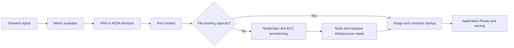
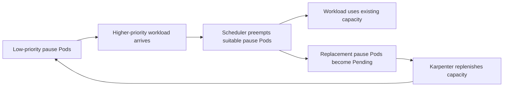
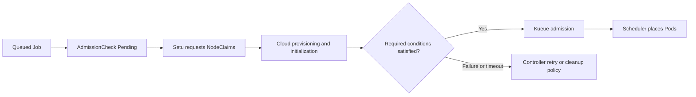

## 개요

EKS의 확장은 메트릭 수집, 복제본 결정, 스케줄링, 노드 프로비저닝, 애플리케이션 준비로 구성됩니다. 이 문서는 Karpenter v1.13 API를 기준으로 각 단계를 측정하고 대기열, 기본 용량, 오버프로비저닝을 조합하는 방법을 설명합니다. 예제의 용량·주기는 튜닝 시작점이며 처리량이나 지연 시간의 서비스 보장이 아닙니다.

새 노드가 필요한 경로와 기존 여유 용량을 사용하는 경로를 별도로 측정합니다. EC2 용량, 이미지, 초기화, HPA 주기와 부하 조건을 기록하고 각 단계의 지연 분포를 비교합니다. [HPA](https://kubernetes.io/docs/tasks/run-application/horizontal-pod-autoscale/)와 [Karpenter](https://karpenter.sh/v1.13/concepts/nodepools/)의 책임 범위를 구분합니다.

## 스케일링 전략 의사결정 프레임워크

트래픽 예측 가능성, 동기 응답 필요성, 대기 허용 시간, 기본 용량 비용을 먼저 평가합니다. 예측형·반응형 확장과 완충 설계를 조합하되, 어느 접근법이 더 저렴한지는 부하 시험과 비용 계산으로 판단합니다.

### 접근법별 비교

각 접근법은 서로 다른 지연 구간을 줄입니다.

| 접근법 | 작동 방식 | 남는 지연 | 적합한 조건 |
| --- | --- | --- | --- |
| 반응형 | KEDA/HPA → Karpenter | 관측·제어 루프·노드 시작 | 예측 불가능한 수요 |
| 예측형 | KEDA cron 등으로 사전 확장 | 예측 오차와 이미지 준비 | 반복되는 일정 |
| 복원력 | 대기열·제한·재시도 | 큐 대기 시간 | 비동기 처리 가능 |
| 기본 용량 | 필요한 복제본을 미리 실행 | 예상 용량을 넘는 수요 | 응답 지연 예산이 짧음 |

### 접근법별 비용 구조 비교

비교할 비용은 예약 노드 시간, 실제 노드 시간, 메트릭·수집기·스토리지·전송, 운영 인력 및 업무 손실입니다. 클러스터 수만으로 월 비용이나 ROI를 산출하지 않습니다. 아래는 가격표가 아닌 산식입니다.

실제 시간별 노드 수와 해당 리전·구매 옵션의 요율을 사용하고 Savings Plans/RI 적용 범위, Spot 변동, Auto Mode 관리 요금을 별도로 반영합니다.

```text
monthly_compute = sum(node_count[t] * applicable_hourly_rate[t])
net_benefit = avoided_business_loss - incremental_compute - telemetry - operations
ROI = net_benefit / incremental_investment  # only when investment > 0
```

### 접근법 2: 예측형 스케일링

반복되는 피크에는 [KEDA cron scaler](https://keda.sh/docs/2.20/scalers/cron/)를 사용할 수 있습니다. CronHPA는 Kubernetes 내장 리소스가 아닙니다. 아래 예제는 KEDA CRD·컨트롤러와 `production/web-app` Deployment가 설치되어 있어야 합니다. 평일 서울 시간 08:30–19:00에는 최소 20개, 그 밖에는 최소 5개를 요청합니다. 다른 트리거를 함께 사용하면 HPA가 더 큰 복제본 요구량을 선택합니다.

```yaml
apiVersion: keda.sh/v1alpha1
kind: ScaledObject
metadata:
  name: scheduled-web-app
  namespace: production
spec:
  scaleTargetRef:
    name: web-app
  minReplicaCount: 5
  maxReplicaCount: 100
  triggers:
    - type: cron
      metadata:
        timezone: Asia/Seoul
        start: "30 8 * * 1-5"
        end: "0 19 * * 1-5"
        desiredReplicas: "20"
```

### 접근법 3: 아키텍처적 복원력

대기열은 확장 지연을 큐 대기 시간으로 바꿉니다. 메시지 보존 기간, visibility timeout, 재시도·DLQ, 멱등성, 처리율 및 최대 허용 대기 시간을 함께 설계합니다. 동기 API에는 timeout, rate limit, circuit breaker와 부하 차단을 적용합니다. 큐 사용만으로 실패나 데이터 손실이 사라지지는 않습니다.

[SQS scaler](https://keda.sh/docs/2.20/scalers/aws-sqs/)에는 큐 접근 권한과 인증 구성이 필요합니다. 큐별 목표 길이는 실제 메시지 처리 시간으로 산정하며, Istio/Envoy 정책은 해당 버전의 API로 별도 배포합니다.

### 접근법 4: 적정 기본 용량

기본 용량은 부하 시험으로 확인한 복제본당 처리량과 장애 여유분으로 계산합니다. 다음 HPA는 기존 Deployment와 Metrics Server를 대상으로 합니다. Deployment의 각 컨테이너에 CPU requests가 있어야 사용률을 계산할 수 있습니다. 이 예제와 KEDA가 같은 Deployment를 동시에 관리하지 않도록 하나를 선택합니다.

```yaml
apiVersion: autoscaling/v2
kind: HorizontalPodAutoscaler
metadata:
  name: web-app-hpa
  namespace: production
spec:
  scaleTargetRef:
    apiVersion: apps/v1
    kind: Deployment
    name: web-app
  minReplicas: 5
  maxReplicas: 100
  metrics:
    - type: Resource
      resource:
        name: cpu
        target:
          type: Utilization
          averageUtilization: 60
  behavior:
    scaleUp:
      stabilizationWindowSeconds: 0
      policies:
        - type: Percent
          value: 100
          periodSeconds: 15
      selectPolicy: Max
    scaleDown:
      stabilizationWindowSeconds: 300
      policies:
        - type: Percent
          value: 10
          periodSeconds: 60
```

## 기존 오토스케일링의 문제점

확장 지연은 CPU 메트릭만의 문제가 아닙니다. 메트릭 발행·수집 지연, 제어 루프, 스케줄링 제약, EC2 용량, IP 할당, 이미지 다운로드, 초기화 및 readiness probe를 분리해 관측합니다. CPU도 유용한 포화 지표이며 대기열 길이·요청률은 부하 특성에 따라 보완 지표가 됩니다.

## Karpenter의 노드 공급 경로 {#karpenter-혁명-direct-to-metal-프로비저닝}

Karpenter는 Pending Pod의 요구사항을 바탕으로 NodeClaim을 생성하고 EC2 용량을 요청합니다. 자체 관리형 Karpenter는 노드 그룹별 ASG를 요구하지 않습니다. Drift는 모든 설정 변경에 대해 즉시 교체를 보장하지 않으며, 탐지 조건과 중단 예산·PDB를 함께 평가합니다. [프로비저닝](https://karpenter.sh/v1.13/concepts/nodepools/)과 [Drift](https://karpenter.sh/v1.13/concepts/disruption/#drift)를 참고합니다.

## 고속 메트릭 아키텍처: 두 가지 접근 방식

CloudWatch와 Prometheus 모두 확장에 사용할 수 있지만 수집 주기, API 할당량, 인증, 저장 비용, 운영 책임이 다릅니다. 동일 부하와 동일한 시작·종료 이벤트로 비교합니다.

### 방식 1: CloudWatch High-Resolution Integration

고해상도는 사용자 정의 메트릭의 저장 해상도입니다. 기존 AWS 서비스 메트릭의 발행 주기를 자동으로 단축하지 않습니다. 특히 ALB CloudWatch 메트릭은 60초 간격으로 발행됩니다. [ALB 메트릭](https://docs.aws.amazon.com/elasticloadbalancing/latest/application/load-balancer-cloudwatch-metrics.html)을 참고합니다.

#### 주요 구성 요소

애플리케이션은 PutMetricData 또는 EMF 로그로 메트릭을 발행하고, KEDA CloudWatch scaler나 별도 adapter가 이를 읽습니다. IAM 권한, dimensions, 통계 구간을 맞춰야 합니다. EMF는 로그 수집·추출 경로이며 PutMetricData 호출과 동일한 경로로 묘사하지 않습니다.

#### 스케일링 타임라인

발행, 수집, 조회, HPA 조정, Pod 생성, 노드·컨테이너 준비 시각을 기록합니다. 고해상도 저장도 end-to-end 가시성이나 즉시 HPA 실행을 보장하지 않습니다. Pod 개수에 따른 보편적인 5,000개 상한은 없습니다. 계정·리전별 실제 할당량은 [CloudWatch Service Quotas](https://docs.aws.amazon.com/AmazonCloudWatch/latest/monitoring/cloudwatch_limits.html)에서 확인합니다.

### 방식 2: ADOT + Prometheus 기반 아키텍처

ADOT/Prometheus 경로는 scrape 대상과 보존·쿼리 구성을 직접 제어할 수 있습니다. 수집기 CPU/메모리, 시계열 cardinality, remote-write 처리량, 복제 및 장애 복구가 설계 대상입니다.

#### 주요 구성 요소

수집기 → Prometheus 또는 원격 저장소 → KEDA scaler → HPA의 경로를 구성합니다. Thanos와 Mimir는 선택 사항이며 동시에 필수인 구성 요소가 아닙니다. [KEDA polling과 HPA 주기](https://keda.sh/docs/2.20/reference/scaledobject-spec/)는 서로 다릅니다.

#### 메트릭 수집과 확장 지연 분석 {#스케일링-타임라인-66초}

scrape 간격, remote-write 지연, 쿼리 시간, HPA 주기, Pod 준비 시간을 합산한 분포를 측정합니다. 이 경로가 66초, 100,000 TPS 또는 20,000 Pod를 보장하지 않습니다. 자체 운영 비용에는 저장소 외에도 compute, HA, 네트워크와 운영 인력이 포함됩니다.

### 비용 최적화 메트릭 전략

확장에 필요한 소수의 지표만 높은 빈도로 수집하고 진단용 지표는 요구되는 해상도로 수집합니다. 시계열 수는 지표 이름 수가 아니라 label/dimension 조합으로 계산합니다. 수집 빈도 변경 전후의 비용과 탐지 정확도를 측정합니다.

### 권장 사용 사례

AWS 통합·운영 단순성이 중요하면 CloudWatch를, PromQL·수집 제어·공용 관측성 기반이 중요하면 Prometheus 경로를 평가합니다. 선택 기준은 Pod 수의 임의 경계가 아니라 실제 처리량, 지연 예산, 비용과 팀의 운영 역량입니다.

## 스케일링 최적화 아키텍처: 레이어별 분석

각 계층의 시작·종료 이벤트를 추적합니다. 다음 흐름에서 기존 여유 용량이 있으면 NodeClaim/EC2 경로를 건너뛸 수 있지만 이미지·애플리케이션 준비 시간은 남습니다.



## Karpenter 핵심 설정

유연한 인스턴스 선택, 정확한 requests, 충분한 IP·IAM·EC2 할당량을 먼저 확인합니다. 아래는 [v1.13 NodePool](https://karpenter.sh/v1.13/concepts/nodepools/)과 [EC2NodeClass](https://karpenter.sh/v1.13/concepts/nodeclasses/)의 구성 예제이며 특정 부팅 시간을 보장하지 않습니다.

### Karpenter NodePool YAML

[공식 설치 절차](https://karpenter.sh/v1.13/getting-started/getting-started-with-karpenter/)에 따라 컨트롤러 IAM, 노드 역할·클러스터 접근 및 interruption queue를 먼저 구성합니다. `EXAMPLE_CLUSTER`와 역할·태그를 실제 값으로 바꿉니다. `al2023@latest`는 실험용이며 운영에서는 검증한 AMI 버전으로 고정합니다.

`Gt: "5"`는 6세대 이상입니다. `m`은 범용, `r`은 메모리 최적화 계열입니다. limits는 무제한 soft hint가 아니지만 병렬 프로비저닝 중 일시 초과할 수 있습니다. AL2023의 nodeadm 설정은 Karpenter가 생성하므로 AL2의 `/etc/eks/bootstrap.sh`를 호출하지 않습니다.

```yaml
apiVersion: karpenter.sh/v1
kind: NodePool
metadata:
  name: fast-scaling
spec:
  template:
    spec:
      nodeClassRef:
        group: karpenter.k8s.aws
        kind: EC2NodeClass
        name: fast-nodepool
      expireAfter: 720h
      requirements:
        - key: kubernetes.io/arch
          operator: In
          values: [amd64]
        - key: karpenter.k8s.aws/instance-category
          operator: In
          values: [c, m, r]
        - key: karpenter.k8s.aws/instance-generation
          operator: Gt
          values: ["5"]
        - key: karpenter.sh/capacity-type
          operator: In
          values: [spot, on-demand]
  limits:
    cpu: "1000"
    memory: 4000Gi
  disruption:
    consolidationPolicy: WhenEmptyOrUnderutilized
    consolidateAfter: 1m
    budgets:
      - nodes: "10%"
---
apiVersion: karpenter.k8s.aws/v1
kind: EC2NodeClass
metadata:
  name: fast-nodepool
spec:
  amiSelectorTerms:
    - alias: al2023@latest
  role: KarpenterNodeRole-EXAMPLE_CLUSTER
  subnetSelectorTerms:
    - tags:
        karpenter.sh/discovery: EXAMPLE_CLUSTER
  securityGroupSelectorTerms:
    - tags:
        karpenter.sh/discovery: EXAMPLE_CLUSTER
```

## 실시간 스케일링 워크플로

Pod 생성부터 Ready까지를 하나의 시간으로만 집계하지 않습니다. NodeClaim 생성·Launched·Registered·Initialized, kube-scheduler 이벤트, 컨테이너 image pull·Started, readiness probe와 실제 트래픽 수신을 연관시킵니다. 기존 용량, 새 On-Demand, 새 Spot을 분리하면 병목이 드러납니다.

## 공격적 스케일링을 위한 HPA 구성

이 설정은 scale-up 안정화 지연을 없애지만 메트릭 지연과 HPA 제어 루프를 없애지 않습니다. 기본 HPA 동기화 주기는 15초이며 `behavior`는 그 주기를 변경하지 않습니다. 여러 메트릭은 임의 가중 평균이 아니라 가장 큰 복제본 요구량을 선택합니다. [HPA 동작](https://kubernetes.io/docs/tasks/run-application/horizontal-pod-autoscale/)을 참고합니다. 기존 `production/web-app`에 적용하는 대안 예제입니다.

```yaml
apiVersion: autoscaling/v2
kind: HorizontalPodAutoscaler
metadata:
  name: web-app-hpa
  namespace: production
spec:
  scaleTargetRef:
    apiVersion: apps/v1
    kind: Deployment
    name: web-app
  minReplicas: 5
  maxReplicas: 100
  metrics:
    - type: Resource
      resource:
        name: cpu
        target:
          type: Utilization
          averageUtilization: 60
  behavior:
    scaleUp:
      stabilizationWindowSeconds: 0
      policies:
        - type: Percent
          value: 100
          periodSeconds: 15
      selectPolicy: Max
    scaleDown:
      stabilizationWindowSeconds: 300
      policies:
        - type: Percent
          value: 10
          periodSeconds: 60
```

## KEDA 활용 시점: 이벤트 드리븐 시나리오

대기열·스트림·외부 요청률처럼 CPU만으로 표현하기 어려운 수요에는 KEDA scaler를 사용합니다. KEDA는 보통 HPA를 생성하고 메트릭을 제공하며, Karpenter는 Pending Pod를 위한 노드를 준비합니다. [ScaledObject](https://keda.sh/docs/2.20/reference/scaledobject-spec/)의 인증·fallback·cooldown 설정을 수요 특성에 맞춥니다.

## 검증 가능한 확장 측정 설계 {#프로덕션-성능-메트릭}

실측값은 다음 형식으로 수집합니다. 이 문서에는 검증된 운영 benchmark dataset이 없으므로 클러스터 수·요청 수·100% 가용성 수치를 측정 결과로 제시하지 않습니다.

| 지표 | 시작 → 종료 | 분리할 조건 |
| --- | --- | --- |
| 탐지 지연 | 부하 증가 → 조회 가능한 메트릭 | 수집 경로·주기 |
| 프로비저닝 지연 | NodeClaim 생성 → Initialized | 리전·AZ·인스턴스·구매 옵션 |
| 서비스 확장 지연 | 부하 증가 → 실제 처리 용량 증가 | 이미지 cache·readiness·부하 형태 |
| 운영 영향 | 시험 구간 전체 | P50/P95/P99·오류율·비용·표본 수 |

## 다중 리전 고려 사항

리전별 EC2 공급, quotas, IP·서브넷, AMI와 이미지 복제, 관측 경로를 검증합니다. 리전 간 동일한 인스턴스 목록이나 동기화 주기가 동일한 성능을 보장하지 않습니다. 장애 조치 목표 용량과 트래픽 전환을 실제 수요·SLO로 시험합니다.

## 스케일링 최적화 모범 사례

다음 순서로 구성과 관측을 검토합니다.

### 1. 메트릭 선택

부하를 설명하는 지표를 선택하고 cardinality를 제한합니다. CPU, 큐 길이, 처리 시간, 오류율을 함께 검토하며 high-resolution 지표 수를 고정된 10–15개 규칙으로 제한하지 않습니다.

### 2. Karpenter 최적화

NodePool의 인스턴스·AZ 선택 폭, workload requests, PDB와 중단 처리를 검토합니다. v1 API에서는 `disruption.consolidationPolicy`와 `consolidateAfter`를 사용하며 `ttlSecondsAfterEmpty`를 사용하지 않습니다. [중단 설정](https://karpenter.sh/v1.13/concepts/disruption/)을 참고합니다.

### 3. HPA 튜닝

maxReplicas를 downstream 용량과 함께 정하고 scale-up/down 정책을 시험합니다. 안정화 창을 줄이면 변동성이 증가할 수 있습니다. 여러 메트릭은 큰 요구량을 선택하며, 서로 다른 autoscaler를 같은 대상에 중복 연결하지 않습니다.

### 4. 모니터링

SLO에서 역산한 지연·오류율·큐 연령 임계값으로 경보를 설정합니다. P95뿐 아니라 P99, 실패·재시도, Spot interruption, 시간별 노드 비용과 controller 오류도 관측합니다. 보편적인 15초 실패 임계값은 없습니다.

## 일반적인 문제 해결

Pending Pod의 Events와 requests, affinity, taints, PVC를 먼저 확인한 뒤 NodePool/EC2NodeClass 조건과 NodeClaim 이벤트를 확인합니다. EC2 capacity 오류는 quotas, 특정 인스턴스/AZ 공급, subnet IP 고갈과 구분합니다. `describe-instance-type-offerings`는 지원 위치를 보여줄 뿐 실시간 여유 용량 확인 API가 아닙니다. 서브넷·NAU 예산과 인스턴스 크기 fallback 시 IP 소비의 정량 모델은 [IP 용량 계획과 Karpenter 노드 사이징](../networking-performance/ip-capacity-planning-karpenter.md)을 참조합니다.

```bash
kubectl get pods -n production --field-selector=status.phase=Pending
kubectl get nodepools,ec2nodeclasses,nodeclaims
kubectl describe nodepool fast-scaling
kubectl describe ec2nodeclass fast-nodepool
kubectl get events -n production --sort-by=.lastTimestamp
```

## 하이브리드 접근 방식 (권장)

서비스별 지연 예산과 운영 기반에 맞춰 CloudWatch와 Prometheus를 선택합니다. 같은 관측 데이터가 필요한 경우 수집을 재사용하되 중복 시계열과 요금을 확인합니다. 점진적으로 도입하고 공통 부하 시험으로 개선 여부를 판단합니다.

## EKS Auto Mode vs Self-managed Karpenter

[EKS Auto Mode](https://docs.aws.amazon.com/eks/latest/userguide/automode.html)는 노드·네트워킹·스토리지 등 인프라 관리 범위를 확장합니다. 자체 관리형 Karpenter와 API·AMI·접근 정책이 같지는 않습니다. Pod의 HPA/VPA 정책이나 애플리케이션 requests를 자동으로 생성·조정하는 기능으로 설명하지 않습니다. 관리 요금은 인스턴스별 요율을 확인하며 고정 10%로 계산하지 않습니다.

## 낮은 지연 시간을 위한 확장 설계 {#p1-초고속-스케일링-아키텍처-critical}

낮은 확장 지연을 목표로 하되 기존 용량과 신규 프로비저닝 경로를 구분합니다.

### 스케일링 지연 시간 분해 분석

각 요청의 부하 발생 시각, 메트릭 반영, replica 변경, Pod 생성, Ready, 트래픽 처리 시각을 수집합니다. 노드 이벤트를 연관시켜 시간이 어느 단계에 쓰였는지 확인하고 표본 수·실험 조건과 함께 백분위수를 공개합니다.

### 멀티 레이어 스케일링 전략

① 이미 실행 중인 복제본 ② 기존 노드의 여유 용량/낮은 우선순위 pause Pod ③ Karpenter 신규 프로비저닝을 구분합니다. Spot과 On-Demand 모두 공급 부족이 가능하며 On-Demand fallback은 가용성 보장이 아닙니다.

### 레이어별 스케일링 타임라인 비교

사전 용량은 EC2 시작 시간을 critical path에서 제외하지만 HPA 관측·제어, preemption, 이미지·readiness 시간은 남습니다. 신규 노드 경로는 EC2 및 bootstrap을 추가합니다. 세 경로의 분포를 따로 측정하고 수요·비용에 맞는 용량을 선택합니다.

## Provisioned Control Plane 선택과 검증 {#p2-provisioned-eks-control-plane으로-api-병목-제거}

API 처리량이 병목인지 확인한 뒤 control plane 용량을 선택합니다.

### Provisioned Control Plane 개요

[Provisioned Control Plane](https://docs.aws.amazon.com/eks/latest/userguide/eks-provisioned-control-plane-getting-started.html)은 scaling tier로 control plane 용량을 사전 할당합니다. API Priority and Fairness, client rate limits, webhook 지연, scheduler 및 etcd 부하는 별도로 조사해야 합니다. tier 선택이 모든 throttling이나 downstream 병목을 제거하지 않습니다.

### Standard vs Provisioned 비교

tier는 [공식 기능 설명](https://docs.aws.amazon.com/eks/latest/userguide/eks-provisioned-control-plane.html)과 [가격표](https://aws.amazon.com/eks/pricing/)를 기준으로 선택합니다. 임의의 Pod 수나 월 $350, 고정 10배 성능을 기준으로 삼지 않습니다.

| 기준 | Standard | Provisioned |
| --- | --- | --- |
| 용량 방식 | AWS 관리형 자동 확장 | 선택한 tier의 사전 용량 |
| 평가 지표 | API 지연·throttling·scheduler 대기 | 같은 부하로 tier별 측정 |
| 비용 판단 | 클러스터·버전 지원 요금 | 해당 tier 요금 추가 확인 |

### Provisioned Control Plane 설정

변경 전 현재 tier와 IAM 권한, 리전 지원 및 요율을 확인합니다. 아래 명령은 실행 안내이며 이 문서 검증에서는 클러스터를 생성·수정하지 않았습니다.

#### AWS CLI로 신규 클러스터 생성

[공식 CLI 예제](https://docs.aws.amazon.com/eks/latest/userguide/eks-provisioned-control-plane-getting-started.html)의 `--control-plane-scaling-config`를 사용합니다. `$CLUSTER_ROLE_ARN`, `$SUBNET_IDS`, `$SECURITY_GROUP_IDS`는 미리 생성·검증한 값이어야 합니다. 네트워크 접근 및 노드 구성을 별도로 준비합니다.

```bash
aws eks create-cluster --name "$CLUSTER_NAME"   --role-arn "$CLUSTER_ROLE_ARN"   --resources-vpc-config "subnetIds=$SUBNET_IDS,securityGroupIds=$SECURITY_GROUP_IDS"   --control-plane-scaling-config tier=tier-xl
```

#### 기존 클러스터 업그레이드 (Standard → Provisioned)

변경 요청은 비동기입니다. 반환된 update ID로 상태·오류를 확인하고 완료 후 API 지연과 workload 영향을 검증합니다. 고정 10–15분 완료나 무중단을 보장하지 않습니다. tier 변경·Standard 복귀 조건은 [현재 공식 절차](https://docs.aws.amazon.com/eks/latest/userguide/eks-provisioned-control-plane-getting-started.html)를 확인하고, 되돌릴 때도 지원되는 이전 tier로 별도 update를 수행합니다.

```bash
aws eks describe-cluster --name "$CLUSTER_NAME"   --query 'cluster.controlPlaneScalingConfig'
aws eks update-cluster-config --name "$CLUSTER_NAME"   --control-plane-scaling-config tier=tier-2xl
aws eks describe-update --name "$CLUSTER_NAME" --update-id "$UPDATE_ID"
```

### 대규모 버스트 시 성능 비교

동일한 Pod 수·생성 속도·admission webhook·watch 부하에서 tier 전후를 시험합니다. API 429, 요청 지연, scheduler pending 시간, 오류·재시도와 추가 비용을 기록합니다. 결과는 테스트 manifest, 리전, Kubernetes 버전, 표본 수와 함께 제시하며 1,000 Pod 시험의 실제 결과를 꾸며 제시하지 않습니다.

## P3: Warm Pool / Overprovisioning 패턴 (핵심 전략)

이 장의 Warm Pool은 실행 중인 Kubernetes 노드에 낮은 우선순위 Pod로 용량을 남겨 두는 오버프로비저닝입니다. EC2 Auto Scaling의 stopped/hibernated 인스턴스 Warm Pools와 다른 패턴입니다.

### Pause Pod Overprovisioning 원리

실제 workload보다 낮은 우선순위 pause Pod를 실행합니다. 용량이 필요하면 scheduler가 이 Pod를 선점하고 workload를 배치할 수 있습니다. [Pod priority/preemption](https://kubernetes.io/docs/concepts/scheduling-eviction/pod-priority-preemption/)은 즉시 실행이나 모든 제약 충족을 보장하지 않습니다. workload와 pause Pod의 NodePool·AZ·리소스 형태를 맞춥니다.

### Overprovisioning 전체 동작 흐름

pause Pod가 선점되면 Deployment가 대체 Pod를 생성하고, Pending pause Pod를 위해 Karpenter가 다시 용량을 확보할 수 있습니다. 반복적인 확장·축소가 생기는지 관찰하고 consolidation/PDB/affinity와 함께 조정합니다.



### Pause Pod Overprovisioning YAML 구성

아래 세 리소스는 예제 용량을 사용합니다. 실제 workload는 우선순위 0 이상이고 같은 노드 풀에 배치될 수 있어야 합니다. pause Pod 수를 피크 수요의 고정 비율로 해석하지 않습니다.

#### 1. PriorityClass 정의 (낮은 우선순위)

선점 대상 pause Pod 전용 PriorityClass입니다. 실제 workload 우선순위가 이 값보다 높은지 확인합니다.

```yaml
apiVersion: scheduling.k8s.io/v1
kind: PriorityClass
metadata:
  name: overprovisioning
value: -1
globalDefault: false
description: "Preemptible capacity reservation for higher-priority workloads"
```

#### 2. Pause Deployment (기본 Warm Pool)

10개 Pod가 각각 1 CPU·2Gi를 요청하는 예제입니다. NodePool은 앞의 `fast-scaling`을 사용합니다. 운영 예약 용량은 실제 수요·조각화·AZ별 가용성을 측정해 결정합니다.

```yaml
apiVersion: apps/v1
kind: Deployment
metadata:
  name: overprovisioning-pause
  namespace: kube-system
spec:
  replicas: 10
  selector:
    matchLabels:
      app: overprovisioning-pause
  template:
    metadata:
      labels:
        app: overprovisioning-pause
    spec:
      priorityClassName: overprovisioning
      terminationGracePeriodSeconds: 0
      nodeSelector:
        karpenter.sh/nodepool: fast-scaling
      containers:
        - name: pause
          image: registry.k8s.io/pause:3.10
          resources:
            requests:
              cpu: "1"
              memory: 2Gi
            limits:
              cpu: "1"
              memory: 2Gi
```

#### 3. 시간대별 Warm Pool 자동 조정 (CronJob)

평일 서울 시간으로 확장·축소하며 금요일 저녁의 최소 용량이 주말에도 유지됩니다. CronJob 실패·missed schedule을 경보로 감시합니다. kubectl 이미지는 예제 버전이며 클러스터와 지원되는 version skew 및 이미지 접근을 확인합니다. 이 Deployment를 HPA/KEDA와 동시에 조정하지 않습니다.

```yaml
apiVersion: batch/v1
kind: CronJob
metadata:
  name: scale-up-warm-pool
  namespace: kube-system
spec:
  schedule: "30 8 * * 1-5"
  timeZone: Asia/Seoul
  concurrencyPolicy: Forbid
  jobTemplate:
    spec:
      template:
        spec:
          serviceAccountName: warm-pool-scaler
          restartPolicy: OnFailure
          containers:
            - name: kubectl
              image: registry.k8s.io/kubectl:v1.33.5
              command: [kubectl]
              args: [scale, deployment/overprovisioning-pause, --namespace=kube-system, --replicas=30]
---
apiVersion: batch/v1
kind: CronJob
metadata:
  name: scale-down-warm-pool
  namespace: kube-system
spec:
  schedule: "0 19 * * 1-5"
  timeZone: Asia/Seoul
  concurrencyPolicy: Forbid
  jobTemplate:
    spec:
      template:
        spec:
          serviceAccountName: warm-pool-scaler
          restartPolicy: OnFailure
          containers:
            - name: kubectl
              image: registry.k8s.io/kubectl:v1.33.5
              command: [kubectl]
              args: [scale, deployment/overprovisioning-pause, --namespace=kube-system, --replicas=5]
---
apiVersion: v1
kind: ServiceAccount
metadata:
  name: warm-pool-scaler
  namespace: kube-system
---
apiVersion: rbac.authorization.k8s.io/v1
kind: Role
metadata:
  name: warm-pool-scaler
  namespace: kube-system
rules:
  - apiGroups: [apps]
    resources: [deployments, deployments/scale]
    resourceNames: [overprovisioning-pause]
    verbs: [get, patch, update]
---
apiVersion: rbac.authorization.k8s.io/v1
kind: RoleBinding
metadata:
  name: warm-pool-scaler
  namespace: kube-system
roleRef:
  apiGroup: rbac.authorization.k8s.io
  kind: Role
  name: warm-pool-scaler
subjects:
  - kind: ServiceAccount
    name: warm-pool-scaler
    namespace: kube-system
```

### Warm Pool 크기 계산 방법

복제본당 CPU·메모리, 확장 완료 전 유입되는 추가 수요, AZ·affinity 제약과 안전 여유분을 입력으로 계산합니다. 예를 들어 20개의 추가 workload Pod가 각각 1 CPU·2Gi를 요구하면 최소 20 CPU·40Gi에 배치 여유분을 더합니다. 실제 노드 단위 반올림과 fragmentation 때문에 Pod 수만으로 요금을 계산하지 않습니다.

### 비용 분석 및 최적화

순증 노드 시간으로 비용을 계산합니다. 예를 들어 시간당 $0.20이라고 **가정한** 노드 3개를 하루 12시간, 월 22일 추가 운영하면 compute 비용은 `3 × 0.20 × 12 × 22 = $158.40`입니다. 이 요율은 AWS 견적이 아니며 실제 과금에는 구매 옵션·할인·telemetry 등을 반영합니다.

예약 용량과 실행 중인 기본 복제본은 이미지·애플리케이션 준비 상태가 달라 같은 금액으로 동일한 효과를 낸다고 가정할 수 없습니다. Spot 예약 용량은 interruption으로 사라질 수 있습니다.

## P4: Setu - Kueue + Karpenter 프로액티브 프로비저닝

Setu는 별도 프로젝트로 평가하며 Kueue 또는 Karpenter의 기본 내장 기능으로 다루지 않습니다.

### Setu 개요

[Setu 프로젝트](https://github.com/sanjeevrg89/Setu)는 Kueue AdmissionCheck와 Karpenter NodeClaim을 연결합니다. 반면 [Kueue ProvisioningRequest](https://kueue.sigs.k8s.io/docs/concepts/admission_check/provisioning_request/)의 내장 경로는 Cluster Autoscaler용입니다. 선택한 Setu release/commit의 구현과 지원 버전을 검토해야 합니다.

여러 NodeClaim 생성은 Kubernetes API의 단일 원자적 트랜잭션이 아닙니다. 부분 성공·재시도·cleanup을 시험하고, 모든 노드가 Ready여도 동시 Pod 스케줄링이나 GPU 유휴 과금 0을 보장하지 않습니다.

### Setu 아키텍처 및 동작 원리

Workload의 AdmissionCheck가 Pending인 동안 컨트롤러가 NodeClaim을 생성하고 필요한 조건을 확인한 후 admission을 승인합니다. 큐 대기 시간과 노드 프로비저닝 시간이 겹칠 수 있지만 EC2 준비 시간을 삭제하거나 총 시간을 무조건 줄이지는 않습니다.



### Setu 설치 및 구성

Kueue, Karpenter, GPU 드라이버/device plugin, IAM, subnet 및 노드 역할을 먼저 검증합니다. Setu의 controllerName·NodeClass 선택·readiness 판정·재시도 정책은 선택한 버전의 manifest와 코드에 맞춥니다.

#### Setu 구성 요소와 설치 전 검토 {#1-setu-설치-helm}

기존의 `setu.sh` Helm 저장소와 가상의 values를 사용하지 않습니다. [프로젝트 설치 문서](https://github.com/sanjeevrg89/Setu)를 따라 검토한 release/commit의 배포 manifest를 사용하고 CRD·RBAC·이미지·controllerName을 확인합니다. upstream Kueue/Karpenter와 별도로 설치·업그레이드·복구 책임을 운영자가 부담합니다.

#### 2. ClusterQueue with AdmissionCheck

아래는 Kueue v0.16+의 v1beta2 리소스 구조입니다. 설치된 Setu가 제공하는 `karpenter-provision` AdmissionCheck가 Active여야 합니다. 가상의 `ProvisioningParameters` CRD는 만들지 않습니다. `gpu` ResourceFlavor의 label은 다음 GPU NodePool과 일치합니다. 실제 클러스터의 Kueue served API를 먼저 확인합니다.

```yaml
apiVersion: kueue.x-k8s.io/v1beta2
kind: ResourceFlavor
metadata:
  name: gpu
spec:
  nodeLabels:
    karpenter.sh/nodepool: gpu
---
apiVersion: kueue.x-k8s.io/v1beta2
kind: ClusterQueue
metadata:
  name: gpu-jobs
spec:
  namespaceSelector: {}
  resourceGroups:
    - coveredResources: [cpu, memory, nvidia.com/gpu]
      flavors:
        - name: gpu
          resources:
            - name: cpu
              nominalQuota: "32"
            - name: memory
              nominalQuota: 128Gi
            - name: nvidia.com/gpu
              nominalQuota: "4"
  admissionChecksStrategy:
    admissionChecks:
      - name: karpenter-provision
---
apiVersion: kueue.x-k8s.io/v1beta2
kind: LocalQueue
metadata:
  name: gpu-jobs
  namespace: production
spec:
  clusterQueue: gpu-jobs
```

#### 3. GPU NodePool (Karpenter)

AMI ID·리전·아키텍처·Kubernetes 버전·GPU 드라이버를 확인한 뒤 placeholder를 교체합니다. AL2023 계열 이름만으로 모든 GPU 도구가 설치되어 있다고 가정하지 않습니다. device plugin과 필수 DaemonSet은 GPU taint를 허용해야 합니다. capacity-type 목록의 순서가 구매 비율이나 가용성을 보장하지 않습니다.

```yaml
apiVersion: karpenter.sh/v1
kind: NodePool
metadata:
  name: gpu
spec:
  template:
    spec:
      nodeClassRef:
        group: karpenter.k8s.aws
        kind: EC2NodeClass
        name: gpu
      requirements:
        - key: node.kubernetes.io/instance-type
          operator: In
          values: [g5.4xlarge, g5.8xlarge]
        - key: karpenter.sh/capacity-type
          operator: In
          values: [spot, on-demand]
      taints:
        - key: nvidia.com/gpu
          effect: NoSchedule
  limits:
    cpu: "128"
  disruption:
    consolidationPolicy: WhenEmpty
    consolidateAfter: 5m
---
apiVersion: karpenter.k8s.aws/v1
kind: EC2NodeClass
metadata:
  name: gpu
spec:
  amiFamily: AL2023
  amiSelectorTerms:
    - id: ami-0123456789abcdef0
  role: KarpenterNodeRole-EXAMPLE_CLUSTER
  subnetSelectorTerms:
    - tags:
        karpenter.sh/discovery: EXAMPLE_CLUSTER
  securityGroupSelectorTerms:
    - tags:
        karpenter.sh/discovery: EXAMPLE_CLUSTER
```

#### 4. AI/ML Job 제출 예시

이 예제는 하나의 진단 Job에서 Pod 4개를 실행하며, Pod당 GPU 1개로 총 GPU 4개를 요청합니다. 분산 학습이나 gang scheduling을 구현한 예제가 아닙니다. 학습에는 프레임워크의 rendezvous, 동기화, 장애 복구와 별도 scheduling 보장을 검증해야 합니다. `suspend: true`는 Kueue admission을 기다립니다.

```yaml
apiVersion: batch/v1
kind: Job
metadata:
  name: gpu-diagnostic
  namespace: production
  labels:
    kueue.x-k8s.io/queue-name: gpu-jobs
spec:
  suspend: true
  parallelism: 4
  completions: 4
  backoffLimit: 1
  template:
    spec:
      restartPolicy: Never
      tolerations:
        - key: nvidia.com/gpu
          operator: Exists
          effect: NoSchedule
      containers:
        - name: diagnostic
          image: nvidia/cuda:12.4.1-base-ubuntu22.04
          command: [nvidia-smi]
          resources:
            requests:
              cpu: "4"
              memory: 16Gi
              nvidia.com/gpu: "1"
            limits:
              cpu: "4"
              memory: 16Gi
              nvidia.com/gpu: "1"
```

### Setu 성능 개선 측정

Job 제출 → quota 예약 → NodeClaim 생성 → 노드 초기화 → admission → 모든 Pod Ready/작업 완료를 기록합니다. 부분 실패와 cleanup 후 남은 NodeClaim·EC2·과금을 확인합니다. 반응형 경로와 총 소요 시간 및 GPU별 유휴 초를 비교하며 15–30초 완료·40초 단축·유휴 비용 제거를 보장하지 않습니다.

## Node Readiness Controller: 준비 조건 기반 배치 {#p5-node-readiness-controller로-부팅-지연-제거}

NRC는 workload 배치의 준비 조건을 추가하는 도구입니다. 노드 부팅 시간을 줄이는 기능으로 해석하지 않습니다.

### Node Readiness 문제

kubelet의 Node Ready는 모든 DaemonSet의 완료를 기다리는 종합 상태가 아닙니다. GPU driver, CNI의 추가 조건, storage 또는 이미지 준비가 workload에 필요하면 별도의 상태 발행기와 스케줄링 제어가 필요합니다.

### Node Readiness Controller 원리

[NRC](https://github.com/kubernetes-sigs/node-readiness-controller)는 NodeReadinessRule의 Node conditions를 확인하고 지정된 taint를 적용·제거합니다. 상태를 직접 탐지하지 않으며 kubelet의 Ready 의미를 우회하지 않습니다. `bootstrap-only`는 최초 준비 이후 감시를 종료하고 `continuous`는 지속적으로 조건을 평가합니다. NoSchedule taint는 새 배치를 제한하며 기존 Pod를 자동 eviction하지 않습니다.

### Node Readiness Controller 설치

NRC는 별도로 설치하는 kubernetes-sigs 프로젝트이며 초기 API의 지원 범위를 [프로젝트 문서](https://github.com/kubernetes-sigs/node-readiness-controller)에서 확인합니다. Karpenter feature gate나 EKS Auto Mode 내장 기능으로 활성화하는 것이 아닙니다.

#### 추가 readiness 조건과 taint 동작 {#1-nrc-설치-helm}

[공식 저장소](https://github.com/kubernetes-sigs/node-readiness-controller)의 검토한 release에서 CRD, controller, validation webhook, RBAC 설치 절차를 따릅니다. 검증되지 않은 Helm 저장소를 제시하지 않습니다. Node Feature Discovery는 필수 의존성이 아니며 label만으로 필요한 Node condition이 발행되지 않습니다. controller와 상태 발행기가 제어 대상 taint로 막히지 않도록 배치합니다.

#### Node Readiness Controller 도입 요건 {#2-nodereadinessrule-crd-정의}

이 리소스는 CRD 정의가 아니라 설치된 CRD의 인스턴스입니다. `example.com/CNIReady`는 사용자 정의 condition이며 Amazon VPC CNI가 자동으로 발행한다고 가정하지 않습니다. 해당 Node의 실제 준비 상태를 검증해 condition을 발행하는 구성 요소가 있어야 taint가 제거됩니다.

```yaml
apiVersion: readiness.node.x-k8s.io/v1alpha1
kind: NodeReadinessRule
metadata:
  name: network-readiness-rule
spec:
  conditions:
    - type: example.com/CNIReady
      requiredStatus: "True"
  taint:
    key: readiness.k8s.io/NetworkReady
    effect: NoSchedule
    value: pending
  enforcementMode: bootstrap-only
  nodeSelector:
    matchLabels:
      readiness.example.com/profile: network
```

### Karpenter와 startup taint 연동 {#karpenter--nrc-통합-구성}

노드 등록부터 rule 평가까지의 경쟁 구간을 막으려면 Karpenter startupTaints에 같은 key·value·effect를 설정합니다. Karpenter는 외부 구성 요소가 이 taint를 제거할 것으로 기대합니다. 실제 상태 발행기, NRC 및 필수 DaemonSet의 toleration을 함께 검증합니다.

#### 사용자 정의 condition 기반 구성 예제 {#1-karpenter-nodepool-with-nrc-annotation}

앞의 `fast-nodepool` EC2NodeClass를 참조하는 별도 NodePool 예제입니다. 실제 네트워크 준비가 확인되지 않으면 workload가 계속 Pending인 것이 의도된 동작입니다. 기능이 확인되지 않은 NRC annotation이나 bootstrap shell 명령을 추가하지 않습니다.

```yaml
apiVersion: karpenter.sh/v1
kind: NodePool
metadata:
  name: readiness-gated
spec:
  template:
    metadata:
      labels:
        readiness.example.com/profile: network
    spec:
      nodeClassRef:
        group: karpenter.k8s.aws
        kind: EC2NodeClass
        name: fast-nodepool
      startupTaints:
        - key: readiness.k8s.io/NetworkReady
          value: pending
          effect: NoSchedule
      requirements:
        - key: karpenter.sh/capacity-type
          operator: In
          values: [on-demand]
  limits:
    cpu: "100"
```

#### 상태 발행기 검증과 진단 {#2-vpc-cni-readiness-rule-상세-설정}

사용자 정의 상태 발행기는 실제 CNI 연결성을 확인하고 Node status condition을 갱신할 수 있는 최소 권한이 필요합니다. 예제 condition 이름을 설치만으로 지원되는 기능으로 취급하지 않습니다. 다음 read-only 조회로 rule의 조건·taint·대상을 비교합니다.

```bash
kubectl get nodereadinessrules network-readiness-rule -o yaml
kubectl get nodes -l readiness.example.com/profile=network -o json   | jq '.items[] | {name: .metadata.name, taints: .spec.taints, conditions: .status.conditions}'
```

### 준비 상태 검증과 운영 주의점 {#nrc-성능-비교}

NRC의 성과는 Node Ready 시간 50% 단축이 아니라 준비 전 배치 실패율, taint 대기 시간, 상태 발행·제거 지연으로 측정합니다. 필수 조건을 추가하면 첫 배치가 늦어질 수 있습니다. GPU allocatable, CNI 연결성, CSI 등록·volume attach/mount를 각각 시험합니다.

Pod schedulingGates는 외부 컨트롤러가 제거해야 합니다. 임의 label affinity나 Pod 내부 `/var/lib/kubelet` 파일 확인은 CSI 준비의 일반적인 대체 수단이 아닙니다. 실패 복구 시 검증 없이 taint를 제거하지 말고 상태 발행기와 rule을 먼저 조사합니다.

## 결론

Karpenter는 노드 공급을, HPA/KEDA는 복제본 수를, NRC는 추가 배치 준비 조건을 담당합니다. 기본 용량과 오버프로비저닝은 신규 EC2 대기 시간을 줄이는 대가로 비용을 추가합니다. control plane tier, 대기열, 이미지 최적화는 측정한 병목에 맞춰 선택합니다. 특정 조합이 모든 장애를 해결하거나 일정한 확장 시간을 보장하지 않습니다.

### 종합 권장사항

먼저 requests·scheduling 제약·IAM·IP 용량을 정리하고, 부하와 메트릭을 관측합니다. 이어 HPA/KEDA를 조정하고 대기열·부하 차단을 검토합니다. 기존 용량의 이점이 비용을 정당화할 때 오버프로비저닝을 도입하며, 별도 controller는 설치·업그레이드·장애 복구까지 평가합니다.

## EKS Auto Mode 완전 가이드

EKS Auto Mode는 노드 컴퓨팅, 네트워크 및 스토리지의 일부 운영을 AWS가 관리하는 방식입니다. 애플리케이션 requests, replica 정책, 가용성 설계와 비용 검토는 여전히 사용자가 담당합니다. 아래 예제는 Auto Mode와 자체 운영 Karpenter의 API를 구분하며, 동일한 확장 시간이나 고정된 관리 수수료 비율을 가정하지 않습니다.

### Managed Karpenter: 자동 인프라 관리

Auto Mode는 AWS가 관리하는 노드 OS와 Karpenter 기반 컴퓨팅 관리를 제공합니다. 자체 운영 Karpenter처럼 임의 AMI나 bootstrap 스크립트를 지정하는 모델이 아닙니다. 클러스터 IAM 역할, 노드 역할과 필요한 권한을 준비해야 하며, Auto Mode를 활성화했다고 HPA/VPA나 애플리케이션의 requests가 자동 구성되지는 않습니다. 노드 교체와 disruption의 현재 제약도 확인해야 합니다. [공식 기능 범위](https://docs.aws.amazon.com/eks/latest/userguide/automode.html)를 기준으로 선택합니다.

### Auto Mode vs Self-managed 상세 비교

운영 책임과 확장 API를 기준으로 비교합니다.

| 항목 | EKS Auto Mode | 자체 운영 Karpenter |
| --- | --- | --- |
| 노드 클래스 | eks.amazonaws.com/NodeClass | karpenter.k8s.aws/EC2NodeClass |
| 노드 OS/AMI | AWS 관리 OS; 지원되는 NodeClass 설정 | 지원되는 AMI family와 사용자 관리 AMI |
| 컨트롤러 운영 | AWS 관리 | 설치·권한·업그레이드·관측을 사용자 관리 |
| Pod 복제본/requests | HPA/KEDA/VPA를 별도 설계 | HPA/KEDA/VPA를 별도 설계 |
| 비용 | EC2 및 해당 Auto Mode 요금과 관련 서비스 비용 | EC2 및 컨트롤러·관련 서비스 비용 |
| 확장 지연 | 워크로드·용량·준비 경로별 측정 | 워크로드·용량·준비 경로별 측정 |

### Auto Mode 확장 경로 측정 {#auto-mode에서-초고속-스케일링-방법}

Auto Mode에서도 확장 시간은 메트릭 감지, replica 증가, 노드 공급, 이미지 준비와 readiness의 합으로 측정합니다. 관리형 컨트롤러라는 이유만으로 기존 환경보다 빠르거나 p99 시간이 일정하다고 판단하지 않습니다. 기본 NodePool은 AWS가 관리하므로 별도 워크로드 정책은 사용자 정의 NodePool로 표현합니다.

### Built-in NodePool 구성

기본 `system` 및 `general-purpose` NodePool을 활성화한 클러스터에서 다음 조회로 실제 설정을 확인합니다. 기본 풀의 정의를 덮어쓰는 YAML이 아닙니다. 기본 풀의 활성화 여부는 EKS 설정으로 관리하고, 별도 요구 사항은 새 NodePool에 둡니다. Pod의 nodeSelector·affinity·toleration과 기존 풀의 겹침도 확인합니다.

```bash
kubectl get nodepools system general-purpose -o yaml
kubectl get nodeclasses.eks.amazonaws.com -o yaml
```

### Self-managed → Auto Mode 마이그레이션 가이드

기존 클러스터 활성화 전에 [공식 전환 절차](https://docs.aws.amazon.com/eks/latest/userguide/auto-enable-existing.html)에 따라 클러스터 IAM 정책, `sts:TagSession` 신뢰 정책, 노드 역할 및 네트워크·스토리지 전제 조건을 준비합니다. 다음 명령의 `CLUSTER_NAME`은 대상 클러스터 이름입니다. compute, load balancing 및 block storage는 같은 요청에서 활성화합니다. 기본 풀을 사용할 경우 노드 역할과 풀 구성도 공식 절차대로 지정합니다.

활성화는 기존 노드와 워크로드를 즉시 마이그레이션하지 않습니다. 먼저 canary를 배치하고 이미지, 서비스 노출, PVC, AZ 제약, PDB 및 종료 동작을 검증한 뒤 점진적으로 이동합니다. 복구할 기존 용량을 유지하며 검증 전에 기존 NodeGroup을 삭제하지 않습니다.

```bash
aws eks update-cluster-config --name "$CLUSTER_NAME"   --compute-config enabled=true   --kubernetes-network-config '{"elasticLoadBalancing":{"enabled":true}}'   --storage-config '{"blockStorage":{"enabled":true}}'
```

### Auto Mode 클러스터 생성 YAML

다음은 [eksctl Auto Mode 스키마](https://docs.aws.amazon.com/eks/latest/eksctl/auto-mode.html)를 사용하는 신규 클러스터 설정 예제입니다. 실행 전에 계정·리전, IAM 권한, eksctl 버전과 선택한 Kubernetes 버전의 리전 지원 여부를 확인합니다. `1.33`은 이 장의 예제 버전이며 최신 또는 모든 리전에서 지원되는 버전이라는 뜻이 아닙니다. 이 문서 검토에서 클러스터를 생성하지 않았습니다.

```yaml
apiVersion: eksctl.io/v1alpha5
kind: ClusterConfig
metadata:
  name: auto-mode-example
  region: us-east-1
  version: "1.33"
autoModeConfig:
  enabled: true
```

### Auto Mode NodePool 커스터마이징

다음 사용자 정의 풀은 활성화된 Auto Mode와 기존 `default` NodeClass를 전제로 합니다. [Auto Mode NodePool 설정](https://docs.aws.amazon.com/eks/latest/userguide/create-node-pool.html)의 지원 필드를 사용하며, 자체 운영 Karpenter의 EC2NodeClass와 혼합하지 않습니다. `workload-class: custom`을 요구하는 Pod를 별도로 구성합니다. 이 selector가 없는 Pod도 다른 조건을 충족하면 이 풀을 사용할 수 있으므로 강한 격리가 필요하면 taint/toleration도 설계합니다.

```yaml
apiVersion: karpenter.sh/v1
kind: NodePool
metadata:
  name: custom-workloads
spec:
  template:
    metadata:
      labels:
        workload-class: custom
    spec:
      nodeClassRef:
        group: eks.amazonaws.com
        kind: NodeClass
        name: default
      requirements:
        - key: kubernetes.io/arch
          operator: In
          values: [amd64]
        - key: karpenter.sh/capacity-type
          operator: In
          values: [on-demand]
  limits:
    cpu: "100"
```

## Karpenter v1.x 최신 기능

이하 자체 운영 Karpenter 예제의 기준은 v1.13입니다. 설치된 CRD와 컨트롤러 버전을 함께 확인하고 해당 버전의 [NodePool](https://karpenter.sh/v1.13/concepts/nodepools/), [EC2NodeClass](https://karpenter.sh/v1.13/concepts/nodeclasses/), [disruption](https://karpenter.sh/v1.13/concepts/disruption/) 문서를 따릅니다. Auto Mode가 같은 시점에 동일한 필드나 feature gate를 제공한다고 추정하지 않습니다.

### Consolidation 정책: 속도 vs 비용

`WhenEmpty`는 빈 노드만, `WhenEmptyOrUnderutilized`는 빈 노드와 통합 가능한 저활용 노드를 대상으로 합니다. `consolidateAfter`는 관련 Pod 변경 이후의 대기 시간이며 일정한 절감률이나 정확한 삭제 시각이 아닙니다. 다음 전체 NodePool 예제는 앞서 생성한 `fast-nodepool` EC2NodeClass를 참조합니다. 짧은 지연은 churn을 늘릴 수 있으므로 PDB, 시작 시간 및 부하 변동을 함께 평가합니다. [정책 의미](https://karpenter.sh/v1.13/concepts/disruption/)

```yaml
apiVersion: karpenter.sh/v1
kind: NodePool
metadata:
  name: conservative-consolidation
spec:
  template:
    spec:
      nodeClassRef:
        group: karpenter.k8s.aws
        kind: EC2NodeClass
        name: fast-nodepool
      requirements:
        - key: kubernetes.io/arch
          operator: In
          values: [amd64]
  disruption:
    consolidationPolicy: WhenEmptyOrUnderutilized
    consolidateAfter: 5m
    budgets:
      - nodes: "10%"
```

### Disruption Budgets: Burst 트래픽 시 설정

다음은 기존 NodePool에 병합할 **`spec.disruption` 설정 조각**이며 독립 Kubernetes 리소스가 아닙니다. 적용 가능한 budget 중 가장 제한적인 값이 사용됩니다. 일정은 UTC 기준이며, 아래 평일 00:00–09:00 UTC 동안 Underutilized와 Drift 중단을 0으로 제한합니다. Empty에는 기본 10%가 적용됩니다. 이 설정은 노드를 미리 확장하지 않으며 expiry, interruption, 수동 삭제 등 모든 강제 중단을 차단하는 장치도 아닙니다. [budget 규칙](https://karpenter.sh/v1.13/concepts/disruption/)

```yaml
spec:
  disruption:
    consolidationPolicy: WhenEmptyOrUnderutilized
    consolidateAfter: 5m
    budgets:
      - nodes: "10%"
      - nodes: "0"
        reasons: [Underutilized, Drifted]
        schedule: "0 0 * * 1-5"
        duration: 9h
```

### Drift Detection: 자동 노드 교체

Drift는 NodeClaim이 원하는 상태와 호환되지 않을 때 교체를 유도합니다. 문서화된 감지 대상에는 NodePool requirements 및 EC2NodeClass의 AMI·subnet·security group 선택 변경이 포함됩니다. requirements를 확장해 기존 노드가 계속 호환되면 반드시 drift가 발생하지는 않습니다. `weight`, `limits`, `disruption` 같은 동작 설정은 drift 대상이 아닙니다.

모든 `userData` 또는 block device 변경이 기존 노드를 즉시 교체한다고 보장하지 않습니다. 적용 버전의 [drift 규칙](https://karpenter.sh/v1.13/concepts/disruption/)을 확인하고, AMI를 검증한 버전으로 고정한 뒤 NodeClaim condition, budget, PDB 및 교체 노드 준비를 관측합니다. GitOps diff의 존재만으로 rollout 완료를 판단하지 않습니다.

### NodePool Weights: Spot → On-Demand Fallback

여러 호환 NodePool 중 **높은 weight가 우선**입니다. 다음 예제는 Spot 100, On-Demand 50으로 선호도를 표현합니다. weight는 Pod 분배 비율, Spot 가용성 또는 정해진 fallback 시간을 보장하지 않습니다. batch scheduling과 이미 존재하는 용량 때문에 낮은 weight 풀에 Pod가 배치될 수도 있습니다. 두 풀은 기존 `fast-nodepool` EC2NodeClass를 참조합니다. [weight 의미](https://karpenter.sh/v1.13/concepts/nodepools/)

```yaml
apiVersion: karpenter.sh/v1
kind: NodePool
metadata:
  name: preferred-spot
spec:
  weight: 100
  template:
    spec:
      nodeClassRef:
        group: karpenter.k8s.aws
        kind: EC2NodeClass
        name: fast-nodepool
      requirements:
        - key: karpenter.sh/capacity-type
          operator: In
          values: [spot]
---
apiVersion: karpenter.sh/v1
kind: NodePool
metadata:
  name: fallback-on-demand
spec:
  weight: 50
  template:
    spec:
      nodeClassRef:
        group: karpenter.k8s.aws
        kind: EC2NodeClass
        name: fast-nodepool
      requirements:
        - key: karpenter.sh/capacity-type
          operator: In
          values: [on-demand]
```

## 메트릭 수집 최적화

확장 메트릭은 단위, 집계 범위, timestamp, 지연 및 실패 시 동작까지 계약으로 정의합니다. 높은 수집 해상도가 원본 서비스의 게시 주기를 바꾸지는 않습니다. 동일 Deployment를 여러 HPA 또는 KEDA와 별도 HPA가 동시에 제어하지 않도록 합니다.

### KEDA와 Prometheus 확장 신호 {#keda--prometheus-event-driven-scaling-1-3초-반응}

다음 ScaledObject는 기존 `production/web-app`, 설치된 KEDA 및 접근 가능한 Prometheus를 전제로 합니다. query는 모든 Pod의 요청 counter를 초당 총 요청 수 한 값으로 집계합니다. threshold `100`은 목표 replica당 100 requests/s를 의미하며 실제 부하 시험으로 조정합니다. 예제 metric 이름과 label은 애플리케이션의 계약에 맞춰야 합니다. 인증이 필요한 서버에는 TriggerAuthentication 등 [Prometheus scaler 인증](https://keda.sh/docs/2.20/scalers/prometheus/)을 추가합니다.

`pollingInterval: 5`는 0→1 경로의 KEDA polling 설정이며 1→N HPA의 15초 기본 주기를 5초로 바꾸지 않습니다. scrape, query window, controller 및 readiness 지연을 합쳐 측정해야 합니다. [ScaledObject 동작](https://keda.sh/docs/2.20/reference/scaledobject-spec/)

```yaml
apiVersion: keda.sh/v1alpha1
kind: ScaledObject
metadata:
  name: web-requests
  namespace: production
spec:
  scaleTargetRef:
    name: web-app
  pollingInterval: 5
  minReplicaCount: 2
  maxReplicaCount: 100
  advanced:
    horizontalPodAutoscalerConfig:
      behavior:
        scaleUp:
          stabilizationWindowSeconds: 0
        scaleDown:
          stabilizationWindowSeconds: 300
  triggers:
    - type: prometheus
      metricType: AverageValue
      metadata:
        serverAddress: http://prometheus.monitoring.svc:9090
        query: sum(rate(http_requests_total{namespace="production",service="web-app"}[2m]))
        threshold: "100"
        ignoreNullValues: "false"
```

### ADOT Collector 튜닝: Scrape Interval 최소화

다음은 OpenTelemetry Collector의 **설정 파일 조각**입니다. `OpenTelemetryCollector` Kubernetes CRD가 아니며, Collector 배포·Service·RBAC·TLS와 저장소 인증은 별도로 준비합니다. 실제 exporter와 endpoint를 지원하는 ADOT 배포판 버전을 확인하고 기본 설정에 병합합니다. 예제는 하나의 애플리케이션 endpoint를 수집하므로 replica별 메트릭을 원하면 service discovery와 scrape 중복 방지를 설계해야 합니다.

5초 scrape는 수집 빈도일 뿐, 메트릭이 1초 안에 저장되거나 HPA에 전달된다는 보장이 아닙니다. queue, retry, batch 및 remote-write 수신 지연을 관측합니다. [Collector 설정](https://opentelemetry.io/docs/collector/configuration/)과 [Prometheus receiver](https://github.com/open-telemetry/opentelemetry-collector-contrib/tree/main/receiver/prometheusreceiver)의 지원 옵션을 따릅니다.

```yaml
receivers:
  prometheus:
    config:
      scrape_configs:
        - job_name: application
          scrape_interval: 5s
          scrape_timeout: 4s
          static_configs:
            - targets: [web-app.production.svc.cluster.local:9090]
processors:
  memory_limiter:
    check_interval: 1s
    limit_mib: 256
    spike_limit_mib: 64
  batch:
    timeout: 5s
exporters:
  prometheusremotewrite:
    endpoint: ${env:PROMETHEUS_REMOTE_WRITE_URL}
service:
  pipelines:
    metrics:
      receivers: [prometheus]
      processors: [memory_limiter, batch]
      exporters: [prometheusremotewrite]
```

### CloudWatch Metric Streams

[CloudWatch Metric Streams](https://docs.aws.amazon.com/AmazonCloudWatch/latest/monitoring/CloudWatch-Metric-Streams.html)는 지원 메트릭을 Firehose를 통해 외부 목적지로 전달합니다. Firehose stream, 목적지, 권한 및 신뢰 정책을 먼저 구성합니다. 다음 두 ARN 변수는 실제 준비한 리소스 값입니다. 스트림은 원본 메트릭의 게시 빈도를 높이지 않으며 ALB 60초 메트릭을 1초 신호로 바꾸지 않습니다. 외부 시스템에서 KEDA/HPA까지의 adapter도 별도로 필요합니다.

```bash
aws cloudwatch put-metric-stream   --name scaling-observability   --firehose-arn "$FIREHOSE_ARN"   --role-arn "$METRIC_STREAM_ROLE_ARN"   --output-format json   --include-filters '[{"Namespace":"AWS/ApplicationELB"},{"Namespace":"AWS/EC2"}]'
```

### Custom Metrics API HPA

Custom Metrics API는 임의 이미지의 Deployment 하나로 완성되지 않습니다. [Prometheus Adapter](https://github.com/kubernetes-sigs/prometheus-adapter)의 설치 절차에 따라 APIService, 서비스 인증서, RBAC와 metric mapping을 구성합니다. 다음 HPA는 `custom.metrics.k8s.io`가 Pod별 `requests_per_second`를 제공하는 경우에만 동작합니다. mapping은 누적 counter를 rate로 변환하고 namespace/Pod label을 올바르게 연결해야 합니다. `AverageValue: 100`은 Pod당 초당 요청 목표이며 전체 요청 수가 아닙니다. 같은 대상에 앞의 KEDA 예제를 함께 적용하지 않습니다.

```yaml
apiVersion: autoscaling/v2
kind: HorizontalPodAutoscaler
metadata:
  name: request-rate-hpa
  namespace: production
spec:
  scaleTargetRef:
    apiVersion: apps/v1
    kind: Deployment
    name: web-app
  minReplicas: 5
  maxReplicas: 100
  metrics:
    - type: Pods
      pods:
        metric:
          name: requests_per_second
        target:
          type: AverageValue
          averageValue: "100"
```

## 컨테이너 이미지 최적화

이미지 최적화는 노드가 확보된 뒤의 다운로드, 압축 해제, 프로세스 초기화와 readiness 구간에 영향을 줍니다. 노드 공급 지연을 직접 제거하지 않습니다. cold cache와 warm cache를 구분하고 실제 서비스 가능 시점까지 측정합니다.

### 이미지 크기와 스케일링 속도 관계

크기는 전송량의 한 변수입니다. 압축률, layer 재사용, registry 위치, 병렬 다운로드, 디스크 성능, lazy loading 및 애플리케이션 초기화도 영향을 줍니다. 500 MB 같은 크기만으로 시작 시간을 예측하거나 모든 워크로드에 동일한 제한을 적용하지 않습니다. 이미지 digest, 전송 byte, pull 시간, 첫 요청 지연과 steady-state 성능을 함께 기록합니다.

### ECR Pull-Through Cache

다음은 [ECR pull-through cache](https://docs.aws.amazon.com/AmazonECR/latest/userguide/pull-through-cache-creating-rule.html)에서 인증이 필요 없는 Amazon ECR Public upstream을 사용하는 규칙 예제입니다. 계정·리전, ECR 권한과 service-linked role 전제 조건을 확인합니다. Docker Hub 등 인증 upstream은 별도 Secrets Manager credential 요건이 있으므로 같은 명령에 endpoint만 바꾸지 않습니다. 첫 pull과 cache 갱신에는 upstream 접근이 필요하며 항상 더 빠르거나 upstream 제한을 완전히 우회한다고 보장하지 않습니다.

```bash
aws ecr create-pull-through-cache-rule   --ecr-repository-prefix ecr-public   --upstream-registry-url public.ecr.aws
```

### Image Pre-pull: DaemonSet vs userData

pre-pull DaemonSet은 이미 존재하는 대상 노드의 cache를 준비합니다. 아직 생성되지 않은 노드의 이미지를 미리 내려받지는 못합니다. 다음 예제의 initContainer는 nginx 이미지를 pull한 뒤 종료하고 pause container만 유지합니다. 실제 운영에서는 검증한 애플리케이션 digest로 바꾸고 registry 인증·아키텍처·taint 허용 범위와 이미지 정리 정책을 확인합니다. 일반 애플리케이션을 잘못 실행해 부작용을 만들지 않도록 pre-pull용 명령을 검증합니다. kubelet image GC 이후에도 cache가 유지된다고 가정하지 않습니다.

```yaml
apiVersion: apps/v1
kind: DaemonSet
metadata:
  name: image-prepull
  namespace: kube-system
spec:
  selector:
    matchLabels:
      app: image-prepull
  template:
    metadata:
      labels:
        app: image-prepull
    spec:
      initContainers:
        - name: pull-image
          image: nginx:1.28.0
          command: [sh, -c, "true"]
          resources:
            requests:
              cpu: 10m
              memory: 32Mi
            limits:
              memory: 64Mi
      containers:
        - name: pause
          image: registry.k8s.io/pause:3.10
          resources:
            requests:
              cpu: 1m
              memory: 8Mi
            limits:
              memory: 16Mi
```

### Minimal Base Image: distroless, scratch

다음은 `go.mod`, `go.sum`, `cmd/server`가 있는 Go 프로젝트의 단일 multi-stage Dockerfile 예제입니다. 소스 구조와 모듈 버전을 실제 프로젝트에 맞추고, 검증한 builder·runtime image digest를 고정합니다. `CGO_ENABLED=0`으로 만든 정적 Linux 바이너리를 shell 없는 nonroot runtime에 복사합니다. 동적 라이브러리가 필요한 애플리케이션에는 이 runtime을 그대로 사용하지 않습니다. 크기 감소율은 빌드한 이미지로 측정하며 자동으로 90% 감소한다고 가정하지 않습니다. [Multi-stage builds](https://docs.docker.com/build/building/multi-stage/)

```dockerfile
FROM golang:1.25 AS builder
WORKDIR /src
COPY go.mod go.sum ./
RUN go mod download
COPY . .
RUN CGO_ENABLED=0 GOOS=linux go build -trimpath -o /out/server ./cmd/server

FROM gcr.io/distroless/static-debian12:nonroot
COPY --from=builder /out/server /server
USER nonroot:nonroot
ENTRYPOINT ["/server"]
```

### SOCI (Seekable OCI) for Large Images

[SOCI Snapshotter](https://github.com/awslabs/soci-snapshotter)는 지원되는 runtime과 image/index 형식에서 image data를 지연 로드할 수 있습니다. 이미지 push만으로 활성화되지 않습니다. 버전별 설치 절차에 따라 snapshotter, containerd 통합, registry/index와 인증을 구성하고 fallback을 검증해야 합니다. EKS Auto Mode에 임의 containerd 설정을 적용할 수 있다고 가정하지 않습니다.

아래는 배포 명령이 아닌 검증 절차입니다. `/etc/containerd/config.toml`을 일부 예제 내용으로 덮어쓰지 않습니다. cold-start 시간만이 아니라 첫 요청에서 추가로 발생하는 I/O, 네트워크 장애 시 동작, index 검증과 steady-state 성능을 측정합니다.

```text
1. Select mutually compatible snapshotter, containerd, image, and index versions.
2. Build and publish the required index using the selected release procedure.
3. Configure a test node through the full, reviewed runtime configuration.
4. Compare conventional pulls and lazy loading with identical image digests.
5. Test missing/corrupt indexes and registry/network failures before rollout.
```

### Bottlerocket 최적화

Bottlerocket를 사용한다고 고정 비율로 부팅이 빨라지는 것은 아닙니다. 지원되는 AMI variant, 아키텍처, GPU 드라이버와 Pod 보안·운영 요구 사항을 확인합니다. 아래 EC2NodeClass는 자체 운영 Karpenter용이며 앞의 `EXAMPLE_CLUSTER` 역할·discovery tag 전제 조건을 사용합니다. `@latest`는 예제 선택 방식입니다. 운영에서는 검증한 alias 버전을 고정하고 변경을 통제합니다. workload label은 NodePool template metadata에 지정하며 예약된 label을 사용자 설정으로 덮어쓰지 않습니다. [Bottlerocket AMI family](https://karpenter.sh/v1.13/concepts/nodeclasses/)

```yaml
apiVersion: karpenter.k8s.aws/v1
kind: EC2NodeClass
metadata:
  name: bottlerocket-nodes
spec:
  amiSelectorTerms:
    - alias: bottlerocket@latest
  role: KarpenterNodeRole-EXAMPLE_CLUSTER
  subnetSelectorTerms:
    - tags:
        karpenter.sh/discovery: EXAMPLE_CLUSTER
  securityGroupSelectorTerms:
    - tags:
        karpenter.sh/discovery: EXAMPLE_CLUSTER
```

## In-Place Pod Vertical Scaling (K8s 1.33+)

[In-place Pod resize](https://kubernetes.io/docs/tasks/configure-pod-container/resize-container-resources/)는 Kubernetes 1.33에서 beta, 1.35에서 stable입니다. 이 장의 1.33 예제에는 해당 버전·플랫폼의 기능 지원을 확인해야 합니다. `resizePolicy`의 `RestartContainer`는 container 재시작을 허용하므로 “무중단”과 동일하지 않습니다. 노드 여유가 없으면 resize가 대기하거나 실행 불가능할 수 있으며, 이미 발생한 OOM을 자동으로 복구하거나 막는 보장도 없습니다.

아래 Pod는 resize 동작을 관찰하기 위한 pause workload입니다. VPA와 동시에 수동 조정하지 않습니다. 실제 controller-managed workload에서는 Pod 변경뿐 아니라 장기적으로 사용할 template 정책도 관리합니다. CPU와 메모리 변경 후 status의 allocated resources와 resize conditions를 확인합니다.

```yaml
apiVersion: v1
kind: Pod
metadata:
  name: resizable-pod
spec:
  containers:
    - name: app
      image: registry.k8s.io/pause:3.10
      resizePolicy:
        - resourceName: cpu
          restartPolicy: NotRequired
        - resourceName: memory
          restartPolicy: RestartContainer
      resources:
        requests:
          cpu: 100m
          memory: 64Mi
        limits:
          cpu: 200m
          memory: 128Mi
```

```bash
kubectl patch pod resizable-pod --subresource resize --type strategic \
  -p '{"spec":{"containers":[{"name":"app","resources":{"requests":{"cpu":"200m","memory":"128Mi"},"limits":{"cpu":"400m","memory":"256Mi"}}}]}}'
kubectl get pod resizable-pod -o yaml
```

## 고급 패턴

추가 controller와 고급 scheduling 기능은 기본 확장의 대체품이 아닙니다. 소유 주체, 실패 시 동작, RBAC와 버전 호환성을 먼저 정의하고 작은 범위에서 검증합니다.

### Pod Scheduling Readiness Gates (K8s 1.30+)

[Pod scheduling readiness](https://kubernetes.io/docs/concepts/scheduling-eviction/pod-scheduling-readiness/)의 `schedulingGates`는 gate가 제거될 때까지 Pod를 scheduling 대상에서 보류합니다. Kubernetes가 사용자 정의 외부 조건을 자동 확인하거나 gate를 제거하지 않습니다. 아래 Pod에는 gate 소유 controller가 필요합니다. Gate는 생성 시 지정하고 나중에 제거할 수 있으며 임의의 새 gate를 기존 Pod에 계속 추가하는 방식이 아닙니다.

controller 로직은 의사 코드로 설명합니다. 실제 구현에는 informer/reconcile, timeout 정책, 최소 RBAC, conflict retry 및 관측이 필요합니다. gate 전체를 `null`로 지우면 다른 controller의 조건까지 우회할 수 있으므로 자기 gate만 제거합니다.

```yaml
apiVersion: v1
kind: Pod
metadata:
  name: gated-example
spec:
  schedulingGates:
    - name: example.com/config-ready
  containers:
    - name: app
      image: registry.k8s.io/pause:3.10
      resources:
        requests:
          cpu: 10m
          memory: 16Mi
```

```text
Read the current Pod and the required external configuration.
If the external condition is not verified, retain the gate and report why.
Find only the gate named example.com/config-ready.
Atomically test the observed resourceVersion/gate and remove that gate.
On a conflict, read again and reevaluate; do not remove other gates.
Record the decision and verify that normal scheduling proceeds.
```

### ARC + Karpenter AZ 장애 복구

NodePool에 여러 AZ를 나열하는 것만으로 [ARC zonal shift](https://docs.aws.amazon.com/eks/latest/userguide/zone-shift.html) 연동이 완성되지는 않습니다. EKS 클러스터의 zonal shift 설정과 워크로드·네트워크 전제 조건을 구성하고, shift와 복귀 절차를 시험해야 합니다.

자체 운영 Karpenter는 [v1.13 설치 가이드의 ARC 연동](https://karpenter.sh/v1.13/getting-started/getting-started-with-karpenter/)을 지원합니다. Helm chart의 `settings.enableZonalShift=true`(환경 변수 `ENABLE_ZONAL_SHIFT=true`)를 설정하고 클러스터의 EKS ARC Zonal Shift를 활성화해야 합니다. 컨트롤러에 `eks:DescribeCluster`와 `arc-zonal-shift:GetManagedResource` 권한을 부여합니다. Karpenter가 impairment condition을 반영해 영향을 받은 AZ의 새 노드 공급을 피하도록 하는 연동이며, 선택한 버전의 설치 정책을 검토합니다. 단순한 AZ affinity나 강제 Pod 삭제 스크립트로 대신하지 않습니다. Auto Mode와 managed node group은 각각 현재 EKS 지원 절차를 따릅니다.

zonal shift는 장애 도메인 회피를 돕지만 다른 AZ의 EC2 용량, 데이터 복제, PVC의 AZ 제약, 연결 재설정 또는 무중단 복구를 보장하지 않습니다. 여유 용량과 부하 테스트를 포함한 복구 계획이 필요합니다.

## 확장 방식별 검증 항목 {#종합-스케일링-벤치마크-비교표}

실측 자료가 없는 보편적 수치 비교를 다음 평가표로 대체합니다. 같은 workload·AMI/image digest·requests·부하·리전과 cache 조건에서 반복 측정하고 p50/p95/p99, 실패율, 노드 시간 및 전체 비용을 보고합니다.

| 선택 | 검증할 이점 | 비용/제약 |
| --- | --- | --- |
| HPA/KEDA 메트릭 개선 | 변화 감지 지연 감소 | 수집 비용, 원본 게시 주기, 신호 품질 |
| 기존 노드 오버프로비저닝 | 신규 EC2 대기 의존 감소 | 유휴 노드 시간과 preemption 지연 |
| 이미지 최적화 | pull 및 첫 요청 지연 감소 | 빌드·registry·runtime 호환성 |
| NRC / scheduling gate | 준비 전 배치 실패 감소 | controller 운영과 추가 대기 |
| Auto Mode | 인프라 운영 책임 감소 | 기능 제약과 적용 요금 |
| PCP tier / ARC | 측정한 control-plane 병목 / AZ 장애 대응 | 지원 범위, 비용, 여유 용량 검증 |
