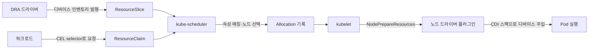

DRA(Dynamic Resource Allocation)는 GPU 전용 기능이 아니라, Kubernetes가 특수 하드웨어 전반을 요청·구성·공유하기 위해 설계한 **범용 디바이스 할당 프레임워크**입니다. 벤더가 DRA 드라이버를 제공하면 GPU뿐 아니라 고성능 NIC, RDMA 어댑터, NVLink 인터커넥트, FPGA 등 어떤 디바이스든 동일한 API로 동적 할당할 수 있습니다.

이 문서는 DRA를 프레임워크 관점에서 다룹니다 — 핵심 API 모델, DRA가 다루는 리소스 유형, 도입 판단 기준과 전제 조건. EKS GPU 환경에서 DRA를 실제로 활성화하는 파라미터(Karpenter `ignoreDRARequests`, NVIDIA DRA 드라이버 3계층 설정)는 [GPU 리소스 관리](../../agentic-ai-platform/model-serving/gpu-infrastructure/gpu-resource-management.md)에서 다룹니다.

---

## 배경 — Device Plugin 모델의 한계

Kubernetes의 기존 확장 리소스 모델(Device Plugin)은 디바이스를 `nvidia.com/gpu: 1`처럼 **불투명한 정수 카운터**로만 표현합니다. 이 모델은 단순하고 안정적이지만, 다음 요구를 표현할 수 없습니다.

| 한계 | 설명 |
|---|---|
| **정적 등록** | 노드 시작 시 디바이스 수가 고정. 런타임 재구성(파티셔닝 변경 등) 불가 |
| **전체 단위 할당** | 디바이스를 통째로만 할당. 부분 할당·공유 표현 불가 |
| **속성 선택 불가** | "80GB 이상 메모리 GPU", "RDMA 지원 NIC"처럼 속성 기반 요청 불가 |
| **멀티 리소스 조율 불가** | "GPU 1개 + 같은 NUMA 노드의 NIC 1개"처럼 디바이스 간 관계 표현 불가 |
| **디바이스 유형별 개별 구현** | GPU·NIC·FPGA마다 별도 Device Plugin과 카운터 체계 필요 |

DRA는 이 한계를 해결하기 위해 디바이스의 **속성과 용량을 구조화된 데이터로 선언**하고, 워크로드가 이를 **CEL(Common Expression Language) 표현식으로 선택**하는 모델을 도입했습니다. 이 접근을 structured parameters(KEP-4381)라고 하며, 스케줄러가 벤더 드라이버에 의존하지 않고 할당을 시뮬레이션할 수 있게 합니다.

## DRA 핵심 모델

### API 오브젝트 4종

DRA는 `resource.k8s.io/v1` API 그룹의 네 가지 오브젝트로 구성됩니다.

| 오브젝트 | 생성 주체 | 역할 |
|---|---|---|
| **DeviceClass** | 클러스터 관리자 / 드라이버 | 디바이스 카테고리 정의 (예: `gpu.nvidia.com`, `mrdma.google.com`). 공통 선택 조건·설정 포함 |
| **ResourceSlice** | DRA 드라이버 | 노드(또는 클러스터)의 실제 디바이스 인벤토리 발행 — 속성·용량·토폴로지 메타데이터 |
| **ResourceClaim** | 워크로드 운영자 | 특정 디바이스에 대한 요청. CEL selector로 속성 매칭, Pod와 수명주기 독립 |
| **ResourceClaimTemplate** | 워크로드 운영자 | Pod마다 ResourceClaim을 자동 생성하는 템플릿 (Deployment 등 다중 복제본에 사용) |

### 할당 흐름



1. DRA 드라이버가 관리하는 디바이스의 속성·용량을 ResourceSlice로 발행합니다.
2. 워크로드는 ResourceClaim(Template)에 CEL selector로 원하는 디바이스 조건을 선언합니다.
3. kube-scheduler가 ResourceSlice 데이터만으로 할당을 계산하고 노드를 선택합니다 — 이 시점에 드라이버 호출이 없다는 점이 structured parameters의 핵심입니다.
4. kubelet이 노드의 드라이버 플러그인에 준비를 위임하고, 드라이버는 CDI(Container Device Interface) 스팩으로 컨테이너에 디바이스를 주입합니다.

ResourceClaim 예시 — "80GB 이상 메모리를 가진 GPU 1개"를 속성 기반으로 요청합니다.

```yaml
apiVersion: resource.k8s.io/v1
kind: ResourceClaimTemplate
metadata:
  name: large-gpu-template
spec:
  spec:
    devices:
      requests:
        - name: gpu
          exactly:
            deviceClassName: gpu.nvidia.com
            selectors:
              - cel:
                  expression: device.capacity['nvidia.com'].memory.compareTo(quantity('80Gi')) >= 0
```

### 버전 히스토리

| K8s 버전 | 상태 | 비고 |
|---|---|---|
| 1.26 | Alpha | classic DRA (KEP-3063, 이후 폐기) |
| 1.30 | Alpha | structured parameters 도입 (KEP-4381) |
| 1.32 | Beta | v1beta1, 새 구현 기준 확립 (기본 비활성화) |
| 1.34 | **GA** | `resource.k8s.io/v1`, 기본 활성화 |
| 1.35 | Stable (locked) | feature gate locked-to-default |

코어 프레임워크는 1.34에서 GA되었고, 개별 고급 기능은 아래 [고급 기능](#범용-프레임워크로서의-고급-기능)처럼 성숙도가 각기 다릅니다.

## DRA가 다루는 리소스 유형

DRA의 확장점은 드라이버입니다. 벤더·프로젝트가 자신의 디바이스용 드라이버를 작성해 ResourceSlice를 발행하면, 스케줄러는 디바이스 종류를 구분하지 않고 동일한 매칭 로직으로 할당합니다.

| 리소스 유형 | 대표 드라이버 | 대상 디바이스 | 성숙도 (2026.07) |
|---|---|---|---|
| **GPU** | NVIDIA `k8s-dra-driver-gpu` (v0.4.x), AMD/Intel 드라이버 | GPU 전체·MIG 파티션 | GPU 할당 서브시스템은 기본 비활성 (초기 단계) |
| **네트워크 디바이스** | DraNet (`kubernetes-sigs/dranet`, v1.3.0) | RDMA NIC, gVNIC, Multi-NIC | Beta → GA 진행 중. GKE는 관리형 DRANET 제공 |
| **고성능 인터커넥트** | NVIDIA ComputeDomain (`k8s-dra-driver-gpu` 서브시스템) | Multi-Node NVLink(MNNVL)·IMEX 도메인 | GB200 NVL72 등 랙스케일 시스템에서 사용 |
| **FPGA·커스텀 가속기** | 자체 드라이버 (`kubernetes-sigs/dra-example-driver` 기반) | FPGA, ASIC, 비디오 캡처 등 | 드라이버 개발 킷 제공, 벤더별 상이 |

### GPU

가장 성숙한 활용 분야입니다. NVIDIA DRA 드라이버는 **GPU 할당**과 **ComputeDomain** 두 서브시스템으로 구성되며, GPU 할당 서브시스템은 MIG 파티션의 동적 생성·할당 같은 Device Plugin으로 불가능한 기능을 제공합니다. EKS에서의 활성화 파라미터와 Karpenter 조합은 [GPU 리소스 관리](../../agentic-ai-platform/model-serving/gpu-infrastructure/gpu-resource-management.md#dra-스택-전체-파라미터-3계층)를 참조하세요.

### 네트워크 디바이스 — DraNet

DraNet은 네트워크 인터페이스를 DRA로 할당하는 Kubernetes SIG 프로젝트입니다. AI/HPC 워크로드에서 RDMA 인터페이스를 CNI 체인·어노테이션 조합 없이 **일급 스케줄링 리소스**로 다룹니다. GKE는 A4X Max(GB300 NVL72) 인스턴스와 함께 관리형 DRANET을 제공하며, `mrdma.google.com`(RDMA)·`netdev.google.com`(일반 NIC) DeviceClass를 자동 설치합니다. EKS에는 아직 관리형 통합이 없어 자체 배포가 필요합니다.

```yaml
# DraNet — RDMA 지원 NIC를 속성 기반으로 요청
apiVersion: resource.k8s.io/v1
kind: ResourceClaimTemplate
metadata:
  name: rdma-nic-template
spec:
  spec:
    devices:
      requests:
        - name: rdma-nic
          exactly:
            deviceClassName: dra.net
            selectors:
              - cel:
                  expression: device.attributes['dra.net'].rdma == true
```

### 고성능 인터커넥트 — ComputeDomain

NVIDIA DRA 드라이버의 ComputeDomain 서브시스템은 Multi-Node NVLink로 연결된 GPU 그룹을 하나의 도메인으로 추상화합니다. 도메인 내 Pod 간 NVLink 도달성(reachability)과 격리를 보장하며, IMEX(Internode Memory Exchange) 채널을 자동 구성합니다. "GPU 카드 몇 개"가 아니라 **GPU 간 연결 토폴로지 자체**를 할당 대상으로 다룬다는 점에서, DRA가 단순 디바이스 카운팅을 넘어선다는 대표 사례입니다.

### FPGA·커스텀 가속기

`kubernetes-sigs/dra-example-driver`는 자체 디바이스용 DRA 드라이버를 개발하기 위한 포크 가능한 레퍼런스 구현입니다. ResourceSlice 발행·kubelet 플러그인·CDI 연동의 보일러플레이트를 제공하므로, 사내 FPGA·전용 ASIC 등 벤더 드라이버가 없는 디바이스도 DRA 체계에 통합할 수 있습니다.

## 범용 프레임워크로서의 고급 기능

Device Plugin 모델로는 표현할 수 없는 DRA 고유 기능들입니다. 코어 GA(1.34) 이후에도 개별 기능은 성숙도가 다르므로 도입 전 확인이 필요합니다.

| 기능 | 설명 | 성숙도 (K8s 1.36 기준) |
|---|---|---|
| **Prioritized list** (`firstAvailable`) | "H100 우선, 없으면 A100" 같은 대체 순위 요청 | Stable (1.36) |
| **Admin access** | 모니터링·진단 도구가 사용 중인 디바이스에 관리자 권한 접근 | Beta |
| **Partitionable devices** | 드라이버가 파티션(예: MIG)을 동적으로 생성·광고 — 물리 디바이스와 파티션의 관계를 스케줄러가 인식 | Beta (1.36) |
| **Consumable capacity** | 하나의 디바이스 용량을 여러 ResourceClaim이 나눠 소비 — Pod가 노드 리소스를 공유하듯 Claim이 디바이스를 공유 | Beta (1.36) |
| **Device taints/tolerations** | 노드 taint의 디바이스 버전 — 특정 디바이스를 수리·격리 대상으로 표시 | Beta (1.36) |
| **Device binding conditions** | fabric-attached 디바이스가 준비될 때까지 스케줄러가 바인딩을 대기 | Beta (1.35) |

이 중 **멀티 이종 리소스 동시 조율**이 실무 관점에서 가장 중요합니다. 하나의 ResourceClaim에 GPU와 NIC를 함께 요청하고 "같은 PCIe 스위치 / 같은 NUMA 노드" 제약을 걸면, 분산 학습·추론에서 GPU-NIC 정렬(alignment)로 통신 병목을 제거할 수 있습니다. Device Plugin 체계에서는 GPU 플러그인과 SR-IOV 플러그인이 서로를 알지 못해 불가능했던 구성입니다.

## 도입 판단과 전제 조건

### 클러스터 요건

| 항목 | 요건 |
|---|---|
| Kubernetes 버전 | 1.34+ (DRA 코어 GA·기본 활성화). EKS 1.34/1.35는 `resource.k8s.io/v1` 자동 서빙 |
| 컨테이너 런타임 | CDI 지원 (containerd 1.7+ / CRI-O 1.23+) |
| DRA 드라이버 | 대상 디바이스의 벤더 드라이버 배포 (GPU: NVIDIA DRA 드라이버, NIC: DraNet 등) |
| 노드 오토스케일링 | Karpenter v1.14.0+ (`ignoreDRARequests=false`) 또는 MNG + Cluster Autoscaler — 상세는 [GPU 리소스 관리](../../agentic-ai-platform/model-serving/gpu-infrastructure/gpu-resource-management.md#karpenter-dra-활성화-파라미터-v1140) |
| Beta 기능 사용 시 | 해당 feature gate·API 그룹 활성화 (EKS는 컨트롤 플레인 관리형이므로 지원 범위 확인 필요) |

### Device Plugin vs DRA 판단 기준

| 상황 | 권장 |
|---|---|
| 전체 GPU 단위 할당만 필요, 단일 디바이스 유형 | Device Plugin 유지 (성숙·단순) |
| 속성 기반 디바이스 선택 (메모리 크기·모델·펌웨어) | DRA |
| 디바이스 파티셔닝·공유 (MIG 동적 생성, 용량 분할) | DRA (partitionable/consumable capacity) |
| GPU + NIC 등 이종 디바이스 정렬 배치 | DRA (Device Plugin으로 불가) |
| RDMA·Multi-NIC를 스케줄링 대상으로 관리 | DRA + DraNet |
| Multi-Node NVLink (GB200 NVL72 등) | DRA 필수 (ComputeDomain) |
| EKS Auto Mode 사용 중 | 현재 DRA 불가 — 내부 Karpenter가 v1.14 미만. [GPU 리소스 관리](../../agentic-ai-platform/model-serving/gpu-infrastructure/gpu-resource-management.md#노드-프로비저닝-호환성) 참조 |

마이그레이션은 점진적으로 진행할 수 있습니다. Device Plugin과 DRA 드라이버가 같은 디바이스를 이중 광고하지 않도록 워크로드 그룹 단위로 전환하는 것이 안전하며, GPU의 경우 GPU Operator의 `devicePlugin.enabled=false` 전환 시점이 분기점입니다.

## 결론

DRA는 GPU에 국한되지 않는 Kubernetes의 범용 디바이스 할당 프레임워크입니다. DeviceClass·ResourceClaim·ResourceSlice 모델과 CEL 속성 매칭으로, 벤더 드라이버가 발행하는 어떤 디바이스든 동일한 API로 요청·구성·공유할 수 있습니다. GPU 외에도 RDMA NIC(DraNet), Multi-Node NVLink(ComputeDomain), FPGA·커스텀 가속기가 이미 DRA 생태계에서 동작합니다. 코어는 K8s 1.34에서 GA되었으나 partitionable devices·consumable capacity 등 고급 기능은 Beta 단계이므로, 기능별 성숙도를 확인한 후 워크로드 그룹 단위로 점진 도입하는 접근이 적합합니다.

## 참고 자료

### 공식 문서
- [Kubernetes: Dynamic Resource Allocation](https://kubernetes.io/docs/concepts/scheduling-eviction/dynamic-resource-allocation/) — DRA 개념·기능별 성숙도 공식 문서
- [Kubernetes: Set Up DRA in a Cluster](https://kubernetes.io/docs/tasks/configure-pod-container/assign-resources/set-up-dra-cluster/) — 클러스터 관리자용 DRA 구성 가이드
- [KEP-4381: DRA Structured Parameters](https://github.com/kubernetes/enhancements/tree/master/keps/sig-node/4381-dra-structured-parameters) — structured parameters 설계 제안
- [DraNet](https://github.com/kubernetes-sigs/dranet) — DRA 기반 네트워크 디바이스 드라이버 (RDMA·gVNIC)
- [NVIDIA k8s-dra-driver-gpu](https://github.com/NVIDIA/k8s-dra-driver-gpu) — GPU 할당·ComputeDomain 서브시스템
- [dra-example-driver](https://github.com/kubernetes-sigs/dra-example-driver) — 자체 DRA 드라이버 개발용 레퍼런스 구현

### 관련 문서 (내부)
- [GPU 리소스 관리](../../agentic-ai-platform/model-serving/gpu-infrastructure/gpu-resource-management.md) — EKS GPU 환경의 DRA 활성화 파라미터·Karpenter 조합·선택 가이드
- [EKS GPU 노드 전략](../../agentic-ai-platform/model-serving/gpu-infrastructure/eks-gpu-node-strategy.md) — DRA 워크로드를 위한 노드 프로비저닝 전략
- [NVIDIA GPU 스택](../../agentic-ai-platform/model-serving/gpu-infrastructure/nvidia-gpu-stack.md) — GPU Operator·MIG·Time-Slicing 상세
