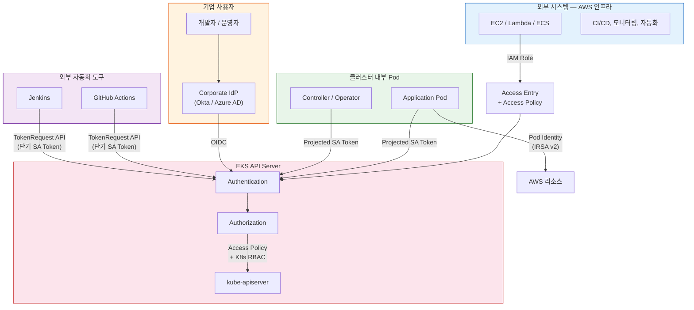

# EKS API Server 인증/인가 가이드

> 📅 **작성일**: 2026-03-24 | ⏱️ **읽는 시간**: 약 20분

## 개요

EKS 클러스터의 API Server는 kubectl 사용자뿐 아니라 다양한 **Non-Standard Caller**가 접근합니다:

- **CI/CD 파이프라인**: GitHub Actions, Jenkins, ArgoCD 등에서 배포 및 리소스 관리
- **모니터링 시스템**: Prometheus, Datadog, Grafana 등에서 메타데이터 조회
- **자동화 도구**: Terraform, Ansible, 커스텀 컨트롤러 등에서 리소스 생성/수정
- **기업 사용자**: 개발자, 운영자의 kubectl 접근

이 문서는 각 시나리오에 맞는 **인증(AuthN)** 방법 선택과 **인가(AuthZ)** 설정 Best Practices를 제공합니다.

---

## 1. EKS API Server 인증 방법 비교

EKS는 다음 5가지 인증 방법을 지원합니다:

| # | 인증 방법 | 적합한 사용 사례 | 권장도 |
|---|---------|---------------|-------|
| ① | **IAM** (aws-iam-authenticator) | AWS 인프라에서 실행되는 시스템, kubectl 사용자 | ⭐⭐⭐ 최우선 권장 |
| ② | **EKS Pod Identity** (IRSA v2) | EKS 클러스터 내부에서 실행되는 Pod | ⭐⭐⭐ Pod 기반 워크로드 최적 |
| ③ | **Kubernetes Service Account Token** | 클러스터 내부 자동화, CI/CD 파이프라인 | ⭐⭐ 외부 시스템에도 활용 가능 |
| ④ | **외부 OIDC Identity Provider** | 기업 IdP 통합 (Okta, Azure AD, Google 등) | ⭐⭐⭐ 기업 SSO 통합 최적 |
| ⑤ | **x509 Client Certificate** | 인증서 기반 인증이 필요한 레거시 시스템 | ⭐ 제한적 (CRL 미지원) |

---

## 2. Non-Standard Caller 유형별 권장 접근 방법

### CASE A: AWS 인프라에서 실행되는 외부 시스템 (EC2, Lambda, ECS 등)

**→ IAM Role + Access Entry (최우선 권장)**

```bash
# 1. Authentication Mode를 API_AND_CONFIG_MAP 또는 API로 설정
aws eks update-cluster-config --name <your-cluster> \
    --access-config '{"authenticationMode": "API_AND_CONFIG_MAP"}'

# 2. 외부 시스템용 IAM Role에 대한 Access Entry 생성
aws eks create-access-entry \
    --cluster-name <your-cluster> \
    --principal-arn arn:aws:iam::<account-id>:role/<external-system-role> \
    --type STANDARD

# 3. 필요한 권한만 부여하는 Access Policy 연결
aws eks associate-access-policy \
    --cluster-name <your-cluster> \
    --principal-arn arn:aws:iam::<account-id>:role/<external-system-role> \
    --policy-arn arn:aws:eks::aws:cluster-access-policy/AmazonEKSViewPolicy \
    --access-scope '{"type": "namespace", "namespaces": ["monitoring", "app-system"]}'
```

**장점:**

- **IaC 호환** — CloudFormation, Terraform으로 관리 가능
- **IAM Condition Key**로 세밀한 제어 가능 (`eks:authenticationMode`, `eks:namespaces` 등)
- **Namespace 또는 Cluster 범위**로 권한 scope 제한 가능
- **CloudTrail**로 모든 API 접근 감사 가능
- **5가지 EKS 사전 정의 Access Policy** + 커스텀 K8s RBAC 지원

**외부 시스템에서 토큰 생성:**

```bash
# IAM 자격 증명으로 K8s 토큰 생성
aws eks get-token --cluster-name <your-cluster> \
    --role-arn arn:aws:iam::<account-id>:role/<external-system-role>
```

이 토큰은 Pre-signed STS `GetCallerIdentity` URL을 base64 인코딩한 것으로, `aws-iam-authenticator`가 검증합니다.

---

### CASE B: EKS 클러스터 내부의 Pod에서 API Server 접근

**→ EKS Pod Identity (IRSA v2) (최우선 권장)**

```bash
# Pod Identity Association 생성
aws eks create-pod-identity-association \
    --cluster-name <your-cluster> \
    --namespace app-system \
    --service-account app-controller \
    --role-arn arn:aws:iam::<account-id>:role/<controller-role>
```

**장점:**

- **IAM OIDC Provider 생성 불필요** (IRSA v1의 100개 글로벌 제한 해결)
- **Trust Policy**에 `pods.eks.amazonaws.com` 단일 서비스 프린시펄만 필요
- **Session Tags 자동 추가** (`eks-cluster-name`, `kubernetes-namespace`, `kubernetes-pod-name` 등) → ABAC 지원
- **Cross-account Role Chaining** 지원 (`targetRoleArn` + `externalId`)
- 클러스터당 최대 **5,000개 연결** 지원 (기본, 20K까지 증가 가능)

**K8s API Server 접근과의 결합:**

Pod Identity로 AWS 리소스 접근 권한을 받은 후, K8s API Server에는 **Projected Service Account Token**으로 인증합니다. 이 토큰은 자동으로 Pod에 마운트됩니다:

```yaml
# Pod에 자동 마운트되는 Projected Service Account Token
volumes:
- name: kube-api-access
  projected:
    sources:
    - serviceAccountToken:
        audience: "https://kubernetes.default.svc"
        expirationSeconds: 3600
        path: token
```

---

### CASE C: 기업 IdP (Okta, Azure AD, Google 등)와 통합

**→ OIDC Identity Provider 연동**

```bash
# 외부 OIDC Identity Provider 연결
aws eks associate-identity-provider-config \
    --cluster-name <your-cluster> \
    --oidc '{
        "identityProviderConfigName": "corporate-idp",
        "issuerUrl": "https://your-idp.example.com/oauth2/default",
        "clientId": "<your-client-id>",
        "usernameClaim": "email",
        "groupsClaim": "groups",
        "groupsPrefix": "oidc:"
    }'
```

:::warning 주의사항
- 클러스터당 **OIDC Identity Provider 1개만** 연결 가능
- Issuer URL은 **공개적으로 접근 가능**해야 함
- K8s RBAC (Role/ClusterRole + RoleBinding/ClusterRoleBinding)으로 인가 관리
- **K8s 1.30 이상**: OIDC Provider URL과 Service Account Issuer URL이 동일하면 안 됨
:::

---

### CASE D: 클러스터 외부의 자동화 도구 (CI/CD, 모니터링)

**→ Projected Service Account Token (TokenRequest API) 활용**

클러스터 외부에서도 Kubernetes TokenRequest API로 단기 토큰을 발급받아 사용할 수 있습니다:

```bash
# TokenRequest API로 단기 토큰 생성 (외부 시스템 전용 ServiceAccount)
kubectl create token ci-pipeline-sa \
    --namespace ci-system \
    --audience "https://kubernetes.default.svc" \
    --duration 1h
```

**장점:**

- 토큰이 **etcd에 저장되지 않음** (보안)
- **만료 시간** 설정 가능 (최대 24시간)
- **Audience 지정** 가능 (용도별 분리)
- Legacy Service Account Token 대비 훨씬 안전

---

## 3. Authentication Mode 마이그레이션

Access Entry를 사용하려면 반드시 Authentication Mode를 `API_AND_CONFIG_MAP` 또는 `API`로 설정해야 합니다.

### 마이그레이션 경로

```
CONFIG_MAP → API_AND_CONFIG_MAP → API
    (단방향, 롤백 불가)
```

| 모드 | Access Entry API | aws-auth ConfigMap | 권장 |
|-----|:---:|:---:|------|
| `CONFIG_MAP` | ❌ 사용 불가 | ✅ 사용 | 레거시 |
| `API_AND_CONFIG_MAP` | ✅ 사용 가능 | ✅ 사용 | ⭐ 마이그레이션 기간 |
| `API` | ✅ 사용 가능 | ❌ 무시됨 | ⭐⭐ 최종 목표 |

### 마이그레이션 단계

```bash
# Step 1: 현재 Authentication Mode 확인
aws eks describe-cluster --name <your-cluster> \
    --query 'cluster.accessConfig.authenticationMode'

# Step 2: API_AND_CONFIG_MAP으로 전환 (기존 aws-auth도 유지)
aws eks update-cluster-config --name <your-cluster> \
    --access-config '{"authenticationMode": "API_AND_CONFIG_MAP"}'

# Step 3: 기존 aws-auth ConfigMap 항목을 Access Entry로 마이그레이션
# (aws-auth의 각 mapRoles/mapUsers 항목에 대해 Access Entry 생성)

# Step 4: 모든 마이그레이션 완료 후 API 모드로 전환
aws eks update-cluster-config --name <your-cluster> \
    --access-config '{"authenticationMode": "API"}'
```

:::danger 주의
Authentication Mode 변경은 **단방향**입니다. `API`로 전환하면 `API_AND_CONFIG_MAP`으로 롤백할 수 없습니다. 반드시 모든 aws-auth 항목이 Access Entry로 마이그레이션되었는지 확인 후 전환하세요.
:::

---

## 4. EKS Auto Mode에서의 인증

EKS Auto Mode는 클러스터 인프라 관리를 AWS에 위임하는 운영 모드로, 인증/인가에도 중요한 차이가 있습니다.

### Auto Mode 인증 특성

| 항목 | Standard Mode | Auto Mode |
|-----|:---:|:---:|
| 기본 Authentication Mode | `CONFIG_MAP` | `API` |
| aws-auth ConfigMap | 지원 | **미지원** |
| Access Entry | 선택 | **유일한 방법** |
| Pod Identity | 지원 | 지원 |
| OIDC Identity Provider | 지원 | 지원 |

### Auto Mode 핵심 포인트

- **Access Entry가 유일한 인증 관리 방법**: aws-auth ConfigMap을 사용할 수 없으므로, 모든 IAM 주체의 클러스터 접근은 Access Entry로 관리해야 합니다.
- **클러스터 생성자 자동 등록**: 클러스터를 생성한 IAM 주체는 자동으로 `AmazonEKSClusterAdminPolicy`가 부여됩니다.
- **Pod Identity 완전 지원**: Auto Mode에서도 Pod Identity Association을 통한 Pod 단위 IAM 역할 할당이 동일하게 동작합니다.
- **노드 IAM 역할 자동 관리**: Auto Mode에서 노드의 IAM 역할은 AWS가 자동으로 관리하므로, 별도의 노드 역할 Access Entry 설정이 불필요합니다.

### Auto Mode + Pod Identity 조합 패턴

```bash
# Auto Mode 클러스터에서 Pod Identity 설정 (Standard Mode와 동일)
aws eks create-pod-identity-association \
    --cluster-name <your-auto-mode-cluster> \
    --namespace app-system \
    --service-account app-controller \
    --role-arn arn:aws:iam::<account-id>:role/<controller-role>
```

### Hybrid Nodes 연결 시 인증 고려사항

Auto Mode와 Hybrid Nodes를 함께 사용하는 경우:

- Hybrid Nodes는 **IAM Roles Anywhere** 또는 **SSM**을 통해 IAM 자격 증명을 취득
- 해당 IAM 역할에 대한 Access Entry를 `--type EC2_LINUX` 또는 `--type HYBRID_LINUX`로 생성
- Hybrid Nodes의 kubelet이 API Server에 인증할 때 IAM 기반 토큰을 자동 사용

```bash
# Hybrid Nodes용 Access Entry 생성
aws eks create-access-entry \
    --cluster-name <your-cluster> \
    --principal-arn arn:aws:iam::<account-id>:role/<hybrid-node-role> \
    --type HYBRID_LINUX
```

---

## 5. Authorization (인가) Best Practices

### 5.1 EKS Access Policy (관리형)

| Policy 이름 | 설명 | 활용 시나리오 |
|-----------|------|------------|
| `AmazonEKSClusterAdminPolicy` | 클러스터 전체 관리자 | 플랫폼 관리자 |
| `AmazonEKSAdminPolicy` | 네임스페이스 관리자 | 팀 관리자 |
| `AmazonEKSEditPolicy` | 리소스 생성/수정 | 개발자 |
| `AmazonEKSViewPolicy` | 읽기 전용 | 모니터링 시스템, 외부 조회 |

### 5.2 커스텀 K8s RBAC (세밀한 제어)

외부 시스템이 CRD 메타데이터만 조회하는 경우:

```yaml
apiVersion: rbac.authorization.k8s.io/v1
kind: ClusterRole
metadata:
  name: metadata-reader
rules:
- apiGroups: ["your-app.io"]  # CRD API 그룹
  resources: ["*"]
  verbs: ["get", "list", "watch"]
- apiGroups: [""]
  resources: ["namespaces", "pods", "services"]
  verbs: ["get", "list"]
---
apiVersion: rbac.authorization.k8s.io/v1
kind: ClusterRoleBinding
metadata:
  name: external-system-reader
subjects:
- kind: User
  name: arn:aws:iam::<account-id>:role/<external-system-role>  # IAM Role ARN
  apiGroup: rbac.authorization.k8s.io
roleRef:
  kind: ClusterRole
  name: metadata-reader
  apiGroup: rbac.authorization.k8s.io
```

:::tip Access Policy와 커스텀 RBAC 조합
Access Policy로 기본 권한을 부여하고, 더 세밀한 제어가 필요한 경우 커스텀 RBAC을 추가합니다. 두 방식은 **합집합(Union)**으로 동작합니다.
:::

---

## 6. 종합 권장 아키텍처



### 접근 경로 요약

| 호출자 유형 | 인증 방법 | 인가 방법 | 예시 |
|-----------|---------|---------|-----|
| AWS 인프라 외부 시스템 | IAM Role → Access Entry | Access Policy (namespace scope) | CI/CD, 모니터링, 자동화 |
| 클러스터 내부 Pod | Projected SA Token | K8s RBAC | Controller, Operator |
| 기업 사용자 | Corporate IdP → OIDC | K8s RBAC (Group 기반) | 개발자 kubectl 접근 |
| 외부 자동화 도구 | TokenRequest API → 단기 SA Token | K8s RBAC | GitHub Actions, Jenkins |

---

## 7. 보안 Best Practices 체크리스트

| 원칙 | 구체적 조치 |
|-----|----------|
| **최소 권한** | Access Policy scope를 namespace로 제한, 커스텀 RBAC으로 verb/resource 세밀 제어 |
| **단기 자격 증명** | Projected SA Token (최대 24h), IAM Token (자동 갱신), **Legacy SA Token 사용 금지** |
| **감사 추적** | Control Plane Logging의 `audit` 로그 활성화, CloudTrail로 Access Entry 변경 추적 |
| **IaC 자동화** | Access Entry를 CloudFormation/Terraform으로 관리, ConfigMap 수동 편집 금지 |
| **Regional STS** | 외부 시스템에서 반드시 `AWS_STS_REGIONAL_ENDPOINTS=regional` 설정 |
| **Authentication Mode** | `API_AND_CONFIG_MAP`으로 전환 후 최종적으로 `API`로 마이그레이션 |

:::info 핵심 메시지
외부 시스템이 API Server에 접근해야 하는 경우, **IAM Role + Access Entry**가 가장 안전하고 관리하기 쉬운 접근 방법입니다. Authentication Mode를 `API_AND_CONFIG_MAP`으로 설정하고, 각 외부 시스템에 전용 IAM Role을 부여한 뒤, Access Entry와 Access Policy로 namespace 범위의 최소 권한을 부여하세요. 기업 사용자는 **OIDC Identity Provider**를, 클러스터 내부 Pod는 **Pod Identity**를, 외부 CI/CD는 **TokenRequest API**를 각각 활용하면 모든 시나리오를 안전하게 커버할 수 있습니다.
:::

---

## 참고 자료

- [EKS Access Management - AWS 공식 문서](https://docs.aws.amazon.com/eks/latest/userguide/access-entries.html)
- [EKS Pod Identity - AWS 공식 문서](https://docs.aws.amazon.com/eks/latest/userguide/pod-identities.html)
- [EKS Auto Mode - AWS 공식 문서](https://docs.aws.amazon.com/eks/latest/userguide/automode.html)
- [Authenticating users from an OIDC identity provider](https://docs.aws.amazon.com/eks/latest/userguide/authenticate-oidc-identity-provider.html)
- [Kubernetes TokenRequest API](https://kubernetes.io/docs/reference/kubernetes-api/authentication-resources/token-request-v1/)
