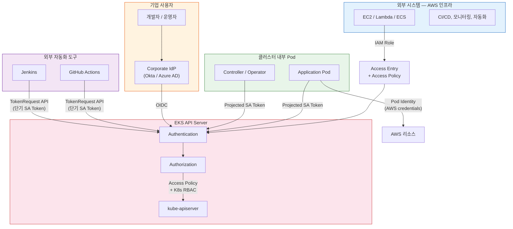

## 개요

EKS 클러스터의 API Server는 kubectl 사용자뿐 아니라 다양한 **Non-Standard Caller**가 접근합니다:

- **CI/CD 파이프라인**: GitHub Actions, Jenkins, ArgoCD 등에서 배포 및 리소스 관리
- **모니터링 시스템**: Prometheus, Datadog, Grafana 등에서 메타데이터 조회
- **자동화 도구**: Terraform, Ansible, 커스텀 컨트롤러 등에서 리소스 생성/수정
- **기업 사용자**: 개발자, 운영자의 kubectl 접근

이 문서는 각 시나리오에 맞는 **인증(AuthN)** 방법 선택과 **인가(AuthZ)** 설정 Best Practices를 제공합니다.

---

## 1. EKS API Server 인증 방법 비교

아래 표는 Kubernetes API에 제시하는 인증 수단을 비교합니다. **EKS Pod Identity와 IRSA는 AWS 자격 증명을 제공**하며, 별도의 Kubernetes API 인증 방식이 아닙니다. [EKS 접근 제어](https://docs.aws.amazon.com/eks/latest/userguide/cluster-auth.html)를 참고하세요.

| # | 인증 방법 | 적합한 사용 사례 | 권장도 |
|---|---------|---------------|-------|
| ① | **IAM** (aws-iam-authenticator) | AWS 인프라에서 실행되는 시스템, kubectl 사용자 | ⭐⭐⭐ 최우선 권장 |
| ② | **Kubernetes Service Account Token** | 클러스터 내부 자동화, CI/CD 파이프라인 | ⭐⭐ 외부 시스템에도 활용 가능 |
| ③ | **외부 OIDC Identity Provider** | 기업 IdP 통합 (Okta, Azure AD, Google 등) | ⭐⭐⭐ 기업 SSO 통합 최적 |
| ④ | **x509 Client Certificate** | 인증서 기반 인증이 필요한 레거시 시스템 | ⭐ 제한적 (CRL 미지원) |

---

## 2. Non-Standard Caller 유형별 권장 접근 방법

### CASE A: AWS 인프라에서 실행되는 외부 시스템 (EC2, Lambda, ECS 등)

**→ IAM Role + Access Entry (최우선 권장)**

```bash
# 1. Authentication Mode를 API_AND_CONFIG_MAP 또는 API로 설정
aws eks update-cluster-config --name <your-cluster> \
    --access-config '{"authenticationMode": "API_AND_CONFIG_MAP"}'

# 2. 외부 시스템용 IAM Role에 대한 Access Entry 생성
aws eks create-access-entry \
    --cluster-name <your-cluster> \
    --principal-arn arn:aws:iam::<account-id>:role/<external-system-role> \
    --type STANDARD

# 3. 필요한 권한만 부여하는 Access Policy 연결
aws eks associate-access-policy \
    --cluster-name <your-cluster> \
    --principal-arn arn:aws:iam::<account-id>:role/<external-system-role> \
    --policy-arn arn:aws:eks::aws:cluster-access-policy/AmazonEKSViewPolicy \
    --access-scope '{"type": "namespace", "namespaces": ["monitoring", "app-system"]}'
```

**장점:**

- **IaC 호환** — CloudFormation, Terraform으로 관리 가능
- **IAM Condition Key**로 세밀한 제어 가능 (`eks:authenticationMode`, `eks:namespaces` 등)
- **Namespace 또는 Cluster 범위**로 권한 scope 제한 가능
- **CloudTrail**로 EKS 접근 관리 API 변경을 추적하고, Kubernetes API 요청은 **audit** 로그로 확인
- **AWS 관리형 EKS Access Policy** + 커스텀 K8s RBAC 지원. 5.1절 표는 대표 정책 예시이며 전체 카탈로그가 아님

**외부 시스템에서 토큰 생성:**

```bash
# IAM 자격 증명으로 K8s 토큰 생성
aws eks get-token --cluster-name <your-cluster> \
    --role-arn arn:aws:iam::<account-id>:role/<external-system-role>
```

이 토큰은 Pre-signed STS `GetCallerIdentity` URL을 base64 인코딩한 것으로, `aws-iam-authenticator`가 검증합니다.

---

### CASE B: EKS 클러스터 내부의 Pod에서 API Server 접근

**→ Projected Service Account Token + Kubernetes RBAC**

Kubernetes API 접근에는 Pod에 ServiceAccount를 지정하고, RoleBinding 또는 ClusterRoleBinding의 `ServiceAccount` subject에 필요한 verb/resource만 부여합니다. 이 경로에는 Pod Identity Association이 필요하지 않습니다.

아래 Pod spec 일부를 사용하기 전에 기존 `app-system` 네임스페이스에 `app-controller` ServiceAccount와 RBAC 바인딩을 생성하세요.

```yaml
spec:
  serviceAccountName: app-controller
  automountServiceAccountToken: true
```

Kubernetes는 해당 ServiceAccount의 단기 projected token을 마운트하고 kubelet이 이를 갱신합니다. 갱신된 토큰을 다시 읽는 in-cluster 클라이언트를 사용하세요. 별도의 허용 audience를 구성한 경우가 아니라면 Kubernetes API의 기본 audience를 사용합니다. [Kubernetes Service Accounts](https://kubernetes.io/docs/concepts/security/service-accounts/)를 참고하세요.

**선택 사항: 같은 Pod에서 AWS 서비스 접근**

워크로드가 AWS API도 호출한다면 해당 AWS 작업 권한을 가진 IAM 역할로 별도의 Pod Identity Association을 구성합니다.

```bash
aws eks create-pod-identity-association \
    --cluster-name <your-cluster> \
    --namespace app-system \
    --service-account app-controller \
    --role-arn arn:aws:iam::<account-id>:role/<controller-role>
```

Pod Identity Agent(Auto Mode에는 내장), 지원되는 AWS SDK 자격 증명 체인, IAM 역할의 Pod Identity 신뢰/권한 설정이 필요합니다. IAM OIDC Provider 생성은 필요하지 않습니다. 문서상 한도는 클러스터당 5,000개 연결이며, 이 연결로 Kubernetes API 권한이 늘어나지는 않습니다. [EKS Pod Identity](https://docs.aws.amazon.com/eks/latest/userguide/pod-identities.html)를 참고하세요.

---

### CASE C: 기업 IdP (Okta, Azure AD, Google 등)와 통합

**→ OIDC Identity Provider 연동**

```bash
# 외부 OIDC Identity Provider 연결
aws eks associate-identity-provider-config \
    --cluster-name <your-cluster> \
    --oidc '{
        "identityProviderConfigName": "corporate-idp",
        "issuerUrl": "https://your-idp.example.com/oauth2/default",
        "clientId": "<your-client-id>",
        "usernameClaim": "email",
        "groupsClaim": "groups",
        "groupsPrefix": "oidc:"
    }'
```

:::warning 주의사항
- 클러스터당 **OIDC Identity Provider 1개만** 연결 가능
- Issuer URL은 **공개적으로 접근 가능**해야 함
- K8s RBAC (Role/ClusterRole + RoleBinding/ClusterRoleBinding)으로 인가 관리
- **K8s 1.30 이상**: OIDC Provider URL과 Service Account Issuer URL이 동일하면 안 됨
:::

---

### CASE D: 클러스터 외부의 자동화 도구 (CI/CD, 모니터링)

**→ Projected Service Account Token (TokenRequest API) 활용**

요청자는 이미 클러스터에 인증할 수 있어야 하며, 대상 `serviceaccounts/token` subresource에 대한 `create` 권한이 필요합니다. TokenRequest 자체가 미인증 외부 클라이언트의 최초 접근을 허용하지는 않습니다. 대상 ServiceAccount와 RBAC 권한을 먼저 준비하고, 외부 클라이언트는 토큰을 안전하게 보관하고 만료 전에 갱신해야 합니다.

```bash
# TokenRequest API로 단기 토큰 생성 (외부 시스템 전용 ServiceAccount)
kubectl create token ci-pipeline-sa \
    --namespace ci-system \
    --duration 1h
```

**장점:**

- 토큰이 **etcd에 저장되지 않음** (보안)
- **만료 시간**은 `--duration`으로 요청하며, API Server가 다른 유효 기간을 반환할 수 있으므로 일률적인 최대 24시간을 가정하지 않고 반환된 만료 시간을 확인
- **Audience 지정** 가능 (용도별 분리)
- Legacy Service Account Token 대비 훨씬 안전

---

## 3. Authentication Mode 마이그레이션

Access Entry를 사용하려면 반드시 Authentication Mode를 `API_AND_CONFIG_MAP` 또는 `API`로 설정해야 합니다.

### 마이그레이션 경로

```
CONFIG_MAP → API_AND_CONFIG_MAP → API
    (단방향, 롤백 불가)
```

| 모드 | Access Entry API | aws-auth ConfigMap | 권장 |
|-----|:---:|:---:|------|
| `CONFIG_MAP` | ❌ 사용 불가 | ✅ 사용 | 레거시 |
| `API_AND_CONFIG_MAP` | ✅ 사용 가능 | ✅ 사용 | ⭐ 마이그레이션 기간 |
| `API` | ✅ 사용 가능 | ❌ 무시됨 | ⭐⭐ 최종 목표 |

### 마이그레이션 단계

```bash
# Step 1: 현재 Authentication Mode 확인
aws eks describe-cluster --name <your-cluster> \
    --query 'cluster.accessConfig.authenticationMode'

# Step 2: API_AND_CONFIG_MAP으로 전환 (기존 aws-auth도 유지)
aws eks update-cluster-config --name <your-cluster> \
    --access-config '{"authenticationMode": "API_AND_CONFIG_MAP"}'

# Step 3: 기존 aws-auth ConfigMap 항목을 Access Entry로 마이그레이션
# (aws-auth의 각 mapRoles/mapUsers 항목에 대해 Access Entry 생성)

# Step 4: 모든 마이그레이션 완료 후 API 모드로 전환
aws eks update-cluster-config --name <your-cluster> \
    --access-config '{"authenticationMode": "API"}'
```

:::danger 주의
Authentication Mode 변경은 **단방향**입니다. `API`로 전환하면 `API_AND_CONFIG_MAP`으로 롤백할 수 없습니다. 반드시 모든 aws-auth 항목이 Access Entry로 마이그레이션되었는지 확인 후 전환하세요.
:::

---

## 4. EKS Auto Mode에서의 인증

EKS Auto Mode는 클러스터 인프라 관리를 AWS에 위임하는 운영 모드로, 인증/인가에도 중요한 차이가 있습니다.

### Auto Mode 인증 특성

| 항목 | Auto Mode를 사용하지 않는 EKS | Auto Mode |
|-----|:---:|:---:|
| Authentication Mode | `CONFIG_MAP`, `API_AND_CONFIG_MAP`, `API`; 생성 도구에 따라 기본값이 다름 | `API_AND_CONFIG_MAP` 또는 `API` |
| aws-auth ConfigMap | `CONFIG_MAP` / `API_AND_CONFIG_MAP`에서 사용 | `API_AND_CONFIG_MAP`에서 선택적으로 사용; `API`에서는 사용하지 않음 |
| Access Entry | API 접근 모드 활성화 시 사용 가능 | 필수, 비활성화할 수 없음 |
| Pod Identity | Agent 설치 후 AWS 자격 증명 제공 | Agent 내장, AWS 자격 증명 제공 |
| OIDC Identity Provider | 지원 | 지원 |

### Auto Mode 핵심 포인트

- **Access Entry는 필수**이지만 `aws-auth` ConfigMap을 선택적으로 함께 사용할 수 있습니다. ConfigMap 사용 여부는 설정된 Authentication Mode에 따르며, Auto Mode가 `API` 전용 모드만 요구하지는 않습니다.
- **클러스터 생성자 권한은 구성 가능**합니다. 생성 시 `bootstrapClusterCreatorAdminPermissions`(기본값 `true`)를 확인하며, 모든 클러스터에 생성자 admin entry가 유지된다고 가정하지 않습니다.
- **Pod Identity는 AWS 권한을 부여**합니다. 워크로드 Pod의 Kubernetes API 접근에는 여전히 ServiceAccount 토큰과 RBAC을 사용합니다.
- **노드 역할 접근은 NodeClass에 따라 다릅니다**. EKS는 내장 NodeClass/NodePool의 access entry를 생성합니다. 사용자 정의 NodeClass 역할에는 `EC2` 타입 entry를 만들고 `AmazonEKSAutoNodePolicy`를 cluster scope로 연결해야 합니다. `EC2_LINUX`는 Auto Mode용 타입이 아닙니다. 이 EKS access policy는 Kubernetes 노드 권한을 부여하며 AWS API용 IAM 권한과 다릅니다.

근거: [Auto Mode 접근 제어](https://docs.aws.amazon.com/eks/latest/userguide/cluster-auth.html), [사용자 정의 NodeClass access entry](https://docs.aws.amazon.com/eks/latest/userguide/create-node-class.html), [클러스터 생성자 접근 설정](https://docs.aws.amazon.com/eks/latest/APIReference/API_CreateAccessConfigRequest.html).

### Auto Mode + Pod Identity 조합 패턴

```bash
# Auto Mode 클러스터에서 Pod Identity 설정 (Standard Mode와 동일)
aws eks create-pod-identity-association \
    --cluster-name <your-auto-mode-cluster> \
    --namespace app-system \
    --service-account app-controller \
    --role-arn arn:aws:iam::<account-id>:role/<controller-role>
```

### Hybrid Nodes 연결 시 인증 고려사항

Auto Mode와 Hybrid Nodes를 함께 사용할 때는 `API` 또는 `API_AND_CONFIG_MAP` 인증 모드를 사용합니다. Hybrid Nodes를 사용하는 클러스터에서 `CONFIG_MAP` 단독 모드는 지원되지 않습니다. [Hybrid Nodes 클러스터 접근 준비](https://docs.aws.amazon.com/eks/latest/userguide/hybrid-nodes-cluster-prep.html)를 참고하세요.

- Hybrid Nodes는 **IAM Roles Anywhere** 또는 **SSM**을 통해 IAM 자격 증명을 취득
- Hybrid Nodes access entry에는 IAM **역할** principal과 `--type HYBRID_LINUX`를 사용합니다. `EC2_LINUX`나 STS 세션 ARN으로 대체하지 않습니다. 이 노드 entry의 권한은 EKS가 정하며 사용자용 access policy를 추가할 수 없습니다.
- Hybrid Nodes의 kubelet이 API Server에 인증할 때 IAM 기반 토큰을 자동 사용

```bash
# Hybrid Nodes용 Access Entry 생성
aws eks create-access-entry \
    --cluster-name <your-cluster> \
    --principal-arn arn:aws:iam::<account-id>:role/<hybrid-node-role> \
    --type HYBRID_LINUX
```

---

## 5. Authorization (인가) Best Practices

### 5.1 EKS Access Policy (관리형)

아래 표는 **대표 정책 일부**이며 전체 카탈로그가 아닙니다. `AmazonEKSAdminViewPolicy`(Secrets 조회 포함), `AmazonEKSAutoNodePolicy` 같은 서비스별 정책도 있습니다. EKS access policy는 Kubernetes 권한을 부여하며 AWS IAM 권한과 다릅니다. [현재 정책 권한](https://docs.aws.amazon.com/eks/latest/userguide/access-policy-permissions.html)을 확인한 뒤 선택하세요.

```bash
aws eks list-access-policies
```

| Policy 이름 | 설명 | 활용 시나리오 |
|-----------|------|------------|
| `AmazonEKSClusterAdminPolicy` | 클러스터 전체 관리자 | 플랫폼 관리자 |
| `AmazonEKSAdminPolicy` | 네임스페이스 관리자 | 팀 관리자 |
| `AmazonEKSEditPolicy` | 리소스 생성/수정 | 개발자 |
| `AmazonEKSViewPolicy` | 읽기 전용 | 모니터링 시스템, 외부 조회 |

### 5.2 커스텀 K8s RBAC (세밀한 제어)

이 예시는 `app-system` 내 `your-app.io` API 그룹의 **네임스페이스 범위 `widgets` 커스텀 리소스**를 읽도록 허용합니다. RBAC은 리소스 접근을 허용하며 metadata 필드만으로 응답을 제한하지 않습니다. API 그룹/리소스를 실제 CRD에 맞게 바꾸고 네임스페이스를 먼저 생성하세요.

미리 준비한 전용 IAM 역할을 사용해 명시적인 Kubernetes 그룹이 있는 `STANDARD` access entry를 생성합니다. CASE A와 별개의 RBAC 전용 예시이며, 아래 권한만 필요하다면 더 넓은 access policy를 연결하지 않습니다.

```bash
aws eks create-access-entry \
    --cluster-name <your-cluster> \
    --principal-arn arn:aws:iam::<account-id>:role/<rbac-reader-role> \
    --type STANDARD \
    --kubernetes-groups external-system-readers
```

**동일한 그룹 이름**을 네임스페이스 범위 Role에 바인딩합니다.

```yaml
apiVersion: rbac.authorization.k8s.io/v1
kind: Role
metadata:
  name: custom-resource-reader
  namespace: app-system
rules:
- apiGroups: ["your-app.io"]
  resources: ["widgets"]
  verbs: ["get", "list", "watch"]
---
apiVersion: rbac.authorization.k8s.io/v1
kind: RoleBinding
metadata:
  name: external-system-reader
  namespace: app-system
subjects:
- kind: Group
  name: external-system-readers
  apiGroup: rbac.authorization.k8s.io
roleRef:
  kind: Role
  name: custom-resource-reader
  apiGroup: rbac.authorization.k8s.io
```

IAM 역할의 Kubernetes username은 보통 IAM role ARN 자체가 아니라 **STS assumed-role 세션**을 기반으로 EKS가 생성합니다. 위 그룹 매핑은 세션별 username에 의존하지 않습니다. 역할에 entry가 이미 있다면 중복 생성하지 않고 `kubernetesGroups`를 갱신하세요. [Kubernetes 그룹 access entry](https://docs.aws.amazon.com/eks/latest/userguide/create-k8s-group-access-entry.html)와 [생성되는 username](https://docs.aws.amazon.com/eks/latest/userguide/set-custom-username.html)을 참고하세요.

:::tip Access Policy와 커스텀 RBAC 조합
Access Policy와 Kubernetes RBAC 권한은 **합집합(Union)**으로 동작합니다. 더 좁은 RoleBinding을 추가해도 기존의 넓은 access policy나 ClusterRoleBinding 권한이 제한되지는 않습니다. 접근 범위를 줄이려면 불필요한 기존 권한도 제거해야 합니다.
:::

---

## 6. 종합 권장 아키텍처


```mermaid
flowchart TB
    subgraph External["외부 시스템 — AWS 인프라"]
        EC2["EC2 / Lambda / ECS"]
        CICD_EXT["CI/CD, 모니터링, 자동화"]
    end

    subgraph Internal["클러스터 내부 Pod"]
        Pod["Application Pod"]
        Controller["Controller / Operator"]
    end

    subgraph Enterprise["기업 사용자"]
        Dev["개발자 / 운영자"]
        IdP["Corporate IdP\n(Okta / Azure AD)"]
    end

    subgraph ExtAuto["외부 자동화 도구"]
        GHA["GitHub Actions"]
        Jenkins["Jenkins"]
    end

    subgraph EKS["EKS API Server"]
        AuthN["Authentication"]
        AuthZ["Authorization"]
        APIServer["kube-apiserver"]
    end

    EC2 -->|"IAM Role"| AccessEntry["Access Entry\n+ Access Policy"]
    AccessEntry --> AuthN

    Pod -->|"Pod Identity\n(AWS credentials)"| AWSResources["AWS 리소스"]
    Pod -->|"Projected SA Token"| AuthN
    Controller -->|"Projected SA Token"| AuthN

    Dev --> IdP
    IdP -->|"OIDC"| AuthN

    GHA -->|"TokenRequest API\n(단기 SA Token)"| AuthN
    Jenkins -->|"TokenRequest API\n(단기 SA Token)"| AuthN

    AuthN --> AuthZ
    AuthZ -->|"Access Policy\n+ K8s RBAC"| APIServer

    style External fill:#e3f2fd,stroke:#1565c0
    style Internal fill:#e8f5e9,stroke:#2e7d32
    style Enterprise fill:#fff3e0,stroke:#e65100
    style ExtAuto fill:#f3e5f5,stroke:#6a1b9a
    style EKS fill:#fce4ec,stroke:#c62828
```

### 접근 경로 요약

| 호출자 유형 | 인증 방법 | 인가 방법 | 예시 |
|-----------|---------|---------|-----|
| AWS 인프라 외부 시스템 | IAM Role → Access Entry | Access Policy (namespace scope) | CI/CD, 모니터링, 자동화 |
| 클러스터 내부 Pod | Projected SA Token | K8s RBAC | Controller, Operator |
| 기업 사용자 | Corporate IdP → OIDC | K8s RBAC (Group 기반) | 개발자 kubectl 접근 |
| 외부 자동화 도구 | TokenRequest API → 단기 SA Token | K8s RBAC | GitHub Actions, Jenkins |

---

## 7. 보안 Best Practices 체크리스트

| 원칙 | 구체적 조치 |
|-----|----------|
| **최소 권한** | Access Policy scope를 namespace로 제한, 커스텀 RBAC으로 verb/resource 세밀 제어 |
| **단기 자격 증명** | 반환된 만료 시간에 맞춘 Projected SA Token, IAM Token (자동 갱신), **Legacy SA Token 사용 금지** |
| **감사 추적** | Control Plane Logging의 `audit` 로그 활성화, CloudTrail로 Access Entry 변경 추적 |
| **IaC 자동화** | Access Entry를 CloudFormation/Terraform으로 관리, ConfigMap 수동 편집 금지 |
| **Regional STS** | 외부 시스템에서 반드시 `AWS_STS_REGIONAL_ENDPOINTS=regional` 설정 |
| **Authentication Mode** | `API_AND_CONFIG_MAP`으로 전환 후 최종적으로 `API`로 마이그레이션 |

:::info 핵심 메시지
외부 시스템이 API Server에 접근해야 하는 경우, **IAM Role + Access Entry**가 가장 안전하고 관리하기 쉬운 접근 방법입니다. Authentication Mode를 `API_AND_CONFIG_MAP`으로 설정하고, 각 외부 시스템에 전용 IAM Role을 부여한 뒤, Access Entry와 Access Policy로 namespace 범위의 최소 권한을 부여하세요. 기업 사용자는 **OIDC Identity Provider**를, Kubernetes API에 접근하는 클러스터 내부 Pod는 **ServiceAccount 토큰과 Kubernetes RBAC**을 사용합니다. Pod가 AWS API도 호출한다면 **Pod Identity**를 추가로 구성하고, 외부 CI/CD가 **TokenRequest API**를 사용한다면 최초 인증과 토큰 갱신 경로도 준비하세요.
:::

---

## 참고 자료

- [EKS Access Management - AWS 공식 문서](https://docs.aws.amazon.com/eks/latest/userguide/access-entries.html)
- [EKS Pod Identity - AWS 공식 문서](https://docs.aws.amazon.com/eks/latest/userguide/pod-identities.html)
- [EKS Auto Mode - AWS 공식 문서](https://docs.aws.amazon.com/eks/latest/userguide/automode.html)
- [Authenticating users from an OIDC identity provider](https://docs.aws.amazon.com/eks/latest/userguide/authenticate-oidc-identity-provider.html)
- [Kubernetes Service Accounts and TokenRequest](https://kubernetes.io/docs/reference/access-authn-authz/service-accounts-admin/)
