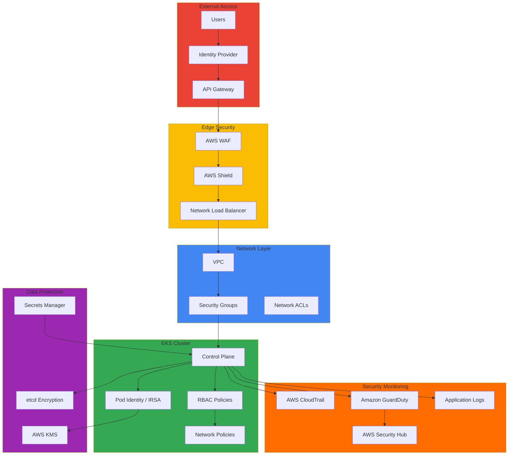

import { DocCard, DocCardGrid } from '@site/src/components/DocCards';

Amazon EKS 환경의 보안은 단일 방어벽 구축이 아니라 다층 방어(Defense in Depth) 전략과 지속적인 보안 태세 평가를 요구합니다. 이 챕터는 클러스터 접근 제어(인증/인가)부터 정책 기반 거버넌스, 공급망 보안, 런타임 위협 탐지, 인시던트 대응에 이르는 보안 수명 주기 전반을 다룹니다.

보안 거버넌스는 기술적 통제를 넘어 조직의 정책, 프로세스, 컴플라이언스 요구사항을 코드와 인프라에 내재화하는 과정입니다. 금융권을 비롯한 규제 산업에서는 PCI-DSS, SOC 2, ISO 27001과 같은 컴플라이언스 프레임워크 준수가 필수적이며, 이를 위해서는 자동화된 정책 시행, 지속적인 감사 로깅, 실시간 위협 탐지 체계가 구축되어야 합니다. Kubernetes 네이티브 보안 기능(RBAC, Network Policy, Pod Security Standards)과 AWS 클라우드 네이티브 서비스(IAM, KMS, GuardDuty)를 통합하면 Zero Trust 원칙에 기반한 강력한 보안 태세를 구축할 수 있습니다.

## 주요 문서

<DocCardGrid columns={2}>
  <DocCard
    to="/docs/eks-best-practices/security-authn/eks-api-server-authn-authz"
    icon="🔐"
    title="EKS API Server AuthN/AuthZ"
    description="Non-Standard Caller(CI/CD, 모니터링, 자동화)의 EKS API Server 접근을 위한 인증/인가 가이드. Access Entry, Pod Identity, OIDC, TokenRequest API 활용법."
    color="#e63946"
  />
  <DocCard
    to="/docs/eks-best-practices/security-authn/identity-first-security"
    icon="🪪"
    title="Identity-First Security 아키텍처"
    description="EKS Pod Identity 기반 제로트러스트 접근 제어, IRSA에서 Pod Identity로의 마이그레이션, 최소 권한 원칙 자동화."
    color="#f4a261"
  />
  <DocCard
    to="/docs/eks-best-practices/security-authn/kyverno-policy-management"
    icon="📜"
    title="Kyverno 기반 정책 관리"
    description="Kyverno v1.17+ CEL v1 GA 정책, 네임스페이스 수준 정책, 정책 예외 관리, OPA Gatekeeper 비교."
    color="#2a9d8f"
  />
  <DocCard
    to="/docs/eks-best-practices/security-authn/guardduty-extended-threat-detection"
    icon="🛡️"
    title="GuardDuty Extended Threat Detection"
    description="EC2/ECS 호스트 및 컨테이너 시그널 상관 분석, MITRE ATT&CK 매핑, 자동화된 위협 대응."
    color="#e76f51"
  />
  <DocCard
    to="/docs/eks-best-practices/security-authn/supply-chain-security"
    icon="📦"
    title="컨테이너 공급망 보안"
    description="ECR 이미지 스캐닝 및 서명, Sigstore/Cosign 통합, SBOM 생성 및 관리, CI/CD 보안 게이트."
    color="#457b9d"
  />
  <DocCard
    to="/docs/eks-best-practices/security-authn/default-namespace-incident"
    icon="🚨"
    title="Default Namespace 장애 대응"
    description="default 네임스페이스 삭제로 인한 Control Plane 접근 불가 장애의 원인 분석, 복구 절차, Kyverno·GitOps·Access Entry 기반 재발 방지."
    color="#6d597a"
  />
</DocCardGrid>

## 아키텍처 패턴

## 보안 영역

보안 아키텍처는 클러스터, 네트워크, 워크로드, 시크릿, 데이터의 다섯 계층으로 구성됩니다.

**클러스터 보안(인증/인가)**은 AWS IAM과 Kubernetes RBAC의 통합으로 구현됩니다. Access Entry 기반 인증 모드, EKS Pod Identity와 IRSA의 선택 기준, 기업 IdP(OIDC) 연동, CI/CD·모니터링 도구 같은 Non-Standard Caller의 접근 패턴은 [EKS API Server 인증/인가 가이드](./eks-api-server-authn-authz.md)에서 상세히 다룹니다. 신규 프로젝트에서는 OIDC 프로바이더 설정 없이 IAM 역할을 Pod에 직접 바인딩하는 EKS Pod Identity를 우선 검토합니다.

**네트워크 보안**은 Kubernetes Network Policy로 Pod 간 통신을 제어하고 네임스페이스 간 격리를 구현합니다. VPC CNI의 NetworkPolicy 동작 원리는 [VPC CNI Deep Dive](../networking-performance/vpc-cni-deep-dive.md)를, 서비스 메시 기반 mTLS 자동화는 [서비스 메시 비교 가이드](../networking-performance/service-mesh/index.md)를 참조합니다.

**워크로드 보안**은 Pod Security Standards의 Restricted 레벨 적용으로 루트 권한 실행 차단, 호스트 네트워크 접근 제한, 위험한 Capabilities 제거를 강제합니다. 컨테이너 이미지는 CI/CD 파이프라인에서 스캔하여 취약점을 사전에 차단하고, 승인된 레지스트리의 서명된 이미지만 사용하도록 정책을 시행합니다. 정책 시행 자동화는 [Kyverno 기반 정책 관리](./kyverno-policy-management.md), 이미지 서명·SBOM은 [컨테이너 공급망 보안](./supply-chain-security.md)에서 다룹니다.

**시크릿 관리**는 AWS Secrets Manager와 External Secrets Operator를 통합하여 중앙 집중식으로 관리합니다. 시크릿을 Kubernetes Secret으로 직접 저장하지 않고 외부 시크릿 스토어에 보관하며, 자동 로테이션과 주기적 동기화로 노출 위험을 최소화합니다. GitOps 환경에서의 시크릿 관리 아키텍처는 [GitOps 기반 EKS 클러스터 운영](../operations-reliability/gitops-cluster-operation.md)을 참조합니다.

**데이터 보안**은 저장 데이터와 전송 데이터 모두의 암호화를 포함합니다. EBS 볼륨은 KMS 기반 암호화로 블록 레벨에서 보호되며, etcd는 AWS KMS 통합으로 Kubernetes 설정 데이터를 투명하게 암호화합니다. 전송 데이터는 TLS/mTLS로 암호화되고, 인그레스 레벨에서는 HTTPS를 강제하며 Cert Manager로 인증서를 자동 갱신합니다.

## 컴플라이언스 프레임워크

컴플라이언스 준수는 기술적 구현과 조직적 프로세스의 통합을 요구합니다. SOC 2는 데이터 보안·가용성·처리 무결성을 다루며 고가용성 아키텍처, 데이터 암호화, 접근 제어로 구현됩니다. PCI-DSS는 결제 카드 데이터 처리에 필수적인 표준으로 네트워크 격리, 데이터 암호화, 정기적인 보안 평가를 요구합니다. HIPAA는 의료 정보 보호를 위해 데이터 암호화와 감사 로깅을, GDPR은 데이터 최소화와 처리 투명성을, ISO 27001은 정보보안 관리 시스템의 전반적인 프레임워크를 요구합니다.

EKS 환경에서 컴플라이언스 요구사항은 기술적 통제로 매핑됩니다.

| 요구사항 | 구현 수단 |
|----------|----------|
| 접근 제어 | AWS IAM + Kubernetes RBAC (Access Entry, Pod Identity) |
| 암호화 | TLS/mTLS, AWS KMS Envelope 암호화 |
| 감사 추적 | CloudTrail API 로깅, Control Plane audit 로그 |
| 위협 탐지 | GuardDuty, Security Hub 통합 대시보드 |
| 정책 시행 | Kyverno / OPA Gatekeeper admission control |
| 구성 준수 | AWS Config 규칙 기반 지속 모니터링 |

## 보안 도구 및 기술

오픈소스 도구로는 시스템 콜 레벨 런타임 이상 행위를 탐지하는 Falco, admission webhook으로 배포 시점에 정책을 검증하는 Kyverno와 OPA Gatekeeper, 컨테이너 이미지·파일시스템 취약점을 스캔하는 Trivy, CIS Kubernetes 벤치마크 기반 설정 평가 도구인 kube-bench, 클러스터 침투 테스트 도구인 kube-hunter가 활용됩니다.

AWS 네이티브 서비스로는 SQL 인젝션·XSS 등 웹 공격을 차단하는 AWS WAF, DDoS 보호를 제공하는 AWS Shield, EC2 인스턴스와 컨테이너 이미지의 취약점을 지속 평가하는 Amazon Inspector, 패치 자동화를 담당하는 AWS Systems Manager가 있습니다.

## 보안 모니터링 및 대응

보안 이벤트는 CloudTrail, VPC Flow Logs, 애플리케이션·컨테이너 로그 등 여러 소스에서 수집되어 중앙 로그 저장소로 통합됩니다. GuardDuty는 머신러닝 기반으로 비정상 API 호출 패턴, 의심스러운 네트워크 활동, 손상된 인스턴스 행위를 자동 탐지하며, EventBridge와 Lambda를 연계하면 격리·알림·복구 작업을 자동화할 수 있습니다. GuardDuty Extended Threat Detection과 Pod 격리 자동화의 실전 구성은 [EKS Pod 헬스체크 & 라이프사이클 관리](../operations-reliability/eks-pod-health-lifecycle.md)의 GuardDuty 연계 절을 참조합니다.

인시던트 대응은 탐지 → 분석 → 격리 → 복구 → 사후 분석의 반복 가능한 절차로 수행합니다. 장애 유형별 진단·복구 절차는 [EKS 디버깅 가이드](../operations-reliability/eks-debugging/index.md)를, Control Plane 접근 불가를 유발하는 대표적 보안 거버넌스 실패 사례는 [Default Namespace 장애 대응](./default-namespace-incident.md)을 참조합니다.

## 보안 로드맵 2025

### 최신 보안 기능 (AWS re:Invent 2025)

| 기능 | 상태 | 영향도 |
|------|------|--------|
| GuardDuty Extended Threat Detection | GA | 컨테이너 위협 탐지 강화 (EKS Protection 필수, Runtime Monitoring 권장) |
| IAM Policy Autopilot | GA | 오픈소스 가용 (re:Invent 2025, awslabs/iam-policy-autopilot) |
| EKS Pod Identity | GA | IRSA 대체/보완 |
| Security Hub Analytics | GA | 실시간 리스크 정량화 |
| ECR Enhanced Scanning | GA | 공급망 보안 강화 |

### Kyverno v1.17+ 주요 업데이트 (현재 v1.18)

- **CEL 기반 정책 v1 GA (1.17부터)**: Rego 대신 Common Expression Language 사용, 프로덕션 적용 가능
- **네임스페이스 CEL 정책**: 팀별 자율적 정책 관리
- **정밀한 정책 예외**: 세분화된 예외 처리
- **향상된 관측성**: 정책 적용 메트릭 및 대시보드

## 관련 문서

- [EKS 디버깅 가이드](../operations-reliability/eks-debugging/index.md) — 인시던트 트리아지 및 영역별 디버깅
- [GitOps 기반 EKS 클러스터 운영](../operations-reliability/gitops-cluster-operation.md) — 시크릿 관리·RBAC 거버넌스
- [EKS Hybrid Nodes](/docs/eks-hybrid-nodes) — 하이브리드 환경 노드 인증·보안
