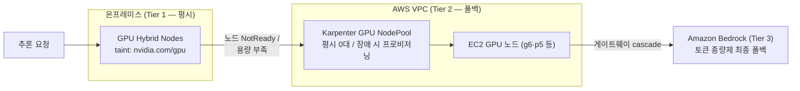

## 개요

온프레미스 GPU 서버를 하이브리드 노드로 등록하면 GPU 자원이 클러스터의 공용 스케줄링 대상이 됩니다. 아무 설정 없이 운영하면 모니터링 에이전트·시스템 애드온 같은 관리용 Pod가 GPU 노드의 CPU·메모리를 점유하고, GPU 워크로드용 Device Plugin이 클라우드 GPU 노드와 중복 배포되는 문제가 발생합니다. 본 문서는 GPU 자원 격리(taint), 하이브리드 전용 NVIDIA Device Plugin 배포, 그리고 온프레미스 GPU 장애에 대비한 Karpenter 기반 클라우드 폴백 NodePool 구성을 다룹니다. 3-Tier 하이브리드 추론 아키텍처의 전체 그림은 [GPU 워크로드와 SR-IOV 네트워킹](./gpu-sriov-networking)을 참조합니다.

## GPU 자원 격리: 노드 등록 시점 taint

GPU 노드의 taint는 노드가 클러스터에 조인하는 시점에 적용되어야 합니다. 조인 후 `kubectl taint`로 사후 적용하면, 조인과 taint 적용 사이의 시간 창에 GPU 비관련 Pod가 스케줄될 수 있습니다. `nodeadm`의 NodeConfig에서 kubelet 등록 플래그로 선언합니다.

```yaml
# nodeconfig-gpu.yaml
apiVersion: node.eks.aws/v1alpha1
kind: NodeConfig
spec:
  cluster:
    name: my-hybrid-cluster
    region: ap-northeast-2
  hybrid:
    ssm:
      activationCode: "YOUR-ACTIVATION-CODE"
      activationId: "YOUR-ACTIVATION-ID"
  kubelet:
    flags:
      - --node-labels=node-type=hybrid-gpu,gpu.model=h200
      - --register-with-taints=nvidia.com/gpu=Exists:NoSchedule
```

- `--register-with-taints=nvidia.com/gpu=Exists:NoSchedule`은 GPU를 요청하지 않는 Pod의 스케줄링을 차단합니다. GPU 워크로드는 `nvidia.com/gpu` 리소스를 요청하면 NVIDIA Device Plugin이 주입하는 toleration(또는 명시적 toleration)으로 통과합니다.
- CoreDNS·kube-proxy·Cilium 등 DaemonSet 류 시스템 컴포넌트는 대부분 광범위 toleration을 갖고 있어 taint의 영향을 받지 않습니다. 차단 대상은 Deployment 형태의 관리용 Pod입니다.
- 노드 레이블(`gpu.model` 등)은 이후 폴백 NodePool과의 우선순위 스케줄링에서 selector 기준이 됩니다.

## 하이브리드 전용 NVIDIA Device Plugin

Mixed mode 클러스터에서 클라우드 GPU 노드(EKS Auto Mode 또는 GPU AMI 노드 그룹)는 자체 Device Plugin 스택을 갖습니다. 하이브리드 노드용 Device Plugin DaemonSet이 클라우드 노드까지 배포되면 이중 등록·버전 충돌이 발생하므로, `nodeSelector`를 하이브리드 노드 레이블로 고정합니다.

```yaml
# nvidia-device-plugin-values.yaml (Helm)
nodeSelector:
  eks.amazonaws.com/compute-type: hybrid   # 하이브리드 노드에만 배포
tolerations:
  - key: nvidia.com/gpu
    operator: Exists
    effect: NoSchedule
gfd:
  enabled: true                            # GPU Feature Discovery — 모델별 레이블 자동 부여
```

```bash
helm repo add nvdp https://nvidia.github.io/k8s-device-plugin
helm install nvidia-device-plugin nvdp/nvidia-device-plugin \
  --namespace nvidia-device-plugin --create-namespace \
  --values nvidia-device-plugin-values.yaml
```

- `eks.amazonaws.com/compute-type: hybrid`는 EKS가 하이브리드 노드에 자동 부여하는 레이블입니다. 이 조건으로 EKS Auto Mode GPU 노드(자체 관리 스택)와의 중복 배포를 차단합니다.
- 드라이버·컨테이너 툴킷까지 포함한 전체 스택이 필요하면 GPU Operator를 사용하되, 동일하게 `nodeSelector`(또는 `daemonsets.nodeSelector`)를 하이브리드 레이블로 제한하고 호스트에 사전 설치된 드라이버를 사용하도록 `driver.enabled=false`로 설정합니다. 하이브리드 노드는 OS·드라이버가 고객 관리 영역이므로 Operator의 드라이버 컨테이너 배포보다 호스트 드라이버 방식이 예측 가능합니다.
- DCGM Exporter를 함께 배포하면 GPU 사용률·온도·메모리 메트릭이 Prometheus 형식으로 노출됩니다 ([관측성 통합](../operations-cost/observability-monitoring)).

## 클라우드 폴백: Karpenter 기반 백업 GPU NodePool

온프레미스 GPU 서버는 하드웨어 장애·전원·회선 단선의 단일 사이트 리스크를 갖습니다. AWS VPC 안에 Karpenter(또는 EKS Auto Mode) 기반 GPU NodePool을 **평시 0대**로 정의해 두면, 온프레미스 GPU 용량이 상실됐을 때 대기 중인 Pod가 클라우드 GPU 노드를 자동으로 기동시키는 폴백 계층이 됩니다.



### NodePool 정의

```yaml
apiVersion: karpenter.sh/v1
kind: NodePool
metadata:
  name: gpu-fallback
spec:
  template:
    metadata:
      labels:
        node-type: cloud-gpu-fallback
    spec:
      nodeClassRef:
        group: karpenter.k8s.aws        # EKS Auto Mode는 eks.amazonaws.com
        kind: EC2NodeClass
        name: gpu-fallback
      requirements:
        - key: karpenter.k8s.aws/instance-gpu-manufacturer
          operator: In
          values: ["nvidia"]
        - key: node.kubernetes.io/instance-type
          operator: In
          values: ["g6.12xlarge", "g6e.12xlarge"]   # 서빙 모델 크기에 맞게 조정
        - key: karpenter.sh/capacity-type
          operator: In
          values: ["on-demand"]          # 폴백 안정성 우선 — 평시 Spot 버스트는 별도 풀로 분리
      taints:
        - key: nvidia.com/gpu
          value: "Exists"
          effect: NoSchedule
      expireAfter: 720h
  disruption:
    consolidationPolicy: WhenEmptyOrUnderutilized
    consolidateAfter: 5m                 # 온프렘 복구 후 유휴 클라우드 GPU 자동 회수
  limits:
    nvidia.com/gpu: 16                   # 폴백 규모 상한 — 비용 폭주 방지
```

### 온프렘 우선·클라우드 폴백 스케줄링

워크로드가 평시에는 온프레미스 GPU를 선점하고, 불가할 때만 폴백 풀로 넘어가도록 `preferredDuringScheduling` affinity를 사용합니다.

```yaml
# 추론 Deployment 발췌
spec:
  template:
    spec:
      affinity:
        nodeAffinity:
          preferredDuringSchedulingIgnoredDuringExecution:
            - weight: 100
              preference:
                matchExpressions:
                  - key: eks.amazonaws.com/compute-type
                    operator: In
                    values: ["hybrid"]      # 1순위: 온프렘 GPU
      tolerations:
        - key: nvidia.com/gpu
          operator: Exists
          effect: NoSchedule
      containers:
        - name: inference
          resources:
            limits:
              nvidia.com/gpu: 1
```

동작 시퀀스는 다음과 같습니다.

1. 평시: preferred affinity에 따라 온프레미스 GPU 노드에 우선 배치되고, 폴백 NodePool은 0대를 유지합니다.
2. 온프레미스 GPU 노드 장애(NotReady) 또는 DX/VPN 단선: 해당 노드의 Pod가 퇴출되고 Pending 상태가 됩니다.
3. Karpenter가 Pending Pod의 `nvidia.com/gpu` 요구를 감지해 폴백 NodePool에서 EC2 GPU 노드를 프로비저닝합니다.
4. 온프레미스 복구 후: 워크로드를 온프렘으로 재배치하면 `consolidation`이 유휴 클라우드 GPU 노드를 자동 회수합니다.

### 설계 시 검증 항목

| 항목 | 내용 |
|------|------|
| 이미지 pull 시간 | 폴백 기동 시간은 노드 프로비저닝 + 수십 GB 모델 이미지 pull의 합 — ECR 캐싱·EBS 스냅샷 기반 사전 캐시로 단축 검토 |
| 모델 아티팩트 접근 | 온프렘 스토리지의 모델 파일을 클라우드에서 접근 가능해야 함 — S3 복제본 유지 권장 ([파일 스토리지](../storage-registry/file-storage)) |
| DX/VPN 단선 시나리오 | 연결 단선 시 하이브리드 노드의 기존 Pod는 계속 실행되나 신규 스케줄링 불가 — 폴백 트리거가 노드 장애와 다르게 동작함을 런북에 반영 |
| 비용 상한 | NodePool `limits`로 폴백 규모를 제한하고, 폴백 발동 알림(Pending Pod·NodeClaim 생성 이벤트)을 구성 |
| 정기 훈련 | 분기별 폴백 훈련(온프렘 노드 cordon → 폴백 기동 → 복귀)으로 실제 RTO 측정 |

이 구성의 비용 논리는 명확합니다. 평시에는 기보유 GPU 자산(고정비)만 사용하고 클라우드 GPU는 0대이므로, 동일 용량을 클라우드 GPU 상시 운영으로 확보하는 구성 대비 GPU 컴퓨트 비용이 크게 절감됩니다. 클라우드 비용은 장애·버스트 시간에만 발생하며, Bedrock(Tier 3)까지 결합하면 폴백 계층 자체도 종량제로 유지할 수 있습니다.

## 권장 사항 요약

- GPU taint는 `kubectl taint` 사후 적용이 아닌 NodeConfig의 `--register-with-taints`로 조인 시점에 적용합니다.
- NVIDIA Device Plugin·GPU Operator는 `eks.amazonaws.com/compute-type: hybrid` nodeSelector로 하이브리드 노드에만 배포해 클라우드 GPU 스택과의 중복을 차단합니다.
- 하이브리드 노드의 GPU 드라이버는 호스트 사전 설치 방식을 사용하고 Operator의 드라이버 배포는 비활성화합니다.
- 폴백 NodePool은 평시 0대·`limits` 상한·consolidation 자동 회수의 3요소로 구성하고, preferred affinity로 온프렘 우선 배치를 보장합니다.
- 폴백 RTO는 이미지 pull·모델 로딩 시간이 지배하므로 사전 캐시 전략과 정기 훈련으로 검증합니다.

## 참고 자료

### 공식 문서
- [Karpenter NodePools](https://karpenter.sh/docs/concepts/nodepools/) — NodePool 요구 사항·limits·disruption 설정
- [NVIDIA Device Plugin for Kubernetes](https://github.com/NVIDIA/k8s-device-plugin) — Helm values와 GFD 구성

### 기술 블로그
- [Run GenAI inference across environments with Amazon EKS Hybrid Nodes — AWS Containers Blog](https://aws.amazon.com/blogs/containers/run-genai-inference-across-environments-with-amazon-eks-hybrid-nodes/) — 하이브리드 노드 Device Plugin nodeSelector 구성과 GPU Operator 대안
- [Deploy production generative AI at the edge using Amazon EKS Hybrid Nodes with NVIDIA DGX — AWS Containers Blog](https://aws.amazon.com/blogs/containers/deploy-production-generative-ai-at-the-edge-using-amazon-eks-hybrid-nodes-with-nvidia-dgx/) — GPU Operator·NIM·DCGM 관측 레퍼런스

### 관련 문서 (내부)
- [GPU 워크로드와 SR-IOV 네트워킹](./gpu-sriov-networking) — 3-Tier 아키텍처와 DGX H200 고성능 네트워킹
- [관측성 통합](../operations-cost/observability-monitoring) — DCGM GPU 메트릭의 CloudWatch 통합
- [운영과 비용 최적화](../operations-cost/operations-cost-optimization) — vCPU-시간 과금과 워크로드 배치 전략
