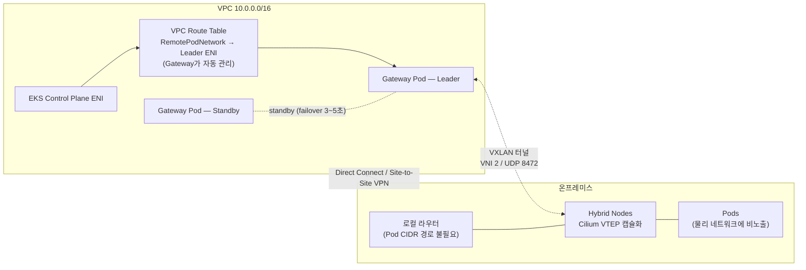

## 개요

Hybrid Nodes Gateway는 "Pod CIDR을 온프레미스에서 라우팅 가능하게 만들어야 하는" 요건을 제거하는 관리형 게이트웨이입니다(2026년 4월 21일 GA). 본 문서는 Gateway의 동작 메커니즘, 도입 전 체크리스트, 5단계 구축 절차, 그리고 운영 태세(사이징·HA·모니터링·제거)를 다룹니다. Gateway 도입 여부의 판단 기준은 [아키텍처 결정 가이드](../overview-architecture/architecture-decision-guide.md)를 참조합니다.

## 동작 메커니즘

Gateway는 Cilium CNI의 VTEP(VXLAN Tunnel Endpoint) 기능을 활용합니다. VPC 안의 EC2 게이트웨이 노드와 온프레미스의 Cilium 노드 사이에 VXLAN 터널(`hybrid_vxlan0` 인터페이스, VNI 2, UDP 8472)을 구성하고 Pod 트래픽을 캡슐화해 전달합니다. 물리 네트워크에는 노드 IP 간 UDP 트래픽만 흐르며 Pod CIDR은 노출되지 않습니다.



Gateway는 네 가지 메커니즘으로 동작합니다.

1. **VXLAN 터널링**: 게이트웨이가 `hybrid_vxlan0` 인터페이스를 생성하고, `CiliumNode` 오브젝트를 감시하는 노드 컨트롤러가 하이브리드 노드의 조인/이탈에 따라 FDB·ARP 엔트리와 라우트를 자동 추가·제거합니다.
2. **VPC 라우트 테이블 관리**: leader가 지정된 VPC 라우트 테이블에 "Pod CIDR → leader의 primary ENI" 경로를 생성·교체합니다.
3. **Cilium VTEP 통합**: leader가 `CiliumVTEPConfig` CRD를 생성해 하이브리드 노드의 Cilium 에이전트에게 VPC행 트래픽의 터널 엔드포인트(leader 노드 IP)를 알립니다.
4. **Leader election**: Kubernetes Lease 기반 active-standby 모델입니다. 두 게이트웨이 Pod가 pod anti-affinity로 서로 다른 노드에서 실행되고, **두 Pod 모두** 기동 시점에 VXLAN 인터페이스와 전체 VTEP 엔트리를 사전 구성합니다. leader 장애 시 standby는 라우트 테이블과 `CiliumVTEPConfig`만 갱신하면 되므로 **예상 failover 시간은 약 3~5초**입니다(공식 문서 명시).

**Gateway가 하지 않는 것**도 명확합니다. Gateway는 NAT가 아니므로 대역 중복을 해소하지 못하며, Node 대역 라우팅과 VPC↔온프레미스 사설 연결 요건은 그대로 유지됩니다.

## 도입 전 체크리스트

| # | 항목 | 내용 |
|---|------|------|
| 1 | Cilium 버전 | EKS 배포판 Cilium **1.17.13-1 / 1.18.8-1 / 1.19.2-1 이상** (VTEP 지원 최소 버전) |
| 2 | Cilium 설정 | `vtep.enabled=true` + `l7Proxy=false` 필수. L7 proxy가 켜져 있으면 VTEP 트래픽이 가로채여 폐기될 수 있음 |
| 3 | 클라우드 노드 CNI | 게이트웨이 노드 포함 클라우드 노드는 AWS VPC CNI 필수 (VPC-native 라우팅 의존) |
| 4 | 게이트웨이 EC2 | 최소 2대, 서로 다른 AZ 권장, source/destination check 비활성화 |
| 5 | IAM 권한 | `ec2:DescribeRouteTables`, `ec2:CreateRoute`, `ec2:ReplaceRoute`, `ec2:DescribeInstances` — EKS Pod Identity로 게이트웨이 서비스 어카운트에만 부여 권장 |
| 6 | 방화벽 | 게이트웨이 SG와 온프레미스 방화벽 양쪽에서 **UDP 8472** inbound/outbound 허용 |
| 7 | VPC CNI SNAT 예외 | `AWS_VPC_K8S_CNI_EXCLUDE_SNAT_CIDRS`에 하이브리드 Pod CIDR 등록 |
| 8 | 전송 암호화 | VXLAN 무암호화 — DX MACsec 또는 VPN을 전송 계층으로 확보 |

## 1단계: Cilium 재구성

기존 Cilium 설치에 VTEP를 활성화하고 L7 proxy를 비활성화합니다.

```bash
helm upgrade cilium oci://public.ecr.aws/eks/cilium/cilium \
  --version CILIUM_VERSION \
  --namespace kube-system \
  --reuse-values \
  --set vtep.enabled=true \
  --set l7Proxy=false

kubectl rollout restart daemonset/cilium -n kube-system
kubectl rollout status daemonset/cilium -n kube-system

# 적용 확인
kubectl get configmap cilium-config -n kube-system -o yaml | grep -E "enable-vtep|enable-l7-proxy"
# enable-l7-proxy: "false" / enable-vtep: "true" 이면 정상
```

:::warning l7Proxy=false의 영향
`l7Proxy=false`는 Cilium의 L7 네트워크 정책(HTTP-aware policy)과 Envoy 기반 기능을 비활성화합니다. 해당 기능을 사용 중인 클러스터는 Gateway 도입 전 대체 방안(게이트웨이/서비스 메시 레벨 L7 제어)을 검토해야 합니다.
:::

## 2단계: VPC CNI SNAT 예외

클라우드 Pod에서 하이브리드 Pod 엔드포인트를 갖는 ClusterIP Service로 향하는 트래픽이 VPC 라우팅을 타도록 SNAT 예외를 설정합니다.

```bash
kubectl set env daemonset aws-node -n kube-system \
  AWS_VPC_K8S_CNI_EXCLUDE_SNAT_CIDRS=POD_CIDRS   # 쉼표 구분 복수 지정 가능
```

IP 직접 지정 Pod-to-Pod 통신은 이 설정 없이도 동작하지만, ClusterIP Service 경유 트래픽에는 필수입니다.

## 3단계: 게이트웨이 노드 준비

**EKS Auto Mode (권장)** — `NodeClass`/`NodePool`로 레이블·테인트·source/dest check를 선언적으로 구성합니다.

```yaml
apiVersion: eks.amazonaws.com/v1
kind: NodeClass
metadata:
  name: hybrid-gateway
spec:
  advancedNetworking:
    sourceDestCheck: DisabledPrimaryENI   # 자기 앞으로 오지 않은 트래픽 포워딩 허용
  role: YOUR_NODE_ROLE
  securityGroupSelectorTerms:
    - tags:
        aws:eks:cluster-name: YOUR_CLUSTER_NAME
  subnetSelectorTerms:                     # 서로 다른 AZ의 서브넷 2개
    - id: SUBNET_ID_1
    - id: SUBNET_ID_2
---
apiVersion: karpenter.sh/v1
kind: NodePool
metadata:
  name: hybrid-gateway
spec:
  template:
    metadata:
      labels:
        hybrid-gateway-node: "true"        # Helm 차트의 node selector 대상
    spec:
      nodeClassRef:
        group: eks.amazonaws.com
        kind: NodeClass
        name: hybrid-gateway
      requirements:
        - key: karpenter.sh/capacity-type
          operator: In
          values: ["on-demand"]
        - key: eks.amazonaws.com/instance-category
          operator: In
          values: ["c", "m", "r"]
        - key: eks.amazonaws.com/instance-generation
          operator: Gt
          values: ["4"]
      taints:
        - key: hybrid-gateway-node
          effect: NoSchedule               # 게이트웨이 Pod 전용 노드로 격리
```

**Managed node group (대안)** — 전용 노드 그룹에 `hybrid-gateway-node=true` 레이블과 `NoSchedule` 테인트를 지정하고, 부팅 시 source/dest check를 비활성화하는 user-data를 담은 런치 템플릿을 연결합니다(노드 IAM role에 `ec2:ModifyNetworkInterfaceAttribute` 권한 필요). Helm 설치 시 `--set autoMode.enabled=false`를 추가합니다. 상세 절차는 [공식 getting-started 문서](https://docs.aws.amazon.com/eks/latest/userguide/hybrid-nodes-gateway-getting-started.html)를 참조합니다.

## 4단계: IAM 권한 (Pod Identity 권장)

```bash
# Pod Identity Agent 애드온 설치 (미설치 시)
aws eks create-addon --cluster-name CLUSTER_NAME --addon-name eks-pod-identity-agent

# 라우트 테이블 관리 권한을 가진 role 생성 후 게이트웨이 서비스 어카운트와 연결
aws eks create-pod-identity-association \
  --cluster-name CLUSTER_NAME \
  --namespace eks-hybrid-nodes-gateway \
  --service-account eks-hybrid-nodes-gateway \
  --role-arn arn:aws:iam::ACCOUNT_ID:role/EKSHybridNodesGatewayRole
```

노드 IAM role에 정책을 붙이는 방법도 지원되나, 이 경우 게이트웨이 노드의 모든 Pod가 라우트 변경 권한을 갖게 되므로 Pod Identity로 서비스 어카운트에만 부여하는 방식이 권장됩니다.

## 5단계: Helm 설치

```bash
helm install eks-hybrid-nodes-gateway \
  oci://public.ecr.aws/eks/eks-hybrid-nodes-gateway \
  --version 1.0.0 \
  --namespace eks-hybrid-nodes-gateway \
  --create-namespace \
  --set vpcCIDR=VPC_CIDR \
  --set podCIDRs=POD_CIDRS \
  --set routeTableIDs=ROUTE_TABLE_IDS
```

| 필수 값 | 의미 | 주의사항 |
|---------|------|----------|
| `vpcCIDR` | EKS 클러스터 VPC의 CIDR | VPC에 secondary CIDR을 추가하면 이 값도 갱신 필요 |
| `podCIDRs` | 하이브리드 노드 Cilium의 Pod CIDR (쉼표 구분) | Cilium `clusterPoolIPv4PodCIDRList`·`RemotePodNetwork`와 일치해야 함 |
| `routeTableIDs` | Gateway가 라우트를 프로그래밍할 VPC 라우트 테이블 ID (쉼표 구분) | **하이브리드 Pod와 통신하는 모든 서브넷의 라우트 테이블을 전부 열거** — 누락된 테이블에 연결된 서브넷에서는 하이브리드 Pod 접근 불가 |

## 설치 검증

```bash
# 게이트웨이 Pod 2개 Running 확인
kubectl get pods -n eks-hybrid-nodes-gateway

# leader lease 확인 (HOLDER 열에 leader Pod 표시)
kubectl get lease -n eks-hybrid-nodes-gateway

# VPC 라우트 테이블에 Pod CIDR → leader ENI 경로 생성 확인
aws ec2 describe-route-tables --route-table-ids ROUTE_TABLE_ID \
  --query "RouteTables[].Routes[?DestinationCidrBlock=='POD_CIDR']"

# 하이브리드 노드 측 VTEP 설정 확인
kubectl get ciliumvtepconfig hybrid-gateway -o yaml
```

## 운영 태세: Helm 관리형 vs 수동 EC2

"Kubernetes 장애 시 게이트웨이도 함께 죽는 것 아닌가 — EC2에 수동으로 iptables 게이트웨이를 만드는 게 안전하지 않은가"라는 질문이 자주 제기됩니다. 결론부터 말하면 **Helm 관리형이 공식 지원되는 유일한 배포 형태**이며, 수동 EC2 구성은 다음 이유로 비권장입니다.

1. **자동화의 대체 불가**: Gateway는 `CiliumNode` 감시를 통한 VTEP 엔트리 자동 관리, leader 장애 시 VPC 라우트·`CiliumVTEPConfig` 자동 갱신을 수행합니다. 수동 구성은 노드 증감·장애 시마다 사람이 FDB/ARP/라우트를 갱신해야 합니다.
2. **장애 도메인 분석**: 게이트웨이 Pod는 게이트웨이 EC2 노드 위에서 실행되며, 의존 대상은 EKS 컨트롤 플레인(AWS 관리형, SLA 제공)과 게이트웨이 EC2 자체입니다. "K8s 장애"의 실체가 컨트롤 플레인 장애라면 이는 AWS 관리 영역이고, 워커 노드 장애라면 다른 AZ의 standby가 3~5초 내 승계합니다. 수동 EC2 구성도 EC2 장애에는 똑같이 노출되며, 오히려 자동 failover가 없습니다.
3. **데이터 플레인 독립성**: VXLAN 포워딩은 커널 레벨에서 동작하므로, 컨트롤 플레인이 일시적으로 불안정해도 이미 프로그래밍된 터널의 트래픽 포워딩은 계속됩니다. 컨트롤 플레인 의존은 구성 변경(노드 증감·failover) 시점에만 발생합니다.

## 인스턴스 사이징: 수직 확장 원칙

Gateway는 active-standby 모델이므로 **트래픽은 항상 leader 1대만 처리**합니다. replica를 늘려도(수평 확장) 가용성만 개선될 뿐 처리량은 늘지 않으며, 성능은 인스턴스 타입의 네트워크 대역폭으로만(수직 확장) 확장됩니다. 이것이 공식 문서의 명시적 가이드입니다.

t 계열 저사양 인스턴스(t2.small 등)는 게이트웨이 노드로 부적합합니다. 게이트웨이는 VPC↔하이브리드 Pod 간 **모든** 트래픽을 포워딩하는 병목 지점이고, VXLAN 캡슐화는 패킷당 오버헤드를 추가하므로 네트워크 성능(대역폭·PPS)이 낮은 인스턴스는 크로스 네트워크 통신 전체의 상한이 됩니다. 공식 권장 인스턴스는 다음과 같습니다.

| 규모 | 인스턴스 | 네트워크 | 비고 |
|------|----------|----------|------|
| 프로덕션 (하이브리드 노드 10~100대, 중간 트래픽) | `c6in.xlarge` | 최대 30Gbps | 네트워크 최적화, 공식 권장 |
| 〃 | `c6i.xlarge` / `c7i.xlarge` | 최대 12.5Gbps | 비용·성능 균형 |
| 고처리량 (100대+, 대용량 트래픽) | `c6in.2xlarge` | 최대 40Gbps | 공식 권장 |
| 〃 최대 구성 | `c6in.4xlarge` | 최대 50Gbps | 데이터 집약 워크로드 |

메트릭(`hybrid_gateway_primary_nic_*`, `hybrid_gateway_vxlan_*`)으로 실사용량을 관측한 후 타입을 조정합니다.

## 고가용성과 failover

- 게이트웨이 Pod 2개가 pod anti-affinity로 서로 다른 노드에서 실행되며, **서로 다른 AZ** 배치를 권장합니다(AZ 장애가 leader/standby를 동시에 잃지 않도록).
- 두 Pod 모두 상시 VXLAN 인터페이스·VTEP 엔트리를 유지하므로, failover 시 라우트 테이블과 `CiliumVTEPConfig` 갱신만 수행합니다. **예상 failover 시간 약 3~5초**이며, 이 동안 VPC↔하이브리드 Pod 트래픽이 중단됩니다.
- leader election 파라미터 기본값(lease 3s / renew 2s / retry 1s)은 빠른 failover에 튜닝되어 있습니다. 더 줄이면 네트워크 순단 시 오탐 failover 위험이 커지므로 대부분의 환경에서 기본값이 적절합니다.
- 게이트웨이-VPC 리소스 간 크로스 AZ 트래픽에는 표준 크로스 AZ 데이터 전송 요금이 부과됩니다.

## 모니터링

게이트웨이는 8088 포트에 health(`/healthz`)·readiness(`/readyz`) 엔드포인트를, 10080 포트에 Prometheus 메트릭(`/metrics`)을 노출합니다. 핵심 관측 지표는 다음과 같습니다.

| 메트릭 | 용도 |
|--------|------|
| `hybrid_gateway_leader_is_active` | leader/standby 상태 (1=leader) |
| `hybrid_gateway_hybrid_nodes_configured` | VTEP 구성된 하이브리드 노드 수 |
| `hybrid_gateway_aws_route_table_update_errors_total` | 라우트 갱신 실패 (IAM·라우트 테이블 문제 조기 탐지) |
| `hybrid_gateway_vxlan_rx/tx_bytes_total` | VXLAN 터널 트래픽량 (사이징 판단 근거) |
| `hybrid_gateway_primary_nic_rx/tx_bytes_total` | 인스턴스 네트워크 사용량 (대역폭 상한 대비 사용률) |

CloudWatch Observability 애드온으로 `eks-hybrid-nodes-gateway` 네임스페이스의 10080 포트를 스크래핑하도록 구성할 수 있습니다.

## 제거 시 주의: 라우트 수동 정리

`helm uninstall`은 Gateway가 생성한 VPC 라우트 엔트리를 자동 삭제하지 않습니다. 제거 후 라우트가 남아 있으면 더 이상 게이트웨이가 아닌 인스턴스로 트래픽이 향하므로 반드시 수동 삭제합니다.

```bash
helm uninstall eks-hybrid-nodes-gateway --namespace eks-hybrid-nodes-gateway

aws ec2 delete-route \
  --route-table-id ROUTE_TABLE_ID \
  --destination-cidr-block POD_CIDR
```

## 기타 제약

- **클러스터당 1세트**: 게이트웨이 배포 하나는 단일 EKS 클러스터를 담당합니다. 멀티 클러스터 환경은 클러스터별로 배포합니다.
- **리전·비용**: China 리전 제외 전 Hybrid Nodes 지원 리전에서 사용 가능합니다. Gateway 자체는 무료이며 게이트웨이용 EC2와 Auto Mode 관리 요금만 과금됩니다. 코드는 [오픈소스로 공개](https://github.com/aws/eks-hybrid-nodes-gateway)되어 있습니다.

## 권장 사항 요약

- Cilium 최소 버전(1.17.13-1/1.18.8-1/1.19.2-1)과 `vtep.enabled=true`+`l7Proxy=false`를 도입 전 확정하고, L7 정책 사용 여부를 먼저 점검합니다.
- 게이트웨이 노드는 서로 다른 AZ의 네트워크 최적화 인스턴스(`c6in.xlarge` 이상)로 구성하고, t 계열은 사용하지 않습니다.
- IAM 권한은 Pod Identity로 게이트웨이 서비스 어카운트에만 부여합니다.
- `routeTableIDs`에 하이브리드 Pod와 통신하는 모든 서브넷의 라우트 테이블을 빠짐없이 열거합니다.
- VXLAN은 무암호화이므로 DX MACsec 또는 VPN을 전송 계층 암호화로 확보합니다.
- `hybrid_gateway_*` 메트릭으로 대역폭 사용률과 라우트 갱신 오류를 상시 관측합니다.

## 참고 자료

### 공식 문서
- [Amazon EKS Hybrid Nodes gateway](https://docs.aws.amazon.com/eks/latest/userguide/hybrid-nodes-gateway-overview.html) — Gateway 아키텍처, failover 3~5초, 제약 사항
- [Get started with EKS Hybrid Nodes gateway](https://docs.aws.amazon.com/eks/latest/userguide/hybrid-nodes-gateway-getting-started.html) — 전제 조건, IAM, NodeClass/NodePool, Helm 설치
- [Configure CNI for the Hybrid Nodes gateway](https://docs.aws.amazon.com/eks/latest/userguide/hybrid-nodes-gateway-cni.html) — Cilium 최소 버전, vtep/l7Proxy 설정, VPC CNI SNAT 예외
- [Amazon EKS Hybrid Nodes gateway operations](https://docs.aws.amazon.com/eks/latest/userguide/hybrid-nodes-gateway-operations.html) — failover 시퀀스, 인스턴스 사이징, 메트릭

### 기술 블로그
- [Introducing the Amazon EKS Hybrid Nodes gateway — AWS What's New](https://aws.amazon.com/about-aws/whats-new/2026/04/amazon-eks-hybrid-nodes-gateway/) — GA 발표 (2026-04-21)
- [Simplify hybrid Kubernetes networking with Amazon EKS Hybrid Nodes gateway — AWS Containers Blog](https://aws.amazon.com/blogs/containers/simplify-hybrid-kubernetes-networking-with-amazon-eks-hybrid-nodes-gateway/) — Gateway 딥다이브, Cilium values 예시
- [aws/eks-hybrid-nodes-gateway — GitHub](https://github.com/aws/eks-hybrid-nodes-gateway) — Gateway 오픈소스 저장소

### 관련 문서 (내부)
- [아키텍처 결정 가이드](../overview-architecture/architecture-decision-guide.md) — Gateway 도입 여부 판단 기준
- [CIDR 설계와 대역 최소화](./cidr-network-design.md) — Gateway 도입 시 축소되는 등록 범위
- [방화벽·DNS 사전 등록 가이드](./firewall-connectivity.md) — UDP 8472 룰과 SG 구성
