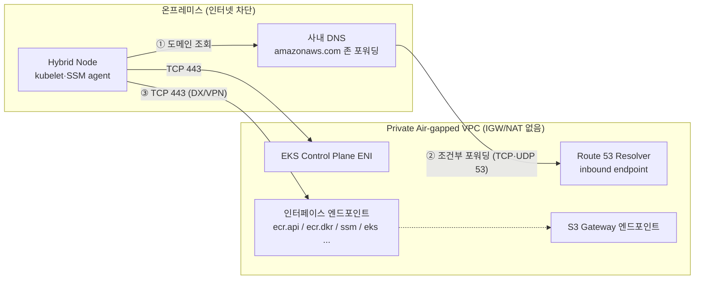

## 개요

퍼블릭 인터넷(IGW·NAT)이 차단된 사설 폐쇄망([Private Air-gapped VPC](../overview-architecture/hybrid-nodes-fundamentals#에어갭air-gap-환경의-두-가지-정의))에서 하이브리드 노드를 운영하려면, 노드가 필요로 하는 모든 AWS 서비스 호출이 DX/VPN → VPC → 인터페이스 VPC 엔드포인트(PrivateLink)의 사설 경로로 완결되어야 합니다. 본 문서는 EKS 클러스터의 Private API 엔드포인트 구성, 용도별 필수 엔드포인트 매핑, 엔드포인트 보안 그룹, 그리고 온프레미스에서 엔드포인트 도메인을 해석하기 위한 DNS 설계를 다룹니다. 방화벽 룰 관점의 등록 절차는 [방화벽·DNS 사전 등록](./firewall-connectivity)을 참조합니다.

## 두 개의 API, 두 개의 사설 경로

폐쇄망 설계에서 가장 잦은 혼동은 "EKS 엔드포인트"가 두 가지라는 점입니다.

| 구분 | Kubernetes API 엔드포인트 | EKS 관리 API 엔드포인트 (`eks`) |
|------|--------------------------|--------------------------------|
| 호출 주체 | kubelet, kubectl, Pod | `nodeadm`(DescribeCluster·ListAccessEntries), IaC 도구 |
| 사설화 방법 | 클러스터 **Private endpoint access 모드** — 컨트롤 플레인 ENI(Cross-Account ENI) 경유 | `com.amazonaws.<region>.eks` 인터페이스 엔드포인트 |
| DNS 특성 | Private 모드에서 클러스터 도메인이 ENI 사설 IP로 해석 (VPC 연결 Private Hosted Zone) | Private DNS 활성화 시 `eks.<region>.amazonaws.com`이 엔드포인트 IP로 해석 |

클러스터를 Private access 모드로 생성하면 kubelet의 API server 통신은 VPC 내부의 컨트롤 플레인 ENI로만 향합니다. 하이브리드 노드는 DX/VPN을 통해 이 ENI 서브넷 CIDR에 도달하므로 인터넷 없이 등록·운영이 가능합니다. AMP managed collector 등 일부 통합은 Private endpoint access를 전제 조건으로 요구합니다.

하이브리드 노드 클러스터의 엔드포인트 액세스 모드는 **Public 또는 Private 중 하나**여야 하며, "Public and Private" 혼합 모드는 지원되지 않습니다. 혼합 모드에서는 VPC 외부의 노드가 조회하는 API 도메인이 퍼블릭 IP로 해석되어 사설 경로 설계가 깨지기 때문입니다. 폐쇄망 구성은 Private 단일 모드가 정답입니다.

:::warning Private 모드의 DNS 전제 조건
Private 모드 클러스터의 API 도메인은 VPC에 연결된 Private Hosted Zone에서만 해석됩니다. 온프레미스 노드가 이 도메인을 해석하려면 **Route 53 Resolver inbound endpoint**를 VPC에 배치하고 온프레미스 DNS가 해당 존을 포워딩해야 합니다([DNS 연동 구성](./firewall-connectivity#zone-d-컨트롤-플레인-eni-대역과-dns)). 이 경로가 없으면 노드는 API 엔드포인트 주소 자체를 찾지 못합니다.
:::

## 필수 인터페이스 엔드포인트 매핑

하이브리드 노드가 상시·설치 시점에 호출하는 서비스를 용도별로 매핑하면 다음과 같습니다. 서비스명은 모두 `com.amazonaws.<region>.` 접두사를 생략한 표기입니다.

| 용도 | 엔드포인트 | 필수 여부 |
|------|-----------|----------|
| 컨테이너 이미지 pull (ECR 인증·매니페스트) | `ecr.api`, `ecr.dkr` | 필수 |
| 컨테이너 이미지 레이어 (ECR 백엔드 스토리지) | **S3 Gateway 엔드포인트** | 필수 |
| 클러스터 정보 조회 (`nodeadm`) | `eks` | 필수 |
| 노드 자격 증명 — SSM 방식 | `ssm`, `ssmmessages`, `ec2messages` | SSM 사용 시 필수 |
| 노드 자격 증명 — IAM Roles Anywhere 방식 | `rolesanywhere` | IAM RA 사용 시 필수 |
| Pod 자격 증명 — IRSA | `sts` | IRSA 사용 시 |
| Pod 자격 증명 — EKS Pod Identity | `eks-auth` | Pod Identity 사용 시 |
| 로그·메트릭 수집 (CloudWatch) | `logs`, `monitoring` | 관측 구성 시 |
| Prometheus 원격 쓰기 (AMP) | `aps-workspaces` | AMP 사용 시 |

- **S3는 Gateway 타입**입니다. 인터페이스 엔드포인트가 아니라 라우트 테이블에 prefix list 경로를 추가하는 방식이며, ECR 이미지 레이어 다운로드가 S3를 경유하므로 ECR 엔드포인트와 반드시 함께 구성합니다.
- `ssmmessages`는 SSM agent의 상시 채널·Session Manager 접속에, `ec2messages`는 레거시 메시지 채널에 사용됩니다. SSM 기반 하이브리드 노드는 세 개를 함께 개설하는 것이 안전합니다.
- IAM Roles Anywhere는 인터페이스 엔드포인트를 공식 지원하므로, 사설 PKI 기반 인증도 인터넷 없이 완결됩니다.
- CloudWatch Network Flow Monitor를 클라우드 노드에 사용하는 경우 `networkflowmonitor` 계열 엔드포인트를 추가합니다([NFM 적용성 분석](../operations-cost/observability-monitoring#network-flow-monitor-적용성-분석)).

```bash
# 인터페이스 엔드포인트 생성 예시 (ECR API)
aws ec2 create-vpc-endpoint \
  --vpc-id VPC_ID \
  --vpc-endpoint-type Interface \
  --service-name com.amazonaws.us-west-2.ecr.api \
  --subnet-ids SUBNET_ID_1 SUBNET_ID_2 \
  --security-group-ids ENDPOINT_SG_ID \
  --private-dns-enabled

# S3 Gateway 엔드포인트 생성 예시
aws ec2 create-vpc-endpoint \
  --vpc-id VPC_ID \
  --vpc-endpoint-type Gateway \
  --service-name com.amazonaws.us-west-2.s3 \
  --route-table-ids ROUTE_TABLE_ID_1 ROUTE_TABLE_ID_2
```

## 온프레미스에서 엔드포인트로: DNS와 라우팅

인터페이스 엔드포인트는 VPC 서브넷에 ENI(사설 IP)로 존재합니다. 온프레미스 노드가 이를 사용하려면 두 조건이 충족되어야 합니다.

1. **DNS 해석**: `--private-dns-enabled`로 생성한 엔드포인트는 서비스 기본 도메인(`ssm.us-west-2.amazonaws.com` 등)을 엔드포인트 사설 IP로 해석하는 Private Hosted Zone을 VPC에 연결합니다. 이 해석 역시 VPC 내부에서만 유효하므로, 온프레미스 DNS가 `amazonaws.com` 계열 조회를 **Route 53 Resolver inbound endpoint로 조건부 포워딩**하도록 구성합니다.
2. **라우팅**: 온프레미스에서 엔드포인트 ENI가 위치한 서브넷 CIDR로의 경로가 DX/VPN을 통해 존재해야 합니다. 통상 VPC CIDR 전체 경로로 충족됩니다.



## 엔드포인트 보안 그룹

인터페이스 엔드포인트 ENI에 연결하는 보안 그룹은 호출 주체의 대역에서 TCP 443 inbound를 허용해야 합니다.

| 방향 | 프로토콜/포트 | 출발지 | 사유 |
|------|--------------|--------|------|
| Inbound | TCP 443 | RemoteNodeNetwork (Node CIDR) | kubelet·nodeadm·SSM agent의 서비스 호출 |
| Inbound | TCP 443 | RemotePodNetwork (Pod CIDR) | Pod의 STS·CloudWatch 등 호출 (CNI NAT 미사용 시) |
| Inbound | TCP 443 | VPC CIDR | 클라우드 노드·게이트웨이 노드의 호출 |

CNI egress NAT를 사용하는 구성에서는 Pod 발신이 노드 IP로 변환되므로 Node CIDR 허용으로 충분합니다. Route 53 Resolver inbound endpoint의 보안 그룹에는 온프레미스 DNS 서버 대역의 TCP·UDP 53 inbound를 별도로 허용합니다.

## 폐쇄망에서도 남는 퍼블릭 의존성

VPC 엔드포인트로 대체되지 않는 다운로드 경로가 있습니다. 설계 단계에서 대체 수단을 확정합니다.

| 항목 | 기본 출처 | 폐쇄망 대안 |
|------|----------|------------|
| `nodeadm` 바이너리·노드 아티팩트 | `hybrid-assets.eks.amazonaws.com` (CloudFront) | 내부 아티팩트 저장소에 사전 미러링, OS 골든 이미지에 포함 |
| Cilium·Gateway Helm 차트/이미지 | `public.ecr.aws` (ECR Public) | 프라이빗 ECR 또는 Harbor로 사전 복제 ([Harbor 통합](../storage-registry/harbor-registry)) |
| OS 패키지 (containerd 등) | OS 공식 저장소 | 사설 yum/apt 미러 ([업그레이드와 수명주기](../operations-cost/upgrade-lifecycle#폐쇄망-업그레이드-사설-미러-구성)) |

## 구성 검증

```bash
# 노드에서 — 자격 증명·API 도달성 종합 검증
sudo nodeadm debug -c file://nodeConfig.yaml

# 엔드포인트 DNS 해석 확인 (온프레미스 노드에서 사설 IP가 나와야 정상)
dig +short ecr.api.us-west-2.amazonaws.com   # 예: 10.0.x.x
dig +short ssm.us-west-2.amazonaws.com

# ECR pull 경로 확인
aws ecr get-login-password --region us-west-2 > /dev/null && echo "ECR API OK"
```

`nodeadm debug`는 자격 증명 엔드포인트 도달성, Hybrid Nodes IAM role 자격 증명 발급, Kubernetes API 엔드포인트 도달성·인증서 유효성, 클러스터 인증을 순서대로 검증하고 실패 시 조치를 제시합니다.

## 권장 사항 요약

- 클러스터는 Private endpoint access 모드로 생성하고, 온프레미스 DNS → Route 53 Resolver inbound endpoint 포워딩을 선행 구성합니다.
- 이미지 경로는 `ecr.api`+`ecr.dkr`+S3 Gateway 세 개가 한 세트입니다 — S3 Gateway 누락이 가장 잦은 실수입니다.
- 자격 증명 방식(SSM vs IAM RA)에 따라 엔드포인트 세트가 달라지므로 [노드 인증 방식](../security-authn/node-authentication) 확정 후 개설합니다.
- 엔드포인트 SG에 Node CIDR(필요시 Pod CIDR)의 TCP 443 inbound를 허용합니다.
- `nodeadm` 바이너리·ECR Public 차트·OS 패키지는 엔드포인트로 해결되지 않으므로 내부 미러를 별도 구성합니다.
- 구성 완료 후 `nodeadm debug`와 `dig` 기반 해석 검증을 표준 체크리스트로 수행합니다.

## 참고 자료

### 공식 문서
- [Access Amazon EKS using AWS PrivateLink](https://docs.aws.amazon.com/eks/latest/userguide/vpc-interface-endpoints.html) — EKS 관리 API 인터페이스 엔드포인트와 제약
- [Deploy private clusters with limited internet access](https://docs.aws.amazon.com/eks/latest/userguide/private-clusters.html) — 프라이빗 클러스터 필수 엔드포인트 (ecr.api·ecr.dkr·s3·sts)
- [Improve the security of EC2 instances by using VPC endpoints for Systems Manager](https://docs.aws.amazon.com/systems-manager/latest/userguide/setup-create-vpc.html) — ssm·ssmmessages·ec2messages 엔드포인트
- [IAM Roles Anywhere and interface VPC endpoints](https://docs.aws.amazon.com/rolesanywhere/latest/userguide/vpc-interface-endpoints.html) — rolesanywhere PrivateLink 지원
- [Prepare networking for hybrid nodes](https://docs.aws.amazon.com/eks/latest/userguide/hybrid-nodes-networking.html) — 하이브리드 노드가 접근해야 하는 엔드포인트 목록

### 관련 문서 (내부)
- [EKS Hybrid Nodes 개념과 동작 원리](../overview-architecture/hybrid-nodes-fundamentals) — 에어갭 두 가지 정의와 지원 범위
- [방화벽·DNS 사전 등록과 TGW 토폴로지](./firewall-connectivity) — Route 53 Resolver 구성과 방화벽 룰
- [업그레이드와 수명주기 관리](../operations-cost/upgrade-lifecycle) — 폐쇄망 사설 미러 구성
- [Harbor 레지스트리 통합](../storage-registry/harbor-registry) — ECR Public 의존성 제거
