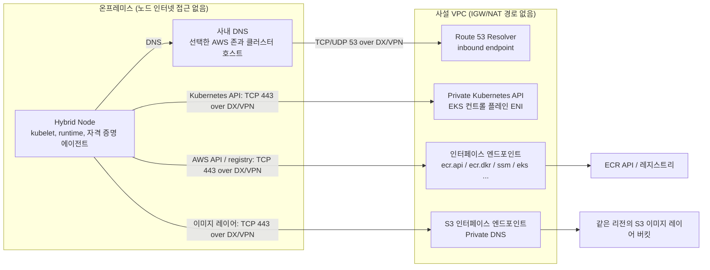

## 개요

퍼블릭 인터넷(IGW·NAT) 경로가 없는 사설 폐쇄망([Private Air-gapped VPC](../overview-architecture/hybrid-nodes-fundamentals#에어갭air-gap-환경의-두-가지-정의))에서도, DX/VPN으로 AWS에 연결하고 필요한 API·레지스트리·아티팩트 경로를 준비하면 EKS Hybrid Nodes를 구성할 수 있습니다. 이는 AWS와 물리적으로 단절된 환경을 뜻하지 않습니다. 본 문서는 **IPv4, 같은 리전의 프라이빗 ECR, 클러스터 Private-only API 접근**을 전제로 Kubernetes API와 AWS 서비스 API의 경로, S3 이미지 레이어, DNS·보안 그룹·미러 의존성을 구분합니다. 방화벽 등록은 [방화벽·DNS 사전 등록](./firewall-connectivity)을 참조합니다.

## 두 개의 API, 두 개의 사설 경로

"EKS 엔드포인트"를 구성할 때 다음 두 경로를 각각 준비합니다.

| 구분 | Kubernetes API 엔드포인트 | EKS 관리 API 엔드포인트 (`eks`) |
|------|--------------------------|--------------------------------|
| 호출 주체 | kubelet, kubectl, Pod | `nodeadm`·관리 도구의 클러스터 정보 조회(예: DescribeCluster) |
| 사설화 방법 | 클러스터 **Private endpoint access** — EKS 컨트롤 플레인 ENI 경유 | `com.amazonaws.<region>.eks` 인터페이스 엔드포인트 |
| DNS 특성 | 클러스터 API 호스트가 VPC 사설 IP로 해석됨. Private-only API는 공개 DNS에서도 사설 IP를 반환할 수 있음 | Private DNS와 VPC Resolver를 사용하면 `eks.<region>.amazonaws.com`이 인터페이스 엔드포인트 IP로 해석됨 |

이 설계는 `endpointPrivateAccess=true`, `endpointPublicAccess=false`를 사용합니다. 관리 API의 `eks` 인터페이스 엔드포인트가 Kubernetes API 접근을 대신하지 않습니다. VPC의 `enableDnsSupport`·`enableDnsHostnames`, `AmazonProvidedDNS`를 포함한 DHCP 설정, DX/VPN 양방향 경로 및 클러스터 보안 그룹을 함께 준비해야 합니다. 컨트롤 플레인 ENI는 클러스터 변경 시 교체될 수 있으므로 현재 IP 하나를 영구 주소로 취급하지 않습니다([API 접근](https://docs.aws.amazon.com/eks/latest/userguide/cluster-endpoint.html), [네트워크 요건](https://docs.aws.amazon.com/eks/latest/userguide/hybrid-nodes-networking.html)). AMP managed collector 등 개별 통합의 Private API·대상 접근 조건도 별도로 확인합니다.

[Hybrid Nodes 클러스터 생성 가이드](https://docs.aws.amazon.com/eks/latest/userguide/hybrid-nodes-cluster-create.html)는 Public+Private를 사용할 수 없다고 설명하고, [API 접근 가이드](https://docs.aws.amazon.com/eks/latest/userguide/cluster-endpoint.html)는 권장하지 않는다고 표현합니다. 두 문서 모두 VPC 밖 Hybrid Node가 혼합 모드의 API 호스트를 공개 IP로 해석하는 문제를 설명합니다. 본 폐쇄망 설계에는 혼합 모드를 사용하지 않으며, 이 문서로 다른 모드의 지원 여부를 확장 해석하지 않습니다.

:::warning Private 모드의 DNS 전제 조건
Private-only Kubernetes API가 **VPC의 Private Hosted Zone에서만** 해석되는 것은 아닙니다. 공개 DNS가 사설 API IP를 반환해도 그 IP로 통신하려면 DX/VPN 경로와 허용 규칙이 필요합니다. 반면 이 문서처럼 AWS 서비스의 기본 호스트 이름을 PrivateLink 사설 IP로 해석하려면 VPC Resolver의 Private DNS를 이용하도록 온프레미스 DNS를 연결합니다. 공개 재귀 DNS를 사용할 수 없는 환경의 클러스터 API 조회도 이 Resolver 경로로 처리할 수 있습니다.
:::

## 필수 인터페이스 엔드포인트 매핑

사용하는 기능에 해당하는 엔드포인트를 선택합니다. 서비스명은 `com.amazonaws.<region>.` 접두사를 생략했습니다. 해당 리전의 지원 여부와 에이전트·SDK 버전을 먼저 확인합니다.

| 용도 | 엔드포인트 | 적용 조건 |
|------|-----------|-----------|
| 프라이빗 ECR 인증·API·매니페스트 | `ecr.api`, `ecr.dkr` | 같은 리전의 프라이빗 ECR 사용 시 둘 다 준비 |
| 온프레미스에서 ECR 이미지 레이어 다운로드 | **`s3` 인터페이스 엔드포인트** | S3 리전별 호스트의 Private DNS 및 레이어 버킷 접근 필요 |
| 클러스터 정보 조회 | `eks` | `nodeadm`·관리 도구의 EKS 관리 API 호출 |
| 노드 자격 증명 — SSM 방식 | `ssm`, `ssmmessages`; 조건부 `ec2messages` | SSM hybrid activation, 에이전트 메시징·Session Manager 사용 범위에 맞춤 |
| 노드 자격 증명 — IAM Roles Anywhere 방식 | `rolesanywhere` | 해당 자격 증명 공급자 선택 시 |
| Pod 자격 증명 — IRSA | `sts` | SDK가 리전별 STS 엔드포인트를 사용하도록 설정 |
| Pod 자격 증명 — EKS Pod Identity | `eks-auth` | Pod Identity Agent에서 호출 |
| 로그·메트릭 수집 (CloudWatch) | `logs`, `monitoring` | 실제 수집기 API에 맞춤. EMF 로그 전송과 PutMetricData를 구분 |
| Prometheus 원격 쓰기 (AMP) | `aps-workspaces` | remote-write 사용 시. [AMP 가이드의 리전별 STS 전제](https://docs.aws.amazon.com/prometheus/latest/userguide/AMP-and-interface-VPC.html)와 실제 자격 증명 공급자의 호출 경로도 준비 |

- **S3 Gateway 엔드포인트는 VPC 내부 클라이언트용 경로**입니다. VPN·Direct Connect·TGW 반대편의 온프레미스 클라이언트는 이를 사용할 수 없습니다. ECR 클라이언트는 ECR에서 매니페스트를 받은 뒤 S3에서 레이어를 직접 다운로드합니다. 따라서 여기서는 **노드 → ECR 인터페이스**, **노드 → S3 인터페이스**를 각각 구성하며 ECR 엔드포인트에서 S3 Gateway로 연결되는 경로를 만들지 않습니다([S3 Gateway 제약](https://docs.aws.amazon.com/vpc/latest/privatelink/vpc-endpoints-s3.html), [ECR 레이어 경로](https://docs.aws.amazon.com/AmazonECR/latest/userguide/vpc-endpoints.html)).
- S3에 Private DNS를 켤 때 `PrivateDnsOnlyForInboundResolverEndpoint=true`는 같은 VPC의 S3 Gateway 엔드포인트를 전제로 합니다. 온프레미스는 인터페이스, VPC 내부는 Gateway를 사용하는 비용 최적화 방식입니다. 아래 예시는 이 값을 **명시적으로 `false`**로 설정하여 양쪽 모두 인터페이스를 사용합니다. 이 방식에는 S3 Gateway가 필요 없으며 VPC 내부 트래픽에도 인터페이스 사용 요금이 적용됩니다([S3 Private DNS](https://docs.aws.amazon.com/AmazonS3/latest/userguide/privatelink-interface-endpoints.html#private-dns)).
- SSM Agent **3.3.40.0부터** 사용 가능한 `ssmmessages`를 우선합니다. `ec2messages`는 **2024년 이전에 개설된 리전에서만** 지원되므로, 레거시 에이전트·메시징 경로의 필요성을 확인한 경우에만 추가합니다. 2024년 이후 리전에 세 엔드포인트를 일괄 생성하지 않습니다([메시지 API 조건](https://docs.aws.amazon.com/systems-manager/latest/userguide/systems-manager-setting-up-messageAPIs.html)).
- IAM Roles Anywhere API를 PrivateLink로 호출할 수 있어도 인증서 발급·갱신, 신뢰 앵커·프로파일·IAM 역할 및 자격 증명 도우미 배포는 별도 준비 항목입니다. IRSA를 설정하는 도구의 OIDC discovery/JWKS 접근도 Pod의 STS 호출과 구분합니다. 필요하면 리전별 `oidc-eks` 지원을 [EKS PrivateLink 가이드](https://docs.aws.amazon.com/eks/latest/userguide/vpc-interface-endpoints.html)에서 확인합니다.
- CloudWatch Network Flow Monitor를 사용하는 클라우드 노드에는 선택한 기능의 추가 엔드포인트가 필요할 수 있습니다([NFM 적용성 분석](../operations-cost/observability-monitoring#network-flow-monitor-적용성-분석)). 이 표는 모든 애플리케이션의 전체 의존성을 대신하지 않습니다.

생성 예시는 이미 준비된 **대상 VPC, 서로 다른 AZ의 IPv4 서브넷 두 개, 엔드포인트 보안 그룹, VPC DNS 설정 및 권한 있는 관리용 CLI 자격 증명**을 사용합니다. 관리자 로그인 경로(예: SSO), 할당량, 리전 지원과 기존 Private DNS/엔드포인트 충돌도 사전에 확인합니다. 먼저 다음 입력과 기존 리소스를 확인합니다.

```bash
# Set all inputs for the approved target before using this example.
REGION=us-west-2
: "${PROFILE_NAME:?Set an authorized AWS CLI profile}"
: "${VPC_ID:?Set the target VPC ID}"
: "${SUBNET_ID_1:?Set an endpoint subnet in the first AZ}"
: "${SUBNET_ID_2:?Set an endpoint subnet in another AZ}"
: "${ENDPOINT_SG_ID:?Set the prepared endpoint security group}"

# Inventory existing endpoints; review before selecting any creation commands.
aws ec2 describe-vpc-endpoints \
  --profile "$PROFILE_NAME" --region "$REGION" \
  --filters "Name=vpc-id,Values=$VPC_ID" \
  --query 'VpcEndpoints[].{Id:VpcEndpointId,Service:ServiceName,Type:VpcEndpointType,State:State,PrivateDNS:PrivateDnsEnabled}'
```

이미 있는 엔드포인트는 재사용할 수 있는지 확인하고, 다음 블록에서 없는 엔드포인트의 생성 명령만 선택합니다. 같은 리소스를 반복 생성하는 스크립트이므로 전체 블록을 재실행하지 않습니다. 앞 블록의 입력을 같은 셸에서 사용하고 실패 시 중단합니다.

이 예시는 사용자 지정 엔드포인트 정책을 생략하므로 기본 full-access endpoint policy가 적용됩니다. 호출자의 IAM 권한은 별도로 필요합니다. 정책을 제한한다면 필요한 ECR API·리포지토리 접근과 `arn:aws:s3:::prod-<region>-starport-layer-bucket/*`의 `s3:GetObject`를 허용해야 합니다. SSM 다운로드 등 다른 용도로 쓰는 S3 버킷도 각각 포함합니다.

```bash
# Create only missing, approved ECR endpoints; this is not a reconciliation script.
set -euo pipefail
for SERVICE in ecr.api ecr.dkr; do
  aws ec2 create-vpc-endpoint \
    --profile "$PROFILE_NAME" --region "$REGION" \
    --vpc-id "$VPC_ID" \
    --vpc-endpoint-type Interface \
    --service-name "com.amazonaws.${REGION}.${SERVICE}" \
    --subnet-ids "$SUBNET_ID_1" "$SUBNET_ID_2" \
    --security-group-ids "$ENDPOINT_SG_ID" \
    --ip-address-type ipv4 \
    --private-dns-enabled
done

# S3 private DNS for both VPC and on-premises clients; no S3 gateway prerequisite.
aws ec2 create-vpc-endpoint \
  --profile "$PROFILE_NAME" --region "$REGION" \
  --vpc-id "$VPC_ID" \
  --vpc-endpoint-type Interface \
  --service-name "com.amazonaws.${REGION}.s3" \
  --subnet-ids "$SUBNET_ID_1" "$SUBNET_ID_2" \
  --security-group-ids "$ENDPOINT_SG_ID" \
  --ip-address-type ipv4 \
  --private-dns-enabled \
  --dns-options 'DnsRecordIpType=ipv4,PrivateDnsOnlyForInboundResolverEndpoint=false'
```

생성 응답만으로 준비 완료를 판단하지 않습니다. 각 엔드포인트의 `available` 상태, ENI·Private DNS 설정·적용 정책과 Resolver 구성을 확인한 뒤 해당 클라이언트 경로를 검증합니다. 변경 전 DNS·엔드포인트·경로·정책을 기록하고, 기존 트래픽에 영향을 주는 변경은 복구 경로가 준비된 변경 절차로 수행합니다.

## 온프레미스에서 엔드포인트로: DNS와 라우팅

인터페이스 엔드포인트는 VPC 서브넷의 ENI로 존재합니다. 이 예제의 서비스 기본 호스트 이름을 사용하려면 다음 두 경로를 연결합니다.

1. **DNS 해석**: [Resolver inbound endpoint 구성](https://docs.aws.amazon.com/Route53/latest/DeveloperGuide/resolver-forwarding-inbound-queries.html)과 사내 DNS의 조건부 포워딩을 모두 준비합니다. ECR API의 `api.ecr.<region>.amazonaws.com`, 레지스트리의 `<account>.dkr.ecr.<region>.amazonaws.com`, 레이어 버킷이 속하는 `s3.<region>.amazonaws.com` 및 선택한 자격 증명·관측 서비스의 실제 이름이 VPC Resolver에 도달해야 합니다. 클러스터 API는 조회된 고유 호스트 이름을 사용합니다. 포워딩 범위를 정할 때 와일드카드·하위 도메인 처리와 기존 사내 존 충돌을 확인하며, 모든 `amazonaws.com` 이름을 무조건 같은 사설 서비스로 취급하지 않습니다. S3 인터페이스가 지원하지 않는 legacy global·dash-Region 호스트가 실제 다운로드 경로에 남아 있지 않은지도 확인합니다. 서명된 S3 레이어 URL의 호스트를 임의로 바꾸지 않고, 지원되는 리전별 이름을 Private DNS로 해석합니다([S3 제약과 DNS](https://docs.aws.amazon.com/AmazonS3/latest/userguide/privatelink-interface-endpoints.html)).
2. **라우팅**: 온프레미스에서 Resolver·서비스 엔드포인트·컨트롤 플레인 ENI 서브넷까지, 그리고 VPC에서 실제 발신 Node/Pod CIDR까지 DX/VPN 왕복 경로가 있어야 합니다. VPC와 원격 CIDR 중복, TGW/VGW 연결·라우트 테이블, 보안 그룹·NACL·호스트 방화벽도 확인합니다. DNS가 사설 IP를 반환했다는 사실만으로 연결 성공을 판단하지 않습니다.



S3 Gateway를 VPC 내부 클라이언트의 비용 최적화용으로 함께 둘 수 있지만, 위 온프레미스 데이터 경로에는 포함되지 않습니다. 기존 Resolver 설정을 사용할 때도 선택한 VPC의 서비스 Private DNS를 실제로 조회하는지 확인합니다.

## 엔드포인트 보안 그룹

서비스 인터페이스 ENI 보안 그룹에는 **도착 시점에 관측되는 실제 발신 주소**에서 TCP 443을 허용합니다. Kubernetes API의 TCP 443은 별도의 클러스터 보안 그룹에 적용합니다.

| 방향 | 프로토콜/포트 | 출발지 | 사유 |
|------|--------------|--------|------|
| Inbound | TCP 443 | 필요한 RemoteNodeNetwork (Node CIDR) | 런타임 이미지 다운로드, `nodeadm`, 노드 자격 증명 에이전트 |
| Inbound | TCP 443 | 필요한 RemotePodNetwork (Pod CIDR) | SNAT 없이 STS·CloudWatch 등으로 나가는 Pod 트래픽 |
| Inbound | TCP 443 | 필요한 VPC 내 클라이언트 주소·보안 그룹 | 선택한 클라우드 노드·관리 클라이언트의 서비스 호출 |

CNI egress NAT가 적용되는 **해당 경로**에서는 Pod 발신 주소가 노드 주소로 바뀔 수 있으므로 실제 NAT 결과에 맞춰 허용합니다. 온프레미스 노드에 EC2 보안 그룹 참조를 적용할 수 있다고 가정하지 않습니다. Resolver inbound endpoint의 보안 그룹에는 사내 DNS 서버에서 오는 TCP·UDP 53을 별도로 허용하고, 클라이언트 outbound와 NACL의 응답 경로도 준비합니다. 서비스 엔드포인트 SG가 클러스터 API·웹훅·CNI 포트 규칙까지 대신하지 않습니다.

## 폐쇄망에서도 남는 퍼블릭 의존성

선택한 인터페이스 엔드포인트만으로 설치·업그레이드 의존성이 모두 사라지지는 않습니다. 실제 버전의 파일·이미지·차트·패키지 목록과 체크섬을 정하고, 실행 시 사용할 미러 주소까지 구성합니다.

| 항목 | 기본 출처 | 폐쇄망 대안 |
|------|----------|------------|
| `nodeadm` 바이너리·노드 아티팩트 | `hybrid-assets.eks.amazonaws.com` (CloudFront) | 버전·아키텍처별 사전 미러링 또는 OS 골든 이미지 포함 |
| Cilium·Gateway 차트/이미지 | 배포에 사용되는 `public.ecr.aws` 등 | 프라이빗 ECR 또는 Harbor에 사전 복제하고 실제 참조 변경 ([Harbor 통합](../storage-registry/harbor-registry)) |
| OS 패키지·SSM Agent·Roles Anywhere 도우미 | OS 저장소·리전별 S3 또는 배포 서비스 | OS별 패키지/바이너리 미러와 해당 S3 버킷 허용 ([업그레이드와 수명주기](../operations-cost/upgrade-lifecycle#폐쇄망-업그레이드-사설-미러-구성)) |

ECR의 **pull-through cache 최초 가져오기**는 별도 인터넷 경로가 필요할 수 있으므로, 이 폐쇄망 경로가 첫 번째 외부 이미지 가져오기까지 처리한다고 가정하지 않습니다. 사용 이미지와 레이어를 사전에 준비합니다. 프라이빗 ECR용 `ecr.api`·`ecr.dkr`가 모든 `public.ecr.aws` 차트·이미지 URL을 사설화하는 것도 아닙니다. 추가 다운로드·업데이트·외부 API는 애플리케이션별로 확인합니다([ECR 고려 사항](https://docs.aws.amazon.com/AmazonECR/latest/userguide/vpc-endpoints.html), [Hybrid Nodes 설치/운영 접근 요건](https://docs.aws.amazon.com/eks/latest/userguide/hybrid-nodes-networking.html)).

## 구성 검증

아래는 환경에서 직접 확인할 검증 절차입니다. 이 문서에는 실행 결과가 포함되어 있지 않습니다. `nodeConfig.yaml`에는 설치한 Hybrid Node의 실제 설정을 사용합니다. CLI 프로파일의 IAM 주체와 kubelet·자격 증명 공급자가 사용하는 노드 IAM 주체는 다를 수 있습니다.

```bash
# On the Hybrid Node, with approved CLI credentials; these inputs are independent.
REGION=us-west-2
: "${PROFILE_NAME:?Set the CLI profile being tested}"
: "${REGISTRY_ACCOUNT_ID:?Set the private ECR registry account ID}"
: "${CLUSTER_API_HOST:?Set the exact cluster endpoint host without https://}"

# Check the actual resolver path. Compare answers with the intended ENI inventory.
dig +short "$CLUSTER_API_HOST"
dig +short "api.ecr.${REGION}.amazonaws.com"
dig +short "${REGISTRY_ACCOUNT_ID}.dkr.ecr.${REGION}.amazonaws.com"
dig +short "prod-${REGION}-starport-layer-bucket.s3.${REGION}.amazonaws.com"
# For SSM credentials, also check the selected ssm/ssmmessages endpoint names.

# This checks ECR authorization-token retrieval for this CLI identity only.
aws ecr get-login-password \
  --profile "$PROFILE_NAME" --region "$REGION" > /dev/null && echo "ECR authorization API OK"

# Independently check the installed nodeadm configuration and node identity.
sudo nodeadm debug -c file://nodeConfig.yaml
```

| 검사 | 확인하는 범위 | 확인하지 않는 범위 |
|------|---------------|-------------------|
| `dig` | 사용 중인 resolver가 반환한 이름·IP | TCP/TLS, IAM, 레이어 다운로드 성공 |
| `get-login-password` | 해당 CLI 주체의 ECR 인증 토큰 발급 | 레지스트리 매니페스트·S3 레이어, 노드 런타임 자격 증명 |
| `nodeadm debug` | 구성된 노드 IAM 역할의 자격 증명·Kubernetes API 접근과 인증 등 | 전체 ECR pull, CNI 통신·워크로드 정상 동작 |

이미지 다운로드 경로는 테스트 환경의 Hybrid Node 런타임에서 **사전 복제한 digest 고정 이미지**를 가져와 확인합니다. 로컬 캐시 때문에 다운로드를 건너뛰지 않았는지, 매니페스트와 S3 레이어가 각각 의도한 엔드포인트를 통과했는지 확인합니다. 노드·리전·이미지 digest·런타임 버전·자격 증명 주체와 관측 결과를 기록하되, 토큰·Authorization 헤더·서명된 레이어 URL은 기록물에서 제외합니다. 이 검증은 [nodeadm debug의 공식 검사 범위](https://docs.aws.amazon.com/eks/latest/userguide/hybrid-nodes-nodeadm.html#_nodeadm_debug)와 별도로 수행해야 합니다.

## 권장 사항 요약

- Private-only Kubernetes API와 EKS 관리 API PrivateLink를 별도로 구성하고 DNS·왕복 라우팅·권한을 확인합니다.
- 온프레미스의 프라이빗 ECR 이미지 경로는 `ecr.api` + `ecr.dkr` + **S3 인터페이스**입니다. S3 Gateway는 VPC 내부 클라이언트용 선택지입니다.
- 선택한 S3 Private DNS 모드와 Resolver 포워딩을 함께 설계합니다. 앞의 생성 예시와 같은 전체 인터페이스 경로에는 `PrivateDnsOnlyForInboundResolverEndpoint=false`를 명시합니다.
- [노드 인증 방식](../security-authn/node-authentication), 리전·에이전트/SDK 버전, 실제 수집 기능에 맞춰 엔드포인트와 정책을 선택합니다.
- 노드 아티팩트·외부 이미지·OS 패키지는 버전별 미러를 준비하고 참조를 연결합니다.
- DNS, 토큰 발급, nodeadm 진단, 전체 이미지 다운로드를 서로 다른 검증으로 기록합니다.

## 참고 자료

### 공식 문서

- [Access Amazon EKS using AWS PrivateLink](https://docs.aws.amazon.com/eks/latest/userguide/vpc-interface-endpoints.html) — 관리 API와 별도 OIDC 경로·리전 제약
- [Cluster API server endpoint](https://docs.aws.amazon.com/eks/latest/userguide/cluster-endpoint.html) — Private API와 DNS 동작
- [Create a cluster for hybrid nodes](https://docs.aws.amazon.com/eks/latest/userguide/hybrid-nodes-cluster-create.html) — Hybrid Nodes 생성 전제
- [Amazon ECR VPC endpoints](https://docs.aws.amazon.com/AmazonECR/latest/userguide/vpc-endpoints.html) — 인증·레지스트리·레이어 경로
- [AWS PrivateLink for Amazon S3](https://docs.aws.amazon.com/AmazonS3/latest/userguide/privatelink-interface-endpoints.html) — 인터페이스 접근과 Private DNS 선택
- [Gateway endpoints for Amazon S3](https://docs.aws.amazon.com/vpc/latest/privatelink/vpc-endpoints-s3.html) — 온프레미스 접근 제약
- [Deploy private clusters with limited internet access](https://docs.aws.amazon.com/eks/latest/userguide/private-clusters.html) — VPC 내부 워커용 구성은 클라이언트 위치에 맞춰 해석
- [VPC endpoints for Systems Manager](https://docs.aws.amazon.com/systems-manager/latest/userguide/setup-create-vpc.html) — 에이전트·메시징·S3 의존성
- [Systems Manager message API conditions](https://docs.aws.amazon.com/systems-manager/latest/userguide/systems-manager-setting-up-messageAPIs.html) — 리전·에이전트 버전 조건
- [IAM Roles Anywhere interface endpoints](https://docs.aws.amazon.com/rolesanywhere/latest/userguide/vpc-interface-endpoints.html) — 서비스 API와 정책
- [Prepare networking for hybrid nodes](https://docs.aws.amazon.com/eks/latest/userguide/hybrid-nodes-networking.html) — 설치·운영 접근 경로
- [CreateVpcEndpoint CLI](https://docs.aws.amazon.com/cli/latest/reference/ec2/create-vpc-endpoint.html) — DNS 옵션과 생성 인자

### 관련 문서 (내부)

- [EKS Hybrid Nodes 개념과 동작 원리](../overview-architecture/hybrid-nodes-fundamentals) — 에어갭 두 가지 정의와 지원 범위
- [방화벽·DNS 사전 등록과 TGW 토폴로지](./firewall-connectivity) — Route 53 Resolver 구성과 방화벽 룰
- [업그레이드와 수명주기 관리](../operations-cost/upgrade-lifecycle) — 폐쇄망 사설 미러 구성
- [Harbor 레지스트리 통합](../storage-registry/harbor-registry) — 사전 복제한 레지스트리 경로
