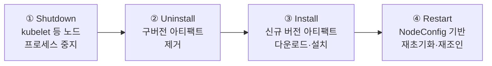

## 개요

하이브리드 노드의 Kubernetes 버전 업그레이드는 managed node group과 달리 전 과정이 고객 책임입니다([공유 책임 모델](../overview-architecture/hybrid-nodes-fundamentals#공유-책임-모델-shared-responsibility-model)). AWS는 업그레이드 도구(`nodeadm upgrade`)를 제공하지만, 워크로드 대피(drain)·순서 제어·검증은 운영자가 수행합니다. 본 문서는 업그레이드 전략 선택(in-place vs 노드 교체), `nodeadm upgrade`의 동작 원리, 사전 조건(드레인·nodeadm 버전), 폐쇄망 환경의 사설 미러 구성, 그리고 노드 단위 업그레이드 런북을 다룹니다.

## 업그레이드 전략: 노드 교체 vs In-Place

| 전략 | 방식 | 적합 환경 |
|------|------|----------|
| 노드 교체 (cutover, blue-green) — **공식 권장** | 대상 버전으로 초기화한 새 노드를 조인시키고, 워크로드를 이전한 후 구버전 노드를 `nodeadm uninstall`·`kubectl delete node`로 제거 | 여유 장비 또는 가상화 기반 노드 프로비저닝이 가능한 환경 |
| In-place (`nodeadm upgrade`) | 기존 노드에서 kubelet 등 아티팩트를 대상 버전으로 교체 — 교체 중 노드 다운타임 발생 | 여유 용량이 없어 같은 호스트에서 업그레이드해야 하는 환경 |

공식 가이드는 여유 용량이 있으면 노드 교체(cutover)를 권장하고, in-place는 여유 용량이 없는 환경의 대안으로 규정합니다. 두 전략 모두 전제 조건은 동일합니다. **컨트롤 플레인을 먼저 업그레이드**한 후 노드를 따라가며, 노드 버전은 컨트롤 플레인과 같거나 낮아야 하고 Kubernetes 버전 skew 정책(kubelet은 API server보다 최대 3개 마이너 버전 하위) 범위 안에 있어야 합니다. In-place 업그레이드에서 자격 증명 공급자(SSM ↔ IAM RA)는 변경할 수 없으며 노드 이름은 업그레이드 후에도 유지됩니다.

## nodeadm upgrade 동작 원리: 4단계 프로세스

`nodeadm upgrade`는 노드 위에서 실행되는 in-place 교체 작업이며, 내부적으로 4단계로 진행됩니다.



1. **Shutdown**: kubelet을 포함한 노드 구성 요소를 정지합니다. 이 시점부터 노드의 Pod는 새로 스케줄되지 않습니다.
2. **Uninstall**: 기존 Kubernetes 버전의 아티팩트(kubelet, kubectl 바이너리 등)를 제거합니다.
3. **Install**: 대상 버전의 아티팩트를 다운로드해 설치합니다. 폐쇄망에서는 이 단계가 [사설 경로](#폐쇄망-업그레이드-사설-미러-구성)로 해석 가능해야 합니다.
4. **Restart**: NodeConfig를 기반으로 노드를 재초기화하고 클러스터에 재조인합니다.

```bash
# 대상 버전과 NodeConfig를 지정해 실행
sudo nodeadm upgrade 1.34 --config-source file://nodeConfig.yaml
```

업그레이드 중 containerd와 실행 중인 컨테이너 프로세스는 유지되지만, kubelet 중지·재시작 사이에 노드는 일시적으로 `NotReady`가 되며 헬스 체크·스케줄링 대상에서 제외됩니다.

## 수동 드레인 의무: nodeadm은 Pod를 대피시키지 않습니다

:::warning drain 생략 시 워크로드 유실 위험
`nodeadm upgrade`는 **Pod 대피(drain)를 수행하지 않습니다.** managed node group 업그레이드가 자동으로 수행하는 cordon → drain → 교체 흐름을 하이브리드 노드에서는 관리자가 직접 실행해야 합니다. drain 없이 업그레이드하면 kubelet 중지 시점에 실행 중이던 Pod가 정상 종료 절차(preStop hook, terminationGracePeriod) 없이 중단될 수 있습니다.
:::

```bash
# 1. 신규 스케줄링 차단
kubectl cordon mi-0f1c2d3e4a5b6c7d8

# 2. 워크로드 대피 (PodDisruptionBudget 존중)
kubectl drain mi-0f1c2d3e4a5b6c7d8 \
  --ignore-daemonsets \
  --delete-emptydir-data \
  --grace-period=300 \
  --timeout=15m

# 3. 업그레이드 실행 (노드에서)
sudo nodeadm upgrade 1.34 --config-source file://nodeConfig.yaml

# 4. 노드 Ready·버전 확인 후 스케줄링 재개
kubectl get node mi-0f1c2d3e4a5b6c7d8 -o wide   # VERSION 열 확인
kubectl uncordon mi-0f1c2d3e4a5b6c7d8
```

- `nodeadm upgrade`는 기본 동작으로 **노드가 cordon 상태인지(node-validation), DaemonSet·static Pod 외의 Pod가 남아 있지 않은지(pod-validation)** 를 사전 검증하고, 충족되지 않으면 진행하지 않습니다. 이 검증은 안전장치일 뿐 drain을 대신 수행하지는 않습니다.
- **PodDisruptionBudget(PDB)** 이 구성된 워크로드는 drain이 PDB를 존중하므로, 가용 replica가 부족하면 drain이 대기합니다. 업그레이드 창에서 PDB 위반으로 drain이 멈추는 상황을 피하려면 노드를 한 대씩 순차 진행합니다.
- GPU 추론처럼 종료에 시간이 걸리는 워크로드는 `--grace-period`를 모델 언로드 시간에 맞게 조정합니다.
- 노드가 다시 Ready가 된 후에도 CNI(Cilium) DaemonSet Pod가 정상 기동했는지 확인한 뒤 uncordon합니다.

## SSM 서명 키 만료: nodeadm 1.0.19 이상 필수

이전 버전 `nodeadm` 바이너리에 포함된 SSM 서명 키가 만료되어, SSM 자격 증명 공급자를 사용하는 환경에서 `nodeadm install`/`upgrade`가 다음 서명 검증 오류로 실패하는 이슈가 있습니다.

```text
"msg":"Command failed","error":"failed to install ssm installer:
validating ssm-setup-cli signature: Signature Verification Error: No matching signature"
```

**업그레이드 실행 전 `nodeadm` 자체를 1.0.19 이상으로 먼저 갱신**하는 것을 업그레이드 런북의 0단계로 고정합니다.

```bash
# 현재 nodeadm 버전 확인
nodeadm version

# 최신 nodeadm으로 교체 (x86_64)
curl -OL 'https://hybrid-assets.eks.amazonaws.com/releases/latest/bin/linux/amd64/nodeadm'
chmod +x nodeadm && sudo mv nodeadm /usr/local/bin/nodeadm
```

특정 버전 고정이 필요한 폐쇄망 배포 체계에서는 `releases/latest` 대신 버전 경로를 사용하고, 내부 아티팩트 저장소에 바이너리와 함께 체크섬을 미러링합니다.

## 폐쇄망 업그레이드: 사설 미러 구성

`nodeadm upgrade`는 EKS 아티팩트(kubelet 등)를 받아오지만, containerd·ca-certificates·커널 모듈 같은 **OS 계층 의존성은 OS 패키지 매니저(yum/dnf, apt)가 담당**합니다. 인터넷이 차단된 환경에서 업그레이드가 중간에 실패하지 않으려면 두 경로 모두 내부망에서 해석되어야 합니다.

| 다운로드 대상 | 기본 출처 | 폐쇄망 대응 |
|--------------|----------|------------|
| EKS 노드 아티팩트 (kubelet 등) | `hybrid-assets.eks.amazonaws.com` | 내부 아티팩트 저장소 미러 또는 해당 도메인 한정 프록시 허용 |
| OS 패키지 (containerd, ca-certificates, runc 등) | OS 공식 저장소 (yum/apt) | **사설 미러 서버**로 저장소 소스 경로 교체 |
| 컨테이너 이미지 (CNI·애드온) | ECR·`public.ecr.aws` | ECR PrivateLink 또는 Harbor 미러 ([레지스트리 통합](../storage-registry/harbor-registry)) |

```bash
# RHEL/AL2023 — 사설 미러로 저장소 교체 예시
sudo tee /etc/yum.repos.d/internal-mirror.repo << 'EOF'
[internal-baseos]
name=Internal Mirror - BaseOS
baseurl=https://mirror.company.local/rhel9/baseos/
enabled=1
gpgcheck=1
gpgkey=https://mirror.company.local/keys/RPM-GPG-KEY
EOF

# Ubuntu — sources.list를 내부 미러로 지정 예시
sudo tee /etc/apt/sources.list.d/internal-mirror.list << 'EOF'
deb https://mirror.company.local/ubuntu noble main universe
deb https://mirror.company.local/ubuntu noble-updates main universe
deb https://mirror.company.local/ubuntu noble-security main universe
EOF
sudo apt-get update
```

사설 미러는 업그레이드 시점에만 필요한 것이 아니라 OS 보안 패치의 상시 공급 경로입니다. 미러 동기화 주기·GPG 키 관리·미러 자체의 가용성을 업그레이드 계획 이전에 운영 체계로 정착시킵니다.

## 업그레이드 런북 (노드 단위)

| 단계 | 작업 | 검증 |
|------|------|------|
| 0 | `nodeadm` 1.0.19+ 확인·갱신, 사설 미러 도달성 점검 | `nodeadm version`, `yum repolist`/`apt-get update` 성공 |
| 1 | 컨트롤 플레인 업그레이드 완료 확인 | `aws eks describe-cluster --query cluster.version` |
| 2 | Cluster Insights에서 업그레이드 차단 이슈 확인 | [구성 검증](./operations-cost-optimization#구성-검증-자동화) |
| 3 | `kubectl cordon` + `kubectl drain` (한 대씩) | Pod 재배치 완료, PDB 위반 없음 |
| 4 | `sudo nodeadm upgrade <version> --config-source file://nodeConfig.yaml` | 종료 코드 0 |
| 5 | 노드 Ready·버전·CNI Pod 기동 확인 | `kubectl get node -o wide`, `kubectl get pods -n kube-system -o wide --field-selector spec.nodeName=<node>` |
| 6 | `kubectl uncordon` 후 다음 노드로 진행 | 워크로드 정상 배치 |
| 7 | 전체 완료 후 애드온(CoreDNS·kube-proxy·Cilium) 호환 버전 정렬 | 애드온 버전 매트릭스 확인 |

- 업그레이드 실패 시 `nodeadm`은 같은 명령의 재실행으로 재시도할 수 있습니다. 반복 실패 시 `nodeadm debug`로 네트워킹·자격 증명 요건을 재검증하고, `journalctl -u kubelet`과 `/var/log/` 하위 nodeadm 로그를 수집합니다.
- Cilium 버전은 Kubernetes 버전 호환 매트릭스를 따르므로, 클러스터 메이저 업그레이드 시 CNI 업그레이드 계획을 함께 수립합니다.

## 권장 사항 요약

- 업그레이드 순서는 컨트롤 플레인 → 노드이며, 노드는 한 대씩 cordon → drain → upgrade → 검증 → uncordon으로 순차 진행합니다.
- `nodeadm`은 drain을 수행하지 않습니다 — drain 생략은 워크로드 유실로 직결되므로 런북에 필수 단계로 고정합니다.
- SSM 환경은 업그레이드 전 `nodeadm` 1.0.19 이상 갱신을 0단계로 수행합니다.
- 폐쇄망은 EKS 아티팩트·OS 패키지·컨테이너 이미지 세 경로의 사설 미러/PrivateLink를 사전 구성합니다.
- PDB·grace period를 워크로드 특성(GPU 모델 언로드 등)에 맞게 조정하고, 업그레이드 창을 비피크 시간대로 계획합니다.

## 참고 자료

### 공식 문서
- [Upgrade hybrid nodes for your cluster](https://docs.aws.amazon.com/eks/latest/userguide/hybrid-nodes-upgrade.html) — nodeadm upgrade 절차와 cordon/drain 가이드
- [Update existing cluster to new Kubernetes version](https://docs.aws.amazon.com/eks/latest/userguide/update-cluster.html) — 컨트롤 플레인 업그레이드
- [aws/eks-hybrid Releases](https://github.com/aws/eks-hybrid/releases) — nodeadm 릴리스 노트·버전별 수정 사항

### 관련 문서 (내부)
- [노드 인증 방식](../security-authn/node-authentication) — SSM 서명 키 이슈와 nodeadm 버전 요건
- [운영과 비용 최적화](./operations-cost-optimization) — Cluster Insights·nodeadm debug 검증 도구
- [Harbor 레지스트리 통합](../storage-registry/harbor-registry) — 폐쇄망 컨테이너 이미지 미러
- [사설 폐쇄망 VPC 엔드포인트 설계](../networking/private-vpc-endpoints) — 인터넷 미경유 AWS 서비스 접근
