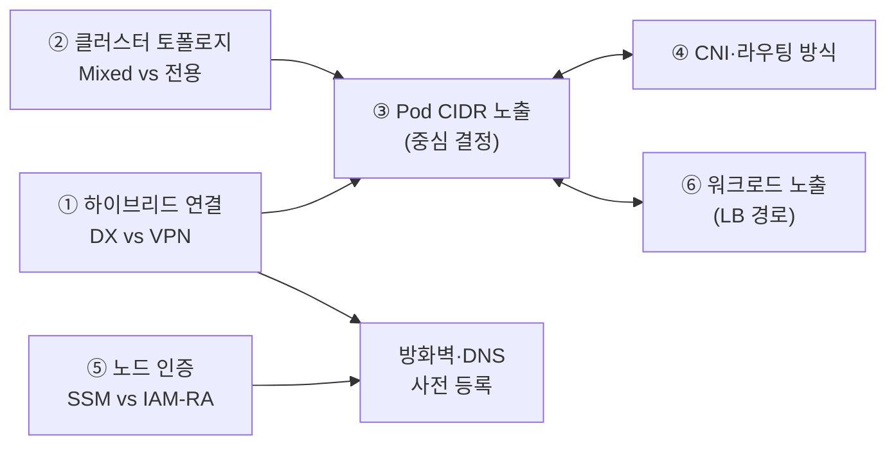
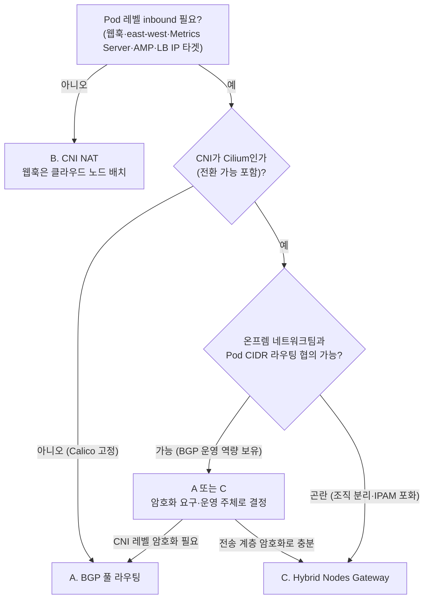

## 개요

EKS Hybrid Nodes 아키텍처는 단일 결정이 아니라 상호 의존하는 6가지 설계 결정의 조합으로 확정됩니다. 본 문서는 각 결정의 선택지와 판단 기준, 그리고 결정 간 의존 관계를 제공합니다. 개별 결정의 구성 절차는 해당 챕터에서 다루며, 선행 지식으로 [Node 대역 필수·Pod 대역 선택 원칙](./hybrid-nodes-fundamentals.md#node-대역-필수-pod-대역-선택-원칙)의 이해가 필요합니다.

## 설계 결정 지도

| # | 결정 | 핵심 질문 | 선택지 | 상세 챕터 |
|---|------|----------|--------|----------|
| ① | 하이브리드 연결 | 대역폭·암호화·리드타임 요구는? | Direct Connect / Site-to-Site VPN / 병행 | [방화벽·연결](../networking/firewall-connectivity.md) |
| ② | 클러스터 토폴로지 | 클라우드 노드를 함께 운용할 수 있는가? | Mixed mode / 하이브리드 전용 | [운영과 비용 최적화](../operations-cost/operations-cost-optimization.md) |
| ③ | Pod CIDR 노출 | Pod 레벨 inbound가 필요한가? | BGP 풀 라우팅 / CNI NAT / Gateway | 본 문서 + [Gateway 구축](../networking/hybrid-nodes-gateway.md) |
| ④ | CNI·라우팅 방식 | 어떤 CNI로 Pod CIDR을 광고하는가? | Cilium(BGP·정적) / Calico(커뮤니티) | [CNI 구성과 라우팅](../networking/cni-selection-routing.md) |
| ⑤ | 노드 인증 | 사설 PKI를 보유·운영하는가? | SSM / IAM Roles Anywhere(+Vault PKI) | [노드 인증 방식](../security-authn/node-authentication.md) |
| ⑥ | 워크로드 노출 | 애플리케이션 트래픽이 어디서 발원하는가? | NLB/ALB IP 타겟 / Cilium 내장 LB | [로드밸런싱](../networking/load-balancing.md) |

결정 간 의존 관계는 다음과 같습니다. ③(Pod CIDR 노출)이 중심 결정이며, ①·②·④·⑥의 선택이 ③의 선택지를 좁히거나 전제 조건을 만듭니다. ⑤(노드 인증)는 다른 결정과 독립적이지만 방화벽 등록 대상 엔드포인트를 좌우하므로 방화벽 신청 전에 확정해야 합니다.

## 결정 ① 하이브리드 연결: Direct Connect vs Site-to-Site VPN

컨트롤 플레인이 AWS 리전에 있으므로 온프레미스와 VPC 간 사설 연결은 모든 구성에서 협상 불가 요건이며, 공식 가이드는 최소 100Mbps 대역폭과 RTT 200ms 이하를 권장합니다.

| 판단 축 | Direct Connect | Site-to-Site VPN |
|---------|----------------|------------------|
| 대역폭 | 전용 연결 1·10·100Gbps, 호스팅 연결 50Mbps~10Gbps | 터널당 최대 1.25Gbps (ECMP 다중 터널 확장은 TGW 필요) |
| 지연 일관성 | 전용 회선 — 일관된 지연 | 인터넷 경유 — 변동성 존재 |
| 암호화 | 기본 미암호화 — MACsec(지원 로케이션 한정) 또는 DX 위 VPN 조합 | IPsec 기본 내장 |
| 도입 리드타임 | 회선 구성에 수 주 이상 소요 | 즉시 구성 가능 |
| 적합 환경 | 프로덕션, 대용량 이미지·GPU 워크로드 | PoC·소규모, DX 백업 경로 |

GPU 추론처럼 수십 GB 컨테이너 이미지 pull이 반복되는 환경에서는 VPN 터널 대역폭이 병목이 됩니다. 프로덕션은 Direct Connect를 우선하고, VPN은 PoC 또는 DX 장애 시 백업 경로로 배치하는 구성이 일반적입니다.

이 결정의 암호화 특성은 결정 ③과 연결됩니다. Hybrid Nodes Gateway의 VXLAN 터널은 트래픽을 암호화하지 않으므로, DX를 선택한 환경에서 ③에서 Gateway를 채택하려면 MACsec 또는 VPN 오버레이 확보가 전제 조건이 됩니다.

## 결정 ② 클러스터 토폴로지: Mixed Mode vs 하이브리드 전용

클라우드 노드(EC2)와 하이브리드 노드를 하나의 클러스터에 공존시키는 mixed mode는 웹훅 컴포넌트를 클라우드 노드에 배치해 Pod 라우팅 제약을 우회하는 공식 운영 패턴이자 기본 권장 형상입니다.

| 판단 축 | Mixed mode 유리 | 하이브리드 전용 유리 |
|---------|----------------|--------------------|
| 웹훅·시스템 애드온 | 클라우드 노드 배치로 Pod CIDR 라우팅 없이 운영 가능 | 모든 컴포넌트가 온프레미스에서 실행 — Pod CIDR 라우팅이 사실상 필수 |
| 데이터 상주 요건 | 워크로드 데이터만 온프레미스 상주로 충분한 경우 | 시스템 컴포넌트까지 온프레미스 상주가 요구되는 규제 환경 |
| 확장 유연성 | 온프렘 용량 초과분을 클라우드 노드(Spot 혼용)로 흡수 | 온프레미스 증설로만 대응 |
| 비용 | 클라우드 노드 EC2 비용 추가 | 클러스터 요금과 하이브리드 vCPU-시간 과금 외 클라우드 컴퓨트 없음 |

- 하이브리드 전용을 선택하면 AWS Load Balancer Controller, cert-manager 등 웹훅 컴포넌트가 하이브리드 노드에서 실행되므로, 결정 ③에서 CNI NAT 옵션이 제외됩니다.
- Mixed mode에서는 CNI 배치 격리가 필수입니다 — VPC CNI는 클라우드 노드 전용, Cilium은 hybrid 레이블 affinity로 하이브리드 노드 전용으로 상호 배타 배치합니다 ([구성 상세](../networking/cni-selection-routing.md#cni-선택-기준)). CoreDNS는 양쪽에 최소 1 replica씩 분산합니다.

## 결정 ③ Pod CIDR 노출: 풀 라우팅 vs NAT vs Gateway

"Pod CIDR을 호스트 레벨로 노출(routable)할 것인가, Gateway 레이어를 추가할 것인가"는 하이브리드 설계의 중심 결정입니다.

| 옵션 | Egress | 웹훅/Inbound | East-west | 트레이드오프 |
|------|--------|--------------|-----------|--------------|
| A. Pod CIDR 풀 라우팅 (BGP 권장) | O | O | O | 가장 완전. 네트워크팀 협업·BGP 운영 필요 |
| B. CNI NAT (unroutable) | O | X — 웹훅은 클라우드 노드 배치 | X | 가장 단순. 기능 제약 큼 |
| C. Hybrid Nodes Gateway | O | O | O | 라우팅 협의 불필요. Cilium 전용, 암호화 미내장, 게이트웨이 EC2 비용 |

각 옵션의 적합성은 다음 6개 축으로 판정합니다.

| 판단 축 | A(풀 라우팅) 유리 | C(Gateway) 유리 |
|---------|------------------|----------------|
| 네트워크팀 협업 | BGP 피어링·라우팅 변경을 신속히 협의 가능 | 네트워크가 "블랙박스"(조직 분리, 변경 리드타임 김) |
| IPAM 여유 | Pod CIDR을 사내 대역에서 정식 할당 가능 | 사내 대역 포화 — Pod CIDR을 내부에서만 소비 |
| CNI 제약 | Calico(커뮤니티 경로) 유지 필요 — Gateway는 Cilium 전용 | Cilium 사용 중이거나 전환 가능 |
| 암호화 요구 | CNI 레벨 암호화(WireGuard/IPsec) 조합 가능 | 전송 계층(DX MACsec/VPN)에서 해결 가능 |
| 운영 주체 | 네트워크팀이 라우팅 운영 | 플랫폼팀이 클러스터 안에서 완결 운영 |
| 추가 비용 | 라우터 설정 외 없음 | Gateway EC2 2대 상시 비용 |

B(CNI NAT)는 웹훅·east-west·AWS 서비스 연동을 모두 포기할 수 있는 최소 기능 구성에서만 유효하며, 결정 ②에서 mixed mode가 전제입니다. Calico 유지가 필요한 환경에서는 C가 제외되므로 A와 B 중에서 선택해야 합니다.

네트워크 조직이 분리되어 있고 사내 IPAM이 포화된 환경 — 대형 통신·금융사의 전형 — 에서는 C(Gateway)가 협의 비용과 주소 소비를 최소화하는 선택입니다. 단 VXLAN 터널이 트래픽을 암호화하지 않으므로 전송 계층 암호화(DX MACsec 또는 VPN)가 전제되어야 하며, 게이트웨이 EC2 대역폭이 크로스 네트워크 트래픽의 상한이 됩니다 ([사이징 상세](../networking/hybrid-nodes-gateway.md#인스턴스-사이징-수직-확장-원칙)). 반대로 네트워크팀이 BGP를 능동적으로 운영할 수 있고 Pod 간 대용량 east-west 트래픽이 예상되는 환경이라면 A(풀 라우팅)가 병목 없는 구조를 제공합니다.

## 결정 ④ CNI와 Pod CIDR 라우팅 방식

Cilium이 하이브리드 노드의 AWS 지원 CNI이며, VPC CNI는 하이브리드 노드와 호환되지 않고 Calico는 커뮤니티 지원 경로입니다.

- **신규 구축은 Cilium 기준으로 설계합니다.** AWS 지원 범위에 있고, 결정 ③의 Gateway 옵션이 유지됩니다.
- **Calico(커뮤니티 경로) 유지가 필요하면** Gateway가 제외되어 결정 ③이 A/B로 한정됩니다.
- **라우팅 프로토콜**: A(풀 라우팅) 선택 시 BGP(노드 증감을 자동 반영, 권장)와 정적 라우팅(소규모 고정 환경 한정) 중에서 선택합니다. C(Gateway) 선택 시 이 결정 자체가 소거됩니다.

CNI별 지원 상태, Cilium 설치 핵심 구성(affinity·cluster-pool IPAM), BGP Control Plane 구성 절차는 [CNI 구성과 Pod CIDR 라우팅](../networking/cni-selection-routing.md)에서 다룹니다.

## 결정 ⑤ 노드 인증: SSM vs IAM Roles Anywhere

하이브리드 노드는 EC2 인스턴스 프로파일이 없으므로 온프레미스용 IAM 자격 증명 공급자를 선택해야 합니다.

- **사설 PKI 미보유 조직**: SSM hybrid activation이 기본 선택입니다. 추가 인프라 없이 시작할 수 있습니다.
- **사설 CA·인증서 거버넌스 보유 조직**: IAM Roles Anywhere가 기존 통제 체계와 자연스럽게 결합합니다.
- **HashiCorp Vault 운영 조직**: Vault PKI Secrets Engine을 사설 CA로 사용해 IAM Roles Anywhere의 신뢰 앵커로 등록하는 통합 패턴을 활용합니다.

이 결정은 다른 결정과 독립적이어서 병렬로 진행할 수 있지만, 선택 결과에 따라 방화벽 등록 대상 엔드포인트(SSM 계열 vs rolesanywhere 계열)가 달라지므로 방화벽 신청서 작성 전에 확정해야 합니다. 방식별 비교, Hybrid Nodes IAM role 최소 권한, 자격 증명 수명주기 관리는 [노드 인증 방식](../security-authn/node-authentication.md)에서 다룹니다.

## 결정 ⑥ 워크로드 노출: 트래픽 발원지 기준

Service type LoadBalancer의 공식 결정 원칙은 애플리케이션 트래픽의 발원지입니다.

- **리전 발원 트래픽**: NLB/ALB + AWS Load Balancer Controller의 IP 타겟 모드를 사용합니다. **역방향 제약에 주의합니다** — IP 타겟은 하이브리드 Pod CIDR이 AWS에서 도달 가능해야 하므로, 이 요구가 있으면 결정 ③에서 B(CNI NAT)를 선택할 수 없습니다.
- **온프레미스 발원 트래픽**: Cilium 내장 LB(LB IPAM + BGP 광고)를 사용합니다. 온프렘 로컬 트래픽을 리전 LB로 우회시키는 헤어핀 경로는 DX/VPN 지연·대역폭 비용을 유발하므로 피합니다.

경로별 구성 요건과 MetalLB 등 커뮤니티 옵션은 [로드밸런싱과 서비스 노출](../networking/load-balancing.md)에서 다룹니다.

## 권장 사항 요약

- 결정은 ① 연결 → ② 토폴로지 → ③ Pod CIDR 노출 → ④ CNI·라우팅 → ⑥ 워크로드 노출 순으로 진행하고, ⑤ 인증은 병렬로 확정해 ①과 함께 방화벽 신청서에 반영합니다.
- 프로덕션은 Direct Connect를 우선하고 VPN은 PoC·백업 경로로 배치합니다.
- 특별한 규제 제약이 없으면 mixed mode + Cilium을 기본 형상으로 설계합니다.
- 네트워크 조직 분리·IPAM 포화 환경에서는 C(Gateway)를 우선 검토하되, 전송 계층 암호화(DX MACsec/VPN) 확보를 전제 조건으로 명시합니다.
- NLB/ALB IP 타겟 요구가 확인되면 결정 ③에서 B(CNI NAT)를 조기에 제외합니다.
- 어느 조합이든 Node CIDR 양방향 라우팅과 사설 연결(DX/VPN)은 협상 불가 요건입니다.

## 참고 자료

### 공식 문서
- [Networking concepts for hybrid nodes](https://docs.aws.amazon.com/eks/latest/userguide/hybrid-nodes-concepts-networking.html) — fully routed 제약, Pod CIDR 선택 사항 명시
- [Amazon EKS Hybrid Nodes gateway](https://docs.aws.amazon.com/eks/latest/userguide/hybrid-nodes-gateway-overview.html) — Gateway 아키텍처와 제약 사항
- [Configure webhooks for hybrid nodes](https://docs.aws.amazon.com/eks/latest/userguide/hybrid-nodes-webhooks.html) — mixed mode 권고, 애드온별 affinity 설정
- [Configure Services of type LoadBalancer for hybrid nodes](https://docs.aws.amazon.com/eks/latest/userguide/hybrid-nodes-load-balancing.html) — 트래픽 발원지 기준 결정 원칙
- [Prepare credentials for hybrid nodes](https://docs.aws.amazon.com/eks/latest/userguide/hybrid-nodes-creds.html) — SSM·IAM Roles Anywhere 자격 증명 구성

### 관련 문서 (내부)
- [EKS Hybrid Nodes 개념과 동작 원리](./hybrid-nodes-fundamentals.md) — 라우팅 요건 원칙과 트래픽 흐름
- [CNI 구성과 Pod CIDR 라우팅](../networking/cni-selection-routing.md) — 결정 ④의 구성 절차
- [로드밸런싱과 서비스 노출](../networking/load-balancing.md) — 결정 ⑥의 경로별 구성
- [노드 인증 방식](../security-authn/node-authentication.md) — 결정 ⑤의 비교와 IAM 최소 권한
- [CIDR 설계와 대역 최소화](../networking/cidr-network-design.md) — 옵션 결정 이후의 주소 계획
- [Hybrid Nodes Gateway 구축과 운영](../networking/hybrid-nodes-gateway.md) — C(Gateway) 선택 시 구축 절차
