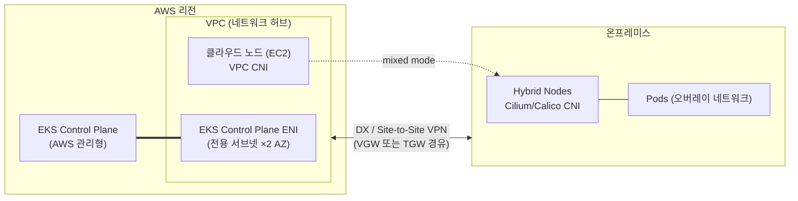

## 개요

본 문서는 EKS Hybrid Nodes Best Practices 가이드의 개념 문서입니다. Hybrid Nodes가 무엇인지(정의·사용 사례·요금), 어떻게 동작하는지(아키텍처·노드 등록·네트워킹 기본 구조·트래픽 흐름), 어떤 기술 특징을 갖는지(라우팅 요건 원칙·NAT 한계·Hybrid Nodes Gateway·CGNAT 지원·Mixed Mode)를 순서대로 설명합니다. 개별 기술 쟁점의 상세 답변은 가이드의 각 챕터 — [아키텍처 결정](./architecture-decision-guide.md), [CIDR 설계](../networking/cidr-network-design.md), [Gateway 구축·운영](../networking/hybrid-nodes-gateway.md), [방화벽 사전 등록](../networking/firewall-connectivity.md), [노드 인증](../security-authn/node-authentication.md) — 에서 다룹니다.

:::info 검증 기준
본 문서의 핵심 수치와 요건은 EKS User Guide, CloudFormation Template Reference, AWS Containers Blog 원문을 직접 확인한 후 작성되었습니다(2026-08-24 기준).
:::

## EKS Hybrid Nodes란 무엇인가

### 정의

EKS Hybrid Nodes는 온프레미스·엣지 인프라의 물리 서버 또는 가상 머신을 Amazon EKS 클러스터의 워커 노드로 연결하는 기능입니다. 2024년 12월 정식 출시(GA)되었습니다. 컨트롤 플레인(API server, etcd)은 AWS가 리전 내에서 완전 관리하고, 데이터 플레인(워커 노드)은 고객 인프라에서 실행됩니다. 클라우드 노드(EC2)와 하이브리드 노드가 하나의 클러스터에 공존하는 mixed mode 구성이 가능하며, 동일한 EKS API·클러스터 정책·애드온 체계로 관리됩니다.

### 사용 사례

- **보유 GPU 자산 활용**: 이미 구매한 온프레미스 GPU 서버(DGX 등)를 클라우드 GPU·Amazon Bedrock과 결합해 비용 효율적인 추론 계층을 구성
- **데이터 주권·규제 대응**: 데이터를 온프레미스에 유지하면서 Kubernetes 운영 모델은 EKS로 표준화
- **점진적 마이그레이션**: 온프레미스 워크로드를 단일 클러스터 안에서 단계적으로 클라우드로 이전
- **엣지 컴퓨팅**: 지연시간에 민감한 워크로드를 사용자 근접 위치에서 실행하면서 중앙에서 통합 관리

### 배포 옵션 비교

| 항목 | EKS Hybrid Nodes | AWS Outposts | Amazon EKS Anywhere | 자체 구축 K8s |
|------|-----------------|--------------|---------------------|----------------|
| 컨트롤 플레인 위치 | AWS 리전 (관리형) | Outposts 랙 (관리형) | 온프레미스 (고객 운영) | 온프레미스 (고객 운영) |
| 하드웨어 | 고객 보유 장비 | AWS 제공 랙/서버 | 고객 보유 장비 | 고객 보유 장비 |
| 네트워크 요건 | DX/VPN 상시 연결 | AWS 연결 필수 | 단절 운영 가능 | 제약 없음 |
| 컨트롤 플레인 운영 부담 | 없음 | 없음 | 있음 (업그레이드·백업) | 전부 |
| 적합한 경우 | 기존 장비 + 관리형 컨트롤 플레인 | AWS 인프라를 온프렘에 확장 | 에어갭·단절 환경 | 완전한 자체 통제 필요 |

EKS Hybrid Nodes는 "장비는 이미 있고, 컨트롤 플레인 운영 부담은 없애고 싶은" 환경에 적합합니다. 컨트롤 플레인이 AWS 리전에 있으므로 온프레미스와 리전 간 안정적인 사설 연결이 전제 조건입니다.

### 에어갭(Air-Gap) 환경의 두 가지 정의

금융·공공 등 규제가 엄격한 환경에서 "폐쇄망"이라는 용어는 성격이 다른 두 환경을 함께 지칭하는 경우가 많습니다. EKS Hybrid Nodes의 지원 여부는 이 구분에 따라 완전히 달라지므로, 설계 착수 전에 자사 환경이 어느 쪽인지 먼저 판정해야 합니다.

| 구분 | Disconnected Air-Gap (물리적 차단망) | Private Air-gapped VPC (사설 폐쇄망) |
|------|-------------------------------------|-------------------------------------|
| AWS 리전과의 통신 | 완전 차단 또는 간헐 단절(DDIL) | DX/사설 VPN으로 상시 사설 통신 가능 |
| 퍼블릭 인터넷 | 차단 | 차단 (IGW·NAT 없음) |
| EKS Hybrid Nodes | **지원 불가** | **지원** — 인터페이스 VPC 엔드포인트(PrivateLink) 경유 |
| 정답 아키텍처 | Amazon EKS Anywhere | EKS Hybrid Nodes + Private API 엔드포인트 |

:::danger Disconnected 환경은 Hybrid Nodes 대상이 아닙니다
컨트롤 플레인이 AWS 리전에서 실행되므로, 하이브리드 노드는 리전과의 **상시 신뢰성 있는 연결**을 전제합니다. 통신이 완전히 차단되거나 단속적으로 끊기는 DDIL(Denied, Disrupted, Intermittent, Limited) 환경에서는 노드 자격 증명 갱신·스케줄링·`kubectl` 조작이 모두 불가능해집니다. 이 환경의 정답은 컨트롤 플레인까지 온프레미스에서 실행하는 **Amazon EKS Anywhere**이며, Hybrid Nodes로 우회 구성해서는 안 됩니다.
:::

반면 **퍼블릭 인터넷만 차단된 사설 폐쇄망**은 완전 지원 대상입니다. EKS 클러스터 API 엔드포인트를 Private 모드로 생성하고, ECR·SSM·STS 등 노드가 필요로 하는 AWS 서비스를 인터페이스 VPC 엔드포인트로 VPC 내부에 개설하면, 모든 통신이 DX/VPN → VPC → PrivateLink의 사설 경로로 완결됩니다. 엔드포인트별 상세 설계는 [사설 폐쇄망 VPC 엔드포인트 설계](../networking/private-vpc-endpoints)에서 다룹니다.

### 공유 책임 모델 (Shared Responsibility Model)

하이브리드 노드는 클라우드 노드보다 고객 책임 범위가 넓습니다. 운영 조직·역할 분담을 확정할 때 다음 경계를 기준으로 합니다.

| 영역 | AWS 책임 | 고객 책임 |
|------|----------|----------|
| 컨트롤 플레인 | API server·etcd 운영, 가용성(SLA), 컨트롤 플레인 버전 업그레이드·패치 | 클러스터 버전 업그레이드 개시 결정 |
| 데이터 플레인 (하이브리드 노드) | `nodeadm`·노드 아티팩트 제공 | 물리 서버·가상화 인프라, OS 설치·패치, kubelet/containerd 업그레이드(`nodeadm upgrade`), 노드 드레인 |
| 네트워킹 | 컨트롤 플레인 ENI, VPC 라우팅 인프라 | DX/VPN 연결, 온프레미스 라우팅·방화벽, CNI(Cilium) 설치·수명주기 |
| 보안·인증 | IAM·SSM·IAM Roles Anywhere 서비스 | 자격 증명 인프라(activation·사설 PKI) 운영, 인증서 갱신·폐기, 노드 IAM role 최소 권한 |
| 관측성 | 컨트롤 플레인 로그·메트릭, Cluster Insights | 노드·워크로드 메트릭 수집, 크로스 네트워크 경로 모니터링 |

클라우드 노드(managed node group)에서 AWS가 담당하던 AMI 패치·노드 교체가 하이브리드 노드에서는 전부 고객 몫이라는 점이 실질적인 차이입니다. 업그레이드 절차와 런북은 [업그레이드와 수명주기 관리](../operations-cost/upgrade-lifecycle)에서 다룹니다.

### 요금 모델

EKS Hybrid Nodes는 하이브리드 노드의 vCPU-시간 기준 티어드 과금을 적용합니다. 월 누적 사용량이 증가할수록 단가가 낮아집니다.

| 월 누적 vCPU-hours | 단가 ($/vCPU-hr) |
|-------------------|-----------------|
| 첫 576,000 | $0.020 |
| 576,001 ~ 1,728,000 | $0.014 |
| 1,728,001 ~ 5,184,000 | $0.010 |
| 5,184,001 ~ 15,552,000 | $0.008 |
| 15,552,001 이상 | $0.006 |

예를 들어 224 vCPU 서버(DGX H200급) 1대를 상시 운영하면 월 약 163,520 vCPU-hr, 약 $3,270의 관리 비용이 발생합니다. 10대 운영 시 누적 사용량이 2티어에 진입해 노드당 평균 비용이 약 $2,635로 낮아집니다. 이 금액은 EKS 관리 비용이며 하드웨어 구매·전력·상면 비용은 별도입니다. EKS 클러스터 자체 요금과 클라우드 노드(EC2) 요금은 기존과 동일하게 부과됩니다. 과금 구조를 활용한 비용 최적화 전략은 [운영과 비용 최적화](../operations-cost/operations-cost-optimization.md)에서 다룹니다.

### 시스템 요구 사항

| 항목 | 요구 사항 |
|------|----------|
| 운영체제 | Amazon Linux 2023, Ubuntu 20.04/22.04/24.04 LTS, RHEL 8/9 |
| 컨테이너 런타임 | containerd (nodeadm이 설치·관리) |
| 네트워크 연결 | AWS Direct Connect, Site-to-Site VPN, 또는 자체 VPN 기반 사설 연결 |
| 대역폭·지연시간 | 최소 100Mbps, 왕복 지연(RTT) 200ms 이하 권장 (공식 가이드) |
| CNI | Cilium — AWS 지원 CNI (VPC CNI는 하이브리드 노드 비호환, Calico는 커뮤니티 지원 경로) |

:::note 대역폭 요건의 해석
100Mbps/200ms는 대부분의 사용 사례를 수용하는 일반 가이드이며 엄격한 요구사항이 아닙니다. 실제 필요 대역폭은 노드 수, 컨테이너 이미지 크기, 모니터링·로깅 구성, AWS 서비스 데이터 접근 패턴에 따라 달라집니다. 대용량 모델 이미지를 사용하는 GPU 추론 환경은 프로덕션 적용 전 자체 워크로드로 검증이 필요합니다.
:::

## 어떻게 동작하는가

### 아키텍처: VPC를 허브로 하는 단일 클러스터

EKS Hybrid Nodes 아키텍처에서 VPC는 네트워크 허브 역할을 수행합니다. EKS 컨트롤 플레인은 클러스터 생성 시 지정한 서브넷에 ENI(Elastic Network Interface)를 연결하고, 클라우드 경계를 넘는 모든 트래픽은 이 VPC를 경유합니다. 온프레미스와 VPC는 Direct Connect, Site-to-Site VPN, 또는 자체 VPN으로 연결하며, VPC 측 연결점은 통상 VGW(Virtual Private Gateway) 또는 TGW(Transit Gateway)입니다.



### 노드 등록 흐름: nodeadm

하이브리드 노드는 AWS가 제공하는 CLI 도구 `nodeadm`으로 등록합니다. 등록 흐름은 ① 의존성 설치 → ② IAM 자격 증명 구성 → ③ 클러스터 조인 3단계입니다.

```bash
# 1. nodeadm 다운로드 (x86_64)
curl -OL 'https://hybrid-assets.eks.amazonaws.com/releases/latest/bin/linux/amd64/nodeadm'
chmod +x nodeadm && sudo mv nodeadm /usr/local/bin/

# 2. Kubernetes 버전별 의존성 설치 (containerd, kubelet, SSM agent 등)
sudo nodeadm install 1.33 --credential-provider ssm
# IAM Roles Anywhere 사용 시: --credential-provider iam-ra

# 3. NodeConfig 기반 노드 초기화
sudo nodeadm init --config-source file://nodeconfig.yaml
```

`NodeConfig`는 클러스터 정보, 자격 증명, kubelet·containerd 설정을 선언적으로 정의합니다.

```yaml
apiVersion: node.eks.aws/v1alpha1
kind: NodeConfig
spec:
  cluster:
    name: my-hybrid-cluster
    region: us-west-2
  hybrid:
    ssm:
      activationCode: "YOUR-ACTIVATION-CODE"
      activationId: "YOUR-ACTIVATION-ID"
  kubelet:
    config:
      shutdownGracePeriod: 30s
      maxPods: 110
    flags:
      - --node-labels=node-type=hybrid
```

노드가 사용하는 IAM 자격 증명은 SSM hybrid activation 또는 IAM Roles Anywhere로 발급받으며, kubelet은 이 자격 증명으로 EKS 컨트롤 플레인에 인증합니다. 두 방식의 비교와 선택 기준은 [노드 인증 방식](../security-authn/node-authentication.md)에서 다룹니다. 등록된 하이브리드 노드에는 `eks.amazonaws.com/compute-type: hybrid` 레이블이 부여됩니다.

### 네트워킹 기본 구조: RemoteNodeNetwork와 RemotePodNetwork

클러스터 생성 시 두 가지 원격 대역을 입력합니다.

| 필드 | 의미 | 할당 주체 |
|------|------|----------|
| `RemoteNodeNetwork` | 하이브리드 노드 머신의 IP 대역 | 온프레미스 네트워크 |
| `RemotePodNetwork` | 하이브리드 노드 위 Pod의 IP 대역 | CNI(오버레이 네트워크) |

EKS 컨트롤 플레인은 이 대역을 기준으로 해당 목적지 트래픽을 VPC를 거쳐 온프레미스로 라우팅합니다. 공식 문서의 핵심 제약은 다음과 같습니다.

> "The main constraint is that the EKS control plane and all nodes, cloud or hybrid nodes, need to form a **fully routed** network. This means that all nodes must be able to reach each other at layer three, by IP address."
> — [Networking concepts for hybrid nodes](https://docs.aws.amazon.com/eks/latest/userguide/hybrid-nodes-concepts-networking.html)

"fully routed" 요건은 **노드 레벨**에 적용됩니다. `kubectl logs`, `kubectl exec` 같은 명령은 컨트롤 플레인이 노드의 kubelet(10250 포트)으로 직접 연결을 개시하므로, VPC 라우트 테이블에 Node CIDR 경로가 필요하고 온프레미스에서도 노드 IP가 라우팅 가능해야 합니다. 반면 Pod 대역 라우팅은 같은 문서가 명시적으로 선택 사항(optional)으로 규정하며, 이 차이가 하이브리드 네트워크 설계 전체를 관통하는 원칙입니다. 상세한 판정 기준은 [주요 기술 특징](#node-대역-필수-pod-대역-선택-원칙)에서 다룹니다.

:::tip Service CIDR 자동 선택 주의
클러스터 생성 시 Kubernetes Service IPv4 CIDR을 명시하지 않으면 EKS가 원격 대역과 겹치지 않는 CIDR을 자동 선택하며, 이때 표준 기본값(`10.100.0.0/16`, `172.20.0.0/16`)이 아닌 대역이 배정될 수 있습니다. 예측 가능한 방화벽·라우팅 설계를 위해 Service CIDR을 명시적으로 지정하는 것이 권장됩니다.
:::

### 트래픽 흐름: 방향이 만드는 차이

하이브리드 네트워킹의 난이도는 트래픽의 **방향**에 따라 달라집니다.

**① 온프레미스 → AWS (egress)**: kubelet과 Pod가 API server, SSM, ECR 등으로 나가는 트래픽입니다. CNI가 Pod 발신 패킷의 source IP를 노드 IP로 SNAT하면, 복귀 트래픽은 Node CIDR 경로만으로 돌아오고 conntrack이 SNAT를 역변환합니다. Pod CIDR 라우팅 없이 동작합니다.

**② AWS → 온프레미스 노드 (inbound, 노드 레벨)**: 컨트롤 플레인이 kubelet(TCP 10250)으로 연결을 개시합니다. `kubectl logs`/`exec`가 이 경로를 사용하며, Node CIDR 양방향 라우팅이 필수인 이유입니다.

**③ AWS → 온프레미스 Pod (inbound, Pod 레벨)**: 웹훅 호출, Metrics Server 스크래핑, ALB/NLB IP 타겟 트래픽이 Pod IP를 직접 목적지로 사용합니다. SNAT는 외부에서 개시되는 연결의 경로를 만들지 못하므로, Pod CIDR 라우팅 또는 Hybrid Nodes Gateway가 필요합니다.

```text
[egress — 기본 지원]
Pod(10.85.1.56)
   │  CNI SNAT: Src 10.85.1.56 → 10.80.0.2 (Node IP)
   ▼
Node(10.80.0.2) ─► 온프렘 라우터 ─► DX/VPN ─► EKS Control Plane ENI
   ▲                                              │
   └── VPC Route: Node CIDR → VGW/TGW ◄───────────┘
       (Pod CIDR 경로 없이 복귀 가능)

[inbound Pod 레벨 — SNAT로 해결 불가]
EKS Control Plane ─► webhook Pod IP(10.85.1.23:8443) ─► ???
(NAT는 외부에서 개시되는 연결의 경로를 생성하지 못함)
```

### CNI 동작과 라우팅 부담의 비대칭

이 차이는 CNI 동작 방식에서 기인합니다. 클라우드 노드의 VPC CNI는 Pod IP를 VPC 대역에서 직접 할당하므로 별도 라우팅이 불필요합니다. 온프레미스의 Cilium/Calico는 기본적으로 VXLAN 오버레이에서 Pod를 실행하므로, 물리 네트워크가 오버레이 대역을 인지하지 못하면 Pod IP 목적지 트래픽은 폐기됩니다. 해결하려면 BGP(권장) 또는 정적 라우팅으로 Pod CIDR을 온프레미스 네트워크에 광고해야 합니다. CNI 선택 기준과 Cilium BGP Control Plane 구성 절차는 [CNI 구성과 Pod CIDR 라우팅](../networking/cni-selection-routing.md)에서 다룹니다.

라우팅 부담은 비대칭적입니다. VPC 측은 "Pod CIDR → 게이트웨이" 경로 하나로 충분하지만, 온프레미스 측은 하이브리드 노드와 같은 서브넷의 로컬 라우터가 노드별 Pod CIDR 슬라이스까지 알아야 합니다. 네트워크 조직이 분리된 대기업 환경에서 이 협의 부담이 도입의 최대 장벽이 되며, 이것이 Hybrid Nodes Gateway 출시의 배경입니다.

## 주요 기술 특징

### Node 대역 필수, Pod 대역 선택 원칙

결론은 **Node 대역 필수, Pod 대역 권장(선택)** 입니다.

> "Note, the constraint for making your on-premises pod CIDRs routable is **optional**."
> — [Networking concepts for hybrid nodes](https://docs.aws.amazon.com/eks/latest/userguide/hybrid-nodes-concepts-networking.html)

다만 다음 기능 중 하나라도 필요하면 Pod 대역 라우팅(또는 Gateway)이 사실상 필수가 됩니다.

| Pod CIDR 라우팅이 필요한 기능 | 사유 |
|------|------|
| 하이브리드 노드에서 웹훅 실행 (AWS Load Balancer Controller, cert-manager 등) | API server가 webhook Pod IP로 직접 연결 개시 |
| 클라우드 Pod ↔ 온프레미스 Pod 직접 통신 (east-west) | VPC CNI(클라우드)와 Cilium/Calico(온프렘) 간 직접 경로 필요 |
| Metrics Server를 하이브리드 노드에서 실행 | 컨트롤 플레인 → Metrics Server Pod IP 연결 필요 |
| Amazon Managed Service for Prometheus(AMP) managed collector | Pod 메트릭 스크래핑 (대안: ADOT 애드온) |
| ALB/NLB의 IP 타겟으로 하이브리드 Pod 지정 | 타겟 IP가 AWS에서 라우팅 가능해야 함 |

### Pod 트래픽 NAT의 지원 범위와 한계

Pod 대역을 라우팅할 수 없는(unroutable) 환경의 공식 가이드는 CNI 레벨 NAT입니다.

> "Configure your CNI to use egress masquerade or network address translation (NAT) for pod traffic as it leaves your on-premises hosts. **This is enabled by default in Cilium. Calico requires `natOutgoing` to be set to `true`.**"
> — [Prepare networking for hybrid nodes](https://docs.aws.amazon.com/eks/latest/userguide/hybrid-nodes-networking.html)

정리하면 다음과 같습니다.

- **온프레미스 Pod → AWS 방향(egress)**: 공식 지원 패턴입니다.
- **AWS → 온프레미스 Pod 방향(inbound)** — 웹훅, Metrics Server, AMP 스크래핑, ALB/NLB IP 타겟 — 은 SNAT로 해결할 수 없습니다. unroutable 구성에서는 웹훅을 클라우드 노드에 배치하는 mixed mode 운영이 공식 권고입니다.

공식 문서가 Pod 트래픽 NAT 수단으로 명시하는 것은 CNI 레벨 masquerade뿐입니다. AWS 관리형 NAT Gateway나 온프레미스 자체 NAT 장비는 이 용도로 다루지 않습니다.

### Hybrid Nodes Gateway: Pod 라우팅 요건 제거

2026년 4월 21일 정식 출시된 [Amazon EKS Hybrid Nodes Gateway](https://aws.amazon.com/about-aws/whats-new/2026/04/amazon-eks-hybrid-nodes-gateway/)는 "Pod CIDR을 온프레미스에서 라우팅 가능하게 만들어야 하는" 요건을 제거합니다.

> "The gateway **eliminates the need to make on-premises pod networks routable from the VPC** or coordinate network infrastructure changes."
> — [Amazon EKS Hybrid Nodes gateway](https://docs.aws.amazon.com/eks/latest/userguide/hybrid-nodes-gateway-overview.html)

Gateway는 Cilium CNI의 VTEP(VXLAN Tunnel Endpoint) 기능을 활용합니다. VPC 안의 EC2 게이트웨이 노드와 온프레미스의 Cilium 노드 사이에 VXLAN 터널(`hybrid_vxlan0` 인터페이스, VNI 2, UDP 8472)을 구성하고 Pod 트래픽을 캡슐화해 전달합니다. 물리 네트워크에는 노드 IP 간 UDP 트래픽만 흐르며 Pod CIDR은 노출되지 않습니다. Leader election 기반 active-standby 모델로 동작하며, 예상 failover 시간은 약 3~5초입니다(공식 문서 명시).

**Gateway가 하지 않는 것**도 명확합니다. Gateway는 NAT가 아니므로 대역 중복을 해소하지 못하며, Node 대역 라우팅과 VPC↔온프레미스 사설 연결 요건은 그대로 유지됩니다. Gateway는 Pod 레이어의 라우팅 문제를 해결하는 것이며 하이브리드 연결 자체를 대체하지 않습니다. 동작 메커니즘·도입 절차·운영 상세는 [Hybrid Nodes Gateway 구축과 운영](../networking/hybrid-nodes-gateway.md)에서 다룹니다.

### CGNAT 대역(100.64.0.0/10) 지원

온프레미스 Node/Pod CIDR로 RFC 1918 사설 대역에 더해 CGNAT 대역이 공식 지원됩니다.

> "Be within one of the following `IPv4` RFC-1918 ranges: `10.0.0.0/8`, `172.16.0.0/12`, or `192.168.0.0/16`, **or within the CGNAT range defined by RFC 6598: `100.64.0.0/10`**."
> — [Prepare networking for hybrid nodes](https://docs.aws.amazon.com/eks/latest/userguide/hybrid-nodes-networking.html)

| 대역 | 표준 | RemoteNodeNetwork | RemotePodNetwork |
|------|------|-------------------|------------------|
| `10.0.0.0/8` | RFC 1918 | O | O |
| `172.16.0.0/12` | RFC 1918 | O | O |
| `192.168.0.0/16` | RFC 1918 | O | O |
| `100.64.0.0/10` | RFC 6598 (CGNAT) | **O** | **O** |
| 그 외 public 대역 | — | X | X |

추가 제약은 세 가지입니다. 온프레미스 Node/Pod CIDR은 ① 서로 간, ② VPC CIDR, ③ Kubernetes Service IPv4 CIDR과 겹치지 않아야 합니다.

CGNAT 대역은 RFC 1918 공간이 포화된 환경에서 유용합니다. 금융·통신권처럼 사설 대역을 광범위하게 점유한 네트워크에서 `100.64.0.0/10`을 `RemotePodNetwork` 전용으로 할당하면 겹침 회피가 수월합니다. 다만 통신사 CGNAT 구간이나 일부 사내 서비스가 이 대역을 선점한 경우가 있으므로 사전 IP 인벤토리 점검이 필요합니다.

:::warning IaC 레퍼런스 문서의 표기 불일치
CloudFormation의 [`AWS::EKS::Cluster RemotePodNetwork` 레퍼런스](https://docs.aws.amazon.com/AWSCloudFormation/latest/TemplateReference/aws-properties-eks-cluster-remotepodnetwork.html)는 2026-08-24 기준 여전히 "Each block must be within an IPv4 RFC-1918 network range"로만 기재되어 CGNAT 대역 표기가 누락되어 있습니다. User Guide가 더 최신 내용이나, 실제 API 검증 로직이 어느 쪽과 일치하는지는 문서만으로 단정할 수 없습니다. CloudFormation/CDK/Terraform 경로로 100.64 대역을 배포할 계획이라면 프로덕션 적용 전 비프로덕션 환경 검증이 필요합니다.
:::

### Mixed Mode 클러스터와 웹훅 배치

클라우드 노드와 하이브리드 노드를 하나의 클러스터에 공존시키는 mixed mode는 Pod 라우팅 제약을 우회하는 공식 운영 패턴입니다.

- **웹훅은 클라우드 노드에 배치**: Pod CIDR이 unroutable한 환경에서 AWS Load Balancer Controller, cert-manager 등 웹훅 컴포넌트는 nodeAffinity로 클라우드 노드에 고정합니다.
- **CoreDNS는 양쪽에 최소 1 replica**: 하이브리드 노드 측 DNS 조회가 클라우드 왕복 없이 처리되도록 topology 분산을 권장합니다.
- **Service Traffic Distribution**: 트래픽을 발생 존에 가깝게 유지해 불필요한 크로스 네트워크 홉을 줄입니다.

Mixed mode 운영 패턴과 구성 검증 자동화(Cluster Insights, `nodeadm debug`)의 상세는 [운영과 비용 최적화](../operations-cost/operations-cost-optimization.md)에서 다룹니다.

## 요약

EKS Hybrid Nodes는 온프레미스 데이터 플레인을 AWS 관리형 컨트롤 플레인에 연결하는 기능으로, 설계의 중심 질문은 "온프레미스 Pod 대역을 라우팅 가능하게 만들 것인가"로 수렴합니다. Node 대역 양방향 라우팅과 사설 연결(DX/VPN)은 모든 구성에서 필수이며, Pod 대역은 웹훅·east-west·AWS 서비스 연동 필요 여부에 따라 BGP 풀 라우팅, CNI NAT, 또는 Hybrid Nodes Gateway 중에서 선택합니다. IP 대역은 RFC 1918에 더해 CGNAT(100.64.0.0/10)가 공식 허용됩니다. 옵션 간 선택 기준은 [아키텍처 결정 가이드](./architecture-decision-guide.md)를 참조합니다.

## 참고 자료

### 공식 문서
- [Amazon EKS Hybrid Nodes overview](https://docs.aws.amazon.com/eks/latest/userguide/hybrid-nodes-overview.html) — Hybrid Nodes 개요·지원 리전·요구 사항
- [Networking concepts for hybrid nodes](https://docs.aws.amazon.com/eks/latest/userguide/hybrid-nodes-concepts-networking.html) — fully routed 제약, Pod CIDR 선택 사항 명시
- [Network traffic flows for hybrid nodes](https://docs.aws.amazon.com/eks/latest/userguide/hybrid-nodes-concepts-traffic-flows.html) — CNI NAT 유무별 패킷 레벨 트래픽 흐름
- [Prepare networking for hybrid nodes](https://docs.aws.amazon.com/eks/latest/userguide/hybrid-nodes-networking.html) — CIDR 요건, 방화벽·SG 규칙, 엔드포인트 목록
- [AWS::EKS::Cluster RemotePodNetwork (CloudFormation)](https://docs.aws.amazon.com/AWSCloudFormation/latest/TemplateReference/aws-properties-eks-cluster-remotepodnetwork.html) — CGNAT 표기 누락 상태의 IaC 레퍼런스
- [EKS Hybrid Nodes 가격](https://aws.amazon.com/eks/pricing/) — 티어드 vCPU-시간 요금
- [Amazon EKS Anywhere](https://anywhere.eks.amazonaws.com/) — Disconnected/에어갭 환경용 대안 아키텍처

### 기술 블로그
- [Deep dive into cluster networking for Amazon EKS Hybrid Nodes — AWS Containers Blog](https://aws.amazon.com/blogs/containers/deep-dive-into-cluster-networking-for-amazon-eks-hybrid-nodes/) — BGP·정적 라우팅 구성 상세

### 관련 문서 (내부)
- [아키텍처 결정 가이드](./architecture-decision-guide.md) — 6가지 설계 결정의 판단 기준과 의존 관계
- [CIDR 설계와 대역 최소화](../networking/cidr-network-design.md) — VPC 사이징, ENI 전용 서브넷, 멀티 환경 주소 계획
- [Hybrid Nodes Gateway 구축과 운영](../networking/hybrid-nodes-gateway.md) — Gateway 동작 메커니즘·설치·운영
- [방화벽·DNS 사전 등록 가이드](../networking/firewall-connectivity.md) — 5존 방화벽 룰과 TGW 토폴로지
