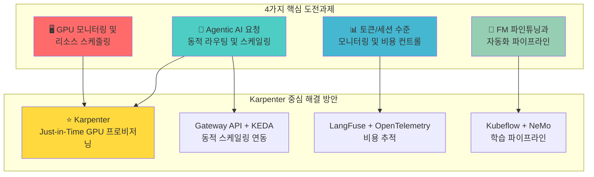
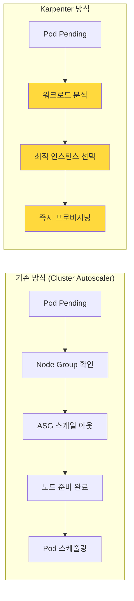
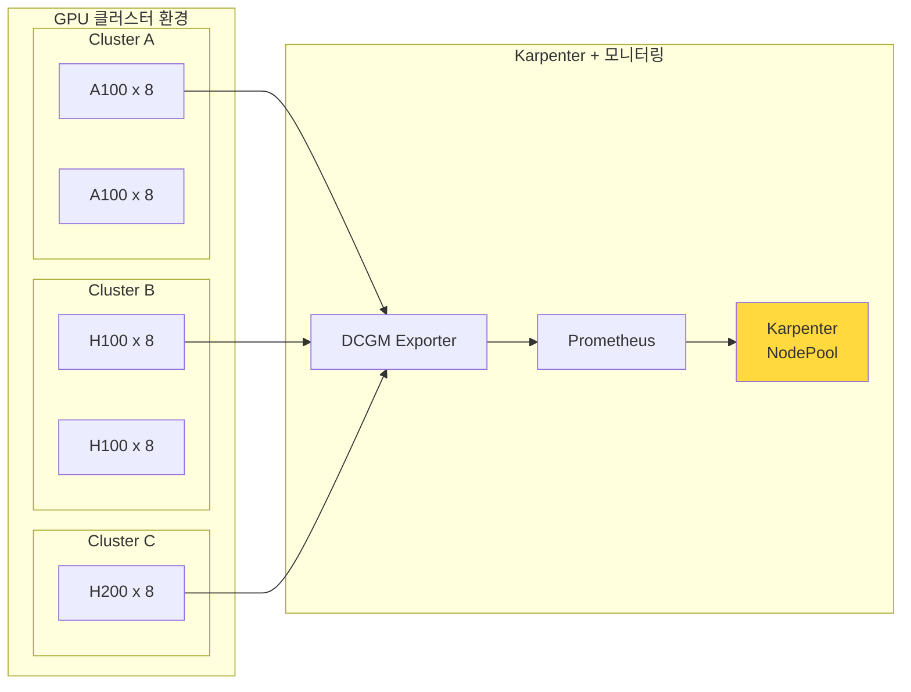
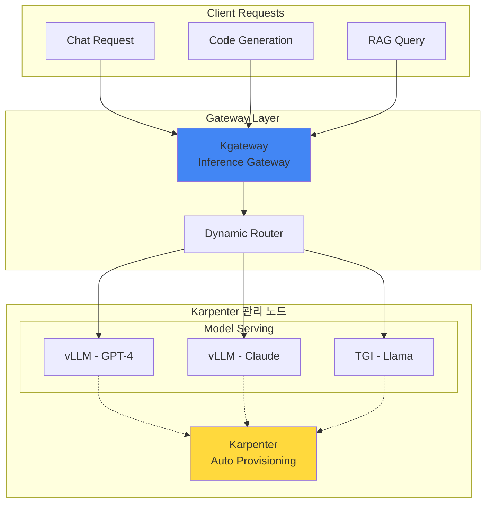
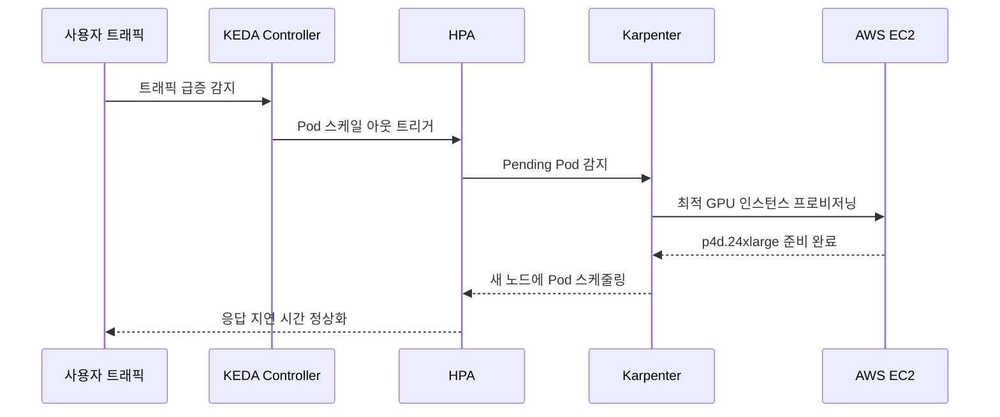
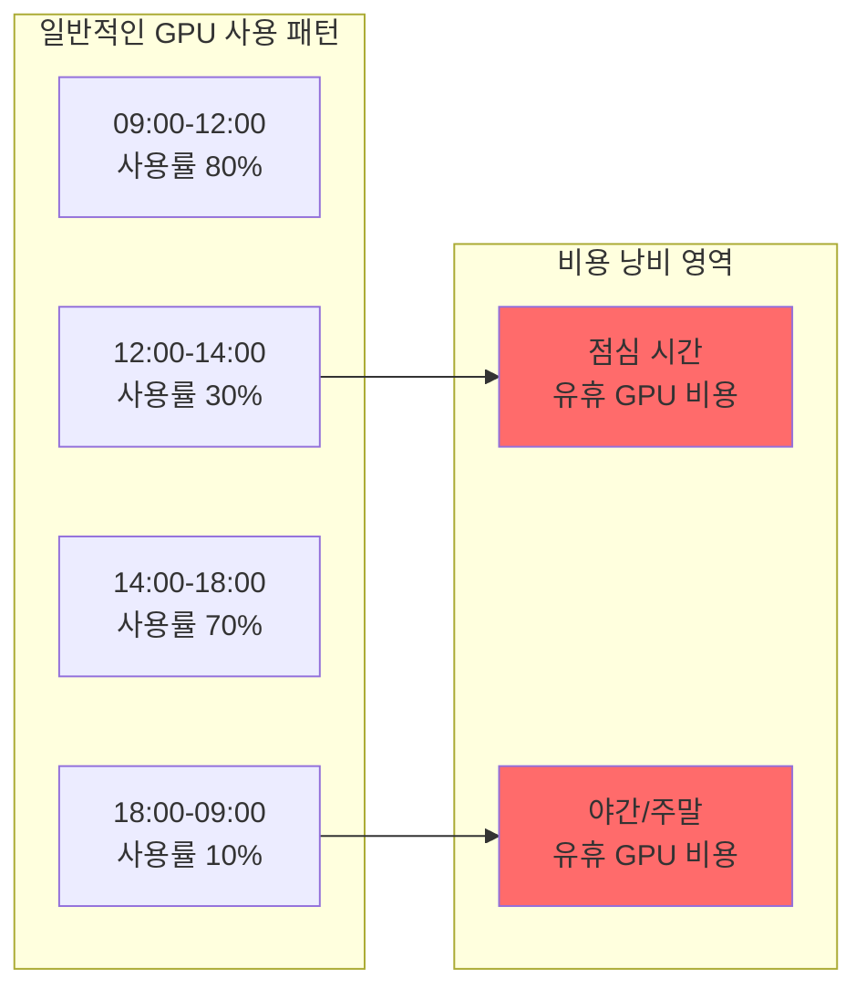
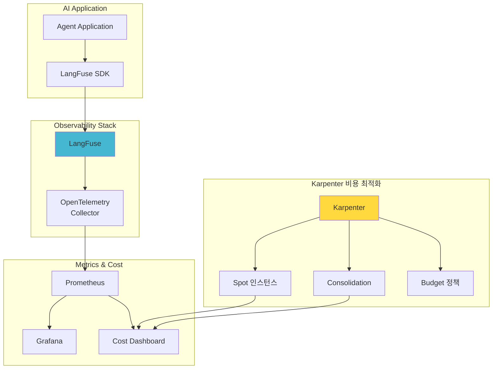
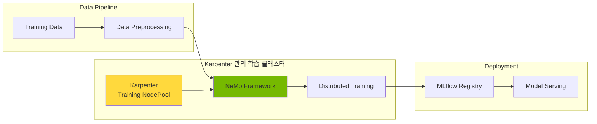
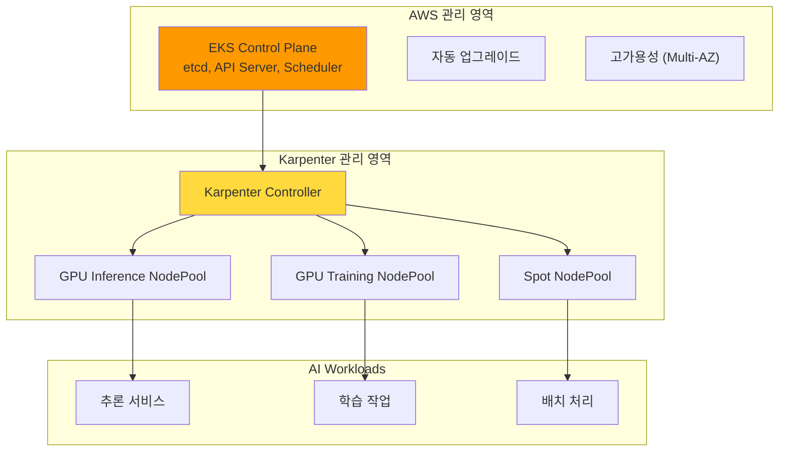

import Tabs from '@theme/Tabs';
import TabItem from '@theme/TabItem';

> 📅 **작성일**: 2025-02-05 | ⏱️ **읽는 시간**: 약 18분

Agentic AI Platform을 구축하고 운영하는 과정에서 플랫폼 엔지니어와 아키텍트는 다양한 기술적 도전과제에 직면합니다. 이 문서에서는 4가지 핵심 도전과제를 분석하고, **Karpenter를 중심으로 한 EKS 기반 해결 방안**을 제시합니다.

## 개요

Frontier Model(최신 대규모 언어 모델)을 활용한 Agentic AI 시스템은 기존 웹 애플리케이션과는 근본적으로 다른 인프라 요구사항을 가집니다. 특히 **GPU 리소스의 동적 프로비저닝과 비용 최적화**가 핵심 과제이며, 이를 해결하기 위해 **Karpenter**가 가장 효과적인 솔루션입니다.



:::info 대상 독자
이 문서는 Agentic AI Platform 도입을 검토하는 **기술 의사결정자**와 **솔루션 아키텍트**를 대상으로 합니다. Karpenter를 활용한 GPU 리소스 최적화 전략과 EKS 도입의 근거를 제공합니다.
:::

## Karpenter: Agentic AI 인프라의 핵심

Karpenter는 Agentic AI Platform의 모든 도전과제를 해결하는 **핵심 컴포넌트**입니다. 기존 Cluster Autoscaler와 달리 Karpenter는 워크로드 요구사항을 직접 분석하여 최적의 노드를 즉시 프로비저닝합니다.

### Karpenter가 제공하는 핵심 가치

| 기능 | 설명 | Agentic AI 적용 |
| --- | --- | --- |
| Just-in-Time 프로비저닝 | 워크로드 요구에 따라 즉시 노드 생성 | GPU 노드 대기 시간 최소화 |
| Spot 인스턴스 지원 | 최대 90% 비용 절감 | 추론 워크로드 비용 최적화 |
| Consolidation | 유휴 노드 자동 정리 | GPU 리소스 효율성 극대화 |
| 다양한 인스턴스 타입 | 워크로드에 최적화된 인스턴스 자동 선택 | 모델 크기별 최적 GPU 매칭 |



:::tip Karpenter vs Cluster Autoscaler
Karpenter는 Node Group 없이 워크로드 요구사항을 직접 분석하여 최적의 인스턴스를 선택합니다. GPU 워크로드의 경우 프로비저닝 시간이 **50% 이상 단축**됩니다.
:::

## 4가지 핵심 기술적 도전과제

### 도전과제 1: GPU 모니터링 및 리소스 스케줄링

Agentic AI 워크로드는 GPU 리소스에 크게 의존합니다. 복수의 GPU 클러스터를 운영할 때 다음과 같은 어려움에 직면합니다.

#### 주요 문제점

- 여러 클러스터에 분산된 GPU 리소스의 통합 모니터링 필요
- 실시간 GPU 할당 현황 파악의 복잡성
- 클러스터 간 리소스 불균형 감지 어려움
- GPU 사용률, 메모리, 온도, 전력 소비 등 다양한 메트릭 수집 필요
- A100, H100, H200 등 다양한 GPU 세대 혼합 운영 시 워크로드 배치 최적화



#### Karpenter 기반 해결 방안 (권장)

**Karpenter NodePool**을 활용하면 GPU 워크로드에 최적화된 노드를 자동으로 프로비저닝하고 관리할 수 있습니다.

<Tabs>
<TabItem value="nodepool" label="GPU NodePool 설정" default>

```yaml
apiVersion: karpenter.sh/v1
kind: NodePool
metadata:
  name: gpu-inference-pool
spec:
  template:
    metadata:
      labels:
        node-type: gpu-inference
        workload: genai
    spec:
      requirements:
        - key: kubernetes.io/arch
          operator: In
          values: ["amd64"]
        - key: karpenter.sh/capacity-type
          operator: In
          values: ["on-demand", "spot"]
        - key: node.kubernetes.io/instance-type
          operator: In
          values:
            - p4d.24xlarge    # 8x A100 40GB
            - p5.48xlarge     # 8x H100 80GB
            - g5.48xlarge     # 8x A10G 24GB
        - key: karpenter.k8s.aws/instance-gpu-count
          operator: Gt
          values: ["0"]
      nodeClassRef:
        group: karpenter.k8s.aws
        kind: EC2NodeClass
        name: gpu-nodeclass
      taints:
        - key: nvidia.com/gpu
          value: "true"
          effect: NoSchedule
  limits:
    nvidia.com/gpu: 100
  disruption:
    consolidationPolicy: WhenEmptyOrUnderutilized
    consolidateAfter: 30s
  weight: 100
```

</TabItem>
<TabItem value="nodeclass" label="EC2NodeClass 설정">

```yaml
apiVersion: karpenter.k8s.aws/v1
kind: EC2NodeClass
metadata:
  name: gpu-nodeclass
spec:
  role: KarpenterNodeRole-${CLUSTER_NAME}
  amiSelectorTerms:
    - alias: al2023@latest
  subnetSelectorTerms:
    - tags:
        karpenter.sh/discovery: ${CLUSTER_NAME}
  securityGroupSelectorTerms:
    - tags:
        karpenter.sh/discovery: ${CLUSTER_NAME}
  blockDeviceMappings:
    - deviceName: /dev/xvda
      ebs:
        volumeSize: 500Gi
        volumeType: gp3
        iops: 10000
        throughput: 500
        encrypted: true
  instanceStorePolicy: RAID0
  userData: |
    #!/bin/bash
    nvidia-smi -pm 1
    modprobe efa
```

</TabItem>
</Tabs>

#### Karpenter의 GPU 워크로드 최적화 기능

| 기능 | 설명 | 효과 |
| --- | --- | --- |
| 인스턴스 타입 자동 선택 | 워크로드 요구사항에 맞는 GPU 인스턴스 자동 선택 | 리소스 낭비 방지 |
| Spot 인스턴스 폴백 | Spot 불가 시 On-Demand로 자동 전환 | 가용성 보장 |
| Consolidation | 유휴 GPU 노드 자동 정리 | 비용 30% 절감 |
| 빠른 프로비저닝 | Node Group 없이 직접 EC2 API 호출 | 프로비저닝 시간 50% 단축 |

#### 보조 솔루션: NVIDIA GPU Operator

Karpenter와 함께 NVIDIA GPU Operator를 사용하여 GPU 드라이버 및 모니터링 스택을 자동화합니다.

```yaml
apiVersion: nvidia.com/v1
kind: ClusterPolicy
metadata:
  name: cluster-policy
spec:
  operator:
    defaultRuntime: containerd
  driver:
    enabled: true
    version: "535.104.05"
  toolkit:
    enabled: true
  devicePlugin:
    enabled: true
  dcgmExporter:
    enabled: true
  migManager:
    enabled: true
```

### 도전과제 2: Agentic AI 요청 동적 라우팅 및 스케일링

Agentic AI 시스템은 다양한 FM(Foundation Model)을 동시에 서빙하며, 트래픽 패턴에 따라 동적으로 대응해야 합니다.

#### 주요 문제점

- GPT-4, Claude, Llama 등 여러 모델을 동시에 운영
- 요청 특성에 따른 최적 모델 선택 로직 필요
- 실시간 모델 성능 메트릭 기반 라우팅 결정
- 예측 불가능한 트래픽 스파이크 대응
- GPU 노드 프로비저닝 시간 최소화



#### Karpenter + KEDA 연동 해결 방안 (권장)

Karpenter와 KEDA를 연동하면 **워크로드 스케일링과 노드 프로비저닝이 자동으로 연계**됩니다.



<Tabs>
<TabItem value="keda" label="KEDA ScaledObject" default>

```yaml
apiVersion: keda.sh/v1alpha1
kind: ScaledObject
metadata:
  name: vllm-gpu-scaler
  namespace: ai-inference
spec:
  scaleTargetRef:
    name: vllm-deployment
  minReplicaCount: 2
  maxReplicaCount: 20
  triggers:
    - type: prometheus
      metadata:
        serverAddress: http://prometheus.observability:9090
        metricName: vllm_pending_requests
        threshold: "50"
        query: |
          sum(vllm_pending_requests{namespace="ai-inference"})
    - type: prometheus
      metadata:
        serverAddress: http://prometheus.observability:9090
        metricName: gpu_utilization
        threshold: "70"
        query: |
          avg(DCGM_FI_DEV_GPU_UTIL{namespace="ai-inference"})
  advanced:
    horizontalPodAutoscalerConfig:
      behavior:
        scaleUp:
          stabilizationWindowSeconds: 0
          policies:
            - type: Percent
              value: 100
              periodSeconds: 15
        scaleDown:
          stabilizationWindowSeconds: 300
```

</TabItem>
<TabItem value="httproute" label="Gateway API HTTPRoute">

```yaml
apiVersion: gateway.networking.k8s.io/v1
kind: HTTPRoute
metadata:
  name: ai-model-routing
  namespace: ai-inference
spec:
  parentRefs:
    - name: ai-gateway
      namespace: ai-gateway
  rules:
    - matches:
        - path:
            type: PathPrefix
            value: /v1/chat/completions
          headers:
            - name: x-model-id
              value: "gpt-4"
      backendRefs:
        - name: vllm-gpt4
          port: 8000
          weight: 80
        - name: vllm-gpt4-canary
          port: 8000
          weight: 20
    - matches:
        - path:
            type: PathPrefix
            value: /v1/chat/completions
          headers:
            - name: x-model-id
              value: "claude-3"
      backendRefs:
        - name: vllm-claude
          port: 8000
```

</TabItem>
</Tabs>

#### Karpenter Disruption 정책으로 안정성 확보

트래픽 급증 시에도 서비스 안정성을 보장하기 위한 Karpenter 설정입니다.

```yaml
apiVersion: karpenter.sh/v1
kind: NodePool
metadata:
  name: gpu-inference-stable
spec:
  disruption:
    consolidationPolicy: WhenEmptyOrUnderutilized
    consolidateAfter: 30s
    budgets:
      # 동시에 중단 가능한 노드 수 제한
      - nodes: "20%"
      # 업무 시간에는 중단 방지
      - nodes: "0"
        schedule: "0 9 * * 1-5"
        duration: 10h
```

:::warning 스케일링 주의사항
GPU 노드 프로비저닝은 일반 CPU 노드보다 시간이 오래 걸립니다. Karpenter의 `consolidationPolicy`를 적절히 설정하여 불필요한 스케일 다운을 방지하세요.
:::

### 도전과제 3: 토큰/세션 수준 모니터링 및 비용 컨트롤

LLM 기반 시스템에서는 토큰 단위의 세밀한 모니터링과 비용 관리가 필수적입니다. 특히 GPU 인프라 비용이 전체 운영 비용의 70-80%를 차지하므로, **인프라 레벨의 비용 최적화**가 핵심입니다.

#### 기술적 문제점 상세 분석

**1. 토큰 레벨 비용 추적의 복잡성**

LLM 서비스의 비용 구조는 다층적입니다:

```
총 비용 = GPU 인프라 비용 + API 호출 비용 + 스토리지 비용 + 네트워크 비용
```

| 비용 요소 | 측정 난이도 | 비중 | 문제점 |
| --- | --- | --- | --- |
| GPU 인프라 | 중간 | 70-80% | 유휴 시간 비용 발생, 인스턴스 타입별 단가 차이 |
| 토큰 사용량 | 높음 | 10-15% | 입력/출력 토큰 비율 예측 어려움 |
| 스토리지 | 낮음 | 5-10% | 모델 아티팩트 크기 증가 |
| 네트워크 | 낮음 | 3-5% | Cross-AZ 트래픽 비용 |

**2. GPU 유휴 비용 문제**



**3. 멀티 테넌트 비용 분리의 어려움**

- 팀/프로젝트별 GPU 사용량 정확한 측정 필요
- 공유 GPU 노드에서의 비용 할당 로직 복잡
- 실시간 할당량(Quota) 관리 및 초과 방지

**4. 예측 불가능한 비용 급증**

- 트래픽 스파이크 시 자동 스케일링으로 인한 비용 급증
- Spot 인스턴스 중단 시 On-Demand 폴백으로 비용 증가
- 모델 업데이트 시 일시적 리소스 중복 사용



#### Karpenter 기반 비용 최적화 전략 (권장)

Karpenter는 GPU 인프라 비용 최적화의 **핵심 레버**입니다. 다음 4가지 전략을 조합하여 최대 효과를 얻을 수 있습니다.

**전략 1: Spot 인스턴스 우선 활용**

Karpenter의 Spot 인스턴스 지원을 활용하면 GPU 비용을 **최대 90%까지 절감**할 수 있습니다.

```yaml
apiVersion: karpenter.sh/v1
kind: NodePool
metadata:
  name: gpu-spot-inference
spec:
  template:
    metadata:
      labels:
        cost-tier: spot
        workload: inference
    spec:
      requirements:
        - key: karpenter.sh/capacity-type
          operator: In
          values: ["spot"]
        - key: node.kubernetes.io/instance-type
          operator: In
          values:
            - g5.12xlarge
            - g5.24xlarge
            - g5.48xlarge
            - p4d.24xlarge
      nodeClassRef:
        group: karpenter.k8s.aws
        kind: EC2NodeClass
        name: gpu-spot-nodeclass
      taints:
        - key: nvidia.com/gpu
          value: "true"
          effect: NoSchedule
        - key: karpenter.sh/capacity-type
          value: "spot"
          effect: NoSchedule
  limits:
    nvidia.com/gpu: 32
  disruption:
    consolidationPolicy: WhenEmpty
    consolidateAfter: 30s
  weight: 50  # On-Demand보다 우선 선택
```

**전략 2: 시간대별 스케줄 기반 비용 관리**

업무 시간과 비업무 시간에 따른 차별화된 리소스 정책을 적용합니다.

```yaml
apiVersion: karpenter.sh/v1
kind: NodePool
metadata:
  name: gpu-scheduled-pool
spec:
  template:
    spec:
      requirements:
        - key: karpenter.sh/capacity-type
          operator: In
          values: ["on-demand", "spot"]
        - key: node.kubernetes.io/instance-type
          operator: In
          values:
            - g5.12xlarge
            - g5.24xlarge
      nodeClassRef:
        group: karpenter.k8s.aws
        kind: EC2NodeClass
        name: gpu-nodeclass
  limits:
    nvidia.com/gpu: 16
  disruption:
    consolidationPolicy: WhenEmptyOrUnderutilized
    consolidateAfter: 30s
    budgets:
      # 업무 시간: 안정성 우선 (노드 중단 최소화)
      - nodes: "10%"
        schedule: "0 9 * * 1-5"
        duration: 9h
      # 비업무 시간: 비용 우선 (적극적 통합)
      - nodes: "50%"
        schedule: "0 18 * * 1-5"
        duration: 15h
      # 주말: 최소 리소스 유지
      - nodes: "80%"
        schedule: "0 0 * * 0,6"
        duration: 24h
```

**전략 3: Consolidation을 통한 유휴 리소스 제거**

```yaml
apiVersion: karpenter.sh/v1
kind: NodePool
metadata:
  name: gpu-consolidation-pool
spec:
  disruption:
    # 노드가 비어있거나 활용도가 낮을 때 통합
    consolidationPolicy: WhenEmptyOrUnderutilized
    # 빠른 통합으로 비용 절감 (30초 대기 후 통합)
    consolidateAfter: 30s
```

**전략 4: 워크로드별 인스턴스 최적화**

```yaml
# 소규모 모델용 (7B 이하) - 비용 효율적
apiVersion: karpenter.sh/v1
kind: NodePool
metadata:
  name: gpu-small-models
spec:
  template:
    spec:
      requirements:
        - key: node.kubernetes.io/instance-type
          operator: In
          values:
            - g5.xlarge      # 1x A10G - $1.01/hr
            - g5.2xlarge     # 1x A10G - $1.21/hr
  weight: 100  # 최우선 선택

---
# 대규모 모델용 (70B+) - 성능 우선
apiVersion: karpenter.sh/v1
kind: NodePool
metadata:
  name: gpu-large-models
spec:
  template:
    spec:
      requirements:
        - key: node.kubernetes.io/instance-type
          operator: In
          values:
            - p4d.24xlarge   # 8x A100 - $32.77/hr
            - p5.48xlarge    # 8x H100 - $98.32/hr
  weight: 10   # 필요시에만 선택
```

#### 비용 최적화 전략 비교

| 전략 | 구현 방법 | 예상 절감률 | 적용 워크로드 | 위험도 |
| --- | --- | --- | --- | --- |
| Spot 인스턴스 | Karpenter NodePool | 60-90% | 추론, 배치 처리 | 중간 (중단 가능) |
| Consolidation | Karpenter disruption | 20-30% | 모든 워크로드 | 낮음 |
| Right-sizing | Karpenter 인스턴스 자동 선택 | 15-25% | 모든 워크로드 | 낮음 |
| 스케줄 기반 | Karpenter budgets | 30-40% | 비업무 시간 | 낮음 |
| 복합 적용 | 위 전략 조합 | 50-70% | 전체 | 중간 |

#### 보조 솔루션: LangFuse 기반 토큰 추적

인프라 비용과 함께 토큰 레벨 비용도 추적해야 완전한 비용 가시성을 확보할 수 있습니다.

```yaml
apiVersion: apps/v1
kind: Deployment
metadata:
  name: langfuse
  namespace: observability
spec:
  replicas: 2
  selector:
    matchLabels:
      app: langfuse
  template:
    metadata:
      labels:
        app: langfuse
    spec:
      containers:
        - name: langfuse
          image: langfuse/langfuse:latest
          ports:
            - containerPort: 3000
          env:
            - name: DATABASE_URL
              valueFrom:
                secretKeyRef:
                  name: langfuse-secrets
                  key: database-url
            - name: NEXTAUTH_SECRET
              valueFrom:
                secretKeyRef:
                  name: langfuse-secrets
                  key: nextauth-secret
          resources:
            requests:
              memory: "512Mi"
              cpu: "250m"
            limits:
              memory: "1Gi"
              cpu: "500m"
```

#### 비용 모니터링 대시보드 구성

```yaml
# Prometheus 비용 관련 메트릭 수집 규칙
apiVersion: monitoring.coreos.com/v1
kind: PrometheusRule
metadata:
  name: gpu-cost-rules
  namespace: monitoring
spec:
  groups:
    - name: gpu-cost
      rules:
        - record: gpu:hourly_cost:sum
          expr: |
            sum(
              karpenter_nodes_total_pod_requests{resource_type="nvidia.com/gpu"} 
              * on(instance_type) group_left() 
              aws_ec2_instance_hourly_cost
            )
        - alert: HighGPUCostAlert
          expr: gpu:hourly_cost:sum > 100
          for: 1h
          labels:
            severity: warning
          annotations:
            summary: "시간당 GPU 비용이 $100를 초과했습니다"
```

:::tip 비용 최적화 체크리스트
1. **Spot 인스턴스 비율**: 추론 워크로드의 70% 이상을 Spot으로 운영
2. **Consolidation 활성화**: 30초 이내 유휴 노드 정리
3. **스케줄 기반 정책**: 비업무 시간 리소스 50% 이상 축소
4. **Right-sizing**: 모델 크기에 맞는 인스턴스 타입 자동 선택
:::

:::warning 비용 최적화 주의사항
- Spot 인스턴스 중단 시 서비스 영향 최소화를 위한 graceful shutdown 구현 필수
- 과도한 Consolidation은 스케일 아웃 지연을 유발할 수 있음
- 비용 절감과 SLA 준수 사이의 균형점 설정 필요
:::

### 도전과제 4: FM 파인튜닝과 자동화 파이프라인

Foundation Model을 특정 도메인에 맞게 파인튜닝하고 지속적으로 개선하는 것은 복잡한 과정입니다.

#### 주요 문제점

- 멀티 노드, 멀티 GPU 학습 환경 설정
- 데이터 병렬화, 모델 병렬화, 텐서 병렬화 전략
- 학습 중 체크포인트 관리 및 장애 복구
- 모델 버전 관리 및 A/B 테스트 환경 구축



#### Karpenter 기반 학습 클러스터 구성 (권장)

대규모 분산 학습을 위한 Karpenter NodePool 설정입니다.

```yaml
apiVersion: karpenter.sh/v1
kind: NodePool
metadata:
  name: gpu-training-pool
spec:
  template:
    metadata:
      labels:
        node-type: gpu-training
        workload: ml-training
    spec:
      requirements:
        - key: kubernetes.io/arch
          operator: In
          values: ["amd64"]
        - key: karpenter.sh/capacity-type
          operator: In
          values: ["on-demand"]  # 학습은 On-Demand 권장
        - key: node.kubernetes.io/instance-type
          operator: In
          values:
            - p5.48xlarge     # 8x H100 80GB - 대규모 학습
            - p4d.24xlarge    # 8x A100 40GB - 중규모 학습
      nodeClassRef:
        group: karpenter.k8s.aws
        kind: EC2NodeClass
        name: gpu-training-nodeclass
      taints:
        - key: nvidia.com/gpu
          value: "true"
          effect: NoSchedule
        - key: workload-type
          value: "training"
          effect: NoSchedule
  limits:
    nvidia.com/gpu: 64
  disruption:
    # 학습 중에는 노드 중단 방지
    consolidationPolicy: WhenEmpty
    consolidateAfter: 1h
```

#### NeMo 분산 학습 Job

```yaml
apiVersion: batch/v1
kind: Job
metadata:
  name: nemo-finetune-llama
  namespace: ai-training
spec:
  parallelism: 4
  completions: 4
  template:
    spec:
      containers:
        - name: nemo
          image: nvcr.io/nvidia/nemo:24.01
          command:
            - python
            - -m
            - torch.distributed.launch
            - --nproc_per_node=8
            - --nnodes=4
            - /opt/NeMo/examples/nlp/language_modeling/megatron_gpt_finetuning.py
          args:
            - model.data.train_ds.file_path=/data/train.jsonl
            - trainer.devices=8
            - trainer.num_nodes=4
            - trainer.max_epochs=3
          resources:
            limits:
              nvidia.com/gpu: 8
          volumeMounts:
            - name: training-data
              mountPath: /data
      nodeSelector:
        node-type: gpu-training
      tolerations:
        - key: nvidia.com/gpu
          operator: Exists
          effect: NoSchedule
        - key: workload-type
          operator: Equal
          value: "training"
          effect: NoSchedule
      restartPolicy: OnFailure
```

## Amazon EKS와 Karpenter의 시너지

Amazon EKS는 Karpenter와 함께 사용할 때 최대의 효과를 발휘합니다.

### EKS + Karpenter 아키텍처



### EKS Auto Mode와 Karpenter

EKS Auto Mode를 사용하면 Karpenter가 자동으로 구성되어 운영 부담이 크게 줄어듭니다.

| 기능 | EKS Standard + Karpenter | EKS Auto Mode |
| --- | --- | --- |
| Karpenter 설치 | 수동 설치 필요 | 자동 구성 |
| NodePool 관리 | 직접 정의 | 기본 제공 + 커스텀 |
| 업그레이드 | 수동 관리 | 자동 업그레이드 |
| 모니터링 | 별도 구성 | 통합 제공 |

### AWS 서비스 통합

| AWS 서비스 | 용도 | Karpenter 연동 |
| --- | --- | --- |
| Amazon S3 | 모델 아티팩트 저장 | CSI Driver, IRSA |
| FSx for Lustre | 고성능 학습 데이터 | CSI Driver |
| CloudWatch | 메트릭, 로그 | Container Insights |
| EC2 Spot | 비용 최적화 | Karpenter capacity-type |

## Karpenter 도입 효과 요약

### 정량적 효과

| 지표 | 기존 방식 | Karpenter 도입 후 | 개선율 |
| --- | --- | --- | --- |
| GPU 노드 프로비저닝 시간 | 5-10분 | 2-3분 | 50-70% 단축 |
| GPU 리소스 활용률 | 40-50% | 70-80% | 40-60% 향상 |
| 월간 GPU 비용 | 기준 | Spot 활용 시 | 60-90% 절감 |
| 유휴 노드 비용 | 발생 | Consolidation | 20-30% 절감 |

### 정성적 효과

- **운영 복잡성 감소**: Node Group 관리 불필요
- **자동화 수준 향상**: 워크로드 기반 자동 프로비저닝
- **비용 가시성 개선**: 워크로드별 비용 추적 용이
- **확장성 확보**: 트래픽 급증에 즉각 대응

## 결론

Agentic AI Platform 구축의 4가지 핵심 도전과제는 **Karpenter를 중심으로 한 EKS 기반 아키텍처**로 효과적으로 해결할 수 있습니다.

### 핵심 권장사항

1. **Karpenter 우선 도입**: GPU 노드 관리의 핵심 컴포넌트로 Karpenter 활용
2. **Spot 인스턴스 활용**: 추론 워크로드에 Spot 인스턴스로 비용 최적화
3. **KEDA 연동**: Karpenter와 KEDA를 연동하여 End-to-End 자동 스케일링 구현
4. **Consolidation 활성화**: 유휴 리소스 자동 정리로 비용 효율성 극대화

:::info 다음 단계
이 문서에서 소개한 각 도전과제에 대한 상세한 구현 가이드는 다음 문서들을 참조하세요:

- [GPU 리소스 관리](./gpu-resource-management.md) - Karpenter 기반 GPU 클러스터 동적 리소스 할당
- [Inference Gateway](./inference-gateway-routing.md) - Kgateway 기반 동적 라우팅
- [Agent 모니터링](./agent-monitoring.md) - LangFuse, LangSmith 통합
- [NeMo 프레임워크](./nemo-framework.md) - FM 파인튜닝 파이프라인

:::

## 참고 자료

- [Karpenter 공식 문서](https://karpenter.sh/docs/)
- [Amazon EKS Best Practices Guide](https://aws.github.io/aws-eks-best-practices/)
- [NVIDIA GPU Operator Documentation](https://docs.nvidia.com/datacenter/cloud-native/gpu-operator/overview.html)
- [KEDA - Kubernetes Event-driven Autoscaling](https://keda.sh/)
- [LangFuse Documentation](https://langfuse.com/docs)
- [NVIDIA NeMo Framework](https://docs.nvidia.com/nemo-framework/user-guide/latest/overview.html)
