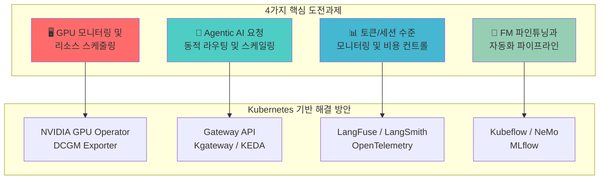
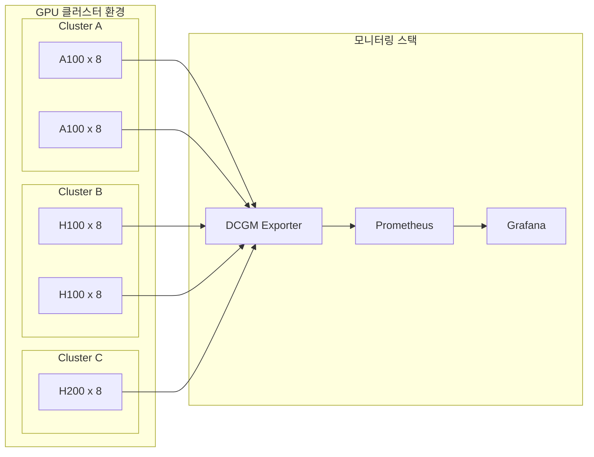
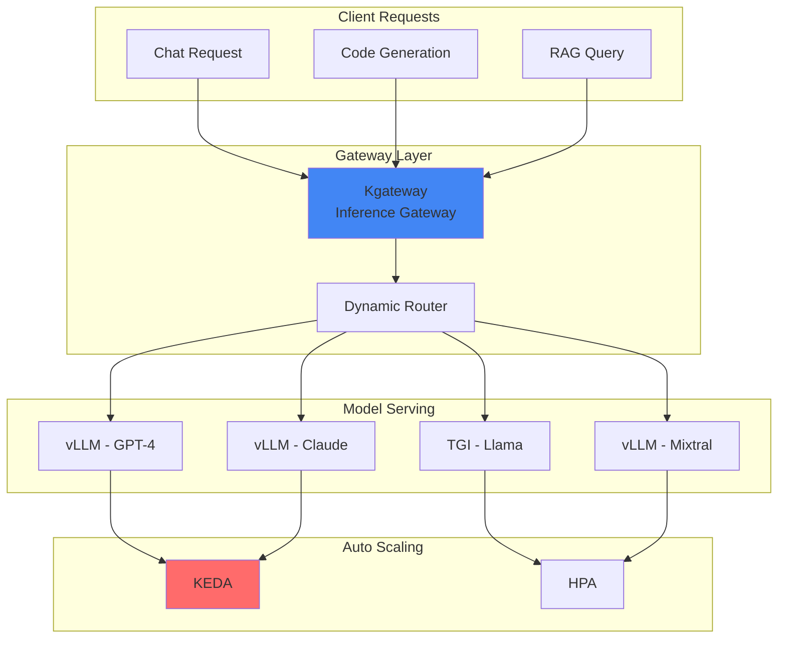
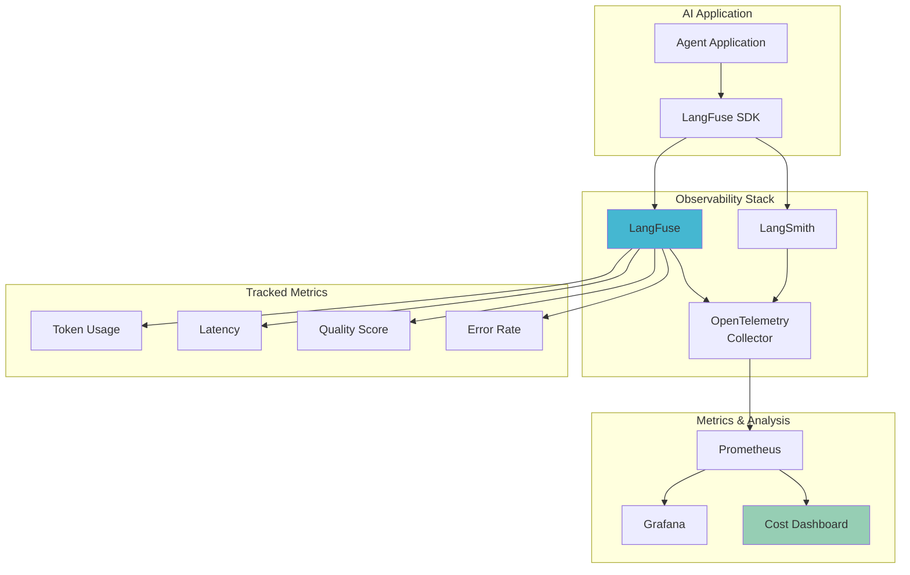
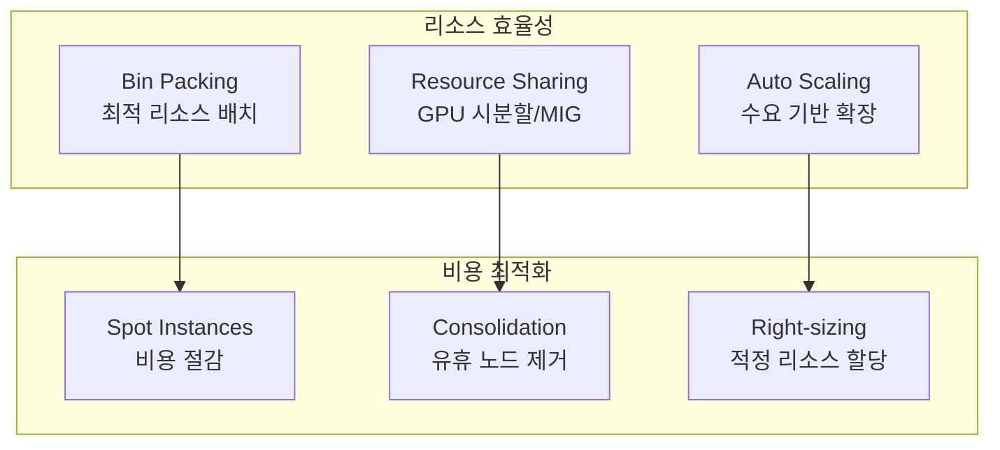
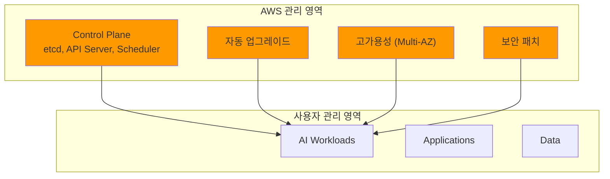
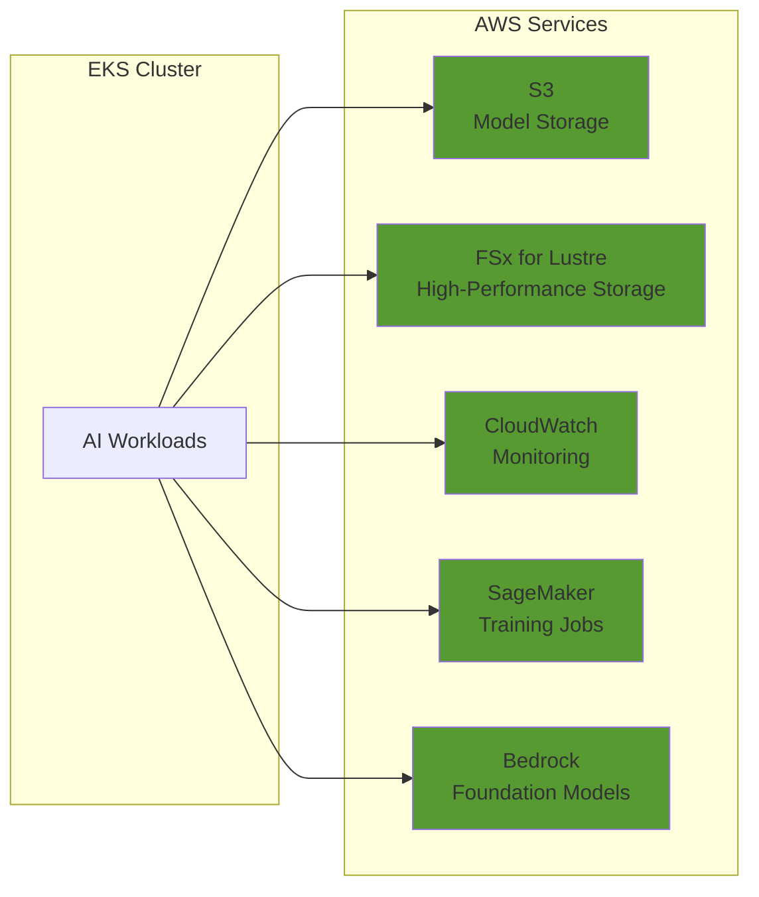

# Agentic AI Platform 기술적 도전과제와 Kubernetes

> 📅 **작성일**: 2025-02-05 | ⏱️ **읽는 시간**: 약 16분


Agentic AI Platform을 구축하고 운영하는 과정에서 플랫폼 엔지니어와 아키텍트는 다양한 기술적 도전과제에 직면합니다. 이 문서에서는 4가지 핵심 도전과제를 분석하고, Kubernetes와 Amazon EKS가 이러한 문제를 어떻게 해결하는지 설명합니다.

## 개요

Frontier Model(최신 대규모 언어 모델)을 활용한 Agentic AI 시스템은 기존 웹 애플리케이션과는 근본적으로 다른 인프라 요구사항을 가집니다. GPU 리소스의 효율적 활용, 동적 트래픽 관리, 세밀한 비용 추적, 그리고 지속적인 모델 개선을 위한 자동화 파이프라인이 필수적입니다.



:::info 대상 독자
이 문서는 Agentic AI Platform 도입을 검토하는 **기술 의사결정자**와 **솔루션 아키텍트**를 대상으로 합니다. 플랫폼 아키텍처 선택의 근거를 이해하고 EKS 도입을 정당화하는 데 필요한 정보를 제공합니다.
:::

---

## 4가지 핵심 기술적 도전과제

### 1. GPU 모니터링 및 리소스 스케줄링

#### 도전과제

Agentic AI 워크로드는 GPU 리소스에 크게 의존합니다. 복수의 GPU 클러스터를 운영할 때 다음과 같은 어려움에 직면합니다:

**복수 GPU 클러스터 환경에서의 리소스 가시성 확보의 어려움**
- 여러 클러스터에 분산된 GPU 리소스의 통합 모니터링 필요
- 실시간 GPU 할당 현황 파악의 복잡성
- 클러스터 간 리소스 불균형 감지 어려움

**GPU 하드웨어 레벨 메트릭 수집의 복잡성**
- GPU 사용률, 메모리, 온도, 전력 소비 등 다양한 메트릭 수집 필요
- NVIDIA 드라이버 및 CUDA 버전 호환성 관리
- 메트릭 수집 오버헤드 최소화 필요

**이기종 GPU 혼합 환경에서의 워크로드 배치 최적화**
- A100, H100, H200 등 다양한 GPU 세대 혼합 운영
- 워크로드 특성에 맞는 최적 GPU 선택 로직 필요
- GPU 메모리 용량에 따른 모델 배치 전략 수립



#### Kubernetes 기반 해결 방안

Kubernetes는 **Device Plugin**, **NVIDIA GPU Operator**, **DCGM Exporter**를 통해 이러한 도전과제를 해결합니다.

| 컴포넌트 | 역할 | 주요 기능 |
|---------|------|----------|
| **Device Plugin** | GPU 리소스 추상화 | Pod에 GPU 할당, 리소스 요청/제한 관리 |
| **NVIDIA GPU Operator** | GPU 스택 자동화 | 드라이버, 런타임, 모니터링 자동 설치 |
| **DCGM Exporter** | 메트릭 수집 | GPU 사용률, 메모리, 온도 등 Prometheus 메트릭 노출 |

```yaml
# NVIDIA GPU Operator를 통한 GPU 스택 자동화
apiVersion: nvidia.com/v1
kind: ClusterPolicy
metadata:
  name: cluster-policy
spec:
  operator:
    defaultRuntime: containerd
  driver:
    enabled: true
    version: "535.104.05"
  toolkit:
    enabled: true
  devicePlugin:
    enabled: true
  dcgmExporter:
    enabled: true
    config:
      name: dcgm-exporter-config
  migManager:
    enabled: true
```

:::tip GPU 리소스 요청 예시
Pod에서 GPU를 요청할 때는 `nvidia.com/gpu` 리소스를 사용합니다:
```yaml
resources:
  limits:
    nvidia.com/gpu: 4
  requests:
    nvidia.com/gpu: 4
```
:::

---

### 2. Agentic AI 요청 동적 라우팅 및 스케일링

#### 도전과제

Agentic AI 시스템은 다양한 FM(Foundation Model)을 동시에 서빙하며, 트래픽 패턴에 따라 동적으로 대응해야 합니다:

**다중 FM 모델 서빙 환경에서의 지능형 트래픽 분배 필요성**
- GPT-4, Claude, Llama 등 여러 모델을 동시에 운영
- 요청 특성에 따른 최적 모델 선택 로직 필요
- 모델별 가용성 및 응답 품질 기반 라우팅

**모델별 응답 시간, 토큰 처리량 기반 동적 라우팅의 복잡성**
- 실시간 모델 성능 메트릭 기반 라우팅 결정
- 토큰/초(TPS) 기반 로드 밸런싱
- 응답 지연 시간 기반 자동 폴백

**트래픽 급증 시 실시간 스케일링과 리소스 재배치의 어려움**
- 예측 불가능한 트래픽 스파이크 대응
- GPU 노드 프로비저닝 시간 최소화
- 모델 간 리소스 동적 재배치



#### Kubernetes 기반 해결 방안

**Gateway API**, **Kgateway**, **KEDA**를 활용하여 지능형 트래픽 관리와 자동 스케일링을 구현합니다.

| 컴포넌트 | 역할 | 주요 기능 |
|---------|------|----------|
| **Gateway API** | 표준 트래픽 관리 | HTTPRoute, 가중치 기반 라우팅, 헤더 기반 라우팅 |
| **Kgateway** | AI 특화 게이트웨이 | 모델별 라우팅, 토큰 기반 로드 밸런싱 |
| **KEDA** | 이벤트 기반 스케일링 | 큐 길이, 메트릭 기반 자동 스케일링 |

```yaml
# Kgateway HTTPRoute 설정 예시
apiVersion: gateway.networking.k8s.io/v1
kind: HTTPRoute
metadata:
  name: ai-model-routing
  namespace: ai-inference
spec:
  parentRefs:
    - name: ai-gateway
      namespace: ai-gateway
  rules:
    # 모델 A로 80%, Canary로 20% 트래픽 분배
    - matches:
        - path:
            type: PathPrefix
            value: /v1/chat/completions
          headers:
            - name: x-model-id
              value: "gpt-4"
      backendRefs:
        - name: vllm-gpt4
          port: 8000
          weight: 80
        - name: vllm-gpt4-canary
          port: 8000
          weight: 20
    # Claude 모델 라우팅
    - matches:
        - path:
            type: PathPrefix
            value: /v1/chat/completions
          headers:
            - name: x-model-id
              value: "claude-3"
      backendRefs:
        - name: vllm-claude
          port: 8000
```

```yaml
# KEDA ScaledObject 설정 예시
apiVersion: keda.sh/v1alpha1
kind: ScaledObject
metadata:
  name: vllm-scaler
  namespace: ai-inference
spec:
  scaleTargetRef:
    name: vllm-deployment
  minReplicaCount: 1
  maxReplicaCount: 10
  triggers:
    - type: prometheus
      metadata:
        serverAddress: http://prometheus:9090
        metricName: vllm_pending_requests
        threshold: "100"
        query: sum(vllm_pending_requests{namespace="ai-inference"})
```

:::warning 스케일링 주의사항
GPU 노드 프로비저닝은 일반 CPU 노드보다 시간이 오래 걸립니다. Karpenter의 `consolidationPolicy`를 적절히 설정하여 불필요한 스케일 다운을 방지하세요.
:::

---

### 3. 토큰/세션 수준 모니터링 및 비용 컨트롤

#### 도전과제

LLM 기반 시스템에서는 토큰 단위의 세밀한 모니터링과 비용 관리가 필수적입니다:

**LLM 호출별 토큰 사용량 추적 및 비용 산정의 복잡성**
- 입력/출력 토큰 수 정확한 측정
- 모델별 토큰 단가 적용
- 실시간 비용 누적 계산

**프롬프트 품질과 응답 품질의 상관관계 분석 필요성**
- 프롬프트 템플릿별 성능 비교
- 응답 품질 메트릭 정의 및 측정
- A/B 테스트를 통한 프롬프트 최적화

**멀티 테넌트 환경에서의 사용량 할당 및 청구 메커니즘**
- 팀/프로젝트별 사용량 분리
- 할당량(Quota) 관리 및 제한
- 상세 청구 리포트 생성



#### Kubernetes 기반 해결 방안

**LangFuse**, **LangSmith**, **OpenTelemetry**를 통합하여 종합적인 관측성 스택을 구축합니다.

| 컴포넌트 | 역할 | 주요 기능 |
|---------|------|----------|
| **LangFuse** | LLM 관측성 플랫폼 | 트레이스, 토큰 추적, 비용 분석, 프롬프트 관리 |
| **LangSmith** | LangChain 모니터링 | 에이전트 디버깅, 워크플로우 추적 |
| **OpenTelemetry** | 표준 관측성 | 분산 트레이싱, 메트릭 수집, 로그 통합 |

```yaml
# LangFuse Kubernetes 배포 예시
apiVersion: apps/v1
kind: Deployment
metadata:
  name: langfuse
  namespace: observability
spec:
  replicas: 2
  selector:
    matchLabels:
      app: langfuse
  template:
    metadata:
      labels:
        app: langfuse
    spec:
      containers:
        - name: langfuse
          image: langfuse/langfuse:latest
          ports:
            - containerPort: 3000
          env:
            - name: DATABASE_URL
              valueFrom:
                secretKeyRef:
                  name: langfuse-secrets
                  key: database-url
            - name: NEXTAUTH_SECRET
              valueFrom:
                secretKeyRef:
                  name: langfuse-secrets
                  key: nextauth-secret
          resources:
            requests:
              memory: "512Mi"
              cpu: "250m"
            limits:
              memory: "1Gi"
              cpu: "500m"
```

```python
# LangFuse를 통한 토큰 추적 예시
from langfuse import Langfuse
from langfuse.decorators import observe

langfuse = Langfuse()

@observe(as_type="generation")
def call_llm(prompt: str, model: str = "gpt-4"):
    """LLM 호출 및 자동 토큰 추적"""
    response = openai.chat.completions.create(
        model=model,
        messages=[{"role": "user", "content": prompt}]
    )
    return response.choices[0].message.content

# 멀티 테넌트 비용 추적
@observe()
def process_request(tenant_id: str, request: dict):
    """테넌트별 요청 처리 및 비용 추적"""
    langfuse.trace(
        name="tenant-request",
        metadata={"tenant_id": tenant_id},
        tags=[f"tenant:{tenant_id}"]
    )
    return call_llm(request["prompt"])
```

:::tip 비용 최적화 팁
LangFuse의 대시보드를 활용하여 모델별, 테넌트별 비용을 실시간으로 모니터링하고, 비용 임계값 알림을 설정하세요.
:::

---

### 4. FM 파인튜닝과 자동화 파이프라인

#### 도전과제

Foundation Model을 특정 도메인에 맞게 파인튜닝하고 지속적으로 개선하는 것은 복잡한 과정입니다:

**대규모 분산 학습 환경 구성의 복잡성**
- 멀티 노드, 멀티 GPU 학습 환경 설정
- 데이터 병렬화, 모델 병렬화, 텐서 병렬화 전략
- 학습 중 체크포인트 관리 및 장애 복구

**학습 데이터 전처리, 모델 학습, 평가, 배포의 End-to-End 자동화 필요성**
- 데이터 파이프라인 자동화
- 학습 실험 추적 및 비교
- 모델 평가 자동화 및 품질 게이트

**모델 버전 관리 및 A/B 테스트 환경 구축의 어려움**
- 모델 아티팩트 버전 관리
- 점진적 롤아웃 전략
- 성능 비교 및 롤백 메커니즘

```mermaid
graph LR
    subgraph "Data Pipeline"
        DATA["Training Data"]
        PREP["Data Preprocessing"]
    end
    
    subgraph "Training Pipeline"
        NEMO["NeMo Framework"]
        DIST["Distributed Training"]
        CKPT["Checkpointing"]
    end
    
    subgraph "Evaluation & Registry"
        EVAL["Model Evaluation"]
        MLFLOW["MLflow Registry"]
        VER["Version Control"]
    end
    
    subgraph "Deployment"
        SERVE["Model Serving"]
        AB["A/B Testing"]
        PROD["Production"]
    end
    
    DATA --> PREP
    PREP --> NEMO
    NEMO --> DIST
    DIST --> CKPT
    CKPT --> EVAL
    EVAL --> MLFLOW
    MLFLOW --> VER
    VER --> SERVE
    SERVE --> AB
    AB --> PROD
    
    style NEMO fill:#76b900
    style MLFLOW fill:#0194e2
```



#### Kubernetes 기반 해결 방안

**Kubeflow**, **NeMo**, **MLflow**를 활용하여 End-to-End MLOps 파이프라인을 구축합니다.

| 컴포넌트 | 역할 | 주요 기능 |
|---------|------|----------|
| **Kubeflow** | ML 파이프라인 오케스트레이션 | 워크플로우 정의, 실험 추적, 하이퍼파라미터 튜닝 |
| **NeMo** | LLM 학습 프레임워크 | 분산 학습, PEFT, TensorRT-LLM 변환 |
| **MLflow** | 모델 레지스트리 | 모델 버전 관리, 실험 추적, 배포 관리 |

```yaml
# NeMo 분산 학습 Job 예시
apiVersion: batch/v1
kind: Job
metadata:
  name: nemo-finetune-llama
  namespace: ai-training
spec:
  parallelism: 4
  completions: 4
  template:
    spec:
      containers:
        - name: nemo
          image: nvcr.io/nvidia/nemo:24.01
          command:
            - python
            - -m
            - torch.distributed.launch
            - --nproc_per_node=8
            - --nnodes=4
            - /opt/NeMo/examples/nlp/language_modeling/megatron_gpt_finetuning.py
          args:
            - model.data.train_ds.file_path=/data/train.jsonl
            - model.data.validation_ds.file_path=/data/val.jsonl
            - trainer.devices=8
            - trainer.num_nodes=4
            - trainer.max_epochs=3
          resources:
            limits:
              nvidia.com/gpu: 8
          volumeMounts:
            - name: training-data
              mountPath: /data
            - name: checkpoints
              mountPath: /checkpoints
      nodeSelector:
        node.kubernetes.io/instance-type: p5.48xlarge
      restartPolicy: OnFailure
```

:::info Kubeflow Pipeline 예시
Kubeflow를 사용하면 데이터 전처리부터 모델 배포까지 전체 파이프라인을 선언적으로 정의할 수 있습니다:
```python
@dsl.pipeline(name="llm-finetune-pipeline")
def finetune_pipeline(model_name: str, dataset_path: str):
    preprocess = preprocess_op(dataset_path)
    train = train_op(preprocess.output, model_name)
    evaluate = evaluate_op(train.output)
    deploy = deploy_op(evaluate.output).after(evaluate)
```
:::

---

## Kubernetes가 필수인 이유

Agentic AI Platform 구축에 Kubernetes가 필수적인 이유는 다음과 같습니다:

### 선언적 인프라 관리를 통한 재현 가능한 환경 구성

```yaml
# 인프라를 코드로 정의하여 재현 가능한 환경 구성
apiVersion: v1
kind: Namespace
metadata:
  name: ai-platform
  labels:
    environment: production
    team: ml-platform
---
apiVersion: apps/v1
kind: Deployment
metadata:
  name: inference-server
  namespace: ai-platform
spec:
  replicas: 3
  # ... 선언적 설정
```

- **GitOps 워크플로우**: 인프라 변경 사항을 Git으로 관리
- **환경 일관성**: 개발, 스테이징, 프로덕션 환경 동일하게 유지
- **롤백 용이성**: 이전 버전으로 쉽게 복원 가능

### 오픈소스 생태계와의 네이티브 통합

Kubernetes는 AI/ML 생태계의 핵심 오픈소스 도구들과 네이티브하게 통합됩니다:

| 카테고리 | 도구 | Kubernetes 통합 |
|---------|------|----------------|
| **GPU 관리** | NVIDIA GPU Operator | Operator 패턴으로 자동화 |
| **노드 스케일링** | Karpenter | NodePool CRD로 선언적 관리 |
| **이벤트 스케일링** | KEDA | ScaledObject CRD로 자동 스케일링 |
| **ML 파이프라인** | Kubeflow | Kubernetes 네이티브 ML 플랫폼 |
| **모델 서빙** | KServe | InferenceService CRD로 모델 배포 |
| **서비스 메시** | Istio | 트래픽 관리 및 관측성 |

### 컨테이너 오케스트레이션을 통한 리소스 효율성 극대화



- **Bin Packing**: 노드 리소스를 최대한 활용하도록 Pod 배치
- **GPU 공유**: MIG, Time-slicing을 통한 GPU 리소스 공유
- **자동 스케일링**: 수요에 따른 동적 리소스 조정

### Custom Resource Definition(CRD)을 통한 AI 워크로드 추상화

CRD를 통해 AI 워크로드를 Kubernetes 네이티브 리소스로 추상화할 수 있습니다:

```yaml
# AI Agent를 Kubernetes 리소스로 정의
apiVersion: kagent.dev/v1alpha1
kind: Agent
metadata:
  name: customer-support-agent
spec:
  model:
    provider: openai
    name: gpt-4-turbo
  tools:
    - name: search-knowledge-base
      type: retrieval
  memory:
    type: redis
  scaling:
    minReplicas: 2
    maxReplicas: 10
```

- **도메인 특화 추상화**: AI 워크로드에 맞는 리소스 정의
- **선언적 관리**: kubectl로 AI 리소스 관리
- **Operator 패턴**: 복잡한 운영 로직 자동화

---

## Amazon EKS의 장점

Amazon EKS는 Kubernetes의 모든 장점을 제공하면서, 추가적인 관리형 서비스 이점을 제공합니다:

### AWS 관리형 컨트롤 플레인으로 운영 부담 최소화



- **99.95% SLA**: 고가용성 컨트롤 플레인 보장
- **자동 업그레이드**: Kubernetes 버전 업그레이드 자동화
- **보안 패치**: 보안 취약점 자동 패치

### Karpenter를 통한 GPU 노드 자동 프로비저닝 및 비용 최적화

```yaml
# Karpenter NodePool for GPU Workloads
apiVersion: karpenter.sh/v1
kind: NodePool
metadata:
  name: gpu-nodepool
spec:
  template:
    spec:
      requirements:
        - key: "node.kubernetes.io/instance-type"
          operator: In
          values: 
            - "p4d.24xlarge"   # A100 x 8
            - "p5.48xlarge"    # H100 x 8
            - "g5.48xlarge"    # A10G x 8
        - key: "karpenter.sh/capacity-type"
          operator: In
          values: ["on-demand", "spot"]
        - key: "kubernetes.io/arch"
          operator: In
          values: ["amd64"]
      nodeClassRef:
        group: karpenter.k8s.aws
        kind: EC2NodeClass
        name: gpu-nodeclass
  limits:
    nvidia.com/gpu: 100
  disruption:
    consolidationPolicy: WhenEmptyOrUnderutilized
    consolidateAfter: 30s
```

- **Just-in-Time 프로비저닝**: 워크로드 요구에 따라 즉시 노드 생성
- **Spot 인스턴스 활용**: 최대 90% 비용 절감
- **자동 통합(Consolidation)**: 유휴 노드 자동 제거

### EKS Auto Mode를 통한 인프라 자동화

EKS Auto Mode는 노드 관리, 스케일링, 업그레이드를 완전히 자동화합니다:

| 기능 | 설명 |
|------|------|
| **자동 노드 프로비저닝** | 워크로드 요구에 따라 최적의 인스턴스 자동 선택 |
| **자동 스케일링** | 수요 변화에 따른 노드 수 자동 조정 |
| **자동 업그레이드** | 노드 AMI 및 Kubernetes 버전 자동 업그레이드 |
| **자동 복구** | 비정상 노드 자동 감지 및 교체 |

:::tip EKS Auto Mode 활성화
EKS Auto Mode를 사용하면 Karpenter, CoreDNS, kube-proxy 등의 관리가 자동화되어 운영 부담이 크게 줄어듭니다.
:::

### AWS 서비스와의 네이티브 통합



| AWS 서비스 | 용도 | EKS 통합 방법 |
|-----------|------|--------------|
| **Amazon S3** | 모델 아티팩트, 학습 데이터 저장 | CSI Driver, IRSA |
| **FSx for Lustre** | 고성능 학습 데이터 스토리지 | CSI Driver |
| **Amazon CloudWatch** | 메트릭, 로그, 알림 | Container Insights |
| **Amazon SageMaker** | 학습 작업, 하이퍼파라미터 튜닝 | SageMaker Operators |
| **Amazon Bedrock** | 관리형 Foundation Model | API 통합 |

### 플랫폼 엔지니어가 Agentic AI 튜닝에 집중할 수 있는 환경 제공

EKS를 사용하면 플랫폼 엔지니어가 인프라 관리 대신 **Agentic AI 최적화**에 집중할 수 있습니다:

| 기존 (Self-managed K8s) | EKS 사용 시 |
|------------------------|------------|
| 컨트롤 플레인 관리 | ✅ AWS 관리 |
| etcd 백업/복구 | ✅ AWS 관리 |
| Kubernetes 업그레이드 | ✅ 자동화 가능 |
| 노드 프로비저닝 | ✅ Karpenter/Auto Mode |
| 보안 패치 | ✅ 자동화 |
| **AI 모델 튜닝** | 🎯 집중 가능 |
| **프롬프트 최적화** | 🎯 집중 가능 |
| **비용 최적화** | 🎯 집중 가능 |

---

## 결론

Agentic AI Platform 구축은 GPU 리소스 관리, 동적 라우팅, 비용 컨트롤, 자동화 파이프라인이라는 4가지 핵심 도전과제를 수반합니다. Kubernetes는 이러한 도전과제를 해결하기 위한 **선언적 인프라 관리**, **오픈소스 생태계 통합**, **리소스 효율성**, **CRD 기반 추상화**를 제공합니다.

Amazon EKS는 Kubernetes의 모든 장점에 더해 **관리형 컨트롤 플레인**, **Karpenter 통합**, **EKS Auto Mode**, **AWS 서비스 네이티브 통합**을 제공하여, 플랫폼 엔지니어가 인프라 관리 대신 Agentic AI 최적화에 집중할 수 있는 환경을 제공합니다.

:::info 다음 단계
이 문서에서 소개한 각 도전과제에 대한 상세한 구현 가이드는 다음 문서들을 참조하세요:
- [GPU 리소스 관리](./gpu-resource-management.md) - GPU 클러스터 동적 리소스 할당
- [Inference Gateway](./inference-gateway-routing.md) - Kgateway 기반 동적 라우팅
- [Agent 모니터링](./agent-monitoring.md) - LangFuse, LangSmith 통합
- [NeMo 프레임워크](./nemo-framework.md) - FM 파인튜닝 파이프라인
:::

---

## 참고 자료

- [NVIDIA GPU Operator Documentation](https://docs.nvidia.com/datacenter/cloud-native/gpu-operator/overview.html)
- [Kubernetes Gateway API](https://gateway-api.sigs.k8s.io/)
- [KEDA - Kubernetes Event-driven Autoscaling](https://keda.sh/)
- [LangFuse Documentation](https://langfuse.com/docs)
- [NVIDIA NeMo Framework](https://docs.nvidia.com/nemo-framework/user-guide/latest/overview.html)
- [Amazon EKS Best Practices Guide](https://aws.github.io/aws-eks-best-practices/)
- [Karpenter Documentation](https://karpenter.sh/docs/)