import Tabs from '@theme/Tabs';
import TabItem from '@theme/TabItem';

> 📅 **작성일**: 2025-02-05 | ⏱️ **읽는 시간**: 약 25분

:::tip TL;DR (핵심 요약)
**Agentic AI 플랫폼의 4가지 도전과제와 해결책:**

| 도전과제 | 핵심 솔루션 |
|----------|-------------|
| 1. GPU 모니터링 및 리소스 스케줄링 | **Karpenter + DCGM Exporter** |
| 2. 동적 라우팅 및 스케일링 | **Kgateway + KEDA + vLLM** |
| 3. 토큰/세션 비용 모니터링 | **LangFuse / LangSmith** |
| 4. FM 파인튜닝 자동화 | **NeMo + Kubeflow** |

**권장 시작점:** EKS Auto Mode로 클러스터 생성 → Karpenter 자동 구성 → GPU NodePool 추가 → AI 워크로드 배포

**핵심 메시지:** Kubernetes + EKS Auto Mode + Karpenter 조합으로 GPU 인프라 완전 자동화 달성
:::

Agentic AI Platform을 구축하고 운영하는 과정에서 플랫폼 엔지니어와 아키텍트는 다양한 기술적 도전과제에 직면합니다. 이 문서에서는 4가지 핵심 도전과제를 분석하고, **클라우드 인프라 자동화와 AI 플랫폼의 유기적 통합**이 왜 핵심 해결책인지 설명합니다.

## Agentic AI 플랫폼의 4가지 핵심 도전과제

Frontier Model(최신 대규모 언어 모델)을 활용한 Agentic AI 시스템은 기존 웹 애플리케이션과는 **근본적으로 다른 인프라 요구사항**을 가집니다.

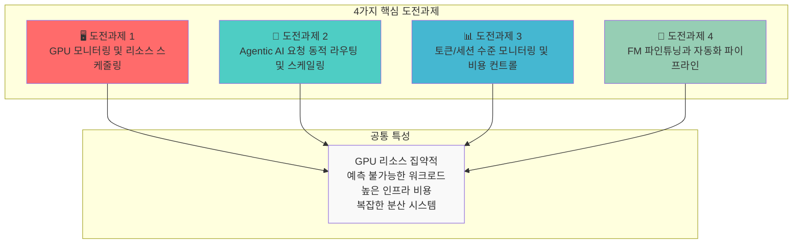
```mermaid
graph TB
    subgraph "4가지 핵심 도전과제"
        C1["🖥️ 도전과제 1<br/>GPU 모니터링 및 리소스 스케줄링"]
        C2["🔀 도전과제 2<br/>Agentic AI 요청 동적 라우팅 및 스케일링"]
        C3["📊 도전과제 3<br/>토큰/세션 수준 모니터링 및 비용 컨트롤"]
        C4["🔧 도전과제 4<br/>FM 파인튜닝과 자동화 파이프라인"]
    end

    subgraph "공통 특성"
        COMMON["GPU 리소스 집약적<br/>예측 불가능한 워크로드<br/>높은 인프라 비용<br/>복잡한 분산 시스템"]
    end

    C1 --> COMMON
    C2 --> COMMON
    C3 --> COMMON
    C4 --> COMMON

    style C1 fill:#ff6b6b
    style C2 fill:#4ecdc4
    style C3 fill:#45b7d1
    style C4 fill:#96ceb4
    style COMMON fill:#f9f9f9
```

### 도전과제 요약

| 도전과제 | 핵심 문제 | 기존 인프라의 한계 |
| --- | --- | --- |
| **GPU 모니터링 및 스케줄링** | 멀티 클러스터 GPU 가시성 부재, 세대별 워크로드 매칭 | 수동 모니터링, 정적 할당 |
| **동적 라우팅 및 스케일링** | 예측 불가능한 트래픽, 멀티 모델 서빙 복잡성 | 느린 프로비저닝, 고정 용량 |
| **비용 컨트롤** | GPU 유휴 비용, 토큰 레벨 추적 어려움 | 비용 가시성 부재, 최적화 불가 |
| **FM 파인튜닝** | 분산 학습 인프라 복잡성, 리소스 프로비저닝 지연 | 수동 클러스터 관리, 낮은 활용률 |

:::warning 기존 인프라 접근 방식의 한계
전통적인 VM 기반 인프라나 수동 관리 방식으로는 Agentic AI의 **동적이고 예측 불가능한 워크로드 패턴**에 효과적으로 대응할 수 없습니다. GPU 리소스의 높은 비용과 복잡한 분산 시스템 요구사항은 **자동화된 인프라 관리**를 필수로 만듭니다.
:::

---

## 해결의 핵심: 클라우드 인프라 자동화와 AI 플랫폼의 통합

Agentic AI 플랫폼의 도전과제를 해결하는 핵심은 **클라우드 인프라 자동화와 AI 워크로드의 유기적 통합**입니다. 이 통합이 중요한 이유는 다음과 같습니다:

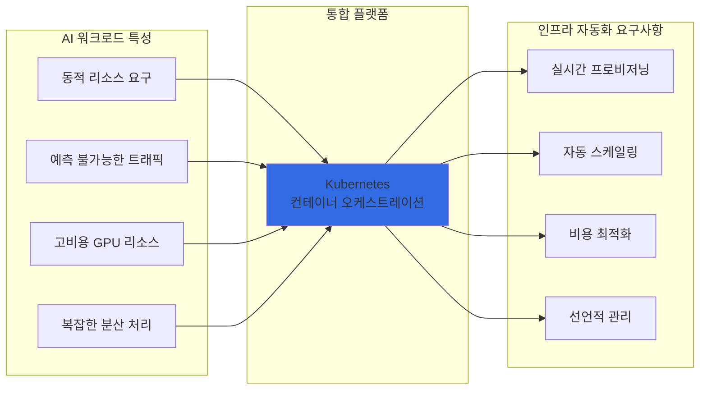
```mermaid
graph LR
    subgraph "AI 워크로드 특성"
        AI1["동적 리소스 요구"]
        AI2["예측 불가능한 트래픽"]
        AI3["고비용 GPU 리소스"]
        AI4["복잡한 분산 처리"]
    end

    subgraph "인프라 자동화 요구사항"
        INF1["실시간 프로비저닝"]
        INF2["자동 스케일링"]
        INF3["비용 최적화"]
        INF4["선언적 관리"]
    end

    subgraph "통합 플랫폼"
        PLATFORM["Kubernetes<br/>컨테이너 오케스트레이션"]
    end

    AI1 --> PLATFORM
    AI2 --> PLATFORM
    AI3 --> PLATFORM
    AI4 --> PLATFORM
    PLATFORM --> INF1
    PLATFORM --> INF2
    PLATFORM --> INF3
    PLATFORM --> INF4

    style PLATFORM fill:#326ce5
```

### 왜 Kubernetes인가?

Kubernetes는 Agentic AI 플랫폼의 모든 도전과제를 해결할 수 있는 **이상적인 기반 플랫폼**입니다:

| Kubernetes 핵심 기능 | AI 플랫폼 적용 | 해결되는 도전과제 |
| --- | --- | --- |
| **선언적 리소스 관리** | GPU 리소스를 코드로 정의하고 버전 관리 | 도전과제 1, 4 |
| **자동 스케일링 (HPA/VPA)** | 트래픽 패턴에 따른 Pod 자동 확장/축소 | 도전과제 2 |
| **네임스페이스 기반 격리** | 팀/프로젝트별 리소스 할당량 관리 | 도전과제 3 |
| **Operator 패턴** | 복잡한 분산 학습 워크플로우 자동화 | 도전과제 4 |
| **서비스 메시 통합** | 멀티 모델 라우팅 및 트래픽 관리 | 도전과제 2 |
| **메트릭 기반 오케스트레이션** | GPU 사용률 기반 스케줄링 결정 | 도전과제 1, 3 |

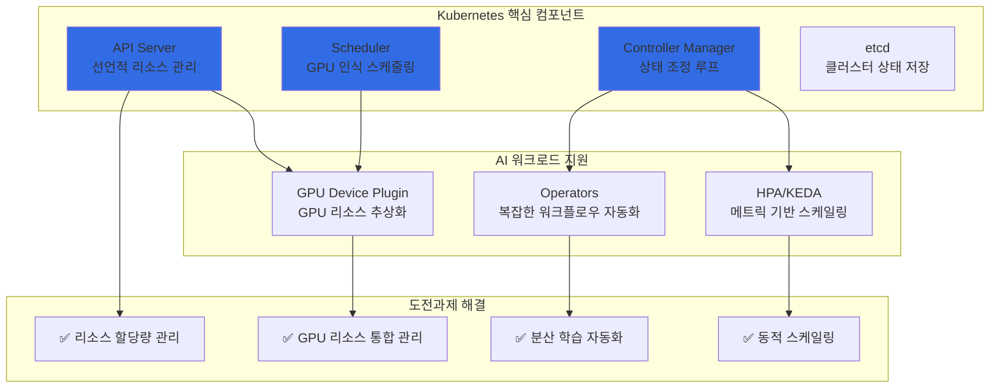
```mermaid
graph TB
    subgraph "Kubernetes 핵심 컴포넌트"
        API["API Server<br/>선언적 리소스 관리"]
        SCHED["Scheduler<br/>GPU 인식 스케줄링"]
        CTRL["Controller Manager<br/>상태 조정 루프"]
        ETCD["etcd<br/>클러스터 상태 저장"]
    end

    subgraph "AI 워크로드 지원"
        GPU["GPU Device Plugin<br/>GPU 리소스 추상화"]
        HPA["HPA/KEDA<br/>메트릭 기반 스케일링"]
        OP["Operators<br/>복잡한 워크플로우 자동화"]
    end

    subgraph "도전과제 해결"
        S1["✅ GPU 리소스 통합 관리"]
        S2["✅ 동적 스케일링"]
        S3["✅ 리소스 할당량 관리"]
        S4["✅ 분산 학습 자동화"]
    end

    API --> GPU
    SCHED --> GPU
    CTRL --> HPA
    CTRL --> OP
    GPU --> S1
    HPA --> S2
    API --> S3
    OP --> S4

    style API fill:#326ce5
    style SCHED fill:#326ce5
    style CTRL fill:#326ce5
```

:::info Kubernetes의 AI 워크로드 지원
Kubernetes는 NVIDIA GPU Operator, Kubeflow, KEDA 등 AI/ML 생태계와의 풍부한 통합을 제공합니다. 이를 통해 GPU 리소스 관리, 분산 학습, 모델 서빙을 **단일 플랫폼에서 통합 관리**할 수 있습니다.
:::

---

이제 Kubernetes가 AI 워크로드에 적합한 이유를 이해했습니다. 다음으로, **각 도전과제를 해결하는 구체적인 오픈소스 솔루션들**을 살펴보겠습니다.

## Kubernetes 생태계의 Agentic AI 솔루션 버드뷰

Kubernetes 생태계에는 Agentic AI 플랫폼의 각 도전과제를 해결하기 위한 **전문화된 오픈소스 솔루션**들이 존재합니다. 이 솔루션들은 Kubernetes 네이티브로 설계되어 **선언적 관리, 자동 스케일링, 고가용성**의 이점을 그대로 활용할 수 있습니다.

### 솔루션 매핑 개요

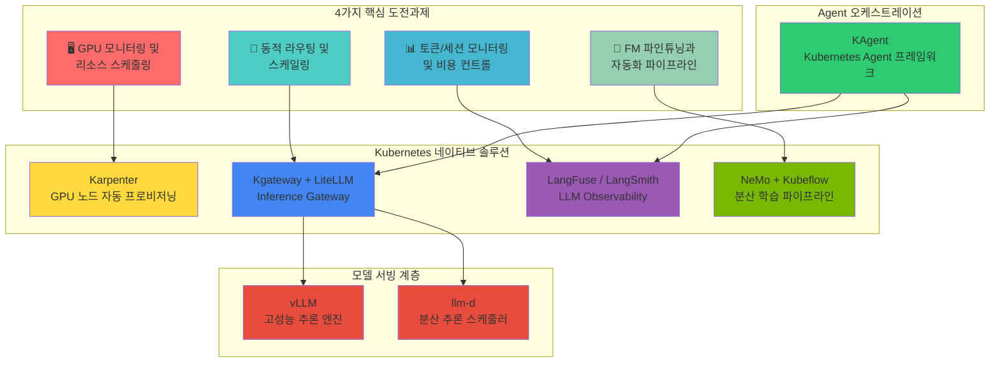
```mermaid
graph TB
    subgraph "4가지 핵심 도전과제"
        C1["🖥️ GPU 모니터링 및<br/>리소스 스케줄링"]
        C2["🔀 동적 라우팅 및<br/>스케일링"]
        C3["📊 토큰/세션 모니터링<br/>및 비용 컨트롤"]
        C4["🔧 FM 파인튜닝과<br/>자동화 파이프라인"]
    end

    subgraph "Kubernetes 네이티브 솔루션"
        S1["Karpenter<br/>GPU 노드 자동 프로비저닝"]
        S2["Kgateway + LiteLLM<br/>Inference Gateway"]
        S3["LangFuse / LangSmith<br/>LLM Observability"]
        S4["NeMo + Kubeflow<br/>분산 학습 파이프라인"]
    end

    subgraph "모델 서빙 계층"
        VLLM["vLLM<br/>고성능 추론 엔진"]
        LLMD["llm-d<br/>분산 추론 스케줄러"]
    end

    subgraph "Agent 오케스트레이션"
        KAGENT["KAgent<br/>Kubernetes Agent 프레임워크"]
    end

    C1 --> S1
    C2 --> S2
    C3 --> S3
    C4 --> S4
    
    S2 --> VLLM
    S2 --> LLMD
    KAGENT --> S2
    KAGENT --> S3

    style C1 fill:#ff6b6b
    style C2 fill:#4ecdc4
    style C3 fill:#45b7d1
    style C4 fill:#96ceb4
    style S1 fill:#ffd93d
    style S2 fill:#4286f4
    style S3 fill:#9b59b6
    style S4 fill:#76b900
    style VLLM fill:#e74c3c
    style LLMD fill:#e74c3c
    style KAGENT fill:#2ecc71
```

### 도전과제별 솔루션 상세 매핑

| 도전과제 | 핵심 솔루션 | 보조 솔루션 | 해결하는 문제 |
| --- | --- | --- | --- |
| **GPU 모니터링 및 스케줄링** | Karpenter | DCGM Exporter, NVIDIA GPU Operator | GPU 노드 자동 프로비저닝, 세대별 워크로드 매칭 |
| **동적 라우팅 및 스케일링** | Kgateway, LiteLLM | KEDA, vLLM, llm-d | 멀티 모델 라우팅, 트래픽 기반 자동 스케일링 |
| **토큰/비용 모니터링** | LangFuse, LangSmith | OpenTelemetry, Prometheus | 토큰 레벨 추적, 비용 가시성, 품질 평가 |
| **FM 파인튜닝** | NeMo, Kubeflow | MLflow, Ray | 분산 학습 오케스트레이션, 파이프라인 자동화 |

### 핵심 솔루션 소개

#### 1. 모델 서빙: vLLM + llm-d

**vLLM**은 LLM 추론을 위한 고성능 서빙 엔진으로, PagedAttention을 통해 **메모리 효율성을 극대화**합니다.

**llm-d**는 Kubernetes 환경에서 LLM 추론 요청을 **지능적으로 분산**하는 스케줄러입니다.

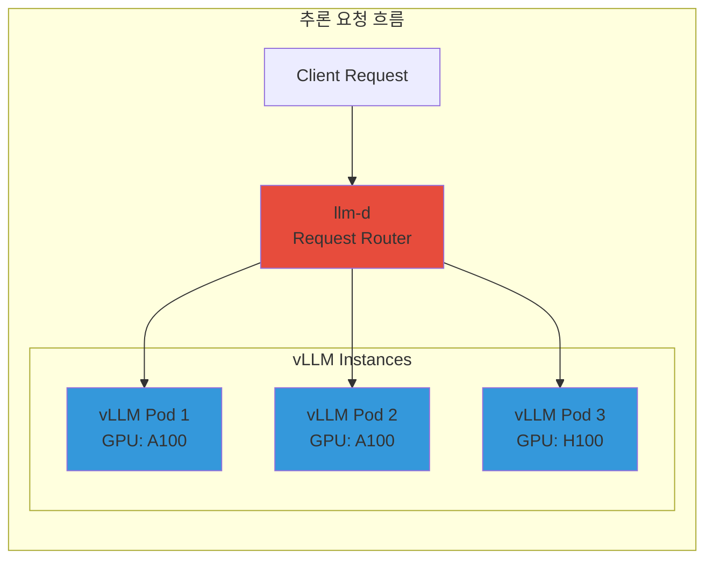
```mermaid
graph LR
    subgraph "추론 요청 흐름"
        REQ["Client Request"]
        LLMD["llm-d<br/>Request Router"]
        
        subgraph "vLLM Instances"
            V1["vLLM Pod 1<br/>GPU: A100"]
            V2["vLLM Pod 2<br/>GPU: A100"]
            V3["vLLM Pod 3<br/>GPU: H100"]
        end
    end

    REQ --> LLMD
    LLMD --> V1
    LLMD --> V2
    LLMD --> V3

    style LLMD fill:#e74c3c
    style V1 fill:#3498db
    style V2 fill:#3498db
    style V3 fill:#3498db
```

| 솔루션 | 역할 | 핵심 기능 |
| --- | --- | --- |
| **vLLM** | 추론 엔진 | PagedAttention, Continuous Batching, Speculative Decoding |
| **llm-d** | 분산 스케줄러 | 로드 밸런싱, Prefix Caching 인식 라우팅, 장애 복구 |

#### 2. Inference Gateway: Kgateway + LiteLLM

**Kgateway**는 Kubernetes Gateway API 기반의 AI 추론 게이트웨이로, **멀티 모델 라우팅과 트래픽 관리**를 제공합니다.

**LiteLLM**은 다양한 LLM 프로바이더를 **통합 API로 추상화**하여 모델 전환을 용이하게 합니다.

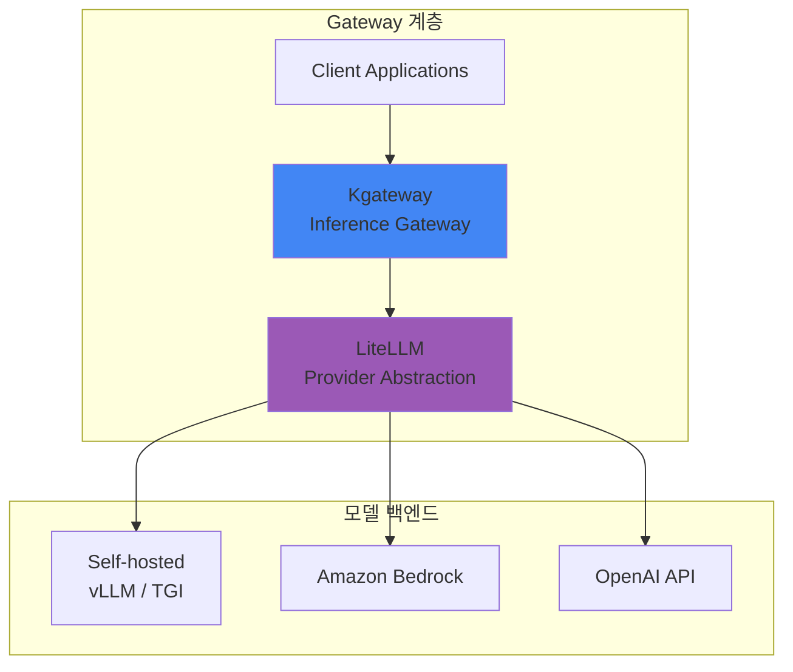
```mermaid
graph TB
    subgraph "Gateway 계층"
        CLIENT["Client Applications"]
        KGW["Kgateway<br/>Inference Gateway"]
        LITE["LiteLLM<br/>Provider Abstraction"]
    end

    subgraph "모델 백엔드"
        SELF["Self-hosted<br/>vLLM / TGI"]
        BEDROCK["Amazon Bedrock"]
        OPENAI["OpenAI API"]
    end

    CLIENT --> KGW
    KGW --> LITE
    LITE --> SELF
    LITE --> BEDROCK
    LITE --> OPENAI

    style KGW fill:#4286f4
    style LITE fill:#9b59b6
```

| 솔루션 | 역할 | 핵심 기능 |
| --- | --- | --- |
| **Kgateway** | 트래픽 관리 | 헤더 기반 라우팅, 가중치 분배, Rate Limiting, Canary 배포 |
| **LiteLLM** | API 추상화 | 100+ LLM 프로바이더 지원, 통합 API, 폴백 설정, 비용 추적 |

#### 3. LLM Observability: LangFuse + LangSmith

**LangFuse**와 **LangSmith**는 LLM 애플리케이션의 **전체 라이프사이클을 추적**하는 관측성 플랫폼입니다.

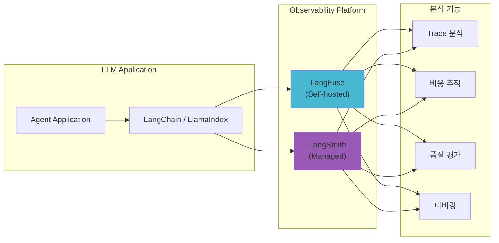
```mermaid
graph LR
    subgraph "LLM Application"
        APP["Agent Application"]
        CHAIN["LangChain / LlamaIndex"]
    end

    subgraph "Observability Platform"
        LF["LangFuse<br/>(Self-hosted)"]
        LS["LangSmith<br/>(Managed)"]
    end

    subgraph "분석 기능"
        TRACE["Trace 분석"]
        COST["비용 추적"]
        EVAL["품질 평가"]
        DEBUG["디버깅"]
    end

    APP --> CHAIN
    CHAIN --> LF
    CHAIN --> LS
    LF --> TRACE & COST & EVAL & DEBUG
    LS --> TRACE & COST & EVAL & DEBUG

    style LF fill:#45b7d1
    style LS fill:#9b59b6
```

| 솔루션 | 배포 방식 | 핵심 기능 |
| --- | --- | --- |
| **LangFuse** | Self-hosted (K8s) | 토큰 추적, 비용 분석, 프롬프트 관리, A/B 테스트 |
| **LangSmith** | Managed SaaS | 트레이싱, 평가, 데이터셋 관리, 협업 기능 |

#### 4. Agent 오케스트레이션: KAgent

**KAgent**는 Kubernetes 네이티브 AI Agent 프레임워크로, **Agent 워크플로우를 CRD로 정의**하고 관리합니다.

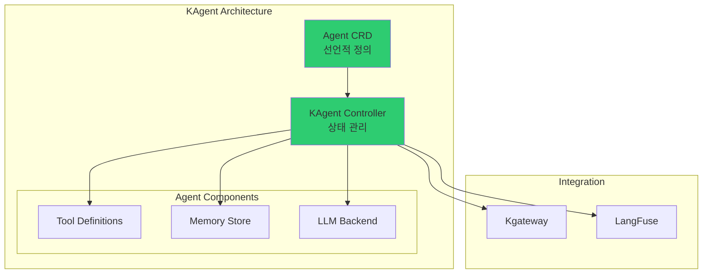
```mermaid
graph TB
    subgraph "KAgent Architecture"
        CRD["Agent CRD<br/>선언적 정의"]
        CTRL["KAgent Controller<br/>상태 관리"]
        
        subgraph "Agent Components"
            TOOL["Tool Definitions"]
            MEM["Memory Store"]
            LLM["LLM Backend"]
        end
    end

    subgraph "Integration"
        KGW["Kgateway"]
        OBS["LangFuse"]
    end

    CRD --> CTRL
    CTRL --> TOOL & MEM & LLM
    CTRL --> KGW
    CTRL --> OBS

    style CRD fill:#2ecc71
    style CTRL fill:#2ecc71
```

| 기능 | 설명 |
| --- | --- |
| **선언적 Agent 정의** | YAML로 Agent 구성, 도구, 메모리 정의 |
| **자동 스케일링** | 요청량에 따른 Agent 인스턴스 자동 확장 |
| **통합 관측성** | LangFuse/LangSmith와 자동 연동 |
| **도구 관리** | MCP(Model Context Protocol) 기반 도구 통합 |

### 솔루션 스택 통합 아키텍처

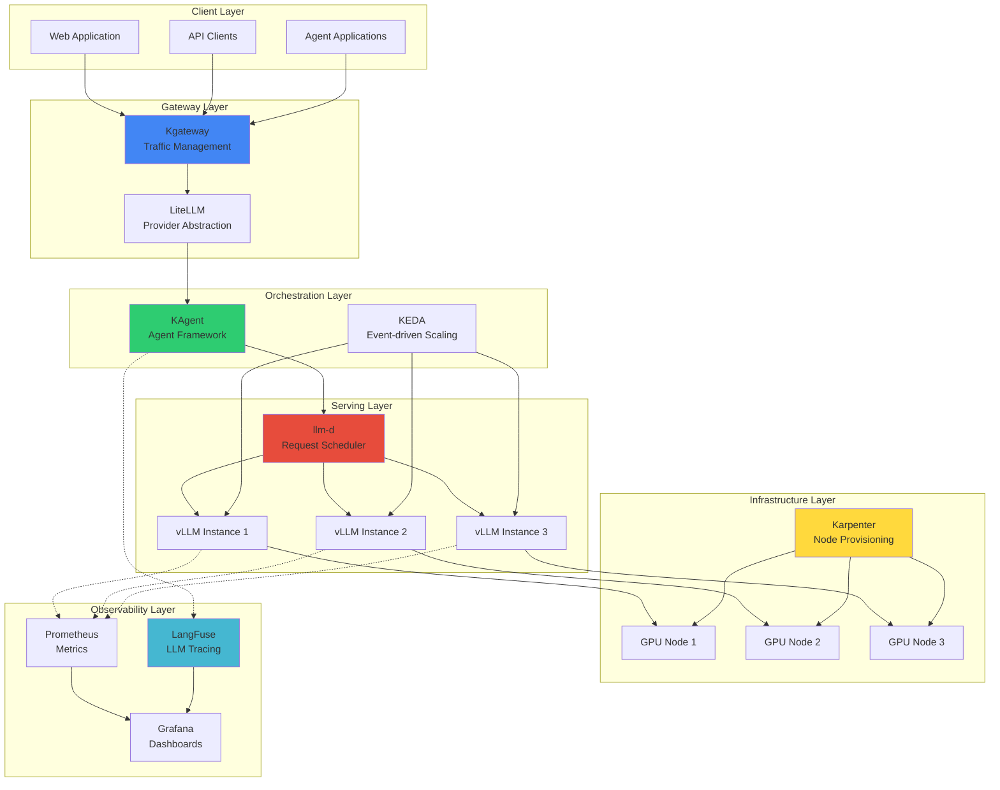
```mermaid
graph TB
    subgraph "Client Layer"
        WEB["Web Application"]
        API["API Clients"]
        AGENT["Agent Applications"]
    end

    subgraph "Gateway Layer"
        KGW["Kgateway<br/>Traffic Management"]
        LITE["LiteLLM<br/>Provider Abstraction"]
    end

    subgraph "Orchestration Layer"
        KAGENT["KAgent<br/>Agent Framework"]
        KEDA["KEDA<br/>Event-driven Scaling"]
    end

    subgraph "Serving Layer"
        LLMD["llm-d<br/>Request Scheduler"]
        VLLM1["vLLM Instance 1"]
        VLLM2["vLLM Instance 2"]
        VLLM3["vLLM Instance 3"]
    end

    subgraph "Infrastructure Layer"
        KARP["Karpenter<br/>Node Provisioning"]
        GPU1["GPU Node 1"]
        GPU2["GPU Node 2"]
        GPU3["GPU Node 3"]
    end

    subgraph "Observability Layer"
        LF["LangFuse<br/>LLM Tracing"]
        PROM["Prometheus<br/>Metrics"]
        GRAF["Grafana<br/>Dashboards"]
    end

    WEB & API & AGENT --> KGW
    KGW --> LITE
    LITE --> KAGENT
    KAGENT --> LLMD
    LLMD --> VLLM1 & VLLM2 & VLLM3
    VLLM1 --> GPU1
    VLLM2 --> GPU2
    VLLM3 --> GPU3
    KARP --> GPU1 & GPU2 & GPU3
    KEDA --> VLLM1 & VLLM2 & VLLM3
    
    KAGENT -.-> LF
    VLLM1 & VLLM2 & VLLM3 -.-> PROM
    PROM --> GRAF
    LF --> GRAF

    style KGW fill:#4286f4
    style KAGENT fill:#2ecc71
    style KARP fill:#ffd93d
    style LF fill:#45b7d1
    style LLMD fill:#e74c3c
```

---

지금까지 Kubernetes 생태계의 다양한 솔루션들을 살펴보았습니다. 이제 이 솔루션들을 **실제 프로덕션 환경에서 운영하기 위한 인프라 자동화 전략**을 알아보겠습니다.

## Amazon EKS와 Karpenter: Kubernetes의 장점 극대화

Kubernetes가 AI 플랫폼의 기반이라면, **Amazon EKS와 Karpenter의 조합**은 Kubernetes의 장점을 극대화하여 **완전 자동화된 최적의 인프라**를 구현합니다.

### EKS + Karpenter + AWS 인프라 통합 아키텍처

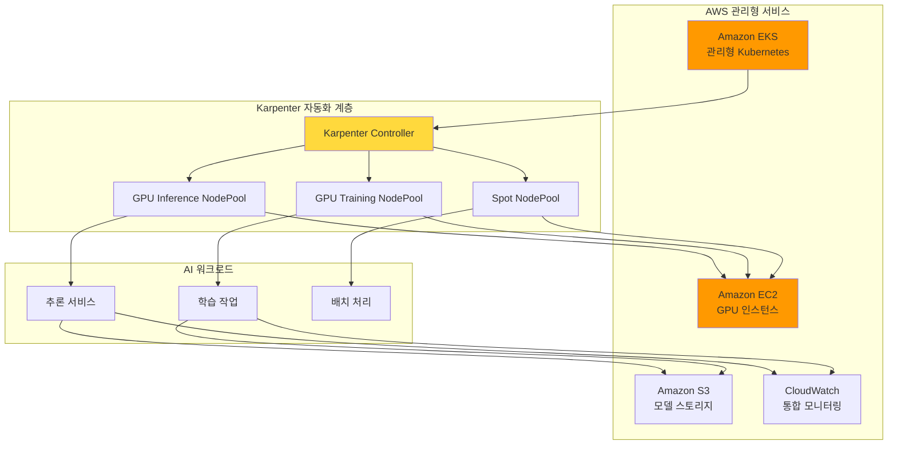
```mermaid
graph TB
    subgraph "AWS 관리형 서비스"
        EKS["Amazon EKS<br/>관리형 Kubernetes"]
        EC2["Amazon EC2<br/>GPU 인스턴스"]
        S3["Amazon S3<br/>모델 스토리지"]
        CW["CloudWatch<br/>통합 모니터링"]
    end

    subgraph "Karpenter 자동화 계층"
        KARP["Karpenter Controller"]
        NP1["GPU Inference NodePool"]
        NP2["GPU Training NodePool"]
        NP3["Spot NodePool"]
    end

    subgraph "AI 워크로드"
        INF["추론 서비스"]
        TRAIN["학습 작업"]
        BATCH["배치 처리"]
    end

    EKS --> KARP
    KARP --> NP1 & NP2 & NP3
    NP1 --> EC2
    NP2 --> EC2
    NP3 --> EC2
    NP1 --> INF
    NP2 --> TRAIN
    NP3 --> BATCH
    INF & TRAIN --> S3
    INF & TRAIN --> CW

    style EKS fill:#ff9900
    style KARP fill:#ffd93d
    style EC2 fill:#ff9900
```

### 왜 EKS + Karpenter인가?

| 계층 | 역할 | 제공 가치 |
| --- | --- | --- |
| **Amazon EKS** | 관리형 Kubernetes Control Plane | 운영 부담 제거, 고가용성, 보안 |
| **Karpenter** | 지능형 노드 프로비저닝 | Just-in-Time GPU 프로비저닝, 비용 최적화 |
| **AWS 인프라** | GPU 인스턴스, 스토리지, 네트워크 | 다양한 GPU 옵션, EFA 고속 네트워크, Spot 인스턴스 |

### Karpenter: AI 인프라 자동화의 핵심

Karpenter는 기존 Cluster Autoscaler의 한계를 극복하고, **AI 워크로드에 최적화된 노드 프로비저닝**을 제공합니다:

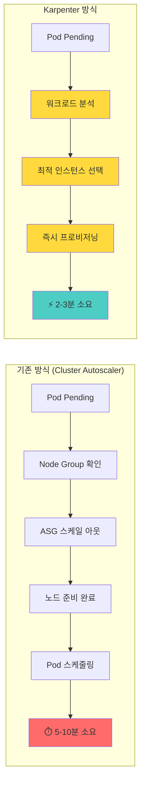
```mermaid
flowchart LR
    subgraph "기존 방식 (Cluster Autoscaler)"
        CA1[Pod Pending] --> CA2[Node Group 확인]
        CA2 --> CA3[ASG 스케일 아웃]
        CA3 --> CA4[노드 준비 완료]
        CA4 --> CA5[Pod 스케줄링]
        CA5 --> CA6["⏱️ 5-10분 소요"]
    end

    subgraph "Karpenter 방식"
        K1[Pod Pending] --> K2[워크로드 분석]
        K2 --> K3[최적 인스턴스 선택]
        K3 --> K4[즉시 프로비저닝]
        K4 --> K5["⚡ 2-3분 소요"]
    end

    style CA6 fill:#ff6b6b
    style K5 fill:#4ecdc4
    style K2 fill:#ffd93d
    style K3 fill:#ffd93d
    style K4 fill:#ffd93d
```

### Karpenter가 제공하는 핵심 가치

| 기능 | 설명 | Agentic AI 적용 |
| --- | --- | --- |
| **Just-in-Time 프로비저닝** | 워크로드 요구에 따라 즉시 노드 생성 | GPU 노드 대기 시간 최소화 |
| **Spot 인스턴스 지원** | 최대 90% 비용 절감 | 추론 워크로드 비용 최적화 |
| **Consolidation** | 유휴 노드 자동 정리 | GPU 리소스 효율성 극대화 |
| **다양한 인스턴스 타입** | 워크로드에 최적화된 인스턴스 자동 선택 | 모델 크기별 최적 GPU 매칭 |
| **Disruption Budgets** | 서비스 영향 최소화하며 노드 관리 | 안정적인 스케일 다운 |

### EKS Auto Mode: 완전 자동화의 완성

**EKS Auto Mode**는 Karpenter를 포함한 핵심 컴포넌트들을 자동으로 구성하고 관리하여, AI 인프라 자동화의 마지막 퍼즐을 완성합니다.

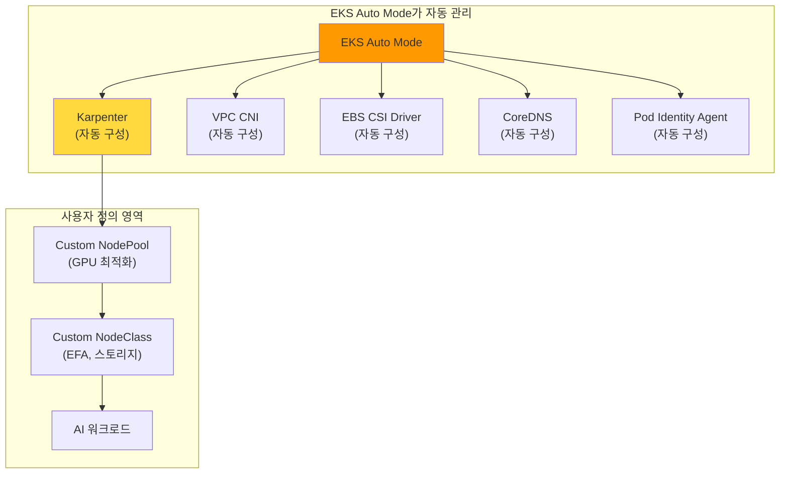
```mermaid
graph TB
    subgraph "EKS Auto Mode가 자동 관리"
        AUTO["EKS Auto Mode"]
        KARP["Karpenter<br/>(자동 구성)"]
        VPC_CNI["VPC CNI<br/>(자동 구성)"]
        CSI["EBS CSI Driver<br/>(자동 구성)"]
        COREDNS["CoreDNS<br/>(자동 구성)"]
        POD_ID["Pod Identity Agent<br/>(자동 구성)"]
    end

    subgraph "사용자 정의 영역"
        NP["Custom NodePool<br/>(GPU 최적화)"]
        NC["Custom NodeClass<br/>(EFA, 스토리지)"]
        WL["AI 워크로드"]
    end

    AUTO --> KARP
    AUTO --> VPC_CNI
    AUTO --> CSI
    AUTO --> COREDNS
    AUTO --> POD_ID
    KARP --> NP
    NP --> NC
    NC --> WL

    style AUTO fill:#ff9900
    style KARP fill:#ffd93d
```

#### EKS Auto Mode vs 수동 구성 비교

| 구성 요소 | 수동 구성 (EKS Standard) | EKS Auto Mode |
| --- | --- | --- |
| **Karpenter 설치** | Helm 차트 수동 설치, IAM 역할 구성 | ✅ 자동 설치 및 구성 |
| **NodePool 관리** | 직접 정의 필요 | 기본 제공 + 커스텀 가능 |
| **VPC CNI** | 수동 설치 및 업그레이드 | ✅ 자동 관리 |
| **EBS CSI Driver** | 수동 설치, IRSA 구성 | ✅ 자동 관리 |
| **CoreDNS** | 수동 스케일링 | ✅ 자동 스케일링 |
| **보안 패치** | 수동 적용 | ✅ 자동 적용 |
| **버전 업그레이드** | 수동 계획 및 실행 | ✅ 자동 업그레이드 |

#### EKS Auto Mode의 AI 워크로드 이점

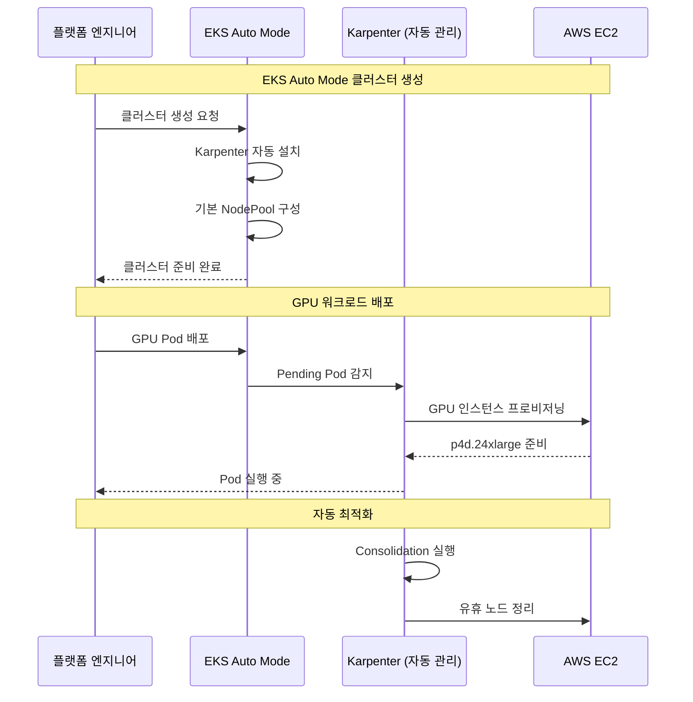
```mermaid
sequenceDiagram
    participant User as 플랫폼 엔지니어
    participant Auto as EKS Auto Mode
    participant Karp as Karpenter (자동 관리)
    participant EC2 as AWS EC2

    Note over User,EC2: EKS Auto Mode 클러스터 생성
    User->>Auto: 클러스터 생성 요청
    Auto->>Auto: Karpenter 자동 설치
    Auto->>Auto: 기본 NodePool 구성
    Auto-->>User: 클러스터 준비 완료

    Note over User,EC2: GPU 워크로드 배포
    User->>Auto: GPU Pod 배포
    Auto->>Karp: Pending Pod 감지
    Karp->>EC2: GPU 인스턴스 프로비저닝
    EC2-->>Karp: p4d.24xlarge 준비
    Karp-->>User: Pod 실행 중

    Note over User,EC2: 자동 최적화
    Karp->>Karp: Consolidation 실행
    Karp->>EC2: 유휴 노드 정리
```

#### GPU 워크로드를 위한 EKS Auto Mode 설정

EKS Auto Mode에서 GPU 워크로드를 위한 커스텀 NodePool을 추가할 수 있습니다:

```yaml
# EKS Auto Mode에서 GPU NodePool 추가
apiVersion: karpenter.sh/v1
kind: NodePool
metadata:
  name: gpu-inference-pool
spec:
  template:
    metadata:
      labels:
        node-type: gpu-inference
        eks-auto-mode: "true"
    spec:
      requirements:
        - key: karpenter.sh/capacity-type
          operator: In
          values: ["spot", "on-demand"]
        - key: node.kubernetes.io/instance-type
          operator: In
          values:
            - g5.xlarge
            - g5.2xlarge
            - g5.4xlarge
            - g5.12xlarge
            - p4d.24xlarge
        - key: karpenter.k8s.aws/instance-gpu-count
          operator: Gt
          values: ["0"]
      nodeClassRef:
        group: karpenter.k8s.aws
        kind: EC2NodeClass
        name: default  # EKS Auto Mode 기본 NodeClass 활용
  limits:
    nvidia.com/gpu: 50
  disruption:
    consolidationPolicy: WhenEmptyOrUnderutilized
    consolidateAfter: 30s
```

:::tip EKS Auto Mode 권장 사항
EKS Auto Mode는 **새로운 AI 플랫폼 구축 시 권장되는 옵션**입니다:
- Karpenter 설치 및 구성 자동화로 **초기 구축 시간 80% 단축**
- 핵심 컴포넌트 자동 업그레이드로 **운영 부담 대폭 감소**
- GPU NodePool만 커스텀 정의하면 **즉시 AI 워크로드 배포 가능**
:::

:::info EKS Auto Mode와 GPU 지원
EKS Auto Mode는 NVIDIA GPU를 포함한 가속 컴퓨팅 인스턴스를 완벽히 지원합니다. 기본 NodeClass에 GPU 드라이버가 포함된 AMI가 자동으로 선택되며, 필요시 커스텀 NodeClass로 EFA 네트워크 등 고급 설정을 추가할 수 있습니다.
:::

### Karpenter vs Cluster Autoscaler 상세 비교

:::tip Karpenter vs Cluster Autoscaler
Karpenter는 Node Group 없이 워크로드 요구사항을 직접 분석하여 최적의 인스턴스를 선택합니다. GPU 워크로드의 경우 프로비저닝 시간이 **50% 이상 단축**되고, Consolidation을 통해 **비용이 20-30% 절감**됩니다.
:::

### 도전과제별 Karpenter 해결 방안 매핑

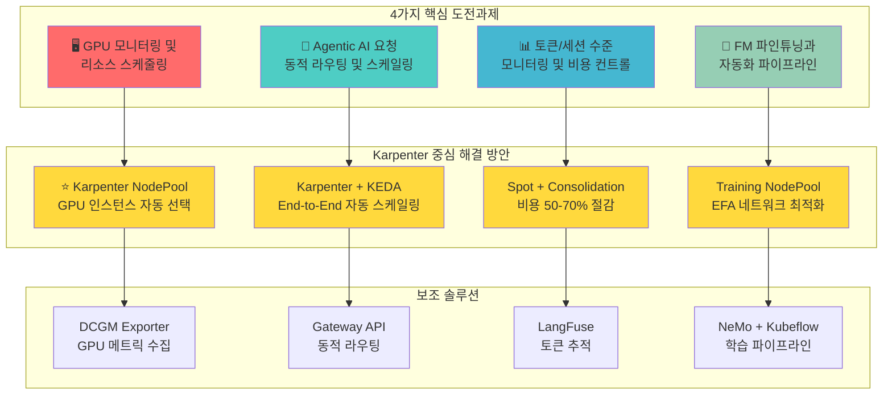
```mermaid
graph TB
    subgraph "4가지 핵심 도전과제"
        C1["🖥️ GPU 모니터링 및<br/>리소스 스케줄링"]
        C2["🔀 Agentic AI 요청<br/>동적 라우팅 및 스케일링"]
        C3["📊 토큰/세션 수준<br/>모니터링 및 비용 컨트롤"]
        C4["🔧 FM 파인튜닝과<br/>자동화 파이프라인"]
    end

    subgraph "Karpenter 중심 해결 방안"
        S1["⭐ Karpenter NodePool<br/>GPU 인스턴스 자동 선택"]
        S2["Karpenter + KEDA<br/>End-to-End 자동 스케일링"]
        S3["Spot + Consolidation<br/>비용 50-70% 절감"]
        S4["Training NodePool<br/>EFA 네트워크 최적화"]
    end

    subgraph "보조 솔루션"
        A1["DCGM Exporter<br/>GPU 메트릭 수집"]
        A2["Gateway API<br/>동적 라우팅"]
        A3["LangFuse<br/>토큰 추적"]
        A4["NeMo + Kubeflow<br/>학습 파이프라인"]
    end

    C1 --> S1
    C2 --> S2
    C3 --> S3
    C4 --> S4
    S1 --> A1
    S2 --> A2
    S3 --> A3
    S4 --> A4

    style C1 fill:#ff6b6b
    style C2 fill:#4ecdc4
    style C3 fill:#45b7d1
    style C4 fill:#96ceb4
    style S1 fill:#ffd93d
    style S2 fill:#ffd93d
    style S3 fill:#ffd93d
    style S4 fill:#ffd93d
```

:::info 대상 독자
이 문서는 Agentic AI Platform 도입을 검토하는 **기술 의사결정자**와 **솔루션 아키텍트**를 대상으로 합니다. Kubernetes 기반 AI 인프라의 필요성과 EKS + Karpenter를 활용한 구체적인 구현 방안을 제공합니다.
:::

---

## 4가지 핵심 기술적 도전과제 상세 분석

### 도전과제 1: GPU 모니터링 및 리소스 스케줄링

Agentic AI 워크로드는 GPU 리소스에 크게 의존합니다. 복수의 GPU 클러스터를 운영할 때 다음과 같은 어려움에 직면합니다.

#### 기술적 문제점 상세 분석

**1. 멀티 클러스터 GPU 가시성 부재**

대규모 AI 플랫폼에서는 여러 클러스터에 분산된 GPU 리소스를 통합적으로 파악해야 합니다:

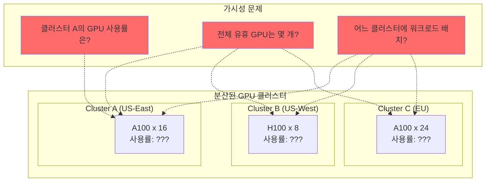
```mermaid
graph TB
    subgraph "가시성 문제"
        Q1["클러스터 A의 GPU 사용률은?"]
        Q2["전체 유휴 GPU는 몇 개?"]
        Q3["어느 클러스터에 워크로드 배치?"]
    end

    subgraph "분산된 GPU 클러스터"
        subgraph "Cluster A (US-East)"
            A1["A100 x 16<br/>사용률: ???"]
        end
        subgraph "Cluster B (US-West)"
            B1["H100 x 8<br/>사용률: ???"]
        end
        subgraph "Cluster C (EU)"
            C1["A100 x 24<br/>사용률: ???"]
        end
    end

    Q1 -.-> A1
    Q2 -.-> A1 & B1 & C1
    Q3 -.-> A1 & B1 & C1

    style Q1 fill:#ff6b6b
    style Q2 fill:#ff6b6b
    style Q3 fill:#ff6b6b
```

| 문제 영역 | 구체적 어려움 | 영향 |
| --- | --- | --- |
| 메트릭 수집 | 클러스터별 다른 모니터링 스택 | 통합 대시보드 구축 어려움 |
| 실시간 현황 | GPU 할당 상태 파악 지연 | 리소스 낭비, 스케줄링 실패 |
| 용량 계획 | 전체 GPU 인벤토리 파악 불가 | 과잉/부족 프로비저닝 |

**2. GPU 세대별 워크로드 매칭 복잡성**

A100, H100, H200 등 다양한 GPU 세대가 혼합 운영될 때, 워크로드 특성에 맞는 최적의 GPU를 선택해야 합니다:

| GPU 세대 | 메모리 | FP16 성능 | 적합 워크로드 | 시간당 비용 |
| --- | --- | --- | --- | --- |
| A10G | 24GB | 125 TFLOPS | 소규모 추론 (7B 이하) | ~$1.0 |
| A100 40GB | 40GB | 312 TFLOPS | 중규모 추론/학습 | ~$4.1 |
| A100 80GB | 80GB | 312 TFLOPS | 대규모 모델 | ~$5.1 |
| H100 80GB | 80GB | 989 TFLOPS | 초대규모 학습/추론 | ~$12.3 |
| H200 | 141GB | 989 TFLOPS | 최대 규모 모델 | ~$15.0+ |

**3. GPU 메트릭 수집의 기술적 한계**

- DCGM Exporter의 메트릭 수집 주기와 정확도
- MIG(Multi-Instance GPU) 환경에서의 메트릭 분리
- 컨테이너 레벨 GPU 사용량 추적의 어려움

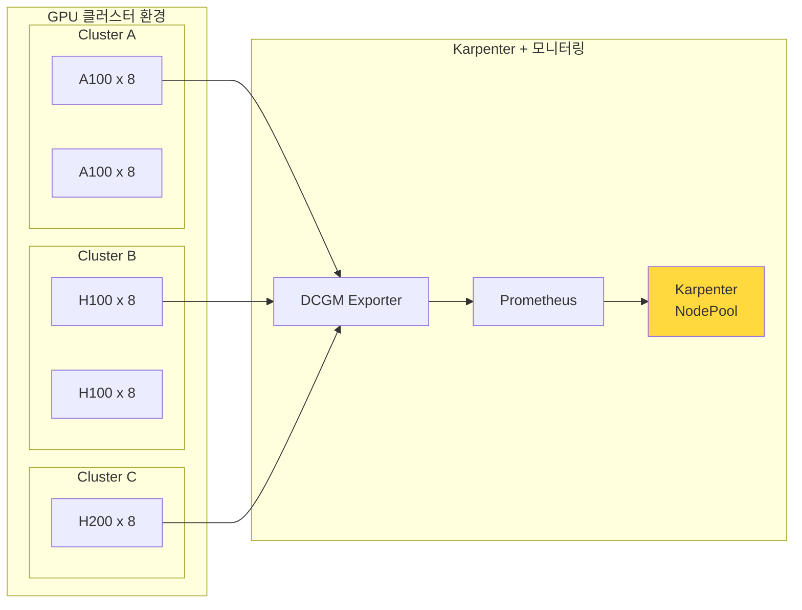
```mermaid
graph LR
    subgraph "GPU 클러스터 환경"
        subgraph "Cluster A"
            A100_1["A100 x 8"]
            A100_2["A100 x 8"]
        end
        subgraph "Cluster B"
            H100_1["H100 x 8"]
            H100_2["H100 x 8"]
        end
        subgraph "Cluster C"
            H200_1["H200 x 8"]
        end
    end

    subgraph "Karpenter + 모니터링"
        KARP["Karpenter<br/>NodePool"]
        DCGM["DCGM Exporter"]
        PROM["Prometheus"]
    end

    A100_1 --> DCGM
    H100_1 --> DCGM
    H200_1 --> DCGM
    DCGM --> PROM
    PROM --> KARP

    style KARP fill:#ffd93d
```

#### Karpenter 기반 해결 방안 (권장)

**Karpenter NodePool**을 활용하면 GPU 워크로드에 최적화된 노드를 자동으로 프로비저닝하고 관리할 수 있습니다.

<Tabs>
<TabItem value="nodepool" label="GPU NodePool 설정" default>

```yaml
apiVersion: karpenter.sh/v1
kind: NodePool
metadata:
  name: gpu-inference-pool
spec:
  template:
    metadata:
      labels:
        node-type: gpu-inference
        workload: genai
    spec:
      requirements:
        - key: kubernetes.io/arch
          operator: In
          values: ["amd64"]
        - key: karpenter.sh/capacity-type
          operator: In
          values: ["on-demand", "spot"]
        - key: node.kubernetes.io/instance-type
          operator: In
          values:
            - p4d.24xlarge    # 8x A100 40GB
            - p5.48xlarge     # 8x H100 80GB
            - g5.48xlarge     # 8x A10G 24GB
        - key: karpenter.k8s.aws/instance-gpu-count
          operator: Gt
          values: ["0"]
      nodeClassRef:
        group: karpenter.k8s.aws
        kind: EC2NodeClass
        name: gpu-nodeclass
      taints:
        - key: nvidia.com/gpu
          value: "true"
          effect: NoSchedule
  limits:
    nvidia.com/gpu: 100
  disruption:
    consolidationPolicy: WhenEmptyOrUnderutilized
    consolidateAfter: 30s
  weight: 100
```

</TabItem>
<TabItem value="nodeclass" label="EC2NodeClass 설정">

```yaml
apiVersion: karpenter.k8s.aws/v1
kind: EC2NodeClass
metadata:
  name: gpu-nodeclass
spec:
  role: KarpenterNodeRole-${CLUSTER_NAME}
  amiSelectorTerms:
    - alias: al2023@latest
  subnetSelectorTerms:
    - tags:
        karpenter.sh/discovery: ${CLUSTER_NAME}
  securityGroupSelectorTerms:
    - tags:
        karpenter.sh/discovery: ${CLUSTER_NAME}
  blockDeviceMappings:
    - deviceName: /dev/xvda
      ebs:
        volumeSize: 500Gi
        volumeType: gp3
        iops: 10000
        throughput: 500
        encrypted: true
  instanceStorePolicy: RAID0
  userData: |
    #!/bin/bash
    nvidia-smi -pm 1
    modprobe efa
```

</TabItem>
</Tabs>

#### Karpenter의 GPU 워크로드 최적화 기능

| 기능 | 설명 | 효과 |
| --- | --- | --- |
| 인스턴스 타입 자동 선택 | 워크로드 요구사항에 맞는 GPU 인스턴스 자동 선택 | 리소스 낭비 방지 |
| Spot 인스턴스 폴백 | Spot 불가 시 On-Demand로 자동 전환 | 가용성 보장 |
| Consolidation | 유휴 GPU 노드 자동 정리 | 비용 30% 절감 |
| 빠른 프로비저닝 | Node Group 없이 직접 EC2 API 호출 | 프로비저닝 시간 50% 단축 |

#### 보조 솔루션: NVIDIA GPU Operator

Karpenter와 함께 NVIDIA GPU Operator를 사용하여 GPU 드라이버 및 모니터링 스택을 자동화합니다.

```yaml
apiVersion: nvidia.com/v1
kind: ClusterPolicy
metadata:
  name: cluster-policy
spec:
  operator:
    defaultRuntime: containerd
  driver:
    enabled: true
    version: "535.104.05"
  toolkit:
    enabled: true
  devicePlugin:
    enabled: true
  dcgmExporter:
    enabled: true
  migManager:
    enabled: true
```

### 도전과제 2: Agentic AI 요청 동적 라우팅 및 스케일링

Agentic AI 시스템은 다양한 FM(Foundation Model)을 동시에 서빙하며, 트래픽 패턴에 따라 동적으로 대응해야 합니다.

#### 기술적 문제점 상세 분석

**1. 멀티 모델 서빙의 복잡성**

Agentic AI 시스템은 단일 모델이 아닌 여러 모델을 조합하여 사용합니다:

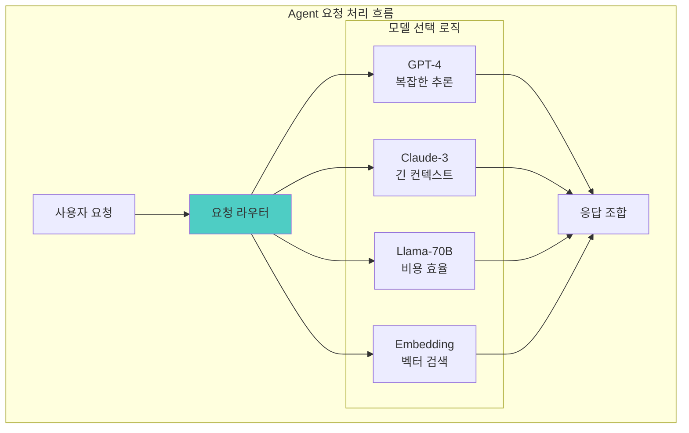
```mermaid
graph TB
    subgraph "Agent 요청 처리 흐름"
        REQ["사용자 요청"]
        ROUTER["요청 라우터"]
        
        subgraph "모델 선택 로직"
            M1["GPT-4<br/>복잡한 추론"]
            M2["Claude-3<br/>긴 컨텍스트"]
            M3["Llama-70B<br/>비용 효율"]
            M4["Embedding<br/>벡터 검색"]
        end
        
        RESP["응답 조합"]
    end

    REQ --> ROUTER
    ROUTER --> M1
    ROUTER --> M2
    ROUTER --> M3
    ROUTER --> M4
    M1 & M2 & M3 & M4 --> RESP

    style ROUTER fill:#4ecdc4
```

| 라우팅 기준 | 설명 | 구현 복잡도 |
| --- | --- | --- |
| 요청 유형 | 코드 생성, 대화, 요약 등 | 중간 |
| 컨텍스트 길이 | 토큰 수에 따른 모델 선택 | 낮음 |
| 비용 제약 | 예산 내 최적 모델 선택 | 높음 |
| 지연 시간 요구 | SLA 기반 모델 선택 | 높음 |
| 모델 가용성 | 장애 시 폴백 모델 선택 | 중간 |

**2. 예측 불가능한 트래픽 패턴**

Agentic AI 워크로드는 기존 웹 서비스와 다른 트래픽 특성을 보입니다:

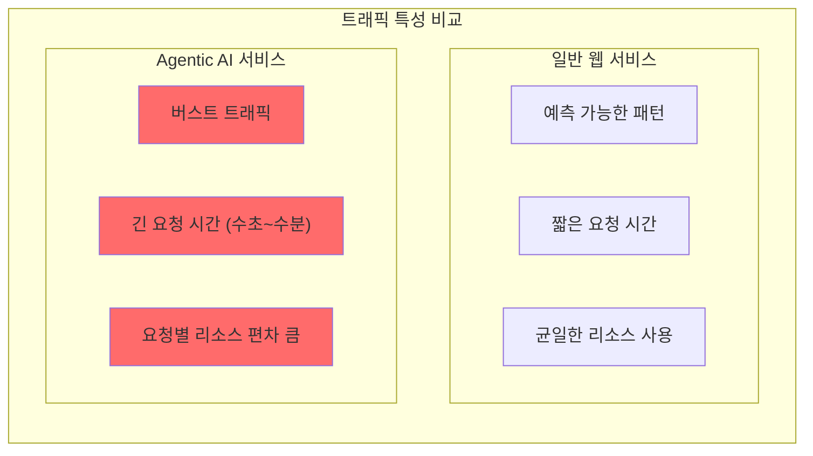
```mermaid
graph LR
    subgraph "트래픽 특성 비교"
        subgraph "일반 웹 서비스"
            W1["예측 가능한 패턴"]
            W2["짧은 요청 시간"]
            W3["균일한 리소스 사용"]
        end
        
        subgraph "Agentic AI 서비스"
            A1["버스트 트래픽"]
            A2["긴 요청 시간 (수초~수분)"]
            A3["요청별 리소스 편차 큼"]
        end
    end

    style A1 fill:#ff6b6b
    style A2 fill:#ff6b6b
    style A3 fill:#ff6b6b
```

**3. GPU 노드 프로비저닝 지연**

트래픽 급증 시 GPU 노드 확보까지의 시간이 서비스 품질에 직접적인 영향을 미칩니다:

| 단계 | 기존 방식 (Cluster Autoscaler) | Karpenter |
| --- | --- | --- |
| Pending Pod 감지 | 30-60초 | 즉시 |
| 스케일링 결정 | Node Group 기반 | 워크로드 직접 분석 |
| 인스턴스 선택 | 고정된 타입 | 최적 타입 자동 선택 |
| 프로비저닝 | ASG 경유 (2-5분) | 직접 EC2 API (1-3분) |
| **총 소요 시간** | **5-10분** | **2-4분** |

**4. 스케일 다운 시 서비스 영향**

GPU 노드 축소 시 진행 중인 요청 처리가 중요합니다:

- LLM 추론은 수초~수분 소요
- 갑작스러운 노드 종료 시 요청 실패
- Graceful shutdown 구현 필요

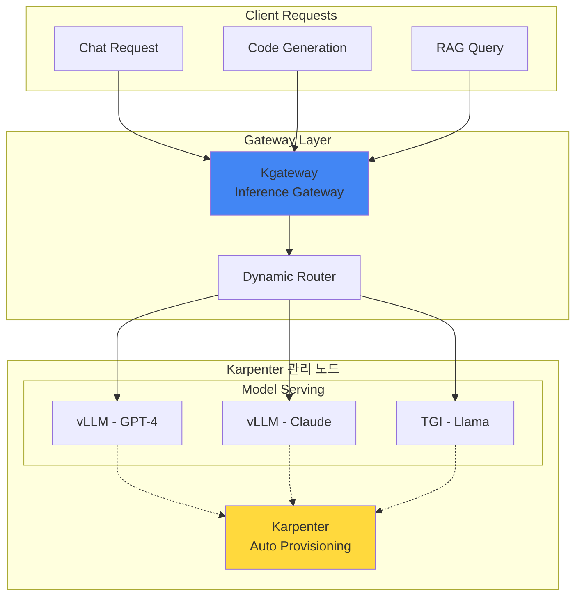
```mermaid
graph TB
    subgraph "Client Requests"
        REQ1["Chat Request"]
        REQ2["Code Generation"]
        REQ3["RAG Query"]
    end

    subgraph "Gateway Layer"
        GW["Kgateway<br/>Inference Gateway"]
        ROUTE["Dynamic Router"]
    end

    subgraph "Karpenter 관리 노드"
        subgraph "Model Serving"
            M1["vLLM - GPT-4"]
            M2["vLLM - Claude"]
            M3["TGI - Llama"]
        end
        KARP["Karpenter<br/>Auto Provisioning"]
    end

    REQ1 --> GW
    REQ2 --> GW
    REQ3 --> GW
    GW --> ROUTE
    ROUTE --> M1
    ROUTE --> M2
    ROUTE --> M3
    M1 & M2 & M3 -.-> KARP

    style KARP fill:#ffd93d
    style GW fill:#4286f4
```

#### Karpenter + KEDA 연동 해결 방안 (권장)

Karpenter와 KEDA를 연동하면 **워크로드 스케일링과 노드 프로비저닝이 자동으로 연계**됩니다.

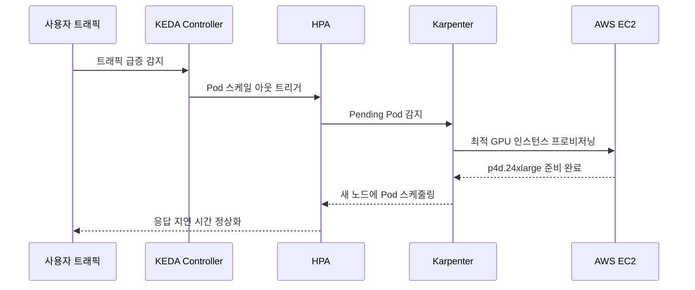
```mermaid
sequenceDiagram
    participant User as 사용자 트래픽
    participant KEDA as KEDA Controller
    participant HPA as HPA
    participant Karpenter as Karpenter
    participant AWS as AWS EC2

    User->>KEDA: 트래픽 급증 감지
    KEDA->>HPA: Pod 스케일 아웃 트리거
    HPA->>Karpenter: Pending Pod 감지
    Karpenter->>AWS: 최적 GPU 인스턴스 프로비저닝
    AWS-->>Karpenter: p4d.24xlarge 준비 완료
    Karpenter-->>HPA: 새 노드에 Pod 스케줄링
    HPA-->>User: 응답 지연 시간 정상화
```

<Tabs>
<TabItem value="keda" label="KEDA ScaledObject" default>

```yaml
apiVersion: keda.sh/v1alpha1
kind: ScaledObject
metadata:
  name: vllm-gpu-scaler
  namespace: ai-inference
spec:
  scaleTargetRef:
    name: vllm-deployment
  minReplicaCount: 2
  maxReplicaCount: 20
  triggers:
    - type: prometheus
      metadata:
        serverAddress: http://prometheus.observability:9090
        metricName: vllm_pending_requests
        threshold: "50"
        query: |
          sum(vllm_pending_requests{namespace="ai-inference"})
    - type: prometheus
      metadata:
        serverAddress: http://prometheus.observability:9090
        metricName: gpu_utilization
        threshold: "70"
        query: |
          avg(DCGM_FI_DEV_GPU_UTIL{namespace="ai-inference"})
  advanced:
    horizontalPodAutoscalerConfig:
      behavior:
        scaleUp:
          stabilizationWindowSeconds: 0
          policies:
            - type: Percent
              value: 100
              periodSeconds: 15
        scaleDown:
          stabilizationWindowSeconds: 300
```

</TabItem>
<TabItem value="httproute" label="Gateway API HTTPRoute">

```yaml
apiVersion: gateway.networking.k8s.io/v1
kind: HTTPRoute
metadata:
  name: ai-model-routing
  namespace: ai-inference
spec:
  parentRefs:
    - name: ai-gateway
      namespace: ai-gateway
  rules:
    - matches:
        - path:
            type: PathPrefix
            value: /v1/chat/completions
          headers:
            - name: x-model-id
              value: "gpt-4"
      backendRefs:
        - name: vllm-gpt4
          port: 8000
          weight: 80
        - name: vllm-gpt4-canary
          port: 8000
          weight: 20
    - matches:
        - path:
            type: PathPrefix
            value: /v1/chat/completions
          headers:
            - name: x-model-id
              value: "claude-3"
      backendRefs:
        - name: vllm-claude
          port: 8000
```

</TabItem>
</Tabs>

#### Karpenter Disruption 정책으로 안정성 확보

트래픽 급증 시에도 서비스 안정성을 보장하기 위한 Karpenter 설정입니다.

```yaml
apiVersion: karpenter.sh/v1
kind: NodePool
metadata:
  name: gpu-inference-stable
spec:
  disruption:
    consolidationPolicy: WhenEmptyOrUnderutilized
    consolidateAfter: 30s
    budgets:
      # 동시에 중단 가능한 노드 수 제한
      - nodes: "20%"
      # 업무 시간에는 중단 방지
      - nodes: "0"
        schedule: "0 9 * * 1-5"
        duration: 10h
```

:::warning 스케일링 주의사항
GPU 노드 프로비저닝은 일반 CPU 노드보다 시간이 오래 걸립니다. Karpenter의 `consolidationPolicy`를 적절히 설정하여 불필요한 스케일 다운을 방지하세요.
:::

### 도전과제 3: 토큰/세션 수준 모니터링 및 비용 컨트롤

LLM 기반 시스템에서는 토큰 단위의 세밀한 모니터링과 비용 관리가 필수적입니다. 특히 GPU 인프라 비용이 전체 운영 비용의 70-80%를 차지하므로, **인프라 레벨의 비용 최적화**가 핵심입니다.

#### 기술적 문제점 상세 분석

**1. 토큰 레벨 비용 추적의 복잡성**

LLM 서비스의 비용 구조는 다층적입니다:

```
총 비용 = GPU 인프라 비용 + API 호출 비용 + 스토리지 비용 + 네트워크 비용
```

| 비용 요소 | 측정 난이도 | 비중 | 문제점 |
| --- | --- | --- | --- |
| GPU 인프라 | 중간 | 70-80% | 유휴 시간 비용 발생, 인스턴스 타입별 단가 차이 |
| 토큰 사용량 | 높음 | 10-15% | 입력/출력 토큰 비율 예측 어려움 |
| 스토리지 | 낮음 | 5-10% | 모델 아티팩트 크기 증가 |
| 네트워크 | 낮음 | 3-5% | Cross-AZ 트래픽 비용 |

**2. GPU 유휴 비용 문제**

```mermaid
graph LR
    subgraph "일반적인 GPU 사용 패턴"
        direction TB
        T1["09:00-12:00<br/>사용률 80%"]
        T2["12:00-14:00<br/>사용률 30%"]
        T3["14:00-18:00<br/>사용률 70%"]
        T4["18:00-09:00<br/>사용률 10%"]
    end

    subgraph "비용 낭비 영역"
        W1["점심 시간<br/>유휴 GPU 비용"]
        W2["야간/주말<br/>유휴 GPU 비용"]
    end

    T2 --> W1
    T4 --> W2

    style W1 fill:#ff6b6b
    style W2 fill:#ff6b6b
```

**3. 멀티 테넌트 비용 분리의 어려움**

- 팀/프로젝트별 GPU 사용량 정확한 측정 필요
- 공유 GPU 노드에서의 비용 할당 로직 복잡
- 실시간 할당량(Quota) 관리 및 초과 방지

**4. 예측 불가능한 비용 급증**

- 트래픽 스파이크 시 자동 스케일링으로 인한 비용 급증
- Spot 인스턴스 중단 시 On-Demand 폴백으로 비용 증가
- 모델 업데이트 시 일시적 리소스 중복 사용

```mermaid
graph TB
    subgraph "AI Application"
        APP["Agent Application"]
        SDK["LangFuse SDK"]
    end

    subgraph "Observability Stack"
        LF["LangFuse"]
        OTEL["OpenTelemetry<br/>Collector"]
    end

    subgraph "Metrics & Cost"
        PROM["Prometheus"]
        GRAF["Grafana"]
        COST["Cost Dashboard"]
    end

    subgraph "Karpenter 비용 최적화"
        KARP["Karpenter"]
        SPOT["Spot 인스턴스"]
        CONSOL["Consolidation"]
        BUDGET["Budget 정책"]
    end

    APP --> SDK
    SDK --> LF
    LF --> OTEL
    OTEL --> PROM
    PROM --> GRAF
    PROM --> COST
    KARP --> SPOT
    KARP --> CONSOL
    KARP --> BUDGET
    SPOT --> COST
    CONSOL --> COST

    style LF fill:#45b7d1
    style KARP fill:#ffd93d
```

#### Karpenter 기반 비용 최적화 전략 (권장)

Karpenter는 GPU 인프라 비용 최적화의 **핵심 레버**입니다. 다음 4가지 전략을 조합하여 최대 효과를 얻을 수 있습니다.

**전략 1: Spot 인스턴스 우선 활용**

Karpenter의 Spot 인스턴스 지원을 활용하면 GPU 비용을 **최대 90%까지 절감**할 수 있습니다.

```yaml
apiVersion: karpenter.sh/v1
kind: NodePool
metadata:
  name: gpu-spot-inference
spec:
  template:
    metadata:
      labels:
        cost-tier: spot
        workload: inference
    spec:
      requirements:
        - key: karpenter.sh/capacity-type
          operator: In
          values: ["spot"]
        - key: node.kubernetes.io/instance-type
          operator: In
          values:
            - g5.12xlarge
            - g5.24xlarge
            - g5.48xlarge
            - p4d.24xlarge
      nodeClassRef:
        group: karpenter.k8s.aws
        kind: EC2NodeClass
        name: gpu-spot-nodeclass
      taints:
        - key: nvidia.com/gpu
          value: "true"
          effect: NoSchedule
        - key: karpenter.sh/capacity-type
          value: "spot"
          effect: NoSchedule
  limits:
    nvidia.com/gpu: 32
  disruption:
    consolidationPolicy: WhenEmpty
    consolidateAfter: 30s
  weight: 50  # On-Demand보다 우선 선택
```

**전략 2: 시간대별 스케줄 기반 비용 관리**

업무 시간과 비업무 시간에 따른 차별화된 리소스 정책을 적용합니다.

```yaml
apiVersion: karpenter.sh/v1
kind: NodePool
metadata:
  name: gpu-scheduled-pool
spec:
  template:
    spec:
      requirements:
        - key: karpenter.sh/capacity-type
          operator: In
          values: ["on-demand", "spot"]
        - key: node.kubernetes.io/instance-type
          operator: In
          values:
            - g5.12xlarge
            - g5.24xlarge
      nodeClassRef:
        group: karpenter.k8s.aws
        kind: EC2NodeClass
        name: gpu-nodeclass
  limits:
    nvidia.com/gpu: 16
  disruption:
    consolidationPolicy: WhenEmptyOrUnderutilized
    consolidateAfter: 30s
    budgets:
      # 업무 시간: 안정성 우선 (노드 중단 최소화)
      - nodes: "10%"
        schedule: "0 9 * * 1-5"
        duration: 9h
      # 비업무 시간: 비용 우선 (적극적 통합)
      - nodes: "50%"
        schedule: "0 18 * * 1-5"
        duration: 15h
      # 주말: 최소 리소스 유지
      - nodes: "80%"
        schedule: "0 0 * * 0,6"
        duration: 24h
```

**전략 3: Consolidation을 통한 유휴 리소스 제거**

```yaml
apiVersion: karpenter.sh/v1
kind: NodePool
metadata:
  name: gpu-consolidation-pool
spec:
  disruption:
    # 노드가 비어있거나 활용도가 낮을 때 통합
    consolidationPolicy: WhenEmptyOrUnderutilized
    # 빠른 통합으로 비용 절감 (30초 대기 후 통합)
    consolidateAfter: 30s
```

**전략 4: 워크로드별 인스턴스 최적화**

```yaml
# 소규모 모델용 (7B 이하) - 비용 효율적
apiVersion: karpenter.sh/v1
kind: NodePool
metadata:
  name: gpu-small-models
spec:
  template:
    spec:
      requirements:
        - key: node.kubernetes.io/instance-type
          operator: In
          values:
            - g5.xlarge      # 1x A10G - $1.01/hr
            - g5.2xlarge     # 1x A10G - $1.21/hr
  weight: 100  # 최우선 선택

---
# 대규모 모델용 (70B+) - 성능 우선
apiVersion: karpenter.sh/v1
kind: NodePool
metadata:
  name: gpu-large-models
spec:
  template:
    spec:
      requirements:
        - key: node.kubernetes.io/instance-type
          operator: In
          values:
            - p4d.24xlarge   # 8x A100 - $32.77/hr
            - p5.48xlarge    # 8x H100 - $98.32/hr
  weight: 10   # 필요시에만 선택
```

#### 비용 최적화 전략 비교

| 전략 | 구현 방법 | 예상 절감률 | 적용 워크로드 | 위험도 |
| --- | --- | --- | --- | --- |
| Spot 인스턴스 | Karpenter NodePool | 60-90% | 추론, 배치 처리 | 중간 (중단 가능) |
| Consolidation | Karpenter disruption | 20-30% | 모든 워크로드 | 낮음 |
| Right-sizing | Karpenter 인스턴스 자동 선택 | 15-25% | 모든 워크로드 | 낮음 |
| 스케줄 기반 | Karpenter budgets | 30-40% | 비업무 시간 | 낮음 |
| 복합 적용 | 위 전략 조합 | 50-70% | 전체 | 중간 |

#### 보조 솔루션: LangFuse 기반 토큰 추적

인프라 비용과 함께 토큰 레벨 비용도 추적해야 완전한 비용 가시성을 확보할 수 있습니다.

```yaml
apiVersion: apps/v1
kind: Deployment
metadata:
  name: langfuse
  namespace: observability
spec:
  replicas: 2
  selector:
    matchLabels:
      app: langfuse
  template:
    metadata:
      labels:
        app: langfuse
    spec:
      containers:
        - name: langfuse
          image: langfuse/langfuse:latest
          ports:
            - containerPort: 3000
          env:
            - name: DATABASE_URL
              valueFrom:
                secretKeyRef:
                  name: langfuse-secrets
                  key: database-url
            - name: NEXTAUTH_SECRET
              valueFrom:
                secretKeyRef:
                  name: langfuse-secrets
                  key: nextauth-secret
          resources:
            requests:
              memory: "512Mi"
              cpu: "250m"
            limits:
              memory: "1Gi"
              cpu: "500m"
```

#### 비용 모니터링 대시보드 구성

```yaml
# Prometheus 비용 관련 메트릭 수집 규칙
apiVersion: monitoring.coreos.com/v1
kind: PrometheusRule
metadata:
  name: gpu-cost-rules
  namespace: monitoring
spec:
  groups:
    - name: gpu-cost
      rules:
        - record: gpu:hourly_cost:sum
          expr: |
            sum(
              karpenter_nodes_total_pod_requests{resource_type="nvidia.com/gpu"} 
              * on(instance_type) group_left() 
              aws_ec2_instance_hourly_cost
            )
        - alert: HighGPUCostAlert
          expr: gpu:hourly_cost:sum > 100
          for: 1h
          labels:
            severity: warning
          annotations:
            summary: "시간당 GPU 비용이 $100를 초과했습니다"
```

:::tip 비용 최적화 체크리스트
1. **Spot 인스턴스 비율**: 추론 워크로드의 70% 이상을 Spot으로 운영
2. **Consolidation 활성화**: 30초 이내 유휴 노드 정리
3. **스케줄 기반 정책**: 비업무 시간 리소스 50% 이상 축소
4. **Right-sizing**: 모델 크기에 맞는 인스턴스 타입 자동 선택
:::

:::warning 비용 최적화 주의사항
- Spot 인스턴스 중단 시 서비스 영향 최소화를 위한 graceful shutdown 구현 필수
- 과도한 Consolidation은 스케일 아웃 지연을 유발할 수 있음
- 비용 절감과 SLA 준수 사이의 균형점 설정 필요
:::

### 도전과제 4: FM 파인튜닝과 자동화 파이프라인

Foundation Model을 특정 도메인에 맞게 파인튜닝하고 지속적으로 개선하는 것은 복잡한 과정입니다. 특히 **대규모 분산 학습 환경에서의 GPU 리소스 관리**가 핵심 과제입니다.

#### 기술적 문제점 상세 분석

**1. 분산 학습 환경의 복잡성**

대규모 LLM 파인튜닝은 단일 GPU로는 불가능하며, 멀티 노드 분산 학습이 필수입니다:

```mermaid
graph TB
    subgraph "분산 학습 토폴로지"
        direction LR
        subgraph "Node 1"
            N1G1["GPU 0-3"]
            N1G2["GPU 4-7"]
        end
        subgraph "Node 2"
            N2G1["GPU 0-3"]
            N2G2["GPU 4-7"]
        end
        subgraph "Node 3"
            N3G1["GPU 0-3"]
            N3G2["GPU 4-7"]
        end
        subgraph "Node 4"
            N4G1["GPU 0-3"]
            N4G2["GPU 4-7"]
        end
    end

    subgraph "통신 패턴"
        NCCL["NCCL All-Reduce"]
        EFA["EFA 네트워크"]
    end

    N1G1 <--> NCCL
    N2G1 <--> NCCL
    N3G1 <--> NCCL
    N4G1 <--> NCCL
    NCCL <--> EFA

    style EFA fill:#ff9900
```

| 병렬화 전략 | 설명 | 적용 시나리오 | 복잡도 |
| --- | --- | --- | --- |
| Data Parallelism | 데이터를 분할하여 각 GPU에서 동일 모델 학습 | 작은 모델, 대용량 데이터 | 낮음 |
| Tensor Parallelism | 모델의 텐서를 GPU 간 분할 | 단일 레이어가 GPU 메모리 초과 시 | 높음 |
| Pipeline Parallelism | 모델 레이어를 GPU 간 분할 | 매우 깊은 모델 | 중간 |
| FSDP | 모델 파라미터, 그래디언트, 옵티마이저 상태 분할 | 대규모 모델 효율적 학습 | 중간 |

**2. GPU 리소스 프로비저닝 지연**

학습 작업은 일반적으로 **배치 형태**로 실행되며, 리소스 확보 시간이 전체 파이프라인 효율성에 직접적인 영향을 미칩니다:

```mermaid
sequenceDiagram
    participant User as 데이터 사이언티스트
    participant Pipeline as ML Pipeline
    participant Scheduler as K8s Scheduler
    participant Karpenter as Karpenter
    participant AWS as AWS EC2

    User->>Pipeline: 학습 Job 제출
    Pipeline->>Scheduler: Pod 생성 요청 (32 GPU)
    
    Note over Scheduler: 기존 방식: Node Group 대기
    Scheduler->>Karpenter: Pending Pod 감지
    
    Note over Karpenter: 워크로드 분석
    Karpenter->>Karpenter: 최적 인스턴스 계산<br/>(4x p4d.24xlarge)
    
    Karpenter->>AWS: 병렬 인스턴스 프로비저닝
    AWS-->>Karpenter: 노드 준비 완료 (2-3분)
    
    Karpenter-->>Scheduler: 노드 등록
    Scheduler-->>Pipeline: Pod 스케줄링 완료
    Pipeline-->>User: 학습 시작
```

**3. 학습 중 장애 복구의 어려움**

- 체크포인트 저장/복구 전략 필요
- 노드 장애 시 전체 학습 재시작 방지
- Spot 인스턴스 사용 시 중단 처리

**4. 리소스 활용 효율성**

- 학습 완료 후 GPU 노드 유휴 상태 지속
- 하이퍼파라미터 튜닝 시 리소스 낭비
- 실험과 프로덕션 학습 간 리소스 경합

```mermaid
graph LR
    subgraph "Data Pipeline"
        DATA["Training Data"]
        PREP["Data Preprocessing"]
    end

    subgraph "Karpenter 관리 학습 클러스터"
        KARP["Karpenter<br/>Training NodePool"]
        NEMO["NeMo Framework"]
        DIST["Distributed Training"]
    end

    subgraph "Model Registry"
        CKPT["Checkpoint Storage"]
        MLFLOW["MLflow Registry"]
    end

    subgraph "Deployment"
        SERVE["Model Serving"]
        CANARY["Canary Deployment"]
    end

    DATA --> PREP
    PREP --> NEMO
    KARP --> NEMO
    NEMO --> DIST
    DIST --> CKPT
    CKPT --> MLFLOW
    MLFLOW --> SERVE
    SERVE --> CANARY

    style KARP fill:#ffd93d
    style NEMO fill:#76b900
```

#### Karpenter 기반 학습 인프라 구성 (권장)

**전략 1: 학습 전용 NodePool 분리**

학습 워크로드는 추론과 다른 특성을 가지므로 별도의 NodePool로 관리합니다.

```yaml
apiVersion: karpenter.sh/v1
kind: NodePool
metadata:
  name: gpu-training-pool
spec:
  template:
    metadata:
      labels:
        node-type: gpu-training
        workload: ml-training
    spec:
      requirements:
        - key: kubernetes.io/arch
          operator: In
          values: ["amd64"]
        - key: karpenter.sh/capacity-type
          operator: In
          values: ["on-demand"]  # 학습은 On-Demand 권장 (안정성)
        - key: node.kubernetes.io/instance-type
          operator: In
          values:
            - p5.48xlarge     # 8x H100 80GB - 대규모 학습
            - p4d.24xlarge    # 8x A100 40GB - 중규모 학습
            - p4de.24xlarge   # 8x A100 80GB - 메모리 집약적 학습
        - key: karpenter.k8s.aws/instance-gpu-count
          operator: Gt
          values: ["0"]
      nodeClassRef:
        group: karpenter.k8s.aws
        kind: EC2NodeClass
        name: gpu-training-nodeclass
      taints:
        - key: nvidia.com/gpu
          value: "true"
          effect: NoSchedule
        - key: workload-type
          value: "training"
          effect: NoSchedule
  limits:
    nvidia.com/gpu: 64
  disruption:
    # 학습 중에는 노드 중단 방지
    consolidationPolicy: WhenEmpty
    consolidateAfter: 1h  # 학습 완료 후 1시간 대기
    budgets:
      # 학습 중에는 노드 중단 완전 방지
      - nodes: "0"
```

**전략 2: EFA 네트워크 최적화 NodeClass**

분산 학습의 성능은 GPU 간 통신 속도에 크게 의존합니다. EFA(Elastic Fabric Adapter)를 활용하여 최대 성능을 확보합니다.

```yaml
apiVersion: karpenter.k8s.aws/v1
kind: EC2NodeClass
metadata:
  name: gpu-training-nodeclass
spec:
  role: KarpenterNodeRole-${CLUSTER_NAME}
  amiSelectorTerms:
    - alias: al2023@latest
  subnetSelectorTerms:
    - tags:
        karpenter.sh/discovery: ${CLUSTER_NAME}
        network-type: efa-enabled  # EFA 지원 서브넷
  securityGroupSelectorTerms:
    - tags:
        karpenter.sh/discovery: ${CLUSTER_NAME}
  blockDeviceMappings:
    - deviceName: /dev/xvda
      ebs:
        volumeSize: 1000Gi  # 대용량 체크포인트 저장
        volumeType: gp3
        iops: 16000
        throughput: 1000
        encrypted: true
        deleteOnTermination: true
  instanceStorePolicy: RAID0  # NVMe 인스턴스 스토어 활용
  userData: |
    #!/bin/bash
    set -e
    
    # NVIDIA 드라이버 설정
    nvidia-smi -pm 1
    nvidia-smi -ac 1593,1410  # H100 최적 클럭 설정
    
    # EFA 드라이버 로드
    modprobe efa
    
    # NCCL 환경 변수 설정
    echo 'export NCCL_DEBUG=INFO' >> /etc/profile.d/nccl.sh
    echo 'export NCCL_SOCKET_IFNAME=eth0' >> /etc/profile.d/nccl.sh
    echo 'export FI_EFA_USE_DEVICE_RDMA=1' >> /etc/profile.d/nccl.sh
    echo 'export FI_PROVIDER=efa' >> /etc/profile.d/nccl.sh
    
    # 대용량 페이지 설정 (학습 성능 향상)
    echo 'vm.nr_hugepages=5120' >> /etc/sysctl.conf
    sysctl -p
  tags:
    Environment: production
    Workload: ml-training
    CostCenter: ml-platform
```

**전략 3: 실험용 Spot 기반 NodePool**

하이퍼파라미터 튜닝이나 실험적 학습에는 Spot 인스턴스를 활용하여 비용을 절감합니다.

```yaml
apiVersion: karpenter.sh/v1
kind: NodePool
metadata:
  name: gpu-experiment-pool
spec:
  template:
    metadata:
      labels:
        node-type: gpu-experiment
        workload: ml-experiment
    spec:
      requirements:
        - key: karpenter.sh/capacity-type
          operator: In
          values: ["spot"]
        - key: node.kubernetes.io/instance-type
          operator: In
          values:
            - p4d.24xlarge
            - g5.48xlarge
      nodeClassRef:
        group: karpenter.k8s.aws
        kind: EC2NodeClass
        name: gpu-experiment-nodeclass
      taints:
        - key: nvidia.com/gpu
          value: "true"
          effect: NoSchedule
        - key: workload-type
          value: "experiment"
          effect: NoSchedule
  limits:
    nvidia.com/gpu: 32
  disruption:
    consolidationPolicy: WhenEmpty
    consolidateAfter: 10m  # 실험 완료 후 빠른 정리
  weight: 30  # 프로덕션 학습보다 낮은 우선순위
```

#### NeMo 분산 학습 Job 예제

Karpenter가 프로비저닝한 노드에서 실행되는 NeMo 분산 학습 Job입니다.

```yaml
apiVersion: batch/v1
kind: Job
metadata:
  name: nemo-finetune-llama-70b
  namespace: ai-training
spec:
  parallelism: 4  # 4개 노드 병렬 실행
  completions: 4
  completionMode: Indexed
  template:
    metadata:
      labels:
        app: nemo-training
        model: llama-70b
    spec:
      restartPolicy: OnFailure
      containers:
        - name: nemo
          image: nvcr.io/nvidia/nemo:24.01
          command:
            - /bin/bash
            - -c
            - |
              # 분산 학습 환경 설정
              export MASTER_ADDR=$(hostname -i)
              export MASTER_PORT=29500
              export WORLD_SIZE=32  # 4 nodes x 8 GPUs
              export RANK=$JOB_COMPLETION_INDEX
              
              python -m torch.distributed.launch \
                --nproc_per_node=8 \
                --nnodes=4 \
                --node_rank=$RANK \
                --master_addr=$MASTER_ADDR \
                --master_port=$MASTER_PORT \
                /opt/NeMo/examples/nlp/language_modeling/megatron_gpt_finetuning.py \
                --config-path=/config \
                --config-name=llama_70b_finetune
          args:
            - model.data.train_ds.file_path=/data/train.jsonl
            - model.data.validation_ds.file_path=/data/val.jsonl
            - trainer.devices=8
            - trainer.num_nodes=4
            - trainer.max_epochs=3
            - trainer.precision=bf16-mixed
            - model.tensor_model_parallel_size=4
            - model.pipeline_model_parallel_size=2
            - exp_manager.checkpoint_callback_params.save_top_k=3
          resources:
            requests:
              nvidia.com/gpu: 8
              memory: "900Gi"
              cpu: "90"
            limits:
              nvidia.com/gpu: 8
              memory: "1100Gi"
              cpu: "96"
          volumeMounts:
            - name: training-data
              mountPath: /data
            - name: checkpoints
              mountPath: /checkpoints
            - name: config
              mountPath: /config
            - name: shm
              mountPath: /dev/shm
      nodeSelector:
        node-type: gpu-training
      tolerations:
        - key: nvidia.com/gpu
          operator: Exists
          effect: NoSchedule
        - key: workload-type
          operator: Equal
          value: "training"
          effect: NoSchedule
      volumes:
        - name: training-data
          persistentVolumeClaim:
            claimName: training-data-pvc
        - name: checkpoints
          persistentVolumeClaim:
            claimName: checkpoints-pvc
        - name: config
          configMap:
            name: nemo-training-config
        - name: shm
          emptyDir:
            medium: Memory
            sizeLimit: 256Gi  # 대용량 공유 메모리
```

#### 학습 파이프라인 자동화

Kubeflow Pipelines와 Karpenter를 연동하여 End-to-End 학습 파이프라인을 자동화합니다.

```yaml
apiVersion: argoproj.io/v1alpha1
kind: Workflow
metadata:
  name: llm-finetune-pipeline
  namespace: ai-training
spec:
  entrypoint: finetune-pipeline
  templates:
    - name: finetune-pipeline
      dag:
        tasks:
          - name: data-preparation
            template: prepare-data
          - name: training
            template: distributed-training
            dependencies: [data-preparation]
          - name: evaluation
            template: evaluate-model
            dependencies: [training]
          - name: deployment
            template: deploy-model
            dependencies: [evaluation]

    - name: distributed-training
      resource:
        action: create
        manifest: |
          apiVersion: batch/v1
          kind: Job
          metadata:
            name: nemo-finetune-{{workflow.uid}}
          spec:
            # ... (위의 Job 스펙)
      # Karpenter가 자동으로 필요한 GPU 노드 프로비저닝
```

#### 학습 인프라 비용 최적화 전략

| 전략 | 적용 대상 | 예상 절감률 | 구현 방법 |
| --- | --- | --- | --- |
| Spot 실험 클러스터 | 하이퍼파라미터 튜닝 | 60-80% | 별도 NodePool |
| 자동 노드 정리 | 학습 완료 후 | 20-30% | Consolidation |
| 체크포인트 기반 재시작 | Spot 중단 대응 | 10-20% | NeMo 체크포인트 |
| 시간대별 스케줄링 | 비업무 시간 학습 | 15-25% | CronJob + Karpenter |

:::tip 학습 인프라 모범 사례
1. **프로덕션 학습**: On-Demand 인스턴스로 안정성 확보
2. **실험/튜닝**: Spot 인스턴스로 비용 절감
3. **체크포인트**: FSx for Lustre에 주기적 저장
4. **모니터링**: TensorBoard + Prometheus로 학습 진행 추적
:::

:::warning 분산 학습 주의사항
- EFA 네트워크가 지원되는 서브넷에서만 최적 성능 발휘
- NCCL 환경 변수 설정이 성능에 큰 영향
- 체크포인트 저장 주기와 스토리지 비용 간 균형 필요
:::

:::info 중간 요약: 4가지 도전과제와 Karpenter 기반 해결 방안
지금까지 Agentic AI 플랫폼의 4가지 핵심 도전과제(GPU 모니터링, 동적 스케일링, 비용 컨트롤, FM 파인튜닝)와 **Karpenter + EKS Auto Mode** 기반 해결 방안을 살펴보았습니다.

다음 섹션에서는 이 솔루션들이 **오픈소스 생태계에서 어떻게 통합되는지**와 **EKS에서의 실제 구축 방법**을 다룹니다.
:::

---

## 오픈소스 생태계와 Kubernetes 통합 아키텍처

Agentic AI 플랫폼은 다양한 오픈소스 프로젝트들이 Kubernetes를 중심으로 유기적으로 통합되어 구성됩니다. 이 섹션에서는 **LLM Observability, 모델 서빙, 벡터 데이터베이스, GPU 인프라** 영역의 핵심 오픈소스들이 어떻게 협력하여 완전한 Agentic AI 플랫폼을 형성하는지 설명합니다.

### 오픈소스 통합 전체 아키텍처

```mermaid
graph TB
    subgraph "Application Layer"
        AGENT["Agentic AI Application"]
        RAG["RAG Pipeline"]
    end

    subgraph "LLM Observability Layer"
        LF["LangFuse<br/>(Self-hosted)"]
        LS["LangSmith<br/>(Managed)"]
        RAGAS["RAGAS<br/>(RAG 품질 평가)"]
    end

    subgraph "Inference Gateway Layer"
        LITE["LiteLLM<br/>(Provider Abstraction)"]
        KGW["Kgateway<br/>(Traffic Management)"]
    end

    subgraph "Model Serving Layer"
        LLMD["llm-d<br/>(Distributed Scheduler)"]
        VLLM["vLLM<br/>(Inference Engine)"]
    end

    subgraph "Vector Database Layer"
        MILVUS["Milvus<br/>(Vector Store)"]
    end

    subgraph "GPU Infrastructure Layer"
        DRA["DRA<br/>(Dynamic Resource Allocation)"]
        DCGM["DCGM<br/>(GPU Monitoring)"]
        NCCL["NCCL<br/>(GPU Communication)"]
        KARP["Karpenter<br/>(Node Provisioning)"]
    end

    AGENT --> LF & LS
    AGENT --> LITE
    RAG --> MILVUS
    RAG --> RAGAS
    LITE --> KGW
    KGW --> LLMD
    LLMD --> VLLM
    VLLM --> DRA
    DRA --> DCGM
    VLLM --> NCCL
    KARP --> DRA

    style LF fill:#45b7d1
    style LS fill:#9b59b6
    style RAGAS fill:#e67e22
    style LITE fill:#9b59b6
    style LLMD fill:#e74c3c
    style MILVUS fill:#00d4aa
    style DRA fill:#326ce5
    style DCGM fill:#76b900
    style NCCL fill:#76b900
    style KARP fill:#ffd93d
```

### 계층별 오픈소스 역할과 통합

#### 1. LLM Observability 계층: LangFuse, LangSmith, RAGAS

LLM 애플리케이션의 **전체 라이프사이클을 추적하고 품질을 평가**하는 핵심 도구들입니다.

| 솔루션 | 역할 | Kubernetes 통합 방식 | 핵심 기능 |
| --- | --- | --- | --- |
| **LangFuse** | LLM 트레이싱 (Self-hosted) | Helm Chart, StatefulSet | 토큰 추적, 비용 분석, 프롬프트 버전 관리 |
| **LangSmith** | LLM 트레이싱 (Managed) | SDK 연동 | 트레이싱, 평가, 데이터셋 관리, 협업 |
| **RAGAS** | RAG 품질 평가 | Job/CronJob | Faithfulness, Relevancy, Context Precision 평가 |

```mermaid
graph LR
    subgraph "LLM Application"
        APP["Agent App"]
        SDK1["LangFuse SDK"]
        SDK2["LangSmith SDK"]
    end

    subgraph "Kubernetes Cluster"
        subgraph "LangFuse Stack"
            LF_WEB["LangFuse Web<br/>(Deployment)"]
            LF_WORKER["LangFuse Worker<br/>(Deployment)"]
            LF_DB["PostgreSQL<br/>(StatefulSet)"]
            LF_REDIS["Redis<br/>(StatefulSet)"]
        end
        
        subgraph "RAGAS Evaluation"
            RAGAS_JOB["RAGAS Job<br/>(CronJob)"]
        end
    end

    APP --> SDK1 --> LF_WEB
    APP --> SDK2
    LF_WEB --> LF_WORKER --> LF_DB
    LF_WORKER --> LF_REDIS
    RAGAS_JOB --> LF_DB

    style LF_WEB fill:#45b7d1
    style RAGAS_JOB fill:#e67e22
```

**LangFuse Kubernetes 배포 예시:**

```yaml
apiVersion: apps/v1
kind: Deployment
metadata:
  name: langfuse-web
  namespace: observability
spec:
  replicas: 2
  selector:
    matchLabels:
      app: langfuse-web
  template:
    spec:
      containers:
        - name: langfuse
          image: langfuse/langfuse:latest
          env:
            - name: DATABASE_URL
              valueFrom:
                secretKeyRef:
                  name: langfuse-secrets
                  key: database-url
            - name: NEXTAUTH_SECRET
              valueFrom:
                secretKeyRef:
                  name: langfuse-secrets
                  key: nextauth-secret
          resources:
            requests:
              memory: "512Mi"
              cpu: "250m"
---
apiVersion: batch/v1
kind: CronJob
metadata:
  name: ragas-evaluation
  namespace: observability
spec:
  schedule: "0 */6 * * *"  # 6시간마다 실행
  jobTemplate:
    spec:
      template:
        spec:
          containers:
            - name: ragas
              image: ragas/ragas:latest
              command: ["python", "-m", "ragas.evaluate"]
              env:
                - name: LANGFUSE_HOST
                  value: "http://langfuse-web:3000"
          restartPolicy: OnFailure
```

#### 2. Inference Gateway 계층: LiteLLM

**LiteLLM**은 100개 이상의 LLM 프로바이더를 **통합 OpenAI 호환 API로 추상화**합니다.

```mermaid
graph TB
    subgraph "LiteLLM Gateway"
        PROXY["LiteLLM Proxy<br/>(Deployment)"]
        CONFIG["Config<br/>(ConfigMap)"]
        CACHE["Redis Cache<br/>(StatefulSet)"]
    end

    subgraph "LLM Backends"
        SELF["Self-hosted<br/>vLLM / TGI"]
        BEDROCK["Amazon Bedrock"]
        OPENAI["OpenAI API"]
        ANTHROPIC["Anthropic API"]
    end

    subgraph "Features"
        LB["Load Balancing"]
        FALLBACK["Fallback Logic"]
        COST["Cost Tracking"]
        RATE["Rate Limiting"]
    end

    PROXY --> SELF & BEDROCK & OPENAI & ANTHROPIC
    CONFIG --> PROXY
    CACHE --> PROXY
    PROXY --> LB & FALLBACK & COST & RATE

    style PROXY fill:#9b59b6
```

**LiteLLM Kubernetes 배포 예시:**

```yaml
apiVersion: apps/v1
kind: Deployment
metadata:
  name: litellm-proxy
  namespace: ai-gateway
spec:
  replicas: 3
  selector:
    matchLabels:
      app: litellm
  template:
    spec:
      containers:
        - name: litellm
          image: ghcr.io/berriai/litellm:main-latest
          ports:
            - containerPort: 4000
          env:
            - name: LITELLM_MASTER_KEY
              valueFrom:
                secretKeyRef:
                  name: litellm-secrets
                  key: master-key
            - name: REDIS_HOST
              value: "redis-cache"
          volumeMounts:
            - name: config
              mountPath: /app/config.yaml
              subPath: config.yaml
      volumes:
        - name: config
          configMap:
            name: litellm-config
---
apiVersion: v1
kind: ConfigMap
metadata:
  name: litellm-config
  namespace: ai-gateway
data:
  config.yaml: |
    model_list:
      - model_name: gpt-4
        litellm_params:
          model: openai/gpt-4
          api_key: os.environ/OPENAI_API_KEY
      - model_name: claude-3
        litellm_params:
          model: anthropic/claude-3-opus
          api_key: os.environ/ANTHROPIC_API_KEY
      - model_name: llama-70b
        litellm_params:
          model: openai/llama-70b
          api_base: http://vllm-llama:8000/v1
    
    router_settings:
      routing_strategy: least-busy
      enable_fallbacks: true
      
    general_settings:
      master_key: os.environ/LITELLM_MASTER_KEY
```

#### 3. 분산 추론 계층: llm-d

**llm-d**는 Kubernetes 환경에서 LLM 추론 요청을 **지능적으로 분산**하는 스케줄러입니다.

| 기능 | 설명 | Kubernetes 통합 |
| --- | --- | --- |
| **Prefix Caching 인식** | 동일 프롬프트 프리픽스를 가진 요청을 같은 인스턴스로 라우팅 | Service Discovery 활용 |
| **로드 밸런싱** | GPU 사용률 기반 지능형 분배 | Prometheus 메트릭 연동 |
| **장애 복구** | 인스턴스 장애 시 자동 재라우팅 | Health Check + Endpoint Slice |
| **동적 스케일링** | 요청량에 따른 백엔드 확장 | KEDA 연동 |

```mermaid
graph LR
    subgraph "llm-d Architecture"
        ROUTER["llm-d Router<br/>(Deployment)"]
        SCHED["Scheduler Logic"]
        CACHE["Prefix Cache Index"]
    end

    subgraph "vLLM Backends"
        V1["vLLM-1<br/>GPU: A100"]
        V2["vLLM-2<br/>GPU: A100"]
        V3["vLLM-3<br/>GPU: H100"]
    end

    subgraph "Kubernetes Resources"
        SVC["Service"]
        EP["EndpointSlice"]
        HPA["HPA/KEDA"]
    end

    ROUTER --> SCHED --> CACHE
    SCHED --> V1 & V2 & V3
    SVC --> ROUTER
    EP --> V1 & V2 & V3
    HPA --> V1 & V2 & V3

    style ROUTER fill:#e74c3c
    style SCHED fill:#e74c3c
```

**llm-d Kubernetes 배포 예시:**

```yaml
apiVersion: apps/v1
kind: Deployment
metadata:
  name: llm-d-router
  namespace: ai-inference
spec:
  replicas: 2
  selector:
    matchLabels:
      app: llm-d
  template:
    spec:
      containers:
        - name: llm-d
          image: ghcr.io/llm-d/llm-d:latest
          ports:
            - containerPort: 8080
          env:
            - name: BACKENDS
              value: "vllm-0.vllm:8000,vllm-1.vllm:8000,vllm-2.vllm:8000"
            - name: ROUTING_STRATEGY
              value: "prefix-aware"
            - name: PROMETHEUS_ENDPOINT
              value: "http://prometheus:9090"
          resources:
            requests:
              memory: "256Mi"
              cpu: "500m"
---
apiVersion: v1
kind: Service
metadata:
  name: llm-d
  namespace: ai-inference
spec:
  selector:
    app: llm-d
  ports:
    - port: 8080
      targetPort: 8080
```

#### 4. 벡터 데이터베이스 계층: Milvus

**Milvus**는 대규모 벡터 검색을 위한 **클라우드 네이티브 벡터 데이터베이스**입니다. RAG 파이프라인의 핵심 컴포넌트로, Kubernetes에서 **분산 아키텍처로 운영**됩니다.

```mermaid
graph TB
    subgraph "Milvus Distributed Architecture"
        subgraph "Access Layer"
            PROXY["Milvus Proxy<br/>(Deployment)"]
        end
        
        subgraph "Coordinator Layer"
            ROOT["Root Coord"]
            QUERY["Query Coord"]
            DATA["Data Coord"]
            INDEX["Index Coord"]
        end
        
        subgraph "Worker Layer"
            QN["Query Nodes<br/>(StatefulSet)"]
            DN["Data Nodes<br/>(StatefulSet)"]
            IN["Index Nodes<br/>(StatefulSet)"]
        end
        
        subgraph "Storage Layer"
            ETCD["etcd<br/>(Metadata)"]
            MINIO["MinIO/S3<br/>(Object Storage)"]
            PULSAR["Pulsar<br/>(Message Queue)"]
        end
    end

    PROXY --> ROOT & QUERY & DATA & INDEX
    QUERY --> QN
    DATA --> DN
    INDEX --> IN
    QN & DN & IN --> ETCD & MINIO & PULSAR

    style PROXY fill:#00d4aa
    style QN fill:#00d4aa
    style DN fill:#00d4aa
    style IN fill:#00d4aa
```

| 컴포넌트 | Kubernetes 리소스 | 역할 |
| --- | --- | --- |
| **Proxy** | Deployment | 클라이언트 요청 처리, 라우팅 |
| **Coordinators** | Deployment | 메타데이터 관리, 작업 조정 |
| **Query Nodes** | StatefulSet | 벡터 검색 실행 |
| **Data Nodes** | StatefulSet | 데이터 삽입/삭제 처리 |
| **Index Nodes** | StatefulSet | 인덱스 빌드 |

**Milvus Helm 배포:**

```bash
# Milvus Operator 설치
helm repo add milvus https://milvus-io.github.io/milvus-helm/
helm install milvus-operator milvus/milvus-operator -n milvus-operator --create-namespace

# Milvus 클러스터 배포
kubectl apply -f - <<EOF
apiVersion: milvus.io/v1beta1
kind: Milvus
metadata:
  name: milvus-cluster
  namespace: ai-vectordb
spec:
  mode: cluster
  dependencies:
    etcd:
      inCluster:
        values:
          replicaCount: 3
    storage:
      inCluster:
        values:
          mode: distributed
    pulsar:
      inCluster:
        values:
          components:
            autorecovery: false
  components:
    proxy:
      replicas: 2
      resources:
        requests:
          cpu: "1"
          memory: "2Gi"
    queryNode:
      replicas: 3
      resources:
        requests:
          cpu: "2"
          memory: "8Gi"
    dataNode:
      replicas: 2
    indexNode:
      replicas: 2
      resources:
        requests:
          nvidia.com/gpu: 1  # GPU 가속 인덱싱
EOF
```

#### 5. GPU 인프라 계층: DRA, DCGM, NCCL

GPU 리소스의 **동적 할당, 모니터링, 고속 통신**을 담당하는 핵심 인프라 컴포넌트들입니다.

```mermaid
graph TB
    subgraph "GPU Infrastructure Stack"
        subgraph "Resource Allocation"
            DRA["DRA<br/>(Dynamic Resource Allocation)"]
            DRIVER["NVIDIA Device Plugin"]
        end
        
        subgraph "Monitoring"
            DCGM["DCGM Exporter"]
            PROM["Prometheus"]
            GRAF["Grafana"]
        end
        
        subgraph "Communication"
            NCCL["NCCL<br/>(GPU Collective Comm)"]
            EFA["EFA Driver"]
        end
        
        subgraph "Node Management"
            KARP["Karpenter"]
            GPU_OP["GPU Operator"]
        end
    end

    subgraph "GPU Nodes"
        N1["Node 1<br/>8x A100"]
        N2["Node 2<br/>8x A100"]
        N3["Node 3<br/>8x H100"]
    end

    DRA --> DRIVER --> N1 & N2 & N3
    DCGM --> N1 & N2 & N3
    DCGM --> PROM --> GRAF
    NCCL --> EFA --> N1 & N2 & N3
    KARP --> N1 & N2 & N3
    GPU_OP --> DRIVER & DCGM

    style DRA fill:#326ce5
    style DCGM fill:#76b900
    style NCCL fill:#76b900
    style KARP fill:#ffd93d
```

| 컴포넌트 | 역할 | Kubernetes 통합 |
| --- | --- | --- |
| **DRA (Dynamic Resource Allocation)** | GPU 리소스 동적 할당 | ResourceClaim, ResourceClass CRD |
| **DCGM (Data Center GPU Manager)** | GPU 메트릭 수집 | DaemonSet, ServiceMonitor |
| **NCCL (NVIDIA Collective Communication Library)** | 멀티 GPU 통신 최적화 | Pod 환경변수, EFA 연동 |

**DRA 기반 GPU 할당 예시:**

```yaml
# ResourceClass 정의
apiVersion: resource.k8s.io/v1alpha2
kind: ResourceClass
metadata:
  name: gpu.nvidia.com
driverName: gpu.nvidia.com
---
# ResourceClaimTemplate 정의
apiVersion: resource.k8s.io/v1alpha2
kind: ResourceClaimTemplate
metadata:
  name: gpu-claim-template
  namespace: ai-inference
spec:
  spec:
    resourceClassName: gpu.nvidia.com
    parametersRef:
      apiGroup: gpu.nvidia.com
      kind: GpuClaimParameters
      name: a100-params
---
# GPU 파라미터 정의
apiVersion: gpu.nvidia.com/v1alpha1
kind: GpuClaimParameters
metadata:
  name: a100-params
  namespace: ai-inference
spec:
  count: 1
  selector:
    gpu.nvidia.com/product: "NVIDIA-A100-SXM4-80GB"
---
# Pod에서 DRA 사용
apiVersion: v1
kind: Pod
metadata:
  name: vllm-inference
  namespace: ai-inference
spec:
  containers:
    - name: vllm
      image: vllm/vllm-openai:latest
      resources:
        claims:
          - name: gpu
  resourceClaims:
    - name: gpu
      source:
        resourceClaimTemplateName: gpu-claim-template
```

**DCGM Exporter 배포:**

```yaml
apiVersion: apps/v1
kind: DaemonSet
metadata:
  name: dcgm-exporter
  namespace: gpu-monitoring
spec:
  selector:
    matchLabels:
      app: dcgm-exporter
  template:
    metadata:
      labels:
        app: dcgm-exporter
    spec:
      nodeSelector:
        nvidia.com/gpu.present: "true"
      containers:
        - name: dcgm-exporter
          image: nvcr.io/nvidia/k8s/dcgm-exporter:3.3.0-3.2.0-ubuntu22.04
          ports:
            - containerPort: 9400
              name: metrics
          env:
            - name: DCGM_EXPORTER_LISTEN
              value: ":9400"
            - name: DCGM_EXPORTER_KUBERNETES
              value: "true"
          securityContext:
            privileged: true
          volumeMounts:
            - name: pod-resources
              mountPath: /var/lib/kubelet/pod-resources
      volumes:
        - name: pod-resources
          hostPath:
            path: /var/lib/kubelet/pod-resources
---
apiVersion: monitoring.coreos.com/v1
kind: ServiceMonitor
metadata:
  name: dcgm-exporter
  namespace: gpu-monitoring
spec:
  selector:
    matchLabels:
      app: dcgm-exporter
  endpoints:
    - port: metrics
      interval: 15s
```

**NCCL 최적화 설정:**

```yaml
apiVersion: v1
kind: ConfigMap
metadata:
  name: nccl-config
  namespace: ai-training
data:
  nccl-env.sh: |
    # NCCL 환경 변수 설정
    export NCCL_DEBUG=INFO
    export NCCL_SOCKET_IFNAME=eth0
    export NCCL_IB_DISABLE=0
    
    # EFA 사용 시 설정
    export FI_PROVIDER=efa
    export FI_EFA_USE_DEVICE_RDMA=1
    export FI_EFA_FORK_SAFE=1
    
    # 성능 최적화
    export NCCL_ALGO=Ring
    export NCCL_PROTO=Simple
    export NCCL_MIN_NCHANNELS=4
    export NCCL_MAX_NCHANNELS=8
```

### 통합 데이터 흐름

전체 오픈소스 스택이 Kubernetes에서 어떻게 협력하는지 보여주는 데이터 흐름입니다:

```mermaid
sequenceDiagram
    participant User as User
    participant LiteLLM as LiteLLM Proxy
    participant llmd as llm-d Router
    participant vLLM as vLLM Instance
    participant Milvus as Milvus
    participant LangFuse as LangFuse
    participant DCGM as DCGM Exporter
    participant Karpenter as Karpenter

    User->>LiteLLM: RAG Query
    LiteLLM->>LangFuse: Start Trace
    LiteLLM->>Milvus: Vector Search
    Milvus-->>LiteLLM: Relevant Documents
    LiteLLM->>llmd: LLM Request + Context
    llmd->>llmd: Prefix Cache Check
    llmd->>vLLM: Route to Optimal Instance
    
    Note over vLLM,DCGM: GPU Metrics Collection
    vLLM->>DCGM: GPU Utilization
    DCGM->>Karpenter: Metrics for Scaling
    
    vLLM-->>llmd: Generated Response
    llmd-->>LiteLLM: Response
    LiteLLM->>LangFuse: End Trace + Tokens
    LiteLLM-->>User: Final Response

    Note over Karpenter: Auto-scale if needed
    Karpenter->>Karpenter: Provision/Consolidate Nodes
```

### 오픈소스 통합의 핵심 이점

:::tip Kubernetes 중심 통합의 이점
1. **선언적 관리**: 모든 컴포넌트를 YAML로 정의하고 GitOps로 관리
2. **자동 복구**: Kubernetes의 자가 치유 기능으로 장애 자동 복구
3. **수평 확장**: HPA/KEDA + Karpenter로 End-to-End 자동 스케일링
4. **통합 관측성**: Prometheus + Grafana로 전체 스택 모니터링
5. **네트워크 통합**: Service Mesh, Gateway API로 트래픽 관리 통합
:::

| 통합 영역 | 관련 오픈소스 | Kubernetes 리소스 | 자동화 수준 |
| --- | --- | --- | --- |
| **LLM Observability** | LangFuse, LangSmith, RAGAS | Deployment, CronJob | 높음 |
| **Inference Gateway** | LiteLLM, Kgateway | Deployment, Service, HTTPRoute | 높음 |
| **분산 추론** | llm-d, vLLM | Deployment, StatefulSet | 높음 |
| **벡터 검색** | Milvus | Operator, StatefulSet | 중간 |
| **GPU 인프라** | DRA, DCGM, NCCL | DaemonSet, ResourceClaim | 높음 |
| **노드 관리** | Karpenter | NodePool, EC2NodeClass | 매우 높음 |

---

## EKS 기반 Agentic AI 플랫폼 간편 구축

앞서 소개한 Kubernetes 네이티브 솔루션들은 **Amazon EKS 환경에서 손쉽게 배포**할 수 있습니다. EKS Auto Mode와 AWS 관리형 서비스의 통합을 통해 **복잡한 인프라 구성 없이** 완전한 Agentic AI 플랫폼을 구축할 수 있습니다.

### EKS의 간편 배포 이점

```mermaid
graph LR
    subgraph "전통적 구축 방식"
        T1["인프라 설계<br/>2-4주"]
        T2["컴포넌트 설치<br/>2-3주"]
        T3["통합 테스트<br/>1-2주"]
        T4["운영 준비<br/>1-2주"]
        T1 --> T2 --> T3 --> T4
    end

    subgraph "EKS 기반 구축"
        E1["EKS Auto Mode<br/>클러스터 생성<br/>1일"]
        E2["Helm/Addon<br/>솔루션 배포<br/>2-3일"]
        E3["워크로드 배포<br/>1-2일"]
        E1 --> E2 --> E3
    end

    style T4 fill:#ff6b6b
    style E3 fill:#4ecdc4
```

| 구축 방식 | 소요 시간 | 운영 복잡도 | 비용 효율성 |
| --- | --- | --- | --- |
| **전통적 방식** | 6-11주 | 높음 | 낮음 |
| **EKS 기반** | 1-2주 | 낮음 | 높음 |

### 솔루션별 EKS 배포 방법

| 솔루션 | 배포 방법 | EKS 통합 이점 |
| --- | --- | --- |
| **Karpenter** | EKS Auto Mode (자동) | 설치/구성 불필요, 자동 업그레이드 |
| **Kgateway** | Helm Chart | ALB Controller 연동, ACM 인증서 자동 관리 |
| **LiteLLM** | Helm Chart | Secrets Manager 연동, IAM 기반 인증 |
| **vLLM** | Helm Chart | GPU NodePool 자동 프로비저닝 |
| **llm-d** | Helm Chart | Karpenter 연동 자동 스케일링 |
| **LangFuse** | Helm Chart | RDS/Aurora 연동, S3 스토리지 |
| **KAgent** | Helm Chart | Pod Identity 기반 AWS 서비스 접근 |
| **KEDA** | EKS Addon | 관리형 설치, CloudWatch 메트릭 연동 |

### EKS 통합 아키텍처

```mermaid
graph TB
    subgraph "AWS Managed Services"
        EKS["Amazon EKS<br/>Auto Mode"]
        ALB["Application<br/>Load Balancer"]
        RDS["Amazon RDS<br/>(LangFuse DB)"]
        S3["Amazon S3<br/>(Model Storage)"]
        SM["Secrets Manager"]
        CW["CloudWatch"]
    end

    subgraph "EKS Cluster"
        subgraph "Karpenter 관리 노드"
            GPU["GPU NodePool"]
            CPU["CPU NodePool"]
        end
        
        subgraph "AI Platform Stack"
            KGW["Kgateway"]
            LITE["LiteLLM"]
            VLLM["vLLM"]
            LLMD["llm-d"]
            KAGENT["KAgent"]
            LF["LangFuse"]
        end
    end

    EKS --> GPU & CPU
    ALB --> KGW
    KGW --> LITE --> VLLM
    VLLM --> GPU
    LF --> RDS
    VLLM --> S3
    LITE --> SM
    VLLM --> CW

    style EKS fill:#ff9900
    style ALB fill:#ff9900
    style RDS fill:#ff9900
    style S3 fill:#ff9900
```

### 간편 배포 예시

EKS Auto Mode 클러스터에서 전체 Agentic AI 스택을 배포하는 예시입니다:

```bash
# 1. EKS Auto Mode 클러스터 생성 (Karpenter 자동 포함)
eksctl create cluster --name ai-platform --region us-west-2 --auto-mode

# 2. GPU NodePool 추가
kubectl apply -f gpu-nodepool.yaml

# 3. AI Platform 솔루션 스택 배포
helm repo add kgateway https://kgateway.io/charts
helm repo add litellm https://litellm.github.io/helm
helm repo add vllm https://vllm-project.github.io/helm
helm repo add langfuse https://langfuse.github.io/helm

helm install kgateway kgateway/kgateway -n ai-gateway --create-namespace
helm install litellm litellm/litellm -n ai-inference --create-namespace
helm install vllm vllm/vllm -n ai-inference
helm install langfuse langfuse/langfuse -n observability --create-namespace

# 4. KEDA 설치 (EKS Addon)
aws eks create-addon --cluster-name ai-platform --addon-name keda
```

### EKS 기반 구축의 핵심 이점

:::tip EKS로 Agentic AI 플랫폼을 구축하면
1. **인프라 자동화**: EKS Auto Mode + Karpenter로 GPU 노드 자동 관리
2. **간편한 배포**: Helm Chart와 EKS Addon으로 솔루션 스택 원클릭 배포
3. **AWS 서비스 통합**: RDS, S3, Secrets Manager, CloudWatch와 네이티브 연동
4. **보안 강화**: Pod Identity, Security Groups for Pods, 암호화 자동 적용
5. **비용 최적화**: Spot 인스턴스, Savings Plans, Consolidation 자동 활용
:::

:::tip EKS Auto Mode 시작하기
EKS Auto Mode는 AWS 콘솔, eksctl, 또는 Terraform에서 간단히 활성화할 수 있습니다:
```bash
# eksctl로 EKS Auto Mode 클러스터 생성
eksctl create cluster --name ai-platform --region us-west-2 --auto-mode
```
클러스터 생성 후 GPU NodePool만 추가하면 즉시 AI 워크로드를 배포할 수 있습니다.
:::

:::info 다음 단계
이 문서에서 소개한 각 도전과제에 대한 상세한 구현 가이드는 다음 문서들을 참조하세요:

- [GPU 리소스 관리](./gpu-resource-management.md) - Karpenter 기반 GPU 클러스터 동적 리소스 할당
- [Inference Gateway](./inference-gateway-routing.md) - Kgateway 기반 동적 라우팅
- [Agent 모니터링](./agent-monitoring.md) - LangFuse, LangSmith 통합
- [NeMo 프레임워크](./nemo-framework.md) - FM 파인튜닝 파이프라인

:::

---

## 결론: Kubernetes + EKS Auto Mode로 완성하는 AI 인프라 자동화

Agentic AI Platform 구축의 4가지 핵심 도전과제는 **클라우드 인프라 자동화와 AI 플랫폼의 유기적 통합**을 통해 효과적으로 해결할 수 있습니다. 특히 **EKS Auto Mode**는 Karpenter를 포함한 핵심 컴포넌트를 자동으로 관리하여 **완전 자동화의 마지막 퍼즐**을 완성합니다.

```mermaid
graph TB
    subgraph "문제 인식"
        P["Agentic AI 플랫폼<br/>4가지 도전과제"]
    end

    subgraph "해결 프레임워크"
        K8S["Kubernetes<br/>컨테이너 오케스트레이션"]
        AUTO["EKS Auto Mode<br/>완전 관리형 + Karpenter 자동화"]
        AWS["AWS 인프라<br/>GPU, 네트워크, 스토리지"]
    end

    subgraph "달성 목표"
        G1["✅ 완전 자동화된 GPU 관리"]
        G2["✅ 비용 50-70% 절감"]
        G3["✅ 프로비저닝 시간 50% 단축"]
        G4["✅ 운영 부담 80% 감소"]
    end

    P --> K8S
    K8S --> AUTO
    AUTO --> AWS
    AWS --> G1 & G2 & G3 & G4

    style P fill:#ff6b6b
    style K8S fill:#326ce5
    style AUTO fill:#ff9900
    style G1 fill:#4ecdc4
    style G2 fill:#4ecdc4
    style G3 fill:#4ecdc4
    style G4 fill:#4ecdc4
```

### 핵심 메시지

1. **Kubernetes는 AI 인프라의 필수 기반**: 선언적 리소스 관리, 자동 스케일링, Operator 패턴을 통해 복잡한 AI 워크로드를 효과적으로 관리
2. **EKS Auto Mode가 완전 자동화 실현**: Karpenter, VPC CNI, EBS CSI Driver 등 핵심 컴포넌트 자동 관리로 운영 부담 대폭 감소
3. **Karpenter는 GPU 인프라 자동화의 핵심**: Just-in-Time 프로비저닝, Spot 인스턴스, Consolidation으로 비용과 성능 최적화
4. **AWS 인프라 통합이 시너지 극대화**: EFA 네트워크, 다양한 GPU 인스턴스, FSx 스토리지와의 긴밀한 통합

### EKS Auto Mode: 권장 시작점

새로운 Agentic AI 플랫폼을 구축한다면 **EKS Auto Mode**로 시작하는 것을 권장합니다:

| 이점 | 설명 |
| --- | --- |
| **즉시 시작 가능** | Karpenter 설치/구성 없이 클러스터 생성 즉시 GPU 워크로드 배포 |
| **자동 업그레이드** | Karpenter, CNI, CSI 등 핵심 컴포넌트 자동 업데이트 |
| **보안 패치 자동화** | 보안 취약점 패치 자동 적용 |
| **커스텀 확장 가능** | GPU NodePool, EFA NodeClass 등 필요시 커스텀 설정 추가 |

### 도전과제별 해결 방안 최종 요약

| 도전과제 | Kubernetes 기반 | EKS Auto Mode + Karpenter | 기대 효과 |
| --- | --- | --- | --- |
| **GPU 모니터링** | DCGM + Prometheus | NodePool 기반 통합 관리 | 리소스 활용률 40% 향상 |
| **동적 스케일링** | HPA + KEDA | Just-in-Time 프로비저닝 (자동 구성) | 프로비저닝 시간 50% 단축 |
| **비용 컨트롤** | 네임스페이스 Quota | Spot + Consolidation (자동 활성화) | 비용 50-70% 절감 |
| **FM 파인튜닝** | Kubeflow Operator | Training NodePool + EFA | 학습 효율성 30% 향상 |

### 핵심 권장사항

1. **EKS Auto Mode로 시작**: 새 클러스터는 Auto Mode로 생성하여 Karpenter 자동 구성 활용
2. **GPU NodePool 커스텀 정의**: 워크로드 특성에 맞는 GPU NodePool 추가 (추론/학습/실험 분리)
3. **Spot 인스턴스 적극 활용**: 추론 워크로드의 70% 이상을 Spot으로 운영
4. **Consolidation 기본 활성화**: EKS Auto Mode에서 자동 활성화된 Consolidation 활용
5. **KEDA 연동**: 메트릭 기반 Pod 스케일링과 Karpenter 노드 프로비저닝 연계
6. **EFA NodeClass 추가**: 분산 학습 워크로드를 위한 고성능 네트워크 설정

---

## 참고 자료

### Kubernetes 및 인프라
- [Kubernetes 공식 문서](https://kubernetes.io/docs/)
- [Karpenter 공식 문서](https://karpenter.sh/docs/)
- [Amazon EKS Best Practices Guide](https://aws.github.io/aws-eks-best-practices/)
- [NVIDIA GPU Operator Documentation](https://docs.nvidia.com/datacenter/cloud-native/gpu-operator/overview.html)
- [KEDA - Kubernetes Event-driven Autoscaling](https://keda.sh/)

### 모델 서빙 및 추론
- [vLLM Documentation](https://docs.vllm.ai/)
- [llm-d Project](https://github.com/llm-d/llm-d)
- [Kgateway Documentation](https://kgateway.io/docs/)
- [LiteLLM Documentation](https://docs.litellm.ai/)

### LLM Observability
- [LangFuse Documentation](https://langfuse.com/docs)
- [LangSmith Documentation](https://docs.smith.langchain.com/)

### Agent 프레임워크 및 학습
- [KAgent - Kubernetes Agent Framework](https://github.com/kagent-dev/kagent)
- [NVIDIA NeMo Framework](https://docs.nvidia.com/nemo-framework/user-guide/latest/overview.html)
- [Kubeflow Documentation](https://www.kubeflow.org/docs/)
