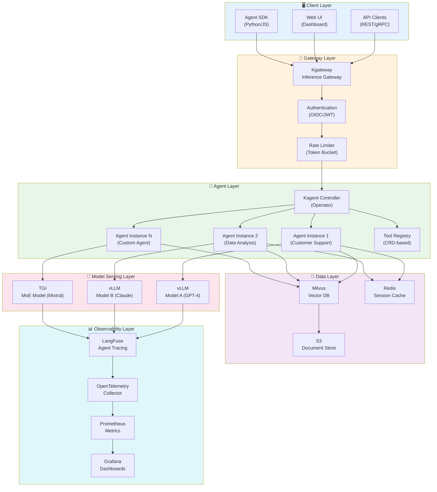
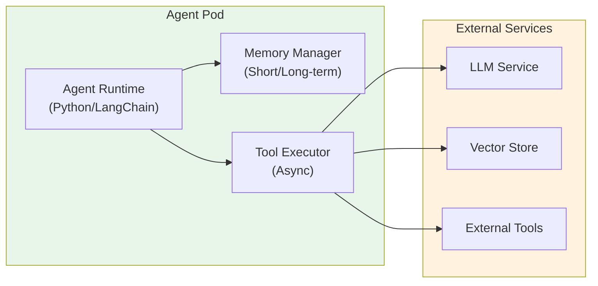
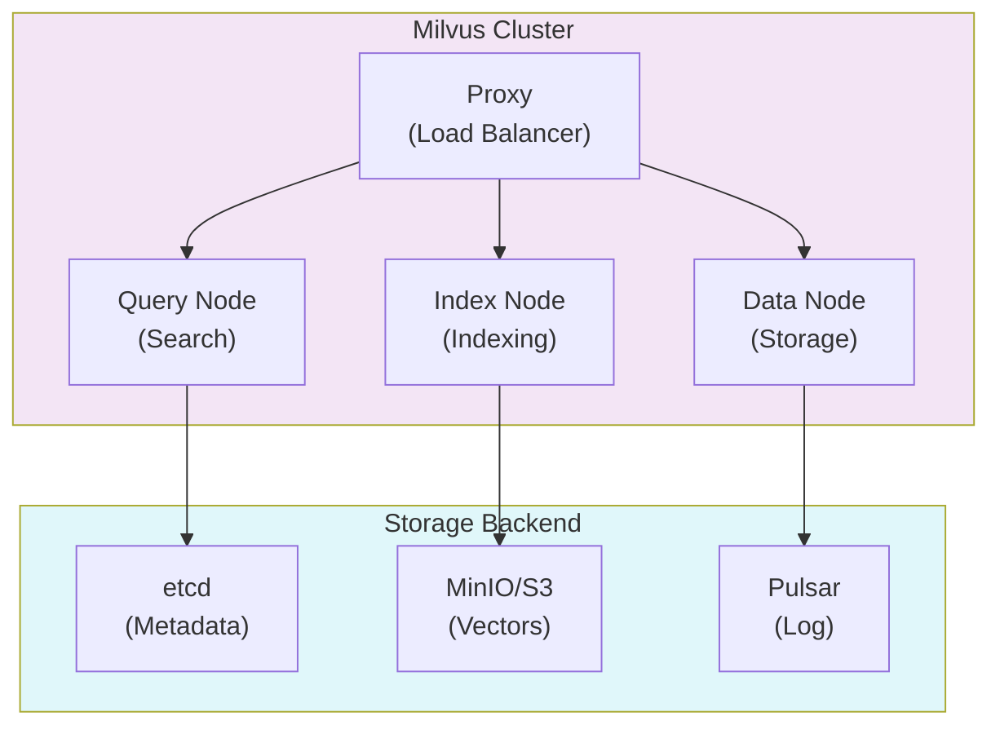
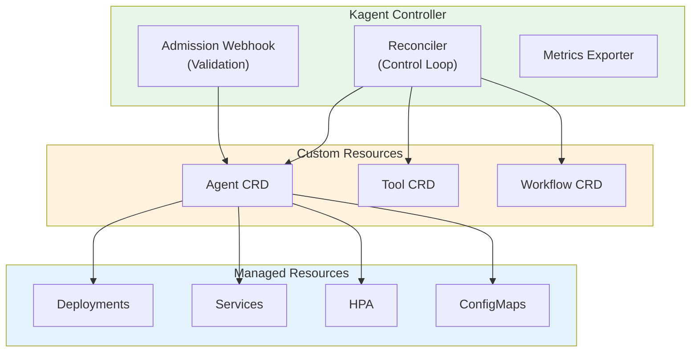
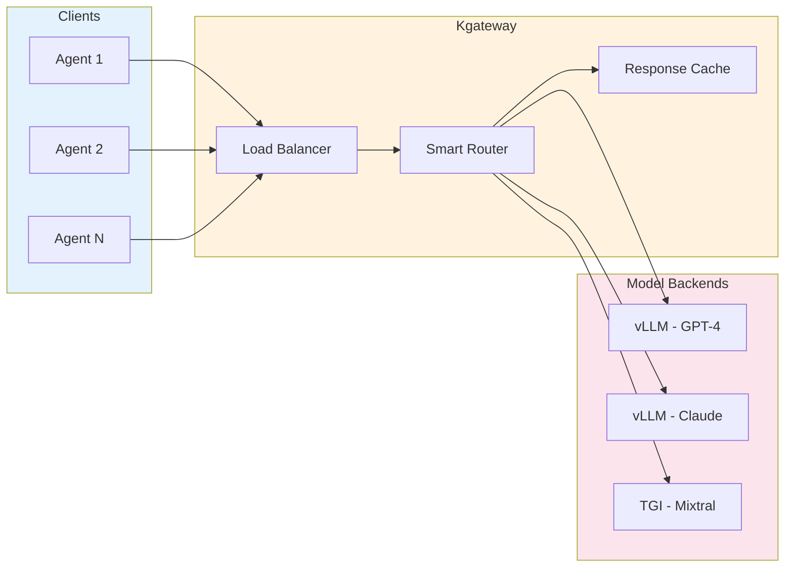
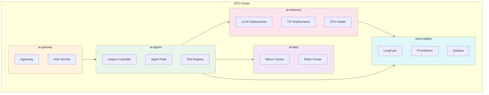

# Agentic AI Platform 아키텍처

이 문서에서는 Amazon EKS 기반 Agentic AI Platform의 전체 시스템 아키텍처와 핵심 컴포넌트 설계를 다룹니다. 자율적으로 작업을 수행하는 AI 에이전트를 효율적으로 구축하고 운영하기 위한 플랫폼 아키텍처를 제시합니다.

## 개요

Agentic AI Platform은 자율적인 AI 에이전트가 복잡한 작업을 수행할 수 있도록 지원하는 통합 플랫폼입니다. 이 플랫폼은 다음과 같은 핵심 기능을 제공합니다:

- **에이전트 오케스트레이션**: Kagent를 통한 AI 에이전트 라이프사이클 관리
- **지능형 라우팅**: Kgateway를 통한 추론 요청의 동적 라우팅
- **벡터 검색**: Milvus를 통한 RAG(Retrieval-Augmented Generation) 지원
- **관측성**: LangFuse를 통한 에이전트 동작 추적 및 분석
- **확장성**: Kubernetes 네이티브 수평적 확장

:::info 대상 독자
이 문서는 솔루션 아키텍트, 플랫폼 엔지니어, DevOps 엔지니어를 대상으로 합니다. Kubernetes와 AI/ML 워크로드에 대한 기본적인 이해가 필요합니다.
:::

## 전체 시스템 아키텍처

Agentic AI Platform은 6개의 주요 레이어로 구성됩니다. 각 레이어는 명확한 책임을 가지며, 느슨한 결합을 통해 독립적인 확장과 운영이 가능합니다.



### 레이어별 역할

| 레이어 | 역할 | 주요 컴포넌트 |
| ------ | ---- | ------------- |
| **Client Layer** | 사용자 및 애플리케이션 인터페이스 | API Clients, Web UI, SDK |
| **Gateway Layer** | 인증, 라우팅, 트래픽 관리 | Kgateway, Auth, Rate Limiter |
| **Agent Layer** | AI 에이전트 실행 및 오케스트레이션 | Kagent, Agent Instances, Tool Registry |
| **Model Serving Layer** | LLM 모델 추론 서비스 | vLLM, TGI |
| **Data Layer** | 데이터 저장 및 검색 | Milvus, Redis, S3 |
| **Observability Layer** | 모니터링 및 추적 | LangFuse, Prometheus, Grafana |

## 핵심 컴포넌트

### Agent Runtime Layer

Agent Runtime Layer는 AI 에이전트가 실행되는 환경을 제공합니다. 각 에이전트는 독립적인 Pod로 실행되며, Kagent Controller에 의해 관리됩니다.



#### 주요 기능

- **상태 관리**: 에이전트의 대화 컨텍스트 및 작업 상태 유지
- **도구 실행**: 등록된 도구를 비동기적으로 실행
- **메모리 관리**: 단기/장기 메모리를 통한 컨텍스트 유지
- **오류 복구**: 실패한 작업의 자동 재시도 및 폴백

### Tool Registry

Tool Registry는 에이전트가 사용할 수 있는 도구들을 중앙에서 관리합니다. Kubernetes CRD(Custom Resource Definition)를 통해 도구를 선언적으로 정의합니다.


```yaml
apiVersion: kagent.dev/v1alpha1
kind: Tool
metadata:
  name: web-search
  namespace: ai-agents
spec:
  type: api
  description: "웹 검색을 수행하여 최신 정보를 가져옵니다"
  config:
    endpoint: http://search-service/api/search
    method: POST
    timeout: 30s
  parameters:
    - name: query
      type: string
      required: true
      description: "검색 쿼리"
    - name: max_results
      type: integer
      default: 10
      description: "최대 결과 수"
  authentication:
    type: bearer
    secretRef:
      name: search-api-token
      key: token
```

#### 도구 유형

| 유형 | 설명 | 예시 |
| ---- | ---- | ---- |
| **API** | 외부 REST/gRPC API 호출 | 웹 검색, 티켓 생성 |
| **Retrieval** | 벡터 저장소 검색 | 문서 검색, FAQ 조회 |
| **Code** | 코드 실행 (샌드박스) | Python 스크립트, SQL 쿼리 |
| **Human** | 사람의 승인/입력 대기 | 결제 승인, 민감 작업 확인 |

### Memory Store (Milvus)

Milvus는 RAG 시스템의 핵심인 벡터 저장소 역할을 합니다. 에이전트는 Milvus를 통해 관련 문서를 검색하고 컨텍스트를 보강합니다.



#### 컬렉션 설계 예시

```python
from pymilvus import Collection, FieldSchema, CollectionSchema, DataType

# 컬렉션 스키마 정의
fields = [
    FieldSchema(name="id", dtype=DataType.VARCHAR, max_length=64, is_primary=True),
    FieldSchema(name="content", dtype=DataType.VARCHAR, max_length=65535),
    FieldSchema(name="embedding", dtype=DataType.FLOAT_VECTOR, dim=1536),
    FieldSchema(name="metadata", dtype=DataType.JSON),
    FieldSchema(name="tenant_id", dtype=DataType.VARCHAR, max_length=64),
]

schema = CollectionSchema(fields, description="Knowledge base for agents")
collection = Collection(name="agent_knowledge", schema=schema)

# HNSW 인덱스 생성 (고성능 검색)
index_params = {
    "metric_type": "COSINE",
    "index_type": "HNSW",
    "params": {"M": 16, "efConstruction": 256}
}
collection.create_index(field_name="embedding", index_params=index_params)
```

### Orchestrator (Kagent)

Kagent는 Kubernetes Operator 패턴을 사용하여 AI 에이전트의 전체 라이프사이클을 관리합니다.




#### Agent CRD 예시

```yaml
apiVersion: kagent.dev/v1alpha1
kind: Agent
metadata:
  name: customer-support-agent
  namespace: ai-agents
spec:
  # 모델 설정
  model:
    provider: openai
    name: gpt-4-turbo
    temperature: 0.7
    maxTokens: 4096
  
  # 시스템 프롬프트
  systemPrompt: |
    당신은 친절하고 전문적인 고객 지원 에이전트입니다.
    항상 정확한 정보를 제공하고, 모르는 것은 솔직히 인정하세요.
  
  # 사용할 도구
  tools:
    - name: search-knowledge-base
      type: retrieval
      config:
        vectorStore: milvus
        collection: support-docs
        topK: 5
    - name: create-ticket
      type: api
      config:
        endpoint: http://ticketing-service/api/tickets
        method: POST
  
  # 메모리 설정
  memory:
    type: redis
    config:
      host: redis-master.ai-agents.svc
      port: 6379
      ttl: 3600
      maxHistory: 50
  
  # 스케일링 설정
  scaling:
    minReplicas: 2
    maxReplicas: 10
    targetCPUUtilization: 70
    targetMemoryUtilization: 80
  
  # 리소스 제한
  resources:
    requests:
      memory: "512Mi"
      cpu: "250m"
    limits:
      memory: "1Gi"
      cpu: "500m"
```

### Inference Gateway (Kgateway)

Kgateway는 Kubernetes Gateway API를 기반으로 AI 모델 추론 요청을 지능적으로 라우팅합니다.




#### HTTPRoute 설정 예시

```yaml
apiVersion: gateway.networking.k8s.io/v1
kind: HTTPRoute
metadata:
  name: inference-routing
  namespace: ai-gateway
spec:
  parentRefs:
    - name: ai-gateway
      namespace: ai-gateway
  rules:
    # GPT-4 모델 라우팅 (가중치 기반)
    - matches:
        - path:
            type: PathPrefix
            value: /v1/chat/completions
          headers:
            - name: x-model-id
              value: "gpt-4"
      backendRefs:
        - name: vllm-gpt4-primary
          port: 8000
          weight: 80
        - name: vllm-gpt4-canary
          port: 8000
          weight: 20
    
    # Claude 모델 라우팅
    - matches:
        - path:
            type: PathPrefix
            value: /v1/chat/completions
          headers:
            - name: x-model-id
              value: "claude-3"
      backendRefs:
        - name: vllm-claude3
          port: 8000
    
    # MoE 모델 라우팅 (복잡한 작업용)
    - matches:
        - path:
            type: PathPrefix
            value: /v1/chat/completions
          headers:
            - name: x-model-id
              value: "mixtral-8x7b"
      backendRefs:
        - name: tgi-mixtral
          port: 8080
```

#### 라우팅 전략

| 전략 | 설명 | 사용 사례 |
| ---- | ---- | --------- |
| **가중치 기반** | 트래픽을 비율로 분배 | A/B 테스트, 카나리 배포 |
| **헤더 기반** | 요청 헤더로 라우팅 결정 | 모델 선택, 테넌트 분리 |
| **지연 시간 기반** | 가장 빠른 백엔드로 라우팅 | 성능 최적화 |
| **폴백** | 실패 시 대체 백엔드로 전환 | 고가용성 |

## Kubernetes 배포 아키텍처

### 네임스페이스 구성 전략

Agentic AI Platform은 관심사 분리와 보안을 위해 기능별로 네임스페이스를 분리합니다.




#### 네임스페이스 설정

```yaml
# ai-gateway 네임스페이스
apiVersion: v1
kind: Namespace
metadata:
  name: ai-gateway
  labels:
    istio-injection: enabled
    pod-security.kubernetes.io/enforce: restricted
---
# ai-agents 네임스페이스
apiVersion: v1
kind: Namespace
metadata:
  name: ai-agents
  labels:
    istio-injection: enabled
    pod-security.kubernetes.io/enforce: baseline
---
# ai-inference 네임스페이스 (GPU 워크로드)
apiVersion: v1
kind: Namespace
metadata:
  name: ai-inference
  labels:
    pod-security.kubernetes.io/enforce: privileged
  annotations:
    scheduler.alpha.kubernetes.io/defaultTolerations: '[{"key":"nvidia.com/gpu","operator":"Exists"}]'
---
# ai-data 네임스페이스
apiVersion: v1
kind: Namespace
metadata:
  name: ai-data
  labels:
    pod-security.kubernetes.io/enforce: baseline
---
# observability 네임스페이스
apiVersion: v1
kind: Namespace
metadata:
  name: observability
  labels:
    pod-security.kubernetes.io/enforce: baseline
```

### 리소스 할당 전략

각 네임스페이스에 ResourceQuota를 설정하여 리소스 사용을 제한하고 공정한 분배를 보장합니다.

```yaml
apiVersion: v1
kind: ResourceQuota
metadata:
  name: ai-inference-quota
  namespace: ai-inference
spec:
  hard:
    requests.cpu: "100"
    requests.memory: "500Gi"
    limits.cpu: "200"
    limits.memory: "1Ti"
    requests.nvidia.com/gpu: "32"
    persistentvolumeclaims: "50"
---
apiVersion: v1
kind: ResourceQuota
metadata:
  name: ai-agents-quota
  namespace: ai-agents
spec:
  hard:
    requests.cpu: "50"
    requests.memory: "100Gi"
    limits.cpu: "100"
    limits.memory: "200Gi"
    pods: "200"
```

:::warning 리소스 계획
GPU 리소스는 비용이 높으므로 신중하게 계획해야 합니다. 초기에는 보수적으로 설정하고, 모니터링을 통해 점진적으로 조정하세요.
:::

## 확장성 설계

### 수평적 확장 전략

Agentic AI Platform의 각 컴포넌트는 독립적으로 수평 확장이 가능합니다.