# GPU 클러스터 동적 리소스 관리

> 📅 **작성일**: 2025-02-05 | ⏱️ **읽는 시간**: 약 9분


## 개요

대규모 GenAI 서비스 환경에서는 복수의 GPU 클러스터를 효율적으로 관리하고, 트래픽 변화에 따라 동적으로 리소스를 재할당하는 것이 핵심입니다. 이 문서에서는 Amazon EKS 환경에서 Karpenter를 활용한 GPU 노드 자동 스케일링과 DCGM(Data Center GPU Manager) 기반 메트릭 수집, 그리고 KEDA를 통한 워크로드 자동 스케일링 전략을 다룹니다.

### 주요 목표

- **리소스 효율성**: GPU 리소스의 유휴 시간 최소화
- **비용 최적화**: Spot 인스턴스 활용 및 Consolidation을 통한 비용 절감
- **자동화된 스케일링**: 트래픽 패턴에 따른 자동 리소스 조정
- **서비스 안정성**: SLA 준수를 위한 적절한 리소스 확보

---

## 멀티 GPU 클러스터 아키텍처

### 전체 아키텍처 다이어그램


### 리소스 공유 아키텍처

복수 모델 간 GPU 리소스를 효율적으로 공유하기 위한 아키텍처입니다.


:::info 리소스 공유 원칙

- **Primary Pool**: 각 모델에 할당된 기본 GPU 리소스
- **Elastic Pool**: 트래픽 급증 시 동적으로 할당되는 공유 리소스
- **Priority-based Allocation**: 우선순위 기반 리소스 할당으로 중요 워크로드 보호

:::

---

## 동적 리소스 할당 전략

### 트래픽 급증 시나리오

실제 운영 환경에서 발생할 수 있는 트래픽 급증 시나리오와 대응 전략입니다.

```mermaid
sequenceDiagram
    participant User as 사용자 트래픽
    participant LB as Load Balancer
    participant ModelA as Model A Service
    participant ModelB as Model B Service
    participant KEDA as KEDA Controller
    participant Karpenter as Karpenter
    participant AWS as AWS EC2

    Note over User,AWS: 정상 상태: Model A 40%, Model B 30% GPU 사용률
    
    User->>LB: 트래픽 급증 (Model A)
    LB->>ModelA: 요청 전달
    ModelA->>KEDA: GPU 사용률 85% 감지
    
    KEDA->>ModelA: HPA 트리거 - Pod 스케일 아웃
    KEDA->>Karpenter: 추가 노드 요청
    
    Karpenter->>AWS: p4d.24xlarge 프로비저닝
    AWS-->>Karpenter: 노드 준비 완료
    
    Note over ModelA,ModelB: Model B 리소스 일부를 Model A로 재할당
    
    Karpenter->>ModelA: 새 노드에 Pod 스케줄링
    ModelA-->>User: 응답 지연 시간 정상화
```



### 모델 간 리소스 재할당 절차

Model A에 트래픽이 급증할 때 Model B의 유휴 리소스를 Model A에 할당하는 구체적인 절차입니다.

#### 단계 1: 메트릭 수집 및 분석

```yaml
# DCGM Exporter가 수집하는 주요 메트릭
# - DCGM_FI_DEV_GPU_UTIL: GPU 사용률
# - DCGM_FI_DEV_MEM_COPY_UTIL: 메모리 복사 사용률
# - DCGM_FI_DEV_FB_USED: 프레임버퍼 사용량
```

#### 단계 2: 스케일링 결정

| 조건 | 액션 |
|------|------|
| Model A GPU 사용률 > 80% | Model A Pod 스케일 아웃 트리거 |
| Model B GPU 사용률 < 30% | Model B Pod 스케일 인 가능 |
| Elastic Pool 가용 | Elastic Pool에서 리소스 할당 |

#### 단계 3: 리소스 재할당 실행

```bash
# Model B의 replica 수 감소 (유휴 리소스 확보)
kubectl scale deployment model-b-serving --replicas=1 -n inference

# Model A의 replica 수 증가
kubectl scale deployment model-a-serving --replicas=5 -n inference

# 또는 KEDA가 자동으로 처리
```

#### 단계 4: 노드 레벨 스케일링

Karpenter가 자동으로 추가 노드를 프로비저닝하거나 유휴 노드를 정리합니다.

:::warning 주의사항

리소스 재할당 시 Model B의 최소 SLA를 보장하기 위해 `minReplicas`를 설정해야 합니다. 완전한 리소스 회수는 서비스 중단을 야기할 수 있습니다.

:::

---

## Karpenter 기반 노드 스케일링

### NodePool 설정

GPU 워크로드를 위한 Karpenter NodePool 설정 예제입니다.

```yaml
apiVersion: karpenter.sh/v1
kind: NodePool
metadata:
  name: gpu-inference-pool
spec:
  template:
    metadata:
      labels:
        node-type: gpu-inference
        workload: genai
    spec:
      requirements:
        - key: kubernetes.io/arch
          operator: In
          values: ["amd64"]
        - key: karpenter.sh/capacity-type
          operator: In
          values: ["on-demand", "spot"]
        - key: node.kubernetes.io/instance-type
          operator: In
          values:
            - p4d.24xlarge    # 8x A100 40GB
            - p5.48xlarge     # 8x H100 80GB
            - g5.48xlarge     # 8x A10G 24GB
        - key: karpenter.k8s.aws/instance-gpu-count
          operator: Gt
          values: ["0"]
      nodeClassRef:
        group: karpenter.k8s.aws
        kind: EC2NodeClass
        name: gpu-nodeclass
      taints:
        - key: nvidia.com/gpu
          value: "true"
          effect: NoSchedule
  limits:
    cpu: 1000
    memory: 4000Gi
    nvidia.com/gpu: 64
  disruption:
    consolidationPolicy: WhenEmptyOrUnderutilized
    consolidateAfter: 30s
  weight: 100
```

### EC2NodeClass 설정

GPU 인스턴스를 위한 EC2NodeClass 설정입니다.

```yaml
apiVersion: karpenter.k8s.aws/v1
kind: EC2NodeClass
metadata:
  name: gpu-nodeclass
spec:
  role: KarpenterNodeRole-${CLUSTER_NAME}
  amiSelectorTerms:
    - alias: al2023@latest
  subnetSelectorTerms:
    - tags:
        karpenter.sh/discovery: ${CLUSTER_NAME}
  securityGroupSelectorTerms:
    - tags:
        karpenter.sh/discovery: ${CLUSTER_NAME}
  blockDeviceMappings:
    - deviceName: /dev/xvda
      ebs:
        volumeSize: 500Gi
        volumeType: gp3
        iops: 10000
        throughput: 500
        encrypted: true
        deleteOnTermination: true
  instanceStorePolicy: RAID0
  userData: |
    #!/bin/bash
    # NVIDIA 드라이버 및 Container Toolkit 설정
    nvidia-smi
    
    # GPU 메모리 모드 설정 (Persistence Mode)
    nvidia-smi -pm 1
    
    # EFA 드라이버 로드 (p4d, p5 인스턴스용)
    modprobe efa
  tags:
    Environment: production
    Workload: genai-inference
```

### GPU 인스턴스 타입 비교

| 인스턴스 타입 | GPU | GPU 메모리 | vCPU | 메모리 | 네트워크 | 용도 |
|--------------|-----|-----------|------|--------|---------|------|
| p4d.24xlarge | 8x A100 | 40GB x 8 | 96 | 1152 GiB | 400 Gbps EFA | 대규모 LLM 추론 |
| p5.48xlarge | 8x H100 | 80GB x 8 | 192 | 2048 GiB | 3200 Gbps EFA | 초대규모 모델, 학습 |
| g5.48xlarge | 8x A10G | 24GB x 8 | 192 | 768 GiB | 100 Gbps | 중소규모 모델 추론 |

:::tip 인스턴스 선택 가이드

- **p5.48xlarge**: 70B+ 파라미터 모델, 최고 성능 요구 시
- **p4d.24xlarge**: 13B-70B 파라미터 모델, 비용 대비 성능 균형
- **g5.48xlarge**: 7B 이하 모델, 비용 효율적인 추론

:::

---

## GPU 메트릭 기반 자동 스케일링

### DCGM Exporter 설정

NVIDIA DCGM Exporter를 통해 GPU 메트릭을 Prometheus로 수집합니다.

```yaml
apiVersion: apps/v1
kind: DaemonSet
metadata:
  name: dcgm-exporter
  namespace: gpu-monitoring
  labels:
    app: dcgm-exporter
spec:
  selector:
    matchLabels:
      app: dcgm-exporter
  template:
    metadata:
      labels:
        app: dcgm-exporter
    spec:
      nodeSelector:
        nvidia.com/gpu.present: "true"
      tolerations:
        - key: nvidia.com/gpu
          operator: Exists
          effect: NoSchedule
      containers:
        - name: dcgm-exporter
          image: nvcr.io/nvidia/k8s/dcgm-exporter:3.3.5-3.4.0-ubuntu22.04
          ports:
            - name: metrics
              containerPort: 9400
          env:
            - name: DCGM_EXPORTER_LISTEN
              value: ":9400"
            - name: DCGM_EXPORTER_KUBERNETES
              value: "true"
            - name: DCGM_EXPORTER_COLLECTORS
              value: "/etc/dcgm-exporter/dcp-metrics-included.csv"
          volumeMounts:
            - name: pod-resources
              mountPath: /var/lib/kubelet/pod-resources
              readOnly: true
          securityContext:
            runAsNonRoot: false
            runAsUser: 0
            capabilities:
              add: ["SYS_ADMIN"]
      volumes:
        - name: pod-resources
          hostPath:
            path: /var/lib/kubelet/pod-resources
```

### 주요 GPU 메트릭

DCGM Exporter가 수집하는 핵심 메트릭입니다.

| 메트릭 이름 | 설명 | 스케일링 활용 |
|------------|------|--------------|
| `DCGM_FI_DEV_GPU_UTIL` | GPU 코어 사용률 (%) | HPA 트리거 기준 |
| `DCGM_FI_DEV_MEM_COPY_UTIL` | 메모리 대역폭 사용률 (%) | 메모리 병목 감지 |
| `DCGM_FI_DEV_FB_USED` | 프레임버퍼 사용량 (MB) | OOM 방지 |
| `DCGM_FI_DEV_FB_FREE` | 프레임버퍼 여유량 (MB) | 용량 계획 |
| `DCGM_FI_DEV_POWER_USAGE` | 전력 사용량 (W) | 비용 모니터링 |
| `DCGM_FI_DEV_SM_CLOCK` | SM 클럭 속도 (MHz) | 성능 모니터링 |
| `DCGM_FI_DEV_GPU_TEMP` | GPU 온도 (°C) | 열 관리 |

### Prometheus ServiceMonitor 설정

```yaml
apiVersion: monitoring.coreos.com/v1
kind: ServiceMonitor
metadata:
  name: dcgm-exporter
  namespace: gpu-monitoring
spec:
  selector:
    matchLabels:
      app: dcgm-exporter
  endpoints:
    - port: metrics
      interval: 15s
      path: /metrics
  namespaceSelector:
    matchNames:
      - gpu-monitoring
```

### KEDA ScaledObject 설정

KEDA를 사용하여 GPU 메트릭 기반 자동 스케일링을 구성합니다.

```yaml
apiVersion: keda.sh/v1alpha1
kind: ScaledObject
metadata:
  name: model-a-gpu-scaler
  namespace: inference
spec:
  scaleTargetRef:
    apiVersion: apps/v1
    kind: Deployment
    name: model-a-serving
  pollingInterval: 15
  cooldownPeriod: 60
  minReplicaCount: 2
  maxReplicaCount: 10
  fallback:
    failureThreshold: 3
    replicas: 3
  advanced:
    horizontalPodAutoscalerConfig:
      behavior:
        scaleDown:
          stabilizationWindowSeconds: 300
          policies:
            - type: Percent
              value: 25
              periodSeconds: 60
        scaleUp:
          stabilizationWindowSeconds: 0
          policies:
            - type: Percent
              value: 100
              periodSeconds: 15
            - type: Pods
              value: 4
              periodSeconds: 15
          selectPolicy: Max
  triggers:
    - type: prometheus
      metadata:
        serverAddress: http://prometheus-server.monitoring:9090
        metricName: gpu_utilization
        query: |
          avg(DCGM_FI_DEV_GPU_UTIL{pod=~"model-a-.*"})
        threshold: "70"
        activationThreshold: "50"
```

### 자동 스케일링 임계값 설정

워크로드 특성에 따른 권장 임계값입니다.

| 워크로드 유형 | Scale Up 임계값 | Scale Down 임계값 | Cooldown |
|--------------|----------------|------------------|----------|
| 실시간 추론 | GPU 70% | GPU 30% | 60초 |
| 배치 처리 | GPU 85% | GPU 40% | 300초 |
| 대화형 서비스 | GPU 60% | GPU 25% | 30초 |

:::tip 임계값 튜닝 가이드

1. **초기 설정**: 보수적인 값(Scale Up 80%, Scale Down 20%)으로 시작
2. **모니터링**: 2-3일간 실제 트래픽 패턴 관찰
3. **조정**: 응답 시간 SLA와 비용을 고려하여 점진적 조정
4. **검증**: 부하 테스트를 통한 설정 검증

:::

### HPA와 KEDA 연동

기본 HPA와 KEDA를 함께 사용하는 경우의 설정입니다.

```yaml
apiVersion: autoscaling/v2
kind: HorizontalPodAutoscaler
metadata:
  name: model-a-hpa
  namespace: inference
spec:
  scaleTargetRef:
    apiVersion: apps/v1
    kind: Deployment
    name: model-a-serving
  minReplicas: 2
  maxReplicas: 10
  metrics:
    - type: External
      external:
        metric:
          name: gpu_utilization
          selector:
            matchLabels:
              scaledobject.keda.sh/name: model-a-gpu-scaler
        target:
          type: AverageValue
          averageValue: "70"
```

---

## 비용 최적화 전략

### Spot 인스턴스 활용

GPU Spot 인스턴스를 활용하여 비용을 최대 90%까지 절감할 수 있습니다.

```yaml
apiVersion: karpenter.sh/v1
kind: NodePool
metadata:
  name: gpu-spot-pool
spec:
  template:
    spec:
      requirements:
        - key: karpenter.sh/capacity-type
          operator: In
          values: ["spot"]
        - key: node.kubernetes.io/instance-type
          operator: In
          values:
            - g5.12xlarge
            - g5.24xlarge
            - g5.48xlarge
      nodeClassRef:
        group: karpenter.k8s.aws
        kind: EC2NodeClass
        name: gpu-spot-nodeclass
      taints:
        - key: nvidia.com/gpu
          value: "true"
          effect: NoSchedule
        - key: karpenter.sh/capacity-type
          value: "spot"
          effect: NoSchedule
  limits:
    nvidia.com/gpu: 32
  disruption:
    consolidationPolicy: WhenEmpty
    consolidateAfter: 30s
  weight: 50
```

:::warning Spot 인스턴스 주의사항

- **중단 처리**: Spot 인스턴스는 2분 전 중단 알림을 받습니다. 적절한 graceful shutdown 구현 필요
- **워크로드 적합성**: 상태 비저장(stateless) 추론 워크로드에 적합
- **가용성**: 특정 인스턴스 타입의 Spot 가용성이 낮을 수 있으므로 다양한 타입 지정 권장

:::

### Spot 중단 처리

```yaml
apiVersion: apps/v1
kind: Deployment
metadata:
  name: model-serving-spot
  namespace: inference
spec:
  template:
    spec:
      terminationGracePeriodSeconds: 120
      containers:
        - name: vllm
          lifecycle:
            preStop:
              exec:
                command:
                  - /bin/sh
                  - -c
                  - |
                    # 새 요청 수신 중단
                    curl -X POST localhost:8000/drain
                    # 진행 중인 요청 완료 대기
                    sleep 90
      tolerations:
        - key: karpenter.sh/capacity-type
          operator: Equal
          value: "spot"
          effect: NoSchedule
```

### Consolidation 정책

유휴 노드를 자동으로 정리하여 비용을 최적화합니다.

```yaml
apiVersion: karpenter.sh/v1
kind: NodePool
metadata:
  name: gpu-inference-pool
spec:
  disruption:
    # 노드가 비어있거나 활용도가 낮을 때 통합
    consolidationPolicy: WhenEmptyOrUnderutilized
    # 통합 대기 시간
    consolidateAfter: 30s
    # 예산 설정 - 동시에 중단 가능한 노드 수 제한
    budgets:
      - nodes: "20%"
      - nodes: "0"
        schedule: "0 9 * * 1-5"  # 평일 업무 시간에는 중단 방지
        duration: 8h
```

### 비용 최적화 체크리스트

| 항목 | 설명 | 예상 절감 |
|------|------|----------|
| Spot 인스턴스 활용 | 비프로덕션 및 내결함성 워크로드 | 60-90% |
| Consolidation 활성화 | 유휴 노드 자동 정리 | 20-30% |
| Right-sizing | 워크로드에 맞는 인스턴스 선택 | 15-25% |
| 스케줄 기반 스케일링 | 비업무 시간 리소스 축소 | 30-40% |

:::tip 비용 모니터링

Kubecost 또는 AWS Cost Explorer를 활용하여 GPU 워크로드별 비용을 추적하고, 정기적으로 최적화 기회를 검토하세요.

:::

---

## 운영 모범 사례

### GPU 리소스 요청 설정

```yaml
apiVersion: apps/v1
kind: Deployment
metadata:
  name: model-a-serving
  namespace: inference
spec:
  template:
    spec:
      containers:
        - name: vllm
          resources:
            requests:
              nvidia.com/gpu: 1
              memory: "32Gi"
              cpu: "8"
            limits:
              nvidia.com/gpu: 1
              memory: "64Gi"
              cpu: "16"
```

### 모니터링 대시보드 구성

Grafana 대시보드에서 모니터링해야 할 핵심 패널:

1. **GPU 사용률 트렌드**: 시간별 GPU 사용률 변화
2. **메모리 사용량**: GPU 메모리 사용량 및 여유 공간
3. **Pod 스케일링 이벤트**: HPA/KEDA 스케일링 이력
4. **노드 프로비저닝**: Karpenter 노드 생성/삭제 이벤트
5. **비용 추적**: 시간당/일별 GPU 비용

### 알림 설정

```yaml
apiVersion: monitoring.coreos.com/v1
kind: PrometheusRule
metadata:
  name: gpu-alerts
  namespace: monitoring
spec:
  groups:
    - name: gpu-alerts
      rules:
        - alert: HighGPUUtilization
          expr: avg(DCGM_FI_DEV_GPU_UTIL) > 90
          for: 5m
          labels:
            severity: warning
          annotations:
            summary: "GPU 사용률이 90%를 초과했습니다"
            
        - alert: GPUMemoryPressure
          expr: (DCGM_FI_DEV_FB_USED / DCGM_FI_DEV_FB_FREE) > 0.9
          for: 2m
          labels:
            severity: critical
          annotations:
            summary: "GPU 메모리 부족 위험"
```

---

## 요약

GPU 클러스터의 동적 리소스 관리는 GenAI 서비스의 성능과 비용 효율성을 결정하는 핵심 요소입니다.

### 핵심 포인트

1. **Karpenter 활용**: GPU 노드의 자동 프로비저닝 및 정리로 리소스 효율성 극대화
2. **DCGM 메트릭**: 정확한 GPU 사용률 모니터링으로 데이터 기반 스케일링 결정
3. **KEDA 연동**: GPU 메트릭 기반 워크로드 자동 스케일링
4. **Spot 인스턴스**: 적절한 워크로드에 Spot 활용으로 비용 절감
5. **Consolidation**: 유휴 리소스 자동 정리로 비용 최적화

### 다음 단계

- [Agentic AI 플랫폼 아키텍처](./agentic-platform-architecture.md) - 전체 플랫폼 구성
- [Agentic AI 인프라](./agentic-ai-challenges.md) - AI 에이전트 운영 전략

---

## 참고 자료

- [Karpenter 공식 문서](https://karpenter.sh/)
- [NVIDIA DCGM Exporter](https://github.com/NVIDIA/dcgm-exporter)
- [KEDA 공식 문서](https://keda.sh/)
- [AWS GPU 인스턴스 가이드](https://aws.amazon.com/ec2/instance-types/#Accelerated_Computing)
