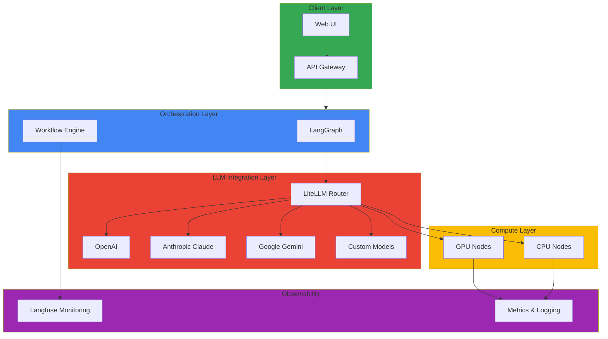

# GenAI & AI/ML

이 섹션에서는 Amazon EKS에서 생성형 AI 및 AI/ML 워크로드를 구축하고 운영하는 방법에 대한 심화 기술 문서들을 다룹니다. GPU 리소스 최적화, LiteLLM 통합, LangGraph 워크플로우 구현, Langfuse 모니터링 등을 통해 프로덕션급 GenAI 플랫폼을 구축할 수 있습니다.

## 📚 주요 문서

### 🚀 Agentic AI 플랫폼 인프라 가이드 (신규)

Frontier Model 트래픽을 효율적으로 처리하고 Agentic AI 플랫폼을 구축하기 위한 종합 가이드입니다.

- **[기술적 도전과제 및 K8s 필요성](./agentic-ai-challenges.md)** - GPU 스케줄링, 동적 라우팅, 비용 관리의 4가지 핵심 도전과제
- **[Agentic AI 플랫폼 아키텍처](./agentic-platform-architecture.md)** - 전체 시스템 아키텍처 및 컴포넌트 설계
- **[GPU 리소스 관리](./gpu-resource-management.md)** - 멀티 GPU 클러스터 운영 및 동적 리소스 할당
- **[Inference Gateway 및 동적 라우팅](./inference-gateway-routing.md)** - Kgateway 기반 트래픽 관리
- **[MoE 모델 서빙](./moe-model-serving.md)** - Mixture of Experts 모델 배포 전략
- **[Agent 모니터링](./agent-monitoring.md)** - LangFuse/LangSmith 통합 모니터링
- **[Kagent Kubernetes Agent 관리](./kagent-kubernetes-agents.md)** - CRD 기반 Agent 라이프사이클 관리
- **[Milvus 벡터 데이터베이스](./milvus-vector-database.md)** - RAG 파이프라인을 위한 벡터 DB 통합
- **[Ragas RAG 평가](./ragas-evaluation.md)** - RAG 품질 평가 및 CI/CD 통합
- **[NeMo 프레임워크](./nemo-framework.md)** - LLM 파인튜닝 및 TensorRT 최적화
- **[운영 및 트러블슈팅](./operations-troubleshooting.md)** - 알림 설정 및 문제 해결 가이드

### 프로덕션 GenAI 플랫폼 구축

- **[Building Production-Ready GenAI Platform on EKS](./genai-platform.md)**
  - LiteLLM을 통한 다중 LLM 모델 통합
  - LangGraph 기반 복잡한 AI 워크플로우 구현
  - Langfuse를 통한 GenAI 애플리케이션 모니터링 및 추적
  - 프로덕션 환경에서의 배포 및 운영 전략
  - 비용 최적화 및 성능 튜닝
  - 실제 구현 사례 및 모범 사례

## 🎯 학습 목표

이 섹션을 통해 다음을 학습할 수 있습니다:

- Agentic AI 플랫폼 구축 시 4가지 핵심 기술적 도전과제 이해
- EKS에서 확장 가능한 GenAI 플랫폼 구축 방법
- 여러 LLM 제공자(OpenAI, Anthropic, Google 등) 통합
- 복잡한 AI 워크플로우 설계 및 구현
- GPU 리소스 효율적 활용 및 최적화 전략
- AI/ML 워크로드의 자동 스케일링 및 리소스 관리
- 프로덕션 환경에서의 AI 모델 배포 및 운영
- Kagent, Kgateway, Milvus, Ragas, NeMo 등 오픈소스 활용
- 비용 추적 및 최적화
- 성능 모니터링 및 분석

## 🏗️ 아키텍처 패턴

## 🔧 주요 기술 및 도구

| 기술 | 설명 | 용도 |
| --- | --- | --- |
| **Kagent** | Kubernetes Agent 관리 | CRD 기반 Agent 라이프사이클 |
| **Kgateway** | Inference Gateway | 동적 라우팅 및 로드밸런싱 |
| **Milvus** | 벡터 데이터베이스 | RAG 파이프라인 지원 |
| **Ragas** | RAG 평가 프레임워크 | 품질 측정 및 CI/CD 통합 |
| **NeMo** | LLM 학습 프레임워크 | 파인튜닝 및 최적화 |
| **LiteLLM** | 다중 LLM 프로바이더 통합 | LLM 라우팅 및 폴백 |
| **LangGraph** | AI 워크플로우 오케스트레이션 | 복잡한 AI 워크플로우 구현 |
| **Langfuse** | GenAI 애플리케이션 모니터링 | 추적, 모니터링, 분석 |
| **NVIDIA GPU Operator** | GPU 리소스 관리 | GPU 드라이버 및 런타임 |
| **Karpenter** | 노드 자동 스케일링 | 비용 효율적 리소스 관리 |
| **vLLM** | 고성능 LLM 서빙 | PagedAttention 기반 추론 |

## 💡 핵심 개념

### LiteLLM 라우팅
- **프로바이더 추상화**: 다양한 LLM API를 통일된 인터페이스로 사용
- **폴백 메커니즘**: 한 제공자 실패 시 자동으로 다른 제공자로 전환
- **로드 밸런싱**: 여러 모델에 요청 분산
- **비용 최적화**: 가성비 좋은 모델 자동 선택

### LangGraph 워크플로우
- **상태 관리**: 각 단계의 상태를 명확하게 관리
- **조건부 분기**: 결과에 따른 동적 흐름 제어
- **병렬 처리**: 독립적인 작업 동시 실행
- **오류 처리**: 안정적인 예외 처리 메커니즘

### Langfuse 모니터링
- **요청 추적**: 각 API 호출의 전체 과정 기록
- **비용 분석**: 모델별, 프로젝트별 비용 추적
- **성능 분석**: 응답 시간, 정확도 등 메트릭 분석
- **사용자 피드백**: 생성 결과에 대한 피드백 수집

### GPU 리소스 최적화

#### MIG (Multi-Instance GPU)
- **단일 GPU 분할**: 하나의 GPU를 여러 인스턴스로 분할
- **리소스 격리**: 완전한 컴퓨팅 격리 제공
- **효율성**: 다중 테넌트 환경에서 안정적

#### Time-Slicing
- **시간 공유**: GPU 시간을 여러 작업이 공유
- **유연성**: 개발/테스트 환경에 적합
- **비용**: MIG보다 저렴하지만 성능 공유

## 📊 성능 및 비용 최적화

### 모델 선택 기준
| 모델 | 성능 | 비용 | 용도 |
|------|------|------|------|
| GPT-4 | 최고 | 높음 | 복잡한 작업 |
| GPT-4 Turbo | 높음 | 중간 | 균형잡은 선택 |
| GPT-3.5 Turbo | 중간 | 낮음 | 빠른 응답 필요 시 |
| Claude 3 Opus | 매우 높음 | 매우 높음 | 고정확도 필요 시 |
| Open Source | 다양 | 낮음 | 완전한 제어 필요 시 |

### 비용 최적화 전략
- **프롬프트 캐싱**: 반복적인 프롬프트 캐시
- **배치 처리**: 비즈니스 크리티컬하지 않은 작업 배치 처리
- **모델 계층화**: 복잡도에 따라 다른 모델 사용
- **컨텍스트 최소화**: 불필요한 토큰 제거

## 🔗 관련 카테고리

- [Observability & Monitoring](/docs/observability-monitoring) - AI/ML 워크로드 모니터링
- [Performance & Networking](/docs/performance-networking) - GPU 성능 최적화
- [Hybrid & Multi-Cloud](/docs/hybrid-multicloud) - 하이브리드 환경의 AI 배포

---

:::tip 팁
GenAI 워크로드는 GPU 리소스를 많이 사용하므로, 비용 최적화를 위해 Spot 인스턴스와 자동 스케일링을 적극 활용하세요. 또한 Langfuse를 통해 비용을 추적하고 지속적으로 모니터링하십시오.
:::

:::info 추천 학습 경로

**Agentic AI 플랫폼 구축 경로:**
1. 기술적 도전과제 및 K8s 필요성 이해
2. 플랫폼 아키텍처 설계
3. GPU 리소스 관리 및 Karpenter 설정
4. Inference Gateway 및 동적 라우팅 구성
5. Agent 모니터링 및 운영 체계 구축

**GenAI 애플리케이션 개발 경로:**
1. LiteLLM 기본 설정 및 라우팅
2. LangGraph를 사용한 간단한 워크플로우
3. Langfuse 모니터링 통합
4. GPU 리소스 최적화
5. 전체 플랫폼 통합 및 운영
:::

:::warning 주의 - 비용 관리
생성형 AI 서비스는 API 호출 비용이 빠르게 누적될 수 있습니다. 초기에는 요청 속도 제한(rate limiting)을 설정하고, Langfuse로 비용을 지속적으로 모니터링하세요.
:::
