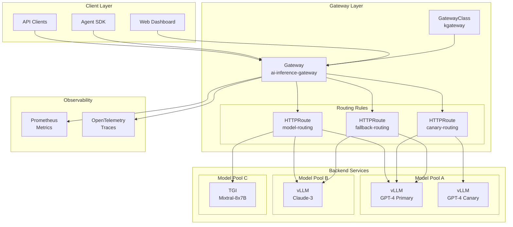
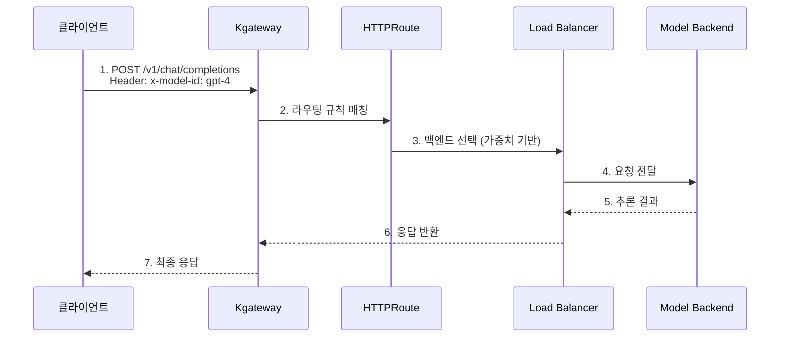

# Inference Gateway 및 Dynamic Routing

> 📅 **작성일**: 2025-02-05 | ⏱️ **읽는 시간**: 약 12분

## 개요

대규모 AI 모델 서빙 환경에서는 다양한 모델에 대한 추론 요청을 효율적으로 라우팅하고 관리하는 것이 핵심입니다. 이 문서에서는 Kubernetes Gateway API와 Kgateway를 활용하여 AI 모델 추론 요청의 동적 라우팅, 로드 밸런싱, 그리고 장애 대응 전략을 구성하는 방법을 다룹니다.

### 주요 목표

- **지능형 라우팅**: 요청 특성에 따른 최적의 모델 백엔드 선택
- **트래픽 분배**: 가중치 기반 로드 밸런싱으로 안정적인 서비스 제공
- **점진적 배포**: 카나리 및 A/B 테스트를 통한 안전한 모델 업데이트
- **고가용성**: 폴백 및 재시도 정책을 통한 서비스 연속성 보장

---

## Inference Gateway 아키텍처

### 전체 아키텍처 다이어그램



### 컴포넌트 구조

| 컴포넌트 | 역할 | 설명 |
|---------|------|------|
| **GatewayClass** | 게이트웨이 구현체 정의 | Kgateway 컨트롤러 지정 |
| **Gateway** | 진입점 정의 | 리스너, TLS, 주소 설정 |
| **HTTPRoute** | 라우팅 규칙 | 경로, 헤더 기반 라우팅 |
| **Backend** | 모델 서비스 | vLLM, TGI 등 추론 서버 |

### 트래픽 플로우



:::info Gateway API 표준
Kgateway는 Kubernetes Gateway API 표준을 구현하여 벤더 중립적인 설정이 가능합니다. 이를 통해 다른 Gateway 구현체로의 마이그레이션이 용이합니다.
:::

---

## Kgateway 설치 및 구성

### 사전 요구사항

- Kubernetes 1.28 이상
- Helm 3.x
- Gateway API CRD 설치

### Gateway API CRD 설치

```bash
# Gateway API 표준 CRD 설치
kubectl apply -f https://github.com/kubernetes-sigs/gateway-api/releases/download/v1.2.0/standard-install.yaml

# 실험적 기능 포함 설치 (HTTPRoute 필터 등)
kubectl apply -f https://github.com/kubernetes-sigs/gateway-api/releases/download/v1.2.0/experimental-install.yaml
```

### Kgateway Helm 차트 설치

```bash
# Helm 저장소 추가
helm repo add kgateway https://kgateway-dev.github.io/kgateway/
helm repo update

# 네임스페이스 생성
kubectl create namespace kgateway-system

# Kgateway 설치
helm install kgateway kgateway/kgateway \
  --namespace kgateway-system \
  --set controller.replicaCount=2 \
  --set controller.resources.requests.cpu=500m \
  --set controller.resources.requests.memory=512Mi \
  --set controller.resources.limits.cpu=1000m \
  --set controller.resources.limits.memory=1Gi \
  --set metrics.enabled=true \
  --set metrics.serviceMonitor.enabled=true
```

### Helm Values 상세 설정

```yaml
# values.yaml
controller:
  replicaCount: 2
  
  resources:
    requests:
      cpu: 500m
      memory: 512Mi
    limits:
      cpu: 1000m
      memory: 1Gi
  
  # 고가용성 설정
  affinity:
    podAntiAffinity:
      preferredDuringSchedulingIgnoredDuringExecution:
        - weight: 100
          podAffinityTerm:
            labelSelector:
              matchLabels:
                app: kgateway
            topologyKey: kubernetes.io/hostname

# 메트릭 설정
metrics:
  enabled: true
  port: 9090
  serviceMonitor:
    enabled: true
    interval: 15s
    labels:
      release: prometheus

# 로깅 설정
logging:
  level: info
  format: json

# TLS 설정
tls:
  enabled: true
  certManager:
    enabled: true
    issuerRef:
      name: letsencrypt-prod
      kind: ClusterIssuer
```

---

## GatewayClass 및 Gateway 설정

### GatewayClass 정의

GatewayClass는 Gateway 구현체를 정의합니다.

```yaml
apiVersion: gateway.networking.k8s.io/v1
kind: GatewayClass
metadata:
  name: kgateway
spec:
  controllerName: kgateway.dev/kgateway-controller
  description: "Kgateway for AI inference routing"
  parametersRef:
    group: kgateway.dev
    kind: GatewayClassConfig
    name: kgateway-config
---
apiVersion: kgateway.dev/v1alpha1
kind: GatewayClassConfig
metadata:
  name: kgateway-config
spec:
  # 프록시 설정
  proxy:
    replicas: 3
    resources:
      requests:
        cpu: "1"
        memory: "2Gi"
      limits:
        cpu: "2"
        memory: "4Gi"
  
  # 연결 설정
  connectionSettings:
    maxConnections: 10000
    connectTimeout: 10s
    idleTimeout: 60s
```

### Gateway 리소스 정의

```yaml
apiVersion: gateway.networking.k8s.io/v1
kind: Gateway
metadata:
  name: ai-inference-gateway
  namespace: ai-gateway
  annotations:
    # AWS ALB 통합
    service.beta.kubernetes.io/aws-load-balancer-type: "external"
    service.beta.kubernetes.io/aws-load-balancer-nlb-target-type: "ip"
    service.beta.kubernetes.io/aws-load-balancer-scheme: "internet-facing"
spec:
  gatewayClassName: kgateway
  
  listeners:
    # HTTPS 리스너
    - name: https
      protocol: HTTPS
      port: 443
      hostname: "inference.example.com"
      tls:
        mode: Terminate
        certificateRefs:
          - name: inference-tls-cert
            kind: Secret
      allowedRoutes:
        namespaces:
          from: Selector
          selector:
            matchLabels:
              gateway-access: "true"
    
    # HTTP 리스너 (HTTPS 리다이렉트용)
    - name: http
      protocol: HTTP
      port: 80
      hostname: "inference.example.com"
      allowedRoutes:
        namespaces:
          from: Same
    
    # 내부 gRPC 리스너
    - name: grpc
      protocol: HTTPS
      port: 8443
      hostname: "inference-grpc.example.com"
      tls:
        mode: Terminate
        certificateRefs:
          - name: inference-grpc-tls-cert
      allowedRoutes:
        kinds:
          - kind: GRPCRoute
```

:::warning TLS 인증서 관리
프로덕션 환경에서는 cert-manager를 사용하여 TLS 인증서를 자동으로 관리하세요. 수동 인증서 관리는 만료로 인한 서비스 중단 위험이 있습니다.
:::

---

## Dynamic Routing 설정

### 헤더 기반 라우팅

요청 헤더의 `x-model-id` 값에 따라 적절한 모델 백엔드로 라우팅합니다.

```yaml
apiVersion: gateway.networking.k8s.io/v1
kind: HTTPRoute
metadata:
  name: model-header-routing
  namespace: ai-gateway
spec:
  parentRefs:
    - name: ai-inference-gateway
      namespace: ai-gateway
      sectionName: https
  
  hostnames:
    - "inference.example.com"
  
  rules:
    # GPT-4 모델 라우팅
    - matches:
        - path:
            type: PathPrefix
            value: /v1/chat/completions
          headers:
            - name: x-model-id
              value: "gpt-4"
      backendRefs:
        - name: vllm-gpt4-service
          namespace: ai-inference
          port: 8000
          weight: 100
    
    # Claude-3 모델 라우팅
    - matches:
        - path:
            type: PathPrefix
            value: /v1/chat/completions
          headers:
            - name: x-model-id
              value: "claude-3"
      backendRefs:
        - name: vllm-claude3-service
          namespace: ai-inference
          port: 8000
          weight: 100
    
    # Mixtral MoE 모델 라우팅
    - matches:
        - path:
            type: PathPrefix
            value: /v1/chat/completions
          headers:
            - name: x-model-id
              value: "mixtral-8x7b"
      backendRefs:
        - name: tgi-mixtral-service
          namespace: ai-inference
          port: 8080
          weight: 100
```

### 경로 기반 라우팅

API 경로에 따라 다른 서비스로 라우팅합니다.

```yaml
apiVersion: gateway.networking.k8s.io/v1
kind: HTTPRoute
metadata:
  name: path-based-routing
  namespace: ai-gateway
spec:
  parentRefs:
    - name: ai-inference-gateway
      namespace: ai-gateway
  
  hostnames:
    - "inference.example.com"
  
  rules:
    # Chat Completions API
    - matches:
        - path:
            type: PathPrefix
            value: /v1/chat/completions
      backendRefs:
        - name: chat-completion-service
          port: 8000
    
    # Embeddings API
    - matches:
        - path:
            type: PathPrefix
            value: /v1/embeddings
      backendRefs:
        - name: embedding-service
          port: 8000
    
    # Completions API (Legacy)
    - matches:
        - path:
            type: PathPrefix
            value: /v1/completions
      backendRefs:
        - name: completion-service
          port: 8000
    
    # Health Check
    - matches:
        - path:
            type: Exact
            value: /health
      backendRefs:
        - name: health-check-service
          port: 8080
```

### 복합 조건 라우팅

여러 조건을 조합한 고급 라우팅 규칙입니다.

```yaml
apiVersion: gateway.networking.k8s.io/v1
kind: HTTPRoute
metadata:
  name: advanced-routing
  namespace: ai-gateway
spec:
  parentRefs:
    - name: ai-inference-gateway
  
  rules:
    # 프리미엄 고객 + GPT-4 요청 → 전용 백엔드
    - matches:
        - path:
            type: PathPrefix
            value: /v1/chat/completions
          headers:
            - name: x-model-id
              value: "gpt-4"
            - name: x-customer-tier
              value: "premium"
      backendRefs:
        - name: vllm-gpt4-premium
          port: 8000
    
    # 일반 고객 + GPT-4 요청 → 공유 백엔드
    - matches:
        - path:
            type: PathPrefix
            value: /v1/chat/completions
          headers:
            - name: x-model-id
              value: "gpt-4"
            - name: x-customer-tier
              value: "standard"
      backendRefs:
        - name: vllm-gpt4-shared
          port: 8000
```

---

## 로드 밸런싱 전략

### 가중치 기반 트래픽 분배

모델 버전 간 트래픽을 가중치로 분배합니다.

```yaml
apiVersion: gateway.networking.k8s.io/v1
kind: HTTPRoute
metadata:
  name: weighted-routing
  namespace: ai-gateway
spec:
  parentRefs:
    - name: ai-inference-gateway
  
  rules:
    - matches:
        - path:
            type: PathPrefix
            value: /v1/chat/completions
          headers:
            - name: x-model-id
              value: "gpt-4"
      backendRefs:
        # Primary 백엔드: 80% 트래픽
        - name: vllm-gpt4-v1
          port: 8000
          weight: 80
        # Secondary 백엔드: 20% 트래픽
        - name: vllm-gpt4-v2
          port: 8000
          weight: 20
```

### A/B 테스트 라우팅

새로운 모델 버전을 특정 사용자 그룹에게만 노출합니다.

```yaml
apiVersion: gateway.networking.k8s.io/v1
kind: HTTPRoute
metadata:
  name: ab-test-routing
  namespace: ai-gateway
spec:
  parentRefs:
    - name: ai-inference-gateway
  
  rules:
    # A/B 테스트 그룹 A (기존 모델)
    - matches:
        - path:
            type: PathPrefix
            value: /v1/chat/completions
          headers:
            - name: x-ab-test-group
              value: "control"
      backendRefs:
        - name: vllm-model-baseline
          port: 8000
    
    # A/B 테스트 그룹 B (새 모델)
    - matches:
        - path:
            type: PathPrefix
            value: /v1/chat/completions
          headers:
            - name: x-ab-test-group
              value: "experiment"
      backendRefs:
        - name: vllm-model-new
          port: 8000
```

### 카나리 배포

새 모델 버전을 점진적으로 롤아웃합니다.

```yaml
apiVersion: gateway.networking.k8s.io/v1
kind: HTTPRoute
metadata:
  name: canary-deployment
  namespace: ai-gateway
  annotations:
    # 카나리 배포 단계 추적
    deployment.kubernetes.io/canary-weight: "10"
spec:
  parentRefs:
    - name: ai-inference-gateway
  
  rules:
    - matches:
        - path:
            type: PathPrefix
            value: /v1/chat/completions
          headers:
            - name: x-model-id
              value: "gpt-4"
      backendRefs:
        # Stable 버전: 90%
        - name: vllm-gpt4-stable
          port: 8000
          weight: 90
        # Canary 버전: 10%
        - name: vllm-gpt4-canary
          port: 8000
          weight: 10
```

:::tip 카나리 배포 전략

1. **초기 단계**: 5-10% 트래픽으로 시작
2. **모니터링**: 오류율, 지연 시간, 품질 메트릭 확인
3. **점진적 증가**: 문제 없으면 25% → 50% → 75% → 100%
4. **롤백 준비**: 문제 발생 시 즉시 0%로 롤백

:::

### 카나리 배포 진행 예시

```mermaid
gantt
    title 카나리 배포 타임라인
    dateFormat  HH:mm
    axisFormat %H:%M
    
    section 트래픽 비율
    Canary 10%     :a1, 00:00, 30m
    Canary 25%     :a2, after a1, 30m
    Canary 50%     :a3, after a2, 60m
    Canary 75%     :a4, after a3, 60m
    Canary 100%    :a5, after a4, 60m
    
    section 모니터링
    메트릭 확인    :b1, 00:00, 300m
```



---

## 장애 대응 설정

### 폴백 설정

주 백엔드 장애 시 대체 백엔드로 자동 전환합니다.

```yaml
apiVersion: gateway.networking.k8s.io/v1
kind: HTTPRoute
metadata:
  name: fallback-routing
  namespace: ai-gateway
spec:
  parentRefs:
    - name: ai-inference-gateway
  
  rules:
    - matches:
        - path:
            type: PathPrefix
            value: /v1/chat/completions
          headers:
            - name: x-model-id
              value: "gpt-4"
      backendRefs:
        # Primary 백엔드
        - name: vllm-gpt4-primary
          port: 8000
          weight: 100
      # 폴백 설정은 BackendLBPolicy로 구성
---
apiVersion: gateway.networking.k8s.io/v1alpha2
kind: BackendLBPolicy
metadata:
  name: gpt4-fallback-policy
  namespace: ai-gateway
spec:
  targetRefs:
    - group: ""
      kind: Service
      name: vllm-gpt4-primary
  sessionPersistence:
    sessionName: "model-session"
    type: Cookie
  # 폴백 백엔드 지정
  default:
    backendRef:
      name: vllm-gpt4-fallback
      port: 8000
```

### 타임아웃 설정

추론 요청의 타임아웃을 설정합니다.

```yaml
apiVersion: gateway.networking.k8s.io/v1
kind: HTTPRoute
metadata:
  name: timeout-config
  namespace: ai-gateway
spec:
  parentRefs:
    - name: ai-inference-gateway
  
  rules:
    - matches:
        - path:
            type: PathPrefix
            value: /v1/chat/completions
      backendRefs:
        - name: vllm-service
          port: 8000
      timeouts:
        # 요청 타임아웃 (전체 요청 처리 시간)
        request: 120s
        # 백엔드 연결 타임아웃
        backendRequest: 60s
```

### 재시도 정책

일시적 오류에 대한 자동 재시도를 구성합니다.

```yaml
apiVersion: gateway.networking.k8s.io/v1
kind: HTTPRoute
metadata:
  name: retry-policy
  namespace: ai-gateway
spec:
  parentRefs:
    - name: ai-inference-gateway
  
  rules:
    - matches:
        - path:
            type: PathPrefix
            value: /v1/chat/completions
      backendRefs:
        - name: vllm-service
          port: 8000
      # 재시도 설정 (Kgateway 확장)
      filters:
        - type: ExtensionRef
          extensionRef:
            group: kgateway.dev
            kind: RetryPolicy
            name: inference-retry-policy
---
apiVersion: kgateway.dev/v1alpha1
kind: RetryPolicy
metadata:
  name: inference-retry-policy
  namespace: ai-gateway
spec:
  # 최대 재시도 횟수
  numRetries: 3
  
  # 재시도 조건
  retryOn:
    - "5xx"
    - "reset"
    - "connect-failure"
    - "retriable-4xx"
  
  # 재시도 간격
  perTryTimeout: 30s
  
  # 백오프 설정
  retryBackOff:
    baseInterval: 100ms
    maxInterval: 1s
```

### 서킷 브레이커 설정

연속 실패 시 백엔드를 일시적으로 차단합니다.

```yaml
apiVersion: kgateway.dev/v1alpha1
kind: CircuitBreakerPolicy
metadata:
  name: inference-circuit-breaker
  namespace: ai-gateway
spec:
  targetRefs:
    - group: ""
      kind: Service
      name: vllm-gpt4-service
  
  # 최대 동시 연결 수
  maxConnections: 1000
  
  # 최대 대기 요청 수
  maxPendingRequests: 100
  
  # 최대 동시 요청 수
  maxRequests: 1000
  
  # 연속 실패 임계값
  consecutiveErrors: 5
  
  # 차단 시간
  interval: 10s
  
  # 차단 해제 후 테스트 요청 수
  maxEjectionPercent: 50
```

:::danger 장애 대응 주의사항

- **타임아웃 설정**: LLM 추론은 시간이 오래 걸릴 수 있으므로 충분한 타임아웃 설정 필요
- **재시도 제한**: 무한 재시도는 시스템 과부하를 유발할 수 있음
- **서킷 브레이커**: 너무 민감한 설정은 정상 트래픽도 차단할 수 있음

:::

---

## 모니터링 및 관측성

### Prometheus 메트릭

Kgateway가 노출하는 주요 메트릭입니다.

| 메트릭 | 설명 | 활용 |
|--------|------|------|
| `kgateway_requests_total` | 총 요청 수 | 트래픽 모니터링 |
| `kgateway_request_duration_seconds` | 요청 처리 시간 | 지연 시간 분석 |
| `kgateway_upstream_rq_xx` | 백엔드 응답 코드별 수 | 오류율 추적 |
| `kgateway_upstream_cx_active` | 활성 연결 수 | 용량 계획 |
| `kgateway_retry_count` | 재시도 횟수 | 안정성 분석 |

### ServiceMonitor 설정

```yaml
apiVersion: monitoring.coreos.com/v1
kind: ServiceMonitor
metadata:
  name: kgateway-metrics
  namespace: monitoring
spec:
  selector:
    matchLabels:
      app: kgateway
  namespaceSelector:
    matchNames:
      - kgateway-system
  endpoints:
    - port: metrics
      interval: 15s
      path: /metrics
```

### Grafana 대시보드 쿼리 예시

```promql
# 초당 요청 수 (RPS)
sum(rate(kgateway_requests_total[5m])) by (route)

# P99 지연 시간
histogram_quantile(0.99, 
  sum(rate(kgateway_request_duration_seconds_bucket[5m])) by (le, route)
)

# 오류율
sum(rate(kgateway_upstream_rq_5xx[5m])) / 
sum(rate(kgateway_requests_total[5m])) * 100

# 백엔드별 활성 연결
sum(kgateway_upstream_cx_active) by (upstream_cluster)
```

### 알림 규칙

```yaml
apiVersion: monitoring.coreos.com/v1
kind: PrometheusRule
metadata:
  name: kgateway-alerts
  namespace: monitoring
spec:
  groups:
    - name: kgateway-alerts
      rules:
        - alert: HighErrorRate
          expr: |
            sum(rate(kgateway_upstream_rq_5xx[5m])) / 
            sum(rate(kgateway_requests_total[5m])) > 0.05
          for: 5m
          labels:
            severity: critical
          annotations:
            summary: "Inference Gateway 오류율 5% 초과"
            description: "최근 5분간 오류율이 {{ $value | humanizePercentage }}입니다"
        
        - alert: HighLatency
          expr: |
            histogram_quantile(0.99, 
              sum(rate(kgateway_request_duration_seconds_bucket[5m])) by (le)
            ) > 30
          for: 5m
          labels:
            severity: warning
          annotations:
            summary: "Inference Gateway P99 지연 시간 30초 초과"
        
        - alert: CircuitBreakerOpen
          expr: kgateway_circuit_breaker_open == 1
          for: 1m
          labels:
            severity: critical
          annotations:
            summary: "서킷 브레이커 활성화됨"
            description: "{{ $labels.upstream_cluster }} 백엔드의 서킷 브레이커가 열렸습니다"
```

---

## 운영 모범 사례

### 라우팅 규칙 관리

1. **버전 관리**: HTTPRoute를 Git으로 관리하여 변경 이력 추적
2. **네임스페이스 분리**: 환경별(dev/staging/prod) 네임스페이스 분리
3. **라벨링**: 일관된 라벨링으로 리소스 관리 용이성 확보

### 성능 최적화

```yaml
# 연결 풀 최적화
apiVersion: kgateway.dev/v1alpha1
kind: ConnectionPoolSettings
metadata:
  name: inference-connection-pool
spec:
  targetRefs:
    - kind: Service
      name: vllm-service
  tcp:
    maxConnections: 1000
    connectTimeout: 10s
  http:
    h2UpgradePolicy: UPGRADE
    maxRequestsPerConnection: 100
    maxRetries: 3
```

### 보안 설정

```yaml
# Rate Limiting
apiVersion: kgateway.dev/v1alpha1
kind: RateLimitPolicy
metadata:
  name: inference-rate-limit
spec:
  targetRefs:
    - kind: HTTPRoute
      name: model-routing
  local:
    tokenBucket:
      maxTokens: 1000
      tokensPerFill: 100
      fillInterval: 1s
  # 테넌트별 제한
  descriptors:
    - entries:
        - key: x-tenant-id
      limit:
        requestsPerUnit: 100
        unit: MINUTE
```

---

## 요약

Inference Gateway는 AI 모델 서빙 환경에서 트래픽 관리의 핵심 컴포넌트입니다.

### 핵심 포인트

1. **Kubernetes Gateway API**: 표준 기반 설정으로 이식성 확보
2. **동적 라우팅**: 헤더, 경로 기반 유연한 라우팅 규칙
3. **로드 밸런싱**: 가중치 기반 트래픽 분배로 점진적 배포 지원
4. **장애 대응**: 타임아웃, 재시도, 서킷 브레이커로 안정성 확보
5. **관측성**: Prometheus 메트릭으로 실시간 모니터링

### 다음 단계

- [GPU 리소스 관리](./gpu-resource-management.md) - 동적 리소스 할당 전략
- [MoE 모델 서빙](./moe-model-serving.md) - Mixture of Experts 모델 배포
- [Agent 모니터링](./agent-monitoring.md) - LangFuse 통합 가이드

---

## 참고 자료

- [Kubernetes Gateway API 공식 문서](https://gateway-api.sigs.k8s.io/)
- [Kgateway 공식 문서](https://kgateway.dev/docs/)
- [vLLM 공식 문서](https://docs.vllm.ai/)
- [Envoy Proxy 문서](https://www.envoyproxy.io/docs/)
