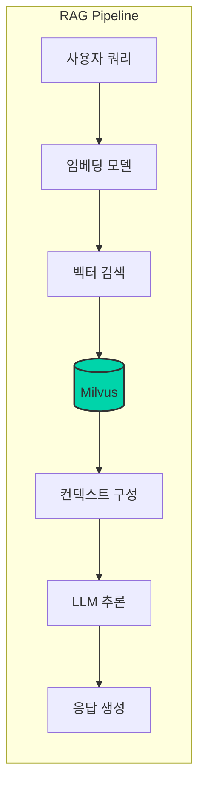
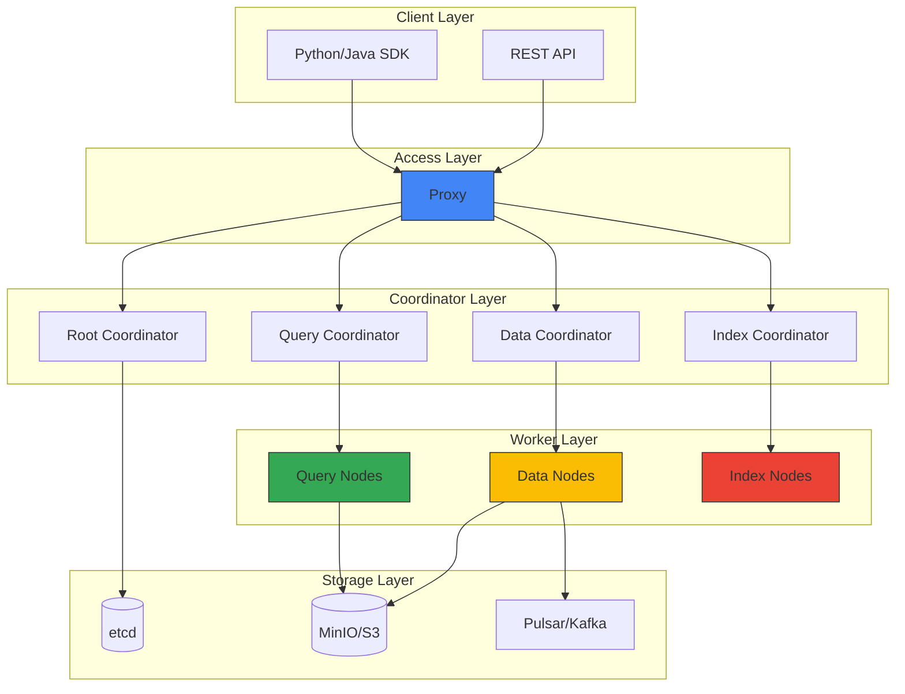

# Milvus 벡터 데이터베이스 통합

Milvus는 대규모 벡터 유사도 검색을 위한 오픈소스 벡터 데이터베이스입니다. Agentic AI 플랫폼에서 RAG(Retrieval-Augmented Generation) 파이프라인의 핵심 컴포넌트로 활용됩니다.

## 개요

### Milvus가 필요한 이유

Agentic AI 시스템에서 벡터 데이터베이스는 다음과 같은 역할을 수행합니다:

- **지식 저장소**: 문서, FAQ, 제품 정보 등을 임베딩 벡터로 저장
- **의미 기반 검색**: 키워드가 아닌 의미적 유사성 기반 검색
- **컨텍스트 제공**: LLM에 관련 정보를 제공하여 환각(hallucination) 감소
- **장기 메모리**: Agent의 대화 히스토리 및 학습 내용 저장



## Milvus 클러스터 아키텍처

### 분산 아키텍처 구성요소



### 컴포넌트 역할

| 컴포넌트 | 역할 | 스케일링 |
| --- | --- | --- |
| Proxy | 클라이언트 요청 라우팅 | 수평 확장 |
| Query Node | 벡터 검색 수행 | 수평 확장 |
| Data Node | 데이터 삽입/삭제 처리 | 수평 확장 |
| Index Node | 인덱스 빌드 | 수평 확장 |
| etcd | 메타데이터 저장 | 3-5 노드 클러스터 |
| MinIO/S3 | 벡터 데이터 저장 | 무제한 |

## EKS 배포 가이드

### Helm 차트를 통한 설치

```bash
# Milvus Helm 저장소 추가
helm repo add milvus https://zilliztech.github.io/milvus-helm/
helm repo update

# 네임스페이스 생성
kubectl create namespace ai-data

# 프로덕션 설정으로 설치
helm install milvus milvus/milvus \
  --namespace ai-data \
  --set cluster.enabled=true \
  --set etcd.replicaCount=3 \
  --set minio.mode=distributed \
  --set pulsar.enabled=true \
  -f milvus-values.yaml
```

### 프로덕션 values.yaml 설정

```yaml
# milvus-values.yaml
cluster:
  enabled: true

# Proxy 설정
proxy:
  replicas: 2
  resources:
    requests:
      cpu: "1"
      memory: "2Gi"
    limits:
      cpu: "2"
      memory: "4Gi"

# Query Node 설정 - 검색 성능에 직접 영향
queryNode:
  replicas: 3
  resources:
    requests:
      cpu: "2"
      memory: "8Gi"
    limits:
      cpu: "4"
      memory: "16Gi"
  # GPU 가속 활성화 (선택사항)
  # gpu:
  #   enabled: true

# Data Node 설정
dataNode:
  replicas: 2
  resources:
    requests:
      cpu: "1"
      memory: "4Gi"
    limits:
      cpu: "2"
      memory: "8Gi"

# Index Node 설정
indexNode:
  replicas: 2
  resources:
    requests:
      cpu: "2"
      memory: "8Gi"
    limits:
      cpu: "4"
      memory: "16Gi"

# etcd 클러스터 설정
etcd:
  replicaCount: 3
  persistence:
    enabled: true
    storageClass: "gp3"
    size: 20Gi

# MinIO 분산 모드 설정
minio:
  mode: distributed
  replicas: 4
  persistence:
    enabled: true
    storageClass: "gp3"
    size: 100Gi

# Pulsar 메시지 큐 설정
pulsar:
  enabled: true
  components:
    autorecovery: true
  bookkeeper:
    replicaCount: 3
  broker:
    replicaCount: 2
```

### Amazon S3를 스토리지로 사용

MinIO 대신 Amazon S3를 직접 사용하면 운영 부담을 줄일 수 있습니다:

```yaml
# milvus-s3-values.yaml
externalS3:
  enabled: true
  host: "s3.ap-northeast-2.amazonaws.com"
  port: "443"
  useSSL: true
  bucketName: "milvus-data-bucket"
  useIAM: true  # IRSA 사용
  cloudProvider: "aws"

minio:
  enabled: false  # MinIO 비활성화

# IRSA를 위한 ServiceAccount 설정
serviceAccount:
  create: true
  annotations:
    eks.amazonaws.com/role-arn: "arn:aws:iam::XXXXXXXXXXXX:role/MilvusS3Role"
```

:::tip S3 IAM 정책
```json
{
  "Version": "2012-10-17",
  "Statement": [
    {
      "Effect": "Allow",
      "Action": [
        "s3:GetObject",
        "s3:PutObject",
        "s3:DeleteObject",
        "s3:ListBucket"
      ],
      "Resource": [
        "arn:aws:s3:::milvus-data-bucket",
        "arn:aws:s3:::milvus-data-bucket/*"
      ]
    }
  ]
}
```
:::

## 인덱스 타입 선택 가이드

### 주요 인덱스 타입 비교

| 인덱스 타입 | 검색 속도 | 정확도 | 메모리 사용 | 적합한 사용 사례 |
| --- | --- | --- | --- | --- |
| FLAT | 느림 | 100% | 높음 | 소규모 데이터, 정확도 중요 |
| IVF_FLAT | 빠름 | 높음 | 중간 | 일반적인 사용 사례 |
| IVF_SQ8 | 매우 빠름 | 중간 | 낮음 | 대규모 데이터, 메모리 제한 |
| HNSW | 매우 빠름 | 높음 | 높음 | 실시간 검색, 고성능 필요 |
| DISKANN | 빠름 | 높음 | 매우 낮음 | 초대규모 데이터 |

### 인덱스 생성 예제

```python
from pymilvus import Collection, CollectionSchema, FieldSchema, DataType

# 컬렉션 스키마 정의
fields = [
    FieldSchema(name="id", dtype=DataType.INT64, is_primary=True, auto_id=True),
    FieldSchema(name="text", dtype=DataType.VARCHAR, max_length=65535),
    FieldSchema(name="embedding", dtype=DataType.FLOAT_VECTOR, dim=1536),
    FieldSchema(name="metadata", dtype=DataType.JSON),
]

schema = CollectionSchema(fields=fields, description="Document embeddings")
collection = Collection(name="documents", schema=schema)

# HNSW 인덱스 생성 (고성능 검색용)
index_params = {
    "metric_type": "COSINE",
    "index_type": "HNSW",
    "params": {
        "M": 16,           # 그래프 연결 수 (높을수록 정확, 메모리 증가)
        "efConstruction": 256  # 인덱스 빌드 품질 (높을수록 정확, 빌드 시간 증가)
    }
}

collection.create_index(field_name="embedding", index_params=index_params)
collection.load()
```

## LangChain/LlamaIndex 통합

### LangChain 통합 예제

```python
from langchain_community.vectorstores import Milvus
from langchain_openai import OpenAIEmbeddings
from langchain.text_splitter import RecursiveCharacterTextSplitter
from langchain_community.document_loaders import DirectoryLoader

# 문서 로드 및 분할
loader = DirectoryLoader("./documents", glob="**/*.md")
documents = loader.load()

text_splitter = RecursiveCharacterTextSplitter(
    chunk_size=1000,
    chunk_overlap=200,
    length_function=len,
)
splits = text_splitter.split_documents(documents)

# 임베딩 모델 설정
embeddings = OpenAIEmbeddings(model="text-embedding-3-small")

# Milvus 벡터 스토어 생성
vectorstore = Milvus.from_documents(
    documents=splits,
    embedding=embeddings,
    connection_args={
        "host": "milvus-proxy.ai-data.svc.cluster.local",
        "port": "19530",
    },
    collection_name="langchain_docs",
    drop_old=True,
)

# 유사도 검색
query = "Kubernetes에서 GPU 스케줄링하는 방법"
docs = vectorstore.similarity_search(query, k=5)

for doc in docs:
    print(f"Content: {doc.page_content[:200]}...")
    print(f"Metadata: {doc.metadata}")
    print("---")
```

### LlamaIndex 통합 예제

```python
from llama_index.core import VectorStoreIndex, SimpleDirectoryReader, Settings
from llama_index.vector_stores.milvus import MilvusVectorStore
from llama_index.embeddings.openai import OpenAIEmbedding

# 임베딩 모델 설정
Settings.embed_model = OpenAIEmbedding(model="text-embedding-3-small")

# Milvus 벡터 스토어 설정
vector_store = MilvusVectorStore(
    uri="http://milvus-proxy.ai-data.svc.cluster.local:19530",
    collection_name="llamaindex_docs",
    dim=1536,
    overwrite=True,
)

# 문서 로드 및 인덱싱
documents = SimpleDirectoryReader("./documents").load_data()
index = VectorStoreIndex.from_documents(
    documents,
    vector_store=vector_store,
)

# 쿼리 엔진 생성
query_engine = index.as_query_engine(similarity_top_k=5)

# 질의 수행
response = query_engine.query("Agentic AI 플랫폼 아키텍처 설명해줘")
print(response)
```

### RAG 파이프라인 전체 구성

```python
from langchain_openai import ChatOpenAI
from langchain.chains import RetrievalQA
from langchain.prompts import PromptTemplate

# LLM 설정
llm = ChatOpenAI(
    model="gpt-4-turbo-preview",
    temperature=0,
)

# 프롬프트 템플릿
prompt_template = """다음 컨텍스트를 사용하여 질문에 답변하세요.
컨텍스트에 답변이 없으면 "정보가 없습니다"라고 말하세요.

컨텍스트:
{context}

질문: {question}

답변:"""

PROMPT = PromptTemplate(
    template=prompt_template,
    input_variables=["context", "question"]
)

# RAG 체인 구성
qa_chain = RetrievalQA.from_chain_type(
    llm=llm,
    chain_type="stuff",
    retriever=vectorstore.as_retriever(
        search_type="mmr",  # Maximum Marginal Relevance
        search_kwargs={"k": 5, "fetch_k": 10}
    ),
    chain_type_kwargs={"prompt": PROMPT},
    return_source_documents=True,
)

# 질의 수행
result = qa_chain.invoke({"query": "GPU 리소스 관리 방법은?"})
print(f"Answer: {result['result']}")
print(f"Sources: {[doc.metadata for doc in result['source_documents']]}")
```

## 쿼리 최적화

### 검색 파라미터 튜닝

```python
# 검색 파라미터 설정
search_params = {
    "metric_type": "COSINE",
    "params": {
        "ef": 128,  # HNSW 검색 범위 (높을수록 정확, 느림)
    }
}

# 필터링과 함께 검색
results = collection.search(
    data=[query_embedding],
    anns_field="embedding",
    param=search_params,
    limit=10,
    expr='metadata["category"] == "kubernetes"',  # 메타데이터 필터
    output_fields=["text", "metadata"],
)
```

### 하이브리드 검색 (벡터 + 키워드)

```python
from pymilvus import AnnSearchRequest, RRFRanker

# 벡터 검색 요청
vector_search = AnnSearchRequest(
    data=[query_embedding],
    anns_field="embedding",
    param={"metric_type": "COSINE", "params": {"ef": 64}},
    limit=20
)

# 키워드 검색을 위한 BM25 스코어 (별도 필드 필요)
# Milvus 2.4+ 에서 지원

# RRF(Reciprocal Rank Fusion)로 결과 병합
results = collection.hybrid_search(
    reqs=[vector_search],
    ranker=RRFRanker(k=60),
    limit=10,
    output_fields=["text", "metadata"]
)
```

## 고가용성 및 백업

### 데이터 백업 전략

```bash
# Milvus 백업 도구 설치
pip install milvus-backup

# 백업 설정 파일
cat > backup_config.yaml << EOF
milvus:
  address: milvus-proxy.milvus.svc.cluster.local
  port: 19530

minio:
  address: minio.milvus.svc.cluster.local
  port: 9000
  accessKeyID: minioadmin
  secretAccessKey: minioadmin
  bucketName: milvus-backup
  useSSL: false

backup:
  maxSegmentGroupSize: 2G
EOF

# 백업 실행
milvus-backup create -n daily_backup -c backup_config.yaml
```

### 재해 복구 구성

```yaml
# 크로스 리전 복제를 위한 설정
apiVersion: batch/v1
kind: CronJob
metadata:
  name: milvus-backup-sync
  namespace: ai-data
spec:
  schedule: "0 */6 * * *"  # 6시간마다
  jobTemplate:
    spec:
      template:
        spec:
          containers:
          - name: backup-sync
            image: amazon/aws-cli:latest
            command:
            - /bin/sh
            - -c
            - |
              # 백업을 다른 리전 S3로 복제
              aws s3 sync s3://milvus-backup-primary s3://milvus-backup-dr \
                --source-region ap-northeast-2 \
                --region us-west-2
          restartPolicy: OnFailure
          serviceAccountName: milvus-backup-sa
```

## 모니터링 및 메트릭

### Prometheus 메트릭 수집

```yaml
apiVersion: monitoring.coreos.com/v1
kind: ServiceMonitor
metadata:
  name: milvus-monitor
  namespace: ai-data
spec:
  selector:
    matchLabels:
      app.kubernetes.io/name: milvus
  endpoints:
  - port: metrics
    interval: 30s
    path: /metrics
```

### 주요 모니터링 메트릭

| 메트릭 | 설명 | 임계값 |
| --- | --- | --- |
| milvus_proxy_search_latency | 검색 지연 시간 | < 100ms |
| milvus_querynode_search_nq | 초당 검색 쿼리 수 | 모니터링 |
| milvus_datanode_flush_duration | 데이터 플러시 시간 | < 5s |
| milvus_indexnode_build_duration | 인덱스 빌드 시간 | 모니터링 |

### Grafana 대시보드

```json
{
  "dashboard": {
    "title": "Milvus Performance",
    "panels": [
      {
        "title": "Search Latency P99",
        "type": "graph",
        "targets": [
          {
            "expr": "histogram_quantile(0.99, rate(milvus_proxy_search_latency_bucket[5m]))",
            "legendFormat": "P99 Latency"
          }
        ]
      },
      {
        "title": "Query Throughput",
        "type": "graph",
        "targets": [
          {
            "expr": "sum(rate(milvus_proxy_search_vectors_count[5m]))",
            "legendFormat": "Vectors/sec"
          }
        ]
      }
    ]
  }
}
```

## 관련 문서

- [Agentic AI 플랫폼 아키텍처](./agentic-platform-architecture.md)
- [Ragas RAG 평가 프레임워크](./ragas-evaluation.md)
- [Agent 모니터링](./agent-monitoring.md)

:::info 권장 사항
- 프로덕션 환경에서는 최소 3개의 Query Node를 운영하세요
- 대규모 데이터셋(1억+ 벡터)에서는 DISKANN 인덱스를 고려하세요
- S3를 스토리지로 사용하면 운영 복잡도를 크게 줄일 수 있습니다
:::

:::warning 주의사항
- 인덱스 빌드는 CPU/메모리를 많이 사용하므로 별도 시간대에 수행하세요
- 컬렉션 삭제 시 데이터가 영구 삭제되므로 백업을 먼저 확인하세요
:::
