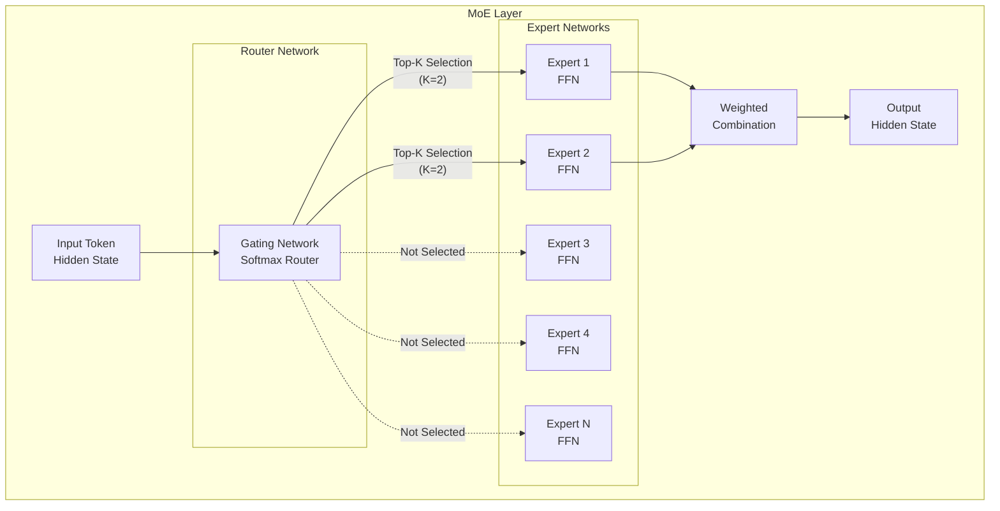
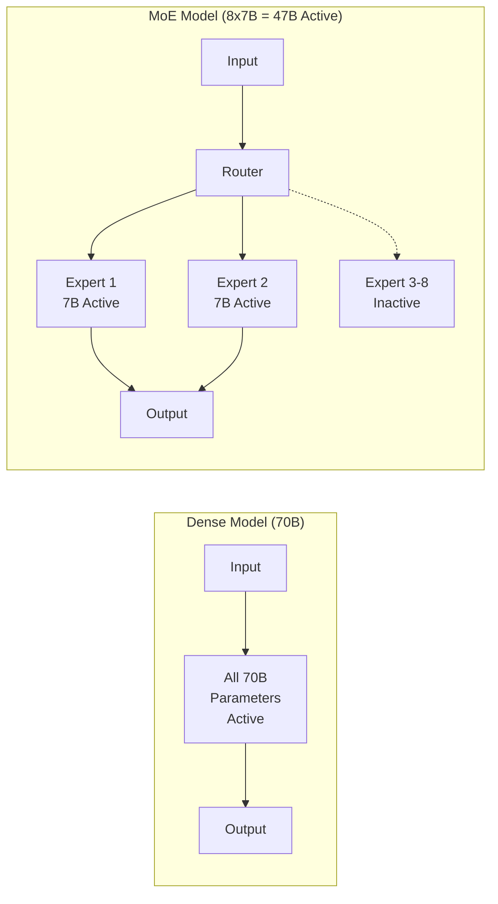
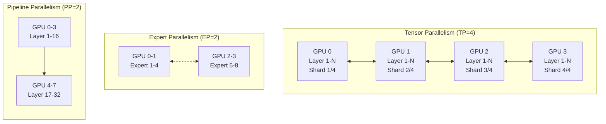
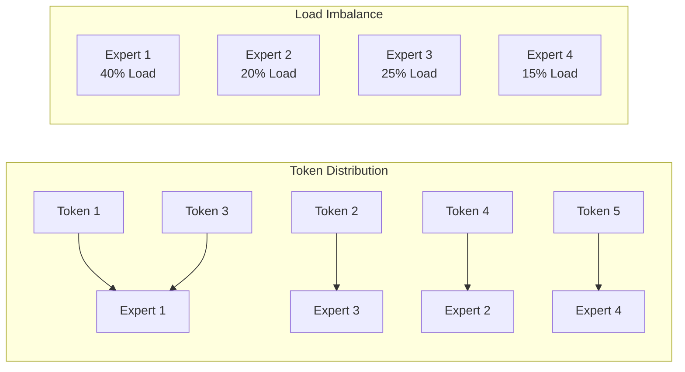
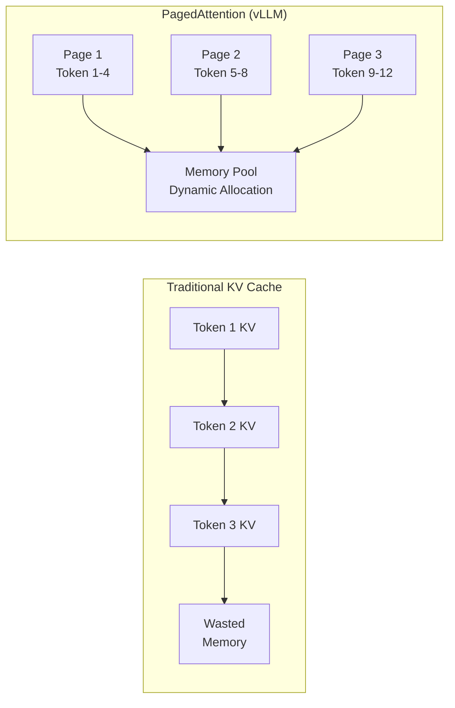
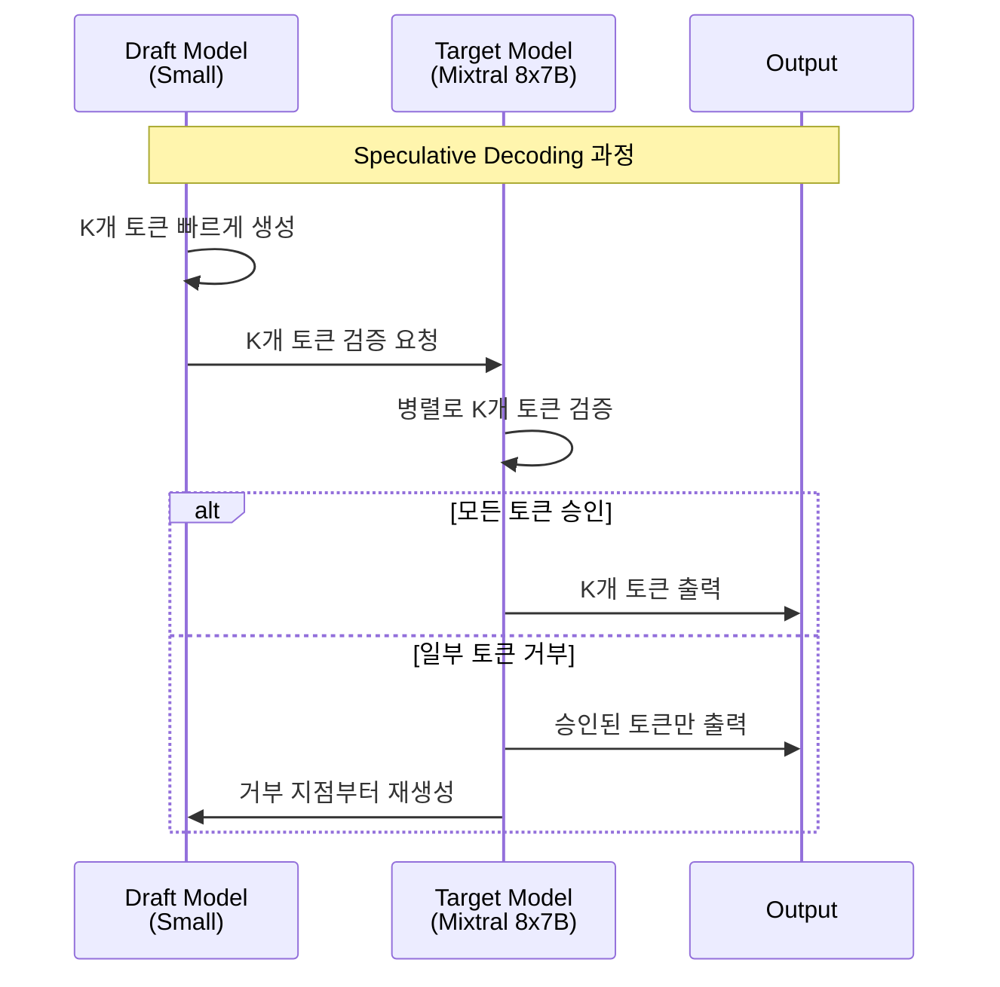

# MoE 모델 서빙 가이드

> 📅 **작성일**: 2025-02-05 | ⏱️ **읽는 시간**: 약 12분

## 개요

Mixture of Experts(MoE) 모델은 대규모 언어 모델의 효율성을 극대화하는 혁신적인 아키텍처입니다. 이 문서에서는 Amazon EKS 환경에서 Mixtral, DeepSeek-MoE, Qwen-MoE 등의 MoE 모델을 효율적으로 배포하고 운영하는 방법을 다룹니다.

### 주요 목표

- **MoE 아키텍처 이해**: Expert 네트워크와 라우팅 메커니즘의 동작 원리
- **효율적인 배포**: vLLM 및 TGI를 활용한 최적화된 MoE 모델 서빙
- **리소스 최적화**: GPU 메모리 관리 및 분산 배포 전략
- **성능 튜닝**: KV Cache, Speculative Decoding 등 고급 최적화 기법

---

## MoE 아키텍처 이해

### Expert 네트워크 구조

MoE 모델은 여러 개의 "Expert" 네트워크와 이를 선택하는 "Router(Gate)" 네트워크로 구성됩니다.



### 라우팅 메커니즘

MoE 모델의 핵심은 입력 토큰에 따라 적절한 Expert를 선택하는 라우팅 메커니즘입니다.

| 라우팅 방식 | 설명 | 대표 모델 |
| --- | --- | --- |
| Top-K Routing | 상위 K개의 Expert만 활성화 | Mixtral (K=2) |
| Expert Choice | Expert가 처리할 토큰을 선택 | Switch Transformer |
| Soft MoE | 모든 Expert에 가중치 분배 | Soft MoE |
| Hash Routing | 해시 기반 결정적 라우팅 | Hash Layers |

:::info 라우팅 동작 원리

1. **Gate 계산**: 입력 토큰의 hidden state를 Gate 네트워크에 통과
2. **Expert 선택**: Softmax 출력에서 Top-K Expert 선택
3. **병렬 처리**: 선택된 Expert들이 병렬로 입력 처리
4. **가중 합산**: Expert 출력을 Gate 가중치로 결합

:::

### MoE vs Dense 모델 비교

| 특성 | Dense 모델 | MoE 모델 |
| --- | --- | --- |
| 파라미터 활성화 | 100% (전체) | 10-25% (일부 Expert) |
| 추론 연산량 | 높음 | 상대적으로 낮음 |
| 메모리 요구량 | 파라미터 수에 비례 | 전체 파라미터 로드 필요 |
| 학습 효율성 | 표준 | 더 많은 데이터로 효율적 학습 |
| 확장성 | 선형 증가 | Expert 추가로 효율적 확장 |



:::tip MoE 모델의 장점

- **연산 효율성**: 전체 파라미터의 일부만 활성화하여 추론 속도 향상
- **확장성**: Expert 추가로 모델 용량 확장 가능
- **전문화**: 각 Expert가 특정 도메인/태스크에 특화

:::

---

## MoE 모델 서빙 고려사항

### GPU 메모리 요구사항

MoE 모델은 활성화되는 파라미터는 적지만, 전체 Expert를 메모리에 로드해야 합니다.

| 모델 | 총 파라미터 | 활성 파라미터 | FP16 메모리 | INT8 메모리 | 권장 GPU |
| --- | --- | --- | --- | --- | --- |
| Mixtral 8x7B | 46.7B | 12.9B | ~94GB | ~47GB | 2x A100 80GB |
| Mixtral 8x22B | 141B | 39B | ~282GB | ~141GB | 4x H100 80GB |
| DeepSeek-MoE 16B | 16.4B | 2.8B | ~33GB | ~17GB | 1x A100 40GB |
| Qwen1.5-MoE-A2.7B | 14.3B | 2.7B | ~29GB | ~15GB | 1x A100 40GB |
| DBRX | 132B | 36B | ~264GB | ~132GB | 4x H100 80GB |

:::warning 메모리 계산 시 주의사항

- **KV Cache**: 배치 크기와 시퀀스 길이에 따라 추가 메모리 필요
- **Activation Memory**: 추론 중 중간 활성화 값 저장 공간
- **CUDA Context**: GPU당 약 1-2GB의 CUDA 오버헤드
- **Safety Margin**: 실제 운영 시 10-20% 여유 공간 확보 권장

:::

### 분산 배포 전략

대규모 MoE 모델은 단일 GPU에 로드할 수 없어 분산 배포가 필수입니다.



| 병렬화 전략 | 설명 | 장점 | 단점 |
| --- | --- | --- | --- |
| Tensor Parallelism (TP) | 레이어 내 텐서를 GPU 간 분할 | 낮은 지연시간 | 높은 통신 오버헤드 |
| Expert Parallelism (EP) | Expert를 GPU 간 분산 | MoE에 최적화 | All-to-All 통신 필요 |
| Pipeline Parallelism (PP) | 레이어를 GPU 간 순차 분할 | 메모리 효율적 | 파이프라인 버블 발생 |

### Expert 활성화 패턴

MoE 모델의 성능 최적화를 위해 Expert 활성화 패턴을 이해해야 합니다.



:::info Expert 로드 밸런싱

- **Auxiliary Loss**: 학습 시 Expert 간 균등 분배를 유도하는 보조 손실
- **Capacity Factor**: Expert당 처리 가능한 최대 토큰 수 제한
- **Token Dropping**: 용량 초과 시 토큰 드롭 (추론 시 비활성화 권장)

:::

---

## vLLM 기반 MoE 배포

### vLLM MoE 지원 기능

vLLM은 MoE 모델에 대해 다음과 같은 최적화를 제공합니다:

- **Expert Parallelism**: 다중 GPU에 Expert 분산
- **Tensor Parallelism**: 레이어 내 텐서 분할
- **PagedAttention**: 효율적인 KV Cache 관리
- **Continuous Batching**: 동적 배치 처리

### Mixtral 8x7B Deployment YAML

```yaml
apiVersion: apps/v1
kind: Deployment
metadata:
  name: mixtral-8x7b-vllm
  namespace: inference
  labels:
    app: mixtral-8x7b
    serving-engine: vllm
spec:
  replicas: 1
  selector:
    matchLabels:
      app: mixtral-8x7b
  template:
    metadata:
      labels:
        app: mixtral-8x7b
        serving-engine: vllm
    spec:
      nodeSelector:
        node.kubernetes.io/instance-type: p4d.24xlarge
      tolerations:
        - key: nvidia.com/gpu
          operator: Exists
          effect: NoSchedule
      containers:
        - name: vllm
          image: vllm/vllm-openai:v0.6.0
          ports:
            - name: http
              containerPort: 8000
              protocol: TCP
          env:
            - name: HUGGING_FACE_HUB_TOKEN
              valueFrom:
                secretKeyRef:
                  name: hf-token
                  key: token
            - name: VLLM_ATTENTION_BACKEND
              value: "FLASH_ATTN"
          args:
            - "--model"
            - "mistralai/Mixtral-8x7B-Instruct-v0.1"
            - "--tensor-parallel-size"
            - "2"
            - "--max-model-len"
            - "32768"
            - "--gpu-memory-utilization"
            - "0.90"
            - "--enable-chunked-prefill"
            - "--max-num-batched-tokens"
            - "32768"
            - "--trust-remote-code"
            - "--dtype"
            - "bfloat16"
          resources:
            requests:
              nvidia.com/gpu: 2
              memory: "180Gi"
              cpu: "24"
            limits:
              nvidia.com/gpu: 2
              memory: "200Gi"
              cpu: "32"
          volumeMounts:
            - name: model-cache
              mountPath: /root/.cache/huggingface
            - name: shm
              mountPath: /dev/shm
          livenessProbe:
            httpGet:
              path: /health
              port: 8000
            initialDelaySeconds: 300
            periodSeconds: 30
            timeoutSeconds: 10
          readinessProbe:
            httpGet:
              path: /health
              port: 8000
            initialDelaySeconds: 120
            periodSeconds: 10
            timeoutSeconds: 5
      volumes:
        - name: model-cache
          persistentVolumeClaim:
            claimName: model-cache-pvc
        - name: shm
          emptyDir:
            medium: Memory
            sizeLimit: 16Gi
      terminationGracePeriodSeconds: 120
```

### Mixtral 8x22B 대규모 배포 (4 GPU)

```yaml
apiVersion: apps/v1
kind: Deployment
metadata:
  name: mixtral-8x22b-vllm
  namespace: inference
  labels:
    app: mixtral-8x22b
    serving-engine: vllm
spec:
  replicas: 1
  selector:
    matchLabels:
      app: mixtral-8x22b
  template:
    metadata:
      labels:
        app: mixtral-8x22b
        serving-engine: vllm
    spec:
      nodeSelector:
        node.kubernetes.io/instance-type: p5.48xlarge
      tolerations:
        - key: nvidia.com/gpu
          operator: Exists
          effect: NoSchedule
      containers:
        - name: vllm
          image: vllm/vllm-openai:v0.6.0
          ports:
            - name: http
              containerPort: 8000
          env:
            - name: HUGGING_FACE_HUB_TOKEN
              valueFrom:
                secretKeyRef:
                  name: hf-token
                  key: token
            - name: NCCL_DEBUG
              value: "INFO"
            - name: NCCL_IB_DISABLE
              value: "0"
          args:
            - "--model"
            - "mistralai/Mixtral-8x22B-Instruct-v0.1"
            - "--tensor-parallel-size"
            - "4"
            - "--max-model-len"
            - "65536"
            - "--gpu-memory-utilization"
            - "0.92"
            - "--enable-chunked-prefill"
            - "--max-num-batched-tokens"
            - "65536"
            - "--dtype"
            - "bfloat16"
            - "--enforce-eager"
          resources:
            requests:
              nvidia.com/gpu: 4
              memory: "400Gi"
              cpu: "48"
            limits:
              nvidia.com/gpu: 4
              memory: "500Gi"
              cpu: "64"
          volumeMounts:
            - name: model-cache
              mountPath: /root/.cache/huggingface
            - name: shm
              mountPath: /dev/shm
      volumes:
        - name: model-cache
          persistentVolumeClaim:
            claimName: model-cache-pvc
        - name: shm
          emptyDir:
            medium: Memory
            sizeLimit: 32Gi
```

### vLLM 텐서 병렬화 설정

텐서 병렬화(Tensor Parallelism)는 모델의 각 레이어를 여러 GPU에 분할합니다.

| 모델 | 권장 TP 크기 | GPU 구성 | 메모리/GPU |
| --- | --- | --- | --- |
| Mixtral 8x7B | 2 | 2x A100 80GB | ~47GB |
| Mixtral 8x22B | 4 | 4x H100 80GB | ~70GB |
| DeepSeek-MoE 16B | 1 | 1x A100 40GB | ~33GB |
| DBRX | 4-8 | 4-8x H100 80GB | ~33-66GB |

:::tip 텐서 병렬화 최적화

- **NVLink 활용**: GPU 간 고속 통신을 위해 NVLink 지원 인스턴스 사용
- **TP 크기 선택**: 모델 크기와 GPU 메모리에 따라 최소 TP 크기 선택
- **통신 오버헤드**: TP 크기가 클수록 All-Reduce 통신 증가

:::

### vLLM Expert 병렬화 설정

Expert 병렬화(Expert Parallelism)는 MoE 모델의 Expert를 여러 GPU에 분산합니다.

```yaml
# Expert Parallelism 활성화 예제
args:
  - "--model"
  - "mistralai/Mixtral-8x7B-Instruct-v0.1"
  - "--tensor-parallel-size"
  - "2"
  # Expert Parallelism은 vLLM에서 자동으로 최적화됨
  # TP 내에서 Expert가 분산 배치됨
  - "--distributed-executor-backend"
  - "ray"  # 또는 "mp" (multiprocessing)
```

---

## TGI 기반 MoE 배포

### TGI MoE 지원 기능

Text Generation Inference(TGI)는 Hugging Face에서 개발한 고성능 추론 서버입니다.

- **Flash Attention 2**: 메모리 효율적인 어텐션 연산
- **Paged Attention**: 동적 KV Cache 관리
- **Tensor Parallelism**: 다중 GPU 분산 추론
- **Quantization**: AWQ, GPTQ, EETQ 지원

### TGI Mixtral 8x7B Deployment YAML

```yaml
apiVersion: apps/v1
kind: Deployment
metadata:
  name: mixtral-8x7b-tgi
  namespace: inference
  labels:
    app: mixtral-8x7b
    serving-engine: tgi
spec:
  replicas: 1
  selector:
    matchLabels:
      app: mixtral-8x7b-tgi
  template:
    metadata:
      labels:
        app: mixtral-8x7b-tgi
        serving-engine: tgi
    spec:
      nodeSelector:
        node.kubernetes.io/instance-type: p4d.24xlarge
      tolerations:
        - key: nvidia.com/gpu
          operator: Exists
          effect: NoSchedule
      containers:
        - name: tgi
          image: ghcr.io/huggingface/text-generation-inference:2.3.0
          ports:
            - name: http
              containerPort: 8080
              protocol: TCP
          env:
            - name: HUGGING_FACE_HUB_TOKEN
              valueFrom:
                secretKeyRef:
                  name: hf-token
                  key: token
            - name: MODEL_ID
              value: "mistralai/Mixtral-8x7B-Instruct-v0.1"
            - name: NUM_SHARD
              value: "2"
            - name: MAX_INPUT_LENGTH
              value: "8192"
            - name: MAX_TOTAL_TOKENS
              value: "32768"
            - name: MAX_BATCH_PREFILL_TOKENS
              value: "32768"
            - name: DTYPE
              value: "bfloat16"
            - name: QUANTIZE
              value: ""  # 또는 "awq", "gptq"
            - name: TRUST_REMOTE_CODE
              value: "true"
          resources:
            requests:
              nvidia.com/gpu: 2
              memory: "180Gi"
              cpu: "24"
            limits:
              nvidia.com/gpu: 2
              memory: "200Gi"
              cpu: "32"
          volumeMounts:
            - name: model-cache
              mountPath: /data
            - name: shm
              mountPath: /dev/shm
          livenessProbe:
            httpGet:
              path: /health
              port: 8080
            initialDelaySeconds: 300
            periodSeconds: 30
          readinessProbe:
            httpGet:
              path: /health
              port: 8080
            initialDelaySeconds: 120
            periodSeconds: 10
      volumes:
        - name: model-cache
          persistentVolumeClaim:
            claimName: model-cache-pvc
        - name: shm
          emptyDir:
            medium: Memory
            sizeLimit: 16Gi
```

### TGI 양자화 배포 (AWQ)

메모리 효율을 위해 AWQ 양자화된 모델을 사용할 수 있습니다.

```yaml
apiVersion: apps/v1
kind: Deployment
metadata:
  name: mixtral-8x7b-tgi-awq
  namespace: inference
spec:
  replicas: 1
  selector:
    matchLabels:
      app: mixtral-8x7b-tgi-awq
  template:
    metadata:
      labels:
        app: mixtral-8x7b-tgi-awq
    spec:
      nodeSelector:
        node.kubernetes.io/instance-type: g5.48xlarge
      tolerations:
        - key: nvidia.com/gpu
          operator: Exists
          effect: NoSchedule
      containers:
        - name: tgi
          image: ghcr.io/huggingface/text-generation-inference:2.3.0
          ports:
            - name: http
              containerPort: 8080
          env:
            - name: HUGGING_FACE_HUB_TOKEN
              valueFrom:
                secretKeyRef:
                  name: hf-token
                  key: token
            - name: MODEL_ID
              value: "TheBloke/Mixtral-8x7B-Instruct-v0.1-AWQ"
            - name: NUM_SHARD
              value: "2"
            - name: MAX_INPUT_LENGTH
              value: "8192"
            - name: MAX_TOTAL_TOKENS
              value: "16384"
            - name: QUANTIZE
              value: "awq"
          resources:
            requests:
              nvidia.com/gpu: 2
              memory: "90Gi"
              cpu: "16"
            limits:
              nvidia.com/gpu: 2
              memory: "120Gi"
              cpu: "24"
```

### vLLM vs TGI 성능 비교

| 특성 | vLLM | TGI |
| --- | --- | --- |
| 처리량 (tokens/s) | 높음 | 중상 |
| 지연시간 (TTFT) | 낮음 | 중간 |
| 메모리 효율성 | 매우 높음 (PagedAttention) | 높음 |
| MoE 최적화 | 우수 | 양호 |
| 양자화 지원 | AWQ, GPTQ, SqueezeLLM | AWQ, GPTQ, EETQ |
| API 호환성 | OpenAI 호환 | 자체 API + OpenAI 호환 |
| 커뮤니티 | 활발 | 활발 |

:::tip 추론 엔진 선택 가이드

- **vLLM**: 최고 처리량이 필요한 경우, 대규모 배치 처리
- **TGI**: Hugging Face 생태계 통합, 간편한 배포
- **공통**: 두 엔진 모두 MoE 모델을 잘 지원하며, 워크로드에 따라 선택

:::

---

## Service 및 Ingress 설정

### MoE 모델 Service YAML

```yaml
apiVersion: v1
kind: Service
metadata:
  name: mixtral-8x7b-service
  namespace: inference
  labels:
    app: mixtral-8x7b
spec:
  type: ClusterIP
  ports:
    - name: http
      port: 8000
      targetPort: 8000
      protocol: TCP
  selector:
    app: mixtral-8x7b
---
apiVersion: v1
kind: Service
metadata:
  name: mixtral-8x7b-tgi-service
  namespace: inference
  labels:
    app: mixtral-8x7b-tgi
spec:
  type: ClusterIP
  ports:
    - name: http
      port: 8080
      targetPort: 8080
      protocol: TCP
  selector:
    app: mixtral-8x7b-tgi
```

### Gateway API HTTPRoute 설정

```yaml
apiVersion: gateway.networking.k8s.io/v1
kind: HTTPRoute
metadata:
  name: moe-model-route
  namespace: inference
spec:
  parentRefs:
    - name: inference-gateway
      namespace: gateway-system
  hostnames:
    - "inference.example.com"
  rules:
    - matches:
        - path:
            type: PathPrefix
            value: /v1/mixtral
      backendRefs:
        - name: mixtral-8x7b-service
          port: 8000
      filters:
        - type: URLRewrite
          urlRewrite:
            path:
              type: ReplacePrefixMatch
              replacePrefixMatch: /v1
    - matches:
        - path:
            type: PathPrefix
            value: /v1/mixtral-tgi
      backendRefs:
        - name: mixtral-8x7b-tgi-service
          port: 8080
```

---

## 성능 최적화

### KV Cache 최적화

KV Cache는 추론 성능에 큰 영향을 미치는 핵심 요소입니다.



#### vLLM KV Cache 설정

```yaml
args:
  - "--model"
  - "mistralai/Mixtral-8x7B-Instruct-v0.1"
  # GPU 메모리 중 KV Cache에 할당할 비율
  - "--gpu-memory-utilization"
  - "0.90"
  # 최대 시퀀스 길이 (KV Cache 크기에 영향)
  - "--max-model-len"
  - "32768"
  # Chunked Prefill로 메모리 효율 향상
  - "--enable-chunked-prefill"
  # 배치당 최대 토큰 수
  - "--max-num-batched-tokens"
  - "32768"
```

| 파라미터 | 설명 | 권장값 |
| --- | --- | --- |
| `gpu-memory-utilization` | GPU 메모리 사용 비율 | 0.85-0.92 |
| `max-model-len` | 최대 컨텍스트 길이 | 모델 지원 범위 내 |
| `max-num-batched-tokens` | 배치당 최대 토큰 | 메모리에 따라 조정 |
| `enable-chunked-prefill` | Chunked Prefill 활성화 | 권장 |

### Speculative Decoding

Speculative Decoding은 작은 드래프트 모델을 사용하여 추론 속도를 향상시킵니다.



#### vLLM Speculative Decoding 설정

```yaml
args:
  - "--model"
  - "mistralai/Mixtral-8x7B-Instruct-v0.1"
  - "--tensor-parallel-size"
  - "2"
  # Speculative Decoding 활성화
  - "--speculative-model"
  - "mistralai/Mistral-7B-Instruct-v0.2"
  # 드래프트 모델이 생성할 토큰 수
  - "--num-speculative-tokens"
  - "5"
  # 드래프트 모델 텐서 병렬 크기
  - "--speculative-draft-tensor-parallel-size"
  - "1"
```

:::info Speculative Decoding 효과

- **속도 향상**: 1.5x - 2.5x 처리량 증가 (워크로드에 따라 다름)
- **품질 유지**: 출력 품질은 동일 (검증 과정으로 보장)
- **추가 메모리**: 드래프트 모델을 위한 추가 GPU 메모리 필요

:::

### 배치 처리 최적화

효율적인 배치 처리는 GPU 활용률을 극대화합니다.

```yaml
args:
  - "--model"
  - "mistralai/Mixtral-8x7B-Instruct-v0.1"
  # Continuous Batching 관련 설정
  - "--max-num-seqs"
  - "256"  # 동시 처리 가능한 최대 시퀀스 수
  - "--max-num-batched-tokens"
  - "32768"  # 배치당 최대 토큰 수
  # Prefill과 Decode 분리
  - "--enable-chunked-prefill"
  - "--max-num-batched-tokens"
  - "32768"
```

| 최적화 기법 | 설명 | 효과 |
| --- | --- | --- |
| Continuous Batching | 요청을 동적으로 배치에 추가/제거 | 처리량 2-3x 향상 |
| Chunked Prefill | Prefill을 청크로 분할하여 Decode와 병행 | 지연시간 감소 |
| Dynamic SplitFuse | Prefill/Decode 동적 분리 | GPU 활용률 향상 |

---

## 모니터링 및 알림

### MoE 모델 전용 메트릭

```yaml
apiVersion: monitoring.coreos.com/v1
kind: ServiceMonitor
metadata:
  name: moe-model-monitor
  namespace: monitoring
spec:
  selector:
    matchLabels:
      app: mixtral-8x7b
  endpoints:
    - port: http
      path: /metrics
      interval: 15s
  namespaceSelector:
    matchNames:
      - inference
```

### 주요 모니터링 메트릭

| 메트릭 | 설명 | 임계값 |
| --- | --- | --- |
| `vllm:num_requests_running` | 현재 처리 중인 요청 수 | - |
| `vllm:num_requests_waiting` | 대기 중인 요청 수 | > 100 경고 |
| `vllm:gpu_cache_usage_perc` | KV Cache 사용률 | > 95% 경고 |
| `vllm:avg_prompt_throughput_toks_per_s` | 프롬프트 처리량 | - |
| `vllm:avg_generation_throughput_toks_per_s` | 생성 처리량 | - |
| `DCGM_FI_DEV_GPU_UTIL` | GPU 사용률 | > 90% 경고 |
| `DCGM_FI_DEV_FB_USED` | GPU 메모리 사용량 | > 95% 위험 |

### Prometheus 알림 규칙

```yaml
apiVersion: monitoring.coreos.com/v1
kind: PrometheusRule
metadata:
  name: moe-model-alerts
  namespace: monitoring
spec:
  groups:
    - name: moe-model-alerts
      rules:
        - alert: MoEModelHighLatency
          expr: |
            histogram_quantile(0.95, 
              rate(vllm:e2e_request_latency_seconds_bucket[5m])
            ) > 30
          for: 5m
          labels:
            severity: warning
          annotations:
            summary: "MoE 모델 응답 지연 (P95 > 30초)"
            description: "{{ $labels.model_name }} 모델의 P95 지연시간이 30초를 초과했습니다."
            
        - alert: MoEModelKVCacheFull
          expr: vllm:gpu_cache_usage_perc > 0.95
          for: 2m
          labels:
            severity: critical
          annotations:
            summary: "KV Cache 용량 부족"
            description: "KV Cache 사용률이 95%를 초과했습니다. 새 요청이 거부될 수 있습니다."
            
        - alert: MoEModelQueueBacklog
          expr: vllm:num_requests_waiting > 100
          for: 5m
          labels:
            severity: warning
          annotations:
            summary: "요청 대기열 증가"
            description: "대기 중인 요청이 100개를 초과했습니다. 스케일 아웃을 고려하세요."
```

---

## 트러블슈팅

### 일반적인 문제와 해결 방법

#### OOM (Out of Memory) 오류

```bash
# 증상: CUDA out of memory 오류
# 해결 방법:
# 1. gpu-memory-utilization 값 낮추기
--gpu-memory-utilization 0.85

# 2. max-model-len 줄이기
--max-model-len 16384

# 3. 텐서 병렬 크기 늘리기 (더 많은 GPU 사용)
--tensor-parallel-size 4
```

#### 느린 모델 로딩

```bash
# 증상: 모델 로딩에 10분 이상 소요
# 해결 방법:
# 1. 모델 캐시 PVC 사용
# 2. FSx for Lustre 사용으로 빠른 모델 로딩
# 3. 모델 사전 다운로드
```

#### Expert 로드 불균형

```bash
# 증상: 특정 GPU만 높은 사용률
# 해결 방법:
# 1. 배치 크기 증가로 토큰 분산 개선
--max-num-seqs 256

# 2. 다양한 입력으로 Expert 활성화 분산
```

:::warning 디버깅 팁

- **로그 레벨 조정**: `VLLM_LOGGING_LEVEL=DEBUG` 환경 변수로 상세 로그 확인
- **NCCL 디버그**: `NCCL_DEBUG=INFO`로 GPU 간 통신 문제 진단
- **메모리 프로파일링**: `nvidia-smi dmon`으로 실시간 GPU 메모리 모니터링

:::

---

## 요약

MoE 모델 서빙은 대규모 언어 모델의 효율적인 배포를 가능하게 합니다.

### 핵심 포인트

1. **아키텍처 이해**: Expert 네트워크와 라우팅 메커니즘의 동작 원리 파악
2. **메모리 계획**: 전체 Expert를 로드해야 하므로 충분한 GPU 메모리 확보
3. **분산 배포**: 텐서 병렬화와 Expert 병렬화를 적절히 조합
4. **추론 엔진 선택**: vLLM(고처리량) 또는 TGI(간편한 배포) 선택
5. **성능 최적화**: KV Cache, Speculative Decoding, 배치 처리 최적화 적용

### 다음 단계

- [GPU 리소스 관리](./gpu-resource-management.md) - GPU 클러스터 동적 리소스 할당
- [Inference Gateway 라우팅](./inference-gateway-routing.md) - 다중 모델 라우팅 전략
- [Agentic AI 플랫폼 아키텍처](./agentic-platform-architecture.md) - 전체 플랫폼 구성

---

## 참고 자료

- [vLLM 공식 문서](https://docs.vllm.ai/)
- [TGI 공식 문서](https://huggingface.co/docs/text-generation-inference)
- [Mixtral 모델 카드](https://huggingface.co/mistralai/Mixtral-8x7B-Instruct-v0.1)
- [MoE 아키텍처 논문](https://arxiv.org/abs/2101.03961)
- [PagedAttention 논문](https://arxiv.org/abs/2309.06180)
