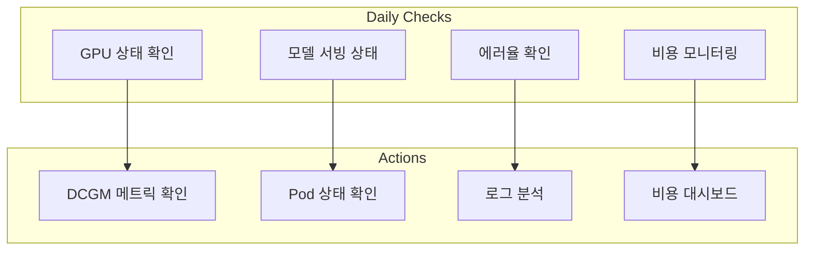

# 운영 및 트러블슈팅

Agentic AI 플랫폼을 안정적으로 운영하기 위한 체크리스트, 알림 규칙, 그리고 일반적인 문제 해결 가이드입니다.

## 운영 체크리스트

### 일일 점검 항목



| 점검 항목 | 확인 방법 | 정상 기준 |
| --- | --- | --- |
| GPU 상태 | `kubectl get nodes -l nvidia.com/gpu.present=true` | 모든 노드 Ready |
| 모델 Pod | `kubectl get pods -n inference` | Running 상태 |
| 에러율 | Grafana 대시보드 | < 1% |
| 응답 시간 | P99 레이턴시 | < 5초 |
| GPU 사용률 | DCGM 메트릭 | 40-80% |
| 메모리 사용 | GPU 메모리 | < 90% |

### 주간 점검 항목

| 점검 항목 | 확인 방법 | 조치 사항 |
| --- | --- | --- |
| 비용 분석 | Kubecost 리포트 | 이상 비용 식별 |
| 용량 계획 | 리소스 트렌드 | 스케일링 계획 |
| 보안 패치 | 이미지 스캔 | 취약점 패치 |
| 백업 검증 | 복구 테스트 | 백업 정책 확인 |

## Prometheus AlertManager 설정

### 알림 규칙 정의

```yaml
# prometheus-rules.yaml
apiVersion: monitoring.coreos.com/v1
kind: PrometheusRule
metadata:
  name: genai-platform-alerts
  namespace: monitoring
spec:
  groups:
  - name: gpu-alerts
    rules:
    # GPU 메모리 부족 경고
    - alert: GPUMemoryHigh
      expr: DCGM_FI_DEV_FB_USED / DCGM_FI_DEV_FB_FREE > 0.9
      for: 5m
      labels:
        severity: warning
      annotations:
        summary: "GPU 메모리 사용률 90% 초과"
        description: "노드 {{ $labels.node }}의 GPU {{ $labels.gpu }} 메모리 사용률이 90%를 초과했습니다."
    
    # GPU 온도 경고
    - alert: GPUTemperatureHigh
      expr: DCGM_FI_DEV_GPU_TEMP > 80
      for: 5m
      labels:
        severity: warning
      annotations:
        summary: "GPU 온도 80°C 초과"
        description: "노드 {{ $labels.node }}의 GPU 온도가 {{ $value }}°C입니다."
    
    # GPU 사용률 낮음 (비용 최적화)
    - alert: GPUUnderutilized
      expr: avg_over_time(DCGM_FI_DEV_GPU_UTIL[1h]) < 20
      for: 2h
      labels:
        severity: info
      annotations:
        summary: "GPU 사용률 낮음 - 비용 최적화 필요"
        description: "GPU {{ $labels.gpu }}의 평균 사용률이 2시간 동안 20% 미만입니다."

  - name: inference-alerts
    rules:
    # 추론 지연 시간 경고
    - alert: InferenceLatencyHigh
      expr: histogram_quantile(0.99, rate(inference_request_duration_seconds_bucket[5m])) > 5
      for: 5m
      labels:
        severity: warning
      annotations:
        summary: "추론 P99 지연 시간 5초 초과"
        description: "모델 {{ $labels.model }}의 P99 지연 시간이 {{ $value }}초입니다."
    
    # 추론 에러율 경고
    - alert: InferenceErrorRateHigh
      expr: rate(inference_request_errors_total[5m]) / rate(inference_request_total[5m]) > 0.01
      for: 5m
      labels:
        severity: critical
      annotations:
        summary: "추론 에러율 1% 초과"
        description: "모델 {{ $labels.model }}의 에러율이 {{ $value | humanizePercentage }}입니다."
    
    # 모델 Pod 재시작 경고
    - alert: ModelPodRestarting
      expr: increase(kube_pod_container_status_restarts_total{namespace="inference"}[1h]) > 3
      for: 5m
      labels:
        severity: warning
      annotations:
        summary: "모델 Pod 빈번한 재시작"
        description: "Pod {{ $labels.pod }}가 1시간 내 {{ $value }}회 재시작되었습니다."

  - name: cost-alerts
    rules:
    # 일일 비용 초과 경고
    - alert: DailyCostExceeded
      expr: sum(kubecost_cluster_cost_daily) > 1000
      for: 1h
      labels:
        severity: warning
      annotations:
        summary: "일일 비용 $1000 초과"
        description: "현재 일일 비용이 ${{ $value }}입니다."
    
    # GPU 비용 급증 경고
    - alert: GPUCostSpike
      expr: increase(kubecost_gpu_cost_hourly[1h]) > 100
      for: 30m
      labels:
        severity: warning
      annotations:
        summary: "GPU 비용 급증"
        description: "지난 1시간 GPU 비용이 ${{ $value }} 증가했습니다."
```

### AlertManager 설정

```yaml
# alertmanager-config.yaml
apiVersion: v1
kind: Secret
metadata:
  name: alertmanager-config
  namespace: monitoring
stringData:
  alertmanager.yaml: |
    global:
      resolve_timeout: 5m
      slack_api_url: 'https://hooks.slack.com/services/xxx'
    
    route:
      group_by: ['alertname', 'severity']
      group_wait: 30s
      group_interval: 5m
      repeat_interval: 4h
      receiver: 'default'
      routes:
      - match:
          severity: critical
        receiver: 'critical-alerts'
        continue: true
      - match:
          severity: warning
        receiver: 'warning-alerts'
    
    receivers:
    - name: 'default'
      slack_configs:
      - channel: '#genai-alerts'
        send_resolved: true
        title: '{{ .Status | toUpper }}: {{ .CommonLabels.alertname }}'
        text: '{{ range .Alerts }}{{ .Annotations.description }}{{ end }}'
    
    - name: 'critical-alerts'
      slack_configs:
      - channel: '#genai-critical'
        send_resolved: true
      pagerduty_configs:
      - service_key: 'your-pagerduty-key'
    
    - name: 'warning-alerts'
      slack_configs:
      - channel: '#genai-warnings'
        send_resolved: true
```

## 트러블슈팅 가이드

### GPU OOM (Out of Memory) 문제

#### 증상

```
CUDA out of memory. Tried to allocate X GiB
RuntimeError: CUDA error: out of memory
```

#### 진단

```bash
# GPU 메모리 상태 확인
kubectl exec -it <pod-name> -n inference -- nvidia-smi

# DCGM 메트릭 확인
kubectl exec -it <dcgm-exporter-pod> -n monitoring -- dcgmi dmon -e 155,156
```

#### 해결 방안

```yaml
# 1. 배치 크기 줄이기
env:
- name: MAX_BATCH_SIZE
  value: "16"  # 32에서 16으로 감소

# 2. 모델 양자화 적용
env:
- name: QUANTIZATION
  value: "int8"  # 또는 "fp8"

# 3. KV 캐시 크기 제한
env:
- name: MAX_NUM_SEQS
  value: "128"  # 동시 시퀀스 수 제한
```

```python
# vLLM 설정 예시
from vllm import LLM

llm = LLM(
    model="meta-llama/Llama-2-7b-hf",
    gpu_memory_utilization=0.85,  # 85%로 제한
    max_num_seqs=128,
    max_model_len=4096,
)
```

### 네트워크 지연 문제

#### 증상

- 추론 요청 타임아웃
- 모델 간 통신 지연
- NCCL 타임아웃 (분산 추론 시)

#### 진단

```bash
# Pod 네트워크 상태 확인
kubectl exec -it <pod-name> -- ping <target-service>

# DNS 해석 확인
kubectl exec -it <pod-name> -- nslookup <service-name>

# NCCL 디버그 로그 활성화
kubectl logs <pod-name> | grep -i nccl
```

#### 해결 방안

```yaml
# 1. Pod Anti-Affinity로 분산 배치
affinity:
  podAntiAffinity:
    preferredDuringSchedulingIgnoredDuringExecution:
    - weight: 100
      podAffinityTerm:
        labelSelector:
          matchLabels:
            app: inference
        topologyKey: "topology.kubernetes.io/zone"

# 2. EFA 활성화 (분산 추론)
resources:
  limits:
    vpc.amazonaws.com/efa: 4

# 3. 타임아웃 증가
env:
- name: NCCL_TIMEOUT
  value: "1800"  # 30분
- name: REQUEST_TIMEOUT
  value: "300"   # 5분
```

### 모델 로딩 실패

#### 증상

```
Error loading model: Connection refused
Model download failed: 403 Forbidden
OOM during model loading
```

#### 진단

```bash
# Pod 이벤트 확인
kubectl describe pod <pod-name> -n inference

# 컨테이너 로그 확인
kubectl logs <pod-name> -n inference --previous

# 스토리지 상태 확인
kubectl get pvc -n inference
```

#### 해결 방안

```yaml
# 1. 모델 캐시 PVC 사용
volumes:
- name: model-cache
  persistentVolumeClaim:
    claimName: model-cache-pvc

# 2. Init Container로 모델 사전 다운로드
initContainers:
- name: model-downloader
  image: amazon/aws-cli
  command:
  - /bin/sh
  - -c
  - |
    aws s3 sync s3://models/llama-2-7b /models/llama-2-7b
  volumeMounts:
  - name: model-cache
    mountPath: /models

# 3. 리소스 증가 (로딩 시 메모리 필요)
resources:
  requests:
    memory: "32Gi"
  limits:
    memory: "64Gi"
```

### Karpenter 노드 프로비저닝 실패

#### 증상

```
Pending pods due to insufficient capacity
NodeClaim stuck in Pending state
```

#### 진단

```bash
# NodeClaim 상태 확인
kubectl get nodeclaims -A

# Karpenter 로그 확인
kubectl logs -n karpenter -l app.kubernetes.io/name=karpenter

# EC2 용량 확인
aws ec2 describe-instance-type-offerings \
  --location-type availability-zone \
  --filters Name=instance-type,Values=p4d.24xlarge
```

#### 해결 방안

```yaml
# 1. 다중 인스턴스 타입 지정
apiVersion: karpenter.sh/v1
kind: NodePool
spec:
  template:
    spec:
      requirements:
      - key: "node.kubernetes.io/instance-type"
        operator: In
        values:
        - "p4d.24xlarge"
        - "p4de.24xlarge"
        - "p5.48xlarge"  # 대체 옵션 추가

# 2. 다중 AZ 지원
      - key: "topology.kubernetes.io/zone"
        operator: In
        values:
        - "ap-northeast-2a"
        - "ap-northeast-2b"
        - "ap-northeast-2c"

# 3. On-Demand 폴백
      - key: "karpenter.sh/capacity-type"
        operator: In
        values:
        - "spot"
        - "on-demand"  # Spot 불가 시 On-Demand 사용
```

## 로깅 전략

### 구조화된 로깅 설정

```python
# logging_config.py
import structlog
import logging

def configure_logging():
    structlog.configure(
        processors=[
            structlog.stdlib.filter_by_level,
            structlog.stdlib.add_logger_name,
            structlog.stdlib.add_log_level,
            structlog.stdlib.PositionalArgumentsFormatter(),
            structlog.processors.TimeStamper(fmt="iso"),
            structlog.processors.StackInfoRenderer(),
            structlog.processors.format_exc_info,
            structlog.processors.UnicodeDecoder(),
            structlog.processors.JSONRenderer()
        ],
        context_class=dict,
        logger_factory=structlog.stdlib.LoggerFactory(),
        wrapper_class=structlog.stdlib.BoundLogger,
        cache_logger_on_first_use=True,
    )

# 사용 예시
logger = structlog.get_logger()

logger.info(
    "inference_request",
    model="llama-2-7b",
    input_tokens=150,
    output_tokens=200,
    latency_ms=1250,
    user_id="user-123",
)
```

### Fluent Bit 로그 수집

```yaml
apiVersion: v1
kind: ConfigMap
metadata:
  name: fluent-bit-config
  namespace: logging
data:
  fluent-bit.conf: |
    [SERVICE]
        Flush         5
        Log_Level     info
        Parsers_File  parsers.conf
    
    [INPUT]
        Name              tail
        Tag               inference.*
        Path              /var/log/containers/inference-*.log
        Parser            docker
        Mem_Buf_Limit     50MB
        Skip_Long_Lines   On
    
    [FILTER]
        Name              kubernetes
        Match             inference.*
        Kube_URL          https://kubernetes.default.svc:443
        Kube_Tag_Prefix   inference.var.log.containers.
        Merge_Log         On
        K8S-Logging.Parser On
    
    [OUTPUT]
        Name              cloudwatch_logs
        Match             inference.*
        region            ap-northeast-2
        log_group_name    /eks/genai-platform/inference
        log_stream_prefix inference-
        auto_create_group true
```

### CloudWatch Logs Insights 쿼리

```sql
-- 에러 로그 분석
fields @timestamp, @message, kubernetes.pod_name
| filter @message like /error|Error|ERROR/
| sort @timestamp desc
| limit 100

-- 추론 지연 시간 분석
fields @timestamp, latency_ms, model, input_tokens
| filter latency_ms > 5000
| stats avg(latency_ms) as avg_latency, 
        max(latency_ms) as max_latency,
        count(*) as count 
  by model
| sort avg_latency desc

-- 토큰 사용량 분석
fields @timestamp, model, input_tokens, output_tokens
| stats sum(input_tokens) as total_input,
        sum(output_tokens) as total_output
  by bin(1h), model
```

## 비용 최적화 체크리스트

### GPU 비용 최적화

| 전략 | 절감 효과 | 구현 복잡도 |
| --- | --- | --- |
| Spot 인스턴스 | 60-90% | 중간 |
| 자동 스케일링 | 30-50% | 낮음 |
| 모델 양자화 | 20-40% | 중간 |
| 배치 처리 | 20-30% | 낮음 |
| 리소스 통합 | 10-20% | 낮음 |

### 비용 모니터링 대시보드

```yaml
# Kubecost 설정
apiVersion: v1
kind: ConfigMap
metadata:
  name: kubecost-config
  namespace: kubecost
data:
  config.yaml: |
    prometheus:
      enabled: true
      serverEndpoint: http://prometheus-server.monitoring:80
    
    costModel:
      enabled: true
      gpuCost: 3.06  # p4d.24xlarge 시간당 비용
      
    alerts:
      - name: "GPU Cost Alert"
        type: "budget"
        threshold: 1000
        window: "24h"
        aggregation: "namespace"
        filter: "inference"
```

## 관련 문서

- [GPU 리소스 관리](./gpu-resource-management.md)
- [Agent 모니터링](./agent-monitoring.md)
- [Agentic AI 플랫폼 아키텍처](./agentic-platform-architecture.md)

:::tip 권장 사항
- 알림 피로를 방지하기 위해 임계값을 점진적으로 조정하세요
- 주요 장애 발생 시 포스트모템을 작성하고 런북을 업데이트하세요
- 정기적인 장애 대응 훈련(Game Day)을 실시하세요
:::

:::warning 주의사항
- Critical 알림은 반드시 즉시 대응이 필요한 항목만 설정하세요
- 로그에 민감한 정보(API 키, 사용자 데이터)가 포함되지 않도록 주의하세요
- 비용 알림 임계값은 팀의 예산에 맞게 조정하세요
:::
