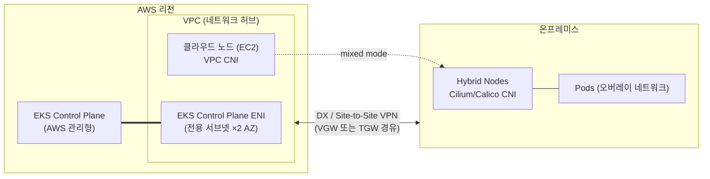
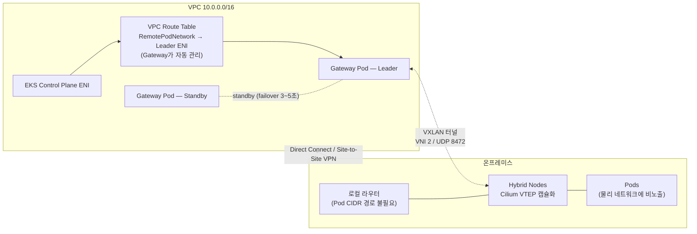
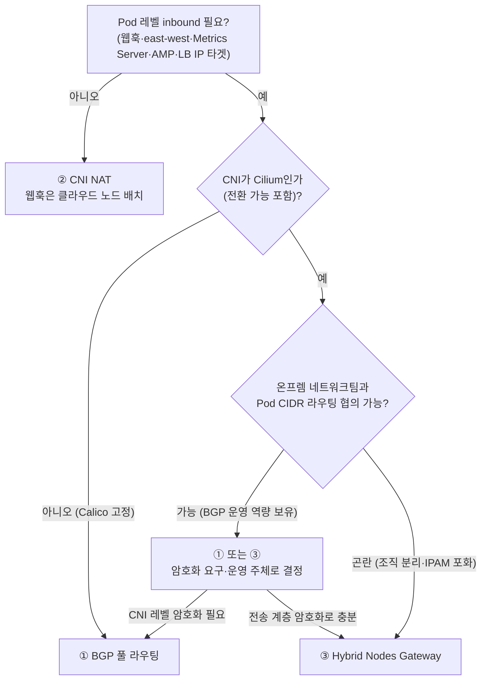

## 개요

본 문서는 Amazon EKS Hybrid Nodes의 단일 완전 가이드입니다. Hybrid Nodes가 무엇인지(개념), 어떻게 동작하는지(동작 원리), 어떤 기술 특징을 갖는지(핵심 기능)를 순서대로 설명한 후, 실제 도입 과정에서 반복적으로 제기되는 기술 쟁점 — CIDR 설계와 주소 최소화, 아키텍처 결정, Hybrid Nodes Gateway 구축·운영, 방화벽 사전 등록, 노드 인증 방식, Transit Gateway 토폴로지 — 을 주제별 딥다이브로 답합니다. 대상 독자는 하이브리드 클러스터를 설계·구축·운영하는 인프라 아키텍트와 플랫폼 엔지니어, 그리고 방화벽·네트워크 등록 요청을 준비하는 보안 담당자입니다.

:::info 검증 기준
본 문서의 핵심 수치와 요건은 EKS User Guide, CloudFormation Template Reference, AWS Containers Blog 원문을 직접 확인한 후 작성되었습니다(2026-08-24 기준).
:::

문서 구성은 다음과 같습니다.

| 파트 | 내용 |
|------|------|
| [EKS Hybrid Nodes란 무엇인가](#eks-hybrid-nodes란-무엇인가) | 정의, 사용 사례, 배포 옵션 비교, 요금, 요구 사항 |
| [어떻게 동작하는가](#어떻게-동작하는가) | 아키텍처, 노드 등록 흐름, 네트워킹 기본 구조, 트래픽 흐름, CNI 동작 |
| [주요 기술 특징](#주요-기술-특징) | 라우팅 요건 원칙, NAT 한계, Hybrid Nodes Gateway, CGNAT 지원, Mixed Mode, 구성 검증 |
| Deep Dive 1~7 | 주요 기술 쟁점 주제별 상세 답변 |

## EKS Hybrid Nodes란 무엇인가

### 정의

EKS Hybrid Nodes는 온프레미스·엣지 인프라의 물리 서버 또는 가상 머신을 Amazon EKS 클러스터의 워커 노드로 연결하는 기능입니다. 2024년 12월 정식 출시(GA)되었습니다. 컨트롤 플레인(API server, etcd)은 AWS가 리전 내에서 완전 관리하고, 데이터 플레인(워커 노드)은 고객 인프라에서 실행됩니다. 클라우드 노드(EC2)와 하이브리드 노드가 하나의 클러스터에 공존하는 mixed mode 구성이 가능하며, 동일한 EKS API·클러스터 정책·애드온 체계로 관리됩니다.

### 사용 사례

- **보유 GPU 자산 활용**: 이미 구매한 온프레미스 GPU 서버(DGX 등)를 클라우드 GPU·Amazon Bedrock과 결합해 비용 효율적인 추론 계층을 구성
- **데이터 주권·규제 대응**: 데이터를 온프레미스에 유지하면서 Kubernetes 운영 모델은 EKS로 표준화
- **점진적 마이그레이션**: 온프레미스 워크로드를 단일 클러스터 안에서 단계적으로 클라우드로 이전
- **엣지 컴퓨팅**: 지연시간에 민감한 워크로드를 사용자 근접 위치에서 실행하면서 중앙에서 통합 관리

### 배포 옵션 비교

| 항목 | EKS Hybrid Nodes | AWS Outposts | Amazon EKS Anywhere | 자체 구축 K8s |
|------|-----------------|--------------|---------------------|----------------|
| 컨트롤 플레인 위치 | AWS 리전 (관리형) | Outposts 랙 (관리형) | 온프레미스 (고객 운영) | 온프레미스 (고객 운영) |
| 하드웨어 | 고객 보유 장비 | AWS 제공 랙/서버 | 고객 보유 장비 | 고객 보유 장비 |
| 네트워크 요건 | DX/VPN 상시 연결 | AWS 연결 필수 | 단절 운영 가능 | 제약 없음 |
| 컨트롤 플레인 운영 부담 | 없음 | 없음 | 있음 (업그레이드·백업) | 전부 |
| 적합한 경우 | 기존 장비 + 관리형 컨트롤 플레인 | AWS 인프라를 온프렘에 확장 | 에어갭·단절 환경 | 완전한 자체 통제 필요 |

EKS Hybrid Nodes는 "장비는 이미 있고, 컨트롤 플레인 운영 부담은 없애고 싶은" 환경에 적합합니다. 컨트롤 플레인이 AWS 리전에 있으므로 온프레미스와 리전 간 안정적인 사설 연결이 전제 조건입니다.

### 요금 모델

EKS Hybrid Nodes는 하이브리드 노드의 vCPU-시간 기준 티어드 과금을 적용합니다. 월 누적 사용량이 증가할수록 단가가 낮아집니다.

| 월 누적 vCPU-hours | 단가 ($/vCPU-hr) |
|-------------------|-----------------|
| 첫 576,000 | $0.020 |
| 576,001 ~ 1,728,000 | $0.014 |
| 1,728,001 ~ 5,184,000 | $0.010 |
| 5,184,001 ~ 15,552,000 | $0.008 |
| 15,552,001 이상 | $0.006 |

예를 들어 224 vCPU 서버(DGX H200급) 1대를 상시 운영하면 월 약 163,520 vCPU-hr, 약 $3,270의 관리 비용이 발생합니다. 10대 운영 시 누적 사용량이 2티어에 진입해 노드당 평균 비용이 약 $2,635로 낮아집니다. 이 금액은 EKS 관리 비용이며 하드웨어 구매·전력·상면 비용은 별도입니다. EKS 클러스터 자체 요금과 클라우드 노드(EC2) 요금은 기존과 동일하게 부과됩니다.

### 시스템 요구 사항

| 항목 | 요구 사항 |
|------|----------|
| 운영체제 | Amazon Linux 2023, Ubuntu 20.04/22.04/24.04 LTS, RHEL 8/9 |
| 컨테이너 런타임 | containerd (nodeadm이 설치·관리) |
| 네트워크 연결 | AWS Direct Connect, Site-to-Site VPN, 또는 자체 VPN 기반 사설 연결 |
| 대역폭·지연시간 | 최소 100Mbps, 왕복 지연(RTT) 200ms 이하 권장 (공식 가이드) |
| CNI | Cilium 또는 Calico (VPC CNI는 하이브리드 노드 미지원) |

:::note 대역폭 요건의 해석
100Mbps/200ms는 대부분의 사용 사례를 수용하는 일반 가이드이며 엄격한 요구사항이 아닙니다. 실제 필요 대역폭은 노드 수, 컨테이너 이미지 크기, 모니터링·로깅 구성, AWS 서비스 데이터 접근 패턴에 따라 달라집니다. 대용량 모델 이미지를 사용하는 GPU 추론 환경은 프로덕션 적용 전 자체 워크로드로 검증이 필요합니다.
:::

## 어떻게 동작하는가

### 아키텍처: VPC를 허브로 하는 단일 클러스터

EKS Hybrid Nodes 아키텍처에서 VPC는 네트워크 허브 역할을 수행합니다. EKS 컨트롤 플레인은 클러스터 생성 시 지정한 서브넷에 ENI(Elastic Network Interface)를 연결하고, 클라우드 경계를 넘는 모든 트래픽은 이 VPC를 경유합니다. 온프레미스와 VPC는 Direct Connect, Site-to-Site VPN, 또는 자체 VPN으로 연결하며, VPC 측 연결점은 통상 VGW(Virtual Private Gateway) 또는 TGW(Transit Gateway)입니다.



### 노드 등록 흐름: nodeadm

하이브리드 노드는 AWS가 제공하는 CLI 도구 `nodeadm`으로 등록합니다. 등록 흐름은 ① 의존성 설치 → ② IAM 자격 증명 구성 → ③ 클러스터 조인 3단계입니다.

```bash
# 1. nodeadm 다운로드 (x86_64)
curl -OL 'https://hybrid-assets.eks.amazonaws.com/releases/latest/bin/linux/amd64/nodeadm'
chmod +x nodeadm && sudo mv nodeadm /usr/local/bin/

# 2. Kubernetes 버전별 의존성 설치 (containerd, kubelet, SSM agent 등)
sudo nodeadm install 1.33 --credential-provider ssm
# IAM Roles Anywhere 사용 시: --credential-provider iam-ra

# 3. NodeConfig 기반 노드 초기화
sudo nodeadm init --config-source file://nodeconfig.yaml
```

`NodeConfig`는 클러스터 정보, 자격 증명, kubelet·containerd 설정을 선언적으로 정의합니다.

```yaml
apiVersion: node.eks.aws/v1alpha1
kind: NodeConfig
spec:
  cluster:
    name: my-hybrid-cluster
    region: ap-northeast-2
  hybrid:
    ssm:
      activationCode: "YOUR-ACTIVATION-CODE"
      activationId: "YOUR-ACTIVATION-ID"
  kubelet:
    config:
      shutdownGracePeriod: 30s
      maxPods: 110
    flags:
      - --node-labels=node-type=hybrid
```

노드가 사용하는 IAM 자격 증명은 SSM hybrid activation 또는 IAM Roles Anywhere로 발급받으며, kubelet은 이 자격 증명으로 EKS 컨트롤 플레인에 인증합니다. 두 방식의 비교와 선택 기준은 [Deep Dive 5](#deep-dive-5-노드-인증-방식--ssm-vs-iam-roles-anywhere)에서 다룹니다. 등록된 하이브리드 노드에는 `eks.amazonaws.com/compute-type: hybrid` 레이블이 부여됩니다.

### 네트워킹 기본 구조: RemoteNodeNetwork와 RemotePodNetwork

클러스터 생성 시 두 가지 원격 대역을 입력합니다.

| 필드 | 의미 | 할당 주체 |
|------|------|----------|
| `RemoteNodeNetwork` | 하이브리드 노드 머신의 IP 대역 | 온프레미스 네트워크 |
| `RemotePodNetwork` | 하이브리드 노드 위 Pod의 IP 대역 | CNI(오버레이 네트워크) |

EKS 컨트롤 플레인은 이 대역을 기준으로 해당 목적지 트래픽을 VPC를 거쳐 온프레미스로 라우팅합니다. 공식 문서의 핵심 제약은 다음과 같습니다.

> "The main constraint is that the EKS control plane and all nodes, cloud or hybrid nodes, need to form a **fully routed** network. This means that all nodes must be able to reach each other at layer three, by IP address."
> — [Networking concepts for hybrid nodes](https://docs.aws.amazon.com/eks/latest/userguide/hybrid-nodes-concepts-networking.html)

"fully routed" 요건은 **노드 레벨**에 적용됩니다. `kubectl logs`, `kubectl exec` 같은 명령은 컨트롤 플레인이 노드의 kubelet(10250 포트)으로 직접 연결을 개시하므로, VPC 라우트 테이블에 Node CIDR 경로가 필요하고 온프레미스에서도 노드 IP가 라우팅 가능해야 합니다. 반면 Pod 대역 라우팅은 같은 문서가 명시적으로 선택 사항(optional)으로 규정하며, 이 차이가 하이브리드 네트워크 설계 전체를 관통하는 원칙입니다. 상세한 판정 기준은 [주요 기술 특징](#node-대역-필수-pod-대역-선택-원칙)에서 다룹니다.

:::tip Service CIDR 자동 선택 주의
클러스터 생성 시 Kubernetes Service IPv4 CIDR을 명시하지 않으면 EKS가 원격 대역과 겹치지 않는 CIDR을 자동 선택하며, 이때 표준 기본값(`10.100.0.0/16`, `172.20.0.0/16`)이 아닌 대역이 배정될 수 있습니다. 예측 가능한 방화벽·라우팅 설계를 위해 Service CIDR을 명시적으로 지정하는 것이 권장됩니다.
:::

### 트래픽 흐름: 방향이 만드는 차이

하이브리드 네트워킹의 난이도는 트래픽의 **방향**에 따라 달라집니다.

**① 온프레미스 → AWS (egress)**: kubelet과 Pod가 API server, SSM, ECR 등으로 나가는 트래픽입니다. CNI가 Pod 발신 패킷의 source IP를 노드 IP로 SNAT하면, 복귀 트래픽은 Node CIDR 경로만으로 돌아오고 conntrack이 SNAT를 역변환합니다. Pod CIDR 라우팅 없이 동작합니다.

**② AWS → 온프레미스 노드 (inbound, 노드 레벨)**: 컨트롤 플레인이 kubelet(TCP 10250)으로 연결을 개시합니다. `kubectl logs`/`exec`가 이 경로를 사용하며, Node CIDR 양방향 라우팅이 필수인 이유입니다.

**③ AWS → 온프레미스 Pod (inbound, Pod 레벨)**: 웹훅 호출, Metrics Server 스크래핑, ALB/NLB IP 타겟 트래픽이 Pod IP를 직접 목적지로 사용합니다. SNAT는 외부에서 개시되는 연결의 경로를 만들지 못하므로, Pod CIDR 라우팅 또는 Hybrid Nodes Gateway가 필요합니다.

```text
[egress — 기본 지원]
Pod(10.85.1.56)
   │  CNI SNAT: Src 10.85.1.56 → 10.80.0.2 (Node IP)
   ▼
Node(10.80.0.2) ─► 온프렘 라우터 ─► DX/VPN ─► EKS Control Plane ENI
   ▲                                              │
   └── VPC Route: Node CIDR → VGW/TGW ◄───────────┘
       (Pod CIDR 경로 없이 복귀 가능)

[inbound Pod 레벨 — SNAT로 해결 불가]
EKS Control Plane ─► webhook Pod IP(10.85.1.23:8443) ─► ???
(NAT는 외부에서 개시되는 연결의 경로를 생성하지 못함)
```

### CNI 동작과 라우팅 부담의 비대칭

이 차이는 CNI 동작 방식에서 기인합니다. 클라우드 노드의 VPC CNI는 Pod IP를 VPC 대역에서 직접 할당하므로 별도 라우팅이 불필요합니다. 온프레미스의 Cilium/Calico는 기본적으로 VXLAN 오버레이에서 Pod를 실행하므로, 물리 네트워크가 오버레이 대역을 인지하지 못하면 Pod IP 목적지 트래픽은 폐기됩니다. 해결하려면 BGP(권장) 또는 정적 라우팅으로 Pod CIDR을 온프레미스 네트워크에 광고해야 하며, AWS는 Cilium과 Calico의 BGP 기능을 지원합니다.

라우팅 부담은 비대칭적입니다. VPC 측은 "Pod CIDR → 게이트웨이" 경로 하나로 충분하지만, 온프레미스 측은 하이브리드 노드와 같은 서브넷의 로컬 라우터가 노드별 Pod CIDR 슬라이스까지 알아야 합니다. 네트워크 조직이 분리된 대기업 환경에서 이 협의 부담이 도입의 최대 장벽이 되며, 이것이 Hybrid Nodes Gateway 출시의 배경입니다.

## 주요 기술 특징

### Node 대역 필수, Pod 대역 선택 원칙

결론은 **Node 대역 필수, Pod 대역 권장(선택)** 입니다.

> "Note, the constraint for making your on-premises pod CIDRs routable is **optional**."
> — [Networking concepts for hybrid nodes](https://docs.aws.amazon.com/eks/latest/userguide/hybrid-nodes-concepts-networking.html)

다만 다음 기능 중 하나라도 필요하면 Pod 대역 라우팅(또는 Gateway)이 사실상 필수가 됩니다.

| Pod CIDR 라우팅이 필요한 기능 | 사유 |
|------|------|
| 하이브리드 노드에서 웹훅 실행 (AWS Load Balancer Controller, cert-manager 등) | API server가 webhook Pod IP로 직접 연결 개시 |
| 클라우드 Pod ↔ 온프레미스 Pod 직접 통신 (east-west) | VPC CNI(클라우드)와 Cilium/Calico(온프렘) 간 직접 경로 필요 |
| Metrics Server를 하이브리드 노드에서 실행 | 컨트롤 플레인 → Metrics Server Pod IP 연결 필요 |
| Amazon Managed Service for Prometheus(AMP) managed collector | Pod 메트릭 스크래핑 (대안: ADOT 애드온) |
| ALB/NLB의 IP 타겟으로 하이브리드 Pod 지정 | 타겟 IP가 AWS에서 라우팅 가능해야 함 |

### Pod 트래픽 NAT의 지원 범위와 한계

Pod 대역을 라우팅할 수 없는(unroutable) 환경의 공식 가이드는 CNI 레벨 NAT입니다.

> "Configure your CNI to use egress masquerade or network address translation (NAT) for pod traffic as it leaves your on-premises hosts. **This is enabled by default in Cilium. Calico requires `natOutgoing` to be set to `true`.**"
> — [Prepare networking for hybrid nodes](https://docs.aws.amazon.com/eks/latest/userguide/hybrid-nodes-networking.html)

정리하면 다음과 같습니다.

- **온프레미스 Pod → AWS 방향(egress)**: 공식 지원 패턴입니다.
- **AWS → 온프레미스 Pod 방향(inbound)** — 웹훅, Metrics Server, AMP 스크래핑, ALB/NLB IP 타겟 — 은 SNAT로 해결할 수 없습니다. unroutable 구성에서는 웹훅을 클라우드 노드에 배치하는 mixed mode 운영이 공식 권고입니다.

공식 문서가 Pod 트래픽 NAT 수단으로 명시하는 것은 CNI 레벨 masquerade뿐입니다. AWS 관리형 NAT Gateway나 온프레미스 자체 NAT 장비는 이 용도로 다루지 않습니다.

### Hybrid Nodes Gateway: Pod 라우팅 요건 제거

2026년 4월 21일 정식 출시된 [Amazon EKS Hybrid Nodes Gateway](https://aws.amazon.com/about-aws/whats-new/2026/04/amazon-eks-hybrid-nodes-gateway/)는 "Pod CIDR을 온프레미스에서 라우팅 가능하게 만들어야 하는" 요건을 제거합니다.

> "The gateway **eliminates the need to make on-premises pod networks routable from the VPC** or coordinate network infrastructure changes."
> — [Amazon EKS Hybrid Nodes gateway](https://docs.aws.amazon.com/eks/latest/userguide/hybrid-nodes-gateway-overview.html)

Gateway는 Cilium CNI의 VTEP(VXLAN Tunnel Endpoint) 기능을 활용합니다. VPC 안의 EC2 게이트웨이 노드와 온프레미스의 Cilium 노드 사이에 VXLAN 터널(`hybrid_vxlan0` 인터페이스, VNI 2, UDP 8472)을 구성하고 Pod 트래픽을 캡슐화해 전달합니다. 물리 네트워크에는 노드 IP 간 UDP 트래픽만 흐르며 Pod CIDR은 노출되지 않습니다.



Gateway는 네 가지 메커니즘으로 동작합니다.

1. **VXLAN 터널링**: 게이트웨이가 `hybrid_vxlan0` 인터페이스를 생성하고, `CiliumNode` 오브젝트를 감시하는 노드 컨트롤러가 하이브리드 노드의 조인/이탈에 따라 FDB·ARP 엔트리와 라우트를 자동 추가·제거합니다.
2. **VPC 라우트 테이블 관리**: leader가 지정된 VPC 라우트 테이블에 "Pod CIDR → leader의 primary ENI" 경로를 생성·교체합니다.
3. **Cilium VTEP 통합**: leader가 `CiliumVTEPConfig` CRD를 생성해 하이브리드 노드의 Cilium 에이전트에게 VPC행 트래픽의 터널 엔드포인트(leader 노드 IP)를 알립니다.
4. **Leader election**: Kubernetes Lease 기반 active-standby 모델입니다. 두 게이트웨이 Pod가 pod anti-affinity로 서로 다른 노드에서 실행되고, **두 Pod 모두** 기동 시점에 VXLAN 인터페이스와 전체 VTEP 엔트리를 사전 구성합니다. leader 장애 시 standby는 라우트 테이블과 `CiliumVTEPConfig`만 갱신하면 되므로 **예상 failover 시간은 약 3~5초**입니다(공식 문서 명시).

**Gateway가 하지 않는 것**도 명확합니다. Gateway는 NAT가 아니므로 대역 중복을 해소하지 못하며, Node 대역 라우팅과 VPC↔온프레미스 사설 연결 요건은 그대로 유지됩니다. Gateway는 Pod 레이어의 라우팅 문제를 해결하는 것이며 하이브리드 연결 자체를 대체하지 않습니다. 도입 절차와 운영 상세는 [Deep Dive 3](#deep-dive-3-hybrid-nodes-gateway-구축과-운영)에서 다룹니다.

### CGNAT 대역(100.64.0.0/10) 지원

온프레미스 Node/Pod CIDR로 RFC 1918 사설 대역에 더해 CGNAT 대역이 공식 지원됩니다.

> "Be within one of the following `IPv4` RFC-1918 ranges: `10.0.0.0/8`, `172.16.0.0/12`, or `192.168.0.0/16`, **or within the CGNAT range defined by RFC 6598: `100.64.0.0/10`**."
> — [Prepare networking for hybrid nodes](https://docs.aws.amazon.com/eks/latest/userguide/hybrid-nodes-networking.html)

| 대역 | 표준 | RemoteNodeNetwork | RemotePodNetwork |
|------|------|-------------------|------------------|
| `10.0.0.0/8` | RFC 1918 | O | O |
| `172.16.0.0/12` | RFC 1918 | O | O |
| `192.168.0.0/16` | RFC 1918 | O | O |
| `100.64.0.0/10` | RFC 6598 (CGNAT) | **O** | **O** |
| 그 외 public 대역 | — | X | X |

추가 제약은 세 가지입니다. 온프레미스 Node/Pod CIDR은 ① 서로 간, ② VPC CIDR, ③ Kubernetes Service IPv4 CIDR과 겹치지 않아야 합니다.

CGNAT 대역은 RFC 1918 공간이 포화된 환경에서 유용합니다. 금융·통신권처럼 사설 대역을 광범위하게 점유한 네트워크에서 `100.64.0.0/10`을 `RemotePodNetwork` 전용으로 할당하면 겹침 회피가 수월합니다. 다만 통신사 CGNAT 구간이나 일부 사내 서비스가 이 대역을 선점한 경우가 있으므로 사전 IP 인벤토리 점검이 필요합니다.

:::warning IaC 레퍼런스 문서의 표기 불일치
CloudFormation의 [`AWS::EKS::Cluster RemotePodNetwork` 레퍼런스](https://docs.aws.amazon.com/AWSCloudFormation/latest/TemplateReference/aws-properties-eks-cluster-remotepodnetwork.html)는 2026-08-24 기준 여전히 "Each block must be within an IPv4 RFC-1918 network range"로만 기재되어 CGNAT 대역 표기가 누락되어 있습니다. User Guide가 더 최신 내용이나, 실제 API 검증 로직이 어느 쪽과 일치하는지는 문서만으로 단정할 수 없습니다. CloudFormation/CDK/Terraform 경로로 100.64 대역을 배포할 계획이라면 프로덕션 적용 전 비프로덕션 환경 검증이 필요합니다.
:::

### Mixed Mode 클러스터와 웹훅 배치

클라우드 노드와 하이브리드 노드를 하나의 클러스터에 공존시키는 mixed mode는 Pod 라우팅 제약을 우회하는 공식 운영 패턴입니다.

- **웹훅은 클라우드 노드에 배치**: Pod CIDR이 unroutable한 환경에서 AWS Load Balancer Controller, cert-manager 등 웹훅 컴포넌트는 nodeAffinity로 클라우드 노드에 고정합니다.
- **CoreDNS는 양쪽에 최소 1 replica**: 하이브리드 노드 측 DNS 조회가 클라우드 왕복 없이 처리되도록 topology 분산을 권장합니다.
- **Service Traffic Distribution**: 트래픽을 발생 존에 가깝게 유지해 불필요한 크로스 네트워크 홉을 줄입니다.

### 구성 검증 자동화: Cluster Insights와 nodeadm debug

- **EKS Cluster Insights**: 하이브리드 노드가 있는 클러스터를 자동 스캔해 컨트롤 플레인↔웹훅 통신, `kubectl exec`/`logs` 경로 등 구성 문제를 탐지하고 시정 권고를 제공합니다. 콘솔·CLI·SDK에서 결과를 확인할 수 있습니다.
- **`nodeadm debug`**: 하이브리드 노드에서 직접 실행해 네트워킹·자격 증명 요건 충족 여부를 검증합니다. 노드 조인 실패 시 1차 진단 도구입니다.

---

## Deep Dive 1: 네트워크 대역 최소화와 CIDR 설계

사내 IPAM 대역이 부족한 조직에서 가장 먼저 부딪히는 질문은 "어느 대역을, 얼마나, 어디까지 라우팅 가능하게 확보해야 하는가"입니다.

### 라우팅 요건 판정 절차

1. **Node CIDR**: 항상 양방향 라우팅 필수. 협상 불가 요건입니다.
2. **Pod CIDR**: [기능표](#node-대역-필수-pod-대역-선택-원칙)의 5개 항목 중 필요한 것이 있는지 판정합니다.
   - 하나도 없으면 → CNI egress NAT로 충분 (Pod CIDR 라우팅·등록 불필요)
   - 있으면 → BGP 풀 라우팅 또는 Hybrid Nodes Gateway 중 선택 ([Deep Dive 2](#deep-dive-2-아키텍처-결정--routable-pod-cidr-vs-gateway))

### Gateway 도입 시 축소 범위

Gateway를 도입하면 온프레미스 네트워크에 등록·라우팅해야 하는 대역이 다음과 같이 줄어듭니다.

| 항목 | Gateway 없음 (풀 라우팅) | Gateway 도입 |
|------|--------------------------|--------------|
| Node CIDR 온프렘 라우팅 | 필요 | **필요 (변화 없음)** |
| Pod CIDR 온프렘 라우팅 | 필요 (BGP/정적) | **불필요** |
| Pod CIDR VPC 라우트 테이블 | 수동 구성 | Gateway가 자동 관리 |
| 온프렘 방화벽의 Pod CIDR 인지 | 필요 | 불필요 (UDP 8472만 추가) |

즉 온프레미스 네트워크팀과의 협의 대상이 "Node CIDR 라우팅 + UDP 8472 허용"으로 축소됩니다. Pod CIDR은 클러스터 내부(EKS 설정·Cilium·Gateway)에서만 관리됩니다.

### AWS VPC 최소 사이징

VPC CIDR은 생성 후 축소·변경이 불가능하므로(secondary CIDR 추가만 가능) 초기 산정이 중요합니다.

**이론적 최소**: EKS는 서로 다른 AZ의 서브넷 2개를 요구하고, 각 서브넷은 EKS용 가용 IP 6개 이상이면 됩니다. /28 서브넷(가용 11 IP) 2개 — 즉 VPC /27 수준이 이론적 하한입니다.

**실무 권장(/25~/24)의 산정 근거**: 컨트롤 플레인 ENI만으로는 클러스터가 완성되지 않기 때문입니다.

| 소비 항목 | 필요 IP (개략) | 비고 |
|-----------|---------------|------|
| 컨트롤 플레인 ENI 서브넷 ×2 | /28 ×2 (32) | 업그레이드 시 신규 ENI 생성·교체 여유 포함 |
| Gateway 노드 ×2 (도입 시) | 2~4 | 서로 다른 AZ |
| 클라우드 노드 (웹훅·CoreDNS·시스템 애드온) | 서브넷 규모에 따라 수 개~수십 개 | mixed mode 필수 구성분. VPC CNI는 Pod에도 VPC IP를 할당하므로 Pod 수만큼 소비 |
| VPC 엔드포인트 (ECR·SSM·STS 등 PrivateLink) | 엔드포인트당 AZ별 1 | 인터넷 미경유 구성 시 |
| Route 53 Resolver inbound endpoint | AZ별 1 | 온프렘→AWS DNS 조회 시 |
| ALB/NLB 서브넷 | AZ별 8+ | LB 노출 구성 시 |

클라우드 노드에서 VPC CNI가 Pod당 VPC IP를 소비한다는 점이 결정적입니다. 웹훅·CoreDNS·모니터링 에이전트 몇 개만 운영해도 노드당 수십 IP가 필요할 수 있습니다. 환경(dev/stg/prd)별 /25(128 IP)~/24(256 IP)는 이 소비 구조에 성장 여유를 더한 값이며, 과대 산정이 아닙니다. 반대로 클라우드 노드를 최소화하고 Gateway·엔드포인트도 쓰지 않는 극단적 구성이라면 /26까지 압축할 수 있으나 확장 시 secondary CIDR 관리 부담이 발생합니다.

### 컨트롤 플레인 ENI 전용 서브넷 전략

EKS가 생성하는 컨트롤 플레인 ENI의 IP는 고정이 아니며, 클러스터 업그레이드 등 변경 시 기존 ENI가 삭제되고 새 ENI가 생성됩니다. 공식 문서는 이 특성에 대한 대응으로 **작은 전용 서브넷으로 IP 범위를 제약**하는 방법을 안내합니다.

> "You can restrict the IP range for the Amazon EKS network interfaces by using constrained subnet sizes for the subnets you pass during cluster creation, which makes it easier to configure your on-premises firewall."
> — [Prepare networking for hybrid nodes](https://docs.aws.amazon.com/eks/latest/userguide/hybrid-nodes-networking.html)

클러스터 생성 시 컨트롤 플레인용으로 /28 전용 서브넷 2개만 전달하면, 방화벽에는 개별 IP가 아닌 **이 서브넷 CIDR 2개**를 등록하면 됩니다. ENI IP가 바뀌어도 방화벽 재신청이 불필요합니다. 현재 ENI IP 확인은 다음 명령을 사용합니다.

```bash
aws ec2 describe-network-interfaces \
  --query 'NetworkInterfaces[?(VpcId == `VPC_ID` && contains(Description, `Amazon EKS`))].PrivateIpAddress'
```

### Pod CIDR 선제 확보

`RemotePodNetwork`는 클러스터 생성 후에도 갱신할 수 있으나 전체 목록 교체 방식이며, 더 중요한 제약은 CNI 측에 있습니다. Cilium의 `clusterPoolIPv4PodCIDRList`는 운영 중 변경이 사실상 불가능해(재설치 수준의 작업 필요) Pod CIDR 풀이 고갈되면 노드 증설이 막힙니다. 노드당 Pod CIDR 슬라이스(`clusterPoolIPv4MaskSize`, 통상 /25~/26)에 목표 노드 수와 성장分을 곱해 **처음부터 넉넉한 Pod CIDR을 배정**해야 합니다. Pod CIDR은 Gateway 도입 시 온프레미스에 노출되지 않으므로, 크게 잡아도 사내 IPAM과 충돌하지 않습니다(겹침 금지 3원칙만 준수).

### 멀티 환경(dev/stg/prd) 주소 계획

환경별 별도 계정 + VPC 1개 구조에서는 다음 원칙이 유효합니다.

- **Node CIDR**: 환경별로 분리된 온프레미스 대역 할당 (라우팅·방화벽 신청 단위가 됨)
- **Pod CIDR**: Gateway 사용 시 환경 간 재사용이 기술적으로 가능하나, 장애 분석·감사 로그 판독성을 위해 환경별 구분 값 권장 (예: dev `10.85.0.0/16`, stg `10.86.0.0/16`, prd `10.87.0.0/16`)
- **VPC CIDR**: 환경 간 겹침 금지 (TGW로 상호 연결될 가능성 대비)
- Gateway는 클러스터당 1세트이므로 3개 환경 = Gateway EC2 6대(환경당 2대)의 고정 비용을 계획에 포함

## Deep Dive 2: 아키텍처 결정 — Routable Pod CIDR vs Gateway

"Pod CIDR을 호스트 레벨로 노출(routable)할 것인가, Gateway 레이어를 추가할 것인가"는 하이브리드 설계의 핵심 결정입니다. 아키텍처 선택지는 세 가지로 수렴합니다.

### 3가지 아키텍처 옵션

| 옵션 | Egress | 웹훅/Inbound | East-west | 트레이드오프 |
|------|--------|--------------|-----------|--------------|
| ① Pod CIDR 풀 라우팅 (BGP 권장) | O | O | O | 가장 완전. 네트워크팀 협업·BGP 운영 필요 |
| ② CNI NAT (unroutable) | O | X — 웹훅은 클라우드 노드 배치 | X | 가장 단순. 기능 제약 큼 |
| ③ Hybrid Nodes Gateway | O | O | O | 라우팅 협의 불필요. Cilium 전용, 암호화 미내장, 게이트웨이 EC2 비용 |

### 의사결정 기준

각 옵션의 적합성은 다음 6개 축으로 판정합니다.

| 판단 축 | ① 풀 라우팅 유리 | ③ Gateway 유리 |
|---------|------------------|----------------|
| 네트워크팀 협업 | BGP 피어링·라우팅 변경을 신속히 협의 가능 | 네트워크가 "블랙박스"(조직 분리, 변경 리드타임 김) |
| IPAM 여유 | Pod CIDR을 사내 대역에서 정식 할당 가능 | 사내 대역 포화 — Pod CIDR을 내부에서만 소비 |
| CNI 제약 | Calico 유지 필요 (Gateway는 Cilium 전용) | Cilium 사용 중이거나 전환 가능 |
| 암호화 요구 | CNI 레벨 암호화(WireGuard/IPsec) 조합 가능 | 전송 계층(DX MACsec/VPN)에서 해결 가능 |
| 운영 주체 | 네트워크팀이 라우팅 운영 | 플랫폼팀이 클러스터 안에서 완결 운영 |
| 추가 비용 | 라우터 설정 외 없음 | Gateway EC2 2대 상시 비용 |

②(CNI NAT)는 웹훅·east-west·AWS 서비스 연동을 모두 포기할 수 있는 최소 기능 구성에서만 유효합니다. Calico 유지가 필요한 환경에서는 ③이 제외되므로 ①과 ② 중에서 선택해야 합니다.



### 판단 요약

네트워크 조직이 분리되어 있고 사내 IPAM이 포화된 환경 — 대형 통신·금융사의 전형 — 에서는 ③ Gateway가 협의 비용과 주소 소비를 최소화하는 선택입니다. 단 VXLAN 터널이 트래픽을 암호화하지 않으므로 전송 계층 암호화(DX MACsec 또는 VPN)가 전제되어야 하며, 게이트웨이 EC2 대역폭이 크로스 네트워크 트래픽의 상한이 된다는 점을 수용해야 합니다. 반대로 네트워크팀이 BGP를 능동적으로 운영할 수 있고 Pod 간 대용량 east-west 트래픽이 예상되는 환경이라면 ① 풀 라우팅이 병목 없는 구조를 제공합니다.

## Deep Dive 3: Hybrid Nodes Gateway 구축과 운영

### 도입 전 체크리스트

| # | 항목 | 내용 |
|---|------|------|
| 1 | Cilium 버전 | EKS 배포판 Cilium **1.17.13-1 / 1.18.8-1 / 1.19.2-1 이상** (VTEP 지원 최소 버전) |
| 2 | Cilium 설정 | `vtep.enabled=true` + `l7Proxy=false` 필수. L7 proxy가 켜져 있으면 VTEP 트래픽이 가로채여 폐기될 수 있음 |
| 3 | 클라우드 노드 CNI | 게이트웨이 노드 포함 클라우드 노드는 AWS VPC CNI 필수 (VPC-native 라우팅 의존) |
| 4 | 게이트웨이 EC2 | 최소 2대, 서로 다른 AZ 권장, source/destination check 비활성화 |
| 5 | IAM 권한 | `ec2:DescribeRouteTables`, `ec2:CreateRoute`, `ec2:ReplaceRoute`, `ec2:DescribeInstances` — EKS Pod Identity로 게이트웨이 서비스 어카운트에만 부여 권장 |
| 6 | 방화벽 | 게이트웨이 SG와 온프레미스 방화벽 양쪽에서 **UDP 8472** inbound/outbound 허용 |
| 7 | VPC CNI SNAT 예외 | `AWS_VPC_K8S_CNI_EXCLUDE_SNAT_CIDRS`에 하이브리드 Pod CIDR 등록 |
| 8 | 전송 암호화 | VXLAN 무암호화 — DX MACsec 또는 VPN을 전송 계층으로 확보 |

### 1단계: Cilium 재구성

기존 Cilium 설치에 VTEP를 활성화하고 L7 proxy를 비활성화합니다.

```bash
helm upgrade cilium oci://public.ecr.aws/eks/cilium/cilium \
  --version CILIUM_VERSION \
  --namespace kube-system \
  --reuse-values \
  --set vtep.enabled=true \
  --set l7Proxy=false

kubectl rollout restart daemonset/cilium -n kube-system
kubectl rollout status daemonset/cilium -n kube-system

# 적용 확인
kubectl get configmap cilium-config -n kube-system -o yaml | grep -E "enable-vtep|enable-l7-proxy"
# enable-l7-proxy: "false" / enable-vtep: "true" 이면 정상
```

:::warning l7Proxy=false의 영향
`l7Proxy=false`는 Cilium의 L7 네트워크 정책(HTTP-aware policy)과 Envoy 기반 기능을 비활성화합니다. 해당 기능을 사용 중인 클러스터는 Gateway 도입 전 대체 방안(게이트웨이/서비스 메시 레벨 L7 제어)을 검토해야 합니다.
:::

### 2단계: VPC CNI SNAT 예외

클라우드 Pod에서 하이브리드 Pod 엔드포인트를 갖는 ClusterIP Service로 향하는 트래픽이 VPC 라우팅을 타도록 SNAT 예외를 설정합니다.

```bash
kubectl set env daemonset aws-node -n kube-system \
  AWS_VPC_K8S_CNI_EXCLUDE_SNAT_CIDRS=POD_CIDRS   # 쉼표 구분 복수 지정 가능
```

IP 직접 지정 Pod-to-Pod 통신은 이 설정 없이도 동작하지만, ClusterIP Service 경유 트래픽에는 필수입니다.

### 3단계: 게이트웨이 노드 준비

**EKS Auto Mode (권장)** — `NodeClass`/`NodePool`로 레이블·테인트·source/dest check를 선언적으로 구성합니다.

```yaml
apiVersion: eks.amazonaws.com/v1
kind: NodeClass
metadata:
  name: hybrid-gateway
spec:
  advancedNetworking:
    sourceDestCheck: DisabledPrimaryENI   # 자기 앞으로 오지 않은 트래픽 포워딩 허용
  role: YOUR_NODE_ROLE
  securityGroupSelectorTerms:
    - tags:
        aws:eks:cluster-name: YOUR_CLUSTER_NAME
  subnetSelectorTerms:                     # 서로 다른 AZ의 서브넷 2개
    - id: SUBNET_ID_1
    - id: SUBNET_ID_2
---
apiVersion: karpenter.sh/v1
kind: NodePool
metadata:
  name: hybrid-gateway
spec:
  template:
    metadata:
      labels:
        hybrid-gateway-node: "true"        # Helm 차트의 node selector 대상
    spec:
      nodeClassRef:
        group: eks.amazonaws.com
        kind: NodeClass
        name: hybrid-gateway
      requirements:
        - key: karpenter.sh/capacity-type
          operator: In
          values: ["on-demand"]
        - key: eks.amazonaws.com/instance-category
          operator: In
          values: ["c", "m", "r"]
        - key: eks.amazonaws.com/instance-generation
          operator: Gt
          values: ["4"]
      taints:
        - key: hybrid-gateway-node
          effect: NoSchedule               # 게이트웨이 Pod 전용 노드로 격리
```

**Managed node group (대안)** — 전용 노드 그룹에 `hybrid-gateway-node=true` 레이블과 `NoSchedule` 테인트를 지정하고, 부팅 시 source/dest check를 비활성화하는 user-data를 담은 런치 템플릿을 연결합니다(노드 IAM role에 `ec2:ModifyNetworkInterfaceAttribute` 권한 필요). Helm 설치 시 `--set autoMode.enabled=false`를 추가합니다. 상세 절차는 [공식 getting-started 문서](https://docs.aws.amazon.com/eks/latest/userguide/hybrid-nodes-gateway-getting-started.html)를 참조합니다.

### 4단계: IAM 권한 (Pod Identity 권장)

```bash
# Pod Identity Agent 애드온 설치 (미설치 시)
aws eks create-addon --cluster-name CLUSTER_NAME --addon-name eks-pod-identity-agent

# 라우트 테이블 관리 권한을 가진 role 생성 후 게이트웨이 서비스 어카운트와 연결
aws eks create-pod-identity-association \
  --cluster-name CLUSTER_NAME \
  --namespace eks-hybrid-nodes-gateway \
  --service-account eks-hybrid-nodes-gateway \
  --role-arn arn:aws:iam::ACCOUNT_ID:role/EKSHybridNodesGatewayRole
```

노드 IAM role에 정책을 붙이는 방법도 지원되나, 이 경우 게이트웨이 노드의 모든 Pod가 라우트 변경 권한을 갖게 되므로 Pod Identity로 서비스 어카운트에만 부여하는 방식이 권장됩니다.

### 5단계: Helm 설치

```bash
helm install eks-hybrid-nodes-gateway \
  oci://public.ecr.aws/eks/eks-hybrid-nodes-gateway \
  --version 1.0.0 \
  --namespace eks-hybrid-nodes-gateway \
  --create-namespace \
  --set vpcCIDR=VPC_CIDR \
  --set podCIDRs=POD_CIDRS \
  --set routeTableIDs=ROUTE_TABLE_IDS
```

| 필수 값 | 의미 | 주의사항 |
|---------|------|----------|
| `vpcCIDR` | EKS 클러스터 VPC의 CIDR | VPC에 secondary CIDR을 추가하면 이 값도 갱신 필요 |
| `podCIDRs` | 하이브리드 노드 Cilium의 Pod CIDR (쉼표 구분) | Cilium `clusterPoolIPv4PodCIDRList`·`RemotePodNetwork`와 일치해야 함 |
| `routeTableIDs` | Gateway가 라우트를 프로그래밍할 VPC 라우트 테이블 ID (쉼표 구분) | **하이브리드 Pod와 통신하는 모든 서브넷의 라우트 테이블을 전부 열거** — 누락된 테이블에 연결된 서브넷에서는 하이브리드 Pod 접근 불가 |

### 설치 검증

```bash
# 게이트웨이 Pod 2개 Running 확인
kubectl get pods -n eks-hybrid-nodes-gateway

# leader lease 확인 (HOLDER 열에 leader Pod 표시)
kubectl get lease -n eks-hybrid-nodes-gateway

# VPC 라우트 테이블에 Pod CIDR → leader ENI 경로 생성 확인
aws ec2 describe-route-tables --route-table-ids ROUTE_TABLE_ID \
  --query "RouteTables[].Routes[?DestinationCidrBlock=='POD_CIDR']"

# 하이브리드 노드 측 VTEP 설정 확인
kubectl get ciliumvtepconfig hybrid-gateway -o yaml
```

### 운영 태세: Helm 관리형 vs 수동 EC2

"Kubernetes 장애 시 게이트웨이도 함께 죽는 것 아닌가 — EC2에 수동으로 iptables 게이트웨이를 만드는 게 안전하지 않은가"라는 질문이 자주 제기됩니다. 결론부터 말하면 **Helm 관리형이 공식 지원되는 유일한 배포 형태**이며, 수동 EC2 구성은 다음 이유로 비권장입니다.

1. **자동화의 대체 불가**: Gateway는 `CiliumNode` 감시를 통한 VTEP 엔트리 자동 관리, leader 장애 시 VPC 라우트·`CiliumVTEPConfig` 자동 갱신을 수행합니다. 수동 구성은 노드 증감·장애 시마다 사람이 FDB/ARP/라우트를 갱신해야 합니다.
2. **장애 도메인 분석**: 게이트웨이 Pod는 게이트웨이 EC2 노드 위에서 실행되며, 의존 대상은 EKS 컨트롤 플레인(AWS 관리형, SLA 제공)과 게이트웨이 EC2 자체입니다. "K8s 장애"의 실체가 컨트롤 플레인 장애라면 이는 AWS 관리 영역이고, 워커 노드 장애라면 다른 AZ의 standby가 3~5초 내 승계합니다. 수동 EC2 구성도 EC2 장애에는 똑같이 노출되며, 오히려 자동 failover가 없습니다.
3. **데이터 플레인 독립성**: VXLAN 포워딩은 커널 레벨에서 동작하므로, 컨트롤 플레인이 일시적으로 불안정해도 이미 프로그래밍된 터널의 트래픽 포워딩은 계속됩니다. 컨트롤 플레인 의존은 구성 변경(노드 증감·failover) 시점에만 발생합니다.

### 인스턴스 사이징: 수직 확장 원칙

Gateway는 active-standby 모델이므로 **트래픽은 항상 leader 1대만 처리**합니다. replica를 늘려도(수평 확장) 가용성만 개선될 뿐 처리량은 늘지 않으며, 성능은 인스턴스 타입의 네트워크 대역폭으로만(수직 확장) 확장됩니다. 이것이 공식 문서의 명시적 가이드입니다.

t 계열 저사양 인스턴스(t2.small 등)는 게이트웨이 노드로 부적합합니다. 게이트웨이는 VPC↔하이브리드 Pod 간 **모든** 트래픽을 포워딩하는 병목 지점이고, VXLAN 캡슐화는 패킷당 오버헤드를 추가하므로 네트워크 성능(대역폭·PPS)이 낮은 인스턴스는 크로스 네트워크 통신 전체의 상한이 됩니다. 공식 권장 인스턴스는 다음과 같습니다.

| 규모 | 인스턴스 | 네트워크 | 비고 |
|------|----------|----------|------|
| 프로덕션 (하이브리드 노드 10~100대, 중간 트래픽) | `c6in.xlarge` | 최대 30Gbps | 네트워크 최적화, 공식 권장 |
| 〃 | `c6i.xlarge` / `c7i.xlarge` | 최대 12.5Gbps | 비용·성능 균형 |
| 고처리량 (100대+, 대용량 트래픽) | `c6in.2xlarge` | 최대 40Gbps | 공식 권장 |
| 〃 최대 구성 | `c6in.4xlarge` | 최대 50Gbps | 데이터 집약 워크로드 |

메트릭(`hybrid_gateway_primary_nic_*`, `hybrid_gateway_vxlan_*`)으로 실사용량을 관측한 후 타입을 조정합니다.

### 고가용성과 failover

- 게이트웨이 Pod 2개가 pod anti-affinity로 서로 다른 노드에서 실행되며, **서로 다른 AZ** 배치를 권장합니다(AZ 장애가 leader/standby를 동시에 잃지 않도록).
- 두 Pod 모두 상시 VXLAN 인터페이스·VTEP 엔트리를 유지하므로, failover 시 라우트 테이블과 `CiliumVTEPConfig` 갱신만 수행합니다. **예상 failover 시간 약 3~5초**이며, 이 동안 VPC↔하이브리드 Pod 트래픽이 중단됩니다.
- leader election 파라미터 기본값(lease 3s / renew 2s / retry 1s)은 빠른 failover에 튜닝되어 있습니다. 더 줄이면 네트워크 순단 시 오탐 failover 위험이 커지므로 대부분의 환경에서 기본값이 적절합니다.
- 게이트웨이-VPC 리소스 간 크로스 AZ 트래픽에는 표준 크로스 AZ 데이터 전송 요금이 부과됩니다.

### 모니터링

게이트웨이는 8088 포트에 health(`/healthz`)·readiness(`/readyz`) 엔드포인트를, 10080 포트에 Prometheus 메트릭(`/metrics`)을 노출합니다. 핵심 관측 지표는 다음과 같습니다.

| 메트릭 | 용도 |
|--------|------|
| `hybrid_gateway_leader_is_active` | leader/standby 상태 (1=leader) |
| `hybrid_gateway_hybrid_nodes_configured` | VTEP 구성된 하이브리드 노드 수 |
| `hybrid_gateway_aws_route_table_update_errors_total` | 라우트 갱신 실패 (IAM·라우트 테이블 문제 조기 탐지) |
| `hybrid_gateway_vxlan_rx/tx_bytes_total` | VXLAN 터널 트래픽량 (사이징 판단 근거) |
| `hybrid_gateway_primary_nic_rx/tx_bytes_total` | 인스턴스 네트워크 사용량 (대역폭 상한 대비 사용률) |

CloudWatch Observability 애드온으로 `eks-hybrid-nodes-gateway` 네임스페이스의 10080 포트를 스크래핑하도록 구성할 수 있습니다.

### 제거 시 주의: 라우트 수동 정리

`helm uninstall`은 Gateway가 생성한 VPC 라우트 엔트리를 자동 삭제하지 않습니다. 제거 후 라우트가 남아 있으면 더 이상 게이트웨이가 아닌 인스턴스로 트래픽이 향하므로 반드시 수동 삭제합니다.

```bash
helm uninstall eks-hybrid-nodes-gateway --namespace eks-hybrid-nodes-gateway

aws ec2 delete-route \
  --route-table-id ROUTE_TABLE_ID \
  --destination-cidr-block POD_CIDR
```

### 기타 제약

- **클러스터당 1세트**: 게이트웨이 배포 하나는 단일 EKS 클러스터를 담당합니다. 멀티 클러스터 환경은 클러스터별로 배포합니다.
- **리전·비용**: China 리전 제외 전 Hybrid Nodes 지원 리전에서 사용 가능합니다. Gateway 자체는 무료이며 게이트웨이용 EC2와 Auto Mode 관리 요금만 과금됩니다. 코드는 [오픈소스로 공개](https://github.com/aws/eks-hybrid-nodes-gateway)되어 있습니다.

## Deep Dive 4: 방화벽·DNS 사전 등록 가이드

방화벽·네트워크 조직이 분리된 환경에서는 구축 전에 등록 요청서를 제출해야 하며, 누락 항목은 곧 구축 지연입니다. 등록 지점은 5개 존으로 구분해 관리합니다.

| 존 | 등록 지점 | 관리 주체 (통상) |
|----|-----------|------------------|
| A | 온프레미스 방화벽 (상시 운영 룰) | 네트워크·보안팀 |
| B | AWS 보안 그룹 | 클라우드 플랫폼팀 |
| C | 온프레미스 → AWS 서비스 엔드포인트 (outbound 도메인) | 네트워크·보안팀 |
| D | 컨트롤 플레인 ENI 대역·DNS | 양쪽 협의 |
| E | 권장 추가 룰 (CNI·ICMP) | 네트워크·보안팀 |

### 존 A: 온프레미스 방화벽 상시 운영 룰

공식 문서의 상시 운영(ongoing operations) 요건을 신청서 형식으로 정리하면 다음과 같습니다.

| 방향 | 프로토콜/포트 | 출발지 | 목적지 | 사유 |
|------|--------------|--------|--------|------|
| Outbound | TCP 443 | Node CIDR | EKS 컨트롤 플레인 ENI 서브넷 CIDR | kubelet → Kubernetes API server |
| Outbound | TCP 443 | Pod CIDR | EKS 컨트롤 플레인 ENI 서브넷 CIDR | Pod → Kubernetes API server |
| Outbound | TCP 443 | Node CIDR | SSM 서비스 엔드포인트 | SSM 자격 증명 갱신 + 5분 주기 heartbeat (SSM 사용 시) |
| Outbound | TCP 443 | Node CIDR | IAM Roles Anywhere 엔드포인트 | 자격 증명 갱신 (IAM RA 사용 시) |
| Outbound | TCP 443 | Pod CIDR | STS 리전 엔드포인트 | IRSA 사용 Pod 한정 |
| Outbound | TCP 443 | Node CIDR | EKS Auth 엔드포인트 | EKS Pod Identity 사용 시 |
| **Inbound** | TCP 10250 | EKS 컨트롤 플레인 ENI 서브넷 CIDR | Node CIDR | **Kubernetes API server → kubelet** (`kubectl logs`/`exec`) |
| **Inbound** | TCP 웹훅 포트 | EKS 컨트롤 플레인 ENI 서브넷 CIDR | Pod CIDR | API server → 웹훅 (하이브리드 노드에서 웹훅 실행 시) |
| In/Out | TCP·UDP 53 | Pod CIDR | Pod CIDR (+ 클라우드 CoreDNS 배치 시 VPC CIDR) | Pod → CoreDNS |
| In/Out | 앱 포트 | Pod CIDR | Pod CIDR | Pod 간 통신 |

:::warning 방향에 주의
TCP 10250은 **AWS(컨트롤 플레인)에서 온프레미스로 들어오는 inbound**입니다. "쿠버네티스 포트니까 나가는 방향"으로 신청하는 실수가 잦으며, 이 경우 노드 등록은 성공하지만 `kubectl logs`/`exec`가 timeout으로 실패합니다. 또한 TCP 443은 온프레미스에서 나가는 outbound이며 "양방향"이 아닙니다. EKS에는 6443 포트가 존재하지 않으므로 신청 대상이 아닙니다.
:::

웹훅 포트는 애드온마다 다릅니다(예: 443, 8443, 9443). 배포 예정 애드온의 웹훅 Service 정의를 확인해 목록을 확정합니다. Hybrid Nodes Gateway를 사용하면 웹훅 inbound 룰과 Pod CIDR 관련 온프렘 룰이 불필요해지는 대신 **UDP 8472(게이트웨이 노드 IP ↔ 하이브리드 노드 IP, 양방향)** 룰이 추가됩니다.

방화벽이 stateful(연결 추적 기반)이라는 전제로 응답 패킷 룰은 생략했습니다. stateless ACL 장비가 경로에 있다면 역방향 ephemeral 포트 룰이 별도로 필요합니다.

### 존 B: AWS 보안 그룹

EKS는 원격 네트워크가 구성된 클러스터의 **inbound 규칙을 자동 생성**합니다. outbound는 SG 기본값(전체 허용)에 의존하므로, outbound를 제한 운영하는 조직은 아래 규칙을 명시적으로 등록해야 합니다.

| 방향 | 프로토콜/포트 | 대상 | 사유 | 생성 주체 |
|------|--------------|------|------|-----------|
| Inbound | TCP 443 | Node CIDR | kubelet → API server | EKS 자동 생성 |
| Inbound | TCP 443 | Pod CIDR | Pod → API server (CNI NAT 미사용 시) | EKS 자동 생성 |
| Outbound | TCP 10250 | Node CIDR | API server → kubelet | **수동 등록** (제한 운영 시) |
| Outbound | TCP 웹훅 포트 | Pod CIDR | API server → 웹훅 | **수동 등록** (제한 운영 시) |
| In+Out | UDP 8472 | 게이트웨이 노드 ↔ 하이브리드 노드 | VXLAN (Gateway 사용 시, 게이트웨이 SG) | 수동 등록 |

운영상 주의 두 가지입니다. ① SG inbound 규칙 기본 한도는 60개로, 한도 근접 시 자동 생성 규칙이 적용되지 않을 수 있어 수동 보완이 필요합니다. ② 클러스터에서 원격 네트워크를 제거해도 EKS는 대응 SG 규칙을 자동 삭제하지 않으므로 정리는 운영자 책임입니다.

### 존 C: AWS 서비스 엔드포인트 (outbound 도메인)

**설치·업그레이드 시** 필요한 도메인입니다(OS 이미지 빌드 시점에 반영하거나 호스트별 런타임 허용).

| 컴포넌트 | URL | 포트 |
|----------|-----|------|
| EKS 노드 아티팩트 (S3) | `hybrid-assets.eks.amazonaws.com` | TCP 443 |
| EKS 서비스 | `eks.<region>.amazonaws.com` | TCP 443 |
| ECR API | `api.ecr.<region>.amazonaws.com` | TCP 443 |
| EKS 애드온 이미지 레지스트리 | 리전별 상이 — 아래 [와일드카드 미지원 대응](#fqdn-와일드카드-미지원-환경-대응) 참조 | TCP 443 |
| SSM 바이너리 | `amazon-ssm-<region>.s3.<region>.amazonaws.com` (SSM 사용 시) | TCP 443 |
| SSM 서비스 | `ssm.<region>.amazonaws.com` (SSM 사용 시) | TCP 443 |
| IAM Roles Anywhere 바이너리 | `rolesanywhere.amazonaws.com` (IAM RA 사용 시) | TCP 443 |
| IAM Roles Anywhere 서비스 | `rolesanywhere.<region>.amazonaws.com` (IAM RA 사용 시) | TCP 443 |
| OS 패키지 저장소 | OS·지역별 상이 (yum/apt/snap 저장소) | TCP 443 |

**상시 운영 시**에는 존 A 표의 자격 증명 엔드포인트(ssm/rolesanywhere/sts/eks-auth)와 `eks.<region>` 접근이 유지되어야 합니다. Cilium·Gateway 차트를 사용하는 경우 `public.ecr.aws`(Amazon ECR Public)도 허용 대상입니다.

### 존 D: 컨트롤 플레인 ENI 대역과 DNS

**ENI IP는 고정이 아닙니다.** 클러스터 업그레이드 등 변경 시 기존 ENI가 삭제·재생성되므로 개별 IP 단위 방화벽 등록은 반드시 깨집니다. [Deep Dive 1의 전용 서브넷 전략](#컨트롤-플레인-eni-전용-서브넷-전략)대로 /28 전용 서브넷 2개를 클러스터에 전달하고, 방화벽에는 **서브넷 CIDR 2개를 등록**합니다.

**DNS**: 온프레미스 노드가 AWS 내부 도메인(프라이빗 엔드포인트 등)을 조회해야 하면 Route 53 Resolver inbound endpoint를 VPC에 배치하고 온프레미스 DNS가 해당 존을 포워딩하도록 구성합니다. 반대로 클라우드 Pod가 온프레미스 도메인(사내 레지스트리 등)을 조회해야 하면 outbound endpoint + forward rule을 구성합니다.

```bash
# inbound endpoint (온프렘 → AWS 조회)
aws route53resolver create-resolver-endpoint \
  --creator-request-id hybrid-inbound-001 \
  --name hybrid-inbound-endpoint \
  --security-group-ids sg-resolver-xxxxx \
  --direction INBOUND \
  --ip-addresses SubnetId=subnet-xxxxx SubnetId=subnet-yyyyy

# outbound endpoint + 사내 도메인 포워딩 (AWS → 온프렘 조회)
aws route53resolver create-resolver-rule \
  --creator-request-id hybrid-fwd-001 \
  --name on-prem-dns-rule \
  --rule-type FORWARD \
  --domain-name company.local \
  --target-ips Ip=192.168.1.53,Port=53 \
  --resolver-endpoint-id rslvr-out-xxxxx
```

Resolver endpoint IP도 방화벽 대상(TCP·UDP 53)이므로 존 A 신청서에 포함합니다.

### 존 E: 권장 추가 룰

| 항목 | 룰 | 사유 |
|------|-----|------|
| CNI 자체 포트 | Cilium: 노드 간 UDP 8472(VXLAN)·TCP 4240(health)·ICMP echo / Calico: TCP 179(BGP) 등 | 공식 문서가 CNI별 포트의 별도 허용을 요구 — 각 CNI 문서 기준으로 확정 |
| PMTUD | ICMP Type 3 Code 4 (Fragmentation Needed) 허용 | 오버레이 캡슐화로 유효 MTU가 줄어드는 환경에서 경로 MTU 탐색 실패 시 대용량 응답이 조용히 유실됨 |
| 모니터링 | 관측 스택의 스크래핑 경로 (예: AMP·Prometheus → Pod CIDR) | 관측 대상·도구별로 확정 |

### FQDN 와일드카드 미지원 환경 대응

FQDN 방화벽이 와일드카드(`*.amazonaws.com`)를 지원하지 않는 환경에서는 도메인을 개별 열거해야 합니다. 서울 리전(ap-northeast-2) 기준 구체 값은 다음과 같습니다.

| 용도 | 도메인 (ap-northeast-2) |
|------|------------------------|
| EKS 노드 아티팩트 | `hybrid-assets.eks.amazonaws.com` |
| EKS API | `eks.ap-northeast-2.amazonaws.com` |
| ECR API | `api.ecr.ap-northeast-2.amazonaws.com` |
| **EKS 애드온 이미지 레지스트리** | `602401143452.dkr.ecr.ap-northeast-2.amazonaws.com` |
| ECR Public (Cilium·Gateway 차트) | `public.ecr.aws` |
| SSM | `ssm.ap-northeast-2.amazonaws.com`, `amazon-ssm-ap-northeast-2.s3.ap-northeast-2.amazonaws.com` |
| IAM Roles Anywhere | `rolesanywhere.ap-northeast-2.amazonaws.com`, `rolesanywhere.amazonaws.com` |
| STS (IRSA 시) | `sts.ap-northeast-2.amazonaws.com` |

애드온 레지스트리 계정 ID `602401143452`는 서울 리전을 포함한 주요 리전 공통이나 **리전별로 다른 계정을 쓰는 리전이 있으므로**(예: ap-southeast-5는 `151610086707`) 대상 리전을 [공식 레지스트리 목록](https://docs.aws.amazon.com/eks/latest/userguide/add-ons-images.html)에서 확인합니다. ECR pull은 이미지 레이어를 S3에서 받는 경우가 있어, FQDN 제어가 엄격한 환경에서는 프라이빗 레지스트리(Harbor) 미러링 또는 ECR PrivateLink(VPC 엔드포인트) 경유가 현실적인 대안입니다.

### 환경별 등록 요청 체크리스트

dev/stg/prd 환경마다 아래 값을 채워 신청서를 작성합니다.

- [ ] Node CIDR (환경별 온프레미스 대역)
- [ ] Pod CIDR (Gateway 미사용 시에만 온프렘 등록 필요)
- [ ] EKS 컨트롤 플레인 ENI 전용 서브넷 CIDR ×2
- [ ] 존 A 상시 룰 표 (방향 검증 완료본)
- [ ] 존 C 도메인 목록 (인증 방식에 따라 SSM 또는 IAM RA 행 선택)
- [ ] Gateway 사용 시: UDP 8472 룰 (게이트웨이 노드 IP 또는 게이트웨이 서브넷 CIDR ↔ Node CIDR)
- [ ] Route 53 Resolver endpoint IP (DNS 연동 시)
- [ ] 웹훅 포트 목록 (하이브리드 노드에서 웹훅 실행 시)

## Deep Dive 5: 노드 인증 방식 — SSM vs IAM Roles Anywhere

하이브리드 노드는 EC2 인스턴스 프로파일이 없으므로 온프레미스용 IAM 자격 증명 공급자가 필요합니다. 선택지는 두 가지입니다.

### 동작 방식 비교

| 항목 | SSM hybrid activation | IAM Roles Anywhere |
|------|----------------------|--------------------|
| 인증 기반 | activation code/ID로 등록된 SSM 관리형 인스턴스 | X.509 인증서 (사설 CA 신뢰 앵커) |
| 사전 인프라 | 불필요 | PKI(사설 CA)·인증서 배포 체계 필요 |
| 자격 증명 갱신 | SSM agent가 자동 갱신 (5분 주기 heartbeat) | 인증서 기반 세션 갱신 — 인증서 수명주기 관리 필요 |
| nodeadm 옵션 | `--credential-provider ssm` | `--credential-provider iam-ra` |
| 방화벽 대상 | `ssm.<region>`, `amazon-ssm-<region>.s3.<region>` | `rolesanywhere.<region>`, `rolesanywhere.amazonaws.com` |
| 부가 효과 | 노드가 SSM 관리형 인스턴스로 등록 — Session Manager 접속·패치 관리 연계 가능 | 기존 PKI 거버넌스와 통합 — 인증서 폐기로 노드 자격 즉시 차단 |
| 운영 부담 | activation 만료·수량 관리 | CA 운영, 인증서 발급·갱신·폐기 자동화 |

### 선택 기준

- **PKI를 운영하지 않는 조직**: SSM이 기본 선택입니다. 별도 인프라 없이 activation 발급만으로 시작할 수 있고, 공식 quickstart 경로도 SSM 기준입니다.
- **사설 CA·인증서 거버넌스를 이미 갖춘 조직**(금융·통신 보안팀 관리 체계): IAM Roles Anywhere가 기존 통제 체계와 자연스럽게 통합됩니다. 인증서 폐기가 곧 노드 자격 차단이라는 운영 모델을 선호하는 보안 조직에 적합합니다.
- 어느 쪽이든 노드별 IAM role은 Hybrid Nodes IAM role 하나로 수렴하며, 방화벽 등록 대상 엔드포인트가 달라진다는 점([존 C](#존-c-aws-서비스-엔드포인트-outbound-도메인))을 신청서에 반영해야 합니다.

:::note nodeadm 버전 주의 (SSM)
SSM을 자격 증명 공급자로 사용하는 경우 `nodeadm` 1.0.19 이상이 필요합니다. 이전 버전은 만료된 SSM 서명 키를 포함해 `nodeadm install`/`upgrade`가 서명 검증 오류로 실패합니다.
:::

## Deep Dive 6: TGW 토폴로지와 온프레미스 LB 경로

### TGW 기반 하이브리드 연결 구조

공식 네트워킹 가이드는 VGW와 함께 TGW를 표준 연결 옵션으로 다룹니다. TGW 토폴로지에서 점검할 항목은 세 가지입니다.

1. **VPC 라우트 테이블**: Node CIDR(및 풀 라우팅 시 Pod CIDR) 목적지 경로가 TGW attachment를 가리켜야 합니다.
2. **TGW 라우트 테이블**: 온프레미스 방향 attachment(DX Gateway 또는 VPN)로 Node/Pod CIDR가 전파(propagation) 또는 정적 등록되어야 하고, 역방향으로 VPC CIDR가 온프레미스 측에 광고되어야 합니다.
3. **멀티 계정**: 환경별 계정 분리 구조에서는 TGW를 Resource Access Manager(RAM)로 공유하고, TGW 라우트 테이블 격리 정책(환경 간 라우팅 차단 여부)을 명시적으로 설계합니다.

### Gateway와 TGW의 상호작용

Hybrid Nodes Gateway는 TGW 환경에서 문제없이 동작하며, 오히려 TGW 측 관리 항목을 줄입니다.

- **Pod CIDR은 TGW 라우트에서 제외됩니다.** Gateway가 VPC 라우트 테이블에 "Pod CIDR → leader ENI" 경로를 관리하므로, TGW·온프레미스 라우터는 Pod CIDR을 알 필요가 없습니다.
- **VXLAN 트래픽은 노드 IP 간 UDP 8472**로 TGW를 통과합니다. TGW에는 Node CIDR ↔ VPC CIDR 경로만 있으면 됩니다.
- Gateway의 `routeTableIDs`에는 TGW attachment 서브넷을 포함해 **하이브리드 Pod와 통신하는 모든 서브넷의 라우트 테이블**을 열거해야 합니다.

### 온프레미스 LB → 클라우드 Pod(DR) 경로

온프레미스 로드밸런서가 AWS에서 실행 중인 DR Pod로 트래픽을 보내는 구성은 가능합니다. 핵심은 클라우드 Pod의 IP 특성입니다.

- 클라우드 노드의 Pod는 VPC CNI가 **VPC 대역의 IP를 직접 할당**하므로, 온프레미스에서 VPC CIDR로의 라우팅(TGW 경유)만 확보되면 Pod IP가 직접 도달 가능합니다.
- 단 Pod IP는 재스케줄링 시 변경되므로 LB 타겟으로 Pod IP를 정적 등록하는 방식은 취약합니다. **NLB/ALB(내부형)를 AWS 측에 두고 온프레미스 LB는 NLB/ALB의 안정적 엔드포인트를 타겟**으로 하는 계층 구성이 권장됩니다.
- 보안 그룹에서 온프레미스 LB 대역(또는 Node CIDR)의 inbound를 해당 포트로 허용해야 하며, 헬스 체크 경로·포트도 동일하게 허용 대상입니다.

반대 방향(AWS LB → 온프레미스 하이브리드 Pod IP 타겟)은 Pod CIDR 라우팅 또는 Gateway가 전제 조건입니다([기능표](#node-대역-필수-pod-대역-선택-원칙) 참조).

## Deep Dive 7: 확장 주제 — 스토리지·레지스트리·GPU·비용

### 파일 스토리지

하이브리드 노드에서 EFS·FSx·NFS를 사용하는 구성은 [하이브리드 노드 파일 스토리지](./hybrid-nodes-file-storage.md)에서 상세히 다룹니다. 온프레미스 NFS를 PersistentVolume으로 노출하는 기본 패턴은 다음과 같습니다.

```yaml
apiVersion: v1
kind: PersistentVolume
metadata:
  name: onprem-storage-pv
spec:
  capacity:
    storage: 10Ti
  accessModes:
    - ReadWriteMany
  nfs:
    server: 192.168.1.100
    path: /export/data
  mountOptions: ["vers=4.1", "rsize=1048576", "wsize=1048576", "hard", "timeo=600"]
```

### 프라이빗 레지스트리(Harbor) EKS 통합

폐쇄망·FQDN 제한 환경에서 Harbor는 이미지 공급 경로를 내재화하는 표준 구성입니다. Harbor 자체 설치(인증서·harbor.yml·Trivy)는 [Harbor 하이브리드 통합 가이드](./harbor-hybrid-integration.md)를 참조하고, 여기서는 EKS 통합에 고유한 세 가지만 정리합니다.

**① containerd 레지스트리 인증** — NodeConfig의 containerd 설정에 Harbor 미러·인증·CA를 선언합니다.

```yaml
# NodeConfig spec.containerd.config 발췌
[plugins."io.containerd.grpc.v1.cri".registry.configs."harbor.yourdomain.com".auth]
  username = "robot$k8s-robot"
  password = "YOUR-ROBOT-TOKEN"
[plugins."io.containerd.grpc.v1.cri".registry.configs."harbor.yourdomain.com".tls]
  ca_file = "/etc/ssl/certs/harbor-ca.crt"
```

**② CoreDNS hosts 항목** — 사내 DNS 연동 전 단계 또는 소규모 환경에서 Harbor 도메인을 클러스터 내부에서 해석하도록 구성합니다(Route 53 Resolver outbound로 대체 가능).

```text
hosts {
  192.168.1.100 harbor.yourdomain.com
  fallthrough
}
```

**③ imagePullSecret** — robot account 자격 증명으로 `docker-registry` 타입 Secret을 생성해 워크로드에 지정합니다.

```bash
kubectl create secret docker-registry harbor-registry \
  --docker-server=harbor.yourdomain.com \
  --docker-username='robot$k8s-robot' \
  --docker-password='YOUR-ROBOT-TOKEN'
```

### GPU 워크로드와 3-Tier Cascade

보유 GPU 서버(DGX 등)를 하이브리드 노드로 등록하면 고정 비용 자산을 1차 추론 계층으로 활용하고, 클라우드 GPU(Spot)와 Amazon Bedrock을 버스트·폴백 계층으로 결합할 수 있습니다.

| Tier | 인프라 | 비용 구조 | 역할 |
|------|--------|---------|------|
| 1 | On-Prem Hybrid Node (DGX) | 고정 비용 (기보유) | 기본 트래픽 (항상 활성) |
| 2 | Cloud GPU (EKS Spot/OD) | 시간당 변동 비용 | 피크 버스트 |
| 3 | Amazon Bedrock | 토큰당 종량제 | 장애·과부하 폴백 |

GPU 노드는 `--node-labels=node-type=hybrid,gpu=h100`과 `nvidia.com/gpu` 테인트로 등록하고, NVIDIA device plugin 또는 GPU Operator로 리소스를 노출합니다. 워크로드는 nodeSelector로 온프렘(기본 추론)/클라우드(버스트)를 분리 배치하고, 게이트웨이(Bifrost 등) 레벨의 cascade routing으로 계층 간 폴백을 구성합니다.

:::warning 하이브리드 추론 네트워크 고려사항
- **레이턴시**: VPN/DX 경유로 클라우드 노드 대비 왕복 지연 추가 — 게이트웨이 라우팅 정책에 반영 필요
- **분산 추론 제약**: 멀티노드 NCCL 통신은 고대역폭 필요 — 온프렘 내부 Pipeline Parallelism은 가능하나 온프렘↔클라우드 간 PP는 비권장
- **권장 패턴**: 온프렘 노드는 독립 모델을 서빙하고, 클라우드와는 Gateway 레벨 cascade routing으로만 연결
:::

InfiniBand·SR-IOV 기반 고성능 GPU 네트워킹은 [SR-IOV DGX H200 하이브리드 구성](./sriov-dgx-h200-hybrid.md), Gateway 레벨 폴백·관측성은 [Agent 모니터링 & 운영](../agentic-ai-platform/operations-mlops/observability/agent-monitoring.md)을 참조합니다. GPU 리소스 관리(DRA 포함)는 [GPU 리소스 관리](../agentic-ai-platform/model-serving/gpu-infrastructure/gpu-resource-management.md)에서 다룹니다.

### 비용 최적화

[요금 모델](#요금-모델)의 티어드 구조를 전제로 다음 전략이 유효합니다.

1. **선택적 워크로드 배치**: vCPU-시간 과금 대상인 하이브리드 노드에는 GPU 등 온프렘 자산이 필요한 워크로드만 배치하고, 범용 CPU 워크로드는 클라우드 노드(Spot 혼용)로 분리
2. **노드 등록 수명 관리**: 사용하지 않는 시간대의 하이브리드 노드는 클러스터에서 등록 해제해 과금 대상 vCPU-hours 축소
3. **비용 가시화**: Cost Explorer에서 `Amazon Elastic Kubernetes Service - Hybrid Nodes` 서비스 차원으로 필터링해 환경별 추이 관측

## 요약

EKS Hybrid Nodes는 온프레미스 데이터 플레인을 AWS 관리형 컨트롤 플레인에 연결하는 기능으로, 설계의 중심 질문은 "온프레미스 Pod 대역을 라우팅 가능하게 만들 것인가"로 수렴합니다. Node 대역 양방향 라우팅과 사설 연결(DX/VPN)은 모든 구성에서 필수이며, Pod 대역은 웹훅·east-west·AWS 서비스 연동 필요 여부에 따라 BGP 풀 라우팅, CNI NAT, 또는 2026년 4월 GA된 Hybrid Nodes Gateway(VXLAN 터널링, failover 약 3~5초) 중에서 선택합니다. 방화벽 등록은 5개 존(온프렘 룰·SG·엔드포인트·ENI 서브넷·권장 룰)으로 구조화하고, 컨트롤 플레인 ENI는 전용 /28 서브넷으로 대역을 고정해 신청합니다. 노드 인증은 PKI 보유 여부에 따라 SSM hybrid activation 또는 IAM Roles Anywhere를 선택하며, IP 대역은 RFC 1918에 더해 CGNAT(100.64.0.0/10)가 공식 허용됩니다.

## 참고 자료

### 공식 문서
- [Amazon EKS Hybrid Nodes overview](https://docs.aws.amazon.com/eks/latest/userguide/hybrid-nodes-overview.html) — Hybrid Nodes 개요·지원 리전·요구 사항
- [Prepare networking for hybrid nodes](https://docs.aws.amazon.com/eks/latest/userguide/hybrid-nodes-networking.html) — CIDR 요건, 방화벽·SG 규칙, 엔드포인트 목록
- [Networking concepts for hybrid nodes](https://docs.aws.amazon.com/eks/latest/userguide/hybrid-nodes-concepts-networking.html) — fully routed 제약, Pod CIDR 선택 사항 명시
- [Network traffic flows for hybrid nodes](https://docs.aws.amazon.com/eks/latest/userguide/hybrid-nodes-concepts-traffic-flows.html) — CNI NAT 유무별 패킷 레벨 트래픽 흐름
- [Configure webhooks for hybrid nodes](https://docs.aws.amazon.com/eks/latest/userguide/hybrid-nodes-webhooks.html) — mixed mode 권고, 애드온별 affinity 설정
- [Amazon EKS Hybrid Nodes gateway](https://docs.aws.amazon.com/eks/latest/userguide/hybrid-nodes-gateway-overview.html) — Gateway 아키텍처, failover 3~5초, 제약 사항
- [Get started with EKS Hybrid Nodes gateway](https://docs.aws.amazon.com/eks/latest/userguide/hybrid-nodes-gateway-getting-started.html) — 전제 조건, IAM, NodeClass/NodePool, Helm 설치
- [Configure CNI for the Hybrid Nodes gateway](https://docs.aws.amazon.com/eks/latest/userguide/hybrid-nodes-gateway-cni.html) — Cilium 최소 버전, vtep/l7Proxy 설정, VPC CNI SNAT 예외
- [Amazon EKS Hybrid Nodes gateway operations](https://docs.aws.amazon.com/eks/latest/userguide/hybrid-nodes-gateway-operations.html) — failover 시퀀스, 인스턴스 사이징, 메트릭
- [View Amazon container image registries for Amazon EKS add-ons](https://docs.aws.amazon.com/eks/latest/userguide/add-ons-images.html) — 리전별 애드온 레지스트리 계정 ID
- [Cluster insights](https://docs.aws.amazon.com/eks/latest/userguide/cluster-insights.html) — 하이브리드 노드 구성 자동 점검
- [AWS::EKS::Cluster RemotePodNetwork (CloudFormation)](https://docs.aws.amazon.com/AWSCloudFormation/latest/TemplateReference/aws-properties-eks-cluster-remotepodnetwork.html) — CGNAT 표기 누락 상태의 IaC 레퍼런스
- [EKS Hybrid Nodes 가격](https://aws.amazon.com/eks/pricing/) — 티어드 vCPU-시간 요금

### 기술 블로그
- [Introducing the Amazon EKS Hybrid Nodes gateway — AWS What's New](https://aws.amazon.com/about-aws/whats-new/2026/04/amazon-eks-hybrid-nodes-gateway/) — GA 발표 (2026-04-21)
- [Simplify hybrid Kubernetes networking with Amazon EKS Hybrid Nodes gateway — AWS Containers Blog](https://aws.amazon.com/blogs/containers/simplify-hybrid-kubernetes-networking-with-amazon-eks-hybrid-nodes-gateway/) — Gateway 딥다이브, Cilium values 예시
- [Deep dive into cluster networking for Amazon EKS Hybrid Nodes — AWS Containers Blog](https://aws.amazon.com/blogs/containers/deep-dive-into-cluster-networking-for-amazon-eks-hybrid-nodes/) — BGP·정적 라우팅 구성 상세
- [aws/eks-hybrid-nodes-gateway — GitHub](https://github.com/aws/eks-hybrid-nodes-gateway) — Gateway 오픈소스 저장소

### 관련 문서 (내부)
- [Harbor 하이브리드 통합 가이드](./harbor-hybrid-integration.md) — Harbor 설치·인증서·Trivy 구성 상세
- [하이브리드 노드 파일 스토리지](./hybrid-nodes-file-storage.md) — EFS·FSx·NFS 스토리지 구성
- [SR-IOV DGX H200 하이브리드 구성](./sriov-dgx-h200-hybrid.md) — InfiniBand·SR-IOV 고성능 네트워킹
- [East-West 트래픽 최적화](../eks-best-practices/networking-performance/east-west-traffic-best-practice.md) — 클러스터 내부 트래픽 최적화 전략
