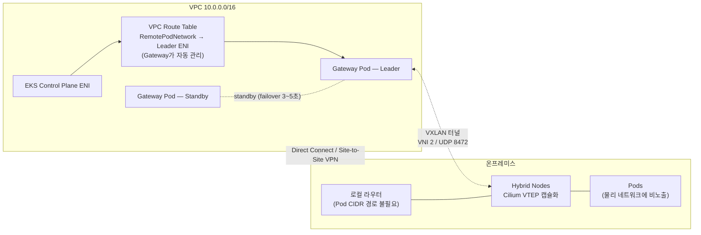

## 개요

Amazon EKS Hybrid Nodes 설계 단계에서 가장 빈번하게 검토되는 주제는 네트워킹과 라우팅 요건입니다. 본 문서는 세 가지 핵심 질문 — ① VPC와 온프레미스의 Node/Pod 대역 양방향 라우팅 필수 여부, ② Pod 트래픽의 NAT 구성 지원 범위, ③ CGNAT 대역(100.64.0.0/10) 사용 가능 여부 — 에 대해 AWS 공식 문서를 근거로 답하고, 2026년 4월 정식 출시(GA)된 Amazon EKS Hybrid Nodes Gateway가 각 답변을 어떻게 변화시키는지 분석합니다. 대상 독자는 하이브리드 클러스터의 네트워크 토폴로지를 설계하는 인프라 아키텍트와 플랫폼 엔지니어입니다.

:::info 검증 기준
본 문서의 모든 핵심 주장은 EKS User Guide, CloudFormation Template Reference, AWS Containers Blog 원문을 직접 확인한 후 작성되었습니다(2026-06-12 기준).
:::

## 배경: 네트워킹 기본 구조

EKS Hybrid Nodes 아키텍처에서 VPC는 네트워크 허브 역할을 수행합니다. EKS 컨트롤 플레인은 클러스터 생성 시 지정한 서브넷에 ENI(Elastic Network Interface)를 연결하고, 클라우드 경계를 넘는 모든 트래픽은 이 VPC를 경유합니다. 온프레미스와 VPC는 AWS Direct Connect, AWS Site-to-Site VPN, 또는 자체 VPN으로 연결합니다.

클러스터 생성 시 두 가지 원격 대역을 입력합니다.

| 필드 | 의미 | 할당 주체 |
|------|------|----------|
| `RemoteNodeNetwork` | 하이브리드 노드 머신의 IP 대역 | 온프레미스 네트워크 |
| `RemotePodNetwork` | 하이브리드 노드 위 Pod의 IP 대역 | CNI(오버레이 네트워크) |

EKS 컨트롤 플레인은 이 대역을 기준으로 해당 목적지 트래픽을 VPC를 거쳐 온프레미스로 라우팅합니다.

## Node/Pod 대역 라우팅 요건

결론은 **Node 대역 필수, Pod 대역 권장(선택)** 입니다. 공식 문서의 핵심 제약은 다음과 같습니다.

> "The main constraint is that the EKS control plane and all nodes, cloud or hybrid nodes, need to form a **fully routed** network. This means that all nodes must be able to reach each other at layer three, by IP address."
> — [Networking concepts for hybrid nodes](https://docs.aws.amazon.com/eks/latest/userguide/hybrid-nodes-concepts-networking.html)

"fully routed" 요건은 노드 레벨에 적용됩니다. `kubectl logs`, `kubectl exec` 같은 명령은 컨트롤 플레인이 노드의 kubelet(10250 포트)으로 직접 연결을 개시하므로, VPC 라우트 테이블에 Node CIDR 경로가 필요하고 온프레미스에서도 노드 IP가 라우팅 가능해야 합니다.

반면 Pod 대역은 같은 문서가 명시적으로 선택 사항으로 규정합니다.

> "Note, the constraint for making your on-premises pod CIDRs routable is **optional**."

다만 다음 기능 중 하나라도 필요하면 Pod 대역 라우팅이 사실상 필수가 됩니다.

| Pod CIDR 라우팅이 필요한 기능 | 사유 |
|------|------|
| 하이브리드 노드에서 웹훅 실행 (AWS Load Balancer Controller, cert-manager 등) | API server가 webhook Pod IP로 직접 연결 개시 |
| 클라우드 Pod ↔ 온프레미스 Pod 직접 통신 (east-west) | VPC CNI(클라우드)와 Cilium/Calico(온프렘) 간 직접 경로 필요 |
| Metrics Server를 하이브리드 노드에서 실행 | 컨트롤 플레인 → Metrics Server Pod IP 연결 필요 |
| Amazon Managed Service for Prometheus(AMP) managed collector | Pod 메트릭 스크래핑 (대안: ADOT 애드온) |
| ALB/NLB의 IP 타겟으로 하이브리드 Pod 지정 | 타겟 IP가 AWS에서 라우팅 가능해야 함 |

이 차이는 CNI 동작 방식에서 기인합니다. 클라우드 노드의 VPC CNI는 Pod IP를 VPC 대역에서 직접 할당하므로 별도 라우팅이 불필요합니다. 온프레미스의 Cilium/Calico는 기본적으로 VXLAN 오버레이에서 Pod를 실행하므로, 물리 네트워크가 오버레이 대역을 인지하지 못하면 Pod IP 목적지 트래픽은 폐기됩니다. 해결하려면 BGP(권장) 또는 정적 라우팅으로 Pod CIDR을 온프레미스 네트워크에 광고해야 하며, AWS는 Cilium과 Calico의 BGP 기능을 지원합니다.

라우팅 부담은 비대칭적입니다. VPC 측은 "Pod CIDR → 게이트웨이" 경로 하나로 충분하지만, 온프레미스 측은 하이브리드 노드와 같은 서브넷의 로컬 라우터가 노드별 Pod CIDR 슬라이스까지 알아야 합니다. 이 운영 부담이 Hybrid Nodes Gateway 출시의 배경입니다.

## Hybrid Nodes Gateway 아키텍처

2026년 4월 21일 발표된 [Amazon EKS Hybrid Nodes Gateway](https://aws.amazon.com/about-aws/whats-new/2026/04/amazon-eks-hybrid-nodes-gateway/)는 Pod 대역 라우팅 요건을 제거합니다.

> "The gateway **eliminates the need to make on-premises pod networks routable from the VPC** or coordinate network infrastructure changes."
> — [Amazon EKS Hybrid Nodes gateway](https://docs.aws.amazon.com/eks/latest/userguide/hybrid-nodes-gateway-overview.html)

### 동작 원리

Gateway는 Cilium CNI의 VTEP(VXLAN Tunnel Endpoint) 기능을 활용합니다. VPC 안의 EC2 게이트웨이 노드와 온프레미스의 Cilium 노드 사이에 VXLAN 터널(`hybrid_vxlan0` 인터페이스, VNI 2, UDP 8472)을 구성하고 Pod 트래픽을 캡슐화해 전달합니다. 물리 네트워크에는 노드 IP 간 UDP 트래픽만 흐르며 Pod CIDR은 노출되지 않습니다.



고가용성은 Kubernetes Lease 기반 leader election의 active-standby 모델로 구현됩니다. 두 게이트웨이 Pod가 pod anti-affinity로 서로 다른 노드(권장: 서로 다른 가용 영역)에서 실행되고, 두 Pod 모두 기동 시점에 VXLAN 인터페이스와 전체 하이브리드 노드의 VTEP 엔트리를 사전 구성합니다. Leader 장애 시 standby가 lease를 획득하고 VPC 라우트와 `CiliumVTEPConfig` CRD를 자신으로 갱신하기까지 약 15~30초의 failover가 발생합니다(lease/renew 파라미터 조정으로 단축 가능).

배포는 Helm으로 수행하며 EKS Auto Mode(권장) 또는 managed node group을 게이트웨이 노드로 사용합니다.

```bash
helm install eks-hybrid-nodes-gateway \
  oci://public.ecr.aws/eks/eks-hybrid-nodes-gateway \
  --version 1.0.0 \
  --namespace eks-hybrid-nodes-gateway \
  --create-namespace \
  --set vpcCIDR=VPC_CIDR \
  --set podCIDRs=POD_CIDRS \
  --set routeTableIDs=ROUTE_TABLE_IDS
```

### 도입 전 검토 항목

| # | 항목 | 내용 |
|---|------|------|
| 1 | 전송 구간 암호화 미지원 | VXLAN 터널은 트래픽을 암호화하지 않음(공식 문서 명시). 암호화 필요 시 Direct Connect + MACsec 또는 VPN을 전송 계층으로 사용 |
| 2 | Cilium 전용 | EKS 버전 Cilium + VTEP 활성화 필수. 다른 CNI 미지원 — Calico 사용 환경은 Cilium 전환 선행 필요 |
| 3 | 클라우드 노드 VPC CNI 필수 | 게이트웨이는 VPC-native 라우팅에 의존. 게이트웨이 노드는 source/destination check 비활성화 필요(`sourceDestCheck: DisabledPrimaryENI`) |
| 4 | 방화벽 | 게이트웨이 보안 그룹과 온프레미스 방화벽 양쪽에서 UDP 8472 허용 |
| 5 | IAM 권한 | `ec2:DescribeRouteTables`, `ec2:CreateRoute`, `ec2:ReplaceRoute`, `ec2:DescribeInstances` 필요. EKS Pod Identity로 게이트웨이 서비스 어카운트에만 부여하는 방식 권장 |
| 6 | 클러스터당 1세트 | 게이트웨이 배포 하나는 단일 EKS 클러스터 담당 |
| 7 | 제거 시 라우트 수동 정리 | Helm uninstall은 VPC 라우트 엔트리를 자동 삭제하지 않음 |
| 8 | 리전·비용 | China 리전 제외 전 Hybrid Nodes 지원 리전에서 사용 가능. Gateway 자체 무료, 게이트웨이용 EC2 및 Auto Mode 관리 요금만 과금. [오픈소스 공개](https://github.com/aws/eks-hybrid-nodes-gateway) |

Gateway 도입 후에도 **Node 대역 라우팅과 VPC↔온프레미스 사설 연결 요건은 유지**됩니다. Gateway는 Pod 레이어의 라우팅 문제를 해결하는 것이며 하이브리드 연결 자체를 대체하지 않습니다.

## Pod 트래픽 NAT 구성과 한계

NAT 지원 여부는 트래픽 방향에 따라 다릅니다. 공식 문서는 unroutable Pod 네트워크 환경의 가이드로 CNI 레벨 NAT를 명시합니다.

> "Configure your CNI to use egress masquerade or network address translation (NAT) for pod traffic as it leaves your on-premises hosts. **This is enabled by default in Cilium. Calico requires `natOutgoing` to be set to `true`.**"
> — [Prepare networking for hybrid nodes](https://docs.aws.amazon.com/eks/latest/userguide/hybrid-nodes-networking.html)

[Traffic flows 문서](https://docs.aws.amazon.com/eks/latest/userguide/hybrid-nodes-concepts-traffic-flows.html)는 이 동작을 패킷 레벨로 설명합니다. CNI가 Pod 발신 패킷의 source IP를 노드 IP로 SNAT하면, 복귀 트래픽은 Node CIDR 경로만으로 돌아오고 conntrack이 SNAT를 역변환합니다.

```text
[egress — 지원됨]
Pod(10.85.1.56)
   │  CNI SNAT: Src 10.85.1.56 → 10.80.0.2 (Node IP)
   ▼
Node(10.80.0.2) ─► 온프렘 라우터 ─► DX/VPN ─► EKS Control Plane ENI
   ▲                                              │
   └── VPC Route: Node CIDR → VGW/TGW ◄───────────┘
       (Pod CIDR 경로 없이 복귀 가능)

[inbound — NAT로 해결 불가]
EKS Control Plane ─► webhook Pod IP(10.85.1.23:8443) ─► ???
(NAT는 외부에서 개시되는 연결의 경로를 생성하지 못함)
```

정리하면 다음과 같습니다.

- **온프레미스 Pod → AWS 방향(egress)**: 공식 지원 패턴입니다.
- **AWS → 온프레미스 Pod 방향(inbound)** — 웹훅, Metrics Server, AMP 스크래핑, ALB/NLB IP 타겟 — 은 컨트롤 플레인이나 AWS 서비스가 Pod IP로 직접 연결을 개시하므로 SNAT로 해결할 수 없습니다.

두 가지 추가 유의 사항이 있습니다.

1. 공식 문서가 Pod 트래픽 NAT 수단으로 명시하는 것은 CNI 레벨 masquerade뿐입니다. AWS 관리형 NAT Gateway나 온프레미스 자체 NAT 장비는 이 용도로 다루지 않으며, 하이브리드 트래픽 경로는 VGW/TGW를 경유합니다.
2. Hybrid Nodes Gateway는 NAT가 아닌 VXLAN 캡슐화(터널링) 방식이므로 NAT의 구조적 한계인 inbound 문제가 없습니다.

아키텍처 선택지는 세 가지로 수렴합니다.

| 옵션 | Egress | 웹훅/Inbound | East-west | 트레이드오프 |
|------|--------|--------------|-----------|--------------|
| ① Pod CIDR 풀 라우팅 (BGP 권장) | O | O | O | 가장 완전. 네트워크팀 협업·BGP 운영 필요 |
| ② CNI NAT (unroutable) | O | X — 웹훅은 클라우드 노드 배치 | X | 가장 단순. 기능 제약 큼 |
| ③ Hybrid Nodes Gateway | O | O | O | 라우팅 협의 불필요. Cilium 전용, 암호화 미내장, 게이트웨이 EC2 비용 |

Calico 유지가 필요한 환경에서는 ③이 제외되므로 ①과 ② 중에서 선택해야 합니다.

## CGNAT 대역(100.64.0.0/10) 지원

CGNAT 대역은 공식 지원됩니다. 네트워킹 문서는 온프레미스 Node/Pod CIDR의 허용 대역을 다음과 같이 정의합니다.

> "Be within one of the following `IPv4` RFC-1918 ranges: `10.0.0.0/8`, `172.16.0.0/12`, or `192.168.0.0/16`, **or within the CGNAT range defined by RFC 6598: `100.64.0.0/10`**."
> — [Prepare networking for hybrid nodes](https://docs.aws.amazon.com/eks/latest/userguide/hybrid-nodes-networking.html)

| 대역 | 표준 | RemoteNodeNetwork | RemotePodNetwork |
|------|------|-------------------|------------------|
| `10.0.0.0/8` | RFC 1918 | O | O |
| `172.16.0.0/12` | RFC 1918 | O | O |
| `192.168.0.0/16` | RFC 1918 | O | O |
| `100.64.0.0/10` | RFC 6598 (CGNAT) | **O** | **O** |
| 그 외 public 대역 | — | X | X |

추가 제약은 세 가지입니다. 온프레미스 Node/Pod CIDR은 ① 서로 간, ② VPC CIDR, ③ Kubernetes Service IPv4 CIDR과 겹치지 않아야 합니다.

CGNAT 대역은 RFC 1918 공간이 포화된 환경에서 유용합니다. 금융권처럼 사설 대역을 광범위하게 점유한 네트워크에서 `100.64.0.0/10`을 `RemotePodNetwork` 전용으로 할당하면 겹침 회피가 수월합니다. 다만 통신사 CGNAT 구간이나 일부 사내 서비스가 이 대역을 선점한 경우가 있으므로 사전 IP 인벤토리 점검이 필요합니다.

:::warning IaC 레퍼런스 문서의 표기 불일치
CloudFormation의 [`AWS::EKS::Cluster RemotePodNetwork` 레퍼런스](https://docs.aws.amazon.com/AWSCloudFormation/latest/TemplateReference/aws-properties-eks-cluster-remotepodnetwork.html)는 2026-06-12 기준 "Each block must be within an IPv4 RFC-1918 network range"로만 기재되어 CGNAT 대역 표기가 누락되어 있습니다. User Guide가 더 최신 내용으로 보이나, 실제 API 검증 로직이 어느 쪽과 일치하는지는 문서만으로 단정할 수 없습니다. CloudFormation/CDK/Terraform 경로로 100.64 대역을 배포할 계획이라면 프로덕션 적용 전 비프로덕션 환경 검증이 필요합니다.
:::

## 요약

EKS Hybrid Nodes의 네트워킹 설계는 "온프레미스 Pod 대역을 라우팅 가능하게 만들 것인가"라는 질문으로 수렴합니다. Node 대역의 양방향 라우팅과 사설 연결(DX/VPN)은 모든 구성에서 필수입니다. Pod 대역 라우팅은 선택이지만 웹훅·east-west·AWS 서비스 연동에는 필요하며, 전통적으로 BGP 기반 풀 라우팅이 해법이었습니다. 라우팅이 불가능한 환경에서는 CNI egress NAT로 기본 동작을 확보하되 inbound 의존 기능을 포기해야 했습니다. 2026년 4월 GA된 Hybrid Nodes Gateway는 VXLAN 터널링으로 이 딜레마를 우회하며, Cilium 전용·전송 암호화 미내장이라는 전제 조건이 따릅니다. IP 대역 측면에서는 RFC 1918에 더해 RFC 6598(100.64.0.0/10)이 공식 허용됩니다.

## 참고 자료

### 공식 문서
- [Prepare networking for hybrid nodes](https://docs.aws.amazon.com/eks/latest/userguide/hybrid-nodes-networking.html) — CIDR 요건, routable/unroutable 가이드, 방화벽·보안 그룹 규칙
- [Networking concepts for hybrid nodes](https://docs.aws.amazon.com/eks/latest/userguide/hybrid-nodes-concepts-networking.html) — fully routed 제약, Pod CIDR 선택 사항 명시
- [Network traffic flows for hybrid nodes](https://docs.aws.amazon.com/eks/latest/userguide/hybrid-nodes-concepts-traffic-flows.html) — CNI NAT 유무별 패킷 레벨 트래픽 흐름
- [Configure webhooks for hybrid nodes](https://docs.aws.amazon.com/eks/latest/userguide/hybrid-nodes-webhooks.html) — mixed mode 권고, 애드온별 affinity 설정
- [Amazon EKS Hybrid Nodes gateway](https://docs.aws.amazon.com/eks/latest/userguide/hybrid-nodes-gateway-overview.html) — Gateway 아키텍처, 배포 모델, 제약 사항
- [Get started with EKS Hybrid Nodes gateway](https://docs.aws.amazon.com/eks/latest/userguide/hybrid-nodes-gateway-getting-started.html) — 전제 조건, IAM, Helm 설치
- [AWS::EKS::Cluster RemotePodNetwork (CloudFormation)](https://docs.aws.amazon.com/AWSCloudFormation/latest/TemplateReference/aws-properties-eks-cluster-remotepodnetwork.html) — CGNAT 표기 누락 상태의 IaC 레퍼런스

### 기술 블로그
- [Introducing the Amazon EKS Hybrid Nodes gateway — AWS What's New](https://aws.amazon.com/about-aws/whats-new/2026/04/amazon-eks-hybrid-nodes-gateway/) — GA 발표 (2026-04-21)
- [Simplify hybrid Kubernetes networking with Amazon EKS Hybrid Nodes gateway — AWS Containers Blog](https://aws.amazon.com/blogs/containers/simplify-hybrid-kubernetes-networking-with-amazon-eks-hybrid-nodes-gateway/) — Gateway 딥다이브 (2026-05-01)
- [aws/eks-hybrid-nodes-gateway — GitHub](https://github.com/aws/eks-hybrid-nodes-gateway) — Gateway 오픈소스 저장소

### 관련 문서 (내부)
- [하이브리드 노드 완전 가이드](./hybrid-nodes-adoption-guide.md) — Hybrid Nodes 도입 전체 절차(네트워킹·DNS·Harbor·GPU·비용)
- [East-West 트래픽 최적화](../eks-best-practices/networking-performance/east-west-traffic-best-practice.md) — 클러스터 내부 트래픽 최적화 전략
