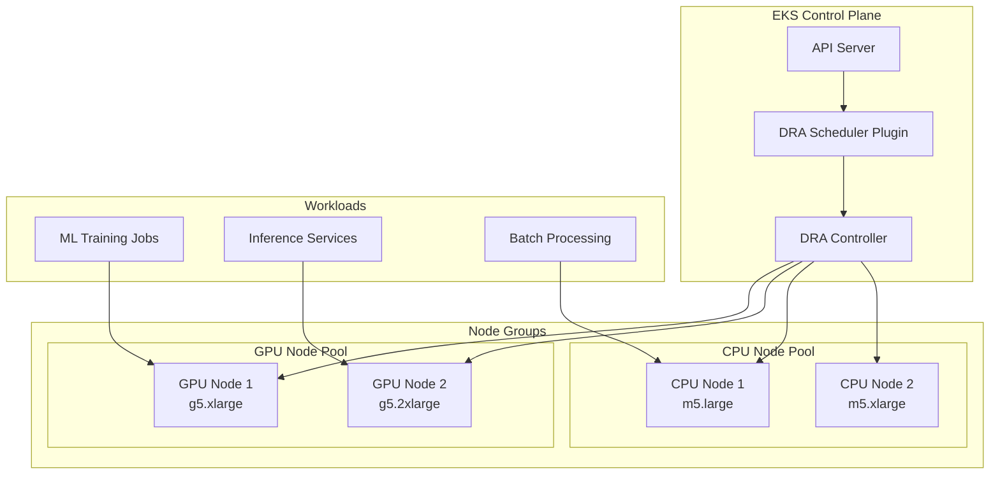

# EKS DRA: Hybrid Nodes 아키텍처

## 개요

Amazon EKS의 동적 리소스 할당(DRA)은 GPU 및 CPU 리소스가 모두 필요한 워크로드에 대한 유연한 리소스 관리를 지원합니다. 이 문서는 하이브리드 노드 구성에 대한 아키텍처 및 구현 패턴을 설명합니다.

:::info DRA란?
동적 리소스 할당(DRA)은 Kubernetes 1.26에서 도입된 기능으로, Pod이 요청할 때 GPU, NPU, 특수 가속기 등의 리소스를 동적으로 할당할 수 있게 합니다. 이는 기존의 정적 리소스 할당 방식을 개선하여 더 효율적인 리소스 활용을 가능하게 합니다.
:::

## Architecture Pattern

### Core Components



## Implementation

### 1. Enable DRA in EKS

First, enable the DRA feature gate in your EKS cluster:

```yaml
apiVersion: eksctl.io/v1alpha5
kind: ClusterConfig
metadata:
  name: hybrid-dra-cluster
  region: us-west-2
  version: "1.30"

kubernetesNetworkConfig:
  serviceIPv4CIDR: 10.100.0.0/16

managedNodeGroups:
  - name: cpu-nodes
    instanceType: m5.xlarge
    desiredCapacity: 3
    minSize: 1
    maxSize: 10
    labels:
      node-type: cpu
      workload: general

  - name: gpu-nodes
    instanceType: g5.xlarge
    desiredCapacity: 2
    minSize: 1
    maxSize: 5
    labels:
      node-type: gpu
      workload: ml
    taints:
      - key: nvidia.com/gpu
        value: "true"
        effect: NoSchedule
```

### 2. Deploy DRA Driver

Install the DRA driver for resource management:

```bash
# Add the DRA driver helm repository
helm repo add dra-driver https://charts.dra.io
helm repo update

# Install DRA driver
helm install dra-driver dra-driver/dra-driver \
  --namespace kube-system \
  --set driver.name=eks-hybrid-dra \
  --set driver.enableGPU=true \
  --set driver.enableCPU=true
```

### 3. Define Resource Classes

Create resource classes for different workload types:

```yaml
apiVersion: resource.k8s.io/v1alpha2
kind: ResourceClass
metadata:
  name: gpu-compute-class
spec:
  driverName: eks-hybrid-dra
  suitableNodes:
    nodeSelectorTerms:
    - matchExpressions:
      - key: node-type
        operator: In
        values: ["gpu"]
  parametersRef:
    name: gpu-parameters
    namespace: kube-system
---
apiVersion: resource.k8s.io/v1alpha2
kind: ResourceClass
metadata:
  name: cpu-compute-class
spec:
  driverName: eks-hybrid-dra
  suitableNodes:
    nodeSelectorTerms:
    - matchExpressions:
      - key: node-type
        operator: In
        values: ["cpu"]
  parametersRef:
    name: cpu-parameters
    namespace: kube-system
```

### 4. Configure Resource Claims

Define resource claims for workloads:

```yaml
apiVersion: resource.k8s.io/v1alpha2
kind: ResourceClaimTemplate
metadata:
  name: ml-training-claim
  namespace: ml-workloads
spec:
  spec:
    resourceClassName: gpu-compute-class
    allocationMode: WaitForFirstConsumer
    parametersRef:
      name: ml-training-params
      namespace: ml-workloads
---
apiVersion: v1
kind: ConfigMap
metadata:
  name: ml-training-params
  namespace: ml-workloads
data:
  gpu-count: "1"
  gpu-memory: "16Gi"
  cuda-version: "12.2"
```

## Workload Deployment

### ML Training Job Example

```yaml
apiVersion: batch/v1
kind: Job
metadata:
  name: ml-training-job
  namespace: ml-workloads
spec:
  template:
    metadata:
      labels:
        app: ml-training
    spec:
      resourceClaims:
      - name: gpu-resource
        source:
          resourceClaimTemplateName: ml-training-claim
      containers:
      - name: training
        image: pytorch/pytorch:2.1.0-cuda12.1-cudnn8-runtime
        command: ["python", "train.py"]
        resources:
          claims:
          - name: gpu-resource
        env:
        - name: CUDA_VISIBLE_DEVICES
          value: "0"
      restartPolicy: OnFailure
      tolerations:
      - key: nvidia.com/gpu
        operator: Equal
        value: "true"
        effect: NoSchedule
```

### Inference Service Example

```yaml
apiVersion: apps/v1
kind: Deployment
metadata:
  name: inference-service
  namespace: ml-workloads
spec:
  replicas: 2
  selector:
    matchLabels:
      app: inference
  template:
    metadata:
      labels:
        app: inference
    spec:
      resourceClaims:
      - name: gpu-resource
        source:
          resourceClaimTemplateName: inference-claim
      containers:
      - name: inference
        image: tensorflow/serving:2.14.0-gpu
        ports:
        - containerPort: 8501
        resources:
          claims:
          - name: gpu-resource
        env:
        - name: MODEL_NAME
          value: "production_model"
      tolerations:
      - key: nvidia.com/gpu
        operator: Equal
        value: "true"
        effect: NoSchedule
```

## Monitoring and Observability

### Metrics Collection

Deploy Prometheus and Grafana for monitoring:

```yaml
apiVersion: v1
kind: ServiceMonitor
metadata:
  name: dra-metrics
  namespace: monitoring
spec:
  selector:
    matchLabels:
      app: dra-driver
  endpoints:
  - port: metrics
    interval: 30s
    path: /metrics
```

### Key Metrics to Monitor

:::tip
Monitor these critical metrics for DRA performance:
- `dra_allocation_duration_seconds` - Time to allocate resources
- `dra_allocation_errors_total` - Failed allocation attempts
- `dra_resource_utilization_ratio` - Resource usage efficiency
- `dra_pending_claims_total` - Unscheduled resource claims
:::

### Grafana Dashboard

```json
{
  "dashboard": {
    "title": "EKS DRA Hybrid Nodes",
    "panels": [
      {
        "title": "Resource Allocation Latency",
        "targets": [
          {
            "expr": "histogram_quantile(0.95, dra_allocation_duration_seconds)"
          }
        ]
      },
      {
        "title": "GPU Utilization",
        "targets": [
          {
            "expr": "avg(dra_resource_utilization_ratio{resource_type=\"gpu\"})"
          }
        ]
      }
    ]
  }
}
```

## Best Practices

### 1. Resource Quotas

Implement resource quotas to prevent resource exhaustion:

```yaml
apiVersion: v1
kind: ResourceQuota
metadata:
  name: ml-workloads-quota
  namespace: ml-workloads
spec:
  hard:
    resourceclaims.resource.k8s.io: "10"
    requests.nvidia.com/gpu: "4"
```

### 2. Node Affinity Rules

Use node affinity for optimal placement:

```yaml
affinity:
  nodeAffinity:
    preferredDuringSchedulingIgnoredDuringExecution:
    - weight: 100
      preference:
        matchExpressions:
        - key: node-type
          operator: In
          values: ["gpu"]
        - key: instance-type
          operator: In
          values: ["g5.xlarge", "g5.2xlarge"]
```

### 3. Cost Optimization

:::warning
GPU nodes are expensive. Implement these cost-saving measures:
- Use Spot instances for non-critical workloads
- Implement cluster autoscaling with proper cool-down periods
- Schedule batch jobs during off-peak hours
- Use Karpenter for intelligent node provisioning
:::

### 4. Security Considerations

```yaml
apiVersion: v1
kind: NetworkPolicy
metadata:
  name: gpu-node-isolation
  namespace: ml-workloads
spec:
  podSelector:
    matchLabels:
      workload: ml
  policyTypes:
  - Ingress
  - Egress
  ingress:
  - from:
    - namespaceSelector:
        matchLabels:
          name: ml-workloads
  egress:
  - to:
    - namespaceSelector:
        matchLabels:
          name: ml-workloads
```

## Troubleshooting

### Common Issues

#### 1. Resource Claims Pending

Check claim status:
```bash
kubectl describe resourceclaim <claim-name> -n <namespace>
kubectl get events -n <namespace> --field-selector involvedObject.name=<claim-name>
```

#### 2. GPU Not Detected

Verify GPU driver installation:
```bash
kubectl get nodes -L nvidia.com/gpu.present
kubectl describe node <gpu-node-name> | grep -i nvidia
```

#### 3. Allocation Failures

Check DRA driver logs:
```bash
kubectl logs -n kube-system -l app=dra-driver --tail=100
kubectl get resourceclasses
kubectl get resourceclaims --all-namespaces
```

## Performance Tuning

### Scheduler Configuration

Optimize scheduler for DRA:

```yaml
apiVersion: v1
kind: ConfigMap
metadata:
  name: scheduler-config
  namespace: kube-system
data:
  config.yaml: |
    apiVersion: kubescheduler.config.k8s.io/v1beta3
    kind: KubeSchedulerConfiguration
    profiles:
    - schedulerName: default-scheduler
      plugins:
        filter:
          enabled:
          - name: DynamicResources
        score:
          enabled:
          - name: DynamicResources
      pluginConfig:
      - name: DynamicResources
        args:
          scoringStrategy:
            type: LeastAllocated
```

### Resource Preallocation

For latency-sensitive workloads:

```yaml
apiVersion: resource.k8s.io/v1alpha2
kind: ResourceClaim
metadata:
  name: preallocated-gpu
  namespace: ml-workloads
spec:
  resourceClassName: gpu-compute-class
  allocationMode: Immediate  # Preallocate resource
  parametersRef:
    name: gpu-params
    namespace: ml-workloads
```

## Migration Strategy

### From Static to DRA

1. **Inventory Current Resources**
   ```bash
   kubectl get nodes -o json | jq '.items[] | {name: .metadata.name, gpu: .status.allocatable["nvidia.com/gpu"]}'
   ```

2. **Create Migration Plan**
   - Identify workloads using static GPU allocation
   - Create corresponding ResourceClaimTemplates
   - Test with non-production workloads first

3. **Gradual Migration**
   ```bash
   # Label nodes for gradual migration
   kubectl label node <node-name> migration-phase=dra

   # Update workloads progressively
   kubectl patch deployment <deployment-name> --type merge -p '{"spec":{"template":{"spec":{"resourceClaims":[...]}}}}'
   ```

## Conclusion

Dynamic Resource Allocation in EKS provides flexible and efficient resource management for hybrid workloads. By implementing DRA with proper monitoring and best practices, teams can optimize resource utilization while maintaining performance and reliability.

### Next Steps

- Review the [AWS DRA documentation](https://docs.aws.amazon.com/eks/latest/userguide/dra.html)
- Implement monitoring dashboards
- Test failover scenarios
- Document runbooks for common issues

## References

- [Kubernetes DRA KEP](https://github.com/kubernetes/enhancements/tree/master/keps/sig-node/3063-dynamic-resource-allocation)
- [EKS Best Practices Guide](https://aws.github.io/aws-eks-best-practices/)
- [NVIDIA GPU Operator](https://docs.nvidia.com/datacenter/cloud-native/gpu-operator/overview.html)