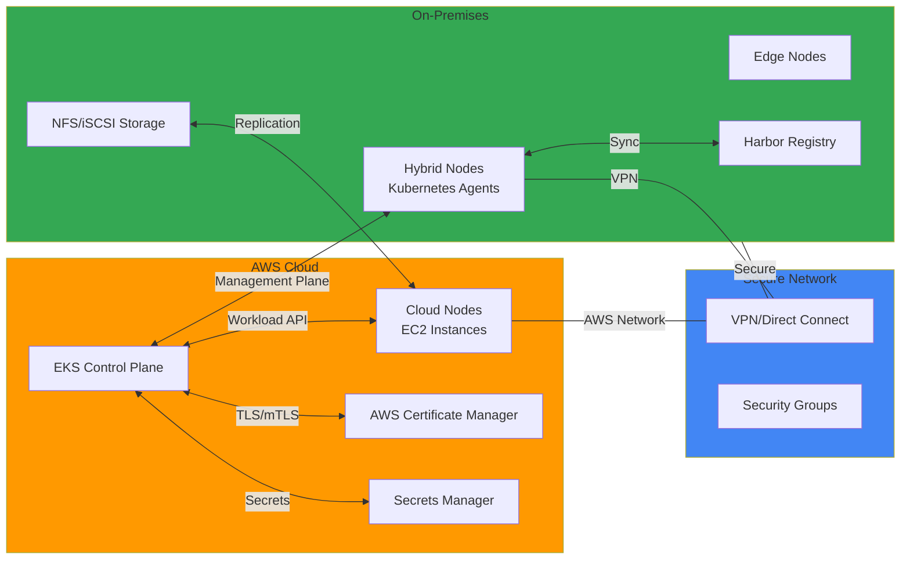

# Hybrid & Multi-Cloud

이 섹션에서는 Amazon EKS를 활용한 하이브리드 클라우드 및 멀티 클라우드 환경 구축에 대한 심화 기술 문서들을 다룹니다. 온프레미스 노드 연결, 클라우드 버스팅, 하이브리드 스토리지, DRA(Dynamic Resource Allocation) 등을 통해 유연한 인프라 구축이 가능합니다.

## 📚 주요 문서

### 기본 하이브리드 구성
- **[Extending EKS Beyond the Cloud: Your First Hybrid Node Setup](./hybrid-node-configuration.md)**
  - 온프레미스 노드를 EKS 클러스터에 연결하는 기본 방법
  - 하이브리드 네트워킹 구성 및 보안 설정
  - 온프레미스 노드 등록 및 초기 구성
  - 실제 구성 단계별 가이드

### 하이브리드 워크로드 관리
- **[EKS Hybrid Nodes Adoption Guide](./hybrid-nodes-adoption-guide.md)**
  - 하이브리드 환경으로의 마이그레이션 전략
  - 워크로드 선택 및 배치 기준
  - 단계별 도입 계획
  - 모범 사례 및 lessons learned

### 고급 하이브리드 기능
- **[Dynamic Resource Allocation for Hybrid Nodes](./eks-dra-hybrid-nodes.md)**
  - DRA(Dynamic Resource Allocation) 기술
  - 복잡한 리소스 요구사항 관리
  - GPU 및 특수 하드웨어 활용

- **[SR-IOV and DGX H200 Integration](./sriov-dgx-h200-hybrid.md)**
  - SR-IOV를 통한 고성능 네트워킹
  - NVIDIA DGX H200 시스템 통합
  - 고성능 컴퓨팅 워크로드 최적화

### 하이브리드 스토리지
- **[Harbor Registry and Hybrid Storage Integration](./harbor-hybrid-integration.md)**
  - Harbor를 통한 컨테이너 이미지 레지스트리 운영
  - 온프레미스와 클라우드 간 이미지 동기화
  - 이미지 저장소 보안 및 접근 제어

- **[File Storage for Hybrid Nodes](./hybrid-nodes-file-storage.md)**
  - 온프레미스 노드의 파일 스토리지 구성
  - NFS, iSCSI 등 스토리지 프로토콜 활용
  - 클라우드와 온프레미스 간 데이터 동기화

## 🎯 학습 목표

이 섹션을 통해 다음을 학습할 수 있습니다:

- 하이브리드 클라우드 아키텍처 설계 및 구현 방법
- 온프레미스와 클라우드 간 워크로드 분산 및 마이그레이션
- 하이브리드 환경에서의 네트워크 연결 및 보안 설정
- 복잡한 리소스 요구사항 관리 (DRA)
- 고성능 컴퓨팅 워크로드 최적화
- 하이브리드 환경에서의 스토리지 관리
- 클라우드 버스팅을 통한 탄력적 확장
- 하이브리드 환경에서의 모니터링 및 관리

## 🏗️ 아키텍처 패턴

## 🔧 주요 기술 및 도구

| 기술 | 설명 | 용도 |
|------|------|------|
| **EKS Hybrid Nodes** | 온프레미스 노드 연결 | 기존 인프라 활용 |
| **AWS Outposts** | 완전 관리형 하이브리드 인프라 | 완전한 AWS 환경 |
| **AWS Systems Manager** | 하이브리드 노드 중앙 관리 | 에이전트 및 패치 관리 |
| **VPN / Direct Connect** | 안전한 네트워크 연결 | 데이터 센터 연결 |
| **Karpenter** | 하이브리드 환경 자동 스케일링 | 비용 효율적 리소스 관리 |
| **Harbor Registry** | 컨테이너 이미지 저장소 | 분산 환경 이미지 관리 |
| **NFS / iSCSI** | 네트워크 스토리지 | 데이터 공유 |

## 💡 핵심 개념

### 하이브리드 노드의 작동 원리
- **에이전트**: 온프레미스의 각 노드에서 실행되는 경량 에이전트
- **관리 채널**: AWS의 관리 평면과 안전한 통신
- **워크로드 실행**: Kubernetes 워크로드가 온프레미스 노드에서 실행
- **모니터링**: 클라우드에서 중앙집중식 모니터링

### 클라우드 버스팅 전략
- **자동 스케일**: 온프레미스 용량 초과 시 클라우드로 자동 확장
- **비용 최적화**: 필요한 만큼만 클라우드 리소스 사용
- **성능 유지**: 레이턴시를 고려한 워크로드 배치

### 네트워크 고려사항
- **대역폭**: 온프레미스-클라우드 간 네트워크 대역폭 제한
- **레이턴시**: 네트워크 지연을 고려한 애플리케이션 설계
- **보안**: 데이터 센터와 클라우드 간 암호화 통신

### 리소스 격리
- **네임스페이스**: 온프레미스/클라우드 워크로드 분리
- **노드 어피니티**: 특정 노드 타입으로 워크로드 배치
- **정책**: 컴플라이언스 요구사항 준수

## 💼 사용 사례

### 데이터 주권 및 컴플라이언스
- 민감한 데이터의 온프레미스 보관
- 규제 요구사항 준수
- 지역별 데이터 처리 요구사항
- GDPR, HIPAA 등 규제 준수

### 레이턴시 최적화
- 엣지 컴퓨팅 워크로드
- 실시간 데이터 처리
- 지역별 서비스 제공
- 로컬 데이터센터와의 빠른 통신

### 비용 최적화
- 기존 온프레미스 인프라 활용
- 클라우드 버스팅을 통한 탄력적 확장
- 피크 타임 외 온프레미스 리소스 활용
- Spot 인스턴스와 하이브리드 조합

### 마이그레이션 경로
- 온프레미스에서 클라우드로의 단계적 마이그레이션
- 기존 애플리케이션과 새로운 클라우드 네이티브 앱 공존
- 성능 평가 후 마이그레이션 결정

## 📊 하이브리드 환경 고려사항

| 항목 | 고려사항 | 해결 방법 |
|------|--------|----------|
| **네트워크** | 대역폭 제한 | 데이터 압축, 로컬 캐싱 |
| **레이턴시** | 높은 지연 | 워크로드 배치 최적화 |
| **보안** | 데이터 센터 보호 | VPN/Direct Connect + 암호화 |
| **운영** | 이중 관리 | 중앙 모니터링 및 자동화 |
| **비용** | 대역폭 비용 | 클라우드 버스팅 최적화 |

## 🔗 관련 카테고리

- [Security & Compliance](/docs/security-compliance) - 하이브리드 보안 요구사항
- [Performance & Networking](/docs/performance-networking) - 하이브리드 네트워킹
- [Observability & Monitoring](/docs/observability-monitoring) - 하이브리드 환경 모니터링

---

:::tip 팁
하이브리드 환경에서는 네트워크 레이턴시와 대역폭을 고려한 워크로드 배치 전략이 매우 중요합니다. 상태를 저장하는 워크로드는 가능한 한 온프레미스에 배치하고, 상태 없는 워크로드는 탄력적으로 확장하세요.
:::

:::info 추천 학습 경로
1. 기본 하이브리드 노드 설정
2. 네트워크 연결 및 보안
3. 워크로드 배치 및 마이그레이션
4. 고급 기능 (DRA, SR-IOV)
5. 운영 및 모니터링
:::

:::warning 주의 - 네트워크 대역폭
데이터 센터와 클라우드 간의 네트워크 비용은 예상보다 클 수 있습니다. 초기 설계 단계에서 네트워크 아키텍처를 신중하게 검토하고, Direct Connect 등의 경제적인 연결 방안을 고려하세요.
:::
