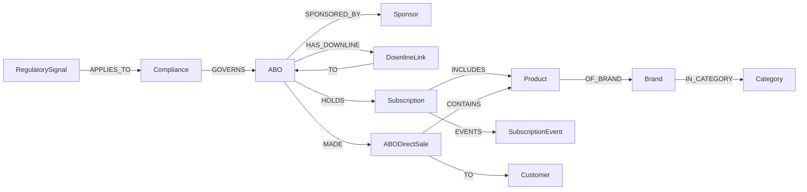

# Knowledge Graph 25 Classes (AMWAY)

> Neptune (openCypher) 기반 25 클래스 KG. 추정 ~700K edges (ABO Tree 깊이 반영). **ABO 다단계 조직 + 정기구독 + 글로벌 다국어** 특성 반영.

---

## 1. 25 클래스 개요

```mermaid
graph LR
    subgraph 고객["고객/회원 (5)"]
        ABO[ABO<br/>Amway Business Owner]
        Customer
        Sponsor
        DownlineLink[DownlineLink<br/>조직 트리 엣지]
        Persona
    end
    subgraph 상품["상품/카탈로그 (5)"]
        Product[Product / SKU]
        Category[Category<br/>Nutrition/Beauty/Home]
        Brand[Brand<br/>Nutrilite/Artistry/...]
        Subscription[Subscription<br/>정기구독 플랜]
        Bundle
    end
    subgraph 거래["거래/행동 (5)"]
        OrderTransaction[OrderTransaction<br/>자사몰]
        ABODirectSale[ABODirectSale<br/>ABO 직판]
        SubscriptionEvent[SubscriptionEvent<br/>구독·갱신·해지]
        SearchEvent
        ReviewRating
    end
    subgraph 채널["채널/캠페인 (5)"]
        Channel[Channel<br/>자사몰/ABO/카탈로그/앱]
        Campaign
        Promotion
        Touchpoint[Touchpoint<br/>SMS/이메일/SNS]
        Coupon
    end
    subgraph 운영["운영/외부 (5)"]
        SocialSignal
        WeatherSignal
        EconomicSignal[EconomicSignal<br/>환율·물가 (다국가)]
        RegulatorySignal[RegulatorySignal<br/>방판법·FTC·건기식]
        Compliance
    end
```

---

## 2. AMWAY 특화 클래스 상세

### 2.1 ABO + Customer + Sponsor + DownlineLink (조직 트리)

| 클래스 | 핵심 속성 | 주요 관계 |
|---|---|---|
| **ABO** | abo_id · level (Founders Platinum / Diamond / Founders Diamond / EDC / EC ...) · joined_at · country · pv · bv · cohort_tag | -[SPONSORED_BY]→ Sponsor · -[BELONGS_TO]→ Persona |
| **Customer** | customer_id · age_band · region · cohort_tag | -[REFERRED_BY]→ ABO |
| **Sponsor** | sponsor_id · upline_chain (compressed path) | -[SPONSORED]→ ABO |
| **DownlineLink** | from_abo · to_abo · depth · since | -[CHAIN]→ ABO (양방향) |
| **Persona** | persona_id · name (라이프스타일 5종) · traits | -[CLASSIFIES]→ ABO|Customer |

### 2.2 Subscription (정기구독)

| 클래스 | 핵심 속성 | 주요 관계 |
|---|---|---|
| **Subscription** | sub_id · plan (월/분기) · sku_list · auto_renew · paused_at · cancelled_at | -[OF]→ ABO|Customer · -[INCLUDES]→ Product |
| **SubscriptionEvent** | event_id · type (start/renew/pause/cancel) · at | -[ON]→ Subscription |

### 2.3 RegulatorySignal (직접판매 규제)

| 클래스 | 속성 |
|---|---|
| **RegulatorySignal** | rule_id · jurisdiction (FTC/방판법/EU) · topic (광고·등급·미성년·환불) · effective_at |

---

## 3. 핵심 관계 예시 (ABO 트리 + 구독)



엣지 추정:
- ABO × DownlineLink (~250K, 평균 트리 깊이 5단)
- ABO × Subscription × SubscriptionEvent (~120K)
- ABODirectSale × Customer × Product (~200K)
- 자사몰 OrderTransaction × Product (~80K)
- 외부 시그널 (~50K)

→ **약 700K edges**

---

## 4. openCypher 예시

### 4.1 S9-A — Diamond 등급 ABO의 5단 Downline 트리
```cypher
MATCH (root:ABO {level: 'Diamond', abo_id: $rootId})
CALL {
  WITH root
  MATCH path = (root)-[:HAS_DOWNLINE*1..5]->(d:ABO)
  RETURN d, length(path) AS depth
}
RETURN d.abo_id, d.level, d.pv, d.bv, depth
ORDER BY depth, d.pv DESC
```

### 4.2 S10-A — 정기구독 해지 시그너처 탐지
```cypher
MATCH (s:Subscription)-[:OF]->(a:ABO)
WHERE s.cancelled_at IS NOT NULL
  AND s.cancelled_at > datetime() - duration('P30D')
WITH a, count(s) AS recent_cancels
WHERE recent_cancels >= 2
RETURN a.abo_id, recent_cancels
```

### 4.3 S11-A — 미성년 ABO 가입 시도 차단 검증
```cypher
MATCH (a:ABO) WHERE a.age_band = 'under_18'
RETURN count(a) AS minor_abo_count
// 정상 결과: 0건 (Compliance 가드)
```

---

## 5. cohort_tag 분리

| 값 | 의미 |
|---|---|
| `real` | PII 마스킹 자사 실데이터 (N=1,000 ABO + 5,000 Customer) |
| `synth` | 합성 (~50K ABO Tree, 5단 깊이 모방) |
| `external` | 소셜·기상·환율·규제 시그널 |

---

## 6. OpenSearch 인덱스

| 인덱스 | 도큐먼트 | 분석기 |
|---|---|---|
| `idx_product` | SKU 메타·자사 리뷰 | Nori (한국) + Standard (다국가) |
| `idx_abo` | ABO 프로필·태그·페르소나 | Nori + 다국어 |
| `idx_subscription` | 구독 메타·이력 | Nori |
| `idx_review` | 자사·외부 리뷰 | Nori + 다국어 |
| `idx_social_trend` | 소셜 키워드 | 다국어 |
| `idx_regulation` | 규제 텍스트 (방판법·FTC) | 영어/한글 BM25 |