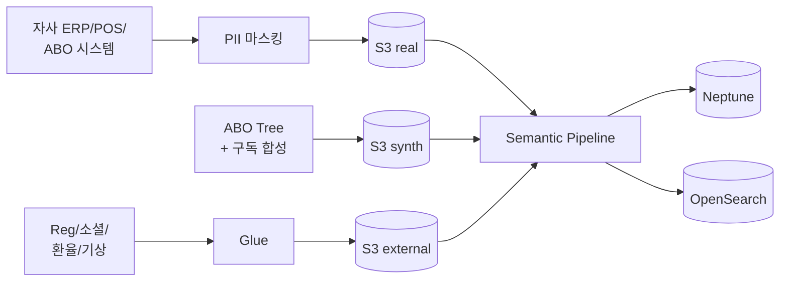

## 1. 데이터 규모

| 항목 | 규모 |
|---|---|
| 자사 ABO (PII 마스킹) | N=1,000 |
| 자사 Customer | N=5,000 |
| 자사 SKU (Nutrilite + Artistry + Home) | ~3,000 |
| 자사 ABO Direct Sale | ~80K |
| 자사 Subscription | ~10K (활성 + 해지) |
| 합성 ABO Tree | 49.5K (평균 5단 깊이) |
| 외부 (소셜·기상·환율·규제) | 365×N |

총합 ≈ ~700K Neptune edges

---

## 2. cohort_tag

| 값 | 의미 | UI 배지 |
|---|---|---|
| `real` | PII 마스킹 자사 실데이터 | 🟢 |
| `synth` | 합성 ABO Tree·구독 | 🟡 |
| `external` | 소셜·기상·환율·규제 | 🔵 |

---

## 3. 외부 데이터 4종

### 3.1 소셜 트렌드
- 글로벌: Instagram 해시태그·Reddit r/AmwayWentTo·X
- 국가별: 네이버·구글 트렌드 (한국), Weibo·小紅書 (중화권)

### 3.2 기상·환경
- KMA / 글로벌 기상 API (open-meteo)

### 3.3 경제 (다국가 환율)
- 한국은행·통계청 + Open Exchange Rates (글로벌 환율)

### 3.4 **규제 시그널** (AMWAY 특화)
- FTC (미국 직접판매 규정)
- 한국 방판법·전자상거래법
- 식약처·FDA 건강기능식품 광고 가이드
- EU Direct Selling Code

---

## 4. ABO Tree 합성 전략

```python
# 5단 깊이 ABO 트리 합성
import networkx as nx

def gen_abo_tree(root_id, depth_max=5, branching=3):
    G = nx.DiGraph()
    queue = [(root_id, 0)]
    while queue:
        node, depth = queue.pop(0)
        if depth >= depth_max: continue
        for i in range(branching):
            child = f"{node}_{i}"
            G.add_edge(node, child)  # SPONSORED_BY edge
            queue.append((child, depth+1))
    return G
```

- 깊이 5단, branching 3 → 약 364 ABO/트리
- 합성 시 PV/BV는 등급별 분포(Founders Platinum > Diamond > EDC > EC) 노이즈

---

## 5. 정기구독 시즌·해지 패턴

| 시즌/이벤트 | 가중 |
|---|---|
| 분기말 | 정기구독 갱신 +20% |
| 신년 (1월) | 영양제·다이어트 카테고리 +30% |
| 월급일 (매월 25일) | 자동 결제 집중 |
| 가격 인상 발표 | 24시간 내 일시 해지 폭증 |

해지 시그너처:
- 최근 3회 결제 실패
- 30일 활동 0
- Downline 1명 이탈

---

## 6. 데이터 적재 파이프라인

