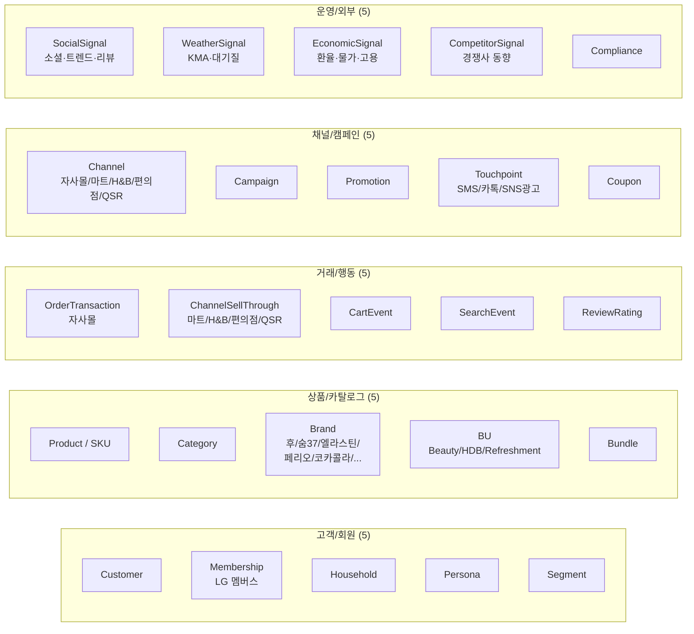
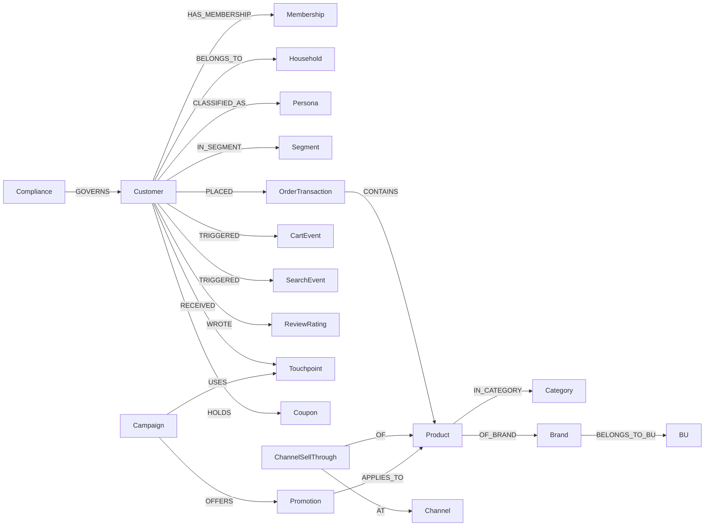

# Knowledge Graph 25 Classes

> Neptune (openCypher) 기반 25 클래스 KG. 추정 ~500K edges. **3 BU(Beauty + HDB + Refreshment) 통합** + 외부 4종 시그널 반영.

---

## 1. 25 클래스 개요



---

## 2. 그룹별 명세

### 2.1 고객/회원 (5)

| 클래스 | 핵심 속성 | 주요 관계 |
|---|---|---|
| **Customer** | customer_id · gender · age_band · region · signup_date · cohort_tag(real/synth) | -[BELONGS_TO]→ Household · -[HAS_MEMBERSHIP]→ Membership |
| **Membership (LG 멤버스)** | grade(일반/실버/골드/VIP) · points · joined_at · opted_in_marketing | -[ON_BEHALF_OF]→ Customer |
| **Household** | household_id · household_size · household_type(1인/2인/4인+/기타) | -[CONTAINS]→ Customer |
| **Persona** | persona_id · name(키즈맘/골드미스/1인가구/시니어/트렌드세터) · traits | -[CLASSIFIES]→ Customer |
| **Segment** | segment_id · definition · dynamic_query · snapshot_date | -[INCLUDES]→ Customer |

### 2.2 상품/카탈로그 (5)

| 클래스 | 핵심 속성 | 주요 관계 |
|---|---|---|
| **Product (SKU)** | sku · name · price · attributes(JSON) | -[IN_CATEGORY]→ Category · -[OF_BRAND]→ Brand |
| **Category** | category_id · name · parent_id · depth | -[CHILD_OF]→ Category |
| **Brand** | brand_id · name(후·숨37·오휘·엘라스틴·페리오·코카콜라·환타·...) · launched_at | -[OWNS]→ Product · -[BELONGS_TO_BU]→ BU |
| **BU** | bu_id · name(Beauty/HDB/Refreshment) | -[GROUPS]→ Brand |
| **Bundle** | bundle_id · theme · season(설/추석/여름/겨울 등) | -[INCLUDES_SKU]→ Product |

### 2.3 거래/행동 (5)

| 클래스 | 핵심 속성 | 주요 관계 |
|---|---|---|
| **OrderTransaction** (자사몰) | order_id · total_amount · channel(web/app) · order_at | -[BY]→ Customer · -[CONTAINS]→ Product |
| **ChannelSellThrough** (외부 채널 추정) | channel_id · sku · units · period · estimated_at | -[OF]→ Product · -[AT]→ Channel |
| **CartEvent** | cart_event_id · action(add/remove/abandon) · at | -[BY]→ Customer · -[ON]→ Product |
| **SearchEvent** | search_event_id · query_text · click_sku · at | -[BY]→ Customer |
| **ReviewRating** | review_id · rating(1-5) · text · source(자사몰/네이버/올리브영/X) · at | -[ABOUT]→ Product · -[BY]→ Customer |

### 2.4 채널/캠페인 (5)

| 클래스 | 핵심 속성 | 주요 관계 |
|---|---|---|
| **Channel** | channel_id · name(자사몰·이마트·롯데마트·올리브영·CU·GS25·QSR) · type | -[HOSTS]→ Transaction |
| **Campaign** | campaign_id · name · start_at · end_at · budget · target_bu | -[USES]→ Touchpoint · -[OFFERS]→ Promotion |
| **Promotion** | promotion_id · type(할인/1+1/적립) · conditions | -[APPLIES_TO]→ Product |
| **Touchpoint** | touchpoint_id · channel(SMS/카톡/푸시/SNS광고) · template | -[REACHES]→ Customer |
| **Coupon** | coupon_id · value · expires_at · redeemed_at | -[ISSUED_TO]→ Customer · -[FROM]→ Campaign |

### 2.5 운영/외부 (5)

| 클래스 | 핵심 속성 | 주요 관계 |
|---|---|---|
| **SocialSignal** | date · keyword · source(네이버/구글/X/인스타/올영) · volume · sentiment | (외부) |
| **WeatherSignal** | date · region · temp_c · precipitation_mm · pm10 | (외부, KMA·대기질) |
| **EconomicSignal** | date · indicator(환율·물가·고용) · value | (외부, 통계청·한국은행) |
| **CompetitorSignal** | date · competitor(아모레/아이모/유한킴벌리) · event_type · text | (외부) |
| **Compliance** | rule_id · topic(약관/마케팅동의/PII/연령/미성년화장품) · enforced_by | -[GOVERNS]→ Customer |

---

## 3. 핵심 관계 (예상 ~500K edges)



엣지 추정:
- Customer × OrderTransaction (~50K)
- Customer × CartEvent / SearchEvent / ReviewRating (~150K)
- ChannelSellThrough × Product × Channel (~80K)
- OrderTransaction × Product (~150K, 평균 4 SKU/주문)
- Product × Category × Brand × BU (~10K)
- 외부 시그널 (~50K daily snapshots)
- 기타 (~10K)

→ **약 500K edges**

---

## 4. openCypher 예시 쿼리

### 4.1 S1 시맨틱 검색 — Beauty BU 신상 + 회원 매칭
```cypher
MATCH (b:Brand {name: '숨37'})-[:OWNS]->(p:Product)
WHERE p.attributes.is_new = true
MATCH (c:Customer)-[:PLACED]->(o:OrderTransaction)-[:CONTAINS]->(p2:Product)
      -[:OF_BRAND]->(b2:Brand)-[:BELONGS_TO_BU]->(bu:BU {name: 'Beauty'})
WHERE o.order_at > datetime() - duration('P90D')
RETURN p.sku, p.name, count(DISTINCT c) AS potential_buyers
ORDER BY potential_buyers DESC LIMIT 20
```

### 4.2 S5 캠페인 ROAS — 옴니채널 어트리뷰션
```cypher
MATCH (camp:Campaign {target_bu: 'HDB'})
      -[:USES]->(:Touchpoint)-[:REACHES]→(c:Customer)
      -[:PLACED]->(o:OrderTransaction)-[:CONTAINS]→(p:Product)
      -[:OF_BRAND]->(:Brand {name: '엘라스틴'})
WHERE o.order_at > camp.start_at AND o.order_at < camp.end_at
RETURN c.customer_id, sum(o.total_amount) AS attributed_revenue
```

### 4.3 S7 옴니채널 여정 — 단일 회원 BU 가로지르는 행동
```cypher
MATCH (c:Customer {customer_id: $cid})
OPTIONAL MATCH (c)-[:TRIGGERED]->(s:SearchEvent)
OPTIONAL MATCH (c)-[:TRIGGERED]->(ce:CartEvent)
OPTIONAL MATCH (c)-[:PLACED]->(o:OrderTransaction)-[:CONTAINS]->(:Product)
                  -[:OF_BRAND]->(:Brand)-[:BELONGS_TO_BU]->(bu:BU)
OPTIONAL MATCH (c)-[:RECEIVED]->(tp:Touchpoint)
WITH c, [s, ce, o, tp] AS events
UNWIND events AS e
RETURN labels(e)[0] AS event_type, e.at AS timestamp,
       coalesce(e.channel, e.source, 'unknown') AS source
ORDER BY timestamp
```

### 4.4 S6 외부 시그널 융합 — 기온 vs 자외선차단제 GMV
```cypher
MATCH (w:WeatherSignal)
WHERE w.date > date() - duration('P90D') AND w.region = '서울'
WITH w
MATCH (o:OrderTransaction)-[:CONTAINS]->(:Product)-[:IN_CATEGORY]->(:Category {name: '자외선차단'})
WHERE date(o.order_at) = w.date
RETURN w.date AS date, w.temp_c AS temp, sum(o.total_amount) AS sun_care_gmv
ORDER BY date
```

---

## 5. cohort_tag 분리 전략

| 값 | 의미 | UI 배지 |
|---|---|---|
| `real` | PII 마스킹 실데이터 (N=500~5K) | 🟢 실데이터 |
| `synth` | 합성 데이터 (49.5K) | 🟡 합성 |
| `external` | 외부 데이터 (소셜·기상·경제·경쟁사) | 🔵 외부 |

쿼리에서 항상 `WHERE cohort_tag IN (...)`. 캠페인 발송 도구는 `real` 회원에만.

---

## 6. OpenSearch 인덱스 매핑

| 인덱스 | 도큐먼트 | 분석기 | 임베딩 |
|---|---|---|---|
| `idx_product` | SKU 메타·설명·자사 리뷰 요약 | Nori | Cohere embed-v4 (1024d) |
| `idx_customer` | 회원 프로필·태그·세그먼트 | Nori | Cohere embed-v4 |
| `idx_review` | 리뷰 본문 (자사몰/네이버/올영/X) | Nori | Cohere embed-v4 |
| `idx_campaign` | 캠페인 메타·문구 | Nori | (없음) |
| `idx_social_trend` | 소셜 키워드·게시글 (네이버·구글·X·인스타) | Nori | Cohere embed-v4 |
| `idx_competitor` | 경쟁사 신제품·이벤트 텍스트 | Nori | Cohere embed-v4 |

→ BM25 + KNN → RRF → Cohere rerank-v3.5