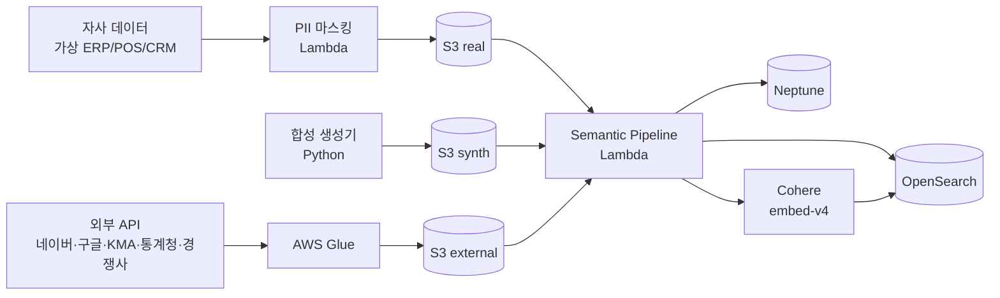

# 데이터 소스

> **자사 실데이터 (PII 마스킹) + 합성 데이터 + 외부 4종 (소셜·기상·경제·경쟁사)** 를 cohort_tag로 명시 분리.

---

## 1. 데이터 규모 한눈에 보기

| 항목 | 규모 | 설명 |
|---|---|---|
| **자사 실데이터 (PII 마스킹)** | N=500~5,000 회원 | LG 멤버스 12개월치 자사몰 거래 + 추정 채널 sell-through |
| | ~50K 자사몰 거래 | 평균 100거래/회원·년 |
| | ~10K SKU | 3 BU 자사 브랜드 + 카테고리 트리 |
| **자사 합성 데이터** | 49.5K 회원 | faker + 자사 분포 학습 |
| | ~5M 거래 | 12개월 합성 |
| **외부 (소셜)** | 일별 키워드·게시글 | 네이버·구글 트렌드 + X·인스타·올영 |
| **외부 (기상)** | 365 × N 권역 | KMA 일별 기온/강수/대기질 |
| **외부 (경제)** | 월별 지표 | 통계청·한국은행 |
| **외부 (경쟁사)** | 이벤트 단위 | 신제품·캠페인 공개 등장 |

총합 ≈ **5M+ 거래, 50K 회원, 10K SKU, 365일 외부 시그널, ~500K Neptune edges**

---

## 2. cohort_tag 분리 전략

모든 인스턴스 노드와 OpenSearch 도큐먼트에 `cohort_tag` 속성:

| 값 | 의미 | UI 배지 |
|---|---|---|
| `real` | PII 마스킹 자사 실데이터 | 🟢 실데이터 |
| `synth` | 자사 데이터 합성 (49.5K) | 🟡 합성 |
| `external` | 외부 데이터 (소셜·기상·경제·경쟁사) | 🔵 외부 |

쿼리 시 항상 `WHERE cohort_tag IN (...)`. 캠페인 발송 도구는 `real` 회원에만.

---

## 3. 자사 실데이터 (가상 시나리오)

### 3.1 PII 마스킹 룰

| 원본 필드 | 마스킹 후 |
|---|---|
| 이름 | hash → "회원_a4f2c1" |
| 연락처 | "010-****-****" |
| 주소 | 시군구까지만 |
| 생년월일 | 연령대(5세 단위) |
| 이메일 | 도메인만 |
| 카드번호 | "****-****-****-1234" |

### 3.2 거래 데이터
- 12개월 (T-12M ~ T)
- 자사몰 OrderTransaction (web/app)
- ChannelSellThrough — 마트/H&B/편의점/QSR 추정
- 평균 100거래/년/회원

### 3.3 SKU 카탈로그 (3 BU)

| BU | 대표 브랜드 | 대표 카테고리 |
|---|---|---|
| Beauty | 후 / 숨37 / 오휘 / 빌리프 / CNP / VDL | 스킨케어 / 메이크업 / 클렌징 |
| HDB | 엘라스틴 / 페리오 / 죽염 / 닥터그루트 / 자연퐁 / 샤프란 | 헤어케어 / 구강케어 / 세탁세제 |
| Refreshment | 코카콜라 / 환타 / 스프라이트 / 미닛메이드 / 토레타 / 파워에이드 | 탄산 / 주스 / 스포츠음료 |

---

## 4. 자사 합성 데이터 (49.5K)

### 4.1 시드 학습
```python
from sklearn.mixture import GaussianMixture

# 자사 실데이터에서 회원·거래 피처 추출
gmm_customer = GaussianMixture(n_components=8).fit(real_customer_features)
gmm_txn = GaussianMixture(n_components=10).fit(real_txn_features)
```

### 4.2 시즌별 변동
| 기간 | 가중 카테고리 |
|---|---|
| 명절 (설/추석 ±2주) | 선물세트·생활용품 +30% |
| 여름 (6~8월) | 자외선차단·아이스음료·핸드워시 +25% |
| 겨울 (11~2월) | 핸드크림·핫팩·뜨거운 음료 +20% |
| 우천 시 | 우산·실내 디퓨저 +15% |

---

## 5. 외부 데이터 4종

### 5.1 소셜 트렌드
| 출처 | 데이터 | API/방식 |
|---|---|---|
| 네이버 데이터랩 | 카테고리/키워드 검색 트렌드 (주별) | datalab.naver.com |
| 구글 트렌드 | 키워드 글로벌·국내 트렌드 | trends.google.com |
| X (Twitter) | 키워드·해시태그·게시 빈도 | API v2 |
| 인스타그램 | 해시태그 트렌드 | Public Display API |
| 쇼츠·티스토리 | 영상·블로그 트렌드 | RSS / 크롤 |
| 올리브영 리뷰 | 카테고리·SKU별 리뷰 키워드 | 크롤 (PDPA 준수) |

→ Neptune `SocialSignal` 노드 + OpenSearch `idx_social_trend`/`idx_review`

### 5.2 기상·환경
| 출처 | 데이터 | API |
|---|---|---|
| KMA 기상청 | 일별 기온/강수/습도/풍속 | data.kma.go.kr |
| 대기질 | PM10/PM2.5/오존 | data.go.kr |

→ Neptune `WeatherSignal`

### 5.3 경제·소비
| 출처 | 데이터 | API |
|---|---|---|
| 통계청 KOSIS | 소비자물가·고용 지수 | kosis.kr |
| 한국은행 ECOS | 환율·금리 | ecos.bok.or.kr |

→ Neptune `EconomicSignal`

### 5.4 경쟁사 시그널
| 출처 | 데이터 | 방식 |
|---|---|---|
| 아모레퍼시픽 / 아이모 / 유한킴벌리 등 | 신제품·캠페인 공개 등장 | 공식 보도자료 + 공개 SNS |
| 백화점·H&B 신상 라운드업 | 카테고리 신상 동향 | 매체 RSS |

→ Neptune `CompetitorSignal` + OpenSearch `idx_competitor`

---

## 6. 데이터 적재 파이프라인



### 적재 순서
1. 자사 raw → S3 → PII 마스킹 → S3 (real)
2. 합성 생성기 → S3 (synth)
3. 외부 API → Glue → S3 (external)
4. Semantic Pipeline (Lambda) → Neptune Bulk + OpenSearch Bulk
5. Cohere embed-v4 batch 임베딩 → OpenSearch knn_vector

---

## 7. 데이터 갱신 주기

| 데이터 | 주기 | 트리거 |
|---|---|---|
| 자사 실데이터 (N=500~5K) | PoC 1회 적재 후 고정 | 수동 |
| 자사 합성 데이터 | PoC 중 1~2회 재생성 | 시즌 추가 시 |
| **소셜 트렌드** | 일/주 1회 | EventBridge cron |
| **기상** | 일 1회 | EventBridge cron |
| **경제** | 월 1회 | EventBridge cron |
| **경쟁사** | 주 1회 | EventBridge cron |

---

## 8. 데이터 품질 룰

| 룰 | 임계 |
|---|---|
| Customer cohort_tag 누락 | 0건 |
| Product price ≤ 0 | 0건 |
| OrderTransaction 합계 = 라인 합 | 100% |
| Neptune edge orphan | 0건 |
| OpenSearch 임베딩 차원 = 1024 | 100% |
| Cohort 분포 (real:synth) | 1:99 |

---

## 9. 시연 시 데이터 노출 룰

- 모든 결과 카드에 cohort_tag 배지 (🟢 real / 🟡 synth / 🔵 external)
- 합성 데이터로 발송·결제 도구 호출 → "합성 — 실제 발송 X" 안내
- 외부 데이터에 출처 표기 의무 (소셜·기상·경제·경쟁사 모두)
- 통계 표시는 cohort 분리 옵션 (실만 / 합성만 / 합산)