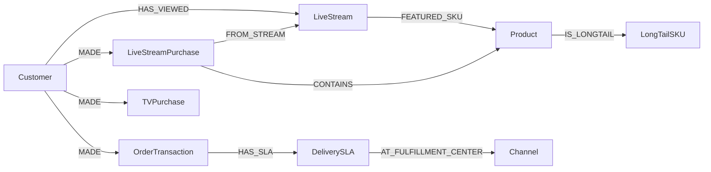

| 그룹 | 클래스 |
|---|---|
| **고객/회원** | Customer · Membership · Household · Persona · **LiveViewer** (라이브 시청 이벤트 단위) |
| **상품** | Product · Category · Brand · **LongTailSKU** (롱테일 식별) · Bundle |
| **거래/행동** | OrderTransaction (앱·웹) · **TVPurchase** (TV 홈쇼핑) · **LiveStreamPurchase** (라이브 방송) · CartEvent · ReviewRating |
| **채널/캠페인** | Channel · Campaign · Promotion · Touchpoint · Coupon |
| **운영/외부** | **DeliverySLA** (자체 물류 측정) · **LiveStream** (라이브 방송 메타) · WeatherSignal · EconomicSignal · CompetitorSignal · Compliance |

## Momo 특화 클래스

### LiveStream (라이브 방송)
| 속성 |
|---|
| stream_id · host · start_at · end_at · concurrent_peak · sku_list |

### LiveStreamPurchase
| 속성 |
|---|
| txn_id · stream_id · viewer_id · sku · timestamp · time_offset_from_pin |

### DeliverySLA
| 속성 |
|---|
| order_id · region · promised_at · actual_at · delay_min · fulfillment_center_id |

### LongTailSKU
| 속성 |
|---|
| sku · monthly_sales · category_avg · longtail_score |

## 핵심 관계



엣지 추정 ~800K (방대 SKU + 라이브 이벤트 + 배송 로그).

## openCypher 예시

### S9-Mo: 라이브 방송 어트리뷰션
```cypher
MATCH (l:LiveStream {stream_id: $sid})
MATCH (v:Customer)-[:HAS_VIEWED]->(l)
OPTIONAL MATCH (v)-[:MADE]->(p:LiveStreamPurchase {stream_id: $sid})
RETURN count(DISTINCT v) AS viewers, count(DISTINCT p) AS converters,
       sum(p.amount) AS gmv
```

### S10-Mo: 24시간 SLA 위반
```cypher
MATCH (sla:DeliverySLA)
WHERE sla.actual_at - sla.promised_at > duration('PT0H')
  AND sla.promised_at > datetime() - duration('P7D')
RETURN sla.region, count(*) AS breaches, avg(sla.delay_min) AS avg_delay
ORDER BY breaches DESC
```

## 인덱스
| 인덱스 | 분석기 |
|---|---|
| `idx_product` | Smartcn |
| `idx_review` | Smartcn |
| `idx_livestream` | Smartcn (방송 텍스트·진행자 멘트) |
| `idx_social_trend` | Smartcn (Dcard · 인스타) |