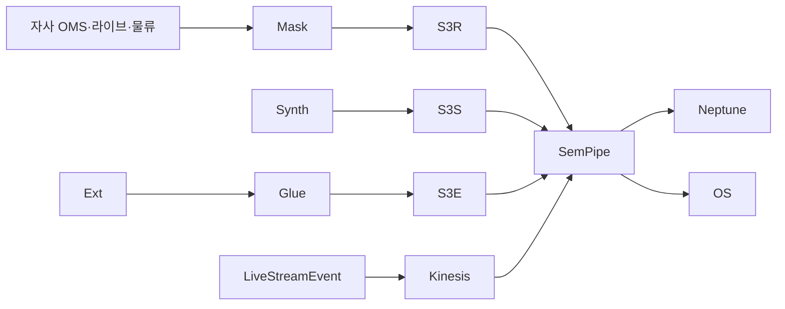

# 데이터 소스 (Momo)

## 1. 데이터 규모

| 항목 | 규모 |
|---|---|
| 자사 회원 | N=5,000 (PII 마스킹) |
| SKU | ~50K (실 PoC), 합성 ~100K |
| OrderTransaction | ~250K |
| TVPurchase | ~30K |
| LiveStreamPurchase | ~50K |
| LiveStream 방송 | ~500 (1년치) |
| DeliverySLA 로그 | ~250K |

→ ~800K Neptune edges

## 2. cohort_tag

| 값 | 의미 |
|---|---|
| `real` | PII 마스킹 자사 |
| `synth` | 합성 49.5K |
| `external` | 소셜·기상·경제·경쟁사 |

## 3. 외부 데이터 4종

### 3.1 소셜
- Dcard · 인스타 · X · 小紅書 (라이브 후기·SKU 트렌드)

### 3.2 기상 (배송에 중요)
- 中央氣象署 (대만) — 폭우·태풍 시 배송 SLA 영향

### 3.3 경제
- DGBAS 행정원 통계 (소비)

### 3.4 경쟁사
- PChome · Yahoo奇摩 · Shopee TW 공개 캠페인

## 4. 라이브 방송 합성 전략

```python
# 라이브 방송 시뮬 (1시간 평균, 진행자 5명, SKU 30개 핀)
def gen_live_session():
    duration_min = 60
    viewer_curve = poisson_growth(start=1000, peak=5000, decay=2000)
    pin_events = sorted(random.sample(range(duration_min*60), 30))
    purchases = [(t + lognormal(0, 1)*60, random_sku) for t in pin_events]
    return {viewer_curve, pin_events, purchases}
```

## 5. 배송 SLA 시즌·기상 영향

| 이벤트 | 영향 |
|---|---|
| 태풍 (폭우) | 24시간 SLA 위반률 +60% |
| 더블11 (光棍節) | 일별 주문 +500%, SLA 위반 +25% |
| 春節 | 배송 -3일 (전체 휴무) |

## 6. 적재 파이프라인


