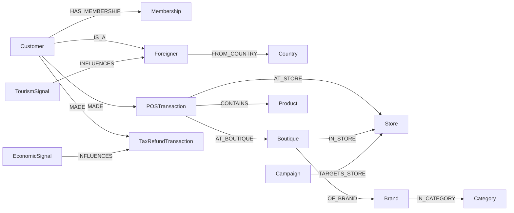

> Neptune (~550K edges). **VIP + 외국인 회원 + 입점 700 브랜드 + 면세** 특성 반영.

---

## 1. 25 클래스

| 그룹 | 클래스 |
|---|---|
| **고객/회원** | Customer · Membership(skm-member) · **Foreigner** (여권·국적·환율) · Persona · Segment |
| **상품/카탈로그** | Product · **Brand** (입점 700+ LV/Hermes/Chanel/...) · **Boutique** (점포 내 매장) · Category · Bundle |
| **거래/행동** | OrderTransaction (자사몰) · **POSTransaction** (점포 매장) · **TaxRefundTransaction** (면세) · CartEvent · ReviewRating |
| **채널/캠페인** | **Store** (19 점포) · Campaign (週年慶/SS/FW) · Promotion · Touchpoint (SMS/카톡/소홍서) · Coupon |
| **운영/외부** | SocialSignal (소홍서·Dcard·인스타) · WeatherSignal · **EconomicSignal** (환율) · **TourismSignal** (대만 관광청) · Compliance |

---

## 2. Mitsukoshi 특화 클래스

### 2.1 Foreigner (외국인 관광객)

| 속성 |
|---|
| foreigner_id (마스킹) · 여권 국적 (JP/HK/SG/MY/...) · 입국일 · TaxRefund 신청 여부 · 환율 적용 |

### 2.2 Boutique (점포 내 매장)

| 속성 |
|---|
| boutique_id · brand_id · store_id · floor (1F/2F/...) · 면적 · 임대 조건 |

### 2.3 TaxRefundTransaction (면세 거래)

| 속성 |
|---|
| txn_id · foreigner_id · txn_amount (원화/대만달러/일본엔) · refund_amount · refund_method |

### 2.4 TourismSignal (관광 시그널)

| 속성 |
|---|
| date · 입국 외국인 수 (국적별) · 평균 체류 일수 · 평균 소비 |

---

## 3. 핵심 관계



엣지 추정:
- Customer × POSTransaction (~200K)
- Boutique × Brand × Store (~5K)
- Foreigner × TaxRefundTransaction (~80K)
- Brand × Product (~100K)
- 외부 시그널 (~50K)
- 기타 (~120K)

→ **약 550K edges**

---

## 4. openCypher 예시

### 4.1 S9-M — 일본인 30대 여성 면세 추천
```cypher
MATCH (f:Foreigner {nationality: 'JP'})-[:CLASSIFIED_AS]->(p:Persona {age_band: '30s', gender: 'F'})
MATCH (f)-[:MADE]->(t:TaxRefundTransaction)-[:CONTAINS]->(:Product)-[:OF_BRAND]->(b:Brand)
RETURN b.name, count(t) AS popularity ORDER BY popularity DESC LIMIT 10
```

### 4.2 S10-M — 信義점 1F 럭셔리 SOV
```cypher
MATCH (s:Store {name: '台北信義'})<-[:IN_STORE]-(bq:Boutique {floor: '1F'})
      -[:OF_BRAND]->(b:Brand)
MATCH (bq)<-[:AT_BOUTIQUE]-(t:POSTransaction)
WHERE t.paid_at > datetime() - duration('P30D')
RETURN b.name, sum(t.total_amount) AS gmv
ORDER BY gmv DESC
```

### 4.3 S11-M — Black VIP 회원 프리세일 추천
```cypher
MATCH (c:Customer)-[:HAS_MEMBERSHIP]->(m:Membership {grade: 'Black'})
MATCH (c)-[:MADE]->(:POSTransaction)-[:CONTAINS]->(p:Product)
      -[:OF_BRAND]->(b:Brand)
WITH c, b, count(*) AS frequency
ORDER BY frequency DESC LIMIT 5
RETURN c.customer_id, collect(b.name)[..5] AS preferred_brands
```

---

## 5. cohort_tag

| 값 | 의미 |
|---|---|
| `real` | PII 마스킹 회원 (N=2K Customer + 500 Foreigner) |
| `synth` | 합성 49.5K |
| `external` | 소셜·환율·관광·기상 |

---

## 6. OpenSearch 인덱스

| 인덱스 | 분석기 |
|---|---|
| `idx_product` | Smartcn (번체중) + Standard |
| `idx_customer` | Smartcn |
| `idx_review` (소홍서/Dcard 외부) | Smartcn + Kuromoji (일본어) |
| `idx_brand` | Standard (브랜드명 + 메타) |