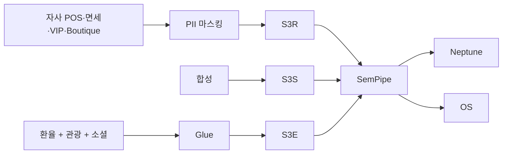

## 1. 데이터 규모

| 항목 | 규모 |
|---|---|
| 자사 회원 | N=2,000 + Foreigner N=500 |
| 입점 브랜드 | 700+ |
| Boutique (점포 내 매장) | ~3,000 (19점포 × 평균 150 매장) |
| POSTransaction | ~200K |
| TaxRefundTransaction | ~80K (외국인) |
| 합성 회원 | 49.5K |

→ ~550K Neptune edges

## 2. cohort_tag

| 값 | 의미 |
|---|---|
| `real` | PII 마스킹 회원 + Foreigner |
| `synth` | 합성 |
| `external` | 환율·관광·소셜·기상 |

## 3. 외부 데이터 4종

### 3.1 소셜 트렌드
- 小紅書 · Dcard · 인스타 · 일본 트위터 (외국인 후기)
- 쇼츠 · 블로그 (대만 럭셔리 트렌드)

### 3.2 기상
- 中央氣象署 (대만 기상청)

### 3.3 경제·환율 (Mitsukoshi 특화)
- **Open Exchange Rates** — JPY/USD/HKD/SGD ↔ TWD 일별
- 央行 (대만 중앙은행) 금리·환율
- DGBAS 행정원 통계 (소비자물가)

### 3.4 관광 (Mitsukoshi 특화)
- **대만 觀光局** — 일별 입국 외국인 (국적별)
- 비행기 좌석 점유 (대만↔일본/홍콩)
- 호텔 예약지수

## 4. 시즌·이벤트 가중

| 이벤트 | 가중 |
|---|---|
| 週年慶 (가을 9~10월) | 럭셔리 +50%, 면세 +80% |
| 春節 (음력 1월) | 환선·기프트 +30%, 외국인 -20% (귀국) |
| SS/FW 신상 (3월/9월) | 입점 브랜드 매대 회전 +40% |
| 일본 GW (5월) / 홍콩 暑期 | 외국인 면세 +60% |

## 5. 데이터 적재 파이프라인

