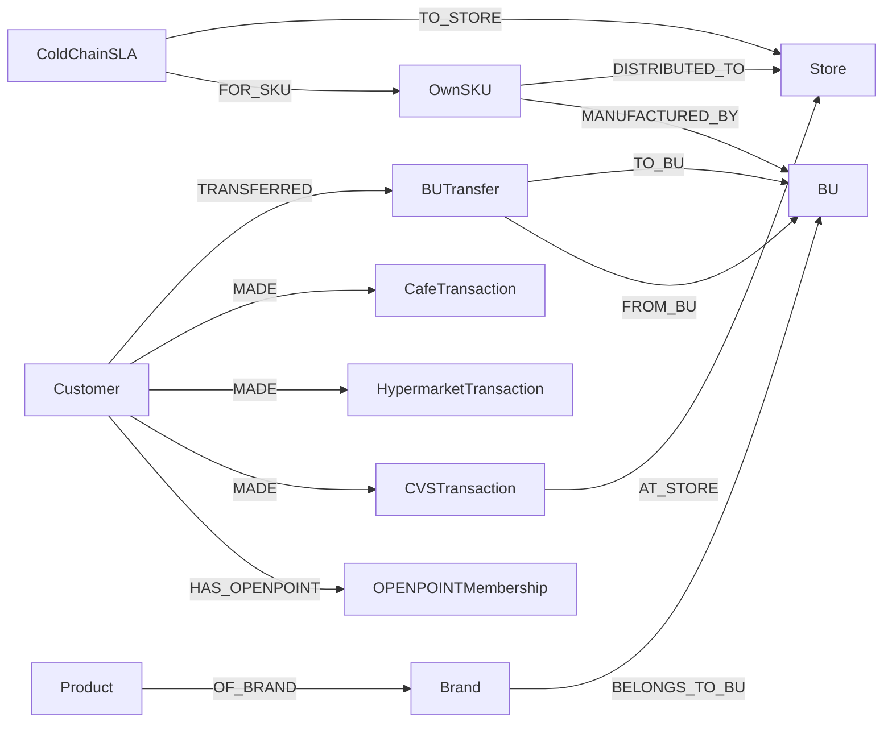

| 그룹 | 클래스 |
|---|---|
| **고객/회원** | Customer · **OPENPOINTMembership** · Household · Persona · Segment |
| **상품** | Product · Category · Brand · **BU** (統一食品/7ELE/까르푸/Starbucks/Donut/KFC) · **OwnSKU** (자사 제조) |
| **거래/행동** | **CVSTransaction** (7-Eleven) · **HypermarketTransaction** (까르푸) · **CafeTransaction** (Starbucks/Donut/KFC) · CartEvent · ReviewRating |
| **채널/캠페인** | Store (매장) · Campaign · Promotion · Touchpoint · Coupon |
| **운영/외부** | **ColdChainSLA** · **BUTransfer** (BU 간 회원 이동 로그) · WeatherSignal · EconomicSignal · CompetitorSignal · Compliance |

## Uni-President 특화 클래스

### OPENPOINTMembership
| 속성 |
|---|
| member_id · grade · joined_at · 자사 BU 교차 사용 횟수 |

### OwnSKU (자사 제조)
| 속성 |
|---|
| sku · 제조 BU · 출하 채널 (7ELE/까르푸/외부) · 콜드체인 여부 |

### BUTransfer (BU 간 행동)
| 속성 |
|---|
| transfer_id · member_id · from_BU · to_BU · within_days · category |

### ColdChainSLA
| 속성 |
|---|
| shipment_id · sku · 출하 BU · 도착 매장 · target_temp · actual_temp · breach |

## 핵심 관계 (BU 가로지르기 강조)



엣지 추정 ~900K (5 BU × 거래 × OPENPOINT × 콜드체인 로그).

## openCypher 예시

### S9-U: BU 가로지르는 OPENPOINT 회원 여정
```cypher
MATCH (c:Customer)-[:HAS_OPENPOINT]->(:OPENPOINTMembership)
MATCH (c)-[:MADE]->(t1:CVSTransaction)
MATCH (c)-[:MADE]->(t2:HypermarketTransaction)
MATCH (c)-[:MADE]->(t3:CafeTransaction)
WHERE date(t1.paid_at) = date(t2.paid_at) - duration('P1D')
  AND date(t2.paid_at) = date(t3.paid_at) - duration('P1D')
RETURN c.customer_id, count(*) AS cross_bu_days
ORDER BY cross_bu_days DESC LIMIT 100
```

### S10-U: 統一 麥香 음료 sell-through 비교
```cypher
MATCH (s:OwnSKU {brand: '麥香', mfg_bu: '統一食品'})
OPTIONAL MATCH (s)-[:DISTRIBUTED_TO]->(:Store {bu: '7-Eleven'})
                <-[:AT_STORE]-(t1:CVSTransaction)-[:CONTAINS]->(s)
OPTIONAL MATCH (s)-[:DISTRIBUTED_TO]->(:Store {bu: 'Carrefour'})
                <-[:AT_STORE]-(t2:HypermarketTransaction)-[:CONTAINS]->(s)
RETURN sum(t1.units) AS cvs_units, sum(t2.units) AS hyper_units
```

### S11-U: 콜드체인 SLA 위반 (외기온 결합)
```cypher
MATCH (sla:ColdChainSLA)
WHERE sla.actual_temp > sla.target_temp + 2.0
MATCH (sla)-[:TO_STORE]->(s:Store)
MATCH (w:WeatherSignal {region: s.region})
WHERE w.date = date(sla.delivered_at)
RETURN s.store_id, sla.sku, w.temp_c AS outside_temp,
       sla.actual_temp - sla.target_temp AS breach
ORDER BY breach DESC
```

## 인덱스
| 인덱스 | 분석기 |
|---|---|
| `idx_product` | Smartcn |
| `idx_customer` | Smartcn |
| `idx_review` | Smartcn (Dcard·小紅書·Yelp Tw) |
| `idx_social_trend` | Smartcn + Standard |