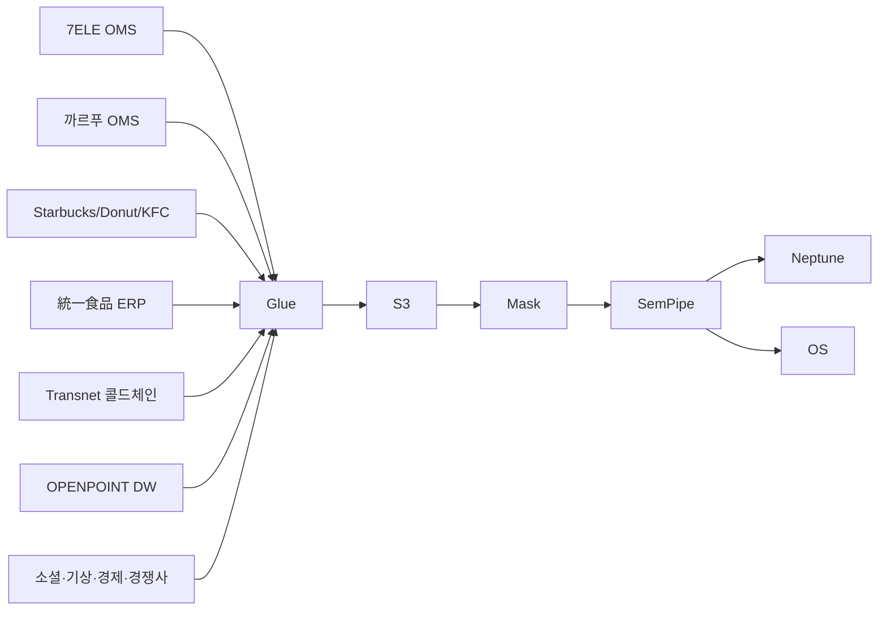

# 데이터 소스 (Uni-President)

## 1. 데이터 규모

| 항목 | 규모 |
|---|---|
| OPENPOINT 회원 | N=5,000 (PII 마스킹) |
| 자사 SKU (統一·OwnBrand) | ~5,000 |
| CVSTransaction (7ELE) | ~300K |
| HypermarketTransaction (까르푸) | ~80K |
| CafeTransaction (Starbucks·Donut·KFC) | ~50K |
| ColdChainSLA 로그 | ~50K |
| BUTransfer 로그 | ~20K |
| 합성 회원 | 49.5K |

→ ~900K Neptune edges

## 2. cohort_tag

| 값 | 의미 |
|---|---|
| `real` | PII 마스킹 자사 (BU별) |
| `synth` | 합성 |
| `external` | 소셜·기상·경제·경쟁사 |

## 3. 외부 데이터 4종

### 3.1 소셜
- Dcard · 小紅書 · 인스타 · X (대만)

### 3.2 기상 (콜드체인 핵심)
- 中央氣象署 — 폭염·태풍 시 콜드체인 SLA 영향

### 3.3 경제
- DGBAS · 央行 · 物價 (소비자 카테고리)

### 3.4 경쟁사
- 全家 (FamilyMart) · 萊爾富 (Hi-Life) · 大潤發 (RT-Mart)

## 4. BU 간 회원 이동 합성 전략

```python
# 회원이 BU 가로지르는 패턴 합성
def gen_bu_crossover_member():
    bu_seq = []
    home_bu = random.choice(['7-Eleven', 'Carrefour'])  # 거주 BU
    bu_seq.append((home_bu, weekday_morning))
    # 주말 까르푸 + 평일 Starbucks 혼합 패턴
    if random.random() < 0.4:
        bu_seq.append(('Starbucks', weekday_afternoon))
    if random.random() < 0.3:
        bu_seq.append(('Mister Donut', weekend))
    return bu_seq
```

## 5. 콜드체인 SLA 시즌 영향

| 이벤트 | 영향 |
|---|---|
| 폭염 (35℃+) | 우유·유제품 SLA 위반률 +40% |
| 태풍 | 모든 SLA 위반 +60%, 일시 출하 중단 |
| 春節 | 명절 휴무로 콜드체인 -3일 지연 |

## 6. 적재 파이프라인

