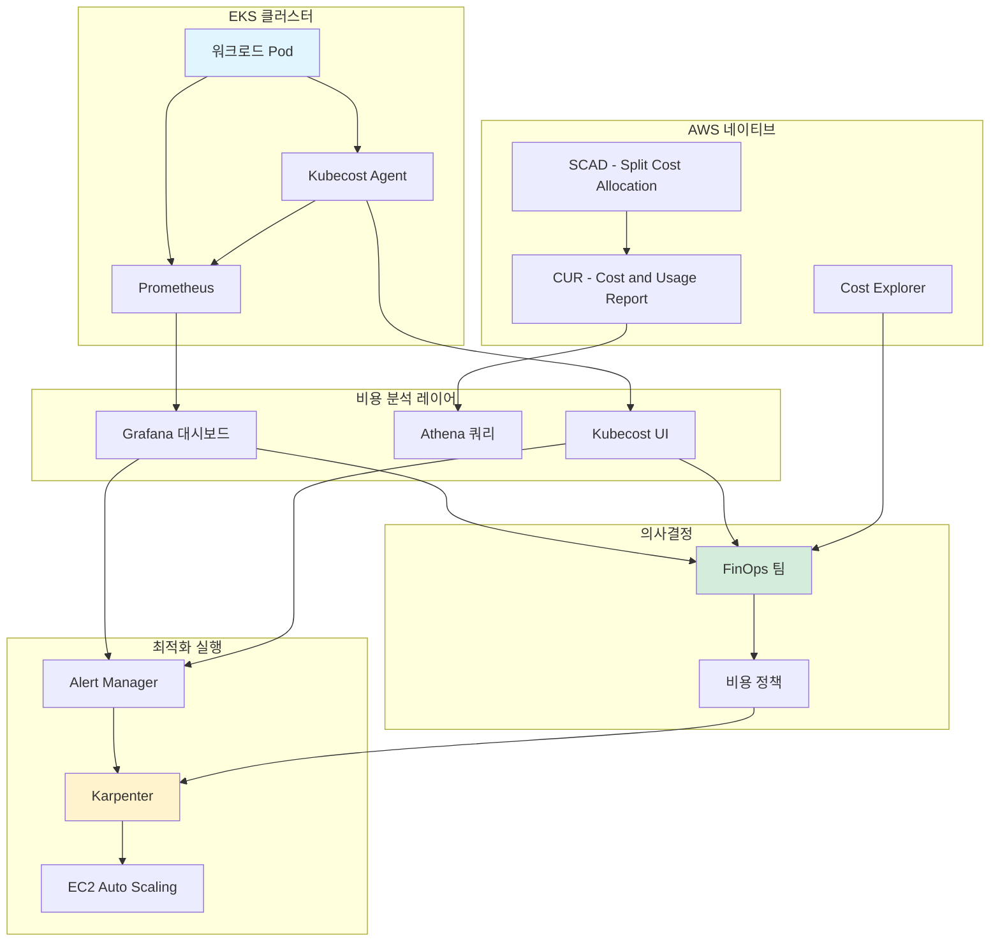
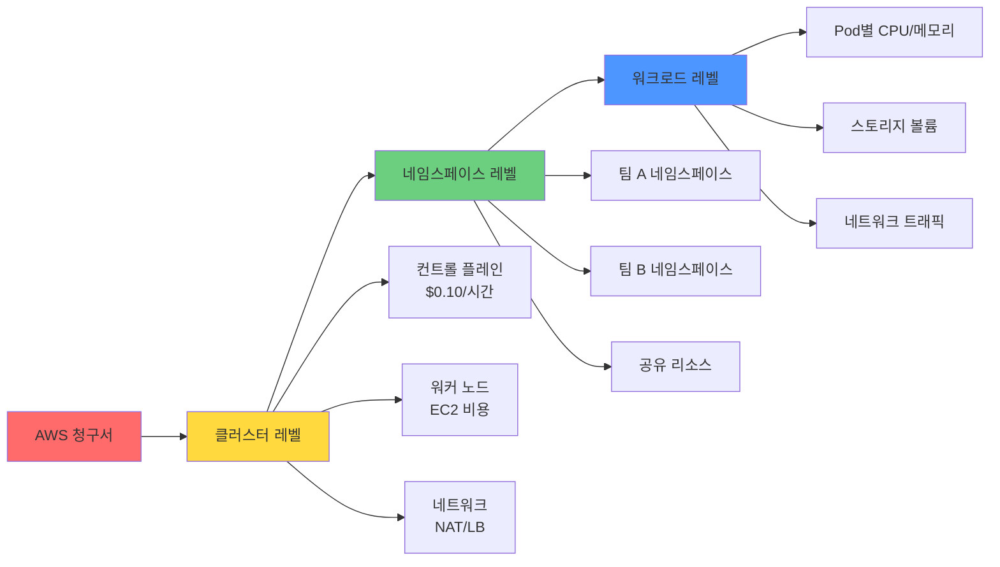

# 대규모 EKS 환경 비용 관리 가이드

> **📌 업데이트**: 2025-02-09 - Karpenter v1.6 GA 및 EKS Auto Mode 비용 분석 반영

> 📅 **작성일**: 2025-02-05 | **수정일**: 2026-02-14 | ⏱️ **읽는 시간**: 약 11분

## 개요

Amazon EKS 환경의 비용 관리는 클라우드 운영에서 가장 중요한 과제 중 하나입니다. 2024년 기준 AWS 고객들의 총 지출이 1,000억 달러를 넘어설 것으로 예상되는 가운데, 평균 30-35%의 클라우드 비용이 낭비되고 있습니다. 특히 Kubernetes 환경에서는 68%의 조직이 비용 초과를 경험하고 있습니다.

이 가이드는 EKS 환경에서 30-90%의 비용 절감을 달성하기 위한 실전 전략을 다룹니다. FinOps 원칙부터 Karpenter를 활용한 고급 최적화, 실제 기업의 성공 사례까지 포괄적으로 설명합니다.

:::tip EKS Auto Mode 비용 고려사항
2025년 GA된 EKS Auto Mode는 Karpenter를 내장하여 자동 비용 최적화를 제공합니다:

- **추가 비용**: EKS Auto Mode 노드에 대해 EC2 가격의 ~10% 프리미엄
- **절감 효과**: 자동 Spot 최적화, 빈패킹, 노드 통합으로 운영 비용 절감
- **비교 분석**: Self-managed 클러스터 대비 총 소유 비용(TCO) 평가 필요
- **적합한 경우**: 전용 FinOps 엔지니어 없이 비용 최적화를 원하는 팀
:::

### 핵심 내용

- **FinOps 기초**: Kubernetes 환경에 특화된 비용 관리 원칙과 성숙도 모델
- **비용 구조 분석**: EKS 비용의 3계층 모델과 낭비 요인 식별
- **도구 활용**: SCAD, Kubecost, OpenCost 등 비용 관리 도구 비교
- **Karpenter 최적화**: 차세대 오토스케일링으로 25-40% 비용 절감
- **실전 사례**: 70% 이상 비용 절감을 달성한 기업들의 전략

### 학습 목표

이 가이드를 완료하면 다음을 수행할 수 있습니다:

- EKS 환경의 비용 구조를 정확히 이해하고 분석
- 조직의 FinOps 성숙도 평가 및 개선 로드맵 수립
- 적절한 비용 관리 도구 선택 및 구현
- Karpenter와 Spot 인스턴스를 활용한 비용 최적화
- 30일 내 10-20% 비용 절감 달성

## 사전 요구사항

### 필요한 도구

| 도구 | 버전 | 용도 |
|------|------|------|
| kubectl | 1.28+ | Kubernetes 클러스터 관리 |
| helm | 3.12+ | 비용 관리 도구 설치 |
| aws-cli | 2.13+ | AWS 리소스 관리 |
| eksctl | 0.150+ | EKS 클러스터 구성 |

### 필요한 권한

```json
{
  "Version": "2012-10-17",
  "Statement": [
    {
      "Effect": "Allow",
      "Action": [
        "ce:GetCostAndUsage",
        "ce:GetCostForecast",
        "eks:DescribeCluster",
        "ec2:DescribeInstances",
        "ec2:DescribeSpotPriceHistory",
        "cloudwatch:GetMetricStatistics"
      ],
      "Resource": "*"
    }
  ]
}
```

### 선행 지식

- Kubernetes 기본 개념 (Pod, Deployment, Service)
- AWS EKS 아키텍처 이해
- 컨테이너 리소스 관리 (requests, limits)
- 기본적인 클라우드 비용 구조

## 아키텍처

### EKS 비용 모니터링 시스템 구조



### 3계층 비용 할당 모델



## 구현

### 1단계: FinOps 성숙도 평가

첫 번째 단계는 조직의 현재 FinOps 성숙도를 평가하는 것입니다.

#### 성숙도 모델

| 단계 | 특징 | 비용 할당 정확도 | 자동화 수준 |
|------|------|-----------------|-------------|
| **Crawl (기어가기)** | 수동 프로세스, 기본 가시성 | 50% 미만 | 거의 없음 |
| **Walk (걷기)** | 자동화된 추적, 사전 최적화 | 70-90% | 부분 자동화 |
| **Run (달리기)** | 완전 자동화, 비즈니스 정렬 | 90% 이상 | 완전 자동화 |

#### 자가 평가 체크리스트

**Crawl 단계 (기초)**

- [ ] AWS Cost Explorer로 월별 비용 확인
- [ ] EKS 클러스터별 비용 구분 가능
- [ ] 주요 비용 증가 원인 파악 가능

**Walk 단계 (성장)**

- [ ] 네임스페이스/팀별 비용 할당
- [ ] 자동화된 비용 알림 설정
- [ ] 주간 비용 리뷰 미팅 진행
- [ ] 리소스 rightsizing 정책 운영

**Run 단계 (성숙)**

- [ ] 실시간 비용 대시보드 운영
- [ ] Pod 레벨 비용 추적
- [ ] 자동화된 최적화 워크플로우
- [ ] 비즈니스 메트릭과 비용 연계

### 2단계: EKS 비용 구조 이해

#### 비용 구성 요소

**1. 컨트롤 플레인 비용**

```
비용: $0.10/시간 = $72/월 (클러스터당)
특징: 고정 비용, 최적화 불가
권장사항: 클러스터 통합으로 수 줄이기
```

**2. 워커 노드 비용 (가장 큰 비중)**

| 가격 모델 | 비용 | 절감률 | 중단 위험 |
|----------|------|--------|----------|
| 온디맨드 | 기준가 | 0% | 없음 |
| Savings Plans | -28~-72% | 최대 72% | 없음 |
| Reserved Instances | -40~-75% | 최대 75% | 없음 |
| Spot Instances | -50~-90% | 최대 90% | 있음 (2분 경고) |

**3. 숨겨진 비용 요소**

```yaml
# 간과하기 쉬운 비용 항목
hidden_costs:
  load_balancers:
    - classic_lb: "$18/월 (기본) + 데이터 전송"
    - alb: "$22.50/월 (기본) + LCU 비용"
    - nlb: "$20/월 (기본) + NLCU 비용"

  nat_gateways:
    cost: "$32.40/월/AZ + $0.045/GB 처리"
    optimization: "NAT 인스턴스 또는 VPC 엔드포인트 활용"

  data_transfer:
    - inter_az: "$0.01/GB (AZ 간)"
    - inter_region: "$0.02/GB (리전 간)"
    - internet_egress: "$0.09/GB (첫 10TB)"

  ebs_volumes:
    - gp3: "$0.08/GB/월"
    - unused_volumes: "평균 20-30% 미사용"
```

#### 비용 낭비 패턴 식별

**과다 프로비저닝 (평균 30% 낭비)**

```bash
# 네임스페이스별 리소스 효율성 확인
kubectl get pods -A -o json | jq -r '
  .items[] |
  select(.status.phase=="Running") |
  {
    namespace: .metadata.namespace,
    pod: .metadata.name,
    containers: [
      .spec.containers[] | {
        name: .name,
        cpu_request: .resources.requests.cpu,
        mem_request: .resources.requests.memory
      }
    ]
  }
' | jq -s 'group_by(.namespace) |
  map({
    namespace: .[0].namespace,
    total_pods: length
  })'
```

**유휴 리소스 (야간/주말)**

```python
# 사용률 분석 스크립트 예시
import boto3
from datetime import datetime, timedelta

cloudwatch = boto3.client('cloudwatch')

def analyze_idle_resources(cluster_name, hours=168):  # 1주일
    metrics = cloudwatch.get_metric_statistics(
        Namespace='ContainerInsights',
        MetricName='node_cpu_utilization',
        Dimensions=[{'Name': 'ClusterName', 'Value': cluster_name}],
        StartTime=datetime.now() - timedelta(hours=hours),
        EndTime=datetime.now(),
        Period=3600,
        Statistics=['Average']
    )

    idle_hours = sum(1 for m in metrics['Datapoints'] if m['Average'] < 10)
    idle_percentage = (idle_hours / hours) * 100

    return {
        'idle_hours': idle_hours,
        'idle_percentage': idle_percentage,
        'potential_savings': f"{idle_percentage}% of node costs"
    }
```

**리전별 비용 차이 (최대 40%)**

| 리전 | t3.xlarge 온디맨드 | 절감 기회 |
|------|-------------------|----------|
| us-east-1 (버지니아) | $0.1664/시간 | 기준 |
| ap-northeast-2 (서울) | $0.2016/시간 | +21% |
| eu-west-1 (아일랜드) | $0.1856/시간 | +12% |

### 3단계: 비용 관리 도구 구현

#### AWS Split Cost Allocation Data (SCAD)

**장점**: AWS 네이티브, 추가 비용 없음, Pod 레벨 가시성

**활성화 방법**

```bash
# 1. Cost and Usage Report 활성화
aws cur put-report-definition \
  --report-definition file://cur-definition.json

# cur-definition.json
cat > cur-definition.json << 'EOF'
{
  "ReportName": "eks-cost-report",
  "TimeUnit": "HOURLY",
  "Format": "Parquet",
  "Compression": "Parquet",
  "AdditionalSchemaElements": ["RESOURCES", "SPLIT_COST_ALLOCATION_DATA"],
  "S3Bucket": "your-cur-bucket",
  "S3Prefix": "cur-reports",
  "S3Region": "us-east-1",
  "AdditionalArtifacts": ["ATHENA"],
  "RefreshClosedReports": true,
  "ReportVersioning": "OVERWRITE_REPORT"
}
EOF

# 2. EKS 클러스터에서 SCAD 활성화
aws eks update-cluster-config \
  --name your-cluster \
  --resources-vpc-config splitCostAllocationEnabled=true
```

**Athena 쿼리 예시**

```sql
-- 네임스페이스별 일일 비용
SELECT
    line_item_usage_start_date,
    split_line_item_split_cost_kubernetes_namespace as namespace,
    SUM(line_item_unblended_cost) as daily_cost
FROM eks_cost_report
WHERE split_line_item_split_cost_kubernetes_namespace IS NOT NULL
GROUP BY 1, 2
ORDER BY 1 DESC, 3 DESC
LIMIT 100;

-- Pod별 상위 비용
SELECT
    split_line_item_split_cost_kubernetes_pod as pod_name,
    split_line_item_split_cost_kubernetes_namespace as namespace,
    SUM(line_item_unblended_cost) as total_cost,
    AVG(line_item_unblended_cost) as avg_hourly_cost
FROM eks_cost_report
WHERE line_item_usage_start_date >= DATE_ADD('day', -7, CURRENT_DATE)
GROUP BY 1, 2
ORDER BY 3 DESC
LIMIT 20;
```

**제한사항**

- 24-48시간 데이터 지연
- CUR에서만 확인 가능 (Cost Explorer 미지원)
- 역사적 데이터 재처리 불가

#### Kubecost 구현

**장점**: 실시간 가시성, 15일 무료 보존, 최적화 권장사항

**설치 (Helm)**

```bash
# 1. Helm 레포지토리 추가
helm repo add kubecost https://kubecost.github.io/cost-analyzer/
helm repo update

# 2. 프로덕션 values.yaml 생성
cat > kubecost-values.yaml << 'EOF'
global:
  prometheus:
    enabled: true
    fqdn: http://prometheus-server.monitoring.svc.cluster.local

kubecostProductConfigs:
  clusterName: "production-eks"
  awsSpotDataRegion: "ap-northeast-2"
  awsSpotDataBucket: "your-spot-data-bucket"

  # AWS 통합
  athenaProjectID: "your-project-id"
  athenaBucketName: "your-athena-results"
  athenaRegion: "ap-northeast-2"
  athenaDatabase: "athenacurcfn_eks_cost_report"
  athenaTable: "eks_cost_report"

# 리소스 할당
kubecostModel:
  resources:
    requests:
      cpu: "500m"
      memory: "512Mi"
    limits:
      cpu: "1000m"
      memory: "1Gi"

# Ingress 설정 (선택사항)
ingress:
  enabled: true
  annotations:
    kubernetes.io/ingress.class: alb
    alb.ingress.kubernetes.io/scheme: internal
    alb.ingress.kubernetes.io/target-type: ip
  hosts:
    - kubecost.your-domain.com
EOF

# 3. 설치
helm install kubecost kubecost/cost-analyzer \
  --namespace kubecost \
  --create-namespace \
  -f kubecost-values.yaml

# 4. 설치 확인
kubectl get pods -n kubecost
kubectl port-forward -n kubecost svc/kubecost-cost-analyzer 9090:9090
```

**주요 기능 활용**

```bash
# 네임스페이스별 비용 API 호출
curl "http://localhost:9090/model/allocation/compute?window=7d&aggregate=namespace"

# 비용 알림 설정
cat > kubecost-alert.yaml << 'EOF'
apiVersion: v1
kind: ConfigMap
metadata:
  name: alert-configs
  namespace: kubecost
data:
  alerts.json: |
    [
      {
        "type": "budget",
        "threshold": 1000,
        "window": "daily",
        "aggregation": "namespace",
        "filter": "namespace:production",
        "ownerContact": ["team-platform@company.com"]
      },
      {
        "type": "efficiency",
        "threshold": 0.5,
        "window": "7d",
        "aggregation": "deployment",
        "ownerContact": ["team-devops@company.com"]
      }
    ]
EOF

kubectl apply -f kubecost-alert.yaml
```

#### 도구 선택 가이드

| 도구 | 최적 사용 사례 | 비용 | 구현 복잡도 |
|------|---------------|------|------------|
| **SCAD** | AWS 네이티브 선호, 장기 분석 | 무료 | 낮음 |
| **Kubecost (Free)** | 중소규모, 실시간 필요 | 무료 | 중간 |
| **Kubecost (Enterprise)** | 대규모, 고급 기능 | $~월 | 중간 |
| **OpenCost** | 오픈소스 선호, 커스터마이징 | 무료 | 높음 |
| **CloudHealth** | 멀티클라우드 거버넌스 | $$$$ | 높음 |
| **CAST AI** | 완전 자동화 선호 | % 절감액 | 낮음 |

**의사결정 트리**

```
조직 규모는?
├─ 소규모 (< 5 클러스터)
│  └─ 예산은?
│     ├─ 제한적 → SCAD + Cost Explorer
│     └─ 여유 → Kubecost Free
│
├─ 중규모 (5-20 클러스터)
│  └─ 실시간 필요?
│     ├─ Yes → Kubecost Enterprise
│     └─ No → SCAD + Athena + Grafana
│
└─ 대규모 (20+ 클러스터)
   └─ 멀티클라우드?
      ├─ Yes → CloudHealth / CloudCheckr
      └─ No → Kubecost Enterprise + SCAD
```

### 4단계: Karpenter로 비용 최적화

Karpenter는 차세대 Kubernetes 오토스케일러로, Cluster Autoscaler 대비 25-40% 비용 절감을 달성합니다.

#### Karpenter의 비용 절감 메커니즘

**1. 실시간 최적 인스턴스 선택**

```yaml
# NodePool 설정 예시
apiVersion: karpenter.sh/v1
kind: NodePool
metadata:
  name: default
spec:
  template:
    spec:
      requirements:
        # 다양한 인스턴스 타입 허용
        - key: karpenter.sh/capacity-type
          operator: In
          values: ["spot", "on-demand"]
        - key: kubernetes.io/arch
          operator: In
          values: ["amd64"]
        - key: karpenter.k8s.aws/instance-category
          operator: In
          values: ["c", "m", "r"]
        - key: karpenter.k8s.aws/instance-generation
          operator: Gt
          values: ["5"]  # 5세대 이상만 사용

      nodeClassRef:
        name: default

  # 비용 최적화 설정
  disruption:
    consolidationPolicy: WhenUnderutilized
    consolidateAfter: 30s
    expireAfter: 720h  # 30일

  limits:
    cpu: "1000"
    memory: "1000Gi"

---
apiVersion: karpenter.k8s.aws/v1
kind: EC2NodeClass
metadata:
  name: default
spec:
  amiFamily: AL2
  role: "KarpenterNodeRole-your-cluster"
  subnetSelectorTerms:
    - tags:
        karpenter.sh/discovery: "your-cluster"
  securityGroupSelectorTerms:
    - tags:
        karpenter.sh/discovery: "your-cluster"

  # Spot 인스턴스 최적화
  instanceStorePolicy: RAID0

  # 사용자 데이터로 비용 태그 추가
  userData: |
    #!/bin/bash
    echo "export CLUSTER_NAME=your-cluster" >> /etc/environment
```

**2. 빈패킹(Bin Packing) 알고리즘**

Karpenter는 최소한의 노드로 최대한 많은 Pod를 배치합니다:

```
Before (Cluster Autoscaler):
Node 1: [Pod A(2 CPU)] [Pod B(1 CPU)] - 총 3/4 CPU 사용
Node 2: [Pod C(2 CPU)] --------------- - 총 2/4 CPU 사용
Node 3: [Pod D(1 CPU)] --------------- - 총 1/4 CPU 사용
총 비용: 3 노드

After (Karpenter):
Node 1: [Pod A(2 CPU)] [Pod B(1 CPU)] [Pod D(1 CPU)] - 총 4/4 CPU 사용
Node 2: [Pod C(2 CPU)] ---------------------------- - 총 2/4 CPU 사용
총 비용: 2 노드 (33% 절감)
```

**3. Spot 인스턴스 통합**

```yaml
# Spot 우선 전략
apiVersion: karpenter.sh/v1
kind: NodePool
metadata:
  name: spot-optimized
spec:
  template:
    spec:
      requirements:
        - key: karpenter.sh/capacity-type
          operator: In
          values: ["spot"]

        # 다양한 인스턴스 타입으로 중단 위험 분산
        - key: node.kubernetes.io/instance-type
          operator: In
          values:
            - "c5.xlarge"
            - "c5a.xlarge"
            - "c5n.xlarge"
            - "c6i.xlarge"
            - "m5.xlarge"
            - "m5a.xlarge"

      # Spot 중단 처리
      taints:
        - key: spot
          value: "true"
          effect: NoSchedule

  disruption:
    consolidationPolicy: WhenUnderutilized
    # Spot 통합 (Spot → Spot 이동)
    budgets:
      - nodes: "10%"
        reason: "Underutilized"
```

**워크로드에 Spot 허용 표시**

```yaml
apiVersion: apps/v1
kind: Deployment
metadata:
  name: spot-friendly-app
spec:
  replicas: 10
  template:
    spec:
      # Spot 노드 허용
      tolerations:
        - key: spot
          operator: Equal
          value: "true"
          effect: NoSchedule

      # PodDisruptionBudget과 함께 사용
      affinity:
        podAntiAffinity:
          preferredDuringSchedulingIgnoredDuringExecution:
            - weight: 100
              podAffinityTerm:
                labelSelector:
                  matchLabels:
                    app: spot-friendly-app
                topologyKey: kubernetes.io/hostname

---
apiVersion: policy/v1
kind: PodDisruptionBudget
metadata:
  name: spot-friendly-app-pdb
spec:
  minAvailable: 7  # 최소 7개 Pod 유지
  selector:
    matchLabels:
      app: spot-friendly-app
```

#### Karpenter 설치 (EKS 자체 관리형)

```bash
# 1. IAM 역할 생성
export CLUSTER_NAME="your-cluster"
export AWS_ACCOUNT_ID="$(aws sts get-caller-identity --query Account --output text)"
export AWS_REGION="ap-northeast-2"

cat > karpenter-trust-policy.json << EOF
{
  "Version": "2012-10-17",
  "Statement": [
    {
      "Effect": "Allow",
      "Principal": {
        "Federated": "arn:aws:iam::${AWS_ACCOUNT_ID}:oidc-provider/oidc.eks.${AWS_REGION}.amazonaws.com/id/EXAMPLED539D4633E53DE1B71EXAMPLE"
      },
      "Action": "sts:AssumeRoleWithWebIdentity",
      "Condition": {
        "StringEquals": {
          "oidc.eks.${AWS_REGION}.amazonaws.com/id/EXAMPLED539D4633E53DE1B71EXAMPLE:sub": "system:serviceaccount:karpenter:karpenter",
          "oidc.eks.${AWS_REGION}.amazonaws.com/id/EXAMPLED539D4633E53DE1B71EXAMPLE:aud": "sts.amazonaws.com"
        }
      }
    }
  ]
}
EOF

aws iam create-role \
  --role-name "KarpenterControllerRole-${CLUSTER_NAME}" \
  --assume-role-policy-document file://karpenter-trust-policy.json

# 2. Karpenter 정책 연결
aws iam attach-role-policy \
  --role-name "KarpenterControllerRole-${CLUSTER_NAME}" \
  --policy-arn "arn:aws:iam::aws:policy/AmazonEKSWorkerNodePolicy"

# 3. Helm으로 Karpenter 설치
helm upgrade --install karpenter oci://public.ecr.aws/karpenter/karpenter \
  --version v1.1.1 \
  --namespace karpenter \
  --create-namespace \
  --set settings.clusterName=${CLUSTER_NAME} \
  --set settings.clusterEndpoint=$(aws eks describe-cluster --name ${CLUSTER_NAME} --query "cluster.endpoint" --output text) \
  --set serviceAccount.annotations."eks\.amazonaws\.com/role-arn"="arn:aws:iam::${AWS_ACCOUNT_ID}:role/KarpenterControllerRole-${CLUSTER_NAME}" \
  --set controller.resources.requests.cpu=1 \
  --set controller.resources.requests.memory=1Gi \
  --wait

# 4. 검증
kubectl get pods -n karpenter
kubectl logs -n karpenter -l app.kubernetes.io/name=karpenter
```

#### 프로덕션 NodePool 전략

**다중 환경 전략**

```yaml
# 프로덕션: 온디맨드 우선
---
apiVersion: karpenter.sh/v1
kind: NodePool
metadata:
  name: production-on-demand
spec:
  template:
    spec:
      requirements:
        - key: karpenter.sh/capacity-type
          operator: In
          values: ["on-demand"]
        - key: node.kubernetes.io/instance-type
          operator: In
          values: ["m5.2xlarge", "m5.4xlarge"]
      taints:
        - key: workload
          value: production
          effect: NoSchedule
  limits:
    cpu: "500"

---
# 개발/스테이징: Spot 전용
apiVersion: karpenter.sh/v1
kind: NodePool
metadata:
  name: development-spot
spec:
  template:
    spec:
      requirements:
        - key: karpenter.sh/capacity-type
          operator: In
          values: ["spot"]
        - key: karpenter.k8s.aws/instance-category
          operator: In
          values: ["c", "m", "r", "t3"]
      taints:
        - key: workload
          value: development
          effect: NoSchedule
  disruption:
    consolidationPolicy: WhenUnderutilized
    consolidateAfter: 30s

---
# GPU 워크로드
apiVersion: karpenter.sh/v1
kind: NodePool
metadata:
  name: gpu-workloads
spec:
  template:
    spec:
      requirements:
        - key: karpenter.k8s.aws/instance-category
          operator: In
          values: ["g4dn", "p3"]
        - key: karpenter.sh/capacity-type
          operator: In
          values: ["spot", "on-demand"]
      taints:
        - key: nvidia.com/gpu
          value: "true"
          effect: NoSchedule
  limits:
    cpu: "200"
```

### 5단계: 비용 할당 및 태깅 전략

#### 계층적 태깅 아키텍처

```yaml
# 태그 표준 정의
cost_allocation_tags:
  business:
    - cost_center: "CC-12345"
    - business_unit: "Engineering"
    - product: "Platform"
    - environment: "production"

  technical:
    - cluster: "prod-eks-01"
    - namespace: "backend-services"
    - team: "platform-team"
    - component: "api-gateway"

  governance:
    - owner: "john.doe@company.com"
    - managed_by: "terraform"
    - compliance: "pci-dss"

  financial:
    - billing_code: "PROJ-2024-001"
    - budget_category: "infrastructure"
    - charge_method: "chargeback"
```

**자동 태깅 Lambda 함수**

```python
# lambda_tag_enforcer.py
import boto3
import json

ec2 = boto3.client('ec2')
eks = boto3.client('eks')

def lambda_handler(event, context):
    """
    EKS 노드가 시작되면 자동으로 비용 태그 추가
    """
    instance_id = event['detail']['instance-id']

    # 인스턴스 정보 조회
    instance = ec2.describe_instances(InstanceIds=[instance_id])
    tags = instance['Reservations'][0]['Instances'][0].get('Tags', [])

    # 클러스터 이름 추출
    cluster_tag = next((t['Value'] for t in tags
                       if t['Key'].startswith('kubernetes.io/cluster/')), None)

    if not cluster_tag:
        return {'statusCode': 400, 'body': 'Not an EKS node'}

    # EKS 클러스터 메타데이터 조회
    cluster = eks.describe_cluster(name=cluster_tag)
    cluster_tags = cluster['cluster'].get('tags', {})

    # 비용 태그 생성
    cost_tags = [
        {'Key': 'CostCenter', 'Value': cluster_tags.get('cost_center', 'unallocated')},
        {'Key': 'Environment', 'Value': cluster_tags.get('environment', 'unknown')},
        {'Key': 'Team', 'Value': cluster_tags.get('team', 'unassigned')},
        {'Key': 'ManagedBy', 'Value': 'karpenter'},
        {'Key': 'AutoTagged', 'Value': 'true'}
    ]

    # 태그 적용
    ec2.create_tags(Resources=[instance_id], Tags=cost_tags)

    return {
        'statusCode': 200,
        'body': json.dumps(f'Tagged instance {instance_id}')
    }
```

**EventBridge 규칙**

```json
{
  "source": ["aws.ec2"],
  "detail-type": ["EC2 Instance State-change Notification"],
  "detail": {
    "state": ["running"]
  }
}
```

#### Policy as Code로 태그 강제

```yaml
# OPA/Gatekeeper 정책
apiVersion: templates.gatekeeper.sh/v1
kind: ConstraintTemplate
metadata:
  name: k8srequiredtags
spec:
  crd:
    spec:
      names:
        kind: K8sRequiredTags
      validation:
        openAPIV3Schema:
          type: object
          properties:
            tags:
              type: array
              items:
                type: string

  targets:
    - target: admission.k8s.gatekeeper.sh
      rego: |
        package k8srequiredtags

        violation[{"msg": msg}] {
          input.review.kind.kind == "Namespace"
          provided := {tag | input.review.object.metadata.labels[tag]}
          required := {tag | tag := input.parameters.tags[_]}
          missing := required - provided
          count(missing) > 0
          msg := sprintf("Namespace must have required tags: %v", [missing])
        }

---
apiVersion: constraints.gatekeeper.sh/v1beta1
kind: K8sRequiredTags
metadata:
  name: namespace-must-have-cost-tags
spec:
  match:
    kinds:
      - apiGroups: [""]
        kinds: ["Namespace"]
  parameters:
    tags:
      - "cost-center"
      - "team"
      - "environment"
```

### 6단계: 모니터링 및 알림 설정

#### Grafana 비용 대시보드

```yaml
# Prometheus 커스텀 메트릭
apiVersion: v1
kind: ConfigMap
metadata:
  name: prometheus-cost-rules
  namespace: monitoring
data:
  cost-rules.yml: |
    groups:
      - name: cost_efficiency
        interval: 5m
        rules:
          # 네임스페이스별 시간당 비용
          - record: namespace:cost_per_hour:sum
            expr: |
              sum by (namespace) (
                label_replace(
                  kube_pod_container_resource_requests{resource="cpu"}
                  * on(node) group_left(label_node_kubernetes_io_instance_type)
                  kube_node_labels{label_node_kubernetes_io_instance_type!=""}
                  * on(label_node_kubernetes_io_instance_type)
                  aws_ec2_instance_type_cost_per_hour,
                  "namespace", "$1", "exported_namespace", "(.*)"
                )
              )

          # 리소스 효율성
          - record: namespace:resource_efficiency:ratio
            expr: |
              sum by (namespace) (
                rate(container_cpu_usage_seconds_total[5m])
              ) / sum by (namespace) (
                kube_pod_container_resource_requests{resource="cpu"}
              )

          # 낭비 비용
          - record: namespace:wasted_cost_per_hour:sum
            expr: |
              namespace:cost_per_hour:sum
              * (1 - namespace:resource_efficiency:ratio)

---
# Grafana 대시보드 JSON (일부)
apiVersion: v1
kind: ConfigMap
metadata:
  name: grafana-cost-dashboard
  namespace: monitoring
data:
  eks-cost-dashboard.json: |
    {
      "dashboard": {
        "title": "EKS Cost Analysis",
        "panels": [
          {
            "title": "Total Daily Cost Trend",
            "targets": [
              {
                "expr": "sum(namespace:cost_per_hour:sum) * 24"
              }
            ],
            "type": "graph"
          },
          {
            "title": "Top 10 Expensive Namespaces",
            "targets": [
              {
                "expr": "topk(10, sum by (namespace) (namespace:cost_per_hour:sum))"
              }
            ],
            "type": "table"
          },
          {
            "title": "Resource Efficiency by Namespace",
            "targets": [
              {
                "expr": "namespace:resource_efficiency:ratio"
              }
            ],
            "type": "bargauge"
          }
        ]
      }
    }
```

#### 멀티채널 알림 설정

```yaml
# AlertManager 설정
apiVersion: v1
kind: ConfigMap
metadata:
  name: alertmanager-config
  namespace: monitoring
data:
  alertmanager.yml: |
    global:
      slack_api_url: 'https://hooks.slack.com/services/YOUR/WEBHOOK/URL'

    route:
      receiver: 'default'
      group_by: ['alertname', 'namespace']
      group_wait: 30s
      group_interval: 5m
      repeat_interval: 4h

      routes:
        - match:
            severity: critical
          receiver: 'pagerduty-critical'

        - match:
            severity: warning
            alert_type: cost
          receiver: 'slack-cost-alerts'

    receivers:
      - name: 'default'
        slack_configs:
          - channel: '#platform-alerts'
            title: 'EKS Alert'
            text: '{{ range .Alerts }}{{ .Annotations.description }}{{ end }}'

      - name: 'slack-cost-alerts'
        slack_configs:
          - channel: '#finops-alerts'
            title: 'Cost Alert: {{ .GroupLabels.namespace }}'
            text: |
              {{ range .Alerts }}
              *Alert:* {{ .Labels.alertname }}
              *Namespace:* {{ .Labels.namespace }}
              *Current Cost:* ${{ .Annotations.current_cost }}/hour
              *Threshold:* ${{ .Annotations.threshold }}/hour
              *Recommendation:* {{ .Annotations.recommendation }}
              {{ end }}

      - name: 'pagerduty-critical'
        pagerduty_configs:
          - service_key: 'YOUR_PAGERDUTY_KEY'

---
# 비용 알림 규칙
apiVersion: monitoring.coreos.com/v1
kind: PrometheusRule
metadata:
  name: cost-alerts
  namespace: monitoring
spec:
  groups:
    - name: cost_thresholds
      interval: 5m
      rules:
        - alert: HighNamespaceCost
          expr: |
            namespace:cost_per_hour:sum > 50
          for: 1h
          labels:
            severity: warning
            alert_type: cost
          annotations:
            description: 'Namespace {{ $labels.namespace }} is costing ${{ $value }}/hour'
            current_cost: '{{ $value }}'
            threshold: '50'
            recommendation: 'Review resource requests and consider rightsizing'

        - alert: UnusualCostSpike
          expr: |
            (
              namespace:cost_per_hour:sum
              / namespace:cost_per_hour:sum offset 24h
            ) > 1.5
          for: 30m
          labels:
            severity: warning
            alert_type: cost
          annotations:
            description: 'Namespace {{ $labels.namespace }} cost increased by {{ $value | humanizePercentage }}'

        - alert: LowResourceEfficiency
          expr: |
            namespace:resource_efficiency:ratio < 0.3
          for: 2h
          labels:
            severity: info
            alert_type: efficiency
          annotations:
            description: 'Namespace {{ $labels.namespace }} has only {{ $value | humanizePercentage }} resource efficiency'
            recommendation: 'Reduce resource requests or increase actual usage'
```

### 7단계: 자동화된 최적화

#### 자동 Rightsizing 파이프라인

```python
# auto_rightsizing.py
import boto3
import kubernetes
from datetime import datetime, timedelta

def calculate_recommendations(namespace, days=7):
    """
    과거 7일간 실제 사용량 분석하여 권장 리소스 계산
    """
    prom = PrometheusConnect(url="http://prometheus:9090")

    # 실제 CPU 사용량 (P95)
    cpu_query = f'''
        quantile_over_time(0.95,
            sum by (pod) (
                rate(container_cpu_usage_seconds_total{{namespace="{namespace}"}}[5m])
            )[{days}d:5m]
        )
    '''
    cpu_actual = prom.custom_query(query=cpu_query)

    # 실제 메모리 사용량 (P95)
    mem_query = f'''
        quantile_over_time(0.95,
            sum by (pod) (
                container_memory_working_set_bytes{{namespace="{namespace}"}}
            )[{days}d:5m]
        )
    '''
    mem_actual = prom.custom_query(query=mem_query)

    # 현재 요청량
    k8s = kubernetes.client.CoreV1Api()
    pods = k8s.list_namespaced_pod(namespace)

    recommendations = []
    for pod in pods.items:
        pod_name = pod.metadata.name

        # 현재 requests
        current_cpu = sum(float(c.resources.requests.get('cpu', '0').rstrip('m'))
                         for c in pod.spec.containers if c.resources.requests)
        current_mem = sum(parse_memory(c.resources.requests.get('memory', '0'))
                         for c in pod.spec.containers if c.resources.requests)

        # 실제 사용량 (P95 + 20% 버퍼)
        actual_cpu = next((float(m['value'][1]) for m in cpu_actual
                          if m['metric']['pod'] == pod_name), 0) * 1.2
        actual_mem = next((float(m['value'][1]) for m in mem_actual
                          if m['metric']['pod'] == pod_name), 0) * 1.2

        # 비용 절감 계산
        if current_cpu > actual_cpu * 1.5:  # 50% 이상 과다 프로비저닝
            recommendations.append({
                'pod': pod_name,
                'namespace': namespace,
                'current_cpu': current_cpu,
                'recommended_cpu': int(actual_cpu),
                'current_memory': current_mem,
                'recommended_memory': int(actual_mem),
                'potential_savings_pct': ((current_cpu - actual_cpu) / current_cpu) * 100
            })

    return recommendations

def apply_recommendations(recommendations, dry_run=True):
    """
    권장사항을 실제 배포에 적용 (Deployment/StatefulSet 업데이트)
    """
    apps_v1 = kubernetes.client.AppsV1Api()

    for rec in recommendations:
        namespace = rec['namespace']
        pod_name = rec['pod']

        # Pod의 소유자 찾기 (Deployment/StatefulSet)
        core_v1 = kubernetes.client.CoreV1Api()
        pod = core_v1.read_namespaced_pod(pod_name, namespace)
        owner = pod.metadata.owner_references[0]

        if owner.kind == 'ReplicaSet':
            # Deployment 찾기
            rs = apps_v1.read_namespaced_replica_set(owner.name, namespace)
            deploy_name = rs.metadata.owner_references[0].name

            # Deployment 업데이트
            deploy = apps_v1.read_namespaced_deployment(deploy_name, namespace)

            for container in deploy.spec.template.spec.containers:
                container.resources.requests['cpu'] = f"{rec['recommended_cpu']}m"
                container.resources.requests['memory'] = f"{rec['recommended_memory']}Mi"

            if not dry_run:
                apps_v1.patch_namespaced_deployment(
                    deploy_name, namespace, deploy
                )
                print(f"✅ Updated {deploy_name} in {namespace}")
            else:
                print(f"🔍 Would update {deploy_name}: CPU {rec['current_cpu']}m → {rec['recommended_cpu']}m")

# 실행
if __name__ == '__main__':
    namespaces = ['backend-services', 'frontend', 'data-processing']

    for ns in namespaces:
        print(f"\n📊 Analyzing namespace: {ns}")
        recs = calculate_recommendations(ns)

        if recs:
            print(f"Found {len(recs)} optimization opportunities:")
            for r in recs:
                print(f"  - {r['pod']}: {r['potential_savings_pct']:.1f}% savings")

            apply_recommendations(recs, dry_run=False)
```

## 검증

### 비용 절감 효과 측정

#### 1. 베이스라인 수립

```bash
# 최적화 전 월별 비용 기록
aws ce get-cost-and-usage \
  --time-period Start=2025-01-01,End=2025-01-31 \
  --granularity MONTHLY \
  --metrics UnblendedCost \
  --filter file://eks-filter.json

# eks-filter.json
{
  "Tags": {
    "Key": "kubernetes.io/cluster/your-cluster",
    "Values": ["owned"]
  }
}
```

**베이스라인 메트릭**

| 메트릭 | 측정 방법 | 목표 |
|--------|----------|------|
| 월별 총 비용 | AWS Cost Explorer | -30% |
| CPU 효율성 | 실사용/요청 비율 | 60% 이상 |
| 메모리 효율성 | 실사용/요청 비율 | 70% 이상 |
| Spot 사용 비율 | Spot 노드/전체 노드 | 50% 이상 |
| 할당되지 않은 비용 | 태그 없는 비용 | 5% 미만 |

#### 2. 주간 추적

```sql
-- Athena 쿼리: 주간 비용 추이
SELECT
    DATE_TRUNC('week', line_item_usage_start_date) as week,
    SUM(line_item_unblended_cost) as weekly_cost,
    SUM(CASE WHEN line_item_usage_type LIKE '%SpotUsage%'
        THEN line_item_unblended_cost ELSE 0 END) as spot_cost,
    SUM(CASE WHEN line_item_usage_type LIKE '%SpotUsage%'
        THEN line_item_unblended_cost ELSE 0 END) / SUM(line_item_unblended_cost) * 100 as spot_percentage
FROM eks_cost_report
WHERE line_item_usage_start_date >= DATE_ADD('month', -3, CURRENT_DATE)
GROUP BY 1
ORDER BY 1 DESC;
```

#### 3. ROI 계산

```python
# roi_calculator.py
def calculate_finops_roi(
    baseline_monthly_cost,
    current_monthly_cost,
    implementation_hours,
    avg_hourly_rate=100,
    tool_monthly_cost=0
):
    """
    FinOps 투자 대비 수익률 계산
    """
    # 월별 절감액
    monthly_savings = baseline_monthly_cost - current_monthly_cost

    # 구현 비용
    implementation_cost = implementation_hours * avg_hourly_rate

    # 순 절감 (첫 해)
    annual_savings = monthly_savings * 12
    annual_tool_cost = tool_monthly_cost * 12
    net_annual_savings = annual_savings - annual_tool_cost - implementation_cost

    # ROI
    roi_percentage = (net_annual_savings / implementation_cost) * 100

    # 회수 기간
    payback_months = implementation_cost / monthly_savings

    return {
        'monthly_savings': monthly_savings,
        'annual_savings': annual_savings,
        'implementation_cost': implementation_cost,
        'net_annual_savings': net_annual_savings,
        'roi_percentage': roi_percentage,
        'payback_months': payback_months
    }

# 예시
result = calculate_finops_roi(
    baseline_monthly_cost=50000,   # $50k/월
    current_monthly_cost=32000,    # $32k/월 (36% 절감)
    implementation_hours=160,      # 1개월 풀타임
    tool_monthly_cost=500          # Kubecost Enterprise
)

print(f"""
FinOps ROI 분석
--------------
월별 절감: ${result['monthly_savings']:,.0f}
연간 절감: ${result['annual_savings']:,.0f}
구현 비용: ${result['implementation_cost']:,.0f}
순 연간 절감: ${result['net_annual_savings']:,.0f}
ROI: {result['roi_percentage']:.0f}%
회수 기간: {result['payback_months']:.1f}개월
""")
```

#### 4. 검증 체크리스트

**30일 후 검증**

- [ ] 월별 총 비용 10-20% 감소
- [ ] Kubecost 또는 SCAD로 Pod 레벨 가시성 확보
- [ ] 네임스페이스별 비용 할당 70% 이상
- [ ] 비용 알림 정상 작동
- [ ] 팀별 월간 비용 리뷰 1회 이상 실시

**90일 후 검증**

- [ ] 월별 총 비용 30-40% 감소
- [ ] Karpenter 배포 완료 및 정상 작동
- [ ] Spot 인스턴스 비율 50% 이상
- [ ] CPU 효율성 60% 이상
- [ ] 메모리 효율성 70% 이상
- [ ] 할당되지 않은 비용 5% 미만
- [ ] 자동화된 rightsizing 정책 운영

**180일 후 검증**

- [ ] 월별 총 비용 40-60% 감소
- [ ] FinOps 성숙도 "Walk" 이상
- [ ] 자동화된 최적화 워크플로우 구축
- [ ] 비즈니스 메트릭과 비용 연계
- [ ] ROI 300% 이상 달성

## 트러블슈팅

### 일반적인 문제와 해결 방법

#### 문제 1: SCAD 데이터가 CUR에 나타나지 않음

**증상**

```bash
# Athena 쿼리 결과가 비어있음
SELECT * FROM eks_cost_report
WHERE split_line_item_split_cost IS NOT NULL
LIMIT 10;
# 0 rows returned
```

**원인**

- SCAD 활성화 후 24-48시간 지연
- EKS 클러스터에서 SCAD 미활성화
- CUR에 SPLIT_COST_ALLOCATION_DATA 스키마 요소 누락

**해결**

```bash
# 1. 클러스터 SCAD 활성화 확인
aws eks describe-cluster --name your-cluster \
  --query 'cluster.resourcesVpcConfig.splitCostAllocationEnabled'

# 2. CUR 정의 확인
aws cur describe-report-definitions \
  --query 'ReportDefinitions[?ReportName==`eks-cost-report`].AdditionalSchemaElements'

# 3. 필요시 재활성화
aws eks update-cluster-config \
  --name your-cluster \
  --resources-vpc-config splitCostAllocationEnabled=true
```

#### 문제 2: Karpenter가 노드를 프로비저닝하지 않음

**증상**

```bash
kubectl get pods
# STATUS: Pending (스케줄되지 않음)

kubectl logs -n karpenter -l app.kubernetes.io/name=karpenter
# No suitable node class found
```

**원인**

- NodePool 요구사항과 워크로드 불일치
- IAM 권한 부족
- 서브넷/보안 그룹 태그 누락
- 인스턴스 타입 용량 부족

**해결**

```bash
# 1. NodePool과 Pod 요구사항 비교
kubectl get nodepool default -o yaml
kubectl get pod <pending-pod> -o yaml | grep -A 10 "nodeSelector\|affinity\|tolerations"

# 2. Karpenter 권한 확인
aws iam get-role-policy \
  --role-name KarpenterControllerRole-your-cluster \
  --policy-name KarpenterControllerPolicy

# 3. 서브넷 태그 확인
aws ec2 describe-subnets \
  --filters "Name=tag:karpenter.sh/discovery,Values=your-cluster"

# 4. 보안 그룹 태그 확인
aws ec2 describe-security-groups \
  --filters "Name=tag:karpenter.sh/discovery,Values=your-cluster"

# 5. EC2 용량 확인
aws ec2 describe-instance-type-offerings \
  --location-type availability-zone \
  --filters "Name=instance-type,Values=m5.xlarge" \
  --region ap-northeast-2
```

**NodePool 디버깅**

```yaml
# 광범위한 요구사항으로 테스트
apiVersion: karpenter.sh/v1
kind: NodePool
metadata:
  name: debug-nodepool
spec:
  template:
    spec:
      requirements:
        - key: karpenter.sh/capacity-type
          operator: In
          values: ["on-demand"]  # Spot 제외
        - key: kubernetes.io/arch
          operator: In
          values: ["amd64"]
        # 인스턴스 타입 제한 없음
      nodeClassRef:
        name: default
```

#### 문제 3: Kubecost에서 높은 비용 불일치

**증상**

- Kubecost UI 비용과 AWS 청구서 20% 이상 차이
- 특정 네임스페이스 비용이 비정상적으로 높음

**원인**

- Prometheus 메트릭 누락
- 잘못된 AWS Spot 가격 데이터
- 공유 리소스 할당 방법 오류

**해결**

```bash
# 1. Prometheus 메트릭 확인
kubectl port-forward -n kubecost svc/kubecost-prometheus-server 9090:80
# 브라우저에서 http://localhost:9090 열기
# 쿼리: up{job="kubecost-cost-model"}

# 2. Kubecost 설정 검증
kubectl get configmap -n kubecost kubecost-cost-analyzer -o yaml | grep -A 20 "kubecostProductConfigs"

# 3. AWS 통합 재구성
cat > kubecost-aws-fix.yaml << 'EOF'
kubecostProductConfigs:
  awsSpotDataRegion: "ap-northeast-2"
  awsSpotDataBucket: "your-bucket"
  spotLabel: "karpenter.sh/capacity-type"
  spotLabelValue: "spot"

  # CUR 통합
  athenaProjectID: "your-project"
  athenaBucketName: "s3://your-athena-results"
  athenaRegion: "ap-northeast-2"
  athenaDatabase: "athenacurcfn_eks_cost_report"
  athenaTable: "eks_cost_report"
  athenaWorkgroup: "primary"
EOF

helm upgrade kubecost kubecost/cost-analyzer \
  -n kubecost \
  -f kubecost-aws-fix.yaml

# 4. 비용 재계산 강제
kubectl delete pod -n kubecost -l app=cost-model
```

#### 문제 4: Spot 인스턴스 중단으로 서비스 영향

**증상**

- 2분 경고 후 Pod 갑작스런 종료
- 가용성 저하

**해결 전략**

```yaml
# 1. PodDisruptionBudget 강화
apiVersion: policy/v1
kind: PodDisruptionBudget
metadata:
  name: critical-app-pdb
spec:
  minAvailable: 80%  # 항상 80% Pod 유지
  selector:
    matchLabels:
      app: critical-app

---
# 2. 다양한 Spot 풀 사용
apiVersion: karpenter.sh/v1
kind: NodePool
metadata:
  name: diversified-spot
spec:
  template:
    spec:
      requirements:
        - key: karpenter.sh/capacity-type
          operator: In
          values: ["spot"]
        - key: node.kubernetes.io/instance-type
          operator: In
          values:
            # 15+ 다양한 인스턴스 타입
            - "c5.xlarge"
            - "c5.2xlarge"
            - "c5a.xlarge"
            - "c5a.2xlarge"
            - "c6i.xlarge"
            - "c6i.2xlarge"
            - "m5.xlarge"
            - "m5.2xlarge"
            - "m5a.xlarge"
            - "m5a.2xlarge"
            - "m6i.xlarge"
            - "m6i.2xlarge"
            - "r5.xlarge"
            - "r5a.xlarge"
            - "r6i.xlarge"

---
# 3. Graceful shutdown 구현
apiVersion: apps/v1
kind: Deployment
metadata:
  name: spot-aware-app
spec:
  template:
    spec:
      containers:
        - name: app
          lifecycle:
            preStop:
              exec:
                command: ["/bin/sh", "-c", "sleep 120"]  # 2분 대기
          terminationGracePeriodSeconds: 130
```

**Spot 중단 모니터링**

```bash
# AWS Node Termination Handler 설치
helm repo add eks https://aws.github.io/eks-charts
helm install aws-node-termination-handler \
  --namespace kube-system \
  eks/aws-node-termination-handler \
  --set enableSpotInterruptionDraining=true \
  --set enableScheduledEventDraining=true
```

#### 문제 5: 높은 데이터 전송 비용

**증상**

- AWS 청구서에서 데이터 전송 비용이 예상보다 높음
- "DataTransfer-Regional-Bytes" 항목 급증

**원인**

- AZ 간 불필요한 트래픽
- 인터넷으로 나가는 트래픽 미최적화
- NAT 게이트웨이 과다 사용

**해결**

```yaml
# 1. Topology-aware routing 활성화
apiVersion: v1
kind: Service
metadata:
  name: backend-service
  annotations:
    service.kubernetes.io/topology-mode: Auto
spec:
  selector:
    app: backend
  ports:
    - port: 80
  # 동일 AZ 내 트래픽 우선
  topologyKeys:
    - "topology.kubernetes.io/zone"
    - "kubernetes.io/hostname"
    - "*"

---
# 2. Karpenter 단일 AZ 통합 설정
apiVersion: karpenter.sh/v1
kind: NodePool
metadata:
  name: single-az-consolidation
spec:
  disruption:
    consolidationPolicy: WhenUnderutilized
    consolidateAfter: 30s
  template:
    spec:
      requirements:
        # 특정 AZ에 워크로드 고정
        - key: topology.kubernetes.io/zone
          operator: In
          values: ["ap-northeast-2a"]
```

**VPC 엔드포인트 활용**

```bash
# S3, ECR 등 AWS 서비스용 VPC 엔드포인트 생성
aws ec2 create-vpc-endpoint \
  --vpc-id vpc-xxxxx \
  --service-name com.amazonaws.ap-northeast-2.s3 \
  --route-table-ids rtb-xxxxx

aws ec2 create-vpc-endpoint \
  --vpc-id vpc-xxxxx \
  --vpc-endpoint-type Interface \
  --service-name com.amazonaws.ap-northeast-2.ecr.dkr \
  --subnet-ids subnet-xxxxx subnet-yyyyy \
  --security-group-ids sg-xxxxx
```

## 결론

### 핵심 요약

이 가이드에서는 EKS 환경에서 30-90% 비용 절감을 달성하기 위한 포괄적인 전략을 다뤘습니다.

**즉시 실행 가능한 10가지 액션**

1. **AWS Cost Explorer에서 EKS 비용 현황 파악** (30분)
2. **SCAD 활성화로 Pod 레벨 가시성 확보** (1시간)
3. **Kubecost Free 설치 및 대시보드 확인** (2시간)
4. **네임스페이스에 비용 할당 태그 추가** (1시간)
5. **과다 프로비저닝된 워크로드 식별 및 rightsizing** (4시간)
6. **Spot 인스턴스 사용 가능 워크로드 선별** (2시간)
7. **Karpenter NodePool 1개 배포 (개발 환경)** (4시간)
8. **비용 알림 설정 (임계값 초과시)** (1시간)
9. **주간 비용 리뷰 미팅 일정 수립** (30분)
10. **90일 최적화 로드맵 작성** (2시간)

**예상 절감 타임라인**

| 기간 | 절감률 | 주요 활동 |
|------|--------|-----------|
| **0-30일** | 10-20% | 가시성 도구 구축, 빠른 승리 (rightsizing) |
| **31-90일** | 30-40% | Karpenter 배포, Spot 통합, 자동화 |
| **91-180일** | 40-60% | 고급 최적화, 문화 정착, 지속적 개선 |
| **180일+** | 60-90% | 완전 자동화, 예측 분석, 비즈니스 정렬 |

**성공 요인**

- **경영진 지원**: FinOps를 전략적 이니셔티브로 인식
- **전담 팀**: 최소 1명의 풀타임 FinOps 엔지니어
- **명확한 KPI**: 측정 가능한 비용 효율성 목표
- **문화 변화**: 비용 의식을 엔지니어링 우수성의 일부로
- **지속적 개선**: 주간 리뷰와 분기별 전략 조정

**피해야 할 함정**

- **가시성 없이 최적화**: 데이터 수집부터 시작
- **과도한 최적화**: 안정성 희생은 금물
- **도구 과다 투자**: 성숙도에 맞는 도구 선택
- **일회성 프로젝트**: 지속적 프로세스로 운영
- **팀 소외**: 모든 이해관계자 참여

### 추가 학습 리소스

**공식 문서**

- [AWS EKS Best Practices - Cost Optimization](https://docs.aws.amazon.com/eks/latest/best-practices/cost-opt.html)
- [Karpenter Documentation](https://karpenter.sh/)
- [Kubecost Architecture](https://docs.kubecost.com/)
- [FinOps Foundation](https://www.finops.org/framework/)

**실전 사례**

- [AWS Containers Blog - Cost Optimization](https://aws.amazon.com/blogs/containers/)
- [FinOps Foundation - Rate Optimization](https://www.finops.org/framework/capabilities/rate-optimization/)

**관련 문서**

- [4. Karpenter 오토스케일링](./karpenter-autoscaling.md)
- [1. Gateway API 도입 가이드](./gateway-api-adoption-guide.md)
- [GitOps 클러스터 운영](../operations-observability/gitops-cluster-operation.md)
- [하이브리드 노드 가이드](../hybrid-infrastructure/hybrid-nodes-adoption-guide.md)

**커뮤니티**

- [FinOps Foundation](https://www.finops.org/)
- [Karpenter Slack](https://kubernetes.slack.com/archives/C02SFFZSA2K)
- [AWS Containers Roadmap](https://github.com/aws/containers-roadmap)

---

**피드백 및 기여**

이 문서에 대한 피드백이나 개선 제안은 [GitHub Issues](https://github.com/devfloor9/engineering-playbook/issues)에 등록해주세요.

**문서 버전**: v2.0 (2025-02-05)
**다음 리뷰**: 2025-05-05
