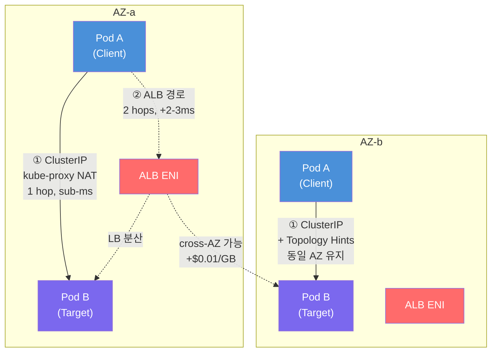
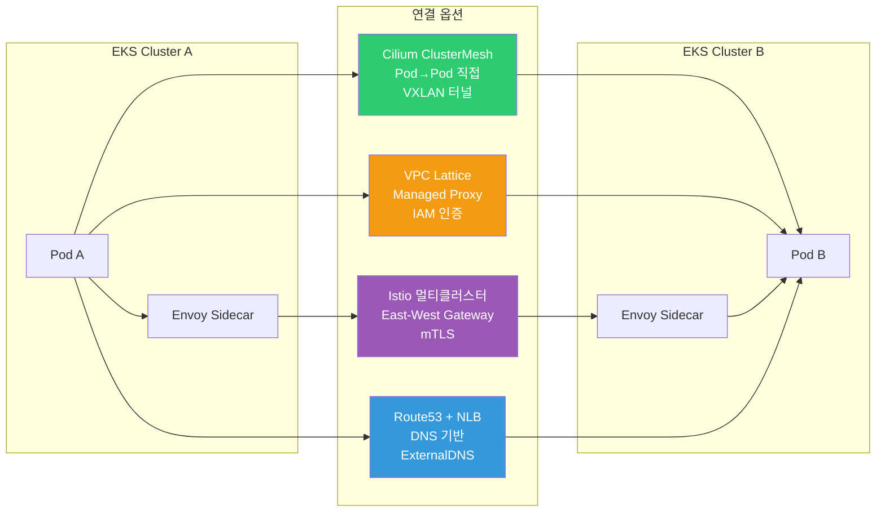

# EKS East-West 트래픽 최적화 가이드

> 📅 **작성일**: 2026-02-09 | **수정일**: 2026-02-14 | ⏱️ **읽는 시간**: 약 21분

## 개요

Amazon EKS 기반의 내부 서비스 간 통신(East-West 트래픽)을 **지연(latency) 최소화**와 **비용 효율화** 관점에서 최적화하는 방안을 정리합니다. 단일 클러스터에서 시작하여 멀티 AZ(Availability Zone) 구성, 나아가 멀티 클러스터/멀티 계정 환경으로 확장되는 시나리오를 단계적으로 다룹니다.

East-West(서비스↔서비스)의 홉 수가 1 → 2로 늘어나면 p99 지연이 밀리초 단위로 증가하고, AZ를 가로지르면 AWS 대역폭 요금(GB 단가 $0.01)이 발생합니다. 이 가이드는 **Kubernetes 네이티브 기능(Topology Aware Routing·InternalTrafficPolicy)부터 Cilium ClusterMesh, AWS VPC Lattice, Istio 서비스 메쉬**까지 레이어별 옵션을 분석하고, 지연·오버헤드·비용을 정량 비교합니다.

### 배경 및 문제점

기본 Kubernetes 네트워킹에서 East-West 트래픽이 직면하는 문제점은 다음과 같습니다:

- **AZ 인식 부재**: 기본 ClusterIP 서비스는 클러스터 전체 Pod에 트래픽을 랜덤(iptables) 또는 라운드로빈(IPVS) 분산시키며 AZ를 고려하지 않습니다
- **불필요한 Cross-AZ 트래픽**: Pod가 여러 AZ에 분산되면 트래픽이 무작위로 타 AZ로 전달되어 지연 증가 및 비용 발생
- **Cross-AZ 데이터 전송 비용**: 동일 리전 내 AZ 간 GB당 약 $0.01이 양방향으로 부과
- **DNS 조회 지연**: 중앙화된 CoreDNS로의 교차 AZ DNS 조회 및 QPS 한도 초과 이슈
- **LB 경유 시 추가 홉**: Internal ALB/NLB를 East-West에 사용하면 불필요한 네트워크 홉과 고정비용 발생

### 핵심 이점

이 가이드의 최적화 전략을 적용하면 다음과 같은 개선을 기대할 수 있습니다:

| 항목 | 개선 효과 |
|------|----------|
| 네트워크 지연 | Topology Aware Routing으로 동일 AZ 라우팅, p99 sub-ms 달성 |
| 비용 절감 | Cross-AZ 트래픽 제거 시 10 TB/월 기준 약 $100 절감 |
| 운영 단순화 | ClusterIP 기반으로 LB 없이 서비스 간 통신 최적화 |
| DNS 성능 | NodeLocal DNSCache로 DNS 조회 지연 수ms → sub-ms |
| 확장성 | 멀티 클러스터/계정 환경으로의 일관된 확장 경로 제공 |

### L4 vs L7 트래픽별 최적화 전략

East-West 트래픽 최적화는 전송 계층(L4)과 애플리케이션 계층(L7)에서 다르게 접근합니다:

- **L4 트래픽(TCP/UDP)**: 추가적인 프로토콜 처리 없이 직접적인 연결 경로를 확보하는 것이 핵심입니다. 불필요한 프록시나 로드밸런서를 경유하지 않고 Pod 간 1-hop 통신이 이루어지도록 설계하면 지연을 최소화할 수 있습니다. 데이터베이스와 같은 StatefulSet 서비스에는 Headless Service를 통해 클라이언트가 DNS 라운드로빈으로 직접 대상 Pod에 연결하는 패턴이 적합합니다.

- **L7 트래픽(HTTP/gRPC)**: 내용 기반 라우팅, 리트라이 등의 고급 트래픽 제어가 필요하면 애플리케이션 계층 프록시를 활용합니다. ALB나 Istio 사이드카를 이용하면 경로 기반 라우팅, gRPC 메서드별 라우팅, 서킷 브레이커 등 L7 기능을 적용할 수 있습니다. 다만 L7 프록시는 패킷 검사와 처리로 부하와 지연이 증가하므로, 단순 트래픽에는 과도한 요소가 될 수 있습니다.

---

## 사전 요구사항

### 필수 지식

- Kubernetes 네트워킹 기본 개념 (Service, Endpoint, kube-proxy)
- AWS VPC 네트워킹 (Subnet, AZ, ENI)
- DNS 해석 메커니즘 (CoreDNS, /etc/resolv.conf)

### 필요한 도구

| 도구 | 버전 | 용도 |
|------|------|------|
| kubectl | 1.27+ | 클러스터 리소스 관리 |
| eksctl | 0.170+ | EKS 클러스터 생성 및 관리 |
| AWS CLI | 2.x | AWS 리소스 확인 |
| Helm | 3.12+ | 차트 배포 (NodeLocal DNSCache 등) |
| AWS Load Balancer Controller | 2.6+ | ALB/NLB 연동 (필요 시) |

### 환경 요구사항

| 항목 | 요구사항 |
|------|----------|
| EKS 버전 | 1.27+ (Topology Aware Routing 지원) |
| VPC CNI | v1.12+ 또는 Cilium (ClusterMesh 시나리오) |
| AZ 구성 | 동일 리전 내 최소 2개 AZ |
| IAM 권한 | EKS 클러스터 관리자, ELB 생성/관리 권한 |

---

## 아키텍처

### 아키텍처 개요: 단일 클러스터 트래픽 경로 비교

아래 다이어그램은 ClusterIP와 Internal ALB 경로의 차이를 보여줍니다:



:::info 핵심 차이점

- **ClusterIP 경로**: Pod → kube-proxy (iptables/IPVS NAT) → target Pod (1 hop)
- **Internal ALB 경로**: Pod → AZ-local ALB ENI → target Pod (2 hops)
- Topology Aware Routing 적용 시 ClusterIP 경로는 동일 AZ 내에서 완결됩니다
:::

### 멀티 클러스터 연결 옵션 비교



### Kubernetes 서비스 유형별 비교

서비스 간 통신을 어떻게 연결하느냐에 따라 성능과 비용에 차이가 있습니다:

| 서비스 유형 | 특징 및 동작 | 장점 | 단점 |
|------------|-------------|------|------|
| **ClusterIP** | 클러스터 내 가상 IP, kube-proxy NAT 분산 (iptables=랜덤, IPVS=라운드로빈) | 간편성, DNS 자동 할당, 추가 비용 없음, sticky session 지원 | Cross-AZ 무작위 분산, NAT 오버헤드 |
| **Headless** | clusterIP 없이 DNS로 모든 Pod IP 직접 노출, 프록시 미경유 | 직접 연결(지연 최소), gRPC DNS 라운드로빈, StatefulSet 필수 | 클라이언트 LB 로직 필요, DNS 갱신 지연, AZ 제어 한계 |
| **Internal NLB** | AWS NLB Controller, L4 동작, Instance/IP 모드 선택 | 멀티 AZ 고가용성, L4 초저지연, 고정 IP | NLB 시간당 비용, Instance 모드 cross-AZ 비용 |
| **Internal ALB** | AWS ALB Controller, L7 동작, IP 모드 전용 | L7 기능(경로 라우팅, WAF, gRPC), Cross-Zone 무료 | ALB 시간당 + LCU 비용, 수~수십ms 추가 지연 |

:::tip 서비스 유형 선택 지침

- **기본 선택**: ClusterIP + Topology Aware Routing
- **StatefulSet**: Headless 서비스
- **L7 기능 필요 시**: Internal ALB (IP 모드)
- **L4 외부 노출 필요 시**: Internal NLB (IP 모드)
:::

### Instance 모드 vs IP 모드

Internal LB 사용 시 Instance 모드와 IP 모드의 차이를 이해하는 것이 중요합니다:

- **Instance 모드**: LB → NodePort → kube-proxy → Pod. NodePort를 받은 노드의 kube-proxy가 대상 Pod이 위치한 다른 AZ의 노드로 패킷을 전달하면서 **교차 AZ 통신이 발생**합니다
- **IP 모드**: LB → Pod IP 직접 연결. 각 AZ에서 Pod IP로 직접 트래픽을 전달하기 때문에 **중간 Node를 거치지 않고 동일 AZ의 Pod으로 연결**됩니다

:::warning Instance 모드 주의
Instance 모드에서는 NodePort 경유로 cross-AZ 트래픽이 증가합니다. AWS 모범사례는 내부 LB 사용 시 가능하면 **IP 모드**로 설정하여 불필요한 AZ 간 트래픽을 줄일 것을 권장합니다. IP 모드를 사용하려면 AWS Load Balancer Controller가 필요합니다.
:::

### 아키텍처 의사결정

:::info 기술 선택 기준

**왜 ClusterIP를 기본으로 선택하는가?**

- 네이티브 Kubernetes 기능으로 추가 비용 없음
- 1-hop 통신으로 최저 지연
- Topology Aware Routing과 결합하여 AZ 인식 가능
- 서비스 메쉬, Gateway API와의 통합 용이

**왜 Internal ALB는 선택적으로 사용하는가?**

- 시간당 비용($0.0225/h) + LCU 과금이 지속 발생
- 추가 네트워크 홉으로 2-3ms RTT 오버헤드
- EC2→EKS 마이그레이션 등 과도기적 사용에 적합
:::

---

## 구현

### 단계 1: Topology Aware Routing 활성화

멀티 AZ 환경에서 지연과 비용을 줄이는 핵심은 트래픽이 가능한 한 동일 AZ 내에서 처리되도록 하는 것입니다. Kubernetes 1.27+ 버전에서 Topology Aware Routing을 활성화하면, EndpointSlice에 각 엔드포인트의 AZ 정보(hints)가 기록되고 kube-proxy가 클라이언트와 같은 Zone의 Pod으로만 트래픽을 라우팅합니다.

```yaml
apiVersion: v1
kind: Service
metadata:
  name: my-service
  namespace: production
  annotations:
    # Topology Aware Routing 활성화
    service.kubernetes.io/topology-mode: Auto
spec:
  selector:
    app: my-app
  ports:
    - name: http
      port: 80
      targetPort: 8080
      protocol: TCP
  type: ClusterIP
```

**검증:**

```bash
# EndpointSlice에 topology hints가 설정되었는지 확인
kubectl get endpointslices -l kubernetes.io/service-name=my-service -o yaml

# 출력에서 hints 필드 확인
# hints:
#   forZones:
#     - name: ap-northeast-2a
```

:::warning Topology Aware Routing 동작 조건

- 각 AZ에 **충분한 엔드포인트**가 존재해야 합니다
- Pod가 특정 AZ에만 치우쳐 있으면 해당 서비스는 힌트를 비활성화하고 전체로 라우팅합니다
- EndpointSlice 컨트롤러가 AZ별 Pod 비율이 균등하지 않다고 판단하면 hints가 생성되지 않습니다
:::

### 단계 2: InternalTrafficPolicy Local 설정

Topology Aware Routing보다 범위를 더 좁힌 기능으로, 동일 노드(Local Node)에 구동 중인 엔드포인트에만 트래픽을 전달합니다. 노드 간(당연히 AZ 간) 네트워크 홉이 완전히 제거되어 지연이 최소화되고 Cross-AZ 비용도 0에 수렴합니다.

```yaml
apiVersion: v1
kind: Service
metadata:
  name: my-local-service
  namespace: production
spec:
  selector:
    app: my-app
  ports:
    - name: http
      port: 80
      targetPort: 8080
  type: ClusterIP
  # 동일 노드의 엔드포인트로만 트래픽 전달
  internalTrafficPolicy: Local
```

:::danger InternalTrafficPolicy: Local 주의사항
로컬 노드에 대상 Pod이 하나도 없는 경우 **트래픽이 드롭**됩니다. 이 정책을 사용하는 서비스는 모든 노드(혹은 최소 해당 서비스 호출이 발생하는 노드)에 적어도 하나 이상의 Pod가 배치되어야 합니다. Pod Topology Spread 또는 PodAffinity를 반드시 함께 사용하세요.
:::

:::info Topology Aware Routing vs InternalTrafficPolicy
두 기능은 **동시에 사용할 수 없으며** 선택적으로 적용해야 합니다:

- **멀티 AZ 환경**: 우선 AZ 단위 분산을 보장하는 Topology Aware Routing 고려
- **같은 노드 내 빈번한 호출**: 짝을 이루는 파드들 간 강한 결합 통신에 InternalTrafficPolicy(Local) + Pod 공배치 활용
:::

### 단계 3: Pod Topology Spread Constraints

토폴로지 기반 최적화의 효과를 얻으려면 애플리케이션 복제본의 배치 전략이 중요합니다. Topology Aware Routing이 제대로 동작하려면 각 AZ에 충분한 엔드포인트가 존재해야 합니다.

```yaml
apiVersion: apps/v1
kind: Deployment
metadata:
  name: my-app
  namespace: production
spec:
  replicas: 6
  selector:
    matchLabels:
      app: my-app
  template:
    metadata:
      labels:
        app: my-app
    spec:
      # AZ별 균등 분산
      topologySpreadConstraints:
        - maxSkew: 1
          topologyKey: topology.kubernetes.io/zone
          whenUnsatisfiable: DoNotSchedule
          labelSelector:
            matchLabels:
              app: my-app
        # 노드별 분산 (선택사항)
        - maxSkew: 1
          topologyKey: kubernetes.io/hostname
          whenUnsatisfiable: ScheduleAnyway
          labelSelector:
            matchLabels:
              app: my-app
      containers:
        - name: my-app
          image: my-app:latest
          ports:
            - containerPort: 8080
          resources:
            requests:
              cpu: 100m
              memory: 128Mi
```

**Pod Affinity를 이용한 공동 배치(co-location):**

자주 통신하는 서비스 A와 B를 동일 노드 또는 동일 AZ에 배치하도록 PodAffinity 규칙을 적용할 수 있습니다:

```yaml
spec:
  affinity:
    podAffinity:
      # 서비스 B가 있는 노드에 우선 배치
      preferredDuringSchedulingIgnoredDuringExecution:
        - weight: 100
          podAffinityTerm:
            labelSelector:
              matchLabels:
                app: service-b
            topologyKey: topology.kubernetes.io/zone
```

:::tip 오토스케일링 주의사항
HPA로 스케일 아웃할 때는 Spread Constraints에 따라 새 파드를 퍼뜨릴 수 있지만, **스케일 인 시에는 컨트롤러가 AZ 균형을 고려하지 않고 임의의 파드를 제거**하기 때문에 균형이 무너질 수 있습니다. Descheduler를 사용해 불균형 발생 시 재조정하는 것을 권장합니다.
:::

### 단계 4: NodeLocal DNSCache 배포

DNS 조회 지연과 실패는 마이크로서비스 환경에서 예상 외로 지연을 증가시키는 요소가 될 수 있습니다. NodeLocal DNSCache는 각 노드에 DNS 캐시 에이전트를 DaemonSet으로 구동하여 DNS 응답시간을 크게 단축합니다.

```bash
# NodeLocal DNSCache 매니페스트 다운로드 및 배포
kubectl apply -f https://raw.githubusercontent.com/kubernetes/kubernetes/master/cluster/addons/dns/nodelocaldns/nodelocaldns.yaml
```

또는 Helm 차트를 사용합니다:

```bash
helm repo add deliveryhero https://charts.deliveryhero.io/
helm install node-local-dns deliveryhero/node-local-dns \
  --namespace kube-system \
  --set config.localDnsIp=169.254.20.10
```

**NodeLocal DNSCache 동작 원리:**

```yaml
# 각 Pod의 /etc/resolv.conf가 로컬 캐시로 향하게 설정
# nameserver 169.254.20.10 (NodeLocal DNS IP)
# 자주 조회되는 DNS 질의를 노드 내부에서 캐싱
```

**효과:**

- p99 DNS lookup 지연: 수ms → sub-ms
- CoreDNS QPS 부하 완화
- 1만 개 이상 Pod 환경에서 DNS 대기시간 수십ms 절약
- 교차 AZ DNS 요금 감소

:::tip NodeLocal DNSCache 적용 기준
AWS 공식 블로그에서는 **노드 수가 많은 클러스터**에서 NodeLocal DNSCache 사용을 권장하며 CoreDNS 스케일아웃과 함께 활용하라고 조언합니다. 워크로드 규모에 따라 노드당 추가 데몬의 리소스 소모(CPU/메모리)를 고려하여 적용하세요.
:::

### 단계 5: Internal LB IP 모드 구성 (필요 시)

L7 기능이 필요하거나 EC2→EKS 마이그레이션 과도기에는 Internal ALB를 IP 모드로 구성합니다:

**Internal NLB (IP 모드):**

```yaml
apiVersion: v1
kind: Service
metadata:
  name: my-service-nlb
  namespace: production
  annotations:
    # AWS Load Balancer Controller 사용
    service.beta.kubernetes.io/aws-load-balancer-type: external
    service.beta.kubernetes.io/aws-load-balancer-nlb-target-type: ip
    service.beta.kubernetes.io/aws-load-balancer-scheme: internal
    # Cross-Zone LB 비활성화 (AZ 로컬 트래픽 유지)
    service.beta.kubernetes.io/aws-load-balancer-attributes: load_balancing.cross_zone.enabled=false
spec:
  type: LoadBalancer
  selector:
    app: my-app
  ports:
    - name: http
      port: 80
      targetPort: 8080
      protocol: TCP
```

**Internal ALB (Ingress 리소스):**

```yaml
apiVersion: networking.k8s.io/v1
kind: Ingress
metadata:
  name: my-service-alb
  namespace: production
  annotations:
    kubernetes.io/ingress.class: alb
    alb.ingress.kubernetes.io/scheme: internal
    alb.ingress.kubernetes.io/target-type: ip
    alb.ingress.kubernetes.io/healthcheck-path: /health
spec:
  rules:
    - host: my-service.internal
      http:
        paths:
          - path: /
            pathType: Prefix
            backend:
              service:
                name: my-service
                port:
                  number: 80
```

### 단계 6: Istio 서비스 메쉬 (선택적)

보안 요구사항(mTLS, Zero-Trust)이 있거나 고급 트래픽 관리가 필요한 경우 Istio를 선택적으로 도입합니다.

**Istio의 주요 이점:**

- **Locality 기반 라우팅**: Envoy 사이드카 간 로컬리티 정보를 활용하여 동일 AZ 또는 동일 지역의 인스턴스로 라우팅
- **투명한 mTLS**: 애플리케이션 코드 수정 없이 Mutual TLS 암호화
- **고급 트래픽 관리**: 리트라이, 타임아웃, 서킷브레이커, 카나리 배포

**성능 오버헤드 (Istio 1.24 기준):**

| 메트릭 | 수치 |
|--------|------|
| 사이드카당 CPU | ~0.2 vCPU (1000 rps 기준) |
| 사이드카당 메모리 | ~60 MB (1000 rps 기준) |
| 추가 지연 (p99) | ~5ms (클라이언트+서버 2회 프록시 경유) |
| 성능 영향 | 평균 5~10% 처리량 감소 |

:::warning Istio 도입 시 고려사항

- 사이드카 리소스 소모로 EC2 비용 상승 가능
- mTLS 활성화 시 CPU 사용량 추가 증가
- 컨트롤 플레인(Istiod) 관리, CRD(VirtualService, DestinationRule) 학습 필요
- 디버깅 난이도 상승 (사이드카, 컨트롤 플레인까지 추적)
- **지연 민감도가 매우 높은 서비스**에는 메쉬 적용을 신중히 결정
:::

```yaml
# Istio Locality Load Balancing 설정 예시
apiVersion: networking.istio.io/v1beta1
kind: DestinationRule
metadata:
  name: my-service
spec:
  host: my-service.production.svc.cluster.local
  trafficPolicy:
    outlierDetection:
      consecutive5xxErrors: 5
      interval: 30s
      baseEjectionTime: 30s
    connectionPool:
      tcp:
        maxConnections: 100
      http:
        h2UpgradePolicy: DEFAULT
        maxRequestsPerConnection: 10
```

### 멀티 클러스터 연결 전략

서비스가 여러 클러스터 또는 여러 AWS 계정에 분산될 경우, 클러스터 간 연결 전략이 필요합니다.

#### Cilium ClusterMesh

Cilium ClusterMesh는 CNI인 Cilium이 제공하는 멀티 클러스터 네트워킹 기능으로, 여러 클러스터를 하나의 네트워크처럼 묶어줍니다. 별도의 게이트웨이나 프록시를 경유하지 않고 eBPF 기반으로 Pod-to-Pod 직접 통신이 가능합니다.

```bash
# ClusterMesh 활성화 (Cilium CLI)
cilium clustermesh enable --context cluster1
cilium clustermesh enable --context cluster2

# 클러스터 연결
cilium clustermesh connect --context cluster1 --destination-context cluster2

# 상태 확인
cilium clustermesh status --context cluster1
```

**장점:** 가장 낮은 지연, 추가 요청당 비용 없음, 투명한 서비스 발견
**단점:** 모든 클러스터가 Cilium CNI 필수, Cilium 운영 지식 필요

#### AWS VPC Lattice

Amazon VPC Lattice는 완전관리형 애플리케이션 네트워킹 서비스로, 여러 VPC와 계정에 걸쳐 일관된 서비스 연결, IAM 기반 인증, 모니터링을 제공합니다.

```yaml
# Kubernetes Gateway API를 통한 Lattice 연동
apiVersion: gateway.networking.k8s.io/v1beta1
kind: Gateway
metadata:
  name: my-lattice-gateway
  annotations:
    application-networking.k8s.aws/lattice-vpc-association: "true"
spec:
  gatewayClassName: amazon-vpc-lattice
  listeners:
    - name: http
      protocol: HTTP
      port: 80
```

**비용 구조:** 서비스당 $0.025/시간 + $0.025/GB + 100만 요청당 $0.10
**적합한 경우:** 수십 개 이상의 마이크로서비스가 여러 계정에 분산, 중앙 보안 통제 필요

#### Istio 멀티클러스터 메쉬

이미 Istio를 사용하고 있다면 멀티클러스터 서비스 메쉬로 확장할 수 있습니다. Flat network 환경에서는 Envoy-to-Envoy 직통 통신이 가능하고, 분리된 네트워크에서는 East-West Gateway를 경유합니다.

**장점:** 서비스 메쉬 전 기능을 클러스터 경계 넘어 활용, 글로벌 mTLS, 클러스터 간 페일오버
**단점:** 4가지 옵션 중 운영 복잡도 최고, 인증서 관리/사이드카 동기화 등 과제

#### Route53 + ExternalDNS

가장 단순한 멀티클러스터 연결 방법으로, 각 클러스터의 서비스를 Route53 Private Hosted Zone에 등록하고 DNS로 접근합니다.

```yaml
# ExternalDNS 설정 예시
apiVersion: v1
kind: Service
metadata:
  name: my-service
  annotations:
    external-dns.alpha.kubernetes.io/hostname: my-service.internal.example.com
spec:
  type: LoadBalancer
  ...
```

**적합한 경우:** 클러스터 2-3개, 서비스 호출이 빈번하지 않은 경우, DR 구성

---

## 주요 옵션 지연 및 비용 비교

### 옵션별 성능·비용 비교표

| 옵션 | 추가 지연 특성 | 비용 구조 및 효율 |
|------|--------------|-----------------|
| **ClusterIP** | kube-proxy NAT 처리 (µs~ms 단위). 직접 연결 대비 미세한 오버헤드 | 별도 비용 없음. Cross-AZ 시 $0.01/GB |
| **Headless** | 프록시 미경유, 추가 지연 거의 0. DNS 조회에만 시간 소요 | 별도 비용 없음. Cross-AZ 비용 동일 |
| **Internal NLB (Instance)** | 수ms + NodePort 1홉 추가 + kube-proxy 추가 홉 가능 | NLB 시간당 + 데이터 GB당 + cross-AZ 비용 증가 |
| **Internal NLB (IP)** | 수ms. Pod로 직접 연결되어 NodePort 홉 없음 | NLB 비용 발생, 교차 AZ 트래픽 회피로 비용 절감 |
| **Internal ALB** | 수~수십ms (L7 규칙 처리, 요청 크기/규칙 수에 비례) | ALB 시간당($0.0225/h) + LCU 비용. Cross-Zone 무료 |
| **Istio Sidecar** | ~5ms 증가 (클라이언트+서버 2회 프록시) | 오픈소스, 프록시당 0.2 vCPU/60MB per 1000rps |
| **Cilium ClusterMesh** | Pod→Pod 직접. VXLAN 캡슐화 오버헤드 수십µs | AWS 서비스 비용 없음. 데이터 전송 비용만 |
| **VPC Lattice** | Managed proxy 경유, HTTP 요청당 수ms | $0.025/h + $0.025/GB + $0.1/1M 요청 |
| **Route53 + NLB** | DNS 조회 수십ms (캐시 시 ~0) + NLB 수ms | Route53 저렴($0.40/1M건), NLB + cross-AZ 추가 |

### 10 TB/월 East-West 트래픽 비용 시뮬레이션

가정: 동일 리전 3-AZ EKS 클러스터, 총 10 TB (= 10,240 GB) 서비스 간 트래픽

| 구성 | 월간 예상 비용 | 설명 |
|------|-------------|------|
| **InternalTrafficPolicy Local** | **$0** | 노드 로컬 통신, cross-AZ 완전 제거 |
| **ClusterIP + Topology Hints** | **~$30** | cross-AZ ~30%로 감소 |
| **ClusterIP (기본, AZ 인식 없음)** | **~$68** | cross-AZ ~66% (3-AZ 균등분산) |
| **Internal ALB 경유** | **~$98** | ALB 시간당 + LCU + cross-AZ |
| **VPC Lattice** | **$400+** | 서비스당 시간과금 + GB당 + 요청당 |

:::tip 비용 최적화 핵심 인사이트

- **InternalTrafficPolicy Local**로 노드-로컬을 보장하면 비용 $0에 가장 낮은 지연 달성. 단, Pod Affinity 및 근접 배치가 필수
- **서비스 20개 이상, 다계정이면** Lattice가 운영 편의성 제공 (추가 비용 감수)
- **하이브리드 전략**이 대부분의 워크로드에 가장 경제적: ALB는 L7·WAF 필요한 특정 경로에만 스팟 투입하고, 나머지는 ClusterIP 경로 유지
:::

---

## 검증 및 모니터링

### Topology Aware Routing 검증

```bash
# EndpointSlice의 hints 확인
kubectl get endpointslices -l kubernetes.io/service-name=my-service \
  -o jsonpath='{range .items[*].endpoints[*]}{.addresses}{"\t"}{.zone}{"\t"}{.hints.forZones[*].name}{"\n"}{end}'

# 출력 예상:
# ["10.0.1.15"]    ap-northeast-2a    ap-northeast-2a
# ["10.0.2.23"]    ap-northeast-2b    ap-northeast-2b
# ["10.0.3.41"]    ap-northeast-2c    ap-northeast-2c
```

```bash
# Pod가 AZ별로 균등 분산되었는지 확인
kubectl get pods -l app=my-app -o wide | awk '{print $7}' | sort | uniq -c

# 출력 예상:
# 2 ip-10-0-1-xxx.ap-northeast-2.compute.internal  (AZ-a)
# 2 ip-10-0-2-xxx.ap-northeast-2.compute.internal  (AZ-b)
# 2 ip-10-0-3-xxx.ap-northeast-2.compute.internal  (AZ-c)
```

### 모니터링: Internal ALB

ALB를 사용하는 서비스의 경우 CloudWatch 메트릭으로 모니터링합니다:

| 메트릭 | 목표 | 경고 | 임계 |
|--------|------|------|------|
| `TargetResponseTime` | 100ms 미만 | 100-300ms | 300ms 초과 |
| `HTTPCode_ELB_5XX_Count` | 0 | 1-10/분 | 10/분 초과 |
| `HTTPCode_Target_5XX_Count` | 0 | 1-5/분 | 5/분 초과 |
| `ActiveConnectionCount` | 정상 범위 | 80% 용량 | 90% 용량 |

```bash
# ALB access log에서 5xx 에러 원인 분석
# error_reason 필드로 502/504 root cause 식별
aws logs filter-log-events \
  --log-group-name /aws/alb/my-internal-alb \
  --filter-pattern "elb_status_code=5*"
```

### 모니터링: ClusterIP (LB 없는 경우)

ClusterIP 서비스에는 ELB 메트릭이 없으므로 별도 계측이 필요합니다:

- **서비스 메쉬**: Istio/Linkerd 또는 Envoy 사이드카를 통한 L7 메트릭
- **eBPF 기반 도구**: Hubble, Cilium, Pixie를 통한 TCP reset 및 5xx 통계
- **애플리케이션 레벨**: Prometheus/OpenTelemetry를 통한 5xx 카운트

```yaml
# Prometheus ServiceMonitor 예시
apiVersion: monitoring.coreos.com/v1
kind: ServiceMonitor
metadata:
  name: my-service-monitor
spec:
  selector:
    matchLabels:
      app: my-app
  endpoints:
    - port: metrics
      interval: 15s
      path: /metrics
```

### Cross-AZ 비용 모니터링

```bash
# AWS Cost and Usage Report에서 Regional Data Transfer 비용 확인
aws ce get-cost-and-usage \
  --time-period Start=2026-02-01,End=2026-02-28 \
  --granularity MONTHLY \
  --metrics "BlendedCost" \
  --filter '{"Dimensions":{"Key":"USAGE_TYPE","Values":["APN2-DataTransfer-Regional-Bytes"]}}'
```

:::tip Kubecost 활용
Kubecost를 설치하면 네임스페이스별 cross-AZ 트래픽 비용을 시각화할 수 있습니다. `RegionalDataTransferCost` 메트릭을 통해 어떤 서비스 간 통신이 가장 많은 cross-AZ 비용을 유발하는지 파악할 수 있습니다.
:::

---

## 시나리오별 추천 매트릭스

서비스 특성, 보안 요구사항, 운영 복잡도에 따른 권장 솔루션 조합입니다:

| 서비스 시나리오 | 권장 솔루션 조합 |
|---------------|----------------|
| **단순 내부 마이크로서비스** (HTTP/gRPC, 지연 민감) – Single Cluster | ClusterIP + Topology Aware Routing + NodeLocal DNSCache. 필요 시 InternalTrafficPolicy(Local)로 동일 노드 최적화 |
| **StatefulSet** (DB 등 TCP, 세션 필요) – Single Cluster | Headless 서비스 + 클라이언트 DNS 라운드로빈. 클라이언트와 같은 AZ에 리더-팔로워 스케줄링 |
| **대용량 L7 트래픽** (라우팅/WAF 필요) – Single Cluster | Internal ALB (IP 모드) + ClusterIP 서비스 연결. ALB는 필요한 서비스에만 사용 |
| **보안 민감** (mTLS/Zero-Trust 필수) – Single/Multi Cluster | Istio 서비스 메쉬. mTLS + AuthorizationPolicy. 레이턴시 요구와 트래픽량 검토 |
| **멀티 AZ 비용 최적화** (트래픽 많음, 메쉬 미사용) | Topology Hints + IP 모드 LB + Pod Spread + NAT GW AZ별 분리 |
| **멀티 클러스터** (동일 계정, 낮은 운영 복잡도) | Cilium ClusterMesh. Pod 직접 통신, 추가 비용 없이 저지연 |
| **멀티 계정/조직** (IAM 통제, 운영 인력 적음) | AWS VPC Lattice. IAM Policy 기반 접근 제어, 통합 모니터링 |
| **멀티 클러스터 메쉬** (이미 Istio 사용, 최고 보안/관찰성) | Istio 멀티클러스터 메쉬. 전담 운영팀이 있는 경우에만 권장 |
| **간단한 DR 클러스터** (트래픽 적음) | DNS + Internal NLB (Route53 + ExternalDNS). DR 시 DNS 스위칭 |

:::info 하이브리드 전략
현실적인 환경에서는 한 가지 전략만 사용하기보다 **혼합하여 사용**하는 경우가 많습니다. 예를 들어:

- 클러스터 내부: ClusterIP + Topology Hints
- 메쉬 미포함 서비스: InternalTrafficPolicy로 최적화
- 멀티클러스터 간: Lattice로 연결
- 특정 L7 경로: ALB를 스팟으로 투입
:::

---

## EC2→EKS 마이그레이션 가이드

### 마이그레이션 단계별 전략

EC2에서 EKS로 서비스를 마이그레이션하는 과도기에는 Internal ALB를 활용한 점진적 전환이 권장됩니다:

**1단계: EKS 내부에서 ClusterIP 시작**

```bash
# EKS 서비스 간 통신은 DNS http://service.namespace.svc.cluster.local 사용
# 코드 포터빌리티 유지
```

**2단계: EC2와 EKS를 동시에 서비스**

```yaml
# Internal ALB에 두 개의 Target Group 설정
# EC2 Instance TG + EKS Pod TG (AWS LB Controller)
# 가중 리스너 규칙으로 점진적 전환 (예: 90/10)
apiVersion: elbv2.k8s.aws/v1beta1
kind: TargetGroupBinding
metadata:
  name: my-service-tgb
spec:
  serviceRef:
    name: my-service
    port: 80
  targetGroupARN: arn:aws:elasticloadbalancing:ap-northeast-2:123456789012:targetgroup/my-eks-tg/xxx
  targetType: ip
```

**3단계: 100% EKS 전환 후 ALB 제거**

EKS로 완전 전환된 후에는 ALB를 제거하고 ClusterIP로 돌아가 지속적인 ALB 비용을 제거합니다.

:::tip 마이그레이션 핵심 원칙

- **정상 상태(steady-state)**: ClusterIP로 최저 비용·최저 지연 유지
- **과도기**: Internal ALB로 EC2/EKS 듀얼 라우팅 (weighted target groups)
- **전환 완료 후**: ALB 제거하여 비용 라인 아이템 자체를 삭제
:::

---

## 트러블슈팅

### 문제: Topology Aware Routing이 동작하지 않음

**증상:**

```
EndpointSlice에 hints 필드가 비어있음
트래픽이 여전히 cross-AZ로 분산됨
```

**원인 분석:**

```bash
# EndpointSlice 상태 확인
kubectl get endpointslices -l kubernetes.io/service-name=my-service -o yaml

# AZ별 Pod 분포 확인
kubectl get pods -l app=my-app -o json | \
  jq -r '.items[] | "\(.spec.nodeName) \(.status.podIP)"' | \
  while read node ip; do
    zone=$(kubectl get node $node -o jsonpath='{.metadata.labels.topology\.kubernetes\.io/zone}')
    echo "$zone $ip"
  done | sort | uniq -c
```

**해결 방법:**

1. Pod가 **모든 AZ에 균등 분산**되었는지 확인 (최소 2개 이상/AZ)
2. `topologySpreadConstraints`를 Deployment에 추가
3. EndpointSlice 컨트롤러가 hints를 생성하는 조건 확인:
   - 각 AZ의 엔드포인트 비율이 대략 균등해야 함
   - 하나의 AZ에 전체 엔드포인트의 50% 이상이 집중되면 hints가 생성되지 않음

### 문제: InternalTrafficPolicy Local에서 트래픽 드롭

**증상:**

```
특정 노드에서 서비스 호출 시 connection refused 또는 timeout
kubectl logs에 "no endpoints available" 메시지
```

**원인 분석:**

```bash
# 로컬 노드에 대상 Pod이 있는지 확인
kubectl get pods -l app=target-service -o wide

# 특정 노드에서의 엔드포인트 확인
kubectl get endpoints my-local-service -o yaml
```

**해결 방법:**

1. DaemonSet으로 대상 서비스를 모든 노드에 배포
2. PodAffinity로 호출자와 대상이 같은 노드에 위치하도록 강제
3. 또는 InternalTrafficPolicy를 제거하고 Topology Aware Routing으로 전환 (AZ 단위)

```yaml
# 대안: Topology Aware Routing으로 전환
apiVersion: v1
kind: Service
metadata:
  name: my-service
  annotations:
    service.kubernetes.io/topology-mode: Auto
spec:
  # internalTrafficPolicy: Local 제거
  selector:
    app: my-app
```

### 문제: Cross-AZ 비용이 줄지 않음

**증상:**

```
Topology Aware Routing 적용 후에도 AWS Cost Explorer에서 Regional Data Transfer 비용이 감소하지 않음
```

**원인 분석:**

```bash
# 실제 트래픽 경로 확인 (Cilium Hubble 사용 시)
hubble observe --namespace production --protocol TCP \
  --to-label app=target-service --output json | \
  jq '.source.labels, .destination.labels'

# NAT Gateway 경유 여부 확인
kubectl exec -it test-pod -- traceroute target-service.production.svc.cluster.local
```

**해결 방법:**

1. **NAT Gateway를 AZ별로 분리 배치** (외부 통신 시 cross-AZ 방지)
2. NLB/ALB가 **IP 모드**로 설정되었는지 확인
3. CoreDNS가 cross-AZ에서 실행되고 있는지 확인 → NodeLocal DNSCache 적용
4. Kubecost로 네임스페이스별 cross-AZ 트래픽 원인 식별

### 문제: NodeLocal DNSCache 관련 이슈

**증상:**

```
NodeLocal DNSCache 배포 후 DNS 해석 실패
Pod에서 외부 도메인 조회 불가
```

**해결 방법:**

```bash
# NodeLocal DNS Pod 상태 확인
kubectl get pods -n kube-system -l k8s-app=node-local-dns

# DNS 해석 테스트
kubectl exec -it test-pod -- nslookup kubernetes.default.svc.cluster.local
kubectl exec -it test-pod -- nslookup google.com

# resolv.conf 확인
kubectl exec -it test-pod -- cat /etc/resolv.conf
# nameserver가 169.254.20.10 (NodeLocal IP)인지 확인
```

:::danger 프로덕션 환경 주의
프로덕션 환경에서 네트워크 설정을 변경할 때는 반드시 **카나리 배포** 방식으로 소규모 서비스부터 적용하고, 변경 전후 성능 메트릭을 비교하세요. Topology Aware Routing이나 InternalTrafficPolicy 변경은 트래픽 경로를 즉시 바꾸므로, 모니터링을 강화한 상태에서 진행해야 합니다.
:::

---

## 결론

### 핵심 요점 정리

:::tip 아키텍처 선택 가이드

**1. 저비용 + 초저지연**

- ClusterIP + Topology Aware Routing + NodeLocal DNSCache
- 필요 시 InternalTrafficPolicy(Local) 추가
- 10 TB/월 기준 ALB 대비 약 $98, VPC Lattice 대비 $400+ 절감

**2. L4 안정성과 고정 IP 필요**

- Internal NLB (IP 모드)
- 트래픽 > 5 TB/월이면 비용 면밀히 검토

**3. L7 라우팅·WAF·gRPC 메서드별 제어**

- Internal ALB + K8s Gateway API
- 필요한 경로에만 배치하여 LCU 증가 방지

**4. 전사 Zero-Trust, 멀티클러스터**

- Istio Ambient → Sidecar 전환은 필요한 워크로드에만 스코프 다운
- 사이드카 → 노드 프록시(Ambient) → Sidecar-less(eBPF) 순으로 오버헤드 감소

**5. 다계정·서비스 > 50개**

- 관리형 VPC Lattice + IAM 정책으로 복잡도 낮춤

:::

### 다음 단계

구현 완료 후 다음 사항을 검토하세요:

- [ ] Topology Aware Routing 활성화 및 EndpointSlice hints 확인
- [ ] Pod Topology Spread Constraints로 AZ 균등 분산 보장
- [ ] NodeLocal DNSCache 배포 및 DNS 응답시간 개선 확인
- [ ] Cross-AZ 비용 모니터링 대시보드 설정 (Kubecost 또는 CUR)
- [ ] 불필요한 Internal LB 식별 및 ClusterIP 전환 검토
- [ ] 마이그레이션 완료 서비스의 ALB 제거 계획 수립

---

## 참고 자료

1. [AWS Elastic Load Balancing 요금 - LCU/NLCU 가격](https://aws.amazon.com/elasticloadbalancing/pricing/)
2. [AWS 데이터 전송 요금 - Cross-AZ $0.01/GB](https://aws.amazon.com/ec2/pricing/on-demand/#Data_Transfer)
3. [AWS ELB Best Practices - 지연 최적화](https://docs.aws.amazon.com/elasticloadbalancing/latest/application/application-load-balancers.html)
4. [AWS Network Load Balancer](https://aws.amazon.com/elasticloadbalancing/network-load-balancer/)
5. [AWS VPC Lattice 요금](https://aws.amazon.com/vpc/lattice/pricing/)
6. [Istio 1.24 Performance and Scalability](https://istio.io/latest/docs/ops/deployment/performance-and-scalability/)
7. [Kubernetes NodeLocal DNSCache](https://kubernetes.io/docs/tasks/administer-cluster/nodelocaldns/)
8. [Kubernetes Topology Aware Routing](https://kubernetes.io/docs/concepts/services-networking/topology-aware-routing/)
9. [Cilium ClusterMesh Documentation](https://docs.cilium.io/en/stable/network/clustermesh/)
10. [AWS EKS Best Practices - Cost Optimization](https://docs.aws.amazon.com/eks/latest/best-practices/cost-opt.html)
11. [Kubernetes Pod Topology Spread Constraints](https://kubernetes.io/docs/concepts/scheduling-eviction/topology-spread-constraints/)
