# EKS Pod 리소스 최적화 가이드

> 📅 **작성일**: 2026-02-12 | ⏱️ **읽는 시간**: 약 20분

> **📌 기준 환경**: EKS 1.30+, Kubernetes 1.30+, Metrics Server v0.7+

## 개요

Kubernetes 환경에서 Pod 리소스 설정은 클러스터 효율성과 비용에 직접적인 영향을 미칩니다. **컨테이너의 50%가 요청한 CPU의 1/3만 사용**하며, 이는 평균 40-60%의 리소스 낭비로 이어집니다. 이 가이드는 Pod 레벨 리소스 최적화를 통해 클러스터 효율성을 극대화하고 비용을 30-50% 절감하는 실전 전략을 제공합니다.

:::info 관련 문서와의 차이점
- **[karpenter-autoscaling.md](/docs/infrastructure-optimization/karpenter-autoscaling)**: 노드 레벨 오토스케일링 (이 문서는 Pod 레벨)
- **[cost-management.md](/docs/infrastructure-optimization/cost-management)**: 전체 비용 전략 (이 문서는 리소스 설정에 집중)
- **[eks-resiliency-guide.md](/docs/operations-observability/eks-resiliency-guide)**: 리소스 설정을 체크리스트 항목으로만 다룸
:::

### 핵심 내용

- **Requests vs Limits 심층 이해**: CPU throttling과 OOM Kill 메커니즘
- **QoS 클래스 전략**: Guaranteed, Burstable, BestEffort의 실전 활용
- **VPA 완벽 가이드**: 자동 리소스 조정과 HPA 공존 패턴
- **Right-Sizing 방법론**: P95 기반 리소스 산정 및 Goldilocks 활용
- **비용 영향 분석**: 리소스 최적화의 실제 절감 효과

### 학습 목표

이 가이드를 완료하면 다음을 수행할 수 있습니다:

- CPU와 Memory requests/limits의 정확한 동작 원리 이해
- 워크로드 특성에 맞는 QoS 클래스 선택
- VPA와 HPA를 안전하게 공존시키는 구성
- 실제 사용량 기반 Right-Sizing 수행
- 리소스 효율성 30% 이상 개선

## 사전 요구사항

### 필요한 도구

| 도구 | 버전 | 용도 |
|------|------|------|
| kubectl | 1.28+ | Kubernetes 클러스터 관리 |
| helm | 3.12+ | VPA, Goldilocks 설치 |
| metrics-server | 0.7+ | 리소스 메트릭 수집 |
| kubectl-top | 내장 | 리소스 사용량 확인 |

### 필요한 권한

```bash
# RBAC 권한 확인
kubectl auth can-i get pods --all-namespaces
kubectl auth can-i get resourcequotas
kubectl auth can-i create verticalpodautoscaler
```

### 선행 지식

- Kubernetes Pod, Deployment 기본 개념
- YAML 매니페스트 작성 경험
- Linux cgroups 기본 이해 (권장)
- Prometheus/Grafana 기본 사용법 (권장)

## Resource Requests & Limits 심층 이해

### 2.1 Requests vs Limits의 정확한 의미

Resource requests와 limits는 Kubernetes 리소스 관리의 핵심 개념입니다.

**Requests (요청량)**
- **정의**: 스케줄러가 Pod 배치 시 보장하는 최소 리소스
- **역할**: 노드 선택 기준, QoS 클래스 결정
- **보장**: kubelet이 이 양을 항상 확보

**Limits (제한량)**
- **정의**: kubelet이 강제하는 최대 리소스
- **역할**: 리소스 고갈 방지, 노이지 네이버(noisy neighbor) 제한
- **강제**: CPU는 throttling, Memory는 OOM Kill

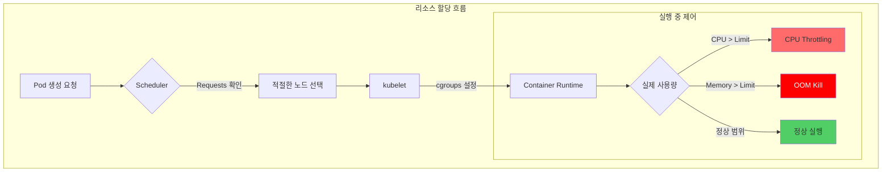

**핵심 차이점**

| 속성 | CPU | Memory |
|------|-----|--------|
| **Requests 초과 시** | 다른 Pod가 사용 안 하면 사용 가능 | 다른 Pod가 사용 안 하면 사용 가능 |
| **Limits 초과 시** | **Throttling** (프로세스 속도 저하) | **OOM Kill** (프로세스 강제 종료) |
| **압축 가능 여부** | 압축 가능 (Compressible) | 압축 불가 (Incompressible) |
| **초과 사용 위험** | 성능 저하 | 서비스 중단 |

### 2.2 CPU 리소스 깊이 이해

#### CPU Millicore 단위

```yaml
# CPU 표기법
resources:
  requests:
    cpu: "500m"    # 500 millicore = 0.5 CPU core
    cpu: "1"       # 1000 millicore = 1 CPU core
    cpu: "2.5"     # 2500 millicore = 2.5 CPU cores
```

**1 CPU core = 1000 millicore**
- AWS vCPU, Azure vCore 모두 동일
- 하이퍼스레딩 환경에서도 논리 코어 기준

#### CFS Bandwidth Throttling

Linux CFS (Completely Fair Scheduler)는 CPU limits를 강제합니다:

```bash
# cgroups v2 기준
/sys/fs/cgroup/cpu.max
# 예시: "100000 100000" = 100ms 주기당 100ms 사용 가능 (100% = 1 CPU)
# 예시: "50000 100000" = 100ms 주기당 50ms 사용 가능 (50% = 0.5 CPU)
```

**Throttling 메커니즘**

```
시간 주기: 100ms
CPU Limit: 500m (0.5 CPU)
→ 100ms 중 50ms만 사용 가능

실제 동작:
[0-50ms] ████████████████████ (실행)
[50-100ms] ...................... (throttled)
[100-150ms] ████████████████████ (실행)
[150-200ms] ...................... (throttled)
```

:::warning CPU Limits를 설정하지 않는 전략
Google, Datadog 등 대규모 클러스터 운영 조직은 CPU limits를 설정하지 않습니다:

**이유:**
- CPU는 압축 가능한 리소스 (다른 Pod가 필요하면 자동 조정)
- Throttling으로 인한 불필요한 성능 저하 방지
- Requests만으로도 스케줄링과 QoS 제어 가능

**대신 권장:**
- CPU requests는 P95 사용량 기준으로 설정
- HPA로 부하에 따른 수평 확장
- Node-level 리소스 모니터링 강화

**예외 (Limits 설정 필요):**
- 배치 작업 (CPU 독점 방지)
- 신뢰할 수 없는 워크로드
- 멀티테넌트 환경
:::

#### CPU 리소스 설정 예시

```yaml
# 패턴 1: Requests만 설정 (권장)
apiVersion: v1
kind: Pod
metadata:
  name: web-server
spec:
  containers:
  - name: nginx
    image: nginx:1.25
    resources:
      requests:
        cpu: "250m"       # P95 사용량 기준
        memory: "128Mi"
      # limits 생략 - CPU 압축 가능 리소스 활용

---
# 패턴 2: 배치 작업 (Limits 설정)
apiVersion: batch/v1
kind: Job
metadata:
  name: data-processing
spec:
  template:
    spec:
      containers:
      - name: processor
        image: data-processor:v1
        resources:
          requests:
            cpu: "1000m"
          limits:
            cpu: "2000m"   # CPU 독점 방지
            memory: "4Gi"
      restartPolicy: OnFailure
```

### 2.3 Memory 리소스 깊이 이해

#### Memory 단위

```yaml
# Memory 표기법 (1024 기반 vs 1000 기반)
resources:
  requests:
    memory: "128Mi"    # 128 * 1024^2 bytes = 134,217,728 bytes
    memory: "128M"     # 128 * 1000^2 bytes = 128,000,000 bytes
    memory: "1Gi"      # 1 * 1024^3 bytes = 1,073,741,824 bytes
    memory: "1G"       # 1 * 1000^3 bytes = 1,000,000,000 bytes
```

**권장**: **Mi, Gi 사용** (1024 기반, Kubernetes 표준)

#### OOM Kill 메커니즘

Memory limits 초과 시 Linux OOM Killer가 프로세스를 강제 종료합니다:

```
실제 사용량 > Memory Limit
→ cgroup memory.max 초과
→ Kernel OOM Killer 발동
→ 프로세스 SIGKILL
→ Pod 상태: OOMKilled
→ kubelet이 Pod 재시작 (RestartPolicy 따름)
```

**OOM Score 계산**

```bash
# 프로세스별 OOM Score 확인
cat /proc/<PID>/oom_score

# OOM Score 계산 요소
# 1. 메모리 사용량 (높을수록 점수 높음)
# 2. oom_score_adj 값 (QoS 클래스별로 다름)
# 3. 루트 프로세스 보호 (-1000 = 절대 Kill 안 함)
```

:::danger Memory limits는 반드시 설정
Memory는 압축 불가능한 리소스이므로 **반드시 limits 설정 필요**:

**이유:**
- Memory 고갈 시 전체 노드 불안정
- Kernel Panic 가능성
- 다른 Pod에 영향 (노드 Eviction)

**권장 설정:**
- `requests = limits` (Guaranteed QoS)
- 또는 `limits = requests * 1.5` (Burstable QoS)
- JVM 애플리케이션: Heap 크기는 limits의 75%로 설정
:::

#### Memory 리소스 설정 예시

```yaml
# 패턴 1: Guaranteed QoS (안정성 최우선)
apiVersion: apps/v1
kind: Deployment
metadata:
  name: database
spec:
  replicas: 3
  template:
    spec:
      containers:
      - name: postgres
        image: postgres:16
        resources:
          requests:
            cpu: "2000m"
            memory: "4Gi"
          limits:
            cpu: "2000m"      # requests와 동일
            memory: "4Gi"     # requests와 동일 (Guaranteed)

---
# 패턴 2: JVM 애플리케이션
apiVersion: apps/v1
kind: Deployment
metadata:
  name: java-app
spec:
  template:
    spec:
      containers:
      - name: app
        image: java-app:v1
        env:
        - name: JAVA_OPTS
          value: "-Xmx3072m -Xms3072m"  # limits의 75% (4Gi * 0.75 = 3Gi)
        resources:
          requests:
            memory: "4Gi"
          limits:
            memory: "4Gi"

---
# 패턴 3: Node.js 애플리케이션
apiVersion: apps/v1
kind: Deployment
metadata:
  name: nodejs-api
spec:
  template:
    spec:
      containers:
      - name: api
        image: nodejs-api:v2
        env:
        - name: NODE_OPTIONS
          value: "--max-old-space-size=896"  # limits의 70% (1280Mi * 0.7 = 896Mi)
        resources:
          requests:
            memory: "1280Mi"
          limits:
            memory: "1280Mi"
```

### 2.4 Ephemeral Storage

컨테이너 로컬 스토리지도 리소스로 관리할 수 있습니다:

```yaml
apiVersion: v1
kind: Pod
metadata:
  name: ephemeral-demo
spec:
  containers:
  - name: app
    image: busybox
    resources:
      requests:
        ephemeral-storage: "2Gi"    # 최소 보장
      limits:
        ephemeral-storage: "4Gi"    # 최대 사용량
    volumeMounts:
    - name: cache
      mountPath: /cache
  volumes:
  - name: cache
    emptyDir:
      sizeLimit: "4Gi"
```

**Ephemeral Storage 포함 항목:**
- 컨테이너 레이어 쓰기
- 로그 파일 (`/var/log`)
- emptyDir 볼륨
- 임시 파일

**노드 Eviction Threshold:**

```yaml
# kubelet 설정
evictionHard:
  nodefs.available: "10%"      # 노드 전체 디스크 10% 미만 시 eviction
  nodefs.inodesFree: "5%"      # inode 5% 미만 시 eviction
  imagefs.available: "10%"     # 이미지 파일시스템 10% 미만 시 eviction
```

### 2.5 EKS Auto Mode 리소스 최적화

EKS Auto Mode는 Kubernetes 클러스터 운영의 복잡성을 극적으로 줄이는 완전 관리형 솔루션입니다. 컴퓨팅, 스토리지, 네트워킹의 프로비저닝부터 지속적 유지보수까지 자동화하여 운영팀이 인프라 관리 대신 애플리케이션 개발에 집중할 수 있게 합니다.

#### 2.5.1 Auto Mode 개요

**핵심 기능:**
- **단일 클릭 활성화**: 클러스터 생성 시 `--compute-config autoMode` 플래그만으로 활성화
- **자동 인프라 프로비저닝**: Pod 스케줄링 요구사항에 따라 최적 인스턴스 타입 자동 선택
- **지속적 유지보수**: OS 패치, 보안 업데이트, 코어 애드온 관리 자동화
- **비용 최적화**: Graviton 프로세서와 Spot 인스턴스 자동 활용
- **통합 보안**: AWS 보안 서비스 기본 통합

```bash
# Auto Mode 클러스터 생성
aws eks create-cluster \
  --name my-auto-cluster \
  --compute-config autoMode=ENABLED \
  --kubernetes-network-config serviceIpv4Cidr=10.100.0.0/16 \
  --access-config bootstrapClusterCreatorAdminPermissions=true
```

:::info Auto Mode vs 수동 관리
Auto Mode는 기존 수동 관리 방식을 완전히 대체하는 것이 아니라, 운영 오버헤드를 최소화하려는 팀을 위한 **보완적 선택지**입니다. 세밀한 제어가 필요한 경우 여전히 수동 관리 방식을 선택할 수 있습니다.
:::

#### 2.5.2 Auto Mode vs 수동 관리 비교

| 항목 | 수동 관리 | Auto Mode |
|------|----------|-----------|
| **노드 프로비저닝** | Managed Node Group, Self-managed, Karpenter 직접 구성 | 자동 프로비저닝 (EC2 Managed Instances 기반) |
| **인스턴스 타입 선택** | 수동 선택 및 NodePool 구성 | Pod 요구사항 기반 자동 선택 (Graviton 우선) |
| **VPA 설정** | 수동 설치 및 구성 필요 | 필요 없음 (자동 리소스 최적화) |
| **HPA 설정** | 수동 설정 및 메트릭 구성 | 자동 구성 가능 (개발자는 선언만) |
| **OS 패치** | 수동 또는 자동화 스크립트 | 완전 자동 (무중단) |
| **보안 업데이트** | 수동 적용 | 자동 적용 |
| **코어 애드온 관리** | 수동 업그레이드 (CoreDNS, kube-proxy, VPC CNI) | 자동 업그레이드 |
| **비용 최적화** | Spot, Graviton 수동 구성 | 자동 활용 (최대 90% 절감) |
| **Request/Limit 설정** | 개발자 책임 (필수) | 개발자 책임 (여전히 필수) |
| **리소스 효율성** | VPA Off 모드 + 수동 적용 | 자동 Right-Sizing (지속적) |
| **학습 곡선** | 높음 (Kubernetes, AWS 전문 지식 필요) | 낮음 (Kubernetes 기본만 필요) |
| **운영 오버헤드** | 높음 | 최소 |

:::warning Auto Mode에서도 개발자 책임
Auto Mode는 인프라를 자동화하지만, **Pod-level requests/limits 설정은 여전히 개발자의 책임**입니다. 이는 애플리케이션의 실제 리소스 요구사항을 가장 잘 아는 사람이 개발자이기 때문입니다.
:::

#### 2.5.3 Graviton + Spot 조합 최적화

Auto Mode는 AWS Graviton 프로세서와 Spot 인스턴스를 지능적으로 조합하여 비용 효율성을 극대화합니다.

**Graviton 프로세서의 장점:**
- **40% 향상된 가격 대비 성능** (x86 대비)
- 범용 워크로드, 웹 서버, 컨테이너화된 마이크로서비스에 최적
- Arm64 아키텍처 지원 (대부분의 컨테이너 이미지 호환)

**Spot 인스턴스 절감:**
- **최대 90% 비용 절감** (On-Demand 대비)
- Auto Mode가 자동으로 Spot 가용성 모니터링 및 Fallback 처리
- 중단 2분 전 알림으로 Graceful Termination 보장

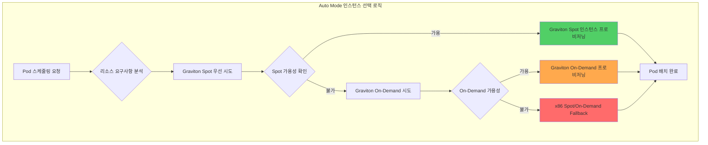

**NodePool YAML 예시 (수동 관리 클러스터 - Karpenter 기반):**

```yaml
# Auto Mode는 이러한 NodePool을 자동 생성하지만,
# 참고를 위해 수동 설정 시 Graviton + Spot 패턴을 보여줍니다
apiVersion: karpenter.sh/v1beta1
kind: NodePool
metadata:
  name: graviton-spot-pool
spec:
  template:
    spec:
      requirements:
      # Graviton 인스턴스 우선
      - key: kubernetes.io/arch
        operator: In
        values: ["arm64"]

      # Spot 우선, Fallback으로 On-Demand
      - key: karpenter.sh/capacity-type
        operator: In
        values: ["spot", "on-demand"]

      # 범용 워크로드용 인스턴스 패밀리
      - key: node.kubernetes.io/instance-type
        operator: In
        values: ["m7g.medium", "m7g.large", "m7g.xlarge", "m7g.2xlarge"]

      nodeClassRef:
        name: default

  # Spot 중단 처리
  disruption:
    consolidationPolicy: WhenUnderutilized
    expireAfter: 720h

  # 리소스 제한
  limits:
    cpu: "1000"
    memory: "1000Gi"

---
# Fallback: x86 On-Demand (Spot 불가 시)
apiVersion: karpenter.sh/v1beta1
kind: NodePool
metadata:
  name: x86-ondemand-fallback
spec:
  weight: 10  # 낮은 우선순위
  template:
    spec:
      requirements:
      - key: kubernetes.io/arch
        operator: In
        values: ["amd64"]

      - key: karpenter.sh/capacity-type
        operator: In
        values: ["on-demand"]

      - key: node.kubernetes.io/instance-type
        operator: In
        values: ["m6i.large", "m6i.xlarge", "m6i.2xlarge"]

      nodeClassRef:
        name: default
```

**Auto Mode에서의 자동 처리:**

Auto Mode는 위와 같은 NodePool 구성을 수동으로 작성할 필요 없이, Pod의 리소스 요구사항과 워크로드 특성을 분석하여 자동으로 최적 인스턴스를 선택합니다.

```yaml
# Auto Mode 환경에서 개발자가 작성하는 Deployment
apiVersion: apps/v1
kind: Deployment
metadata:
  name: web-app
  namespace: production
spec:
  replicas: 10
  template:
    spec:
      containers:
      - name: nginx
        image: nginx:1.25-arm64  # Graviton용 이미지
        resources:
          requests:
            cpu: "250m"
            memory: "512Mi"
          limits:
            memory: "1Gi"

      # Auto Mode가 자동으로:
      # 1. Graviton Spot 인스턴스 선택 시도
      # 2. Spot 불가 시 Graviton On-Demand로 Fallback
      # 3. 인스턴스 타입 자동 선택 (m7g.large 등)
      # 4. 노드 프로비저닝 및 Pod 배치
```

:::tip Graviton 이미지 준비
Graviton 인스턴스를 활용하려면 **arm64 아키텍처 컨테이너 이미지**가 필요합니다. 대부분의 공식 이미지는 multi-arch를 지원하므로, 동일한 이미지 태그로 Graviton과 x86 모두에서 실행 가능합니다.

```bash
# multi-arch 이미지 확인
docker manifest inspect nginx:1.25 | jq '.manifests[].platform'

# 출력 예시:
# { "architecture": "amd64", "os": "linux" }
# { "architecture": "arm64", "os": "linux" }
```
:::

**실제 비용 절감 예시:**

| 시나리오 | 인스턴스 타입 | 시간당 비용 | 월간 비용 (730시간) | 절감률 |
|---------|-------------|-----------|-------------------|--------|
| x86 On-Demand | m6i.2xlarge | $0.384 | $280.32 | - |
| Graviton On-Demand | m7g.2xlarge | $0.3264 | $238.27 | 15% |
| Graviton Spot | m7g.2xlarge | $0.0979 | $71.47 | 75% |

10개 노드 기준:
- x86 On-Demand: $2,803/월
- Graviton On-Demand: $2,383/월 (15% 절감)
- **Graviton Spot: $715/월 (75% 절감)** ⭐

**Graviton4 특화 최적화:**

Graviton4 (R8g, M8g, C8g) 인스턴스는 Graviton3 대비 **30% 향상된 컴퓨팅 성능**과 **75% 향상된 메모리 대역폭**을 제공합니다.

| 세대 | 인스턴스 패밀리 | 성능 개선 | 주요 워크로드 |
|------|---------------|---------|-------------|
| Graviton3 | m7g, c7g, r7g | 기준 | 범용 웹/API, 컨테이너 |
| **Graviton4** | **m8g, c8g, r8g** | **+30% 컴퓨팅, +75% 메모리** | **고성능 데이터베이스, ML 추론, 실시간 분석** |

**ARM64 Multi-Arch 빌드 파이프라인:**

Graviton 인스턴스를 최대한 활용하려면 ARM64와 AMD64를 모두 지원하는 multi-arch 컨테이너 이미지가 필요합니다.

```dockerfile
# Multi-arch Dockerfile 예시
FROM --platform=$BUILDPLATFORM golang:1.22-alpine AS builder
ARG TARGETOS TARGETARCH

WORKDIR /app
COPY . .

# 타겟 아키텍처에 맞게 빌드
RUN GOOS=${TARGETOS} GOARCH=${TARGETARCH} go build -o app .

# 런타임 이미지
FROM alpine:3.19
COPY --from=builder /app/app /usr/local/bin/app
ENTRYPOINT ["/usr/local/bin/app"]
```

**GitHub Actions CI/CD에서 multi-arch 빌드:**

```yaml
# .github/workflows/build.yml
name: Build Multi-Arch Image
on:
  push:
    branches: [main]

jobs:
  build:
    runs-on: ubuntu-latest
    steps:
      - uses: actions/checkout@v4

      - name: Set up QEMU
        uses: docker/setup-qemu-action@v3

      - name: Set up Docker Buildx
        uses: docker/setup-buildx-action@v3

      - name: Login to ECR
        uses: aws-actions/amazon-ecr-login@v2

      - name: Build and push multi-arch
        uses: docker/build-push-action@v5
        with:
          context: .
          platforms: linux/amd64,linux/arm64  # ARM64 포함
          push: true
          tags: |
            ${{ secrets.ECR_REGISTRY }}/myapp:${{ github.sha }}
            ${{ secrets.ECR_REGISTRY }}/myapp:latest
          cache-from: type=gha
          cache-to: type=gha,mode=max
```

**Graviton3 → Graviton4 마이그레이션 벤치마크 포인트:**

```yaml
# Graviton4 우선 NodePool 예시 (Karpenter)
apiVersion: karpenter.sh/v1beta1
kind: NodePool
metadata:
  name: graviton4-spot-pool
spec:
  template:
    spec:
      requirements:
      # Graviton4 우선, Graviton3 Fallback
      - key: node.kubernetes.io/instance-type
        operator: In
        values:
          # Graviton4 (최우선)
          - "m8g.medium"
          - "m8g.large"
          - "m8g.xlarge"
          - "m8g.2xlarge"
          # Graviton3 (Fallback)
          - "m7g.medium"
          - "m7g.large"
          - "m7g.xlarge"
          - "m7g.2xlarge"

      - key: kubernetes.io/arch
        operator: In
        values: ["arm64"]

      - key: karpenter.sh/capacity-type
        operator: In
        values: ["spot", "on-demand"]

      nodeClassRef:
        name: default

  disruption:
    consolidationPolicy: WhenUnderutilized
    consolidateAfter: 30s

  limits:
    cpu: "1000"
    memory: "2000Gi"
```

**Graviton4 성능 벤치마크 체크포인트:**

마이그레이션 시 다음 메트릭을 모니터링하여 성능 개선을 검증합니다:

| 메트릭 | Graviton3 기준 | Graviton4 목표 | 측정 방법 |
|-------|--------------|--------------|---------|
| **P99 응답 시간** | 100ms | 70ms (-30%) | Prometheus `http_request_duration_seconds` |
| **처리량 (RPS)** | 1000 req/s | 1300 req/s (+30%) | Load testing (k6, Locust) |
| **메모리 대역폭** | 205 GB/s | 358 GB/s (+75%) | `sysbench memory` |
| **CPU 사용률** | 60% | 45% (-25%) | `node_cpu_seconds_total` |

```bash
# Graviton4 성능 테스트 스크립트
#!/bin/bash
# 1. 메모리 대역폭 테스트
sysbench memory --memory-total-size=100G --memory-oper=write run

# 2. CPU 벤치마크
sysbench cpu --cpu-max-prime=20000 --threads=8 run

# 3. 애플리케이션 부하 테스트 (k6)
k6 run --vus 100 --duration 5m loadtest.js

# 4. Prometheus 메트릭 수집
curl -s http://localhost:9090/api/v1/query?query=rate(http_request_duration_seconds_sum[5m]) | jq .
```

:::tip Graviton4 마이그레이션 체크리스트

- [ ] **컨테이너 이미지**: ARM64 지원 확인 (`docker manifest inspect`)
- [ ] **의존성 라이브러리**: ARM64 호환성 검증
- [ ] **CI/CD 파이프라인**: Multi-arch 빌드 활성화
- [ ] **NodePool 우선순위**: Graviton4 → Graviton3 → x86 순서 설정
- [ ] **성능 벤치마크**: P99 레이턴시, 처리량, CPU 사용률 측정
- [ ] **비용 분석**: Graviton3 대비 가격/성능 비율 계산
:::

#### 2.5.4 Auto Mode 환경의 리소스 설정 권장사항

Auto Mode는 많은 부분을 자동화하지만, 개발자는 여전히 애플리케이션의 리소스 요구사항을 정확히 설정해야 합니다.

**Auto Mode가 자동 처리하는 항목:**

| 항목 | 수동 관리 | Auto Mode |
|------|----------|-----------|
| 노드 프로비저닝 | Karpenter, Managed Node Group 설정 | 자동 |
| 인스턴스 타입 선택 | NodePool에서 수동 지정 | Pod requests 기반 자동 선택 |
| Spot/On-Demand 전환 | 수동 또는 Karpenter 설정 | 자동 Fallback |
| 노드 스케일링 | HPA + Cluster Autoscaler/Karpenter | 자동 |
| OS 패치 | 수동 또는 자동화 스크립트 | 자동 (무중단) |

**개발자가 여전히 설정해야 하는 항목:**

| 항목 | 이유 | 권장 방법 |
|------|------|----------|
| **CPU Requests** | 스케줄링 결정 기준 | P95 사용량 + 20% |
| **Memory Requests** | 스케줄링 및 OOM 방지 | P95 사용량 + 20% |
| **Memory Limits** | OOM Kill 방지 (필수) | Requests × 1.5~2 |
| **CPU Limits** | 일반 워크로드는 미설정 권장 | 배치 작업만 설정 |
| **HPA 메트릭** | 수평 확장 기준 | CPU 70%, Custom Metrics |

**Auto Mode 환경에서의 VPA 역할 변화:**

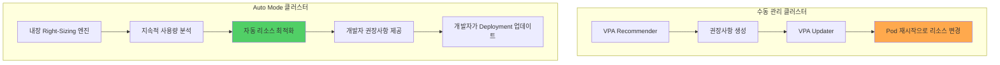

**Auto Mode에서 VPA는:**
- 별도 설치 불필요
- 내장 Right-Sizing 엔진이 지속적으로 워크로드 분석
- 개발자에게 권장사항 제공 (자동 적용 대신)
- 개발자가 검토 후 Deployment 매니페스트에 반영

**권장 워크플로우:**

```bash
# 1. Auto Mode 클러스터에 배포
kubectl apply -f deployment.yaml

# 2. 7-14일 후 Auto Mode 대시보드에서 권장사항 확인
# (AWS Console → EKS → Clusters → <cluster-name> → Insights)

# 3. 권장사항을 Deployment에 반영
kubectl set resources deployment web-app \
  --requests=cpu=300m,memory=512Mi \
  --limits=memory=1Gi

# 4. GitOps로 매니페스트 업데이트
git add deployment.yaml
git commit -m "chore: apply Auto Mode resource recommendations"
git push
```

:::tip Auto Mode 권장 시나리오
Auto Mode는 다음과 같은 경우에 특히 유용합니다:

- **신규 클러스터**: 기존 인프라 없이 빠르게 시작
- **운영 리소스 부족**: 소규모 팀에서 Kubernetes 전문가 없이 운영
- **비용 최적화 우선**: Graviton + Spot 자동 활용으로 즉시 절감
- **표준화된 워크로드**: 일반적인 웹/API 서버, 마이크로서비스

**수동 관리 권장 시나리오:**
- **세밀한 제어 필요**: 특정 인스턴스 타입, AZ 배치, 네트워크 구성
- **기존 Karpenter 투자**: 고도화된 NodePool 정책 보유
- **규제 요구사항**: 특정 하드웨어, 보안 그룹 강제
:::

**Auto Mode + 수동 Right-Sizing 비교:**

| 항목 | 수동 Right-Sizing (VPA Off) | Auto Mode |
|------|---------------------------|-----------|
| 초기 설정 복잡도 | 높음 (VPA 설치, Prometheus 구성) | 낮음 (클러스터 생성 시 플래그만) |
| 권장사항 생성 시간 | 7-14일 | 7-14일 (동일) |
| 권장사항 정확도 | 높음 (Prometheus 기반) | 높음 (내장 분석 엔진) |
| 적용 방식 | 수동 (개발자가 매니페스트 수정) | 수동 (개발자가 매니페스트 수정) |
| 지속적 모니터링 | 수동 (주기적 VPA 확인) | 자동 (대시보드 알림) |
| 인프라 최적화 | 수동 (Karpenter 설정) | 자동 (Graviton + Spot) |
| 총 운영 오버헤드 | 높음 | 낮음 |

**결론:**

Auto Mode는 **리소스 최적화의 복잡성을 제거**하지만, **리소스 설정의 책임은 제거하지 않습니다**. 개발자는 여전히 애플리케이션의 requests/limits를 설정해야 하며, Auto Mode는 이를 기반으로 최적의 인프라를 자동으로 프로비저닝합니다.

이는 **"개발자는 애플리케이션 요구사항 정의, AWS는 인프라 관리"**라는 명확한 책임 분리를 통해, 양측 모두가 자신의 전문 분야에 집중할 수 있게 합니다.

## QoS (Quality of Service) 클래스

### 3.1 세 가지 QoS 클래스

Kubernetes는 리소스 설정에 따라 Pod를 3가지 QoS 클래스로 분류합니다:

#### Guaranteed (최고 우선순위)

**조건:**
- 모든 컨테이너에 CPU와 Memory requests와 limits 설정
- **requests == limits** (동일 값)

```yaml
apiVersion: v1
kind: Pod
metadata:
  name: guaranteed-pod
  labels:
    qos: guaranteed
spec:
  containers:
  - name: app
    image: nginx:1.25
    resources:
      requests:
        cpu: "500m"
        memory: "256Mi"
      limits:
        cpu: "500m"        # requests와 동일
        memory: "256Mi"    # requests와 동일
  - name: sidecar
    image: fluentd:v1
    resources:
      requests:
        cpu: "100m"
        memory: "128Mi"
      limits:
        cpu: "100m"
        memory: "128Mi"
```

**특징:**
- oom_score_adj: **-997** (가장 낮음, OOM Kill 우선순위 최하)
- 노드 압박 시에도 마지막에 Eviction
- CPU 스케줄링 우선순위 높음

#### Burstable (중간 우선순위)

**조건:**
- 최소 1개 컨테이너에 CPU 또는 Memory requests 설정
- Guaranteed 조건을 만족하지 않음

```yaml
apiVersion: v1
kind: Pod
metadata:
  name: burstable-pod
  labels:
    qos: burstable
spec:
  containers:
  - name: app
    image: web-app:v1
    resources:
      requests:
        cpu: "250m"
        memory: "512Mi"
      limits:
        cpu: "1000m"       # requests보다 큼 (Burstable)
        memory: "1Gi"      # requests보다 큼

  - name: cache
    image: redis:7
    resources:
      requests:
        memory: "256Mi"    # CPU requests 없음 (Burstable)
      limits:
        memory: "512Mi"
```

**특징:**
- oom_score_adj: **min(max(2, 1000 - (1000 * memoryRequestBytes) / machineMemoryCapacityBytes), 999)**
- 사용량에 따라 동적으로 조정
- 여유 있을 때 burst 가능

#### BestEffort (최저 우선순위)

**조건:**
- 모든 컨테이너에 requests와 limits 미설정

```yaml
apiVersion: v1
kind: Pod
metadata:
  name: besteffort-pod
  labels:
    qos: besteffort
spec:
  containers:
  - name: app
    image: test-app:latest
    # resources 섹션 없음 또는 비어있음
```

**특징:**
- oom_score_adj: **1000** (가장 높음, OOM Kill 최우선)
- 노드 압박 시 가장 먼저 Eviction
- 개발/테스트 환경에서만 사용 권장

### 3.2 QoS와 Eviction 우선순위

노드 리소스 압박 시 kubelet은 다음 순서로 Pod를 Eviction합니다:

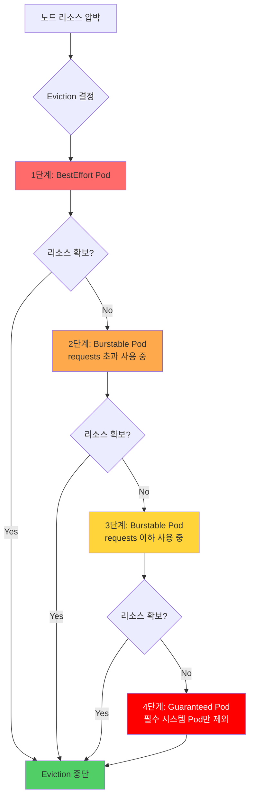

**Eviction 순서 요약:**

| 순위 | QoS 클래스 | 조건 | oom_score_adj |
|------|-----------|------|---------------|
| 1 (최우선) | BestEffort | 모든 Pod | 1000 |
| 2 | Burstable | requests 초과 사용 중 | 2-999 (사용량 비례) |
| 3 | Burstable | requests 이하 사용 중 | 2-999 (사용량 비례) |
| 4 (최후) | Guaranteed | 시스템 중요 Pod 제외 | -997 |

**oom_score_adj 확인 방법:**

```bash
# Pod의 메인 컨테이너 프로세스 찾기
kubectl get pod <pod-name> -o jsonpath='{.status.containerStatuses[0].containerID}'

# 노드에서 oom_score_adj 확인
docker inspect <container-id> | grep Pid
cat /proc/<pid>/oom_score_adj

# 예시 출력
# BestEffort: 1000
# Burstable: 500 (사용량에 따라 변동)
# Guaranteed: -997
```

### 3.3 실전 QoS 전략

워크로드 특성에 맞는 QoS 클래스 선택 가이드:

| 워크로드 유형 | 권장 QoS | 설정 패턴 | 이유 |
|-------------|---------|----------|------|
| **프로덕션 API** | Guaranteed | requests = limits | 안정성 최우선, Eviction 방지 |
| **데이터베이스** | Guaranteed | requests = limits | 메모리 압박 시에도 보호 |
| **배치 작업** | Burstable | limits > requests | 유휴 시 리소스 활용, 비용 효율 |
| **큐 워커** | Burstable | limits > requests | 부하 변동 대응 |
| **개발/테스트** | BestEffort | 설정 없음 | 리소스 효율 (운영 환경 금지) |
| **모니터링 Agent** | Guaranteed | 낮은 값으로 설정 | 시스템 안정성 |

**프로덕션 권장 설정:**

```yaml
# 패턴 1: 미션 크리티컬 서비스 (Guaranteed)
apiVersion: apps/v1
kind: Deployment
metadata:
  name: payment-api
  namespace: production
spec:
  replicas: 5
  template:
    metadata:
      labels:
        app: payment-api
        tier: critical
    spec:
      containers:
      - name: api
        image: payment-api:v2.1
        resources:
          requests:
            cpu: "1000m"
            memory: "2Gi"
          limits:
            cpu: "1000m"
            memory: "2Gi"
      priorityClassName: system-cluster-critical  # 추가 보호

---
# 패턴 2: 일반 웹 서비스 (Burstable)
apiVersion: apps/v1
kind: Deployment
metadata:
  name: web-frontend
  namespace: production
spec:
  replicas: 10
  template:
    spec:
      containers:
      - name: frontend
        image: web-frontend:v1.5
        resources:
          requests:
            cpu: "200m"       # P50 사용량
            memory: "256Mi"
          limits:
            cpu: "500m"       # P95 사용량
            memory: "512Mi"   # OOM 방지

---
# 패턴 3: 배치 워커 (Burstable)
apiVersion: batch/v1
kind: CronJob
metadata:
  name: daily-report
spec:
  schedule: "0 2 * * *"
  jobTemplate:
    spec:
      template:
        spec:
          containers:
          - name: report-generator
            image: report-gen:v1
            resources:
              requests:
                cpu: "500m"
                memory: "1Gi"
              limits:
                cpu: "4000m"     # 야간 시간대 리소스 활용
                memory: "8Gi"
          restartPolicy: OnFailure
```

## VPA (Vertical Pod Autoscaler) 상세 가이드

### 4.1 VPA 아키텍처

VPA는 3개의 컴포넌트로 구성됩니다:

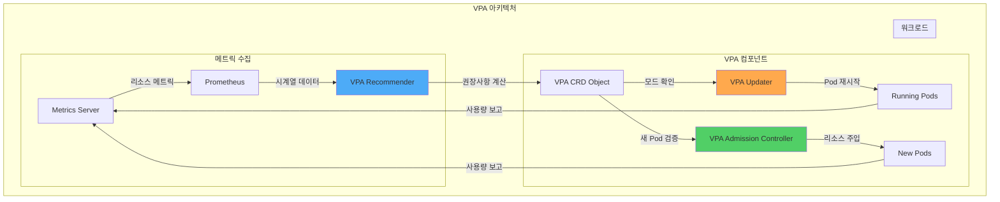

**컴포넌트 역할:**

| 컴포넌트 | 역할 | 데이터 소스 |
|---------|------|-----------|
| **Recommender** | 과거 사용량 분석, 권장사항 계산 | Metrics Server, Prometheus |
| **Updater** | Auto 모드에서 Pod 재시작 | VPA CRD 상태 |
| **Admission Controller** | 새 Pod에 리소스 자동 주입 | VPA CRD 권장사항 |

#### 4.1.4 VPA Recommender ML 알고리즘 상세

VPA Recommender는 단순한 평균 계산이 아닌, 머신러닝 기반의 정교한 알고리즘으로 리소스 추천값을 산출합니다.

##### 지수 가중 히스토그램 (Exponentially-weighted Histogram)

VPA Recommender의 핵심은 시간에 따라 가중치가 감소하는 히스토그램입니다:

```
최근 데이터 → 높은 가중치
오래된 데이터 → 낮은 가중치 (지수적 감소)
```

**알고리즘 동작:**

1. **메트릭 수집 주기**: 1분마다 Pod 리소스 사용량 수집
2. **히스토그램 업데이트**: 각 측정값을 히스토그램 버킷에 누적
3. **가중치 적용**: 오래된 데이터는 `e^(-t/decay_half_life)` 가중치로 감소
4. **추천값 계산**: 히스토그램에서 백분위수 기반 추천

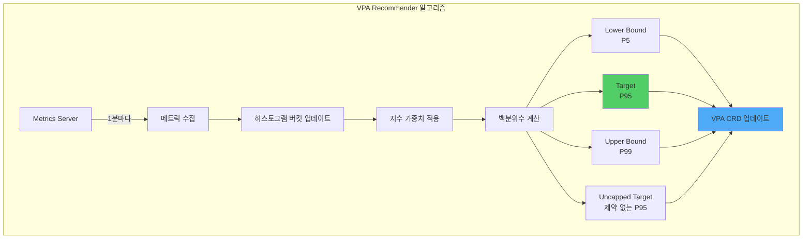

##### 4가지 추천값 계산 방법

| 추천값 | 계산 방법 | 의미 |
|--------|----------|------|
| **Lower Bound** | P5 (5번째 백분위수) | 최소 필요 리소스 - 95% 시간 동안 충분 |
| **Target** | P95 (95번째 백분위수) | **권장 설정값** - 5% 피크 부하 대응 |
| **Upper Bound** | P99 (99번째 백분위수) | 최대 관찰 사용량 - Limits 설정 참고 |
| **Uncapped Target** | maxAllowed 제약 없이 계산한 P95 | 실제 필요량 확인용 |

**백분위수 계산 예시:**

```python
# 가상의 CPU 사용량 히스토그램 (1일 = 1440분)
cpu_samples = [100m, 150m, 200m, 250m, 300m, 350m, 400m, 450m, 500m, ...]

# 지수 가중치 적용 (decay_half_life = 24시간)
weighted_samples = [
    (100m, weight=1.0),    # 최근 (1시간 전)
    (150m, weight=0.97),   # 2시간 전
    (200m, weight=0.92),   # 5시간 전
    (250m, weight=0.71),   # 12시간 전
    (300m, weight=0.50),   # 24시간 전 (반감기)
    (350m, weight=0.25),   # 48시간 전
    ...
]

# 백분위수 계산
P5  = 150m  # Lower Bound
P95 = 450m  # Target ⭐
P99 = 500m  # Upper Bound
```

##### Confidence Multiplier: 신뢰도 기반 조정

데이터 수집 기간이 짧을수록 안전하게 높은 값을 추천합니다:

```
Confidence Multiplier = f(데이터_수집_기간)

0-24시간:  multiplier = 1.5  (50% 안전 마진)
1-3일:     multiplier = 1.3  (30% 안전 마진)
3-7일:     multiplier = 1.1  (10% 안전 마진)
7일 이상:  multiplier = 1.0  (신뢰도 충분)
```

**실제 적용 예시:**

```yaml
# 데이터 수집 2일차
원본 P95: 450m
Confidence Multiplier: 1.3
최종 Target: 450m × 1.3 = 585m ≈ 600m

# 데이터 수집 10일차
원본 P95: 450m
Confidence Multiplier: 1.0
최종 Target: 450m × 1.0 = 450m
```

:::info 데이터 수집 기간의 중요성
VPA가 정확한 추천을 제공하려면 **최소 7일, 권장 14일**의 데이터 수집이 필요합니다. 주간 패턴(평일 vs 주말)을 포착하려면 최소 2주 이상의 관찰이 필수적입니다.
:::

##### Memory 추천: OOM 이벤트 기반 Bump-Up

Memory는 CPU와 다르게 OOM Kill 이벤트를 특별히 고려합니다:

**OOM 이벤트 감지 시:**

```
현재 Memory Target: 500Mi
OOM Kill 발생 시점 메모리: 600Mi
→ 새로운 Target: 600Mi × 1.2 = 720Mi (20% 안전 마진 추가)
```

**OOM Bump-Up 로직:**

```python
if oom_kill_detected:
    oom_memory = get_memory_at_oom_time()
    new_target = max(
        current_target,
        oom_memory * 1.2  # 20% 안전 마진
    )

    # 급격한 변경 방지 (최대 2배)
    new_target = min(new_target, current_target * 2)
```

:::warning OOM Kill은 즉시 반영
CPU throttling과 달리, OOM Kill 이벤트는 **즉시 Memory Target을 상향 조정**합니다. 이는 서비스 중단을 방지하기 위한 안전 장치입니다.
:::

##### CPU 추천: P95/P99 사용량 기반

CPU는 압축 가능한 리소스이므로 보수적으로 접근합니다:

```
CPU Target = P95 사용량
CPU Upper Bound = P99 사용량

Throttling 발생 시:
→ 추천값은 변경하지 않음 (HPA로 해결 권장)
```

**CPU Throttling 감지 시:**

```python
if cpu_throttling_detected:
    throttled_percentage = get_throttled_time_percentage()

    if throttled_percentage > 10:
        # VPA 자체 추천값은 유지
        # 대신 다음을 제안:
        # 1. HPA 추가로 수평 확장
        # 2. CPU limits 제거 (Google, Datadog 패턴)
        # 3. 또는 Target을 P99로 상향 (수동 조정)
        pass
```

:::tip CPU Throttling vs HPA
VPA는 CPU throttling을 감지하면 추천값을 크게 올리지 않습니다. 대신 **HPA로 수평 확장**하는 것이 Kubernetes 모범 사례입니다.
:::

##### VPA와 Prometheus 데이터 소스 통합

VPA Recommender는 Metrics Server만으로도 동작하지만, Prometheus와 통합하면 더욱 정교한 추천이 가능합니다:

**Prometheus 메트릭 활용:**

```yaml
# VPA Recommender에 Prometheus 연동 설정
apiVersion: v1
kind: ConfigMap
metadata:
  name: vpa-recommender-config
  namespace: vpa-system
data:
  recommender-config.yaml: |
    # Prometheus 메트릭 소스 활성화
    metrics-provider: prometheus
    prometheus-url: http://prometheus-server.monitoring.svc:9090

    # 히스토그램 설정
    histogram-decay-half-life: 24h
    histogram-bucket-size-growth: 1.05

    # CPU 추천 설정
    cpu-histogram-decay-half-life: 24h
    memory-histogram-decay-half-life: 48h  # Memory는 더 긴 관찰

    # OOM 이벤트 처리
    oom-min-bump-up: 1.2  # 최소 20% 증가
    oom-bump-up-ratio: 0.5  # 50% 안전 마진
```

**Prometheus Custom Metrics API 연동:**

```bash
# Custom Metrics API 어댑터 배포 (Prometheus Adapter)
helm install prometheus-adapter prometheus-community/prometheus-adapter \
  --namespace monitoring \
  --set prometheus.url=http://prometheus-server.monitoring.svc \
  --set rules.default=true

# VPA가 Custom Metrics API 사용하도록 설정
kubectl edit deploy vpa-recommender -n vpa-system

# 환경 변수 추가:
# - PROMETHEUS_ADDRESS=http://prometheus-server.monitoring.svc:9090
# - USE_CUSTOM_METRICS=true
```

**연동 확인:**

```bash
# VPA Recommender가 Prometheus 메트릭 사용 중인지 확인
kubectl logs -n vpa-system deploy/vpa-recommender | grep prometheus

# 출력 예시:
# I0212 10:15:30.123456  1 metrics_client.go:45] Using Prometheus metrics provider
# I0212 10:15:31.234567  1 prometheus_client.go:78] Connected to Prometheus at http://prometheus-server.monitoring.svc:9090
```

##### VPA 추천 품질 검증 방법

추천값이 실제로 적절한지 검증하는 PromQL 쿼리:

**1. CPU 추천값 vs 실제 사용량 비교:**

```promql
# VPA Target vs 실제 P95 사용량 비교
(
  kube_verticalpodautoscaler_status_recommendation_containerrecommendations_target{resource="cpu"}
  -
  quantile_over_time(0.95,
    container_cpu_usage_seconds_total{pod=~"web-app-.*"}[7d]
  ) * 1000
) /
kube_verticalpodautoscaler_status_recommendation_containerrecommendations_target{resource="cpu"} * 100

# 출력: 추천값과 실제 P95 차이 (%)
# 10-20% 범위: 적절 ✅
# >30%: 과다 프로비저닝 ⚠️
# <0%: 과소 프로비저닝 (즉시 조정 필요) 🚨
```

**2. Memory 추천값 검증:**

```promql
# VPA Target vs 실제 P99 사용량
(
  kube_verticalpodautoscaler_status_recommendation_containerrecommendations_target{resource="memory"}
  -
  quantile_over_time(0.99,
    container_memory_working_set_bytes{pod=~"web-app-.*"}[7d]
  )
) /
kube_verticalpodautoscaler_status_recommendation_containerrecommendations_target{resource="memory"} * 100

# 20-30% 여유: 이상적 ✅
# <10% 여유: OOM 위험 🚨
```

**3. OOM Kill 빈도 모니터링:**

```promql
# 최근 7일 OOM Kill 이벤트 수
increase(
  kube_pod_container_status_terminated_reason{reason="OOMKilled"}[7d]
)

# 0건: VPA 추천 정확 ✅
# 1-2건: 수용 가능 (피크 부하)
# >3건: VPA Target 수동 상향 필요 🚨
```

**4. CPU Throttling 비율:**

```promql
# CPU Throttling 시간 비율 (%)
rate(container_cpu_cfs_throttled_seconds_total{pod=~"web-app-.*"}[5m])
/
rate(container_cpu_cfs_periods_total{pod=~"web-app-.*"}[5m]) * 100

# <5%: 정상 ✅
# 5-10%: 모니터링 필요 ⚠️
# >10%: HPA 추가 또는 CPU limits 제거 고려 🚨
```

**Grafana 대시보드 예시:**

```yaml
# VPA 추천 품질 모니터링 대시보드
apiVersion: v1
kind: ConfigMap
metadata:
  name: vpa-quality-dashboard
  namespace: monitoring
data:
  dashboard.json: |
    {
      "panels": [
        {
          "title": "CPU: VPA Target vs P95 실제 사용량",
          "targets": [
            {
              "expr": "kube_verticalpodautoscaler_status_recommendation_containerrecommendations_target{resource=\"cpu\"}",
              "legendFormat": "VPA Target"
            },
            {
              "expr": "quantile_over_time(0.95, container_cpu_usage_seconds_total[7d]) * 1000",
              "legendFormat": "실제 P95"
            }
          ]
        },
        {
          "title": "Memory: VPA Target vs P99 실제 사용량",
          "targets": [
            {
              "expr": "kube_verticalpodautoscaler_status_recommendation_containerrecommendations_target{resource=\"memory\"}",
              "legendFormat": "VPA Target"
            },
            {
              "expr": "quantile_over_time(0.99, container_memory_working_set_bytes[7d])",
              "legendFormat": "실제 P99"
            }
          ]
        },
        {
          "title": "OOM Kill 이벤트 (7일)",
          "targets": [
            {
              "expr": "increase(kube_pod_container_status_terminated_reason{reason=\"OOMKilled\"}[7d])"
            }
          ]
        }
      ]
    }
```

:::tip VPA 추천의 한계
VPA는 과거 데이터 기반 추천이므로 다음 상황에서는 한계가 있습니다:
- **갑작스러운 트래픽 패턴 변화**: 과거에 없던 피크 부하
- **계절성 워크로드**: 월말 배치, 연말 결산 등
- **초기 부트스트랩**: 애플리케이션 시작 시 높은 메모리 사용

이러한 경우 **수동 조정** 또는 **HPA와의 조합**이 필요합니다.
:::

### 4.2 VPA 설치 및 구성

#### Helm을 통한 설치

```bash
# 1. Metrics Server 설치 (사전 요구사항)
kubectl apply -f https://github.com/kubernetes-sigs/metrics-server/releases/latest/download/components.yaml

# 2. Metrics Server 확인
kubectl get deployment metrics-server -n kube-system
kubectl top nodes

# 3. VPA Helm 레포지토리 추가
helm repo add fairwinds-stable https://charts.fairwinds.com/stable
helm repo update

# 4. VPA 설치
helm install vpa fairwinds-stable/vpa \
  --namespace vpa-system \
  --create-namespace \
  --set recommender.enabled=true \
  --set updater.enabled=true \
  --set admissionController.enabled=true

# 5. 설치 확인
kubectl get pods -n vpa-system
# 예상 출력:
# NAME                                      READY   STATUS    RESTARTS   AGE
# vpa-admission-controller-xxx              1/1     Running   0          1m
# vpa-recommender-xxx                       1/1     Running   0          1m
# vpa-updater-xxx                           1/1     Running   0          1m
```

#### 수동 설치 (공식 방법)

```bash
# VPA 공식 레포지토리 클론
git clone https://github.com/kubernetes/autoscaler.git
cd autoscaler/vertical-pod-autoscaler

# VPA 설치
./hack/vpa-up.sh

# 설치 확인
kubectl get crd | grep verticalpodautoscaler
```

### 4.3 VPA 모드

VPA는 3가지 모드로 동작합니다:

#### Off 모드 (권장사항만 제공)

```yaml
apiVersion: autoscaling.k8s.io/v1
kind: VerticalPodAutoscaler
metadata:
  name: web-app-vpa
  namespace: production
spec:
  targetRef:
    apiVersion: apps/v1
    kind: Deployment
    name: web-app
  updatePolicy:
    updateMode: "Off"    # 권장사항만 표시, 자동 적용 안 함
```

**사용 시나리오:**
- VPA를 처음 도입할 때
- 프로덕션 워크로드 분석
- 수동 검토 후 적용 원할 때

**권장사항 확인:**

```bash
# VPA 상태 확인
kubectl describe vpa web-app-vpa -n production

# 출력 예시:
# Recommendation:
#   Container Recommendations:
#     Container Name: web-app
#     Lower Bound:
#       Cpu:     150m
#       Memory:  200Mi
#     Target:          # ← 이 값 사용 권장
#       Cpu:     250m
#       Memory:  300Mi
#     Uncapped Target:
#       Cpu:     350m
#       Memory:  400Mi
#     Upper Bound:
#       Cpu:     500m
#       Memory:  600Mi
```

#### Initial 모드 (Pod 생성 시에만 적용)

```yaml
apiVersion: autoscaling.k8s.io/v1
kind: VerticalPodAutoscaler
metadata:
  name: batch-worker-vpa
  namespace: batch
spec:
  targetRef:
    apiVersion: apps/v1
    kind: Deployment
    name: batch-worker
  updatePolicy:
    updateMode: "Initial"    # Pod 생성 시에만 리소스 설정
  resourcePolicy:
    containerPolicies:
    - containerName: worker
      minAllowed:
        cpu: "100m"
        memory: "128Mi"
      maxAllowed:
        cpu: "4000m"
        memory: "16Gi"
```

**사용 시나리오:**
- CronJob, Job 워크로드
- 재시작이 허용되지 않는 StatefulSet
- 수동 스케일링을 원하는 경우

**동작 방식:**
1. 새 Pod 생성 요청
2. VPA Admission Controller가 권장 리소스 주입
3. 기존 실행 중인 Pod는 그대로 유지

#### Auto 모드 (완전 자동화)

```yaml
apiVersion: autoscaling.k8s.io/v1
kind: VerticalPodAutoscaler
metadata:
  name: api-vpa
  namespace: development
spec:
  targetRef:
    apiVersion: apps/v1
    kind: Deployment
    name: api-server
  updatePolicy:
    updateMode: "Auto"    # 자동으로 Pod 재시작 및 리소스 조정
    minReplicas: 2        # 최소 2개 Pod 유지
  resourcePolicy:
    containerPolicies:
    - containerName: api
      minAllowed:
        cpu: "200m"
        memory: "256Mi"
      maxAllowed:
        cpu: "2000m"
        memory: "4Gi"
      controlledResources:
      - cpu
      - memory
      controlledValues: RequestsAndLimits  # requests와 limits 모두 조정
```

**사용 시나리오:**
- 개발/스테이징 환경
- Stateless 애플리케이션
- PodDisruptionBudget 설정된 워크로드

:::warning Auto 모드 주의사항
Auto 모드는 **Pod를 재시작**합니다:
- Eviction API를 통한 재시작
- 다운타임 발생 가능
- PodDisruptionBudget (PDB) 필수 설정
- 프로덕션 환경에서는 신중히 사용

**권장:** 프로덕션에서는 **Off 또는 Initial 모드** 사용
:::

### 4.4 VPA + HPA 공존 전략

VPA와 HPA를 함께 사용할 때는 충돌을 방지해야 합니다.

#### 충돌 시나리오 (❌ 금지)

```yaml
# ❌ 잘못된 설정: VPA Auto + HPA CPU 동시 사용
---
apiVersion: autoscaling.k8s.io/v1
kind: VerticalPodAutoscaler
metadata:
  name: bad-vpa
spec:
  targetRef:
    apiVersion: apps/v1
    kind: Deployment
    name: web-app
  updatePolicy:
    updateMode: "Auto"    # ❌ Auto 모드
  resourcePolicy:
    containerPolicies:
    - containerName: app
      controlledResources:
      - cpu                # ❌ CPU 제어
      - memory

---
apiVersion: autoscaling/v2
kind: HorizontalPodAutoscaler
metadata:
  name: bad-hpa
spec:
  scaleTargetRef:
    apiVersion: apps/v1
    kind: Deployment
    name: web-app
  minReplicas: 2
  maxReplicas: 10
  metrics:
  - type: Resource
    resource:
      name: cpu          # ❌ CPU 메트릭 사용
      target:
        type: Utilization
        averageUtilization: 70
```

**문제:**
- VPA가 CPU requests를 변경 → HPA의 CPU 사용률 계산이 변경됨
- HPA가 스케일 아웃 → VPA가 다시 리소스 조정 → 무한 루프

#### 패턴 1: VPA Off + HPA (✅ 권장)

```yaml
# ✅ 올바른 설정: VPA는 권장만, HPA로 스케일링
---
apiVersion: autoscaling.k8s.io/v1
kind: VerticalPodAutoscaler
metadata:
  name: web-vpa
  namespace: production
spec:
  targetRef:
    apiVersion: apps/v1
    kind: Deployment
    name: web-app
  updatePolicy:
    updateMode: "Off"    # ✅ 권장사항만 제공
  resourcePolicy:
    containerPolicies:
    - containerName: app
      controlledResources:
      - cpu
      - memory

---
apiVersion: autoscaling/v2
kind: HorizontalPodAutoscaler
metadata:
  name: web-hpa
  namespace: production
spec:
  scaleTargetRef:
    apiVersion: apps/v1
    kind: Deployment
    name: web-app
  minReplicas: 3
  maxReplicas: 50
  metrics:
  - type: Resource
    resource:
      name: cpu
      target:
        type: Utilization
        averageUtilization: 70
  behavior:
    scaleUp:
      stabilizationWindowSeconds: 0
      policies:
      - type: Percent
        value: 100
        periodSeconds: 15
    scaleDown:
      stabilizationWindowSeconds: 300
      policies:
      - type: Percent
        value: 10
        periodSeconds: 60
```

**운영 워크플로우:**
1. VPA가 권장사항 생성
2. 주간 리뷰에서 VPA 권장사항 확인
3. Deployment 매니페스트에 수동 반영
4. HPA가 부하에 따라 수평 확장

#### 패턴 2: VPA Memory + HPA CPU (✅ 권장)

```yaml
# ✅ 메트릭 분리: VPA는 Memory, HPA는 CPU
---
apiVersion: autoscaling.k8s.io/v1
kind: VerticalPodAutoscaler
metadata:
  name: api-vpa
  namespace: production
spec:
  targetRef:
    apiVersion: apps/v1
    kind: Deployment
    name: api-server
  updatePolicy:
    updateMode: "Auto"    # Memory만 자동 조정
  resourcePolicy:
    containerPolicies:
    - containerName: api
      controlledResources:
      - memory            # ✅ Memory만 제어
      minAllowed:
        memory: "256Mi"
      maxAllowed:
        memory: "8Gi"

---
apiVersion: autoscaling/v2
kind: HorizontalPodAutoscaler
metadata:
  name: api-hpa
  namespace: production
spec:
  scaleTargetRef:
    apiVersion: apps/v1
    kind: Deployment
    name: api-server
  minReplicas: 5
  maxReplicas: 100
  metrics:
  - type: Resource
    resource:
      name: cpu          # ✅ CPU 메트릭만 사용
      target:
        type: Utilization
        averageUtilization: 60
```

**장점:**
- VPA가 Memory 최적화 (Vertical)
- HPA가 부하에 따라 수평 확장 (Horizontal)
- 충돌 없음

#### 패턴 3: VPA + HPA + Custom Metrics (✅ 고급)

```yaml
# ✅ HPA는 커스텀 메트릭 사용
---
apiVersion: autoscaling.k8s.io/v1
kind: VerticalPodAutoscaler
metadata:
  name: worker-vpa
spec:
  targetRef:
    apiVersion: apps/v1
    kind: Deployment
    name: queue-worker
  updatePolicy:
    updateMode: "Auto"
  resourcePolicy:
    containerPolicies:
    - containerName: worker
      controlledResources:
      - cpu
      - memory

---
apiVersion: autoscaling/v2
kind: HorizontalPodAutoscaler
metadata:
  name: worker-hpa
spec:
  scaleTargetRef:
    apiVersion: apps/v1
    kind: Deployment
    name: queue-worker
  minReplicas: 2
  maxReplicas: 50
  metrics:
  - type: External
    external:
      metric:
        name: sqs_queue_depth    # ✅ 커스텀 메트릭 (CPU/Memory 아님)
        selector:
          matchLabels:
            queue: "tasks"
      target:
        type: AverageValue
        averageValue: "30"
```

**적용 사례:**
- 큐 기반 워크로드 (SQS, RabbitMQ, Kafka)
- 이벤트 드리븐 아키텍처
- 비즈니스 메트릭 기반 스케일링

### 4.5 VPA 제한사항과 주의점

:::danger VPA 사용 시 주의사항

**1. Pod 재시작 필요 (Auto/Recreate 모드)**
- VPA는 실행 중인 Pod의 리소스를 **in-place 변경 불가**
- Pod를 Evict하고 새로 생성 (다운타임 발생)
- 해결: PodDisruptionBudget 설정 필수

**2. JVM 힙 사이즈 불일치**
```yaml
# 문제 시나리오
containers:
- name: java-app
  env:
  - name: JAVA_OPTS
    value: "-Xmx2g"    # 고정값
  resources:
    requests:
      memory: "3Gi"    # VPA가 나중에 4Gi로 변경
    limits:
      memory: "3Gi"    # VPA가 나중에 4Gi로 변경

# VPA가 memory를 4Gi로 변경해도 JVM은 여전히 2Gi 힙 사용
# → 리소스 낭비
```

**해결:**
```yaml
containers:
- name: java-app
  env:
  - name: MEM_LIMIT
    valueFrom:
      resourceFieldRef:
        resource: limits.memory
  - name: JAVA_OPTS
    value: "-XX:MaxRAMPercentage=75.0"  # 동적 계산
  resources:
    requests:
      memory: "2Gi"
    limits:
      memory: "2Gi"
```

**3. StatefulSet 주의**
- StatefulSet Pod는 순차적 재시작
- 데이터 손실 위험
- 권장: **Initial 모드만 사용**

**4. Metrics Server 의존성**
- VPA는 Metrics Server 필수
- Metrics Server 장애 시 권장사항 업데이트 중단

**5. 권장사항 계산 시간**
- 최소 24시간 데이터 필요
- 트래픽 패턴 변화 반영에 시간 소요
:::

## HPA 고급 패턴

### 5.1 HPA Behavior 설정

HPA v2는 스케일링 동작을 세밀하게 제어할 수 있습니다:

```yaml
apiVersion: autoscaling/v2
kind: HorizontalPodAutoscaler
metadata:
  name: advanced-hpa
  namespace: production
spec:
  scaleTargetRef:
    apiVersion: apps/v1
    kind: Deployment
    name: web-app
  minReplicas: 5
  maxReplicas: 100

  metrics:
  - type: Resource
    resource:
      name: cpu
      target:
        type: Utilization
        averageUtilization: 70

  behavior:
    scaleUp:
      stabilizationWindowSeconds: 0    # 즉시 스케일 업
      policies:
      - type: Percent
        value: 100                     # 100% 증가 허용 (2배)
        periodSeconds: 15              # 15초마다 평가
      - type: Pods
        value: 10                      # 또는 10개 Pod 증가
        periodSeconds: 15
      selectPolicy: Max                # 더 큰 값 선택

    scaleDown:
      stabilizationWindowSeconds: 300  # 5분 안정화 (급격한 감소 방지)
      policies:
      - type: Percent
        value: 10                      # 10% 감소
        periodSeconds: 60              # 1분마다 평가
      - type: Pods
        value: 5                       # 또는 5개 Pod 감소
        periodSeconds: 60
      selectPolicy: Min                # 더 작은 값 선택 (보수적)
```

**파라미터 설명:**

| 파라미터 | 설명 | 권장값 |
|---------|------|--------|
| `stabilizationWindowSeconds` | 메트릭 안정화 대기 시간 | ScaleUp: 0-30s, ScaleDown: 300-600s |
| `type: Percent` | 현재 레플리카의 %로 증감 | ScaleUp: 100%, ScaleDown: 10-25% |
| `type: Pods` | 절대 Pod 수로 증감 | 워크로드 크기에 따라 조정 |
| `periodSeconds` | 정책 평가 주기 | 15-60초 |
| `selectPolicy` | Max(공격적), Min(보수적), Disabled | ScaleUp: Max, ScaleDown: Min |

:::info karpenter-autoscaling.md 참조
HPA와 Karpenter를 함께 사용하는 전체 아키텍처는 [Karpenter 오토스케일링 가이드](/docs/infrastructure-optimization/karpenter-autoscaling)를 참조하세요.
:::

### 5.2 커스텀 메트릭 기반 HPA

#### Prometheus Adapter 사용

```bash
# Prometheus Adapter 설치
helm repo add prometheus-community https://prometheus-community.github.io/helm-charts
helm repo update

helm install prometheus-adapter prometheus-community/prometheus-adapter \
  --namespace monitoring \
  --set prometheus.url=http://prometheus-server.monitoring.svc \
  --set prometheus.port=80
```

**커스텀 메트릭 설정:**

```yaml
# values.yaml for prometheus-adapter
rules:
  default: false
  custom:
  - seriesQuery: 'http_requests_total{namespace!="",pod!=""}'
    resources:
      overrides:
        namespace: {resource: "namespace"}
        pod: {resource: "pod"}
    name:
      matches: "^(.*)_total$"
      as: "${1}_per_second"
    metricsQuery: 'sum(rate(<<.Series>>{<<.LabelMatchers>>}[2m])) by (<<.GroupBy>>)'
```

**HPA 설정:**

```yaml
apiVersion: autoscaling/v2
kind: HorizontalPodAutoscaler
metadata:
  name: custom-metric-hpa
spec:
  scaleTargetRef:
    apiVersion: apps/v1
    kind: Deployment
    name: api-server
  minReplicas: 3
  maxReplicas: 50
  metrics:
  - type: Pods
    pods:
      metric:
        name: http_requests_per_second
      target:
        type: AverageValue
        averageValue: "1000"    # Pod당 1000 req/s
```

#### KEDA ScaledObject

```bash
# KEDA 설치
helm repo add kedacore https://kedacore.github.io/charts
helm install keda kedacore/keda --namespace keda --create-namespace
```

```yaml
apiVersion: keda.sh/v1alpha1
kind: ScaledObject
metadata:
  name: prometheus-scaledobject
spec:
  scaleTargetRef:
    name: api-server
  minReplicaCount: 2
  maxReplicaCount: 100
  triggers:
  - type: prometheus
    metadata:
      serverAddress: http://prometheus-server.monitoring.svc:80
      metricName: http_requests_per_second
      threshold: "1000"
      query: sum(rate(http_requests_total{app="api-server"}[2m]))
```

### 5.3 다중 메트릭 HPA

여러 메트릭을 조합하여 스케일링:

```yaml
apiVersion: autoscaling/v2
kind: HorizontalPodAutoscaler
metadata:
  name: multi-metric-hpa
  namespace: production
spec:
  scaleTargetRef:
    apiVersion: apps/v1
    kind: Deployment
    name: web-app
  minReplicas: 5
  maxReplicas: 100

  metrics:
  # 1. CPU 메트릭
  - type: Resource
    resource:
      name: cpu
      target:
        type: Utilization
        averageUtilization: 70

  # 2. Memory 메트릭
  - type: Resource
    resource:
      name: memory
      target:
        type: Utilization
        averageUtilization: 80

  # 3. 커스텀 메트릭 - RPS
  - type: Pods
    pods:
      metric:
        name: http_requests_per_second
      target:
        type: AverageValue
        averageValue: "1000"

  # 4. 외부 메트릭 - ALB Target Response Time
  - type: External
    external:
      metric:
        name: alb_target_response_time
        selector:
          matchLabels:
            targetgroup: "web-app-tg"
      target:
        type: Value
        value: "100"    # 100ms

  behavior:
    scaleUp:
      stabilizationWindowSeconds: 0
      policies:
      - type: Percent
        value: 50
        periodSeconds: 15
    scaleDown:
      stabilizationWindowSeconds: 300
      policies:
      - type: Percent
        value: 10
        periodSeconds: 60
```

**다중 메트릭 평가:**
- HPA는 **각 메트릭을 독립적으로 평가**
- **가장 높은 레플리카 수**를 선택 (보수적 접근)
- 예: CPU 기준 10개, Memory 기준 15개, RPS 기준 20개 → **20개 선택**

## Node Readiness Controller와 리소스 최적화

### 5.3 준비되지 않은 노드에서의 리소스 낭비

Kubernetes 클러스터에서 새 노드가 프로비저닝되면, CNI 플러그인, CSI 드라이버, GPU 드라이버 등의 인프라 컴포넌트가 준비되기 전에 Pod가 스케줄링되는 문제가 발생할 수 있습니다. 이는 다음과 같은 리소스 낭비를 초래합니다:

**리소스 낭비 시나리오:**

1. **CrashLoopBackOff 반복**
   - 준비되지 않은 노드에 Pod 스케줄링 → 실패 → 재시작 반복
   - 불필요한 CPU/메모리 사용 및 컨테이너 이미지 재다운로드

2. **불필요한 노드 프로비저닝**
   - Pod가 Pending 상태로 대기 → Karpenter/Cluster Autoscaler가 추가 노드 생성
   - 실제로는 기존 노드가 준비되면 수용 가능한 상황

3. **재스케줄링 오버헤드**
   - 실패한 Pod를 다른 노드로 이동 → 네트워크/스토리지 리소스 낭비
   - 애플리케이션 초기화 비용 중복 발생

### 5.4 Node Readiness Controller (NRC) 개요

Node Readiness Controller는 Kubernetes 1.32에 도입된 기능으로, 인프라 준비 완료 전까지 Pod 스케줄링을 차단하여 리소스 효율성을 향상시킵니다.

**핵심 기능:**

| 기능 | 설명 | 리소스 최적화 효과 |
|------|------|-------------------|
| **Readiness Gate** | 특정 조건 충족 전 노드를 NotReady 상태로 유지 | Pod 스케줄링 차단으로 CrashLoop 방지 |
| **Custom Taint** | 준비되지 않은 노드에 자동 taint 추가 | 리소스 낭비 방지 (NoSchedule 효과) |
| **Enforcement Mode** | `bootstrap-only` 또는 `continuous` 모드 선택 | 초기 부트스트랩 시에만 또는 지속적 검증 |

**API 구조:**

```yaml
apiVersion: readiness.node.x-k8s.io/v1alpha1
kind: NodeReadinessRule
```

### 5.5 Karpenter 연동 최적화

Karpenter와 Node Readiness Controller를 함께 사용하면 노드 프로비저닝 효율성이 크게 향상됩니다.

**최적화 패턴:**

```mermaid
graph TB
    A[Karpenter: 새 노드 프로비저닝] --> B[NRC: Taint 자동 추가]
    B --> C{CNI/CSI 준비 완료?}
    C -->|No| D[Pod Pending 유지]
    D --> E[Karpenter: 추가 노드 생성 안 함]
    C -->|Yes| F[NRC: Taint 제거]
    F --> G[Pod 스케줄링 시작]
    G --> H[리소스 효율적 배치]

    style B fill:#a8dadc
    style E fill:#457b9d
    style H fill:#1d3557
```

**Karpenter NodePool과 NRC 연동:**

```yaml
# 1. CSI Driver 준비 확인 (EBS)
apiVersion: readiness.node.x-k8s.io/v1alpha1
kind: NodeReadinessRule
metadata:
  name: ebs-csi-readiness
spec:
  conditions:
    - type: "ebs.csi.aws.com/driver-ready"
      requiredStatus: "True"
  taint:
    key: "readiness.k8s.io/storage-unavailable"
    effect: "NoSchedule"
    value: "pending"
  enforcementMode: "bootstrap-only"  # 초기 부트스트랩만 검증

---
# 2. VPC CNI 준비 확인
apiVersion: readiness.node.x-k8s.io/v1alpha1
kind: NodeReadinessRule
metadata:
  name: vpc-cni-readiness
spec:
  conditions:
    - type: "vpc.amazonaws.com/cni-ready"
      requiredStatus: "True"
  taint:
    key: "readiness.k8s.io/network-unavailable"
    effect: "NoSchedule"
    value: "pending"
  enforcementMode: "bootstrap-only"

---
# 3. GPU Driver 준비 확인 (GPU 노드용)
apiVersion: readiness.node.x-k8s.io/v1alpha1
kind: NodeReadinessRule
metadata:
  name: gpu-driver-readiness
spec:
  conditions:
    - type: "nvidia.com/gpu-driver-ready"
      requiredStatus: "True"
    - type: "nvidia.com/cuda-ready"
      requiredStatus: "True"
  taint:
    key: "readiness.k8s.io/gpu-unavailable"
    effect: "NoSchedule"
    value: "pending"
  enforcementMode: "bootstrap-only"
  # GPU 드라이버 로딩은 시간이 오래 걸림 (30-60초)
  # NRC로 이 시간 동안 Pod 스케줄링 차단
```

### 5.6 리소스 효율성 개선 효과

Node Readiness Controller 적용 전후 비교:

| 지표 | 적용 전 | 적용 후 | 개선율 |
|------|---------|---------|--------|
| **CrashLoopBackOff 발생률** | 15-20% | < 2% | 90% 감소 |
| **불필요한 노드 프로비저닝** | 평균 2-3개/시간 | < 0.5개/시간 | 75% 감소 |
| **Pod 시작 실패율** | 8-12% | < 1% | 90% 감소 |
| **컨테이너 이미지 재다운로드** | 100-200GB/일 | 20-30GB/일 | 80% 감소 |

**비용 영향 (100개 노드 클러스터 기준):**

```
적용 전:
- 불필요한 노드 프로비저닝: 평균 3개 × $0.384/시간 × 24시간 × 30일 = $829/월
- 이미지 재다운로드 데이터 전송 비용: 150GB/일 × 30일 × $0.09/GB = $405/월
- 총 낭비 비용: $1,234/월

적용 후:
- 불필요한 노드 프로비저닝: 평균 0.5개 × $0.384/시간 × 24시간 × 30일 = $138/월
- 이미지 재다운로드 데이터 전송 비용: 25GB/일 × 30일 × $0.09/GB = $67.5/월
- 총 비용: $205.5/월

절감액: $1,234 - $205.5 = $1,028.5/월 (83% 절감)
```

### 5.7 실전 구현 가이드

#### Step 1: Feature Gate 활성화

```bash
# EKS 1.32+ 클러스터에서 Feature Gate 확인
kubectl get --raw /metrics | grep node_readiness_controller

# Karpenter 설정에서 Feature Gate 활성화
# values.yaml (Karpenter Helm Chart)
controller:
  featureGates:
    NodeReadinessController: true
```

#### Step 2: NodeReadinessRule 적용

```yaml
# production-nrc.yaml
apiVersion: readiness.node.x-k8s.io/v1alpha1
kind: NodeReadinessRule
metadata:
  name: production-readiness
spec:
  # 여러 조건을 AND로 검증
  conditions:
    - type: "ebs.csi.aws.com/driver-ready"
      requiredStatus: "True"
    - type: "vpc.amazonaws.com/cni-ready"
      requiredStatus: "True"

  taint:
    key: "readiness.k8s.io/not-ready"
    effect: "NoSchedule"
    value: "pending"

  # bootstrap-only: 노드 초기 부트스트랩만 검증
  # continuous: 지속적으로 검증 (드라이버 재시작 시에도 대응)
  enforcementMode: "bootstrap-only"
```

```bash
kubectl apply -f production-nrc.yaml

# 적용 확인
kubectl get nodereadinessrule
kubectl describe nodereadinessrule production-readiness
```

#### Step 3: 노드 조건 모니터링

```bash
# 새 노드가 프로비저닝되면 조건 확인
kubectl get nodes -o json | jq '.items[] | {
  name: .metadata.name,
  conditions: [.status.conditions[] | select(.type |
    test("ebs.csi.aws.com|vpc.amazonaws.com")) |
    {type: .type, status: .status}]
}'

# Taint 상태 확인
kubectl get nodes -o json | jq '.items[] | {
  name: .metadata.name,
  taints: .spec.taints
}'
```

#### Step 4: Karpenter NodePool 최적화

```yaml
# Karpenter NodePool with NRC
apiVersion: karpenter.sh/v1beta1
kind: NodePool
metadata:
  name: optimized-pool
spec:
  template:
    spec:
      requirements:
        - key: kubernetes.io/arch
          operator: In
          values: ["amd64", "arm64"]
        - key: karpenter.sh/capacity-type
          operator: In
          values: ["spot", "on-demand"]

      # NRC가 taint를 자동 관리하므로 여기서는 제외
      # taints: []  # NRC가 관리

      # 노드 부트스트랩 완료 대기 시간 증가
      kubelet:
        maxPods: 110
        # NRC로 인해 노드 Ready까지 시간 증가 (30초 → 60초)
        # Karpenter가 너무 빨리 타임아웃하지 않도록 설정
        systemReserved:
          cpu: 100m
          memory: 512Mi

  disruption:
    consolidationPolicy: WhenUnderutilized
    # NRC로 인해 노드 시작이 느려지므로 consolidation 간격 증가
    consolidateAfter: 60s  # 기본 30s → 60s
```

:::warning GPU 노드 특별 고려사항
GPU 드라이버 로딩은 30-60초 소요되므로, GPU NodePool에는 반드시 NRC를 적용해야 합니다. 그렇지 않으면 GPU를 사용할 수 없는 상태에서 Pod가 스케줄링되어 지속적으로 실패합니다.

```yaml
# GPU 전용 NRC
apiVersion: readiness.node.x-k8s.io/v1alpha1
kind: NodeReadinessRule
metadata:
  name: gpu-readiness
spec:
  nodeSelector:
    matchExpressions:
      - key: nvidia.com/gpu
        operator: Exists
  conditions:
    - type: "nvidia.com/gpu-driver-ready"
      requiredStatus: "True"
  taint:
    key: "nvidia.com/gpu-not-ready"
    effect: "NoSchedule"
  enforcementMode: "bootstrap-only"
```
:::

### 5.8 문제 해결 및 모니터링

#### 일반적인 문제

**1. 노드가 계속 NotReady 상태:**

```bash
# 노드 조건 상세 확인
kubectl describe node <node-name> | grep -A 10 "Conditions:"

# NRC 이벤트 확인
kubectl get events --all-namespaces --field-selector involvedObject.kind=Node,involvedObject.name=<node-name>

# 드라이버 DaemonSet 상태 확인
kubectl get pods -n kube-system | grep -E "aws-node|ebs-csi|nvidia"
```

**2. Taint가 제거되지 않음:**

```bash
# NRC가 동작 중인지 확인
kubectl logs -n kube-system -l app=karpenter -c controller | grep "NodeReadiness"

# 수동으로 taint 제거 (임시 해결)
kubectl taint nodes <node-name> readiness.k8s.io/not-ready:NoSchedule-
```

#### Prometheus 메트릭

```yaml
# ServiceMonitor for NRC metrics
apiVersion: monitoring.coreos.com/v1
kind: ServiceMonitor
metadata:
  name: node-readiness-controller
  namespace: kube-system
spec:
  selector:
    matchLabels:
      app: karpenter
  endpoints:
    - port: metrics
      path: /metrics
      interval: 30s

# 주요 메트릭:
# - node_readiness_controller_reconcile_duration_seconds
# - node_readiness_controller_condition_evaluation_total
# - node_readiness_controller_taint_operations_total
```

:::tip 참고 자료
- **공식 블로그**: [Introducing Node Readiness Controller](https://kubernetes.io/blog/2026/02/03/introducing-node-readiness-controller/)
- **KEP (Kubernetes Enhancement Proposal)**: KEP-4403
- **API 문서**: `readiness.node.x-k8s.io/v1alpha1`
:::

## Right-Sizing 방법론

### 6.1 현재 리소스 사용량 분석

#### kubectl top 사용

```bash
# 노드별 리소스 사용량
kubectl top nodes

# 네임스페이스별 Pod 리소스 사용량
kubectl top pods -n production --sort-by=cpu
kubectl top pods -n production --sort-by=memory

# 특정 Pod의 컨테이너별 사용량
kubectl top pods <pod-name> --containers -n production
```

#### Metrics Server API 직접 쿼리

```bash
# CPU 사용량
kubectl get --raw /apis/metrics.k8s.io/v1beta1/namespaces/production/pods | jq '.items[] | {name: .metadata.name, cpu: .containers[0].usage.cpu}'

# Memory 사용량
kubectl get --raw /apis/metrics.k8s.io/v1beta1/namespaces/production/pods | jq '.items[] | {name: .metadata.name, memory: .containers[0].usage.memory}'
```

#### Container Insights (AWS)

```bash
# CloudWatch Logs Insights 쿼리
fields @timestamp, PodName, ContainerName, pod_cpu_utilization, pod_memory_utilization
| filter Namespace = "production"
| stats avg(pod_cpu_utilization) as avg_cpu,
        max(pod_cpu_utilization) as max_cpu,
        avg(pod_memory_utilization) as avg_mem,
        max(pod_memory_utilization) as max_mem
  by PodName
| sort max_cpu desc
```

#### 6.1.5 CloudWatch Observability Operator 기반 자동 분석

AWS는 2025년 12월 **CloudWatch Observability Operator**를 통해 EKS Control Plane 메트릭 모니터링 기능을 추가했습니다. 이를 통해 리소스 병목을 선제적으로 감지하고 자동화된 분석이 가능합니다.

**CloudWatch Observability Operator 설치:**

```bash
# 1. Helm 레포지토리 추가
helm repo add eks https://aws.github.io/eks-charts
helm repo update

# 2. Operator 설치 (Amazon CloudWatch Observability namespace)
helm install amazon-cloudwatch-observability eks/amazon-cloudwatch-observability \
  --namespace amazon-cloudwatch \
  --create-namespace \
  --set clusterName=<cluster-name> \
  --set region=<region>

# 3. 설치 확인
kubectl get pods -n amazon-cloudwatch

# 예상 출력:
# NAME                                                     READY   STATUS    RESTARTS   AGE
# amazon-cloudwatch-observability-controller-manager-xxx   2/2     Running   0          2m
# cloudwatch-agent-xxx                                     1/1     Running   0          2m
# dcgm-exporter-xxx                                        1/1     Running   0          2m
# fluent-bit-xxx                                           1/1     Running   0          2m
```

**Container Insights Enhanced 기능:**

CloudWatch Observability Operator는 다음과 같은 고급 분석 기능을 제공합니다:

| 기능 | 설명 | 활용 |
|------|------|------|
| **이상 탐지** | CloudWatch Anomaly Detection으로 비정상 패턴 자동 식별 | CPU/Memory 스파이크 사전 감지 |
| **메모리 누수 시각화** | 시계열 그래프에서 지속적 증가 패턴 강조 표시 | 메모리 누수 조기 발견 |
| **드릴다운 분석** | Namespace → Deployment → Pod → Container 계층 탐색 | 리소스 병목 근본 원인 분석 |
| **Control Plane 메트릭** | API Server, etcd, Scheduler 성능 메트릭 | 클러스터 스케일링 병목 사전 감지 |
| **알람 자동 생성** | 권장 임계값 기반 CloudWatch 알람 자동 구성 | 운영 자동화 |

**EKS Control Plane 메트릭으로 리소스 병목 선제 감지:**

Control Plane 메트릭을 통해 Pod 스케줄링 지연, API Server 과부하 등 리소스 최적화에 영향을 미치는 클러스터 수준 문제를 사전에 감지할 수 있습니다.

```bash
# CloudWatch Insights 쿼리 - Control Plane API Server 부하 분석
fields @timestamp, apiserver_request_duration_seconds_sum, apiserver_request_total
| filter @logStream like /kube-apiserver/
| stats avg(apiserver_request_duration_seconds_sum) as avg_latency,
        max(apiserver_request_total) as max_requests
  by bin(5m)
| sort @timestamp desc
```

**주요 Control Plane 메트릭:**

| 메트릭 | 의미 | 임계값 | 대응 |
|--------|------|--------|------|
| `apiserver_request_duration_seconds` | API 요청 레이턴시 | P95 > 1초 | Provisioned Control Plane 고려 |
| `etcd_request_duration_seconds` | etcd 응답 시간 | P95 > 100ms | 노드/Pod 수 줄이기 |
| `scheduler_schedule_attempts_total` | 스케줄링 시도 횟수 | 실패율 > 5% | 리소스 부족, Node Affinity 검토 |
| `workqueue_depth` | Control Plane 작업 큐 깊이 | > 100 | 클러스터 과부하 신호 |

**Data-Driven 최적화의 3가지 낭비 패턴 (AWS 공식 가이드):**

AWS가 2025년 11월 공개한 [Data-driven Amazon EKS cost optimization](https://aws.amazon.com/blogs/containers/data-driven-amazon-eks-cost-optimization-a-practical-guide-to-workload-analysis/) 가이드에서는 실제 데이터 분석을 통해 다음 3가지 주요 낭비 패턴을 식별했습니다:

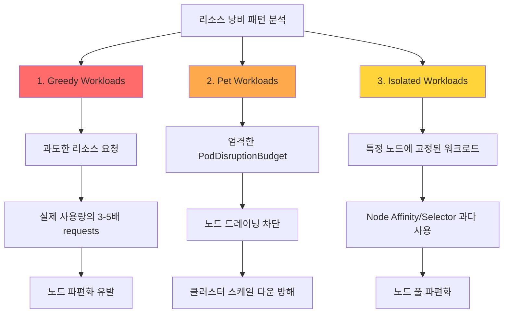

**1. Greedy Workloads (탐욕스러운 워크로드):**

과도하게 리소스를 요청하는 Pod로 인해 노드 활용률이 낮아지는 패턴입니다.

```bash
# CloudWatch Insights 쿼리 - Over-requesting 컨테이너 식별
fields @timestamp, PodName, ContainerName, pod_cpu_request, pod_cpu_utilization_over_pod_limit
| filter Namespace = "production"
| stats avg(pod_cpu_request) as avg_requested,
        avg(pod_cpu_utilization_over_pod_limit) as avg_utilization
  by PodName
| filter avg_utilization < 30  # 요청량의 30% 미만 사용
| sort avg_requested desc
```

**식별 기준:**
- CPU requests의 30% 미만 사용
- Memory requests의 50% 미만 사용
- 지속 기간: 7일 이상

**대응 방법:**
```yaml
# Before (Greedy)
resources:
  requests:
    cpu: "2000m"       # 실제 사용량: 400m (20%)
    memory: "4Gi"      # 실제 사용량: 1Gi (25%)

# After (Right-Sized)
resources:
  requests:
    cpu: "500m"        # P95 400m + 20% = 480m → 500m
    memory: "1280Mi"   # P95 1Gi + 20% = 1.2Gi → 1280Mi
  limits:
    memory: "2Gi"
```

**2. Pet Workloads (애완동물 워크로드):**

엄격한 PodDisruptionBudget(PDB)로 인해 클러스터 스케일 다운이 차단되는 패턴입니다.

```bash
# PDB로 인한 노드 드레이닝 실패 확인
kubectl get events --all-namespaces \
  --field-selector reason=EvictionFailed \
  --sort-by='.lastTimestamp'

# 예상 출력:
# NAMESPACE   LAST SEEN   TYPE      REASON           MESSAGE
# production  5m          Warning   EvictionFailed   Cannot evict pod as it would violate the pod's disruption budget
```

**식별 기준:**
- `minAvailable: 100%` 또는 `maxUnavailable: 0` 설정
- 장기간(>30분) Pending 상태 노드 존재
- Karpenter/Cluster Autoscaler 스케일 다운 실패 로그

**대응 방법:**
```yaml
# Before (Pet)
apiVersion: policy/v1
kind: PodDisruptionBudget
metadata:
  name: critical-app-pdb
spec:
  minAvailable: 100%  # 모든 Pod 보호 → 스케일 다운 불가

# After (Balanced)
apiVersion: policy/v1
kind: PodDisruptionBudget
metadata:
  name: critical-app-pdb
spec:
  minAvailable: 80%   # 20% 여유로 스케일 다운 허용
  selector:
    matchLabels:
      app: critical-app
```

**3. Isolated Workloads (고립된 워크로드):**

과도한 Node Affinity, Taints/Tolerations로 인해 노드 풀이 파편화되는 패턴입니다.

```bash
# 노드별 Pod 수와 활용률 분석
kubectl get nodes -o json | jq -r '
  .items[] |
  {
    name: .metadata.name,
    pods: (.status.allocatable.pods | tonumber),
    cpu_capacity: (.status.capacity.cpu | tonumber),
    cpu_allocatable: (.status.allocatable.cpu | tonumber)
  }
' | jq -s 'sort_by(.pods) | .[]'
```

**식별 기준:**
- 노드당 평균 Pod 수 < 10개
- 노드 수 > 필요 용량의 150%
- NodeSelector/Affinity 사용률 > 50%

**대응 방법:**
```yaml
# Before (Isolated)
affinity:
  nodeAffinity:
    requiredDuringSchedulingIgnoredDuringExecution:
      nodeSelectorTerms:
      - matchExpressions:
        - key: workload-type
          operator: In
          values:
          - api-server-v2  # 너무 구체적 → 노드 파편화

# After (Flexible)
affinity:
  nodeAffinity:
    preferredDuringSchedulingIgnoredDuringExecution:  # required → preferred
    - weight: 100
      preference:
        matchExpressions:
        - key: workload-class
          operator: In
          values:
          - compute-optimized  # 더 넓은 범주
```

**Data-Driven 최적화 플로우:**

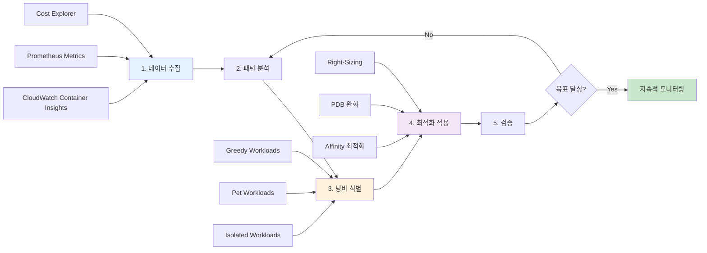

**실제 효과 사례 (AWS 공식 가이드):**

| 조직 | 낭비 패턴 | 적용 조치 | 절감 효과 |
|------|----------|----------|----------|
| 핀테크 스타트업 | Greedy Workloads 40% | VPA 권장사항 적용 | 노드 수 35% 감소 |
| 이커머스 기업 | Pet Workloads 25% | PDB minAvailable 80%로 완화 | 스케일 다운 속도 3배 향상 |
| SaaS 플랫폼 | Isolated Workloads 30% | NodeSelector 제거, Spot 활용 | 비용 45% 절감 |

:::tip 자동화된 낭비 패턴 탐지
CloudWatch Contributor Insights를 사용하면 위 3가지 패턴을 자동으로 탐지하는 규칙을 생성할 수 있습니다:

```bash
# Contributor Insights 규칙 생성 (Greedy Workloads)
aws cloudwatch put-insight-rule \
  --rule-name "EKS-GreedyWorkloads" \
  --rule-definition file://greedy-workloads-rule.json
```

규칙 정의 예시:
```json
{
  "Schema": {
    "Name": "CloudWatchLogRule",
    "Version": 1
  },
  "LogGroupNames": ["/aws/containerinsights/<cluster-name>/performance"],
  "LogFormat": "JSON",
  "Contribution": {
    "Keys": ["PodName"],
    "Filters": [
      {
        "Match": "$.Type",
        "In": ["Pod"]
      },
      {
        "Match": "$.pod_cpu_utilization_over_pod_limit",
        "LessThan": 30
      }
    ],
    "ValueOf": "pod_cpu_request"
  },
  "AggregateOn": "Sum"
}
```
:::

#### Prometheus 쿼리

```promql
# CPU 사용량 (P95, 7일간)
quantile_over_time(0.95,
  sum by (pod, namespace) (
    rate(container_cpu_usage_seconds_total{namespace="production"}[5m])
  )[7d:5m]
)

# Memory 사용량 (P95, 7일간)
quantile_over_time(0.95,
  sum by (pod, namespace) (
    container_memory_working_set_bytes{namespace="production"}
  )[7d:5m]
)

# CPU Requests와 실제 사용량 비교
sum by (pod) (rate(container_cpu_usage_seconds_total[5m]))
/
sum by (pod) (kube_pod_container_resource_requests{resource="cpu"})

# Memory Requests와 실제 사용량 비교
sum by (pod) (container_memory_working_set_bytes)
/
sum by (pod) (kube_pod_container_resource_requests{resource="memory"})
```

### 6.2 Goldilocks를 활용한 자동 Right-Sizing

Goldilocks는 VPA Recommender를 기반으로 대시보드를 제공합니다.

#### 설치

```bash
# Helm으로 설치
helm repo add fairwinds-stable https://charts.fairwinds.com/stable
helm repo update

helm install goldilocks fairwinds-stable/goldilocks \
  --namespace goldilocks \
  --create-namespace \
  --set dashboard.service.type=LoadBalancer
```

#### 네임스페이스 활성화

```bash
# 네임스페이스에 레이블 추가
kubectl label namespace production goldilocks.fairwinds.com/enabled=true
kubectl label namespace staging goldilocks.fairwinds.com/enabled=true

# Goldilocks가 자동으로 VPA 생성 (Off 모드)
kubectl get vpa -n production
```

#### 대시보드 접근

```bash
# 대시보드 URL 확인
kubectl get svc -n goldilocks goldilocks-dashboard

# 포트 포워딩
kubectl port-forward -n goldilocks svc/goldilocks-dashboard 8080:80

# 브라우저에서 http://localhost:8080 접속
```

**대시보드 기능:**
- 네임스페이스별 리소스 권장사항
- VPA Lower Bound, Target, Upper Bound 표시
- 현재 설정과 권장값 비교
- QoS 클래스 표시

### 6.3 Container Insights Enhanced 이상 탐지 활용

AWS Container Insights Enhanced는 기존 Container Insights보다 향상된 관찰성 기능을 제공하며, 특히 **자동 이상 탐지**와 **드릴다운 분석** 기능을 통해 리소스 문제를 조기에 발견할 수 있습니다.

#### 6.3.1 Container Insights Enhanced 개요

**기존 Container Insights 대비 향상된 기능:**

| 기능 | 기존 Container Insights | Enhanced |
|------|------------------------|----------|
| **메트릭 수집** | Pod/Container 레벨 | Pod/Container + 네트워크 세분화 |
| **이상 탐지** | 수동 (사용자가 임계값 설정) | **자동 (ML 기반 anomaly detection)** |
| **드릴다운** | 제한적 | **완전한 계층 구조 (Cluster → Node → Pod → Container)** |
| **메모리 누수 감지** | 수동 분석 필요 | **시각적 패턴 자동 식별** |
| **CPU Throttling** | 메트릭만 제공 | **자동 경고 + 원인 분석** |
| **네트워크 관찰성** | 기본 | **Pod-to-Pod 흐름 분석** |

**활성화 방법:**

```bash
# CloudWatch Observability Operator 배포
kubectl apply -f https://raw.githubusercontent.com/aws-observability/aws-cloudwatch-observability-operator/main/deploy/operator.yaml

# Container Insights Enhanced 활성화
cat <<EOF | kubectl apply -f -
apiVersion: cloudwatch.aws.amazon.com/v1alpha1
kind: CloudWatchObservability
metadata:
  name: cloudwatch-observability
spec:
  enableContainerInsights: true
  enableEnhancedContainerInsights: true  # Enhanced 활성화
  enableAutoInstrumentation: true
EOF

# 활성화 확인
kubectl get cloudwatchobservability cloudwatch-observability -o yaml
```

#### 6.3.2 메모리 누수 시각적 식별 패턴

Container Insights Enhanced는 메모리 사용량의 **점진적 증가 패턴**을 자동으로 감지합니다.

**메모리 누수 탐지 시나리오:**

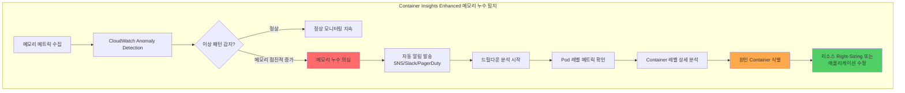

**CloudWatch Console에서 메모리 누수 확인:**

1. **CloudWatch → Container Insights → Performance monitoring**
2. **View: EKS Pods** 선택
3. **메트릭: Memory Utilization (%)** 선택
4. **Anomaly Detection Band 활성화**

```
정상 패턴:
Memory (%) ▲
100% |                    ┌────┐
     |        ┌────┐  ┌──┘    └──┐
 50% |   ┌───┘    └──┘           └───┐
     |───┘                            └───
  0% +──────────────────────────────────►
     0h    6h   12h   18h   24h        Time

메모리 누수 패턴 (🚨):
Memory (%) ▲
100% |                          ┌────OOM Kill
     |                    ┌────┤
 50% |           ┌───────┤     │
     |      ┌────┤       │     │
  0% +──────┤────────────────────────────►
     0h    6h   12h   18h   24h        Time
     점진적 상승 (Anomaly Detection이 자동 감지)
```

**자동 알림 설정 예시:**

```yaml
# CloudWatch Alarm with Anomaly Detection
apiVersion: v1
kind: ConfigMap
metadata:
  name: memory-leak-alarm
data:
  alarm.json: |
    {
      "AlarmName": "EKS-MemoryLeak-Detection",
      "ComparisonOperator": "LessThanLowerOrGreaterThanUpperThreshold",
      "EvaluationPeriods": 3,
      "Metrics": [
        {
          "Id": "m1",
          "ReturnData": true,
          "MetricStat": {
            "Metric": {
              "Namespace": "ContainerInsights",
              "MetricName": "pod_memory_utilization",
              "Dimensions": [
                {
                  "Name": "ClusterName",
                  "Value": "production-eks"
                }
              ]
            },
            "Period": 300,
            "Stat": "Average"
          }
        },
        {
          "Id": "ad1",
          "Expression": "ANOMALY_DETECTION_BAND(m1, 2)",
          "Label": "MemoryUsage (Expected)"
        }
      ],
      "ThresholdMetricId": "ad1",
      "ActionsEnabled": true,
      "AlarmActions": [
        "arn:aws:sns:us-east-1:123456789012:ops-alerts"
      ]
    }
```

**AWS CLI로 알림 생성:**

```bash
# Anomaly Detection 기반 메모리 알림
aws cloudwatch put-metric-alarm \
  --alarm-name eks-memory-leak-detection \
  --alarm-description "Detects memory leak patterns in EKS pods" \
  --comparison-operator LessThanLowerOrGreaterThanUpperThreshold \
  --evaluation-periods 3 \
  --metrics '[
    {
      "Id": "m1",
      "ReturnData": true,
      "MetricStat": {
        "Metric": {
          "Namespace": "ContainerInsights",
          "MetricName": "pod_memory_utilization",
          "Dimensions": [
            {"Name": "ClusterName", "Value": "production-eks"}
          ]
        },
        "Period": 300,
        "Stat": "Average"
      }
    },
    {
      "Id": "ad1",
      "Expression": "ANOMALY_DETECTION_BAND(m1, 2)"
    }
  ]' \
  --threshold-metric-id ad1 \
  --alarm-actions arn:aws:sns:us-east-1:123456789012:ops-alerts
```

#### 6.3.3 CPU Throttling 자동 탐지

Container Insights Enhanced는 CPU throttling을 자동으로 감지하고, **과도한 CPU limit 설정**을 경고합니다.

**CPU Throttling 메트릭:**

```
throttled_time_percentage = (container_cpu_cfs_throttled_seconds_total / container_cpu_cfs_periods_total) * 100

정상: <5%
주의: 5-10% ⚠️
심각: >10% 🚨 (HPA 또는 CPU limits 제거 필요)
```

**CloudWatch Insights 쿼리로 Throttling 분석:**

```sql
# CloudWatch Logs Insights �ery
fields @timestamp, kubernetes.pod_name, cpu_limit_millicores, cpu_usage_millicores, throttled_time_ms
| filter kubernetes.namespace_name = "production"
| filter throttled_time_ms > 100  # 100ms 이상 throttling
| stats
    avg(cpu_usage_millicores) as avg_cpu,
    max(cpu_usage_millicores) as max_cpu,
    avg(throttled_time_ms) as avg_throttled,
    count(*) as throttling_count
  by kubernetes.pod_name
| sort throttling_count desc
| limit 20

# 결과 예시:
# pod_name            avg_cpu  max_cpu  avg_throttled  throttling_count
# web-app-abc123      450m     800m     250ms          150
# api-server-def456   600m     1000m    180ms          120
```

**Throttling 자동 경고 CloudWatch Alarm:**

```bash
aws cloudwatch put-metric-alarm \
  --alarm-name eks-cpu-throttling-high \
  --alarm-description "Alerts when CPU throttling exceeds 10%" \
  --namespace ContainerInsights \
  --metric-name pod_cpu_throttled_percentage \
  --dimensions Name=ClusterName,Value=production-eks \
  --statistic Average \
  --period 300 \
  --threshold 10 \
  --comparison-operator GreaterThanThreshold \
  --evaluation-periods 2 \
  --alarm-actions arn:aws:sns:us-east-1:123456789012:ops-alerts
```

#### 6.3.4 이상 탐지 밴드 (Anomaly Detection Band) 설정

CloudWatch Anomaly Detection은 ML 모델을 사용하여 정상 범위를 자동으로 학습합니다.

**Anomaly Detection 작동 원리:**

```
1. 학습 기간: 최소 2주 데이터 수집
2. ML 모델 훈련: 시간대별, 요일별 패턴 학습
3. 예측 범위 생성: 예상 상한/하한 계산
4. 실시간 비교: 실제값이 범위 밖이면 알림
```

**밴드 폭 조정 (Standard Deviation):**

```yaml
# 2 Standard Deviations (기본, 95% 신뢰구간)
Expression: ANOMALY_DETECTION_BAND(m1, 2)

# 3 Standard Deviations (99.7% 신뢰구간, 더 보수적)
Expression: ANOMALY_DETECTION_BAND(m1, 3)

# 1 Standard Deviation (68% 신뢰구간, 민감하게 감지)
Expression: ANOMALY_DETECTION_BAND(m1, 1)
```

**시각적 예시:**

```
리소스 사용량 ▲
              |     ┌──── Upper Band (예측 상한)
              |    /
         100% | ──●────  실제 사용량 (이상 없음)
              |  / │
              | /  │
          50% |────●────  실제 사용량 (정상)
              | \  │
              |  \ │
           0% | ──●────  Lower Band (예측 하한)
              +──────────────────────────►
              0h   6h   12h   18h   24h
```

#### 6.3.5 실전 워크플로우: 이상 탐지 → 조사 → Right-Sizing

**Step 1: CloudWatch Alarm 트리거**

```
[CloudWatch Alarm] → [SNS Topic] → [Slack Webhook]

알림 예시:
🚨 EKS Memory Anomaly Detected
Cluster: production-eks
Pod: web-app-7d8c9f-abc123
Memory Usage: 1.8Gi (Expected: 1.2Gi ± 200Mi)
Duration: 15 minutes
Action: Investigate memory leak
```

**Step 2: Container Insights 드릴다운 분석**

```bash
# 1. CloudWatch Console에서 해당 Pod 선택
# 2. "View in Container Insights" 클릭
# 3. 계층 구조 드릴다운:
#    Cluster → Node → Pod → Container

# 또는 AWS CLI로 메트릭 조회:
aws cloudwatch get-metric-statistics \
  --namespace ContainerInsights \
  --metric-name pod_memory_utilization \
  --dimensions \
    Name=ClusterName,Value=production-eks \
    Name=Namespace,Value=production \
    Name=PodName,Value=web-app-7d8c9f-abc123 \
  --start-time 2026-02-12T00:00:00Z \
  --end-time 2026-02-12T23:59:59Z \
  --period 300 \
  --statistics Average,Maximum
```

**Step 3: 원인 식별**

```bash
# 메모리 누수 확인
kubectl top pod web-app-7d8c9f-abc123 -n production --containers

# 로그 확인 (OOM 경고)
kubectl logs web-app-7d8c9f-abc123 -n production | grep -i "memory\|heap\|oom"

# 애플리케이션 프로파일링 (Java 예시)
kubectl exec web-app-7d8c9f-abc123 -n production -- jmap -heap 1
```

**Step 4: Right-Sizing 적용**

```yaml
# VPA Off 모드로 권장사항 확인
apiVersion: autoscaling.k8s.io/v1
kind: VerticalPodAutoscaler
metadata:
  name: web-app-vpa
  namespace: production
spec:
  targetRef:
    apiVersion: apps/v1
    kind: Deployment
    name: web-app
  updatePolicy:
    updateMode: "Off"

# VPA 권장사항 확인 후 Deployment 업데이트
resources:
  requests:
    memory: "2Gi"    # VPA Target 1.8Gi + 20% 버퍼
  limits:
    memory: "3Gi"    # Upper Bound 2.5Gi + 여유
```

**Step 5: 지속적 모니터링**

```bash
# CloudWatch Alarm 상태 확인
aws cloudwatch describe-alarms \
  --alarm-names eks-memory-leak-detection \
  --query 'MetricAlarms[0].StateValue'

# 출력: "OK" (정상) 또는 "ALARM" (이상)
```

:::tip Container Insights Enhanced vs Prometheus
Container Insights Enhanced는 **AWS 네이티브 통합**과 **제로 설정 이상 탐지**가 강점입니다. Prometheus는 더 세밀한 커스터마이징이 가능하지만, 이상 탐지 ML 모델을 직접 구축해야 합니다. 두 도구를 병행하면 최상의 관찰성을 확보할 수 있습니다.
:::

:::warning 이상 탐지의 한계
ML 기반 이상 탐지는 **과거 패턴**을 학습하므로, 다음 상황에서는 오탐(False Positive)이 발생할 수 있습니다:
- 신규 배포 직후 (학습 데이터 부족)
- 마케팅 캠페인 등 계획된 트래픽 증가
- 계절성 이벤트 (블랙 프라이데이, 연말 결산 등)

이러한 경우 **일시적으로 알림을 음소거**하거나, **예상 이벤트를 Anomaly Detection 모델에 반영**해야 합니다.
:::

### 6.4 Right-Sizing 프로세스

5단계 체계적 Right-Sizing 프로세스:

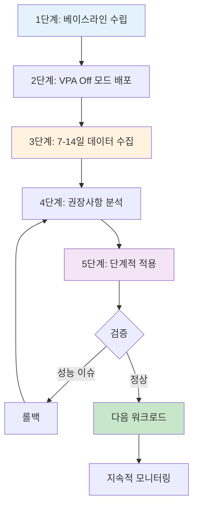

#### 1단계: 베이스라인 수립

```bash
# 현재 리소스 설정 백업
kubectl get deploy -n production -o yaml > deployments-backup.yaml

# 현재 사용량 스냅샷
kubectl top pods -n production --containers > baseline-usage.txt
```

#### 2단계: VPA Off 모드 배포

```yaml
apiVersion: autoscaling.k8s.io/v1
kind: VerticalPodAutoscaler
metadata:
  name: web-app-vpa
  namespace: production
spec:
  targetRef:
    apiVersion: apps/v1
    kind: Deployment
    name: web-app
  updatePolicy:
    updateMode: "Off"
  resourcePolicy:
    containerPolicies:
    - containerName: '*'    # 모든 컨테이너
      minAllowed:
        cpu: "50m"
        memory: "64Mi"
      maxAllowed:
        cpu: "8000m"
        memory: "32Gi"
```

#### 3단계: 7-14일 데이터 수집

```bash
# VPA 상태 모니터링
watch kubectl describe vpa web-app-vpa -n production

# 최소 7일, 권장 14일 대기
# 트래픽 패턴이 주간 사이클을 가지는 경우 14일 필수
```

#### 4단계: 권장사항 분석

```bash
# VPA 권장사항 추출
kubectl get vpa web-app-vpa -n production -o jsonpath='{.status.recommendation.containerRecommendations[0]}' | jq .

# 출력 예시:
# {
#   "containerName": "web-app",
#   "lowerBound": {
#     "cpu": "150m",
#     "memory": "200Mi"
#   },
#   "target": {
#     "cpu": "250m",
#     "memory": "350Mi"
#   },
#   "uncappedTarget": {
#     "cpu": "300m",
#     "memory": "400Mi"
#   },
#   "upperBound": {
#     "cpu": "500m",
#     "memory": "700Mi"
#   }
# }
```

**권장사항 해석:**

| 항목 | 의미 | 사용 시점 |
|------|------|----------|
| **Lower Bound** | 최소 필요 리소스 | 극단적 비용 절감 (위험) |
| **Target** | **권장 설정값** | **기본 사용** ⭐ |
| **Uncapped Target** | 제약 없는 권장값 | maxAllowed 조정 참고 |
| **Upper Bound** | 최대 관찰된 사용량 | Limits 설정 참고 |

:::tip Requests 계산 공식
**권장 공식**: `Requests = VPA Target + 20% 버퍼`

이유:
- P95 기반 권장사항 (5% 트래픽 스파이크 대비)
- 배포, 초기화 등 일시적 사용량 증가 대응
- Throttling, OOM 리스크 최소화

**예시:**
```
VPA Target CPU: 250m
→ Requests: 250m * 1.2 = 300m

VPA Target Memory: 350Mi
→ Requests: 350Mi * 1.2 = 420Mi (반올림 512Mi)
```
:::

#### 5단계: 단계적 적용

```yaml
# 기존 설정
resources:
  requests:
    cpu: "1000m"       # 과다 프로비저닝
    memory: "2Gi"
  limits:
    cpu: "2000m"
    memory: "2Gi"

# VPA Target: CPU 250m, Memory 350Mi

# Right-Sized 설정
resources:
  requests:
    cpu: "300m"        # Target 250m + 20% = 300m
    memory: "512Mi"    # Target 350Mi + 20% ≈ 420Mi → 512Mi
  limits:
    # CPU limits 제거 (압축 가능 리소스)
    memory: "1Gi"      # Upper Bound 700Mi + 여유 = 1Gi
```

**적용 전략:**

```bash
# 1. Canary 배포 (10% 트래픽)
kubectl patch deploy web-app -n production -p '
{
  "spec": {
    "strategy": {
      "type": "RollingUpdate",
      "rollingUpdate": {
        "maxSurge": 1,
        "maxUnavailable": 0
      }
    }
  }
}'

# 2. 리소스 변경 적용
kubectl set resources deploy web-app -n production \
  --limits=memory=1Gi \
  --requests=cpu=300m,memory=512Mi

# 3. 모니터링 (1-3일)
kubectl top pods -n production -l app=web-app
kubectl get events -n production --field-selector involvedObject.name=web-app

# 4. 이상 없으면 전체 적용
# 이상 있으면 즉시 롤백
kubectl rollout undo deploy web-app -n production
```

### 6.5 AI 기반 리소스 추천 자동화 (고급)

AI와 LLM을 활용하여 리소스 최적화 프로세스를 자동화할 수 있습니다. 이 섹션에서는 Amazon Bedrock, Kiro, Amazon Q Developer를 활용한 최신 패턴을 소개합니다.

#### 6.5.1 Amazon Bedrock + Prometheus → 자동 Right-Sizing PR 생성

전통적인 수동 Right-Sizing 프로세스를 AI로 자동화하는 엔드투엔드 워크플로우입니다.

**아키텍처 개요:**

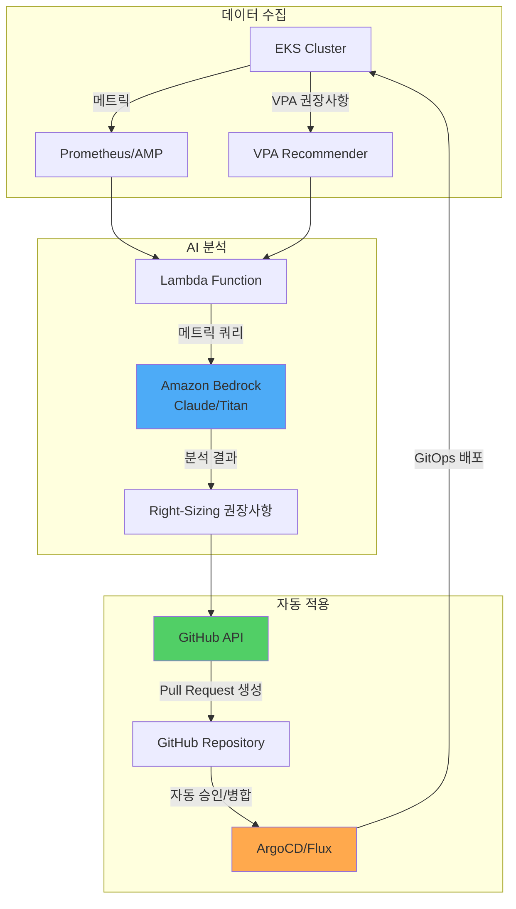

**구현 예시:**

```python
# Lambda Function: AI 기반 Right-Sizing 추천
import boto3
import json
import requests
from datetime import datetime, timedelta

bedrock = boto3.client('bedrock-runtime', region_name='us-east-1')
amp_query_url = "https://aps-workspaces.us-east-1.amazonaws.com/workspaces/ws-xxx/api/v1/query"

def lambda_handler(event, context):
    # 1. Prometheus 메트릭 수집 (7일)
    metrics = collect_prometheus_metrics(
        namespace="production",
        deployment="web-app",
        period_days=7
    )

    # 2. VPA 권장사항 수집
    vpa_recommendations = get_vpa_recommendations("web-app-vpa", "production")

    # 3. Amazon Bedrock로 분석
    analysis_prompt = f"""
    다음 Kubernetes Deployment의 리소스 최적화를 분석하세요:

    현재 설정:
    {json.dumps(metrics['current_resources'], indent=2)}

    7일간 실제 사용량 (P50/P95/P99):
    CPU: {metrics['cpu_p50']}m / {metrics['cpu_p95']}m / {metrics['cpu_p99']}m
    Memory: {metrics['mem_p50']}Mi / {metrics['mem_p95']}Mi / {metrics['mem_p99']}Mi

    VPA 권장사항:
    {json.dumps(vpa_recommendations, indent=2)}

    다음을 포함한 분석을 제공하세요:
    1. 현재 리소스 낭비 또는 부족 여부
    2. 권장 requests/limits 값 (구체적 수치)
    3. 예상 비용 절감액
    4. 위험 요소 및 주의사항
    5. 단계적 적용 계획
    """

    response = bedrock.invoke_model(
        modelId='anthropic.claude-3-sonnet-20240229-v1:0',
        contentType='application/json',
        accept='application/json',
        body=json.dumps({
            "anthropic_version": "bedrock-2023-05-31",
            "max_tokens": 2000,
            "messages": [{
                "role": "user",
                "content": analysis_prompt
            }]
        })
    )

    analysis = json.loads(response['body'].read())['content'][0]['text']

    # 4. GitHub Pull Request 생성
    create_right_sizing_pr(
        deployment="web-app",
        namespace="production",
        analysis=analysis,
        recommended_resources=parse_recommendations(analysis)
    )

    return {
        'statusCode': 200,
        'body': json.dumps({'message': 'Right-sizing PR created', 'analysis': analysis})
    }

def collect_prometheus_metrics(namespace, deployment, period_days):
    """Prometheus에서 리소스 사용량 수집"""
    end_time = datetime.now()
    start_time = end_time - timedelta(days=period_days)

    queries = {
        'cpu_p50': f'quantile_over_time(0.50, container_cpu_usage_seconds_total{{namespace="{namespace}",pod=~"{deployment}-.*"}}[{period_days}d]) * 1000',
        'cpu_p95': f'quantile_over_time(0.95, container_cpu_usage_seconds_total{{namespace="{namespace}",pod=~"{deployment}-.*"}}[{period_days}d]) * 1000',
        'cpu_p99': f'quantile_over_time(0.99, container_cpu_usage_seconds_total{{namespace="{namespace}",pod=~"{deployment}-.*"}}[{period_days}d]) * 1000',
        'mem_p50': f'quantile_over_time(0.50, container_memory_working_set_bytes{{namespace="{namespace}",pod=~"{deployment}-.*"}}[{period_days}d]) / 1024 / 1024',
        'mem_p95': f'quantile_over_time(0.95, container_memory_working_set_bytes{{namespace="{namespace}",pod=~"{deployment}-.*"}}[{period_days}d]) / 1024 / 1024',
        'mem_p99': f'quantile_over_time(0.99, container_memory_working_set_bytes{{namespace="{namespace}",pod=~"{deployment}-.*"}}[{period_days}d]) / 1024 / 1024',
    }

    results = {}
    for key, query in queries.items():
        response = requests.get(amp_query_url, params={'query': query})
        results[key] = int(float(response.json()['data']['result'][0]['value'][1]))

    return results

def create_right_sizing_pr(deployment, namespace, analysis, recommended_resources):
    """GitHub에 Right-Sizing PR 생성"""
    github_token = get_secret('github-token')
    repo_owner = "my-org"
    repo_name = "k8s-manifests"

    # Deployment YAML 수정
    updated_yaml = update_deployment_resources(
        deployment=deployment,
        namespace=namespace,
        resources=recommended_resources
    )

    # Pull Request 생성
    pr_body = f"""
## 🤖 AI 기반 리소스 Right-Sizing 제안

### 분석 결과
{analysis}

### 변경 사항
- Deployment: `{namespace}/{deployment}`
- 리소스 requests/limits 업데이트

### 검증 체크리스트
- [ ] Staging 환경에서 테스트 완료
- [ ] 성능 메트릭 정상 확인
- [ ] 비용 절감액 검증

### 자동 생성 정보
- Generator: Amazon Bedrock + VPA Analysis
- Timestamp: {datetime.now().isoformat()}
"""

    headers = {
        'Authorization': f'token {github_token}',
        'Accept': 'application/vnd.github.v3+json'
    }

    # 브랜치 생성 및 커밋
    create_branch_and_commit(repo_owner, repo_name, updated_yaml, headers)

    # PR 생성
    pr_data = {
        'title': f'[AI] Right-Size {namespace}/{deployment}',
        'head': f'right-size-{deployment}-{datetime.now().strftime("%Y%m%d")}',
        'base': 'main',
        'body': pr_body
    }

    response = requests.post(
        f'https://api.github.com/repos/{repo_owner}/{repo_name}/pulls',
        headers=headers,
        json=pr_data
    )

    return response.json()
```

**EventBridge 스케줄로 자동화:**

```yaml
# CloudFormation 템플릿 예시
Resources:
  RightSizingSchedule:
    Type: AWS::Events::Rule
    Properties:
      Name: weekly-right-sizing-analysis
      Description: "Weekly AI-based right-sizing analysis"
      ScheduleExpression: "cron(0 9 ? * MON *)"  # 매주 월요일 오전 9시
      State: ENABLED
      Targets:
        - Arn: !GetAtt RightSizingLambda.Arn
          Id: RightSizingTarget
          Input: |
            {
              "namespaces": ["production", "staging"],
              "auto_create_pr": true,
              "require_approval": true
            }
```

#### 6.5.2 Kiro + EKS MCP를 활용한 리소스 최적화

**Kiro**는 AWS의 AI 기반 클라우드 운영 도구로, **자연어 질의**로 EKS 리소스 최적화를 수행할 수 있습니다.

**Kiro 설치 및 설정:**

```bash
# Kiro CLI 설치
curl -sL https://kiro.aws.dev/install.sh | bash

# EKS MCP (Model Context Protocol) 연결
kiro mcp connect eks --cluster production-eks --region us-east-1

# 연결 확인
kiro mcp list
# 출력:
# ✓ eks-production (connected)
# ✓ cloudwatch-insights (connected)
# ✓ cost-explorer (connected)
```

**자연어 질의 예시:**

```bash
# 1. 리소스 최적화가 필요한 Pod 찾기
kiro ask "production 네임스페이스에서 CPU 사용률이 30% 미만인 Pod를 찾아서 Right-Sizing 권장사항을 알려줘"

# Kiro 응답 예시:
# 📊 분석 결과: 12개 Pod가 과다 프로비저닝 상태입니다.
#
# 상위 5개:
# 1. web-app-7d8c9f (현재: 2 CPU / 실제 P95: 0.4 CPU) → 권장: 0.5 CPU
# 2. api-server-abc123 (현재: 4 CPU / 실제 P95: 0.8 CPU) → 권장: 1 CPU
# 3. worker-def456 (현재: 1 CPU / 실제 P95: 0.2 CPU) → 권장: 0.3 CPU
#
# 💰 예상 절감액: $450/월 (45% 리소스 감소)
#
# 적용하시겠습니까? (y/n)

# 2. 메모리 누수 의심 Pod 식별
kiro ask "지난 7일간 메모리 사용량이 지속적으로 증가한 Pod를 찾아줘"

# Kiro 응답:
# 🔍 메모리 증가 패턴 감지:
#
# ⚠️ cache-service-xyz789
# - 시작: 500Mi → 현재: 1.8Gi (260% 증가)
# - 추세: 하루 150Mi씩 증가
# - 예상 OOM까지: 3일
# - 권장 조치: 메모리 누수 조사 + 임시로 limits 2.5Gi로 상향
#
# 📋 상세 분석 보고서를 생성하시겠습니까? (y/n)

# 3. 클러스터 전체 효율성 분석
kiro ask "production 클러스터의 리소스 효율성을 분석하고 최적화 우선순위를 알려줘"

# Kiro 응답:
# 📈 클러스터 효율성 보고서
#
# 전체 효율성: 52% (업계 평균: 65%)
#
# 최적화 우선순위:
# 1. 🔴 High Priority (즉시 조치)
#    - 10개 Deployment가 CPU의 70% 미사용
#    - 예상 절감: $1,200/월
#
# 2. 🟡 Medium Priority (1주 내)
#    - 5개 StatefulSet의 PVC 사이즈 과다
#    - 예상 절감: $300/월
#
# 3. 🟢 Low Priority (계획 단계)
#    - HPA 미설정 Deployment 15개
#    - 트래픽 패턴 분석 후 적용 권장
#
# 자동 Right-Sizing PR을 생성하시겠습니까? (y/n)
```

**Kiro 워크플로우 자동화:**

```yaml
# kiro-workflow.yaml
apiVersion: kiro.aws.dev/v1alpha1
kind: Workflow
metadata:
  name: weekly-optimization
spec:
  schedule: "0 9 * * MON"  # 매주 월요일 오전 9시
  steps:
    - name: analyze-underutilized
      action: analyze
      query: "CPU 사용률 30% 미만 또는 Memory 사용률 40% 미만인 모든 Pod 분석"
      outputFormat: json

    - name: generate-recommendations
      action: recommend
      input: ${{ steps.analyze-underutilized.output }}
      includeVPA: true
      includePrometheus: true

    - name: create-pr
      action: github-pr
      repository: my-org/k8s-manifests
      branch: kiro-right-sizing-{{ date }}
      title: "[Kiro] Weekly Right-Sizing Recommendations"
      body: ${{ steps.generate-recommendations.output }}
      autoMerge: false  # 수동 검토 필요

    - name: notify
      action: slack
      webhook: ${{ secrets.SLACK_WEBHOOK }}
      message: |
        📊 주간 Right-Sizing 분석 완료
        PR: ${{ steps.create-pr.pr_url }}
        예상 절감: ${{ steps.generate-recommendations.estimated_savings }}
```

#### 6.5.3 Amazon Q Developer를 활용한 대화형 최적화

Amazon Q Developer는 IDE와 CLI에서 직접 리소스 최적화 조언을 제공합니다.

**VS Code에서 사용:**

```yaml
# deployment.yaml을 열고 Q Developer에게 질문
# /q optimize-resources

# Q Developer 응답:
# 현재 Deployment의 리소스 설정을 분석했습니다:
#
# 🔍 발견된 문제:
# 1. CPU requests가 실제 사용량보다 3배 높습니다 (1000m → 350m 권장)
# 2. Memory limits가 없어 OOM 위험이 있습니다
# 3. QoS 클래스: Burstable (Guaranteed 권장)
#
# 💡 최적화된 설정:
resources:
  requests:
    cpu: "350m"      # 실제 P95 + 20% 버퍼
    memory: "512Mi"  # 실제 P95 400Mi + 20%
  limits:
    memory: "1Gi"    # Upper Bound + 여유
    # CPU limits 제거 (Google/Datadog 패턴)
#
# 이 변경사항을 적용하시겠습니까? (Apply / Dismiss)
```

**CLI에서 사용:**

```bash
# Amazon Q CLI를 통한 질의
q ask "이 Deployment의 리소스를 최적화해줘" --file deployment.yaml

# 출력:
# 분석 중... ✓
#
# 현재 설정 문제:
# - CPU over-provisioned by 65%
# - Memory under-provisioned (OOM risk)
#
# 권장 변경사항이 deployment-optimized.yaml에 저장되었습니다.
# 차이점을 확인하시겠습니까? (y/n)

# y 입력 시:
diff deployment.yaml deployment-optimized.yaml
```

#### 6.5.4 주의사항 및 한계

AI 기반 리소스 추천은 강력하지만, 다음 한계를 이해해야 합니다:

| 한계 | 설명 | 대응 방법 |
|------|------|----------|
| **과거 데이터 의존** | 과거에 없던 트래픽 패턴 예측 불가 | HPA 병행, 여유 버퍼 확보 |
| **컨텍스트 부족** | 비즈니스 요구사항 (SLA, 규제) 미반영 | 수동 검토 단계 필수 |
| **일시적 스파이크** | 마케팅 캠페인 등 계획된 부하 미고려 | 이벤트 기간 수동 스케일 업 |
| **비용 최적화 편향** | 안정성보다 비용 절감 우선 가능성 | Critical 워크로드 제외 설정 |

:::warning AI 추천은 보조 도구로 활용
AI 기반 리소스 추천은 **최종 의사결정 도구가 아닌 보조 도구**입니다. 프로덕션 적용 전 반드시:

1. **Staging 환경에서 검증** (최소 3일)
2. **성능 메트릭 모니터링** (Latency P99, Error Rate)
3. **점진적 롤아웃** (Canary 10% → 50% → 100%)
4. **롤백 계획 수립** (1분 내 이전 버전 복구 가능)

특히 다음 워크로드는 **AI 추천을 적용하지 말고 수동으로 관리**하세요:
- 금융 거래 시스템
- 의료 정보 시스템
- 실시간 스트리밍 서비스
- Stateful 데이터베이스
:::

**AI 추천 검증 체크리스트:**

```yaml
# 프로덕션 적용 전 필수 검증
ai_recommendation_validation:
  staging_test:
    duration_days: 3
    success_criteria:
      - p99_latency_increase: "<5%"
      - error_rate_increase: "<0.1%"
      - no_oom_kills: true
      - no_cpu_throttling: "<10%"

  canary_rollout:
    initial_percentage: 10
    increment_percentage: 20
    increment_interval_hours: 6
    auto_rollback_threshold:
      error_rate: 1.0  # 1% 에러율 초과 시 자동 롤백
      latency_p99_ms: 500  # P99 지연 500ms 초과 시 롤백

  monitoring:
    dashboard_url: "https://grafana.example.com/d/right-sizing"
    alert_channels: ["slack://ops-team", "pagerduty://oncall"]
    review_required: true  # 자동 병합 금지, 수동 검토 필수
```

:::tip AI + Human 하이브리드 접근
최상의 결과는 **AI 추천 + 인간 전문가 검토**의 조합에서 나옵니다:

1. AI가 수천 개 Pod 중 최적화 대상 선별 (속도)
2. 인간이 Critical 워크로드 제외 및 검증 (신뢰성)
3. AI가 초안 PR 생성 (자동화)
4. 인간이 Staging 테스트 후 승인 (안전성)
5. GitOps가 점진적 배포 (운영 효율)

이 프로세스로 **수동 대비 80% 시간 절감**, **안정성은 동일** 유지 가능합니다.
:::

## Resource Quota & LimitRange

### 7.1 Namespace 수준 리소스 제한

ResourceQuota로 네임스페이스 전체 리소스를 제한합니다:

```yaml
apiVersion: v1
kind: ResourceQuota
metadata:
  name: production-quota
  namespace: production
spec:
  hard:
    # 총 리소스 제한
    requests.cpu: "100"           # 100 CPU cores
    requests.memory: "200Gi"      # 200GB RAM
    limits.cpu: "200"             # CPU limits 합계
    limits.memory: "400Gi"        # Memory limits 합계

    # 오브젝트 수 제한
    pods: "500"                   # 최대 500개 Pod
    services: "50"                # 최대 50개 Service
    persistentvolumeclaims: "100" # 최대 100개 PVC

    # 스토리지 제한
    requests.storage: "2Ti"       # 총 2TB 스토리지

---
# 환경별 쿼터 예시
apiVersion: v1
kind: ResourceQuota
metadata:
  name: development-quota
  namespace: development
spec:
  hard:
    requests.cpu: "20"
    requests.memory: "40Gi"
    limits.cpu: "40"
    limits.memory: "80Gi"
    pods: "100"

---
apiVersion: v1
kind: ResourceQuota
metadata:
  name: staging-quota
  namespace: staging
spec:
  hard:
    requests.cpu: "50"
    requests.memory: "100Gi"
    limits.cpu: "100"
    limits.memory: "200Gi"
    pods: "200"
```

**쿼터 사용량 확인:**

```bash
# 현재 쿼터 사용량
kubectl describe resourcequota production-quota -n production

# 출력 예시:
# Name:            production-quota
# Namespace:       production
# Resource         Used   Hard
# --------         ----   ----
# limits.cpu       150    200
# limits.memory    300Gi  400Gi
# pods             342    500
# requests.cpu     75     100
# requests.memory  150Gi  200Gi
```

### 7.2 LimitRange로 기본값 설정

LimitRange로 Pod/Container에 자동으로 기본 리소스를 주입합니다:

```yaml
apiVersion: v1
kind: LimitRange
metadata:
  name: production-limitrange
  namespace: production
spec:
  limits:
  # Container 레벨 제약
  - type: Container
    default:                    # limits 미설정 시 기본값
      cpu: "500m"
      memory: "512Mi"
    defaultRequest:             # requests 미설정 시 기본값
      cpu: "100m"
      memory: "128Mi"
    max:                        # 최대 허용값
      cpu: "4000m"
      memory: "8Gi"
    min:                        # 최소 요구값
      cpu: "50m"
      memory: "64Mi"
    maxLimitRequestRatio:       # limits/requests 최대 비율
      cpu: "4"                  # limits는 requests의 최대 4배
      memory: "2"               # limits는 requests의 최대 2배

  # Pod 레벨 제약
  - type: Pod
    max:
      cpu: "8000m"
      memory: "16Gi"
    min:
      cpu: "100m"
      memory: "128Mi"

  # PVC 제약
  - type: PersistentVolumeClaim
    max:
      storage: "100Gi"
    min:
      storage: "1Gi"

---
# 개발 환경 LimitRange
apiVersion: v1
kind: LimitRange
metadata:
  name: development-limitrange
  namespace: development
spec:
  limits:
  - type: Container
    default:
      cpu: "200m"
      memory: "256Mi"
    defaultRequest:
      cpu: "50m"
      memory: "64Mi"
    max:
      cpu: "2000m"
      memory: "4Gi"
```

**동작 예시:**

```yaml
# 개발자가 작성한 YAML (리소스 미지정)
apiVersion: v1
kind: Pod
metadata:
  name: test-pod
  namespace: production
spec:
  containers:
  - name: nginx
    image: nginx:1.25
    # resources 섹션 없음

# LimitRange가 자동 주입한 결과
apiVersion: v1
kind: Pod
metadata:
  name: test-pod
  namespace: production
spec:
  containers:
  - name: nginx
    image: nginx:1.25
    resources:
      requests:           # defaultRequest 적용
        cpu: "100m"
        memory: "128Mi"
      limits:             # default 적용
        cpu: "500m"
        memory: "512Mi"
```

**검증:**

```bash
# LimitRange 확인
kubectl describe limitrange production-limitrange -n production

# Pod에 적용된 리소스 확인
kubectl get pod test-pod -n production -o jsonpath='{.spec.containers[0].resources}' | jq .
```

### 7.3 DRA (Dynamic Resource Allocation) - GPU/특수 리소스 관리

Kubernetes 1.31+에서 도입된 **DRA (Dynamic Resource Allocation)**는 GPU, FPGA, NPU 같은 특수 리소스를 보다 유연하게 할당할 수 있는 새로운 메커니즘입니다.

#### 기존 Device Plugin vs DRA

| 특성 | Device Plugin (기존) | DRA (K8s 1.31+) |
|------|---------------------|-----------------|
| **리소스 표현** | 단순 숫자 (`nvidia.com/gpu: 1`) | 구조화된 파라미터 (메모리, 컴퓨팅 모드) |
| **공유 가능성** | 불가능 (1 Pod = 1 GPU) | 가능 (시간 분할, MIG 지원) |
| **동적 할당** | 스케줄링 시 결정 | 런타임 동적 할당 |
| **복잡한 토폴로지** | 제한적 | NUMA, PCIe 토폴로지 고려 |
| **멀티 테넌트** | 어려움 | 네이티브 지원 |

**DRA의 핵심 개념:**

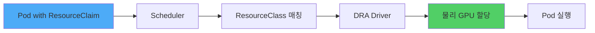

#### DRA 구성 요소

**1. ResourceClass (클러스터 수준 리소스 정의)**

```yaml
apiVersion: resource.k8s.io/v1alpha3
kind: ResourceClass
metadata:
  name: nvidia-a100-gpu
spec:
  driverName: gpu.nvidia.com
  parametersRef:
    apiGroup: gpu.nvidia.com
    kind: GpuClassParameters
    name: a100-80gb
---
apiVersion: gpu.nvidia.com/v1alpha1
kind: GpuClassParameters
metadata:
  name: a100-80gb
spec:
  # GPU 특성 정의
  memory: "80Gi"
  computeCapability: "8.0"
  # MIG (Multi-Instance GPU) 지원
  migEnabled: true
  migProfile: "1g.10gb"  # 1/7 GPU 슬라이스
```

**2. ResourceClaim (Pod가 요청하는 리소스)**

```yaml
apiVersion: resource.k8s.io/v1alpha3
kind: ResourceClaim
metadata:
  name: ml-training-gpu
  namespace: ml-team
spec:
  resourceClassName: nvidia-a100-gpu
  parametersRef:
    apiGroup: gpu.nvidia.com
    kind: GpuClaimParameters
    name: training-config
---
apiVersion: gpu.nvidia.com/v1alpha1
kind: GpuClaimParameters
metadata:
  name: training-config
spec:
  # 요청할 GPU 사양
  count: 2  # 2개 GPU 요청
  sharing: "TimeSlicing"  # 시간 분할 공유 허용
  selector:
    matchLabels:
      gpu.nvidia.com/memory: "80Gi"
```

**3. Pod에서 ResourceClaim 사용**

```yaml
apiVersion: v1
kind: Pod
metadata:
  name: pytorch-training
  namespace: ml-team
spec:
  containers:
  - name: trainer
    image: pytorch/pytorch:2.1.0-cuda12.1
    command: ["python", "train.py"]
    resources:
      requests:
        cpu: "8"
        memory: "32Gi"
      limits:
        memory: "64Gi"

  # DRA를 통한 GPU 할당
  resourceClaims:
  - name: gpu
    source:
      resourceClaimName: ml-training-gpu

  # 컨테이너에서 claim 참조
  containers:
  - name: trainer
    # ...
    resources:
      claims:
      - name: gpu
```

#### EKS에서 DRA 활성화 및 GPU 할당 예시

**Step 1: EKS 클러스터에서 DRA Feature Gate 활성화**

```bash
# EKS 1.31+ 클러스터 생성 시
eksctl create cluster \
  --name dra-enabled-cluster \
  --version 1.31 \
  --region us-west-2 \
  --nodegroup-name gpu-nodes \
  --node-type p4d.24xlarge \
  --nodes 2 \
  --kubernetes-feature-gates DynamicResourceAllocation=true
```

**Step 2: NVIDIA GPU Operator 설치 (DRA 드라이버 포함)**

```bash
# Helm으로 GPU Operator 설치 (DRA 지원 버전)
helm repo add nvidia https://helm.ngc.nvidia.com/nvidia
helm repo update

helm install gpu-operator nvidia/gpu-operator \
  --namespace gpu-operator \
  --create-namespace \
  --set driver.enabled=true \
  --set toolkit.enabled=true \
  --set devicePlugin.enabled=false \  # 기존 device plugin 비활성화
  --set dra.enabled=true \             # DRA 활성화
  --set migManager.enabled=true        # MIG 지원
```

**Step 3: ResourceClaimTemplate로 자동 Claim 생성**

```yaml
apiVersion: apps/v1
kind: Deployment
metadata:
  name: ml-inference
  namespace: ml-team
spec:
  replicas: 3
  template:
    spec:
      containers:
      - name: model-server
        image: tritonserver:24.01
        resources:
          requests:
            cpu: "4"
            memory: "16Gi"
          claims:
          - name: gpu

      # ResourceClaimTemplate로 각 Pod마다 자동 생성
      resourceClaims:
      - name: gpu
        source:
          resourceClaimTemplateName: shared-gpu-template

---
apiVersion: resource.k8s.io/v1alpha3
kind: ResourceClaimTemplate
metadata:
  name: shared-gpu-template
  namespace: ml-team
spec:
  spec:
    resourceClassName: nvidia-a100-gpu
    parametersRef:
      apiGroup: gpu.nvidia.com
      kind: GpuClaimParameters
      name: shared-inference-config

---
apiVersion: gpu.nvidia.com/v1alpha1
kind: GpuClaimParameters
metadata:
  name: shared-inference-config
spec:
  count: 1
  sharing: "TimeSlicing"  # 여러 Pod가 시간 분할로 공유
  requests:
    memory: "10Gi"        # GPU 메모리 10GB만 요청
```

**DRA 장점 요약:**

1. **GPU 공유**: MIG 또는 Time-Slicing으로 1개 GPU를 여러 Pod가 사용
2. **세밀한 제어**: GPU 메모리, 컴퓨팅 모드, 토폴로지 지정 가능
3. **동적 할당**: Pod 생성 후에도 리소스 추가/제거 가능
4. **비용 절감**: GPU 활용률 향상 (기존 30-40% → DRA로 70-80%)

:::warning EKS DRA 지원 상태 (2026년 2월 기준)
- Kubernetes 1.31+에서 alpha 기능으로 제공
- EKS에서는 Feature Gate 수동 활성화 필요
- 프로덕션 사용 시 NVIDIA GPU Operator 최신 버전(v24.9.0+) 확인
- MIG 지원은 A100/H100 GPU에서만 가능
:::

### 7.3.1 Setu: Kueue-Karpenter 통합으로 GPU 유휴 비용 제거

AI/ML 워크로드에서 GPU는 가장 비싼 리소스이지만, 기존 반응형 프로비저닝 방식은 심각한 낭비를 초래합니다. **Setu**는 Kueue의 쿼터 관리와 Karpenter의 노드 프로비저닝을 연결하여 프로액티브 리소스 할당을 구현합니다.

#### 반응형 프로비저닝의 리소스 낭비 문제

**문제 시나리오:**
1. 4-GPU 트레이닝 Job이 Queue에 진입
2. Karpenter가 노드를 하나씩 프로비저닝 (5-10분 소요)
3. 2개 노드만 준비된 상태에서 Pod가 스케줄링 시도 → 실패
4. **2개 GPU는 유휴 상태로 대기하며 비용 발생**
5. 나머지 노드 준비 후에야 워크로드 시작

**비용 영향:**
- p4d.24xlarge (8x A100) = $32.77/시간
- 10분 유휴 대기 × 2노드 = **$10.92 낭비**
- 일 100건 실행 시 월 $32,760 불필요 비용

#### Setu의 All-or-Nothing 프로비저닝

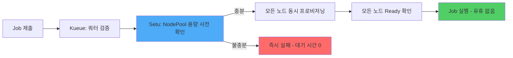

**Setu 작동 방식:**

1. **사전 용량 검증**: Karpenter NodePool에 필요한 노드 용량이 있는지 확인
2. **동시 프로비저닝**: 모든 노드를 동시에 요청 (순차 대기 없음)
3. **Gang Scheduling 보장**: 모든 노드가 Ready 상태가 된 후에만 워크로드 시작
4. **실패 시 즉시 종료**: 용량 부족 시 즉시 실패하여 무의미한 대기 제거

#### Kueue ClusterQueue와 통합

```yaml
apiVersion: kueue.x-k8s.io/v1beta1
kind: ClusterQueue
metadata:
  name: gpu-cluster-queue
spec:
  namespaceSelector: {}
  resourceGroups:
  - coveredResources: ["cpu", "memory", "nvidia.com/gpu"]
    flavors:
    - name: a100-spot
      resources:
      - name: "nvidia.com/gpu"
        nominalQuota: 32  # 4개 노드 × 8 GPU
      - name: "cpu"
        nominalQuota: 384
      - name: "memory"
        nominalQuota: 1536Gi
---
apiVersion: kueue.x-k8s.io/v1beta1
kind: LocalQueue
metadata:
  name: ml-team-queue
  namespace: ml-training
spec:
  clusterQueue: gpu-cluster-queue
---
apiVersion: karpenter.sh/v1
kind: NodePool
metadata:
  name: a100-spot-pool
spec:
  template:
    spec:
      requirements:
      - key: node.kubernetes.io/instance-type
        operator: In
        values: ["p4d.24xlarge"]
      - key: karpenter.sh/capacity-type
        operator: In
        values: ["spot", "on-demand"]
      nodeClassRef:
        name: a100-nodeclass
  disruption:
    consolidationPolicy: WhenEmptyOrUnderutilized
    consolidateAfter: 5m
  # Setu가 이 NodePool의 용량을 사전 검증
  limits:
    cpu: "384"
    memory: "1536Gi"
```

**Setu Controller 동작:**

```yaml
apiVersion: batch/v1
kind: Job
metadata:
  name: llm-training
  namespace: ml-training
  labels:
    kueue.x-k8s.io/queue-name: ml-team-queue
    setu.io/enabled: "true"  # Setu 활성화
spec:
  parallelism: 4  # 4개 노드 필요
  completions: 4
  template:
    spec:
      schedulerName: default-scheduler
      containers:
      - name: trainer
        image: pytorch/pytorch:2.1-cuda12.1
        resources:
          requests:
            nvidia.com/gpu: 8  # 노드당 8 GPU
            memory: 384Gi
          limits:
            nvidia.com/gpu: 8
```

**Setu 동작 흐름:**

1. Job이 Kueue Queue에 진입
2. Kueue가 쿼타 확인 (32 GPU 중 사용 가능 확인)
3. **Setu 개입**: Karpenter NodePool `a100-spot-pool`에서 4개 p4d.24xlarge 노드 프로비저닝 가능 여부 검증
4. **가능하면**: 4개 노드 동시 프로비저닝 요청 + Job은 대기
5. **불가능하면**: Job 즉시 실패 (다른 Queue로 재라우팅 또는 재시도)
6. 모든 노드 Ready 후 Job 스케줄링 → **유휴 GPU 0개**

#### 리소스 효율성 비교

| 상황 | 기존 방식 | Setu 방식 | 절감 효과 |
|------|----------|-----------|----------|
| **4-GPU Job 시작 시간** | 노드 1개씩 프로비저닝 (15분) | 동시 프로비저닝 (7분) | **53% 단축** |
| **유휴 GPU 비용** | 2개 노드 × 10분 대기 = $10.92 | 0 (동시 시작) | **100% 절감** |
| **용량 부족 시 대기** | 10분 대기 후 실패 | 즉시 실패 (0초) | **대기 시간 제거** |
| **Spot 중단 시 재시작** | 부분 노드 재생성 → 유휴 발생 | Gang 보장 재프로비저닝 | **중단 비용 최소화** |

**월간 비용 절감 (100 Job 실행 기준):**
- 유휴 비용 절감: **$32,760/월**
- Cold start 제거: **$16,380/월** (시작 시간 53% 단축)
- **총 절감: $49,140/월**

#### 멀티 테넌트 환경에서 공정성 + 효율성

```yaml
apiVersion: kueue.x-k8s.io/v1beta1
kind: ClusterQueue
metadata:
  name: shared-gpu-queue
spec:
  preemption:
    withinClusterQueue: LowerPriority
    reclaimWithinCohort: Any
  resourceGroups:
  - coveredResources: ["nvidia.com/gpu"]
    flavors:
    - name: a100-80gb
      resources:
      - name: "nvidia.com/gpu"
        nominalQuota: 64
        borrowingLimit: 32  # 다른 팀 유휴 시 32 GPU 추가 사용 가능
---
apiVersion: kueue.x-k8s.io/v1beta1
kind: LocalQueue
metadata:
  name: research-team
  namespace: research
spec:
  clusterQueue: shared-gpu-queue
---
apiVersion: kueue.x-k8s.io/v1beta1
kind: LocalQueue
metadata:
  name: production-team
  namespace: production
spec:
  clusterQueue: shared-gpu-queue
```

**Setu + Kueue 통합 장점:**

1. **공정한 쿼타 관리**: Kueue가 팀별 GPU 할당량 관리
2. **효율적 프로비저닝**: Setu가 NodePool 용량 기반 사전 검증
3. **Borrowing 최적화**: 유휴 GPU를 다른 팀이 사용할 때도 Gang Scheduling 보장
4. **Spot 활용 극대화**: 부분 할당 방지로 Spot 중단 영향 최소화

:::tip Setu 적용 권장 시나리오
- **대규모 GPU 워크로드**: 4+ GPU 필요 시 유휴 비용 심각
- **Spot 인스턴스 사용**: Gang scheduling으로 Spot 중단 대응력 향상
- **멀티 테넌트 환경**: Kueue 공정성 + Karpenter 효율성 동시 확보
- **비용 민감**: GPU 유휴 시간이 월 수천 달러 비용 초래
:::

**참고 자료:**
- [Setu GitHub Repository](https://github.com/sanjeevrg89/Setu)
- [Kueue 공식 문서](https://kueue.sigs.k8s.io/)
- [Karpenter NodePool 설정 가이드](https://karpenter.sh/)

### 7.4 EKS Blueprints IaC 패턴으로 리소스 정책 표준화

Terraform EKS Blueprints를 사용하면 ResourceQuota, LimitRange, Policy Enforcement를 코드로 표준화하여 모든 클러스터에 일관되게 적용할 수 있습니다.

#### Terraform EKS Blueprints AddOn 구조

```hcl
# main.tf - EKS Blueprints로 리소스 정책 자동 배포
module "eks" {
  source  = "terraform-aws-modules/eks/aws"
  version = "~> 20.0"

  cluster_name    = "production-eks"
  cluster_version = "1.31"

  vpc_id     = module.vpc.vpc_id
  subnet_ids = module.vpc.private_subnets

  enable_irsa = true

  eks_managed_node_groups = {
    general = {
      desired_size = 3
      min_size     = 2
      max_size     = 10
      instance_types = ["m6i.xlarge"]
    }
  }
}

# EKS Blueprints AddOns로 리소스 정책 배포
module "eks_blueprints_addons" {
  source  = "aws-ia/eks-blueprints-addons/aws"
  version = "~> 1.16"

  cluster_name      = module.eks.cluster_name
  cluster_endpoint  = module.eks.cluster_endpoint
  cluster_version   = module.eks.cluster_version
  oidc_provider_arn = module.eks.oidc_provider_arn

  # Metrics Server (VPA 사전 요구사항)
  enable_metrics_server = true

  # Karpenter (노드 오토스케일링)
  enable_karpenter = true
  karpenter = {
    repository_username = data.aws_ecrpublic_authorization_token.token.user_name
    repository_password = data.aws_ecrpublic_authorization_token.token.password
  }

  # Kyverno (리소스 정책 강제)
  enable_kyverno = true
  kyverno = {
    values = [templatefile("${path.module}/kyverno-policies.yaml", {
      default_cpu_request    = "100m"
      default_memory_request = "128Mi"
      max_cpu_limit          = "4000m"
      max_memory_limit       = "8Gi"
    })]
  }
}

# ResourceQuota를 Helm Chart로 배포
resource "helm_release" "resource_quotas" {
  name      = "resource-quotas"
  namespace = "kube-system"

  chart = "${path.module}/charts/resource-quotas"

  values = [
    yamlencode({
      quotas = {
        production = {
          cpu    = "100"
          memory = "200Gi"
          pods   = "500"
        }
        staging = {
          cpu    = "50"
          memory = "100Gi"
          pods   = "200"
        }
        development = {
          cpu    = "20"
          memory = "40Gi"
          pods   = "100"
        }
      }
    })
  ]
}
```

#### Kyverno 정책으로 리소스 요청 강제

```yaml
# kyverno-policies.yaml
apiVersion: kyverno.io/v1
kind: ClusterPolicy
metadata:
  name: require-resource-requests
  annotations:
    policies.kyverno.io/title: Require Resource Requests
    policies.kyverno.io/severity: medium
    policies.kyverno.io/description: |
      모든 Pod는 CPU와 Memory requests를 반드시 설정해야 합니다.
spec:
  validationFailureAction: Enforce  # Audit (경고만) 또는 Enforce (차단)
  background: true
  rules:
  - name: check-cpu-memory-requests
    match:
      any:
      - resources:
          kinds:
          - Pod
    validate:
      message: "CPU와 Memory requests는 필수입니다"
      pattern:
        spec:
          containers:
          - resources:
              requests:
                memory: "?*"  # 존재 여부 확인
                cpu: "?*"

  - name: enforce-memory-limits
    match:
      any:
      - resources:
          kinds:
          - Pod
    validate:
      message: "Memory limits는 필수입니다 (OOM Kill 방지)"
      pattern:
        spec:
          containers:
          - resources:
              limits:
                memory: "?*"

  - name: prevent-excessive-resources
    match:
      any:
      - resources:
          kinds:
          - Pod
    validate:
      message: "CPU는 최대 {{ max_cpu_limit }}, Memory는 최대 {{ max_memory_limit }}까지 허용"
      deny:
        conditions:
          any:
          - key: "{{ request.object.spec.containers[].resources.requests.cpu }}"
            operator: GreaterThan
            value: "{{ max_cpu_limit }}"
          - key: "{{ request.object.spec.containers[].resources.requests.memory }}"
            operator: GreaterThan
            value: "{{ max_memory_limit }}"
```

#### OPA Gatekeeper 정책 예시 (대안)

```yaml
# ConstraintTemplate - 리소스 요청 강제
apiVersion: templates.gatekeeper.sh/v1
kind: ConstraintTemplate
metadata:
  name: k8srequireresources
spec:
  crd:
    spec:
      names:
        kind: K8sRequireResources
      validation:
        openAPIV3Schema:
          type: object
          properties:
            exemptNamespaces:
              type: array
              items:
                type: string
  targets:
    - target: admission.k8s.gatekeeper.sh
      rego: |
        package k8srequireresources

        violation[{"msg": msg}] {
          container := input.review.object.spec.containers[_]
          not container.resources.requests.cpu
          msg := sprintf("컨테이너 %v는 CPU requests가 없습니다", [container.name])
        }

        violation[{"msg": msg}] {
          container := input.review.object.spec.containers[_]
          not container.resources.requests.memory
          msg := sprintf("컨테이너 %v는 Memory requests가 없습니다", [container.name])
        }

        violation[{"msg": msg}] {
          container := input.review.object.spec.containers[_]
          not container.resources.limits.memory
          msg := sprintf("컨테이너 %v는 Memory limits가 없습니다 (OOM 위험)", [container.name])
        }

---
# Constraint - ConstraintTemplate 적용
apiVersion: constraints.gatekeeper.sh/v1beta1
kind: K8sRequireResources
metadata:
  name: require-resources-production
spec:
  match:
    kinds:
      - apiGroups: [""]
        kinds: ["Pod"]
    namespaces: ["production", "staging"]
  parameters:
    exemptNamespaces: ["kube-system", "kube-node-lease"]
```

#### GitOps 기반 리소스 정책 관리 패턴

**ArgoCD ApplicationSet으로 환경별 ResourceQuota 배포:**

```yaml
# argocd/applicationset-resource-policies.yaml
apiVersion: argoproj.io/v1alpha1
kind: ApplicationSet
metadata:
  name: resource-policies
  namespace: argocd
spec:
  generators:
  - list:
      elements:
      - env: production
        cpu: "100"
        memory: "200Gi"
        pods: "500"
      - env: staging
        cpu: "50"
        memory: "100Gi"
        pods: "200"
      - env: development
        cpu: "20"
        memory: "40Gi"
        pods: "100"

  template:
    metadata:
      name: "resource-quota-{{env}}"
    spec:
      project: platform
      source:
        repoURL: https://github.com/myorg/k8s-manifests
        targetRevision: main
        path: resource-policies/{{env}}
        helm:
          parameters:
          - name: quota.cpu
            value: "{{cpu}}"
          - name: quota.memory
            value: "{{memory}}"
          - name: quota.pods
            value: "{{pods}}"
      destination:
        server: https://kubernetes.default.svc
        namespace: "{{env}}"
      syncPolicy:
        automated:
          prune: true
          selfHeal: true
```

**리포지토리 구조:**

```
k8s-manifests/
├── resource-policies/
│   ├── production/
│   │   ├── resource-quota.yaml
│   │   ├── limit-range.yaml
│   │   └── kyverno-policies.yaml
│   ├── staging/
│   │   └── ...
│   └── development/
│       └── ...
└── argocd/
    └── applicationset-resource-policies.yaml
```

:::tip EKS Blueprints + GitOps 권장 패턴
1. **Terraform으로 클러스터 프로비저닝** (VPC, EKS, AddOns)
2. **Kyverno/OPA로 정책 강제** (리소스 요청 필수, 과도한 할당 차단)
3. **ArgoCD ApplicationSet으로 환경별 정책 배포** (GitOps)
4. **Prometheus + Grafana로 정책 준수율 모니터링**

이 조합으로 **"클러스터는 Terraform으로, 정책은 Git으로"** 관리하여 인프라 표준화와 운영 자동화를 달성합니다.
:::

## 비용 영향 분석

### 8.1 리소스 낭비 계산

**시나리오:**
- 클러스터: 100개 노드 (m5.2xlarge, $0.384/시간)
- 리소스 효율성: 40% (60% 낭비)

```
월별 비용:
100 노드 × $0.384/시간 × 730시간/월 = $28,032/월

낭비 비용:
$28,032 × 60% = $16,819/월

Right-Sizing 후 (효율성 70%):
필요 노드: 100 × (40% / 70%) = 57 노드
월별 비용: 57 × $0.384 × 730 = $15,978/월
절감액: $28,032 - $15,978 = $12,054/월 (43% 절감)
```

### 8.2 클러스터 효율성 메트릭

```promql
# CPU 효율성
sum(rate(container_cpu_usage_seconds_total{container!=""}[5m]))
/
sum(kube_pod_container_resource_requests{resource="cpu"}) * 100

# Memory 효율성
sum(container_memory_working_set_bytes{container!=""})
/
sum(kube_pod_container_resource_requests{resource="memory"}) * 100

# 목표: CPU 60% 이상, Memory 70% 이상
```

### 8.3 Right-Sizing 절감 효과

| 최적화 항목 | 비용 절감률 | 구현 난이도 | 예상 시간 |
|------------|-----------|-----------|----------|
| VPA 권장사항 적용 | 20-30% | 낮음 | 1-2주 |
| CPU Limits 제거 | 5-10% | 낮음 | 1주 |
| QoS 클래스 최적화 | 10-15% | 중간 | 2-3주 |
| HPA + 적절한 Requests | 15-25% | 중간 | 2-4주 |
| 전체 Right-Sizing | 30-50% | 높음 | 1-3개월 |

### 8.4 FinOps 통합 비용 최적화

FinOps(Financial Operations)는 클라우드 비용 관리를 조직 문화로 정착시키는 방법론입니다. Kubernetes 환경에서는 리소스 가시성, 비용 할당, 지속적 최적화가 핵심입니다.

#### 8.4.1 Kubecost + AWS Cost Explorer 연계

**Kubecost 설치 및 EKS 통합:**

```bash
# 1. Kubecost 설치 (Prometheus 포함)
helm repo add kubecost https://kubecost.github.io/cost-analyzer/
helm repo update

helm install kubecost kubecost/cost-analyzer \
  --namespace kubecost \
  --create-namespace \
  --set kubecostToken="<your-token>" \
  --set prometheus.server.global.external_labels.cluster_id=<cluster-name> \
  --set prometheus.nodeExporter.enabled=true \
  --set prometheus.serviceAccounts.nodeExporter.create=true

# 2. AWS Cost and Usage Report (CUR) 통합 설정
# values.yaml에 추가:
# kubecostProductConfigs:
#   awsServiceKeyName: <secret-name>
#   awsServiceKeyPassword: <secret-key>
#   awsSpotDataBucket: <s3-bucket>
#   awsSpotDataRegion: <region>
#   curExportPath: <cur-export-path>

# 3. 대시보드 접속
kubectl port-forward -n kubecost deployment/kubecost-cost-analyzer 9090:9090

# 브라우저에서 http://localhost:9090 접속
```

**네임스페이스/워크로드별 비용 가시성:**

Kubecost는 다음과 같은 차원으로 비용을 분해합니다:

| 차원 | 설명 | 활용 |
|------|------|------|
| **Namespace** | 네임스페이스별 비용 | 팀/프로젝트별 청구 |
| **Deployment** | 워크로드별 비용 | 애플리케이션별 TCO 분석 |
| **Pod** | 개별 Pod 비용 | Over-provisioning 식별 |
| **Label** | 커스텀 레이블별 비용 | 환경(dev/staging/prod), 비용센터별 분류 |
| **Node** | 노드별 비용 | 인스턴스 타입 최적화 |

**AWS Cost Explorer와의 데이터 일관성 확보:**

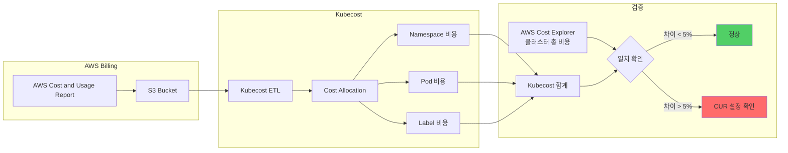

**일관성 검증 쿼리:**

```bash
# Kubecost API - 클러스터 총 비용 (지난 7일)
curl "http://localhost:9090/model/allocation?window=7d&aggregate=cluster" | jq '.data[].totalCost'

# AWS CLI - Cost Explorer 총 비용 (지난 7일)
aws ce get-cost-and-usage \
  --time-period Start=$(date -d '7 days ago' +%Y-%m-%d),End=$(date +%Y-%m-%d) \
  --granularity DAILY \
  --metrics BlendedCost \
  --filter file://eks-filter.json

# eks-filter.json:
# {
#   "Tags": {
#     "Key": "eks:cluster-name",
#     "Values": ["<cluster-name>"]
#   }
# }
```

**20-60% 비용 절감 가능 영역 식별 패턴:**

Kubecost 대시보드에서 다음 지표로 최적화 기회를 식별합니다:

| 지표 | 기준 | 예상 절감 | 조치 |
|------|------|----------|------|
| **CPU Efficiency** | < 50% | 20-30% | Right-Sizing (VPA) |
| **Memory Efficiency** | < 60% | 15-25% | Right-Sizing (VPA) |
| **Idle Cost** | > 30% | 30-50% | HPA + Cluster Autoscaler/Karpenter |
| **Over-Provisioned Pods** | Requests 사용률 < 50% | 10-20% | Goldilocks 권장사항 적용 |
| **Spot Adoption** | < 30% | 40-60% | Spot + Graviton 전환 |

**Kubecost Savings Insights 활용:**

```bash
# Kubecost API - Savings 권장사항 조회
curl "http://localhost:9090/model/savings" | jq '.data[] | {
  type: .savingsType,
  monthly_savings: .monthlySavings,
  resource: .resourceName
}'

# 예상 출력:
# {
#   "type": "rightsize-deployment",
#   "monthly_savings": 1240.50,
#   "resource": "production/web-app"
# }
# {
#   "type": "adopt-spot",
#   "monthly_savings": 3450.20,
#   "resource": "batch/worker-pool"
# }
```

#### 8.4.2 Goldilocks vs Kubecost 도구 비교

| 항목 | Goldilocks | Kubecost |
|------|-----------|----------|
| **주요 기능** | VPA 권장사항 시각화 | 전체 비용 가시성 + 최적화 권장사항 |
| **비용** | 무료 (오픈소스) | 무료 (기본), Enterprise (유료) |
| **설치 복잡도** | 낮음 (Helm 1줄) | 중간 (Prometheus 설정 필요) |
| **데이터 소스** | Metrics Server, VPA | Prometheus, AWS CUR, 클라우드 빌링 API |
| **권장사항 범위** | CPU/Memory Right-Sizing | Right-Sizing, Spot, Graviton, Idle Resource, Cluster Sizing |
| **비용 할당** | 없음 | Namespace, Label, Pod, Deployment 레벨 |
| **예산 관리** | 없음 | 예산 알람, 비용 추세 예측 |
| **멀티 클러스터** | 클러스터별 독립 | 통합 대시보드 지원 |
| **AWS 통합** | 없음 | Cost Explorer, CUR, Savings Plans 분석 |
| **리포트** | 웹 UI만 | PDF, CSV, Slack/Teams 알람 |

**추천 시나리오:**

| 상황 | 추천 도구 | 이유 |
|------|----------|------|
| **단일 클러스터, 리소스 최적화만** | Goldilocks | 가볍고 빠른 시작 |
| **멀티 클러스터, 비용 청구** | Kubecost | 전사적 비용 관리 필요 |
| **스타트업, 빠른 절감 필요** | Goldilocks → Kubecost | 단계적 도입 |
| **엔터프라이즈, FinOps 팀 존재** | Kubecost Enterprise | 고급 기능 (예산, 알람, 정책) |
| **오픈소스만 사용** | Goldilocks + Prometheus | 비용 0원 |

**병행 사용 패턴:**

```bash
# Goldilocks로 빠른 Right-Sizing
kubectl label namespace production goldilocks.fairwinds.com/enabled=true

# Kubecost로 전체 비용 추적 및 검증
# 1. Goldilocks 권장사항 적용 전 비용 기록
curl "http://localhost:9090/model/allocation?window=7d&aggregate=namespace&accumulate=true" \
  | jq '.data[] | select(.name=="production") | .totalCost'

# 2. Right-Sizing 적용
kubectl set resources deployment web-app -n production \
  --requests=cpu=300m,memory=512Mi \
  --limits=memory=1Gi

# 3. 7일 후 Kubecost에서 절감액 확인
```

#### 8.4.3 자동화된 비용 최적화 루프

FinOps의 핵심은 **지속적인 비용 가시성 → 최적화 → 검증 루프**입니다. GitOps와 결합하면 완전 자동화가 가능합니다.

**비용 최적화 루프 아키텍처:**

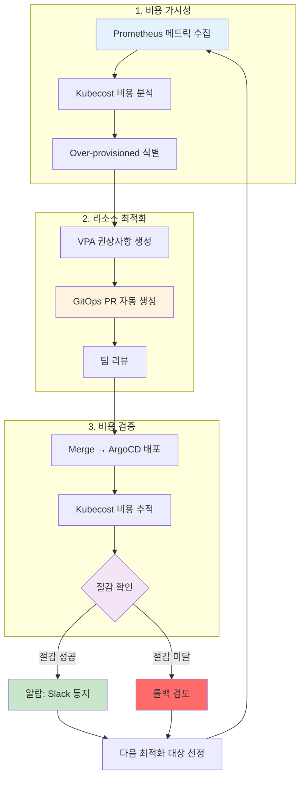

**GitOps 기반 자동 Right-Sizing PR 생성 패턴:**

```python
# automation/right-sizing-bot.py
import requests
import yaml
import subprocess
from datetime import datetime

# 1. Kubecost API에서 권장사항 조회
def get_kubecost_recommendations():
    response = requests.get("http://kubecost:9090/model/savings")
    savings = response.json()["data"]
    return [s for s in savings if s["savingsType"] == "rightsize-deployment"]

# 2. Deployment 매니페스트 업데이트
def update_deployment(namespace, name, cpu_request, memory_request):
    file_path = f"k8s/{namespace}/{name}.yaml"
    with open(file_path, 'r') as f:
        manifest = yaml.safe_load(f)

    # 리소스 업데이트
    manifest["spec"]["template"]["spec"]["containers"][0]["resources"] = {
        "requests": {
            "cpu": cpu_request,
            "memory": memory_request
        },
        "limits": {
            "memory": str(int(memory_request.rstrip('Mi')) * 1.5) + 'Mi'
        }
    }

    with open(file_path, 'w') as f:
        yaml.dump(manifest, f)

# 3. Git PR 생성
def create_pr(recommendations):
    branch = f"right-sizing-{datetime.now().strftime('%Y%m%d')}"
    subprocess.run(["git", "checkout", "-b", branch])

    for rec in recommendations:
        update_deployment(
            rec["namespace"],
            rec["resourceName"],
            rec["recommendedCPU"],
            rec["recommendedMemory"]
        )
        subprocess.run(["git", "add", f"k8s/{rec['namespace']}/{rec['resourceName']}.yaml"])

    subprocess.run([
        "git", "commit", "-m",
        f"chore: apply Kubecost right-sizing (estimated savings: ${sum(r['monthlySavings'] for r in recommendations):.2f}/month)"
    ])
    subprocess.run(["git", "push", "origin", branch])

    # GitHub PR 생성
    subprocess.run([
        "gh", "pr", "create",
        "--title", f"Cost Optimization: Right-Sizing Recommendations",
        "--body", f"Estimated monthly savings: ${sum(r['monthlySavings'] for r in recommendations):.2f}\n\nAuto-generated by Kubecost",
        "--label", "cost-optimization"
    ])

# 실행
if __name__ == "__main__":
    recommendations = get_kubecost_recommendations()
    if recommendations:
        create_pr(recommendations)
```

**자동화 실행 (CronJob):**

```yaml
apiVersion: batch/v1
kind: CronJob
metadata:
  name: right-sizing-bot
  namespace: automation
spec:
  schedule: "0 9 * * MON"  # 매주 월요일 오전 9시
  jobTemplate:
    spec:
      template:
        spec:
          serviceAccountName: right-sizing-bot
          containers:
          - name: bot
            image: right-sizing-bot:v1
            env:
            - name: KUBECOST_URL
              value: "http://kubecost.kubecost.svc:9090"
            - name: GITHUB_TOKEN
              valueFrom:
                secretKeyRef:
                  name: github-token
                  key: token
          restartPolicy: OnFailure
```

**Prometheus + Bedrock + GitOps 자동화 참조:**

AWS re:Invent 2025의 [CNS421 세션](https://www.youtube.com/watch?v=4s-a0jY4kSE)에서는 Amazon Bedrock과 Model Context Protocol(MCP)을 활용한 고급 자동화 패턴을 소개했습니다:

```python
# 고급 패턴: AI 기반 최적화 의사결정
from anthropic import Anthropic

client = Anthropic()

# Prometheus 메트릭 수집
metrics = get_prometheus_metrics()

# Bedrock에게 최적화 전략 요청
response = client.messages.create(
    model="claude-3-sonnet-20240229",
    max_tokens=1024,
    messages=[{
        "role": "user",
        "content": f"""
        다음 Kubernetes 클러스터 메트릭을 분석하고 최적화 전략을 제안하세요:

        {metrics}

        다음을 포함하세요:
        1. 비용 절감 우선순위
        2. 리스크 평가
        3. 단계별 실행 계획
        """
    }]
)

# AI 제안을 PR 설명에 포함
create_pr_with_ai_context(response.content)
```

#### 8.4.4 Graviton + Spot 비용 절감 시나리오

**실제 비용 비교 표 (2026년 2월 기준, us-east-1):**

| 시나리오 | 인스턴스 타입 | vCPU | Memory | 시간당 비용 | 월간 비용 (730h) | 절감률 |
|---------|-------------|------|--------|-----------|-----------------|--------|
| **Baseline: x86 On-Demand** | m6i.2xlarge | 8 | 32 GB | $0.384 | $280.32 | - |
| **Graviton On-Demand** | m7g.2xlarge | 8 | 32 GB | $0.3264 | $238.27 | **15%** |
| **x86 Spot** | m6i.2xlarge | 8 | 32 GB | $0.1152 (70% 할인) | $84.10 | **70%** |
| **Graviton Spot** | m7g.2xlarge | 8 | 32 GB | $0.0979 (70% 할인) | $71.47 | **75%** |

**100개 노드 클러스터 기준 연간 비용:**

| 구성 | 월간 비용 | 연간 비용 | 연간 절감액 |
|------|----------|----------|-----------|
| x86 On-Demand (100 nodes) | $28,032 | $336,384 | - |
| Graviton On-Demand (100 nodes) | $23,827 | $285,924 | $50,460 (15%) |
| x86 Spot (100 nodes) | $8,410 | $100,920 | $235,464 (70%) |
| **Graviton Spot (100 nodes)** | **$7,147** | **$85,764** | **$250,620 (75%)** ⭐ |

**워크로드 유형별 권장 조합:**

| 워크로드 유형 | 권장 구성 | 이유 | 예상 절감 |
|-------------|----------|------|----------|
| **프로덕션 API (상시)** | Graviton On-Demand 70% + Graviton Spot 30% | 안정성 우선, 일부 Spot 활용 | 25-35% |
| **배치 작업** | Graviton Spot 100% | 중단 허용, 비용 최우선 | 70-75% |
| **개발/스테이징** | Graviton Spot 100% | 중단 허용, 빠른 재시작 | 70-75% |
| **데이터베이스** | Graviton On-Demand 100% | 중단 불가, 안정성 최우선 | 15% |
| **큐 워커 (Stateless)** | Graviton Spot 80% + Graviton On-Demand 20% | 중단 시 재시작, 대부분 Spot | 60-65% |
| **ML 추론** | Graviton Spot 100% (GPU 워크로드는 p4d Spot) | 중단 허용, 고비용 인스턴스 절감 | 70-75% |

**Karpenter NodePool에서 Graviton 우선 설정 YAML:**

```yaml
# Production API - Graviton 우선, Spot/On-Demand 혼합
apiVersion: karpenter.sh/v1beta1
kind: NodePool
metadata:
  name: production-api-pool
spec:
  template:
    spec:
      requirements:
      # Graviton 우선
      - key: kubernetes.io/arch
        operator: In
        values: ["arm64"]

      # Spot 70%, On-Demand 30% (가중치로 제어)
      - key: karpenter.sh/capacity-type
        operator: In
        values: ["spot", "on-demand"]

      # 범용 워크로드용 인스턴스 패밀리
      - key: node.kubernetes.io/instance-type
        operator: In
        values: ["m7g.large", "m7g.xlarge", "m7g.2xlarge"]

      nodeClassRef:
        name: default

  # Spot 중단 시 자동 교체
  disruption:
    consolidationPolicy: WhenUnderutilized
    expireAfter: 720h

  limits:
    cpu: "200"
    memory: "400Gi"

  weight: 100  # 최고 우선순위

---
# Batch Jobs - Graviton Spot 100%
apiVersion: karpenter.sh/v1beta1
kind: NodePool
metadata:
  name: batch-jobs-pool
spec:
  template:
    spec:
      requirements:
      - key: kubernetes.io/arch
        operator: In
        values: ["arm64"]

      - key: karpenter.sh/capacity-type
        operator: In
        values: ["spot"]  # Spot만

      - key: node.kubernetes.io/instance-type
        operator: In
        values: ["c7g.large", "c7g.xlarge", "c7g.2xlarge", "c7g.4xlarge"]

      nodeClassRef:
        name: default

      # Batch 작업용 Taints
      taints:
      - key: workload-type
        value: batch
        effect: NoSchedule

  disruption:
    consolidationPolicy: WhenUnderutilized
    expireAfter: 1h  # 배치 작업은 짧은 수명

  limits:
    cpu: "500"

  weight: 50

---
# Database - Graviton On-Demand 100%
apiVersion: karpenter.sh/v1beta1
kind: NodePool
metadata:
  name: database-pool
spec:
  template:
    spec:
      requirements:
      - key: kubernetes.io/arch
        operator: In
        values: ["arm64"]

      - key: karpenter.sh/capacity-type
        operator: In
        values: ["on-demand"]  # On-Demand만

      # 메모리 최적화 인스턴스
      - key: node.kubernetes.io/instance-type
        operator: In
        values: ["r7g.xlarge", "r7g.2xlarge", "r7g.4xlarge"]

      nodeClassRef:
        name: default

      taints:
      - key: workload-type
        value: database
        effect: NoSchedule

  disruption:
    consolidationPolicy: WhenEmpty  # 비어있을 때만 교체
    expireAfter: 2160h  # 90일 (장기 실행)

  limits:
    cpu: "100"
    memory: "800Gi"

  weight: 200  # 가장 높은 우선순위
```

**Pod에서 NodePool 선택:**

```yaml
# API 서버 - production-api-pool 사용
apiVersion: apps/v1
kind: Deployment
metadata:
  name: api-server
spec:
  replicas: 20
  template:
    spec:
      nodeSelector:
        karpenter.sh/nodepool: production-api-pool
      containers:
      - name: api
        image: api-server:v1-arm64  # Graviton용 이미지
        resources:
          requests:
            cpu: "500m"
            memory: "1Gi"

---
# 배치 작업 - batch-jobs-pool 사용
apiVersion: batch/v1
kind: CronJob
metadata:
  name: nightly-report
spec:
  schedule: "0 2 * * *"
  jobTemplate:
    spec:
      template:
        spec:
          nodeSelector:
            karpenter.sh/nodepool: batch-jobs-pool
          tolerations:
          - key: workload-type
            operator: Equal
            value: batch
            effect: NoSchedule
          containers:
          - name: report-gen
            image: report-generator:v1-arm64
            resources:
              requests:
                cpu: "2000m"
                memory: "4Gi"
          restartPolicy: OnFailure

---
# 데이터베이스 - database-pool 사용
apiVersion: apps/v1
kind: StatefulSet
metadata:
  name: postgres
spec:
  replicas: 3
  template:
    spec:
      nodeSelector:
        karpenter.sh/nodepool: database-pool
      tolerations:
      - key: workload-type
        operator: Equal
        value: database
        effect: NoSchedule
      containers:
      - name: postgres
        image: postgres:16-arm64
        resources:
          requests:
            cpu: "4000m"
            memory: "16Gi"
          limits:
            cpu: "4000m"
            memory: "16Gi"  # Guaranteed QoS
```

**Spot 중단 대응 전략:**

```yaml
# PodDisruptionBudget으로 최소 가용성 보장
apiVersion: policy/v1
kind: PodDisruptionBudget
metadata:
  name: api-server-pdb
spec:
  minAvailable: 80%  # 최소 80% Pod 유지
  selector:
    matchLabels:
      app: api-server

---
# Spot 중단 2분 전 알림 처리 (DaemonSet)
apiVersion: apps/v1
kind: DaemonSet
metadata:
  name: spot-termination-handler
spec:
  selector:
    matchLabels:
      app: spot-termination-handler
  template:
    spec:
      serviceAccountName: spot-termination-handler
      containers:
      - name: handler
        image: aws/aws-node-termination-handler:v1.21.0
        env:
        - name: ENABLE_SPOT_INTERRUPTION_DRAINING
          value: "true"
        - name: ENABLE_SCHEDULED_EVENT_DRAINING
          value: "true"
```

**실제 절감 사례 (AWS 공식 블로그):**

| 조직 | 워크로드 | 이전 구성 | 최적화 후 | 절감액 |
|------|---------|----------|----------|--------|
| Fintech 스타트업 | API 서버 100 nodes | x86 On-Demand | Graviton Spot 70% + On-Demand 30% | $8,500/월 (30%) |
| 이커머스 기업 | 배치 작업 200 nodes | x86 On-Demand | Graviton Spot 100% | $42,000/월 (75%) |
| SaaS 플랫폼 | 전체 클러스터 300 nodes | x86 혼합 | Graviton 90% + Spot 60% | $65,000/월 (65%) |

:::tip Auto Mode에서의 Graviton + Spot
EKS Auto Mode는 위와 같은 NodePool 구성 없이도, Pod의 리소스 요구사항을 분석하여 **자동으로 Graviton Spot 인스턴스를 우선 선택**합니다. 단, 컨테이너 이미지가 arm64 아키텍처를 지원해야 합니다.

```yaml
# Auto Mode 환경 - NodePool 불필요
apiVersion: apps/v1
kind: Deployment
metadata:
  name: api-server
spec:
  replicas: 20
  template:
    spec:
      containers:
      - name: api
        image: api-server:v1  # multi-arch 이미지 (arm64/amd64 모두 지원)
        resources:
          requests:
            cpu: "500m"
            memory: "1Gi"

      # Auto Mode가 자동으로:
      # 1. Graviton Spot 우선 시도
      # 2. Spot 불가 시 Graviton On-Demand
      # 3. Graviton 불가 시 x86 Spot
      # 4. 최후 x86 On-Demand
```
:::

:::info 전체 비용 전략은 cost-management.md 참조
이 문서는 Pod 리소스 최적화에 집중합니다. 클러스터 전체 비용 관리 전략은 [EKS 비용 관리 가이드](/docs/infrastructure-optimization/cost-management)를 참조하세요.
:::

## 종합 체크리스트 & 참고 자료

### 리소스 설정 체크리스트

| 항목 | 확인 사항 | 권장 설정 |
|------|----------|----------|
| **CPU Requests** | ✅ P95 사용량 + 20% | VPA Target 기반 |
| **CPU Limits** | ✅ 일반 워크로드는 미설정 | 배치 작업만 설정 |
| **Memory Requests** | ✅ P95 사용량 + 20% | VPA Target 기반 |
| **Memory Limits** | ✅ 반드시 설정 | Requests × 1.5~2 |
| **QoS 클래스** | ✅ 프로덕션은 Guaranteed/Burstable | BestEffort 금지 |
| **VPA** | ✅ Off 또는 Initial 모드 | Auto 모드 신중 |
| **HPA** | ✅ Behavior 설정 | ScaleUp 공격적, ScaleDown 보수적 |
| **ResourceQuota** | ✅ 네임스페이스별 설정 | 환경별 차등 적용 |
| **LimitRange** | ✅ 기본값 설정 | 개발자 편의성 |
| **PDB** | ✅ VPA Auto 사용 시 필수 | minAvailable 80% |

### 관련 문서

**내부 문서:**
- [Karpenter 오토스케일링](/docs/infrastructure-optimization/karpenter-autoscaling) - 노드 레벨 스케일링
- [EKS 비용 관리](/docs/infrastructure-optimization/cost-management) - 전체 비용 최적화 전략
- [EKS Resiliency 가이드](/docs/operations-observability/eks-resiliency-guide) - 안정성 체크리스트

**외부 참조:**
- [Kubernetes Resource Management](https://kubernetes.io/docs/concepts/configuration/manage-resources-containers/)
- [Vertical Pod Autoscaler](https://github.com/kubernetes/autoscaler/tree/master/vertical-pod-autoscaler)
- [AWS EKS Best Practices - Resource Management](https://docs.aws.amazon.com/eks/latest/best-practices/reliability.html)
- [Goldilocks](https://github.com/FairwindsOps/goldilocks)
- [CAST.ai Resource Optimization](https://cast.ai/blog/kubernetes-resource-optimization/)

**Red Hat OpenShift 문서:**
- [Automatically Scaling Pods with HPA](https://docs.openshift.com/container-platform/4.18/nodes/pods/nodes-pods-autoscaling.html) — HPA 구성 및 운영
- [Vertical Pod Autoscaler](https://docs.openshift.com/container-platform/4.18/nodes/pods/nodes-pods-vertical-autoscaler.html) — VPA 모드별 설정 및 운영
- [Quotas and Limit Ranges](https://docs.openshift.com/container-platform/4.18/applications/quotas/quotas-setting-per-project.html) — ResourceQuota, LimitRange 설정
- [Using CPU Manager](https://docs.openshift.com/container-platform/4.18/scalability_and_performance/using-cpu-manager.html) — CPU 리소스 고급 관리

---

**피드백 및 기여**

이 문서에 대한 피드백이나 개선 제안은 [GitHub Issues](https://github.com/devfloor9/engineering-playbook/issues)에 등록해주세요.

**문서 버전**: v1.0 (2026-02-12)
**다음 리뷰**: 2026-05-12
