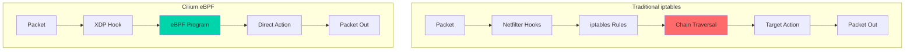
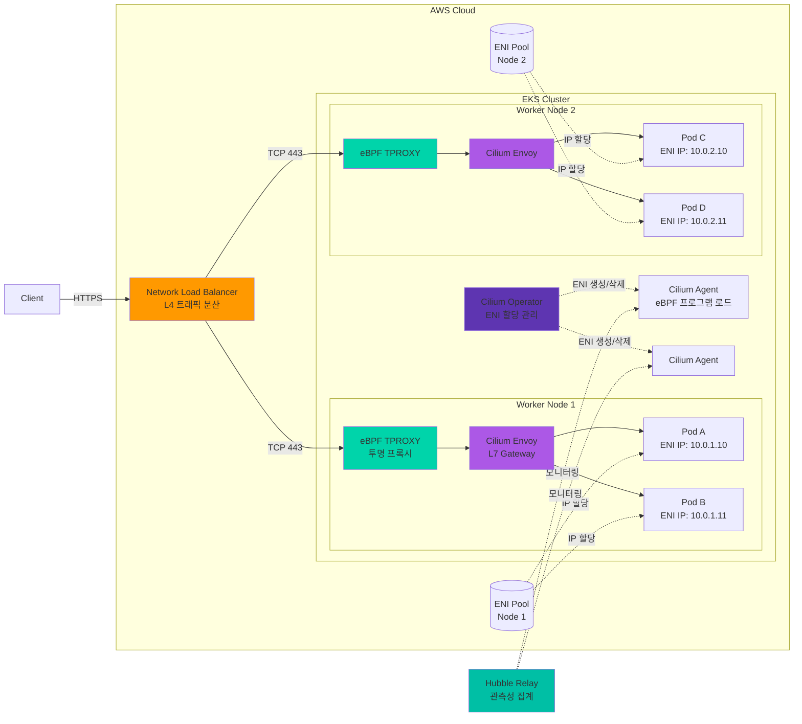
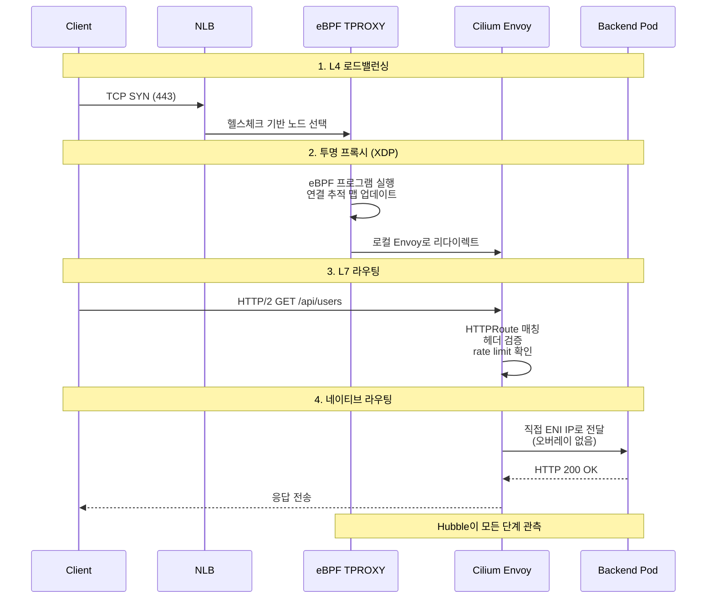
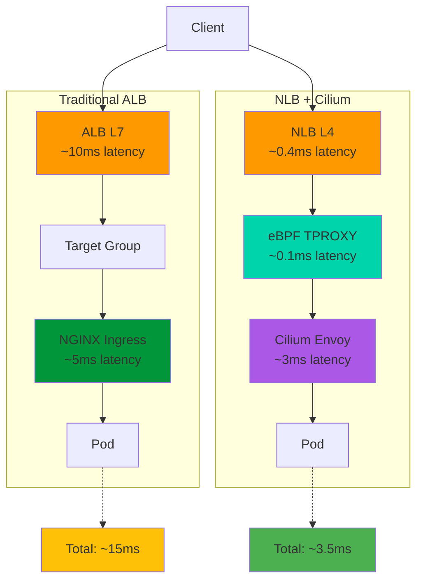
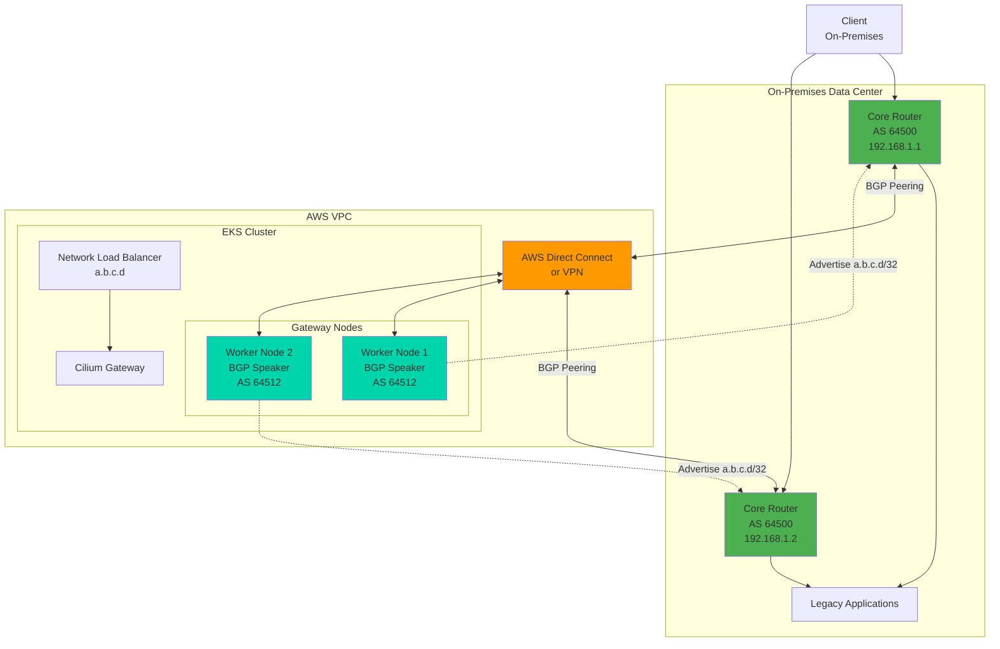
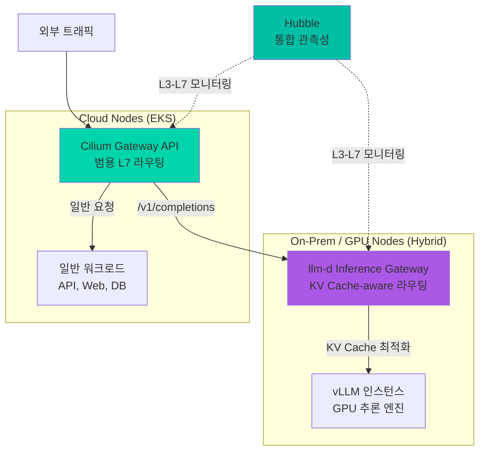

import Tabs from '@theme/Tabs';
import TabItem from '@theme/TabItem';
import { EksRequirementsTable, InstanceTypeTable, LatencyComparisonTable, AlgorithmComparisonTable } from '@site/src/components/GatewayApiTables';

:::info
이 문서는 [Gateway API 도입 가이드](/docs/infrastructure-optimization/gateway-api-adoption-guide)의 심화 가이드입니다. Cilium ENI 모드와 Gateway API를 결합한 고성능 네트워킹 구성에 대한 실전 가이드를 제공합니다.
:::

Cilium ENI 모드는 AWS의 Elastic Network Interface를 직접 활용하여 파드에 VPC IP 주소를 할당하는 고성능 네트워킹 솔루션입니다. Gateway API와 결합하면 표준화된 L7 라우팅과 eBPF 기반 초저지연 처리를 동시에 달성할 수 있습니다.

## 1. Cilium ENI 모드란?

Cilium ENI 모드는 AWS의 Elastic Network Interface를 직접 활용하여 파드에 VPC IP 주소를 할당하는 고성능 네트워킹 솔루션입니다. 전통적인 오버레이 네트워크와 달리, ENI 모드는 다음과 같은 특징을 제공합니다.

### 핵심 특징

**AWS ENI 직접 사용**<br/>
각 파드가 VPC의 실제 IP 주소를 직접 할당받아 AWS 네트워크 스택과 완전히 통합됩니다. 이를 통해 Security Groups, NACLs, VPC Flow Logs 등 AWS 네이티브 네트워킹 기능을 파드 레벨에서 직접 활용할 수 있습니다.

**eBPF 기반 고성능 네트워킹**<br/>
Cilium은 리눅스 커널의 eBPF(extended Berkeley Packet Filter) 기술을 활용하여 패킷 처리를 커널 레벨에서 수행합니다. 이는 전통적인 iptables 기반 솔루션 대비 10배 이상의 성능 향상을 제공하며, CPU 오버헤드를 최소화합니다.



**네이티브 라우팅 (오버레이 오버헤드 제거)**<br/>
VXLAN이나 Geneve와 같은 오버레이 캡슐화를 사용하지 않고, VPC 라우팅 테이블을 직접 활용합니다. 이를 통해 네트워크 홉을 최소화하고 MTU 문제를 원천적으로 방지합니다.

:::tip
Cilium ENI 모드는 AWS EKS에서 최고 성능을 달성하기 위한 권장 구성입니다. Datadog의 벤치마크에 따르면, ENI 모드는 오버레이 모드 대비 레이턴시를 40% 감소시키고 처리량을 35% 향상시킵니다.
:::

## 2. 아키텍처 오버뷰

Cilium ENI 모드와 Gateway API를 결합한 아키텍처는 다음과 같이 구성됩니다.



### 주요 구성 요소

**1. Network Load Balancer (NLB)**
- AWS의 관리형 L4 로드밸런서
- 극히 낮은 레이턴시 (마이크로초 단위)
- Cross-Zone Load Balancing 지원
- Static IP 또는 Elastic IP 할당 가능
- TLS 패스스루 모드 지원

**2. eBPF TPROXY (Transparent Proxy)**
- XDP (eXpress Data Path) 계층에서 패킷 가로채기
- 커널 우회를 통한 초저지연 처리
- 연결 추적 테이블을 eBPF 맵으로 관리
- CPU 코어당 독립적인 처리 (락 없는 설계)

**3. Cilium Envoy (L7 Gateway)**
- Envoy Proxy 기반 L7 처리 엔진
- HTTPRoute, TLSRoute 등 Gateway API 리소스 구현
- 동적 리스너/라우트 구성 (xDS API)
- 요청/응답 변환, 헤더 조작, rate limiting

**4. Cilium Operator**
- ENI 생성 및 삭제 오케스트레이션
- IP 주소 풀 관리 (Prefix Delegation 포함)
- 클러스터 전체 정책 동기화
- CiliumNode CRD 상태 관리

**5. Cilium Agent (DaemonSet)**
- 각 노드에서 eBPF 프로그램 로드 및 관리
- CNI 플러그인 구현
- 엔드포인트 상태 추적
- 네트워크 정책 적용

**6. ENI (Elastic Network Interface)**
- AWS VPC 네트워크 인터페이스
- 인스턴스 타입별 최대 ENI 수 제한 (예: m5.large = 3개)
- ENI당 최대 IP 수 제한 (예: m5.large = 10개/ENI)
- Prefix Delegation 사용 시 ENI당 최대 16개 /28 블록

**7. Hubble (Observability)**
- 네트워크 플로우 실시간 가시화
- 서비스 간 의존성 맵 자동 생성
- L7 프로토콜 가시성 (HTTP, gRPC, Kafka, DNS)
- Prometheus 메트릭 내보내기

### 트래픽 흐름 4단계



**단계 1: L4 로드밸런싱 (NLB)**
- 클라이언트의 TCP 연결 요청을 수신
- Target Group의 헬스체크 상태를 기반으로 정상 노드 선택
- Flow Hash 알고리즘으로 연결 고정성 유지 (5-tuple 기반)

**단계 2: 투명 프록시 (eBPF TPROXY)**
- XDP 훅에서 패킷을 가로채고 연결 추적 맵 조회
- 신규 연결인 경우 로컬 Envoy 리스너로 투명하게 리다이렉트
- 기존 연결인 경우 맵에서 목적지 정보를 읽어 빠른 전달
- 모든 처리가 커널 공간에서 완료되어 컨텍스트 스위칭 없음

**단계 3: L7 라우팅 (Cilium Envoy)**
- HTTP/2 프로토콜 파싱 및 요청 헤더 추출
- HTTPRoute 규칙 매칭 (경로, 헤더, 쿼리 파라미터)
- 요청 변환 (URL rewrite, 헤더 추가/제거)
- rate limiting, 인증/인가 정책 적용

**단계 4: 네이티브 라우팅**
- 백엔드 파드의 ENI IP 주소로 직접 전달
- VXLAN/Geneve 캡슐화 없이 VPC 라우팅 테이블 사용
- EC2 인스턴스의 소스/대상 확인 비활성화 필요 없음
- 응답 패킷도 동일한 경로로 역방향 전달

:::info
이 아키텍처에서 Cilium Envoy는 Gateway API의 `GatewayClass` 구현체 역할을 수행합니다. `HTTPRoute` 리소스의 변경사항은 Cilium Operator가 감지하여 각 노드의 Envoy 구성을 동적으로 업데이트합니다.
:::

## 3. 사전 요구사항

Cilium ENI 모드를 성공적으로 배포하기 위해서는 다음 요구사항을 충족해야 합니다.

### EKS 클러스터 요구사항

<EksRequirementsTable />

:::warning
신규 클러스터를 생성할 때 반드시 `--bootstrapSelfManagedAddons false` 플래그를 사용해야 합니다. 이를 통해 AWS VPC CNI가 자동 설치되지 않으며, Cilium을 클린하게 배포할 수 있습니다.

기존 클러스터에서는 VPC CNI를 제거하는 과정에서 파드 네트워크 연결이 끊기므로, **다운타임을 감수해야 합니다**.
:::

### VPC/서브넷 요구사항

**IP 주소 가용성**<br/>
ENI 모드에서는 각 파드가 VPC의 실제 IP 주소를 사용하므로, 충분한 IP 주소 공간이 필요합니다.

```bash
# 필요한 IP 주소 수 계산 공식
총_필요_IP = (워커노드수 × 노드당_최대파드수) + 여유분(20%)

# 예시: 10개 노드, 노드당 최대 110개 파드
# 총 필요 IP = (10 × 110) × 1.2 = 1,320개
# 권장 서브넷: /21 (2,048개 IP) 이상
```

**서브넷 구성**
- 각 가용 영역(AZ)별로 최소 1개의 서브넷 필요
- 서브넷 태그 필수:
  ```
  kubernetes.io/role/internal-elb = 1
  kubernetes.io/cluster/<클러스터명> = shared
  ```
- Public/Private 서브넷 모두 사용 가능
- Private 서브넷 권장 (보안 강화)

**VPC 설정**
- DNS 호스트 이름 활성화: `enableDnsHostnames: true`
- DNS 지원 활성화: `enableDnsSupport: true`
- DHCP 옵션 세트에 올바른 도메인 이름 설정

### IAM 권한

Cilium Operator와 Node가 ENI를 관리하기 위해서는 다음 IAM 권한이 필요합니다.

```json
{
  "Version": "2012-10-17",
  "Statement": [
    {
      "Effect": "Allow",
      "Action": [
        "ec2:CreateNetworkInterface",
        "ec2:AttachNetworkInterface",
        "ec2:DeleteNetworkInterface",
        "ec2:DetachNetworkInterface",
        "ec2:DescribeNetworkInterfaces",
        "ec2:DescribeInstances",
        "ec2:ModifyNetworkInterfaceAttribute",
        "ec2:AssignPrivateIpAddresses",
        "ec2:UnassignPrivateIpAddresses",
        "ec2:DescribeSubnets",
        "ec2:DescribeSecurityGroups",
        "ec2:CreateTags"
      ],
      "Resource": "*"
    }
  ]
}
```

**IRSA (IAM Roles for Service Accounts) 구성**

```bash
# Cilium Operator용 IAM 역할 생성
eksctl create iamserviceaccount \
  --name cilium-operator \
  --namespace kube-system \
  --cluster <클러스터명> \
  --role-name CiliumOperatorRole \
  --attach-policy-arn arn:aws:iam::aws:policy/AmazonEKS_CNI_Policy \
  --approve

# 추가 인라인 정책 연결
aws iam put-role-policy \
  --role-name CiliumOperatorRole \
  --policy-name CiliumENIPolicy \
  --policy-document file://cilium-eni-policy.json
```

**노드 IAM 역할에 권한 추가**

```bash
# 노드 그룹의 IAM 역할 ARN 확인
NODE_ROLE=$(aws eks describe-nodegroup \
  --cluster-name <클러스터명> \
  --nodegroup-name <노드그룹명> \
  --query 'nodegroup.nodeRole' \
  --output text)

# 정책 연결
aws iam attach-role-policy \
  --role-name $(echo $NODE_ROLE | cut -d'/' -f2) \
  --policy-arn arn:aws:iam::aws:policy/AmazonEKS_CNI_Policy
```

:::tip EKS Auto Mode와 Cilium 관계

**EKS Auto Mode** (2024년 11월 출시)는 노드 프로비저닝, 컴퓨팅 용량 관리, 보안 패치를 자동화하는 EKS의 새로운 운영 모드입니다.

**Cilium과의 호환성:**
- ✅ **호환 가능**: EKS Auto Mode는 CNI 플러그인 선택을 제한하지 않음
- ✅ **Karpenter 통합**: Auto Mode의 노드 프로비저닝은 Karpenter 기반이므로, Cilium ENI 모드와 자연스럽게 통합
- ⚠️ **주의사항**: Auto Mode에서는 `--bootstrapSelfManagedAddons false` 플래그가 기본값이므로, VPC CNI 충돌 없음
- 📊 **모니터링**: Auto Mode의 관리형 모니터링은 Hubble 메트릭과 병행 사용 가능

**권장 사항:**
- 신규 프로젝트: EKS Auto Mode + Cilium ENI 조합 권장
- 기존 클러스터: 수동 관리에서 Auto Mode로 마이그레이션 시 Cilium 재배포 불필요
:::

## 4. 설치 흐름

Cilium ENI 모드의 설치 방법은 클러스터가 신규인지 기존인지에 따라 다릅니다.

### 신규 클러스터 (권장)

신규 클러스터에서는 VPC CNI가 설치되지 않은 상태에서 Cilium을 배포하므로 다운타임 없이 클린한 설치가 가능합니다.

**Step 1: EKS 클러스터 생성 (VPC CNI 비활성화)**

```bash
# eksctl을 사용한 클러스터 생성
cat <<EOF > cluster-config.yaml
apiVersion: eksctl.io/v1alpha5
kind: ClusterConfig

metadata:
  name: cilium-gateway-cluster
  region: ap-northeast-2
  version: "1.32"

vpc:
  cidr: 10.0.0.0/16
  nat:
    gateway: HighlyAvailable  # NAT Gateway 다중화

# VPC CNI 자동 설치 비활성화 (핵심!)
addonsConfig:
  autoApplyPodIdentityAssociations: false

managedNodeGroups:
  - name: ng-1
    instanceType: m7g.xlarge
    desiredCapacity: 3
    minSize: 3
    maxSize: 10
    volumeSize: 100
    privateNetworking: true
    iam:
      withAddonPolicies:
        autoScaler: true
        albIngress: true
        cloudWatch: true
    labels:
      role: worker
    tags:
      nodegroup-name: ng-1

# kube-proxy 비활성화 (Cilium이 대체)
kubeProxy:
  disable: true
EOF

# 클러스터 생성 (10-15분 소요)
eksctl create cluster -f cluster-config.yaml --bootstrapSelfManagedAddons false
```

:::warning
`--bootstrapSelfManagedAddons false` 플래그를 **반드시** 포함해야 합니다. 이 플래그가 없으면 VPC CNI가 자동 설치되어 Cilium과 충돌합니다.
:::

**Step 2: Gateway API CRDs 설치**

```bash
# Gateway API v1.4.0 표준 CRDs 설치
kubectl apply -f https://github.com/kubernetes-sigs/gateway-api/releases/download/v1.4.0/standard-install.yaml

# 설치 확인
kubectl get crd | grep gateway
```

**출력 예시:**
```
gatewayclasses.gateway.networking.k8s.io         2026-02-12T00:00:00Z
gateways.gateway.networking.k8s.io               2026-02-12T00:00:00Z
httproutes.gateway.networking.k8s.io             2026-02-12T00:00:00Z
referencegrants.gateway.networking.k8s.io        2026-02-12T00:00:00Z
```

**Step 3: Cilium Helm 저장소 추가**

```bash
helm repo add cilium https://helm.cilium.io/
helm repo update
```

**Step 4: Cilium Helm 설치**

```yaml
# cilium-values.yaml
# ENI 모드 활성화
eni:
  enabled: true
  awsEnablePrefixDelegation: true  # /28 Prefix Delegation
  awsReleaseExcessIPs: true        # 미사용 IP 자동 해제
  updateEC2AdapterLimitViaAPI: true
  iamRole: "arn:aws:iam::123456789012:role/CiliumOperatorRole"

# IPAM 모드를 ENI로 설정
ipam:
  mode: "eni"
  operator:
    clusterPoolIPv4PodCIDRList:
      - 10.0.0.0/16  # VPC CIDR과 동일

# 네이티브 라우팅 활성화
routingMode: native
autoDirectNodeRoutes: true
ipv4NativeRoutingCIDR: 10.0.0.0/16

# kube-proxy 대체
kubeProxyReplacement: true
k8sServiceHost: <API_SERVER_ENDPOINT>  # EKS API 서버 주소
k8sServicePort: 443

# Gateway API 활성화
gatewayAPI:
  enabled: true
  hostNetwork:
    enabled: false  # NLB 사용 시 false

# Hubble 관측성
hubble:
  enabled: true
  relay:
    enabled: true
    replicas: 2
  ui:
    enabled: true
    replicas: 1
    ingress:
      enabled: false  # 별도 HTTPRoute로 노출
  metrics:
    enabled:
      - dns
      - drop
      - tcp
      - flow
      - port-distribution
      - icmp
      - httpV2:exemplars=true;labelsContext=source_ip,source_namespace,source_workload,destination_ip,destination_namespace,destination_workload,traffic_direction

# Operator 고가용성
operator:
  replicas: 2
  rollOutPods: true
  prometheus:
    enabled: true
    serviceMonitor:
      enabled: true

# Agent 설정
prometheus:
  enabled: true
  serviceMonitor:
    enabled: true

# 보안 강화
policyEnforcementMode: "default"
encryption:
  enabled: false  # AWS VPC 자체 암호화 사용 시 비활성화
  type: wireguard  # 필요 시 WireGuard 활성화

# 성능 최적화
bpf:
  preallocateMaps: true
  mapDynamicSizeRatio: 0.0025  # 메모리의 0.25% 사용
  monitorAggregation: medium
  lbMapMax: 65536  # 로드밸런서 맵 크기

# Maglev 로드밸런싱
loadBalancer:
  algorithm: maglev
  mode: dsr

# XDP 가속 (지원 NIC 필요)
enableXDPPrefilter: true
```

```bash
# EKS API 서버 엔드포인트 가져오기
API_SERVER=$(aws eks describe-cluster \
  --name cilium-gateway-cluster \
  --query 'cluster.endpoint' \
  --output text | sed 's/https:\/\///')

# Helm 차트 설치
helm install cilium cilium/cilium \
  --version 1.17.0 \
  --namespace kube-system \
  --values cilium-values.yaml \
  --set k8sServiceHost=${API_SERVER} \
  --wait
```

**Step 5: CoreDNS 설치**

Cilium 설치 시 kube-proxy를 비활성화했으므로, CoreDNS가 아직 없을 수 있습니다.

```bash
# CoreDNS 배포
kubectl apply -f https://raw.githubusercontent.com/cilium/cilium/v1.17/examples/kubernetes/addons/coredns/coredns.yaml

# CoreDNS 파드 확인
kubectl get pods -n kube-system -l k8s-app=kube-dns
```

**Step 6: 설치 검증**

```bash
# Cilium CLI 설치 (macOS)
brew install cilium-cli

# 또는 Linux/macOS 공통
CILIUM_CLI_VERSION=$(curl -s https://raw.githubusercontent.com/cilium/cilium-cli/main/stable.txt)
curl -L --remote-name-all https://github.com/cilium/cilium-cli/releases/download/${CILIUM_CLI_VERSION}/cilium-linux-amd64.tar.gz{,.sha256sum}
sudo tar xzvfC cilium-linux-amd64.tar.gz /usr/local/bin
rm cilium-linux-amd64.tar.gz{,.sha256sum}

# Cilium 상태 확인 (최대 5분 대기)
cilium status --wait

# 연결성 테스트 (약 2-3분 소요)
cilium connectivity test
```

**정상 출력 예시:**
```
    /¯¯\
 /¯¯\__/¯¯\    Cilium:             OK
 \__/¯¯\__/    Operator:           OK
 /¯¯\__/¯¯\    Envoy DaemonSet:    OK
 \__/¯¯\__/    Hubble Relay:       OK
    \__/       ClusterMesh:        disabled

DaemonSet         cilium             Desired: 3, Ready: 3/3, Available: 3/3
Deployment        cilium-operator    Desired: 2, Ready: 2/2, Available: 2/2
Deployment        hubble-relay       Desired: 2, Ready: 2/2, Available: 2/2
Containers:       cilium             Running: 3
                  cilium-operator    Running: 2
                  hubble-relay       Running: 2
```

**Step 7: Gateway 리소스 생성**

```yaml
# gateway-resources.yaml
---
apiVersion: gateway.networking.k8s.io/v1
kind: GatewayClass
metadata:
  name: cilium
spec:
  controllerName: io.cilium/gateway-controller
---
apiVersion: gateway.networking.k8s.io/v1
kind: Gateway
metadata:
  name: cilium-gateway
  namespace: default
  annotations:
    # NLB 생성 어노테이션
    service.beta.kubernetes.io/aws-load-balancer-type: "nlb"
    service.beta.kubernetes.io/aws-load-balancer-scheme: "internet-facing"
    service.beta.kubernetes.io/aws-load-balancer-backend-protocol: "tcp"
    service.beta.kubernetes.io/aws-load-balancer-cross-zone-load-balancing-enabled: "true"
    service.beta.kubernetes.io/aws-load-balancer-nlb-target-type: "ip"  # ENI IP 직접 사용
spec:
  gatewayClassName: cilium
  listeners:
    - name: http
      protocol: HTTP
      port: 80
      allowedRoutes:
        namespaces:
          from: All
    - name: https
      protocol: HTTPS
      port: 443
      allowedRoutes:
        namespaces:
          from: All
      tls:
        mode: Terminate
        certificateRefs:
          - kind: Secret
            name: tls-cert
---
apiVersion: v1
kind: Secret
metadata:
  name: tls-cert
  namespace: default
type: kubernetes.io/tls
stringData:
  tls.crt: |
    -----BEGIN CERTIFICATE-----
    MIIBIjANBgkqhkiG9w0BAQEFAAOCAQ8AEXAMPLECERTIFICATE
    -----END CERTIFICATE-----
  tls.key: |
    -----BEGIN EC PARAMETERS-----
    MIIBIjANBgkqhkiG9w0BAQEFAAOCAQ8AEXAMPLEKEYDATA
    -----END EC PARAMETERS-----
```

```bash
# Gateway 배포
kubectl apply -f gateway-resources.yaml

# Gateway 상태 확인
kubectl get gateway cilium-gateway -o yaml
```

**Gateway 준비 완료 상태:**
```yaml
status:
  conditions:
    - type: Accepted
      status: "True"
      reason: Accepted
    - type: Programmed
      status: "True"
      reason: Programmed
  addresses:
    - type: IPAddress
      value: "a1234567890abcdef.elb.ap-northeast-2.amazonaws.com"
```

### 기존 클러스터 (다운타임 발생)

기존 클러스터에서는 VPC CNI를 제거하고 Cilium으로 교체하는 과정에서 파드 네트워크가 일시적으로 끊깁니다.

:::danger 다운타임 경고
이 프로세스는 **전체 클러스터의 파드 네트워크를 중단**시킵니다. 프로덕션 환경에서는 블루-그린 클러스터 전환 또는 유지보수 창(maintenance window) 설정을 강력히 권장합니다.

예상 다운타임: **5-10분** (클러스터 크기에 따라 변동)
:::

**Step 1: 백업 수행**

```bash
# 현재 네트워크 구성 백업
kubectl get -A pods -o yaml > backup-pods.yaml
kubectl get -A services -o yaml > backup-services.yaml
kubectl get -A ingress -o yaml > backup-ingress.yaml

# VPC CNI 구성 백업
kubectl get daemonset aws-node -n kube-system -o yaml > backup-aws-node.yaml
```

**Step 2: VPC CNI 제거**

```bash
# aws-node DaemonSet 삭제
kubectl delete daemonset aws-node -n kube-system

# kube-proxy 삭제 (Cilium이 대체)
kubectl delete daemonset kube-proxy -n kube-system
```

**Step 3: 노드 테인트 추가 (선택적, 안전장치)**

```bash
# 모든 노드에 NoSchedule 테인트 추가
kubectl get nodes -o name | xargs -I {} kubectl taint node {} key=value:NoSchedule
```

**Step 4: Cilium 설치 (신규 클러스터와 동일)**

위의 "신규 클러스터" 섹션의 Step 2-7을 동일하게 수행합니다.

**Step 5: 파드 재시작**

```bash
# 모든 네임스페이스의 파드 재시작 (Rolling Restart)
kubectl get namespaces -o jsonpath='{.items[*].metadata.name}' | \
  xargs -n1 -I {} kubectl rollout restart deployment -n {}

# DaemonSet도 재시작
kubectl get daemonsets -A -o jsonpath='{range .items[*]}{.metadata.namespace}{" "}{.metadata.name}{"\n"}{end}' | \
  while read ns ds; do
    kubectl rollout restart daemonset $ds -n $ns
  done
```

**Step 6: 네트워크 검증**

```bash
# 파드 간 통신 테스트
kubectl run test-pod --image=nicolaka/netshoot --rm -it -- /bin/bash
# 파드 내에서:
ping 10.0.1.10  # 다른 파드의 ENI IP
curl http://kubernetes.default.svc.cluster.local

# DNS 해석 테스트
nslookup kubernetes.default.svc.cluster.local

# 외부 통신 테스트
curl https://www.google.com
```

## 5. Gateway API 리소스 구성

Cilium Gateway API를 활용한 실전 라우팅 구성 예시입니다.

### 기본 HTTPRoute

```yaml
# basic-httproute.yaml
apiVersion: gateway.networking.k8s.io/v1
kind: HTTPRoute
metadata:
  name: example-route
  namespace: production
spec:
  parentRefs:
    - name: cilium-gateway
      namespace: default
  hostnames:
    - "api.example.com"
  rules:
    - matches:
        - path:
            type: PathPrefix
            value: /api/v1
      backendRefs:
        - name: api-service
          port: 8080
          weight: 100
      filters:
        - type: RequestHeaderModifier
          requestHeaderModifier:
            add:
              - name: X-Backend-Version
                value: "v1"
```

### 트래픽 분할 (Canary Deployment)

```yaml
# canary-httproute.yaml
apiVersion: gateway.networking.k8s.io/v1
kind: HTTPRoute
metadata:
  name: canary-route
  namespace: production
spec:
  parentRefs:
    - name: cilium-gateway
      namespace: default
  hostnames:
    - "api.example.com"
  rules:
    - matches:
        - path:
            type: PathPrefix
            value: /api/v2
      backendRefs:
        - name: api-v2-stable
          port: 8080
          weight: 90  # 90% 트래픽
        - name: api-v2-canary
          port: 8080
          weight: 10  # 10% 트래픽
```

### 헤더 기반 라우팅

```yaml
# header-based-route.yaml
apiVersion: gateway.networking.k8s.io/v1
kind: HTTPRoute
metadata:
  name: header-route
  namespace: production
spec:
  parentRefs:
    - name: cilium-gateway
  hostnames:
    - "api.example.com"
  rules:
    # 베타 사용자는 새 버전으로 라우팅
    - matches:
        - headers:
            - type: Exact
              name: X-User-Type
              value: beta
      backendRefs:
        - name: api-v2-beta
          port: 8080

    # 일반 사용자는 안정 버전으로 라우팅
    - matches:
        - path:
            type: PathPrefix
            value: /
      backendRefs:
        - name: api-v1-stable
          port: 8080
```

### URL Rewrite

```yaml
# url-rewrite-route.yaml
apiVersion: gateway.networking.k8s.io/v1
kind: HTTPRoute
metadata:
  name: rewrite-route
  namespace: production
spec:
  parentRefs:
    - name: cilium-gateway
  hostnames:
    - "api.example.com"
  rules:
    - matches:
        - path:
            type: PathPrefix
            value: /old-api
      filters:
        - type: URLRewrite
          urlRewrite:
            path:
              type: ReplacePrefixMatch
              replacePrefixMatch: /new-api
      backendRefs:
        - name: new-api-service
          port: 8080
```

### 역할 분리 적용 가이드

Gateway API의 핵심 장점인 역할 분리를 Cilium에서 구현하는 방법입니다.

```yaml
# role-separation-example.yaml

# 1. 플랫폼 팀: GatewayClass 관리 (cluster-admin)
---
apiVersion: gateway.networking.k8s.io/v1
kind: GatewayClass
metadata:
  name: production-gateway
spec:
  controllerName: io.cilium/gateway-controller
  parametersRef:
    group: ""
    kind: ConfigMap
    name: gateway-config
    namespace: kube-system

---
# 플랫폼 팀: Gateway 인프라 관리 (infra 네임스페이스)
apiVersion: gateway.networking.k8s.io/v1
kind: Gateway
metadata:
  name: shared-gateway
  namespace: infra
  annotations:
    service.beta.kubernetes.io/aws-load-balancer-type: "nlb"
    service.beta.kubernetes.io/aws-load-balancer-nlb-target-type: "ip"
spec:
  gatewayClassName: production-gateway
  listeners:
    - name: https
      protocol: HTTPS
      port: 443
      allowedRoutes:
        namespaces:
          from: All  # 모든 네임스페이스에서 연결 가능
      tls:
        mode: Terminate
        certificateRefs:
          - kind: Secret
            name: wildcard-tls-cert
            namespace: infra

---
# 2. 개발 팀 A: HTTPRoute 관리 (team-a 네임스페이스)
apiVersion: gateway.networking.k8s.io/v1
kind: HTTPRoute
metadata:
  name: team-a-route
  namespace: team-a
spec:
  parentRefs:
    - name: shared-gateway
      namespace: infra  # 크로스 네임스페이스 참조
  hostnames:
    - "team-a.example.com"
  rules:
    - matches:
        - path:
            type: PathPrefix
            value: /
      backendRefs:
        - name: team-a-service
          port: 8080

---
# 3. 개발 팀 B: HTTPRoute 관리 (team-b 네임스페이스)
apiVersion: gateway.networking.k8s.io/v1
kind: HTTPRoute
metadata:
  name: team-b-route
  namespace: team-b
spec:
  parentRefs:
    - name: shared-gateway
      namespace: infra
  hostnames:
    - "team-b.example.com"
  rules:
    - matches:
        - path:
            type: PathPrefix
            value: /
      backendRefs:
        - name: team-b-service
          port: 9090

---
# 크로스 네임스페이스 참조 허용 (플랫폼 팀이 생성)
apiVersion: gateway.networking.k8s.io/v1beta1
kind: ReferenceGrant
metadata:
  name: allow-team-routes
  namespace: infra
spec:
  from:
    - group: gateway.networking.k8s.io
      kind: HTTPRoute
      namespace: team-a
    - group: gateway.networking.k8s.io
      kind: HTTPRoute
      namespace: team-b
  to:
    - group: gateway.networking.k8s.io
      kind: Gateway
      name: shared-gateway
```

**RBAC 설정:**

```yaml
# rbac-platform-team.yaml
---
apiVersion: rbac.authorization.k8s.io/v1
kind: ClusterRole
metadata:
  name: gateway-infrastructure-admin
rules:
  - apiGroups: ["gateway.networking.k8s.io"]
    resources: ["gatewayclasses", "gateways"]
    verbs: ["create", "delete", "get", "list", "patch", "update", "watch"]
  - apiGroups: [""]
    resources: ["secrets"]
    verbs: ["get", "list", "watch"]

---
apiVersion: rbac.authorization.k8s.io/v1
kind: ClusterRoleBinding
metadata:
  name: platform-team-gateway
roleRef:
  apiGroup: rbac.authorization.k8s.io
  kind: ClusterRole
  name: gateway-infrastructure-admin
subjects:
  - kind: Group
    name: platform-team
    apiGroup: rbac.authorization.k8s.io

---
# rbac-dev-team.yaml
apiVersion: rbac.authorization.k8s.io/v1
kind: Role
metadata:
  name: httproute-manager
  namespace: team-a
rules:
  - apiGroups: ["gateway.networking.k8s.io"]
    resources: ["httproutes"]
    verbs: ["create", "delete", "get", "list", "patch", "update", "watch"]

---
apiVersion: rbac.authorization.k8s.io/v1
kind: RoleBinding
metadata:
  name: team-a-httproute
  namespace: team-a
roleRef:
  apiGroup: rbac.authorization.k8s.io
  kind: Role
  name: httproute-manager
subjects:
  - kind: Group
    name: team-a-developers
    apiGroup: rbac.authorization.k8s.io
```

## 6. 성능 최적화

Cilium ENI 모드에서 최대 성능을 달성하기 위한 튜닝 방법입니다.

### NLB + Cilium Envoy 조합 이점



**레이턴시 비교:**

<LatencyComparisonTable />

### ENI/IP 관리 최적화

**Prefix Delegation 활성화**<br/>
단일 IP 할당 대신 /28 블록(16개 IP)을 한 번에 할당받아 ENI 어태치 오버헤드를 줄입니다.

```yaml
# cilium-values.yaml (ENI 섹션)
eni:
  awsEnablePrefixDelegation: true

  # 미사용 IP 초과분 자동 해제 (비용 절감)
  awsReleaseExcessIPs: true

  # 노드당 최소 예약 IP 수
  minAllocate: 10

  # 사전 할당 IP 수 (파드 스케일 아웃 대비)
  preAllocate: 8
```

**효과:**
- ENI 어태치 횟수 최대 16배 감소
- 파드 시작 시간 30-50% 단축
- AWS API 호출 횟수 감소 (Rate Limiting 회피)

**인스턴스 타입별 ENI/IP 한도 확인:**

```bash
# AWS CLI로 한도 조회
aws ec2 describe-instance-types \
  --instance-types m7g.xlarge \
  --query 'InstanceTypes[0].NetworkInfo.{MaxENI:MaximumNetworkInterfaces,IPv4PerENI:Ipv4AddressesPerInterface}'

# 출력 예시:
# {
#   "MaxENI": 4,
#   "IPv4PerENI": 15
# }
# Prefix Delegation 사용 시: 4 ENI × 16 IP/Prefix = 최대 64개 파드
```

### BPF 튜닝

**맵 사전 할당 활성화**<br/>
eBPF 맵을 동적 할당 대신 시작 시 사전 할당하여 레이턴시 지터를 제거합니다.

```yaml
# cilium-values.yaml
bpf:
  preallocateMaps: true  # 맵 사전 할당

  # 맵 크기 조정 (기본값의 2배)
  lbMapMax: 65536        # 로드밸런서 백엔드 최대 수
  natMax: 524288         # NAT 연결 추적 최대 수
  neighMax: 524288       # 이웃 테이블 최대 수
  policyMapMax: 16384    # 정책 엔트리 최대 수

  # 모니터 집계 레벨 (CPU 사용량 vs 가시성)
  monitorAggregation: medium  # none, low, medium, maximum

  # CT 테이블 크기 (Connection Tracking)
  ctTcpMax: 524288
  ctAnyMax: 262144
```

**메모리 사용량 계산:**
```bash
# 예상 메모리 사용량 = (맵 크기 × 엔트리 크기) 합계
# lbMapMax (65536 × 128B) = 8MB
# natMax (524288 × 64B) = 32MB
# 총 예상 메모리: ~100-200MB/노드
```

### 라우팅 최적화

**Maglev 로드밸런싱 알고리즘**<br/>
구글이 개발한 일관된 해싱 기반 로드밸런싱으로, 백엔드 변경 시에도 연결 고정성을 최대한 유지합니다.

```yaml
# cilium-values.yaml
loadBalancer:
  algorithm: maglev  # 기본값: random
  mode: dsr          # Direct Server Return

  # Maglev 테이블 크기 (소수여야 함)
  maglev:
    tableSize: 65521  # 권장: 65521 (소수)
    hashSeed: "JLfvgnHc2kaSUFaI"  # 클러스터별 고유 시드
```

**알고리즘 비교:**

<AlgorithmComparisonTable />

**XDP 가속 (eXpress Data Path)**<br/>
네트워크 드라이버 레벨에서 패킷을 처리하여 커널 네트워크 스택을 완전히 우회합니다.

```yaml
# cilium-values.yaml
# XDP 프리필터 활성화 (DDoS 방어, 잘못된 패킷 조기 드롭)
enableXDPPrefilter: true

# XDP 모드 선택
xdp:
  mode: native  # native(최고 성능) 또는 generic(호환성)
```

**XDP 지원 확인:**
```bash
# 노드에서 실행
ethtool -i eth0 | grep driver
# 지원 드라이버: ixgbe, i40e, mlx4, mlx5, ena (AWS Nitro)

# XDP 활성화 확인
ip link show eth0 | grep xdp
```

**성능 향상:**
- 패킷 필터링 성능 10배 이상 향상
- DDoS 방어 시 CPU 사용량 80% 감소
- AWS ENA 드라이버 (Nitro 인스턴스)에서 완벽 지원

### 인스턴스 타입 고려사항

**네트워크 성능 우선 인스턴스 추천:**

<InstanceTypeTable />

**Graviton4 (G시리즈) 선택 이유:**
- x86 대비 40% 가격 대비 성능 향상
- 60% 에너지 효율 개선
- eBPF JIT 최적화
- Cilium과 완벽한 호환성

**Network Optimized (n 시리즈) 선택 기준:**
- Gateway 노드 전용으로 사용
- 초당 10만 RPS 이상 트래픽
- 레이턴시 1ms 미만 요구사항

:::tip
Gateway 전용 노드 그룹을 별도로 구성하여 `c7gn` 시리즈를 사용하고, 일반 워크로드는 `m7g` 시리즈를 사용하는 하이브리드 구성을 권장합니다.

```yaml
# nodeSelector 예시
nodeSelector:
  role: gateway
  instance-type: c7gn.xlarge
```
:::

## 7. 운영 및 관측성

Cilium의 강력한 관측성 도구인 Hubble을 활용한 운영 가이드입니다.

### Hubble 관측성

**실시간 플로우 관측**

```bash
# Hubble CLI 설치
brew install hubble

# 또는 직접 다운로드
HUBBLE_VERSION=$(curl -s https://raw.githubusercontent.com/cilium/hubble/master/stable.txt)
curl -L --remote-name-all https://github.com/cilium/hubble/releases/download/$HUBBLE_VERSION/hubble-linux-amd64.tar.gz{,.sha256sum}
sudo tar xzvfC hubble-linux-amd64.tar.gz /usr/local/bin

# 포트 포워딩 설정
cilium hubble port-forward &

# 실시간 플로우 스트림 (모든 네임스페이스)
hubble observe --all

# 특정 파드의 플로우만 필터링
hubble observe --pod default/frontend-5d5c7b6d8-abc12

# HTTP 트래픽만 필터링
hubble observe --protocol http

# Drop된 패킷 모니터링
hubble observe --verdict DROPPED

# 특정 네임스페이스 간 트래픽
hubble observe --from-namespace production --to-namespace database
```

**출력 예시:**
```
Feb 12 10:23:45.123: default/frontend-abc12:8080 -> default/backend-xyz34:9090 http-request FORWARDED (HTTP/2 GET /api/users)
Feb 12 10:23:45.127: default/backend-xyz34:9090 <- default/frontend-abc12:8080 http-response FORWARDED (HTTP/2 200 4.2ms)
Feb 12 10:23:45.130: default/frontend-abc12 -> 8.8.8.8:53 dns-request FORWARDED (A query example.com)
Feb 12 10:23:45.145: 8.8.8.8:53 -> default/frontend-abc12 dns-response FORWARDED (A 93.184.216.34)
```

**서비스 맵 생성**

```bash
# 서비스 의존성 맵 생성 (GraphViz 형식)
hubble observe --all --output jsonpb | \
  hubble-flow-graph > service-map.dot

# PNG 이미지로 변환
dot -Tpng service-map.dot -o service-map.png

# 실시간 Web UI 접근
cilium hubble ui
# 브라우저에서 http://localhost:12000 접속
```

**L7 프로토콜 가시성**

```bash
# HTTP 메서드별 통계
hubble observe --protocol http --output json | \
  jq -r '.l7.http.method' | \
  sort | uniq -c | sort -rn

# HTTP 응답 코드 분포
hubble observe --protocol http --output json | \
  jq -r '.l7.http.code' | \
  sort | uniq -c | sort -rn

# gRPC 메서드 호출 추적
hubble observe --protocol grpc

# Kafka 토픽 트래픽
hubble observe --protocol kafka
```

### Prometheus 메트릭

**Agent 메트릭 (각 노드별)**

```promql
# 초당 처리 패킷 수
rate(cilium_forward_count_total[5m])

# Drop된 패킷 비율
rate(cilium_drop_count_total[5m]) / rate(cilium_forward_count_total[5m])

# eBPF 맵 사용률
cilium_bpf_map_ops_total

# NAT 테이블 사용률
cilium_nat_max_entries_used / cilium_nat_max_entries_total * 100

# 노드 간 레이턴시 (P99)
histogram_quantile(0.99, rate(cilium_network_round_trip_time_seconds_bucket[5m]))
```

**Gateway 메트릭 (Envoy)**

```promql
# 초당 요청 수 (RPS)
rate(envoy_http_downstream_rq_total{envoy_cluster_name="cilium-gateway"}[5m])

# 응답 레이턴시 P95
histogram_quantile(0.95, rate(envoy_http_downstream_rq_time_bucket[5m]))

# 5xx 에러율
sum(rate(envoy_http_downstream_rq_xx{envoy_response_code_class="5"}[5m]))
/
sum(rate(envoy_http_downstream_rq_xx[5m]))

# 백엔드 연결 실패
rate(envoy_cluster_upstream_cx_connect_fail[5m])

# 활성 연결 수
envoy_http_downstream_cx_active
```

**ENI 메트릭**

```promql
# 노드별 사용 중인 ENI 수
cilium_operator_eni_attached

# 사용 가능한 IP 주소 수
cilium_operator_eni_available_ips

# IP 할당 속도
rate(cilium_operator_eni_ip_allocations[5m])

# ENI 할당 에러
rate(cilium_operator_eni_allocation_errors[5m])
```

### Grafana 대시보드

**공식 대시보드 가져오기**

```bash
# Cilium 공식 대시보드 (Grafana ID: 16611)
# Grafana UI > Dashboards > Import > 16611 입력

# 또는 JSON 파일 직접 다운로드
curl -o cilium-dashboard.json https://grafana.com/api/dashboards/16611/revisions/latest/download

# Hubble 대시보드 (Grafana ID: 16612)
curl -o hubble-dashboard.json https://grafana.com/api/dashboards/16612/revisions/latest/download
```

**주요 대시보드 패널:**
- Network Throughput (in/out bytes per second)
- Packet Drop Rate by Reason
- Connection Rate (new connections per second)
- NAT Table Utilization
- eBPF Map Pressure
- Gateway Request Rate and Latency
- Top Talkers (most active pods)
- Service Dependency Map

### Source IP 보존

NLB IP 타겟 모드에서는 클라이언트 IP가 자동으로 보존되지만, Envoy에서 추가 헤더를 통해 확인할 수 있습니다.

**X-Forwarded-For 헤더 추가**

```yaml
# gateway-with-xff.yaml
apiVersion: gateway.networking.k8s.io/v1
kind: Gateway
metadata:
  name: cilium-gateway
  annotations:
    # NLB IP 타겟 모드 (Source IP 보존)
    service.beta.kubernetes.io/aws-load-balancer-nlb-target-type: "ip"

    # Envoy에서 X-Forwarded-For 헤더 추가
    service.beta.kubernetes.io/aws-load-balancer-proxy-protocol: "*"
spec:
  gatewayClassName: cilium
  listeners:
    - name: https
      protocol: HTTPS
      port: 443
      tls:
        mode: Terminate
        certificateRefs:
          - name: tls-cert
```

**백엔드에서 클라이언트 IP 읽기 (Python 예시)**

```python
from flask import Flask, request

app = Flask(__name__)

@app.route('/api/info')
def get_client_ip():
    # 1순위: X-Forwarded-For 헤더 (프록시 체인)
    if 'X-Forwarded-For' in request.headers:
        client_ip = request.headers['X-Forwarded-For'].split(',')[0].strip()

    # 2순위: X-Envoy-External-Address (Envoy가 추가)
    elif 'X-Envoy-External-Address' in request.headers:
        client_ip = request.headers['X-Envoy-External-Address']

    # 3순위: 직접 연결 (NLB IP 타겟 모드)
    else:
        client_ip = request.remote_addr

    return {
        "client_ip": client_ip,
        "headers": dict(request.headers)
    }
```

### 주요 검증 명령어

```bash
# 1. Cilium 상태 확인
cilium status --wait

# 2. Gateway 상태 확인
kubectl get gateway cilium-gateway -o jsonpath='{.status.conditions[?(@.type=="Programmed")].status}'
# 출력: True

# 3. HTTPRoute 상태 확인
kubectl get httproute -A -o wide

# 4. Envoy 리스너 확인
kubectl exec -n kube-system ds/cilium -- cilium envoy admin listeners

# 5. 백엔드 엔드포인트 확인
kubectl exec -n kube-system ds/cilium -- cilium service list

# 6. ENI 할당 상태
kubectl get ciliumnodes -o jsonpath='{range .items[*]}{.metadata.name}{"\t"}{.status.eni.available}{"\t"}{.status.ipam.used}{"\n"}{end}'

# 7. 플로우 모니터링 (30초간)
hubble observe --all --since 30s

# 8. 네트워크 정책 검증
cilium endpoint list

# 9. BPF 맵 통계
kubectl exec -n kube-system ds/cilium -- cilium bpf metrics list

# 10. 연결성 테스트
cilium connectivity test --test egress-gateway,to-cidr
```

## 8. BGP Control Plane v2

Cilium BGP Control Plane v2는 온프레미스 데이터센터나 하이브리드 환경에서 LoadBalancer IP를 BGP로 광고하는 기능입니다.

:::info
AWS EKS에서는 NLB를 사용하므로 BGP가 필수는 아니지만, 하이브리드 클라우드 환경에서 온프레미스와 EKS 간 트래픽 라우팅이 필요한 경우 유용합니다.
:::

### CiliumBGPPeeringPolicy CRD

```yaml
# bgp-peering-policy.yaml
apiVersion: cilium.io/v2alpha1
kind: CiliumBGPPeeringPolicy
metadata:
  name: bgp-policy
spec:
  # 어느 노드에서 BGP 피어링을 수행할지 선택
  nodeSelector:
    matchLabels:
      role: gateway

  # BGP 가상 라우터 설정
  virtualRouters:
    - localASN: 64512  # EKS 클러스터의 AS 번호
      exportPodCIDR: false  # Pod CIDR은 광고하지 않음 (ENI 모드)

      # 광고할 서비스 선택
      serviceSelector:
        matchLabels:
          bgp-advertise: "true"

      # BGP 피어 목록 (온프레미스 라우터)
      neighbors:
        - peerAddress: 192.168.1.1/32  # 피어 라우터 IP
          peerASN: 64500                # 피어 AS 번호
          eBGPMultihopTTL: 10

          # 연결 유지 타이머
          connectRetryTimeSeconds: 120
          holdTimeSeconds: 90
          keepAliveTimeSeconds: 30

        - peerAddress: 192.168.1.2/32
          peerASN: 64500
          eBGPMultihopTTL: 10
```

### LoadBalancer IP 광고

```yaml
# service-with-bgp.yaml
apiVersion: v1
kind: Service
metadata:
  name: gateway-service
  namespace: default
  labels:
    bgp-advertise: "true"  # BGP로 광고
  annotations:
    # EKS에서는 NLB 사용
    service.beta.kubernetes.io/aws-load-balancer-type: "nlb"

    # Cilium BGP 설정
    io.cilium/bgp-announce: "true"
    io.cilium/bgp-local-pref: "100"
spec:
  type: LoadBalancer
  selector:
    app: cilium-gateway
  ports:
    - name: https
      port: 443
      targetPort: 443
      protocol: TCP
```

### 하이브리드 환경 지원



**트래픽 흐름:**
1. 온프레미스 클라이언트가 EKS의 서비스 IP (a.b.c.d)로 요청
2. 온프레미스 코어 라우터가 BGP 라우팅 테이블 조회
3. Direct Connect/VPN을 통해 EKS Gateway 노드로 전달
4. Cilium Gateway가 요청을 처리하여 백엔드 파드로 라우팅

**BGP 상태 확인:**

```bash
# BGP 피어 상태 확인
kubectl get ciliumbgppeeringstatus

# 광고 중인 경로 확인
kubectl exec -n kube-system ds/cilium -- cilium bgp routes

# 피어 연결 상태
kubectl exec -n kube-system ds/cilium -- cilium bgp peers
```

**출력 예시:**
```
Local AS   Peer AS   Peer Address   Status    Uptime    Prefixes
64512      64500     192.168.1.1    Established  2h34m     1
64512      64500     192.168.1.2    Established  2h34m     1

Advertised Routes:
10.0.100.50/32 via 172.31.1.10 (self)
```

---

## 9. 하이브리드 노드 아키텍처와 AI/ML 워크로드

EKS Hybrid Nodes를 활용하여 클라우드와 온프레미스(또는 GPU 전용 데이터센터)를 통합 운영하는 경우, Cilium은 CNI 단일화와 통합 관측성 측면에서 핵심적인 역할을 수행합니다.

### 9.1 하이브리드 노드에서 Cilium이 필요한 이유

AWS VPC CNI는 **VPC 내부의 EC2 인스턴스에서만 동작**합니다. EKS Hybrid Nodes로 온프레미스 GPU 서버를 클러스터에 참여시키면 VPC CNI를 사용할 수 없으므로, 클라우드와 온프레미스 노드 간 CNI가 분리되는 문제가 발생합니다.

Cilium은 **ENI 모드(클라우드)와 VXLAN/네이티브 라우팅(온프레미스) 모두를 지원**하므로, 단일 CNI로 하이브리드 환경을 통합할 수 있습니다.

| 구분 | VPC CNI + Calico (혼합) | Cilium (단일) |
|------|------------------------|--------------|
| 클라우드 노드 CNI | VPC CNI | Cilium ENI 모드 |
| 온프레미스 노드 CNI | Calico 별도 설치 | Cilium VXLAN/Native |
| 네트워크 정책 엔진 | 이원화 | 단일 eBPF 엔진 |
| 관측성 | CloudWatch + 별도 도구 | Hubble 통합 |
| Gateway API | 별도 구현체 필요 | Cilium 내장 |
| 운영 복잡도 | 높음 (2개 CNI 관리) | 낮음 (단일 스택) |

### 9.2 권장 아키텍처: Cilium + Cilium Gateway API + llm-d

AI/ML 추론 워크로드를 하이브리드 노드에서 운영할 때, **컴포넌트 수를 최소화하면서 최적의 성능을 달성**하는 구조입니다.



**구성 요소 역할:**

| 컴포넌트 | 역할 | 범위 |
|----------|------|------|
| **Cilium CNI** | 클라우드+온프레미스 통합 네트워킹 | 전체 클러스터 |
| **Cilium Gateway API** | 범용 L7 라우팅 (HTTPRoute, TLS 종료) | North-South 트래픽 |
| **llm-d** | LLM 추론 전용 게이트웨이 (KV Cache-aware, prefix-aware) | AI 추론 트래픽만 |
| **Hubble** | 전체 트래픽 L3-L7 관측성 | 전체 클러스터 |

:::warning llm-d는 범용 Gateway API 구현체가 아닙니다
llm-d의 Envoy 기반 Inference Gateway는 **LLM 추론 요청 전용**으로 설계되었습니다. 일반적인 웹/API 트래픽 라우팅에는 Cilium Gateway API나 다른 범용 Gateway API 구현체를 사용해야 합니다. 자세한 내용은 [llm-d 문서](/docs/agentic-ai-platform/llm-d-eks-automode)를 참조하세요.
:::

### 9.3 대안 아키텍처 비교

| 옵션 | 구성 | 장점 | 단점 |
|------|------|------|------|
| **Option 1 (권장)** | Cilium CNI + Cilium Gateway API + llm-d | 컴포넌트 최소, Hubble 통합 관측성, 단일 벤더 | Cilium Gateway API는 Envoy Gateway 대비 기능이 적을 수 있음 |
| **Option 2** | Cilium CNI + Envoy Gateway + llm-d | CNCF 표준, 풍부한 L7 기능 | 추가 컴포넌트(Envoy Gateway) 관리 필요 |
| **Option 3** | Cilium CNI + kgateway + llm-d | kgateway의 AI 라우팅 기능 | 가장 많은 컴포넌트, 라이선스 확인 필요 |
| **Option 4 (미래)** | Cilium CNI + Gateway API Inference Extension | 단일 Gateway로 통합, 표준화된 InferenceModel/InferencePool CRD | 아직 알파 단계 (2025 Q3 베타 예상) |

### 9.4 Gateway API Inference Extension (미래 방향)

[Gateway API Inference Extension](https://gateway-api.sigs.k8s.io/geps/gep-3567/)은 Gateway API에 AI/ML 추론 전용 리소스를 추가하는 표준화 작업입니다. 이 확장이 GA되면 **범용 Gateway API 구현체 하나로 일반 트래픽과 AI 추론 트래픽을 모두 처리**할 수 있게 됩니다.

**핵심 CRD:**

```yaml
# InferenceModel: AI 모델 엔드포인트 정의
apiVersion: inference.gateway.networking.k8s.io/v1alpha1
kind: InferenceModel
metadata:
  name: llama-3-70b
spec:
  modelName: meta-llama/Llama-3-70B-Instruct
  poolRef:
    name: gpu-pool
  criticality: Critical

---
# InferencePool: GPU 백엔드 풀 정의
apiVersion: inference.gateway.networking.k8s.io/v1alpha1
kind: InferencePool
metadata:
  name: gpu-pool
spec:
  targetPortNumber: 8000
  selector:
    matchLabels:
      app: vllm
```

**현재 상태 (2025년 기준):**

- `InferenceModel`, `InferencePool` CRD: v1alpha1
- 구현체: llm-d, Envoy Gateway, kgateway 등에서 실험적 지원
- 예상 GA: 2026년 상반기

:::tip 현재 권장 전략
Gateway API Inference Extension이 GA되기 전까지는 **Option 1 (Cilium + Cilium Gateway API + llm-d)**을 채택하고, 추후 Inference Extension이 안정화되면 llm-d를 Inference Extension 기반 구성으로 전환하는 점진적 마이그레이션을 권장합니다.
:::

---

## 관련 문서

- **[Gateway API 도입 가이드](/docs/infrastructure-optimization/gateway-api-adoption-guide)** - 전체 Gateway API 마이그레이션 가이드
- **[llm-d + EKS 배포 가이드](/docs/agentic-ai-platform/llm-d-eks-automode)** - llm-d 분산 추론 스택 구성
- **[Cilium 공식 문서](https://docs.cilium.io/)** - Cilium 프로젝트 공식 문서
- **[Cilium Gateway API 문서](https://docs.cilium.io/en/stable/network/servicemesh/gateway-api/)** - Cilium의 Gateway API 구현 가이드
- **[Gateway API Inference Extension](https://gateway-api.sigs.k8s.io/geps/gep-3567/)** - AI/ML 추론 전용 Gateway API 확장
- **[AWS EKS Best Practices](https://aws.github.io/aws-eks-best-practices/)** - EKS 모범 사례 가이드
- **[eBPF 소개](https://ebpf.io/)** - eBPF 기술 개요 및 학습 자료
