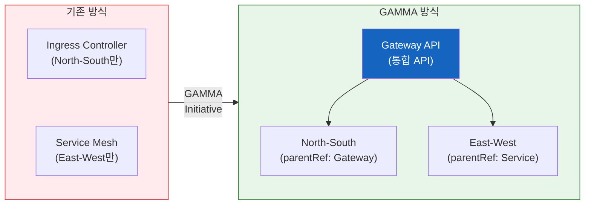

import {
  GammaInfographic,
  GammaSupportTable,
} from '@site/src/components/GatewayApiTables';

# GAMMA Initiative — 서비스 메시 통합의 미래

## 4.1 GAMMA란?

**GAMMA (Gateway API for Mesh Management and Administration)**는 Gateway API를 서비스 메시 영역으로 확장한 이니셔티브입니다.

- **GA 달성**: Gateway API v1.1.0 (2025년 10월)
- **통합 범위**: North-South (인그레스) + East-West (서비스 메시) 트래픽
- **핵심 개념**: 기존에는 인그레스 컨트롤러와 서비스 메시가 완전히 별개의 설정 체계였으나, GAMMA는 이를 단일 API로 통합
- **역할 기반 구성**: Gateway API의 역할 분리 원칙을 메시 트래픽에도 동일하게 적용

GAMMA의 등장으로 클러스터 운영자는 더 이상 두 가지 서로 다른 API를 학습하고 관리할 필요가 없습니다. 인그레스와 메시 모두 동일한 Gateway API 리소스로 관리할 수 있게 되었습니다.



## 4.2 핵심 목표 & 메시 구성 패턴

<GammaInfographic />

## 4.3 GAMMA 지원 현황

다음은 주요 서비스 메시 구현체의 GAMMA 지원 현황입니다.

<GammaSupportTable />

:::tip AWS 환경에서의 GAMMA
AWS 환경에서는 **VPC Lattice + ACK**로 사이드카 없이 GAMMA 패턴을 구현할 수 있습니다. IAM 기반 mTLS, CloudWatch/X-Ray 관측성, AWS FIS를 통한 장애 주입까지 완전한 서비스 메시 기능을 관리형으로 제공합니다.
:::

## 4.4 GAMMA의 장점

### 1. 학습 곡선 단축

팀은 하나의 API(Gateway API)만 학습하면 인그레스와 메시 모두 관리할 수 있습니다.

### 2. 설정 일관성

동일한 YAML 구조와 패턴으로 North-South/East-West 트래픽을 모두 관리합니다.

```yaml
# 인그레스 (North-South)
spec:
  parentRefs:
    - kind: Gateway
      name: external-gateway

# 메시 (East-West)
spec:
  parentRefs:
    - kind: Service
      name: backend-service
```

### 3. 역할 기반 분리

인프라 팀은 Gateway를, 개발 팀은 HTTPRoute를 관리하는 명확한 책임 분리가 메시 트래픽에도 동일하게 적용됩니다.

### 4. 벤더 중립성

여러 메시 구현체를 동일한 API로 관리할 수 있어 벤더 종속을 방지합니다.
