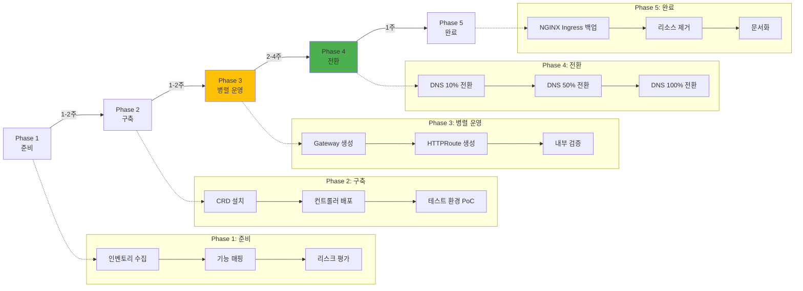

import Tabs from '@theme/Tabs';
import TabItem from '@theme/TabItem';
import { MigrationFeatureMappingTable, TroubleshootingTable } from '@site/src/components/GatewayApiTables';

:::info
이 문서는 [Gateway API 도입 가이드](/docs/infrastructure-optimization/gateway-api-adoption-guide)의 심화 가이드입니다. NGINX Ingress에서 Gateway API로의 실전 마이그레이션 전략을 제공합니다.
:::

## 1. 사전 요구사항: CRD 설치

모든 Gateway API 구현체는 공통적으로 Kubernetes Gateway API CRDs를 필요로 합니다.

### 1.1 Gateway API 표준 CRDs

```bash
# Gateway API v1.4.0 표준 설치
kubectl apply -f https://github.com/kubernetes-sigs/gateway-api/releases/download/v1.4.0/standard-install.yaml

# 실험적(Experimental) 기능 포함 설치 (선택사항)
kubectl apply -f https://github.com/kubernetes-sigs/gateway-api/releases/download/v1.4.0/experimental-install.yaml
```

**설치되는 CRDs:**
- `gatewayclasses.gateway.networking.k8s.io`
- `gateways.gateway.networking.k8s.io`
- `httproutes.gateway.networking.k8s.io`
- `referencegrants.gateway.networking.k8s.io`
- `grpcroutes.gateway.networking.k8s.io` (Experimental)
- `tcproutes.gateway.networking.k8s.io` (Experimental)
- `tlsroutes.gateway.networking.k8s.io` (Experimental)
- `udproutes.gateway.networking.k8s.io` (Experimental)

### 1.2 각 컨트롤러별 추가 설치

**AWS Native (ALB + NLB Gateway)**

```bash
# AWS Load Balancer Controller v3.0+ 설치 (Gateway API 지원)
helm repo add eks https://aws.github.io/eks-charts
helm repo update

# IRSA (IAM Role for Service Account) 생성
eksctl create iamserviceaccount \
  --cluster=<클러스터명> \
  --namespace=kube-system \
  --name=aws-load-balancer-controller \
  --role-name AmazonEKSLoadBalancerControllerRole \
  --attach-policy-arn=arn:aws:iam::aws:policy/AWSLoadBalancerControllerIAMPolicy \
  --approve

# Helm 설치
helm install aws-load-balancer-controller eks/aws-load-balancer-controller \
  -n kube-system \
  --set clusterName=<클러스터명> \
  --set serviceAccount.create=false \
  --set serviceAccount.name=aws-load-balancer-controller \
  --set enableGatewayAPI=true  # Gateway API 활성화 (핵심!)

# 설치 확인
kubectl get deployment -n kube-system aws-load-balancer-controller
```

**NGINX Gateway Fabric**

```bash
# NGINX Gateway Fabric 설치
kubectl apply -f https://github.com/nginxinc/nginx-gateway-fabric/releases/download/v1.6.0/crds.yaml
kubectl apply -f https://github.com/nginxinc/nginx-gateway-fabric/releases/download/v1.6.0/nginx-gateway.yaml

# 설치 확인
kubectl get pods -n nginx-gateway
kubectl get gatewayclass nginx
```

**Envoy Gateway**

```bash
# Envoy Gateway 설치
helm install eg oci://docker.io/envoyproxy/gateway-helm \
  --version v1.3.0 \
  --namespace envoy-gateway-system \
  --create-namespace

# 설치 확인
kubectl get pods -n envoy-gateway-system
kubectl get gatewayclass envoy-gateway
```

**Cilium Gateway API**

Cilium 설치 시 `gatewayAPI.enabled=true`로 이미 활성화되어 있으므로 별도 설치 불필요.

```bash
# GatewayClass 확인
kubectl get gatewayclass cilium
```

---

## 2. 5-Phase 마이그레이션 프로세스



---

## 3. Phase별 상세 가이드

<Tabs>
  <TabItem value="phase1" label="Phase 1: 준비" default>

**Step 1.1: 현재 Ingress 인벤토리 수집**

```bash
# 모든 Ingress 리소스 목록 추출
kubectl get ingress -A -o json > ingress-inventory.json

# 주요 정보 요약
cat ingress-inventory.json | jq -r '
  .items[] |
  {
    namespace: .metadata.namespace,
    name: .metadata.name,
    class: .spec.ingressClassName,
    hosts: [.spec.rules[].host],
    paths: [.spec.rules[].http.paths[].path],
    tls: (.spec.tls != null)
  }
' > ingress-summary.json

# 통계 요약
echo "=== Ingress Statistics ==="
echo "Total Ingress: $(cat ingress-inventory.json | jq '.items | length')"
echo "With TLS: $(cat ingress-inventory.json | jq '[.items[] | select(.spec.tls != null)] | length')"
echo "Unique Hosts: $(cat ingress-inventory.json | jq -r '[.items[].spec.rules[].host] | unique | length')"
```

**Step 1.2: 기능 매핑 (NGINX Ingress → Gateway API)**

<MigrationFeatureMappingTable />

**Step 1.3: 리스크 평가**

```yaml
# risk-assessment.yaml
risks:
  - id: RISK-001
    category: 기능 누락
    description: "NGINX rate-limit 어노테이션의 직접 대안 없음"
    severity: MEDIUM
    mitigation: "AWS WAF 또는 Envoy Rate Limit 서비스 사용"

  - id: RISK-002
    category: 다운타임
    description: "Cilium ENI 모드 마이그레이션 시 다운타임 발생"
    severity: HIGH
    mitigation: "블루-그린 클러스터 전환 또는 유지보수 창 설정"

  - id: RISK-003
    category: 학습 곡선
    description: "팀의 Gateway API 경험 부족"
    severity: LOW
    mitigation: "Phase 2 PoC에서 충분한 테스트 기간 확보"
```

  </TabItem>
  <TabItem value="phase2" label="Phase 2: 구축">

**Step 2.1: CRD 설치 (섹션 1 참조)**

위의 "사전 요구사항" 섹션대로 CRD와 컨트롤러를 설치합니다.

**Step 2.2: 테스트 환경 PoC**

```yaml
# poc-gateway.yaml (개발 환경)
apiVersion: gateway.networking.k8s.io/v1
kind: Gateway
metadata:
  name: poc-gateway
  namespace: dev
spec:
  gatewayClassName: cilium  # 또는 nginx, envoy-gateway, aws
  listeners:
    - name: http
      protocol: HTTP
      port: 80

---
apiVersion: gateway.networking.k8s.io/v1
kind: HTTPRoute
metadata:
  name: poc-httproute
  namespace: dev
spec:
  parentRefs:
    - name: poc-gateway
  hostnames:
    - "poc.dev.example.com"
  rules:
    - matches:
        - path:
            type: PathPrefix
            value: /
      backendRefs:
        - name: test-service
          port: 8080
```

```bash
# PoC 배포
kubectl apply -f poc-gateway.yaml

# 외부 IP 확인
kubectl get gateway poc-gateway -n dev -o jsonpath='{.status.addresses[0].value}'

# DNS 레코드 추가 (Route 53 예시)
GATEWAY_IP=$(kubectl get gateway poc-gateway -n dev -o jsonpath='{.status.addresses[0].value}')
aws route53 change-resource-record-sets \
  --hosted-zone-id Z1234567890ABC \
  --change-batch "{
    \"Changes\": [{
      \"Action\": \"CREATE\",
      \"ResourceRecordSet\": {
        \"Name\": \"poc.dev.example.com\",
        \"Type\": \"A\",
        \"TTL\": 60,
        \"ResourceRecords\": [{\"Value\": \"$GATEWAY_IP\"}]
      }
    }]
  }"

# 기능 테스트
curl -v http://poc.dev.example.com/
```

**Step 2.3: 성능 벤치마크 (PoC 환경)**

```bash
# k6 부하 테스트 스크립트
cat <<EOF > poc-benchmark.js
import http from 'k6/http';
import { check } from 'k6';

export let options = {
  stages: [
    { duration: '2m', target: 100 },  // 100 VU까지 램프업
    { duration: '5m', target: 100 },  // 5분간 유지
    { duration: '2m', target: 0 },    // 램프다운
  ],
  thresholds: {
    'http_req_duration': ['p(95)<200'],  // P95 레이턴시 200ms 미만
    'http_req_failed': ['rate<0.01'],     // 에러율 1% 미만
  },
};

export default function () {
  const res = http.get('http://poc.dev.example.com/api/health');
  check(res, {
    'status is 200': (r) => r.status === 200,
    'response time < 200ms': (r) => r.timings.duration < 200,
  });
}
EOF

# k6 실행
k6 run poc-benchmark.js
```

  </TabItem>
  <TabItem value="phase3" label="Phase 3: 병렬 운영">

**Step 3.1: 프로덕션 Gateway 생성**

```yaml
# production-gateway.yaml
apiVersion: gateway.networking.k8s.io/v1
kind: Gateway
metadata:
  name: production-gateway
  namespace: infra
  annotations:
    # AWS Native인 경우
    service.beta.kubernetes.io/aws-load-balancer-type: "nlb"
    service.beta.kubernetes.io/aws-load-balancer-scheme: "internet-facing"
spec:
  gatewayClassName: cilium
  listeners:
    - name: https
      protocol: HTTPS
      port: 443
      hostname: "*.example.com"
      tls:
        mode: Terminate
        certificateRefs:
          - kind: Secret
            name: wildcard-tls-cert
            namespace: infra
      allowedRoutes:
        namespaces:
          from: All
```

```bash
# 배포
kubectl apply -f production-gateway.yaml

# 상태 확인 (Programmed=True까지 대기)
kubectl wait --for=condition=Programmed gateway/production-gateway -n infra --timeout=5m

# 외부 주소 확인
kubectl get gateway production-gateway -n infra -o jsonpath='{.status.addresses[0].value}'
```

**Step 3.2: HTTPRoute 생성 (병렬 운영)**

기존 NGINX Ingress를 유지하면서, 동일한 백엔드를 가리키는 HTTPRoute를 생성합니다.

```yaml
# parallel-httproute.yaml
apiVersion: gateway.networking.k8s.io/v1
kind: HTTPRoute
metadata:
  name: api-route
  namespace: production
spec:
  parentRefs:
    - name: production-gateway
      namespace: infra
  hostnames:
    - "api.example.com"
  rules:
    - matches:
        - path:
            type: PathPrefix
            value: /api/v1
      backendRefs:
        - name: api-service  # 기존 Ingress와 동일한 Service
          port: 8080
```

**Step 3.3: 내부 검증 (프록시 테스트)**

```bash
# Gateway의 Cluster IP로 직접 테스트 (외부 DNS 변경 전)
GATEWAY_SVC=$(kubectl get svc -n infra -l gateway.networking.k8s.io/gateway-name=production-gateway -o jsonpath='{.items[0].metadata.name}')
GATEWAY_IP=$(kubectl get svc $GATEWAY_SVC -n infra -o jsonpath='{.status.loadBalancer.ingress[0].ip}')

# Host 헤더를 포함한 curl 테스트
curl -H "Host: api.example.com" https://$GATEWAY_IP/api/v1/health --insecure

# 응답 시간 비교 (NGINX Ingress vs Gateway API)
echo "=== NGINX Ingress ==="
curl -w "Time: %{time_total}s\n" -o /dev/null -s https://api.example.com/api/v1/health

echo "=== Gateway API (직접 접근) ==="
curl -w "Time: %{time_total}s\n" -o /dev/null -s -H "Host: api.example.com" https://$GATEWAY_IP/api/v1/health --insecure
```

  </TabItem>
  <TabItem value="phase4" label="Phase 4: 전환">

**Step 4.1: DNS 가중치 라우팅 (10% 전환)**

```bash
# Route 53 가중치 레코드 생성
# 기존 NGINX Ingress (가중치 90)
aws route53 change-resource-record-sets \
  --hosted-zone-id Z1234567890ABC \
  --change-batch '{
    "Changes": [{
      "Action": "UPSERT",
      "ResourceRecordSet": {
        "Name": "api.example.com",
        "Type": "A",
        "SetIdentifier": "nginx-ingress",
        "Weight": 90,
        "TTL": 60,
        "ResourceRecords": [{"Value": "203.0.113.10"}]
      }
    }]
  }'

# 새 Gateway API (가중치 10)
aws route53 change-resource-record-sets \
  --hosted-zone-id Z1234567890ABC \
  --change-batch "{
    \"Changes\": [{
      \"Action\": \"UPSERT\",
      \"ResourceRecordSet\": {
        \"Name\": \"api.example.com\",
        \"Type\": \"A\",
        \"SetIdentifier\": \"gateway-api\",
        \"Weight\": 10,
        \"TTL\": 60,
        \"ResourceRecords\": [{\"Value\": \"$GATEWAY_IP\"}]
      }
    }]
  }"

# 24시간 모니터링 (에러율, 레이턴시, 처리량)
# - CloudWatch 대시보드 확인
# - Grafana 메트릭 비교
# - 에러 로그 확인
```

**Step 4.2: DNS 50% 전환**

```bash
# 이상 없으면 가중치 조정
aws route53 change-resource-record-sets \
  --hosted-zone-id Z1234567890ABC \
  --change-batch '{
    "Changes": [
      {
        "Action": "UPSERT",
        "ResourceRecordSet": {
          "Name": "api.example.com",
          "Type": "A",
          "SetIdentifier": "nginx-ingress",
          "Weight": 50,
          "TTL": 60,
          "ResourceRecords": [{"Value": "203.0.113.10"}]
        }
      },
      {
        "Action": "UPSERT",
        "ResourceRecordSet": {
          "Name": "api.example.com",
          "Type": "A",
          "SetIdentifier": "gateway-api",
          "Weight": 50,
          "TTL": 60,
          "ResourceRecords": [{"Value": "'"$GATEWAY_IP"'"}]
        }
      }
    ]
  }'

# 1주일 모니터링
```

**Step 4.3: DNS 100% 전환**

```bash
# 최종 전환 (NGINX Ingress 가중치 0)
aws route53 change-resource-record-sets \
  --hosted-zone-id Z1234567890ABC \
  --change-batch '{
    "Changes": [
      {
        "Action": "DELETE",
        "ResourceRecordSet": {
          "Name": "api.example.com",
          "Type": "A",
          "SetIdentifier": "nginx-ingress",
          "Weight": 50,
          "TTL": 60,
          "ResourceRecords": [{"Value": "203.0.113.10"}]
        }
      },
      {
        "Action": "UPSERT",
        "ResourceRecordSet": {
          "Name": "api.example.com",
          "Type": "A",
          "SetIdentifier": "gateway-api",
          "Weight": 100,
          "TTL": 300,
          "ResourceRecords": [{"Value": "'"$GATEWAY_IP"'"}]
        }
      }
    ]
  }'
```

  </TabItem>
  <TabItem value="phase5" label="Phase 5: 완료">

**Step 5.1: NGINX Ingress 백업**

```bash
# 모든 Ingress 리소스 백업
kubectl get ingress -A -o yaml > backup-ingress-resources-$(date +%Y%m%d).yaml

# NGINX Ingress Controller 구성 백업
kubectl get deployment ingress-nginx-controller -n ingress-nginx -o yaml > backup-nginx-controller.yaml
kubectl get cm ingress-nginx-controller -n ingress-nginx -o yaml > backup-nginx-configmap.yaml

# S3에 백업 업로드
aws s3 cp backup-ingress-resources-$(date +%Y%m%d).yaml s3://my-backup-bucket/ingress-migration/
```

**Step 5.2: NGINX Ingress 제거 (2주 후)**

```bash
# 2주간 모니터링 후 이상 없으면 제거
kubectl delete ingress --all -A  # Ingress 리소스 삭제
helm uninstall ingress-nginx -n ingress-nginx  # NGINX Controller 제거
kubectl delete namespace ingress-nginx
```

**Step 5.3: 문서화**

```markdown
# migration-report.md

## 마이그레이션 완료 보고서

### 기본 정보
- 시작일: 2026-01-15
- 완료일: 2026-02-28
- 총 소요 기간: 6주
- 선택한 솔루션: Cilium Gateway API (ENI 모드)

### 마이그레이션 대상
- 총 Ingress 수: 47개
- 총 호스트 수: 23개
- TLS 인증서: 12개

### 성능 비교
| 지표 | NGINX Ingress | Cilium Gateway | 개선율 |
|------|---------------|----------------|--------|
| P95 Latency | 45ms | 12ms | 73% 감소 |
| RPS (단일 인스턴스) | 8,500 | 24,000 | 182% 증가 |
| CPU 사용률 | 35% | 18% | 49% 감소 |

### 이슈 및 해결
1. **문제**: TLS 인증서 자동 갱신 미작동
   - **원인**: cert-manager의 Ingress 어노테이션 의존성
   - **해결**: Gateway용 Certificate CRD로 전환

2. **문제**: 일부 경로에서 404 에러
   - **원인**: PathPrefix 매칭 로직 차이
   - **해결**: 정확한 경로 매칭 규칙 수정

### 교훈
- Phase 3 병렬 운영 기간을 충분히 확보하는 것이 중요
- DNS TTL을 짧게 설정하여 빠른 롤백 가능하도록 준비
- 각 Phase마다 명확한 성공 기준 설정 필요
```

  </TabItem>
</Tabs>

---

## 4. 검증 스크립트

```bash
#!/bin/bash
# validate-httproute.sh

set -e

NAMESPACE=${1:-default}
HTTPROUTE_NAME=${2:-}

if [ -z "$HTTPROUTE_NAME" ]; then
  echo "Usage: $0 <namespace> <httproute-name>"
  exit 1
fi

echo "=== HTTPRoute Validation ==="
echo "Namespace: $NAMESPACE"
echo "HTTPRoute: $HTTPROUTE_NAME"
echo ""

# 1. HTTPRoute 존재 확인
if ! kubectl get httproute $HTTPROUTE_NAME -n $NAMESPACE &>/dev/null; then
  echo "❌ HTTPRoute not found"
  exit 1
fi
echo "✅ HTTPRoute exists"

# 2. Accepted Condition 확인
ACCEPTED=$(kubectl get httproute $HTTPROUTE_NAME -n $NAMESPACE -o jsonpath='{.status.parents[0].conditions[?(@.type=="Accepted")].status}')
if [ "$ACCEPTED" != "True" ]; then
  REASON=$(kubectl get httproute $HTTPROUTE_NAME -n $NAMESPACE -o jsonpath='{.status.parents[0].conditions[?(@.type=="Accepted")].reason}')
  echo "❌ HTTPRoute not accepted. Reason: $REASON"
  exit 1
fi
echo "✅ HTTPRoute accepted by Gateway"

# 3. Programmed Condition 확인
PROGRAMMED=$(kubectl get httproute $HTTPROUTE_NAME -n $NAMESPACE -o jsonpath='{.status.parents[0].conditions[?(@.type=="Programmed")].status}')
if [ "$PROGRAMMED" != "True" ]; then
  REASON=$(kubectl get httproute $HTTPROUTE_NAME -n $NAMESPACE -o jsonpath='{.status.parents[0].conditions[?(@.type=="Programmed")].reason}')
  echo "❌ HTTPRoute not programmed. Reason: $REASON"
  exit 1
fi
echo "✅ HTTPRoute programmed in dataplane"

# 4. Backend 서비스 확인
BACKEND_SERVICES=$(kubectl get httproute $HTTPROUTE_NAME -n $NAMESPACE -o jsonpath='{.spec.rules[*].backendRefs[*].name}')
for svc in $BACKEND_SERVICES; do
  if ! kubectl get service $svc -n $NAMESPACE &>/dev/null; then
    echo "❌ Backend service not found: $svc"
    exit 1
  fi

  ENDPOINTS=$(kubectl get endpoints $svc -n $NAMESPACE -o jsonpath='{.subsets[*].addresses[*].ip}' | wc -w)
  if [ "$ENDPOINTS" -eq 0 ]; then
    echo "⚠️  Warning: Service $svc has no endpoints"
  else
    echo "✅ Backend service $svc has $ENDPOINTS endpoint(s)"
  fi
done

# 5. Gateway 주소 확인
PARENT_GATEWAY=$(kubectl get httproute $HTTPROUTE_NAME -n $NAMESPACE -o jsonpath='{.spec.parentRefs[0].name}')
PARENT_NAMESPACE=$(kubectl get httproute $HTTPROUTE_NAME -n $NAMESPACE -o jsonpath='{.spec.parentRefs[0].namespace}')
PARENT_NAMESPACE=${PARENT_NAMESPACE:-$NAMESPACE}

GATEWAY_ADDRESS=$(kubectl get gateway $PARENT_GATEWAY -n $PARENT_NAMESPACE -o jsonpath='{.status.addresses[0].value}')
if [ -z "$GATEWAY_ADDRESS" ]; then
  echo "❌ Gateway has no address assigned"
  exit 1
fi
echo "✅ Gateway address: $GATEWAY_ADDRESS"

# 6. 실제 HTTP 요청 테스트
HOSTNAMES=$(kubectl get httproute $HTTPROUTE_NAME -n $NAMESPACE -o jsonpath='{.spec.hostnames[*]}')
FIRST_HOST=$(echo $HOSTNAMES | awk '{print $1}')
FIRST_PATH=$(kubectl get httproute $HTTPROUTE_NAME -n $NAMESPACE -o jsonpath='{.spec.rules[0].matches[0].path.value}')

echo ""
echo "=== HTTP Request Test ==="
HTTP_CODE=$(curl -s -o /dev/null -w "%{http_code}" -H "Host: $FIRST_HOST" http://$GATEWAY_ADDRESS$FIRST_PATH --max-time 5)

if [ "$HTTP_CODE" -ge 200 ] && [ "$HTTP_CODE" -lt 400 ]; then
  echo "✅ HTTP request successful (HTTP $HTTP_CODE)"
else
  echo "❌ HTTP request failed (HTTP $HTTP_CODE)"
  exit 1
fi

echo ""
echo "=== All Checks Passed ==="
```

**사용 예시:**
```bash
chmod +x validate-httproute.sh
./validate-httproute.sh production api-route
```

---

## 5. 문제 해결

### 5.1 일반적인 이슈 및 해결 방법

<TroubleshootingTable />

### 5.2 컨트롤러별 디버깅 명령어

**AWS Load Balancer Controller**

```bash
# 컨트롤러 로그 확인
kubectl logs -n kube-system deployment/aws-load-balancer-controller --tail=100 -f

# Gateway의 실제 NLB 확인
kubectl get gateway <name> -n <namespace> -o jsonpath='{.metadata.annotations.service\.beta\.kubernetes\.io/aws-load-balancer-name}'

# NLB의 Target Group 상태 확인
aws elbv2 describe-target-health --target-group-arn <arn>

# HTTPRoute 이벤트 확인
kubectl describe httproute <name> -n <namespace>
```

**Cilium Gateway API**

```bash
# Cilium Operator 로그
kubectl logs -n kube-system deployment/cilium-operator --tail=100 -f

# Envoy 구성 덤프
kubectl exec -n kube-system ds/cilium -- cilium envoy config dump > envoy-config.json

# HTTPRoute 라우팅 테이블 확인
kubectl exec -n kube-system ds/cilium -- cilium service list

# 플로우 모니터링 (Gateway 관련)
hubble observe --protocol http --port 443

# Gateway 상태 확인
cilium status --wait
```

**NGINX Gateway Fabric**

```bash
# NGINX Gateway 로그
kubectl logs -n nginx-gateway deployment/nginx-gateway --tail=100 -f

# NGINX 구성 확인
kubectl exec -n nginx-gateway deployment/nginx-gateway -- nginx -T

# HTTPRoute 매핑 확인
kubectl describe httproute <name> -n <namespace>

# 접근 로그 실시간 확인
kubectl logs -n nginx-gateway deployment/nginx-gateway -f | grep "HTTP/1.1"
```

**Envoy Gateway**

```bash
# Envoy Gateway 컨트롤러 로그
kubectl logs -n envoy-gateway-system deployment/envoy-gateway --tail=100 -f

# Envoy Proxy 로그 (데이터플레인)
kubectl logs -n envoy-gateway-system deployment/envoy-<gateway-name> --tail=100 -f

# Envoy 관리 인터페이스 포트 포워딩
kubectl port-forward -n envoy-gateway-system deployment/envoy-<gateway-name> 19000:19000

# 브라우저에서 http://localhost:19000 접속하여 stats, config 확인

# xDS 구성 덤프
curl http://localhost:19000/config_dump > envoy-xds-config.json
```

**공통 디버깅**

```bash
# Gateway 상태 상세 확인
kubectl get gateway <name> -n <namespace> -o yaml

# HTTPRoute 상태 상세 확인
kubectl get httproute <name> -n <namespace> -o yaml

# 백엔드 Service 엔드포인트 확인
kubectl get endpoints <service-name> -n <namespace>

# Pod가 Ready 상태인지 확인
kubectl get pods -n <namespace> -l <selector>

# 네트워크 정책 확인 (트래픽 차단 여부)
kubectl get networkpolicies -n <namespace>

# 이벤트 확인 (최근 10분)
kubectl get events -n <namespace> --sort-by='.lastTimestamp' | tail -20
```

---

## 관련 문서

- **[Gateway API 도입 가이드](/docs/infrastructure-optimization/gateway-api-adoption-guide)** - 전체 Gateway API 마이그레이션 가이드
- **[Cilium ENI 모드 + Gateway API](/docs/infrastructure-optimization/gateway-api-adoption-guide/cilium-eni-gateway-api)** - Cilium 심화 구성 가이드
- [Gateway API 공식 문서](https://gateway-api.sigs.k8s.io/)
- [AWS Load Balancer Controller](https://kubernetes-sigs.github.io/aws-load-balancer-controller/)
