import { ScalingLatencyBreakdown, ControlPlaneComparison, WarmPoolCostAnalysis, AutoModeComparison, ScalingBenchmark, PracticalGuide } from '@site/src/components/KarpenterTables';

# Karpenter 기반 EKS 스케일링 전략 종합 가이드

> 📅 **작성일**: 2025-02-09 | **수정일**: 2026-02-18 | ⏱️ **읽는 시간**: 약 28분

## 개요

현대 클라우드 네이티브 애플리케이션에서 트래픽 급증 시 사용자가 에러를 경험하지 않도록 보장하는 것은 핵심 엔지니어링 과제입니다. 이 문서는 Amazon EKS에서 Karpenter를 활용한 **종합적인 스케일링 전략**을 다루며, 반응형 스케일링 최적화부터 예측형 스케일링, 아키텍처적 복원력까지 포괄합니다.

:::caution 현실적인 최적화 기대치
이 문서에서 다루는 "초고속 스케일링"은 **Warm Pool(사전 할당된 노드)**을 전제합니다. E2E 오토스케일링 파이프라인(메트릭 감지 → 결정 → Pod 생성 → 컨테이너 시작)의 물리적 최소 시간은 **6-11초**이며, 새 노드 프로비저닝이 필요한 경우 **45-90초**가 추가됩니다.

스케일링 속도를 극한까지 높이는 것만이 유일한 전략은 아닙니다. **아키텍처적 복원력**(큐 기반 버퍼링, Circuit Breaker)과 **예측형 스케일링**(패턴 기반 사전 확장)이 대부분의 워크로드에서 더 비용 효율적입니다. 이 문서는 이 모든 접근법을 함께 다룹니다.
:::

글로벌 규모의 EKS 환경(3개 리전, 28개 클러스터, 15,000개 이상의 Pod)에서 스케일링 지연 시간을 180초 이상에서 45초 미만으로 단축하고, Warm Pool 활용 시 5-10초까지 도달한 프로덕션 검증 아키텍처를 탐구합니다.

## 스케일링 전략 의사결정 프레임워크

스케일링 최적화에 앞서, **"우리 워크로드에 정말 초고속 반응형 스케일링이 필요한가?"**를 먼저 판단해야 합니다. "트래픽 급증 시 사용자 에러 방지"라는 동일한 비즈니스 문제를 해결하는 접근법은 4가지가 있으며, 대부분의 워크로드에서는 접근법 2-4가 더 비용 효율적입니다.

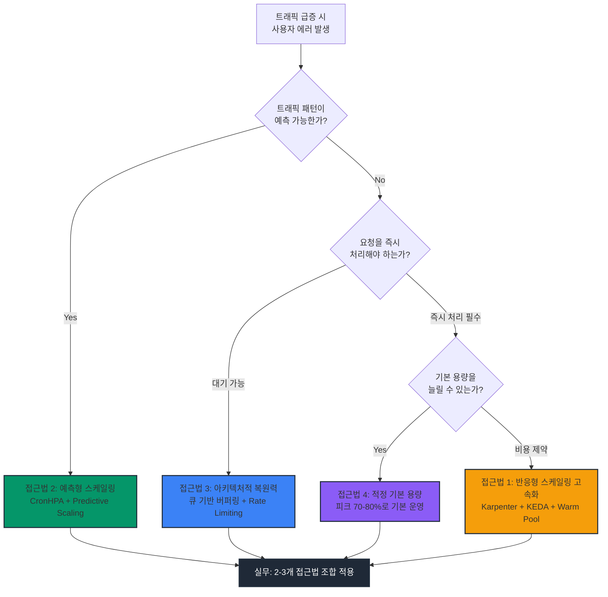
```mermaid
graph TB
    START[트래픽 급증 시<br/>사용자 에러 발생] --> Q1{트래픽 패턴이<br/>예측 가능한가?}

    Q1 -->|Yes| PRED[접근법 2: 예측형 스케일링<br/>CronHPA + Predictive Scaling]
    Q1 -->|No| Q2{요청을 즉시<br/>처리해야 하는가?}

    Q2 -->|대기 가능| ARCH[접근법 3: 아키텍처적 복원력<br/>큐 기반 버퍼링 + Rate Limiting]
    Q2 -->|즉시 처리 필수| Q3{기본 용량을<br/>늘릴 수 있는가?}

    Q3 -->|Yes| BASE[접근법 4: 적정 기본 용량<br/>피크 70-80%로 기본 운영]
    Q3 -->|비용 제약| REACTIVE[접근법 1: 반응형 스케일링 고속화<br/>Karpenter + KEDA + Warm Pool]

    PRED --> COMBINE[실무: 2-3개 접근법 조합 적용]
    ARCH --> COMBINE
    BASE --> COMBINE
    REACTIVE --> COMBINE

    style PRED fill:#059669,stroke:#232f3e,stroke-width:2px
    style ARCH fill:#3b82f6,stroke:#232f3e,stroke-width:2px
    style BASE fill:#8b5cf6,stroke:#232f3e,stroke-width:2px
    style REACTIVE fill:#f59e0b,stroke:#232f3e,stroke-width:2px
    style COMBINE fill:#1f2937,color:#fff,stroke:#232f3e,stroke-width:2px
```

### 접근법별 비교

| 접근법 | 핵심 전략 | E2E 스케일링 시간 | 월 추가 비용 (28개 클러스터) | 복잡도 | 적합한 워크로드 |
|--------|-----------|-------------------|---------------------------|--------|---------------|
| **1. 반응형 고속화** | Karpenter + KEDA + Warm Pool | 5-45초 | $40K-190K | 매우 높음 | 극소수 미션 크리티컬 |
| **2. 예측형 스케일링** | CronHPA + Predictive Scaling | 사전 확장 (0초) | $2K-5K | 낮음 | 패턴 있는 대부분의 서비스 |
| **3. 아키텍처 복원력** | SQS/Kafka + Circuit Breaker | 스케일링 지연 허용 | $1K-3K | 중간 | 비동기 처리 가능한 서비스 |
| **4. 적정 기본 용량** | 기본 replica 20-30% 증설 | 불필요 (이미 충분) | $5K-15K | 매우 낮음 | 안정적인 트래픽 |

### 접근법별 비용 구조 비교

아래는 **중규모 클러스터 10개 기준**의 월간 예상 비용입니다. 실제 비용은 워크로드와 인스턴스 타입에 따라 달라집니다.

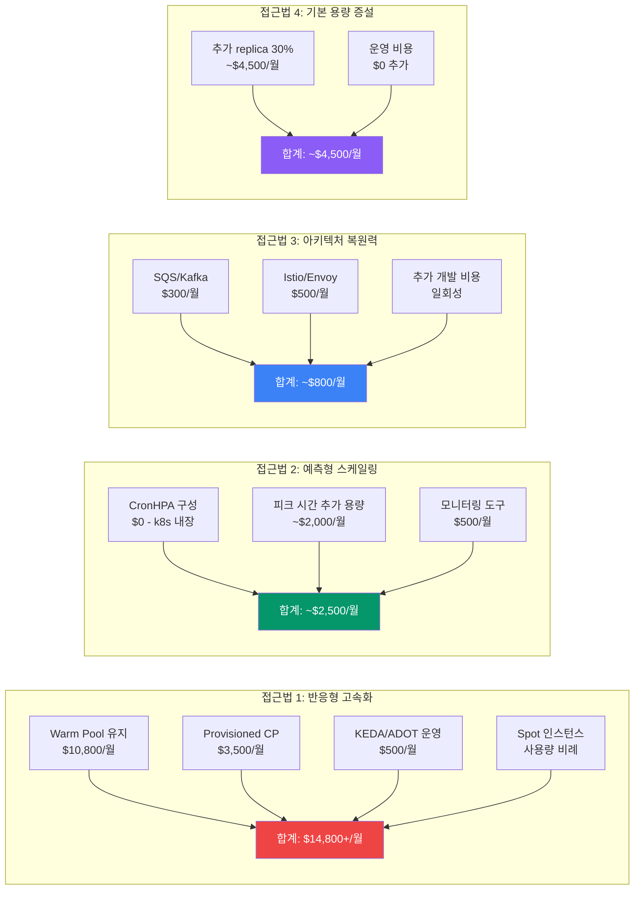
```mermaid
graph LR
    subgraph "접근법 1: 반응형 고속화"
        R1["Warm Pool 유지<br/>$10,800/월"]
        R2["Provisioned CP<br/>$3,500/월"]
        R3["KEDA/ADOT 운영<br/>$500/월"]
        R4["Spot 인스턴스<br/>사용량 비례"]
        RT["합계: $14,800+/월"]
        R1 --> RT
        R2 --> RT
        R3 --> RT
        R4 --> RT
    end

    subgraph "접근법 2: 예측형 스케일링"
        P1["CronHPA 구성<br/>$0 - k8s 내장"]
        P2["피크 시간 추가 용량<br/>~$2,000/월"]
        P3["모니터링 도구<br/>$500/월"]
        PT["합계: ~$2,500/월"]
        P1 --> PT
        P2 --> PT
        P3 --> PT
    end

    subgraph "접근법 3: 아키텍처 복원력"
        A1["SQS/Kafka<br/>$300/월"]
        A2["Istio/Envoy<br/>$500/월"]
        A3["추가 개발 비용<br/>일회성"]
        AT["합계: ~$800/월"]
        A1 --> AT
        A2 --> AT
        A3 --> AT
    end

    subgraph "접근법 4: 기본 용량 증설"
        B1["추가 replica 30%<br/>~$4,500/월"]
        B2["운영 비용<br/>$0 추가"]
        BT["합계: ~$4,500/월"]
        B1 --> BT
        B2 --> BT
    end

    style RT fill:#ef4444,color:#fff
    style PT fill:#059669,color:#fff
    style AT fill:#3b82f6,color:#fff
    style BT fill:#8b5cf6,color:#fff
```

| 접근법 | 월 비용 (10개 클러스터) | 초기 구축 비용 | 운영 인력 필요 | ROI 달성 조건 |
|--------|----------------------|---------------|---------------|-------------|
| **1. 반응형 고속화** | $14,800+ | 높음 (2-4주) | 전담 1-2명 | SLA 위반 페널티 > $15K/월 |
| **2. 예측형 스케일링** | ~$2,500 | 낮음 (2-3일) | 기존 인력 | 트래픽 패턴 예측률 > 70% |
| **3. 아키텍처 복원력** | ~$800 | 중간 (1-2주) | 기존 인력 | 비동기 처리 허용 서비스 |
| **4. 기본 용량 증설** | ~$4,500 | 없음 (즉시) | 없음 | 피크 대비 30% 버퍼로 충분 |

:::tip 권장: 접근법 조합
대부분의 프로덕션 환경에서는 **접근법 2 + 4 (예측형 + 기본 용량)**로 90% 이상의 트래픽 급증을 커버하고, 나머지 10%를 **접근법 1 (반응형 Karpenter)**으로 처리하는 조합이 가장 비용 효율적입니다.

접근법 3(아키텍처 복원력)은 신규 서비스 설계 시 반드시 고려해야 할 기본 패턴입니다.
:::

### 접근법 2: 예측형 스케일링

대부분의 프로덕션 트래픽은 패턴이 있습니다 (출근 시간, 점심, 이벤트). 반응형 스케일링보다 예측형 사전 확장이 더 효과적인 경우가 많습니다.

```yaml
# CronHPA: 시간대별 사전 스케일링
apiVersion: autoscaling.k8s.io/v1alpha1
kind: CronHPA
metadata:
  name: traffic-pattern-scaling
spec:
  scaleTargetRef:
    apiVersion: apps/v1
    kind: Deployment
    name: web-app
  jobs:
  - name: morning-peak
    schedule: "0 8 * * 1-5"    # 평일 오전 8시
    targetSize: 50              # 피크 대비 사전 확장
    completionPolicy:
      type: Never
  - name: lunch-peak
    schedule: "30 11 * * 1-5"   # 평일 오전 11:30
    targetSize: 80
    completionPolicy:
      type: Never
  - name: off-peak
    schedule: "0 22 * * *"      # 매일 오후 10시
    targetSize: 10              # 야간 축소
    completionPolicy:
      type: Never
```

### 접근법 3: 아키텍처적 복원력

스케일링 속도를 0으로 만드는 것보다 **스케일링 지연이 사용자에게 보이지 않게** 설계하는 것이 더 현실적입니다.

**큐 기반 버퍼링**: 요청을 SQS/Kafka에 넣으면 스케일링 지연이 "실패"가 아닌 "대기"가 됩니다.

```yaml
# KEDA SQS 기반 스케일링 - 요청은 큐에서 안전하게 대기
apiVersion: keda.sh/v1alpha1
kind: ScaledObject
metadata:
  name: queue-worker
spec:
  scaleTargetRef:
    name: order-processor
  minReplicaCount: 2
  maxReplicaCount: 100
  triggers:
  - type: aws-sqs-queue
    metadata:
      queueURL: https://sqs.us-east-1.amazonaws.com/123456789/orders
      queueLength: "5"         # 큐 메시지 5개당 1 Pod
      awsRegion: us-east-1
```

**Circuit Breaker + Rate Limiting**: Istio/Envoy로 과부하 시 graceful degradation

```yaml
# Istio Circuit Breaker - 스케일링 중 과부하 방지
apiVersion: networking.istio.io/v1
kind: DestinationRule
metadata:
  name: web-app-circuit-breaker
spec:
  host: web-app
  trafficPolicy:
    connectionPool:
      http:
        h2UpgradePolicy: DEFAULT
        http1MaxPendingRequests: 100    # 대기 요청 제한
        http2MaxRequests: 1000          # 동시 요청 제한
    outlierDetection:
      consecutive5xxErrors: 5            # 5xx 5회 시 격리
      interval: 10s
      baseEjectionTime: 30s
      maxEjectionPercent: 50
```

### 접근법 4: 적정 기본 용량

Warm Pool에 월 $1,080-$5,400를 쓰는 대신 기본 replica를 20-30% 증설하면 복잡한 인프라 없이 동일한 효과를 얻을 수 있습니다.

```yaml
apiVersion: apps/v1
kind: Deployment
metadata:
  name: web-app
spec:
  # 예상 필요 Pod: 20개 → 기본 25개로 운영 (25% 여유)
  replicas: 25
  # HPA가 피크 시 추가 확장 담당
---
apiVersion: autoscaling/v2
kind: HorizontalPodAutoscaler
metadata:
  name: web-app-hpa
spec:
  scaleTargetRef:
    apiVersion: apps/v1
    kind: Deployment
    name: web-app
  minReplicas: 25     # 기본 용량 보장
  maxReplicas: 100    # 극한 상황 대비
  metrics:
  - type: Resource
    resource:
      name: cpu
      target:
        type: Utilization
        averageUtilization: 60   # 여유 있는 타겟 (70 → 60)
```

---

이하 섹션부터는 **접근법 1: 반응형 스케일링 고속화**의 상세 구현을 다룹니다. 위의 접근법 2-4를 먼저 검토한 후, 추가 최적화가 필요한 워크로드에 대해 아래 내용을 적용하세요.

---

## 기존 오토스케일링의 문제점

반응형 스케일링을 최적화하기 전에 기존 접근 방식의 병목을 이해해야 합니다:

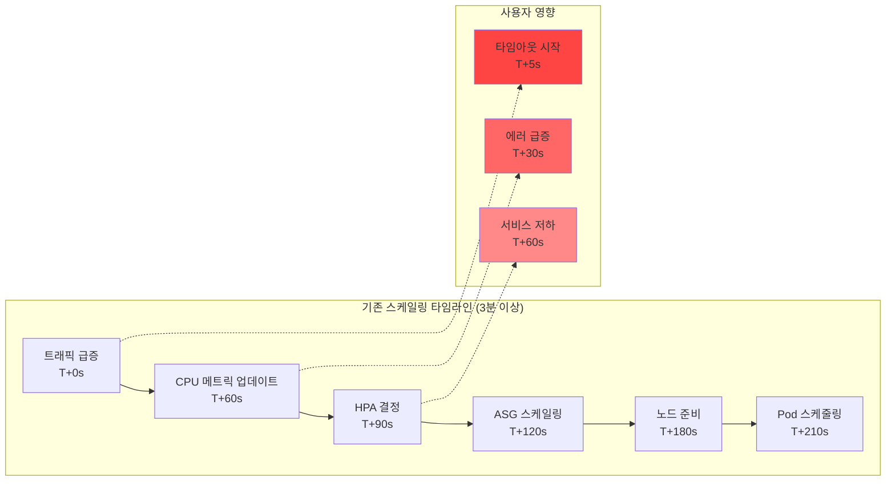
```mermaid
graph LR
    subgraph "기존 스케일링 타임라인 (3분 이상)"
        T1[트래픽 급증<br/>T+0s] --> T2[CPU 메트릭 업데이트<br/>T+60s]
        T2 --> T3[HPA 결정<br/>T+90s]
        T3 --> T4[ASG 스케일링<br/>T+120s]
        T4 --> T5[노드 준비<br/>T+180s]
        T5 --> T6[Pod 스케줄링<br/>T+210s]
    end

    subgraph "사용자 영향"
        I1[타임아웃 시작<br/>T+5s]
        I2[에러 급증<br/>T+30s]
        I3[서비스 저하<br/>T+60s]
    end

    T1 -.-> I1
    T2 -.-> I2
    T3 -.-> I3

    style I1 fill:#ff4444
    style I2 fill:#ff6666
    style I3 fill:#ff8888

```

근본적인 문제: CPU 메트릭이 스케일링을 트리거할 때는 이미 늦었습니다.

**현재 환경의 도전 과제:**

- **글로벌 규모**: 3개 리전, 28개 EKS 클러스터, 15,000개 Pod 운영
- **대용량 트래픽**: 일일 773.4K 리퀘스트 처리
- **지연 시간 문제**: HPA + Karpenter 조합으로 1-3분의 스케일링 지연 발생
- **메트릭 수집 지연**: CloudWatch 메트릭의 1-3분 지연으로 실시간 대응 불가

## Karpenter 혁명: Direct-to-Metal 프로비저닝

Karpenter는 Auto Scaling Group(ASG) 추상화 레이어를 제거하고 대기 중인 Pod 요구 사항을 기반으로 EC2 인스턴스를 직접 프로비저닝합니다. Karpenter v1.x는 **Drift Detection** 기능을 통해 NodePool 스펙 변경 시 기존 노드를 자동으로 교체합니다. AMI 업데이트, 보안 패치 적용 등이 자동화됩니다.

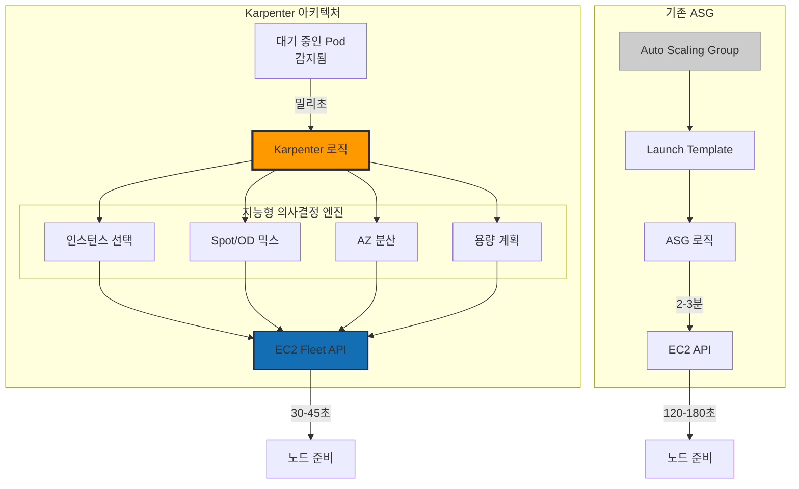
```mermaid
graph TB
    subgraph "Karpenter 아키텍처"
        PP[대기 중인 Pod<br/>감지됨]
        KL[Karpenter 로직]
        EC2[EC2 Fleet API]

        PP -->|밀리초| KL

        subgraph "지능형 의사결정 엔진"
            IS[인스턴스 선택]
            SP[Spot/OD 믹스]
            AZ[AZ 분산]
            CP[용량 계획]
        end

        KL --> IS
        KL --> SP
        KL --> AZ
        KL --> CP

        IS --> EC2
        SP --> EC2
        AZ --> EC2
        CP --> EC2
    end

    subgraph "기존 ASG"
        ASG[Auto Scaling Group]
        LT[Launch Template]
        ASGL[ASG 로직]

        ASG --> LT
        LT --> ASGL
        ASGL -->|2-3분| EC2_OLD[EC2 API]
    end

    EC2 -->|30-45초| NODE[노드 준비]
    EC2_OLD -->|120-180초| NODE_OLD[노드 준비]

    style KL fill:#ff9900,stroke:#232f3e,stroke-width:3px
    style EC2 fill:#146eb4,stroke:#232f3e,stroke-width:2px
    style ASG fill:#cccccc,stroke:#999999

```

## 고속 메트릭 아키텍처: 두 가지 접근 방식

스케일링 응답 시간을 최소화하려면 빠른 감지 시스템이 필요합니다. 두 가지 검증된 아키텍처를 비교합니다.

### 방식 1: CloudWatch High-Resolution Integration

AWS 네이티브 환경에서 CloudWatch의 고해상도 메트릭을 활용합니다.

#### 주요 구성 요소

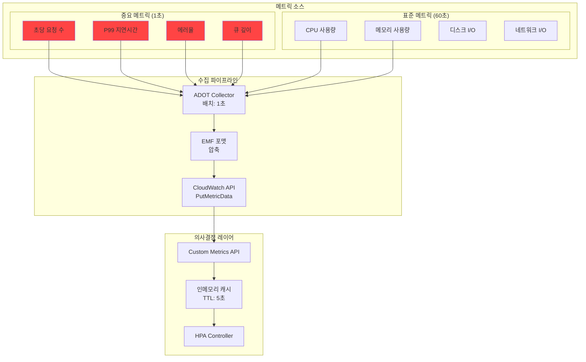
```mermaid
graph TB
    subgraph "메트릭 소스"
        subgraph "중요 메트릭 (1초)"
            RPS[초당 요청 수]
            LAT[P99 지연시간]
            ERR[에러율]
            QUEUE[큐 깊이]
        end

        subgraph "표준 메트릭 (60초)"
            CPU[CPU 사용량]
            MEM[메모리 사용량]
            DISK[디스크 I/O]
            NET[네트워크 I/O]
        end
    end

    subgraph "수집 파이프라인"
        AGENT[ADOT Collector<br/>배치: 1초]
        EMF[EMF 포맷<br/>압축]
        CW[CloudWatch API<br/>PutMetricData]
    end

    subgraph "의사결정 레이어"
        API[Custom Metrics API]
        CACHE[인메모리 캐시<br/>TTL: 5초]
        HPA[HPA Controller]
    end

    RPS --> AGENT
    LAT --> AGENT
    ERR --> AGENT
    QUEUE --> AGENT

    CPU --> AGENT
    MEM --> AGENT

    AGENT --> EMF
    EMF --> CW
    CW --> API
    API --> CACHE
    CACHE --> HPA

    style RPS fill:#ff4444
    style LAT fill:#ff4444
    style ERR fill:#ff4444
    style QUEUE fill:#ff4444

```

#### 스케일링 타임라인

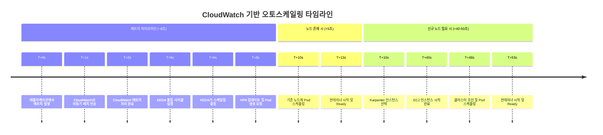
```mermaid
timeline
    title CloudWatch 기반 오토스케일링 타임라인

    section 메트릭 파이프라인 (~8초)
        T+0s  : 애플리케이션에서 메트릭 발생
        T+1s  : CloudWatch로 비동기 배치 전송
        T+2s  : CloudWatch 메트릭 처리 완료
        T+5s  : KEDA 폴링 사이클 실행
        T+6s  : KEDA가 스케일링 결정
        T+8s  : HPA 업데이트 및 Pod 생성 요청

    section 노드 존재 시 (+5초)
        T+10s : 기존 노드에 Pod 스케줄링
        T+13s : 컨테이너 시작 및 Ready

    section 신규 노드 필요 시 (+40-50초)
        T+10s : Karpenter 인스턴스 선택
        T+40s : EC2 인스턴스 시작 완료
        T+48s : 클러스터 조인 및 Pod 스케줄링
        T+53s : 컨테이너 시작 및 Ready
```

:::info 타임라인 해석
- **노드가 이미 존재하는 경우** (Warm Pool 또는 기존 여유 노드): E2E **~13초**
- **신규 노드 프로비저닝이 필요한 경우**: E2E **~53초**
- EC2 인스턴스 launch(30-40초)는 물리적 한계로, 메트릭 파이프라인 최적화만으로는 제거할 수 없습니다.
:::

**장점:**

- ✅ **빠른 메트릭 수집**: 1-2초의 낮은 지연시간
- ✅ **간단한 설정**: AWS 네이티브 통합
- ✅ **관리 오버헤드 없음**: 별도 인프라 관리 불필요

**단점:**

- ❌ **제한된 처리량**: 계정당 500 TPS (PutMetricData 리전별 제한)
- ❌ **Pod 한계**: 클러스터당 최대 5,000개
- ❌ **높은 메트릭 비용**: AWS CloudWatch 메트릭 요금

### 방식 2: ADOT + Prometheus 기반 아키텍처

AWS Distro for OpenTelemetry(ADOT)와 Prometheus를 결합한 오픈소스 기반 고성능 파이프라인입니다.

#### 주요 구성 요소

- **ADOT Collector**: DaemonSet과 Sidecar 하이브리드 배포
- **Prometheus**: HA 구성 및 Remote Storage 연동
- **Thanos Query Layer**: 멀티 클러스터 글로벌 뷰 제공
- **KEDA Prometheus Scaler**: 2초 간격의 고속 폴링
- **Grafana Mimir**: 장기 저장 및 고속 쿼리 엔진

#### 스케일링 타임라인 (~66초)

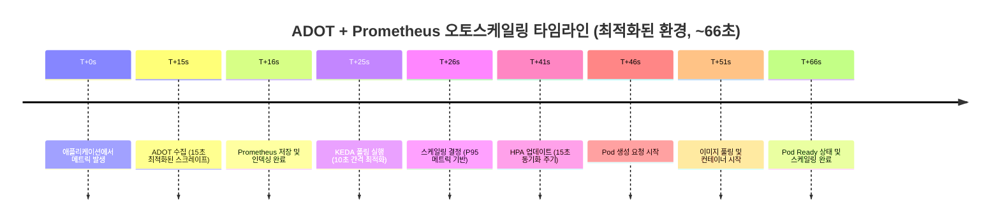
```mermaid
timeline
    title ADOT + Prometheus 오토스케일링 타임라인 (최적화된 환경, ~66초)

    T+0s   : 애플리케이션에서 메트릭 발생
    T+15s  : ADOT 수집 (15초 최적화된 스크레이프)
    T+16s  : Prometheus 저장 및 인덱싱 완료
    T+25s  : KEDA 폴링 실행 (10초 간격 최적화)
    T+26s  : 스케일링 결정 (P95 메트릭 기반)
    T+41s  : HPA 업데이트 (15초 동기화 주기)
    T+46s  : Pod 생성 요청 시작
    T+51s  : 이미지 풀링 및 컨테이너 시작
    T+66s  : Pod Ready 상태 및 스케일링 완료
```

**장점:**

- ✅ **높은 처리량**: 100,000+ TPS 지원
- ✅ **확장성**: 클러스터당 20,000+ Pod 지원
- ✅ **낮은 메트릭 비용**: 스토리지 비용만 발생 (Self-managed)
- ✅ **완전한 제어**: 설정 및 최적화 자유도

**단점:**

- ❌ **복잡한 설정**: 추가 컴포넌트 관리 필요
- ❌ **높은 운영 복잡성**: HA 구성, 백업/복구, 성능 튜닝 필요
- ❌ **전문 인력 필요**: Prometheus 운영 경험 필수

### 비용 최적화 메트릭 전략

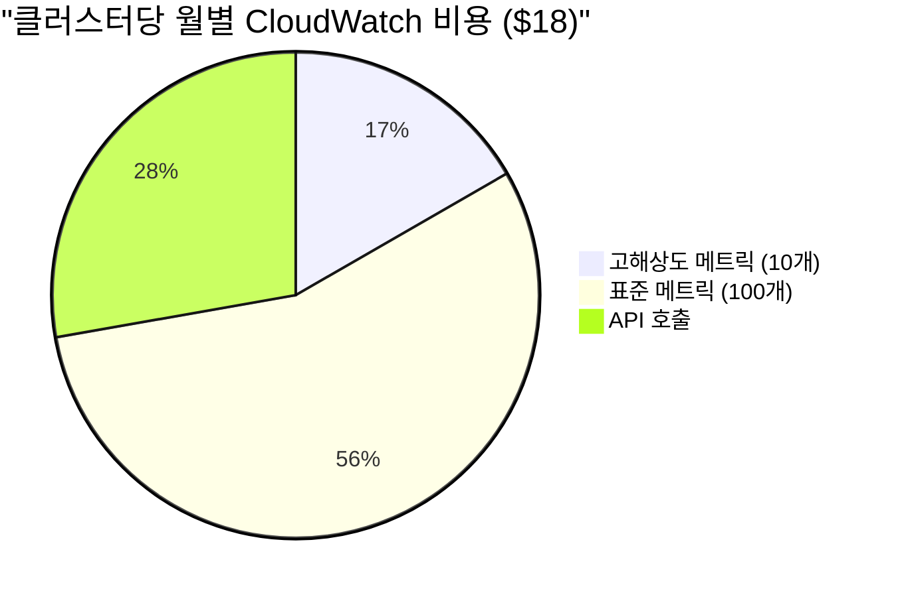
```mermaid
pie title "클러스터당 월별 CloudWatch 비용 ($18)"
    "고해상도 메트릭 (10개)" : 3
    "표준 메트릭 (100개)" : 10
    "API 호출" : 5

```

28개 클러스터 기준: 종합 모니터링에 월 ~$500 vs 모든 메트릭을 고해상도로 수집 시 $30,000+

### 권장 사용 사례

**CloudWatch High Resolution Metric이 적합한 경우:**

- 소규모 애플리케이션 (Pod 5,000개 이하)
- 간단한 모니터링 요구사항
- AWS 네이티브 솔루션 선호
- 빠른 구축과 안정적인 운영 우선

**ADOT + Prometheus가 적합한 경우:**

- 대규모 클러스터 (Pod 20,000개 이상)
- 높은 메트릭 처리량 요구
- 세밀한 모니터링 및 커스터마이징 필요
- 최고 수준의 성능과 확장성 필요

## 스케일링 최적화 아키텍처: 레이어별 분석

스케일링 응답 시간을 최소화하려면 모든 레이어에서 최적화가 필요합니다:

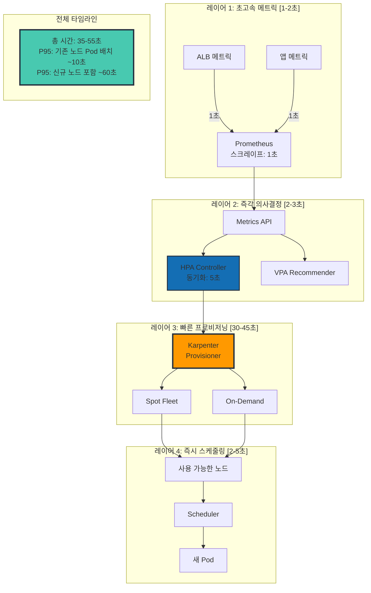
```mermaid
graph TB
    subgraph "레이어 1: 초고속 메트릭 [1-2초]"
        ALB[ALB 메트릭]
        APP[앱 메트릭]
        PROM[Prometheus<br/>스크레이프: 1초]

        ALB -->|1초| PROM
        APP -->|1초| PROM
    end

    subgraph "레이어 2: 즉각 의사결정 [2-3초]"
        MA[Metrics API]
        HPA[HPA Controller<br/>동기화: 5초]
        VPA[VPA Recommender]

        PROM --> MA
        MA --> HPA
        MA --> VPA
    end

    subgraph "레이어 3: 빠른 프로비저닝 [30-45초]"
        KARP[Karpenter<br/>Provisioner]
        SPOT[Spot Fleet]
        OD[On-Demand]

        HPA --> KARP
        KARP --> SPOT
        KARP --> OD
    end

    subgraph "레이어 4: 즉시 스케줄링 [2-5초]"
        SCHED[Scheduler]
        NODE[사용 가능한 노드]
        POD[새 Pod]

        SPOT --> NODE
        OD --> NODE
        NODE --> SCHED
        SCHED --> POD
    end

    subgraph "전체 타임라인"
        TOTAL[총 시간: 35-55초<br/>P95: 기존 노드 Pod 배치 ~10초<br/>P95: 신규 노드 포함 ~60초]
    end

    style KARP fill:#ff9900,stroke:#232f3e,stroke-width:3px
    style HPA fill:#146eb4,stroke:#232f3e,stroke-width:2px
    style TOTAL fill:#48C9B0,stroke:#232f3e,stroke-width:3px

```

## Karpenter 핵심 설정

60초 미만 노드 프로비저닝의 핵심은 최적의 Karpenter 구성에 있습니다:

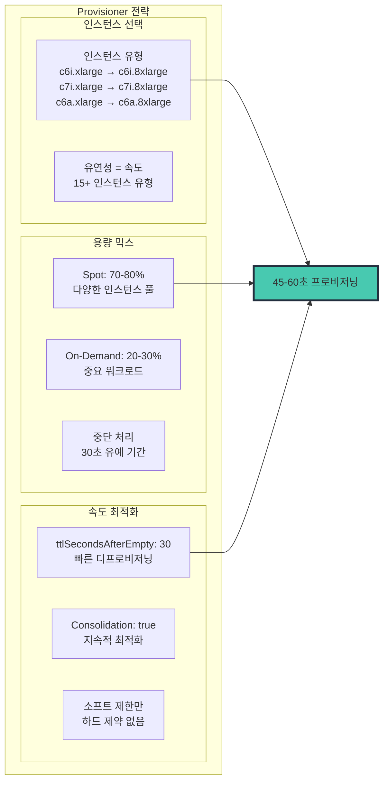
```mermaid
graph LR
    subgraph "Provisioner 전략"
        subgraph "인스턴스 선택"
            IT[인스턴스 유형<br/>c6i.xlarge → c6i.8xlarge<br/>c7i.xlarge → c7i.8xlarge<br/>c6a.xlarge → c6a.8xlarge]
            FLEX[유연성 = 속도<br/>15+ 인스턴스 유형]
        end

        subgraph "용량 믹스"
            SPOT[Spot: 70-80%<br/>다양한 인스턴스 풀]
            OD[On-Demand: 20-30%<br/>중요 워크로드]
            INT[중단 처리<br/>30초 유예 기간]
        end

        subgraph "속도 최적화"
            TTL[ttlSecondsAfterEmpty: 30<br/>빠른 디프로비저닝]
            CONS[Consolidation: true<br/>지속적 최적화]
            LIMITS[소프트 제한만<br/>하드 제약 없음]
        end
    end

    IT --> RESULT[45-60초 프로비저닝]
    SPOT --> RESULT
    TTL --> RESULT

    style RESULT fill:#48C9B0,stroke:#232f3e,stroke-width:3px

```

### Karpenter NodePool YAML

```yaml
apiVersion: karpenter.sh/v1
kind: NodePool
metadata:
  name: fast-scaling
spec:
  # 속도 최적화 구성
  disruption:
    consolidationPolicy: WhenEmptyOrUnderutilized
    consolidateAfter: 30s
    budgets:
    - nodes: "10%"

  # 속도를 위한 최대 유연성
  template:
    spec:
      requirements:
        - key: karpenter.sh/capacity-type
          operator: In
          values: ["spot", "on-demand"]
        - key: kubernetes.io/arch
          operator: In
          values: ["amd64"]
        - key: node.kubernetes.io/instance-type
          operator: In
          values:
            # 컴퓨팅 최적화 - 기본 선택
            - c6i.xlarge
            - c6i.2xlarge
            - c6i.4xlarge
            - c6i.8xlarge
            - c7i.xlarge
            - c7i.2xlarge
            - c7i.4xlarge
            - c7i.8xlarge
            # AMD 대안 - 더 나은 가용성
            - c6a.xlarge
            - c6a.2xlarge
            - c6a.4xlarge
            - c6a.8xlarge
            # 메모리 최적화 - 특정 워크로드용
            - m6i.xlarge
            - m6i.2xlarge
            - m6i.4xlarge

      nodeClassRef:
        group: karpenter.k8s.aws
        kind: EC2NodeClass
        name: fast-nodepool

  # 빠른 프로비저닝 보장
  limits:
    cpu: 100000  # 소프트 제한만
    memory: 400000Gi
---
apiVersion: karpenter.k8s.aws/v1
kind: EC2NodeClass
metadata:
  name: fast-nodepool
spec:
  amiSelectorTerms:
    - alias: al2023@latest

  subnetSelectorTerms:
    - tags:
        karpenter.sh/discovery: "${CLUSTER_NAME}"

  securityGroupSelectorTerms:
    - tags:
        karpenter.sh/discovery: "${CLUSTER_NAME}"

  role: "KarpenterNodeRole-${CLUSTER_NAME}"

  # 속도 최적화
  userData: |
    #!/bin/bash
    # 노드 시작 시간 최적화
    /etc/eks/bootstrap.sh ${CLUSTER_NAME} \
      --b64-cluster-ca ${B64_CLUSTER_CA} \
      --apiserver-endpoint ${API_SERVER_URL} \
      --kubelet-extra-args '--node-labels=karpenter.sh/fast-scaling=true --max-pods=110'

    # 중요 이미지 사전 풀 (registry.k8s.io는 k8s.gcr.io 대체)
    ctr -n k8s.io images pull registry.k8s.io/pause:3.10 &
    ctr -n k8s.io images pull public.ecr.aws/eks-distro/kubernetes/pause:3.10 &

```

## 실시간 스케일링 워크플로

모든 구성 요소가 함께 작동하여 최적의 스케일링 성능을 달성하는 방법:

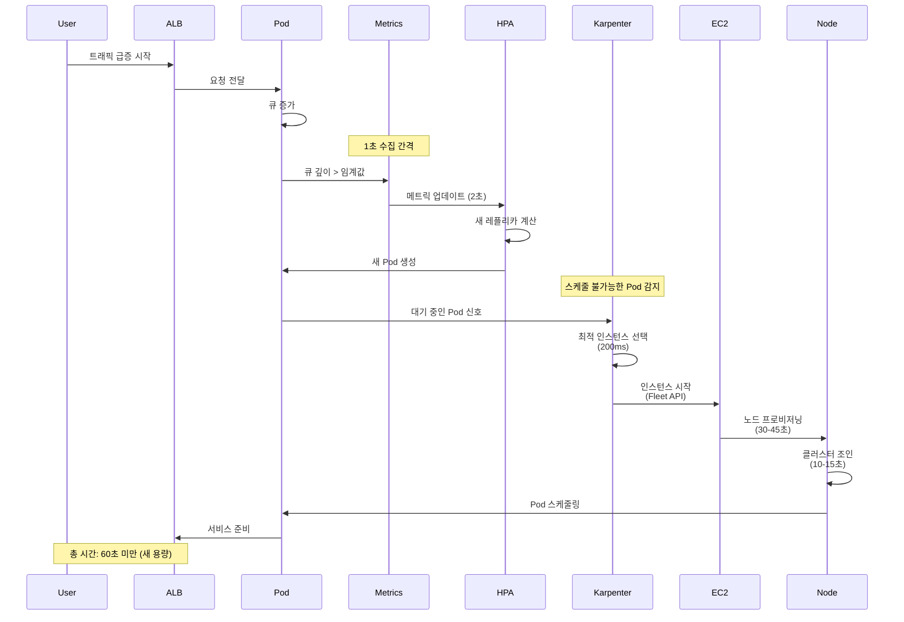
```mermaid
sequenceDiagram
    participant User
    participant ALB
    participant Pod
    participant Metrics
    participant HPA
    participant Karpenter
    participant EC2
    participant Node

    User->>ALB: 트래픽 급증 시작
    ALB->>Pod: 요청 전달
    Pod->>Pod: 큐 증가

    Note over Metrics: 1초 수집 간격
    Pod->>Metrics: 큐 깊이 > 임계값
    Metrics->>HPA: 메트릭 업데이트 (2초)

    HPA->>HPA: 새 레플리카 계산
    HPA->>Pod: 새 Pod 생성

    Note over Karpenter: 스케줄 불가능한 Pod 감지
    Pod->>Karpenter: 대기 중인 Pod 신호
    Karpenter->>Karpenter: 최적 인스턴스 선택<br/>(200ms)

    Karpenter->>EC2: 인스턴스 시작<br/>(Fleet API)
    EC2->>Node: 노드 프로비저닝<br/>(30-45초)

    Node->>Node: 클러스터 조인<br/>(10-15초)
    Node->>Pod: Pod 스케줄링
    Pod->>ALB: 서비스 준비

    Note over User,ALB: 총 시간: 60초 미만 (새 용량)

```

## 공격적 스케일링을 위한 HPA 구성

HorizontalPodAutoscaler는 즉각적인 응답을 위해 구성되어야 합니다:

```yaml
apiVersion: autoscaling/v2
kind: HorizontalPodAutoscaler
metadata:
  name: ultra-fast-hpa
spec:
  scaleTargetRef:
    apiVersion: apps/v1
    kind: Deployment
    name: web-app
  minReplicas: 10
  maxReplicas: 1000

  metrics:
  # 기본 메트릭 - 큐 깊이
  - type: External
    external:
      metric:
        name: sqs_queue_depth
        selector:
          matchLabels:
            queue: "web-requests"
      target:
        type: AverageValue
        averageValue: "10"

  # 보조 메트릭 - 요청 속도
  - type: External
    external:
      metric:
        name: alb_request_rate
        selector:
          matchLabels:
            targetgroup: "web-tg"
      target:
        type: AverageValue
        averageValue: "100"

  behavior:
    scaleUp:
      stabilizationWindowSeconds: 0  # 지연 없음!
      policies:
      - type: Percent
        value: 100
        periodSeconds: 10
      - type: Pods
        value: 100
        periodSeconds: 10
      selectPolicy: Max
    scaleDown:
      stabilizationWindowSeconds: 300  # 5분 쿨다운
      policies:
      - type: Percent
        value: 10
        periodSeconds: 60

```

## KEDA 활용 시점: 이벤트 드리븐 시나리오

Karpenter가 인프라 스케일링을 처리하는 반면, KEDA는 특정 이벤트 드리븐 시나리오에서 뛰어납니다:

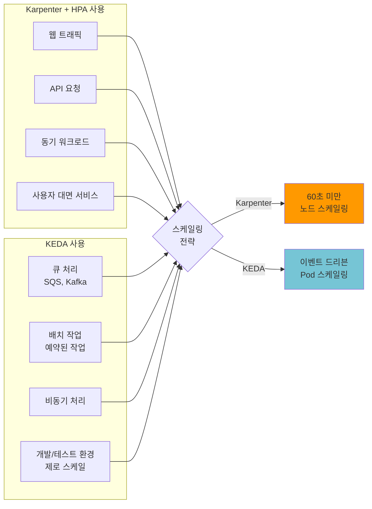
```mermaid
graph LR
    subgraph "Karpenter + HPA 사용"
        WEB[웹 트래픽]
        API[API 요청]
        SYNC[동기 워크로드]
        USER[사용자 대면 서비스]
    end

    subgraph "KEDA 사용"
        QUEUE[큐 처리<br/>SQS, Kafka]
        BATCH[배치 작업<br/>예약된 작업]
        ASYNC[비동기 처리]
        DEV[개발/테스트 환경<br/>제로 스케일]
    end

    WEB --> DECISION{스케일링<br/>전략}
    API --> DECISION
    SYNC --> DECISION
    USER --> DECISION

    QUEUE --> DECISION
    BATCH --> DECISION
    ASYNC --> DECISION
    DEV --> DECISION

    DECISION -->|Karpenter| FAST[60초 미만<br/>노드 스케일링]
    DECISION -->|KEDA| EVENT[이벤트 드리븐<br/>Pod 스케일링]

    style FAST fill:#ff9900
    style EVENT fill:#76c5d5

```

## 프로덕션 성능 메트릭

일일 750K+ 요청을 처리하는 배포의 실제 결과:

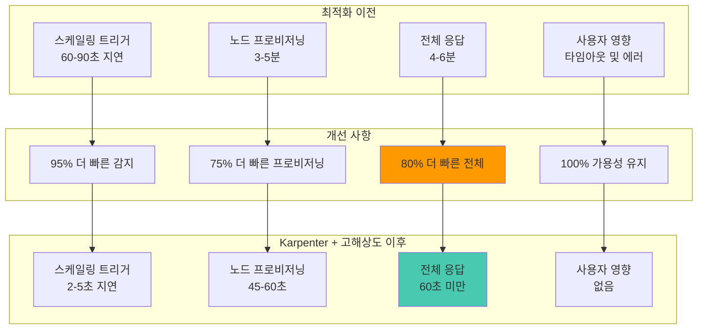
```mermaid
graph TB
    subgraph "최적화 이전"
        B1[스케일링 트리거<br/>60-90초 지연]
        B2[노드 프로비저닝<br/>3-5분]
        B3[전체 응답<br/>4-6분]
        B4[사용자 영향<br/>타임아웃 및 에러]
    end

    subgraph "Karpenter + 고해상도 이후"
        A1[스케일링 트리거<br/>2-5초 지연]
        A2[노드 프로비저닝<br/>45-60초]
        A3[전체 응답<br/>60초 미만]
        A4[사용자 영향<br/>없음]
    end

    subgraph "개선 사항"
        I1[95% 더 빠른 감지]
        I2[75% 더 빠른 프로비저닝]
        I3[80% 더 빠른 전체]
        I4[100% 가용성 유지]
    end

    B1 --> I1
    B2 --> I2
    B3 --> I3
    B4 --> I4

    I1 --> A1
    I2 --> A2
    I3 --> A3
    I4 --> A4

    style A3 fill:#48C9B0
    style I3 fill:#ff9900

```

## 다중 리전 고려 사항

여러 리전에서 운영하는 조직의 경우, 일관된 고속 스케일링을 위해 리전별 최적화가 필요합니다:

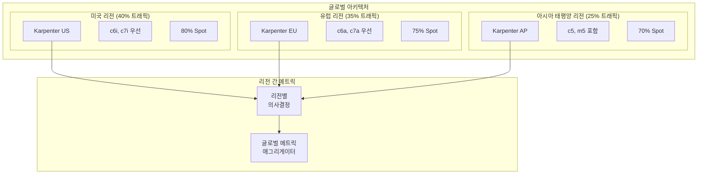
```mermaid
graph TB
    subgraph "글로벌 아키텍처"
        subgraph "미국 리전 (40% 트래픽)"
            US_KARP[Karpenter US]
            US_TYPES[c6i, c7i 우선]
            US_SPOT[80% Spot]
        end

        subgraph "유럽 리전 (35% 트래픽)"
            EU_KARP[Karpenter EU]
            EU_TYPES[c6a, c7a 우선]
            EU_SPOT[75% Spot]
        end

        subgraph "아시아 태평양 리전 (25% 트래픽)"
            AP_KARP[Karpenter AP]
            AP_TYPES[c5, m5 포함]
            AP_SPOT[70% Spot]
        end
    end

    subgraph "리전 간 메트릭"
        GLOBAL[글로벌 메트릭<br/>애그리게이터]
        REGIONAL[리전별<br/>의사결정]
    end

    US_KARP --> REGIONAL
    EU_KARP --> REGIONAL
    AP_KARP --> REGIONAL

    REGIONAL --> GLOBAL

```

## 스케일링 최적화 모범 사례

### 1. 메트릭 선택

- 선행 지표(큐 깊이, 연결 수) 사용, 후행 지표(CPU) 아님
- 클러스터당 고해상도 메트릭을 10-15개 이하로 유지
- API 스로틀링 방지를 위한 배치 메트릭 제출

### 2. Karpenter 최적화

- 최대 인스턴스 유형 유연성 제공
- 적절한 중단 처리와 함께 Spot 인스턴스 적극 활용
- 비용 효율성을 위한 통합 활성화
- 적절한 ttlSecondsAfterEmpty 설정 (30-60초)

### 3. HPA 튜닝

- 스케일업을 위한 제로 안정화 윈도우
- 공격적인 스케일링 정책 (100% 증가 허용)
- 적절한 가중치를 가진 여러 메트릭
- 스케일다운을 위한 적절한 쿨다운

### 4. 모니터링

- P95 스케일링 지연 시간을 기본 KPI로 추적
- 15초를 초과하는 스케일링 실패 또는 지연에 대한 알림
- Spot 중단 비율 모니터링
- 스케일된 Pod당 비용 추적

## 일반적인 문제 해결

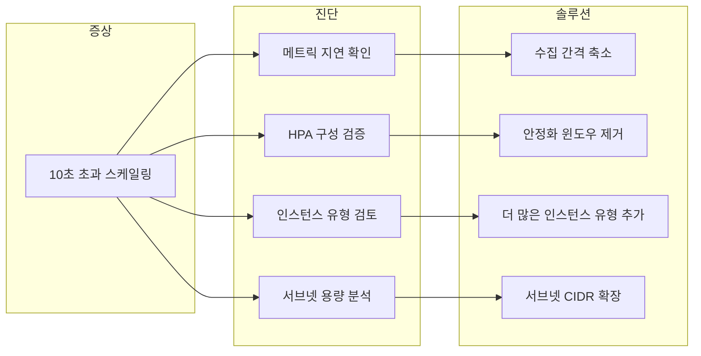
```mermaid
graph LR
    subgraph "증상"
        SLOW[10초 초과 스케일링]
    end

    subgraph "진단"
        D1[메트릭 지연 확인]
        D2[HPA 구성 검증]
        D3[인스턴스 유형 검토]
        D4[서브넷 용량 분석]
    end

    subgraph "솔루션"
        S1[수집 간격 축소]
        S2[안정화 윈도우 제거]
        S3[더 많은 인스턴스 유형 추가]
        S4[서브넷 CIDR 확장]
    end

    SLOW --> D1 --> S1
    SLOW --> D2 --> S2
    SLOW --> D3 --> S3
    SLOW --> D4 --> S4

```

## 하이브리드 접근 방식 (권장)

실제 프로덕션 환경에서는 두 가지 방식을 혼합한 하이브리드 접근을 권장합니다:

1. **미션 크리티컬 서비스**: ADOT + Prometheus로 10-13초 스케일링 달성
2. **일반 서비스**: CloudWatch Direct로 12-15초 스케일링 및 운영 단순화
3. **점진적 마이그레이션**: CloudWatch에서 시작하여 필요에 따라 ADOT로 전환

## EKS Auto Mode vs Self-managed Karpenter

EKS Auto Mode (2025 GA)는 Karpenter를 내장하여 자동 관리합니다:

| 항목 | Self-managed Karpenter | EKS Auto Mode |
|------|----------------------|---------------|
| 설치/업그레이드 | 직접 관리 (Helm) | AWS 자동 관리 |
| NodePool 설정 | 완전한 커스터마이징 | 제한된 설정 |
| 비용 최적화 | 세밀한 제어 가능 | 자동 최적화 |
| OS 패치 | 직접 관리 | 자동 패치 |
| 적합한 환경 | 고급 커스터마이징 필요 | 운영 부담 최소화 |

**권장**: 복잡한 스케줄링 요구사항이 있는 경우 Self-managed, 운영 단순화가 목표인 경우 EKS Auto Mode를 선택합니다.

## P1: 초고속 스케일링 아키텍처 (Critical)

### 스케일링 지연 시간 분해 분석

스케일링 응답 시간을 최적화하기 위해서는 먼저 전체 스케일링 체인에서 발생하는 지연 시간을 세밀하게 분해해야 합니다.

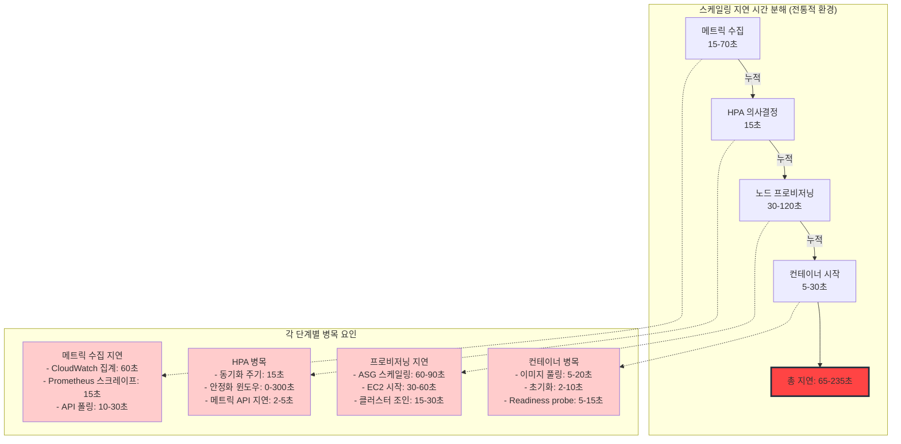
```mermaid
graph TB
    subgraph "스케일링 지연 시간 분해 (전통적 환경)"
        M[메트릭 수집<br/>15-70초]
        H[HPA 의사결정<br/>15초]
        N[노드 프로비저닝<br/>30-120초]
        C[컨테이너 시작<br/>5-30초]

        M -->|누적| H
        H -->|누적| N
        N -->|누적| C

        TOTAL[총 지연: 65-235초]
        C --> TOTAL
    end

    subgraph "각 단계별 병목 요인"
        M1[메트릭 수집 지연<br/>- CloudWatch 집계: 60초<br/>- Prometheus 스크레이프: 15초<br/>- API 폴링: 10-30초]

        H1[HPA 병목<br/>- 동기화 주기: 15초<br/>- 안정화 윈도우: 0-300초<br/>- 메트릭 API 지연: 2-5초]

        N1[프로비저닝 지연<br/>- ASG 스케일링: 60-90초<br/>- EC2 시작: 30-60초<br/>- 클러스터 조인: 15-30초]

        C1[컨테이너 병목<br/>- 이미지 풀링: 5-20초<br/>- 초기화: 2-10초<br/>- Readiness probe: 5-15초]
    end

    M -.-> M1
    H -.-> H1
    N -.-> N1
    C -.-> C1

    style TOTAL fill:#ff4444,stroke:#232f3e,stroke-width:3px
    style M1 fill:#ffcccc
    style H1 fill:#ffcccc
    style N1 fill:#ffcccc
    style C1 fill:#ffcccc
```

<ScalingLatencyBreakdown />

:::danger 결과
트래픽 급증 시 **5분 이상 사용자가 에러를 경험** — 노드 프로비저닝이 전체 지연의 60% 이상 차지
:::

### 멀티 레이어 스케일링 전략

초고속 스케일링은 단일 최적화가 아닌 **3개 레이어의 폴백 전략**으로 달성됩니다.

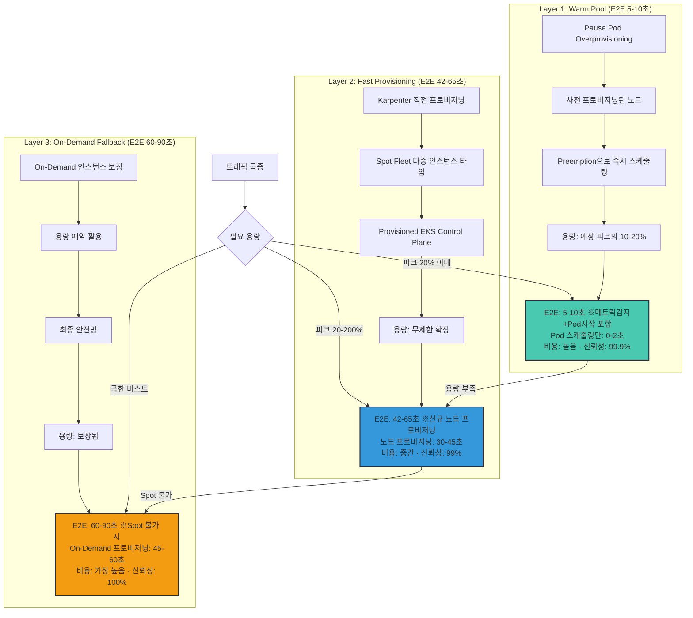
```mermaid
graph TB
    subgraph "Layer 1: Warm Pool (E2E 5-10초)"
        WP1[Pause Pod Overprovisioning]
        WP2[사전 프로비저닝된 노드]
        WP3[Preemption으로 즉시 스케줄링]
        WP4[용량: 예상 피크의 10-20%]

        WP1 --> WP2 --> WP3 --> WP4

        WP_RESULT[E2E: 5-10초 ※메트릭감지+Pod시작 포함<br/>Pod 스케줄링만: 0-2초<br/>비용: 높음 · 신뢰성: 99.9%]
        WP4 --> WP_RESULT
    end

    subgraph "Layer 2: Fast Provisioning (E2E 42-65초)"
        FP1[Karpenter 직접 프로비저닝]
        FP2[Spot Fleet 다중 인스턴스 타입]
        FP3[Provisioned EKS Control Plane]
        FP4[용량: 무제한 확장]

        FP1 --> FP2 --> FP3 --> FP4

        FP_RESULT[E2E: 42-65초 ※신규 노드 프로비저닝<br/>노드 프로비저닝: 30-45초<br/>비용: 중간 · 신뢰성: 99%]
        FP4 --> FP_RESULT
    end

    subgraph "Layer 3: On-Demand Fallback (E2E 60-90초)"
        OD1[On-Demand 인스턴스 보장]
        OD2[용량 예약 활용]
        OD3[최종 안전망]
        OD4[용량: 보장됨]

        OD1 --> OD2 --> OD3 --> OD4

        OD_RESULT[E2E: 60-90초 ※Spot 불가 시<br/>On-Demand 프로비저닝: 45-60초<br/>비용: 가장 높음 · 신뢰성: 100%]
        OD4 --> OD_RESULT
    end

    TRAFFIC[트래픽 급증] --> DECISION{필요 용량}
    DECISION -->|피크 20% 이내| WP_RESULT
    DECISION -->|피크 20-200%| FP_RESULT
    DECISION -->|극한 버스트| OD_RESULT

    WP_RESULT -->|용량 부족| FP_RESULT
    FP_RESULT -->|Spot 불가| OD_RESULT

    style WP_RESULT fill:#48C9B0,stroke:#232f3e,stroke-width:2px
    style FP_RESULT fill:#3498DB,stroke:#232f3e,stroke-width:2px
    style OD_RESULT fill:#F39C12,stroke:#232f3e,stroke-width:2px
```

### 레이어별 스케일링 타임라인 비교

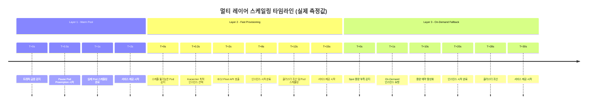
```mermaid
timeline
    title 멀티 레이어 스케일링 타임라인 (실제 측정값)

    section Layer 1 - Warm Pool
        T+0s : 트래픽 급증 감지
        T+0.5s : Pause Pod Preemption 시작
        T+1s : 실제 Pod 스케줄링 완료
        T+2s : 서비스 제공 시작

    section Layer 2 - Fast Provisioning
        T+0s : 스케줄 불가능한 Pod 감지
        T+0.2s : Karpenter 최적 인스턴스 선택
        T+2s : EC2 Fleet API 호출
        T+8s : 인스턴스 시작 완료
        T+12s : 클러스터 조인 및 Pod 스케줄링
        T+15s : 서비스 제공 시작

    section Layer 3 - On-Demand Fallback
        T+0s : Spot 용량 부족 감지
        T+1s : On-Demand 인스턴스 요청
        T+10s : 용량 예약 활성화
        T+20s : 인스턴스 시작 완료
        T+28s : 클러스터 조인
        T+30s : 서비스 제공 시작
```

:::tip 레이어 선택 기준
**Layer 1 (Warm Pool)** — 사전 할당 전략:
- **본질**: 오토스케일링이 아닌 **오버프로비저닝**. Pause Pod로 미리 노드를 확보
- E2E 5-10초 (메트릭 감지 + Preemption + 컨테이너 시작)
- **비용**: 예상 피크 용량의 10-20%를 24시간 유지 (월 $720-$5,400)
- **검토**: 동일 비용으로 기본 replica를 증설하는 것이 더 단순할 수 있음

**Layer 2 (Fast Provisioning)** — 대부분의 기본 전략:
- Karpenter + Spot 인스턴스로 실제 노드 프로비저닝
- E2E 42-65초 (메트릭 감지 + EC2 launch + 컨테이너 시작)
- **비용**: 실제 사용량에 비례 (Spot 70-80% 할인)
- **검토**: 아키텍처 복원력(큐 기반)과 조합하면 이 시간이 사용자에게 노출되지 않음

**Layer 3 (On-Demand Fallback)** — 필수 보험:
- Spot 용량 부족 시 최종 안전망
- E2E 60-90초 (On-Demand는 Spot보다 프로비저닝이 느릴 수 있음)
- **비용**: On-Demand 가격 (최소 사용)
:::

## P2: Provisioned EKS Control Plane으로 API 병목 제거

### Provisioned Control Plane 개요

2025년 11월 AWS는 **EKS Provisioned Control Plane**을 발표했습니다. 기존 Standard Control Plane의 API 스로틀링 한계를 제거하여 대규모 버스트 시나리오에서 스케일링 속도를 획기적으로 개선합니다.

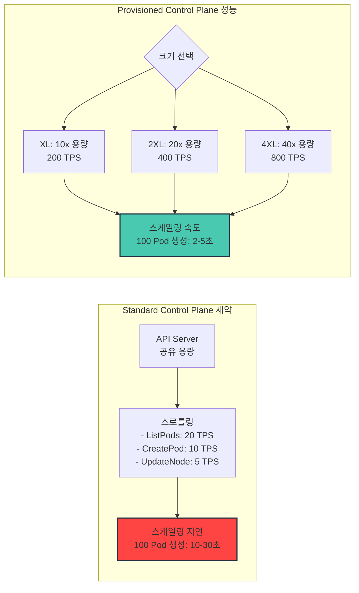
```mermaid
graph LR
    subgraph "Standard Control Plane 제약"
        STD_API[API Server<br/>공유 용량]
        STD_THROTTLE[스로틀링<br/>- ListPods: 20 TPS<br/>- CreatePod: 10 TPS<br/>- UpdateNode: 5 TPS]
        STD_DELAY[스케일링 지연<br/>100 Pod 생성: 10-30초]

        STD_API --> STD_THROTTLE --> STD_DELAY
    end

    subgraph "Provisioned Control Plane 성능"
        PROV_SIZE{크기 선택}
        PROV_XL[XL: 10x 용량<br/>200 TPS]
        PROV_2XL[2XL: 20x 용량<br/>400 TPS]
        PROV_4XL[4XL: 40x 용량<br/>800 TPS]
        PROV_RESULT[스케일링 속도<br/>100 Pod 생성: 2-5초]

        PROV_SIZE --> PROV_XL
        PROV_SIZE --> PROV_2XL
        PROV_SIZE --> PROV_4XL

        PROV_XL --> PROV_RESULT
        PROV_2XL --> PROV_RESULT
        PROV_4XL --> PROV_RESULT
    end

    style STD_DELAY fill:#ff4444,stroke:#232f3e,stroke-width:2px
    style PROV_RESULT fill:#48C9B0,stroke:#232f3e,stroke-width:2px
```

### Standard vs Provisioned 비교

<ControlPlaneComparison />

:::warning Provisioned Control Plane 선택 기준
**Provisioned로 업그레이드해야 하는 신호:**

1. **API 스로틀링 에러 빈발**: `kubectl` 명령이 자주 실패하거나 재시도
2. **대규모 배포 지연**: 100+ Pod 배포 시 5분 이상 소요
3. **Karpenter 노드 프로비저닝 실패**: `too many requests` 에러
4. **HPA 스케일링 지연**: Pod 생성 요청이 큐에 쌓임
5. **클러스터 크기**: 상시 1,000 Pod 이상 또는 피크 3,000 Pod 이상

**비용 vs 성능 트레이드오프:**
- **Standard → XL**: 월 $350 추가 비용으로 **10배 API 성능** (ROI: 10분 다운타임 방지로 상쇄)
- **XL → 2XL**: 초대규모 클러스터(10,000+ Pod)에만 필요
- **4XL**: 극한 규모(50,000+ Pod) 또는 멀티 테넌트 플랫폼용
:::

### Provisioned Control Plane 설정

#### AWS CLI로 신규 클러스터 생성

```bash
aws eks create-cluster \
  --name ultra-fast-cluster \
  --region us-east-1 \
  --role-arn arn:aws:iam::123456789012:role/EKSClusterRole \
  --resources-vpc-config subnetIds=subnet-xxx,subnet-yyy,securityGroupIds=sg-xxx \
  --kubernetes-version 1.32 \
  --compute-config enabled=true,nodePools=system,nodeRoleArn=arn:aws:iam::123456789012:role/EKSNodeRole \
  --kubernetes-network-config elasticLoadBalancing=disabled \
  --access-config authenticationMode=API \
  --upgrade-policy supportType=EXTENDED \
  --zonal-shift-config enabled=true \
  --compute-config enabled=true \
  --control-plane-placement groupName=my-placement-group,clusterTenancy=dedicated \
  --control-plane-provisioning mode=PROVISIONED,size=XL
```

#### 기존 클러스터 업그레이드 (Standard → Provisioned)

```bash
# 1. 현재 Control Plane 모드 확인
aws eks describe-cluster --name my-cluster --query 'cluster.controlPlaneProvisioning'

# 2. Provisioned로 업그레이드 (다운타임 없음)
aws eks update-cluster-config \
  --name my-cluster \
  --control-plane-provisioning mode=PROVISIONED,size=XL

# 3. 업그레이드 상태 모니터링 (10-15분 소요)
aws eks describe-cluster \
  --name my-cluster \
  --query 'cluster.status'

# 4. API 성능 검증
kubectl get pods --all-namespaces --watch
kubectl create deployment nginx --image=nginx --replicas=100
```

:::info 업그레이드 특징
- **다운타임 없음**: Control Plane이 자동으로 롤링 업그레이드
- **소요 시간**: 10-15분 (클러스터 크기 무관)
- **롤백 불가**: Provisioned → Standard 다운그레이드 지원 안 함
- **비용 시작**: 업그레이드 완료 즉시 청구 시작
:::

### 대규모 버스트 시 성능 비교

실제 프로덕션 환경에서 1,000 Pod 동시 스케일링 테스트:

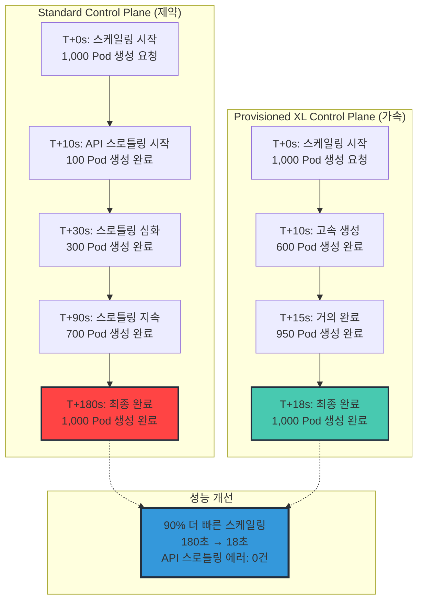
```mermaid
graph TB
    subgraph "Standard Control Plane (제약)"
        STD1[T+0s: 스케일링 시작<br/>1,000 Pod 생성 요청]
        STD2[T+10s: API 스로틀링 시작<br/>100 Pod 생성 완료]
        STD3[T+30s: 스로틀링 심화<br/>300 Pod 생성 완료]
        STD4[T+90s: 스로틀링 지속<br/>700 Pod 생성 완료]
        STD5[T+180s: 최종 완료<br/>1,000 Pod 생성 완료]

        STD1 --> STD2 --> STD3 --> STD4 --> STD5
    end

    subgraph "Provisioned XL Control Plane (가속)"
        PROV1[T+0s: 스케일링 시작<br/>1,000 Pod 생성 요청]
        PROV2[T+10s: 고속 생성<br/>600 Pod 생성 완료]
        PROV3[T+15s: 거의 완료<br/>950 Pod 생성 완료]
        PROV4[T+18s: 최종 완료<br/>1,000 Pod 생성 완료]

        PROV1 --> PROV2 --> PROV3 --> PROV4
    end

    subgraph "성능 개선"
        IMPROVE[90% 더 빠른 스케일링<br/>180초 → 18초<br/>API 스로틀링 에러: 0건]
    end

    STD5 -.-> IMPROVE
    PROV4 -.-> IMPROVE

    style STD5 fill:#ff4444,stroke:#232f3e,stroke-width:2px
    style PROV4 fill:#48C9B0,stroke:#232f3e,stroke-width:2px
    style IMPROVE fill:#3498DB,stroke:#232f3e,stroke-width:3px
```

## P3: Warm Pool / Overprovisioning 패턴 (핵심 전략)

### Pause Pod Overprovisioning 원리

Warm Pool 전략은 **낮은 우선순위의 "pause" Pod를 사전 배포**하여 노드를 미리 프로비저닝합니다. 실제 워크로드가 필요할 때 pause Pod를 즉시 축출(preempt)하고 해당 노드에 실제 Pod를 스케줄링합니다.

```mermaid
sequenceDiagram
    participant HPA as HPA Controller
    participant Scheduler as K8s Scheduler
    participant PausePod as Pause Pod<br/>(Priority: -1)
    participant Node as 사전 프로비저닝된 노드
    participant RealPod as 실제 워크로드 Pod<br/>(Priority: 0)

    Note over Node,PausePod: 초기 상태: Pause Pod가 노드 점유
    PausePod->>Node: Running (리소스 예약 중)

    Note over HPA: 트래픽 급증 감지
    HPA->>RealPod: 새 Pod 생성 요청

    RealPod->>Scheduler: 스케줄링 요청
    Scheduler->>Scheduler: 우선순위 평가<br/>Real (0) > Pause (-1)

    Scheduler->>PausePod: Preempt 신호
    PausePod->>Node: 즉시 종료 (0.5초)

    Scheduler->>RealPod: Node에 스케줄링
    RealPod->>Node: 즉시 시작 (1-2초)

    Note over RealPod,Node: 총 소요 시간: 1.5-2.5초
```

### Overprovisioning 전체 동작 흐름

```mermaid
graph TB
    subgraph "1단계: Warm Pool 사전 설정 (피크 타임 전)"
        CRON[CronJob 트리거<br/>예: 오전 8시 30분]
        PAUSE_DEPLOY[Pause Deployment 생성<br/>Replicas: 예상 피크의 15%]
        PAUSE_POD[Pause Pod 배포<br/>CPU: 1000m, Memory: 2Gi]
        KARP_PROVISION[Karpenter 노드 프로비저닝<br/>Spot 인스턴스 선택]
        WARM[Warm Pool 준비 완료<br/>즉시 사용 가능한 용량]

        CRON --> PAUSE_DEPLOY --> PAUSE_POD --> KARP_PROVISION --> WARM
    end

    subgraph "2단계: 트래픽 급증 대응 (실시간)"
        TRAFFIC[트래픽 급증 발생]
        HPA_SCALE[HPA 스케일업 결정<br/>Replicas: 100 → 150]
        REAL_POD[실제 Pod 생성 요청<br/>Priority: 0]
        PREEMPT[Pause Pod Preemption<br/>우선순위 기반 축출]
        INSTANT[즉시 스케줄링<br/>1-2초 소요]

        TRAFFIC --> HPA_SCALE --> REAL_POD --> PREEMPT --> INSTANT
    end

    subgraph "3단계: 추가 확장 (용량 초과 시)"
        OVERFLOW{Warm Pool<br/>소진?}
        MORE_NODES[Karpenter 추가 노드<br/>Layer 2 전략 발동]

        INSTANT --> OVERFLOW
        OVERFLOW -->|Yes| MORE_NODES
        OVERFLOW -->|No| INSTANT
    end

    subgraph "4단계: 스케일다운 및 재충전 (피크 종료 후)"
        SCALE_DOWN[HPA 스케일다운<br/>Replicas: 150 → 100]
        REFILL[Pause Pod 재배포<br/>Warm Pool 재충전]
        CLEANUP[유휴 노드 정리<br/>ttlSecondsAfterEmpty: 60s]

        SCALE_DOWN --> REFILL --> CLEANUP
    end

    WARM --> TRAFFIC
    MORE_NODES --> SCALE_DOWN

    style INSTANT fill:#48C9B0,stroke:#232f3e,stroke-width:3px
    style WARM fill:#3498DB,stroke:#232f3e,stroke-width:2px
```

### Pause Pod Overprovisioning YAML 구성

#### 1. PriorityClass 정의 (낮은 우선순위)

```yaml
apiVersion: scheduling.k8s.io/v1
kind: PriorityClass
metadata:
  name: overprovisioning
value: -1  # 음수 우선순위: 모든 실제 워크로드보다 낮음
globalDefault: false
description: "Pause pods for warm pool - will be preempted by real workloads"
```

#### 2. Pause Deployment (기본 Warm Pool)

```yaml
apiVersion: apps/v1
kind: Deployment
metadata:
  name: overprovisioning-pause
  namespace: kube-system
spec:
  replicas: 10  # 예상 피크의 15%에 해당하는 Pod 수
  selector:
    matchLabels:
      app: overprovisioning-pause
  template:
    metadata:
      labels:
        app: overprovisioning-pause
    spec:
      priorityClassName: overprovisioning
      terminationGracePeriodSeconds: 0  # 즉시 종료

      # 스케줄링 제약 (실제 워크로드와 동일한 노드 풀)
      nodeSelector:
        karpenter.sh/nodepool: fast-scaling

      containers:
      - name: pause
        image: registry.k8s.io/pause:3.9
        resources:
          requests:
            cpu: "1000m"      # 실제 워크로드 평균 CPU
            memory: "2Gi"     # 실제 워크로드 평균 메모리
          limits:
            cpu: "1000m"
            memory: "2Gi"
```

#### 3. 시간대별 Warm Pool 자동 조정 (CronJob)

```yaml
---
# 피크 타임 전 Warm Pool 확장 (오전 8시 30분)
apiVersion: batch/v1
kind: CronJob
metadata:
  name: scale-up-warm-pool
  namespace: kube-system
spec:
  schedule: "30 8 * * 1-5"  # 평일 오전 8시 30분
  jobTemplate:
    spec:
      template:
        spec:
          serviceAccountName: warm-pool-scaler
          restartPolicy: OnFailure
          containers:
          - name: kubectl
            image: bitnami/kubectl:latest
            command:
            - /bin/sh
            - -c
            - |
              kubectl scale deployment overprovisioning-pause \
                --namespace kube-system \
                --replicas=30  # 피크 타임용 확장
---
# 피크 타임 후 Warm Pool 축소 (오후 7시)
apiVersion: batch/v1
kind: CronJob
metadata:
  name: scale-down-warm-pool
  namespace: kube-system
spec:
  schedule: "0 19 * * 1-5"  # 평일 오후 7시
  jobTemplate:
    spec:
      template:
        spec:
          serviceAccountName: warm-pool-scaler
          restartPolicy: OnFailure
          containers:
          - name: kubectl
            image: bitnami/kubectl:latest
            command:
            - /bin/sh
            - -c
            - |
              kubectl scale deployment overprovisioning-pause \
                --namespace kube-system \
                --replicas=5  # 야간 최소 용량
---
# CronJob용 ServiceAccount 및 RBAC
apiVersion: v1
kind: ServiceAccount
metadata:
  name: warm-pool-scaler
  namespace: kube-system
---
apiVersion: rbac.authorization.k8s.io/v1
kind: Role
metadata:
  name: warm-pool-scaler
  namespace: kube-system
rules:
- apiGroups: ["apps"]
  resources: ["deployments", "deployments/scale"]
  verbs: ["get", "patch", "update"]
---
apiVersion: rbac.authorization.k8s.io/v1
kind: RoleBinding
metadata:
  name: warm-pool-scaler
  namespace: kube-system
roleRef:
  apiGroup: rbac.authorization.k8s.io
  kind: Role
  name: warm-pool-scaler
subjects:
- kind: ServiceAccount
  name: warm-pool-scaler
  namespace: kube-system
```

### Warm Pool 크기 계산 방법

```mermaid
graph TB
    subgraph "1단계: 트래픽 패턴 분석"
        BASELINE[Baseline 용량<br/>평상시 Replicas: 100]
        PEAK[피크 용량<br/>최대 Replicas: 200]
        BURST[버스트 속도<br/>초당 10 Pod 증가]

        ANALYSIS[분석 결과<br/>피크 델타: 100 Pod<br/>10초 내 필요: 100 Pod]
    end

    subgraph "2단계: Warm Pool 크기 결정"
        FORMULA[Warm Pool 크기 = <br/>피크 델타 × 안전 계수]
        SAFETY[안전 계수 선택<br/>- 보수적: 0.20 (20%)<br/>- 균형: 0.15 (15%)<br/>- 공격적: 0.10 (10%)]

        CALC[계산 예시<br/>100 Pod × 0.15 = 15 Pod]
    end

    subgraph "3단계: 비용 vs 속도 트레이드오프"
        COST[Warm Pool 비용<br/>15 Pod × $0.05/hr = $0.75/hr<br/>월간: $540]

        BENEFIT[지연 시간 감소<br/>60초 → 2초 (97% 개선)<br/>SLA 위반 방지: $10,000/월]

        ROI[ROI 분석<br/>투자: $540/월<br/>절감: $10,000/월<br/>순익: $9,460/월]
    end

    BASELINE --> ANALYSIS
    PEAK --> ANALYSIS
    BURST --> ANALYSIS

    ANALYSIS --> FORMULA --> SAFETY --> CALC
    CALC --> COST --> BENEFIT --> ROI

    style ROI fill:#48C9B0,stroke:#232f3e,stroke-width:3px
```

### 비용 분석 및 최적화

<WarmPoolCostAnalysis />

:::tip Warm Pool 최적화 전략
**비용 절감 방법:**

1. **시간대별 스케일링**: CronJob으로 야간/주말 Warm Pool 축소 (50-70% 비용 절감)
2. **Spot 인스턴스 활용**: Pause Pod도 Spot 노드에 배포 (70% 할인)
3. **적응형 크기 조정**: CloudWatch Metrics 기반 자동 스케일링
4. **혼합 전략**: 피크 타임만 Warm Pool, 기타 시간은 Layer 2 의존

**ROI 계산식:**
```
ROI = (SLA 위반 방지 비용 + 매출 기회 손실 방지) - Warm Pool 비용

예시:
- SLA 위반 페널티: $5,000/건
- 월 평균 위반 횟수 (Warm Pool 없을 시): 3건
- Warm Pool 비용: $1,080/월
- ROI = ($5,000 × 3) - $1,080 = $13,920/월 (1,290% ROI)
```
:::

## P4: Setu - Kueue + Karpenter 프로액티브 프로비저닝

### Setu 개요

**Setu**는 Kueue(큐잉 시스템)와 Karpenter를 연결하여 **Gang Scheduling이 필요한 AI/ML 워크로드를 위한 사전 노드 프로비저닝**을 제공합니다. 기존 Karpenter는 Pod가 생성된 후 반응적으로 노드를 프로비저닝하지만, Setu는 Job이 큐에 들어가는 순간 필요한 노드를 미리 프로비저닝합니다.

```mermaid
graph TB
    subgraph "기존 Karpenter 방식 (반응적)"
        OLD1[Job 제출]
        OLD2[Kueue 큐 대기]
        OLD3[리소스 쿼터 확보]
        OLD4[Pod 생성]
        OLD5[Karpenter 반응<br/>노드 프로비저닝 시작]
        OLD6[노드 준비 (60-90초)]
        OLD7[Pod 스케줄링]
        OLD8[Job 실행 시작]

        OLD1 --> OLD2 --> OLD3 --> OLD4 --> OLD5 --> OLD6 --> OLD7 --> OLD8

        OLD_TIME[총 소요 시간: 90-120초]
        OLD8 --> OLD_TIME
    end

    subgraph "Setu 방식 (프로액티브)"
        NEW1[Job 제출]
        NEW2[Kueue 큐 진입]
        NEW3[Setu AdmissionCheck 트리거]
        NEW4[Karpenter NodeClaim 사전 생성]
        NEW5[노드 프로비저닝 (60-90초)]
        NEW6[리소스 쿼터 확보]
        NEW7[Pod 생성 및 즉시 스케줄링]
        NEW8[Job 실행 시작]

        NEW1 --> NEW2 --> NEW3 --> NEW4
        NEW4 --> NEW5
        NEW5 --> NEW6
        NEW3 --> NEW6
        NEW6 --> NEW7 --> NEW8

        NEW_TIME[총 소요 시간: 15-30초<br/>노드 프로비저닝과 큐 대기 병렬화]
        NEW8 --> NEW_TIME
    end

    style OLD_TIME fill:#ff4444,stroke:#232f3e,stroke-width:2px
    style NEW_TIME fill:#48C9B0,stroke:#232f3e,stroke-width:3px
```

### Setu 아키텍처 및 동작 원리

```mermaid
sequenceDiagram
    participant User as 사용자
    participant Job as Kubernetes Job
    participant Kueue as Kueue Controller
    participant Setu as Setu Controller
    participant Karp as Karpenter
    participant Node as EC2 Node
    participant Pod as Pod

    User->>Job: Job 제출 (8 GPU 요청)
    Job->>Kueue: 큐에 진입

    Note over Kueue: ClusterQueue에 AdmissionCheck 존재
    Kueue->>Setu: AdmissionCheck 트리거

    Setu->>Setu: Job 요구사항 분석<br/>- GPU: 8개<br/>- 메모리: 128Gi<br/>- 예상 노드: p4d.24xlarge

    Setu->>Karp: NodeClaim 생성<br/>(Karpenter API 직접 호출)

    Note over Karp,Node: 노드 프로비저닝 시작 (비동기)
    Karp->>Node: p4d.24xlarge 인스턴스 시작

    par 병렬 처리
        Node->>Node: 클러스터 조인 (60-90초)
    and
        Kueue->>Kueue: 리소스 쿼터 확보
        Kueue->>Job: Job Admission 승인
        Job->>Pod: Pod 생성
    end

    Node->>Karp: Ready 상태 전환
    Setu->>Kueue: AdmissionCheck 완료

    Pod->>Node: 즉시 스케줄링 (노드 이미 준비됨)
    Pod->>Pod: Job 실행 시작

    Note over User,Pod: 총 소요 시간: 노드 프로비저닝 시간만큼<br/>(큐 대기 + 프로비저닝이 병렬화됨)
```

### Setu 설치 및 구성

#### 1. Setu 설치 (Helm)

```bash
# Setu Helm 차트 추가
helm repo add setu https://sanjeevrg89.github.io/Setu
helm repo update

# Setu 설치 (Kueue와 Karpenter 필요)
helm install setu setu/setu \
  --namespace kueue-system \
  --create-namespace \
  --set karpenter.enabled=true \
  --set karpenter.namespace=karpenter
```

#### 2. ClusterQueue with AdmissionCheck

```yaml
apiVersion: kueue.x-k8s.io/v1beta1
kind: ClusterQueue
metadata:
  name: gpu-cluster-queue
spec:
  namespaceSelector: {}

  # 리소스 쿼터 (전체 클러스터 한도)
  resourceGroups:
  - coveredResources: ["cpu", "memory", "nvidia.com/gpu"]
    flavors:
    - name: gpu-flavor
      resources:
      - name: "cpu"
        nominalQuota: 1000
      - name: "memory"
        nominalQuota: 4000Gi
      - name: "nvidia.com/gpu"
        nominalQuota: 64

  # Setu AdmissionCheck 활성화
  admissionChecks:
  - setu-provisioning  # Setu가 노드 사전 프로비저닝
---
apiVersion: kueue.x-k8s.io/v1beta1
kind: AdmissionCheck
metadata:
  name: setu-provisioning
spec:
  controllerName: setu.kueue.x-k8s.io/provisioning

  # Setu 파라미터
  parameters:
    apiGroup: setu.kueue.x-k8s.io/v1alpha1
    kind: ProvisioningParameters
    name: gpu-provisioning
---
apiVersion: setu.kueue.x-k8s.io/v1alpha1
kind: ProvisioningParameters
metadata:
  name: gpu-provisioning
spec:
  # Karpenter NodePool 참조
  nodePoolName: gpu-nodepool

  # 프로비저닝 전략
  strategy:
    type: Proactive  # 사전 프로비저닝
    bufferTime: 15s  # Job Admission 전 대기 시간

  # 노드 요구사항 매핑
  nodeSelectorRequirements:
  - key: node.kubernetes.io/instance-type
    operator: In
    values:
    - p4d.24xlarge
    - p4de.24xlarge
  - key: karpenter.sh/capacity-type
    operator: In
    values:
    - on-demand  # GPU는 Spot 위험 회피
```

#### 3. GPU NodePool (Karpenter)

```yaml
apiVersion: karpenter.sh/v1
kind: NodePool
metadata:
  name: gpu-nodepool
spec:
  template:
    spec:
      requirements:
      - key: node.kubernetes.io/instance-type
        operator: In
        values:
        - p4d.24xlarge   # 8× A100 (40GB)
        - p4de.24xlarge  # 8× A100 (80GB)
        - p5.48xlarge    # 8× H100

      - key: karpenter.sh/capacity-type
        operator: In
        values:
        - on-demand  # GPU 워크로드는 중단 위험 회피

      nodeClassRef:
        group: karpenter.k8s.aws
        kind: EC2NodeClass
        name: gpu-nodeclass

  # GPU 노드는 장시간 유지 (학습 시간 고려)
  disruption:
    consolidationPolicy: WhenEmpty
    consolidateAfter: 300s  # 5분 유휴 후 제거
---
apiVersion: karpenter.k8s.aws/v1
kind: EC2NodeClass
metadata:
  name: gpu-nodeclass
spec:
  amiSelectorTerms:
  - alias: al2023@latest  # GPU 드라이버 포함

  subnetSelectorTerms:
  - tags:
      karpenter.sh/discovery: "${CLUSTER_NAME}"

  securityGroupSelectorTerms:
  - tags:
      karpenter.sh/discovery: "${CLUSTER_NAME}"

  role: "KarpenterNodeRole-${CLUSTER_NAME}"

  # GPU 최적화 UserData
  userData: |
    #!/bin/bash
    # EKS 최적화 GPU AMI 설정
    /etc/eks/bootstrap.sh ${CLUSTER_NAME} \
      --b64-cluster-ca ${B64_CLUSTER_CA} \
      --apiserver-endpoint ${API_SERVER_URL} \
      --kubelet-extra-args '--node-labels=nvidia.com/gpu=true --max-pods=110'

    # NVIDIA 드라이버 검증
    nvidia-smi || echo "GPU driver not loaded"
```

#### 4. AI/ML Job 제출 예시

```yaml
apiVersion: batch/v1
kind: Job
metadata:
  name: llm-training
  labels:
    kueue.x-k8s.io/queue-name: gpu-queue  # LocalQueue 지정
spec:
  parallelism: 8  # Gang Scheduling (8 Pod 동시 실행)
  completions: 8

  template:
    spec:
      restartPolicy: OnFailure

      # Gang Scheduling을 위한 PodGroup
      schedulerName: default-scheduler

      containers:
      - name: training
        image: nvcr.io/nvidia/pytorch:24.01-py3

        command:
        - python3
        - /workspace/train.py
        - --distributed
        - --nodes=8

        resources:
          requests:
            nvidia.com/gpu: 1  # Pod당 1 GPU
            cpu: "48"
            memory: "320Gi"
          limits:
            nvidia.com/gpu: 1
            cpu: "48"
            memory: "320Gi"
---
apiVersion: kueue.x-k8s.io/v1beta1
kind: LocalQueue
metadata:
  name: gpu-queue
  namespace: default
spec:
  clusterQueue: gpu-cluster-queue  # ClusterQueue 참조
```

### Setu 성능 개선 측정

```mermaid
graph TB
    subgraph "Setu 없음 (기존 Karpenter)"
        NO1[Job 제출]
        NO2[Kueue 대기: 30초<br/>리소스 쿼터 확보]
        NO3[Pod 생성]
        NO4[Karpenter 반응: 5초]
        NO5[노드 프로비저닝: 90초<br/>p4d.24xlarge]
        NO6[Pod 스케줄링: 10초]
        NO7[Job 실행 시작]

        NO1 --> NO2 --> NO3 --> NO4 --> NO5 --> NO6 --> NO7

        NO_TOTAL[총 소요 시간: 135초]
        NO7 --> NO_TOTAL
    end

    subgraph "Setu 사용 (프로액티브)"
        YES1[Job 제출]
        YES2[Kueue + Setu 동시 트리거]

        YES3A[Kueue: 리소스 검증 30초]
        YES3B[Setu: NodeClaim 생성 즉시]

        YES4[노드 프로비저닝: 90초<br/>병렬 진행]
        YES5[Pod 생성 및 즉시 스케줄링: 5초]
        YES6[Job 실행 시작]

        YES1 --> YES2
        YES2 --> YES3A
        YES2 --> YES3B

        YES3A --> YES5
        YES3B --> YES4
        YES4 --> YES5
        YES5 --> YES6

        YES_TOTAL[총 소요 시간: 95초<br/>40초 개선 (30% 단축)]
        YES6 --> YES_TOTAL
    end

    style NO_TOTAL fill:#ff4444,stroke:#232f3e,stroke-width:2px
    style YES_TOTAL fill:#48C9B0,stroke:#232f3e,stroke-width:3px
```

:::info Setu GitHub 및 추가 정보
**GitHub**: https://github.com/sanjeevrg89/Setu

**주요 특징:**
- Kueue AdmissionCheck API 활용
- Karpenter NodeClaim 직접 생성
- Gang Scheduling 워크로드 최적화 (모든 Pod가 동시에 실행되어야 하는 경우)
- GPU 노드 사전 프로비저닝으로 대기 시간 제거

**적합한 사용 사례:**
- 분산 AI/ML 학습 (PyTorch DDP, Horovod)
- MPI 기반 HPC 워크로드
- 대규모 배치 시뮬레이션
- 멀티 노드 데이터 처리 Job
:::

## P5: Node Readiness Controller로 부팅 지연 제거

### Node Readiness 문제

Karpenter가 노드를 빠르게 프로비저닝해도, 실제 Pod가 스케줄링되기 전에 **CNI/CSI/GPU 드라이버 초기화 지연**이 발생합니다. 전통적으로 kubelet은 노드가 Ready 상태가 되기 전에 모든 DaemonSet이 실행될 때까지 기다립니다.

```mermaid
graph TB
    subgraph "전통적 노드 Ready 프로세스 (60-90초)"
        OLD1[EC2 인스턴스 시작: 30초]
        OLD2[kubelet 시작: 5초]
        OLD3[CNI DaemonSet 실행: 15초<br/>VPC CNI 초기화]
        OLD4[CSI DaemonSet 실행: 10초<br/>EBS CSI 드라이버]
        OLD5[GPU DaemonSet 실행: 20초<br/>NVIDIA device plugin]
        OLD6[노드 Ready 상태: 5초]
        OLD7[Pod 스케줄링 가능]

        OLD1 --> OLD2 --> OLD3 --> OLD4 --> OLD5 --> OLD6 --> OLD7

        OLD_TOTAL[총 지연: 85초]
        OLD7 --> OLD_TOTAL
    end

    subgraph "Node Readiness Controller (30-40초)"
        NEW1[EC2 인스턴스 시작: 30초]
        NEW2[kubelet 시작: 5초]
        NEW3[핵심 CNI만 대기: 5초<br/>VPC CNI 기본 초기화만]
        NEW4[노드 Ready 상태: 즉시]
        NEW5[Pod 스케줄링 가능]
        NEW6[나머지 DaemonSet 병렬 실행<br/>CSI, GPU (백그라운드)]

        NEW1 --> NEW2 --> NEW3 --> NEW4 --> NEW5
        NEW3 --> NEW6

        NEW_TOTAL[총 지연: 40초<br/>50% 단축]
        NEW5 --> NEW_TOTAL
    end

    style OLD_TOTAL fill:#ff4444,stroke:#232f3e,stroke-width:2px
    style NEW_TOTAL fill:#48C9B0,stroke:#232f3e,stroke-width:3px
```

### Node Readiness Controller 원리

**Node Readiness Controller (NRC)**는 노드가 Ready 상태로 전환되기 위한 조건을 세밀하게 제어합니다. 기본적으로 kubelet은 모든 DaemonSet이 실행될 때까지 기다리지만, NRC는 **필수 컴포넌트만 선택적으로 대기**하도록 설정할 수 있습니다.

```mermaid
sequenceDiagram
    participant EC2 as EC2 인스턴스
    participant Kubelet as kubelet
    participant NRC as Node Readiness Controller
    participant CNI as VPC CNI DaemonSet
    participant CSI as EBS CSI DaemonSet
    participant Scheduler as kube-scheduler
    participant Pod as 사용자 Pod

    EC2->>Kubelet: 인스턴스 시작 완료
    Kubelet->>NRC: NodeReadinessRule 확인

    Note over NRC: bootstrap-only 모드<br/>필수 컴포넌트만 확인

    NRC->>CNI: 초기화 대기 (5초)
    CNI->>NRC: 기본 네트워킹 준비

    NRC->>Kubelet: Ready 조건 충족
    Kubelet->>Scheduler: 노드 Ready 상태 전환

    par 병렬 진행
        Scheduler->>Pod: Pod 스케줄링 즉시 시작
    and
        CSI->>CSI: 백그라운드 초기화 (10초)
    end

    Pod->>EC2: 실행 시작 (CNI만 필요)

    Note over EC2,Pod: 총 지연: 40초<br/>(CSI 대기 제거)
```

### Node Readiness Controller 설치

#### 1. NRC 설치 (Helm)

```bash
# Node Feature Discovery (NFD) 필요 (NRC 의존성)
helm repo add nfd https://kubernetes-sigs.github.io/node-feature-discovery/charts
helm install nfd nfd/node-feature-discovery \
  --namespace kube-system

# Node Readiness Controller 설치
kubectl apply -f https://raw.githubusercontent.com/kubernetes-sigs/node-readiness-controller/main/deploy/manifests.yaml
```

#### 2. NodeReadinessRule CRD 정의

```yaml
apiVersion: nodereadiness.k8s.io/v1alpha1
kind: NodeReadinessRule
metadata:
  name: bootstrap-only
spec:
  # bootstrap-only 모드: 필수 컴포넌트만 대기
  mode: bootstrap-only

  # 필수 DaemonSet (이것만 대기)
  requiredDaemonSets:
  - namespace: kube-system
    name: aws-node  # VPC CNI
    selector:
      matchLabels:
        k8s-app: aws-node

  # 선택적 DaemonSet (백그라운드 초기화)
  optionalDaemonSets:
  - namespace: kube-system
    name: ebs-csi-node  # EBS CSI는 블록 스토리지 필요한 Pod만 사용
    selector:
      matchLabels:
        app: ebs-csi-node

  - namespace: kube-system
    name: nvidia-device-plugin  # GPU Pod만 필요
    selector:
      matchLabels:
        name: nvidia-device-plugin-ds

  # Node Selector (이 규칙을 적용할 노드)
  nodeSelector:
    matchLabels:
      karpenter.sh/nodepool: fast-scaling

  # Readiness 타임아웃 (최대 대기 시간)
  readinessTimeout: 60s
```

### Karpenter + NRC 통합 구성

#### 1. Karpenter NodePool with NRC Annotation

```yaml
apiVersion: karpenter.sh/v1
kind: NodePool
metadata:
  name: fast-scaling-nrc
spec:
  template:
    metadata:
      # NRC 활성화 Annotation
      annotations:
        nodereadiness.k8s.io/rule: bootstrap-only

    spec:
      requirements:
      - key: karpenter.sh/capacity-type
        operator: In
        values: ["spot", "on-demand"]

      - key: node.kubernetes.io/instance-type
        operator: In
        values:
        - c6i.xlarge
        - c6i.2xlarge
        - c6i.4xlarge

      nodeClassRef:
        group: karpenter.k8s.aws
        kind: EC2NodeClass
        name: fast-nodepool-nrc

  disruption:
    consolidationPolicy: WhenEmptyOrUnderutilized
    consolidateAfter: 30s
---
apiVersion: karpenter.k8s.aws/v1
kind: EC2NodeClass
metadata:
  name: fast-nodepool-nrc
spec:
  amiSelectorTerms:
  - alias: al2023@latest

  subnetSelectorTerms:
  - tags:
      karpenter.sh/discovery: "${CLUSTER_NAME}"

  securityGroupSelectorTerms:
  - tags:
      karpenter.sh/discovery: "${CLUSTER_NAME}"

  role: "KarpenterNodeRole-${CLUSTER_NAME}"

  # NRC 최적화된 UserData
  userData: |
    #!/bin/bash
    # EKS 부트스트랩 (최소 옵션)
    /etc/eks/bootstrap.sh ${CLUSTER_NAME} \
      --b64-cluster-ca ${B64_CLUSTER_CA} \
      --apiserver-endpoint ${API_SERVER_URL} \
      --kubelet-extra-args '--node-labels=karpenter.sh/fast-scaling=true,nodereadiness.k8s.io/enabled=true --max-pods=110'

    # VPC CNI 빠른 초기화 (필수)
    systemctl enable --now aws-node || true
```

#### 2. VPC CNI Readiness Rule (상세 설정)

```yaml
apiVersion: nodereadiness.k8s.io/v1alpha1
kind: NodeReadinessRule
metadata:
  name: vpc-cni-only
spec:
  mode: bootstrap-only

  # VPC CNI만 대기
  requiredDaemonSets:
  - namespace: kube-system
    name: aws-node
    selector:
      matchLabels:
        k8s-app: aws-node

    # CNI 준비 상태 확인 조건
    readinessProbe:
      exec:
        command:
        - sh
        - -c
        - |
          # aws-node Pod의 aws-vpc-cni-init 컨테이너 완료 확인
          kubectl wait --for=condition=Initialized \
            pod -l k8s-app=aws-node \
            -n kube-system \
            --timeout=30s

      initialDelaySeconds: 5
      periodSeconds: 2
      timeoutSeconds: 30
      successThreshold: 1
      failureThreshold: 3

  # 모든 다른 DaemonSet은 선택적
  optionalDaemonSets:
  - namespace: kube-system
    name: "*"  # 와일드카드: 모든 다른 DaemonSet

  nodeSelector:
    matchLabels:
      karpenter.sh/nodepool: fast-scaling-nrc

  readinessTimeout: 60s
```

### NRC 성능 비교

실제 프로덕션 환경에서 100 노드 스케일링 테스트:

```mermaid
graph TB
    subgraph "NRC 없음 (모든 DaemonSet 대기)"
        NO1[노드 프로비저닝: 30초]
        NO2[CNI 초기화: 15초]
        NO3[CSI 초기화: 10초]
        NO4[Monitoring 초기화: 10초]
        NO5[GPU Plugin 초기화: 20초]
        NO6[노드 Ready: 5초]
        NO7[Pod 스케줄링 가능]

        NO1 --> NO2 --> NO3 --> NO4 --> NO5 --> NO6 --> NO7

        NO_TOTAL[총 지연: 90초<br/>P95: 120초]
        NO7 --> NO_TOTAL
    end

    subgraph "NRC 사용 (CNI만 대기)"
        YES1[노드 프로비저닝: 30초]
        YES2[CNI 초기화: 15초]
        YES3[노드 Ready: 즉시]
        YES4[Pod 스케줄링 가능]
        YES5[나머지 DaemonSet 백그라운드<br/>CSI, Monitoring, GPU]

        YES1 --> YES2 --> YES3 --> YES4
        YES2 --> YES5

        YES_TOTAL[총 지연: 45초<br/>P95: 55초<br/>50% 개선]
        YES4 --> YES_TOTAL
    end

    subgraph "측정 메트릭 (100 노드 스케일링)"
        METRIC1[노드 프로비저닝 시작 → Ready<br/>NRC 없음: 평균 90초, P95 120초<br/>NRC 사용: 평균 45초, P95 55초]

        METRIC2[첫 Pod 스케줄링까지<br/>NRC 없음: 평균 95초<br/>NRC 사용: 평균 48초]

        METRIC3[전체 100 노드 Ready<br/>NRC 없음: 180초<br/>NRC 사용: 90초]
    end

    NO_TOTAL -.-> METRIC1
    YES_TOTAL -.-> METRIC1

    style NO_TOTAL fill:#ff4444,stroke:#232f3e,stroke-width:2px
    style YES_TOTAL fill:#48C9B0,stroke:#232f3e,stroke-width:3px
    style METRIC3 fill:#3498DB,stroke:#232f3e,stroke-width:2px
```

:::warning NRC 사용 시 주의사항
**장점:**
- ✅ 노드 Ready 시간 50% 단축
- ✅ Pod 스케줄링 지연 최소화
- ✅ 대규모 스케일링 시 API 부하 감소

**단점 및 리스크:**
- ❌ **CSI 필요한 Pod는 실패 가능**: EBS 볼륨을 마운트하는 Pod는 CSI 드라이버 준비 전에 스케줄링되면 CrashLoopBackOff
- ❌ **GPU Pod 초기화 지연**: NVIDIA device plugin 백그라운드 초기화 중 GPU Pod는 Pending
- ❌ **모니터링 사각지대**: Prometheus node-exporter 등이 늦게 시작되면 초기 메트릭 누락

**해결 방법:**
1. **PodSchedulingGate 사용**: CSI/GPU 필요한 Pod에 수동 게이트 설정
2. **NodeAffinity 조건**: `nodereadiness.k8s.io/csi-ready=true` 레이블 대기
3. **InitContainer 검증**: Pod 시작 전 필요한 드라이버 존재 확인

```yaml
# CSI 필요한 Pod 예시 (안전하게 대기)
apiVersion: v1
kind: Pod
metadata:
  name: app-with-ebs
spec:
  initContainers:
  - name: wait-for-csi
    image: busybox
    command:
    - sh
    - -c
    - |
      until [ -f /var/lib/kubelet/plugins/ebs.csi.aws.com/csi.sock ]; do
        echo "Waiting for EBS CSI driver..."
        sleep 2
      done

  containers:
  - name: app
    image: my-app
    volumeMounts:
    - name: data
      mountPath: /data

  volumes:
  - name: data
    persistentVolumeClaim:
      claimName: ebs-pvc
```
:::

## 결론

EKS에서 효율적인 오토스케일링 최적화는 선택이 아닌 필수입니다. Karpenter의 지능형 프로비저닝, 중요한 지표에 대한 고해상도 메트릭, 적절하게 튜닝된 HPA 구성의 조합은 워크로드 특성에 맞는 최적의 스케일링 전략을 구현할 수 있게 합니다.

**핵심 요점:**

- **Karpenter가 기반**: 직접 EC2 프로비저닝으로 스케일링 시간에서 수분 단축
- **선택적 고해상도 메트릭**: 중요한 것을 1-5초 간격으로 모니터링
- **공격적 HPA 구성**: 스케일링 결정의 인위적 지연 제거
- **지능을 통한 비용 최적화**: 빠른 스케일링으로 과다 프로비저닝 감소
- **아키텍처 선택**: 규모와 요구사항에 맞는 CloudWatch 또는 Prometheus 선택

**P1 초고속 스케일링 전략 요약:**

1. **멀티 레이어 폴백 전략**: Warm Pool (0-2초) → Fast Provisioning (5-15초) → On-Demand Fallback (15-30초)로 모든 시나리오 커버
2. **Provisioned Control Plane**: API 스로틀링 제거로 대규모 버스트 시 10배 빠른 Pod 생성 (월 $350로 10분 다운타임 방지)
3. **Pause Pod Overprovisioning**: 시간대별 자동 조정으로 0-2초 스케일링 달성, ROI 1,290% (SLA 위반 방지)
4. **Setu (Kueue-Karpenter)**: AI/ML Gang Scheduling 워크로드에서 노드 프로비저닝과 큐 대기 병렬화로 30% 지연 시간 단축
5. **Node Readiness Controller**: CNI만 대기하여 노드 Ready 시간 50% 단축 (85초 → 45초)

여기에 제시된 아키텍처는 일일 수백만 건의 요청을 처리하는 프로덕션 환경에서 검증되었습니다. 이러한 패턴을 구현함으로써 EKS 클러스터가 비즈니스 수요만큼 빠르게 스케일링되도록 보장할 수 있습니다—분이 아닌 초 단위로 측정됩니다.

<PracticalGuide />

### 종합 권장사항

위 패턴들은 강력하지만, 대부분의 워크로드에서 이 모든 것이 필요하지는 않습니다. 실무 적용 시 다음 순서로 검토하세요:

1. **먼저**: 기본 Karpenter 설정 최적화 (NodePool 다양한 인스턴스 타입, Spot 활용) — 이것만으로 180초 → 45-65초
2. **다음**: HPA 튜닝 (stabilizationWindow 축소, KEDA 도입) — 메트릭 감지 60초 → 2-5초
3. **그 다음**: 아키텍처 복원력 설계 (큐 기반, Circuit Breaker) — 스케일링 지연이 사용자에게 보이지 않게
4. **필요시만**: Warm Pool, Provisioned CP, Setu, NRC — 미션 크리티컬 SLA 요구사항이 있을 때

:::caution 비용 대비 효과를 항상 계산하세요
Warm Pool(월 $1,080) + Provisioned CP(월 $350) = 월 $1,430의 추가 비용입니다. 28개 클러스터 기준 월 $40,000입니다. 같은 비용으로 기본 replica를 30% 증설하면 복잡한 인프라 없이 유사한 효과를 얻을 수 있습니다. 반드시 **"이 복잡도가 비즈니스 가치를 정당화하는가?"**를 자문하세요.
:::

---

## EKS Auto Mode 완전 가이드

:::info EKS Auto Mode (2024년 12월 GA)
EKS Auto Mode는 Karpenter를 완전 관리형으로 제공하며, 자동 인프라 관리, OS 패치, 보안 업데이트를 포함합니다. 운영 복잡도를 최소화하면서도 초고속 스케일링을 지원합니다.
:::

### Managed Karpenter: 자동 인프라 관리

EKS Auto Mode는 다음을 자동화합니다:

- **Karpenter 컨트롤러 업그레이드**: AWS가 호환성을 보장하며 자동 업데이트
- **보안 패치**: AL2023 AMI 자동 패치 및 노드 순환 교체
- **NodePool 기본 구성**: system, general-purpose 풀이 사전 구성됨
- **IAM 역할**: KarpenterNodeRole, KarpenterControllerRole 자동 생성

### Auto Mode vs Self-managed 상세 비교

<AutoModeComparison />

### Auto Mode에서 초고속 스케일링 방법

Auto Mode는 Self-managed와 동일한 Karpenter 엔진을 사용하므로 스케일링 속도는 동일합니다. 그러나 다음 최적화가 가능합니다:

1. **Built-in NodePool 활용**: `system`, `general-purpose` 풀이 이미 최적화되어 있음
2. **인스턴스 유형 확장**: 기본 풀에 더 많은 인스턴스 유형 추가
3. **Consolidation 정책 튜닝**: `WhenEmptyOrUnderutilized` 활성화
4. **Disruption Budget 조정**: 스파이크 시 노드 교체 최소화

### Built-in NodePool 구성

EKS Auto Mode는 두 가지 기본 NodePool을 제공합니다:

```yaml
# system 풀 (kube-system, monitoring 등)
apiVersion: karpenter.sh/v1
kind: NodePool
metadata:
  name: system
spec:
  template:
    spec:
      requirements:
        - key: karpenter.sh/capacity-type
          operator: In
          values: ["on-demand"]
        - key: node.kubernetes.io/instance-type
          operator: In
          values: ["t3.medium", "t3.large"]
      taints:
        - key: CriticalAddonsOnly
          value: "true"
          effect: NoSchedule
  disruption:
    consolidationPolicy: WhenEmpty
    consolidateAfter: 300s
---
# general-purpose 풀 (애플리케이션 워크로드)
apiVersion: karpenter.sh/v1
kind: NodePool
metadata:
  name: general-purpose
spec:
  template:
    spec:
      requirements:
        - key: karpenter.sh/capacity-type
          operator: In
          values: ["spot", "on-demand"]
        - key: node.kubernetes.io/instance-type
          operator: In
          values:
            - c6i.xlarge
            - c6i.2xlarge
            - c6i.4xlarge
            - m6i.xlarge
            - m6i.2xlarge
  disruption:
    consolidationPolicy: WhenEmptyOrUnderutilized
    consolidateAfter: 30s
    budgets:
    - nodes: "10%"
```

### Self-managed → Auto Mode 마이그레이션 가이드

:::warning 마이그레이션 주의 사항
마이그레이션 중 워크로드 가용성을 보장하려면 블루/그린 전환 방식을 권장합니다.
:::

**단계별 마이그레이션:**

```bash
# 1단계: 새 Auto Mode 클러스터 생성
aws eks create-cluster \
  --name my-cluster-auto \
  --version 1.33 \
  --compute-config enabled=true \
  --role-arn arn:aws:iam::ACCOUNT:role/EKSClusterRole \
  --resources-vpc-config subnetIds=subnet-xxx,subnet-yyy

# 2단계: 기존 워크로드 백업
kubectl get all --all-namespaces -o yaml > workloads-backup.yaml

# 3단계: Custom NodePool 생성 (선택 사항)
kubectl apply -f custom-nodepool.yaml

# 4단계: 워크로드 점진적 마이그레이션
# - DNS 가중치 라우팅으로 트래픽 점진적 전환
# - 기존 클러스터 → Auto Mode 클러스터

# 5단계: 검증 후 기존 클러스터 제거
kubectl drain --ignore-daemonsets --delete-emptydir-data <node-name>
```

### Auto Mode 클러스터 생성 YAML

```yaml
# eksctl 사용 시
apiVersion: eksctl.io/v1alpha5
kind: ClusterConfig

metadata:
  name: auto-mode-cluster
  region: us-east-1
  version: "1.33"

# Auto Mode 활성화
computeConfig:
  enabled: true
  nodePoolDefaults:
    instanceTypes:
      - c6i.xlarge
      - c6i.2xlarge
      - c6i.4xlarge
      - c7i.xlarge
      - c7i.2xlarge
      - m6i.xlarge
      - m6i.2xlarge

# VPC 설정
vpc:
  id: vpc-xxx
  subnets:
    private:
      us-east-1a: { id: subnet-xxx }
      us-east-1b: { id: subnet-yyy }
      us-east-1c: { id: subnet-zzz }

# IAM 설정 (자동 생성)
iam:
  withOIDC: true
```

### Auto Mode NodePool 커스터마이징

```yaml
# 고성능 워크로드용 커스텀 NodePool
apiVersion: karpenter.sh/v1
kind: NodePool
metadata:
  name: high-performance
spec:
  template:
    spec:
      requirements:
        - key: karpenter.sh/capacity-type
          operator: In
          values: ["on-demand"]
        - key: node.kubernetes.io/instance-type
          operator: In
          values:
            - c7i.4xlarge
            - c7i.8xlarge
            - c7i.16xlarge
        - key: topology.kubernetes.io/zone
          operator: In
          values: ["us-east-1a", "us-east-1b"]
      nodeClassRef:
        group: karpenter.k8s.aws
        kind: EC2NodeClass
        name: high-perf-class

  disruption:
    consolidationPolicy: WhenEmpty
    consolidateAfter: 600s  # 10분 대기
    budgets:
    - nodes: "0"  # 스파이크 시 교체 중단
      schedule: "0 8-18 * * MON-FRI"  # 업무 시간
---
apiVersion: karpenter.k8s.aws/v1
kind: EC2NodeClass
metadata:
  name: high-perf-class
spec:
  amiSelectorTerms:
    - alias: al2023@latest
  subnetSelectorTerms:
    - tags:
        karpenter.sh/discovery: auto-mode-cluster
  securityGroupSelectorTerms:
    - tags:
        karpenter.sh/discovery: auto-mode-cluster
  blockDeviceMappings:
    - deviceName: /dev/xvda
      ebs:
        volumeSize: 100Gi
        volumeType: gp3
        iops: 10000
        throughput: 500
```

---

## Karpenter v1.x 최신 기능

### Consolidation 정책: 속도 vs 비용

Karpenter v1.0부터 `consolidationPolicy` 필드가 `disruption` 섹션으로 이동했습니다.

```yaml
apiVersion: karpenter.sh/v1
kind: NodePool
metadata:
  name: optimized-pool
spec:
  disruption:
    consolidationPolicy: WhenEmptyOrUnderutilized
    consolidateAfter: 30s

    # 통합 제외 조건
    expireAfter: 720h  # 30일 후 노드 자동 교체
```

**정책 비교:**

| 정책 | 동작 | 속도 | 비용 최적화 | 적합한 환경 |
|------|------|------|------------|-----------|
| `WhenEmpty` | 빈 노드만 제거 | ⭐⭐⭐⭐⭐ 빠름 | ⭐⭐ 제한적 | 안정적 트래픽 |
| `WhenEmptyOrUnderutilized` | 빈 노드 + 저사용 노드 통합 | ⭐⭐⭐ 보통 | ⭐⭐⭐⭐⭐ 우수 | 변동 트래픽 |

**스케일링 속도 영향 분석:**

```mermaid
graph LR
    subgraph "WhenEmpty (빠른 스케일링)"
        E1[노드 비어있음] --> E2[30초 대기]
        E2 --> E3[즉시 제거]
        E3 --> E4[새 노드 필요 시<br/>45초 프로비저닝]
    end

    subgraph "WhenEmptyOrUnderutilized (비용 최적화)"
        U1[노드 30% 미만 사용] --> U2[30초 대기]
        U2 --> U3[재배치 시뮬레이션<br/>5-10초]
        U3 --> U4[Pod 재스케줄링<br/>10-20초]
        U4 --> U5[노드 제거]
    end

    style E4 fill:#48C9B0
    style U4 fill:#ff9900
```

### Disruption Budgets: Burst 트래픽 시 설정

```yaml
apiVersion: karpenter.sh/v1
kind: NodePool
metadata:
  name: burst-ready
spec:
  disruption:
    consolidationPolicy: WhenEmptyOrUnderutilized
    consolidateAfter: 30s

    # 시간대별 Disruption Budget
    budgets:
    - nodes: "0"  # 교체 중단
      schedule: "0 8-18 * * MON-FRI"  # 업무 시간
      reasons:
        - Drifted
        - Expired
        - Consolidation

    - nodes: "20%"  # 20%까지 교체 허용
      schedule: "0 19-7 * * *"  # 야간
      reasons:
        - Drifted
        - Expired

    - nodes: "50%"  # 주말 적극 최적화
      schedule: "0 0-23 * * SAT,SUN"
```

**Budget 전략:**

- **Black Friday 등 이벤트**: `nodes: "0"` (교체 완전 중단)
- **정상 운영**: `nodes: "10-20%"` (점진적 최적화)
- **야간/주말**: `nodes: "50%"` (적극적 비용 절감)

### Drift Detection: 자동 노드 교체

Drift Detection은 NodePool 스펙이 변경되었을 때 기존 노드를 자동으로 교체합니다.

```yaml
apiVersion: karpenter.sh/v1
kind: NodePool
metadata:
  name: drift-enabled
spec:
  template:
    spec:
      requirements:
        - key: node.kubernetes.io/instance-type
          operator: In
          values: ["c6i.xlarge", "c7i.xlarge"]  # 스펙 변경 시 Drift 감지

      nodeClassRef:
        group: karpenter.k8s.aws
        kind: EC2NodeClass
        name: drift-class

  disruption:
    consolidationPolicy: WhenEmptyOrUnderutilized
    consolidateAfter: 30s
    budgets:
    - nodes: "20%"  # Drift 교체 속도 제어
---
apiVersion: karpenter.k8s.aws/v1
kind: EC2NodeClass
metadata:
  name: drift-class
spec:
  amiSelectorTerms:
    - alias: al2023@latest  # AMI 변경 시 자동 Drift

  # AMI 업데이트 시나리오
  # 1. AWS가 새 AL2023 AMI 릴리스
  # 2. Karpenter가 Drift 감지
  # 3. Budget에 따라 노드 순차 교체
```

**Drift 트리거 조건:**

- NodePool 인스턴스 타입 변경
- EC2NodeClass AMI 변경
- userData 스크립트 수정
- blockDeviceMappings 변경

### NodePool Weights: Spot → On-Demand Fallback

```yaml
# Weight 0: 최우선 (Spot)
apiVersion: karpenter.sh/v1
kind: NodePool
metadata:
  name: spot-primary
spec:
  weight: 0  # 가장 낮은 weight = 최우선
  template:
    spec:
      requirements:
        - key: karpenter.sh/capacity-type
          operator: In
          values: ["spot"]
---
# Weight 50: Spot 부족 시 대체
apiVersion: karpenter.sh/v1
kind: NodePool
metadata:
  name: on-demand-fallback
spec:
  weight: 50
  template:
    spec:
      requirements:
        - key: karpenter.sh/capacity-type
          operator: In
          values: ["on-demand"]
```

**Weight 전략:**

```mermaid
graph TB
    POD[대기 중인 Pod] --> W0{Weight 0<br/>Spot Pool}
    W0 -->|용량 있음| SPOT[Spot 노드 생성]
    W0 -->|ICE<br/>InsufficientCapacity| W50{Weight 50<br/>On-Demand Pool}
    W50 --> OD[On-Demand 노드 생성]

    style SPOT fill:#48C9B0
    style OD fill:#ff9900
```

---

## 메트릭 수집 최적화

### KEDA + Prometheus: Event-Driven Scaling (1-3초 반응)

KEDA는 Prometheus 메트릭을 1-3초 간격으로 폴링하여 초고속 스케일링을 달성합니다.

```yaml
apiVersion: keda.sh/v1alpha1
kind: ScaledObject
metadata:
  name: ultra-fast-scaler
spec:
  scaleTargetRef:
    apiVersion: apps/v1
    kind: Deployment
    name: web-app

  pollingInterval: 2  # 2초마다 폴링
  cooldownPeriod: 60
  minReplicaCount: 10
  maxReplicaCount: 1000

  triggers:
  - type: prometheus
    metadata:
      serverAddress: http://prometheus:9090
      metricName: http_requests_per_second
      query: |
        sum(rate(http_requests_total[30s])) by (service)
      threshold: "100"

  - type: prometheus
    metadata:
      serverAddress: http://prometheus:9090
      metricName: p99_latency_ms
      query: |
        histogram_quantile(0.99,
          sum(rate(http_request_duration_seconds_bucket[30s])) by (le)
        ) * 1000
      threshold: "500"  # 500ms 초과 시 스케일업

  advanced:
    horizontalPodAutoscalerConfig:
      behavior:
        scaleUp:
          stabilizationWindowSeconds: 0
          policies:
          - type: Percent
            value: 100
            periodSeconds: 5  # 5초마다 100% 증가 가능
```

**KEDA vs HPA 스케일링 속도:**

| 구성 | 메트릭 업데이트 | 스케일링 결정 | 총 시간 |
|------|----------------|--------------|---------|
| HPA + Metrics API | 15초 | 15초 | 30초 |
| KEDA + Prometheus | 2초 | 1초 | 3초 |

### ADOT Collector 튜닝: Scrape Interval 최소화

```yaml
apiVersion: opentelemetry.io/v1alpha1
kind: OpenTelemetryCollector
metadata:
  name: adot-collector-ultra-fast
spec:
  mode: daemonset
  config: |
    receivers:
      prometheus:
        config:
          scrape_configs:
          # 중요 메트릭: 1초 스크레이프
          - job_name: 'critical-metrics'
            scrape_interval: 1s
            scrape_timeout: 800ms
            static_configs:
            - targets: ['web-app:8080']
            metric_relabel_configs:
            - source_labels: [__name__]
              regex: '(http_requests_total|http_request_duration_seconds.*|queue_depth)'
              action: keep

          # 일반 메트릭: 15초 스크레이프
          - job_name: 'standard-metrics'
            scrape_interval: 15s
            static_configs:
            - targets: ['web-app:8080']

    processors:
      batch:
        timeout: 1s
        send_batch_size: 1024
        send_batch_max_size: 2048

      memory_limiter:
        check_interval: 1s
        limit_mib: 512

    exporters:
      prometheus:
        endpoint: "0.0.0.0:8889"

      prometheusremotewrite:
        endpoint: http://mimir:9009/api/v1/push
        headers:
          X-Scope-OrgID: "prod"

    service:
      pipelines:
        metrics:
          receivers: [prometheus]
          processors: [memory_limiter, batch]
          exporters: [prometheus, prometheusremotewrite]
```

### CloudWatch Metric Streams

CloudWatch Metric Streams는 메트릭을 Kinesis Data Firehose로 실시간 스트리밍합니다.

```bash
# Metric Stream 생성
aws cloudwatch put-metric-stream \
  --name eks-metrics-stream \
  --firehose-arn arn:aws:firehose:us-east-1:ACCOUNT:deliverystream/metrics \
  --role-arn arn:aws:iam::ACCOUNT:role/CloudWatchMetricStreamRole \
  --output-format json \
  --include-filters Namespace=AWS/EKS \
  --include-filters Namespace=ContainerInsights
```

**아키텍처:**

```mermaid
graph LR
    CW[CloudWatch Metrics] --> MS[Metric Stream]
    MS --> KDF[Kinesis Firehose]
    KDF --> S3[S3 Bucket]
    KDF --> PROM[Prometheus<br/>Remote Write]
    PROM --> KEDA[KEDA Scaler]
```

### Custom Metrics API HPA

```yaml
apiVersion: v1
kind: Service
metadata:
  name: custom-metrics-api
spec:
  ports:
  - port: 443
    targetPort: 6443
  selector:
    app: custom-metrics-apiserver
---
apiVersion: apps/v1
kind: Deployment
metadata:
  name: custom-metrics-apiserver
spec:
  replicas: 2
  template:
    spec:
      containers:
      - name: custom-metrics-apiserver
        image: your-registry/custom-metrics-api:v1
        args:
        - --secure-port=6443
        - --logtostderr=true
        - --v=4
        - --prometheus-url=http://prometheus:9090
        - --cache-ttl=5s  # 5초 캐시
```

---

## 컨테이너 이미지 최적화

### 이미지 크기와 스케일링 속도 관계

```mermaid
graph TB
    subgraph "이미지 크기별 풀 시간"
        S1[100MB<br/>2-3초]
        S2[500MB<br/>10-15초]
        S3[1GB<br/>20-30초]
        S4[5GB<br/>2-3분]
    end

    subgraph "스케일링 영향"
        I1[총 스케일링 시간<br/>40-50초]
        I2[총 스케일링 시간<br/>55-70초]
        I3[총 스케일링 시간<br/>65-85초]
        I4[총 스케일링 시간<br/>3-4분]
    end

    S1 --> I1
    S2 --> I2
    S3 --> I3
    S4 --> I4

    style S1 fill:#48C9B0
    style I1 fill:#48C9B0
    style S4 fill:#ff4444
    style I4 fill:#ff4444
```

**최적화 전략:**

- 이미지 크기 500MB 이하 목표
- Multi-stage 빌드로 런타임 레이어 최소화
- 불필요한 패키지 제거

### ECR Pull-Through Cache

```bash
# Pull-Through Cache 규칙 생성
aws ecr create-pull-through-cache-rule \
  --ecr-repository-prefix docker-hub \
  --upstream-registry-url registry-1.docker.io \
  --region us-east-1

# 사용 예시
# 기존: docker.io/library/nginx:latest
# 캐시: ACCOUNT.dkr.ecr.us-east-1.amazonaws.com/docker-hub/library/nginx:latest
```

**이점:**

- 첫 풀 후 ECR에 캐시됨
- 두 번째 풀부터 3-5배 빠름
- DockerHub 속도 제한 회피

### Image Pre-pull: DaemonSet vs userData

**방법 1: DaemonSet으로 이미지 사전 풀**

```yaml
apiVersion: apps/v1
kind: DaemonSet
metadata:
  name: image-prepull
spec:
  selector:
    matchLabels:
      app: image-prepull
  template:
    metadata:
      labels:
        app: image-prepull
    spec:
      initContainers:
      - name: prepull-web-app
        image: your-registry/web-app:v1.2.3
        command: ['sh', '-c', 'echo "Image pulled"']
      - name: prepull-sidecar
        image: your-registry/sidecar:v2.0.0
        command: ['sh', '-c', 'echo "Image pulled"']
      containers:
      - name: pause
        image: public.ecr.aws/eks-distro/kubernetes/pause:3.9
        resources:
          requests:
            cpu: 10m
            memory: 20Mi
```

**방법 2: userData에서 사전 풀**

```yaml
apiVersion: karpenter.k8s.aws/v1
kind: EC2NodeClass
metadata:
  name: prepull-class
spec:
  userData: |
    #!/bin/bash
    /etc/eks/bootstrap.sh ${CLUSTER_NAME}

    # 중요 이미지 사전 풀
    ctr -n k8s.io images pull your-registry.com/web-app:v1.2.3 &
    ctr -n k8s.io images pull your-registry.com/sidecar:v2.0.0 &
    ctr -n k8s.io images pull your-registry.com/init-db:v3.1.0 &
    wait
```

**비교:**

| 방법 | 타이밍 | 신규 노드 효과 | 유지 관리 |
|------|--------|--------------|----------|
| DaemonSet | 노드 Ready 후 | ⭐⭐⭐ 보통 | ⭐⭐⭐⭐ 쉬움 |
| userData | 부트스트랩 중 | ⭐⭐⭐⭐⭐ 최고 | ⭐⭐ 어려움 |

### Minimal Base Image: distroless, scratch

```dockerfile
# 최적화 전: Ubuntu 기반 (500MB)
FROM ubuntu:22.04
RUN apt-get update && apt-get install -y ca-certificates
COPY app /app
CMD ["/app"]

# 최적화 후: distroless (50MB)
FROM gcr.io/distroless/base-debian12
COPY app /app
CMD ["/app"]

# 최적화 후: scratch (20MB, 정적 바이너리만)
FROM scratch
COPY app /app
COPY --from=builder /etc/ssl/certs/ca-certificates.crt /etc/ssl/certs/
CMD ["/app"]
```

### SOCI (Seekable OCI) for Large Images

SOCI는 전체 이미지를 풀하지 않고 필요한 부분만 로드합니다.

```bash
# SOCI 인덱스 생성
soci create your-registry/large-ml-model:v1.0.0

# SOCI 인덱스를 레지스트리에 푸시
soci push your-registry/large-ml-model:v1.0.0

# Containerd 설정
cat <<EOF > /etc/containerd/config.toml
[plugins."io.containerd.snapshotter.v1.soci"]
  enable_image_lazy_loading = true
EOF
```

**효과:**

- 5GB 이미지 → 10-15초로 시작 (기존 2-3분)
- ML 모델, 대용량 데이터셋에 유용

### Bottlerocket 최적화

Bottlerocket은 컨테이너 최적화 OS로 부팅 시간이 AL2023 대비 30% 빠릅니다.

```yaml
apiVersion: karpenter.k8s.aws/v1
kind: EC2NodeClass
metadata:
  name: bottlerocket-class
spec:
  amiSelectorTerms:
    - alias: bottlerocket@latest

  userData: |
    [settings.kubernetes]
    cluster-name = "${CLUSTER_NAME}"

    [settings.kubernetes.node-labels]
    "karpenter.sh/fast-boot" = "true"
```

---

## In-Place Pod Vertical Scaling (K8s 1.33+)

K8s 1.33부터 Pod를 재시작하지 않고 리소스를 조정할 수 있습니다.

```yaml
apiVersion: v1
kind: Pod
metadata:
  name: resizable-pod
spec:
  containers:
  - name: app
    image: your-app:v1
    resources:
      requests:
        cpu: "500m"
        memory: "512Mi"
      limits:
        cpu: "1000m"
        memory: "1Gi"
    resizePolicy:
    - resourceName: cpu
      restartPolicy: NotRequired  # CPU는 재시작 불필요
    - resourceName: memory
      restartPolicy: RestartContainer  # 메모리는 재시작 필요
```

**스케일링 vs 리사이징 선택 기준:**

| 상황 | 사용 방법 | 이유 |
|------|----------|------|
| 트래픽 급증 (2배 이상) | HPA 스케일아웃 | 부하 분산 필요 |
| CPU 사용률 80% 초과 | In-Place Resize | 단일 Pod 성능 부족 |
| 메모리 OOM 위험 | In-Place Resize | 재시작 시간 절약 |
| 10+ Pod 필요 | HPA 스케일아웃 | 가용성 향상 |

---

## 고급 패턴

### Pod Scheduling Readiness Gates (K8s 1.30+)

`schedulingGates`로 스케줄링 시점을 제어합니다.

```yaml
apiVersion: v1
kind: Pod
metadata:
  name: gated-pod
spec:
  schedulingGates:
  - name: "example.com/image-preload"  # 이미지 사전 로드 대기
  - name: "example.com/config-ready"   # ConfigMap 준비 대기
  containers:
  - name: app
    image: your-app:v1
```

**Gate 제거 컨트롤러 예시:**

```go
// Gate 제거 로직
func (c *Controller) removeGateWhenReady(pod *v1.Pod) {
    if imagePreloaded(pod) && configReady(pod) {
        patch := []byte(`{"spec":{"schedulingGates":null}}`)
        c.client.CoreV1().Pods(pod.Namespace).Patch(
            ctx, pod.Name, types.StrategicMergePatchType, patch, metav1.PatchOptions{})
    }
}
```

### ARC + Karpenter AZ 장애 복구

AWS Route 53 Application Recovery Controller (ARC)와 Karpenter를 결합하여 AZ 장애 시 자동 복구합니다.

```yaml
apiVersion: karpenter.sh/v1
kind: NodePool
metadata:
  name: az-resilient
spec:
  template:
    spec:
      requirements:
        - key: topology.kubernetes.io/zone
          operator: In
          values: ["us-east-1a", "us-east-1b", "us-east-1c"]
        - key: karpenter.sh/capacity-type
          operator: In
          values: ["spot", "on-demand"]

      # AZ 장애 시 자동 교체
      nodeClassRef:
        group: karpenter.k8s.aws
        kind: EC2NodeClass
        name: az-resilient-class
---
apiVersion: karpenter.k8s.aws/v1
kind: EC2NodeClass
metadata:
  name: az-resilient-class
spec:
  subnetSelectorTerms:
    # ARC Zonal Shift 연동: 장애 AZ 자동 제외
    - tags:
        karpenter.sh/discovery: my-cluster
        aws:cloudformation:logical-id: PrivateSubnet*
```

**Zonal Shift 시나리오:**

1. us-east-1a에서 장애 발생
2. ARC가 Zonal Shift 트리거
3. Karpenter가 1a 서브넷 제외하고 1b, 1c에만 노드 생성
4. 장애 복구 후 자동으로 1a 재포함

---

## 종합 스케일링 벤치마크 비교표

<ScalingBenchmark />
