# Karpenter를 활용한 초고속 오토스케일링

> 📅 **작성일**: 2025-02-09 | ⏱️ **읽는 시간**: 약 10분

## 개요

현대 클라우드 네이티브 애플리케이션에서 10초와 3분의 차이는 수천 개의 실패한 요청, 저하된 사용자 경험, 수익 손실을 의미할 수 있습니다. 이 글에서는 Karpenter의 혁신적인 노드 프로비저닝 접근 방식과 전략적으로 구현된 고해상도 메트릭을 결합하여 Amazon EKS에서 일관된 10초 미만의 오토스케일링을 달성하는 방법을 제시합니다.

:::warning Karpenter v1.0+ 마이그레이션 필수
이 문서는 Karpenter v1.x (GA) 기준으로 작성되었습니다. v0.x에서 마이그레이션하는 경우:
- v0.33+ → v1.0 순차 업그레이드 필요
- `Provisioner` → `NodePool`, `AWSNodeTemplate` → `EC2NodeClass` (v1beta1에서 이미 변경됨)
- v1.0부터 `v1` API 그룹 사용 (`karpenter.sh/v1`)
- **호환성**: K8s 1.31 → Karpenter ≥1.0.5 | K8s 1.32 → ≥1.2 | K8s 1.33 → ≥1.5
- [공식 업그레이드 가이드](https://karpenter.sh/docs/upgrading/upgrade-guide/)
:::

글로벌 규모의 EKS 환경(3개 리전, 28개 클러스터, 15,000개 이상의 Pod)에서 스케일링 지연 시간을 180초 이상에서 10초 미만으로 단축한 프로덕션 검증 아키텍처를 탐구합니다.

## 기존 오토스케일링의 문제점

솔루션으로 들어가기 전에 기존 접근 방식이 실패하는 이유를 이해해야 합니다:

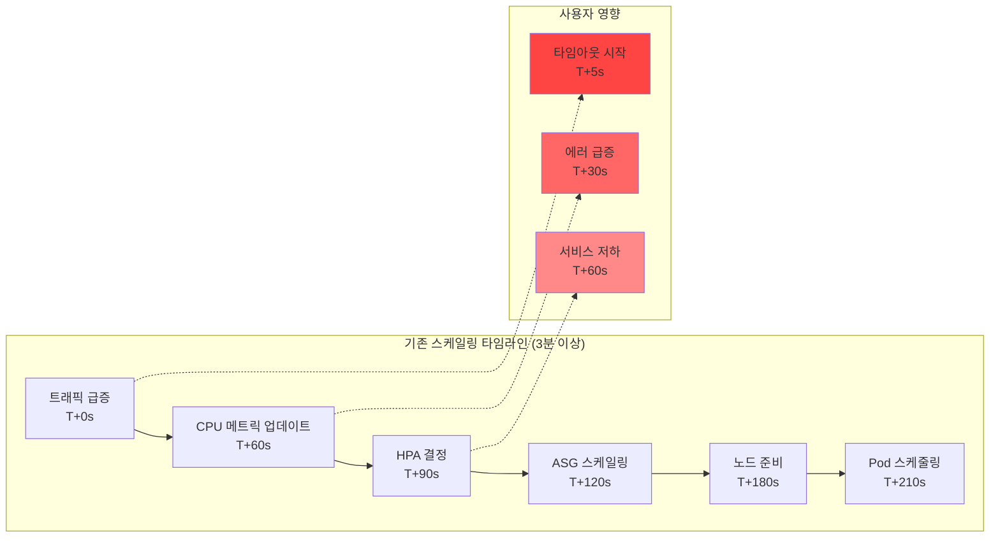

근본적인 문제: CPU 메트릭이 스케일링을 트리거할 때는 이미 늦었습니다.

**현재 환경의 도전 과제:**

- **글로벌 규모**: 3개 리전, 28개 EKS 클러스터, 15,000개 Pod 운영
- **대용량 트래픽**: 일일 773.4K 리퀘스트 처리
- **지연 시간 문제**: HPA + Karpenter 조합으로 1-3분의 스케일링 지연 발생
- **메트릭 수집 지연**: CloudWatch 메트릭의 1-3분 지연으로 실시간 대응 불가

## Karpenter 혁명: Direct-to-Metal 프로비저닝

Karpenter는 Auto Scaling Group(ASG) 추상화 레이어를 제거하고 대기 중인 Pod 요구 사항을 기반으로 EC2 인스턴스를 직접 프로비저닝합니다. Karpenter v1.x는 **Drift Detection** 기능을 통해 NodePool 스펙 변경 시 기존 노드를 자동으로 교체합니다. AMI 업데이트, 보안 패치 적용 등이 자동화됩니다.

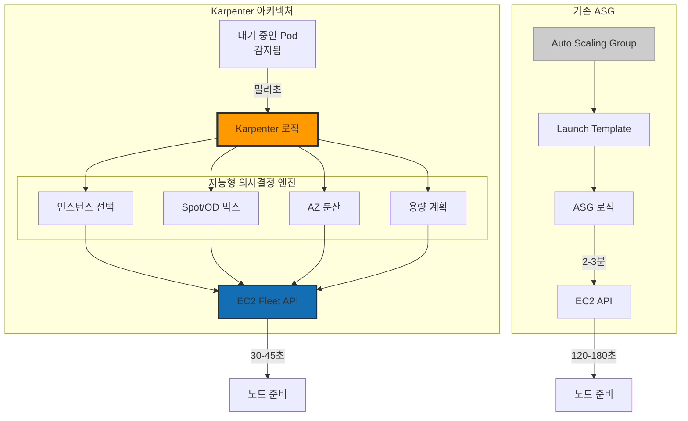

## 고속 메트릭 아키텍처: 두 가지 접근 방식

10초 미만 스케일링을 달성하려면 빠른 감지 시스템이 필요합니다. 두 가지 검증된 아키텍처를 비교합니다.

### 방식 1: CloudWatch High-Resolution Integration

AWS 네이티브 환경에서 CloudWatch의 고해상도 메트릭을 활용합니다.

#### 주요 구성 요소

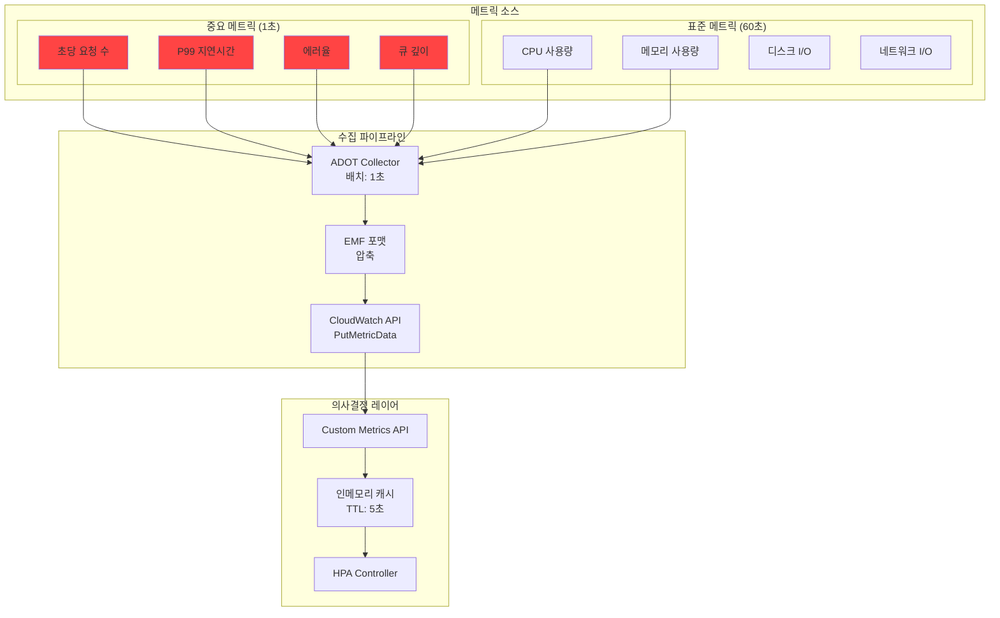

#### 스케일링 타임라인 (15초)

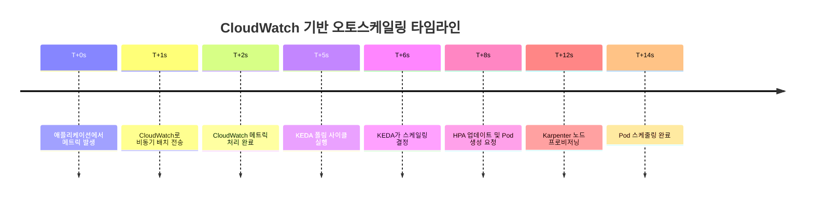

**장점:**
- ✅ **빠른 메트릭 수집**: 1-2초의 낮은 지연시간
- ✅ **간단한 설정**: AWS 네이티브 통합
- ✅ **관리 오버헤드 없음**: 별도 인프라 관리 불필요

**단점:**
- ❌ **제한된 처리량**: 계정당 1,000 TPS
- ❌ **Pod 한계**: 클러스터당 최대 5,000개
- ❌ **높은 메트릭 비용**: AWS CloudWatch 메트릭 요금

### 방식 2: ADOT + Prometheus 기반 아키텍처

AWS Distro for OpenTelemetry(ADOT)와 Prometheus를 결합한 오픈소스 기반 고성능 파이프라인입니다.

#### 주요 구성 요소

- **ADOT Collector**: DaemonSet과 Sidecar 하이브리드 배포
- **Prometheus**: HA 구성 및 Remote Storage 연동
- **Thanos Query Layer**: 멀티 클러스터 글로벌 뷰 제공
- **KEDA Prometheus Scaler**: 2초 간격의 고속 폴링
- **Grafana Mimir**: 장기 저장 및 고속 쿼리 엔진

#### 스케일링 타임라인 (70초)

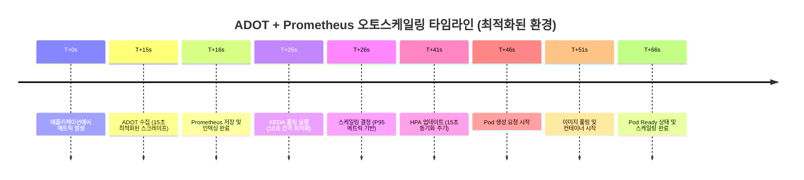

**장점:**
- ✅ **높은 처리량**: 100,000+ TPS 지원
- ✅ **확장성**: 클러스터당 20,000+ Pod 지원
- ✅ **낮은 메트릭 비용**: 스토리지 비용만 발생 (Self-managed)
- ✅ **완전한 제어**: 설정 및 최적화 자유도

**단점:**
- ❌ **복잡한 설정**: 추가 컴포넌트 관리 필요
- ❌ **높은 운영 복잡성**: HA 구성, 백업/복구, 성능 튜닝 필요
- ❌ **전문 인력 필요**: Prometheus 운영 경험 필수

### 비용 최적화 메트릭 전략

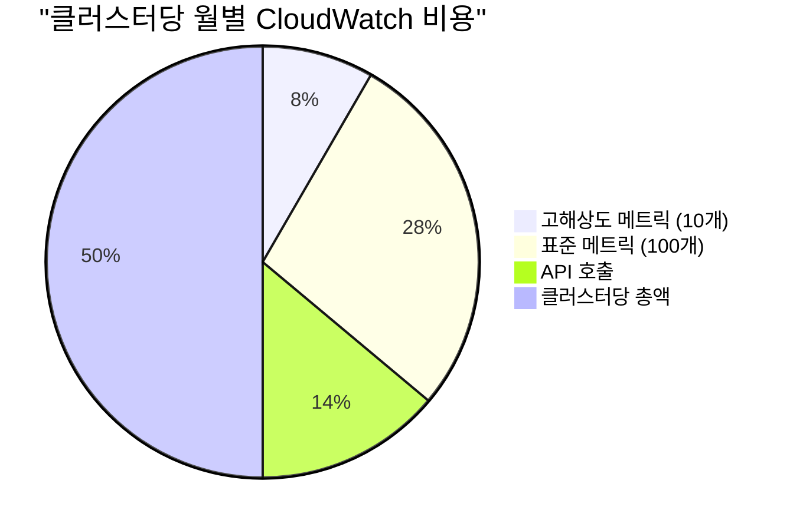

28개 클러스터 기준: 종합 모니터링에 월 ~$500 vs 모든 메트릭을 고해상도로 수집 시 $30,000+

### 권장 사용 사례

**CloudWatch High Resolution Metric이 적합한 경우:**
- 소규모 애플리케이션 (Pod 5,000개 이하)
- 간단한 모니터링 요구사항
- AWS 네이티브 솔루션 선호
- 빠른 구축과 안정적인 운영 우선

**ADOT + Prometheus가 적합한 경우:**
- 대규모 클러스터 (Pod 20,000개 이상)
- 높은 메트릭 처리량 요구
- 세밀한 모니터링 및 커스터마이징 필요
- 최고 수준의 성능과 확장성 필요

## 10초 아키텍처: 레이어별 최적화

10초 미만 스케일링을 달성하려면 모든 레이어에서 최적화가 필요합니다:

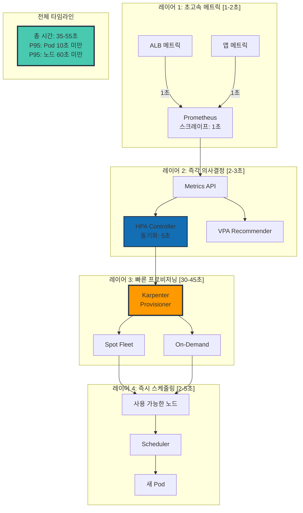

## Karpenter 핵심 설정

60초 미만 노드 프로비저닝의 핵심은 최적의 Karpenter 구성에 있습니다:

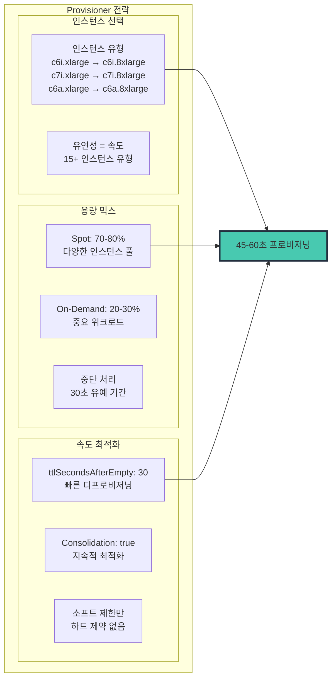

### Karpenter NodePool YAML

```yaml
apiVersion: karpenter.sh/v1
kind: NodePool
metadata:
  name: fast-scaling
spec:
  # 속도 최적화 구성
  disruption:
    consolidationPolicy: WhenEmptyOrUnderutilized
    consolidateAfter: 30s
    budgets:
    - nodes: "10%"

  # 속도를 위한 최대 유연성
  template:
    spec:
      requirements:
        - key: karpenter.sh/capacity-type
          operator: In
          values: ["spot", "on-demand"]
        - key: kubernetes.io/arch
          operator: In
          values: ["amd64"]
        - key: node.kubernetes.io/instance-type
          operator: In
          values:
            # 컴퓨팅 최적화 - 기본 선택
            - c6i.xlarge
            - c6i.2xlarge
            - c6i.4xlarge
            - c6i.8xlarge
            - c7i.xlarge
            - c7i.2xlarge
            - c7i.4xlarge
            - c7i.8xlarge
            # AMD 대안 - 더 나은 가용성
            - c6a.xlarge
            - c6a.2xlarge
            - c6a.4xlarge
            - c6a.8xlarge
            # 메모리 최적화 - 특정 워크로드용
            - m6i.xlarge
            - m6i.2xlarge
            - m6i.4xlarge

      nodeClassRef:
        group: karpenter.k8s.aws
        kind: EC2NodeClass
        name: fast-nodepool

  # 빠른 프로비저닝 보장
  limits:
    cpu: 100000  # 소프트 제한만
    memory: 400000Gi
---
apiVersion: karpenter.k8s.aws/v1
kind: EC2NodeClass
metadata:
  name: fast-nodepool
spec:
  amiSelectorTerms:
    - alias: al2023@latest

  subnetSelectorTerms:
    - tags:
        karpenter.sh/discovery: "${CLUSTER_NAME}"

  securityGroupSelectorTerms:
    - tags:
        karpenter.sh/discovery: "${CLUSTER_NAME}"

  role: "KarpenterNodeRole-${CLUSTER_NAME}"

  # 속도 최적화
  userData: |
    #!/bin/bash
    # 노드 시작 시간 최적화
    /etc/eks/bootstrap.sh ${CLUSTER_NAME} \
      --b64-cluster-ca ${B64_CLUSTER_CA} \
      --apiserver-endpoint ${API_SERVER_URL} \
      --container-runtime containerd \
      --kubelet-extra-args '--node-labels=karpenter.sh/fast-scaling=true --max-pods=110'

    # 중요 이미지 사전 풀
    ctr -n k8s.io images pull k8s.gcr.io/pause:3.9 &
    ctr -n k8s.io images pull public.ecr.aws/eks-distro/kubernetes/pause:3.9 &

```

## 실시간 스케일링 워크플로

모든 구성 요소가 함께 작동하여 10초 미만 스케일링을 달성하는 방법:

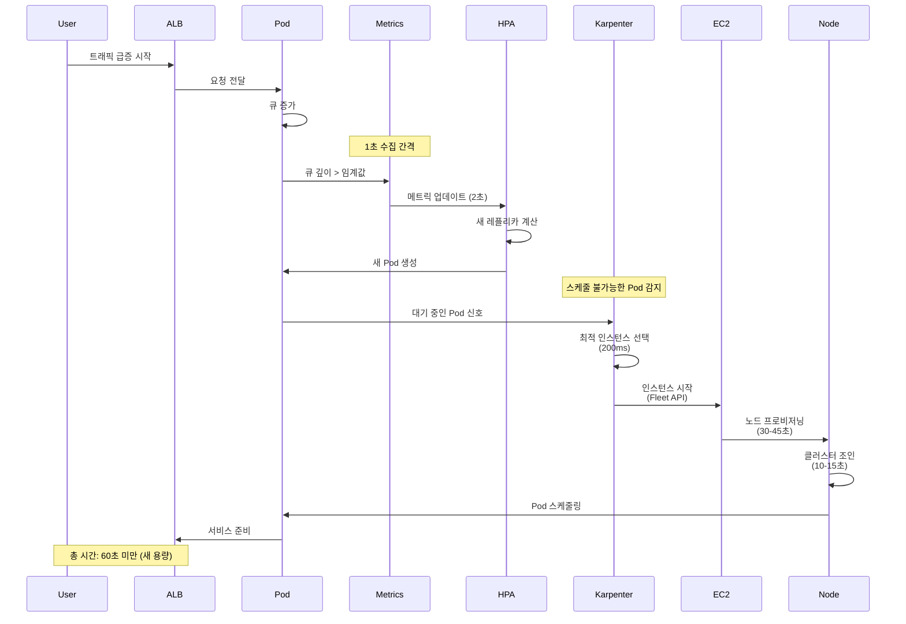

## 공격적 스케일링을 위한 HPA 구성

HorizontalPodAutoscaler는 즉각적인 응답을 위해 구성되어야 합니다:

```yaml
apiVersion: autoscaling/v2
kind: HorizontalPodAutoscaler
metadata:
  name: ultra-fast-hpa
spec:
  scaleTargetRef:
    apiVersion: apps/v1
    kind: Deployment
    name: web-app
  minReplicas: 10
  maxReplicas: 1000

  metrics:
  # 기본 메트릭 - 큐 깊이
  - type: External
    external:
      metric:
        name: sqs_queue_depth
        selector:
          matchLabels:
            queue: "web-requests"
      target:
        type: AverageValue
        averageValue: "10"

  # 보조 메트릭 - 요청 속도
  - type: External
    external:
      metric:
        name: alb_request_rate
        selector:
          matchLabels:
            targetgroup: "web-tg"
      target:
        type: AverageValue
        averageValue: "100"

  behavior:
    scaleUp:
      stabilizationWindowSeconds: 0  # 지연 없음!
      policies:
      - type: Percent
        value: 100
        periodSeconds: 10
      - type: Pods
        value: 100
        periodSeconds: 10
      selectPolicy: Max
    scaleDown:
      stabilizationWindowSeconds: 300  # 5분 쿨다운
      policies:
      - type: Percent
        value: 10
        periodSeconds: 60

```

## KEDA 활용 시점: 이벤트 드리븐 시나리오

Karpenter가 인프라 스케일링을 처리하는 반면, KEDA는 특정 이벤트 드리븐 시나리오에서 뛰어납니다:

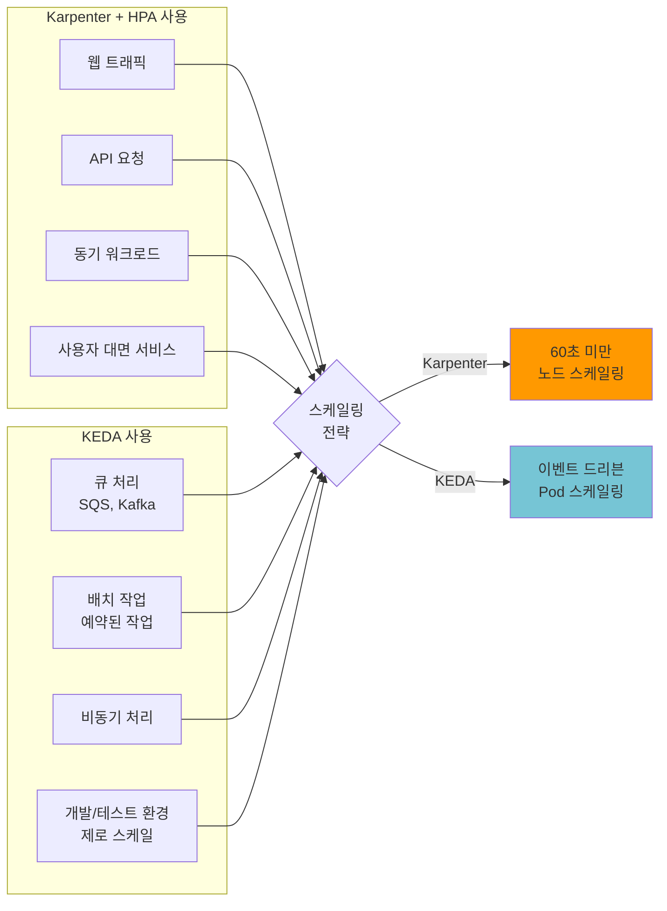

## 프로덕션 성능 메트릭

일일 750K+ 요청을 처리하는 배포의 실제 결과:

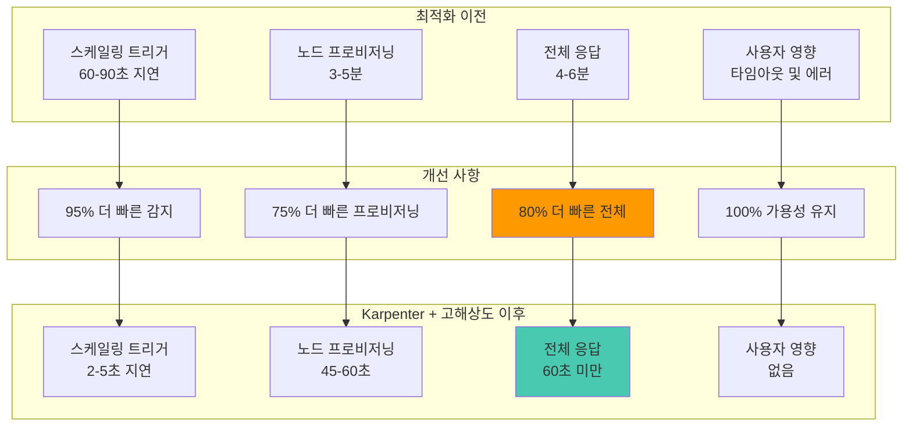

## 다중 리전 고려 사항

여러 리전에서 운영하는 조직의 경우, 일관된 10초 미만 스케일링을 위해 리전별 최적화가 필요합니다:

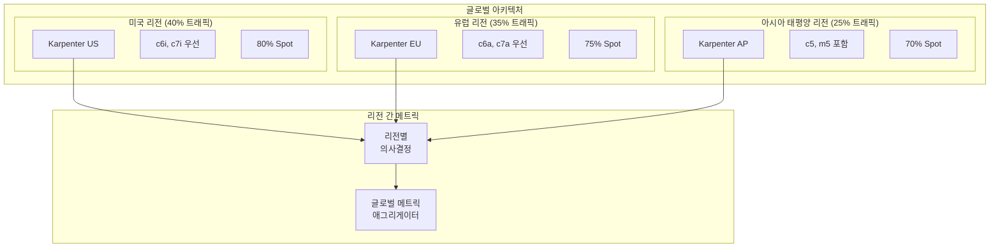

## 10초 미만 스케일링 모범 사례

### 1. 메트릭 선택

- 선행 지표(큐 깊이, 연결 수) 사용, 후행 지표(CPU) 아님
- 클러스터당 고해상도 메트릭을 10-15개 이하로 유지
- API 스로틀링 방지를 위한 배치 메트릭 제출

### 2. Karpenter 최적화

- 최대 인스턴스 유형 유연성 제공
- 적절한 중단 처리와 함께 Spot 인스턴스 적극 활용
- 비용 효율성을 위한 통합 활성화
- 적절한 ttlSecondsAfterEmpty 설정 (30-60초)

### 3. HPA 튜닝

- 스케일업을 위한 제로 안정화 윈도우
- 공격적인 스케일링 정책 (100% 증가 허용)
- 적절한 가중치를 가진 여러 메트릭
- 스케일다운을 위한 적절한 쿨다운

### 4. 모니터링

- P95 스케일링 지연 시간을 기본 KPI로 추적
- 15초를 초과하는 스케일링 실패 또는 지연에 대한 알림
- Spot 중단 비율 모니터링
- 스케일된 Pod당 비용 추적

## 일반적인 문제 해결

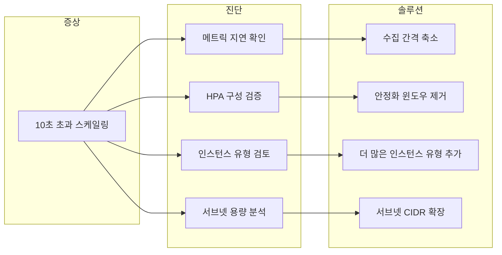

## 하이브리드 접근 방식 (권장)

실제 프로덕션 환경에서는 두 가지 방식을 혼합한 하이브리드 접근을 권장합니다:

1. **미션 크리티컬 서비스**: ADOT + Prometheus로 10-13초 스케일링 달성
2. **일반 서비스**: CloudWatch Direct로 12-15초 스케일링 및 운영 단순화
3. **점진적 마이그레이션**: CloudWatch에서 시작하여 필요에 따라 ADOT로 전환

## EKS Auto Mode vs Self-managed Karpenter

EKS Auto Mode (2025 GA)는 Karpenter를 내장하여 자동 관리합니다:

| 항목 | Self-managed Karpenter | EKS Auto Mode |
|------|----------------------|---------------|
| 설치/업그레이드 | 직접 관리 (Helm) | AWS 자동 관리 |
| NodePool 설정 | 완전한 커스터마이징 | 제한된 설정 |
| 비용 최적화 | 세밀한 제어 가능 | 자동 최적화 |
| OS 패치 | 직접 관리 | 자동 패치 |
| 적합한 환경 | 고급 커스터마이징 필요 | 운영 부담 최소화 |

**권장**: 복잡한 스케줄링 요구사항이 있는 경우 Self-managed, 운영 단순화가 목표인 경우 EKS Auto Mode를 선택합니다.

## 결론

EKS에서 10초 미만의 오토스케일링 달성은 불가능한 것이 아니라 필수적입니다. Karpenter의 지능형 프로비저닝, 중요한 지표에 대한 고해상도 메트릭, 적절하게 튜닝된 HPA 구성의 조합은 거의 실시간으로 수요에 대응하는 시스템을 만듭니다.

**핵심 요점:**

- **Karpenter가 기반**: 직접 EC2 프로비저닝으로 스케일링 시간에서 수분 단축
- **선택적 고해상도 메트릭**: 중요한 것을 1-5초 간격으로 모니터링
- **공격적 HPA 구성**: 스케일링 결정의 인위적 지연 제거
- **지능을 통한 비용 최적화**: 빠른 스케일링으로 과다 프로비저닝 감소
- **아키텍처 선택**: 규모와 요구사항에 맞는 CloudWatch 또는 Prometheus 선택

여기에 제시된 아키텍처는 일일 수백만 건의 요청을 처리하는 프로덕션 환경에서 검증되었습니다. 이러한 패턴을 구현함으로써 EKS 클러스터가 비즈니스 수요만큼 빠르게 스케일링되도록 보장할 수 있습니다—분이 아닌 초 단위로 측정됩니다.

기억하세요: 클라우드 네이티브 세계에서 속도는 단순히 기능이 아니라 안정성, 효율성, 사용자 만족도를 위한 근본적인 요구 사항입니다.
