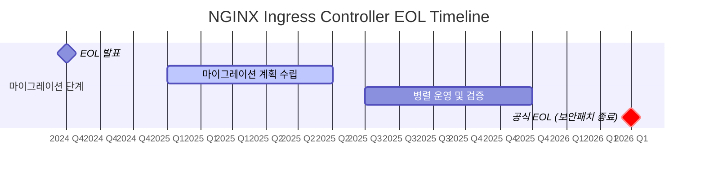
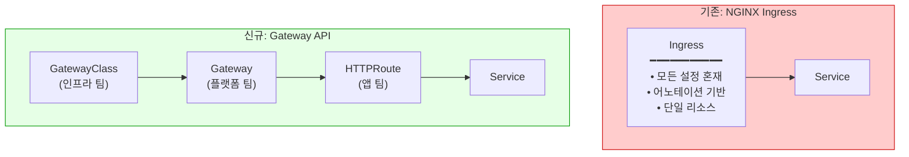
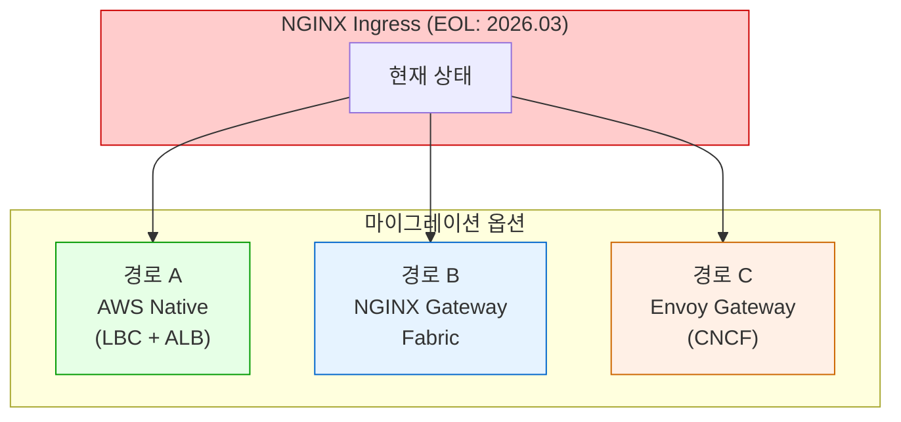
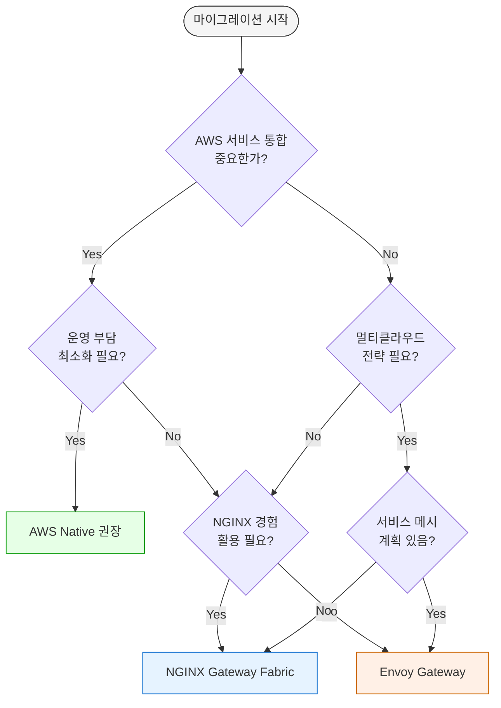
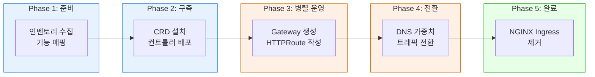
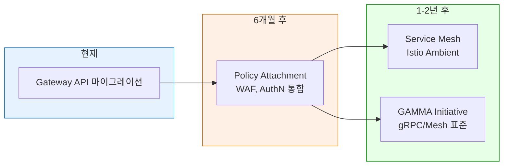

# NGINX Ingress에서 Kubernetes Gateway API로의 전략적 전환 가이드

> 📅 **작성일**: 2025-02-05 | ⏱️ **읽는 시간**: 약 12분

## 1. 개요

이 가이드는 2026년 3월 NGINX Ingress Controller의 공식 유지 관리 종료(EOL)에 대응하여, Kubernetes Gateway API로 전환하기 위한 전략적 접근 방법을 제시합니다.

### 1.1 이 문서의 대상

- NGINX Ingress Controller를 운영 중인 EKS 클러스터 관리자
- Gateway API 마이그레이션을 계획 중인 플랫폼 엔지니어
- 트래픽 관리 아키텍처 현대화를 검토 중인 아키텍트

### 1.2 문서 구성

| 섹션 | 내용 | 읽는 순서 |
|------|------|----------|
| 2. 전략적 배경 | EOL 타임라인, 보안 위험 | 필수 |
| 3. Gateway API 아키텍처 | 구조적 차이점 이해 | 필수 |
| 4. 세 가지 마이그레이션 경로 | AWS Native / NGINX Fabric / Envoy 비교 | 필수 |
| 5. 8가지 기능 비교 | 기능별 대안 종합표 | 필수 |
| 6. 기능별 상세 가이드 | 코드 예시 포함 상세 설명 | 선택 |
| 7. 마이그레이션 실행 | CRD 설치, 단계별 프로세스 | 실행 시 |
| 8. 문제 해결 및 체크리스트 | 트러블슈팅, 최종 점검 | 실행 시 |

---

## 2. 전략적 배경: 왜 마이그레이션이 필요한가?

### 2.1 NGINX Ingress Controller EOL 타임라인



:::danger 핵심 경고
**2026년 3월 이후**: 보안 취약점 패치가 더 이상 제공되지 않습니다. 이는 선택이 아닌 필수 마이그레이션입니다.
:::

### 2.2 NGINX Ingress의 보안 취약점

NGINX Ingress의 **Snippets 어노테이션**은 심각한 보안 취약점의 통로입니다:

```yaml
# ⚠️ 보안 위험: 임의의 NGINX 설정 주입 가능
apiVersion: networking.k8s.io/v1
kind: Ingress
metadata:
  annotations:
    nginx.ingress.kubernetes.io/server-snippet: |
      location /admin {
        proxy_pass http://malicious-server;  # 검증 없이 삽입됨
      }
```

| 위험 요소 | 설명 | 영향도 |
|-----------|------|--------|
| **Snippet 주입** | 임의 NGINX 설정 삽입 가능 | Critical |
| **검증 부재** | 어노테이션 내용 검증 없음 | High |
| **권한 상승** | 네임스페이스 격리 우회 가능 | Critical |
| **패치 종료** | 2026년 3월 이후 보안 패치 없음 | Critical |

---

## 3. Gateway API 아키텍처 이해

### 3.1 Ingress vs Gateway API 구조 비교



### 3.2 Gateway API의 역할 분리 모델

| 리소스 | 관리 주체 | 책임 범위 |
|--------|----------|----------|
| **GatewayClass** | 인프라 팀 | 컨트롤러 선택, 클러스터 전역 설정 |
| **Gateway** | 플랫폼 팀 | 리스너, TLS 인증서, 네트워크 정책 |
| **HTTPRoute** | 애플리케이션 팀 | 라우팅 규칙, 백엔드 서비스 연결 |

이 분리 모델은 **최소 권한 원칙**을 적용할 수 있게 하여, Snippets 어노테이션의 보안 문제를 원천 차단합니다.

---

## 4. 세 가지 마이그레이션 경로 비교

EKS 환경에서 Gateway API로 전환할 때 선택할 수 있는 세 가지 주요 옵션입니다.

### 4.1 경로 개요



### 4.2 세 가지 경로 상세 비교

| 비교 항목 | AWS Native (LBC + ALB) | NGINX Gateway Fabric | Envoy Gateway (CNCF) |
|----------|------------------------|---------------------|---------------------|
| | | | |
| **기본 정보** | | | |
| 제공사 | AWS | F5/NGINX | CNCF (Envoy 프로젝트) |
| 데이터플레인 | AWS ALB/NLB (관리형) | NGINX (자체 관리) | Envoy Proxy (자체 관리) |
| 라이선스 | AWS 서비스 | Apache 2.0 / 상용 | Apache 2.0 |
| 시장 점유율 | AWS 환경 1위 | NGINX 전환 수요 | 멀티클라우드 수요 증가 |
| | | | |
| **기능 지원** | | | |
| Gateway API 버전 | v1.3 (Core + AWS 확장) | v1.2 (Core) | v1.2 (Core + 확장) |
| HTTP/gRPC 라우팅 | ✅ | ✅ | ✅ |
| TLS Termination | ✅ ACM 통합 | ✅ Secret 기반 | ✅ Secret 기반 |
| mTLS | ⚠️ 제한적 | ✅ 지원 | ✅ 완벽 지원 |
| Rate Limiting | ❌ WAF 필요 | ✅ NginxProxy CRD | ✅ BackendTrafficPolicy |
| Header 조작 | ✅ 기본 지원 | ✅ 풍부한 기능 | ✅ 풍부한 기능 |
| URL Rewrite | ✅ Prefix 기반 | ✅ 정규식 지원 | ✅ 정규식 지원 |
| | | | |
| **운영 측면** | | | |
| 스케일링 | AWS Auto Scaling | HPA/수동 | HPA/수동 |
| 고가용성 | AWS 내장 HA | 다중 Pod + PDB | 다중 Pod + PDB |
| 업그레이드 | AWS 자동 관리 | Helm 업그레이드 | Helm 업그레이드 |
| 모니터링 | CloudWatch | Prometheus | Prometheus |
| 운영 부담 | 낮음 | 중간 | 중간 |
| | | | |
| **보안** | | | |
| WAF 통합 | ✅ AWS WAF 1-클릭 | ⚠️ ModSecurity 별도 | ⚠️ 별도 구성 |
| DDoS 보호 | ✅ AWS Shield | ⚠️ 수동 구성 | ⚠️ 수동 구성 |
| IP 제어 | Security Group + WAF | NginxProxy Policy | SecurityPolicy CRD |
| 인증/인가 | Lambda Authorizer, Cognito | OIDC Policy | ExtAuth, OIDC |
| | | | |
| **비용 및 종속성** | | | |
| 기본 비용 | ALB 시간당 + LCU | 컴퓨팅 리소스 | 컴퓨팅 리소스 |
| 예상 월비용 (중규모) | ~$50-200 | ~$50-150 | ~$50-150 |
| 벤더 종속 | 높음 (AWS 전용) | 낮음 | 없음 (CNCF 표준) |
| 멀티클라우드 | ❌ | ✅ | ✅ |

### 4.3 경로 선택 의사결정 트리



### 4.4 시나리오별 권장 경로

| 시나리오 | 권장 경로 | 이유 |
|---------|----------|------|
| AWS 올인 + 운영 최소화 | **AWS Native** | 관리형 서비스, SLA 보장 |
| 멀티클라우드 + NGINX 경험 | **NGINX Gateway Fabric** | 이식성 + 기존 지식 활용 |
| 멀티클라우드 + 서비스 메시 계획 | **Envoy Gateway** | Istio/Envoy 생태계 호환 |
| 엄격한 보안 요구 (금융/의료) | **AWS Native** | WAF, Shield, CloudTrail |
| 스타트업 + 비용 최적화 | **NGINX/Envoy** | 고정 비용 예측 가능 |
| 복잡한 트래픽 정책 | **NGINX/Envoy** | 세밀한 라우팅 제어 |

---

## 5. 8가지 NGINX 기능 대안 비교

현재 NGINX Ingress에서 사용 중인 기능들을 각 경로별로 어떻게 대체할 수 있는지 종합 비교합니다.

### 5.1 기능 매핑 종합표

| # | NGINX 기능 | AWS Native | NGINX Gateway Fabric | Envoy Gateway |
|---|-----------|------------|---------------------|---------------|
| 1 | **Basic Auth** | Lambda Authorizer | OIDC Policy | ExtAuth Filter |
| 2 | **IP Allowlist** | WAF IP Sets / SG | NginxProxy Policy | SecurityPolicy |
| 3 | **Rate Limiting** | WAF Rate-based | NginxProxy RateLimit | BackendTrafficPolicy |
| 4 | **URL Rewrite** | HTTPRoute Filter | HTTPRoute Filter | HTTPRoute Filter |
| 5 | **Body Size** | WAF Size Constraint | NginxProxy Config | ClientTrafficPolicy |
| 6 | **Custom Error** | ALB Fixed Response | Custom Backend | Direct Response |
| 7 | **Header Routing** | HTTPRoute matches | HTTPRoute matches | HTTPRoute matches |
| 8 | **Cookie Affinity** | TargetGroup Stickiness | Upstream Config | Session Persistence |

### 5.2 기능별 구현 난이도

| 기능 | AWS Native | NGINX Fabric | Envoy Gateway |
|------|------------|--------------|---------------|
| Basic Auth | 중간 (Lambda 개발) | 쉬움 (OIDC 설정) | 중간 (ExtAuth 설정) |
| IP Allowlist | 쉬움 (WAF 콘솔) | 쉬움 (YAML) | 쉬움 (YAML) |
| Rate Limiting | 중간 (WAF 규칙) | 쉬움 (CRD) | 쉬움 (CRD) |
| URL Rewrite | 쉬움 (표준 API) | 쉬움 (표준 API) | 쉬움 (표준 API) |
| Body Size | 중간 (WAF 규칙) | 쉬움 (CRD) | 쉬움 (CRD) |
| Custom Error | 쉬움 (ALB 설정) | 중간 (Backend) | 쉬움 (Direct Response) |
| Header Routing | 쉬움 (표준 API) | 쉬움 (표준 API) | 쉬움 (표준 API) |
| Cookie Affinity | 쉬움 (TG 설정) | 쉬움 (CRD) | 중간 (Policy) |

### 5.3 비용 영향 분석

| 기능 | AWS Native 추가 비용 | NGINX/Envoy 추가 비용 |
|------|---------------------|---------------------|
| Basic Auth | Lambda 실행 비용 | 없음 |
| IP Allowlist | WAF: $5/월 + 요청당 | 없음 |
| Rate Limiting | WAF: $5/월 + 요청당 | 없음 |
| Body Size | WAF 포함 | 없음 |
| WAF 전체 | ~$20-100/월 | 없음 (자체 구현) |

:::tip 비용 최적화 팁
AWS WAF가 필요한 기능(IP Allowlist, Rate Limiting, Body Size)이 많다면 AWS Native가 효율적입니다.
단, WAF 비용이 부담된다면 NGINX Gateway Fabric이나 Envoy Gateway로 동일 기능을 무료로 구현할 수 있습니다.
:::

---

## 6. 기능별 상세 구현 가이드

### 6.1 인증 (Basic Auth 대체)

#### AWS Native: Lambda Authorizer
```yaml
apiVersion: gateway.networking.k8s.io/v1
kind: HTTPRoute
metadata:
  name: protected-route
spec:
  parentRefs:
    - name: production-gateway
  rules:
    - matches:
        - path:
            type: PathPrefix
            value: /protected
      filters:
        - type: ExtensionRef
          extensionRef:
            group: eks.amazonaws.com
            kind: LambdaAuthorizer
            name: jwt-authorizer
      backendRefs:
        - name: api-service
          port: 8080
```

#### NGINX Gateway Fabric: OIDC Policy
```yaml
apiVersion: gateway.nginx.org/v1alpha1
kind: Policy
metadata:
  name: oidc-policy
spec:
  targetRefs:
    - group: gateway.networking.k8s.io
      kind: HTTPRoute
      name: protected-route
  oidc:
    authEndpoint: https://idp.example.com/authorize
    tokenEndpoint: https://idp.example.com/token
    jwksURI: https://idp.example.com/.well-known/jwks.json
    clientID: my-client-id
    clientSecret:
      name: oidc-secret
      key: client-secret
```

#### Envoy Gateway: ExtAuth
```yaml
apiVersion: gateway.envoyproxy.io/v1alpha1
kind: SecurityPolicy
metadata:
  name: ext-auth-policy
spec:
  targetRefs:
    - group: gateway.networking.k8s.io
      kind: HTTPRoute
      name: protected-route
  extAuth:
    http:
      service:
        name: auth-service
        port: 8080
      headersToBackend:
        - x-user-id
        - x-user-role
```

### 6.2 IP 제어 (IP Allowlist 대체)

#### AWS Native: WAF IP Sets
```bash
# WAF IP Set 생성
aws wafv2 create-ip-set \
  --name "AllowedIPs" \
  --scope REGIONAL \
  --ip-address-version IPV4 \
  --addresses "10.0.0.0/8" "192.168.1.0/24"
```

#### NGINX Gateway Fabric: NginxProxy Policy
```yaml
apiVersion: gateway.nginx.org/v1alpha1
kind: NginxProxy
metadata:
  name: ip-restriction
spec:
  ipRestriction:
    allow:
      - "10.0.0.0/8"
      - "192.168.1.0/24"
    deny:
      - "0.0.0.0/0"
```

#### Envoy Gateway: SecurityPolicy
```yaml
apiVersion: gateway.envoyproxy.io/v1alpha1
kind: SecurityPolicy
metadata:
  name: ip-allowlist
spec:
  targetRefs:
    - group: gateway.networking.k8s.io
      kind: HTTPRoute
      name: api-route
  authorization:
    rules:
      - action: Allow
        principal:
          clientCIDRs:
            - "10.0.0.0/8"
            - "192.168.1.0/24"
```

### 6.3 트래픽 제어 (Rate Limiting 대체)

#### AWS Native: WAF Rate-based Rule
```json
{
  "Name": "RateLimitRule",
  "Statement": {
    "RateBasedStatement": {
      "Limit": 2000,
      "AggregateKeyType": "IP"
    }
  },
  "Action": { "Block": {} }
}
```

#### NGINX Gateway Fabric: Rate Limiting
```yaml
apiVersion: gateway.nginx.org/v1alpha1
kind: NginxProxy
metadata:
  name: rate-limit-config
spec:
  rateLimiting:
    rate: 100r/s
    burst: 200
    noDelay: true
```

#### Envoy Gateway: BackendTrafficPolicy
```yaml
apiVersion: gateway.envoyproxy.io/v1alpha1
kind: BackendTrafficPolicy
metadata:
  name: rate-limit-policy
spec:
  targetRefs:
    - group: gateway.networking.k8s.io
      kind: HTTPRoute
      name: api-route
  rateLimit:
    type: Global
    global:
      rules:
        - limit:
            requests: 100
            unit: Second
```

### 6.4 URL Rewrite (모든 경로 공통)

Gateway API 표준 필터로 세 경로 모두 동일한 방식을 사용합니다:

```yaml
apiVersion: gateway.networking.k8s.io/v1
kind: HTTPRoute
metadata:
  name: api-rewrite
spec:
  parentRefs:
    - name: production-gateway
  rules:
    - matches:
        - path:
            type: PathPrefix
            value: /api/v1
      filters:
        - type: URLRewrite
          urlRewrite:
            path:
              type: ReplacePrefixMatch
              replacePrefixMatch: /
      backendRefs:
        - name: api-service
          port: 8080
```

### 6.5 헤더 기반 라우팅 (모든 경로 공통)

```yaml
apiVersion: gateway.networking.k8s.io/v1
kind: HTTPRoute
metadata:
  name: header-routing
spec:
  parentRefs:
    - name: production-gateway
  rules:
    # Canary 헤더가 있는 요청
    - matches:
        - headers:
            - name: X-Canary
              value: "true"
      backendRefs:
        - name: api-canary
          port: 8080
    # 기본 라우팅
    - backendRefs:
        - name: api-stable
          port: 8080
```

### 6.6 세션 어피니티 (Cookie Affinity 대체)

#### AWS Native: TargetGroup Stickiness
```yaml
apiVersion: elbv2.k8s.aws/v1beta1
kind: TargetGroupConfiguration
metadata:
  name: sticky-session
spec:
  attributes:
    - key: stickiness.enabled
      value: "true"
    - key: stickiness.type
      value: lb_cookie
    - key: stickiness.lb_cookie.duration_seconds
      value: "86400"
```

#### NGINX Gateway Fabric: Upstream Config
```yaml
apiVersion: gateway.nginx.org/v1alpha1
kind: NginxProxy
metadata:
  name: session-affinity
spec:
  upstreams:
    sessionAffinity:
      cookie:
        name: SERVERID
        expires: 2h
```

#### Envoy Gateway: Session Persistence
```yaml
apiVersion: gateway.envoyproxy.io/v1alpha1
kind: BackendTrafficPolicy
metadata:
  name: session-policy
spec:
  targetRefs:
    - group: gateway.networking.k8s.io
      kind: HTTPRoute
      name: api-route
  sessionPersistence:
    type: Cookie
    cookie:
      name: SERVERID
      ttl: 86400s
```

---

## 7. 마이그레이션 실행 전략

### 7.1 사전 요구사항: CRD 설치

```bash
#!/bin/bash
# Gateway API 표준 CRD 설치 (모든 경로 공통)
kubectl apply -f https://github.com/kubernetes-sigs/gateway-api/releases/download/v1.3.0/standard-install.yaml
```

#### AWS Native 추가 설치
```bash
# AWS LBC CRD
kubectl apply -k "github.com/aws/eks-charts/stable/aws-load-balancer-controller/crds?ref=master"

# AWS LBC 설치
helm install aws-load-balancer-controller eks/aws-load-balancer-controller \
  -n kube-system \
  --set clusterName=my-cluster \
  --set enableGatewayAPI=true
```

#### NGINX Gateway Fabric 설치
```bash
helm install ngf nginx-gateway/nginx-gateway-fabric \
  -n nginx-gateway \
  --create-namespace \
  --set service.type=LoadBalancer
```

#### Envoy Gateway 설치
```bash
helm install envoy-gateway oci://docker.io/envoyproxy/gateway-helm \
  -n envoy-gateway-system \
  --create-namespace
```

### 7.2 마이그레이션 프로세스



### 7.3 검증 스크립트

```bash
#!/bin/bash
ROUTE_NAME="api-route"
NAMESPACE="production"

# HTTPRoute 상태 확인
ACCEPTED=$(kubectl get httproute $ROUTE_NAME -n $NAMESPACE \
  -o jsonpath='{.status.parents[0].conditions[?(@.type=="Accepted")].status}')
PROGRAMMED=$(kubectl get httproute $ROUTE_NAME -n $NAMESPACE \
  -o jsonpath='{.status.parents[0].conditions[?(@.type=="Programmed")].status}')

echo "Accepted: $ACCEPTED"
echo "Programmed: $PROGRAMMED"

if [ "$ACCEPTED" == "True" ] && [ "$PROGRAMMED" == "True" ]; then
  echo "✅ 트래픽 전환 준비 완료"
else
  echo "❌ 상태 확인 필요"
fi
```

---

## 8. 문제 해결 및 체크리스트

### 8.1 일반적인 이슈 해결

| 이슈 | 원인 | 해결 방법 |
|------|------|----------|
| HTTPRoute Accepted=False | parentRef 불일치 | Gateway 이름/네임스페이스 확인 |
| Programmed=False | 리소스 프로비저닝 실패 | 컨트롤러 로그 확인 |
| 503 에러 | 백엔드 서비스 미연결 | Service selector, 포트 확인 |
| TLS 오류 | Secret 참조 오류 | Secret 이름, 네임스페이스 확인 |

### 8.2 디버깅 명령어

```bash
# Gateway 상태
kubectl describe gateway production-gateway -n gateway-system

# HTTPRoute 상태
kubectl describe httproute api-route -n production

# 컨트롤러 로그 (경로별)
# AWS LBC
kubectl logs -n kube-system -l app.kubernetes.io/name=aws-load-balancer-controller

# NGINX Gateway Fabric
kubectl logs -n nginx-gateway -l app.kubernetes.io/name=nginx-gateway-fabric

# Envoy Gateway
kubectl logs -n envoy-gateway-system -l control-plane=envoy-gateway
```

### 8.3 마이그레이션 체크리스트

#### 사전 준비
- [ ] 현재 NGINX Ingress 인벤토리 완료
- [ ] 8가지 핵심 기능 대안 매핑 완료
- [ ] 마이그레이션 경로 선택 (AWS/NGINX/Envoy)
- [ ] CRD 설치 완료
- [ ] 테스트 환경 PoC 완료

#### 마이그레이션 실행
- [ ] GatewayClass 생성
- [ ] Gateway 리소스 생성
- [ ] 서비스별 HTTPRoute 생성
- [ ] Accepted/Programmed 상태 검증
- [ ] 트래픽 테스트 완료

#### 트래픽 전환
- [ ] DNS 가중치 기반 점진적 전환
- [ ] 에러율/레이턴시 모니터링
- [ ] 롤백 계획 준비

#### 마이그레이션 완료
- [ ] 모든 트래픽 전환 확인
- [ ] NGINX Ingress 리소스 백업
- [ ] NGINX Ingress Controller 제거
- [ ] 팀 교육 및 문서 업데이트

---

## 9. 결론 및 향후 로드맵

### 9.1 핵심 요약

| 경로 | 최적 대상 | 핵심 장점 |
|------|----------|----------|
| **AWS Native** | AWS 올인, 운영 최소화 | 관리형 서비스, WAF/Shield 통합 |
| **NGINX Gateway Fabric** | NGINX 경험, 멀티클라우드 | 기존 지식 활용, 이식성 |
| **Envoy Gateway** | 서비스 메시 계획, CNCF 표준 | Istio 호환, 커뮤니티 활성 |

### 9.2 향후 확장 로드맵



:::info 핵심 메시지
**2026년 3월 NGINX Ingress EOL 이전에 마이그레이션을 완료**하여 보안 위협을 원천 차단하세요.
:::

---

## 관련 문서

- [Cilium ENI와 Gateway API를 활용한 고성능 네트워킹](./cilium-eni-gateway-api.md)
- [East-West 트래픽 최적화](./east-west-traffic-best-practice.md)
- [Kubernetes Gateway API 공식 문서](https://gateway-api.sigs.k8s.io/)
- [AWS Load Balancer Controller](https://kubernetes-sigs.github.io/aws-load-balancer-controller/)
- [NGINX Gateway Fabric](https://docs.nginx.com/nginx-gateway-fabric/)
- [Envoy Gateway](https://gateway.envoyproxy.io/)
