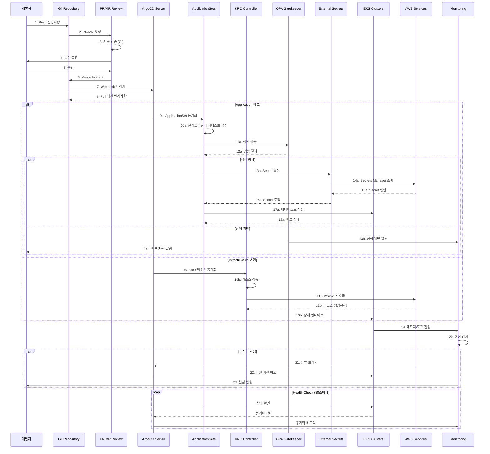

# GitOps 기반 EKS 클러스터 운영

## 기술적 고려사항 및 아키텍처 요약

### 핵심 제안 사항

**1. GitOps 플랫폼 선택**

- ArgoCD ApplicationSets를 활용한 멀티 클러스터 관리
- Progressive Delivery를 위한 Flagger 통합

**2. Infrastructure as Code 전략**

- **ACK/KRO (Kubernetes Resource Orchestrator)** 채택 권장
  - 기존 Terraform 상태와의 점진적 마이그레이션 가능
  - Kubernetes 네이티브 접근 방식으로 운영 일관성 확보
  - Helm 대비 더 유연한 리소스 오케스트레이션

**3. 자동화 핵심 요소**

- Blue/Green 방식의 EKS 업그레이드 자동화
- Addon 버전 관리를 위한 자동화된 테스트 파이프라인
- Policy as Code (OPA/Gatekeeper) 기반 거버넌스

**4. 보안 및 규정 준수**

- External Secrets Operator + AWS Secrets Manager 조합
- Git 서명 및 RBAC 기반 승인 워크플로우
- 실시간 규정 준수 모니터링 대시보드

### 예상 ROI

- 운영 부담 감소 (수동 작업 자동화)
- 업그레이드 시간 단축 (연 1회 → 분기별 가능)
- 장애 복구 시간 개선 (자동 롤백)

## 전체 아키텍처 개요

## GitOps 워크플로우 시퀀스 다이어그램



## 멀티 클러스터 관리 전략

### ApplicationSets 기반 클러스터 관리

**핵심 전략:**

1. **Cluster Generator** 활용
   - 클러스터 레지스트리 기반 동적 애플리케이션 생성
   - 레이블 기반 클러스터 그룹핑 (환경, 리전, 목적별)

2. **Git Directory Generator**
   - 환경별 구성 관리 (dev/staging/prod)
   - 클러스터별 오버라이드 설정

3. **Matrix Generator**
   - 클러스터 × 애플리케이션 조합 관리
   - 조건부 배포 규칙 적용

## 멀티클러스터 자동화 아키텍처

### EKS 클러스터 업그레이드 자동화

**Blue/Green 업그레이드 전략:**

1. **준비 단계**
   - 새 클러스터 프로비저닝 (KRO)
   - Addon 호환성 검증
   - 보안 정책 동기화

2. **마이그레이션 단계**
   - 워크로드 점진적 이동
   - 트래픽 가중치 조정 (0% → 100%)
   - 실시간 모니터링

3. **검증 및 완료**
   - 자동화된 smoke test
   - 성능 메트릭 비교
   - 구 클러스터 제거

## 보안 및 거버넌스

### Git Repository 구조 설계

**Monorepo vs Polyrepo 권장사항:**

- **애플리케이션 코드**: Polyrepo (팀별 독립성)
- **인프라 구성**: Monorepo (중앙 관리 및 일관성)
- **정책 정의**: Monorepo (전사 표준화)

### Secret 관리 아키텍처

**External Secrets Operator (ESO) + AWS Secrets Manager:**

- 중앙집중식 Secret 저장소
- 자동 로테이션 지원
- 세밀한 접근 제어 (IRSA)
- 암호화된 Git 저장 불필요

## 마이그레이션 전략

### Terraform에서 KRO로의 점진적 전환

**Phase 1: 파일럿 (2개월)**

- Dev 환경 1개 클러스터 대상
- 기본 리소스만 마이그레이션 (VPC, Subnets, Security Groups)
- Terraform 상태 임포트 및 검증

**Phase 2: 확대 적용 (3개월)**

- Staging 환경 포함
- EKS 클러스터 및 Addon 관리 추가
- 자동화 파이프라인 구축

**Phase 3: 전체 마이그레이션 (4개월)**

- Production 환경 순차 적용
- 모든 AWS 리소스 KRO 관리
- Terraform 완전 제거

### 주요 고려사항

```yaml
# KRO 리소스 정의 예시
apiVersion: kro.io/v1alpha1
kind: ResourceGroup
metadata:
  name: eks-cluster-us-east-1-prod
spec:
  resources:
    - apiVersion: eks.aws.crossplane.io/v1beta1
      kind: Cluster
      metadata:
        name: prod-cluster-01
      spec:
        forProvider:
          region: us-east-1
          version: "1.29"
          roleArnRef:
            name: eks-cluster-role
          resourcesVpcConfig:
            - subnetIdRefs:
                - name: private-subnet-1a
                - name: private-subnet-1b

    - apiVersion: eks.aws.crossplane.io/v1alpha1
      kind: NodeGroup
      metadata:
        name: prod-nodegroup-01
      spec:
        forProvider:
          clusterNameRef:
            name: prod-cluster-01
          instanceTypes:
            - c7i.8xlarge
          scalingConfig:
            - minSize: 3
              maxSize: 50
              desiredSize: 10
```

## 결론

GitOps 기반 대규모 EKS 클러스터 운영 전략은 현재의 수동 관리 부담을 획기적으로 줄이고, 안정성과 확장성을 크게 향상시킬 수 있습니다.

:::tip 핵심 권장사항

1. ACK/KRO를 통한 인프라 관리 통합
2. ArgoCD ApplicationSets를 활용한 멀티 클러스터 관리
3. 자동화된 Blue/Green 업그레이드 전략 활용
4. Policy as Code 기반 거버넌스

:::

단계적 마이그레이션 접근을 통해 리스크를 최소화하면서도 빠르게 가치를 실현할 수 있을 것입니다.
