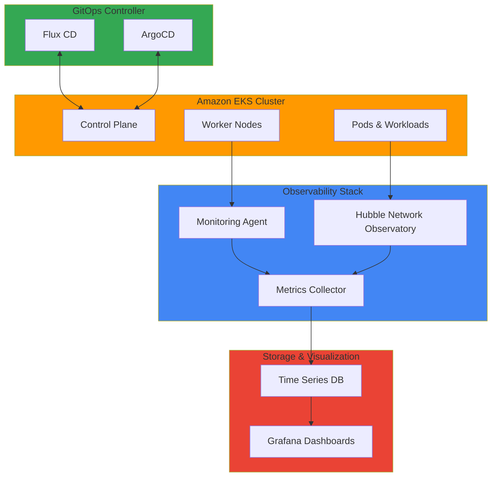

# Operations & Observability

이 섹션에서는 Amazon EKS 환경에서의 관찰성(Observability)과 모니터링 관련 심화 기술 문서들을 다룹니다. 네트워크 가시성, 클러스터 모니터링, AI/ML 워크로드 추적, 노드 에이전트 구성 등을 통해 시스템 상태를 종합적으로 파악하고 관리할 수 있습니다.

## 📚 주요 문서

### 네트워크 관찰성
- **[Gaining Network Visibility: Implementing Hubble for EKS Observability](./node-monitoring-agent.md)**
  - Hubble을 통한 네트워크 트래픽 가시성 확보
  - 서비스 메시 관찰성 구현
  - 네트워크 정책 및 보안 모니터링
  - 네트워크 이상 탐지

### 클러스터 운영 모니터링
- **[GitOps-Based Cluster Operation and Monitoring](./gitops-cluster-operation.md)**
  - GitOps 기반 클러스터 구성 관리
  - 선언적 인프라 운영
  - 변경사항 자동 동기화
  - 감사 추적 및 버전 관리

### 노드 모니터링
- **[Node Monitoring Agent Configuration](./node-monitoring-agent.md)**
  - 각 노드의 상태 모니터링
  - 시스템 메트릭 수집
  - 노드 건강도 관리
  - 문제 조기 탐지

## 🎯 학습 목표

이 섹션을 통해 다음을 학습할 수 있습니다:

- EKS 클러스터의 종합적인 관찰성 구축 방법
- 네트워크 트래픽 및 서비스 간 통신 모니터링
- 실시간 클러스터 상태 추적
- 노드 및 워크로드 건강도 관리
- 이상 징후 조기 탐지 및 알림
- 성능 메트릭 분석 및 개선 방안 도출

## 🏗️ 아키텍처 패턴

## 🔧 주요 기술 및 도구

| 기술 | 설명 | 기능 |
|------|------|------|
| **Hubble** | Cilium 기반 네트워크 관찰성 | 네트워크 트래픽 시각화 |
| **Prometheus** | 메트릭 수집 및 저장 | 시계열 데이터 관리 |
| **Grafana** | 메트릭 시각화 | 대시보드 및 알림 |
| **Jaeger** | 분산 추적 시스템 | 요청 흐름 추적 |
| **Flux CD / ArgoCD** | GitOps 도구 | 선언적 구성 관리 |
| **Node Exporter** | 노드 메트릭 수집 | 시스템 상태 모니터링 |

## 💡 핵심 개념

### 관찰성의 3가지 기둥

#### 1. 로그 (Logs)
- 이벤트 기반 기록
- 트러블슈팅 및 디버깅
- 감사 추적

#### 2. 메트릭 (Metrics)
- 시계열 수치 데이터
- 성능 모니터링
- 용량 계획

#### 3. 추적 (Traces)
- 요청 흐름 추적
- 분산 시스템 이해
- 병목 지점 파악

### 네트워크 관찰성의 중요성
- **보안**: 의외의 트래픽 패턴 탐지
- **성능**: 네트워크 병목 지점 식별
- **컴플라이언스**: 통신 감시 및 기록

### GitOps의 장점
- **버전 관리**: 모든 구성을 코드로 관리
- **재현성**: 언제든 동일한 상태 복구 가능
- **감사**: 변경 이력 추적
- **자동화**: 선언적 상태 자동 동기화

## 📊 모니터링 기본 설정

### SLI/SLO 정의
- **SLI (Service Level Indicator)**: 측정 가능한 서비스 지표
  - API 응답 시간
  - 에러율
  - 처리량

- **SLO (Service Level Objective)**: 목표 수준
  - 99.9% 가용성
  - 95% 이하 응답 시간

### 알림 규칙
- **Critical**: 즉시 대응 필요
- **Warning**: 모니터링 및 계획된 대응
- **Info**: 정보 제공

## 🔗 관련 카테고리

- [Infrastructure Optimization](/docs/performance-networking) - 네트워크 성능 메트릭
- [Agentic AI Platform](/docs/genai-aiml) - AI/ML 워크로드 모니터링
- [Security & Governance](/docs/security-compliance) - 보안 모니터링

---

:::tip 팁
효과적한 모니터링을 위해서는 SLI(Service Level Indicators)와 SLO(Service Level Objectives)를 먼저 정의하는 것이 중요합니다. 이를 통해 의미 있는 메트릭에 집중할 수 있습니다.
:::

:::info 추천 학습 경로
1. 기본 메트릭 수집 및 시각화 (Prometheus + Grafana)
2. 네트워크 관찰성 (Hubble)
3. 분산 추적 (Jaeger)
4. GitOps 기반 구성 관리
:::

:::warning 주의
모니터링은 비용이 소요됩니다. 필요한 메트릭에만 집중하고, 로그 저장 기간을 적절히 설정하여 스토리지 비용을 관리하세요.
:::
