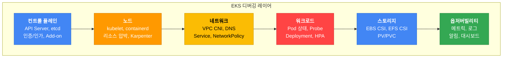
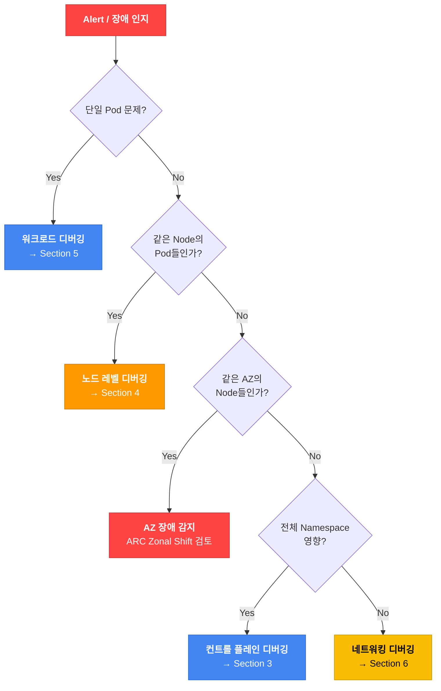
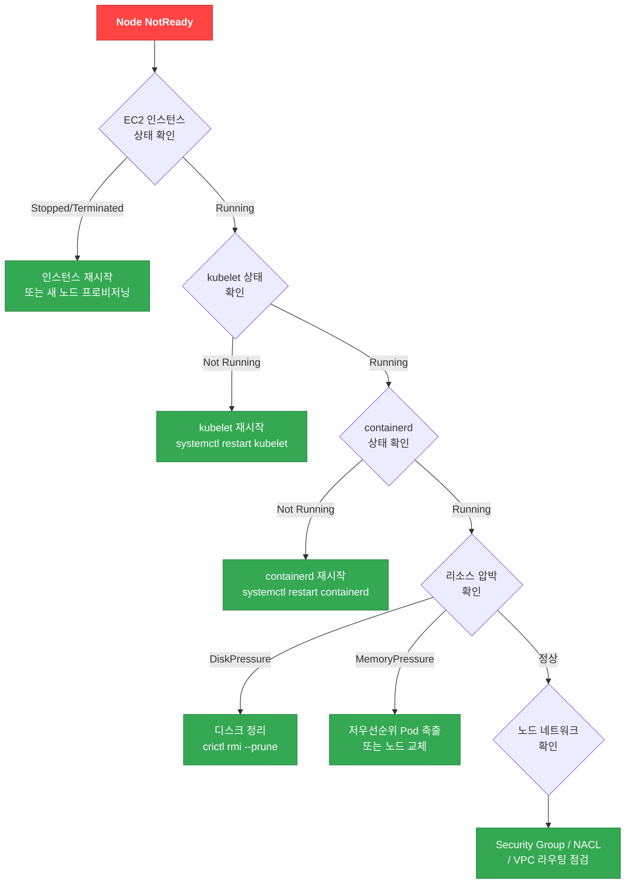
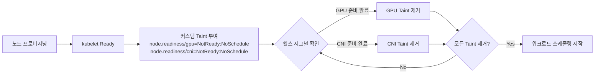
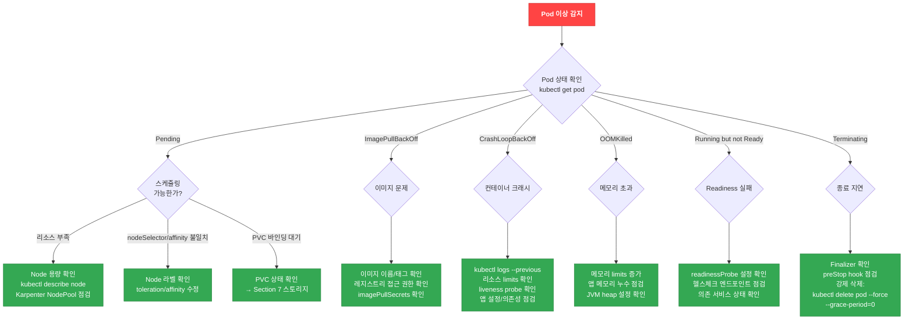
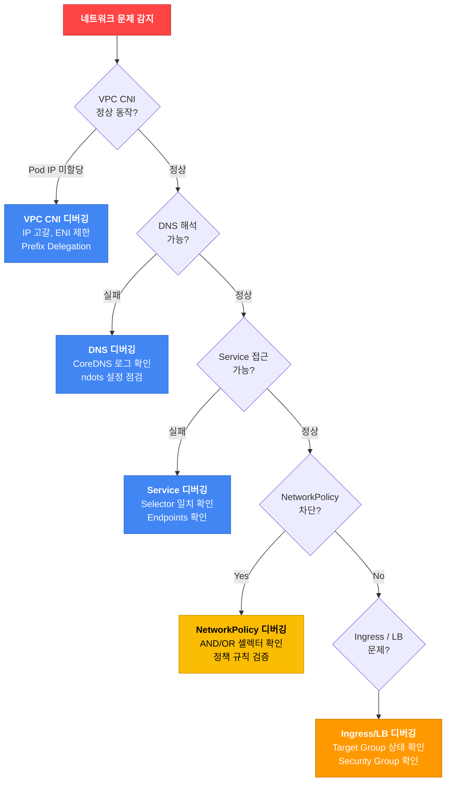
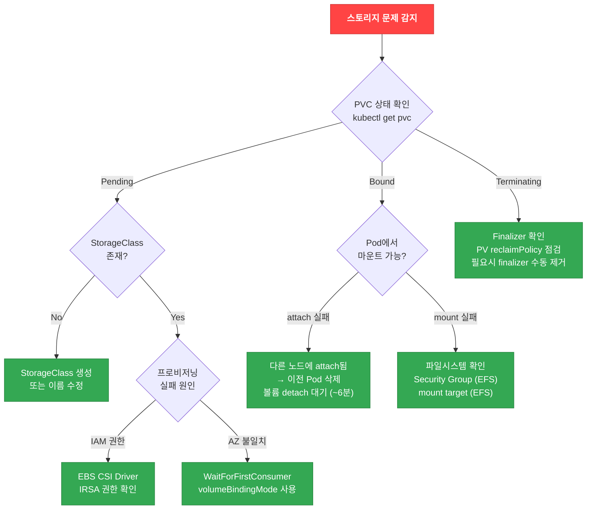
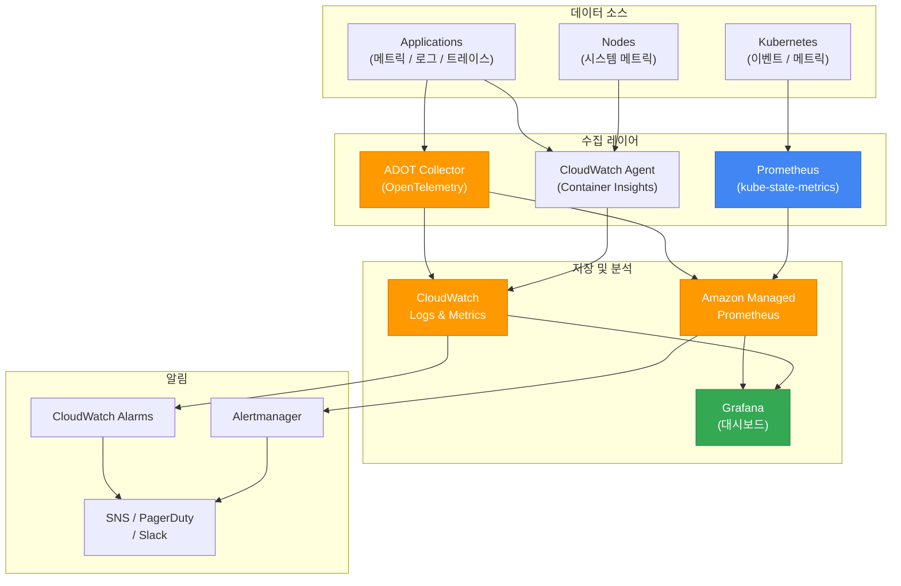
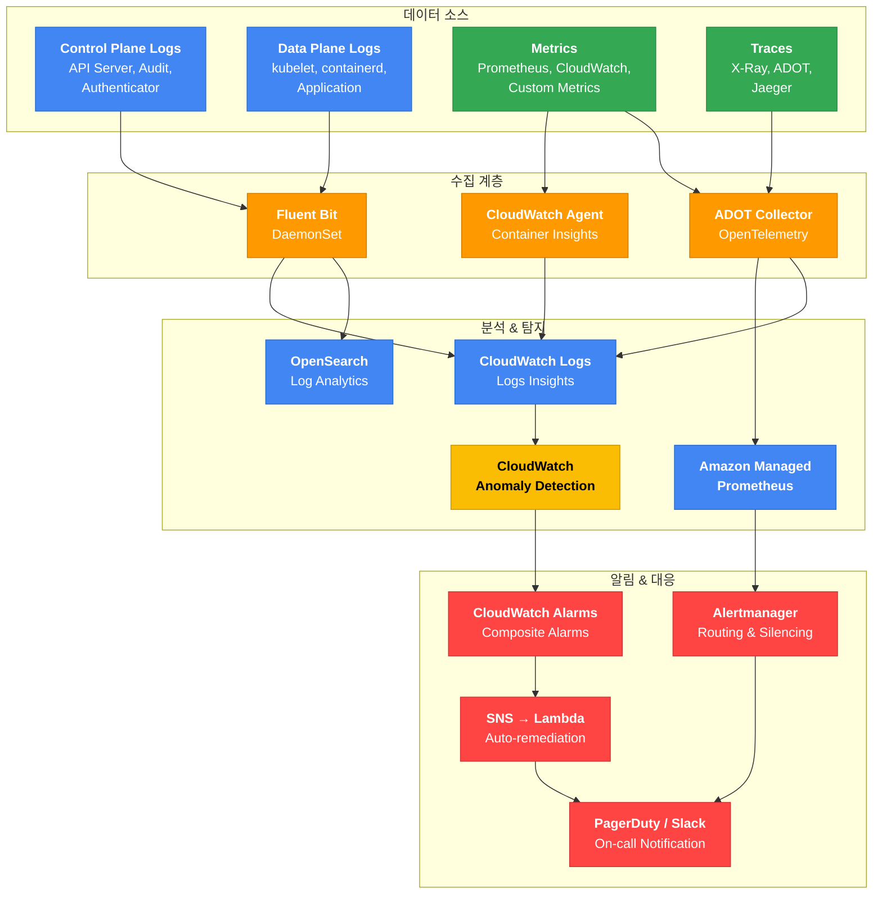

# EKS 디버깅 가이드

> 📅 **작성일**: 2026-02-10 | ⏱️ **읽는 시간**: 약 25분

> **📌 기준 환경**: EKS 1.30+, kubectl 1.30+, AWS CLI v2

## 1. 개요

EKS 운영 중 발생하는 문제는 컨트롤 플레인, 노드, 네트워크, 워크로드, 스토리지, 옵저버빌리티 등 다양한 레이어에 걸쳐 나타납니다. 본 문서는 SRE, DevOps 엔지니어, 플랫폼 팀이 이러한 문제를 **체계적으로 진단하고 신속하게 해결**하기 위한 종합 디버깅 가이드입니다.

모든 명령어와 예제는 즉시 실행 가능하도록 작성되었으며, Decision Tree와 플로우차트를 통해 빠른 판단을 돕습니다.

### EKS 디버깅 레이어



### 디버깅 접근 방법론

EKS 문제 진단에는 두 가지 접근 방식이 있습니다.

| 접근 방식 | 설명 | 적합한 상황 |
|-----------|------|------------|
| **Top-down (증상 → 원인)** | 사용자가 보고한 증상에서 시작하여 원인을 추적 | 서비스 장애, 성능 저하 등 즉각적인 문제 대응 |
| **Bottom-up (인프라 → 앱)** | 인프라 레이어부터 순차적으로 점검 | 예방적 점검, 클러스터 마이그레이션 후 검증 |

:::tip 일반적인 권장 순서
프로덕션 인시던트에서는 **Top-down** 접근을 권장합니다. 먼저 증상을 파악하고 (Section 2 인시던트 트리아지), 해당 레이어의 디버깅 섹션으로 이동하세요.
:::

---

## 2. 인시던트 트리아지 (빠른 장애 판단)

### First 5 Minutes 체크리스트

인시던트 발생 시 가장 중요한 것은 **스코프 판별**과 **초동 대응**입니다.

#### 30초: 초기 진단

```bash
# 클러스터 상태 확인
aws eks describe-cluster --name <cluster-name> --query 'cluster.status' --output text

# 노드 상태 확인
kubectl get nodes

# 비정상 Pod 확인
kubectl get pods --all-namespaces | grep -v Running | grep -v Completed
```

#### 2분: 스코프 판별

```bash
# 최근 이벤트 확인 (전체 네임스페이스)
kubectl get events --all-namespaces --sort-by='.lastTimestamp' | tail -20

# 특정 네임스페이스 Pod 상태 집계
kubectl get pods -n <namespace> --no-headers | awk '{print $3}' | sort | uniq -c | sort -rn

# 노드별 비정상 Pod 분포 확인
kubectl get pods --all-namespaces -o wide --field-selector=status.phase!=Running | \
  awk 'NR>1 {print $8}' | sort | uniq -c | sort -rn
```

#### 5분: 초동 대응

```bash
# 문제 Pod의 상세 정보
kubectl describe pod <pod-name> -n <namespace>

# 이전 컨테이너 로그 (CrashLoopBackOff인 경우)
kubectl logs <pod-name> -n <namespace> --previous

# 리소스 사용량 확인
kubectl top nodes
kubectl top pods -n <namespace> --sort-by=cpu
```

### 스코프 판별 Decision Tree



### AZ 장애 감지

:::warning AWS Health API 요구사항
`aws health describe-events` API는 **AWS Business 또는 Enterprise Support** 플랜에서만 사용 가능합니다. Support 플랜이 없는 경우 [AWS Health Dashboard 콘솔](https://health.aws.amazon.com/health/home)에서 직접 확인하거나, EventBridge 규칙으로 Health 이벤트를 캡처하세요.
:::

```bash
# AWS Health API로 EKS/EC2 관련 이벤트 확인 (Business/Enterprise Support 플랜 필요)
aws health describe-events \
  --filter '{"services":["EKS","EC2"],"eventStatusCodes":["open"]}' \
  --region us-east-1

# 대안: Support 플랜 없이 AZ 장애 감지 — EventBridge 규칙 생성
aws events put-rule \
  --name "aws-health-eks-events" \
  --event-pattern '{
    "source": ["aws.health"],
    "detail-type": ["AWS Health Event"],
    "detail": {
      "service": ["EKS", "EC2"],
      "eventTypeCategory": ["issue"]
    }
  }'

# AZ별 비정상 Pod 집계 (노드에 스케줄링된 Pod만 대상)
kubectl get pods --all-namespaces -o json | jq -r '
  .items[] |
  select(.status.phase != "Running" and .status.phase != "Succeeded") |
  select(.spec.nodeName != null) |
  .spec.nodeName
' | sort -u | while read node; do
  zone=$(kubectl get node "$node" -o jsonpath='{.metadata.labels.topology\.kubernetes\.io/zone}' 2>/dev/null)
  [ -n "$zone" ] && echo "$zone"
done | sort | uniq -c | sort -rn

# ARC Zonal Shift 상태 확인
aws arc-zonal-shift list-zonal-shifts \
  --resource-identifier arn:aws:eks:region:account:cluster/name
```

#### ARC Zonal Shift를 사용한 AZ 장애 대응

```bash
# EKS에서 Zonal Shift 활성화
aws eks update-cluster-config \
  --name <cluster-name> \
  --zonal-shift-config enabled=true

# 수동 Zonal Shift 시작 (장애 AZ로부터 트래픽 이동)
aws arc-zonal-shift start-zonal-shift \
  --resource-identifier arn:aws:eks:region:account:cluster/name \
  --away-from us-east-1a \
  --expires-in 3h \
  --comment "AZ impairment detected"
```

:::warning Zonal Shift 주의사항
Zonal Shift의 최대 지속 시간은 **3일**이며 연장 가능합니다. Shift를 시작하면 해당 AZ의 노드에서 실행 중인 Pod으로의 새로운 트래픽이 차단되므로, 다른 AZ에 충분한 용량이 있는지 먼저 확인하세요.
:::

:::danger Zonal Shift는 트래픽만 차단합니다
ARC Zonal Shift는 **Load Balancer / Service 레벨의 트래픽 라우팅만 변경**합니다.

| 계층 | Zonal Shift 영향 | 자동 조정 | 수동 작업 필요 |
|---|---|---|---|
| **ALB / NLB** | 해당 AZ Target Group에서 제거 | ✅ 자동 | - |
| **EKS Service (kube-proxy)** | 해당 AZ의 Endpoint 가중치 제거 | ✅ 자동 | - |
| **기존 노드** | 계속 실행됨 | ❌ | `kubectl drain` 으로 Pod 이동 |
| **기존 Pod** | 트래픽만 차단, Pod 자체는 실행 중 | ❌ | drain 시 자동 재배치 |
| **Karpenter NodePool** | AZ 설정 변경 없음, 해당 AZ에 새 노드 생성 가능 | ❌ | NodePool requirements 수정 |
| **ASG (Managed Node Group)** | 서브넷 목록 변경 없음, 해당 AZ에 스케일아웃 가능 | ❌ | ASG 서브넷 수정 (콘솔/IaC) |
| **EBS 볼륨** | AZ에 고정, 이동 불가 | ❌ | 스냅샷 → 다른 AZ에 복원 |
| **EFS Mount Target** | 다른 AZ의 Mount Target 자동 사용 | ✅ 자동 | - | Karpenter NodePool, ASG(Managed Node Group)의 AZ 설정은 자동으로 업데이트되지 않습니다. 따라서 완전한 AZ 대피를 위해서는 추가 작업이 필요합니다:

1. **Zonal Shift 시작** → 새 트래픽 차단 (자동)
2. **해당 AZ 노드 drain** → 기존 Pod 이동
3. **Karpenter NodePool 또는 ASG 서브넷에서 해당 AZ 제거** → 새 노드 프로비저닝 방지

```bash
# 1. 장애 AZ의 노드 식별 및 drain
for node in $(kubectl get nodes -l topology.kubernetes.io/zone=us-east-1a -o name); do
  kubectl cordon $node
  kubectl drain $node --ignore-daemonsets --delete-emptydir-data --grace-period=60
done

# 2. Karpenter NodePool에서 해당 AZ 일시 제외 (requirements 수정)
kubectl patch nodepool default --type=merge -p '{
  "spec": {"template": {"spec": {"requirements": [
    {"key": "topology.kubernetes.io/zone", "operator": "In", "values": ["us-east-1b", "us-east-1c"]}
  ]}}}
}'

# 3. Managed Node Group은 ASG 서브넷 변경이 필요 (콘솔 또는 IaC에서 수행)
```

Zonal Shift 해제 후에는 위 변경사항을 원복해야 합니다.
:::

### CloudWatch 이상 탐지

```bash
# Pod 재시작 횟수에 대한 Anomaly Detection 알람 설정
aws cloudwatch put-anomaly-detector \
  --single-metric-anomaly-detector '{
    "Namespace": "ContainerInsights",
    "MetricName": "pod_number_of_container_restarts",
    "Dimensions": [
      {"Name": "ClusterName", "Value": "<cluster-name>"},
      {"Name": "Namespace", "Value": "production"}
    ],
    "Stat": "Average"
  }'
```

### 인시던트 대응 에스컬레이션 매트릭스

| 심각도 | 정의 | 초동 대응 시간 | 에스컬레이션 | 예시 |
|--------|------|---------------|-------------|------|
| **P1 - Critical** | 전체 서비스 중단 | 5분 이내 | 즉시 온콜 + 관리자 | 컨트롤 플레인 장애, 전체 노드 NotReady |
| **P2 - High** | 주요 기능 장애 | 15분 이내 | 온콜 팀 | 특정 AZ 장애, 다수 Pod CrashLoopBackOff |
| **P3 - Medium** | 성능 저하 | 1시간 이내 | 담당 팀 | HPA 스케일링 실패, 간헐적 타임아웃 |
| **P4 - Low** | 경미한 이슈 | 4시간 이내 | 백로그 | 단일 Pod 재시작, 비프로덕션 환경 이슈 |

:::info 레질리언시 가이드 참조
아키텍처 수준의 장애 회복 전략(TopologySpreadConstraints, PodDisruptionBudget, 멀티AZ 배포 등)은 [EKS 레질리언시 가이드](./eks-resiliency-guide.md)를 참조하세요.
:::

---

## 3. EKS 컨트롤 플레인 디버깅

### 컨트롤 플레인 로그 타입

EKS 컨트롤 플레인은 5가지 로그 타입을 CloudWatch Logs에 전송할 수 있습니다.

| 로그 타입 | 컴포넌트 | CloudWatch Log Stream 패턴 | 용도 |
|-----------|---------|---------------------------|------|
| `api` | kube-apiserver | `kube-apiserver-audit-*` | API 요청/응답 기록 |
| `audit` | kube-apiserver-audit | `kube-apiserver-audit-*` | 감사 로그 (누가, 무엇을, 언제) |
| `authenticator` | aws-iam-authenticator | `authenticator-*` | IAM 인증 이벤트 |
| `controllerManager` | kube-controller-manager | `kube-controller-manager-*` | 컨트롤러 동작 로그 |
| `scheduler` | kube-scheduler | `scheduler-*` | 스케줄링 결정 및 실패 |

로그 그룹: `/aws/eks/<cluster-name>/cluster`

### 로그 활성화

```bash
# 모든 컨트롤 플레인 로그 활성화
aws eks update-cluster-config \
  --region <region> \
  --name <cluster-name> \
  --logging '{"clusterLogging":[{"types":["api","audit","authenticator","controllerManager","scheduler"],"enabled":true}]}'
```

:::tip 비용 최적화
모든 로그 타입을 활성화하면 CloudWatch Logs 비용이 증가합니다. 프로덕션에서는 `audit`과 `authenticator`를 필수로 활성화하고, 디버깅이 필요할 때 나머지를 추가 활성화하는 전략을 권장합니다.
:::

### CloudWatch Logs Insights 쿼리

#### API 서버 에러 (400+) 분석

```sql
fields @timestamp, @message
| filter @logStream like /kube-apiserver-audit/
| filter responseStatus.code >= 400
| stats count() by responseStatus.code
| sort count desc
```

#### 인증 실패 추적

```sql
fields @timestamp, @message
| filter @logStream like /authenticator/
| filter @message like /error/ or @message like /denied/
| sort @timestamp desc
```

#### aws-auth ConfigMap 변경 감지

```sql
fields @timestamp, @message
| filter @logStream like /kube-apiserver-audit/
| filter objectRef.resource = "configmaps" and objectRef.name = "aws-auth"
| filter verb in ["update", "patch", "delete"]
| sort @timestamp desc
```

#### API Throttling 탐지

```sql
fields @timestamp, @message
| filter @logStream like /kube-apiserver/
| filter @message like /throttle/ or @message like /rate limit/
| stats count() by bin(5m)
```

#### 비인가 접근 시도 (보안 이벤트)

```sql
fields @timestamp, @message
| filter @logStream like /kube-apiserver-audit/
| filter responseStatus.code = 403
| stats count() by user.username
| sort count desc
```

### 인증/인가 디버깅

#### IAM 인증 확인

```bash
# 현재 IAM 자격증명 확인
aws sts get-caller-identity

# 클러스터 인증 모드 확인
aws eks describe-cluster --name <cluster-name> \
  --query 'cluster.accessConfig.authenticationMode' --output text
```

#### aws-auth ConfigMap (CONFIG_MAP 모드)

```bash
# aws-auth ConfigMap 확인
kubectl describe configmap aws-auth -n kube-system
```

#### EKS Access Entries (API / API_AND_CONFIG_MAP 모드)

```bash
# Access Entry 생성
aws eks create-access-entry \
  --cluster-name <cluster-name> \
  --principal-arn arn:aws:iam::ACCOUNT:role/ROLE-NAME \
  --type STANDARD

# Access Entry 목록 확인
aws eks list-access-entries --cluster-name <cluster-name>
```

#### IRSA (IAM Roles for Service Accounts) 디버깅 체크리스트

```bash
# 1. ServiceAccount에 annotation 확인
kubectl get sa <sa-name> -n <namespace> -o yaml

# 2. Pod 내 AWS 환경변수 확인
kubectl exec -it <pod-name> -- env | grep AWS

# 3. OIDC Provider 확인
aws eks describe-cluster --name <cluster-name> \
  --query 'cluster.identity.oidc.issuer' --output text

# 4. IAM Role의 Trust Policy에서 OIDC Provider ARN 및 조건 확인
aws iam get-role --role-name <role-name> \
  --query 'Role.AssumeRolePolicyDocument'
```

:::warning IRSA 일반적인 실수
- ServiceAccount annotation의 role ARN 오타
- IAM Role Trust Policy에서 namespace/sa 이름 불일치
- OIDC Provider가 클러스터와 연결되지 않음
- Pod가 ServiceAccount를 사용하도록 `spec.serviceAccountName` 미지정
:::

### 서비스 어카운트 토큰 만료 (HTTP 401 Unauthorized)

Kubernetes 1.21+에서 서비스 어카운트 토큰은 **기본 1시간 유효**하며, kubelet에 의해 자동 갱신됩니다. 그러나 레거시 SDK를 사용하는 경우 토큰 갱신 로직이 없어 장기 실행 워크로드에서 `401 Unauthorized` 에러가 발생할 수 있습니다.

**증상:**
- Pod이 일정 시간(보통 1시간) 후 갑자기 `HTTP 401 Unauthorized` 에러를 반환
- 재시작 후 일시적으로 정상 동작하다가 다시 401 발생

**원인:**
- 프로젝티드 서비스 어카운트 토큰(Projected Service Account Token)은 기본 1시간 만료
- kubelet이 토큰을 자동 갱신하지만, 애플리케이션이 파일에서 토큰을 한 번만 읽고 캐싱하면 만료된 토큰을 계속 사용

**필요한 최소 SDK 버전:**

| 언어 | SDK | 최소 버전 |
|------|-----|----------|
| Go | client-go | v0.15.7+ |
| Python | kubernetes | 12.0.0+ |
| Java | fabric8 | 5.0.0+ |

:::tip 토큰 갱신 확인
SDK가 토큰 자동 갱신을 지원하는지 확인하세요. 지원하지 않는 경우 애플리케이션에서 주기적으로 `/var/run/secrets/kubernetes.io/serviceaccount/token` 파일을 다시 읽도록 구현해야 합니다.
:::

### EKS Pod Identity 디버깅

EKS Pod Identity는 IRSA의 대안으로, 보다 간단한 설정으로 Pod에 AWS IAM 권한을 부여합니다.

```bash
# Pod Identity Association 확인
aws eks list-pod-identity-associations --cluster-name $CLUSTER
aws eks describe-pod-identity-association --cluster-name $CLUSTER \
  --association-id $ASSOC_ID

# Pod Identity Agent 상태 확인
kubectl get pods -n kube-system -l app.kubernetes.io/name=eks-pod-identity-agent
kubectl logs -n kube-system -l app.kubernetes.io/name=eks-pod-identity-agent --tail=50
```

**Pod Identity 디버깅 체크리스트:**

- eks-pod-identity-agent Add-on이 설치되어 있는지
- Pod의 ServiceAccount에 올바른 association이 연결되어 있는지
- IAM Role trust policy에 `pods.eks.amazonaws.com` 서비스 프린시펄이 있는지

:::info Pod Identity vs IRSA
Pod Identity는 IRSA보다 설정이 간단하며, cross-account 접근이 더 용이합니다. 신규 워크로드에서는 Pod Identity 사용을 권장합니다.
:::

### EKS Add-on 트러블슈팅

```bash
# Add-on 목록 확인
aws eks list-addons --cluster-name <cluster-name>

# Add-on 상태 상세 확인
aws eks describe-addon --cluster-name <cluster-name> --addon-name <addon-name>

# Add-on 업데이트 (충돌 해결: PRESERVE로 기존 설정 유지)
aws eks update-addon --cluster-name <cluster-name> --addon-name <addon-name> \
  --addon-version <version> --resolve-conflicts PRESERVE
```

| Add-on | 일반적인 에러 패턴 | 진단 방법 | 해결 방법 |
|--------|-------------------|----------|----------|
| **CoreDNS** | Pod CrashLoopBackOff, DNS 타임아웃 | `kubectl logs -n kube-system -l k8s-app=kube-dns` | ConfigMap 점검, `kubectl rollout restart deployment coredns -n kube-system` |
| **kube-proxy** | Service 통신 불가, iptables 에러 | `kubectl logs -n kube-system -l k8s-app=kube-proxy` | DaemonSet 이미지 버전 확인, `kubectl rollout restart daemonset kube-proxy -n kube-system` |
| **VPC CNI** | Pod IP 할당 실패, ENI 에러 | `kubectl logs -n kube-system -l k8s-app=aws-node` | IPAMD 로그 확인, ENI/IP 한도 점검 (Section 6 참조) |
| **EBS CSI** | PVC Pending, 볼륨 attach 실패 | `kubectl logs -n kube-system -l app.kubernetes.io/name=aws-ebs-csi-driver` | IRSA 권한, AZ 매칭 확인 (Section 7 참조) |

### 클러스터 헬스 이슈 코드

EKS 클러스터 자체의 인프라 수준 문제를 진단할 때는 클러스터 헬스 상태를 확인합니다.

```bash
# 클러스터 헬스 이슈 확인
aws eks describe-cluster --name $CLUSTER \
  --query 'cluster.health' --output json
```

| 코드 | 메시지 | 복구 가능 여부 |
|---|---|---|
| `SUBNET_NOT_FOUND` | 클러스터 서브넷이 삭제됨 | ⚠️ 새 서브넷 연결 필요 |
| `SECURITY_GROUP_NOT_FOUND` | 클러스터 보안그룹이 삭제됨 | ⚠️ 보안그룹 재생성 |
| `IP_NOT_AVAILABLE` | 서브넷에 IP 부족 | ✅ 서브넷 추가/확장 |
| `VPC_NOT_FOUND` | VPC가 삭제됨 | ❌ 클러스터 재생성 필요 |
| `ASSUME_ROLE_ACCESS_DENIED` | 클러스터 IAM Role 권한 문제 | ✅ IAM 정책 수정 |
| `KMS_KEY_DISABLED` | Secrets 암호화 KMS 키 비활성화 | ✅ KMS 키 재활성화 |
| `KMS_KEY_NOT_FOUND` | KMS 키 삭제됨 | ❌ 복구 불가 |

:::danger 복구 불가 이슈
`VPC_NOT_FOUND`와 `KMS_KEY_NOT_FOUND`는 복구가 불가능합니다. 클러스터를 새로 생성해야 합니다.
:::

---

## 4. 노드 레벨 디버깅

### 노드 조인 실패 디버깅

노드가 클러스터에 조인하지 못하는 경우 다양한 원인이 있습니다. 다음은 가장 흔한 8가지 원인과 진단 방법입니다.

**노드 조인 실패의 일반적인 원인:**

1. **aws-auth ConfigMap에 노드 IAM Role이 등록되지 않음** (또는 Access Entry 미생성) — 노드가 API 서버에 인증할 수 없음
2. **부트스트랩 스크립트의 ClusterName이 실제 클러스터명과 불일치** — kubelet이 잘못된 클러스터에 연결 시도
3. **노드 보안그룹이 컨트롤 플레인과의 통신을 허용하지 않음** — TCP 443 (API 서버), TCP 10250 (kubelet) 포트가 필요
4. **퍼블릭 서브넷에서 auto-assign public IP가 비활성화됨** — 퍼블릭 엔드포인트만 활성화된 클러스터에서 인터넷 접근 불가
5. **VPC DNS 설정 문제** — `enableDnsHostnames`, `enableDnsSupport`가 비활성화됨
6. **STS 리전 엔드포인트가 비활성화됨** — IAM 인증 시 STS 호출 실패
7. **인스턴스 프로파일 ARN을 노드 IAM Role ARN 대신 aws-auth에 등록** — aws-auth에는 Role ARN만 등록해야 함
8. **`eks:kubernetes.io/cluster-name` 태그 누락** (자체관리형 노드) — EKS가 노드를 클러스터 소속으로 인식하지 못함

**진단 명령어:**

```bash
# 노드 부트스트랩 로그 확인 (SSM 접속 후)
sudo journalctl -u kubelet --no-pager | tail -50
sudo cat /var/log/cloud-init-output.log | tail -50

# 보안그룹 규칙 확인
aws ec2 describe-security-groups --group-ids $CLUSTER_SG \
  --query 'SecurityGroups[].IpPermissions' --output table

# VPC DNS 설정 확인
aws ec2 describe-vpc-attribute --vpc-id $VPC_ID --attribute enableDnsHostnames
aws ec2 describe-vpc-attribute --vpc-id $VPC_ID --attribute enableDnsSupport
```

:::warning aws-auth에 등록할 ARN
aws-auth ConfigMap에는 인스턴스 프로파일 ARN (`arn:aws:iam::ACCOUNT:instance-profile/...`)이 아닌, **IAM Role ARN** (`arn:aws:iam::ACCOUNT:role/...`)을 등록해야 합니다. 이 실수는 매우 빈번하며 노드 조인 실패의 주요 원인입니다.
:::

### Node NotReady Decision Tree



### kubelet / containerd 디버깅

```bash
# SSM을 통한 노드 접속
aws ssm start-session --target <instance-id>

# kubelet 상태 확인
systemctl status kubelet
journalctl -u kubelet -n 100 -f

# containerd 상태 확인
systemctl status containerd

# 컨테이너 런타임 상태 확인
crictl pods
crictl ps -a

# 특정 컨테이너 로그 확인
crictl logs <container-id>
```

:::info SSM 접속 사전 요구사항
SSM 접속을 위해서는 노드의 IAM Role에 `AmazonSSMManagedInstanceCore` 정책이 연결되어 있어야 합니다. EKS 관리형 노드 그룹에서는 기본 포함되지만, 커스텀 AMI를 사용하는 경우 SSM Agent 설치를 확인하세요.
:::

### 리소스 압박 진단 및 해결

```bash
# 노드 상태 확인
kubectl describe node <node-name>
```

| Condition | 임계값 | 진단 명령어 | 해결 방법 |
|-----------|--------|-----------|----------|
| **DiskPressure** | 사용 가능 디스크 < 10% | `df -h` (SSM 접속 후) | `crictl rmi --prune` 으로 미사용 이미지 정리, `crictl rm` 으로 중지된 컨테이너 삭제 |
| **MemoryPressure** | 사용 가능 메모리 < 100Mi | `free -m` (SSM 접속 후) | 저우선순위 Pod 축출, 메모리 requests/limits 조정, 노드 교체 |
| **PIDPressure** | 사용 가능 PID < 5% | `ps aux \| wc -l` (SSM 접속 후) | `kernel.pid_max` 증가, PID leak 원인 컨테이너 식별 및 재시작 |

### Karpenter 노드 프로비저닝 디버깅

```bash
# Karpenter 컨트롤러 로그 확인
kubectl logs -f deployment/karpenter -n kube-system

# NodePool 상태 확인
kubectl get nodepool
kubectl describe nodepool <nodepool-name>

# EC2NodeClass 확인
kubectl get ec2nodeclass
kubectl describe ec2nodeclass <nodeclass-name>

# 프로비저닝 실패 시 확인 사항:
# 1. NodePool의 limits가 초과되지 않았는지
# 2. EC2NodeClass의 서브넷/보안그룹 셀렉터가 올바른지
# 3. 인스턴스 타입에 대한 Service Quotas가 충분한지
# 4. Pod의 nodeSelector/affinity가 NodePool requirements와 매칭되는지
```

:::warning Karpenter v1 API 변경사항
Karpenter v1.0+에서는 `Provisioner` → `NodePool`, `AWSNodeTemplate` → `EC2NodeClass`로 변경되었습니다. 기존 v0.x 설정을 사용 중이라면 마이그레이션이 필요합니다. API 그룹도 `karpenter.sh/v1`로 업데이트하세요.
:::

### Managed Node Group 에러 코드

Managed Node Group의 헬스 상태를 확인하여 프로비저닝 및 운영 문제를 진단합니다.

```bash
# 노드 그룹 헬스 상태 확인
aws eks describe-nodegroup --cluster-name $CLUSTER --nodegroup-name $NODEGROUP \
  --query 'nodegroup.health' --output json
```

| 에러 코드 | 원인 | 해결 방법 |
|---|---|---|
| `AccessDenied` | 노드 IAM Role에 필요한 권한 부족 | eks:node-manager ClusterRole/ClusterRoleBinding 확인 및 복구 |
| `AmiIdNotFound` | Launch Template의 AMI ID가 존재하지 않음 | 유효한 EKS optimized AMI ID로 업데이트 |
| `AutoScalingGroupNotFound` | ASG가 삭제되었거나 존재하지 않음 | 노드 그룹 삭제 후 재생성 |
| `ClusterUnreachable` | 노드가 EKS API 서버에 연결 불가 | VPC 설정, 보안그룹, 엔드포인트 접근성 확인 |
| `Ec2SecurityGroupNotFound` | 지정된 보안그룹이 삭제됨 | 올바른 보안그룹 생성 후 노드그룹 재구성 |
| `Ec2LaunchTemplateNotFound` | Launch Template이 삭제됨 | 새 Launch Template 생성 후 노드그룹 업데이트 |
| `Ec2LaunchTemplateVersionMismatch` | Launch Template 버전 불일치 | 노드그룹이 참조하는 버전 확인 및 수정 |
| `IamInstanceProfileNotFound` | 인스턴스 프로파일이 존재하지 않음 | IAM 인스턴스 프로파일 재생성 |
| `IamNodeRoleNotFound` | 노드 IAM Role이 삭제됨 | IAM Role 재생성 후 필요 정책 연결 |
| `AsgInstanceLaunchFailures` | EC2 인스턴스 시작 실패 (용량 부족 등) | 다른 인스턴스 타입/AZ 추가, Service Quotas 확인 |
| `NodeCreationFailure` | 노드 생성 일반 실패 | CloudTrail에서 상세 에러 확인 |
| `InstanceLimitExceeded` | EC2 인스턴스 한도 초과 | Service Quotas에서 한도 증가 요청 |
| `InsufficientFreeAddresses` | 서브넷의 가용 IP 주소 부족 | 서브넷 CIDR 확장 또는 새 서브넷 추가 |
| `InternalFailure` | AWS 내부 오류 | 재시도, 지속시 AWS Support 문의 |

**AccessDenied 에러 복구 — eks:node-manager ClusterRole 확인:**

`AccessDenied` 에러는 주로 `eks:node-manager` ClusterRole 또는 ClusterRoleBinding이 삭제되거나 변경된 경우 발생합니다.

```bash
# eks:node-manager ClusterRole 확인
kubectl get clusterrole eks:node-manager
kubectl get clusterrolebinding eks:node-manager
```

:::danger AccessDenied 복구
`eks:node-manager` ClusterRole/ClusterRoleBinding이 누락된 경우, EKS는 이를 **자동으로 복원하지 않습니다**. 다음 방법으로 직접 복구해야 합니다:

**방법 1: 수동 재생성 (권장)**

```yaml
# eks-node-manager-role.yaml
apiVersion: rbac.authorization.k8s.io/v1
kind: ClusterRole
metadata:
  name: eks:node-manager
rules:
  - apiGroups: ['']
    resources: [pods]
    verbs: [get, list, watch, delete]
  - apiGroups: ['']
    resources: [nodes]
    verbs: [get, list, watch, patch]
  - apiGroups: ['']
    resources: [pods/eviction]
    verbs: [create]
---
apiVersion: rbac.authorization.k8s.io/v1
kind: ClusterRoleBinding
metadata:
  name: eks:node-manager
roleRef:
  apiGroup: rbac.authorization.k8s.io
  kind: ClusterRole
  name: eks:node-manager
subjects:
  - apiGroup: rbac.authorization.k8s.io
    kind: User
    name: eks:node-manager
```

```bash
kubectl auth reconcile -f eks-node-manager-role.yaml
```

**방법 2: 노드 그룹 재생성**
```bash
# 새 노드 그룹 생성 시 RBAC 리소스가 함께 생성됨
eksctl create nodegroup --cluster=<cluster-name> --name=<new-nodegroup-name>
```

**방법 3: 노드 그룹 업그레이드**
```bash
# 업그레이드 과정에서 RBAC 재설정이 트리거될 수 있음
eksctl upgrade nodegroup --cluster=<cluster-name> --name=<nodegroup-name>
```

> **참고**: Kubernetes 기본 시스템 ClusterRole(`system:*`)은 API 서버가 자동 reconcile하지만, EKS 전용 ClusterRole(`eks:*`)은 자동 복원 대상이 아닙니다. RBAC 리소스를 삭제하기 전에 반드시 백업하세요.
:::

### Node Readiness Controller를 활용한 노드 부트스트랩 디버깅

:::info Kubernetes 새 기능 (2026년 2월)
[Node Readiness Controller](https://kubernetes.io/blog/2026/02/03/node-readiness-controller/)는 Kubernetes 공식 블로그에서 발표된 새로운 프로젝트로, 노드 부트스트랩 과정에서 발생하는 조기 스케줄링 문제를 선언적으로 해결합니다.
:::

#### 문제 상황

기존 Kubernetes에서는 노드가 `Ready` 상태가 되면 즉시 워크로드가 스케줄링됩니다. 하지만 실제로는 아직 준비가 완료되지 않은 경우가 많습니다:

| 미완료 구성 요소 | 증상 | 영향 |
|---|---|---|
| GPU 드라이버/펌웨어 로딩 중 | `nvidia-smi` 실패, Pod `CrashLoopBackOff` | GPU 워크로드 실패 |
| CNI 플러그인 초기화 중 | Pod IP 미할당, `NetworkNotReady` | 네트워크 통신 불가 |
| CSI 드라이버 미등록 | PVC `Pending`, volume mount 실패 | 스토리지 접근 불가 |
| 보안 에이전트 미설치 | 컴플라이언스 위반 | 보안 정책 미충족 |

#### Node Readiness Controller 동작 원리

Node Readiness Controller는 **커스텀 taint를 선언적으로 관리**하여, 모든 인프라 요구사항이 충족될 때까지 워크로드 스케줄링을 지연시킵니다:



#### 디버깅 체크리스트

노드가 `Ready`인데 Pod가 스케줄링되지 않는 경우:

```bash
# 1. 노드의 커스텀 readiness taint 확인
kubectl get node <node-name> -o jsonpath='{.spec.taints}' | jq .

# 2. node.readiness 관련 taint 필터링
kubectl get nodes -o json | jq '
  .items[] |
  select(.spec.taints // [] | any(.key | startswith("node.readiness"))) |
  {name: .metadata.name, taints: [.spec.taints[] | select(.key | startswith("node.readiness"))]}
'

# 3. Pod의 tolerations와 노드 taint 불일치 확인
kubectl describe pod <pending-pod> | grep -A 20 "Events:"
```

#### 관련 기능: Pod Scheduling Readiness (K8s 1.30 GA)

`schedulingGates`를 사용하면 Pod 측에서도 스케줄링 준비 상태를 제어할 수 있습니다:

```yaml
apiVersion: v1
kind: Pod
metadata:
  name: gated-pod
spec:
  schedulingGates:
    - name: "example.com/gpu-validation"  # 이 gate가 제거될 때까지 스케줄링 대기
  containers:
    - name: app
      image: app:latest
```

```bash
# schedulingGates가 있는 Pod 확인
kubectl get pods -o json | jq '
  .items[] |
  select(.spec.schedulingGates != null and (.spec.schedulingGates | length > 0)) |
  {name: .metadata.name, namespace: .metadata.namespace, gates: .spec.schedulingGates}
'
```

#### 관련 기능: Pod Readiness Gates (AWS LB Controller)

AWS Load Balancer Controller는 `elbv2.k8s.aws/pod-readiness-gate-inject` 어노테이션을 통해 Pod가 ALB/NLB 타겟 등록이 완료될 때까지 `Ready` 상태 전환을 지연시킵니다:

```bash
# Readiness Gate 상태 확인
kubectl get pod <pod-name> -o jsonpath='{.status.conditions}' | jq '
  [.[] | select(.type | contains("target-health"))]
'

# Namespace에 readiness gate injection 활성화 확인
kubectl get namespace <ns> -o jsonpath='{.metadata.labels.elbv2\.k8s\.aws/pod-readiness-gate-inject}'
```

:::tip Readiness 기능 비교
| 기능 | 적용 대상 | 제어 방식 | 상태 |
|------|-----------|-----------|------|
| **Node Readiness Controller** | 노드 | Taint 기반 | New (2026.02) |
| **Pod Scheduling Readiness** | Pod | schedulingGates | GA (K8s 1.30) |
| **Pod Readiness Gates** | Pod | Readiness Conditions | GA (AWS LB Controller) |
:::

### eks-node-viewer 사용법

[eks-node-viewer](https://github.com/awslabs/eks-node-viewer)는 노드의 리소스 사용률을 터미널에서 실시간으로 시각화하는 도구입니다.

```bash
# 기본 사용 (CPU 기준)
eks-node-viewer

# CPU와 메모리 함께 확인
eks-node-viewer --resources cpu,memory

# 특정 NodePool만 확인
eks-node-viewer --node-selector karpenter.sh/nodepool=<nodepool-name>
```

---

## 5. 워크로드 디버깅

### Pod 상태별 디버깅 플로우차트



### 기본 디버깅 명령어

```bash
# Pod 상태 확인
kubectl get pods -n <namespace>
kubectl describe pod <pod-name> -n <namespace>

# 현재/이전 컨테이너 로그 확인
kubectl logs <pod-name> -n <namespace>
kubectl logs <pod-name> -n <namespace> --previous

# 네임스페이스 이벤트 확인
kubectl get events -n <namespace> --sort-by='.lastTimestamp'

# 리소스 사용량 확인
kubectl top pods -n <namespace>
```

### kubectl debug 활용법

#### Ephemeral Container (실행 중인 Pod에 디버그 컨테이너 추가)

```bash
# 기본 ephemeral container
kubectl debug <pod-name> -it --image=busybox --target=<container-name>

# 네트워크 디버깅 도구가 포함된 이미지
kubectl debug <pod-name> -it --image=nicolaka/netshoot --target=<container-name>
```

#### Pod Copy (Pod을 복제하여 디버깅)

```bash
# Pod을 복제하고 다른 이미지로 시작
kubectl debug <pod-name> --copy-to=debug-pod --image=ubuntu

# Pod 복제 시 커맨드 변경
kubectl debug <pod-name> --copy-to=debug-pod --container=<container-name> -- sh
```

#### Node Debugging (노드에 직접 접근)

```bash
# 노드 디버깅 (호스트 파일시스템은 /host에 마운트됨)
kubectl debug node/<node-name> -it --image=ubuntu
```

:::tip kubectl debug vs SSM
`kubectl debug node/` 는 SSM Agent가 설치되지 않은 노드에서도 사용 가능합니다. 다만, 호스트 네트워크 네임스페이스에 접근하려면 `--profile=sysadmin` 옵션을 추가하세요.
:::

### Deployment 롤아웃 디버깅

```bash
# 롤아웃 상태 확인
kubectl rollout status deployment/<name>

# 롤아웃 히스토리
kubectl rollout history deployment/<name>

# 이전 버전으로 롤백
kubectl rollout undo deployment/<name>

# 특정 리비전으로 롤백
kubectl rollout undo deployment/<name> --to-revision=2

# Deployment 재시작 (Rolling restart)
kubectl rollout restart deployment/<name>
```

### HPA / VPA 디버깅

```bash
# HPA 상태 확인
kubectl get hpa
kubectl describe hpa <hpa-name>

# metrics-server 동작 확인
kubectl get deployment metrics-server -n kube-system
kubectl top pods  # 이 명령어가 실패하면 metrics-server 문제

# HPA 이벤트에서 스케일링 실패 원인 확인
kubectl describe hpa <hpa-name> | grep -A 5 "Events"
```

**HPA 스케일링 불가 원인 분석:**

| 증상 | 원인 | 해결 |
|------|------|------|
| `unable to get metrics` | metrics-server 미설치 또는 장애 | metrics-server Pod 상태 확인 및 재시작 |
| `current metrics unknown` | 대상 Pod에서 메트릭 수집 실패 | Pod의 resource requests 설정 확인 |
| `target not found` | scaleTargetRef 불일치 | Deployment/StatefulSet 이름 및 apiVersion 확인 |
| 스케일업 후 즉시 스케일다운 | stabilizationWindow 미설정 | `behavior.scaleDown.stabilizationWindowSeconds` 설정 |

### Probe 디버깅 및 Best Practices

```yaml
# 권장 Probe 설정 예제
apiVersion: apps/v1
kind: Deployment
metadata:
  name: web-app
spec:
  template:
    spec:
      containers:
      - name: app
        image: my-app:latest
        ports:
        - containerPort: 8080
        # Startup Probe: 앱 시작 완료 확인 (시작이 느린 앱에 필수)
        startupProbe:
          httpGet:
            path: /healthz
            port: 8080
          failureThreshold: 30    # 최대 300초(30 x 10s) 대기
          periodSeconds: 10
        # Liveness Probe: 앱이 살아있는지 확인 (데드락 감지)
        livenessProbe:
          httpGet:
            path: /healthz
            port: 8080
          initialDelaySeconds: 30
          periodSeconds: 10
          timeoutSeconds: 5
          failureThreshold: 3
          successThreshold: 1
        # Readiness Probe: 트래픽 수신 가능 여부 확인
        readinessProbe:
          httpGet:
            path: /ready
            port: 8080
          initialDelaySeconds: 10
          periodSeconds: 5
          timeoutSeconds: 3
          failureThreshold: 3
          successThreshold: 1
```

:::danger Probe 설정 시 주의사항
- **Liveness Probe에 외부 의존성을 포함하지 마세요** (DB 연결 확인 등). 외부 서비스 장애 시 전체 Pod이 재시작되는 cascading failure를 유발합니다.
- **startupProbe 없이 높은 initialDelaySeconds를 설정하지 마세요**. startupProbe가 성공할 때까지 liveness/readiness probe는 비활성화되므로, 시작이 느린 앱에서는 startupProbe를 사용하세요.
- Readiness Probe 실패는 Pod을 재시작하지 않고 Service Endpoint에서만 제거합니다.
:::

---

## 6. 네트워킹 디버깅

### 네트워킹 디버깅 워크플로우



### VPC CNI 디버깅

```bash
# VPC CNI Pod 상태 확인
kubectl get pods -n kube-system -l k8s-app=aws-node

# VPC CNI 로그 확인
kubectl logs -n kube-system -l k8s-app=aws-node --tail=50

# 현재 VPC CNI 버전 확인
kubectl describe daemonset aws-node -n kube-system | grep Image
```

**IP 고갈 문제 해결:**

```bash
# 서브넷별 사용 가능 IP 확인
aws ec2 describe-subnets --subnet-ids <subnet-id> \
  --query 'Subnets[].{ID:SubnetId,AZ:AvailabilityZone,Available:AvailableIpAddressCount}'

# Prefix Delegation 활성화 (IP 용량 16배 확대)
kubectl set env daemonset aws-node -n kube-system ENABLE_PREFIX_DELEGATION=true
```

**ENI 제한 및 IP 한도:**

각 EC2 인스턴스 타입에 따라 연결 가능한 ENI 수와 ENI당 IP 수가 제한됩니다. Prefix Delegation을 활성화하면 ENI당 IP 할당이 크게 증가합니다.

### DNS 트러블슈팅

```bash
# CoreDNS Pod 상태 확인
kubectl get pods -n kube-system -l k8s-app=kube-dns

# CoreDNS 로그 확인
kubectl logs -n kube-system -l k8s-app=kube-dns --tail=50

# DNS 해석 테스트
kubectl run -it --rm debug --image=busybox --restart=Never -- nslookup kubernetes.default

# CoreDNS 설정 확인
kubectl get configmap coredns -n kube-system -o yaml

# CoreDNS 재시작
kubectl rollout restart deployment coredns -n kube-system
```

:::warning ndots 이슈
Kubernetes의 기본 `resolv.conf` 설정에서 `ndots:5`는 도메인에 dot이 5개 미만이면 클러스터 내부 DNS 서픽스를 먼저 시도합니다. 외부 도메인 접근 시 불필요한 DNS 쿼리가 4회 추가 발생하여 지연이 증가합니다.

해결: Pod spec에서 `dnsConfig.options`로 `ndots:2`를 설정하거나, 외부 도메인 접근 시 FQDN 뒤에 `.`을 추가하세요 (예: `api.example.com.`).

참고: VPC DNS 스로틀링 한도는 **ENI당 1,024 packets/sec**입니다.
:::

### Service 디버깅

```bash
# Service 상태 확인
kubectl get svc <service-name>

# Endpoints 확인 (백엔드 Pod이 연결되어 있는지)
kubectl get endpoints <service-name>

# Service 상세 정보 (selector 확인)
kubectl describe svc <service-name>

# Selector 확인
kubectl get svc <service-name> -o jsonpath='{.spec.selector}'

# Selector와 일치하는 Pod 확인
kubectl get pods -l <key>=<value>
```

**일반적인 Service 문제:**

| 증상 | 확인 사항 | 해결 |
|------|----------|------|
| Endpoints가 비어있음 | Service selector와 Pod label 불일치 | label 수정 |
| ClusterIP 접근 불가 | kube-proxy 정상 동작 여부 | `kubectl logs -n kube-system -l k8s-app=kube-proxy` |
| NodePort 접근 불가 | Security Group에서 30000-32767 허용 여부 | SG Inbound 규칙 추가 |
| LoadBalancer Pending | AWS Load Balancer Controller 설치 여부 | controller 설치 및 IAM 권한 확인 |

### NetworkPolicy 디버깅

NetworkPolicy에서 가장 흔한 실수는 **AND vs OR 셀렉터**의 혼동입니다.

```yaml
# AND 로직 (같은 from 항목 안에 두 셀렉터를 결합)
# "alice 네임스페이스의 client 역할 Pod" 만 허용
- from:
  - namespaceSelector:
      matchLabels:
        user: alice
    podSelector:
      matchLabels:
        role: client

# OR 로직 (별도의 from 항목으로 분리)
# "alice 네임스페이스의 모든 Pod" 또는 "모든 네임스페이스의 client 역할 Pod" 허용
- from:
  - namespaceSelector:
      matchLabels:
        user: alice
  - podSelector:
      matchLabels:
        role: client
```

:::danger AND vs OR 주의
위 두 YAML은 indent 한 레벨 차이로 완전히 다른 보안 정책이 됩니다. AND 로직에서는 `namespaceSelector`와 `podSelector`가 **같은 `- from` 항목** 안에 있고, OR 로직에서는 **별도의 `- from` 항목**으로 분리됩니다.
:::

### netshoot 활용법

[netshoot](https://github.com/nicolaka/netshoot)은 네트워크 디버깅에 필요한 모든 도구가 포함된 컨테이너 이미지입니다.

```bash
# 기존 Pod에 ephemeral container로 추가
kubectl debug <pod-name> -it --image=nicolaka/netshoot

# 독립 디버깅 Pod 실행
kubectl run tmp-shell --rm -i --tty --image nicolaka/netshoot

# 내부에서 사용할 수 있는 도구 예시:
# - curl, wget: HTTP 테스트
# - dig, nslookup: DNS 테스트
# - tcpdump: 패킷 캡처
# - iperf3: 대역폭 테스트
# - ss, netstat: 소켓 상태 확인
# - traceroute, mtr: 경로 추적
```

**실전 디버깅 시나리오: Pod 간 통신 확인**

```bash
# netshoot Pod에서 다른 Service로 연결 테스트
kubectl run tmp-shell --rm -i --tty --image nicolaka/netshoot -- bash

# DNS 해석 확인
dig <service-name>.<namespace>.svc.cluster.local

# TCP 연결 테스트
curl -v http://<service-name>.<namespace>.svc.cluster.local:<port>/health

# 패킷 캡처 (특정 Pod IP로의 트래픽)
tcpdump -i any host <pod-ip> -n
```

---

## 7. 스토리지 디버깅

### 스토리지 디버깅 Decision Tree



### EBS CSI Driver 디버깅

```bash
# EBS CSI Driver Pod 상태 확인
kubectl get pods -n kube-system -l app.kubernetes.io/name=aws-ebs-csi-driver

# Controller 로그 확인
kubectl logs -n kube-system -l app=ebs-csi-controller -c ebs-plugin --tail=100

# Node 로그 확인
kubectl logs -n kube-system -l app=ebs-csi-node -c ebs-plugin --tail=100

# IRSA ServiceAccount 확인
kubectl describe sa ebs-csi-controller-sa -n kube-system
```

**EBS CSI Driver 에러 패턴:**

| 에러 메시지 | 원인 | 해결 방법 |
|-------------|------|----------|
| `could not create volume` | IAM 권한 부족 | IRSA Role에 `ec2:CreateVolume`, `ec2:AttachVolume` 등 추가 |
| `volume is already attached to another node` | 이전 노드에서 미분리 | 이전 Pod/노드 정리, EBS 볼륨 detach 대기 (~6분) |
| `could not attach volume: already at max` | 인스턴스 EBS 볼륨 수 제한 초과 | 더 큰 인스턴스 타입 사용 (Nitro 인스턴스: 최대 128개) |
| `failed to provision volume with StorageClass` | StorageClass 미존재 또는 설정 오류 | StorageClass 이름/파라미터 확인 |

**권장 StorageClass 설정:**

```yaml
apiVersion: storage.k8s.io/v1
kind: StorageClass
metadata:
  name: topology-aware-ebs
provisioner: ebs.csi.aws.com
parameters:
  type: gp3
  encrypted: "true"
volumeBindingMode: WaitForFirstConsumer
allowVolumeExpansion: true
```

:::tip WaitForFirstConsumer
`volumeBindingMode: WaitForFirstConsumer`를 사용하면 PVC가 Pod 스케줄링 시점에 바인딩됩니다. 이를 통해 **Pod이 스케줄링되는 AZ에 볼륨이 생성**되어 AZ 불일치 문제를 방지할 수 있습니다.
:::

### EFS CSI Driver 디버깅

```bash
# EFS CSI Driver Pod 상태 확인
kubectl get pods -n kube-system -l app.kubernetes.io/name=aws-efs-csi-driver

# Controller 로그 확인
kubectl logs -n kube-system -l app=efs-csi-controller -c efs-plugin --tail=100

# EFS 파일시스템 상태 확인
aws efs describe-file-systems --file-system-id <fs-id>

# Mount Target 확인 (각 AZ에 존재해야 함)
aws efs describe-mount-targets --file-system-id <fs-id>
```

**EFS 체크리스트:**

- Mount Target이 Pod이 실행되는 모든 AZ의 서브넷에 존재하는지 확인
- Mount Target의 Security Group이 **TCP 2049 (NFS)** 포트를 허용하는지 확인
- 노드의 Security Group에서 EFS Mount Target으로의 아웃바운드 TCP 2049 허용 확인

### PV/PVC 상태 확인 및 stuck 해결

```bash
# PVC 상태 확인
kubectl get pvc -n <namespace>

# PV 상태 확인
kubectl get pv

# PVC가 Terminating에서 멈춘 경우 (finalizer 제거)
kubectl patch pvc <pvc-name> -n <namespace> -p '{"metadata":{"finalizers":null}}'

# PV가 Released 상태에서 Available로 변경 (재사용 시)
kubectl patch pv <pv-name> -p '{"spec":{"claimRef":null}}'
```

:::danger Finalizer 수동 제거 주의
Finalizer를 수동으로 제거하면 연결된 스토리지 리소스(EBS 볼륨 등)가 정리되지 않을 수 있습니다. 먼저 볼륨이 사용 중이지 않은지 확인하고, AWS 콘솔에서 고아(orphan) 볼륨이 생기지 않는지 확인하세요.
:::

---

## 8. 옵저버빌리티 및 모니터링

### 옵저버빌리티 스택 아키텍처



### Container Insights 설정

```bash
# Container Insights Add-on 설치
aws eks create-addon \
  --cluster-name <cluster-name> \
  --addon-name amazon-cloudwatch-observability

# 설치 확인
kubectl get pods -n amazon-cloudwatch
```

### 메트릭 디버깅: PromQL 쿼리

#### CPU Throttling 감지

```promql
sum(rate(container_cpu_cfs_throttled_periods_total{namespace="production"}[5m]))
/ sum(rate(container_cpu_cfs_periods_total{namespace="production"}[5m])) > 0.25
```

:::info CPU Throttling 임계값
25% 이상의 throttling은 성능 저하를 유발합니다. CPU limits를 제거하거나 증가시키는 것을 고려하세요. 많은 조직이 CPU limits를 설정하지 않고 requests만 설정하는 전략을 채택하고 있습니다.
:::

#### OOMKilled 감지

```promql
kube_pod_container_status_last_terminated_reason{reason="OOMKilled"} > 0
```

#### Pod 재시작률

```promql
sum(rate(kube_pod_container_status_restarts_total[15m])) by (namespace, pod) > 0
```

#### Node CPU 사용률 (80% 초과 경고)

```promql
100 - (avg by(instance)(rate(node_cpu_seconds_total{mode="idle"}[5m])) * 100) > 80
```

#### Node 메모리 사용률 (85% 초과 경고)

```promql
(1 - node_memory_MemAvailable_bytes / node_memory_MemTotal_bytes) * 100 > 85
```

### 로그 디버깅: CloudWatch Logs Insights

#### 에러 로그 분석

```sql
fields @timestamp, @message, kubernetes.container_name, kubernetes.pod_name
| filter @message like /ERROR|FATAL|Exception/
| sort @timestamp desc
| limit 50
```

#### 레이턴시 분석

```sql
fields @timestamp, @message
| filter @message like /latency|duration|elapsed/
| parse @message /latency[=:]\s*(?<latency_ms>\d+)/
| stats avg(latency_ms), max(latency_ms), p99(latency_ms) by bin(5m)
```

#### 특정 Pod의 에러 패턴 분석

```sql
fields @timestamp, @message
| filter kubernetes.pod_name like /api-server/
| filter @message like /error|Error|ERROR/
| stats count() by bin(1m)
| sort bin asc
```

#### OOMKilled 이벤트 추적

```sql
fields @timestamp, @message
| filter @message like /OOMKilled|oom-kill|Out of memory/
| sort @timestamp desc
| limit 20
```

#### 컨테이너 재시작 이벤트

```sql
fields @timestamp, @message, kubernetes.pod_name
| filter @message like /Back-off restarting failed container|CrashLoopBackOff/
| stats count() by kubernetes.pod_name
| sort count desc
```

### 알림 규칙: PrometheusRule 예제

```yaml
apiVersion: monitoring.coreos.com/v1
kind: PrometheusRule
metadata:
  name: kubernetes-alerts
spec:
  groups:
  - name: kubernetes-pods
    rules:
    - alert: PodCrashLooping
      expr: rate(kube_pod_container_status_restarts_total[15m]) * 60 * 5 > 0
      for: 1h
      labels:
        severity: warning
      annotations:
        summary: "Pod {{ $labels.namespace }}/{{ $labels.pod }} is crash looping"
        description: "Pod {{ $labels.pod }}이 15분간 재시작이 감지되었습니다."

    - alert: PodOOMKilled
      expr: kube_pod_container_status_last_terminated_reason{reason="OOMKilled"} > 0
      for: 0m
      labels:
        severity: critical
      annotations:
        summary: "Pod {{ $labels.namespace }}/{{ $labels.pod }} OOMKilled"
        description: "Pod {{ $labels.pod }}이 메모리 부족으로 종료되었습니다. 메모리 limits 조정이 필요합니다."

  - name: kubernetes-nodes
    rules:
    - alert: NodeNotReady
      expr: kube_node_status_condition{condition="Ready",status="true"} == 0
      for: 5m
      labels:
        severity: critical
      annotations:
        summary: "Node {{ $labels.node }} is NotReady"

    - alert: NodeHighCPU
      expr: 100 - (avg by(instance)(rate(node_cpu_seconds_total{mode="idle"}[5m])) * 100) > 80
      for: 10m
      labels:
        severity: warning
      annotations:
        summary: "Node {{ $labels.instance }} CPU usage above 80%"

    - alert: NodeHighMemory
      expr: (1 - node_memory_MemAvailable_bytes / node_memory_MemTotal_bytes) * 100 > 85
      for: 10m
      labels:
        severity: warning
      annotations:
        summary: "Node {{ $labels.instance }} memory usage above 85%"
```

### ADOT (AWS Distro for OpenTelemetry) 디버깅

ADOT는 AWS에서 관리하는 OpenTelemetry 배포판으로, 트레이스, 메트릭, 로그를 수집하여 다양한 AWS 서비스(X-Ray, CloudWatch, AMP 등)로 전송합니다.

```bash
# ADOT Add-on 상태 확인
aws eks describe-addon --cluster-name $CLUSTER \
  --addon-name adot --query 'addon.{status:status,version:addonVersion}'

# ADOT Collector Pod 확인
kubectl get pods -n opentelemetry-operator-system
kubectl logs -n opentelemetry-operator-system -l app.kubernetes.io/name=opentelemetry-operator --tail=50

# OpenTelemetryCollector CR 확인
kubectl get otelcol -A
kubectl describe otelcol -n $NAMESPACE $COLLECTOR_NAME
```

**ADOT 일반적인 문제:**

| 증상 | 원인 | 해결 방법 |
|------|------|----------|
| Operator Pod `CrashLoopBackOff` | CertManager 미설치 | ADOT operator의 webhook 인증서 관리에 CertManager가 필요. `kubectl apply -f https://github.com/cert-manager/cert-manager/releases/download/v1.13.0/cert-manager.yaml` |
| Collector에서 AMP로 전송 실패 | IAM 권한 부족 | IRSA/Pod Identity에 `aps:RemoteWrite` 권한 추가 |
| X-Ray 트레이스 미수신 | IAM 권한 부족 | IRSA/Pod Identity에 `xray:PutTraceSegments`, `xray:PutTelemetryRecords` 권한 추가 |
| CloudWatch 메트릭 미수신 | IAM 권한 부족 | IRSA/Pod Identity에 `cloudwatch:PutMetricData` 권한 추가 |
| Collector Pod `OOMKilled` | 리소스 부족 | 대량 트레이스/메트릭 수집 시 Collector의 resources.limits.memory 증가 |

:::warning ADOT 권한 분리
AMP remote write, X-Ray, CloudWatch에 각각 다른 IAM 권한이 필요합니다. Collector가 여러 백엔드로 데이터를 전송하는 경우 모든 필요 권한이 IAM Role에 포함되어 있는지 확인하세요.
:::

---

## 9. 인시던트 디텍팅 메커니즘 및 로깅 아키텍처

### 9.1 인시던트 디텍팅 전략 개요

EKS 환경에서 인시던트를 신속하게 감지하려면 **데이터 소스 → 수집 → 분석 & 탐지 → 알림 & 대응**의 4계층 파이프라인을 체계적으로 구성해야 합니다. 각 계층이 유기적으로 연결되어야 MTTD(Mean Time To Detect)를 최소화할 수 있습니다.



**4계층 아키텍처 설명:**

| 계층 | 역할 | 핵심 구성 요소 |
|---|---|---|
| **데이터 소스** | 클러스터의 모든 관찰 가능한 신호를 생성 | Control Plane Logs, Data Plane Logs, Metrics, Traces |
| **수집 계층** | 다양한 소스의 데이터를 표준화하여 중앙으로 전달 | Fluent Bit, CloudWatch Agent, ADOT Collector |
| **분석 & 탐지** | 수집된 데이터를 분석하고 이상을 탐지 | CloudWatch Logs Insights, AMP, OpenSearch, Anomaly Detection |
| **알림 & 대응** | 탐지된 인시던트를 적절한 채널로 통보하고 자동 복구 실행 | CloudWatch Alarms, Alertmanager, SNS → Lambda, PagerDuty/Slack |

### 9.2 추천 로깅 아키텍처

#### Option A: AWS 네이티브 스택 (소규모~중규모 클러스터)

AWS 관리형 서비스를 중심으로 구성하여 운영 부담을 최소화하는 아키텍처입니다.

| 계층 | 구성 요소 | 용도 |
|---|---|---|
| 수집 | Fluent Bit (DaemonSet) | 노드/컨테이너 로그 수집 |
| 전송 | CloudWatch Logs | 중앙 로그 저장소 |
| 분석 | CloudWatch Logs Insights | 쿼리 기반 분석 |
| 탐지 | CloudWatch Anomaly Detection | ML 기반 이상 탐지 |
| 알림 | CloudWatch Alarms → SNS | 임계값/이상 기반 알림 |

**Fluent Bit DaemonSet 배포 예제:**

```yaml
apiVersion: apps/v1
kind: DaemonSet
metadata:
  name: fluent-bit
  namespace: amazon-cloudwatch
  labels:
    app.kubernetes.io/name: fluent-bit
spec:
  selector:
    matchLabels:
      app.kubernetes.io/name: fluent-bit
  template:
    metadata:
      labels:
        app.kubernetes.io/name: fluent-bit
    spec:
      serviceAccountName: fluent-bit
      containers:
        - name: fluent-bit
          image: public.ecr.aws/aws-observability/aws-for-fluent-bit:2.32.0
          resources:
            limits:
              memory: 200Mi
            requests:
              cpu: 100m
              memory: 100Mi
          volumeMounts:
            - name: varlog
              mountPath: /var/log
              readOnly: true
            - name: varlibdockercontainers
              mountPath: /var/lib/docker/containers
              readOnly: true
            - name: fluent-bit-config
              mountPath: /fluent-bit/etc/
      volumes:
        - name: varlog
          hostPath:
            path: /var/log
        - name: varlibdockercontainers
          hostPath:
            path: /var/lib/docker/containers
        - name: fluent-bit-config
          configMap:
            name: fluent-bit-config
```

:::tip Fluent Bit vs Fluentd
Fluent Bit은 Fluentd보다 메모리 사용량이 10배 이상 적습니다 (~10MB vs ~100MB). EKS 환경에서는 Fluent Bit을 DaemonSet으로 배포하는 것이 표준 패턴입니다. `amazon-cloudwatch-observability` Add-on을 사용하면 Fluent Bit이 자동으로 설치됩니다.
:::

#### Option B: 오픈소스 기반 스택 (대규모 클러스터 / 멀티 클러스터)

오픈소스 도구와 AWS 관리형 서비스를 조합하여 대규모 환경에서의 확장성과 유연성을 확보하는 아키텍처입니다.

| 계층 | 구성 요소 | 용도 |
|---|---|---|
| 수집 | Fluent Bit + ADOT Collector | 로그/메트릭/트레이스 통합 수집 |
| 메트릭 | Amazon Managed Prometheus (AMP) | 시계열 메트릭 저장 |
| 로그 | Amazon OpenSearch Service | 대규모 로그 분석 |
| 트레이스 | AWS X-Ray / Jaeger | 분산 추적 |
| 시각화 | Amazon Managed Grafana | 통합 대시보드 |
| 알림 | Alertmanager + PagerDuty/Slack | 고급 라우팅, 그룹핑, 사일런싱 |

:::info 멀티 클러스터 아키텍처
멀티 클러스터 환경에서는 각 클러스터의 ADOT Collector가 중앙 AMP 워크스페이스로 메트릭을 전송하는 허브-스포크 구조를 권장합니다. Grafana에서 단일 대시보드로 모든 클러스터를 모니터링할 수 있습니다.
:::

### 9.3 인시던트 디텍팅 패턴

#### Pattern 1: 임계값 기반 탐지 (Threshold-based)

가장 기본적인 탐지 방식입니다. 미리 정의한 임계값을 초과하면 알림을 발생시킵니다.

```yaml
# PrometheusRule - 임계값 기반 알림 예제
apiVersion: monitoring.coreos.com/v1
kind: PrometheusRule
metadata:
  name: eks-threshold-alerts
  namespace: monitoring
spec:
  groups:
    - name: eks-thresholds
      rules:
        - alert: HighPodRestartRate
          expr: increase(kube_pod_container_status_restarts_total[1h]) > 5
          for: 10m
          labels:
            severity: warning
          annotations:
            summary: "Pod {{ $labels.namespace }}/{{ $labels.pod }} 재시작 횟수 증가"
            description: "1시간 내 {{ $value }}회 재시작 발생"

        - alert: NodeMemoryPressure
          expr: (1 - node_memory_MemAvailable_bytes / node_memory_MemTotal_bytes) > 0.85
          for: 5m
          labels:
            severity: critical
          annotations:
            summary: "노드 {{ $labels.instance }} 메모리 사용률 85% 초과"

        - alert: PVCNearlyFull
          expr: kubelet_volume_stats_used_bytes / kubelet_volume_stats_capacity_bytes > 0.9
          for: 15m
          labels:
            severity: warning
          annotations:
            summary: "PVC {{ $labels.persistentvolumeclaim }} 용량 90% 초과"
```

#### Pattern 2: 이상 탐지 (Anomaly Detection)

ML 기반으로 정상 패턴을 학습하고 편차를 감지합니다. 임계값을 미리 정의하기 어려운 경우에 유용합니다.

```bash
# CloudWatch Anomaly Detection 설정
aws cloudwatch put-anomaly-detector \
  --single-metric-anomaly-detector '{
    "Namespace": "ContainerInsights",
    "MetricName": "pod_cpu_utilization",
    "Dimensions": [
      {"Name": "ClusterName", "Value": "'$CLUSTER'"},
      {"Name": "Namespace", "Value": "production"}
    ],
    "Stat": "Average"
  }'

# Anomaly Detection 기반 알람 생성
aws cloudwatch put-metric-alarm \
  --alarm-name "eks-cpu-anomaly" \
  --alarm-description "EKS CPU 사용률 이상 감지" \
  --evaluation-periods 3 \
  --comparison-operator LessThanLowerOrGreaterThanUpperThreshold \
  --threshold-metric-id ad1 \
  --metrics '[
    {
      "Id": "m1",
      "MetricStat": {
        "Metric": {
          "Namespace": "ContainerInsights",
          "MetricName": "pod_cpu_utilization",
          "Dimensions": [
            {"Name": "ClusterName", "Value": "'$CLUSTER'"}
          ]
        },
        "Period": 300,
        "Stat": "Average"
      }
    },
    {
      "Id": "ad1",
      "Expression": "ANOMALY_DETECTION_BAND(m1, 2)"
    }
  ]' \
  --alarm-actions $SNS_TOPIC_ARN
```

:::warning Anomaly Detection 학습 기간
Anomaly Detection은 최소 2주간의 학습 기간이 필요합니다. 새 서비스 배포 직후에는 임계값 기반 알림을 병행하세요.
:::

#### Pattern 3: 복합 알람 (Composite Alarms)

여러 개별 알람을 논리적으로 조합하여 노이즈를 줄이고 정확한 인시던트를 감지합니다.

```bash
# 개별 알람들을 AND/OR로 조합
aws cloudwatch put-composite-alarm \
  --alarm-name "eks-service-degradation" \
  --alarm-rule 'ALARM("high-error-rate") AND (ALARM("high-latency") OR ALARM("pod-restart-spike"))' \
  --alarm-actions $SNS_TOPIC_ARN \
  --alarm-description "서비스 성능 저하 감지: 에러율 증가 + 지연시간 증가 또는 Pod 재시작 급증"
```

:::tip Composite Alarm 활용 팁
개별 알람만으로는 False Positive가 많이 발생합니다. Composite Alarm으로 여러 시그널을 조합하면 실제 인시던트만 정확하게 감지할 수 있습니다. 예: "에러율 증가 AND 지연시간 증가"는 서비스 장애, "에러율 증가 AND Pod 재시작"은 애플리케이션 크래시를 의미합니다.
:::

#### Pattern 4: 로그 기반 메트릭 필터 (Log-based Metric Filters)

CloudWatch Logs에서 특정 패턴을 감지하여 메트릭으로 변환하고 알림을 설정합니다.

```bash
# OOMKilled 이벤트를 메트릭으로 변환
aws logs put-metric-filter \
  --log-group-name "/aws/eks/$CLUSTER/cluster" \
  --filter-name "OOMKilledEvents" \
  --filter-pattern '{ $.reason = "OOMKilled" || $.reason = "OOMKilling" }' \
  --metric-transformations \
    metricName=OOMKilledCount,metricNamespace=EKS/Custom,metricValue=1,defaultValue=0

# 403 Forbidden 이벤트 감지 (보안 위협)
aws logs put-metric-filter \
  --log-group-name "/aws/eks/$CLUSTER/cluster" \
  --filter-name "UnauthorizedAccess" \
  --filter-pattern '{ $.responseStatus.code = 403 }' \
  --metric-transformations \
    metricName=ForbiddenAccessCount,metricNamespace=EKS/Security,metricValue=1,defaultValue=0
```

### 9.4 인시던트 디텍팅 성숙도 모델

조직의 인시던트 탐지 역량을 4단계로 구분하여, 현재 수준을 진단하고 다음 단계로 성장하기 위한 로드맵을 제시합니다.

| 레벨 | 단계 | 탐지 방식 | 도구 | 목표 MTTD |
|---|---|---|---|---|
| Level 1 | 기본 | 수동 모니터링 + 기본 알람 | CloudWatch Alarms | < 30분 |
| Level 2 | 표준 | 임계값 + 로그 메트릭 필터 | CloudWatch + Prometheus | < 10분 |
| Level 3 | 고급 | 이상 탐지 + Composite Alarms | Anomaly Detection + AMP | < 5분 |
| Level 4 | 자동화 | 자동 감지 + 자동 복구 | Lambda + EventBridge + FIS | < 1분 |

:::info MTTD (Mean Time To Detect)
인시던트 발생부터 탐지까지의 평균 시간입니다. Level 1에서 Level 4로 성장하면서 MTTD를 지속적으로 단축하는 것이 목표입니다. 조직의 SLO에 맞는 적절한 레벨을 선택하세요.
:::

### 9.5 자동 복구 (Auto-Remediation) 패턴

EventBridge와 Lambda를 연계하여 특정 인시던트가 감지되면 자동으로 복구 작업을 실행하는 패턴입니다.

```bash
# EventBridge 규칙: Pod OOMKilled 감지 → Lambda 트리거
aws events put-rule \
  --name "eks-oom-auto-remediation" \
  --event-pattern '{
    "source": ["aws.cloudwatch"],
    "detail-type": ["CloudWatch Alarm State Change"],
    "detail": {
      "alarmName": ["eks-oom-killed-alarm"],
      "state": {"value": ["ALARM"]}
    }
  }'
```

:::danger 자동 복구 주의사항
자동 복구는 충분한 테스트 후에 프로덕션에 적용하세요. 잘못된 자동 복구 로직은 인시던트를 악화시킬 수 있습니다. 먼저 `DRY_RUN` 모드로 알림만 받으면서 복구 로직을 검증한 후, 단계적으로 자동화 범위를 확장하세요.
:::

### 9.6 권장 알림 채널 매트릭스

인시던트 심각도에 따라 적절한 알림 채널과 응답 SLA를 설정하여 Alert Fatigue를 방지하고 중요한 인시던트에 집중할 수 있도록 합니다.

| 심각도 | 알림 채널 | 응답 SLA | 예시 |
|---|---|---|---|
| P1 (Critical) | PagerDuty + Phone Call | 15분 이내 | 서비스 전체 다운, 데이터 손실 위험 |
| P2 (High) | Slack DM + PagerDuty | 30분 이내 | 부분 서비스 장애, 성능 심각 저하 |
| P3 (Medium) | Slack 채널 | 4시간 이내 | Pod 재시작 증가, 리소스 사용률 경고 |
| P4 (Low) | Email / Jira 티켓 | 다음 영업일 | 디스크 사용량 증가, 인증서 만료 임박 |

:::warning Alert Fatigue 주의
알림이 너무 많으면 운영팀이 알림을 무시하게 됩니다 (Alert Fatigue). P3/P4 알림은 Slack 채널에만 전달하고, 진정한 인시던트(P1/P2)만 PagerDuty로 전송하세요. 주기적으로 알림 규칙을 리뷰하여 False Positive를 제거하는 것이 중요합니다.
:::

---

## 10. 디버깅 Quick Reference

### 에러 패턴 → 원인 → 해결 빠른 참조 테이블

| # | 에러 패턴 / 증상 | 원인 | 해결 방법 |
|---|-----------------|------|----------|
| 1 | `CrashLoopBackOff` | 앱 크래시, 잘못된 설정, 의존성 미충족 | `kubectl logs --previous`, 앱 설정/환경변수 점검 |
| 2 | `ImagePullBackOff` | 이미지 미존재, 레지스트리 인증 실패 | 이미지 이름/태그 확인, `imagePullSecrets` 설정 |
| 3 | `OOMKilled` | 메모리 limits 초과 | 메모리 limits 증가, 앱 메모리 누수 점검 |
| 4 | `Pending` (스케줄링 불가) | 리소스 부족, nodeSelector 불일치 | `kubectl describe pod` 이벤트 확인, 노드 용량/라벨 점검 |
| 5 | `CreateContainerConfigError` | ConfigMap/Secret 미존재 | 참조되는 ConfigMap/Secret 존재 여부 확인 |
| 6 | `Node NotReady` | kubelet 장애, 리소스 압박 | SSM으로 노드 접속, `systemctl status kubelet` |
| 7 | `FailedAttachVolume` | EBS 볼륨 다른 노드에 연결됨 | 이전 Pod 삭제, 볼륨 detach 대기 (~6분) |
| 8 | `FailedMount` | EFS mount target/SG 설정 오류 | mount target 존재 및 TCP 2049 허용 확인 |
| 9 | `NetworkNotReady` | VPC CNI 미시작 | `kubectl logs -n kube-system -l k8s-app=aws-node` |
| 10 | `DNS resolution failed` | CoreDNS 장애 | CoreDNS Pod 상태/로그 확인, `kubectl rollout restart` |
| 11 | `Unauthorized` / `403` | RBAC 권한 부족, aws-auth 설정 오류 | `aws sts get-caller-identity`, aws-auth/Access Entry 확인 |
| 12 | `connection refused` | Service Endpoint 없음, 포트 불일치 | `kubectl get endpoints`, selector 및 포트 확인 |
| 13 | `Evicted` | 노드 리소스 압박 (DiskPressure 등) | 노드 디스크 정리, Pod resource requests 조정 |
| 14 | `FailedScheduling: Insufficient cpu/memory` | 클러스터 용량 부족 | Karpenter NodePool limits 증가, 노드 추가 |
| 15 | `Terminating` (stuck) | Finalizer 미완료, preStop hook 지연 | Finalizer 확인, 필요시 `--force --grace-period=0` |
| 16 | `Back-off pulling image` | 이미지 크기 큰 경우 pull 타임아웃 | 이미지 최적화, ECR 같은 리전 레지스트리 사용 |
| 17 | `readiness probe failed` | 앱 시작 지연, 헬스체크 엔드포인트 오류 | `startupProbe` 추가, probe 타임아웃 조정 |
| 18 | `Too many pods` | 노드당 최대 Pod 수 초과 | `max-pods` 설정 확인, Prefix Delegation 활성화 |

### 필수 kubectl 명령어 치트시트

#### 조회 및 진단

```bash
# 전체 리소스 상태 한눈에 보기
kubectl get all -n <namespace>

# 비정상 Pod만 필터링
kubectl get pods --all-namespaces --field-selector=status.phase!=Running,status.phase!=Succeeded

# Pod 상세 정보 (이벤트 포함)
kubectl describe pod <pod-name> -n <namespace>

# 네임스페이스 이벤트 (최신순)
kubectl get events -n <namespace> --sort-by='.lastTimestamp'

# 리소스 사용량
kubectl top nodes
kubectl top pods -n <namespace> --sort-by=memory
```

#### 로그 확인

```bash
# 현재 컨테이너 로그
kubectl logs <pod-name> -n <namespace>

# 이전 (크래시된) 컨테이너 로그
kubectl logs <pod-name> -n <namespace> --previous

# 멀티 컨테이너 Pod에서 특정 컨테이너
kubectl logs <pod-name> -n <namespace> -c <container-name>

# 실시간 로그 스트리밍
kubectl logs -f <pod-name> -n <namespace>

# 라벨로 여러 Pod 로그 확인
kubectl logs -l app=<app-name> -n <namespace> --tail=50
```

#### 디버깅

```bash
# Ephemeral container로 디버깅
kubectl debug <pod-name> -it --image=nicolaka/netshoot --target=<container-name>

# Node 디버깅
kubectl debug node/<node-name> -it --image=ubuntu

# Pod 내부에서 명령어 실행
kubectl exec -it <pod-name> -n <namespace> -- <command>
```

#### 배포 관리

```bash
# 롤아웃 상태/히스토리/롤백
kubectl rollout status deployment/<name>
kubectl rollout history deployment/<name>
kubectl rollout undo deployment/<name>

# Deployment 재시작
kubectl rollout restart deployment/<name>

# 노드 유지보수 (drain)
kubectl cordon <node-name>
kubectl drain <node-name> --ignore-daemonsets --delete-emptydir-data
kubectl uncordon <node-name>
```

### 추천 도구 매트릭스

| 시나리오 | 도구 | 설명 |
|---------|------|------|
| 네트워크 디버깅 | [netshoot](https://github.com/nicolaka/netshoot) | 네트워크 도구 모음 컨테이너 |
| 노드 리소스 시각화 | [eks-node-viewer](https://github.com/awslabs/eks-node-viewer) | 터미널 기반 노드 리소스 모니터링 |
| 컨테이너 런타임 디버깅 | [crictl](https://kubernetes.io/docs/tasks/debug/debug-cluster/crictl/) | containerd 디버깅 CLI |
| 로그 분석 | CloudWatch Logs Insights | AWS 네이티브 로그 쿼리 |
| 메트릭 쿼리 | Prometheus / Grafana | PromQL 기반 메트릭 분석 |
| 분산 트레이싱 | [ADOT](https://aws-otel.github.io/docs/introduction) / [OpenTelemetry](https://opentelemetry.io/docs/) | 요청 경로 추적 |
| 클러스터 보안 점검 | kube-bench | CIS Benchmark 기반 보안 스캔 |
| YAML 매니페스트 검증 | kubeval / kubeconform | 배포 전 매니페스트 검증 |
| Karpenter 디버깅 | Karpenter controller logs | 노드 프로비저닝 문제 진단 |
| IAM 디버깅 | AWS IAM Policy Simulator | IAM 권한 검증 |

### EKS Log Collector

EKS Log Collector는 AWS에서 제공하는 스크립트로, EKS 워커 노드에서 디버깅에 필요한 로그를 자동으로 수집하여 AWS Support에 전달할 수 있는 아카이브 파일을 생성합니다.

**설치 및 실행:**

```bash
# 스크립트 다운로드 및 실행 (SSM 접속 후 노드에서)
curl -O https://raw.githubusercontent.com/awslabs/amazon-eks-ami/master/log-collector-script/linux/eks-log-collector.sh
sudo bash eks-log-collector.sh
```

**수집 항목:**
- kubelet logs
- containerd logs
- iptables 규칙
- CNI config (VPC CNI 설정)
- cloud-init 로그
- dmesg (커널 메시지)
- systemd units 상태

**결과물:**

수집된 로그는 `/var/log/eks_i-xxxx_yyyy-mm-dd_HH-MM-SS.tar.gz` 형식으로 압축 저장됩니다.

**S3 업로드:**

```bash
# 수집된 로그를 S3에 직접 업로드
sudo bash eks-log-collector.sh --upload s3://my-bucket/
```

:::tip AWS Support 활용
AWS Support case를 제출할 때 이 로그 파일을 첨부하면 지원 엔지니어가 노드 상태를 빠르게 파악할 수 있어 문제 해결 시간이 크게 단축됩니다. 특히 노드 조인 실패, kubelet 장애, 네트워크 문제 등을 보고할 때 반드시 첨부하세요.
:::

### 관련 문서

- [EKS 레질리언시 가이드](./eks-resiliency-guide.md) - 아키텍처 수준 장애 회복 전략
- [GitOps 기반 EKS 클러스터 운영](./gitops-cluster-operation.md) - GitOps 배포 및 운영 자동화
- [Karpenter를 활용한 초고속 오토스케일링](/docs/infrastructure-optimization/karpenter-autoscaling.md) - Karpenter 기반 노드 프로비저닝 최적화
- [노드 모니터링 에이전트](./node-monitoring-agent.md) - 노드 수준 모니터링

### 참고 자료

- [EKS 공식 트러블슈팅 가이드](https://docs.aws.amazon.com/eks/latest/userguide/troubleshooting.html)
- [EKS Best Practices - Auditing and Logging](https://docs.aws.amazon.com/eks/latest/best-practices/auditing-and-logging.html)
- [EKS Best Practices - Networking](https://aws.github.io/aws-eks-best-practices/networking/index/)
- [EKS Best Practices - Reliability](https://aws.github.io/aws-eks-best-practices/reliability/docs/)
- [Kubernetes 공식 디버깅 가이드 - Pod](https://kubernetes.io/docs/tasks/debug/debug-application/debug-pods/)
- [Kubernetes 공식 디버깅 가이드 - Service](https://kubernetes.io/docs/tasks/debug/debug-application/debug-service/)
- [Kubernetes DNS 디버깅](https://kubernetes.io/docs/tasks/administer-cluster/dns-debugging-resolution/)
- [VPC CNI 트러블슈팅](https://github.com/aws/amazon-vpc-cni-k8s/blob/master/docs/troubleshooting.md)
- [EBS CSI Driver FAQ](https://github.com/kubernetes-sigs/aws-ebs-csi-driver/blob/master/docs/faq.md)
- [EKS Zonal Shift 문서](https://docs.aws.amazon.com/eks/latest/userguide/zone-shift.html)
